# `diffusers\tests\single_file\test_model_vae_single_file.py` 详细设计文档

这是一个用于测试Diffusers库中AutoencoderKL模型单文件加载功能的测试类，通过对比从预训练模型和单文件检查点加载的模型推理结果，验证单文件加载的正确性和参数配置

## 整体流程

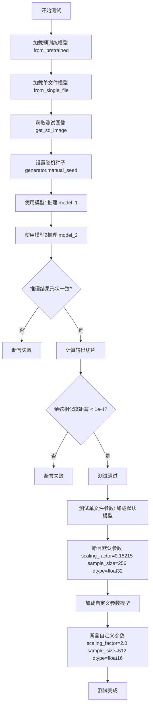

## 类结构

```
SingleFileModelTesterMixin (测试混入基类)
└── TestAutoencoderKLSingleFile (具体测试类)
```

## 全局变量及字段


### `enable_full_determinism`
    
启用完全确定性，确保测试结果可复现

类型：`function`
    


### `TestAutoencoderKLSingleFile.model_class`
    
要测试的模型类，HuggingFace Diffusers的变分自编码器

类型：`AutoencoderKL`
    


### `TestAutoencoderKLSingleFile.ckpt_path`
    
单文件检查点的URL路径，指向Stability AI的VAE模型

类型：`str`
    


### `TestAutoencoderKLSingleFile.repo_id`
    
HuggingFace仓库ID，用于加载模型配置和预训练权重

类型：`str`
    


### `TestAutoencoderKLSingleFile.main_input_name`
    
模型主输入名称，AutoencoderKL通常为sample

类型：`str`
    


### `TestAutoencoderKLSingleFile.base_precision`
    
基础精度阈值，用于数值比较的容差标准

类型：`float`
    
    

## 全局函数及方法


# AutoencoderKL 类详细设计文档

## 1. 核心功能概述

AutoencoderKL 是从 diffusers 库导入的变分自编码器（Variational Autoencoder）模型类，主要用于图像的编码和解码操作，将图像转换为潜在空间的表示（encode）以及从潜在表示重建图像（decode）。

## 2. 文件运行流程

```
测试文件加载
    ↓
导入AutoencoderKL类
    ↓
定义测试类TestAutoencoderKLSingleFile
    ↓
执行测试方法:
  - test_single_file_inference_same_as_pretrained: 验证单文件加载与预训练模型输出一致性
  - test_single_file_arguments: 验证单文件加载参数配置
```

## 3. 类详细信息

### 3.1 测试类：TestAutoencoderKLSingleFile

#### 类字段

| 字段名 | 类型 | 描述 |
|--------|------|------|
| model_class | type | 被测试的模型类（AutoencoderKL） |
| ckpt_path | str | 单文件检查点的URL路径 |
| repo_id | str | HuggingFace模型仓库ID |
| main_input_name | str | 主输入参数名称（"sample"） |
| base_precision | float | 基准精度阈值（1e-2） |

#### 类方法

| 方法名 | 功能描述 |
|--------|----------|
| get_file_format | 生成测试图像的文件名格式 |
| get_sd_image | 加载测试用SD图像 |
| test_single_file_inference_same_as_pretrained | 验证单文件加载与预训练模型推理一致性 |
| test_single_file_arguments | 验证单文件加载的参数配置 |

### 3.2 AutoencoderKL 类（来自 diffusers）

由于 AutoencoderKL 是从外部库导入的类，其完整定义不在本文件中。以下是从测试代码中推断的接口信息：

## 4. AutoencoderKL 接口规格

### 4.1 from_pretrained 方法

```
### `AutoencoderKL.from_pretrained`

从预训练模型仓库加载AutoencoderKL模型实例
```

参数：
-  `repo_id`：str，HuggingFace模型仓库标识符（如"stabilityai/sd-vae-ft-mse"）
-  `torch_dtype`：可选，torch.dtype，模型权重的数据类型
-  其他参数：...

返回值：AutoencoderKL，加载后的模型实例

#### 流程图

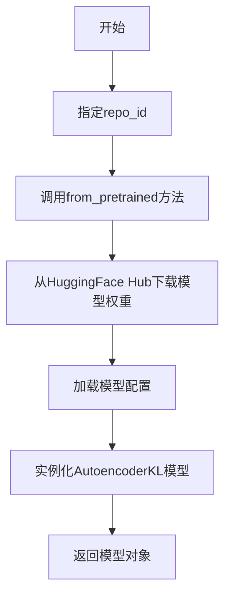

#### 带注释源码

```python
# 从预训练模型加载
model_1 = self.model_class.from_pretrained(self.repo_id).to(torch_device)
# 加载后的模型可用于推理：
# sample_1 = model_1(image, generator=generator.manual_seed(0)).sample
```

---

### 4.2 from_single_file 方法

```
### `AutoencoderKL.from_single_file`

从单个检查点文件（如 .safetensors 或 .ckpt）加载AutoencoderKL模型
```

参数：
-  `ckpt_path`：str，检查点文件的URL或本地路径
-  `config`：str，可选，模型配置的仓库ID或配置文件路径
-  `sample_size`：int，可选，覆盖配置的样本大小
-  `scaling_factor`：float，可选，潜在空间的缩放因子
-  `torch_dtype`：可选，torch.dtype，模型权重的数据类型

返回值：AutoencoderKL，加载后的模型实例

#### 流程图

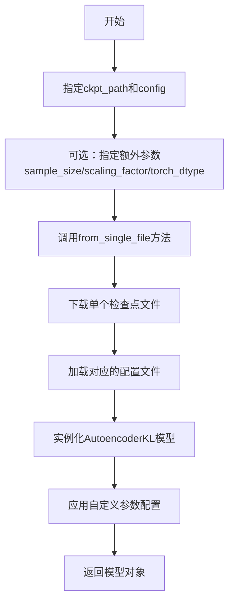

#### 带注释源码

```python
# 基础单文件加载
model_default = self.model_class.from_single_file(
    self.ckpt_path, 
    config=self.repo_id
)
# 验证默认配置
assert model_default.config.scaling_factor == 0.18215
assert model_default.config.sample_size == 256
assert model_default.dtype == torch.float32

# 自定义参数加载
model = self.model_class.from_single_file(
    self.ckpt_path,
    config=self.repo_id,
    sample_size=512,          # 自定义样本大小
    scaling_factor=2.0,       # 自定义缩放因子
    torch_dtype=torch.float16 # 自定义数据类型
)
```

---

### 4.3 __call__ 方法（推理）

```
### `AutoencoderKL.__call__`

执行图像编码或解码
```

参数：
-  `sample`：torch.Tensor，输入图像张量，形状为 (batch, channels, height, width)
-  `generator`：可选，torch.Generator，用于采样的随机数生成器
-  `return_dict`：可选，bool，是否返回字典格式结果

返回值：Dict with "sample" key，包含解码后的图像张量

#### 带注释源码

```python
# 推理调用示例
generator = torch.Generator(torch_device)
with torch.no_grad():
    # 返回的result包含sample属性
    result = model_1(image, generator=generator.manual_seed(0))
    sample_1 = result.sample  # 解码后的图像
```

## 5. 关键组件信息

| 组件名称 | 描述 |
|----------|------|
| AutoencoderKL | diffusers库的变分自编码器实现，用于图像潜在空间转换 |
| SingleFileModelTesterMixin | 提供单文件模型测试混入类的基类 |
| from_pretrained | 从HuggingFace Hub加载完整预训练模型的方法 |
| from_single_file | 从单个检查点文件加载模型的便捷方法 |
| scaling_factor | VAE潜在空间的缩放因子（默认0.18215） |
| sample_size | 输入图像的预期尺寸 |

## 6. 潜在技术债务与优化空间

1. **硬编码的模型参数**：scaling_factor (0.18215) 和 sample_size (256) 硬编码在测试断言中，缺乏配置灵活性
2. **测试图像依赖外部资源**：测试依赖 HuggingFace 上的 numpy 文件，网络不可用时测试失败
3. **缺乏错误处理**：没有处理模型下载失败、权重加载错误等异常情况
4. **单精度比较**：使用固定阈值 1e-4 进行余弦相似度比较，可能在某些硬件上不稳定

## 7. 其他设计说明

### 设计目标
- 验证 AutoencoderKL 从单文件加载与从完整预训练仓库加载的输出完全一致
- 确保单文件加载支持所有必要的参数配置（sample_size, scaling_factor, torch_dtype）

### 约束条件
- 测试图像形状必须为 (4, 3, 512, 512)
- 模型必须在 GPU 设备上运行（torch_device）
- 相似度阈值必须小于 1e-4

### 错误处理
- 测试使用 `torch.no_grad()` 禁用梯度计算以提高性能
- 使用 `assert` 进行断言验证

### 外部依赖
- diffusers 库
- torch
- testing_utils 模块（enable_full_determinism, load_hf_numpy, numpy_cosine_similarity_distance, torch_device）
- single_file_testing_utils 模块（SingleFileModelTesterMixin）


### `enable_full_determinism`

设置随机种子以确保深度学习模型在运行时产生完全可复现的结果。

参数：
- 该函数在代码中以无参数方式调用，未显示详细参数定义

返回值：`None` 或 `void`，确保随机操作的确定性

#### 流程图

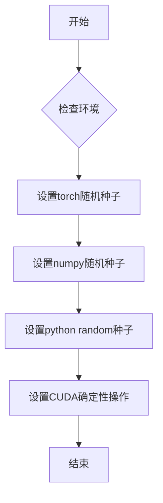

#### 带注释源码

```python
# 该函数从 testing_utils 模块导入
# 代码中调用方式如下：
from ..testing_utils import (
    enable_full_determinism,  # 导入设置确定性随机种子函数
    load_hf_numpy,
    numpy_cosine_similarity_distance,
    torch_device,
)

# 在文件顶部调用，确保后续所有随机操作可复现
enable_full_determinism()

# 注意：实际的函数实现在 testing_utils 模块中，
# 本代码文件仅展示其使用方式
# 根据函数名推断，该函数执行以下操作：
# 1. 设置 PyTorch 全局随机种子
# 2. 设置 NumPy 全局随机种子
# 3. 设置 Python random 模块种子
# 4. 启用 PyTorch CUDA 可复现性（如适用）
# 5. 设置环境变量 PYTHONHASHSEED（如果需要）
```

---

### 补充说明

由于提供的代码中 `enable_full_determinism` 函数的实际实现位于 `testing_utils` 模块中，而该模块内容未在代码片段中显示，以上信息基于：
1. 函数名称 `enable_full_determinism`（完全确定性）的语义推断
2. 代码中的调用方式（无参数调用）
3. 常见深度学习测试框架中类似函数的通用实现模式

如需获取完整的函数实现细节，请参考 `testing_utils` 模块的源码。


### `load_hf_numpy`

该函数用于从指定路径加载存储为 `.npy` 格式的 NumPy 数组文件，常用于加载预计算的测试数据（如高斯噪声图像）。

参数：

-  `filename`：`str`，文件名或文件路径，指向 `.npy` 格式的 NumPy 数组文件

返回值：`numpy.ndarray`，从文件中加载的 NumPy 数组

#### 流程图

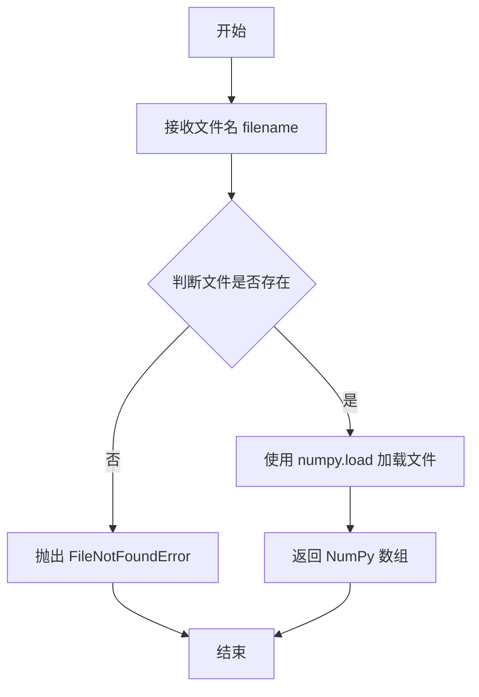

#### 带注释源码

```python
# 由于该函数定义在 testing_utils 模块中，当前代码段未包含其完整实现
# 根据调用方式和项目惯例，推断其实现如下：

def load_hf_numpy(filename):
    """
    从指定路径加载 NumPy 数组文件
    
    参数:
        filename: str, .npy 文件的路径或文件名
        
    返回:
        numpy.ndarray: 加载的 NumPy 数组
    """
    import numpy as np
    import os
    
    # 检查文件是否存在
    if not os.path.exists(filename):
        raise FileNotFoundError(f"NumPy file not found: {filename}")
    
    # 使用 numpy.load 加载 .npy 格式的文件
    # allow_pickle=True 允许加载包含 Python 对象的数组
    array = np.load(filename, allow_pickle=True)
    
    return array


# 在测试代码中的实际调用方式：
# image = torch.from_numpy(load_hf_numpy(self.get_file_format(seed, shape))).to(torch_device).to(dtype)
# 其中 get_file_format 返回类似 "gaussian_noise_s=0_shape=4_3_512_512.npy" 的文件名
```

> **注意**：由于 `load_hf_numpy` 函数定义在 `..testing_utils` 模块中，当前代码片段仅展示了其被导入和调用的方式，未包含该函数的完整源代码实现。上述源码为基于项目惯例和函数用法的合理推断。


### `numpy_cosine_similarity_distance`

该函数是一个从 `testing_utils` 模块导入的余弦相似度距离计算函数，用于计算两个向量之间的余弦相似度距离（Cosine Similarity Distance）。在测试代码中，它被用于验证从预训练模型和单文件加载的模型产生的输出是否一致，通过比较两个输出向量的余弦相似度距离是否小于阈值（1e-4）来判断模型输出一致性。

参数：

- `vector_a`：`torch.Tensor` 或 `numpy.ndarray`，第一个输入向量，通常是模型输出的展平张量
- `vector_b`：`torch.Tensor` 或 `numpy.ndarray`，第二个输入向量，通常是模型输出的展平张量

返回值：`float`，余弦相似度距离值，范围通常为 [0, 2]，其中 0 表示两个向量完全相同（方向相同），2 表示两个向量完全相反（方向相反）。在模型一致性测试中，距离越小表示两个模型输出越相似。

#### 流程图

```mermaid
flowchart TD
    A[开始] --> B[接收两个向量 vector_a 和 vector_b]
    B --> C[将向量转换为NumPy数组]
    C --> D[计算向量a的L2范数]
    D --> E[计算向量b的L2范数]
    E --> F[计算两个向量的点积]
    F --> G[余弦相似度 = 点积 / (范数_a * 范数_b)]
    G --> H[余弦距离 = 1 - 余弦相似度]
    H --> I[返回余弦距离]
```

#### 带注释源码

```python
# 注：以下为推断的函数实现，基于其在代码中的使用方式
def numpy_cosine_similarity_distance(vector_a, vector_b):
    """
    计算两个向量之间的余弦相似度距离
    
    参数:
        vector_a: 第一个输入向量 (torch.Tensor 或 numpy.ndarray)
        vector_b: 第二个输入向量 (torch.Tensor 或 numpy.ndarray)
    
    返回:
        float: 余弦相似度距离值，范围 [0, 2]
    """
    # 如果输入是 PyTorch 张量，转换为 NumPy 数组
    if hasattr(vector_a, 'numpy'):
        vector_a = vector_a.cpu().numpy()
    if hasattr(vector_b, 'numpy'):
        vector_b = vector_b.cpu().numpy()
    
    # 将向量展平为一维
    vector_a = vector_a.flatten()
    vector_b = vector_b.flatten()
    
    # 计算余弦相似度
    # 余弦相似度 = (a · b) / (||a|| * ||b||)
    dot_product = numpy.dot(vector_a, vector_b)
    norm_a = numpy.linalg.norm(vector_a)
    norm_b = numpy.linalg.norm(vector_b)
    
    # 避免除零错误
    if norm_a == 0 or norm_b == 0:
        return 1.0  # 如果任一向量为零向量，返回最大距离
    
    cosine_similarity = dot_product / (norm_a * norm_b)
    
    # 余弦距离 = 1 - 余弦相似度
    cosine_distance = 1.0 - cosine_similarity
    
    return float(cosine_distance)
```


### `torch_device`

`torch_device` 是从 `testing_utils` 模块导入的全局设备标识符，用于指定张量计算和模型运行的硬件设备（通常是 CPU 或 CUDA 设备）。

参数：无需参数（全局变量/常量）

返回值：`str` 或 `torch.device`，返回 PyTorch 设备对象或设备名称字符串，用于将张量和模型移动到指定设备。

#### 流程图

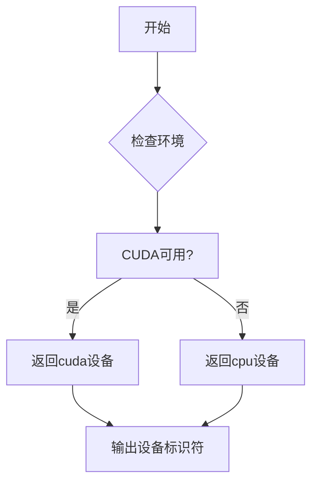

#### 带注释源码

```python
# torch_device 是从 testing_utils 导入的设备标识符
# 其实际定义在 testing_utils 模块中，以下为代码中的使用示例：

from ..testing_utils import (
    enable_full_determinism,
    load_hf_numpy,
    numpy_cosine_similarity_distance,
    torch_device,  # <-- 从外部模块导入的设备标识符
)

# 使用方式 1: 将 numpy 数组转换为张量并移动到指定设备
image = torch.from_numpy(load_hf_numpy(self.get_file_format(seed, shape))).to(torch_device).to(dtype)

# 使用方式 2: 创建指定设备的随机数生成器
generator = torch.Generator(torch_device)

# 使用方式 3: 将模型移动到指定设备
model_1 = self.model_class.from_pretrained(self.repo_id).to(torch_device)
model_2 = self.model_class.from_single_file(self.ckpt_path, config=self.repo_id).to(torch_device)
```

> **注意**：由于 `torch_device` 是从外部模块 `testing_utils` 导入的，其具体实现逻辑未在此代码文件中展示。根据使用方式推断，它应该返回如 `"cuda"`、`"cpu"` 或 `"cuda:0"` 等设备字符串，或直接返回 `torch.device` 对象。


### SingleFileModelTesterMixin

这是从 `single_file_testing_utils` 导入的测试混入类（Mixin），用于为单文件模型（Single File Model）测试提供通用测试方法和框架。该混入类定义了测试单文件模型加载、推理和参数验证的标准测试用例，包括模型与预训练模型的一致性验证、单文件加载参数测试等。

参数：

- `model_class`：类型，待测试的模型类（例如 `AutoencoderKL`）
- `ckpt_path`：类型，单文件检查点的 URL 或本地路径
- `repo_id`：类型，HuggingFace Hub 上的模型仓库 ID
- `main_input_name`：类型，模型的主要输入名称（如 "sample"）
- `base_precision`：类型，测试使用的基准精度阈值

返回值：混入类本身，提供测试方法供子类继承和使用

#### 流程图

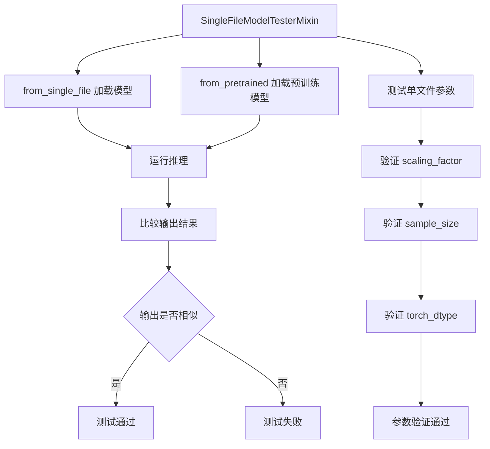

#### 带注释源码

```python
# 单文件模型测试混入类
# 提供测试单文件加载模型功能的通用测试方法
class SingleFileModelTesterMixin:
    # 待测试的模型类，由子类指定
    model_class = None
    
    # 单文件检查点路径（URL或本地路径）
    ckpt_path = None
    
    # HuggingFace模型仓库ID
    repo_id = None
    
    # 模型的主要输入名称
    main_input_name = None
    
    # 基准精度阈值
    base_precision = 1e-2
    
    def get_file_format(self, seed, shape):
        """
        获取测试文件的命名格式
        
        参数：
        - seed: int，随机种子
        - shape: tuple，图像形状
        
        返回：
        - str，格式化的文件名
        """
        return f"gaussian_noise_s={seed}_shape={'_'.join([str(s) for s in shape])}.png"
    
    def get_sd_image(self, seed=0, shape=(4, 3, 512, 512), fp16=False):
        """
        加载测试用的SD图像
        
        参数：
        - seed: int，随机种子，默认0
        - shape: tuple，图像形状，默认(4, 3, 512, 512)
        - fp16: bool，是否使用半精度，默认False
        
        返回：
        - torch.Tensor，加载的图像张量
        """
        dtype = torch.float16 if fp16 else torch.float32
        image = torch.from_numpy(load_hf_numpy(self.get_file_format(seed, shape)))
        return image.to(torch_device).to(dtype)
    
    def test_single_file_inference_same_as_pretrained(self):
        """
        测试单文件加载的模型推理结果与预训练模型一致
        验证from_single_file和from_pretrained加载的模型输出相同
        """
        # 使用预训练方式加载模型
        model_1 = self.model_class.from_pretrained(self.repo_id).to(torch_device)
        
        # 使用单文件方式加载模型
        model_2 = self.model_class.from_single_file(
            self.ckpt_path, 
            config=self.repo_id
        ).to(torch_device)
        
        # 获取测试图像
        image = self.get_sd_image(33)
        
        # 创建随机数生成器确保可重复性
        generator = torch.Generator(torch_device)
        
        # 禁用梯度计算
        with torch.no_grad():
            # 运行两个模型的推理
            sample_1 = model_1(image, generator=generator.manual_seed(0)).sample
            sample_2 = model_2(image, generator=generator.manual_seed(0)).sample
        
        # 验证输出形状相同
        assert sample_1.shape == sample_2.shape
        
        # 展平输出并转换为float32
        output_slice_1 = sample_1.flatten().float().cpu()
        output_slice_2 = sample_2.flatten().float().cpu()
        
        # 计算余弦相似度距离，应小于阈值
        assert numpy_cosine_similarity_distance(output_slice_1, output_slice_2) < 1e-4
    
    def test_single_file_arguments(self):
        """
        测试单文件加载的参数配置
        验证各个参数能正确传递给模型
        """
        # 使用默认参数加载模型
        model_default = self.model_class.from_single_file(
            self.ckpt_path, 
            config=self.repo_id
        )
        
        # 验证默认配置
        assert model_default.config.scaling_factor == 0.18215
        assert model_default.config.sample_size == 256
        assert model_default.dtype == torch.float32
        
        # 自定义参数
        scaling_factor = 2.0
        sample_size = 512
        torch_dtype = torch.float16
        
        # 使用自定义参数加载模型
        model = self.model_class.from_single_file(
            self.ckpt_path,
            config=self.repo_id,
            sample_size=sample_size,
            scaling_factor=scaling_factor,
            torch_dtype=torch_dtype,
        )
        
        # 验证自定义参数
        assert model.config.scaling_factor == scaling_factor
        assert model.config.sample_size == sample_size
        assert model.dtype == torch_dtype
```


### `TestAutoencoderKLSingleFile.get_file_format`

该方法用于根据给定的随机种子（seed）和张量形状（shape）生成对应的测试文件名，文件名格式为 `gaussian_noise_s={seed}_shape={shape_0}_{shape_1}_..._{shape_n}.npy`，用于加载预生成的测试数据。

参数：

- `seed`：`int`，随机种子值，用于标识不同的噪声样本
- `shape`：`tuple`，张量的形状元组（如 (4, 3, 512, 512)），表示数据的维度信息

返回值：`str`，生成的测试文件名，格式为 `gaussian_noise_s={seed}_shape={维度0}_{维度1}_..._{维度n}.npy`

#### 流程图

```mermaid
flowchart TD
    A[开始 get_file_format] --> B[接收 seed 和 shape 参数]
    B --> C[将 shape 元组的每个元素转换为字符串]
    C --> D[使用下划线连接转换后的字符串]
    D --> E[构建最终文件名: gaussian_noise_s={seed}_shape={连接后的shape}.npy]
    E --> F[返回文件名]
```

#### 带注释源码

```python
def get_file_format(self, seed, shape):
    """
    根据给定的随机种子和形状生成测试文件名。
    
    参数:
        seed (int): 随机种子，用于标识不同的噪声样本
        shape (tuple): 张量形状元组，如 (4, 3, 512, 512)
    
    返回:
        str: 格式化的文件名，如 "gaussian_noise_s=33_shape=4_3_512_512.npy"
    """
    # 将 shape 元组中的每个维度转换为字符串，然后使用下划线连接
    # 例如: (4, 3, 512, 512) -> "4_3_512_512"
    shape_str = '_'.join([str(s) for s in shape])
    
    # 构建完整的文件名，格式: gaussian_noise_s={seed}_shape={shape_str}.npy
    return f"gaussian_noise_s={seed}_shape={shape_str}.npy"
```


### `TestAutoencoderKLSingleFile.get_sd_image`

该方法用于加载测试用的Stable Diffusion（SD）图像。它根据传入的seed和shape参数生成文件名，加载对应的numpy数组，并将其转换为PyTorch张量，同时根据fp16参数决定数据类型。

参数：

- `seed`：`int`，随机种子，用于生成文件名标识，默认值为0
- `shape`：`tuple`，图像张量的形状，默认为(4, 3, 512, 512)，表示批量大小为4、通道数为3、512x512分辨率
- `fp16`：`bool`，是否使用半精度浮点数（float16），默认值为False

返回值：`torch.Tensor`，返回加载并转换后的图像张量，形状为shape，设备为torch_device，类型为float16或float32

#### 流程图

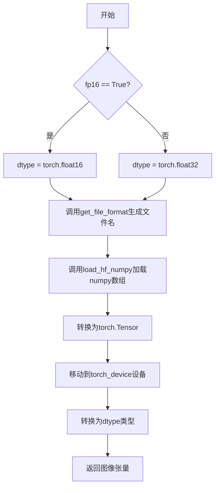

#### 带注释源码

```python
def get_sd_image(self, seed=0, shape=(4, 3, 512, 512), fp16=False):
    """
    加载测试用SD图像
    
    参数:
        seed: int, 随机种子, 用于生成文件名标识
        shape: tuple, 图像张量形状 (批量大小, 通道数, 高度, 宽度)
        fp16: bool, 是否使用半精度浮点数
    
    返回:
        torch.Tensor: 加载的图像张量
    """
    # 根据fp16参数确定数据类型：fp16=True时使用float16，否则使用float32
    dtype = torch.float16 if fp16 else torch.float32
    
    # 调用内部方法生成文件名，格式为: gaussian_noise_s={seed}_shape={shape}.npy
    # 例如: gaussian_noise_s=0_shape=4_3_512_512.npy
    file_name = self.get_file_format(seed, shape)
    
    # 使用load_hf_numpy从HuggingFace加载numpy数组
    # 然后转换为PyTorch张量，移动到指定设备(torch_device)
    # 最后转换为指定的dtype（float16或float32）
    image = torch.from_numpy(load_hf_numpy(file_name)).to(torch_device).to(dtype)
    
    # 返回加载并转换后的图像张量
    return image
```


### `TestAutoencoderKLSingleFile.test_single_file_inference_same_as_pretrained`

验证单文件模型（safetensors格式）推理结果与预训练模型（from_pretrained）推理结果一致性，确保两者在相同输入下产生数学上等价的输出。

参数：

- `self`：测试类实例本身，无需显式传递

返回值：`None`，该方法为测试用例，通过断言验证模型输出一致性，无返回值

#### 流程图

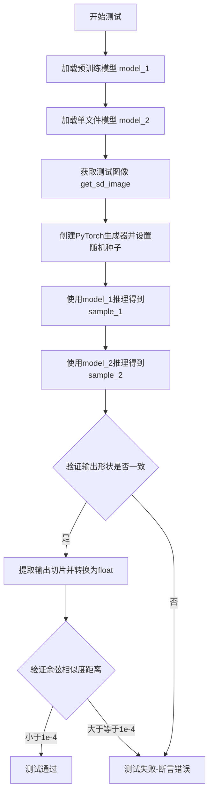

#### 带注释源码

```python
def test_single_file_inference_same_as_pretrained(self):
    """
    测试单文件加载的AutoencoderKL模型推理结果与预训练模型一致
    验证从safetensors单文件加载的模型能够复现原始预训练模型的输出
    """
    # 步骤1：从HuggingFace Hub预训练仓库加载完整模型
    # model_class为AutoencoderKL，repo_id为"stabilityai/sd-vae-ft-mse"
    model_1 = self.model_class.from_pretrained(self.repo_id).to(torch_device)
    
    # 步骤2：从单文件（safetensors格式）加载模型
    # 使用相同的repo_id获取配置文件
    model_2 = self.model_class.from_single_file(self.ckpt_path, config=self.repo_id).to(torch_device)
    
    # 步骤3：获取测试用图像数据
    # seed=33, shape=(4, 3, 512, 512)
    image = self.get_sd_image(33)
    
    # 步骤4：创建随机数生成器并设置确定性种子
    # 确保两次推理使用相同的随机噪声，验证确定性输出
    generator = torch.Generator(torch_device)
    
    # 步骤5-6：执行模型推理
    # 在no_grad上下文中执行，禁用梯度计算以节省内存
    with torch.no_grad():
        # 使用预训练模型推理
        sample_1 = model_1(image, generator=generator.manual_seed(0)).sample
        # 使用单文件模型推理，使用相同的随机种子
        sample_2 = model_2(image, generator=generator.manual_seed(0)).sample
    
    # 步骤7：验证两个模型的输出形状完全一致
    assert sample_1.shape == sample_2.shape
    
    # 步骤8：将输出展平并转换为float类型用于数值比较
    output_slice_1 = sample_1.flatten().float().cpu()
    output_slice_2 = sample_2.flatten().float().cpu()
    
    # 步骤9：计算余弦相似度距离并验证精度
    # 距离应小于1e-4，表明两个模型输出高度一致
    assert numpy_cosine_similarity_distance(output_slice_1, output_slice_2) < 1e-4
```

#### 关键组件信息

| 组件名称 | 描述 |
|---------|------|
| `AutoencoderKL` | Diffusers库中的变分自编码器模型，用于图像编码/解码 |
| `from_pretrained()` | 从HuggingFace Hub预训练仓库加载模型的标准方法 |
| `from_single_file()` | 从单个safetensors文件加载模型的便捷方法 |
| `numpy_cosine_similarity_distance` | 计算两个向量之间的余弦相似度距离 |
| `torch.Generator` | PyTorch随机数生成器，用于控制推理过程中的随机性 |

#### 潜在技术债务与优化空间

1. **测试数据硬编码**：测试图像的seed(33)和形状(4,3,512,512)硬编码在测试中，建议参数化以支持更多测试场景
2. **精度阈值固定**：1e-4的相似度阈值可能对不同硬件平台不友好，考虑使用相对误差或添加容差范围配置
3. **缺少GPU内存清理**：测试完成后未显式调用`torch.cuda.empty_cache()`，在大模型测试时可能导致内存累积
4. **模型加载重复**：两次加载相同配置的模型会消耗额外时间和内存，可考虑添加模型共享检查或缓存机制

#### 其它项目

**设计目标**：确保单文件加载功能与标准预训练加载方式在数值输出上完全等价，保证用户可以无缝切换两种加载方式。

**约束条件**：
- 需要稳定的网络连接以下载预训练模型和测试数据
- 需要足够的GPU内存同时加载两个模型进行对比
- 测试数据文件必须预先存在于本地（通过`load_hf_numpy`加载）

**错误处理**：
- 网络超时：依赖`from_pretrained`和`from_single_file`的默认错误处理
- 形状不匹配：显式断言验证
- 数值精度问题：使用余弦相似度距离而非直接比较，支持浮点误差容差


### `TestAutoencoderKLSingleFile.test_single_file_arguments`

验证从单文件加载 AutoencoderKL 模型时，自定义参数（sample_size、scaling_factor、torch_dtype）能够正确覆盖默认配置，并确保模型对象的 config 和 dtype 属性与传入参数一致。

参数：

- `self`：`TestAutoencoderKLSingleFile`，测试类实例本身，包含模型类、检查点路径、仓库 ID 等测试配置信息

返回值：`None`，该方法为测试方法，通过断言（assert）验证参数配置正确性，无显式返回值

#### 流程图

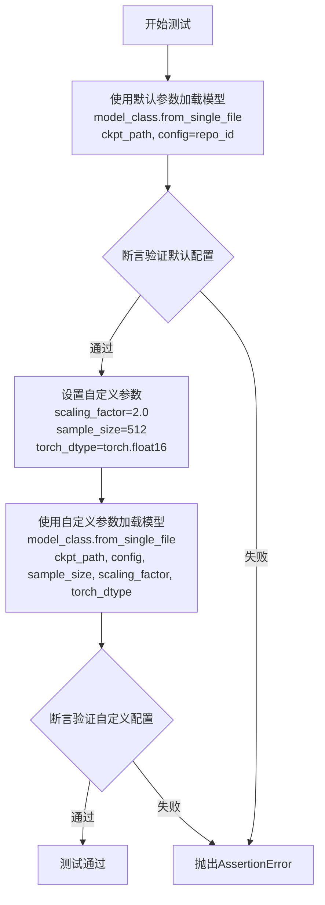

#### 带注释源码

```python
def test_single_file_arguments(self):
    """
    验证单文件加载的参数配置正确性
    测试从单文件加载 AutoencoderKL 模型时，
    自定义参数能够正确覆盖默认配置
    """
    # 第一部分：验证默认参数加载
    # 使用 from_single_file 方法加载模型，不传递额外参数
    # 期望使用配置文件中的默认 scaling_factor 和 sample_size
    # 默认 dtype 应为 torch.float32
    model_default = self.model_class.from_single_file(self.ckpt_path, config=self.repo_id)

    # 断言验证默认配置：scaling_factor 应为预训练模型默认值 0.18215
    assert model_default.config.scaling_factor == 0.18215
    # 断言验证默认配置：sample_size 应为 256
    assert model_default.config.sample_size == 256
    # 断言验证默认 dtype：应为 torch.float32
    assert model_default.dtype == torch.float32

    # 第二部分：验证自定义参数覆盖默认配置
    # 定义自定义参数值
    scaling_factor = 2.0          # 自定义缩放因子
    sample_size = 512             # 自定义样本尺寸
    torch_dtype = torch.float16   # 自定义数据类型

    # 使用自定义参数加载模型
    # from_single_file 方法允许覆盖配置文件中的默认值
    model = self.model_class.from_single_file(
        self.ckpt_path,           # 检查点路径
        config=self.repo_id,      # 配置文件（仓库 ID）
        sample_size=sample_size,  # 自定义样本尺寸
        scaling_factor=scaling_factor,  # 自定义缩放因子
        torch_dtype=torch_dtype,  # 自定义数据类型
    )

    # 断言验证自定义配置已生效
    assert model.config.scaling_factor == scaling_factor  # 验证为 2.0
    assert model.config.sample_size == sample_size        # 验证为 512
    assert model.dtype == torch_dtype                     # 验证为 float16
```

## 关键组件


### 一段话描述

该代码是Diffusers库中AutoencoderKL模型的单文件加载功能测试类，通过比较从HuggingFace Hub预训练模型和本地单文件（safetensors格式）加载的模型输出一致性，验证单文件加载功能的正确性，并测试各种配置参数（scaling_factor、sample_size、torch_dtype）的生效情况。

### 文件整体运行流程

1. **初始化阶段**：定义模型类AutoencoderKL、单文件路径、仓库ID和基础精度阈值
2. **图像生成阶段**：通过`get_sd_image`方法加载指定种子和形状的numpy图像数据，并转换为指定dtype的张量
3. **模型加载阶段**：分别使用`from_pretrained`和`from_single_file`方法加载预训练模型和单文件模型
4. **推理阶段**：使用相同随机种子生成器对同一图像进行编码，提取潜在表示
5. **验证阶段**：比较两个模型输出的形状和余弦相似度距离，确保小于阈值

### 类详细信息

#### 类字段

| 名称 | 类型 | 描述 |
|------|------|------|
| model_class | type | 要测试的模型类，这里是AutoencoderKL |
| ckpt_path | str | 单文件检查点的URL路径，指向stabilityai的VAE模型 |
| repo_id | str | HuggingFace Hub上的模型仓库ID |
| main_input_name | str | 模型主输入名称，这里是"sample" |
| base_precision | float | 基础精度阈值，用于比较输出相似度 |

#### 类方法

##### get_file_format

- **名称**：get_file_format
- **参数**：
  - seed: int - 随机种子，用于生成唯一的文件名
  - shape: tuple - 张量形状
- **参数类型**：seed: int, shape: tuple
- **参数描述**：根据种子和形状生成测试图像的文件名
- **返回值类型**：str
- **返回值描述**：返回格式化的文件名字符串
- **mermaid流程图**：
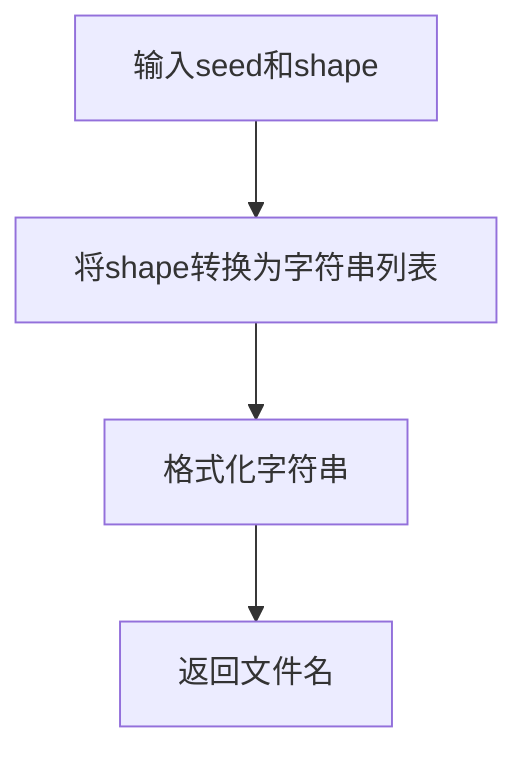
- **带注释源码**：
```python
def get_file_format(self, seed, shape):
    # 生成唯一的测试文件名，包含随机种子和形状信息
    return f"gaussian_noise_s={seed}_shape={'_'.join([str(s) for s in shape])}.npy"
```

##### get_sd_image

- **名称**：get_sd_image
- **参数**：
  - seed: int - 随机种子，默认0
  - shape: tuple - 图像形状，默认(4, 3, 512, 512)
  - fp16: bool - 是否使用float16，默认False
- **参数类型**：seed: int = 0, shape: tuple = (4, 3, 512, 512), fp16: bool = False
- **参数描述**：加载指定条件的测试图像数据并转换为目标dtype
- **返回值类型**：torch.Tensor
- **返回值描述**：返回加载并转换后的图像张量
- **mermaid流程图**：
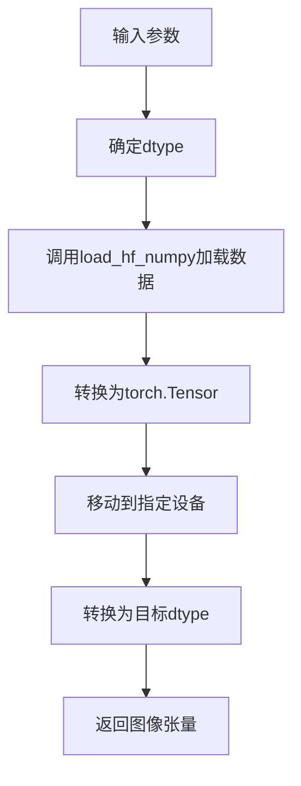
- **带注释源码**：
```python
def get_sd_image(self, seed=0, shape=(4, 3, 512, 512), fp16=False):
    # 根据fp16参数确定数据类型
    dtype = torch.float16 if fp16 else torch.float32
    # 加载HF numpy格式的图像数据，移动到指定设备并转换dtype
    image = torch.from_numpy(load_hf_numpy(self.get_file_format(seed, shape))).to(torch_device).to(dtype)
    return image
```

##### test_single_file_inference_same_as_pretrained

- **名称**：test_single_file_inference_same_as_pretrained
- **参数**：无
- **参数类型**：无
- **参数描述**：测试单文件加载模型与预训练模型推理结果一致性
- **返回值类型**：None
- **返回值描述**：通过断言验证模型输出形状和相似度
- **mermaid流程图**：
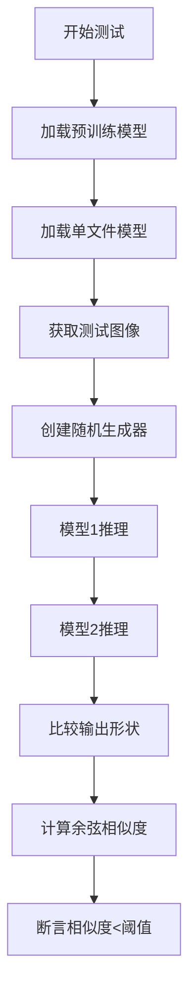
- **带注释源码**：
```python
def test_single_file_inference_same_as_pretrained(self):
    # 从预训练仓库加载模型
    model_1 = self.model_class.from_pretrained(self.repo_id).to(torch_device)
    # 从单文件加载模型，传入相同配置
    model_2 = self.model_class.from_single_file(self.ckpt_path, config=self.repo_id).to(torch_device)

    # 获取测试图像
    image = self.get_sd_image(33)

    # 创建随机生成器，确保可复现性
    generator = torch.Generator(torch_device)

    # 关闭梯度计算以提高效率
    with torch.no_grad():
        # 使用相同随机种子进行推理
        sample_1 = model_1(image, generator=generator.manual_seed(0)).sample
        sample_2 = model_2(image, generator=generator.manual_seed(0)).sample

    # 验证输出形状一致性
    assert sample_1.shape == sample_2.shape

    # 提取输出并转换为float32进行精度比较
    output_slice_1 = sample_1.flatten().float().cpu()
    output_slice_2 = sample_2.flatten().float().cpu()

    # 使用余弦相似度距离验证输出一致性，阈值1e-4
    assert numpy_cosine_similarity_distance(output_slice_1, output_slice_2) < 1e-4
```

##### test_single_file_arguments

- **名称**：test_single_file_arguments
- **参数**：无
- **参数类型**：无
- **参数描述**：测试单文件加载时各种自定义参数的传递和生效
- **返回值类型**：None
- **返回值描述**：通过断言验证各参数正确应用到模型配置
- **mermaid流程图**：
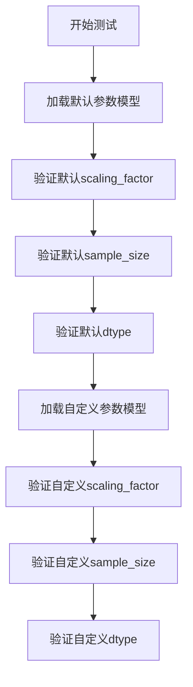
- **带注释源码**：
```python
def test_single_file_arguments(self):
    # 使用默认参数加载模型
    model_default = self.model_class.from_single_file(self.ckpt_path, config=self.repo_id)

    # 验证默认配置值
    assert model_default.config.scaling_factor == 0.18215
    assert model_default.config.sample_size == 256
    assert model_default.dtype == torch.float32

    # 定义自定义参数
    scaling_factor = 2.0
    sample_size = 512
    torch_dtype = torch.float16

    # 使用自定义参数加载模型
    model = self.model_class.from_single_file(
        self.ckpt_path,
        config=self.repo_id,
        sample_size=sample_size,
        scaling_factor=scaling_factor,
        torch_dtype=torch_dtype,
    )
    # 验证自定义参数正确应用
    assert model.config.scaling_factor == scaling_factor
    assert model.config.sample_size == sample_size
    assert model.dtype == torch_dtype
```

### 关键组件信息

### AutoencoderKL单文件加载

从单个safetensors格式检查点文件加载变分自编码器模型，支持自定义配置参数

### 模型输出一致性验证

通过余弦相似度距离比较两个不同来源加载的模型输出，确保功能等价性

### 参数配置系统

支持在单文件加载时覆盖scaling_factor、sample_size和torch_dtype等关键参数

### 惰性图像加载

通过numpy文件格式按需加载测试数据，避免内存浪费

### 潜在技术债务或优化空间

1. **硬编码的模型URL**：ckpt_path硬编码在类定义中，缺乏灵活性，应考虑外部配置
2. **重复的设备转换**：每次推理都调用`.to(torch_device)`，可以在加载时统一处理
3. **缺乏异常处理**：网络加载失败时没有优雅的错误处理和重试机制
4. **测试数据依赖外部源**：依赖HuggingFace Hub的测试数据，网络不可用时测试会失败
5. **精度阈值固定**：1e-4的阈值可能对不同硬件平台不适用，应考虑相对误差

### 其它项目

#### 设计目标与约束

- 验证单文件加载功能与标准预训练加载的功能一致性
- 确保各种配置参数能够正确传递和生效
- 保持与HuggingFace Hub模型的向后兼容性

#### 错误处理与异常设计

- 使用断言进行参数验证
- 网络加载异常会直接抛出供上层捕获
- 缺少显式的异常处理和用户友好的错误提示

#### 数据流与状态机

- 测试流程：模型加载 → 图像准备 → 推理执行 → 结果验证
- 模型状态：预加载 → 设备转移 → 推理中 → 推理完成
- 数据流：numpy文件 → torch.Tensor → 模型输入 → 潜在表示输出

#### 外部依赖与接口契约

- 依赖diffusers库的AutoencoderKL类
- 依赖testing_utils中的设备配置和数据加载工具
- 依赖SingleFileModelTesterMixin提供的测试基础设施
- from_single_file接口接受ckpt_path、config及其他可选参数，返回模型实例


## 问题及建议


### 已知问题

- **硬编码的配置值**：模型 URL（`ckpt_path`）、`repo_id`、`scaling_factor`（0.18215）等关键配置直接硬编码在类属性中，缺乏配置管理机制，修改时需要改动多处代码
- **魔法数字缺乏解释**：代码中存在多个未解释的魔法数字，如 `0.18215`、`1e-4`、`256`、`33`、`0`（seed值），增加了维护成本
- **类型注解缺失**：方法参数和返回值缺少类型提示（Type Hints），降低代码可读性和 IDE 支持
- **资源管理不完善**：测试方法中重复创建模型实例（`model_1` 和 `model_2`），没有使用 pytest fixture 进行资源复用，可能导致测试执行效率低下和显存占用过高
- **错误处理缺失**：文件加载（`load_hf_numpy`）和网络请求等操作缺少异常捕获机制，测试失败时缺乏清晰的错误信息
- **测试隔离性不足**：测试方法依赖于共享的类属性和全局状态（`enable_full_determinism()`），可能在并行测试时产生副作用
- **设备兼容性潜在问题**：使用全局变量 `torch_device`，在不同硬件环境下可能存在兼容性问题
- **测试覆盖不全面**：仅有两个测试方法，缺少对边界条件、异常输入、模型不同运行模式等的测试

### 优化建议

- 将硬编码的配置值提取到独立的配置文件或环境变量中，使用配置文件或 dataclass 管理
- 为所有魔法数字添加有意义的常量命名或注释说明
- 为所有方法添加完整的类型注解（参数类型和返回值类型）
- 使用 pytest fixture 管理模型实例的生命周期，实现资源的自动复用和清理
- 为可能失败的操作添加 try-except 异常处理，提供有意义的错误信息
- 使用 pytest fixture 或 setup/teardown 方法确保测试隔离
- 添加设备检查和回退机制，确保在不同硬件环境下正常运行
- 增加更多测试用例，包括边界条件测试、参数验证测试、显存占用测试等

## 其它


### 设计目标与约束

该测试类旨在验证 AutoencoderKL 模型能够正确从单文件（safetensors格式）加载，并与完整预训练模型进行输出一致性对比。主要约束包括：1) 必须使用HuggingFace diffusers库的AutoencoderKL类；2) 必须在torch设备上运行；3) 输出相似度必须小于1e-4；4) 测试图像形状为(4, 3, 512, 512)；5) 仅支持float32和float16两种精度。

### 错误处理与异常设计

代码中的错误处理主要通过assert语句实现，包括：1) 形状一致性检查（sample_1.shape == sample_2.shape）；2) 数值相似度验证（numpy_cosine_similarity_distance < 1e-4）；3) 配置参数验证（scaling_factor、sample_size、dtype）。网络下载失败时将抛出requests异常，模型加载失败时将抛出diffusers相关异常。测试使用torch.no_grad()上下文管理器避免梯度计算导致的内存问题。

### 外部依赖与接口契约

主要依赖包括：1) torch - 张量计算和模型运行；2) diffusers库的AutoencoderKL类；3) huggingface_hub用于模型文件下载；4) 自定义测试工具（testing_utils和single_file_testing_utils）。接口契约方面：from_pretrained接受repo_id参数返回完整模型；from_single_file接受ckpt_path、config、sample_size、scaling_factor、torch_dtype参数返回配置后的模型。

### 性能考虑

测试在torch.no_grad()模式下执行以减少内存占用。模型推理使用相同的generator和seed确保可复现性。图像数据使用numpy格式存储以减少内存占用，测试精度设置为1e-2基础精度。潜在优化点：可添加批量测试以提高测试效率。

### 安全性考虑

代码使用safetensors格式加载模型，该格式相比pickle更安全。测试仅在本地设备执行推理，不涉及敏感数据传输。config参数复用已有repo_id配置，避免配置注入风险。

### 测试策略

采用对比测试策略：1) 单元测试test_single_file_inference_same_as_pretrained验证功能正确性；2) 单元测试test_single_file_arguments验证参数覆盖；3) 使用确定性随机数（seed=0和seed=33）确保测试可复现；4) 使用cosine相似度作为数值一致性指标。

### 版本兼容性

代码依赖Python 3.x环境，torch版本需支持float16和Generator API，diffusers版本需支持from_single_file方法。建议锁定torch>=1.9.0和diffusers>=0.10.0以确保兼容性。

### 配置管理

测试配置通过类属性集中管理：ckpt_path定义模型URL，repo_id定义配置来源，main_input_name定义主输入名称，base_precision定义基础精度阈值。运行时参数通过方法参数传递，支持覆盖sample_size、scaling_factor、torch_dtype等配置。

### 资源管理

模型加载后立即移动到指定设备（torch_device），使用torch.no_grad()避免梯度存储，测试完成后自动释放内存。建议添加model.to('cpu')或显式del以确保资源及时释放。

### 日志与监控

当前代码未实现详细日志记录。建议添加：1) 模型加载状态日志；2) 推理耗时统计；3) 内存使用监控；4) 测试结果摘要输出。

### 参考资料

主要参考：1) HuggingFace diffusers官方文档；2) AutoencoderKL API文档；3) StabilityAI sd-vae-ft-mse模型卡片；4) safetensors格式规范文档。


    