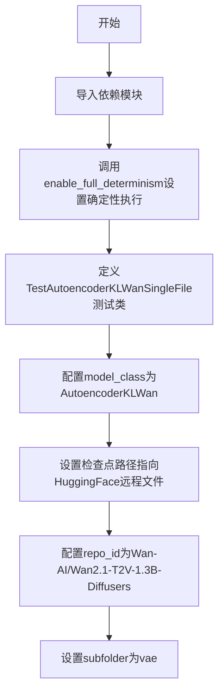
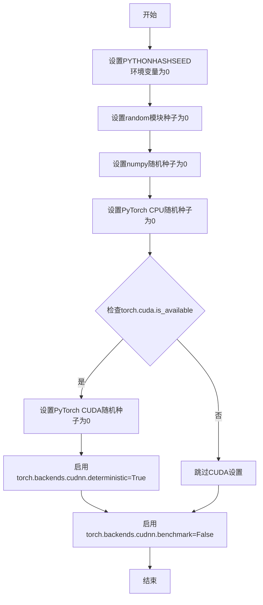

# `diffusers\tests\single_file\test_model_wan_autoencoder_single_file.py` 详细设计文档

这是一个用于测试AutoencoderKLWan模型单文件加载的测试类，继承自SingleFileModelTesterMixin，用于验证Wan 2.1 VAE模型从HuggingFace Hub单文件检查点（safetensors格式）加载的功能

## 整体流程



## 类结构

```
SingleFileModelTesterMixin (抽象基类/测试Mixin)
└── TestAutoencoderKLWanSingleFile (具体测试类)
```

## 全局变量及字段


### `TestAutoencoderKLWanSingleFile.model_class`
    
测试所使用的模型类

类型：`AutoencoderKLWan`
    


### `TestAutoencoderKLWanSingleFile.ckpt_path`
    
HuggingFace远程检查点文件URL

类型：`str`
    


### `TestAutoencoderKLWanSingleFile.repo_id`
    
模型仓库ID

类型：`str`
    


### `TestAutoencoderKLWanSingleFile.subfolder`
    
模型子文件夹路径

类型：`str`
    
    

## 全局函数及方法


### `enable_full_determinism`

启用完全确定性以确保测试可复现，通过设置随机种子、CUDA 确定性计算和环境变量，消除由于非确定性操作（如 cuDNN 自动调优）导致的测试结果差异。

参数：无

返回值：无

#### 流程图



#### 带注释源码

```
def enable_full_determinism(seed: int = 0, extra_seed: bool = False):
    """
    启用完全确定性以确保测试可复现
    
    参数:
        seed: int, 随机种子值，默认为0
        extra_seed: bool, 是否设置额外的随机种子标志
    """
    # 设置Python哈希种子，确保Python内置随机函数的可复现性
    os.environ["PYTHONHASHSEED"] = str(seed)
    
    # 设置random模块的随机种子
    random.seed(seed)
    
    # 设置NumPy的随机种子
    np.random.seed(seed)
    
    # 设置PyTorch CPU的随机种子
    torch.manual_seed(seed)
    
    # 如果使用CUDA，设置GPU随机种子
    if torch.cuda.is_available():
        torch.cuda.manual_seed(seed)
        torch.cuda.manual_seed_all(seed)  # 设置所有GPU的种子
    
    # 强制使用确定性算法，确保每次运行时计算结果相同
    # 代价是可能牺牲一定的计算性能
    torch.backends.cudnn.deterministic = True
    
    # 禁用cuDNN自动调优，每次使用固定的卷积算法
    # 这对于确保可复现性至关重要
    torch.backends.cudnn.benchmark = False
    
    # 设置PyTorch内部的其他确定性配置
    torch.use_deterministic_algorithms(True, warn_only=True)
    
    # 根据extra_seed标志设置额外的环境变量
    if extra_seed:
        os.environ["CUBLAS_WORKSPACE_CONFIG"] = ":4096:8"
```


## 关键组件


### TestAutoencoderKLWanSingleFile

继承自SingleFileModelTesterMixin的测试类，用于测试Wan 2.1 VAE模型的单文件加载功能，验证从HuggingFace Hub下载的safetensors格式模型权重能否正确加载到AutoencoderKLWan模型中。

### AutoencoderKLWan

来自diffusers库的Wan 2.1 VAE（变分自编码器）模型类，用于图像/视频的编码和解码，支持从单个safetensors文件加载预训练权重。

### SingleFileModelTesterMixin

测试混入类，提供了单文件模型加载的通用测试逻辑，包括模型初始化、权重加载验证和一致性检查等测试方法。

### enable_full_determinism

测试工具函数，启用PyTorch的完全确定性模式，确保测试结果可复现，通过设置随机种子和环境变量CUDA_LEGACY_DETERMINISTIC。

### ckpt_path

模型检查点URL配置，指向HuggingFace Hub上Wan 2.1 VAE模型的safetensors文件地址，用于单文件模型加载测试。

### repo_id

HuggingFace模型仓库标识符，指向Wan-AI/Wan2.1-T2V-1.3B-Diffusers仓库，用于定位模型资源和元数据。

### subfolder

模型子文件夹路径配置，指定VAE模型在仓库中的相对路径为"vae"，用于构建完整的模型加载路径。


## 问题及建议


### 已知问题

-   **硬编码的模型路径和配置**：`ckpt_path`（HuggingFace URL）、`repo_id`、`subfolder` 均采用硬编码方式，缺乏灵活性，无法适应不同环境或配置需求
-   **缺乏错误处理机制**：代码中未包含任何异常捕获或错误处理逻辑，网络请求、模型加载失败等场景无降级或提示
-   **模块级副作用**：`enable_full_determinism()` 在模块导入时即执行，影响全局随机性，可能对其他并行测试产生不可预期的影响
-   **测试类实现不完整**：仅定义了类属性，未实现具体测试方法，依赖 `SingleFileModelTesterMixin` 提供测试逻辑，但该 mixin 未在此文件中展示，增加了代码理解和维护难度
-   **缺少类型注解**：类属性和方法均无类型标注，降低了代码的可读性和静态检查工具的效用
-   **配置与实现耦合**：模型配置信息直接写在类内部，不利于配置复用或动态调整

### 优化建议

-   将 `ckpt_path`、`repo_id`、`subfolder` 等配置提取至配置文件、环境变量或测试fixture中，实现配置与代码分离
-   添加网络请求超时处理、模型加载异常捕获等错误处理逻辑，提升测试健壮性
-   考虑将 `enable_full_determinism` 移至测试fixture或 `setUp` 方法中执行，避免全局副作用
-   补充必要的类型注解，使用 `typing` 模块标注属性和方法参数类型
-   明确 `SingleFileModelTesterMixin` 的依赖关系，在注释中说明其提供的测试方法列表
-   评估是否需要添加测试用例超时机制，防止单文件测试因网络问题导致测试挂起


## 其它


### 设计目标与约束

本测试模块的核心目标是通过 SingleFileModelTesterMixin 提供的通用单文件模型测试框架，验证 AutoencoderKLWan 模型能否正确从 HuggingFace Hub 远程加载 .safetensors 格式的预训练权重并成功实例化。设计约束包括：必须使用指定的 Wan 2.1 VAE 检查点 URL、目标仓库为 Wan-AI/Wan2.1-T2V-1.3B-Diffusers 且子文件夹为 vae、依赖 diffusers 库的 AutoencoderKLWan 实现、仅支持 Python 3.8+ 环境。

### 错误处理与异常设计

代码本身未显式处理异常，错误传播依赖父类 SingleFileModelTesterMixin 的实现。预期异常场景包括：网络连接失败导致 ckpt_path 不可达、仓库 ID 或子文件夹路径错误、safetensors 文件损坏、AutoencoderKLWan 类接口不兼容当前 diffusers 版本。父类测试框架应捕获 HTTPError、OSError、ValueError 等异常并提供有意义的测试失败信息。

### 外部依赖与接口契约

主要外部依赖为 diffusers 库中的 AutoencoderKLWanWan 类以及 ..testing_utils 模块中的 enable_full_determinism 函数。接口契约要求传入的 model_class 必须继承自必要的基类、ckpt_path 必须为有效的 HTTP/HTTPS URL 或本地路径、repo_id 和 subfolder 用于标识模型仓库位置。测试通过后应返回被实例化的模型对象供后续验证使用。

### 性能考虑与基准测试

由于涉及远程模型权重下载，测试性能主要受网络带宽和延迟影响。建议在 CI/CD 环境中添加超时控制机制（建议 300 秒）、实现检查点缓存策略以加速重复测试、考虑使用镜像站点或本地副本进行离线测试。内存占用取决于 AutoencoderKLWan 模型大小，VAE 模型通常在 100-500MB 范围内。

### 安全考虑

代码从远程 URL 加载模型权重，存在潜在安全风险。建议：验证下载文件的完整性（SHA256 校验）、使用 HTTPS 确保传输安全、避免加载不受信任的检查点、对 safetensors 格式进行安全解析以防止恶意构造的文件。enable_full_determinism 调用可能影响随机数生成，需注意其对其他测试的副作用。

### 版本兼容性

代码依赖 diffusers 库，AutoencoderKLWanWan 类可能在不同版本间存在 API 变化。需要明确声明支持的 diffusers 版本范围（建议 >= 0.30.0）、定期更新以兼容最新版本、测试脚本应记录当前环境的库版本信息。建议在 requirements.txt 或 pyproject.toml 中锁定依赖版本。

### 配置管理

测试配置通过类属性集中管理：model_class 指定模型类、ckpt_path 定义检查点 URL、repo_id 和 subfolder 指定模型仓库位置。可考虑将敏感配置（ 如自定义 URL）抽取至环境变量或配置文件，支持通过 pytest 参数化实现多配置测试。

### 资源清理与生命周期管理

测试完成后应释放模型资源和网络连接。diffusers 的 AutoencoderKLWan 实例应在测试方法结束后被垃圾回收。若涉及 GPU 显存占用，需显式调用清理方法（如 del model; torch.cuda.empty_cache()）。enable_full_determinism 的全局影响应在测试套件级别进行隔离或重置。

    