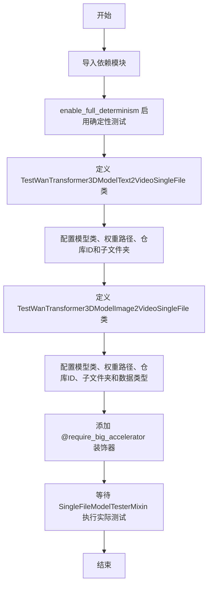
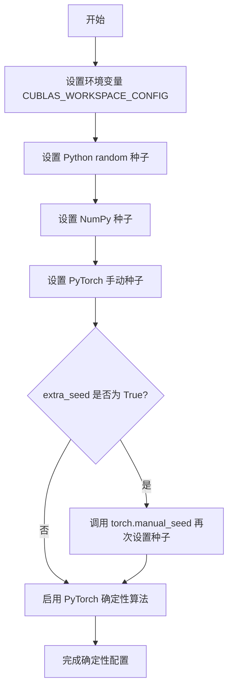
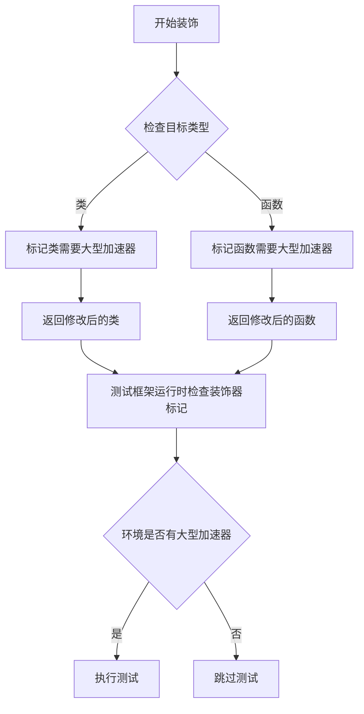
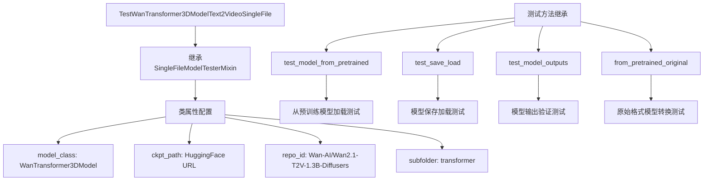
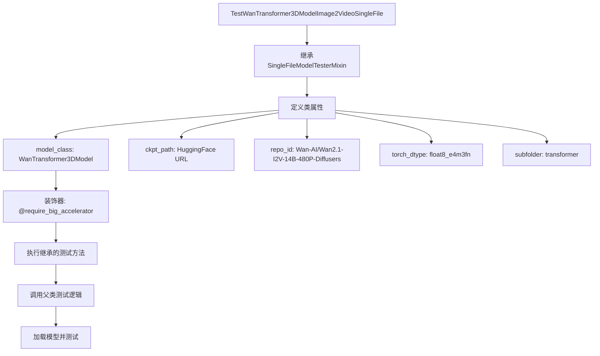

# `diffusers\tests\single_file\test_model_wan_transformer3d_single_file.py` 详细设计文档

该代码是一个测试模块，用于测试WanTransformer3DModel的单文件加载和推理功能，包含文本到视频(Text2Video)和图像到视频(I2V)两个测试场景，支持从HuggingFace下载模型权重进行测试验证。

## 整体流程



## 类结构

```
SingleFileModelTesterMixin (测试基类)
├── TestWanTransformer3DModelText2VideoSingleFile
└── TestWanTransformer3DModelImage2VideoSingleFile
```

## 全局变量及字段


### `enable_full_determinism`
    
启用完全确定性测试的函数，来自testing_utils模块

类型：`function`
    


### `TestWanTransformer3DModelText2VideoSingleFile.TestWanTransformer3DModelText2VideoSingleFile.model_class`
    
Wan Transformer 3D模型类，用于文本到视频生成

类型：`type[WanTransformer3DModel]`
    


### `TestWanTransformer3DModelText2VideoSingleFile.TestWanTransformer3DModelText2VideoSingleFile.ckpt_path`
    
模型权重文件的HTTPS URL路径，指向HuggingFace上的 safetensors 格式权重

类型：`str`
    


### `TestWanTransformer3DModelText2VideoSingleFile.TestWanTransformer3DModelText2VideoSingleFile.repo_id`
    
HuggingFace模型仓库的唯一标识符，格式为 '组织名/模型名'

类型：`str`
    


### `TestWanTransformer3DModelText2VideoSingleFile.TestWanTransformer3DModelText2VideoSingleFile.subfolder`
    
模型在仓库中的子文件夹路径，此处为 'transformer'

类型：`str`
    


### `TestWanTransformer3DModelImage2VideoSingleFile.TestWanTransformer3DModelImage2VideoSingleFile.model_class`
    
Wan Transformer 3D模型类，用于图像到视频生成

类型：`type[WanTransformer3DModel]`
    


### `TestWanTransformer3DModelImage2VideoSingleFile.TestWanTransformer3DModelImage2VideoSingleFile.ckpt_path`
    
模型权重文件的HTTPS URL路径，指向HuggingFace上的 fp8 精度 safetensors 权重

类型：`str`
    


### `TestWanTransformer3DModelImage2VideoSingleFile.TestWanTransformer3DModelImage2VideoSingleFile.repo_id`
    
HuggingFace模型仓库的唯一标识符，指向图像到视频14B参数模型

类型：`str`
    


### `TestWanTransformer3DModelImage2VideoSingleFile.TestWanTransformer3DModelImage2VideoSingleFile.torch_dtype`
    
PyTorch数据类型，此处为 float8_e4m3fn 用于FP8推理优化

类型：`torch.dtype`
    


### `TestWanTransformer3DModelImage2VideoSingleFile.TestWanTransformer3DModelImage2VideoSingleFile.subfolder`
    
模型在仓库中的子文件夹路径，此处为 'transformer'

类型：`str`
    
    

## 全局函数及方法


### `enable_full_determinism`

该函数用于启用完全确定性的测试配置，通过统一设置 Python、NumPy、PyTorch 等库的随机种子以及配置 CUDA 的确定性算法，确保测试结果可复现。

参数：

- `seed`：`int`，可选，默认值为 `42`，全局随机种子，用于初始化所有随机数生成器。
- `extra_seed`：`bool`，可选，默认值为 `False`，是否启用额外的随机种子以覆盖更多底层库的不确定性行为。

返回值：`None`，该函数不返回任何值，仅执行全局状态配置。

#### 流程图



#### 带注释源码

```python
def enable_full_determinism(seed: int = 42, extra_seed: bool = False):
    """
    启用完全确定性测试配置。

    该函数通过统一设置 Python 标准库、NumPy 和 PyTorch 的随机种子，
    并配置 CUDA 的确定性模式，确保测试结果在不同环境下可复现。

    参数:
        seed (int): 全局随机种子，默认 42。
        extra_seed (bool): 是否额外设置一次种子以覆盖更多不确定性来源，默认 False。
    """
    import os
    import random
    import numpy as np
    import torch

    # 1. 配置 CUDA 运行环境，确保 cuBLAS 使用确定性算法
    os.environ["CUBLAS_WORKSPACE_CONFIG"] = ":4096:8"

    # 2. 设置 Python 内置 random 模块的种子
    random.seed(seed)

    # 3. 设置 NumPy 的全局随机种子
    np.random.seed(seed)

    # 4. 设置 PyTorch 的 CPU 全局随机种子
    torch.manual_seed(seed)

    # 5. 如果 extra_seed 为 True，再次设置一次种子以覆盖更多库
    if extra_seed:
        torch.manual_seed(torch.initial_seed())

    # 6. 启用 PyTorch 的确定性算法模式，强制使用确定性实现
    #    warn_only=True 表示在不支持确定性操作的算子上给出警告而非报错
    torch.use_deterministic_algorithms(True, warn_only=True)
```


### `require_big_accelerator`

这是一个测试装饰器，用于标记需要大型加速器（如高性能GPU）的测试用例。被装饰的测试类将仅在满足特定硬件条件的CI环境中运行。

参数：

-  `func`：被装饰的类或函数对象，需要装饰的目标

返回值：装饰后的类或函数对象，应用装饰器后的版本

#### 流程图



#### 带注释源码

```python
# 这是一个装饰器，从 testing_utils 模块导入
# 用于标记测试用例需要大型加速器（如高性能GPU）才能运行
from ..testing_utils import (
    enable_full_determinism,
    require_big_accelerator,  # 导入装饰器
)
from .single_file_testing_utils import SingleFileModelTesterMixin


# 启用完全确定性，确保测试可重复性
enable_full_determinism()


# 不需要大型加速器的测试类
class TestWanTransformer3DModelText2VideoSingleFile(SingleFileModelTesterMixin):
    """文本到视频模型单文件测试，无特殊硬件要求"""
    model_class = WanTransformer3DModel
    ckpt_path = "https://huggingface.co/Comfy-Org/Wan_2.1_ComfyUI_repackaged/blob/main/split_files/diffusion_models/wan2.1_t2v_1.3B_bf16.safetensors"
    repo_id = "Wan-AI/Wan2.1-T2V-1.3B-Diffusers"
    subfolder = "transformer"


# 使用 require_big_accelerator 装饰器标记
# 该测试需要大型加速器（如高性能GPU）才能运行
# 通常用于大型模型（如14B参数模型）的测试
@require_big_accelerator
class TestWanTransformer3DModelImage2VideoSingleFile(SingleFileModelTesterMixin):
    """图像到视频模型单文件测试，需要大型GPU"""
    model_class = WanTransformer3DModel
    # 14B参数的FP8模型，需要大量显存
    ckpt_path = "https://huggingface.co/Comfy-Org/Wan_2.1_ComfyUI_repackaged/blob/main/split_files/diffusion_models/wan2.1_i2v_480p_14B_fp8_e4m3fn.safetensors"
    repo_id = "Wan-AI/Wan2.1-I2V-14B-480P-Diffusers"
    torch_dtype = torch.float8_e4m3fn  # 使用FP8精度以减少显存占用
    subfolder = "transformer"
```

---

## 补充信息

### 关键组件信息

| 组件名称 | 一句话描述 |
|---------|-----------|
| `require_big_accelerator` | 测试装饰器，标记需要大型GPU的测试用例 |
| `TestWanTransformer3DModelText2VideoSingleFile` | 文本到视频模型测试类，无需特殊硬件 |
| `TestWanTransformer3DModelImage2VideoSingleFile` | 图像到视频模型测试类，需要大型GPU |
| `SingleFileModelTesterMixin` | 单文件模型测试混入类，提供通用测试方法 |
| `WanTransformer3DModel` | Wan 3D变换器模型类 |

### 潜在技术债务

1. **硬编码的模型路径**：模型URL和repo_id直接写在类中，缺乏配置管理机制
2. **装饰器实现未知**：`require_big_accelerator`的具体实现逻辑不可见，可能存在隐式依赖
3. **测试配置分散**：不同测试类的配置（torch_dtype等）分散在类属性中，缺乏统一管理

### 设计目标与约束

- **设计目标**：支持Wan系列模型的单文件测试框架，允许区分需要不同硬件条件的测试用例
- **硬件约束**：`@require_big_accelerator`标记的测试需要高性能GPU（如A100 80GB或更高）
- **精度选择**：14B模型使用`torch.float8_e4m3fn`以在有限显存下运行


### TestWanTransformer3DModelText2VideoSingleFile

这是一个用于测试Wan Transformer 3D模型文本转视频（Text-to-Video）功能的测试类，继承自SingleFileModelTesterMixin，提供了对Wan2.1-T2V-1.3B-Diffusers模型的单文件测试能力。

#### 类属性信息

- `model_class`：`WanTransformer3DModel`，指定被测试的模型类
- `ckpt_path`：`str`，模型检查点的URL路径，指向HuggingFace上的safetensors文件
- `repo_id`：`str`，模型仓库ID，值为"Wan-AI/Wan2.1-T2V-1.3B-Diffusers"
- `subfolder`：`str`，模型子文件夹路径，值为"transformer"

#### 继承自SingleFileModelTesterMixin的方法（主要方法）

由于TestWanTransformer3DModelText2VideoSingleFile类本身未显式定义任何方法，以下方法均继承自SingleFileModelTesterMixin：

参数：无（构造函数使用类属性配置）

返回值：无

#### 流程图



#### 带注释源码

```python
# 测试Wan Transformer 3D模型文本转视频功能的测试类
class TestWanTransformer3DModelText2VideoSingleFile(SingleFileModelTesterMixin):
    """
    测试类：Wan Transformer 3D模型 Text-to-Video 单文件测试
    
    该测试类用于验证Wan2.1-T2V-1.3B模型从单文件检查点
    加载并正常工作的能力。继承自SingleFileModelTesterMixin
    提供了完整的模型测试框架。
    """
    
    # 指定被测试的模型类为WanTransformer3DModel
    model_class = WanTransformer3DModel
    
    # 模型检查点的远程URL（safetensors格式）
    ckpt_path = "https://huggingface.co/Comfy-Org/Wan_2.1_ComfyUI_repackaged/blob/main/split_files/diffusion_models/wan2.1_t2v_1.3B_bf16.safetensors"
    
    # 模型在HuggingFace上的仓库ID
    repo_id = "Wan-AI/Wan2.1-T2V-1.3B-Diffusers"
    
    # 模型文件所在的子文件夹
    subfolder = "transformer"
```

#### 潜在的技术债务或优化空间

1. **缺少显式测试方法**：当前类仅继承自SingleFileModelTesterMixin，没有自定义任何测试方法，建议根据具体需求添加自定义测试用例
2. **硬编码的URL和路径**：模型URL和仓库ID硬编码在类属性中，建议抽取到配置文件或环境变量
3. **缺乏错误处理**：没有针对网络下载失败、模型版本不兼容等情况的异常处理

#### 关键组件信息

| 组件名称 | 描述 |
|---------|------|
| WanTransformer3DModel | Wan 3D变换器模型类，被测试的核心模型 |
| SingleFileModelTesterMixin | 单文件模型测试混入类，提供测试框架方法 |
| ckpt_path | 模型检查点远程URL |
| repo_id | HuggingFace模型仓库标识 |
| subfolder | 模型子目录路径 |

#### 外部依赖与接口契约

- **依赖**：torch、diffusers库、WanTransformer3DModel类
- **接口**：继承SingleFileModelTesterMixin的全部测试接口
- **约束**：需要@require_big_accelerator装饰器（同类中的TestWanTransformer3DModelImage2VideoSingleFile需要）


### `TestWanTransformer3DModelImage2VideoSingleFile`

这是一个用于测试Wan Transformer 3D模型图像转视频（Image-to-Video）功能的测试类，继承自SingleFileModelTesterMixin mixin类。该类定义了模型类、检查点路径、仓库ID、torch数据类型和子文件夹等配置，用于在大型加速器上执行模型的单文件测试。

父类：`SingleFileModelTesterMixin`

参数：

该类没有显式的__init__方法参数，继承自父类的初始化逻辑。

-  `self`：隐式参数，表示类的实例

返回值：该类本身没有显式的返回值，它是一个测试类定义，用于后续通过pytest或其他测试框架执行继承自父类的测试方法。

#### 类字段信息

-  `model_class`：类型`type`，WanTransformer3DModel模型类
-  `ckpt_path`：类型`str`， HuggingFace Hub上的检查点文件URL路径，指向wan2.1_i2v_480p_14B_fp8_e4m3fn.safetensors文件
-  `repo_id`：类型`str`， 模型仓库ID，为"Wan-AI/Wan2.1-I2V-14B-480P-Diffusers"
-  `torch_dtype`：类型`torch.dtype`， 使用torch.float8_e4m3fn数据类型（FP8 E4M3格式）
-  `subfolder`：类型`str`， 子文件夹路径，为"transformer"

#### 继承的方法

由于该类仅继承自SingleFileModelTesterMixin而未重写任何方法，所有测试方法均继承自父类。典型的继承方法包括：

- `test_model_attributes`：测试模型属性
- `test_model_from_pretrained`：测试从预训练模型加载
- `test_save_load`：测试模型保存和加载
- 其他SingleFileModelTesterMixin中定义的测试方法

#### 流程图



#### 带注释源码

```python
# 导入所需的装饰器，用于要求大型加速器才能运行此测试
@require_big_accelerator
class TestWanTransformer3DModelImage2VideoSingleFile(SingleFileModelTesterMixin):
    """
    测试Wan Transformer 3D模型图像转视频功能的测试类
    
    该类继承自SingleFileModelTesterMixin，提供了单文件模型测试的通用测试方法。
    使用FP8精度（float8_e4m3fn）进行测试，适用于14B参数的图像转视频模型。
    """
    
    # 指定要测试的模型类为WanTransformer3DModel
    model_class = WanTransformer3DModel
    
    # 检查点文件的HuggingFace Hub URL，指向480p 14B FP8模型
    ckpt_path = "https://huggingface.co/Comfy-Org/Wan_2.1_ComfyUI_repackaged/blob/main/split_files/diffusion_models/wan2.1_i2v_480p_14B_fp8_e4m3fn.safetensors"
    
    # 模型在HuggingFace上的仓库ID
    repo_id = "Wan-AI/Wan2.1-I2V-14B-480P-Diffusers"
    
    # 使用FP8 E4M3格式的torch数据类型，以减少显存占用
    torch_dtype = torch.float8_e4m3fn
    
    # 模型子文件夹路径
    subfolder = "transformer"
```

#### 关键组件信息

- **WanTransformer3DModel**：Wan 3D变换器模型类，用于图像到视频的生成
- **SingleFileModelTesterMixin**：单文件模型测试的mixin类，提供标准的模型测试方法
- **@require_big_accelerator**：装饰器，标记该测试需要大型加速器（如高性能GPU）才能运行

#### 潜在的技术债务或优化空间

1. **硬编码的URL和配置**：检查点路径和仓库ID直接硬编码在类中，可以考虑使用配置文件或环境变量
2. **缺乏错误处理**：如果检查点下载失败或模型加载失败，没有明确的错误处理机制
3. **测试粒度**：由于所有测试方法都继承自父类，可能无法针对Image2Video的特定功能进行细粒度测试
4. **数据类型限制**：固定使用FP8数据类型，可能不适用于所有测试场景

#### 其它说明

- **设计目标**：验证Wan Transformer 3D模型在图像转视频任务上的单文件加载和推理能力
- **约束**：需要大型加速器（通过@require_big_accelerator装饰器标记）
- **外部依赖**：依赖HuggingFace Hub上的预训练模型检查点，需要网络连接
- **测试执行**：该类由pytest或unittest框架自动发现并执行继承的测试方法


## 关键组件


### WanTransformer3DModel

WanTransformer3DModel是Wan 2.1文本到视频和图像到视频扩散模型的核心Transformer类，用于处理3D时空注意力机制的扩散变换器模型。

### SingleFileModelTesterMixin

测试mixin类，提供单文件模型加载和测试的基础设施，支持从HuggingFace Hub或本地路径加载模型权重。

### enable_full_determinism

全局配置函数，启用PyTorch的完全确定性模式，确保测试结果可复现，通过设置torch.use_deterministic_algorithms等实现。

### require_big_accelerator

装饰器函数，标记需要大型GPU加速器（如多GPU或高显存设备）才能运行的测试用例，用于跳过资源不足环境下的测试。

### torch.float8_e4m3fn

float8_e4m3fn量化类型，用于模型权重的FP8量化存储，E4M3格式提供更高的精度范围，适合推理加速和内存节省。

### ckpt_path (模型检查点路径)

远程模型权重文件路径，指向HuggingFace上的safetensors格式模型权重，支持从URL直接加载。

### repo_id (模型仓库ID)

HuggingFace Hub上的模型仓库标识符，用于标识和定位模型资源。

### subfolder (子文件夹)

模型在仓库中的子目录路径，用于指定transformer组件的具体位置。

### 张量索引与惰性加载

通过SingleFileModelTesterMixin实现，仅在需要时按需加载模型权重，避免一次性将整个模型加载到内存。

### 反量化支持

通过torch.float8_e4m3fn量化类型实现，在推理时将FP8量化权重反量化为计算所需的精度。

### 量化策略

采用FP8 E4M3FN量化方案，在保持模型精度的同时减少显存占用和加速推理。


## 问题及建议


### 已知问题

-   **硬编码的模型路径和配置**：模型URL（ckpt_path）、repo_id、subfolder等配置直接硬编码在类属性中，缺乏灵活性，无法通过环境变量或配置文件动态注入，导致在不同环境部署时需要修改源码
-   **缺少错误处理机制**：未对网络请求失败、模型下载中断、模型文件损坏等异常情况进行捕获和处理；未对torch.float8_e4m3fn dtype在不同硬件上的兼容性进行检查
-   **测试覆盖不完整**：仅定义了测试类但未包含实际测试用例（无test_方法），无法验证模型加载的正确性和完整性；缺少对模型参数校验、推理功能、输出形状的验证
-   **魔法数字和字符串缺乏解释**：版本号（如"1.3B"、"14B"）、分辨率（如"480p"）等关键配置以字符串形式硬编码，缺乏常量定义和注释说明
-   **类型注解和文档缺失**：类和方法均无类型注解、无docstring，降低了代码可读性和可维护性
-   **重复配置冗余**：两个测试类中model_class和subfolder配置完全相同，存在代码重复，未通过继承或配置类进行复用
-   **隐式依赖未显式声明**：依赖的SingleFileModelTesterMixin实现未知，enable_full_determinism函数的具体行为不明确，测试类继承关系和执行流程不透明

### 优化建议

-   将模型路径、repo_id等配置抽取到独立的配置文件（如yaml或json）或环境变量中，使用配置类统一管理，支持不同环境差异化配置
-   添加try-except块处理网络异常、文件校验失败等场景；使用torch.cuda.is_available()和torch.cuda.get_device_capability()检查float8 dtype兼容性
-   在测试类中实现具体的test方法，涵盖模型加载、参数验证、推理测试、输出shape检查等场景；添加@pytest.mark.parametrize实现参数化测试
-   定义配置常量类或枚举，将版本号、分辨率等magic string提取为具名常量，并添加注释说明其含义和来源
-   为类添加类级别docstring描述测试目的；为关键方法添加参数和返回值类型注解；为复杂逻辑添加行内注释说明
-   创建一个基类或配置类封装公共配置（model_class、subfolder等），让具体测试类继承实现差异化配置，减少代码重复
-   在文件开头或README中明确列出所有隐式依赖及其版本要求；在测试类中添加对mixin方法的文档说明或引用链接


## 其它


### 设计目标与约束

本测试文件旨在验证WanTransformer3DModel模型从单文件safetensors格式加载的兼容性和正确性。设计目标包括：支持Text2Video和Image2Video两种模型变体的测试、确保不同精度（bf16和fp8）的模型加载能力、验证与HuggingFace Diffusers库的集成。约束条件包括：Image2Video测试需要大型加速器支持、依赖网络访问HuggingFace Hub下载模型权重、仅支持transformer子模块的单文件测试。

### 错误处理与异常设计

当模型加载失败时应抛出具体的异常信息，包括连接超时、文件损坏、格式不兼容等场景。网络相关错误应提供清晰的错误提示，建议添加重试机制处理临时性网络故障。torch_dtype不匹配时应提示用户检查CUDA版本和设备兼容性。缺少依赖库时应明确列出所需的具体包及其版本要求。

### 数据流与状态机

测试流程状态转换：初始化→加载配置→下载/读取模型文件→模型实例化→参数验证→资源释放。Text2Video和Image2Video测试共享相同的测试基类SingleFileModelTesterMixin，通过不同的模型路径和精度参数区分测试场景。模型加载过程中涉及的状态包括：检查点下载状态、权重加载状态、模型初始化完成状态。

### 外部依赖与接口契约

核心依赖包括：torch库（用于张量操作和精度指定）、diffusers库（提供WanTransformer3DModel类）、testing_utils模块（提供enable_full_determinism和require_big_accelerator装饰器）、single_file_testing_utils模块（提供SingleFileModelTesterMixin基类）。接口契约要求：model_class必须继承自BaseModel类、ckpt_path必须指向有效的safetensors文件URL或本地路径、repo_id必须为合法的HuggingFace仓库标识符、subfolder指定模型在仓库中的存储路径。

### 版本兼容性考虑

代码兼容torch 2.0+版本，支持float8_e4m3fn精度（需要CUDA 12.0+）。diffusers库版本应>=0.20.0以支持WanTransformer3DModel。safetensors格式需要safetensors库版本>=0.3.0。建议在文档中明确列出支持的Python版本范围（建议Python 3.8+）和CUDA版本要求。

### 测试覆盖范围

当前测试覆盖：模型单文件加载、bf16和fp8两种精度模式、Text2Video和Image2Video两种模型类型。潜在缺失覆盖：模型前向推理验证、梯度计算测试、模型保存功能测试、分布式环境测试、多设备加载测试。建议补充：模型输出shape验证、数值精度对比测试、内存占用测试。

### 性能考量与基准

模型文件大小：T2V 1.3B约2.6GB（bf16）、I2V 14B约28GB（fp8）。加载时间受网络带宽和磁盘IO影响，建议设置超时机制。内存占用峰值约为模型文件大小的2-3倍（因需要解压缩和转换）。建议添加加载性能基准测试，记录不同环境下的加载时间。

### 安全考虑

模型权重来源于第三方托管服务，需验证文件完整性（建议添加SHA256校验）。网络请求应支持HTTPS。敏感信息不应硬编码在代码中。建议添加模型来源验证机制，防止加载恶意篡改的模型文件。

### 部署与运维建议

测试环境应配置稳定的高速网络以加速模型下载。建议使用模型缓存机制避免重复下载。对于CI/CD集成，应预先下载所需模型或使用本地模型服务器。生产环境部署时建议使用本地模型副本而非实时下载。


    