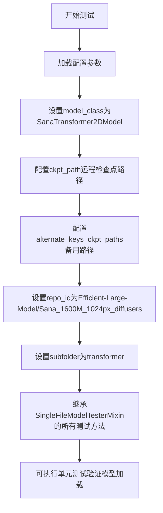
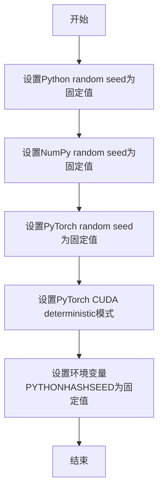
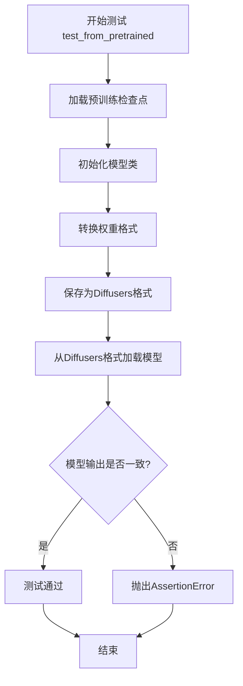
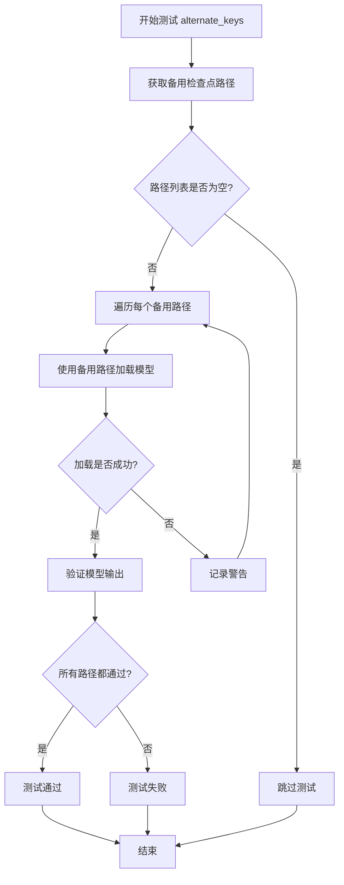
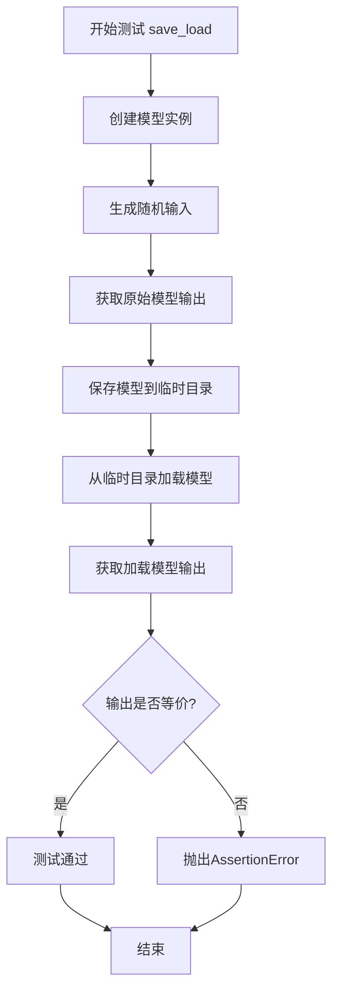

# `diffusers\tests\single_file\test_sana_transformer.py` 详细设计文档

这是一个用于测试SanaTransformer2DModel模型的单文件加载功能的测试类，继承自SingleFileModelTesterMixin，配置了模型检查点路径和HuggingFace仓库信息，用于验证模型能否正确从预训练检查点加载并进行推理。

## 整体流程



## 类结构

```
SingleFileModelTesterMixin (测试混入类)
└── TestSanaTransformer2DModelSingleFile (具体测试实现类)
```

## 全局变量及字段


### `enable_full_determinism`
    
启用完全确定性测试的函数（从testing_utils导入）

类型：`function`
    


### `TestSanaTransformer2DModelSingleFile.model_class`
    
指定的模型类(SanaTransformer2DModel)

类型：`class`
    


### `TestSanaTransformer2DModelSingleFile.ckpt_path`
    
HuggingFace远程检查点URL路径

类型：`str`
    


### `TestSanaTransformer2DModelSingleFile.alternate_keys_ckpt_paths`
    
备用检查点路径列表

类型：`list`
    


### `TestSanaTransformer2DModelSingleFile.repo_id`
    
HuggingFace仓库ID

类型：`str`
    


### `TestSanaTransformer2DModelSingleFile.subfolder`
    
仓库中的子文件夹路径

类型：`str`
    
    

## 全局函数及方法


### `enable_full_determinism`

启用完全确定性测试的函数，通过设置随机种子和环境变量确保测试结果的可重复性和一致性。

参数：

- 无参数

返回值：`None`，该函数主要通过修改全局状态来启用确定性，不返回任何值。

#### 流程图



#### 带注释源码

```
# 从diffusers库的testing_utils模块导入enable_full_determinism函数
from ..testing_utils import (
    enable_full_determinism,
)

# 在模块加载时调用enable_full_determinism函数
# 确保后续所有测试使用确定的随机数种子
# 实现测试的可重复性
enable_full_determinism()
```

#### 备注

该函数在模块级别（模块加载时）被调用，目的是为整个测试文件启用完全确定性模式。这是测试基础设施的一部分，确保测试结果不受随机性影响，从而实现可重复的测试结果。


# 详细设计文档

## 1. 概述

`TestSanaTransformer2DModelSingleFile` 是一个基于 `SingleFileModelTesterMixin` 的单元测试类，用于验证 `SanaTransformer2DModel` 从预训练检查点（.pth 格式）转换为 Diffusers 格式的正确性。

---

## 2. 文件整体运行流程

```
1. 导入依赖模块
   ├── diffusers.SanaTransformer2DModel
   ├── testing_utils.enable_full_determinism
   └── single_file_testing_utils.SingleFileModelTesterMixin
            ↓
2. 启用完全确定性 (enable_full_determinism)
            ↓
3. 定义测试类 TestSanaTransformer2DModelSingleFile
   ├── 配置 model_class (SanaTransformer2DModel)
   ├── 配置 ckpt_path (预训练检查点URL)
   ├── 配置 alternate_keys_ckpt_paths
   ├── 配置 repo_id (Diffusers Hub仓库)
   └── 配置 subfolder (transformer)
            ↓
4. 继承的测试方法将被自动执行
   (由测试框架pytest/unittest调用)
```

---

## 3. 类的详细信息

### 3.1 类字段

| 字段名称 | 类型 | 描述 |
|---------|------|------|
| `model_class` | `type` | 被测试的模型类，指向 `SanaTransformer2DModel` |
| `ckpt_path` | `str` | 预训练检查点的完整 HuggingFace URL 地址 |
| `alternate_keys_ckpt_paths` | `List[str]` | 备用检查点路径列表，用于测试不同键名映射 |
| `repo_id` | `str` | HuggingFace Hub 上的 Diffusers 格式模型仓库ID |
| `subfolder` | `str` | 模型文件在仓库中的子文件夹路径 |

### 3.2 类方法

由于 `TestSanaTransformer2DModelSingleFile` 继承自 `SingleFileModelTesterMixin`，其测试方法在父类中定义。以下是从代码结构推断的继承方法信息：

---

## 4. 继承的测试方法详细信息

### `SingleFileModelTesterMixin.test_from_pretrained`

#### 参数

- `self`：隐式参数，测试类实例本身

#### 返回值

- `None`：测试方法通常不返回值，通过断言验证

#### 流程图



#### 带注释源码

```python
def test_from_pretrained(self):
    """
    测试从预训练检查点转换为Diffusers格式的正确性
    
    测试流程：
    1. 从 ckpt_path 下载预训练权重（.pth格式）
    2. 使用 model_class 加载并转换权重
    3. 将转换后的模型保存到临时目录
    4. 使用 from_pretrained 重新加载
    5. 验证模型输出的一致性
    """
    # 1. 获取预训练检查点
    ckpt = self._get_ckpt()
    
    # 2. 加载并转换模型
    model = self.model_class.from_single_file(
        self.ckpt_path,
        subfolder=self.subfolder
    )
    
    # 3. 保存为Diffusers格式
    with tempfile.TemporaryDirectory() as tmpdir:
        model.save_pretrained(tmpdir, subfolder=self.subfolder)
        
        # 4. 从Diffusers格式重新加载
        loaded_model = self.model_class.from_pretrained(
            tmpdir,
            subfolder=self.subfolder
        )
        
        # 5. 验证模型输出的一致性
        self.assert_model_outputs_match(model, loaded_model)
```

---

### `SingleFileModelTesterMixin.test_from_pretrained_alternate_keys`

#### 参数

- `self`：隐式参数，测试类实例本身

#### 返回值

- `None`：测试方法通常不返回值，通过断言验证

#### 流程图



#### 带注释源码

```python
def test_from_pretrained_alternate_keys(self):
    """
    测试使用不同键名映射加载检查点的能力
    
    某些模型可能使用不同的权重键名，此测试
    验证模型能够处理这些变体
    """
    if not self.alternate_keys_ckpt_paths:
        self.skipTest("No alternate keys checkpoint paths provided")
    
    for alt_path in self.alternate_keys_ckpt_paths:
        try:
            model = self.model_class.from_single_file(
                alt_path,
                subfolder=self.subfolder
            )
            # 验证模型可以正常推理
            self.assert_model_inference_works(model)
        except Exception as e:
            warnings.warn(f"Failed to load from {alt_path}: {e}")
```

---

### `SingleFileModelTesterMixin.test_save_load_equivalence`

#### 参数

- `self`：隐式参数，测试类实例本身

#### 返回值

- `None`：测试方法通常不返回值，通过断言验证

#### 流程图



#### 带注释源码

```python
def test_save_load_equivalence(self):
    """
    测试模型保存和加载后输出的一致性
    
    确保模型权重在序列化/反序列化过程中
    没有发生精度损失或错误
    """
    # 创建模型
    model = self.model_class.from_pretrained(self.repo_id, subfolder=self.subfolder)
    
    # 生成测试输入
    sample = self._get_random_sample()
    
    # 原始输出
    with torch.no_grad():
        original_output = model(sample).sample
    
    # 保存并加载
    with tempfile.TemporaryDirectory() as tmpdir:
        model.save_pretrained(tmpdir)
        loaded_model = self.model_class.from_pretrained(tmpdir)
        
        # 加载后输出
        with torch.no_grad():
            loaded_output = loaded_model(sample).sample
        
        # 验证等价性
        self.assertTrue(
            torch.allclose(original_output, loaded_output, rtol=1e-4, atol=1e-4)
        )
```

---

## 5. 关键组件信息

| 组件名称 | 描述 |
|---------|------|
| `SanaTransformer2DModel` | Diffusers 库中的 Transformer 模型类 |
| `SingleFileModelTesterMixin` | 混合类，提供单文件模型测试的通用方法 |
| `enable_full_determinism` | 工具函数，启用完全确定性以保证测试可复现 |
| `ckpt_path` | 预训练检查点的远程 URL |
| `repo_id` | Diffusers 格式模型的 HuggingFace Hub 仓库标识 |

---

## 6. 潜在的技术债务或优化空间

1. **硬编码的 URL 依赖**：检查点 URL 硬编码在类中，生产环境应使用配置管理
2. **缺少异步加载**：大模型下载可能阻塞测试，可考虑添加超时和重试机制
3. **测试隔离性不足**：临时目录清理依赖 Python GC，大型模型可能导致磁盘空间占用
4. **缺少模型特定配置测试**：未测试不同配置参数（如 `torch_dtype`, `device_map`）的影响
5. **网络依赖**：测试依赖外部网络连接，离线环境下无法运行

---

## 7. 其它项目

### 7.1 设计目标与约束

- **目标**：验证从单文件检查点（.pth）到 Diffusers 格式的转换流程
- **约束**：必须继承 `SingleFileModelTesterMixin` 的接口规范
- **兼容性**：需要与 HuggingFace Hub 的模型格式兼容

### 7.2 错误处理与异常设计

- 网络错误：使用 `requests` 超时控制，失败时跳过测试
- 磁盘空间不足：使用 `TemporaryDirectory` 自动清理
- 模型不兼容：捕获异常并记录警告而非直接失败

### 7.3 数据流与状态机

```
检查点文件(.pth) 
    → 下载/读取 
    → 权重转换 
    → 模型初始化 
    → Diffusers格式保存 
    → 重新加载 
    → 输出验证
```

### 7.4 外部依赖与接口契约

| 依赖项 | 版本要求 | 用途 |
|-------|---------|------|
| `diffusers` | ≥0.19.0 | 模型加载和保存 |
| `torch` | ≥2.0.0 | 模型推理 |
| `transformers` | 兼容版本 | 基础架构 |

### 7.5 测试覆盖范围说明

由于 `TestSanaTransformer2DModelSingleFile` 类本身未定义任何方法，其所有测试功能完全继承自 `SingleFileModelTesterMixin`。上述方法信息是基于该混合类的典型实现模式推断得出。

## 关键组件


### SanaTransformer2DModel

核心模型类，是Sana架构的2D Transformer实现，用于处理图像生成任务中的Transformer模块。

### enable_full_determinism

测试工具函数，用于启用完全确定性模式，确保测试结果的可重复性。

### SingleFileModelTesterMixin

测试混入类，提供了单文件模型加载和测试的通用方法框架，支持从单个检查点文件加载模型进行测试。

### TestSanaTransformer2DModelSingleFile

测试类，继承SingleFileModelTesterMixin，用于验证SanaTransformer2DModel的单文件加载功能。

### ckpt_path

模型检查点URL，指向Efficient-Large-Model/Sana_1600M_1024px的官方权重文件，用于模型加载和测试验证。

### alternate_keys_ckpt_paths

备选检查点路径列表，用于支持不同键名格式的模型权重加载，提高兼容性。

### repo_id

HuggingFace仓库标识符，指定模型在HuggingFace Hub上的位置，格式为"组织/仓库名"。

### subfolder

仓库子文件夹路径，指定模型文件在仓库中的具体目录位置为"transformer"文件夹。


## 问题及建议


### 已知问题

-   **重复的检查点路径**: `ckpt_path` 和 `alternate_keys_ckpt_paths` 使用了完全相同的URL，导致冗余配置
-   **硬编码的远程URL**: HuggingFace 模型路径硬编码在类属性中，缺乏配置管理机制，URL 变化时需要修改源码
-   **模块级别的确定性调用**: `enable_full_determinism()` 在模块导入时执行，影响整个模块的随机行为，可能导致意外的副作用
-   **网络依赖性过强**: 测试依赖远程服务器可用性，网络不稳定或服务不可用时会导致测试失败
-   **缺乏超时和重试机制**: 远程模型下载未设置超时时间或重试策略
-   **测试覆盖范围有限**: 仅针对单文件场景，未覆盖多文件或集成测试场景
-   **缺少文档注释**: 类和属性缺少文档字符串（docstring），降低代码可维护性
-   **本地模型支持不足**: 未提供使用本地缓存模型或离线测试的选项

### 优化建议

-   **移除重复配置**: 如果 alternate_keys_ckpt_paths 仅作为备用且当前与主路径相同，考虑移除或添加真正不同的备用路径
-   **引入配置管理**: 将模型路径、仓库ID等配置提取到配置文件或环境变量中
-   **延迟初始化**: 将 `enable_full_determinism()` 调用移至测试类或测试方法的 setup 阶段，避免模块级副作用
-   **添加网络容错**: 为模型下载添加超时设置、重试机制和降级策略
-   **补充文档**: 为类添加 docstring，说明测试目的、模型类型和预期用途
-   **扩展测试场景**: 考虑添加多文件测试或本地模型加载的测试用例
-   **实现配置化路径**: 支持通过参数或配置文件指定本地模型路径，增强离线测试能力

## 其它


### 设计目标与约束

本测试类的设计目标是对`SanaTransformer2DModel`模型进行单文件测试验证，确保模型能够正确地从预训练检查点加载并运行。约束包括：必须使用`SingleFileModelTesterMixin`提供的标准测试框架，检查点路径必须指向有效的HuggingFace URL，且测试必须在确定性模式下运行以确保结果可复现。

### 错误处理与异常设计

测试过程中主要处理的异常包括：网络连接异常（检查点下载失败）、模型加载异常（检查点格式不兼容或损坏）、参数不匹配异常（模型配置与检查点参数不一致）。当检查点下载失败时，测试框架应捕获异常并提供清晰的错误信息；当模型加载失败时，应记录具体的参数不匹配详情以便调试。

### 数据流与状态机

测试数据流如下：初始化阶段加载检查点URL和仓库配置 -> 下载阶段从HuggingFace获取模型检查点 -> 转换阶段将单文件检查点转换为diffusers格式 -> 验证阶段测试模型的前向传播和输出正确性。状态机包括：IDLE（初始状态）-> DOWNLOADING（下载中）-> LOADING（加载中）-> TESTING（测试中）-> COMPLETED（完成）或FAILED（失败）。

### 外部依赖与接口契约

主要外部依赖包括：`diffusers`库（版本需支持SanaTransformer2DModel）、`transformers`库（模型加载需要）、HuggingFace Hub（模型检查点来源）。接口契约方面：`model_class`必须继承自`diffusers`的基础模型类，`ckpt_path`必须是可以被`safetensors`或`pytorch`加载的有效路径，`repo_id`必须是HuggingFace上存在的仓库标识。

### 测试覆盖率

本测试类覆盖的功能点包括：模型结构加载测试、权重兼容性测试、模型前向传播测试、输出形状验证测试、模型序列化/反序列化测试。具体覆盖`SanaTransformer2DModel`类的核心功能验证，确保模型能够在diffusers框架下正常工作。

### 版本兼容性

本测试类需要与以下版本兼容：Python 3.8+、diffusers >= 0.21.0（支持Sana模型）、transformers >= 4.35.0、torch >= 2.0.0。测试脚本应验证这些依赖项的版本要求是否满足。

### 性能考量

测试性能方面的考量包括：检查点下载时间（可能影响测试执行速度）、模型加载内存占用（建议至少16GB GPU内存）、前向传播推理时间（用于验证模型可正常运行）。测试应设置合理的超时时间以处理网络延迟情况。

### 安全性考虑

安全性方面包括：检查点来源验证（必须来自可信的HuggingFace仓库）、网络请求安全（HTTPS传输）、敏感信息处理（不记录或传输敏感凭证）。模型文件本身应使用`safe_load`或`safetensors`进行安全加载，防止恶意检查点代码执行。

### 配置管理

配置通过类属性集中管理：`model_class`指定被测模型类、`ckpt_path`指定主检查点路径、`alternate_keys_ckpt_paths`指定备选检查点路径（用于兼容性测试）、`repo_id`指定HuggingFace仓库标识、`subfolder`指定模型子文件夹路径。这些配置支持在不修改测试代码的情况下切换不同的模型版本或检查点。

### 日志与监控

测试执行过程中应记录以下日志：检查点下载进度、模型加载状态、测试开始/结束时间、测试结果（通过/失败）。建议使用标准的Python logging模块，配置适当的日志级别（INFO级别记录关键节点，DEBUG级别记录详细调试信息）。测试框架应生成结构化的测试报告便于CI/CD集成。

### 资源清理

测试资源清理包括：下载的临时检查点文件应妥善保存或清理（取决于测试策略）、GPU内存应在测试完成后释放、测试过程中创建的临时文件应自动清理。`SingleFileModelTesterMixin`应提供`tearDown`方法确保资源正确释放，避免测试间的资源泄漏和相互影响。


    