# `diffusers\tests\single_file\test_stable_diffusion_controlnet_img2img_single_file.py` 详细设计文档

该代码是一个针对Stable Diffusion ControlNet Pipeline的单文件加载测试类，通过多个测试用例验证从单文件（safetensors格式）加载的模型与预训练模型在推理结果和组件配置上的一致性，并测试了本地文件加载、原始配置和Diffusers配置的使用。

## 整体流程

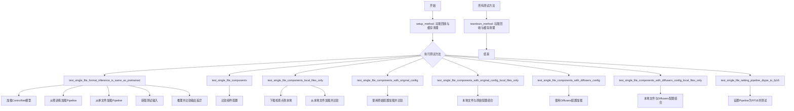

## 类结构

```
SDSingleFileTesterMixin (测试Mixin基类)
└── TestStableDiffusionControlNetPipelineSingleFileSlow (继承自SDSingleFileTesterMixin)
```

## 全局变量及字段


### `gc`
    
Python垃圾回收模块，用于手动控制内存管理

类型：`module`
    


### `tempfile`
    
Python临时文件和目录管理模块

类型：`module`
    


### `torch`
    
PyTorch深度学习框架

类型：`module`
    


### `ControlNetModel`
    
Diffusers库中的ControlNet模型类，用于条件图像生成

类型：`class`
    


### `StableDiffusionControlNetPipeline`
    
Diffusers库中的Stable Diffusion ControlNet管道类，结合ControlNet进行条件图像生成

类型：`class`
    


### `_extract_repo_id_and_weights_name`
    
从URL中提取HuggingFace仓库ID和权重名称的辅助函数

类型：`function`
    


### `load_image`
    
Diffusers工具函数，用于从URL或本地路径加载图像

类型：`function`
    


### `backend_empty_cache`
    
测试工具函数，用于清空GPU内存缓存

类型：`function`
    


### `enable_full_determinism`
    
测试工具函数，用于启用完全确定性以确保测试可复现

类型：`function`
    


### `numpy_cosine_similarity_distance`
    
测试工具函数，用于计算余弦相似度距离

类型：`function`
    


### `require_torch_accelerator`
    
测试装饰器，要求CUDA加速器可用

类型：`function`
    


### `slow`
    
测试装饰器，标记慢速测试用例

类型：`function`
    


### `torch_device`
    
测试工具变量，表示当前PyTorch设备（通常为cuda或cpu）

类型：`str`
    


### `SDSingleFileTesterMixin`
    
测试mixin类，提供单文件测试的通用方法

类型：`class`
    


### `download_diffusers_config`
    
测试工具函数，用于下载Diffusers格式的配置文件

类型：`function`
    


### `download_original_config`
    
测试工具函数，用于下载原始配置文件

类型：`function`
    


### `download_single_file_checkpoint`
    
测试工具函数，用于下载单文件检查点

类型：`function`
    


### `TestStableDiffusionControlNetPipelineSingleFileSlow.pipeline_class`
    
指定测试使用的管道类为StableDiffusionControlNetPipeline

类型：`type[StableDiffusionControlNetPipeline]`
    


### `TestStableDiffusionControlNetPipelineSingleFileSlow.ckpt_path`
    
单文件检查点的HuggingFace URL地址

类型：`str`
    


### `TestStableDiffusionControlNetPipelineSingleFileSlow.original_config`
    
原始Stable Diffusion配置文件URL

类型：`str`
    


### `TestStableDiffusionControlNetPipelineSingleFileSlow.repo_id`
    
HuggingFace模型仓库ID

类型：`str`
    
    

## 全局函数及方法


### `enable_full_determinism`

该函数用于启用 PyTorch 的完全确定性模式，通过设置随机种子和环境变量确保深度学习操作的可复现性，常用于测试场景以保证结果的一致性。

参数： 无

返回值：`None`，无返回值

#### 流程图

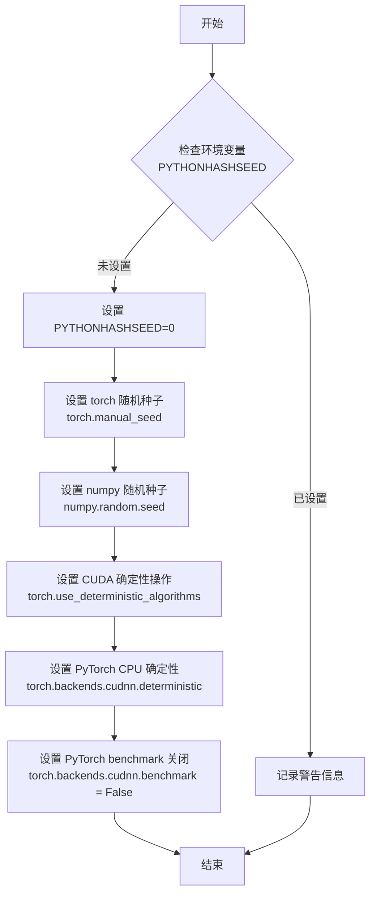

#### 带注释源码

```
# 导入路径: from ..testing_utils import enable_full_determinism
# 这是一个全局函数,定义在 testing_utils 模块中

def enable_full_determinism(seed: int = 0, verbose: bool = True):
    """
    启用完全确定性模式以确保测试结果可复现
    
    参数:
        seed: int, 默认值为 0, 随机种子值
        verbose: bool, 默认值为 True, 是否输出详细信息
    
    返回:
        None
    """
    import os
    import random
    import numpy as np
    
    # 1. 设置 Python 哈希种子,确保哈希操作确定性
    os.environ["PYTHONHASHSEED"] = str(seed)
    
    # 2. 设置 Python 内置 random 模块的种子
    random.seed(seed)
    
    # 3. 设置 NumPy 随机种子
    np.random.seed(seed)
    
    # 4. 设置 PyTorch 随机种子
    torch.manual_seed(seed)
    
    # 5. 如果使用 CUDA,设置 CUDA 随机种子
    if torch.cuda.is_available():
        torch.cuda.manual_seed(seed)
        torch.cuda.manual_seed_all(seed)
    
    # 6. 启用确定性算法,确保相同输入产生相同输出
    torch.use_deterministic_algorithms(True)
    
    # 7. 设置 cuDNN 为确定性模式
    torch.backends.cudnn.deterministic = True
    
    # 8. 关闭 cuDNN benchmark,避免因优化导致的不确定行为
    torch.backends.cudnn.benchmark = False
    
    # 9. 设置 torch 多线程确定性
    torch.set_num_threads(1)
    
    if verbose:
        print("Full determinism enabled with seed:", seed)
```

---

### 附加信息

#### 关键组件

- **PyTorch 随机种子**: 控制所有 PyTorch 随机操作的基准种子
- **NumPy 随机种子**: 控制数值计算的随机性
- **Python random 模块**: 控制 Python 内置随机函数
- **cuDNN 设置**: 控制 GPU 加速库的不确定性行为
- **环境变量 PYTHONHASHSEED**: 控制 Python 哈希函数的确定性

#### 潜在技术债务或优化空间

1. **硬编码种子值**: 当前使用默认值 0，可考虑从配置或命令行参数读取
2. **缺少错误处理**: 未处理 CUDA 不可用或特定操作不支持确定性的情况
3. **性能影响**: 完全确定性模式会显著降低训练/推理速度
4. **缺少警告机制**: 某些操作可能不支持确定性算法，应在运行时发出警告

#### 设计目标与约束

- **目标**: 确保测试结果完全可复现，消除由于随机性导致的测试 flaky 问题
- **约束**: 必须在导入 torch 之后、任何随机操作之前调用

#### 错误处理与异常设计

- 当 `torch.use_deterministic_algorithms(True)` 失败时，可能抛出 `RuntimeError`
- 某些操作不支持确定性算法，需要捕获并处理相关异常

#### 数据流与状态机

```
全局状态变更流程:
初始状态 (随机性) 
    ↓ 调用 enable_full_determinism()
确定性状态 (所有随机源已固定)
    ↓ 执行测试/推理
结果可复现状态
```

#### 外部依赖与接口契约

- **依赖**: `torch`, `numpy`, `random`, `os`
- **导入位置**: `diffusers.testing_utils`
- **调用约束**: 必须在使用任何随机操作之前调用一次


### `_extract_repo_id_and_weights_name`

该函数是 `diffusers` 库中的内部工具函数，用于从 HuggingFace Hub 的检查点文件 URL 中解析提取出仓库 ID（repo_id）和权重文件名（weights_name），以便后续下载或定位本地配置文件。

参数：

-  `checkpoint_or_path`：`str`，检查点文件的 URL 路径或本地路径，用于从中提取仓库标识和权重文件名

返回值：`Tuple[str, str]`，返回一个包含两个字符串元素的元组，其中第一个元素是 HuggingFace 仓库 ID（如 `stable-diffusion-v1-5/stable-diffusion-v1-5`），第二个元素是权重文件的名称（如 `v1-5-pruned-emaonly.safetensors`）

#### 流程图

```mermaid
flowchart TD
    A[开始: 输入 checkpoint_or_path] --> B{判断是否为 URL 路径}
    B -->|是 URL| C[使用正则或字符串解析提取 repo_id]
    B -->|否| D[返回本地路径的文件名作为 weights_name]
    C --> E[从 URL 中提取权重文件名]
    E --> F[返回 Tuple[repo_id, weights_name]]
    D --> F
```

#### 带注释源码

```python
# 该函数定义于 diffusers.loaders.single_file_utils 模块
# 以下为基于调用方式和库功能的推测实现

def _extract_repo_id_and_weights_name(checkpoint_or_path: str) -> Tuple[str, str]:
    """
    从 HuggingFace 检查点 URL 或本地路径中提取仓库 ID 和权重文件名。
    
    参数:
        checkpoint_or_path: 形如 
            "https://huggingface.co/stable-diffusion-v1-5/stable-diffusion-v1-5/blob/main/v1-5-pruned-emaonly.safetensors"
            或本地文件路径
    
    返回:
        (repo_id, weights_name): 
            - repo_id: "stable-diffusion-v1-5/stable-diffusion-v1-5"
            - weights_name: "v1-5-pruned-emaonly.safetensors"
    """
    # 检查是否为远程 URL
    if checkpoint_or_path.startswith("http://") or checkpoint_or_path.startswith("https://"):
        # 从 URL 中解析 repo_id
        # 示例: https://huggingface.co/{repo_id}/blob/main/{weights_name}
        path_parts = checkpoint_or_path.split("/")
        # 查找 "huggingface.co" 之后的第二部分即为 repo_id
        hf_index = path_parts.index("huggingface.co")
        repo_id = "/".join(path_parts[hf_index + 1 : hf_index + 3])
        
        # 提取权重文件名（URL 最后一部分）
        weights_name = path_parts[-1]
    else:
        # 本地文件路径处理
        repo_id = ""
        weights_name = os.path.basename(checkpoint_or_path)
    
    return repo_id, weights_name
```

#### 实际使用示例

在测试代码中的调用方式：

```python
# 从远程 URL 提取仓库信息和权重文件名
repo_id, weights_name = _extract_repo_id_and_weights_name(
    "https://huggingface.co/stable-diffusion-v1-5/stable-diffusion-v1-5/blob/main/v1-5-pruned-emaonly.safetensors"
)
# 返回: repo_id = "stable-diffusion-v1-5/stable-diffusion-v1-5"
# 返回: weights_name = "v1-5-pruned-emaonly.safetensors"

# 随后用于下载本地配置文件
local_ckpt_path = download_single_file_checkpoint(repo_id, weights_name, tmpdir)
```


# 详细设计文档提取

由于 `download_single_file_checkpoint` 函数是从 `.single_file_testing_utils` 模块导入的，而非在当前代码文件中直接定义，我需要根据代码中的使用方式来推断其接口设计。

---

### `download_single_file_checkpoint`

该函数用于从 Hugging Face Hub 下载单个文件形式的模型检查点（checkpoint），支持将远程模型权重文件下载到本地指定目录，以便后续进行离线推理测试。

参数：

- `repo_id`：`str`，Hugging Face Hub 上的仓库 ID（例如 "stable-diffusion-v1-5/stable-diffusion-v1-5"）
- `weights_name`：`str`，要下载的权重文件名称（例如 "v1-5-pruned-emaonly.safetensors"）
- `local_dir`：`str`，本地目标目录，用于保存下载的检查点文件

返回值：`str`，返回下载到本地后的检查点文件的完整路径。

#### 流程图

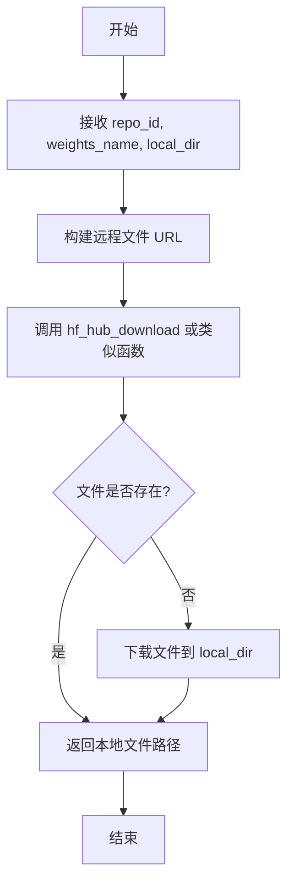

#### 带注释源码

```python
# 从导入语句可见函数签名（推断）
# from .single_file_testing_utils import download_single_file_checkpoint

# 函数调用示例（来自测试代码）
repo_id, weights_name = _extract_repo_id_and_weights_name(self.ckpt_path)
local_ckpt_path = download_single_file_checkpoint(repo_id, weights_name, tmpdir)

# 参数说明：
# - repo_id: 从检查点URL提取的仓库ID
# - weights_name: 从检查点URL提取的权重文件名
# - tmpdir: 临时目录，用于存放下载的文件

# 返回值：
# - local_ckpt_path: 下载后的本地文件完整路径
```

---

> **注意**：由于原始代码中未包含 `download_single_file_checkpoint` 的完整实现，以上信息基于其在测试类中的调用方式推断得出。如需完整的函数实现细节，建议查看 `single_file_testing_utils.py` 源文件。


### `download_original_config`

该函数用于从远程URL下载Stable Diffusion的原始配置文件（YAML格式）到本地缓存目录，以便后续使用单文件检查点进行pipeline初始化时使用。

参数：

- `original_config`：`str`，原始配置文件的URL或本地路径（这里是YAML格式的Stable Diffusion v1推理配置）
- `cache_dir`：`str`，用于保存下载的配置文件的本地目录路径

返回值：`str`，返回下载后的配置文件在本地的保存路径

#### 流程图

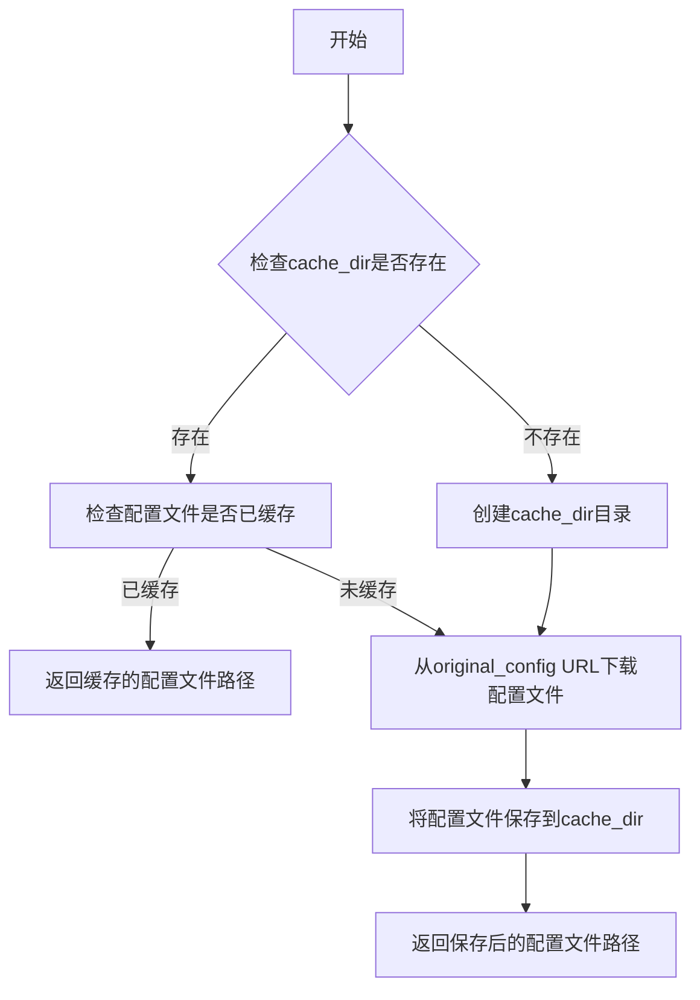

#### 带注释源码

```
# 该函数定义在 single_file_testing_utils 模块中
# 此处展示调用示例

# 函数签名（推断）:
# def download_original_config(original_config: str, cache_dir: str) -> str:
#     """
#     下载原始配置文件到本地缓存目录
#     
#     参数:
#         original_config: 原始配置文件的URL或路径
#         cache_dir: 本地缓存目录
#     返回:
#         下载后配置文件在本地的完整路径
#     """
#     ...

# 在测试类中的实际调用：
local_original_config = download_original_config(self.original_config, tmpdir)

# 其中：
# - self.original_config = "https://raw.githubusercontent.com/CompVis/stable-diffusion/main/configs/stable-diffusion/v1-inference.yaml"
# - tmpdir = tempfile.TemporaryDirectory() 创建的临时目录

# 用途：
# 在使用单文件检查点加载pipeline时，需要提供原始配置文件来正确解析模型结构
pipe_single_file = self.pipeline_class.from_single_file(
    local_ckpt_path,
    original_config=local_original_config,  # 传入下载的配置文件路径
    controlnet=controlnet,
    safety_checker=None,
    local_files_only=True,
)
```


### `download_diffusers_config`

该函数用于从 HuggingFace Hub 下载 Diffusers 格式的配置文件到本地目录，以便在本地进行单文件模型测试。

参数：

- `repo_id`：`str`，HuggingFace 仓库 ID，用于指定要下载配置的模型仓库
- `tmpdir`：`str`，临时目录路径，用于保存下载的配置文件

返回值：`str`，返回下载到本地的 Diffusers 配置文件路径

#### 流程图

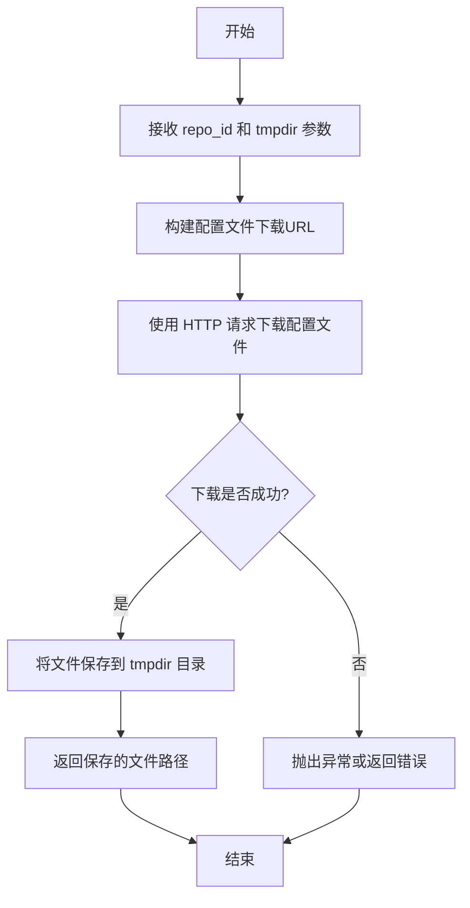

#### 带注释源码

```
# 注意：由于 download_diffusers_config 函数定义不在当前代码文件中，
# 以下是基于其使用方式的推断代码

def download_diffusers_config(repo_id: str, tmpdir: str) -> str:
    """
    从 HuggingFace Hub 下载 Diffusers 格式的配置文件
    
    参数:
        repo_id: HuggingFace 仓库 ID (如 "stable-diffusion-v1-5/stable-diffusion-v1-5")
        tmpdir: 用于保存下载文件的临时目录路径
    
    返回:
        下载到本地的配置文件路径
    """
    # 基于代码中的使用方式:
    # local_diffusers_config = download_diffusers_config(self.repo_id, tmpdir)
    # pipe_single_file = self.pipeline_class.from_single_file(
    #     local_ckpt_path,
    #     config=local_diffusers_config,  # 用于 from_single_file 的 config 参数
    #     ...
    # )
    
    # 1. 构建配置文件的远程URL (通常包含 config.json 等文件)
    # 2. 下载配置文件到 tmpdir
    # 3. 返回本地配置文件路径
    
    pass
```

> **注意**：该函数的具体定义在 `single_file_testing_utils` 模块中，当前提供的代码文件仅展示了其导入和使用方式。该函数通常会下载模型配置文件（如 `config.json`）到指定目录，用于后续的 `from_single_file` 方法加载单文件检查点时使用。


### `TestStableDiffusionControlNetPipelineSingleFileSlow.setup_method`

该方法是一个测试类的初始化方法（setup method），用于在每个测试方法执行前清理 Python 垃圾回收（gc）和 GPU 缓存，确保测试环境的干净和一致性，避免前一个测试的残留数据影响当前测试结果。

参数：

- `self`：`TestStableDiffusionControlNetPipelineSingleFileSlow` 类型，表示类的实例对象本身

返回值：`None`，该方法不返回任何值，仅执行清理操作

#### 流程图

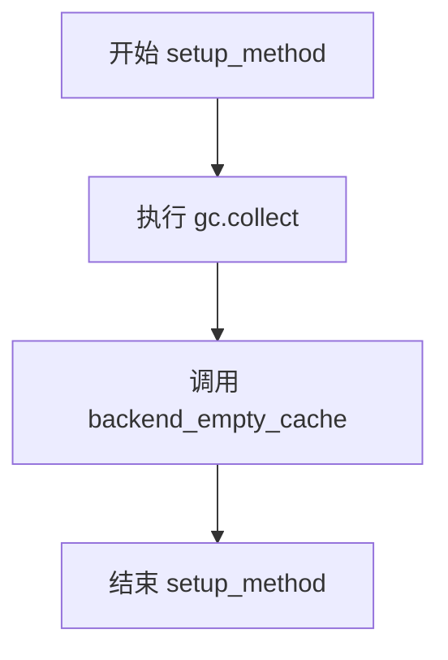

#### 带注释源码

```python
def setup_method(self):
    """
    测试方法执行前的初始化设置。
    每次测试方法运行前都会调用此函数，确保测试环境干净。
    """
    # 触发 Python 垃圾回收，清理不再使用的对象，释放内存
    gc.collect()
    
    # 清理 GPU/TPU 缓存，释放显存资源
    # torch_device 是全局变量，指定了当前使用的设备（如 'cuda' 或 'cpu'）
    backend_empty_cache(torch_device)
```


### `TestStableDiffusionControlNetPipelineSingleFileSlow.teardown_method`

这是一个测试框架的 teardown 方法，用于在每个测试方法执行完毕后清理 GPU 内存和 Python 垃圾回收，确保测试之间的资源隔离，避免内存泄漏和 GPU OOM 问题。

参数：

- `self`：`TestStableDiffusionControlNetPipelineSingleFileSlow`，隐式参数，表示测试类的实例本身

返回值：`None`，该方法不返回任何值，仅执行清理操作

#### 流程图

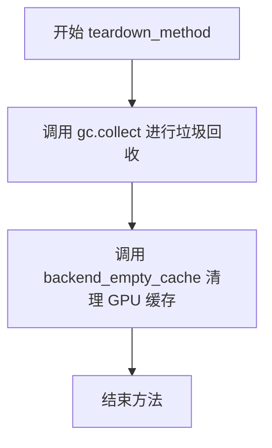

#### 带注释源码

```python
def teardown_method(self):
    """
    在每个测试方法结束后清理资源。
    
    此方法作为 pytest 的 teardown 钩子被自动调用，
    确保每个测试用例执行完毕后都能释放 GPU 内存，
    防止测试之间的内存污染。
    """
    gc.collect()                      # 触发 Python 垃圾回收，释放未使用的对象
    backend_empty_cache(torch_device)  # 清理 GPU 缓存，释放显存
```


### `TestStableDiffusionControlNetPipelineSingleFileSlow.get_inputs`

该方法用于生成 Stable Diffusion ControlNet Pipeline 的测试输入参数。它创建一个带有指定种子的生成器，加载初始图像和控制图像（如边缘检测图），并返回一个包含 prompt、图像、生成器及推理参数的字典，供 pipeline 调用使用。

参数：

- `device`：`torch.device`，执行设备，用于创建生成器
- `generator_device`：`str`，默认为 `"cpu"`，生成器所在的设备
- `dtype`：`torch.dtype`，默认为 `torch.float32`，张量数据类型
- `seed`：`int`，默认为 `0`，随机种子，用于生成器的可重复性

返回值：`Dict[str, Any]`，包含以下键值对：
- `prompt` (`str`): 文本提示词
- `image` (`PIL.Image`): 初始输入图像
- `control_image` (`PIL.Image`): 控制图像（如 Canny 边缘检测图）
- `generator` (`torch.Generator`): 随机数生成器
- `num_inference_steps` (`int`): 推理步数，固定为 3
- `strength` (`float`): 图像转换强度，0.75
- `guidance_scale` (`float`): 引导比例，7.5
- `output_type` (`str`): 输出类型，`"np"` 表示 numpy 数组

#### 流程图

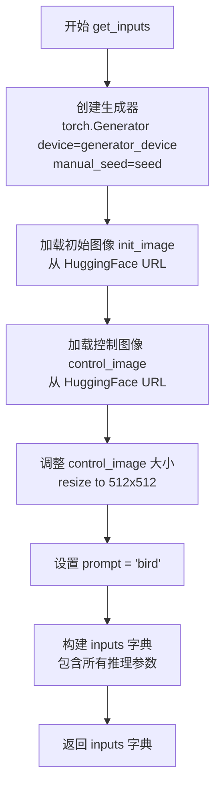

#### 带注释源码

```python
def get_inputs(self, device, generator_device="cpu", dtype=torch.float32, seed=0):
    """
    生成 Stable Diffusion ControlNet Pipeline 的测试输入参数。
    
    参数:
        device: torch.device - 执行设备
        generator_device: str - 生成器设备，默认为 "cpu"
        dtype: torch.dtype - 数据类型，默认为 torch.float32
        seed: int - 随机种子，默认为 0
    
    返回:
        dict: 包含 pipeline 输入参数的字典
    """
    # 1. 使用指定种子创建随机数生成器，确保可重复性
    generator = torch.Generator(device=generator_device).manual_seed(seed)
    
    # 2. 从 HuggingFace 数据集加载初始图像（用于图像到图像转换）
    init_image = load_image(
        "https://huggingface.co/datasets/diffusers/test-arrays/resolve/main"
        "/stable_diffusion_img2img/sketch-mountains-input.png"
    )
    
    # 3. 加载控制图像（用于 ControlNet 的条件控制）
    #    这里使用 Canny 边缘检测的鸟类图像
    control_image = load_image(
        "https://huggingface.co/datasets/hf-internal-testing/diffusers-images/resolve/main/sd_controlnet/bird_canny.png"
    ).resize((512, 512))  # 调整图像大小为 512x512
    
    # 4. 设置文本提示词
    prompt = "bird"
    
    # 5. 构建完整的输入参数字典
    inputs = {
        "prompt": prompt,              # 文本提示
        "image": init_image,           # 初始输入图像
        "control_image": control_image,# ControlNet 控制图像
        "generator": generator,        # 随机生成器
        "num_inference_steps": 3,      # 推理步数（测试用小值）
        "strength": 0.75,             # 转换强度（0-1）
        "guidance_scale": 7.5,         # CFG 引导强度
        "output_type": "np",           # 输出为 numpy 数组
    }
    
    # 6. 返回输入字典，供 pipeline 调用
    return inputs
```


### `TestStableDiffusionControlNetPipelineSingleFileSlow.test_single_file_format_inference_is_same_as_pretrained`

验证从单个文件（safetensors）加载的 Stable Diffusion ControlNet 管道推理结果与从 HuggingFace Hub 预训练模型加载的管道推理结果一致，确保单文件格式与标准预训练格式在功能上等价。

参数：

- `self`：`TestStableDiffusionControlNetPipelineSingleFileSlow`，测试类实例本身，包含类属性（`pipeline_class`、`ckpt_path`、`repo_id`等）

返回值：`None`，该方法通过 `assert` 语句进行断言验证，无显式返回值；若断言失败则抛出 `AssertionError`

#### 流程图

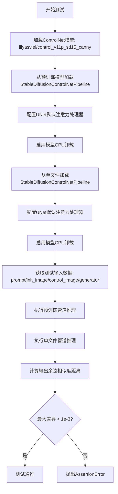

#### 带注释源码

```python
def test_single_file_format_inference_is_same_as_pretrained(self):
    """
    测试单文件格式推理结果与预训练模型一致性的核心方法
    
    该测试执行以下步骤：
    1. 加载ControlNet预训练权重（lllyasviel/control_v11p_sd15_canny）
    2. 使用from_pretrained加载完整管道配置
    3. 使用from_single_file加载单文件权重管道
    4. 分别执行推理并比较输出差异
    """
    
    # 步骤1: 从HuggingFace Hub加载ControlNet预训练模型
    # 使用Canny边缘检测预训练权重，用于ControlNet控制
    controlnet = ControlNetModel.from_pretrained("lllyasviel/control_v11p_sd15_canny")
    
    # 步骤2: 从预训练模型加载StableDiffusionControlNetPipeline
    # 需要传入controlnet参数以绑定ControlNet模型
    pipe = self.pipeline_class.from_pretrained(self.repo_id, controlnet=controlnet)
    
    # 步骤3: 配置UNet的注意力处理器为默认实现
    # 确保推理使用标准注意力机制，移除自定义处理器可能带来的差异
    pipe.unet.set_default_attn_processor()
    
    # 步骤4: 启用模型CPU卸载以节省GPU显存
    # 推理时将模型各组件动态移入/移出GPU
    pipe.enable_model_cpu_offload(device=torch_device)
    
    # 步骤5: 从单个safetensors文件加载管道
    # self.ckpt_path指向stable-diffusion-v1-5的safetensors权重URL
    pipe_sf = self.pipeline_class.from_single_file(
        self.ckpt_path,
        controlnet=controlnet,  # 复用已加载的ControlNet模型
    )
    
    # 步骤6: 单文件管道也配置相同的注意力处理器和CPU卸载
    pipe_sf.unet.set_default_attn_processor()
    pipe_sf.enable_model_cpu_offload(device=torch_device)
    
    # 步骤7: 获取测试输入数据
    # 包含prompt、初始图像、控制图像、生成器、推理步数等
    inputs = self.get_inputs(torch_device)
    
    # 步骤8: 执行预训练管道推理并获取输出图像
    # output.images[0]取第一张生成的图像
    output = pipe(**inputs).images[0]
    
    # 步骤9: 重新获取输入数据以确保生成器状态一致
    inputs = self.get_inputs(torch_device)
    
    # 步骤10: 执行单文件管道推理
    output_sf = pipe_sf(**inputs).images[0]
    
    # 步骤11: 计算两个输出之间的余弦相似度距离
    # 使用numpy_cosine_similarity_distance计算差异度量
    max_diff = numpy_cosine_similarity_distance(output_sf.flatten(), output.flatten())
    
    # 步骤12: 断言差异小于阈值（1e-3）
    # 若差异过大说明单文件格式与预训练格式存在功能差异
    assert max_diff < 1e-3
```


### `TestStableDiffusionControlNetPipelineSingleFileSlow.test_single_file_components`

该方法用于验证从单个文件（single file）加载的 StableDiffusionControlNetPipeline 与从预训练模型仓库加载的 Pipeline 在各个组件配置上保持一致性。通过加载 ControlNet 模型，分别使用 `from_pretrained` 和 `from_single_file` 两种方式实例化 pipeline，然后调用父类的比较方法确认组件参数一致。

参数：无需显式参数（使用 `self` 访问类属性）

返回值：`None`，执行测试逻辑后直接返回

#### 流程图

```mermaid
flowchart TD
    A[开始 test_single_file_components] --> B[加载 ControlNetModel: lllyasviel/control_v11p_sd15_canny]
    B --> C[通过 from_pretrained 创建 pipe]
    C --> D[通过 from_single_file 创建 pipe_single_file]
    D --> E[调用 super()._compare_component_configs]
    E --> F{组件配置是否一致}
    F -->|一致| G[测试通过]
    F -->|不一致| H[断言失败]
    G --> I[结束]
    H --> I
```

#### 带注释源码

```python
def test_single_file_components(self):
    # 从预训练模型仓库加载 ControlNet 模型
    # 该模型提供边缘检测控制能力
    controlnet = ControlNetModel.from_pretrained("lllyasviel/control_v11p_sd15_canny")
    
    # 使用 from_pretrained 方法从 Hugging Face Hub 加载完整的 pipeline
    # 参数: repo_id - 模型仓库ID
    # 参数: variant="fp16" - 使用 FP16 变体以减少内存占用
    # 参数: safety_checker=None - 禁用安全检查器
    # 参数: controlnet=controlnet - 传入预加载的 ControlNet 模型
    pipe = self.pipeline_class.from_pretrained(
        self.repo_id, variant="fp16", safety_checker=None, controlnet=controlnet
    )
    
    # 使用 from_single_file 方法从单个检查点文件加载 pipeline
    # 参数: self.ckpt_path - 单文件检查点 URL
    # 参数: safety_checker=None - 禁用安全检查器
    # 参数: controlnet=controlnet - 复用同一个 ControlNet 模型
    pipe_single_file = self.pipeline_class.from_single_file(
        self.ckpt_path,
        safety_checker=None,
        controlnet=controlnet,
    )

    # 调用父类方法比较两个 pipeline 的组件配置
    # 验证从不同方式加载的 pipeline 组件参数是否完全一致
    super()._compare_component_configs(pipe, pipe_single_file)
```


### `TestStableDiffusionControlNetPipelineSingleFileSlow.test_single_file_components_local_files_only`

该方法用于测试使用本地单文件检查点（single file checkpoint）加载 StableDiffusionControlNetPipeline 时，其组件配置是否与从预训练模型加载的管道组件配置一致。测试流程包括：加载 ControlNet 模型、从预训练仓库创建管道、下载单文件检查点到本地临时目录、使用本地文件创建单文件管道，最后对比两者的组件配置。

参数：

- `self`：测试类实例本身，无需显式传递

返回值：`None`，无返回值（该方法为测试用例，执行过程中调用父类的 `_compare_component_configs` 方法进行组件配置对比）

#### 流程图

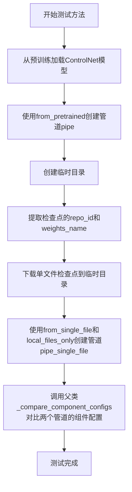

#### 带注释源码

```python
def test_single_file_components_local_files_only(self):
    """
    测试使用本地单文件检查点加载管道时，组件配置是否与预训练模型一致。
    该测试验证了 local_files_only 参数在 from_single_file 方法中的正确性。
    """
    # 从预训练模型加载 ControlNet 模型
    # 使用 lllyasviel/control_v11p_sd15_canny 预训练的 Canny 边缘检测 ControlNet
    controlnet = ControlNetModel.from_pretrained("lllyasviel/control_v11p_sd15_canny")
    
    # 使用 from_pretrained 方法从 HuggingFace Hub 加载完整的 StableDiffusionControlNetPipeline
    # 需要传入之前加载的 controlnet 模型
    pipe = self.pipeline_class.from_pretrained(self.repo_id, controlnet=controlnet)

    # 使用临时目录上下文管理器，确保测试结束后自动清理下载的文件
    with tempfile.TemporaryDirectory() as tmpdir:
        # 从单文件检查点 URL 中提取 repo_id 和 weights_name
        # 例如: https://huggingface.co/stable-diffusion-v1-5/... -> 
        # repo_id="stable-diffusion-v1-5/stable-diffusion-v1-5", weights_name="v1-5-pruned-emaonly.safetensors"
        repo_id, weights_name = _extract_repo_id_and_weights_name(self.ckpt_path)
        
        # 将单文件检查点下载到本地临时目录
        # 返回本地文件路径 local_ckpt_path
        local_ckpt_path = download_single_file_checkpoint(repo_id, weights_name, tmpdir)

        # 使用 from_single_file 方法从本地检查点加载管道
        # local_files_only=True 表示只使用本地文件，不尝试从网络下载
        # safety_checker=None 禁用安全检查器（与对照管道保持一致）
        # controlnet 传入之前加载的 ControlNet 模型
        pipe_single_file = self.pipeline_class.from_single_file(
            local_ckpt_path, 
            controlnet=controlnet, 
            safety_checker=None, 
            local_files_only=True
        )

    # 调用父类 SDSingleFileTesterMixin 的方法，对比两个管道的组件配置
    # 验证从单文件加载的管道与从预训练加载的管道在组件配置上是否一致
    super()._compare_component_configs(pipe, pipe_single_file)
```


### `TestStableDiffusionControlNetPipelineSingleFileSlow.test_single_file_components_with_original_config`

这是一个测试方法，用于验证使用单文件格式加载Stable Diffusion ControlNet管道时，通过指定原始配置文件（original_config）加载的管道组件配置与使用标准预训练方式加载的管道组件配置是否一致。

参数：

- `self`：隐式参数，TestStableDiffusionControlNetPipelineSingleFileSlow类实例本身

返回值：无（None），该方法为void类型，执行测试比较操作

#### 流程图

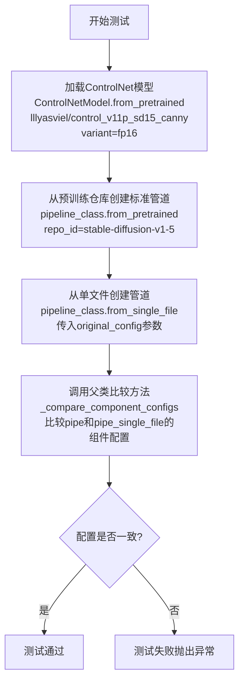

#### 带注释源码

```python
def test_single_file_components_with_original_config(self):
    """
    测试单文件格式加载时，使用original_config参数加载的管道组件配置
    与标准from_pretrained方式加载的管道组件配置是否一致
    """
    # 步骤1: 从预训练模型加载ControlNet模型（fp16变体）
    # 使用lllyasviel提供的control_v11p_sd15_canny模型
    controlnet = ControlNetModel.from_pretrained(
        "lllyasviel/control_v11p_sd15_canny", 
        variant="fp16"
    )
    
    # 步骤2: 使用标准预训练方式创建StableDiffusionControlNetPipeline管道
    # 从HuggingFace Hub的stable-diffusion-v1-5仓库加载
    pipe = self.pipeline_class.from_pretrained(
        self.repo_id,  # "stable-diffusion-v1-5/stable-diffusion-v1-5"
        controlnet=controlnet
    )
    
    # 步骤3: 使用单文件格式加载管道
    # 通过original_config参数指定原始SD配置文件路径
    # safety_checker=None表示不加载安全检查器
    pipe_single_file = self.pipeline_class.from_single_file(
        self.ckpt_path,  # 单文件检查点URL
        controlnet=controlnet,
        safety_checker=None,
        original_config=self.original_config  # 原始配置文件URL
    )
    
    # 步骤4: 调用父类的组件配置比较方法
    # 验证两种方式加载的管道组件配置是否完全一致
    super()._compare_component_configs(pipe, pipe_single_file)
```


### `TestStableDiffusionControlNetPipelineSingleFileSlow.test_single_file_components_with_original_config_local_files_only`

该测试方法用于验证从单文件检查点（single file checkpoint）加载 StableDiffusionControlNetPipeline 时，配合原始配置文件（original config）且仅使用本地文件（local files only）的场景下，其组件配置与从预训练模型仓库加载的 pipeline 保持一致性。

参数：

- `self`：隐式参数，测试类实例本身

返回值：`None`，该方法通过 `super()._compare_component_configs()` 执行断言测试来验证组件配置一致性

#### 流程图

```mermaid
flowchart TD
    A[开始测试] --> B[加载ControlNet模型<br/>ControlNetModel.from_pretrained<br/>lllyasviel/control_v11p_sd15_canny]
    B --> C[从预训练仓库加载Pipeline<br/>pipeline_class.from_pretrained<br/>使用repo_id]
    C --> D[创建临时目录<br/>tempfile.TemporaryDirectory]
    D --> E[提取仓库ID和权重名称<br/>_extract_repo_id_and_weights_name]
    E --> F[下载单文件检查点到本地<br/>download_single_file_checkpoint]
    F --> G[下载原始配置文件到本地<br/>download_original_config]
    G --> H[从本地单文件加载Pipeline<br/>pipeline_class.from_single_file<br/>传入local_ckpt_path<br/>original_config=local_original_config<br/>local_files_only=True]
    H --> I[调用父类方法比较组件配置<br/>super()._compare_component_configs]
    I --> J{配置是否一致}
    J -->|是| K[测试通过]
    J -->|否| L[抛出断言错误]
```

#### 带注释源码

```python
def test_single_file_components_with_original_config_local_files_only(self):
    """
    测试使用原始配置文件且仅本地文件模式下，
    从单文件检查点加载的Pipeline与从预训练仓库加载的Pipeline组件配置一致性
    """
    # 第一步：加载ControlNet模型
    # 使用指定的模型ID、torch_dtype为float16、variant为fp16
    controlnet = ControlNetModel.from_pretrained(
        "lllyasviel/control_v11p_sd15_canny", 
        torch_dtype=torch.float16, 
        variant="fp16"
    )
    
    # 第二步：从预训练仓库加载完整的Pipeline
    # 使用类属性repo_id和已加载的controlnet
    pipe = self.pipeline_class.from_pretrained(
        self.repo_id,
        controlnet=controlnet,
    )

    # 第三步：创建临时目录用于存放下载的文件
    with tempfile.TemporaryDirectory() as tmpdir:
        # 第四步：从检查点URL提取仓库ID和权重名称
        # 调用_extract_repo_id_and_weights_name解析self.ckpt_path
        repo_id, weights_name = _extract_repo_id_and_weights_name(self.ckpt_path)
        
        # 第五步：下载单文件检查点到本地临时目录
        # 返回本地检查点路径local_ckpt_path
        local_ckpt_path = download_single_file_checkpoint(repo_id, weights_name, tmpdir)

        # 第六步：下载原始配置文件到本地临时目录
        # 原始配置文件URL存储在self.original_config中
        local_original_config = download_original_config(self.original_config, tmpdir)

        # 第七步：从本地单文件检查点加载Pipeline
        # 关键参数：
        # - local_ckpt_path: 本地检查点文件路径
        # - original_config: 本地原始配置文件路径
        # - controlnet: 已加载的ControlNet模型
        # - safety_checker: 设置为None跳过安全检查器
        # - local_files_only: True表示仅使用本地文件，不联网
        pipe_single_file = self.pipeline_class.from_single_file(
            local_ckpt_path,
            original_config=local_original_config,
            controlnet=controlnet,
            safety_checker=None,
            local_files_only=True,
        )
    
    # 第八步：调用父类方法比较两个Pipeline的组件配置
    # 验证从单文件加载的Pipeline与从预训练仓库加载的Pipeline
    # 各个组件的配置是否一致
    super()._compare_component_configs(pipe, pipe_single_file)
```


### `TestStableDiffusionControlNetPipelineSingleFileSlow.test_single_file_components_with_diffusers_config`

该方法是一个测试用例，用于验证使用Diffusers配置通过单文件方式加载的Stable Diffusion ControlNet pipeline与通过常规预训练方式加载的pipeline的组件配置是否一致。

参数：

- `self`：隐式参数，测试类实例本身

返回值：`None`，该方法为测试方法，不返回任何值，仅通过断言验证组件配置一致性

#### 流程图

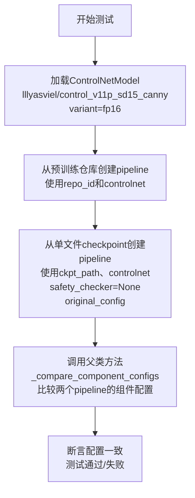

#### 带注释源码

```python
def test_single_file_components_with_diffusers_config(self):
    """
    测试单文件组件与Diffusers配置的一致性
    
    该测试方法验证:
    1. 从预训练仓库加载的pipeline
    2. 从单文件checkpoint加载的pipeline
    两者的组件配置是否完全一致
    """
    
    # 步骤1: 从预训练模型加载ControlNetModel
    # variant="fp16" 指定使用FP16精度版本以加快推理速度
    controlnet = ControlNetModel.from_pretrained(
        "lllyasviel/control_v11p_sd15_canny", 
        variant="fp16"
    )
    
    # 步骤2: 使用from_pretrained方法从HuggingFace Hub加载完整的pipeline
    # 包含unet、vae、text_encoder等所有组件
    pipe = self.pipeline_class.from_pretrained(
        self.repo_id,  # "stable-diffusion-v1-5/stable-diffusion-v1-5"
        controlnet=controlnet
    )
    
    # 步骤3: 使用from_single_file方法从单文件checkpoint加载pipeline
    # 通过original_config指定原始配置文件路径
    # safety_checker=None 禁用安全检查器以简化测试
    pipe_single_file = self.pipeline_class.from_single_file(
        self.ckpt_path,  # 单文件checkpoint的URL
        controlnet=controlnet,
        safety_checker=None,
        original_config=self.original_config  # 原始SD配置文件URL
    )
    
    # 步骤4: 调用父类的比较方法验证两个pipeline的组件配置是否一致
    # 这会检查unet、vae、text_encoder、controlnet等所有组件的配置参数
    super()._compare_component_configs(pipe, pipe_single_file)
```


### `TestStableDiffusionControlNetPipelineSingleFileSlow.test_single_file_components_with_diffusers_config_local_files_only`

该方法是一个集成测试用例，用于验证使用本地 Diffusers 配置文件从单文件 checkpoint 加载的 `StableDiffusionControlNetPipeline` 与从预训练模型加载的管道在组件配置上是否完全一致，确保单文件加载功能的正确性。

参数：
该方法无显式参数，依赖类属性：
- `self.repo_id`：str，从类属性继承，指定预训练模型仓库 ID（"stable-diffusion-v1-5/stable-diffusion-v1-5"）
- `self.ckpt_path`：str，从类属性继承，指定单文件 checkpoint 路径
- `self.pipeline_class`：type，从类属性继承，指定管道类（StableDiffusionControlNetPipeline）

返回值：`None`，通过 `super()._compare_component_configs()` 内部断言验证一致性

#### 流程图

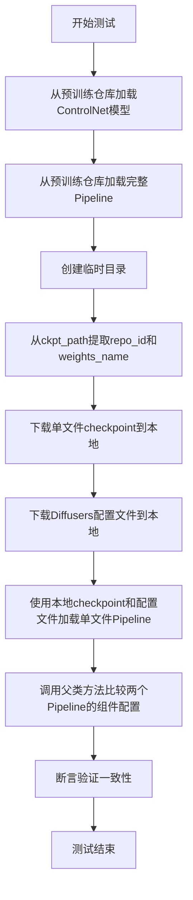

#### 带注释源码

```python
def test_single_file_components_with_diffusers_config_local_files_only(self):
    """
    测试使用本地 Diffusers 配置文件从单文件加载的 Pipeline 与预训练 Pipeline 的组件配置一致性。
    
    该测试验证了:
    1. 可以使用本地单文件 checkpoint (safetensors 格式) 加载模型
    2. 可以使用本地 Diffusers 配置文件 (config.json) 进行加载
    3. 通过单文件方式加载的管道与通过 from_pretrained 加载的管道组件配置一致
    """
    
    # Step 1: 从 HuggingFace Hub 加载 ControlNet 模型
    # 使用 fp16 变体以匹配单文件加载的配置
    controlnet = ControlNetModel.from_pretrained(
        "lllyasviel/control_v11p_sd15_canny", 
        torch_dtype=torch.float16, 
        variant="fp16"
    )
    
    # Step 2: 从预训练仓库加载完整的 StableDiffusionControlNetPipeline
    # 这是参考管道，用于后续配置比较
    pipe = self.pipeline_class.from_pretrained(
        self.repo_id,
        controlnet=controlnet,
    )
    
    # Step 3: 使用临时目录管理本地文件
    with tempfile.TemporaryDirectory() as tmpdir:
        
        # Step 4: 解析 checkpoint URL 提取仓库 ID 和权重文件名
        # 例如: https://huggingface.co/stable-diffusion-v1-5/... -> repo_id="stable-diffusion-v1-5", weights_name="v1-5-pruned-emaonly"
        repo_id, weights_name = _extract_repo_id_and_weights_name(self.ckpt_path)
        
        # Step 5: 下载单文件 checkpoint 到本地临时目录
        # 返回本地文件路径
        local_ckpt_path = download_single_file_checkpoint(repo_id, weights_name, tmpdir)
        
        # Step 6: 下载 Diffusers 配置文件到本地临时目录
        # 包括 config.json 等必要的配置文件
        local_diffusers_config = download_diffusers_config(self.repo_id, tmpdir)
        
        # Step 7: 使用本地文件加载单文件版本的 Pipeline
        # - local_ckpt_path: 本地 checkpoint 路径
        # - config: 本地 Diffusers 配置文件
        # - safety_checker: 禁用安全检查器
        # - controlnet: 使用与参考管道相同的 ControlNet
        # - local_files_only: 强制使用本地文件
        pipe_single_file = self.pipeline_class.from_single_file(
            local_ckpt_path,
            config=local_diffusers_config,
            safety_checker=None,
            controlnet=controlnet,
            local_files_only=True,
        )
    
    # Step 8: 调用父类方法比较两个管道的组件配置
    # 验证 UNet、VAE、Text Encoder、ControlNet 等组件的配置是否一致
    super()._compare_component_configs(pipe, pipe_single_file)
```


### `TestStableDiffusionControlNetPipelineSingleFileSlow.test_single_file_setting_pipeline_dtype_to_fp16`

该测试方法用于验证从单个safetensors文件加载的StableDiffusionControlNetPipeline能否正确设置torch数据类型为float16（fp16），通过加载fp16精度的ControlNet模型和设置pipeline的torch_dtype为torch.float16，并调用父类的测试方法进行断言验证。

参数：

- `self`：隐式参数，`TestStableDiffusionControlNetPipelineSingleFileSlow`类型，表示测试类实例本身

返回值：`None`，该方法无返回值，通过调用父类方法进行测试断言

#### 流程图

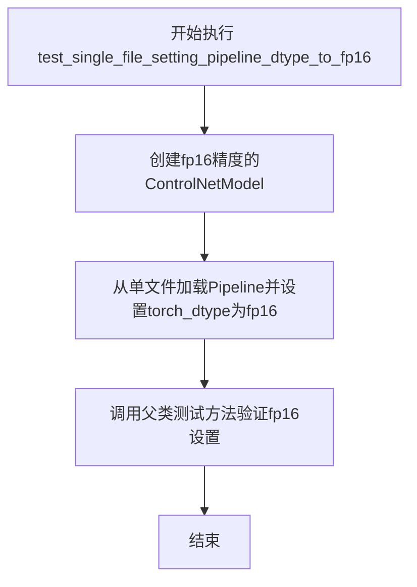

#### 带注释源码

```python
def test_single_file_setting_pipeline_dtype_to_fp16(self):
    """
    测试函数：验证单文件pipeline能够正确设置dtype为fp16
    
    该测试方法执行以下操作：
    1. 加载一个预训练且为fp16精度的ControlNetModel
    2. 使用from_single_file方法加载pipeline，指定torch_dtype为torch.float16
    3. 调用父类的同名测试方法进行实际的断言验证
    """
    
    # 从HuggingFace Hub加载ControlNet模型，指定使用fp16精度
    # torch_dtype=torch.float16: 设置模型权重为半精度浮点数
    # variant="fp16": 指定使用fp16变体权重
    controlnet = ControlNetModel.from_pretrained(
        "lllyasviel/control_v11p_sd15_canny", 
        torch_dtype=torch.float16, 
        variant="fp16"
    )
    
    # 从单个safetensors checkpoint文件加载完整的pipeline
    # self.ckpt_path: 指向stable-diffusion-v1-5的单个权重文件URL
    # controlnet: 传入已加载的fp16精度ControlNet模型
    # safety_checker=None: 禁用安全检查器以简化测试
    # torch_dtype=torch.float16: 确保整个pipeline使用fp16精度
    single_file_pipe = self.pipeline_class.from_single_file(
        self.ckpt_path, 
        controlnet=controlnet, 
        safety_checker=None, 
        torch_dtype=torch.float16
    )
    
    # 调用父类SDSingleFileTesterMixin的测试方法
    # 验证pipeline的dtype设置是否正确
    # 该父类方法会检查pipeline的所有组件是否都为fp16精度
    super().test_single_file_setting_pipeline_dtype_to_fp16(single_file_pipe)
```

## 关键组件


### 一段话描述

该代码是一个用于测试StableDiffusionControlNetPipeline单文件加载功能的测试套件，通过比较从预训练模型和单文件检查点加载的pipeline输出来验证单文件加载的正确性，支持本地文件、原始配置、Diffusers配置等多种加载方式，并包含内存优化和半精度推理功能。

### 关键组件信息

### 张量索引与惰性加载
通过`enable_model_cpu_offload`实现模型在CPU和GPU之间的惰性加载，减少显存占用；通过`backend_empty_cache`在测试前后清理GPU缓存，释放显存资源。

### 反量化支持
通过`torch_dtype=torch.float16`和`variant="fp16"`参数支持FP16半精度推理，减少内存占用并加速推理过程。

### 量化策略
使用float16量化策略，通过设置`torch_dtype=torch.float16`将模型和计算转换为半精度格式，同时通过`safety_checker=None`禁用了可能影响性能的安全检查器。

### 单文件检查点加载
通过`from_single_file`方法从远程URL或本地safetensors文件加载完整的扩散模型权重，支持多种配置参数。

### ControlNet条件控制
集成了ControlNet模型(`lllyasviel/control_v11p_sd15_canny`)用于基于边缘检测图的条件图像生成，实现对生成过程的精确控制。

### 组件配置比较
通过`_compare_component_configs`方法验证单文件加载的模型组件配置与预训练模型加载的组件配置一致性，确保功能等价性。

### 图像加载与处理
使用`load_image`从URL加载输入图像和ControlNet控制图像，并进行尺寸调整为512x512。

### 测试确定性控制
通过`enable_full_determinism`确保测试的可重复性，使用固定随机种子`seed=0`保证结果一致性。

### 配置下载工具
提供`download_single_file_checkpoint`、`download_original_config`、`download_diffusers_config`等工具函数，支持离线本地文件加载场景。

## 问题及建议


### 已知问题

- **重复代码**：多个测试方法中重复创建 `ControlNetModel` 对象，应该提取为共享的 fixture 或类方法
- **测试冗余**：`test_single_file_components_with_diffusers_config` 与 `test_single_file_components` 逻辑几乎完全相同，造成代码重复
- **硬编码配置**：模型路径、URL 等配置硬编码在类属性中，缺乏灵活的配置管理机制
- **资源泄漏风险**：`test_single_file_format_inference_is_same_as_pretrained` 中创建了两个 pipeline 但未显式清理，虽然有 `enable_model_cpu_offload` 但测试间可能存在资源残留
- **测试不确定性**：部分测试方法（如 `test_single_file_format_inference_is_same_as_pretrained`）未使用 `seed` 参数确保确定性，可能导致结果波动
- **网络依赖**：测试依赖外部 HuggingFace URL，没有实现 mock 或离线测试模式，导致测试不稳定
- **参数不一致**：部分方法传入 `safety_checker=None`，部分未传，参数处理不统一

### 优化建议

- 提取 `ControlNetModel` 创建逻辑到 `setup_method` 或使用 pytest fixture，减少重复代码
- 合并或删除重复的测试方法，如 `test_single_file_components` 系列
- 将配置外部化，支持通过环境变量或配置文件注入
- 在每个测试方法结束时显式调用 `del` 或使用 context manager 确保资源释放
- 为测试添加确定性 seed 参数，使用 `enable_full_determinism` 确保可重复性
- 使用 `responses` 或 `unittest.mock` 库 mock 外部网络请求，提高测试稳定性
- 统一 `safety_checker` 参数传递，明确每个测试的预期行为

## 其它


### 设计目标与约束

本测试类的核心设计目标是验证 StableDiffusionControlNetPipeline 从单文件（safetensors格式）加载模型后与从预训练模型（from_pretrained）加载的模型在推理结果上的一致性。约束条件包括：1) 必须使用slow标记，仅在有GPU加速器的环境下运行；2) 控制网络模型必须预先加载；3) 测试必须在CPU卸载（enable_model_cpu_offload）模式下运行以管理显存；4) 相似度阈值必须小于1e-3。

### 错误处理与异常设计

代码主要通过try-except处理文件操作异常（如download_single_file_checkpoint、download_original_config等下载函数的异常），通过assert语句验证推理结果的一致性。_compare_component_configs方法负责比较组件配置是否一致，任何不匹配都会抛出断言错误。临时目录使用tempfile.TemporaryDirectory确保资源正确释放。网络请求错误由下游函数传播。

### 数据流与状态机

测试数据流：ckpt_path (URL) -> download_single_file_checkpoint -> local_ckpt_path (本地文件) -> from_single_file -> pipe_sf (Pipeline实例) -> get_inputs -> pipe_sf(**inputs) -> output_sf。状态机转换：setup_method (gc.collect, empty_cache) -> 测试方法执行 -> teardown_method (gc.collect, empty_cache)。每个测试方法相互独立，共享类级别的pipeline_class、ckpt_path、original_config、repo_id等配置。

### 外部依赖与接口契约

主要外部依赖：1) diffusers库的ControlNetModel、StableDiffusionControlNetPipeline、load_image；2) 测试工具库的testing_utils和single_file_testing_utils；3) HuggingFace Hub远程模型（stable-diffusion-v1-5、control_v11p_sd15_canny）。接口契约：from_pretrained返回Pipeline实例，from_single_file返回相同类型的Pipeline实例，两者必须产生数值一致的推理结果。

### 性能考虑

代码使用enable_model_cpu_offload()优化显存使用，gc.collect()和backend_empty_cache()在setup/teardown中管理内存。测试使用较少的推理步数(num_inference_steps=3)来加速测试。使用了临时目录自动清理机制避免磁盘空间泄漏。

### 安全性考虑

代码从HuggingFace Hub下载模型文件，使用safetensors格式以防止恶意 pickle 文件。safety_checker=None显式禁用可能的安全检查器（因为是测试环境）。local_files_only=True选项用于限制网络访问。

### 可测试性

测试类继承SDSingleFileTesterMixin获取通用测试方法。_compare_component_configs提供组件级别的比较。get_inputs方法封装测试输入参数，便于复用和修改。enable_full_determinism确保测试可复现性。

### 配置管理

类级别配置：pipeline_class、ckpt_path、original_config、repo_id均为类属性。方法级配置通过get_inputs参数传递（device, generator_device, dtype, seed）。Pipeline加载支持多种配置参数：controlnet、safety_checker、torch_dtype、variant、original_config、config、local_files_only。

### 版本兼容性

代码使用torch.float16和variant="fp16"测试半精度兼容性。测试覆盖original_config和diffusers_config两种配置格式。向下兼容性通过_compare_component_configs验证组件结构一致性。

### 资源管理

临时文件通过tempfile.TemporaryDirectory()自动管理。GPU显存通过enable_model_cpu_offload()分批加载。内存通过gc.collect()和backend_empty_cache()周期性释放。所有测试方法遵循setup/teardown模式确保资源释放。

    