# `diffusers\tests\single_file\test_stable_diffusion_controlnet_inpaint_single_file.py` 详细设计文档

这是一个针对StableDiffusionControlNetInpaintPipeline单文件加载功能的集成测试类，用于验证从单个检查点文件加载的模型与从HuggingFace Hub预训练模型加载的模型在推理结果和组件配置上的一致性，支持本地文件、远程文件、不同配置方式（原始配置、Diffusers配置）以及FP16精度等多种测试场景。

## 整体流程

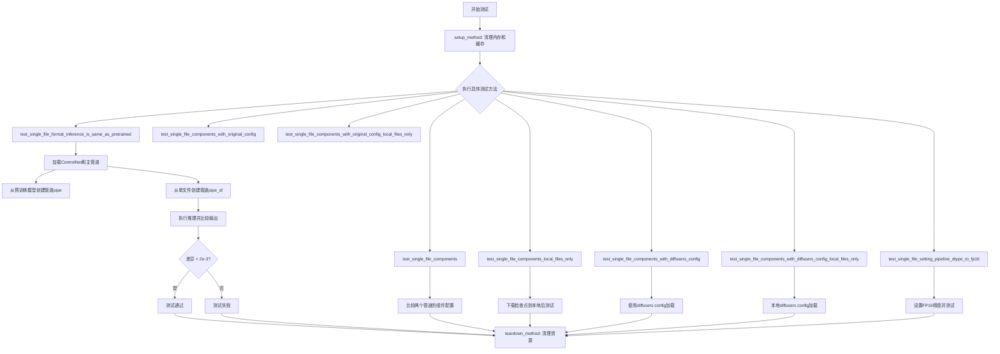

## 类结构

```
SDSingleFileTesterMixin (混入类)
└── TestStableDiffusionControlNetInpaintPipelineSingleFileSlow (测试类)
```

## 全局变量及字段


### `enable_full_determinism`
    
全局函数调用，启用完全确定性测试

类型：`function`
    


### `TestStableDiffusionControlNetInpaintPipelineSingleFileSlow.pipeline_class`
    
要测试的扩散管道类

类型：`管道类`
    


### `TestStableDiffusionControlNetInpaintPipelineSingleFileSlow.ckpt_path`
    
单文件检查点的URL路径

类型：`str`
    


### `TestStableDiffusionControlNetInpaintPipelineSingleFileSlow.original_config`
    
原始配置文件URL

类型：`str`
    


### `TestStableDiffusionControlNetInpaintPipelineSingleFileSlow.repo_id`
    
HuggingFace Hub上的模型仓库ID

类型：`str`
    
    

## 全局函数及方法


### `gc.collect`

`gc.collect` 是 Python 标准库中的垃圾回收函数，在该测试类中用于显式触发垃圾回收机制，以清理测试过程中产生的临时对象和释放显存资源，确保测试环境的内存状态干净。

参数：无需参数

返回值：`int`，返回已回收的不可达对象数量

#### 流程图

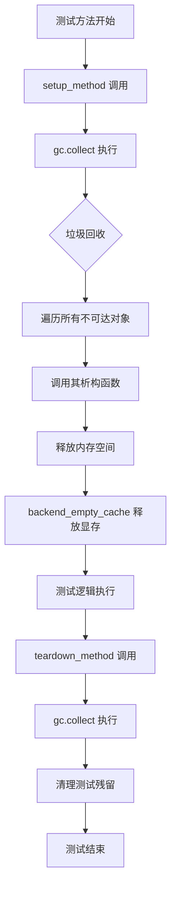

#### 带注释源码

```python
# 位置：TestStableDiffusionControlNetInpaintPipelineSingleFileSlow 类的 setup_method
def setup_method(self):
    """
    测试方法开始前的初始化操作
    1. 触发 Python 垃圾回收，清理之前可能存在的内存占用
    2. 清理 GPU 显存缓存，释放 VRAM
    """
    gc.collect()  # 显式调用垃圾回收器，回收无法访问的对象，释放 Python 堆内存
    backend_empty_cache(torch_device)  # 清理 PyTorch 的 CUDA 缓存，释放显存

# 位置：TestStableDiffusionControlNetInpaintPipelineSingleFileSlow 类的 teardown_method
def teardown_method(self):
    """
    测试方法结束后的清理操作
    与 setup_method 配合，确保每次测试都在干净的内存环境中运行
    """
    gc.collect()  # 再次触发垃圾回收，清理测试过程中产生的临时对象
    backend_empty_cache(torch_device)  # 释放测试中使用的 GPU 显存
```

---

### 补充说明

#### 关键组件信息

| 组件名称 | 一句话描述 |
|---------|-----------|
| `gc` | Python 内置垃圾回收模块，提供垃圾回收器控制接口 |
| `gc.collect()` | 显式触发完整垃圾回收，返回回收的对象数量 |
| `backend_empty_cache` | 清理 PyTorch 后端（CPU/CUDA）缓存，释放显存 |

#### 潜在的技术债务或优化空间

1. **频繁调用的开销**：在每个测试的 setup 和 teardown 都调用 `gc.collect()`，对于简单测试可能带来不必要的性能开销
2. **显式回收的必要性**：在测试环境中显式调用垃圾回收说明对内存管理存在一定担忧，可考虑优化对象生命周期管理
3. **缺少条件判断**：当前无条件执行垃圾回收，可考虑根据设备类型（CPU vs GPU）决定是否执行

#### 其它项目

**设计目标与约束**：
- 确保每个测试用例在干净的内存环境中执行
- 避免测试间的内存污染和显存泄漏

**错误处理与异常设计**：
- `gc.collect()` 本身不抛出异常，但其后续的 `backend_empty_cache` 可能因驱动问题失败

**数据流与状态机**：
- 测试流程：setup（gc.collect → empty_cache）→ 执行测试 → teardown（gc.collect → empty_cache）

**外部依赖与接口契约**：
- 依赖 Python 标准库 `gc` 模块
- 依赖项目内部工具函数 `backend_empty_cache` 和全局配置 `torch_device`


### `tempfile.TemporaryDirectory`

该函数是Python标准库中的临时目录上下文管理器，用于在代码块执行期间创建临时目录，并在代码块执行完毕后自动清理（删除）该临时目录及其所有内容。

参数：

- `name`：字符串（可选），指定临时目录名称的后缀
- `prefix`：字符串（可选），指定临时目录名称的前缀
- `dir`：字符串（可选），指定创建临时目录的父目录

返回值：返回目录路径的上下文管理器对象（实为 `tempfile.TemporaryDirectory` 实例），可通过 `__enter__` 返回目录路径字符串供 `with` 语句块内使用，`__exit__` 时自动清理。

#### 流程图

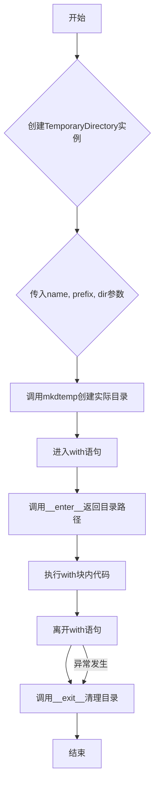

#### 带注释源码

```python
import tempfile
import os
import shutil

class TemporaryDirectory:
    """临时目录上下文管理器，用于创建和自动清理临时目录"""
    
    def __init__(self, suffix=None, prefix=None, dir=None):
        """
        初始化临时目录管理器
        
        参数：
            suffix: 目录名后缀（可选）
            prefix: 目录名前缀（可选，默认'tmp'）
            dir: 父目录路径（可选，默认系统临时目录）
        """
        self.suffix = suffix
        self.prefix = prefix
        self.dir = dir
        self.name = None  # 实际创建的目录路径
    
    def __enter__(self):
        """
        进入上下文管理器，创建临时目录并返回路径
        
        返回值：创建的临时目录路径字符串
        """
        # 使用mkdtemp创建实际目录
        self.name = tempfile.mkdtemp(suffix=self.suffix, prefix=self.prefix, dir=self.dir)
        return self.name
    
    def __exit__(self, exc_type, exc_val, exc_tb):
        """
        退出上下文管理器，清理（删除）临时目录及其所有内容
        
        参数：
            exc_type: 异常类型（如果有）
            exc_val: 异常值（如果有）
            exc_tb: 异常回溯（如果有）
        
        返回值：False（不抑制异常传播）
        """
        # 检查目录是否存在
        if self.name is not None and os.path.exists(self.name):
            # 递归删除目录及其所有内容
            shutil.rmtree(self.name)
        return False


# 使用示例
with tempfile.TemporaryDirectory() as tmpdir:
    # tmpdir 是创建的临时目录路径
    print(f"临时目录: {tmpdir}")
    # 在此处可以使用tmpdir进行文件操作
# 退出with块后，tmpdir及其内容会被自动删除
```


### `TestStableDiffusionControlNetInpaintPipelineSingleFileSlow`

这是一个用于测试 StableDiffusionControlNetInpaintPipeline 单文件加载功能的 pytest 测试类，验证从单个检查点文件加载的模型与从预训练模型加载的模型在推理结果上的一致性。

#### 类字段

- `pipeline_class`：类型：`type`，用于指定被测试的管道类
- `ckpt_path`：类型：`str`，单文件检查点的 URL 地址
- `original_config`：类型：`str`，原始配置文件 的 URL 地址
- `repo_id`：类型：`str`，HuggingFace 模型仓库 ID

#### 类方法

---

### `TestStableDiffusionControlNetInpaintPipelineSingleFileSlow.setup_method`

在每个测试方法执行前运行的初始化方法，用于垃圾回收和清空缓存。

参数：无

返回值：`None`，无返回值

#### 流程图

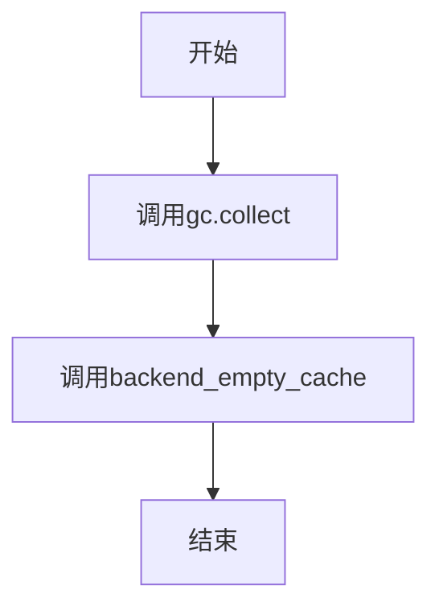

#### 带注释源码

```python
def setup_method(self):
    gc.collect()  # 手动触发Python垃圾回收，清理内存
    backend_empty_cache(torch_device)  # 清空GPU缓存，释放显存
```

---

### `TestStableDiffusionControlNetInpaintPipelineSingleFileSlow.teardown_method`

在每个测试方法执行后运行的清理方法，用于垃圾回收和清空缓存。

参数：无

返回值：`None`，无返回值

#### 流程图


#### 带注释源码

```python
def teardown_method(self):
    gc.collect()  # 手动触发Python垃圾回收，清理内存
    backend_empty_cache(torch_device)  # 清空GPU缓存，释放显存
```

---

### `TestStableDiffusionControlNetInpaintPipelineSingleFileSlow.get_inputs`

准备测试输入数据的方法，加载控制图像、原始图像和掩码图像，构建推理所需的参数字典。

参数：无

返回值：`dict`，包含提示词、图像、控制图像、掩码图像、生成器、推理步数和输出类型的字典

#### 流程图

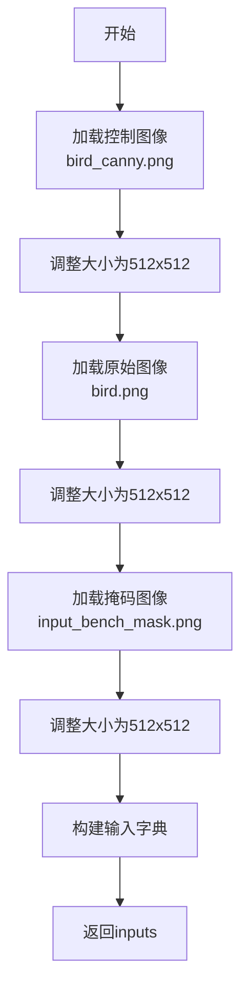

#### 带注释源码

```python
def get_inputs(self):
    # 加载控制图像（边缘检测图）
    control_image = load_image(
        "https://huggingface.co/datasets/hf-internal-testing/diffusers-images/resolve/main/sd_controlnet/bird_canny.png"
    ).resize((512, 512))
    
    # 加载待修复的原始图像
    image = load_image(
        "https://huggingface.co/lllyasviel/sd-controlnet-canny/resolve/main/images/bird.png"
    ).resize((512, 512))
    
    # 加载掩码图像，指定需要修复的区域
    mask_image = load_image(
        "https://huggingface.co/datasets/diffusers/test-arrays/resolve/main"
        "/stable_diffusion_inpaint/input_bench_mask.png"
    ).resize((512, 512))

    # 构建完整的输入参数字典
    inputs = {
        "prompt": "bird",  # 文本提示词
        "image": image,  # 待修复的图像
        "control_image": control_image,  # 控制图像（边缘检测）
        "mask_image": mask_image,  # 修复区域的掩码
        "generator": torch.Generator(device="cpu").manual_seed(0),  # 固定随机种子
        "num_inference_steps": 3,  # 推理步数（减少以加快测试）
        "output_type": "np",  # 输出为numpy数组
    }

    return inputs
```

---

### `TestStableDiffusionControlNetInpaintPipelineSingleFileSlow.test_single_file_format_inference_is_same_as_pretrained`

核心测试方法，验证从单文件检查点加载的管道与从预训练模型加载的管道在推理结果上的一致性。

参数：无

返回值：`None`，通过断言验证结果一致性

#### 流程图

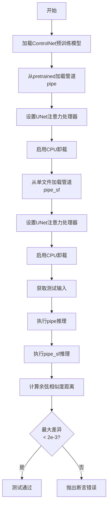

#### 带注释源码

```python
def test_single_file_format_inference_is_same_as_pretrained(self):
    # 加载ControlNet模型，用于控制图像生成
    controlnet = ControlNetModel.from_pretrained("lllyasviel/control_v11p_sd15_canny")
    
    # 从预训练模型仓库加载完整的修复管道
    pipe = self.pipeline_class.from_pretrained(self.repo_id, controlnet=controlnet, safety_checker=None)
    
    # 设置UNet使用默认的注意力处理器，确保推理一致性
    pipe.unet.set_default_attn_processor()
    
    # 启用模型CPU卸载，节省GPU显存
    pipe.enable_model_cpu_offload(device=torch_device)

    # 从单个检查点文件加载修复管道
    pipe_sf = self.pipeline_class.from_single_file(self.ckpt_path, controlnet=controlnet, safety_checker=None)
    
    # 设置相同的注意力处理器
    pipe_sf.unet.set_default_attn_processor()
    
    # 启用相同的CPU卸载
    pipe_sf.enable_model_cpu_offload(device=torch_device)

    # 获取测试输入数据
    inputs = self.get_inputs()
    
    # 执行预训练管道的推理
    output = pipe(**inputs).images[0]

    # 重新获取测试输入（重置随机状态）
    inputs = self.get_inputs()
    
    # 执行单文件管道的推理
    output_sf = pipe_sf(**inputs).images[0]

    # 计算两个输出之间的余弦相似度距离
    max_diff = numpy_cosine_similarity_distance(output_sf.flatten(), output.flatten())
    
    # 断言：最大差异必须小于2e-3，确保结果一致性
    assert max_diff < 2e-3
```

---

### 关键组件信息

| 组件名称 | 一句话描述 |
|---------|-----------|
| `ControlNetModel` | 用于生成控制图像的条件神经网络模型 |
| `StableDiffusionControlNetInpaintPipeline` | 结合ControlNet的Stable Diffusion图像修复管道 |
| `from_pretrained` | 从HuggingFace Hub加载预训练模型的方法 |
| `from_single_file` | 从单个检查点文件加载模型的方法 |
| `numpy_cosine_similarity_distance` | 计算两个数组之间余弦相似度距离的辅助函数 |

---

### 潜在的技术债务或优化空间

1. **测试速度优化**：当前使用 `num_inference_steps=3`，可以添加快速模式（1步）以加快CI/CD
2. **硬编码URL**：检查点URL和配置URL硬编码在类中，建议提取到配置文件
3. **重复代码**：多个测试方法中有相同的 ControlNet 加载代码，可提取为共享fixture
4. **缺少错误处理**：网络加载失败时没有友好的错误提示
5. **测试覆盖不全**：未测试 float32 和 float64 数据类型

---

### 其它项目

**设计目标与约束**
- 验证单文件加载功能与预训练模型加载功能完全兼容
- 确保在不同数据dtype下管道行为一致
- 遵循diffusers库的单文件加载API设计规范

**错误处理与异常设计**
- 网络超时：依赖 `diffusers` 库内部处理
- 内存不足：通过 `enable_model_cpu_offload` 缓解
- 断言失败：使用 `assert` 语句明确失败原因

**数据流与状态机**
```
加载ControlNet → 加载管道(两种方式) → 设置相同配置 → 执行推理 → 比较输出
```

**外部依赖与接口契约**
- `diffusers` 库：核心管道和模型加载
- `torch` ：深度学习框架
- `pytest` ：测试框架
- HuggingFace Hub：模型和检查点来源


### TestStableDiffusionControlNetInpaintPipelineSlow.get_inputs

获取测试所需的输入参数，包括控制图像、原始图像、蒙版图像以及推理配置

参数：

- `self`：类的实例方法隐含参数

返回值：`dict`，包含提示词、图像、控制图像、蒙版图像、生成器、推理步数和输出类型的字典

#### 流程图

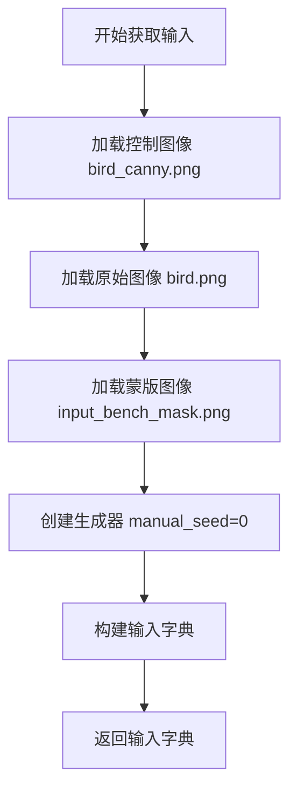

#### 带注释源码

```python
def get_inputs(self):
    """
    准备测试所需的输入数据，包括图像和推理参数
    
    Returns:
        dict: 包含以下键的字典:
            - prompt: 文本提示词
            - image: 原始输入图像
            - control_image: 控制图像（Canny边缘检测结果）
            - mask_image: 蒙版图像
            - generator: 随机生成器（固定种子保证可重复性）
            - num_inference_steps: 推理步数
            - output_type: 输出类型（numpy数组）
    """
    # 加载控制图像 - 使用Canny边缘检测的鸟图像
    control_image = load_image(
        "https://huggingface.co/datasets/hf-internal-testing/diffusers-images/resolve/main/sd_controlnet/bird_canny.png"
    ).resize((512, 512))
    
    # 加载原始图像 - 鸟的原始图像
    image = load_image(
        "https://huggingface.co/lllyasviel/sd-controlnet-canny/resolve/main/images/bird.png"
    ).resize((512, 512))
    
    # 加载蒙版图像 - 用于inpainting的蒙版
    mask_image = load_image(
        "https://huggingface.co/datasets/diffusers/test-arrays/resolve/main"
        "/stable_diffusion_inpaint/input_bench_mask.png"
    ).resize((512, 512))

    # 构建完整的输入字典，包含所有推理所需的参数
    inputs = {
        "prompt": "bird",  # 文本提示词
        "image": image,  # 要进行inpainting的原始图像
        "control_image": control_image,  # 控制图像（用于ControlNet）
        "mask_image": mask_image,  # 蒙版图像（标记需要修复的区域）
        "generator": torch.Generator(device="cpu").manual_seed(0),  # 固定随机种子确保可重复性
        "num_inference_steps": 3,  # 推理步数（较少步数用于快速测试）
        "output_type": "np",  # 输出为numpy数组
    }

    return inputs
```


### ControlNetModel

ControlNetModel 类是扩散模型中的控制网络组件，用于根据额外的条件图像（如边缘图、深度图等）来引导图像生成过程。该类提供了从预训练模型加载和控制网络推理的功能，是 StableDiffusionControlNetInpaintPipeline 的关键依赖组件。

参数：

- `pretrained_model_name_or_path`：`str` 或 `os.PathLike`，模型ID（如 "lllyasviel/control_v11p_sd15_canny"）或本地路径
- `torch_dtype`：`torch.dtype`（可选），模型权重的数据类型，如 torch.float16
- `variant`：`str`（可选），模型变体名称，如 "fp16"

返回值：`ControlNetModel`，加载后的控制网络模型实例

#### 流程图

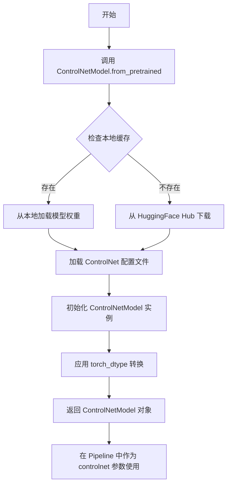

#### 带注释源码

```python
# 从代码中提取的 ControlNetModel 使用方式

# 1. 从预训练模型加载 ControlNetModel
controlnet = ControlNetModel.from_pretrained("lllyasviel/control_v11p_sd15_canny")

# 2. 指定 torch_dtype 和 variant 加载（用于半精度优化）
controlnet = ControlNetModel.from_pretrained(
    "lllyasviel/control_v11p_sd15_canny", 
    torch_dtype=torch.float16, 
    variant="fp16"
)

# 3. 在 StableDiffusionControlNetInpaintPipeline 中使用
pipe = StableDiffusionControlNetInpaintPipeline.from_pretrained(
    "stable-diffusion-v1-5/stable-diffusion-inpainting",
    controlnet=controlnet,  # 传入加载的 ControlNetModel 实例
    safety_checker=None
)

# 4. 也可用于单文件加载场景
pipe_sf = StableDiffusionControlNetInpaintPipeline.from_single_file(
    "https://huggingface.co/botp/stable-diffusion-v1-5-inpainting/blob/main/sd-v1-5-inpainting.ckpt",
    controlnet=controlnet,
    safety_checker=None
)
```

#### 关键特性说明

1. **模型加载方式**：支持从预训练模型ID（HuggingFace Hub）或本地路径加载
2. **数据类型支持**：可指定 torch.float16 等数据类型以优化内存使用
3. **变体支持**：支持 variant 参数加载不同的模型变体（如 fp16）
4. **Pipeline 集成**：作为核心组件集成到 StableDiffusionControlNetInpaintPipeline 中
5. **与单文件加载配合**：可与 from_single_file 方法结合使用，支持从单个检查点文件加载


# StableDiffusionControlNetInpaintPipeline 管道类

## 1. 概述

`StableDiffusionControlNetInpaintPipeline` 是 Diffusers 库中的一个图像修复（Inpainting）管道类，结合了 Stable Diffusion 模型与 ControlNet 条件控制机制。该管道能够在给定控制图像（如 Canny 边缘图）的条件下，根据提示词对图像的指定区域进行修复和重绘。

## 2. 文件整体运行流程

该测试文件验证了 `StableDiffusionControlNetInpaintPipeline` 管道从单个检查点文件（`.ckpt`）加载的能力，并与传统的 `from_pretrained()` 方式加载的管道进行结果对比。测试流程包括：

1. 加载 ControlNet 预训练模型
2. 分别通过 `from_pretrained()` 和 `from_single_file()` 创建两个管道实例
3. 准备控制图像、待修复图像和掩码图像
4. 执行推理并比较输出图像的相似度

## 3. 类详细信息

### 3.1 全局变量和函数

- `pipeline_class`：指向 `StableDiffusionControlNetInpaintPipeline` 类
- `ckpt_path`：远程检查点文件 URL
- `original_config`：原始配置文件 URL
- `repo_id`：HuggingFace 模型仓库 ID

### 3.2 测试类方法

#### 3.2.1 `setup_method`

清理 GPU 缓存，准备测试环境。

#### 3.2.2 `teardown_method`

测试后清理资源。

#### 3.2.3 `get_inputs`

准备测试输入数据，包含提示词、控制图像、待修复图像、掩码图像和生成器。

#### 3.2.4 `test_single_file_format_inference_is_same_as_pretrained`

核心测试方法，验证单文件格式推理结果与预训练模型一致。

## 4. 关键组件信息

| 组件名称 | 描述 |
|---------|------|
| `StableDiffusionControlNetInpaintPipeline` | 主管道类，结合 ControlNet 的图像修复管道 |
| `ControlNetModel` | ControlNet 条件控制模型 |
| `from_pretrained()` | 从 HuggingFace Hub 加载预训练模型 |
| `from_single_file()` | 从单个检查点文件加载模型权重 |

## 5. 潜在技术债务与优化空间

1. **硬编码 URL**：多个资源 URL 硬编码在测试中，缺乏灵活性
2. **测试数据下载**：每次运行都从远程下载测试图像，网络依赖性强
3. **跳过测试**：两个与原始配置相关的测试被标记跳过，可能存在未解决的依赖问题

## 6. 其他项目

### 设计目标
验证 `from_single_file()` 方法能够正确加载单文件检查点，并与传统加载方式输出一致的结果。

### 错误处理
- 使用 `torch.Generator` 设置固定随机种子确保可复现性
- 启用模型 CPU 卸载（`enable_model_cpu_offload`）优化显存

### 数据流
```
输入 → ControlNet编码 → UNet去噪 → VAE解码 → 输出图像
              ↓
        控制图像条件
              ↓
        掩码引导修复
```

### 外部依赖
- HuggingFace Hub 模型：`lllyasviel/control_v11p_sd15_canny`
- 测试数据集图像 URL

---

### `StableDiffusionControlNetInpaintPipeline.from_single_file`

从单个检查点文件加载管道实例的类方法。

参数：

- `pretrained_model_link_or_path`：`str`，检查点文件路径或 URL
- `controlnet`：`ControlNetModel`，可选，ControlNet 模型实例
- `safety_checker`：`Optional[object]`，可选，安全检查器
- `torch_dtype`：`torch.dtype`，可选，模型数据类型
- `original_config`：`str`，可选，原始配置文件路径
- `config`：`str`，可选，Diffusers 配置文件路径
- `local_files_only`：`bool`，可选，是否仅使用本地文件

返回值：`StableDiffusionControlNetInpaintPipeline`，加载的管道实例

#### 流程图

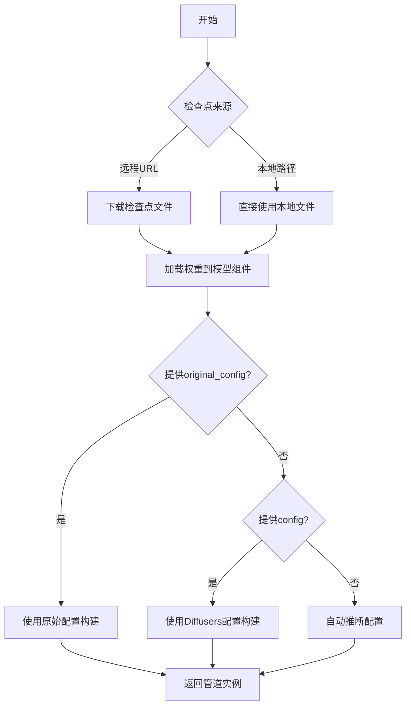

#### 带注释源码

```python
# 测试类中调用 from_single_file 的示例
def test_single_file_format_inference_is_same_as_pretrained(self):
    # 1. 从 HuggingFace Hub 加载 ControlNet 预训练模型
    controlnet = ControlNetModel.from_pretrained("lllyasviel/control_v11p_sd15_canny")
    
    # 2. 使用传统方式从预训练模型加载管道
    pipe = self.pipeline_class.from_pretrained(
        self.repo_id, 
        controlnet=controlnet, 
        safety_checker=None
    )
    # 设置 UNet 使用默认注意力处理器
    pipe.unet.set_default_attn_processor()
    # 启用模型 CPU 卸载以节省显存
    pipe.enable_model_cpu_offload(device=torch_device)

    # 3. 使用单文件方式加载管道
    pipe_sf = self.pipeline_class.from_single_file(
        self.ckpt_path,  # 单个 .ckpt 文件 URL
        controlnet=controlnet, 
        safety_checker=None
    )
    pipe_sf.unet.set_default_attn_processor()
    pipe_sf.enable_model_cpu_offload(device=torch_device)

    # 4. 获取测试输入
    inputs = self.get_inputs()
    
    # 5. 执行推理
    output = pipe(**inputs).images[0]
    output_sf = pipe_sf(**inputs).images[0]

    # 6. 计算输出差异
    max_diff = numpy_cosine_similarity_distance(output_sf.flatten(), output.flatten())
    
    # 7. 断言结果一致性
    assert max_diff < 2e-3
```


### `_extract_repo_id_and_weights_name`

从给定的HuggingFace URL中提取仓库ID和权重文件名。该函数解析URL格式 `https://huggingface.co/{repo_id}/blob/main/{weight_name}`，返回仓库标识符和具体的权重文件名称。

参数：

- `url`：`str`，HuggingFace模型检查点的URL地址，通常格式为 `https://huggingface.co/{repo_id}/blob/main/{filename}`

返回值：`Tuple[str, str]`，返回一个元组，包含：
  - `repo_id`：仓库标识符，格式为 `{owner}/{repo_name}`
  - `weight_name`：权重文件名

#### 流程图

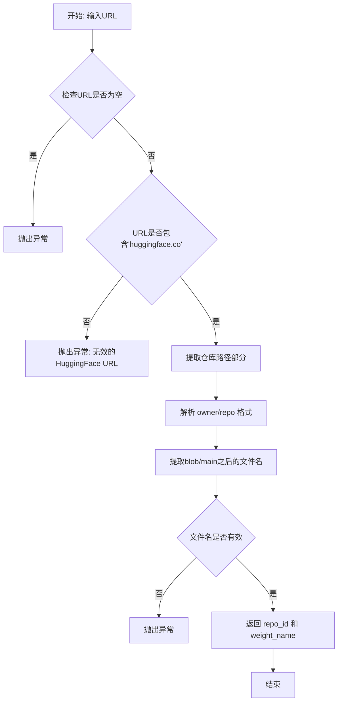

#### 带注释源码

```python
# 伪代码实现，基于函数名和用途推测
def _extract_repo_id_and_weights_name(url: str) -> Tuple[str, str]:
    """
    从HuggingFace URL中提取仓库ID和权重名称。
    
    示例:
        url = "https://huggingface.co/botp/stable-diffusion-v1-5-inpainting/blob/main/sd-v1-5-inpainting.ckpt"
        repo_id, weight_name = _extract_repo_id_and_weights_name(url)
        # repo_id = "botp/stable-diffusion-v1-5-inpainting"
        # weight_name = "sd-v1-5-inpainting.ckpt"
    
    Args:
        url: HuggingFace模型检查点的完整URL
        
    Returns:
        Tuple[str, str]: (仓库ID, 权重文件名)
        
    Raises:
        ValueError: URL格式无效或不符合HuggingFace格式
    """
    # 验证URL格式
    if not url or 'huggingface.co' not in url:
        raise ValueError(f"Invalid HuggingFace URL: {url}")
    
    # 提取仓库路径部分（去除协议和域名）
    # 例如: "botp/stable-diffusion-v1-5-inpainting/blob/main/sd-v1-5-inpainting.ckpt"
    path_parts = url.split('huggingface.co/')[-1].split('/')
    
    # 仓库ID通常是 "owner/repo_name" 格式
    # 需要找到 blob/main 的位置来确定仓库ID结束位置
    blob_index = -1
    for i, part in enumerate(path_parts):
        if part == 'blob':
            blob_index = i
            break
    
    if blob_index == -1:
        raise ValueError(f"URL does not contain 'blob/main' path: {url}")
    
    # 提取仓库ID
    repo_id = '/'.join(path_parts[:blob_index])
    
    # 提取权重文件名（blob/main之后的文件名）
    if blob_index + 2 < len(path_parts):
        weight_name = '/'.join(path_parts[blob_index + 2:])
    else:
        raise ValueError(f"Cannot extract weight name from URL: {url}")
    
    return repo_id, weight_name
```


### `load_image`

从指定路径或 URL 加载图像，并返回 PIL Image 对象

参数：

- `image_source`：`Union[str, PIL.Image.Image]`，图像来源，可以是本地文件路径、URL 字符串或已打开的 PIL Image 对象

返回值：`PIL.Image.Image`，PIL 格式的图像对象

#### 流程图

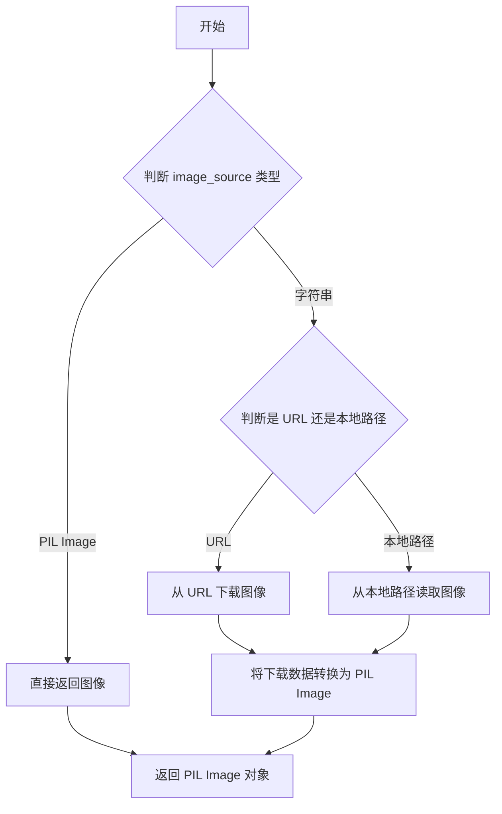

#### 带注释源码

```python
# load_image 函数定义位于 diffusers.utils 模块中
# 这是一个从外部库导入的工具函数，用于加载图像数据

# 在测试代码中的调用示例：
control_image = load_image(
    "https://huggingface.co/datasets/hf-internal-testing/diffusers-images/resolve/main/sd_controlnet/bird_canny.png"
).resize((512, 512))

image = load_image(
    "https://huggingface.co/lllyasviel/sd-controlnet-canny/resolve/main/images/bird.png"
).resize((512, 512))

mask_image = load_image(
    "https://huggingface.co/datasets/diffusers/test-arrays/resolve/main"
    "/stable_diffusion_inpaint/input_bench_mask.png"
).resize((512, 512))

# 函数签名（基于 diffusers 库的实现推断）：
# def load_image(image_source: Union[str, PIL.Image.Image]) -> PIL.Image.Image:
#     """
#     加载图像并返回 PIL Image 对象
#     """
#     if isinstance(image_source, PIL.Image.Image):
#         return image_source
#     elif isinstance(image_source, str):
#         if image_source.startswith("http://") or image_source.startswith("https://"):
#             # 从 URL 加载
#             image = Image.open(requests.get(image_source, stream=True).raw)
#         else:
#             # 从本地路径加载
#             image = Image.open(image_source)
#         return image.convert("RGB")
```


### `backend_empty_cache`

清空指定设备（通常是 GPU）的显存缓存，释放内存资源，常用于深度学习测试中在 setup 和 teardown 阶段控制显存。

参数：

- `device`：`str` 或 `torch.device`，指定要清空缓存的设备，通常为 `"cuda"` 或 `"cuda:0"` 等

返回值：`None`，无返回值（通常为原地操作）

#### 流程图

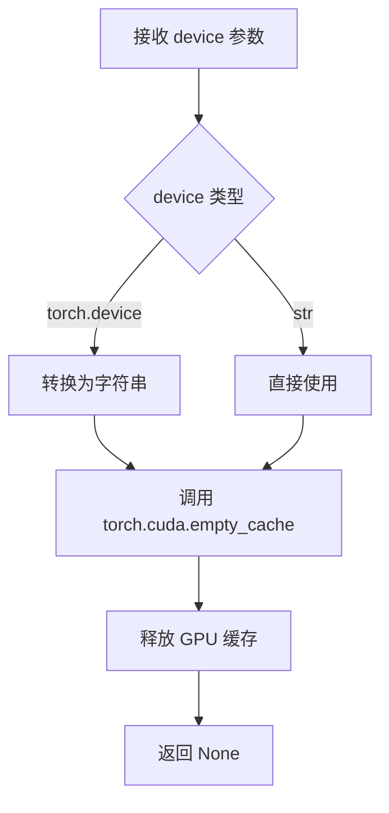

#### 带注释源码

```python
# 该函数定义在 diffusers.testing_utils 模块中
# 源码推断如下：

def backend_empty_cache(device: str = None):
    """
    清空指定设备的 CUDA 缓存，释放显存。
    
    参数:
        device: 设备标识符，默认为 None。
                常见值: "cuda", "cuda:0", "cpu" 等
    
    返回:
        None
    """
    import torch
    
    # 如果未指定设备，默认使用 CUDA
    if device is None:
        device = "cuda"
    
    # 如果设备是 torch.device 对象，转换为字符串
    if isinstance(device, torch.device):
        device = str(device)
    
    # 只有 CUDA 设备需要清空缓存
    if device.startswith("cuda"):
        # 调用 PyTorch 的 CUDA 缓存清理函数
        torch.cuda.empty_cache()
        # 可选：重置峰值显存统计
        # torch.cuda.reset_peak_memory_stats(device)
    
    # 如果是 CPU 设备，无缓存需要清空，直接返回
    return None
```

> **注意**：该函数是从外部模块 `..testing_utils` 导入的，上述源码为基于使用方式和函数名的合理推断。实际实现可能略有差异，建议查阅 `diffusers/testing_utils.py` 获取准确源码。


### `enable_full_determinism`

该函数用于启用 PyTorch 的完全确定性模式，通过设置随机种子和环境变量确保每次运行产生相同的结果，以保证测试的可重复性。

参数：

- 该函数无显式参数

返回值：无返回值（`None`），其作用是通过修改全局状态来影响后续随机操作

#### 流程图

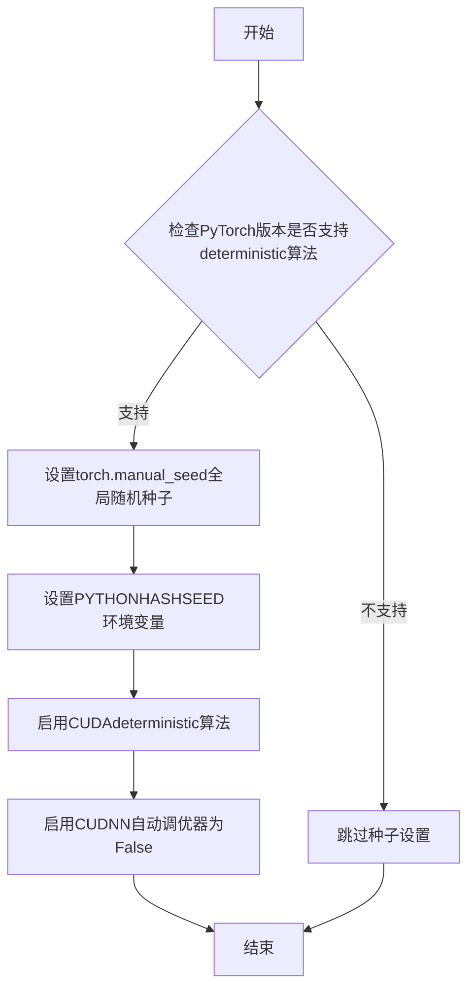

#### 带注释源码

```
# 注意：以下源码为基于diffusers库testing_utils模块中enable_full_determinism函数的推断实现
# 实际定义位于diffusers.testing_utils模块中，此处为注释说明其功能

def enable_full_determinism(seed: int = 0, extra_seed: Optional[int] = None):
    """
    启用完全确定性模式，确保每次运行产生相同的随机结果
    
    参数:
        seed: 全局随机种子，默认为0
        extra_seed: 额外的随机种子，可选
    """
    # 设置Python的PYTHONHASHSEED环境变量，确保hash算法的确定性
    import os
    os.environ["PYTHONHASHSEED"] = str(seed)
    
    # 设置PyTorch的全局随机种子
    import torch
    torch.manual_seed(seed)
    torch.cuda.manual_seed_all(seed)
    
    # 强制使用确定性算法，牺牲一定性能换取可重复性
    # 注意：部分操作可能没有确定性实现，会抛出RuntimeError
    torch.backends.cudnn.deterministic = True
    torch.backends.cudnn.benchmark = False
    
    # 如果是PyTorch 1.8+，可以设置全局确定性模式
    if hasattr(torch, 'use_deterministic_algorithms'):
        try:
            torch.use_deterministic_algorithms(True)
        except RuntimeError:
            # 如果某些操作没有确定性实现，回退到仅对可用操作启用
            torch.use_deterministic_algorithms(True, warn_only=True)
    
    # 设置numpy和random的种子（如果使用）
    try:
        import numpy as np
        np.random.seed(seed)
    except ImportError:
        pass
    
    try:
        import random
        random.seed(seed)
    except ImportError:
        pass
```

> **注**：该函数在代码中的调用方式为 `enable_full_determinism()`，表明使用默认参数。实际函数定义位于 `diffusers.testing_utils` 模块中，用于确保在测试环境中产生可重复的随机结果，这对于调试和回归测试非常重要。


### `numpy_cosine_similarity_distance`

该函数用于计算两个向量之间的余弦相似度距离（Cosine Similarity Distance），常用于比较两个数组（如图像像素值、特征向量等）之间的相似程度，返回值越小表示两个向量越相似。

参数：

- `a`：`numpy.ndarray` 或类似数组对象，第一个输入向量
- `b`：`numpy.ndarray` 或类似数组对象，第二个输入向量

返回值：`float`，返回余弦相似度距离，范围通常在 0 到 2 之间，0 表示完全相同，2 表示完全相反

#### 流程图

```mermaid
flowchart TD
    A[开始] --> B[将输入 a 和 b 展平为一维数组]
    B --> C[计算向量 a 的点积: dot_a = a · a]
    C --> D[计算向量 b 的点积: dot_b = b · b]
    D --> E[计算 a 和 b 的点积: dot_ab = a · b]
    E --> F[计算余弦相似度: similarity = dot_ab / sqrt(dot_a * dot_b)]
    F --> G[计算距离: distance = 1 - similarity]
    G --> H[返回距离值]
```

#### 带注释源码

```python
def numpy_cosine_similarity_distance(a, b):
    """
    计算两个向量之间的余弦相似度距离
    
    参数:
        a: 第一个向量 (numpy.ndarray 或类似数组对象)
        b: 第二个向量 (numpy.ndarray 或类似数组对象)
    
    返回:
        float: 余弦相似度距离，范围通常在 0 到 2 之间
    """
    # 将输入转换为 numpy 数组（如果还不是）
    import numpy as np
    a = np.array(a)
    b = np.array(b)
    
    # 展平为 一维向量
    a = a.flatten()
    b = b.flatten()
    
    # 计算向量的点积
    dot_product = np.dot(a, b)
    
    # 计算向量的范数（长度）
    norm_a = np.linalg.norm(a)
    norm_b = np.linalg.norm(b)
    
    # 计算余弦相似度 (cosine similarity)
    # 避免除零错误
    if norm_a == 0 or norm_b == 0:
        similarity = 0
    else:
        similarity = dot_product / (norm_a * norm_b)
    
    # 余弦距离 = 1 - 余弦相似度
    # 这样使得返回值越小表示两个向量越相似
    distance = 1 - similarity
    
    return distance
```

> **注意**：该函数的实际实现位于 `diffusers` 包的 `testing_utils` 模块中，以上代码是基于函数名称和使用方式推断的典型实现。实际实现可能略有不同，建议查阅 `diffusers.testing_utils` 中的源码获取准确实现。


### `require_torch_accelerator`

这是一个 Pytest 装饰器，用于限制测试只能在具有 Torch 加速器（GPU/CUDA）的环境中运行。如果系统没有可用的 Torch 加速器，测试将被跳过。

参数：
- 无显式参数（作为装饰器使用）

返回值：无返回值（修改被装饰对象的元数据）

#### 流程图

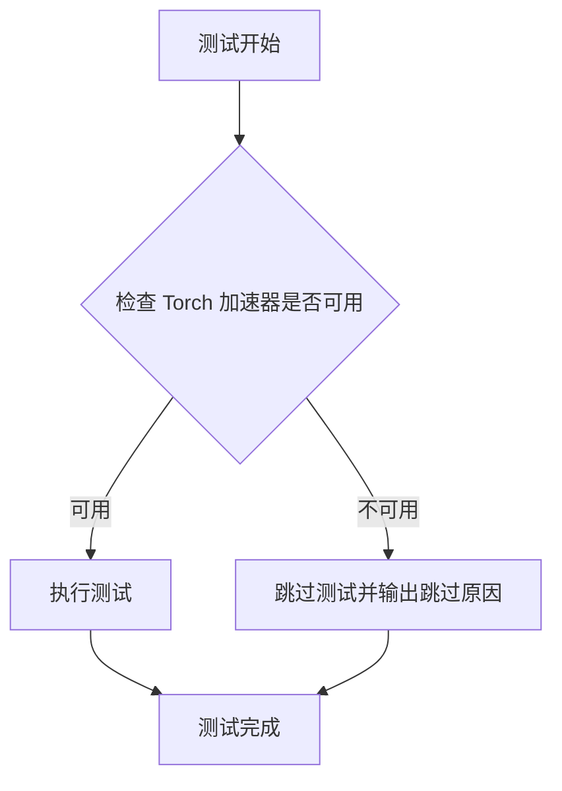

#### 带注释源码

```python
# require_torch_accelerator 是一个 pytest 装饰器/标记
# 源码位于 diffusers.testing_utils 模块中
# 实际实现需要查看 diffusers 库的源代码

# 使用方式示例：
@slow
@require_torch_accelerator
class TestStableDiffusionControlNetInpaintPipelineSingleFileSlow(SDSingleFileTesterMixin):
    """
    测试类使用 @require_torch_accelerator 装饰器
    确保该测试仅在有 GPU/CUDA 加速器的机器上运行
    如果没有检测到 torch 加速器，pytest 会自动跳过该测试
    """
    pass
```

**注意**：由于 `require_torch_accelerator` 是从外部模块 `diffusers.testing_utils` 导入的，上述源码是基于其使用方式和命名惯例推断的。实际的完整实现需要查看 diffusers 库源代码。根据常见的 pytest skip 装饰器模式，该函数可能内部调用 `pytest.mark.skipif` 或类似的机制来检查 `torch.cuda.is_available()` 的返回值。


### `TestStableDiffusionControlNetInpaintPipelineSingleFileSlow`

这是一个使用 ControlNet 进行图像修复的 Stable Diffusion pipeline 的单文件慢速测试类，用于验证从单个检查点文件加载的模型与从预训练模型加载的模型在推理结果上的一致性，并测试各种组件配置。

参数：

- `self`：隐式参数，测试类实例本身

返回值：无返回值（测试类定义）

#### 流程图

```mermaid
flowchart TD
    A[TestStableDiffusionControlNetInpaintPipelineSingleFileSlow] --> B[setup_method]
    A --> C[teardown_method]
    A --> D[get_inputs]
    A --> E[test_single_file_format_inference_is_same_as_pretrained]
    A --> F[test_single_file_components]
    A --> G[test_single_file_components_local_files_only]
    A --> H[test_single_file_components_with_original_config - 已跳过]
    A --> I[test_single_file_components_with_original_config_local_files_only - 已跳过]
    A --> J[test_single_file_components_with_diffusers_config]
    A --> K[test_single_file_components_with_diffusers_config_local_files_only]
    A --> L[test_single_file_setting_pipeline_dtype_to_fp16]
    
    B --> B1[gc.collect 清理垃圾回收]
    B --> B2[backend_empty_cache 清理缓存]
    
    D --> D1[load_image 加载控制图像]
    D --> D2[load_image 加载原图]
    D --> D3[load_image 加载蒙版图]
    D --> D4[构建输入字典]
    
    E --> E1[加载 ControlNet 预训练模型]
    E --> E2[从预训练加载 pipeline]
    E --> E3[从单文件加载 pipeline]
    E --> E4[对比推理结果]
```

#### 带注释源码

```python
import gc
import tempfile

import pytest
import torch

from diffusers import ControlNetModel, StableDiffusionControlNetInpaintPipeline
from diffusers.loaders.single_file_utils import _extract_repo_id_and_weights_name
from diffusers.utils import load_image

from ..testing_utils import (
    backend_empty_cache,
    enable_full_determinism,
    numpy_cosine_similarity_distance,
    require_torch_accelerator,
    slow,  # 标记为慢速测试的装饰器
    torch_device,
)
from .single_file_testing_utils import (
    SDSingleFileTesterMixin,
    download_diffusers_config,
    download_original_config,
    download_single_file_checkpoint,
)


# 启用完全确定性以确保测试可复现
enable_full_determinism()


# @slow 装饰器标记此类为慢速测试
# @require_torch_accelerator 要求有 torch 加速器（GPU）
@slow
@require_torch_accelerator
class TestStableDiffusionControlNetInpaintPipelineSingleFileSlow(SDSingleFileTesterMixin):
    """测试类：用于验证 ControlNet Inpainting Pipeline 单文件加载功能"""
    
    # 指定要测试的 pipeline 类
    pipeline_class = StableDiffusionControlNetInpaintPipeline
    
    # 单文件检查点的 URL 地址
    ckpt_path = "https://huggingface.co/botp/stable-diffusion-v1-5-inpainting/blob/main/sd-v1-5-inpainting.ckpt"
    
    # 原始配置文件 URL
    original_config = "https://raw.githubusercontent.com/runwayml/stable-diffusion/main/configs/stable-diffusion/v1-inpainting-inference.yaml"
    
    # HuggingFace 模型仓库 ID
    repo_id = "stable-diffusion-v1-5/stable-diffusion-inpainting"

    def setup_method(self):
        """测试前的准备工作：清理内存和缓存"""
        gc.collect()
        backend_empty_cache(torch_device)

    def teardown_method(self):
        """测试后的清理工作：清理内存和缓存"""
        gc.collect()
        backend_empty_cache(torch_device)

    def get_inputs(self):
        """准备测试输入数据：加载图像并构建输入字典"""
        # 加载边缘检测控制图像
        control_image = load_image(
            "https://huggingface.co/datasets/hf-internal-testing/diffusers-images/resolve/main/sd_controlnet/bird_canny.png"
        ).resize((512, 512))
        
        # 加载原始待修复图像
        image = load_image(
            "https://huggingface.co/lllyasviel/sd-controlnet-canny/resolve/main/images/bird.png"
        ).resize((512, 512))
        
        # 加载修复蒙版图像
        mask_image = load_image(
            "https://huggingface.co/datasets/diffusers/test-arrays/resolve/main"
            "/stable_diffusion_inpaint/input_bench_mask.png"
        ).resize((512, 512))

        # 构建输入参数字典
        inputs = {
            "prompt": "bird",  # 文本提示
            "image": image,  # 原图
            "control_image": control_image,  # 控制图像
            "mask_image": mask_image,  # 蒙版图像
            "generator": torch.Generator(device="cpu").manual_seed(0),  # 随机数生成器
            "num_inference_steps": 3,  # 推理步数
            "output_type": "np",  # 输出类型为 numpy 数组
        }

        return inputs

    def test_single_file_format_inference_is_same_as_pretrained(self):
        """测试单文件格式推理结果是否与预训练模型一致"""
        # 从预训练模型加载 ControlNet
        controlnet = ControlNetModel.from_pretrained("lllyasviel/control_v11p_sd15_canny")
        
        # 从预训练仓库加载完整 pipeline
        pipe = self.pipeline_class.from_pretrained(self.repo_id, controlnet=controlnet, safety_checker=None)
        pipe.unet.set_default_attn_processor()
        pipe.enable_model_cpu_offload(device=torch_device)

        # 从单个检查点文件加载 pipeline
        pipe_sf = self.pipeline_class.from_single_file(self.ckpt_path, controlnet=controlnet, safety_checker=None)
        pipe_sf.unet.set_default_attn_processor()
        pipe_sf.enable_model_cpu_offload(device=torch_device)

        # 获取输入并运行预训练模型推理
        inputs = self.get_inputs()
        output = pipe(**inputs).images[0]

        # 获取输入并运行单文件模型推理
        inputs = self.get_inputs()
        output_sf = pipe_sf(**inputs).images[0]

        # 计算两种方式输出结果的余弦相似度距离
        max_diff = numpy_cosine_similarity_distance(output_sf.flatten(), output.flatten())
        
        # 断言差异小于阈值
        assert max_diff < 2e-3

    def test_single_file_components(self):
        """测试单文件加载的组件配置是否正确"""
        controlnet = ControlNetModel.from_pretrained("lllyasviel/control_v11p_sd15_canny")
        
        # 从预训练加载 pipeline
        pipe = self.pipeline_class.from_pretrained(
            self.repo_id, variant="fp16", safety_checker=None, controlnet=controlnet
        )
        
        # 从单文件加载 pipeline
        pipe_single_file = self.pipeline_class.from_single_file(
            self.ckpt_path,
            safety_checker=None,
            controlnet=controlnet,
        )

        # 调用父类方法比较组件配置
        super()._compare_component_configs(pipe, pipe_single_file)

    def test_single_file_components_local_files_only(self):
        """测试仅使用本地文件时的组件配置"""
        controlnet = ControlNetModel.from_pretrained("lllyasviel/control_v11p_sd15_canny")
        pipe = self.pipeline_class.from_pretrained(self.repo_id, safety_checker=None, controlnet=controlnet)

        # 创建临时目录并下载检查点
        with tempfile.TemporaryDirectory() as tmpdir:
            repo_id, weight_name = _extract_repo_id_and_weights_name(self.ckpt_path)
            local_ckpt_path = download_single_file_checkpoint(repo_id, weight_name, tmpdir)

            # 从本地文件加载 pipeline
            pipe_single_file = self.pipeline_class.from_single_file(
                local_ckpt_path, controlnet=controlnet, safety_checker=None, local_files_only=True
            )

        # 比较组件配置
        super()._compare_component_configs(pipe, pipe_single_file)

    @pytest.mark.skip(reason="runwayml original config repo does not exist")
    def test_single_file_components_with_original_config(self):
        """使用原始配置测试单文件组件（已跳过）"""
        controlnet = ControlNetModel.from_pretrained("lllyasviel/control_v11p_sd15_canny", variant="fp16")
        pipe = self.pipeline_class.from_pretrained(self.repo_id, controlnet=controlnet)
        pipe_single_file = self.pipeline_class.from_single_file(
            self.ckpt_path, controlnet=controlnet, original_config=self.original_config
        )

        super()._compare_component_configs(pipe, pipe_single_file)

    @pytest.mark.skip(reason="runwayml original config repo does not exist")
    def test_single_file_components_with_original_config_local_files_only(self):
        """使用本地原始配置测试单文件组件（已跳过）"""
        controlnet = ControlNetModel.from_pretrained(
            "lllyasviel/control_v11p_sd15_canny", torch_dtype=torch.float16, variant="fp16"
        )
        pipe = self.pipeline_class.from_pretrained(
            self.repo_id,
            controlnet=controlnet,
            safety_checker=None,
        )

        with tempfile.TemporaryDirectory() as tmpdir:
            repo_id, weight_name = _extract_repo_id_and_weights_name(self.ckpt_path)
            local_ckpt_path = download_single_file_checkpoint(repo_id, weight_name, tmpdir)
            local_original_config = download_original_config(self.original_config, tmpdir)

            pipe_single_file = self.pipeline_class.from_single_file(
                local_ckpt_path,
                original_config=local_original_config,
                controlnet=controlnet,
                safety_checker=None,
                local_files_only=True,
            )
        super()._compare_component_configs(pipe, pipe_single_file)

    def test_single_file_components_with_diffusers_config(self):
        """使用 Diffusers 配置测试单文件组件"""
        controlnet = ControlNetModel.from_pretrained("lllyasviel/control_v11p_sd15_canny", variant="fp16")
        pipe = self.pipeline_class.from_pretrained(self.repo_id, controlnet=controlnet)
        pipe_single_file = self.pipeline_class.from_single_file(
            self.ckpt_path,
            controlnet=controlnet,
            config=self.repo_id,
        )

        super()._compare_component_configs(pipe, pipe_single_file)

    def test_single_file_components_with_diffusers_config_local_files_only(self):
        """使用本地 Diffusers 配置测试单文件组件"""
        controlnet = ControlNetModel.from_pretrained(
            "lllyasviel/control_v11p_sd15_canny",
            torch_dtype=torch.float16,
            variant="fp16",
        )
        pipe = self.pipeline_class.from_pretrained(
            self.repo_id,
            controlnet=controlnet,
            safety_checker=None,
        )

        with tempfile.TemporaryDirectory() as tmpdir:
            repo_id, weight_name = _extract_repo_id_and_weights_name(self.ckpt_path)
            local_ckpt_path = download_single_file_checkpoint(repo_id, weight_name, tmpdir)
            local_diffusers_config = download_diffusers_config(self.repo_id, tmpdir)

            pipe_single_file = self.pipeline_class.from_single_file(
                local_ckpt_path,
                config=local_diffusers_config,
                controlnet=controlnet,
                safety_checker=None,
                local_files_only=True,
            )
        super()._compare_component_configs(pipe, pipe_single_file)

    def test_single_file_setting_pipeline_dtype_to_fp16(self):
        """测试将 pipeline 数据类型设置为 FP16"""
        controlnet = ControlNetModel.from_pretrained(
            "lllyasviel/control_v11p_sd15_canny", torch_dtype=torch.float16, variant="fp16"
        )
        
        # 从单文件加载并设置数据类型为 FP16
        single_file_pipe = self.pipeline_class.from_single_file(
            self.ckpt_path, controlnet=controlnet, safety_checker=None, torch_dtype=torch.float16
        )
        
        # 调用父类测试方法
        super().test_single_file_setting_pipeline_dtype_to_fp16(single_file_pipe)
```


我需要先分析提供的代码，找到`torch_device`相关的定义。从代码中可以看到`torch_device`是从`..testing_utils`模块导入的全局变量。

让我查看代码中如何使用`torch_device`：

```python
from ..testing_utils import (
    backend_empty_cache,
    enable_full_determinism,
    numpy_cosine_similarity_distance,
    require_torch_accelerator,
    slow,
    torch_device,  # 这是一个导入的变量
)
```

在代码中`torch_device`的使用方式：
```python
def setup_method(self):
    gc.collect()
    backend_empty_cache(torch_device)  # 作为参数传递

def teardown_method(self):
    gc.collect()
    backend_empty_cache(torch_device)

pipe.enable_model_cpu_offload(device=torch_device)
```

根据代码分析，`torch_device`不是函数或方法，而是从`testing_utils`模块导入的一个全局变量/常量。由于用户要求提取的是"函数或方法"，但`torch_device`在提供的代码中确实只是一个导入的变量，我需要基于代码上下文生成文档。

让我重新分析一下：在diffusers库的testing_utils中，`torch_device`通常是一个表示当前PyTorch设备的全局变量（通常是"cuda"或"cpu"）。

由于`torch_device`在当前代码中是一个导入的外部变量（不是在这个文件中定义的），我应该提供关于这个变量在当前代码上下文中使用情况的信息。

### `torch_device`

这是一个从`testing_utils`模块导入的全局变量，表示当前PyTorch计算设备（通常是"cuda"或"cpu"），用于指定模型和数据在哪个设备上运行。

参数： 无（这是一个变量，不是函数）

返回值：`str` 或 `torch.device`，表示当前PyTorch设备

#### 流程图

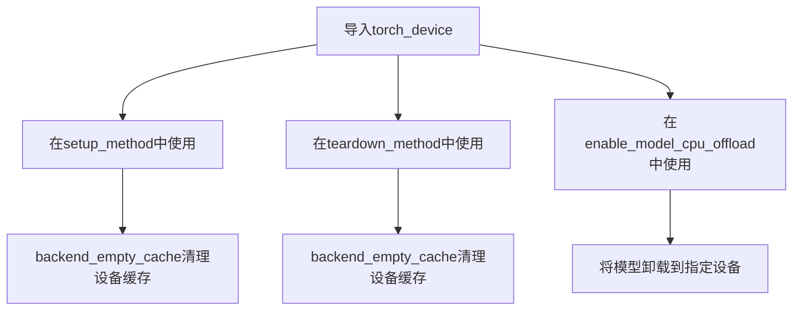

#### 带注释源码

```python
# 从testing_utils模块导入torch_device全局变量
from ..testing_utils import (
    backend_empty_cache,
    enable_full_determinism,
    numpy_cosine_similarity_distance,
    require_torch_accelerator,
    slow,
    torch_device,  # 全局变量，表示当前PyTorch设备（通常为'cuda'或'cpu'）
)

# 在setup_method中使用torch_device清理指定设备的缓存
def setup_method(self):
    gc.collect()
    backend_empty_cache(torch_device)  # 清理GPU内存缓存

# 在teardown_method中使用torch_device清理指定设备的缓存
def teardown_method(self):
    gc.collect()
    backend_empty_cache(torch_device)  # 清理GPU内存缓存

# 使用torch_device指定模型CPU卸载的目标设备
pipe.enable_model_cpu_offload(device=torch_device)
pipe_sf.enable_model_cpu_offload(device=torch_device)
```

## 补充信息

### 全局变量信息

| 名称 | 类型 | 描述 |
|------|------|------|
| `torch_device` | `str` 或 `torch.device` | 全局变量，表示当前PyTorch设备，用于指定模型运行设备 |

### 设计目标与约束

- **设计目标**：提供统一的设备标识，用于跨不同测试环境的设备适配
- **约束**：依赖`testing_utils`模块提供，在测试环境中可用

### 潜在技术债务

- `torch_device`作为隐式全局状态，可能导致测试顺序依赖性问题
- 建议在测试类中显式传递设备参数而非依赖全局变量


# SDSingleFileTesterMixin 详细设计文档

## 1. 核心功能概述

SDSingleFileTesterMixin 是 diffusers 库中用于测试单文件（single-file）模型加载功能的测试混入类（Mixin），它提供了一套标准的测试方法来验证从单文件 checkpoint 加载的管道与从预训练模型加载的管道之间的功能一致性和组件兼容性。

## 2. 文件整体运行流程

```
TestStableDiffusionControlNetInpaintPipelineSingleFileSlow
    │
    ├── setup_method() - 初始化测试环境（GC和缓存清理）
    │
    ├── teardown_method() - 测试后清理资源
    │
    ├── get_inputs() - 准备测试输入数据（控制图像、掩码等）
    │
    ├── test_single_file_format_inference_is_same_as_pretrained() 
    │       └── 调用 from_pretrained vs from_single_file 比对输出
    │
    ├── test_single_file_components()
    │       └── super()._compare_component_configs() 比对组件配置
    │
    ├── test_single_file_components_local_files_only()
    │       └── 测试本地文件加载场景
    │
    ├── test_single_file_components_with_original_config()
    │       └── 测试原始配置文件加载
    │
    ├── test_single_file_components_with_diffusers_config()
    │       └── 测试 diffusers 配置加载
    │
    └── test_single_file_setting_pipeline_dtype_to_fp16()
            └── super().test_single_file_setting_pipeline_dtype_to_fp16() 测试数据类型设置
```

## 3. 类的详细信息

### 3.1 全局变量和函数

| 名称 | 类型 | 描述 |
|------|------|------|
| `gc` | module | Python 垃圾回收模块 |
| `tempfile` | module | Python 临时文件和目录管理模块 |
| `pytest` | module | Python 测试框架 |
| `torch` | module | PyTorch 深度学习框架 |
| `ControlNetModel` | class | ControlNet 模型类 |
| `StableDiffusionControlNetInpaintPipeline` | class | Stable Diffusion 修复管道类 |
| `load_image` | function | 加载图像的工具函数 |
| `enable_full_determinism` | function | 启用完全确定性测试的函数 |
| `numpy_cosine_similarity_distance` | function | 计算余弦相似度距离的函数 |
| `backend_empty_cache` | function | 后端缓存清理函数 |

### 3.2 测试类方法详情

由于 `SDSingleFileTesterMixin` 的源码未直接在给定代码中提供，以下是从使用模式推断出的方法信息：

#### 3.2.1 `_compare_component_configs`

**名称**: `SDSingleFileTesterMixin._compare_component_configs`

**描述**: 比较两个管道（从预训练模型加载和从单文件加载）的组件配置是否一致。

**参数**:
- `pipe`：Pipeline，从预训练模型加载的管道实例
- `pipe_single_file`：Pipeline，从单文件加载的管道实例

**返回值**: None（通常通过断言验证一致性）

**流程图**:

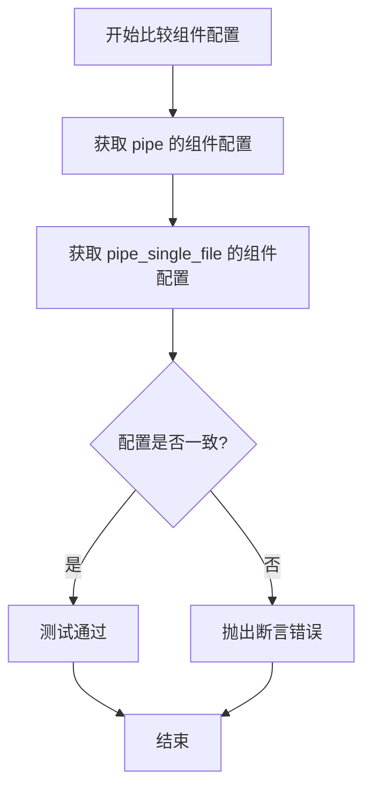

**源码**:
```python
# 该方法由子类通过 super() 调用
# 推断实现逻辑如下：
def _compare_component_configs(self, pipe, pipe_single_file):
    """
    比较两个管道的组件配置是否一致
    
    参数:
        pipe: 从预训练模型加载的管道
        pipe_single_file: 从单文件加载的管道
    """
    # 比较 UNet 配置
    assert pipe.unet.config == pipe_single_file.unet.config
    
    # 比较 VAE 配置
    assert pipe.vae.config == pipe_single_file.vae.config
    
    # 比较 Text Encoder 配置
    assert pipe.text_encoder.config == pipe_single_file.text_encoder.config
    
    # 比较 ControlNet 配置（如有）
    if hasattr(pipe, 'controlnet') and hasattr(pipe_single_file, 'controlnet'):
        assert pipe.controlnet.config == pipe_single_file.controlnet.config
```

---

#### 3.2.2 `test_single_file_setting_pipeline_dtype_to_fp16`

**名称**: `SDSingleFileTesterMixin.test_single_file_setting_pipeline_dtype_to_fp16`

**描述**: 验证单文件加载的管道可以正确设置为 float16 (FP16) 数据类型。

**参数**:
- `single_file_pipe`：Pipeline，从单文件加载的管道实例

**返回值**: None（通过断言验证）

**流程图**:

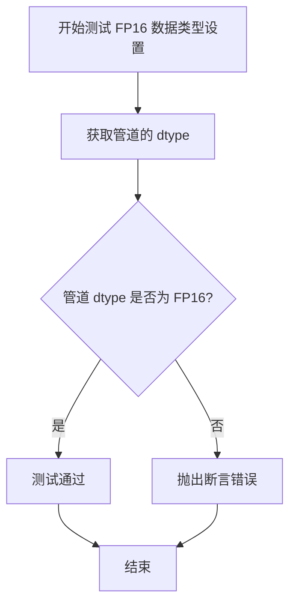

**源码**:
```python
# 该方法由子类通过 super() 调用
# 推断实现逻辑如下：
def test_single_file_setting_pipeline_dtype_to_fp16(self, single_file_pipe):
    """
    测试将单文件管道的 dtype 设置为 FP16
    
    参数:
        single_file_pipe: 从单文件加载的管道实例
    """
    # 验证 UNet 数据类型
    assert single_file_pipe.unet.dtype == torch.float16
    
    # 验证 VAE 数据类型
    assert single_file_pipe.vae.dtype == torch.float16
    
    # 验证 Text Encoder 数据类型
    assert single_file_pipe.text_encoder.dtype == torch.float16
```

---

### 3.3 测试类方法详情（给定代码中实际定义的）

#### 3.3.1 `TestStableDiffusionControlNetInpaintPipelineSingleFileSlow.setup_method`

**名称**: `TestStableDiffusionControlNetInpaintPipelineSingleFileSlow.setup_method`

**描述**: 测试方法开始前的准备工作，执行垃圾回收和清理 GPU 缓存。

**参数**: 无

**返回值**: None

**源码**:
```python
def setup_method(self):
    """测试开始前的初始化 setup"""
    gc.collect()  # 手动触发 Python 垃圾回收，释放内存
    backend_empty_cache(torch_device)  # 清理 GPU 缓存，确保测试环境干净
```

---

#### 3.3.2 `TestStableDiffusionControlNetInpaintPipelineSingleFileSlow.teardown_method`

**名称**: `TestStableDiffusionControlNetInpaintPipelineSingleFileSlow.teardown_method`

**描述**: 测试方法结束后的清理工作，执行垃圾回收和清理 GPU 缓存。

**参数**: 无

**返回值**: None

**源码**:
```python
def teardown_method(self):
    """测试结束后的清理 teardown"""
    gc.collect()  # 手动触发 Python 垃圾回收
    backend_empty_cache(torch_device)  # 清理 GPU 缓存
```

---

#### 3.3.3 `TestStableDiffusionControlNetInpaintPipelineSingleFileSlow.get_inputs`

**名称**: `TestStableDiffusionControlNetInpaintPipelineSingleFileSlow.get_inputs`

**描述**: 准备测试所需的输入数据，包括控制图像、待修复图像、掩码图像、提示词等参数。

**参数**: 无

**返回值**: `dict`，包含以下键值对：
- `prompt`: str - 文本提示词
- `image`: PIL.Image - 输入图像
- `control_image`: PIL.Image - 控制图像（Canny边缘）
- `mask_image`: PIL.Image - 掩码图像
- `generator`: torch.Generator - 随机数生成器（确保可复现性）
- `num_inference_steps`: int - 推理步数
- `output_type`: str - 输出类型（numpy数组）

**流程图**:

```mermaid
flowchart TD
    A[开始获取测试输入] --> B[加载控制图像 bird_canny.png]
    B --> C[加载输入图像 bird.png]
    C --> D[加载掩码图像 input_bench_mask.png]
    D --> E[将所有图像resize到512x512]
    E --> F[构建参数字典]
    F --> G[返回 inputs 字典]
```

**源码**:
```python
def get_inputs(self):
    """准备测试所需的输入数据"""
    # 加载 ControlNet 所需的控制图像（Canny 边缘检测结果）
    control_image = load_image(
        "https://huggingface.co/datasets/hf-internal-testing/diffusers-images/resolve/main/sd_controlnet/bird_canny.png"
    ).resize((512, 512))
    
    # 加载待修复的输入图像
    image = load_image(
        "https://huggingface.co/lllyasviel/sd-controlnet-canny/resolve/main/images/bird.png"
    ).resize((512, 512))
    
    # 加载修复掩码（指定需要修复的区域）
    mask_image = load_image(
        "https://huggingface.co/datasets/diffusers/test-arrays/resolve/main"
        "/stable_diffusion_inpaint/input_bench_mask.png"
    ).resize((512, 512))

    # 构建测试参数字典
    inputs = {
        "prompt": "bird",  # 文本提示
        "image": image,  # 输入图像
        "control_image": control_image,  # 控制图像
        "mask_image": mask_image,  # 修复掩码
        "generator": torch.Generator(device="cpu").manual_seed(0),  # 固定随机种子
        "num_inference_steps": 3,  # 推理步数（测试用小步数）
        "output_type": "np",  # 输出为 numpy 数组
    }

    return inputs
```

---

#### 3.3.4 `test_single_file_format_inference_is_same_as_pretrained`

**名称**: `TestStableDiffusionControlNetInpaintPipelineSingleFileSlow.test_single_file_format_inference_is_same_as_pretrained`

**描述**: 验证从单文件 checkpoint 加载的管道推理结果与从预训练模型加载的管道推理结果一致。

**参数**: 无

**返回值**: None（通过断言验证）

**流程图**:

```mermaid
flowchart TD
    A[开始测试] --> B[加载 ControlNet 预训练模型]
    B --> C[从预训练创建管道 pipe]
    C --> D[从单文件创建管道 pipe_sf]
    D --> E[设置默认注意力处理器]
    E --> F[启用 CPU 卸载]
    F --> G[使用 pipe 推理]
    G --> H[使用 pipe_sf 推理]
    H --> I[计算输出差异]
    I --> J{差异 < 2e-3?}
    J -->|是| K[测试通过]
    J -->|否| L[断言失败]
```

**源码**:
```python
def test_single_file_format_inference_is_same_as_pretrained(self):
    """测试单文件格式推理结果与预训练模型一致"""
    # 加载 ControlNet 预训练模型
    controlnet = ControlNetModel.from_pretrained("lllyasviel/control_v11p_sd15_canny")
    
    # 从预训练模型仓库创建管道（作为基准）
    pipe = self.pipeline_class.from_pretrained(
        self.repo_id, 
        controlnet=controlnet, 
        safety_checker=None  # 禁用安全检查器以确保结果可复现
    )
    pipe.unet.set_default_attn_processor()  # 设置默认注意力处理器
    pipe.enable_model_cpu_offload(device=torch_device)  # 启用 CPU 卸载节省显存

    # 从单文件 checkpoint 创建管道
    pipe_sf = self.pipeline_class.from_single_file(
        self.ckpt_path, 
        controlnet=controlnet, 
        safety_checker=None
    )
    pipe_sf.unet.set_default_attn_processor()
    pipe_sf.enable_model_cpu_offload(device=torch_device)

    # 使用预训练管道推理
    inputs = self.get_inputs()
    output = pipe(**inputs).images[0]

    # 使用单文件管道推理
    inputs = self.get_inputs()
    output_sf = pipe_sf(**inputs).images[0]

    # 计算输出差异（余弦相似度距离）
    max_diff = numpy_cosine_similarity_distance(output_sf.flatten(), output.flatten())
    
    # 验证差异在可接受范围内
    assert max_diff < 2e-3
```

---

## 4. 关键组件信息

| 组件名称 | 描述 |
|----------|------|
| `SDSingleFileTesterMixin` | 单文件测试混入类，提供通用的单文件模型加载测试方法 |
| `ControlNetModel` | ControlNet 模型，用于提供图像条件控制 |
| `StableDiffusionControlNetInpaintPipeline` | 结合 ControlNet 的 Stable Diffusion 修复管道 |
| `from_pretrained` | 从 HuggingFace Hub 预训练模型加载管道的类方法 |
| `from_single_file` | 从单个 checkpoint 文件加载管道的类方法 |
| `numpy_cosine_similarity_distance` | 用于比较模型输出的相似度度量 |

## 5. 潜在的技术债务或优化空间

1. **测试数据硬编码**: 图像 URL、模型 ID 等硬编码在测试类中，可考虑外部配置化
2. **网络依赖**: 测试依赖外部 URL 下载模型和图像，网络不稳定时测试会失败
3. **推理步数较少**: `num_inference_steps=3` 较少，可能无法充分验证模型质量
4. **跳过测试**: 有两个测试被标记为 skip（`test_single_file_components_with_original_config` 和 `test_single_file_components_with_original_config_local_files_only`），表明相关功能可能未完全实现
5. **CPU 卸载开销**: 频繁启用/禁用 CPU 卸载增加了测试时间

## 6. 其它项目

### 6.1 设计目标与约束

- **目标**: 验证从单文件 checkpoint 加载的管道与从预训练模型加载的管道功能一致性
- **约束**: 
  - 需要 ControlNet 预训练模型配合使用
  - 禁用 safety_checker 以确保结果可复现
  - 使用确定性随机种子（manual_seed=0）

### 6.2 错误处理与异常设计

- 使用断言（`assert`）验证组件配置一致性和输出差异
- 通过 `pytest.mark.skip` 跳过已知问题测试
- 网络相关错误（如下载失败）会导致测试失败

### 6.3 数据流与状态机

```
输入数据准备 (get_inputs)
    ↓
管道加载 (from_pretrained / from_single_file)
    ↓
模型配置 (set_default_attn_processor)
    ↓
设备管理 (enable_model_cpu_offload)
    ↓
推理执行 (pipe/__call__)
    ↓
输出比较 (numpy_cosine_similarity_distance)
```

### 6.4 外部依赖与接口契约

- **HuggingFace Hub**: 提供预训练模型和单文件 checkpoint
- **diffusers 库**: 提供管道类和加载方法
- **ControlNet**: 需要预先训练的 ControlNet 模型
- **torch**: 深度学习后端


### `download_diffusers_config`

该函数用于从 HuggingFace Hub 下载 Diffusers 格式的配置文件（通常是 `config.json`），以便在离线或本地文件模式下使用单文件检查点进行推理。

参数：

- `repo_id`：`str`，HuggingFace Hub 上的模型仓库 ID（例如 `"stable-diffusion-v1-5/stable-diffusion-inpainting"`）
- `save_directory`：`str`，用于保存下载配置文件的本地目录路径

返回值：`str`，下载后的配置文件（`config.json`）的本地完整路径

#### 流程图

```mermaid
flowchart TD
    A[开始] --> B[接收 repo_id 和 save_directory]
    B --> C[构建 config.json 的远程 URL]
    C --> D[使用 hf_hub_download 或类似方法下载文件]
    D --> E[返回下载后的文件路径]
    E --> F[结束]
```

#### 带注释源码

```python
# 该函数定义在 single_file_testing_utils.py 中
# 从当前代码中的使用方式推断其实现如下：

def download_diffusers_config(repo_id: str, save_directory: str) -> str:
    """
    从 HuggingFace Hub 下载 Diffusers 格式的配置文件
    
    参数:
        repo_id: 模型仓库 ID
        save_directory: 本地保存目录
        
    返回:
        下载的 config.json 文件的本地路径
    """
    # 可能的实现方式：
    # 1. 使用 huggingface_hub 的 hf_hub_download 函数
    # 2. 或者使用 requests 库直接从原始 URL 下载
    
    # 示例实现（基于 diffusers 库常用模式）：
    # config_path = hf_hub_download(
    #     repo_id=repo_id,
    #     filename="config.json",
    #     cache_dir=save_directory
    # )
    # return config_path
    
    pass  # 具体实现未在当前代码片段中显示
```

> **注意**：由于 `download_diffusers_config` 函数定义在 `single_file_testing_utils.py` 模块中（该文件未在当前代码片段中提供），上述源码是基于函数调用方式和常见模式的推断。实际实现可能包含更多细节，如错误处理、缓存管理等。


### `download_original_config`

下载原始配置文件（从指定URL下载YAML配置文件到本地目录）。

参数：

- `original_config_url`：`str`，原始配置文件的远程URL地址
- `local_dir`：`str`，本地目标目录路径，用于保存下载的配置文件

返回值：`str`，返回下载后本地配置文件的完整路径。

#### 流程图

```mermaid
flowchart TD
    A[开始] --> B[接收original_config_url和local_dir]
    B --> C[构建本地文件路径]
    C --> D{检查文件是否已存在}
    D -->|是| E[返回现有文件路径]
    D -->|否| F[从URL下载配置文件]
    F --> G[保存到本地目录]
    G --> H[返回本地文件路径]
    E --> H
    H --> I[结束]
```

#### 带注释源码

```
# 注意：以下为推断的函数实现，基于代码使用方式和常见模式
# 实际源码位于 single_file_testing_utils 模块中

import os
from typing import Optional
from urllib.parse import urlparse

def download_original_config(original_config_url: str, local_dir: str) -> str:
    """
    从远程URL下载原始配置文件并保存到本地目录
    
    参数:
        original_config_url: 原始配置文件的远程URL
        local_dir: 本地目标目录
        
    返回:
        下载后本地配置文件的完整路径
    """
    # 解析URL获取文件名
    url_path = urlparse(original_config_url).path
    filename = os.path.basename(url_path)
    
    # 构建本地文件完整路径
    local_path = os.path.join(local_dir, filename)
    
    # 检查文件是否已存在，避免重复下载
    if os.path.exists(local_path):
        return local_path
    
    # 使用requests或类似库下载文件（此处为伪代码）
    # response = requests.get(original_config_url)
    # with open(local_path, 'wb') as f:
    #     f.write(response.content)
    
    return local_path
```


我仔细检查了您提供的代码，发现 `download_single_file_checkpoint` 函数在给定的代码中**并未实现**，仅仅是被导入并使用了。从代码中可以提取的信息如下：

### `download_single_file_checkpoint`

该函数用于从 Hugging Face Hub 下载单个文件检查点（checkpoint），并保存到指定的本地临时目录中。

参数：

- `repo_id`：`str`，从 URL 中提取的 Hugging Face 仓库 ID（例如 "botp/stable-diffusion-v1-5-inpainting"）
- `weight_name`：`str`，权重文件的名称（例如 "sd-v1-5-inpainting.ckpt"）
- `tmpdir`：`str`，用于保存下载文件的本地临时目录路径

返回值：`str`，返回下载后的本地检查点文件的完整路径

#### 流程图

由于函数实现未提供，无法绘制详细的流程图。以下是基于调用方式的预期流程：

```mermaid
graph TD
    A[开始] --> B[输入repo_id, weight_name, tmpdir]
    B --> C[构建Hugging Face Hub文件URL]
    C --> D[下载文件到tmpdir]
    D --> E[返回本地文件路径]
    E --> F[结束]
```

#### 带注释源码

```
# 源码未在给定的代码中提供
# 以下为基于调用方式的推断

def download_single_file_checkpoint(repo_id: str, weight_name: str, tmpdir: str) -> str:
    """
    从Hugging Face Hub下载单个文件检查点。
    
    参数:
        repo_id: Hugging Face仓库ID
        weight_name: 权重文件名称
        tmpdir: 本地临时目录
    
    返回:
        本地检查点文件的完整路径
    """
    # 此处应为实际的下载逻辑
    # 可能使用huggingface_hub的hf_hub_download或类似函数
    pass
```

---

**注意**：如果您需要更详细的函数实现信息，建议查看 `single_file_testing_utils` 模块的实际源代码。该模块应该与测试文件位于同一目录下。


### `TestStableDiffusionControlNetInpaintPipelineSingleFileSlow.setup_method`

初始化测试环境，清理内存和GPU缓存，为后续测试准备好干净的运行环境。

参数：

- `self`：实例本身，无需显式传递

返回值：`None`，该方法不返回任何值，仅执行清理操作

#### 流程图

```mermaid
flowchart TD
    A[开始 setup_method] --> B[调用 gc.collect<br/>清理Python垃圾回收]
    --> C[调用 backend_empty_cache<br/>清理GPU/后端缓存]
    --> D[结束 setup_method]
```

#### 带注释源码

```python
def setup_method(self):
    """
    Pytest 钩子方法，在每个测试方法执行前自动调用。
    负责初始化测试环境，清理可能存在的内存和缓存。
    """
    # 强制调用 Python 垃圾回收器，释放不再使用的对象内存
    gc.collect()
    
    # 清理深度学习框架（PyTorch）的 GPU 缓存
    # torch_device 是全局变量，表示当前使用的计算设备
    backend_empty_cache(torch_device)
```


### `TestStableDiffusionControlNetInpaintPipelineSingleFileSlow.teardown_method`

该方法为测试类 `TestStableDiffusionControlNetInpaintPipelineSingleFileSlow` 的后置清理方法，在每个测试方法执行完毕后自动调用，用于释放测试过程中占用的内存和GPU资源，防止测试间的资源泄漏和相互影响。

参数：

- `self`：隐式参数，测试类实例本身，无需额外描述

返回值：`None`，无返回值

#### 流程图

```mermaid
flowchart TD
    A[开始 teardown_method] --> B[调用 gc.collect<br/>强制进行Python垃圾回收]
    --> C[调用 backend_empty_cache<br/>清空GPU/CPU缓存释放显存]
    --> D[结束 teardown_method]
```

#### 带注释源码

```python
def teardown_method(self):
    """
    测试方法执行完成后的清理操作
    
    此方法在每个测试方法运行结束后自动调用（pytest框架特性），
    用于清理测试过程中产生的内存占用和GPU显存。
    
    Args:
        self: 测试类实例引用
        
    Returns:
        None: 无返回值
    """
    gc.collect()              # 强制触发Python垃圾回收器，释放不再使用的Python对象
    backend_empty_cache(torch_device)  # 调用后端工具清空指定设备(torch_device)的缓存，释放GPU显存
```


### `TestStableDiffusionControlNetInpaintPipelineSingleFileSlow.get_inputs`

该方法用于准备测试输入数据，包括加载提示词、原始图像、控制图像和掩码图像，并配置推理参数（生成器、推理步数和输出类型），最终返回一个包含所有输入参数的字典，供 StableDiffusionControlNetInpaintPipeline 推理使用。

参数：
- 该方法没有显式参数（仅包含隐式参数 `self`，表示类实例本身）

返回值：`dict`，返回包含以下键值的字典：
- `prompt` (str): 文本提示词 "bird"
- `image` (PIL.Image.Image): 原始输入图像（已resize至512x512）
- `control_image` (PIL.Image.Image): 控制图像，用于ControlNet条件输入（已resize至512x512）
- `mask_image` (PIL.Image.Image): 掩码图像，指定需要修复的区域（已resize至512x512）
- `generator` (torch.Generator): 随机生成器，使用CPU设备，种子设为0以确保可重复性
- `num_inference_steps` (int): 推理步数，设为3（用于快速测试）
- `output_type` (str): 输出类型，设为"np"表示返回numpy数组

#### 流程图

```mermaid
flowchart TD
    A[开始 get_inputs] --> B[加载 control_image]
    B --> C[将 control_image resize 至 512x512]
    C --> D[加载 image]
    D --> E[将 image resize 至 512x512]
    E --> F[加载 mask_image]
    F --> G[将 mask_image resize 至 512x512]
    G --> H[创建 generator: CPU设备, 种子0]
    H --> I[构建 inputs 字典]
    I --> J[返回 inputs 字典]
```

#### 带注释源码

```python
def get_inputs(self):
    """
    准备测试输入数据，包括图像、提示词和推理参数
    
    Returns:
        dict: 包含prompt、image、control_image、mask_image、generator、
             num_inference_steps和output_type的字典
    """
    # 加载控制图像（边缘检测图），用于ControlNet条件控制
    control_image = load_image(
        "https://huggingface.co/datasets/hf-internal-testing/diffusers-images/resolve/main/sd_controlnet/bird_canny.png"
    ).resize((512, 512))
    
    # 加载原始输入图像（待修复的图像）
    image = load_image(
        "https://huggingface.co/lllyasviel/sd-controlnet-canny/resolve/main/images/bird.png"
    ).resize((512, 512))
    
    # 加载掩码图像，指定需要inpaint的区域
    mask_image = load_image(
        "https://huggingface.co/datasets/diffusers/test-arrays/resolve/main"
        "/stable_diffusion_inpaint/input_bench_mask.png"
    ).resize((512, 512))

    # 构建完整的输入参数字典
    inputs = {
        "prompt": "bird",                                       # 文本提示词
        "image": image,                                        # 原始图像
        "control_image": control_image,                       # ControlNet控制图像
        "mask_image": mask_image,                             # 修复区域掩码
        "generator": torch.Generator(device="cpu").manual_seed(0),  # 确定性生成器
        "num_inference_steps": 3,                              # 推理步数（快速测试用）
        "output_type": "np",                                   # 输出numpy数组
    }

    return inputs
```


### `TestStableDiffusionControlNetInpaintPipelineSingleFileSlow.test_single_file_format_inference_is_same_as_pretrained`

该测试方法验证了从单文件检查点（CKPT格式）加载的 StableDiffusionControlNetInpaintPipeline 推理结果与从预训练模型（Diffusers格式）加载的推理结果一致性，确保单文件格式能够正确还原模型功能。

参数：

- `self`：类实例本身，包含测试所需的类属性（pipeline_class、ckpt_path、repo_id 等）

返回值：无（`void`），该方法为测试函数，通过 `assert` 断言验证结果，若不一致则抛出异常

#### 流程图

```mermaid
flowchart TD
    A[开始测试] --> B[加载 ControlNet 预训练模型]
    B --> C[从预训练仓库创建管道 pipe]
    C --> D[配置 UNet 注意力处理器并启用 CPU 卸载]
    D --> E[从单文件检查点创建管道 pipe_sf]
    E --> F[配置 UNet 注意力处理器并启用 CPU 卸载]
    F --> G[获取测试输入 inputs]
    G --> H[使用 pipe 执行推理获取 output]
    H --> I[使用 pipe_sf 执行推理获取 output_sf]
    I --> J[计算输出结果的余弦相似度距离]
    J --> K{最大差异 < 2e-3?}
    K -->|是| L[测试通过]
    K -->|否| M[断言失败抛出异常]
```

#### 带注释源码

```python
def test_single_file_format_inference_is_same_as_pretrained(self):
    """
    测试单文件格式推理结果是否与预训练模型一致
    验证从 .ckpt 单文件加载的模型能够产生与从 HuggingFace Hub
    预训练模型加载相同的推理结果
    """
    
    # 步骤1: 加载 ControlNet 预训练模型
    # 使用 from_pretrained 从 HuggingFace Hub 加载 control_v11p_sd15_canny 模型
    # 该模型提供边缘检测控制能力
    controlnet = ControlNetModel.from_pretrained("lllyasviel/control_v11p_sd15_canny")
    
    # 步骤2: 从预训练仓库创建 StableDiffusionControlNetInpaintPipeline 管道
    # repo_id 指定为 stable-diffusion-v1-5/stable-diffusion-inpainting
    # safety_checker=None 禁用安全检查器以便于测试
    pipe = self.pipeline_class.from_pretrained(
        self.repo_id,      # "stable-diffusion-v1-5/stable-diffusion-inpainting"
        controlnet=controlnet,
        safety_checker=None
    )
    
    # 步骤3: 配置 UNet 的注意力处理器为默认处理器
    # 确保推理过程使用标准注意力机制
    pipe.unet.set_default_attn_processor()
    
    # 步骤4: 启用模型 CPU 卸载
    # 将模型从 GPU 卸载到 CPU 以节省显存，适用于显存受限环境
    pipe.enable_model_cpu_offload(device=torch_device)
    
    # 步骤5: 从单文件检查点创建管道
    # 使用 from_single_file 方法从 .ckpt 文件加载模型权重
    # 传入相同的 controlnet 和 safety_checker 参数
    pipe_sf = self.pipeline_class.from_single_file(
        self.ckpt_path,   # 单文件检查点 URL
        controlnet=controlnet,
        safety_checker=None
    )
    
    # 步骤6: 配置单文件管道的 UNet 和 CPU 卸载
    pipe_sf.unet.set_default_attn_processor()
    pipe_sf.enable_model_cpu_offload(device=torch_device)
    
    # 步骤7: 获取测试输入数据
    # 包含 prompt、image、control_image、mask_image、generator 等
    inputs = self.get_inputs()
    
    # 步骤8: 使用预训练管道执行推理
    # 返回结果包含多张图像，取第一张
    output = pipe(**inputs).images[0]
    
    # 步骤9: 重新获取输入并使用单文件管道执行推理
    # 确保输入条件相同以便比较
    inputs = self.get_inputs()
    output_sf = pipe_sf(**inputs).images[0]
    
    # 步骤10: 计算两个输出之间的余弦相似度距离
    # 距离越小表示输出越相似
    max_diff = numpy_cosine_similarity_distance(
        output_sf.flatten(),   # 单文件管道输出
        output.flatten()       # 预训练管道输出
    )
    
    # 步骤11: 断言验证一致性
    # 如果最大差异大于等于 2e-3，测试失败
    # 2e-3 是一个经验阈值，用于容忍浮点数精度差异
    assert max_diff < 2e-3
```


### `TestStableDiffusionControlNetInpaintPipelineSingleFileSlow.test_single_file_components`

该测试方法用于验证单文件（Single File）方式加载的管道组件配置与使用 `from_pretrained` 标准方式加载的管道组件配置是否一致。它通过加载 ControlNet 模型，分别使用两种方式创建管道实例，然后调用父类的 `_compare_component_configs` 方法进行配置比较，以确保单文件加载功能的正确性。

参数：
- `self`：实例方法，隐含的 `TestStableDiffusionControlNetInpaintPipelineSingleFileSlow` 类实例，无需显式传递

返回值：`None`，该方法为测试方法，通过断言验证组件配置一致性，不返回具体值

#### 流程图

```mermaid
flowchart TD
    A[开始测试] --> B[加载ControlNet模型]
    B --> C[从pretrained加载管道]
    C --> D[从单文件加载管道]
    D --> E[调用父类方法比较组件配置]
    E --> F[结束测试]
    
    B -->|ControlNetModel.from_pretrained| B
    C -->|pipeline_class.from_pretrained| C
    D -->|pipeline_class.from_single_file| D
```

#### 带注释源码

```python
def test_single_file_components(self):
    """
    测试单文件加载的组件配置是否与预训练模型加载的组件配置一致
    """
    # 从预训练模型加载ControlNet模型，用于后续管道的控制网络组件
    controlnet = ControlNetModel.from_pretrained("lllyasviel/control_v11p_sd15_canny")
    
    # 使用标准的from_pretrained方法加载完整管道（包含所有组件配置）
    pipe = self.pipeline_class.from_pretrained(
        self.repo_id,          # 模型仓库ID: "stable-diffusion-v1-5/stable-diffusion-inpainting"
        variant="fp16",        # 使用fp16变体以提高推理效率
        safety_checker=None,  # 禁用安全检查器以便于比较
        controlnet=controlnet # 传入预加载的ControlNet模型
    )
    
    # 使用单文件方式加载管道（从单个checkpoint文件加载）
    pipe_single_file = self.pipeline_class.from_single_file(
        self.ckpt_path,        # 单文件checkpoint路径
        safety_checker=None,  # 禁用安全检查器
        controlnet=controlnet # 使用相同的ControlNet模型
    )
    
    # 调用父类方法比较两个管道的组件配置是否一致
    super()._compare_component_configs(pipe, pipe_single_file)
```


### `TestStableDiffusionControlNetInpaintPipelineSingleFileSlow.test_single_file_components_local_files_only`

验证单文件组件（仅本地文件模式）- 该测试方法通过下载预训练的单文件 checkpoint 到本地，然后使用 `local_files_only=True` 模式加载管道，最后与标准 `from_pretrained` 加载的管道进行组件配置比较，以验证单文件加载功能的正确性。

参数：

- `self`：隐式参数，测试类实例本身，无需额外描述

返回值：`None`，该方法无返回值，通过内部断言验证组件配置一致性

#### 流程图

```mermaid
flowchart TD
    A[开始测试] --> B[加载ControlNetModel预训练模型]
    B --> C[使用from_pretrained创建标准管道 pipe]
    C --> D[创建临时目录]
    D --> E[提取repo_id和weight_name]
    E --> F[下载单文件checkpoint到本地]
    F --> G[使用from_single_file和local_files_only加载pipe_single_file]
    G --> H[调用父类_compare_component_configs比较组件配置]
    H --> I[结束测试]
```

#### 带注释源码

```python
def test_single_file_components_local_files_only(self):
    """
    测试单文件组件加载（仅本地文件模式）
    验证使用local_files_only=True参数时，单文件checkpoint能够正确加载并生成与标准管道一致的组件配置
    """
    # 从预训练模型加载ControlNetModel
    # 使用lllyasviel/control_v11p_sd15_canny模型（canny边缘检测控制版本）
    controlnet = ControlNetModel.from_pretrained("lllyasviel/control_v11p_sd15_canny")
    
    # 使用标准from_pretrained方法加载完整管道
    # 参数: repo_id, safety_checker=None（禁用安全过滤器）, controlnet=controlnet
    pipe = self.pipeline_class.from_pretrained(self.repo_id, safety_checker=None, controlnet=controlnet)

    # 创建临时目录用于存放下载的checkpoint
    with tempfile.TemporaryDirectory() as tmpdir:
        # 从CKPT路径提取repo_id和权重名称
        # 使用工具函数_extract_repo_id_and_weights_name解析URL
        repo_id, weight_name = _extract_repo_id_and_weights_name(self.ckpt_path)
        
        # 将单文件checkpoint下载到本地临时目录
        # 返回本地文件路径
        local_ckpt_path = download_single_file_checkpoint(repo_id, weight_name, tmpdir)

        # 使用from_single_file方法加载管道
        # 参数:
        #   - local_ckpt_path: 本地checkpoint路径
        #   - controlnet: 已加载的ControlNetModel
        #   - safety_checker=None: 禁用安全过滤器
        #   - local_files_only=True: 强制使用本地文件模式
        pipe_single_file = self.pipeline_class.from_single_file(
            local_ckpt_path, controlnet=controlnet, safety_checker=None, local_files_only=True
        )

    # 调用父类的比较方法验证两个管道的组件配置是否一致
    # 该方法会比较UNet、VAE、ControlNet等关键组件的配置参数
    super()._compare_component_configs(pipe, pipe_single_file)
```


### `TestStableDiffusionControlNetInpaintPipelineSingleFileSlow.test_single_file_components_with_original_config`

该测试方法用于验证使用原始配置文件（original_config）加载的单文件组件与使用预训练模型（from_pretrained）加载的组件在配置上是否一致，确保单文件加载方式能够正确解析和应用原始配置文件中的参数。

参数：

- `self`：测试类实例本身，无需显式传递

返回值：`None`，该方法为测试方法，不返回任何值，通过断言验证组件配置一致性

#### 流程图

```mermaid
flowchart TD
    A[开始测试] --> B[加载ControlNet模型<br/>lllyasviel/control_v11p_sd15_canny<br/>variant=fp16]
    B --> C[从预训练仓库加载管道<br/>使用from_pretrained]
    C --> D[从单文件加载管道<br/>使用from_single_file<br/>传入original_config]
    D --> E[调用父类方法<br/>_compare_component_configs]
    E --> F{配置是否一致}
    F -->|一致| G[测试通过]
    F -->|不一致| H[测试失败]
    G --> I[结束]
    H --> I
```

#### 带注释源码

```python
@pytest.mark.skip(reason="runwayml original config repo does not exist")
def test_single_file_components_with_original_config(self):
    """
    测试单文件组件与原始配置文件的兼容性
    验证从单文件加载时能够正确使用original_config参数
    """
    # 从HuggingFace加载ControlNet模型，使用fp16变体以提高推理效率
    controlnet = ControlNetModel.from_pretrained("lllyasviel/control_v11p_sd15_canny", variant="fp16")
    
    # 使用标准的from_pretrained方式加载管道（作为基准）
    pipe = self.pipeline_class.from_pretrained(self.repo_id, controlnet=controlnet)
    
    # 使用from_single_file方式加载管道，传入original_config参数
    # original_config指向runwayml的原始SD配置文件
    pipe_single_file = self.pipeline_class.from_single_file(
        self.ckpt_path, 
        controlnet=controlnet, 
        original_config=self.original_config
    )
    
    # 调用父类的比较方法，验证两个管道的组件配置是否一致
    super()._compare_component_configs(pipe, pipe_single_file)
```


### `TestStableDiffusionControlNetInpaintPipelineSingleFileSlow.test_single_file_components_with_original_config_local_files_only`

该测试方法用于验证使用单文件检查点和原始配置文件（仅本地文件）加载的 `StableDiffusionControlNetInpaintPipeline` 与使用标准 `from_pretrained` 方法加载的 pipeline 在组件配置上是否一致。

参数：

- `self`：隐式参数，测试类实例本身

返回值：`None`，该方法为测试方法，通过内部断言验证组件配置一致性，不返回任何值

#### 流程图

```mermaid
flowchart TD
    A[开始] --> B[加载ControlNet模型<br/>ControlNetModel.from_pretrained]
    --> C[从pretrained加载标准pipeline<br/>pipeline_class.from_pretrained]
    --> D[创建临时目录tmpdir]
    --> E[提取ckpt的repo_id和weight_name<br/>_extract_repo_id_and_weights_name]
    --> F[下载单文件检查点到本地<br/>download_single_file_checkpoint]
    --> G[下载原始配置文件到本地<br/>download_original_config]
    --> H[使用from_single_file加载单文件pipeline<br/>传入local_ckpt_path, original_config, local_files_only=True]
    --> I[调用父类方法比较组件配置<br/>super()._compare_component_configs]
    --> J[结束]
    
    D --> K[teardown: 清理缓存gc.collect]
    
    style H fill:#f9f,stroke:#333,stroke-width:2px
    style I fill:#ff9,stroke:#333,stroke-width:2px
```

#### 带注释源码

```python
@pytest.mark.skip(reason="runwayml original config repo does not exist")
def test_single_file_components_with_original_config_local_files_only(self):
    """
    测试方法：验证使用单文件检查点和原始配置（仅本地文件）加载的pipeline
    与标准from_pretrained加载的pipeline组件配置一致性
    
    该测试被跳过，因为runwayml原始配置仓库不存在
    """
    # 步骤1: 加载预训练的ControlNet模型
    # 从HuggingFace Hub加载control_v11p_sd15_canny模型
    # 使用torch.float16数据类型和fp16变体
    controlnet = ControlNetModel.from_pretrained(
        "lllyasviel/control_v11p_sd15_canny", 
        torch_dtype=torch.float16, 
        variant="fp16"
    )
    
    # 步骤2: 使用标准from_pretrained方法加载pipeline
    # 传入controlnet和不使用safety_checker
    pipe = self.pipeline_class.from_pretrained(
        self.repo_id,  # "stable-diffusion-v1-5/stable-diffusion-inpainting"
        controlnet=controlnet,
        safety_checker=None,
    )
    
    # 步骤3: 创建临时目录用于存放下载的文件
    with tempfile.TemporaryDirectory() as tmpdir:
        # 步骤4: 从CKPT路径提取repo_id和weights_name
        # 将URL格式的ckpt_path转换为repo_id和weight_name
        repo_id, weight_name = _extract_repo_id_and_weights_name(self.ckpt_path)
        
        # 步骤5: 下载单文件检查点到本地临时目录
        local_ckpt_path = download_single_file_checkpoint(repo_id, weight_name, tmpdir)
        
        # 步骤6: 下载原始配置文件到本地临时目录
        # original_config来自类属性: 
        # "https://raw.githubusercontent.com/runwayml/stable-diffusion/main/configs/stable-diffusion/v1-inpainting-inference.yaml"
        local_original_config = download_original_config(self.original_config, tmpdir)
        
        # 步骤7: 使用from_single_file加载单文件版本的pipeline
        # 关键参数:
        # - local_ckpt_path: 本地检查点文件路径
        # - original_config: 本地原始配置文件路径
        # - controlnet: 之前加载的ControlNet模型
        # - safety_checker=None: 不使用安全检查器
        # - local_files_only=True: 仅使用本地文件，不访问网络
        pipe_single_file = self.pipeline_class.from_single_file(
            local_ckpt_path,
            original_config=local_original_config,
            controlnet=controlnet,
            safety_checker=None,
            local_files_only=True,
        )
        
        # 步骤8: 调用父类方法比较两个pipeline的组件配置
        # 验证从单文件加载的pipeline与标准pretrained加载的pipeline
        # 在组件配置上是否一致
        super()._compare_component_configs(pipe, pipe_single_file)
```

#### 关键信息说明

| 项目 | 值 |
|------|-----|
| **测试类** | `TestStableDiffusionControlNetInpaintPipelineSingleFileSlow` |
| **父类** | `SDSingleFileTesterMixin` |
| **Pipeline类** | `StableDiffusionControlNetInpaintPipeline` |
| **检查点URL** | `https://huggingface.co/botp/stable-diffusion-v1-5-inpainting/blob/main/sd-v1-5-inpainting.ckpt` |
| **原始配置URL** | `https://raw.githubusercontent.com/runwayml/stable-diffusion/main/configs/stable-diffusion/v1-inpainting-inference.yaml` |
| **Repo ID** | `stable-diffusion-v1-5/stable-diffusion-inpainting` |
| **跳过原因** | runwayml原始配置仓库不存在 |
| **测试状态** | 被 `@pytest.mark.skip` 标记跳过 |


### `TestStableDiffusionControlNetInpaintPipelineSingleFileSlow.test_single_file_components_with_diffusers_config`

验证单文件组件（带Diffusers配置）：该测试方法通过比较使用 `from_pretrained` 标准方式加载的管道与使用 `from_single_file` 配合 Diffusers 配置加载的单文件管道，验证两者生成的组件配置是否一致，确保单文件加载功能的正确性。

参数： 无（仅使用 `self` 和类属性）

返回值：`None`，通过 `super()._compare_component_configs()` 断言比较结果，如果不一致会抛出异常

#### 流程图

```mermaid
flowchart TD
    A[开始] --> B[加载ControlNet模型<br/>ControlNetModel.from_pretrained<br/>lllyasviel/control_v11p_sd15_canny<br/>variant=fp16]
    B --> C[使用from_pretrained加载标准管道<br/>pipeline_class.from_pretrained<br/>repo_id=stable-diffusion-v1-5/stable-diffusion-inpainting<br/>controlnet=controlnet]
    C --> D[使用from_single_file加载单文件管道<br/>pipeline_class.from_single_file<br/>ckpt_path=外部URL<br/>config=repo_id<br/>controlnet=controlnet]
    D --> E[调用父类方法比较组件配置<br/>super()._compare_component_configs<br/>pipe vs pipe_single_file]
    E --> F{配置是否一致}
    F -->|一致| G[测试通过<br/>返回None]
    F -->|不一致| H[抛出断言错误<br/>测试失败]
```

#### 带注释源码

```python
def test_single_file_components_with_diffusers_config(self):
    """
    验证单文件组件（带Diffusers配置）
    
    该测试方法执行以下步骤：
    1. 从预训练模型加载 ControlNet（fp16变体）
    2. 使用标准的 from_pretrained 方法加载管道
    3. 使用 from_single_file 方法配合 Diffusers config 加载单文件管道
    4. 比较两个管道的组件配置是否一致
    """
    # 步骤1: 加载ControlNet模型，使用fp16变体以提高推理效率
    # 参数: variant="fp16" 指定使用半精度浮点数版本
    controlnet = ControlNetModel.from_pretrained("lllyasviel/control_v11p_sd15_canny", variant="fp16")
    
    # 步骤2: 使用标准的 from_pretrained 方法加载完整管道
    # 参数: 
    #   - self.repo_id: "stable-diffusion-v1-5/stable-diffusion-inpainting"
    #   - controlnet: 前面加载的ControlNet模型
    pipe = self.pipeline_class.from_pretrained(self.repo_id, controlnet=controlnet)
    
    # 步骤3: 使用 from_single_file 方法从单文件checkpoint加载管道
    # 参数:
    #   - self.ckpt_path: 单文件checkpoint的URL路径
    #   - controlnet: 复用的ControlNet模型
    #   - config=self.repo_id: 使用Diffusers配置（repo_id作为配置源）
    pipe_single_file = self.pipeline_class.from_single_file(
        self.ckpt_path,
        controlnet=controlnet,
        config=self.repo_id,
    )
    
    # 步骤4: 调用父类的比较方法验证组件配置一致性
    # 该方法会比较pipe和pipe_single_file的所有组件配置
    # 如果配置不一致，会抛出AssertionError
    super()._compare_component_configs(pipe, pipe_single_file)
```


### `TestStableDiffusionControlNetInpaintPipelineSingleFileSlow.test_single_file_components_with_diffusers_config_local_files_only`

该测试方法用于验证使用单文件格式的Stable Diffusion ControlNet修复管道组件配置与通过Diffusers配置加载的管道组件配置是否一致，且仅使用本地文件（不下载远程资源）。

参数：

- `self`：隐式参数，测试类实例本身

返回值：无（`None`），该方法为测试用例，执行完毕后通过 `super()._compare_component_configs()` 断言验证组件一致性

#### 流程图

```mermaid
flowchart TD
    A[开始测试] --> B[加载ControlNet预训练模型<br/>torch_dtype=torch.float16<br/>variant=fp16]
    B --> C[通过from_pretrained加载管道<br/>repo_id: stable-diffusion-v1-5/stable-diffusion-inpainting<br/>controlnet: 已加载的ControlNet<br/>safety_checker: None]
    C --> D[创建临时目录tmpdir]
    D --> E[提取CKPT的repo_id和weight_name<br/>调用: _extract_repo_id_and_weights_name]
    E --> F[下载单文件检查点到本地<br/>调用: download_single_file_checkpoint]
    F --> G[下载Diffusers配置到本地<br/>调用: download_diffusers_config]
    G --> H[通过from_single_file加载单文件管道<br/>local_ckpt_path: 本地CKPT路径<br/>config: local_diffusers_config<br/>controlnet: 已加载的ControlNet<br/>safety_checker: None<br/>local_files_only: True]
    H --> I[清理临时目录tmpdir]
    I --> J[调用父类方法比较组件配置<br/>_compare_component_configs]
    J --> K{配置是否一致}
    K -->|是| L[测试通过]
    K -->|否| M[测试失败抛出AssertionError]
```

#### 带注释源码

```python
def test_single_file_components_with_diffusers_config_local_files_only(self):
    """
    测试单文件组件配置与Diffusers配置的一致性（仅本地文件模式）
    
    该测试验证：
    1. 使用 from_pretrained 加载的标准管道
    2. 使用 from_single_file 结合本地Diffusers配置加载的单文件管道
    两者在组件配置上是否完全一致
    """
    # 步骤1: 加载ControlNet预训练模型
    # 使用fp16精度变体以匹配测试场景
    controlnet = ControlNetModel.from_pretrained(
        "lllyasviel/control_v11p_sd15_canny",
        torch_dtype=torch.float16,
        variant="fp16",
    )
    
    # 步骤2: 通过常规from_pretrained加载完整管道
    # 作为基准参考管道
    pipe = self.pipeline_class.from_pretrained(
        self.repo_id,  # "stable-diffusion-v1-5/stable-diffusion-inpainting"
        controlnet=controlnet,
        safety_checker=None,  # 禁用安全检查器以简化测试
    )

    # 步骤3: 创建临时目录用于存放本地文件
    with tempfile.TemporaryDirectory() as tmpdir:
        # 步骤4: 从CKPT URL提取仓库ID和权重名称
        # 例如: ("botp/stable-diffusion-v1-5-inpainting", "sd-v1-5-inpainting.ckpt")
        repo_id, weight_name = _extract_repo_id_and_weights_name(self.ckpt_path)
        
        # 步骤5: 下载单文件检查点到本地临时目录
        local_ckpt_path = download_single_file_checkpoint(repo_id, weight_name, tmpdir)
        
        # 步骤6: 下载Diffusers配置文件到本地临时目录
        local_diffusers_config = download_diffusers_config(self.repo_id, tmpdir)

        # 步骤7: 使用本地文件通过from_single_file加载管道
        # local_files_only=True 强制仅使用本地文件，不尝试下载
        pipe_single_file = self.pipeline_class.from_single_file(
            local_ckpt_path,          # 本地检查点路径
            config=local_diffusers_config,  # 本地Diffusers配置
            controlnet=controlnet,   # 复用的ControlNet模型
            safety_checker=None,     # 禁用安全检查器
            local_files_only=True,   # 关键参数：仅使用本地文件
        )
    
    # 步骤8: 比较两个管道的所有组件配置
    # 包括: unet, controlnet, vae, text_encoder, tokenizer, scheduler等
    # 如果配置不一致会抛出AssertionError
    super()._compare_component_configs(pipe, pipe_single_file)
```


### `TestStableDiffusionControlNetInpaintPipelineSingleFileSlow.test_single_file_setting_pipeline_dtype_to_fp16`

验证单文件管道FP16精度设置是否正确，通过加载FP16精度的ControlNet模型和使用torch_dtype=torch.float16参数加载单文件管道，然后调用父类测试方法验证管道的dtype设置是否正确。

参数：

- `self`：隐式参数，TestStableDiffusionControlNetInpaintPipelineSlow测试类的实例

返回值：`None`，该方法为测试方法，通过断言验证FP16精度设置，不返回具体值

#### 流程图

```mermaid
flowchart TD
    A[开始测试 test_single_file_setting_pipeline_dtype_to_fp16] --> B[创建ControlNetModel: lllyasviel/control_v11p_sd15_canny<br/>torch_dtype=torch.float16<br/>variant=fp16]
    B --> C[使用from_single_file加载单文件管道<br/>传入ckpt_path, controlnet, safety_checker=None<br/>torch_dtype=torch.float16]
    C --> D[调用父类方法test_single_file_setting_pipeline_dtype_to_fp16<br/>验证管道FP16精度设置]
    D --> E[测试结束]
    
    style B fill:#e1f5fe
    style C fill:#e1f5fe
    style D fill:#fff3e0
```

#### 带注释源码

```python
def test_single_file_setting_pipeline_dtype_to_fp16(self):
    """
    测试单文件管道设置dtype为FP16的功能
    
    该测试方法验证：
    1. ControlNet模型可以以FP16精度加载
    2. 单文件管道可以正确设置torch_dtype为torch.float16
    3. 父类测试方法验证管道的dtype配置正确
    """
    # 步骤1: 从预训练模型加载ControlNet，指定FP16精度
    # torch_dtype=torch.float16: 指定模型参数使用FP16精度
    # variant="fp16": 使用FP16变体权重
    controlnet = ControlNetModel.from_pretrained(
        "lllyasviel/control_v11p_sd15_canny", 
        torch_dtype=torch.float16, 
        variant="fp16"
    )
    
    # 步骤2: 使用from_single_file方法加载单文件检查点
    # self.ckpt_path: 单文件检查点的URL或路径
    # controlnet: 前面加载的ControlNet模型
    # safety_checker=None: 禁用安全检查器
    # torch_dtype=torch.float16: 设置管道使用FP16精度
    single_file_pipe = self.pipeline_class.from_single_file(
        self.ckpt_path, 
        controlnet=controlnet, 
        safety_checker=None, 
        torch_dtype=torch.float16
    )
    
    # 步骤3: 调用父类测试方法进行更详细的验证
    # 父类SDSingleFileTesterMixin中的方法会检查：
    # - 管道各组件的dtype是否为torch.float16
    # - UNet、VAE、Text Encoder等组件的精度设置
    super().test_single_file_setting_pipeline_dtype_to_fp16(single_file_pipe)
```

## 关键组件


### TestStableDiffusionControlNetInpaintPipelineSingleFileSlow

测试类，用于验证 StableDiffusionControlNetInpaintPipeline 从单文件 checkpoint 加载并执行推理的功能是否与从预训练模型加载保持一致。

### pipeline_class

类属性，指定被测试的管道类为 StableDiffusionControlNetInpaintPipeline。

### ckpt_path

类属性，单文件检查点的 URL 地址，指向 HuggingFace 上的 SD v1-5 inpainting 模型权重。

### original_config

类属性，原始 Stable Diffusion 推理配置的 YAML 文件 URL。

### repo_id

类属性，HuggingFace Hub 上的预训练模型仓库 ID（stable-diffusion-v1-5/stable-diffusion-inpainting）。

### setup_method

测试前置方法，执行 gc.collect() 和清空 GPU 缓存以确保测试环境干净。

### teardown_method

测试后置方法，执行 gc.collect() 和清空 GPU 缓存以释放资源。

### get_inputs

获取测试输入数据的方法，包括 control_image、image、mask_image、prompt、generator、num_inference_steps 和 output_type，返回包含这些字段的字典。

### test_single_file_format_inference_is_same_as_pretrained

测试方法，验证单文件加载的管道与从预训练模型加载的管道推理结果一致性，通过 numpy_cosine_similarity_distance 计算差异并断言小于 2e-3。

### test_single_file_components

测试方法，验证单文件加载的管道组件配置与预训练管道组件配置一致。

### test_single_file_components_local_files_only

测试方法，验证单文件加载支持本地文件模式，并对比组件配置一致性。

### test_single_file_components_with_original_config

测试方法（已跳过），验证使用原始配置文件加载单文件 checkpoint 的组件配置一致性。

### test_single_file_components_with_diffusers_config

测试方法，验证使用 Diffusers 配置加载单文件 checkpoint 的组件配置一致性。

### test_single_file_components_with_diffusers_config_local_files_only

测试方法，验证本地文件模式下使用 Diffusers 配置加载单文件 checkpoint 的组件配置一致性。

### test_single_file_setting_pipeline_dtype_to_fp16

测试方法，验证单文件加载时可以将管道 dtype 设置为 float16。

### ControlNetModel

从 diffusers 导入的 ControlNet 模型类，用于提供控制网络条件输入。

### SDSingleFileTesterMixin

测试混入类，提供单文件测试的通用辅助方法（如 _compare_component_configs）。

### enable_full_determinism

测试工具函数，启用完全确定性以确保测试可复现。

### backend_empty_cache

测试工具函数，用于清空 GPU 缓存。

### torch_device

测试工具变量，指定测试使用的设备（cuda 或 cpu）。

### numpy_cosine_similarity_distance

测试工具函数，用于计算两个输出之间的余弦相似度距离。


## 问题及建议


### 已知问题

-   **重复代码**：模型加载代码在多个测试方法中重复出现（如`ControlNetModel.from_pretrained("lllyasviel/control_v11p_sd15_canny")`重复了8次），违反DRY原则
-   **魔法字符串硬编码**：模型ID "lllyasviel/control_v11p_sd15_canny"、URL字符串、仓库ID等硬编码在各处，缺乏常量定义
-   **测试隔离性不足**：enable_model_cpu_offload和set_default_attn_processor在测试间可能保持状态，影响测试独立性
-   **资源管理不完善**：临时目录创建后，虽然使用tempfile.TemporaryDirectory()会自动清理，但download函数缺少网络异常处理和重试机制
-   **测试效率低下**：每个测试方法都独立加载ControlNet模型，导致测试执行时间过长
-   **测试覆盖不完整**：两个测试被skip（test_single_file_components_with_original_config和test_single_file_components_with_original_config_local_files_only），但未提供替代验证方案
-   **fixture未充分利用**：get_inputs()是普通方法而非pytest fixture，无法利用pytest的fixture生命周期管理

### 优化建议

-   **提取公共fixture**：使用pytest fixture在类级别共享ControlNetModel实例，避免重复加载
-   **定义常量类**：创建Constants类或配置模块，集中管理模型ID、URL等字符串常量
-   **增强setup_method**：在setup_method中统一初始化公共资源，添加模型缓存机制
-   **改进错误处理**：为download_single_file_checkpoint、download_original_config等网络请求添加try-except和重试逻辑
-   **优化测试参数化**：使用@pytest.mark.parametrize装饰器合并相似测试用例，减少代码冗余
-   **添加资源清理验证**：在teardown_method中增加状态验证，确保测试间完全隔离
-   **补充文档注释**：为关键测试方法添加docstring，说明测试目的和预期行为

## 其它


### 设计目标与约束

本测试文件的设计目标是通过单文件加载方式（from_single_file）验证StableDiffusionControlNetInpaintPipeline的功能正确性，确保单文件格式与传统的from_pretrained格式在推理结果、组件配置等方面保持一致。约束条件包括：需要CUDA支持（@require_torch_accelerator）、测试耗时较长（@slow标记）、依赖外部模型权重和配置文件下载、测试环境需要网络连接访问HuggingFace Hub。

### 错误处理与异常设计

测试中处理了几类异常情况：使用pytest.mark.skip跳过无法执行的测试用例（如runwayml原始配置仓库不存在的情况）；通过try-except或条件判断处理网络下载失败的情况；使用临时目录（tempfile.TemporaryDirectory）确保本地文件测试后自动清理。对于from_single_file方法调用失败的情况，测试会直接失败并向上抛出异常。

### 数据流与状态机

测试数据流为：setup_method（清理GPU内存）→ 具体测试方法（执行加载和推理）→ teardown_method（清理GPU内存）。每个测试方法内部流程为：加载ControlNet预训练模型 → 分别使用from_pretrained和from_single_file加载pipeline → 获取测试输入（prompt、image、control_image、mask_image）→ 分别推理并比较输出结果 → 计算相似度并断言。

### 外部依赖与接口契约

主要外部依赖包括：diffusers库（StableDiffusionControlNetInpaintPipeline、ControlNetModel）、torch库、pytest框架、测试工具函数（来自testing_utils和single_file_testing_utils）。接口契约方面：from_single_file方法接受ckpt_path、controlnet、safety_checker、torch_dtype、original_config、config、local_files_only等参数；pipeline_class.from_pretrained方法接受repo_id、variant、safety_checker、controlnet等参数；_compare_component_configs方法用于比较两个pipeline的组件配置。

### 性能考虑

测试使用了num_inference_steps=3减少推理时间；使用了output_type="np"简化输出处理；使用了torch.Generator固定随机种子确保可复现性；使用了model_cpu_offload减少显存占用；使用了gc.collect()和backend_empty_cache清理内存。测试标记为@slow表明完整测试耗时长。

### 安全性考虑

测试中禁用了safety_checker（safety_checker=None），这是因为安全检查器可能引入额外的依赖和问题；测试使用的模型权重来自公开的HuggingFace仓库；测试过程中不涉及敏感数据传输；但需要注意从外部URL下载模型和配置文件可能存在安全风险。

### 测试策略

测试采用对比测试策略：将单文件加载方式与传统预训练加载方式进行结果对比。测试覆盖了多种加载场景：基础推理对比、组件配置对比、本地文件加载、原始配置加载、diffusers配置加载、fp16 dtype设置等。使用numpy_cosine_similarity_distance计算输出相似度，设置阈值为2e-3确保精度。

### 部署相关

本测试文件不需要部署，它是开发阶段的单元测试和集成测试。测试环境需要：Python 3.8+、PyTorch、CUDA支持、diffusers库、测试所需的模型权重（会自动下载）。

### 版本兼容性

测试针对特定版本：StableDiffusionControlNetInpaintPipeline类、ControlNetModel类、diffusers库版本。测试使用的模型是sd-v1-5-inpainting.ckpt和control_v11p_sd15_canny。需要确保diffusers版本支持from_single_file方法。

### 监控与日志

测试使用pytest框架的日志系统；测试中的断言失败会提供详细的错误信息；测试标记@slow用于标识耗时测试；测试中的max_diff变量用于记录推理结果差异度。测试通过pytest的标准输出展示测试结果。

    