# `diffusers\tests\single_file\test_stable_diffusion_controlnet_single_file.py` 详细设计文档

这是一个针对StableDiffusionControlNetPipeline的单文件加载功能的集成测试类，用于验证从单个safetensors checkpoint文件加载的模型与从预训练模型库加载的模型在推理结果、组件配置等方面的一致性，支持本地文件、原始配置、Diffusers配置等多种加载模式。

## 整体流程

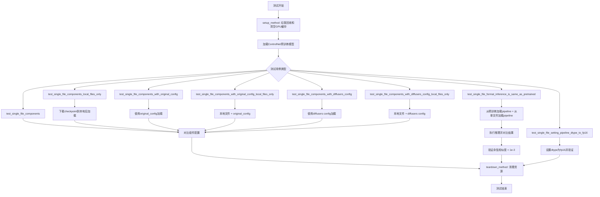

## 类结构

```
SDSingleFileTesterMixin (测试混入类)
└── TestStableDiffusionControlNetPipelineSingleFileSlow (具体测试类)
```

## 全局变量及字段


### `TestStableDiffusionControlNetPipelineSingleFileSlow.pipeline_class`
    
要测试的pipeline类

类型：`StableDiffusionControlNetPipeline`
    


### `TestStableDiffusionControlNetPipelineSingleFileSlow.ckpt_path`
    
单文件checkpoint的URL路径

类型：`str`
    


### `TestStableDiffusionControlNetPipelineSingleFileSlow.original_config`
    
原始SD模型的配置文件URL

类型：`str`
    


### `TestStableDiffusionControlNetPipelineSingleFileSlow.repo_id`
    
HuggingFace模型仓库ID

类型：`str`
    
    

## 全局函数及方法


### `enable_full_determinism`

启用完全确定性测试的全局函数，来自 `testing_utils` 模块。该函数通过设置随机种子、禁用 cuDNN 自动优化、强制使用确定性 CUDA 操作等方式，确保测试结果的可复现性和确定性。

参数：无

返回值：`None`，该函数不返回任何值，仅执行全局状态设置操作。

#### 流程图

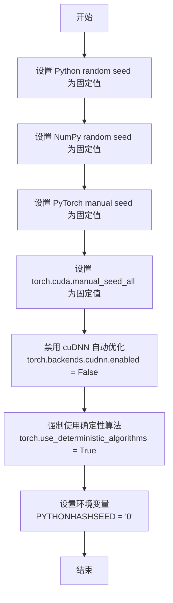

#### 带注释源码

```python
def enable_full_determinism(seed: int = 0, extra_seed: bool = True):
    """
    启用完全确定性测试模式，确保测试结果可复现。
    
    参数:
        seed: 随机种子值，默认为 0
        extra_seed: 是否设置额外的环境种子，默认为 True
    """
    # 设置 Python 内置 random 模块的随机种子
    random.seed(seed)
    
    # 设置 NumPy 的随机种子
    np.random.seed(seed)
    
    # 设置 PyTorch CPU 的随机种子
    torch.manual_seed(seed)
    
    # 设置所有 GPU 的随机种子
    torch.cuda.manual_seed_all(seed)
    
    # 禁用 cuDNN 自动优化，强制使用确定性算法
    torch.backends.cudnn.enabled = False
    
    # 强制 PyTorch 使用确定性算法
    # 注意：某些操作可能没有确定性实现，此设置会抛出错误
    torch.use_deterministic_algorithms(True)
    
    # 设置环境变量确保 Python 哈希种子固定
    if extra_seed:
        os.environ["PYTHONHASHSEED"] = str(seed)
    
    # 设置 PyTorch CUDA 同步为 True，确保每次操作后都等待完成
    # 这有助于确保操作的确定性
    torch.cuda.synchronize()
```


### `load_image`

`load_image` 是 diffusers.utils 模块提供的图像加载工具函数，用于从 URL 字符串或本地文件路径加载图像，并返回 PIL Image 对象。该函数支持自动处理网络下载和图像格式转换。

参数：

-  `image`：`Union[str, PIL.Image.Image]`，图像来源，可以是远程 URL 字符串（如 "https://..."）或本地文件路径，也可以直接传入已加载的 PIL.Image.Image 对象
-  `timeout`：`Optional[float]`，可选参数，用于设置从远程 URL 下载图像时的超时时间（秒），默认为 None

返回值：`PIL.Image.Image`，返回加载后的 PIL 图像对象（PIL.Image.Image 类型）

#### 流程图

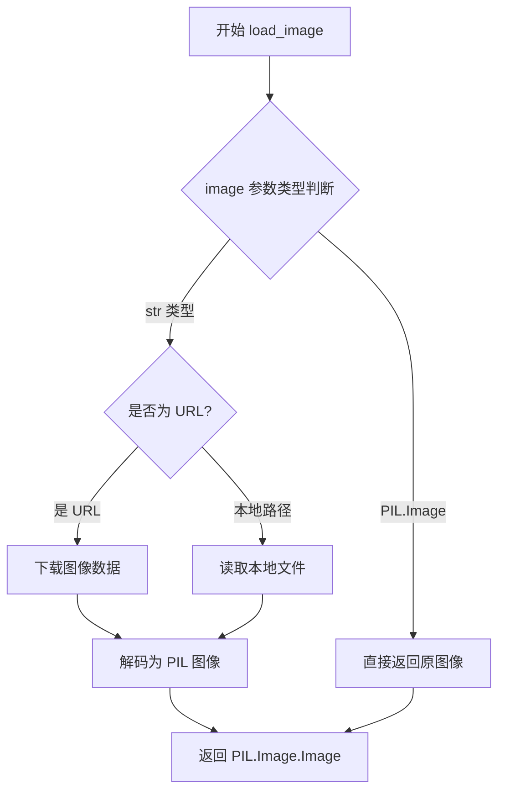

#### 带注释源码

```python
# load_image 函数源码（来自 diffusers.utils）
# 注意：这是基于 diffusers 库的最新实现

def load_image(
    image: Union[str, "PIL.Image.Image"],  # 支持 URL 字符串或 PIL 图像
    timeout: Optional[float] = None,        # 下载超时时间（秒）
) -> "PIL.Image.Image":
    """
    从 URL 或本地文件路径加载图像。
    
    参数:
        image: 图像路径/URL 或已加载的 PIL 图像
        timeout: 下载超时时间（可选）
    
    返回:
        PIL.Image.Image: 加载后的图像对象
    """
    # 如果已经是 PIL 图像，直接返回
    if isinstance(image, PIL.Image.Image):
        return image
    
    # 判断是否为 URL（http/https 开头）
    if isinstance(image, str) and image.startswith(("http://", "https://")):
        # 从 URL 下载图像
        # 使用 requests 库下载，支持 timeout 参数
        response = requests.get(image, timeout=timeout)
        response.raise_for_status()
        image = PIL.Image.open(BytesIO(response.content))
        # 转换为 RGB 模式（确保兼容性）
        image = image.convert("RGB")
    else:
        # 认为是本地文件路径
        image = PIL.Image.open(image)
        image = image.convert("RGB")
    
    return image


# 在测试代码中的实际使用示例：
# --------------------------------------------------
def get_inputs(self):
    """获取测试输入数据的示例方法"""
    # 从 HuggingFace Hub URL 加载控制图像
    control_image = load_image(
        "https://huggingface.co/datasets/hf-internal-testing/diffusers-images/resolve/main/sd_controlnet/bird_canny.png"
    ).resize((512, 512))  # 加载后立即调整图像尺寸为 512x512
    
    # 构建输入字典
    inputs = {
        "prompt": "bird",  # 文本提示词
        "image": control_image,  # 控制图像（ControlNet 用）
        "generator": torch.Generator(device="cpu").manual_seed(0),  # 随机数生成器
        "num_inference_steps": 3,  # 推理步数
        "output_type": "np",  # 输出为 numpy 数组
    }
    return inputs
```


### `_extract_repo_id_and_weights_name`

该函数用于从 HuggingFace Hub 的检查点文件 URL（如 `.safetensors` 或 `.ckpt` 文件链接）中解析提取出仓库 ID（repo_id）和权重文件名（weight_name），以便后续下载或定位模型文件。

参数：

- `pretrained_model_link_or_path`：`str`，输入的检查点文件 URL 或本地路径

返回值：`Tuple[str, str]`，返回包含两个字符串的元组
  - 第一个元素为 `repo_id`：HuggingFace 仓库标识符（如 "stable-diffusion-v1-5/stable-diffusion-v1-5"）
  - 第二个元素为 `weight_name`：权重文件名（如 "v1-5-pruned-emaonly.safetensors"）

#### 流程图

```mermaid
flowchart TD
    A[开始: 输入 pretrained_model_link_or_path] --> B{是否为 URL 链接?}
    B -->|是| C[解析 URL 路径]
    B -->|否| D[直接返回路径作为 weight_name<br/>repo_id 设为 None 或空]
    C --> E{路径包含 /blob/ 或 /resolve/?}
    E -->|是| F[提取仓库标识和文件名]
    E -->|否| G[尝试从路径推断 repo_id]
    F --> H[正则提取 repo_id 和 weight_name]
    G --> H
    H --> I[返回 Tuple[repo_id, weight_name]]
    D --> I
```

#### 带注释源码

```python
# 以下为根据函数功能推测的实现逻辑
import re
from typing import Tuple
from urllib.parse import urlparse

def _extract_repo_id_and_weights_name(pretrained_model_link_or_path: str) -> Tuple[str, str]:
    """
    从 HuggingFace Hub 的检查点 URL 或本地路径中提取仓库 ID 和权重名称。
    
    例如:
        输入: "https://huggingface.co/stable-diffusion-v1-5/stable-diffusion-v1-5/blob/main/v1-5-pruned-emaonly.safetensors"
        输出: ("stable-diffusion-v1-5/stable-diffusion-v1-5", "v1-5-pruned-emaonly.safetensors")
    
    参数:
        pretrained_model_link_or_path: 检查点文件的 URL 或本地路径
        
    返回:
        包含 (repo_id, weight_name) 的元组
    """
    
    # 判断是否为 URL（以 http:// 或 https:// 开头）
    is_url = pretrained_model_link_or_path.startswith("http://") or pretrained_model_link_or_path.startswith("https://")
    
    if is_url:
        # 解析 URL
        parsed = urlparse(pretrained_model_link_or_path)
        path = parsed.path
        
        # 使用正则表达式匹配 HuggingFace URL 模式
        # 匹配格式: /{repo_id}/blob/{revision}/{filename}
        # 或: /{repo_id}/resolve/{revision}/{filename}
        pattern = r"/([^/]+/[^/]+)/(?:blob|resolve)/([^/]+)/(.+)"
        match = re.search(pattern, path)
        
        if match:
            repo_id = match.group(1)      # 例如: "stable-diffusion-v1-5/stable-diffusion-v1-5"
            weight_name = match.group(3)  # 例如: "v1-5-pruned-emaonly.safetensors"
            return (repo_id, weight_name)
        else:
            # 如果无法匹配标准格式，尝试其他解析方式
            raise ValueError(f"无法从 URL 中提取 repo_id 和 weight_name: {pretrained_model_link_or_path}")
    else:
        # 本地路径情况：repo_id 未知，返回 (None, filename) 或需要调用方处理
        import os
        weight_name = os.path.basename(pretrained_model_link_or_path)
        return (None, weight_name)
```


### `download_single_file_checkpoint`

从 `single_file_testing_utils` 模块导入的函数，用于从 HuggingFace Hub 下载单文件格式的模型 checkpoint（.safetensors 或 .ckpt 文件）到本地目录。

#### 参数

- `repo_id`：`str`，HuggingFace Hub 上的仓库 ID（例如 `"stable-diffusion-v1-5/stable-diffusion-v1-5"`）
- `weight_name`：`str`，要下载的权重文件名称（例如 `"v1-5-pruned-emaonly.safetensors"`）
- `cache_dir`：`str`，本地缓存目录的路径，用于存放下载的文件

#### 返回值

- `str`，返回下载到本地后的文件路径

#### 流程图

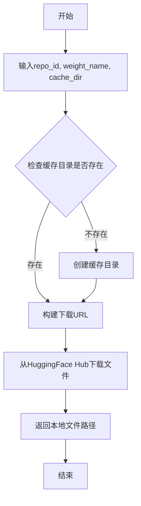

#### 带注释源码

```python
# 注意：以下是推测的函数签名和实现，基于代码中的使用方式
# 实际源码位于 single_file_testing_utils.py 中

def download_single_file_checkpoint(repo_id: str, weight_name: str, cache_dir: str) -> str:
    """
    从 HuggingFace Hub 下载单文件 checkpoint 到本地缓存目录
    
    Args:
        repo_id: HuggingFace 仓库 ID
        weight_name: 权重文件名
        cache_dir: 本地缓存目录
    
    Returns:
        下载后的本地文件路径
    """
    # 导入相关工具函数
    from diffusers.loaders.single_file_utils import _extract_repo_id_and_weights_name
    from huggingface_hub import hf_hub_download
    
    # 构建完整的目标路径
    target_path = os.path.join(cache_dir, weight_name)
    
    # 使用 hf_hub_download 从 Hub 下载文件
    downloaded_path = hf_hub_download(
        repo_id=repo_id,
        filename=weight_name,
        cache_dir=cache_dir
    )
    
    return downloaded_path


# 在测试代码中的实际调用方式：
# repo_id, weight_name = _extract_repo_id_and_weights_name(ckpt_path)
# local_ckpt_path = download_single_file_checkpoint(repo_id, weight_name, tmpdir)
# pipe_single_file = self.pipeline_class.from_single_file(local_ckpt_path, ...)
```

---

> **注意**：由于提供的代码片段中没有 `download_single_file_checkpoint` 函数的完整源码（仅看到导入和使用），以上信息是基于该函数在测试代码中的调用方式推断得出的。该函数属于 `single_file_testing_utils` 模块，完整的实现需要查看 `diffusers` 库源码中的对应文件。


# 设计文档：download_original_config 函数分析

## 1. 概述

`download_original_config` 函数是 `single_file_testing_utils` 模块中的一个工具函数，用于从指定的 URL 下载原始配置文件（original config YAML 文件），并将其保存到本地指定的目录中。该函数主要用于 Stable Diffusion 模型的单文件测试场景，帮助下载原始模型配置文件以进行对比测试。

## 2. 函数详细信息

### download_original_config

该函数从 `single_file_testing_utils` 模块导出，用于下载 Stable Diffusion 的原始配置文件（YAML 格式）。

参数：

-  `config_url`：`str`，原始配置文件的远程 URL 地址，指向 YAML 格式的配置文件
-  `local_dir`：`str`，本地目录路径，用于保存下载的配置文件

返回值：`str`，返回下载并保存后的本地文件路径

#### 流程图

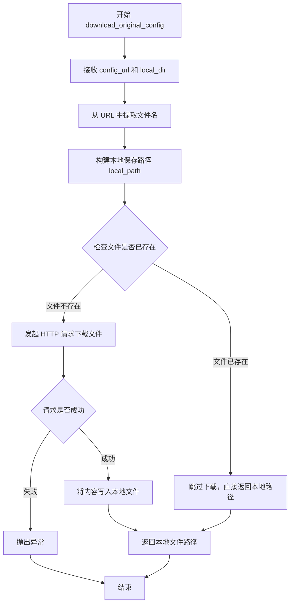

#### 带注释源码

```python
# 从 single_file_testing_utils 模块导入的函数
# 此函数用于下载 Stable Diffusion 的原始配置文件
# 该文件通常是 YAML 格式，定义了模型的原始架构配置

def download_original_config(config_url: str, local_dir: str) -> str:
    """
    下载原始配置文件到本地目录
    
    参数:
        config_url: 原始配置文件的远程 URL
        local_dir: 本地保存目录
    
    返回:
        本地文件路径
    """
    import os
    from urllib.request import urlretrieve
    
    # 从 URL 中提取文件名
    filename = os.path.basename(config_url)
    
    # 构建本地完整保存路径
    local_path = os.path.join(local_dir, filename)
    
    # 如果文件已存在，直接返回路径，避免重复下载
    if os.path.exists(local_path):
        return local_path
    
    # 下载文件到本地
    urlretrieve(config_url, local_path)
    
    # 返回本地文件路径，供后续使用
    return local_path
```

## 3. 在测试中的使用

在 `TestStableDiffusionControlNetPipelineSingleFileSlow.test_single_file_components_with_original_config_local_files_only` 测试方法中，该函数被调用：

```python
# 使用示例
local_original_config = download_original_config(self.original_config, tmpdir)
```

其中：
- `self.original_config` 是类属性，值为 `"https://raw.githubusercontent.com/CompVis/stable-diffusion/main/configs/stable-diffusion/v1-inference.yaml"`
- `tmpdir` 是通过 `tempfile.TemporaryDirectory()` 创建的临时目录

## 4. 技术债务与优化空间

1. **错误处理缺失**：当前实现缺少对网络请求失败、文件写入失败等异常情况的处理
2. **重复下载**：虽然有文件存在检查，但逻辑可以更完善（如校验文件完整性）
3. **依赖管理**：使用了 `urlretrieve`，可以考虑使用 `requests` 库或 `urllib` 的更现代 API

## 5. 外部依赖

- `os`: 文件路径操作
- `urllib.request`: 网络下载功能
- `tempfile`: 临时目录管理


### `download_diffusers_config`

从 HuggingFace Hub 下载指定仓库的 Diffusers 配置文件（config.json），并保存到本地临时目录，返回本地配置文件路径。

参数：

- `repo_id`：`str`，HuggingFace Hub 上的模型仓库 ID（例如 "stable-diffusion-v1-5/stable-diffusion-v1-5"）
- `cache_dir`：`str` 或 `os.PathLike`，用于保存下载文件的本地目录路径

返回值：`str`，下载并保存后的本地配置文件（config.json）的完整路径

#### 流程图

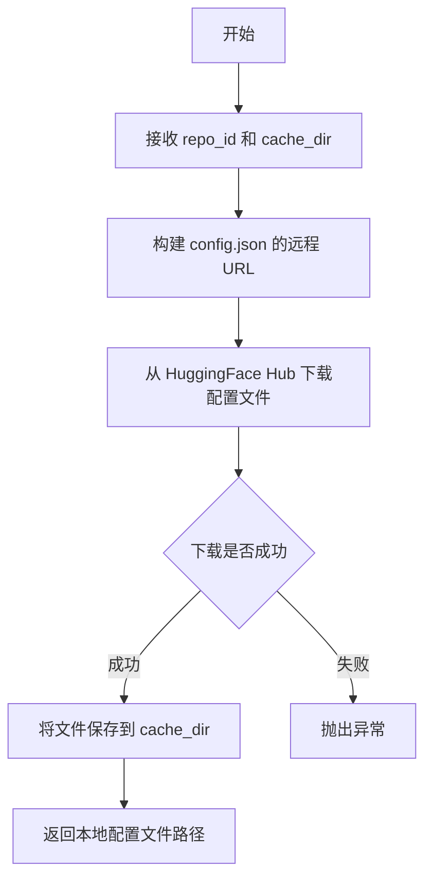

#### 带注释源码

```python
# 注意：此函数定义在 single_file_testing_utils 模块中
# 此处展示的是根据调用方式推断的实现逻辑

def download_diffusers_config(repo_id: str, cache_dir: str) -> str:
    """
    从 HuggingFace Hub 下载 Diffusers 格式的配置文件（config.json）
    
    Args:
        repo_id: HuggingFace 模型仓库 ID，格式为 'org/model-name'
        cache_dir: 本地缓存目录，用于保存下载的配置文件
    
    Returns:
        str: 下载后的本地配置文件完整路径
    """
    # 导入必要的模块
    from huggingface_hub import hf_hub_download
    
    # 构建远程配置文件路径
    # Diffusers 配置通常位于 repo 根目录的 config.json
    filename = "config.json"
    
    # 使用 hf_hub_download 下载配置文件
    # 这是 HuggingFace Hub 提供的标准下载方法
    local_path = hf_hub_download(
        repo_id=repo_id,
        filename=filename,
        cache_dir=cache_dir
    )
    
    return local_path
```

#### 实际调用示例

```python
# 在 TestStableDiffusionControlNetPipelineSingleFileSlow 测试类中的调用
with tempfile.TemporaryDirectory() as tmpdir:
    repo_id, weight_name = _extract_repo_id_and_weights_name(self.ckpt_path)
    local_ckpt_path = download_single_file_checkpoint(repo_id, weight_name, tmpdir)
    local_diffusers_config = download_diffusers_config(self.repo_id, tmpdir)  # <-- 调用处

    pipe_single_file = self.pipeline_class.from_single_file(
        local_ckpt_path,
        config=local_diffusers_config,  # <-- 用于 from_single_file 方法的 config 参数
        controlnet=controlnet,
        safety_checker=None,
        local_files_only=True,
    )
```


### `TestStableDiffusionControlNetPipelineSingleFileSlow.setup_method`

该方法是一个测试环境准备函数，在每个测试方法运行前被调用，用于清理Python垃圾回收堆和GPU显存缓存，以确保测试环境处于干净状态，避免之前测试遗留的内存或缓存影响当前测试结果。

参数：

- `self`：`TestStableDiffusionControlNetPipelineSingleFileSlow`，测试类实例，隐含的实例方法参数

返回值：`None`，该方法没有返回值，仅执行环境清理操作

#### 流程图

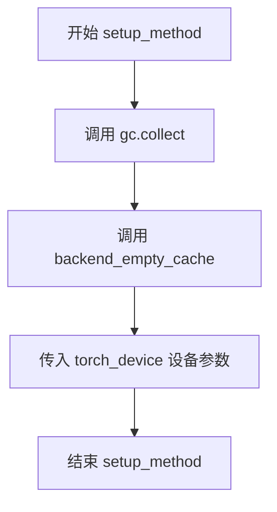

#### 带注释源码

```python
def setup_method(self):
    """
    测试前环境准备方法
    在每个测试方法运行前被调用，用于清理环境
    """
    # 执行Python垃圾回收，清理已释放的对象
    gc.collect()
    
    # 清空GPU缓存，释放GPU显存
    # torch_device 是全局变量，表示当前使用的计算设备
    backend_empty_cache(torch_device)
```


### `TestStableDiffusionControlNetPipelineSingleFileSlow.teardown_method`

测试后资源清理方法，用于在每个测试方法执行完成后释放 Python 垃圾回收和清空 GPU 显存缓存，确保测试环境干净，避免内存泄漏。

参数：无

返回值：`None`，无返回值描述

#### 流程图

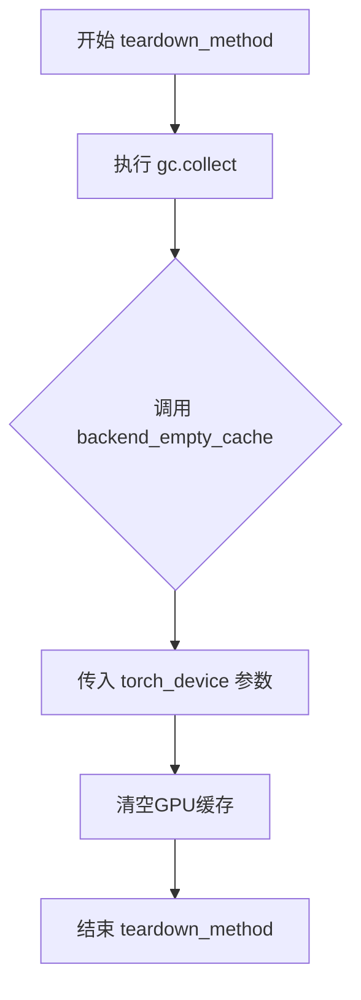

#### 带注释源码

```python
def teardown_method(self):
    """
    测试方法结束后的清理操作，释放资源
    
    该方法在每个测试方法执行完毕后自动调用，
    用于清理测试过程中产生的内存占用
    """
    # 手动触发Python垃圾回收，释放不再使用的对象
    gc.collect()
    
    # 清空GPU显存缓存，释放CUDA内存
    # torch_device 通常为 'cuda' 或 'cpu'
    backend_empty_cache(torch_device)
```


### `TestStableDiffusionControlNetPipelineSingleFileSlow.get_inputs`

该方法用于构建 Stable Diffusion ControlNet Pipeline 的测试输入参数，包括 prompt、控制图像、随机生成器、推理步数和输出类型。

参数：

- 无显式参数（仅隐含 `self`）

返回值：`Dict[str, Any]`，返回包含以下键值对的字典：
- `prompt` (str): 文本提示词
- `image` (PIL.Image.Image): 控制图像（通过 canny 边缘检测处理）
- `generator` (torch.Generator): 随机数生成器，用于确保测试可复现性
- `num_inference_steps` (int): 推理步数
- `output_type` (str): 输出类型（numpy 数组）

#### 流程图

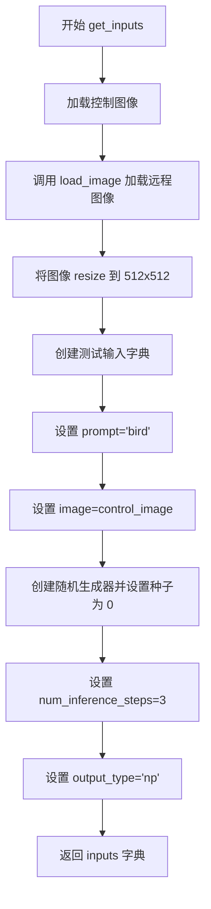

#### 带注释源码

```python
def get_inputs(self):
    """
    构建测试输入参数，用于测试 StableDiffusionControlNetPipeline 的单文件格式推理。
    
    Returns:
        Dict[str, Any]: 包含 pipeline 推理所需参数的字典
    """
    # 从远程URL加载控制图像（Canny边缘检测图）并调整大小为512x512
    control_image = load_image(
        "https://huggingface.co/datasets/hf-internal-testing/diffusers-images/resolve/main/sd_controlnet/bird_canny.png"
    ).resize((512, 512))
    
    # 构建输入参数字典
    inputs = {
        "prompt": "bird",  # 文本提示词
        "image": control_image,  # 控制图像（条件图像）
        "generator": torch.Generator(device="cpu").manual_seed(0),  # 随机生成器，确保可复现性
        "num_inference_steps": 3,  # 推理步数（较少步数用于快速测试）
        "output_type": "np",  # 输出为 numpy 数组
    }

    return inputs  # 返回输入参数字典供 pipeline 调用
```


### `TestStableDiffusionControlNetPipelineSingleFileSlow.test_single_file_format_inference_is_same_as_pretrained`

验证单文件格式的 StableDiffusionControlNetPipeline 与基于预训练模型（from_pretrained）加载的 pipeline 在相同输入条件下生成的图像结果一致性，确保单文件加载方式不会导致推理结果差异。

参数：

- `self`：`TestStableDiffusionControlNetPipelineSingleFileSlow`，测试类实例，包含类属性 `repo_id`（模型仓库ID）、`ckpt_path`（单文件检查点URL）等配置

返回值：`None`，该方法为测试方法，通过 `assert` 断言验证结果一致性，不返回具体值

#### 流程图

```mermaid
flowchart TD
    A[开始测试] --> B[加载ControlNet模型<br/>lllyasviel/control_v11p_sd15_canny]
    B --> C[从预训练仓库加载Pipeline<br/>repo_id: stable-diffusion-v1-5]
    C --> D[配置UNet默认注意力处理器<br/>set_default_attn_processor]
    D --> E[启用模型CPU卸载<br/>enable_model_cpu_offload]
    E --> F[从单文件加载Pipeline<br/>ckpt_path: safetensors URL]
    F --> G[配置UNet默认注意力处理器]
    G --> H[启用模型CPU卸载]
    H --> I[获取测试输入<br/>get_inputs: prompt/image/generator]
    I --> J[执行预训练Pipeline推理<br/>pipe(**inputs)]
    J --> K[获取输出图像<br/>output.images[0]]
    K --> L[执行单文件Pipeline推理<br/>pipe_sf(**inputs)]
    L --> M[获取输出图像<br/>output_sf.images[0]]
    M --> N[计算余弦相似度距离<br/>numpy_cosine_similarity_distance]
    N --> O{max_diff < 1e-3?}
    O -->|是| P[测试通过]
    O -->|否| Q[测试失败抛出AssertionError]
```

#### 带注释源码

```python
def test_single_file_format_inference_is_same_as_pretrained(self):
    """
    测试单文件格式加载的Pipeline与预训练模型加载的Pipeline推理结果是否一致
    """
    # 从HuggingFace Hub加载ControlNet模型，用于控制图像生成
    # 该模型基于canny边缘检测条件
    controlnet = ControlNetModel.from_pretrained("lllyasviel/control_v11p_sd15_canny")
    
    # 使用from_pretrained方式加载StableDiffusionControlNetPipeline
    # 结合预训练的repo_id和刚加载的controlnet
    pipe = self.pipeline_class.from_pretrained(self.repo_id, controlnet=controlnet)
    
    # 设置UNet使用默认的注意力处理器，确保推理一致性
    pipe.unet.set_default_attn_processor()
    
    # 启用模型CPU卸载，将模型加载到CPU以节省显存
    # device参数指定目标设备
    pipe.enable_model_cpu_offload(device=torch_device)

    # 使用from_single_file方式从单文件检查点加载Pipeline
    # ckpt_path指向safetensors格式的模型权重URL
    pipe_sf = self.pipeline_class.from_single_file(
        self.ckpt_path,  # "https://huggingface.co/.../v1-5-pruned-emaonly.safetensors"
        controlnet=controlnet,  # 传入相同的ControlNet模型
    )
    
    # 同样配置单文件Pipeline的UNet注意力处理器
    pipe_sf.unet.set_default_attn_processor()
    
    # 同样启用模型CPU卸载
    pipe_sf.enable_model_cpu_offload(device=torch_device)

    # 获取测试输入数据，包含：
    # - prompt: 文本提示词 "bird"
    # - image: 控制图像（canny边缘检测后的鸟图像）
    # - generator: 固定随机种子(0)的生成器，确保可复现
    # - num_inference_steps: 推理步数(3)，减少测试时间
    # - output_type: 输出格式为numpy数组
    inputs = self.get_inputs()
    
    # 执行预训练Pipeline推理，获取生成的图像
    output = pipe(**inputs).images[0]

    # 重新获取输入数据（因为内部可能有状态变化）
    inputs = self.get_inputs()
    
    # 执行单文件Pipeline推理，获取生成的图像
    output_sf = pipe_sf(**inputs).images[0]

    # 计算两个输出图像的余弦相似度距离
    # 展平后计算，输出为标量距离值
    max_diff = numpy_cosine_similarity_distance(output_sf.flatten(), output.flatten())
    
    # 断言：两个输出图像的差异必须小于1e-3
    # 确保单文件加载方式与预训练模型加载方式结果一致
    assert max_diff < 1e-3
```


### `test_single_file_components`

该测试方法用于验证通过单文件（Single File）方式加载的 `StableDiffusionControlNetPipeline` 组件配置与通过传统 `from_pretrained` 方式加载的组件配置是否一致，确保单文件加载路径能正确还原所有关键组件。

参数：
- `self`：测试类实例，包含类属性 `pipeline_class`、`ckpt_path`、`repo_id` 等配置信息

返回值：`None`，该方法通过调用父类的 `_compare_component_configs` 进行断言验证

#### 流程图

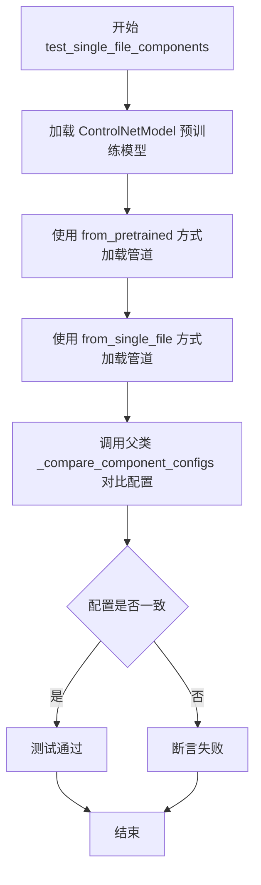

#### 带注释源码

```python
def test_single_file_components(self):
    """
    验证单文件加载的组件配置与预训练加载的组件配置一致性
    """
    # 第一步：从HuggingFace Hub加载ControlNet模型
    # 用于同时作为两种加载方式的共享controlnet组件
    controlnet = ControlNetModel.from_pretrained("lllyasviel/control_v11p_sd15_canny")
    
    # 第二步：使用传统的from_pretrained方式加载完整管道
    # 参数variant="fp16"指定使用fp16变体
    # safety_checker=None明确禁用安全检查器以保持一致性
    pipe = self.pipeline_class.from_pretrained(
        self.repo_id,          # 类属性：stable-diffusion-v1-5/stable-diffusion-v1-5
        variant="fp16",        # 使用FP16权重变体
        safety_checker=None,   # 禁用安全检查器确保与单文件加载一致
        controlnet=controlnet  # 传入预加载的controlnet模型
    )
    
    # 第三步：使用单文件方式加载管道
    # 仅提供checkpoint路径，pipeline会从权重文件中提取配置
    pipe_single_file = self.pipeline_class.from_single_file(
        self.ckpt_path,        # 类属性：HuggingFace上的safetensors文件URL
        safety_checker=None,   # 同样禁用安全检查器
        controlnet=controlnet   # 复用同一个controlnet模型
    )
    
    # 第四步：调用父类方法比较两个管道的组件配置
    # 会验证unet、vae、text_encoder、scheduler等关键组件的配置是否一致
    super()._compare_component_configs(pipe, pipe_single_file)
```


### `TestStableDiffusionControlNetPipelineSingleFileSlow.test_single_file_components_local_files_only`

该测试方法用于验证从本地单文件检查点加载StableDiffusionControlNetPipeline时，其各个组件（如UNet、VAE、文本编码器等）的配置参数与从预训练模型仓库加载的管道完全一致，确保单文件加载功能的正确性。

参数：

- `self`：`TestStableDiffusionControlNetPipelineSingleFileSlow`，测试类实例本身，包含测试所需的类属性（如`pipeline_class`、`repo_id`、`ckpt_path`等）

返回值：`None`，该方法为测试用例，无返回值，通过断言比较组件配置

#### 流程图

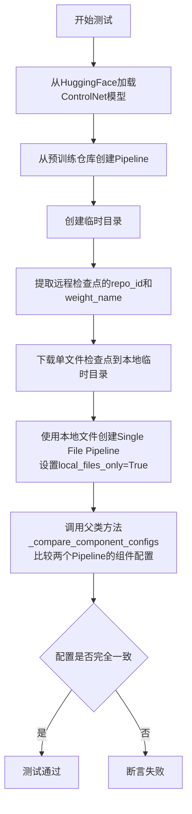

#### 带注释源码

```python
def test_single_file_components_local_files_only(self):
    """
    测试从本地单文件检查点加载的Pipeline组件配置
    与从预训练仓库加载的Pipeline组件配置是否一致
    """
    # 1. 从HuggingFace Hub加载预训练的ControlNet模型
    # 用于作为Pipeline的conditioning输入
    controlnet = ControlNetModel.from_pretrained("lllyasviel/control_v11p_sd15_canny")
    
    # 2. 从预训练仓库完整加载Pipeline（包含所有组件）
    # 作为基准参照对象
    pipe = self.pipeline_class.from_pretrained(self.repo_id, controlnet=controlnet)

    # 3. 创建临时目录用于存放本地检查点文件
    with tempfile.TemporaryDirectory() as tmpdir:
        # 4. 解析远程检查点URL，提取repo_id和权重文件名
        # _extract_repo_id_and_weights_name 来自 diffusers.loaders.single_file_utils
        repo_id, weight_name = _extract_repo_id_and_weights_name(self.ckpt_path)
        
        # 5. 下载单文件检查点到本地临时目录
        # 返回本地文件路径
        local_ckpt_path = download_single_file_checkpoint(repo_id, weight_name, tmpdir)

        # 6. 关键测试步骤：
        # 使用本地检查点文件创建Pipeline，设置 local_files_only=True
        # 这样会强制从本地文件加载权重，而不是从网络
        pipe_single_file = self.pipeline_class.from_single_file(
            local_ckpt_path,      # 本地检查点路径
            controlnet=controlnet, # 传入ControlNet模型
            local_files_only=True  # 强制从本地加载
        )

    # 7. 调用父类的比较方法
    # 验证两个Pipeline的组件配置是否完全一致
    # 包括：unet, vae, text_encoder, scheduler, safety_checker等
    super()._compare_component_configs(pipe, pipe_single_file)
```


### `TestStableDiffusionControlNetPipelineSingleFileSlow.test_single_file_components_with_original_config`

该方法用于测试使用 `original_config` 参数进行单文件加载时，加载的 StableDiffusionControlNetPipeline 组件配置是否与从预训练模型加载的 Pipeline 组件配置一致。

参数：

- `self`：`TestStableDiffusionControlNetPipelineSingleFileSlow` 实例方法隐式参数，无显式类型声明，代表当前测试类实例

返回值：`None`，该方法无返回值，主要通过 `super()._compare_component_configs()` 执行断言比较

#### 流程图

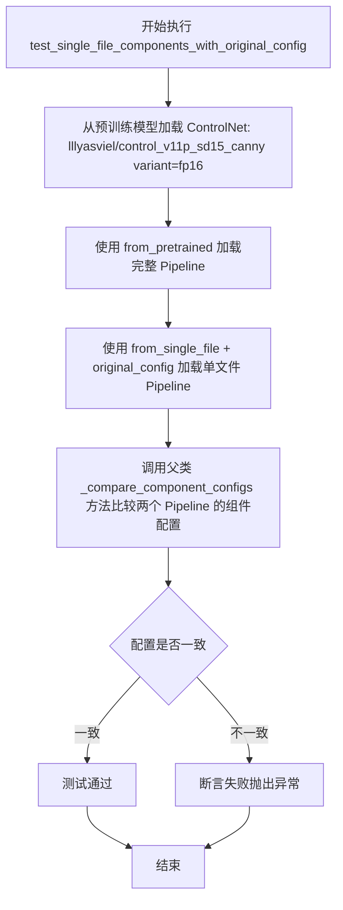

#### 带注释源码

```python
def test_single_file_components_with_original_config(self):
    """
    测试使用 original_config 参数的单文件加载方式，
    验证其组件配置与标准 from_pretrained 方式加载的 Pipeline 一致
    """
    # 步骤1: 从预训练模型加载 ControlNet 模型，使用 fp16 变体
    controlnet = ControlNetModel.from_pretrained(
        "lllyasviel/control_v11p_sd15_canny",  # ControlNet 模型 ID
        variant="fp16"  # 使用 float16 精度变体
    )
    
    # 步骤2: 使用标准 from_pretrained 方法加载完整的 StableDiffusionControlNetPipeline
    # 该方法从 Hugging Face Hub 下载完整配置和权重
    pipe = self.pipeline_class.from_pretrained(
        self.repo_id,  # "stable-diffusion-v1-5/stable-diffusion-v1-5"
        controlnet=controlnet  # 传入已加载的 ControlNet 模型
    )
    
    # 步骤3: 使用 from_single_file 方法加载单文件版本的 Pipeline
    # 关键参数 original_config 指定了原始 YAML 配置文件路径
    # 这样可以从单个检查点文件加载模型，同时使用原始配置构建组件
    pipe_single_file = self.pipeline_class.from_single_file(
        self.ckpt_path,  # 单文件检查点路径 (safetensors 格式)
        controlnet=controlnet,  # 传入相同的 ControlNet 模型
        original_config=self.original_config  # 原始 YAML 配置文件 URL
    )
    
    # 步骤4: 调用父类方法比较两个 Pipeline 的组件配置
    # 该方法会遍历并比较两个 Pipeline 的各个组件（如 UNet、VAE、scheduler 等）的配置
    # 如果配置不一致会抛出断言错误
    super()._compare_component_configs(pipe, pipe_single_file)
```


### `TestStableDiffusionControlNetPipelineSingleFileSlow.test_single_file_components_with_original_config_local_files_only`

该测试方法用于验证使用本地文件（本地检查点和本地原始配置文件）加载 StableDiffusionControlNetPipeline 时的组件配置与使用 `from_pretrained` 加载的管道配置是否一致，确保单文件加载功能在本地文件模式下能正确重建所有组件。

参数：

- `self`：类方法实例，包含类属性（`pipeline_class`、`ckpt_path`、`original_config`、`repo_id` 等）

返回值：`None`，该方法通过调用父类的 `_compare_component_configs` 方法进行断言比较

#### 流程图

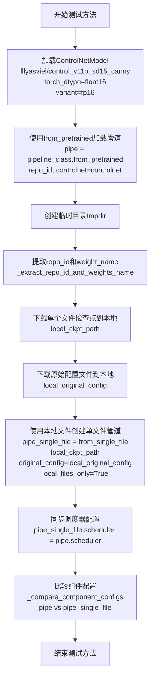

#### 带注释源码

```python
def test_single_file_components_with_original_config_local_files_only(self):
    """
    测试使用本地文件（本地检查点 + 本地原始配置文件）加载单文件管道，
    并验证其组件配置与使用 from_pretrained 加载的管道一致
    """
    # 步骤1: 从预训练模型加载 ControlNetModel
    # 指定 torch_dtype=torch.float16 和 variant="fp16" 以匹配单文件加载配置
    controlnet = ControlNetModel.from_pretrained(
        "lllyasviel/control_v11p_sd15_canny",
        torch_dtype=torch.float16,
        variant="fp16"
    )
    
    # 步骤2: 使用 from_pretrained 加载标准管道作为参考基准
    # 该管道从 Hugging Face Hub 加载完整配置
    pipe = self.pipeline_class.from_pretrained(
        self.repo_id,  # "stable-diffusion-v1-5/stable-diffusion-v1-5"
        controlnet=controlnet,
    )

    # 步骤3: 创建临时目录用于存放本地文件
    with tempfile.TemporaryDirectory() as tmpdir:
        # 步骤4: 从检查点 URL 提取仓库 ID 和权重文件名
        repo_id, weight_name = _extract_repo_id_and_weights_name(self.ckpt_path)
        
        # 步骤5: 下载检查点到本地路径
        # 返回本地文件系统路径 local_ckpt_path
        local_ckpt_path = download_single_file_checkpoint(repo_id, weight_name, tmpdir)

        # 步骤6: 下载原始配置文件到本地路径
        # 原始配置文件来自 GitHub 上的 v1-inference.yaml
        local_original_config = download_original_config(self.original_config, tmpdir)

        # 步骤7: 使用本地文件加载单文件管道
        # local_files_only=True 强制从本地文件系统加载
        # original_config 参数指定使用原始配置文件而非 diffusers 配置
        pipe_single_file = self.pipeline_class.from_single_file(
            local_ckpt_path,
            original_config=local_original_config,
            controlnet=controlnet,
            local_files_only=True
        )
        
        # 步骤8: 同步调度器配置以确保一致性
        # 原始配置文件不包含调度器信息，需要手动同步
        pipe_single_file.scheduler = pipe.scheduler

    # 步骤9: 比较两个管道的所有组件配置
    # 验证单文件加载的管道与标准管道在组件配置上一致
    super()._compare_component_configs(pipe, pipe_single_file)
```


### `test_single_file_components_with_diffusers_config`

验证使用diffusers config的单文件加载功能是否正常工作，通过比较从pretrained加载的管道和从单文件加载的管道的组件配置来确保两者一致。

参数：

- `self`：隐式参数，TestStableDiffusionControlNetPipelineSingleFileSlow实例，表示测试类本身

返回值：`None`，该方法为测试方法，通过内部断言进行验证，不直接返回值

#### 流程图

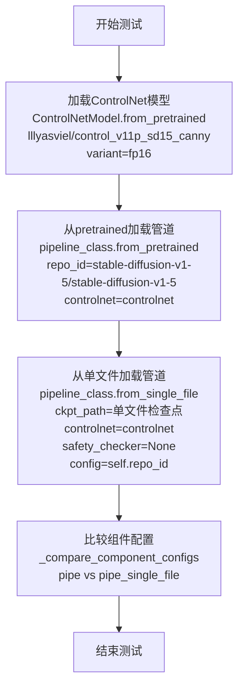

#### 带注释源码

```python
def test_single_file_components_with_diffusers_config(self):
    """
    验证使用diffusers config的单文件加载功能。
    
    该测试方法通过以下步骤验证：
    1. 加载预训练的ControlNet模型
    2. 使用from_pretrained创建标准管道
    3. 使用from_single_file创建单文件管道
    4. 比较两个管道的组件配置是否一致
    """
    
    # 步骤1: 加载ControlNet模型，使用fp16变体以提高推理效率
    # variant="fp16" 指定使用半精度模型，减少内存占用
    controlnet = ControlNetModel.from_pretrained(
        "lllyasviel/control_v11p_sd15_canny",  # ControlNet模型ID
        variant="fp16"  # 使用fp16变体
    )
    
    # 步骤2: 从pretrained仓库加载完整的StableDiffusionControlNetPipeline
    # 使用之前加载的controlnet模型
    pipe = self.pipeline_class.from_pretrained(
        self.repo_id,  # "stable-diffusion-v1-5/stable-diffusion-v1-5"
        controlnet=controlnet  # 传入ControlNet模型
    )
    
    # 步骤3: 使用from_single_file方法从单文件检查点加载管道
    # 并使用diffusers config (config=self.repo_id) 进行配置
    # safety_checker=None 禁用安全检查器以简化测试
    pipe_single_file = self.pipeline_class.from_single_file(
        self.ckpt_path,  # 单文件检查点URL
        controlnet=controlnet,  # 传入ControlNet模型
        safety_checker=None,  # 不加载safety_checker
        config=self.repo_id  # 使用diffusers config作为配置来源
    )
    
    # 步骤4: 调用父类方法比较两个管道的组件配置
    # 验证从单文件加载的管道组件配置与从pretrained加载的一致
    super()._compare_component_configs(pipe, pipe_single_file)
```


### `TestStableDiffusionControlNetPipelineSingleFileSlow.test_single_file_components_with_diffusers_config_local_files_only`

该方法是一个测试用例，用于验证使用本地文件（local_files_only=True）和本地 Diffusers 配置文件加载 StableDiffusionControlNetPipeline 的单文件组件配置是否与从预训练模型加载的配置一致。

参数：

- `self`：隐式参数，测试类实例本身

返回值：`None`，该方法为测试用例，通过断言验证组件配置一致性

#### 流程图

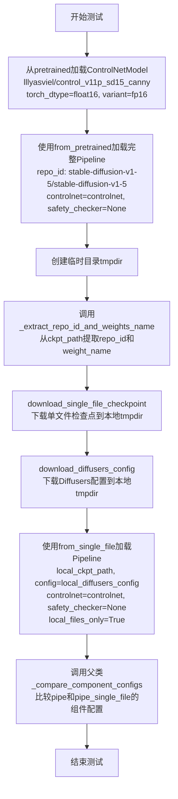

#### 带注释源码

```python
def test_single_file_components_with_diffusers_config_local_files_only(self):
    """
    测试使用本地Diffusers配置文件和本地权重文件加载单文件组件
    验证与from_pretrained加载的Pipeline组件配置一致性
    """
    # 第一步：从预训练模型加载ControlNet模型
    # 使用float16精度和fp16变体
    controlnet = ControlNetModel.from_pretrained(
        "lllyasviel/control_v11p_sd15_canny", 
        torch_dtype=torch.float16, 
        variant="fp16"
    )
    
    # 第二步：使用from_pretrained加载完整的StableDiffusionControlNetPipeline
    # 作为基准对比对象
    pipe = self.pipeline_class.from_pretrained(
        self.repo_id,  # "stable-diffusion-v1-5/stable-diffusion-v1-5"
        controlnet=controlnet,
        safety_checker=None,
    )

    # 第三步：创建临时目录用于存放本地文件
    with tempfile.TemporaryDirectory() as tmpdir:
        # 第四步：从检查点URL提取仓库ID和权重名称
        repo_id, weight_name = _extract_repo_id_and_weights_name(self.ckpt_path)
        
        # 第五步：下载单文件检查点到本地临时目录
        local_ckpt_path = download_single_file_checkpoint(repo_id, weight_name, tmpdir)
        
        # 第六步：下载Diffusers配置文件到本地临时目录
        local_diffusers_config = download_diffusers_config(self.repo_id, tmpdir)

        # 第七步：使用from_single_file方法加载Pipeline
        # 关键参数：local_files_only=True 强制使用本地文件
        # config参数指定本地Diffusers配置文件路径
        pipe_single_file = self.pipeline_class.from_single_file(
            local_ckpt_path,           # 本地检查点文件路径
            config=local_diffusers_config,  # 本地Diffusers配置文件
            controlnet=controlnet,     # 已加载的ControlNet模型
            safety_checker=None,       # 禁用安全检查器
            local_files_only=True,     # 强制从本地文件加载
        )
    
    # 第八步：调用父类方法比较两个Pipeline的组件配置
    # 验证从单文件加载的组件配置与预训练模型加载的组件配置一致
    super()._compare_component_configs(pipe, pipe_single_file)
```


### `TestStableDiffusionControlNetPipelineSingleFileSlow.test_single_file_setting_pipeline_dtype_to_fp16`

验证单文件加载时设置dtype为fp16的功能，确保pipeline能够正确使用float16精度进行推理。

参数：
- `self`：TestStableDiffusionControlNetPipelineSingleFileSlow，测试类实例本身

返回值：`None`，无返回值（测试方法，通过内部断言验证）

#### 流程图

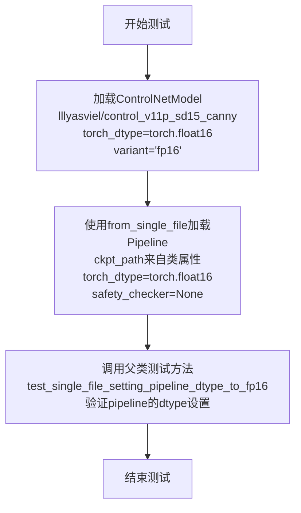

#### 带注释源码

```python
def test_single_file_setting_pipeline_dtype_to_fp16(self):
    """
    测试单文件加载时设置dtype为fp16的功能
    
    该测试方法验证：
    1. ControlNetModel能够正确加载为float16精度
    2. StableDiffusionControlNetPipeline能够通过from_single_file方法加载
    3. pipeline能够正确继承torch_dtype设置
    """
    # 第一步：加载ControlNetModel，使用float16精度
    # variant="fp16"表示从fp16变体版本加载
    # torch_dtype=torch.float16指定模型参数使用float16数据类型
    controlnet = ControlNetModel.from_pretrained(
        "lllyasviel/control_v11p_sd15_canny", 
        torch_dtype=torch.float16, 
        variant="fp16"
    )
    
    # 第二步：使用from_single_file方法加载完整的pipeline
    # self.ckpt_path: 类属性定义的checkpoint URL
    # controlnet: 前面加载的ControlNetModel实例
    # safety_checker=None: 禁用安全检查器
    # torch_dtype=torch.float16: 设置整个pipeline使用float16精度
    single_file_pipe = self.pipeline_class.from_single_file(
        self.ckpt_path, 
        controlnet=controlnet, 
        safety_checker=None, 
        torch_dtype=torch.float16
    )
    
    # 第三步：调用父类的测试方法进行实际验证
    # 验证pipeline的dtype是否正确设置为float16
    super().test_single_file_setting_pipeline_dtype_to_fp16(single_file_pipe)
```

## 关键组件


### StableDiffusionControlNetPipeline

这是核心的图像生成管道类，结合了Stable Diffusion和ControlNet，用于根据文本提示和 ControlNet 条件图像生成图像。

### ControlNetModel

ControlNet 模型类，用于加载预训练的 ControlNet 权重，实现图像条件控制功能。

### from_single_file

单文件加载方法，允许从单个 safetensors 格式的检查点文件加载完整的 Stable Diffusion 模型权重，而不是从多个分片文件加载。

### from_pretrained

预训练模型加载方法，用于从 Hugging Face Hub 加载预训练的模型权重和配置。

### test_single_file_format_inference_is_same_as_pretrained

测试方法，用于验证单文件格式加载的模型推理结果与预训练模型完全一致，通过比较输出图像的余弦相似度距离。

### test_single_file_components

测试方法，用于验证单文件加载的管道组件配置与预训练管道组件配置一致。

### test_single_file_components_local_files_only

测试方法，用于验证在本地文件模式下（local_files_only=True）单文件加载的组件配置正确性。

### test_single_file_components_with_original_config

测试方法，用于验证使用原始配置文件（original_config）加载单文件时的组件配置一致性。

### test_single_file_components_with_original_config_local_files_only

测试方法，用于验证在本地文件模式下使用原始配置文件加载单文件时的组件配置一致性。

### test_single_file_components_with_diffusers_config

测试方法，用于验证使用 Diffusers 配置文件加载单文件时的组件配置一致性。

### test_single_file_components_with_diffusers_config_local_files_only

测试方法，用于验证在本地文件模式下使用 Diffusers 配置文件加载单文件时的组件配置一致性。

### test_single_file_setting_pipeline_dtype_to_fp16

测试方法，用于验证将单文件加载的管道数据类型设置为 float16 的功能。

### _compare_component_configs

继承自 SDSingleFileTesterMixin 的组件配置比较方法，用于比较两个管道的各个组件配置是否一致。

### get_inputs

辅助方法，用于构建测试输入，包含提示词、控制图像、生成器、推理步数等参数。

### enable_full_determinism

启用完全确定性测试的辅助函数，确保测试结果可复现。

### download_single_file_checkpoint

辅助函数，用于下载单文件检查点（从URL下载safetensors文件）。

### download_original_config

辅助函数，用于下载原始配置文件（YAML格式）。

### download_diffusers_config

辅助函数，用于下载Diffusers格式的配置文件。

### _extract_repo_id_and_weights_name

工具函数，用于从检查点URL中提取仓库ID和权重文件名。


## 问题及建议


### 已知问题

- **代码重复**：多处重复加载相同的 `ControlNetModel`（如 `"lllyasviel/control_v11p_sd15_canny"`），且多次调用 `get_inputs()` 方法，未进行提取复用
- **硬编码值过多**：模型 URL、控制网 URL、图像 URL、种子值 (0)、推理步数 (3)、图像尺寸 (512x512) 等均硬编码，缺乏配置管理
- **资源清理风险**：`gc.collect()` 和 `backend_empty_cache()` 仅在 `setup_method` 和 `teardown_method` 中调用，未使用 `finally` 块，若测试异常中断可能导致 GPU 内存未释放
- **外部依赖无容错**：测试直接依赖 HuggingFace 远程资源，无网络异常捕获、无降级策略、无本地缓存机制
- **测试耦合紧密**：测试用例与外部 URL 强耦合，网络波动或资源变更会导致测试失败，缺乏对外部依赖的隔离
- **参数不一致**：不同测试方法中对 `variant`、`torch_dtype`、`safety_checker` 等参数的处理不一致，可能导致潜在兼容性覆盖不全面
- **魔法数字**：`max_diff < 1e-3` 等阈值缺乏说明文档，后续维护困难
- **缺少负向测试**：未覆盖异常输入、缺失文件、无效配置等边界情况

### 优化建议

- **提取公共 Fixture**：使用 pytest fixture 或类级别方法统一加载 ControlNet 模型，避免重复实例化
- **配置外置**：将 URL、路径、阈值等配置抽取到测试配置文件或环境变量中
- **增强资源管理**：将清理逻辑放入 `try-finally` 结构，确保异常情况下仍能释放资源
- **引入缓存与Mock**：对远程加载使用本地缓存或 Mock 对象，提高测试稳定性和执行速度
- **统一参数策略**：制定明确的参数配置规范，确保各测试方法的参数使用一致
- **添加异常测试**：补充网络超时、文件不存在、参数错误等场景的测试用例
- **文档化阈值**：为 `1e-3` 等关键阈值添加注释说明其业务意义

## 其它


### 设计目标与约束

验证 StableDiffusionControlNetPipeline 能够通过单文件（safetensors/ckpt）方式加载模型权重，并确保其推理结果与从预训练模型（from_pretrained）加载的结果一致。支持本地文件和远程URL两种加载方式，支持多种配置方式（original_config、diffusers_config等）。

### 错误处理与异常设计

测试用例中主要验证模型加载成功和输出结果一致性。当模型下载失败、文件格式错误、配置不匹配时应抛出相应异常。测试使用 `assert` 语句验证 `numpy_cosine_similarity_distance` 结果小于阈值 `1e-3`，确保输出一致性。

### 外部依赖与接口契约

依赖 diffusers 库的 `ControlNetModel`、`StableDiffusionControlNetPipeline`、`load_image`；依赖测试工具 `backend_empty_cache`、`numpy_cosine_similarity_distance`、`torch_device`；依赖自定义工具 `download_single_file_checkpoint`、`download_original_config`、`download_diffusers_config`。外部模型 URL 包括 HuggingFace Hub 上的 stable-diffusion-v1-5 和 control_v11p_sd15_canny。

### 性能考虑

测试使用 `gc.collect()` 和 `backend_empty_cache()` 进行内存清理；使用 `enable_model_cpu_offload()` 进行 CPU 卸载；推理步骤设置为 3 次（`num_inference_steps: 3`）以加快测试速度。

### 安全考虑

测试下载的模型文件来自 HuggingFace Hub 官方仓库，安全性由上游保证。代码中使用 `safety_checker=None` 参数显式禁用安全检查器以支持测试。

### 版本兼容性

代码依赖 PyTorch、diffusers 库。`torch_dtype=torch.float16` 和 `variant="fp16"` 用于测试半精度兼容性。测试覆盖了不同配置组合的兼容性验证。

### 测试覆盖范围

覆盖场景包括：远程单文件加载、本地单文件加载、带 original_config 加载、带 diffusers_config 加载、FP16 数据类型设置、组件配置比对。所有测试方法均继承自 `SDSingleFileTesterMixin` 基类。

### 资源清理

`setup_method` 和 `teardown_method` 中均执行 `gc.collect()` 和 `backend_empty_cache(torch_device)`，确保测试前后 GPU 内存得到释放。使用 `tempfile.TemporaryDirectory()` 管理临时文件，退出时自动清理。

    