# `diffusers\tests\single_file\test_stable_diffusion_img2img_single_file.py` 详细设计文档

这是一个用于测试 Stable Diffusion Img2Img Pipeline 单文件格式推理的测试模块，通过继承单文件测试混入类来验证从HuggingFace下载的单个safetensors权重文件与原始预训练模型的推理结果一致性，支持SD v1.5和SD v2.1两个版本。

## 整体流程

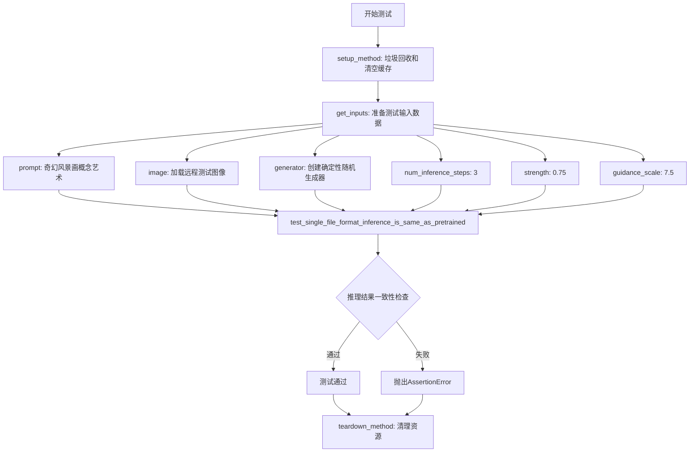

## 类结构

```
SDSingleFileTesterMixin (混入基类)
└── TestStableDiffusionImg2ImgPipelineSingleFileSlow
    └── TestStableDiffusion21Img2ImgPipelineSingleFileSlow
```

## 全局变量及字段


### `gc`
    
Python垃圾回收模块

类型：`module`
    


### `torch`
    
PyTorch深度学习框架

类型：`module`
    


### `StableDiffusionImg2ImgPipeline`
    
图像到图像扩散管道类，用于根据提示词和初始图像生成修改后的图像

类型：`class`
    


### `load_image`
    
远程图像加载函数，用于从URL加载图像到PIL格式

类型：`function`
    


### `backend_empty_cache`
    
GPU缓存清空函数，释放GPU显存

类型：`function`
    


### `enable_full_determinism`
    
确定性训练启用函数，确保测试结果可复现

类型：`function`
    


### `require_torch_accelerator`
    
加速器需求装饰器，标记测试需要GPU加速器

类型：`decorator`
    


### `slow`
    
慢速测试标记装饰器，标识该测试为耗时测试

类型：`decorator`
    


### `torch_device`
    
测试设备标识符，指定测试运行的设备

类型：`str`
    


### `SDSingleFileTesterMixin`
    
单文件测试混入类，提供单文件格式推理一致性测试的基线方法

类型：`class`
    


### `TestStableDiffusionImg2ImgPipelineSingleFileSlow.pipeline_class`
    
IMG2IMG管道类，指定测试所使用的扩散管道类型

类型：`type`
    


### `TestStableDiffusionImg2ImgPipelineSingleFileSlow.ckpt_path`
    
预训练模型权重文件URL路径，指向SDv1.5模型权重

类型：`str`
    


### `TestStableDiffusionImg2ImgPipelineSingleFileSlow.original_config`
    
原始模型配置文件URL路径，指向SDv1.5推理配置

类型：`str`
    


### `TestStableDiffusionImg2ImgPipelineSingleFileSlow.repo_id`
    
HuggingFace仓库标识符，指定模型来源仓库

类型：`str`
    


### `TestStableDiffusion21Img2ImgPipelineSingleFileSlow.pipeline_class`
    
IMG2IMG管道类，指定测试所使用的扩散管道类型

类型：`type`
    


### `TestStableDiffusion21Img2ImgPipelineSingleFileSlow.ckpt_path`
    
SD 2.1版本模型权重文件URL路径，指向SD2.1模型权重

类型：`str`
    


### `TestStableDiffusion21Img2ImgPipelineSingleFileSlow.original_config`
    
SD 2.1版本配置文件URL路径，指向SD2.1推理配置

类型：`str`
    


### `TestStableDiffusion21Img2ImgPipelineSingleFileSlow.repo_id`
    
stabilityai仓库标识符，指定SD2.1模型来源仓库

类型：`str`
    
    

## 全局函数及方法


### `gc.collect()`

强制垃圾回收函数，用于显式触发 Python 的垃圾回收机制，清理不可达的对象以释放内存。在深度学习测试中常用于在测试方法前后清理内存，特别是 GPU 显存。

参数：该函数无参数

返回值：`int`，返回收集到的不可达对象的数量

#### 流程图

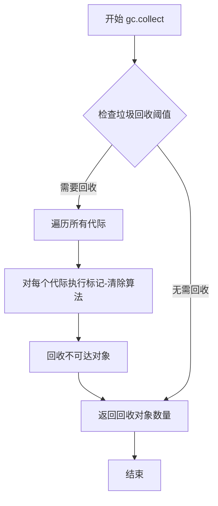

#### 带注释源码

```python
# 在 TestStableDiffusionImg2ImgPipelineSingleFileSlow 类的 setup_method 方法中
def setup_method(self):
    gc.collect()  # 强制进行垃圾回收，清理之前测试残留的内存
    backend_empty_cache(torch_device)  # 清理 GPU 缓存

# 在 TestStableDiffusionImg2ImgPipelineSingleFileSlow 类的 teardown_method 方法中  
def teardown_method(self):
    gc.collect()  # 强制进行垃圾回收，清理当前测试产生的内存
    backend_empty_cache(torch_device)  # 清理 GPU 缓存

# 在 TestStableDiffusion21Img2ImgPipelineSingleFileSlow 类中同样被调用
def setup_method(self):
    gc.collect()  # 强制进行垃圾回收，清理之前测试残留的内存
    backend_empty_cache(torch_device)  # 清理 GPU 缓存

def teardown_method(self):
    gc.collect()  # 强制进行垃圾回收，清理当前测试产生的内存
    backend_empty_cache(torch_device)  # 清理 GPU 缓存
```


### `torch.Generator`

创建并返回一个确定性随机数生成器对象，可用于设置随机种子以确保PyTorch操作的可重复性。

参数：

- `device`：`str` 或 `torch.device`，指定生成器所在的设备（如 "cpu"、"cuda"）
- `seed`：`int`（通过 `.manual_seed(seed)` 调用），设置随机种子以确保确定性

返回值：`torch.Generator`，返回创建的随机数生成器对象

#### 流程图

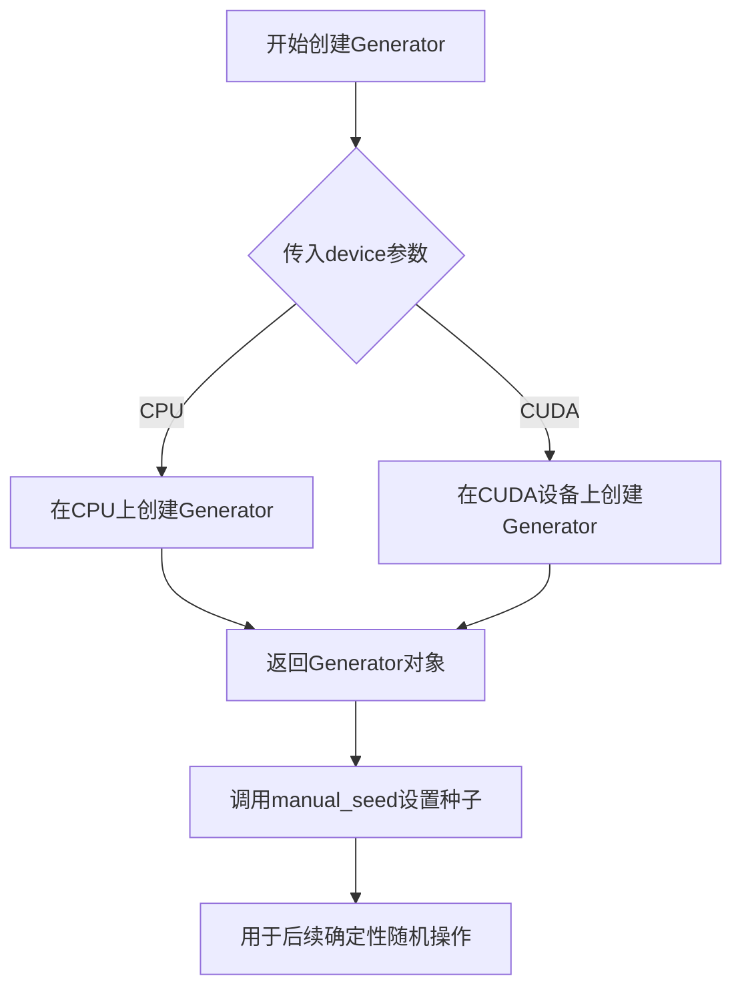

#### 带注释源码

```python
# 从测试代码中提取的实际使用方式
# 这展示了如何创建具有确定性种子的随机数生成器

generator = torch.Generator(device=generator_device).manual_seed(seed)
# 参数：
#   - device: str, 生成器所在的设备 (generator_device="cpu")
#   - seed: int, 随机种子 (seed=0)
# 返回值：
#   - torch.Generator 对象，可用于确保随机操作的可重复性

# 完整上下文使用示例（在 get_inputs 方法中）:
def get_inputs(self, device, generator_device="cpu", dtype=torch.float32, seed=0):
    # 创建确定性的随机数生成器，设置种子为0
    generator = torch.Generator(device=generator_device).manual_seed(seed)
    
    # 加载初始图像
    init_image = load_image(
        "https://huggingface.co/datasets/diffusers/test-arrays/resolve/main"
        "/stable_diffusion_img2img/sketch-mountains-input.png"
    )
    
    # 构建输入字典，包含生成器以确保扩散过程的确定性
    inputs = {
        "prompt": "a fantasy landscape, concept art, high resolution",
        "image": init_image,
        "generator": generator,  # 传入生成器确保可重复性
        "num_inference_steps": 3,
        "strength": 0.75,
        "guidance_scale": 7.5,
        "output_type": "np",
    }
    return inputs
```

#### 技术细节说明

| 属性 | 说明 |
|------|------|
| 类名 | `torch.Generator` |
| 所属模块 | `torch` |
| 核心功能 | 创建随机数生成器，用于设置随机种子确保可重复性 |
| 设备支持 | CPU, CUDA (GPU) |
| 常用方法 | `manual_seed()`, `seed()`, `get_state()`, `set_state()` |


### `load_image`

从指定的 URL 或本地文件路径加载图像，并返回 PIL Image 对象或图像tensor。

参数：

-  `image_url_or_path`：`str`，图像的 URL 地址或本地文件路径

返回值：`PIL.Image.Image` 或 `torch.Tensor`，返回加载的图像对象，通常是 PIL 图像

#### 流程图

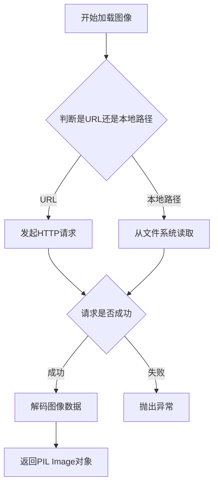

#### 带注释源码

```python
# load_image 是 diffusers.utils 提供的工具函数
# 以下为代码中的实际调用方式

init_image = load_image(
    # 远程图像的 URL 地址
    "https://huggingface.co/datasets/diffusers/test-arrays/resolve/main"
    "/stable_diffusion_img2img/sketch-mountains-input.png"
)

# 返回的 init_image 是一个 PIL Image 对象
# 可直接用于 StableDiffusionImg2ImgPipeline 的图像生成任务
inputs = {
    "prompt": "a fantasy landscape, concept art, high resolution",
    "image": init_image,  # 使用加载的图像作为初始图像
    "generator": generator,
    "num_inference_steps": 3,
    "strength": 0.75,
    "guidance_scale": 7.5,
    "output_type": "np",
}
```

#### 补充说明

- **来源**：此函数来自 `diffusers.utils` 模块，是 Hugging Face diffusers 库提供的内置函数
- **用途**：在测试代码中用于加载远程测试图像，作为 Stable Diffusion Img2Img Pipeline 的输入
- **依赖**：需要网络连接来访问远程图像 URL
- **错误处理**：如果 URL 无效或网络请求失败，会抛出相应的异常


### `TestStableDiffusionImg2ImgPipelineSingleFileSlow.setup_method` / `TestStableDiffusion21Img2ImgPipelineSingleFileSlow.setup_method`

测试类的前置setup钩子，用于在每个测试方法执行前清理Python垃圾回收和GPU缓存，确保测试环境干净，避免内存泄漏和显存不足导致的测试失败。

参数：

- `self`：`TestStableDiffusionImg2ImgPipelineSingleFileSlow` 或 `TestStableDiffusion21Img2ImgPipelineSingleFileSlow` 类型，测试类实例本身，隐式参数

返回值：`None`，无返回值描述（方法执行清理操作后直接返回）

#### 流程图

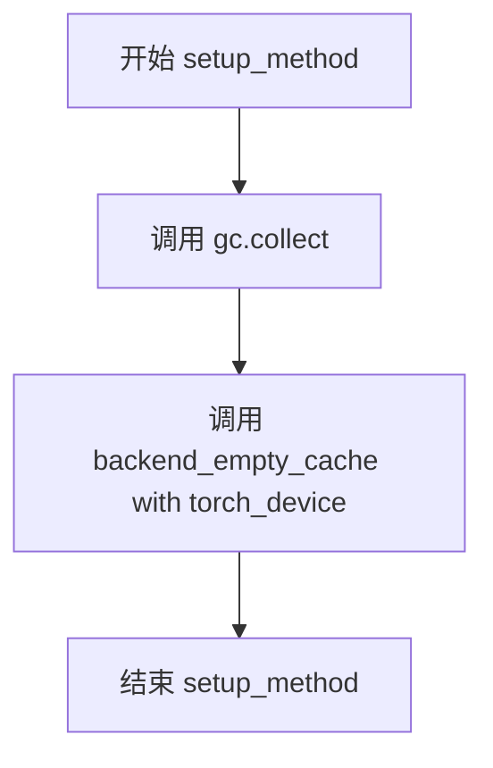

#### 带注释源码

```python
def setup_method(self):
    """
    测试前置setup钩子，在每个测试方法执行前调用。
    用于清理Python垃圾回收和GPU显存，确保测试环境干净。
    """
    # 强制Python垃圾回收器运行，释放未使用的Python对象内存
    gc.collect()
    
    # 调用后端工具函数清空GPU缓存，释放GPU显存
    # torch_device 是从 testing_utils 导入的设备标识符（如 'cuda' 或 'cpu'）
    backend_empty_cache(torch_device)
```

---


### `teardown_method`

测试方法执行完成后的清理钩子，用于回收内存和释放 GPU 缓存资源。

参数：

-  `self`：`TestStableDiffusionImg2ImgPipelineSingleFileSlow` 或 `TestStableDiffusion21Img2ImgPipelineSingleFileSlow` 实例，代表当前测试类的实例对象

返回值：`None`，无返回值

#### 流程图

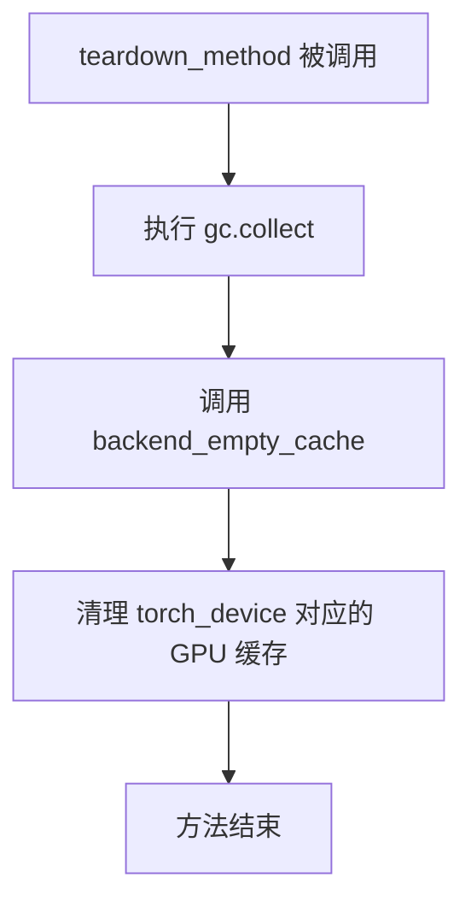

#### 带注释源码

```python
def teardown_method(self):
    """
    测试后置清理钩子。
    在每个测试方法执行完毕后自动调用，用于释放测试过程中占用的资源。
    
    执行流程：
    1. 强制调用 Python 垃圾回收器，释放不再使用的对象
    2. 调用后端工具函数清空 GPU 缓存，释放显存
    """
    gc.collect()                      # 强制启动 Python 垃圾回收，清理循环引用和未引用的对象
    backend_empty_cache(torch_device) # 清空指定设备（GPU）的显存缓存，防止显存泄漏
```


### `TestStableDiffusionImg2ImgPipelineSingleFileSlow.get_inputs`

该方法是一个测试辅助函数，用于构造并返回一个包含 Stable Diffusion Img2Img Pipeline 运行所需参数的字典。它根据传入的随机种子初始化随机生成器，加载指定的初始图像，并配置推理步数、图像变换强度、引导系数等关键参数，以确保测试环境的可复现性。

参数：

-  `self`：类实例，隐含参数。
-  `device`：`torch.device` (或 `str`)，目标计算设备。在当前实现中未直接使用该参数进行计算，仅作为方法签名保留。
-  `generator_device`：`str`，默认为 `"cpu"`。用于创建随机生成器（`torch.Generator`）的设备。
-  `dtype`：`torch.dtype`，默认为 `torch.float32`。推理时使用的数据类型（浮点数精度）。
-  `seed`：`int`，默认为 `0`。随机种子，用于确保生成的随机数序列可复现。

返回值：`dict`，返回包含以下键值的字典：
- `prompt` (`str`): 文本提示词。
- `image` (`PIL.Image`): 初始输入图像。
- `generator` (`torch.Generator`): 随机数生成器。
- `num_inference_steps` (`int`): 推理步数。
- `strength` (`float`): 图像变换强度 (0-1)。
- `guidance_scale` (`float`): 引导系数 (CFG)。
- `output_type` (`str`): 输出类型。

#### 流程图

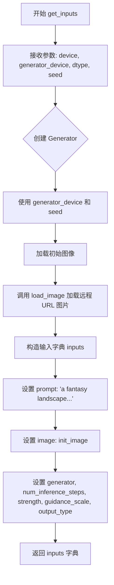

#### 带注释源码

```python
def get_inputs(self, device, generator_device="cpu", dtype=torch.float32, seed=0):
    # 根据传入的 seed 和 generator_device 创建一个 PyTorch 随机生成器
    # 这确保了图像生成过程中的噪声是确定性的，便于测试比较
    generator = torch.Generator(device=generator_device).manual_seed(seed)
    
    # 从远程 URL 加载测试用的初始图像（草图山脉）
    init_image = load_image(
        "https://huggingface.co/datasets/diffusers/test-arrays/resolve/main"
        "/stable_diffusion_img2img/sketch-mountains-input.png"
    )
    
    # 构建输入参数字典，封装了 pipeline 需要的所有配置
    inputs = {
        "prompt": "a fantasy landscape, concept art, high resolution",  # 文本提示
        "image": init_image,  # 初始图像
        "generator": generator,  # 随机生成器
        "num_inference_steps": 3,  # 推理步数（测试用低步数）
        "strength": 0.75,  # 变换强度，值越大对原图改变越大
        "guidance_scale": 7.5,  # Classifier-Free Guidance 强度
        "output_type": "np",  # 输出为 numpy 数组
    }
    return inputs
```


### `TestStableDiffusionImg2ImgPipelineSingleFileSlow.test_single_file_format_inference_is_same_as_pretrained`

该测试方法用于验证从单文件（safetensors格式）加载的Stable Diffusion Img2Img管道推理结果是否与从预训练模型加载的推理结果一致，通过比较两者的输出差异是否在允许的最大误差范围内（默认为1e-3）。

参数：

- `expected_max_diff`：`float`，指定期望的最大允许差异阈值，默认为1e-3，用于判断两种加载方式的推理结果是否足够接近

返回值：`None`，该方法为测试方法，不返回任何值，主要通过断言验证模型输出一致性

#### 流程图

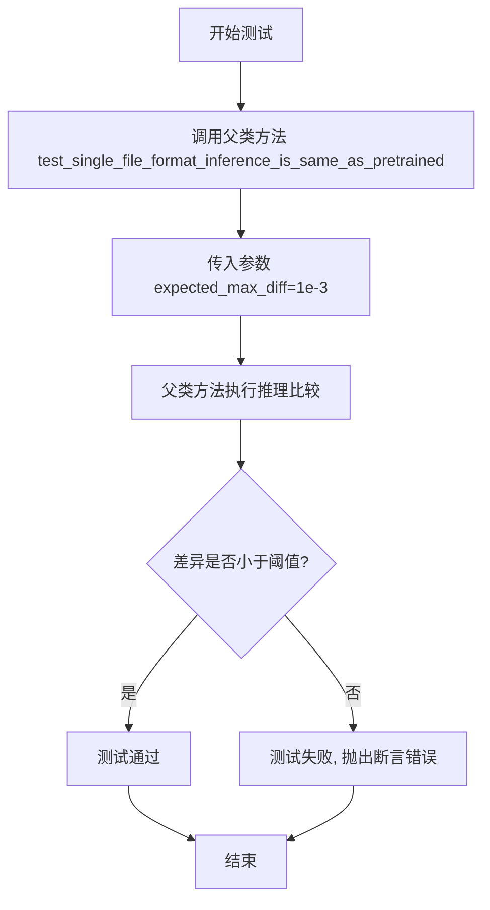

#### 带注释源码

```python
def test_single_file_format_inference_is_same_as_pretrained(self):
    """
    测试单文件格式推理是否与预训练模型结果相同
    
    该方法验证从单文件（safetensors格式）加载的模型权重
    与从原始预训练仓库加载的模型权重进行推理时，输出结果
    是否在允许的误差范围内一致
    
    参数:
        expected_max_diff: float, 允许的最大差异阈值，默认为1e-3
    """
    # 调用父类SDSingleFileTesterMixin的同名测试方法
    # 传入期望的最大差异阈值用于比较
    super().test_single_file_format_inference_is_same_as_pretrained(expected_max_diff=1e-3)
```


### `TestStableDiffusionImg2ImgPipelineSingleFileSlow.setup_method`

这是测试 Stable Diffusion Img2Img Pipeline 单文件版本的环境初始化方法，用于在每个测试方法运行前执行垃圾回收和清空 GPU 缓存，确保测试环境的一致性和可重复性，避免因显存泄漏导致的测试不稳定问题。

参数：该方法没有显式参数（`self` 为隐式参数）

返回值：`None`，无返回值

#### 流程图

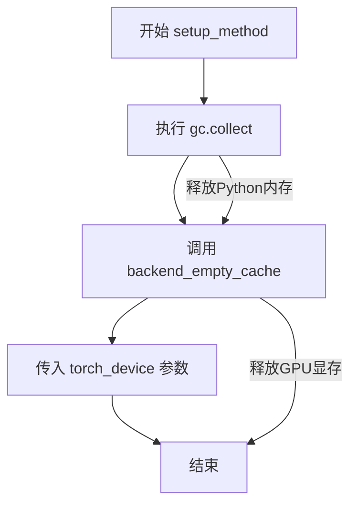

#### 带注释源码

```python
def setup_method(self):
    """
    测试方法初始化钩子
    在每个测试方法执行前调用，用于准备测试环境
    """
    # 触发 Python 垃圾回收，清理不再使用的对象
    gc.collect()
    
    # 清空 GPU/后端缓存，释放显存空间
    # torch_device 是全局变量，表示当前测试使用的设备（如 'cuda:0' 或 'cpu'）
    backend_empty_cache(torch_device)
```


### `TestStableDiffusionImg2ImgPipelineSingleFileSlow.teardown_method`

测试环境清理方法，用于在每个测试方法执行完毕后清理测试环境，释放内存和GPU缓存资源，确保测试之间的隔离性。

参数：

- `self`：无显式参数（Python 实例方法隐式接收），表示当前测试类实例

返回值：`None`，无返回值，该方法仅执行清理操作

#### 流程图

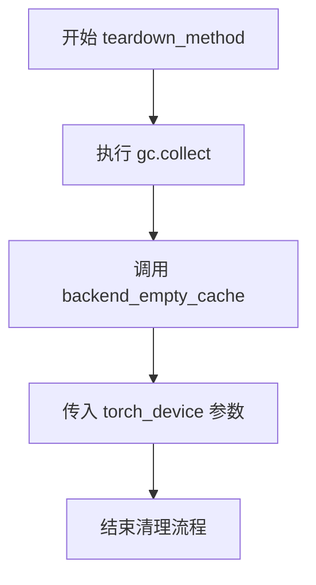

#### 带注释源码

```
def teardown_method(self):
    """
    测试方法结束后的清理操作
    
    执行流程：
    1. 强制进行垃圾回收，释放Python对象内存
    2. 清空GPU/后端缓存，释放显存资源
    
    注意：此方法在每个测试方法后自动被pytest调用
    """
    # 强制调用Python垃圾回收器，回收不再使用的对象
    gc.collect()
    
    # 清空GPU/后端缓存，释放显存资源
    # torch_device 通常为 'cuda' 或 'cpu'
    backend_empty_cache(torch_device)
```


### `TestStableDiffusionImg2ImgPipelineSingleFileSlow.get_inputs`

该方法用于构建 Stable Diffusion Img2Img 管道测试所需的输入参数，通过指定设备、生成器、随机种子等参数，生成包含提示词、初始图像、推理步数、强度、引导比例和输出类型等完整测试输入字典，以支持后续的图像到图像扩散模型推理测试。

参数：

- `device`：`torch.device`，指定模型运行的设备（如 cuda:0、cpu 等）
- `generator_device`：`str`，生成器设备，默认为 "cpu"，用于指定随机数生成器所在的设备
- `dtype`：`torch.dtype`，数据类型，默认为 torch.float32，指定张量的数据类型
- `seed`：`int`，随机种子，默认为 0，用于控制生成器的随机性以确保测试可复现

返回值：`Dict[str, Any]`，返回包含完整测试输入参数的字典，包括提示词、初始图像、生成器、推理步数、强度、引导比例和输出类型等信息，用于调用 StableDiffusionImg2ImgPipeline 进行推理测试。

#### 流程图

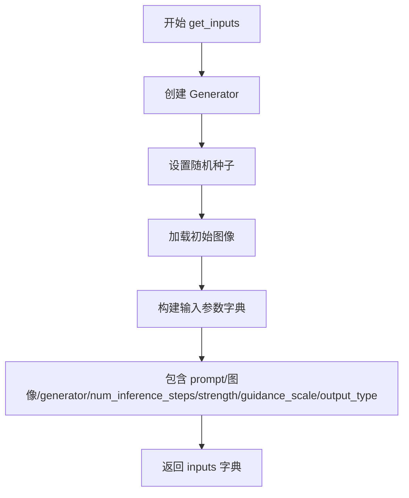

#### 带注释源码

```python
def get_inputs(self, device, generator_device="cpu", dtype=torch.float32, seed=0):
    # 创建一个指定设备的 PyTorch 生成器，用于控制随机数生成
    generator = torch.Generator(device=generator_device).manual_seed(seed)
    
    # 从远程 URL 加载初始图像，用于图像到图像的扩散处理
    init_image = load_image(
        "https://huggingface.co/datasets/diffusers/test-arrays/resolve/main"
        "/stable_diffusion_img2img/sketch-mountains-input.png"
    )
    
    # 构建完整的测试输入参数字典
    inputs = {
        "prompt": "a fantasy landscape, concept art, high resolution",  # 文本提示词
        "image": init_image,  # 初始输入图像
        "generator": generator,  # 随机数生成器，确保可复现性
        "num_inference_steps": 3,  # 推理步数，较少步数用于快速测试
        "strength": 0.75,  # 图像变换强度，0-1之间
        "guidance_scale": 7.5,  # CFG 引导强度
        "output_type": "np",  # 输出类型为 NumPy 数组
    }
    
    # 返回构建好的输入参数字典
    return inputs
```

---

### 补充信息

#### 关键组件信息

- **`TestStableDiffusionImg2ImgPipelineSingleFileSlow`**：测试类，继承自 `SDSingleFileTesterMixin`，用于测试 Stable Diffusion Img2Img Pipeline 的单文件格式推理
- **`StableDiffusionImg2ImgPipeline`**：Diffusers 库中的图像到图像扩散管道类
- **`torch.Generator`**：PyTorch 随机数生成器，用于确保测试的确定性
- **`load_image`**：Diffusers 工具函数，用于从 URL 加载图像

#### 潜在的技术债务或优化空间

1. **硬编码的 URL 和参数**：图像 URL 和测试参数（如 num_inference_steps=3、strength=0.75 等）被硬编码在方法中，建议提取为类属性或配置
2. **重复代码**：`TestStableDiffusion21Img2ImgPipelineSingleFileSlow` 类中的 `get_inputs` 方法与当前方法完全相同，存在代码重复
3. **缺少参数验证**：方法未对输入参数进行有效性验证（如 device 是否有效、dtype 是否支持等）
4. **测试图像依赖外部 URL**：依赖远程 URL 加载测试图像，网络不稳定时可能导致测试失败

#### 其它项目

- **设计目标**：为 Stable Diffusion Img2Img 管道测试提供标准化的输入参数生成，确保测试的一致性和可复现性
- **错误处理**：当前实现未包含错误处理机制，建议添加网络请求失败、参数无效等情况的异常处理
- **数据流**：输入参数（device、generator_device、dtype、seed）→ 生成器初始化 → 图像加载 → 参数字典构建 → 返回供管道调用
- **外部依赖**：依赖 `diffusers` 库的 `StableDiffusionImg2ImgPipeline` 和 `load_image`，依赖 `torch` 库
- **接口契约**：返回的字典必须包含管道所需的所有必要键（prompt、image、generator 等），否则管道调用将失败


### `TestStableDiffusionImg2ImgPipelineSingleFileSlow.test_single_file_format_inference_is_same_as_pretrained`

该方法是一个测试用例，用于验证单文件格式（Single File Format）加载的Stable Diffusion图像到图像（Img2Img）推理结果与使用预训练模型（pretrained）格式的推理结果是否一致，确保两种加载方式在输出上保持等效性。

参数：无显式参数（方法定义无参数，但内部调用父类方法时传递了 `expected_max_diff=1e-3` 关键字参数）

返回值：`None`（测试方法无返回值）

#### 流程图

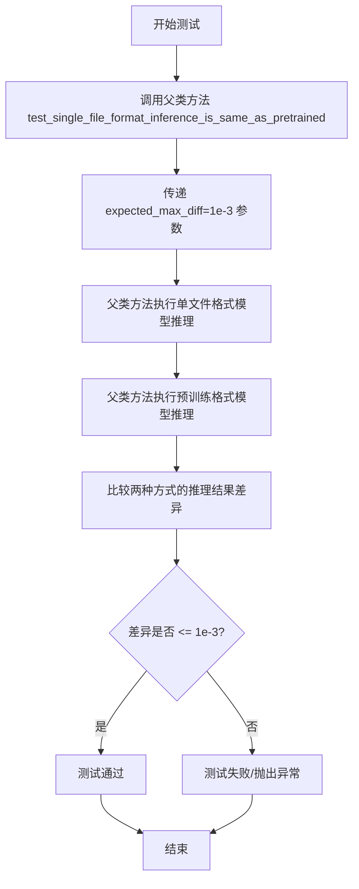

#### 带注释源码

```python
def test_single_file_format_inference_is_same_as_pretrained(self):
    """
    测试单文件格式推理结果与预训练格式推理结果的一致性
    
    该方法验证从单文件（safetensors）加载的Stable Diffusion Img2Img模型
    与从原始预训练权重加载的模型在推理输出上保持一致，确保模型转换的正确性
    """
    # 调用父类 SDSingleFileTesterMixin 的同名方法
    # expected_max_diff=1e-3 表示允许的最大推理结果差异阈值
    super().test_single_file_format_inference_is_same_as_pretrained(expected_max_diff=1e-3)
```

#### 父类方法参考信息

由于实际的验证逻辑在父类 `SDSingleFileTesterMixin` 中，从测试框架设计可以推断父类方法的核心逻辑：

- **功能**：加载两个版本的模型（单文件格式 vs 预训练格式），对相同输入执行推理，比较输出差异
- **参数**：
  - `expected_max_diff`：float类型，允许的最大差异阈值，此处为 1e-3
- **返回值**：无返回值（测试方法），若差异超过阈值则抛出断言错误


### `TestStableDiffusion21Img2ImgPipelineSingleFileSlow.setup_method`

测试环境初始化方法，用于在每个测试方法运行前清理内存和GPU缓存，确保测试环境的干净状态。

参数：

- `self`：`TestStableDiffusion21Img2ImgPipelineSingleFileSlow`，类的实例对象（隐式参数）

返回值：`None`，无返回值

#### 流程图

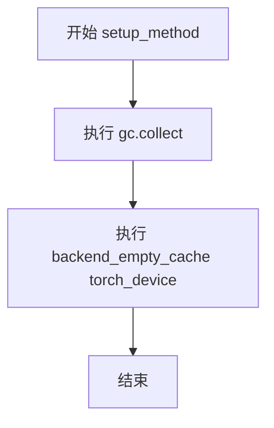

#### 带注释源码

```python
def setup_method(self):
    """
    测试环境初始化方法。
    在每个测试方法执行前调用，用于清理内存和GPU缓存，
    确保测试环境处于干净状态，避免测试间的相互影响。
    
    Args:
        self: TestStableDiffusion21Img2ImgPipelineSingleFileSlow类的实例
        
    Returns:
        None
    """
    # 手动触发Python垃圾回收，清理未使用的Python对象
    gc.collect()
    
    # 清空GPU缓存，释放GPU显存，确保后续测试有足够的显存可用
    # torch_device 是一个全局变量，表示当前测试使用的PyTorch设备（通常是GPU）
    backend_empty_cache(torch_device)
```


### `TestStableDiffusion21Img2ImgPipelineSingleFileSlow.teardown_method`

该方法是测试环境清理方法，用于在每个测试方法执行完成后释放GPU内存和进行垃圾回收，确保测试环境不会因为显存泄漏而导致后续测试失败。

参数：该方法无参数（除隐式self外）

返回值：`None`，无返回值

#### 流程图

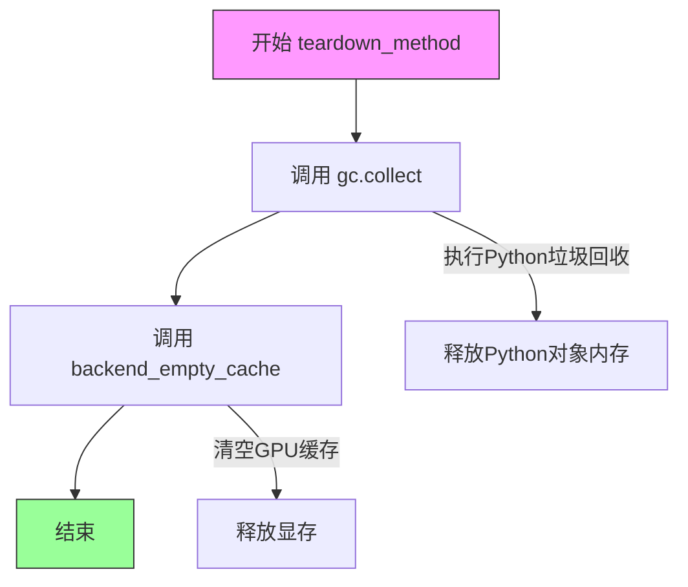

#### 带注释源码

```python
def teardown_method(self):
    """
    测试方法结束后的清理工作
    
    该方法在每个测试方法执行完成后被调用，用于清理测试过程中
    产生的GPU内存占用和Python对象，防止显存泄漏影响后续测试。
    """
    # 执行Python垃圾回收，释放不再使用的Python对象内存
    gc.collect()
    
    # 清空GPU/设备端的缓存，释放显存
    # torch_device 是测试工具函数，返回当前测试使用的设备（如 'cuda'）
    backend_empty_cache(torch_device)
```

#### 关键组件信息

| 组件名称 | 一句话描述 |
|---------|-----------|
| `gc` | Python内置的垃圾回收模块，用于自动回收内存 |
| `gc.collect()` | 强制进行垃圾回收，释放循环引用对象的内存 |
| `backend_empty_cache` | 测试工具函数，用于清空GPU缓存释放显存 |
| `torch_device` | 全局变量，表示当前PyTorch使用的设备（CPU或CUDA） |

#### 潜在的技术债务或优化空间

1. **重复代码**：该类的`teardown_method`与父类`TestStableDiffusionImg2ImgPipelineSingleFileSlow`中的实现完全相同，可考虑提取到Mixin或基类中复用
2. **硬编码设备**：直接使用全局变量`torch_device`，缺乏灵活性，无法针对特定测试指定不同设备
3. **缺少错误处理**：如果`backend_empty_cache`或`gc.collect`抛出异常，没有捕获处理，可能导致测试框架行为不一致
4. **清理粒度**：当前清理粒度较粗，可考虑在测试类中添加更细粒度的资源管理（如显式删除大模型对象）

#### 其它项目

**设计目标与约束**：
- 设计目标：确保每个测试方法执行后释放GPU显存，防止显存不足导致后续测试失败
- 约束：必须在测试方法之后、下一个测试方法之前执行

**错误处理与异常设计**：
- 当前无显式错误处理，任何异常都会向上传播
- 建议：添加try-except确保清理逻辑的异常不会掩盖原始测试的失败原因

**数据流与状态机**：
- 该方法不涉及测试数据的输入输出，仅作为状态清理
- 状态转换：测试完成态 → 清理态 → 等待下一个测试

**外部依赖与接口契约**：
- 依赖`gc`模块（Python标准库）
- 依赖`backend_empty_cache`函数（项目内部测试工具）
- 依赖`torch_device`全局变量（项目内部测试配置）


### `TestStableDiffusion21Img2ImgPipelineSingleFileSlow.get_inputs`

该方法用于构建 Stable Diffusion 2.1 图像到图像（Img2Img）pipeline 的测试输入参数，通过设置随机生成器种子、加载预设测试图像、配置推理参数（推理步数、强度、引导系数等），返回一个包含 prompt、图像、生成器及推理配置的字典，以支持单文件格式推理的一致性测试。

参数：

- `device`：`torch.device`，运行设备，用于指定 pipeline 执行的目标设备（方法内部未直接使用，但作为接口参数保留）
- `generator_device`：`str`，默认为 `"cpu"`，生成器设备，用于创建随机数生成器所在的设备
- `dtype`：`torch.dtype`，默认为 `torch.float32`，数据类型，用于指定张量的数据类型
- `seed`：`int`，默认为 `0`，随机种子，用于确保测试结果的可重复性

返回值：`Dict[str, Any]`，返回包含图像到图像推理所需全部输入参数的字典，包括提示词、初始图像、生成器、推理步数、强度参数、引导比例和输出类型。

#### 流程图

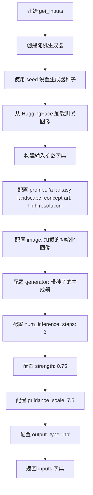

#### 带注释源码

```python
def get_inputs(self, device, generator_device="cpu", dtype=torch.float32, seed=0):
    """
    构建 Stable Diffusion 2.1 Img2Img pipeline 的测试输入参数
    
    参数:
        device: 运行设备，用于指定 pipeline 执行的目标设备
        generator_device: 生成器设备，默认为 "cpu"，用于创建随机数生成器
        dtype: 数据类型，默认为 torch.float32，用于指定张量精度
        seed: 随机种子，默认为 0，用于确保测试结果可重复
    
    返回:
        包含图像到图像推理所需参数的字典
    """
    # 创建 PyTorch 随机数生成器，并使用指定种子确保可重复性
    generator = torch.Generator(device=generator_device).manual_seed(seed)
    
    # 从 HuggingFace 数据集加载测试用的初始图像（山脉素描）
    init_image = load_image(
        "https://huggingface.co/datasets/diffusers/test-arrays/resolve/main"
        "/stable_diffusion_img2img/sketch-mountains-input.png"
    )
    
    # 构建完整的输入参数字典，包含 pipeline 执行所需全部配置
    inputs = {
        "prompt": "a fantasy landscape, concept art, high resolution",  # 文本提示词
        "image": init_image,                                           # 初始输入图像
        "generator": generator,                                        # 随机生成器（确保确定性）
        "num_inference_steps": 3,                                      # 推理步数（测试用小值）
        "strength": 0.75,                                              # 图像变换强度 (0-1)
        "guidance_scale": 7.5,                                         # CFG 引导强度
        "output_type": "np",                                           # 输出为 NumPy 数组
    }
    
    # 返回构建好的输入参数字字典，供 pipeline 调用
    return inputs
```


### `TestStableDiffusion21Img2ImgPipelineSingleFileSlow.test_single_file_format_inference_is_same_as_pretrained`

该方法用于验证从单文件格式（safetensors）加载的 Stable Diffusion 2.1 图像到图像（Img2Img）Pipeline 推理结果与从预训练模型加载的推理结果一致性，确保单文件格式转换后模型功能无损。

参数：

-  `expected_max_diff`：`float`，关键字参数，指定期望的最大允许差异阈值，此处设为 `1e-3`（千分之一），用于判断两次推理结果是否在可接受范围内

返回值：`None`，该方法为测试方法，通过断言验证推理一致性，不返回具体数值

#### 流程图

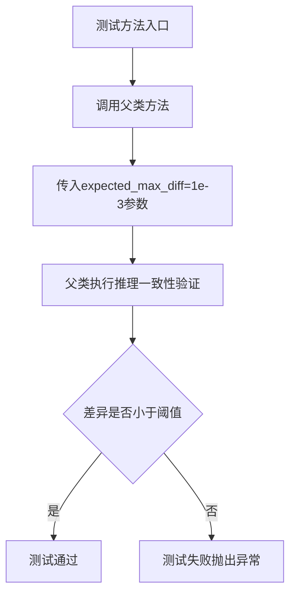

#### 带注释源码

```python
def test_single_file_format_inference_is_same_as_pretrained(self):
    """
    测试单文件格式推理是否与预训练模型推理结果一致
    
    该测试方法重写了父类 SDSingleFileTesterMixin 的同名方法，
    用于验证从 safetensors 单文件加载的 Stable Diffusion 2.1 Img2Img Pipeline
    与原始预训练模型进行推理时，输出结果的一致性。
    
    参数:
        expected_max_diff: float, 允许的最大差异阈值，默认为 1e-3
        
    返回:
        None: 测试通过则无返回值，失败则抛出断言异常
    """
    # 调用父类的测试方法，传入期望的最大差异阈值
    # 父类方法会执行以下操作：
    # 1. 从 ckpt_path 加载单文件格式的模型权重
    # 2. 使用相同的输入调用单文件 pipeline 进行推理
    # 3. 从 repo_id 加载原始预训练模型 pipeline 进行推理
    # 4. 比较两次推理结果的差异
    # 5. 如果差异大于 expected_max_diff，则断言失败
    super().test_single_file_format_inference_is_same_as_pretrained(expected_max_diff=1e-3)
```

#### 补充信息

| 项目 | 描述 |
|------|------|
| **所属类** | `TestStableDiffusion21Img2ImgPipelineSingleFileSlow` |
| **继承父类** | `SDSingleFileTesterMixin` |
| **Pipeline类型** | `StableDiffusionImg2ImgPipeline` |
| **模型路径** | `https://huggingface.co/stabilityai/stable-diffusion-2-1/blob/main/v2-1_768-ema-pruned.safetensors` |
| **配置路径** | `https://raw.githubusercontent.com/Stability-AI/stablediffusion/main/configs/stable-diffusion/v2-inference-v.yaml` |
| **测试设备要求** | 需要 CUDA 支持（`@require_torch_accelerator`） |
| **运行速度标记** | 慢速测试（`@slow`） |

## 关键组件


### TestStableDiffusionImg2ImgPipelineSingleFileSlow

测试类，继承自 SDSingleFileTesterMixin，用于测试 Stable Diffusion v1.5 版本的 Img2Img Pipeline 单文件格式推理是否与预训练模型结果一致

### TestStableDiffusion21Img2ImgPipelineSingleFileSlow

测试类，继承自 SDSingleFileTesterMixin，用于测试 Stable Diffusion v2.1 版本的 Img2Img Pipeline 单文件格式推理是否与预训练模型结果一致

### SDSingleFileTesterMixin

混合类，提供单文件格式测试的通用方法，包括模型加载、推理比较等核心测试逻辑

### StableDiffusionImg2ImgPipeline

被测试的核心管道类，用于图像到图像的生成任务，支持文生图引导扩散

### pipeline_class

类属性，指定要测试的管道类为 StableDiffusionImg2ImgPipeline

### ckpt_path

类属性，存储模型检查点的远程 URL 地址，支持从 HuggingFace 加载单文件格式的模型权重

### original_config

类属性，存储原始模型配置文件的 URL 地址，用于验证单文件格式与原始配置的兼容性

### repo_id

类属性，HuggingFace Hub 上的模型仓库标识符

### get_inputs

测试方法，负责构建测试所需的输入参数，包括提示词、初始图像、生成器、推理步数、图像强度和引导系数等

### setup_method

测试前置方法，执行垃圾回收和 GPU 缓存清理，为每个测试用例准备干净的运行环境

### teardown_method

测试后置方法，执行垃圾回收和 GPU 缓存清理，防止测试间的内存泄漏

### test_single_file_format_inference_is_same_as_pretrained

核心测试方法，验证单文件格式模型的推理结果与预训练模型的最大差异是否在可接受范围内（默认1e-3）

## 问题及建议


### 已知问题

-   **代码重复严重**：两个测试类（TestStableDiffusionImg2ImgPipelineSingleFileSlow 和 TestStableDiffusion21Img2ImgPipelineSingleFileSlow）的结构几乎完全相同，仅 ckpt_path、original_config 和 repo_id 不同，存在大量重复代码。
-   **测试配置硬编码**：num_inference_steps=3、strength=0.75、guidance_scale=7.5 等关键参数硬编码在 get_inputs 方法中，缺乏注释说明为何选择这些值，且难以通过参数化方式调整。
-   **setup_method 和 teardown_method 重复**：两个类的资源清理逻辑完全相同，可提取到父类或 mixin 中。
-   **网络依赖无容错**：load_image 依赖远程 URL（huggingface.co），网络波动或链接失效会导致测试失败，缺乏错误处理和重试机制。
-   **资源清理不够健壮**：仅在正常流程调用 gc.collect() 和 backend_empty_cache，若测试中途异常可能无法正确释放 GPU 内存。
-   **测试用例覆盖单一**：仅有一个测试方法 test_single_file_format_inference_is_same_as_pretrained，缺乏对边界条件、异常输入或不同配置组合的测试。

### 优化建议

-   **引入参数化测试**：使用 pytest 的 parametrize 装饰器，将模型路径、配置等作为参数，减少重复类定义。
-   **提取公共基类**：将 get_inputs、setup_method、teardown_method 等公共逻辑提取到父类中，通过类属性覆盖差异部分。
-   **配置外部化**：将硬编码的测试参数（num_inference_steps、strength 等）提取为类属性或配置文件，并添加注释说明各参数的作用和测试意图。
-   **增强错误处理**：为 load_image 添加 try-except 包装，提供 fallback 机制或清晰的错误信息；考虑将测试图片下载到本地缓存。
-   **使用 try-finally 确保清理**：将资源清理逻辑放入 finally 块，确保异常情况下也能执行 GPU 内存释放。
-   **增加测试用例**：补充边界条件测试（如 strength=0/1、guidance_scale=0）、无效输入测试、以及不同 dtype/device 组合的兼容性测试。

## 其它


### 设计目标与约束

本测试代码旨在验证单文件格式（Safetensors）加载的Stable Diffusion Img2Img Pipeline推理结果与原始预训练模型完全一致。约束条件包括：必须使用@slow标记为慢速测试，仅在配备torch accelerator的环境中运行，需要网络访问以下载模型权重和测试图像。

### 错误处理与异常设计

网络异常处理：模型权重和测试图像通过HTTP URL加载，若下载失败应抛出网络相关异常。内存管理：通过gc.collect()和backend_empty_cache()在setup和teardown阶段清理GPU内存，防止测试间内存泄漏。设备兼容性：使用torch_device获取当前设备，需确保CUDA可用。

### 数据流与状态机

测试流程状态机包含：初始化状态(setup) -> 准备输入数据(get_inputs) -> 执行测试(test_single_file_format_inference_is_same_as_pretrained) -> 清理状态(teardown)。输入数据流：外部URL图像 -> load_image()转换为PIL Image -> 构建包含prompt、image、generator、num_inference_steps、strength、guidance_scale、output_type的字典。

### 外部依赖与接口契约

核心依赖：diffusers库提供StableDiffusionImg2ImgPipeline和load_image；torch库提供Tensor和Generator；testing_utils提供测试工具函数。接口契约：SDSingleFileTesterMixin.test_single_file_format_inference_is_same_as_pretrained(expected_max_diff)方法需接收最大允许差异阈值并返回测试结果。

### 性能考量与资源需求

测试使用3步推理(num_inference_steps=3)以平衡测试速度和模型质量验证。GPU显存需求取决于模型版本（v1-5约4GB，v2-1约6GB）。测试执行时间预计每版本5-10分钟。

### 安全性考虑

模型来源：使用HuggingFace官方托管的权重（stable-diffusion-v1-5和stabilityai/stable-diffusion-2-1），确保可信度。Safetensors格式：相比pickle格式更安全，防止恶意代码执行。

### 测试策略与覆盖率

单文件格式测试覆盖：验证Safetensors加载、权重转换、推理一致性。版本覆盖：v1-5(SD 1.5)和v2-1(SD 2.1)两个主要版本。参数覆盖：固定使用strength=0.75、guidance_scale=7.5、output_type=np进行一致性验证。

### 版本兼容性

Python版本：需Python 3.8+。PyTorch版本：需CUDA 11.0+配合torch。Diffusers版本：需支持StableDiffusionImg2ImgPipeline的版本。

### 配置管理

测试参数硬编码在get_inputs方法中，包括prompt内容、推理步数、strength、guidance_scale等。模型路径和配置文件URL通过类属性(ckpt_path、original_config、repo_id)定义。

### 资源清理与生命周期

setup_method：执行gc.collect()和backend_empty_cache()进行GPU内存预清理。teardown_method：执行gc.collect()和backend_empty_cache()确保测试后GPU内存释放。测试图像使用load_image动态加载，不持久化存储。

    