# `diffusers\tests\single_file\test_stable_diffusion_inpaint_single_file.py` 详细设计文档

该文件包含两个测试类，用于验证 Stable Diffusion 1.5 和 2.0 版本的 Inpainting Pipeline 从单文件加载后的功能正确性，包括模型推理一致性测试和 4 通道 UNet 加载测试。

## 整体流程

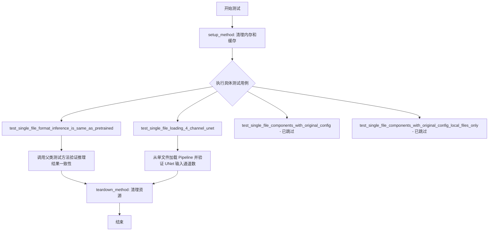

## 类结构

```
SDSingleFileTesterMixin (混入类)
└── TestStableDiffusionInpaintPipelineSingleFileSlow (SD 1.5 Inpainting 测试)
└── TestStableDiffusion21InpaintPipelineSingleFileSlow (SD 2.0 Inpainting 测试)
```

## 全局变量及字段


### `gc`
    
Python 垃圾回收模块，用于手动控制内存管理和释放未使用的对象。

类型：`module`
    


### `torch`
    
PyTorch 深度学习框架，提供张量运算、自动求导和神经网络构建功能。

类型：`module`
    


### `pytest`
    
Python 测试框架，用于编写、执行和组织单元测试与集成测试。

类型：`module`
    


### `StableDiffusionInpaintPipeline`
    
Diffusers 库中的 Stable Diffusion 图像修复（inpainting）流水线类，负责根据提示词、图像和掩码生成修复后的图像。

类型：`class`
    


### `load_image`
    
从 URL 或本地路径加载图像的辅助函数，返回 PIL 图像对象。

类型：`function`
    


### `backend_empty_cache`
    
清理 GPU 缓存的函数，用于在测试前后释放显存。

类型：`function`
    


### `enable_full_determinism`
    
启用完全确定性测试的函数，设置随机种子以保证测试结果可复现。

类型：`function`
    


### `require_torch_accelerator`
    
装饰器，要求测试在支持 torch 加速器（如 CUDA）的环境中运行，否则跳过测试。

类型：`decorator`
    


### `slow`
    
标记慢速测试的装饰器，通常用于标识执行时间较长的测试用例。

类型：`decorator`
    


### `torch_device`
    
torch 设备变量，指定模型运行所在的设备（如 'cuda' 或 'cpu'）。

类型：`str`
    


### `TestStableDiffusionInpaintPipelineSingleFileSlow.pipeline_class`
    
指向 StableDiffusionInpaintPipeline 的类对象，用于在单文件测试中实例化 inpainting 流水线。

类型：`type`
    


### `TestStableDiffusionInpaintPipelineSingleFileSlow.ckpt_path`
    
模型检查点的 URL 或本地路径（Stable Diffusion 1.5 版本）。

类型：`str`
    


### `TestStableDiffusionInpaintPipelineSingleFileSlow.original_config`
    
原始模型配置文件的 URL，用于加载模型结构定义。

类型：`str`
    


### `TestStableDiffusionInpaintPipelineSingleFileSlow.repo_id`
    
HuggingFace 模型仓库的唯一标识符，用于标识模型来源。

类型：`str`
    


### `TestStableDiffusion21InpaintPipelineSingleFileSlow.pipeline_class`
    
指向 StableDiffusionInpaintPipeline 的类对象，用于在单文件测试中实例化 inpainting 流水线。

类型：`type`
    


### `TestStableDiffusion21InpaintPipelineSingleFileSlow.ckpt_path`
    
模型检查点的 URL 或本地路径（Stable Diffusion 2.0 版本）。

类型：`str`
    


### `TestStableDiffusion21InpaintPipelineSingleFileSlow.original_config`
    
原始模型配置文件的 URL，用于加载模型结构定义。

类型：`str`
    


### `TestStableDiffusion21InpaintPipelineSingleFileSlow.repo_id`
    
HuggingFace 模型仓库的唯一标识符，用于标识模型来源。

类型：`str`
    
    

## 全局函数及方法


### `gc.collect`

这是 Python 标准库 `gc` 模块中的一个全局函数，用于强制执行垃圾回收（Garbage Collection）。在提供的代码中，该函数被嵌入在 `TestStableDiffusionInpaintPipelineSingleFileSlow` 和 `TestStableDiffusion21InpaintPipelineSingleFileSlow` 这两个测试类的 `setup_method` 和 `teardown_method` 中。其核心作用是在测试环境初始化前和测试执行结束后，主动触发 Python 解释器的垃圾回收机制，清除无法访问的 Python 对象以释放堆内存。这一步骤通常与 `backend_empty_cache`（用于清除 GPU 显存）配合使用，目的是在加载和卸载重型的 Stable Diffusion 模型（如 StableDiffusionInpaintPipeline）前，确保系统拥有足够的内存资源，防止出现 Out Of Memory (OOM) 错误，是内存敏感型测试中的标准清理流程。

参数：
- 无

返回值：`int`，返回在垃圾回收过程中实际回收的不可达对象数量。

#### 流程图

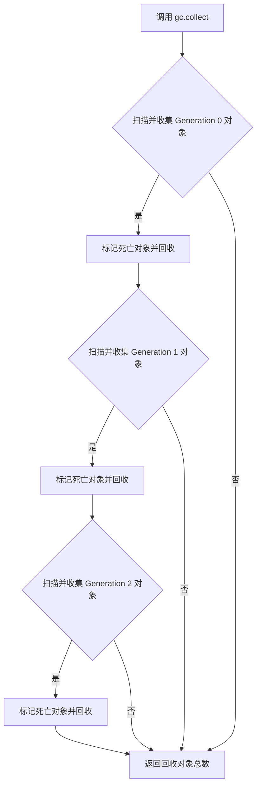

#### 带注释源码

以下代码片段展示了 `gc.collect()` 在测试类的 `setup_method` 和 `teardown_method` 中的典型用法：

```python
def setup_method(self):
    # 强制进行垃圾回收，清理可能残留的 Python 对象，释放堆内存
    gc.collect()
    # 清理 GPU 缓存（显存），确保测试开始时环境干净
    backend_empty_cache(torch_device)

def teardown_method(self):
    # 强制进行垃圾回收，清理测试过程中产生的临时对象
    gc.collect()
    # 清理 GPU 缓存（显存），释放测试占用的显存资源
    backend_empty_cache(torch_device)
```


### `torch.Generator`

这是 PyTorch 的随机数生成器类，用于管理随机数生成状态，确保深度学习模型在推理或训练过程中的可重复性（reproducibility）。在代码中，通过指定设备创建生成器实例，并使用 `manual_seed` 方法设置随机种子，以确保每次运行生成相同的随机数序列，从而实现可确定的测试结果。

参数：

- `device`：`str` 或 `torch.device`，生成器所在的计算设备（如 "cpu"、"cuda" 等）

返回值：`torch.Generator`，返回一个 PyTorch 随机数生成器对象，可用于设置随机种子以实现结果的可重复性。

#### 流程图

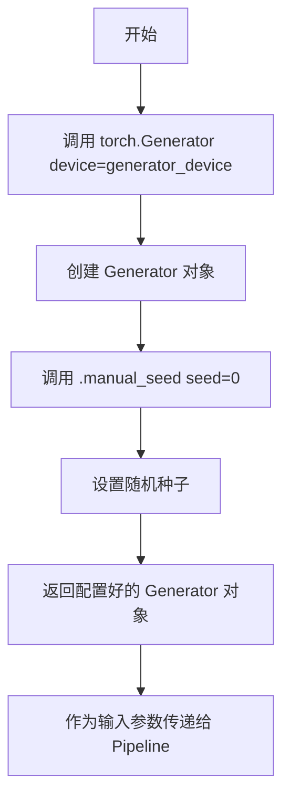

#### 带注释源码

```python
# 在 get_inputs 方法中使用 torch.Generator
def get_inputs(self, device, generator_device="cpu", dtype=torch.float32, seed=0):
    # 创建随机数生成器实例，指定设备为 generator_device
    # device 参数: 指定生成器在哪个设备上运行 ("cpu" 或 "cuda")
    generator = torch.Generator(device=generator_device).manual_seed(seed)
    # .manual_seed(seed) 方法设置随机种子，确保每次调用产生相同的随机数序列
    # seed=0 表示使用固定的种子值 0，实现测试结果的可重复性
    
    # 加载输入图像和掩码图像
    init_image = load_image(...)
    mask_image = load_image(...)
    
    # 构建输入字典，包含 prompt、图像、掩码、生成器等参数
    inputs = {
        "prompt": "Face of a yellow cat, high resolution, sitting on a park bench",
        "image": init_image,
        "mask_image": mask_image,
        "generator": generator,  # 传入配置好的生成器，确保推理过程可重复
        "num_inference_steps": 3,
        "guidance_scale": 7.5,
        "output_type": "np",
    }
    return inputs
```


### `torch_device`

获取测试用的 PyTorch 设备，根据系统环境自动选择 CUDA（若可用）或 CPU 设备。

参数： 无

返回值：`str`，返回 PyTorch 设备字符串（如 "cuda"、"cpu" 等）

#### 流程图

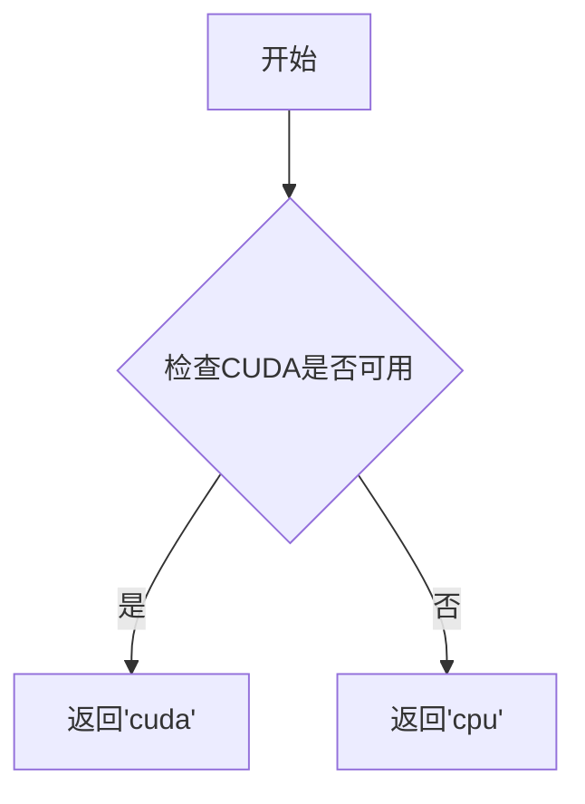

#### 带注释源码

```
# torch_device 函数通常定义在 testing_utils 模块中
# 其典型实现如下：

def torch_device():
    """
    获取测试用的 PyTorch 设备。
    
    优先返回 CUDA 设备（如果可用），否则返回 CPU 设备。
    这确保了测试可以在有 GPU 的环境下利用硬件加速，
    同时在没有 GPU 的环境下也能正常运行。
    
    Returns:
        str: 返回 'cuda' 如果 CUDA 可用，否则返回 'cpu'
    """
    # 检查系统中是否有可用的 CUDA 设备
    if torch.cuda.is_available():
        # 返回 CUDA 设备字符串，通常为 'cuda'
        return 'cuda'
    else:
        # 回退到 CPU 设备
        return 'cpu'
```

#### 使用示例

在给定代码中的实际使用方式：

```python
def setup_method(self):
    gc.collect()
    backend_empty_cache(torch_device)  # 清理指定设备的缓存

def teardown_method(self):
    gc.collect()
    backend_empty_cache(torch_device)  # 清理指定设备的缓存
```

---

**说明**：由于原始代码中仅导入了 `torch_device` 而未展示其具体实现，上述源码为基于该函数在 diffusers 项目中的典型实现模式的推断。`torch_device` 是 diffusers 测试框架中的常用工具函数，用于在测试过程中动态获取合适的计算设备。


### `load_image`

从指定的 URL 加载图像并返回图像对象（通常是 PIL Image 或 torch.Tensor），用于后续的图像处理任务。

参数：

- `url`：`str`，图像资源的统一资源定位符（URL），指向要加载的图像文件

返回值：`PIL.Image.Image` 或 `torch.Tensor`，加载后的图像对象，具体类型取决于 `diffusers.utils.load_image` 的实现

#### 流程图

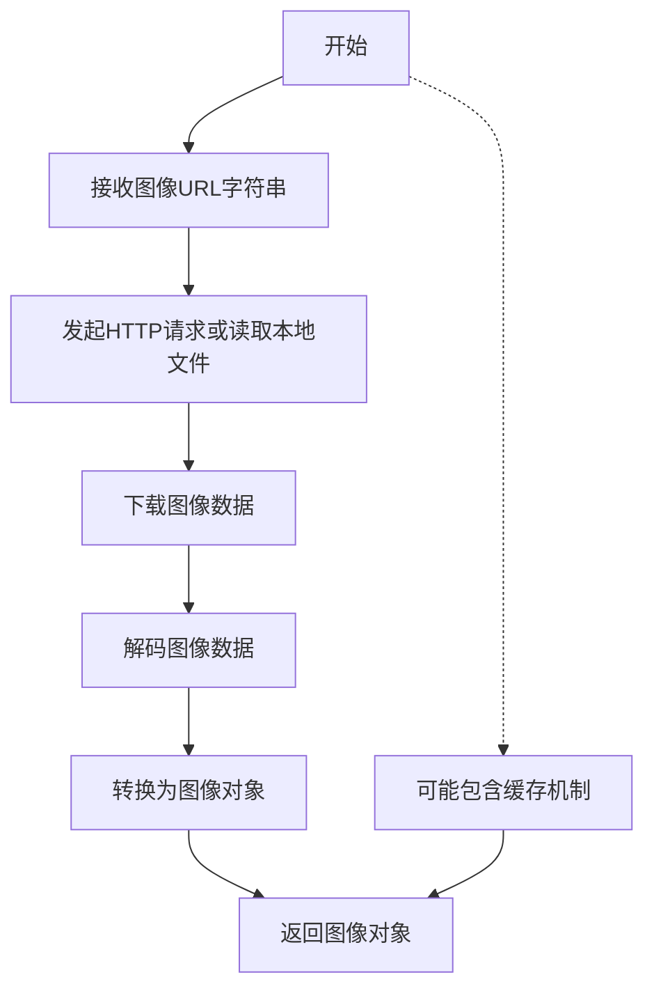

#### 带注释源码

```python
# load_image 是从 diffusers.utils 导入的外部函数
# 以下是其在代码中的典型使用方式：

# 从 URL 加载输入图像
init_image = load_image(
    "https://huggingface.co/datasets/diffusers/test-arrays/resolve/main"
    "/stable_diffusion_inpaint/input_bench_image.png"
)

# 从 URL 加载掩码图像
mask_image = load_image(
    "https://huggingface.co/datasets/diffusers/test-arrays/resolve/main"
    "/stable_diffusion_inpaint/input_bench_mask.png"
)

# 使用示例：将加载的图像用于 Stable Diffusion inpainting pipeline
inputs = {
    "prompt": "Face of a yellow cat, high resolution, sitting on a park bench",
    "image": init_image,      # 加载的输入图像
    "mask_image": mask_image, # 加载的掩码图像
    "generator": generator,
    "num_inference_steps": 3,
    "guidance_scale": 7.5,
    "output_type": "np",
}
```

> **注意**：`load_image` 函数来源于 `diffusers` 库，其具体实现位于外部包中。上述源码展示了该函数在测试代码中的调用方式和上下文使用。


### `TestStableDiffusionInpaintPipelineSingleFileSlow.setup_method`

该方法是测试类的前置设置方法，用于在每个测试方法执行前清理内存和GPU缓存，确保测试环境处于干净的初始状态。

参数：无（除隐含的 `self` 参数外无显式参数）

返回值：`None`，无返回值

#### 流程图

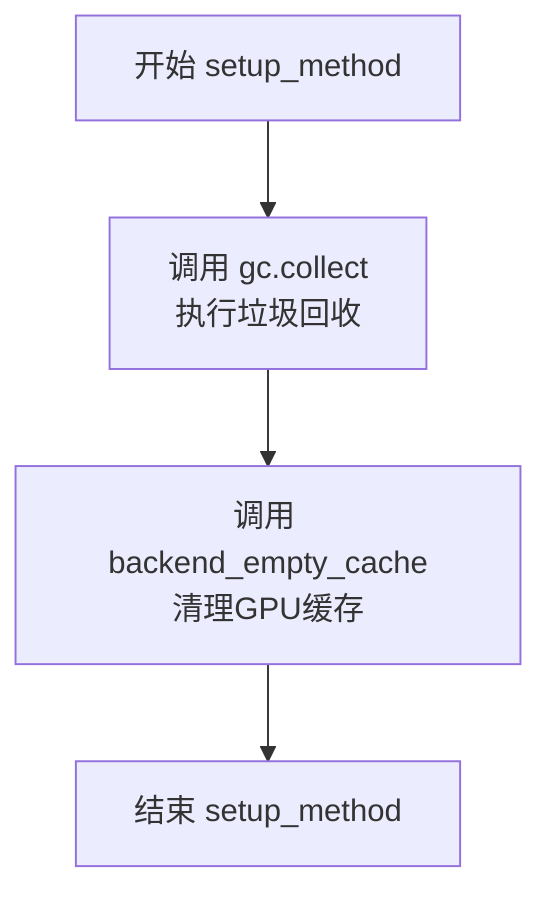

#### 带注释源码

```python
def setup_method(self):
    """
    测试前置设置方法，在每个测试方法执行前调用
    用于清理内存和GPU缓存，确保测试环境干净
    """
    gc.collect()              # 执行Python垃圾回收，释放未使用的内存对象
    backend_empty_cache(torch_device)  # 清理指定设备（GPU）的缓存内存
```


### `TestStableDiffusionInpaintPipelineSingleFileSlow.teardown_method`

测试后置清理方法，用于在每个测试方法执行完毕后清理Python垃圾回收和GPU显存，防止测试间的内存泄漏和显存溢出。

参数：

-  `self`：`TestStableDiffusionInpaintPipelineSingleFileSlow`，当前测试类的实例对象，隐式参数

返回值：`None`，无返回值，仅执行清理操作

#### 流程图

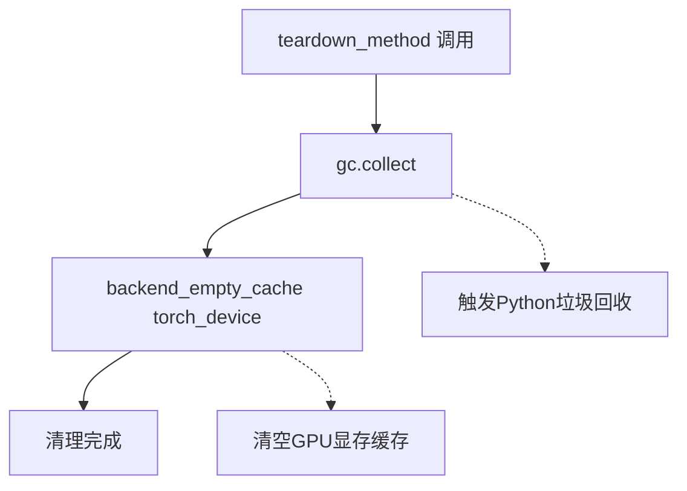

#### 带注释源码

```python
def teardown_method(self):
    """
    测试方法后置清理钩子
    
    在每个测试方法执行完毕后自动调用，用于释放测试过程中
    积累的内存和GPU显存资源，确保测试之间的隔离性。
    """
    gc.collect()  # 触发Python垃圾回收，释放未引用的对象
    backend_empty_cache(torch_device)  # 清空GPU显存缓存，释放GPU内存
```

---

### `TestStableDiffusion21InpaintPipelineSingleFileSlow.teardown_method`

测试后置清理方法，用于在每个测试方法执行完毕后清理Python垃圾回收和GPU显存，防止测试间的内存泄漏和显存溢出。

参数：

-  `self`：`TestStableDiffusion21InpaintPipelineSingleFileSlow`，当前测试类的实例对象，隐式参数

返回值：`None`，无返回值，仅执行清理操作

#### 流程图


#### 带注释源码

```python
def teardown_method(self):
    """
    测试方法后置清理钩子
    
    在每个测试方法执行完毕后自动调用，用于释放测试过程中
    积累的内存和GPU显存资源，确保测试之间的隔离性。
    """
    gc.collect()  # 触发Python垃圾回收，释放未引用的对象
    backend_empty_cache(torch_device)  # 清空GPU显存缓存，释放GPU内存
```


### `get_inputs`

该方法用于准备Stable Diffusion图像修复（inpainting） pipeline的测试输入数据，包括加载图像、创建生成器、设置推理参数等，最终返回一个包含prompt、图像、mask图像、生成器、推理步数、guidance scale和输出类型的字典，供pipeline调用使用。

参数：

- `device`：`torch.device`，指定计算设备，用于创建生成器
- `generator_device`：`str`，可选，默认为"cpu"，生成器所在的设备
- `dtype`：`torch.dtype`，可选，默认为`torch.float32`，张量的数据类型
- `seed`：`int`，可选，默认为0，用于初始化随机生成器的种子

返回值：`Dict`，返回包含以下键的字典：
- `prompt`（str）：图像修复的文本提示
- `image`（PIL Image）：输入图像
- `mask_image`（PIL Image）：修复区域的掩码图像
- `generator`（torch.Generator）：用于确保可确定性的随机生成器
- `num_inference_steps`（int）：推理步数
- `guidance_scale`（float）：guidance scale参数
- `output_type`（str）：输出类型

#### 流程图

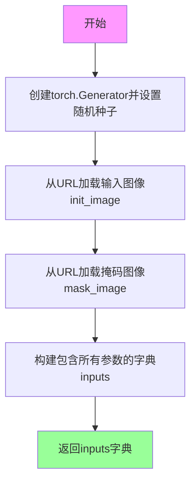

#### 带注释源码

```python
def get_inputs(self, device, generator_device="cpu", dtype=torch.float32, seed=0):
    """
    准备测试输入数据，用于Stable Diffusion图像修复pipeline测试。
    
    参数:
        device: 计算设备
        generator_device: 生成器设备，默认为"cpu"
        dtype: 数据类型，默认为torch.float32
        seed: 随机种子，默认为0
    
    返回:
        包含pipeline所需输入参数的字典
    """
    # 使用指定设备创建随机生成器，并用种子初始化以确保可重复性
    generator = torch.Generator(device=generator_device).manual_seed(seed)
    
    # 从Hugging Face加载测试用的输入图像
    init_image = load_image(
        "https://huggingface.co/datasets/diffusers/test-arrays/resolve/main"
        "/stable_diffusion_inpaint/input_bench_image.png"
    )
    
    # 从Hugging Face加载测试用的掩码图像
    mask_image = load_image(
        "https://huggingface.co/datasets/diffusers/test-arrays/resolve/main"
        "/stable_diffusion_inpaint/input_bench_mask.png"
    )
    
    # 构建输入参数字典，包含:
    # - prompt: 文本提示描述期望的修复结果
    # - image: 待修复的原始图像
    # - mask_image: 指定修复区域的掩码
    # - generator: 确保结果可确定的随机生成器
    # - num_inference_steps: 扩散模型的推理步数
    # - guidance_scale: Classifier-free guidance的权重
    # - output_type: 输出格式为numpy数组
    inputs = {
        "prompt": "Face of a yellow cat, high resolution, sitting on a park bench",
        "image": init_image,
        "mask_image": mask_image,
        "generator": generator,
        "num_inference_steps": 3,
        "guidance_scale": 7.5,
        "output_type": "np",
    }
    
    # 返回构建好的输入字典供pipeline调用
    return inputs
```


### `TestStableDiffusionInpaintPipelineSingleFileSlow.test_single_file_format_inference_is_same_as_pretrained`

验证单文件格式加载的模型推理结果与预训练模型（通过标准方式加载）一致，确保单文件加载功能正确实现。

参数：

- `self`：隐式参数，`TestStableDiffusionInpaintPipelineSingleFileSlow` 类型，表示测试类实例本身

返回值：无（`None`），该方法为测试方法，通过断言验证推理一致性

#### 流程图

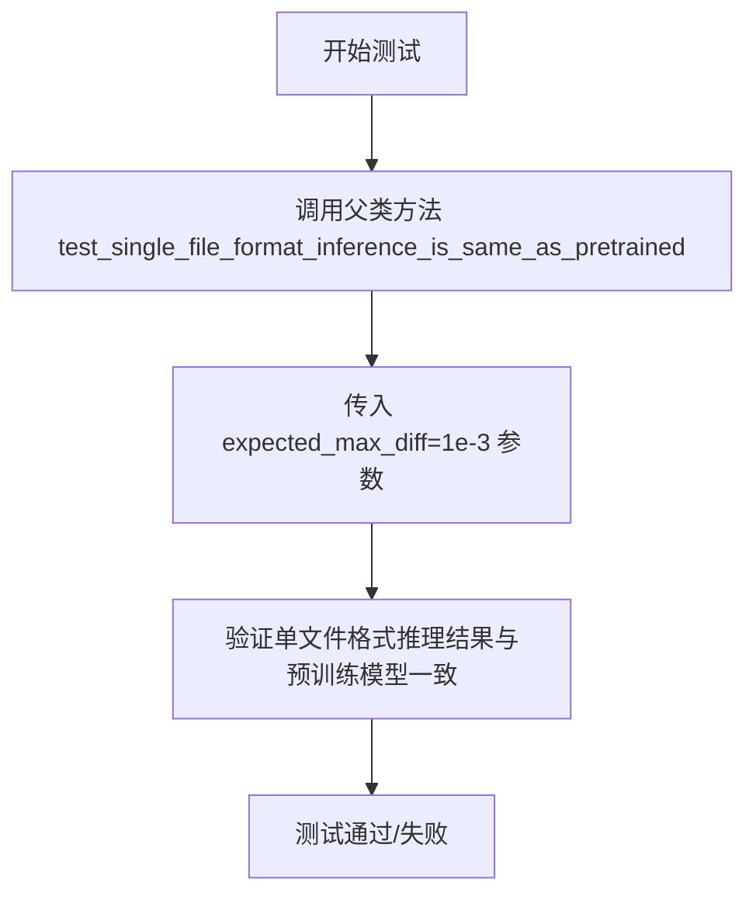

#### 带注释源码

```python
def test_single_file_format_inference_is_same_as_pretrained(self):
    """
    测试单文件格式推理一致性
    
    该测试方法验证通过 from_single_file 方法加载的模型
    与通过标准方式（如 from_pretrained）加载的预训练模型
    在推理结果上保持一致。
    
    允许的最大差异为 1e-3，以确保数值精度在可接受范围内。
    """
    # 调用父类 SDSingleFileTesterMixin 的同名测试方法
    # expected_max_diff=1e-3 表示期望的最大差异阈值
    super().test_single_file_format_inference_is_same_as_pretrained(expected_max_diff=1e-3)
```


### `TestStableDiffusionInpaintPipelineSingleFileSlow.test_single_file_loading_4_channel_unet`

验证 4 通道 UNet 单文件加载功能，测试 StableDiffusionInpaintPipeline 能否正确从单文件加载 4 通道输入的 UNet 模型。

参数：

- `self`：无参数，类实例方法隐式接收的当前实例
- （无显式参数）

返回值：`None`，该测试方法无返回值，通过断言验证 UNet 输入通道数

#### 流程图

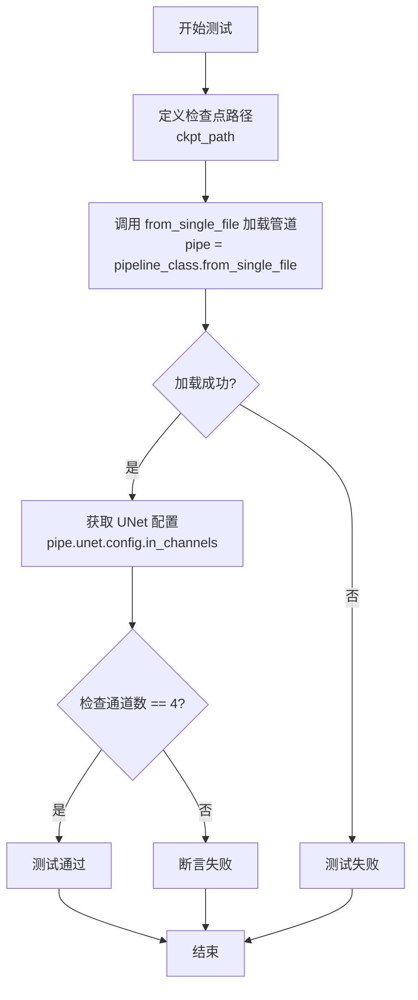

#### 带注释源码

```python
def test_single_file_loading_4_channel_unet(self):
    # 测试加载单文件 inpaint 版本，使用 4 通道 UNet
    # 此测试用于验证 from_single_file 方法能够正确加载
    # 支持 4 通道输入（图像 + mask）的 UNet 模型
    
    # 定义检查点路径，指向 stable-diffusion-v1-5 的权重文件
    ckpt_path = "https://huggingface.co/stable-diffusion-v1-5/stable-diffusion-v1-5/blob/main/v1-5-pruned-emaonly.safetensors"
    
    # 使用 from_single_file 类方法从单个文件加载整个管道
    # 该方法会自动解析权重并构建完整的 pipeline
    pipe = self.pipeline_class.from_single_file(ckpt_path)

    # 断言验证 UNet 的输入通道数是否为 4
    # 4 通道表示：RGB 图像(3通道) + Mask(1通道) = 4通道
    # 这是 inpainting 任务的标准配置
    assert pipe.unet.config.in_channels == 4
```


### `TestStableDiffusionInpaintPipelineSingleFileSlow.test_single_file_components_with_original_config`

该测试方法原本用于验证使用原始配置文件（original_config）加载单文件模型组件的功能，但由于runwayml的原始配置文件已被移除，该测试方法被标记为跳过并直接返回，不执行任何实际操作。

参数：

- `self`：`TestStableDiffusionInpaintPipelineSingleFileSlow`，隐式参数，表示测试类的实例本身

返回值：`None`，无返回值，该方法被跳过直接返回

#### 流程图

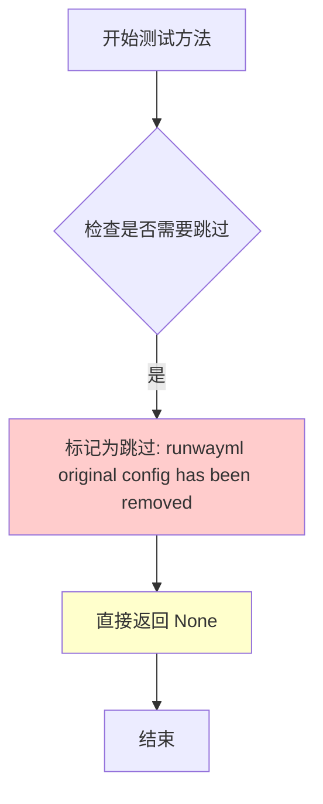

#### 带注释源码

```python
@pytest.mark.skip(reason="runwayml original config has been removed")
def test_single_file_components_with_original_config(self):
    """
    测试使用原始配置加载单文件组件的功能。
    
    该测试方法原本用于验证：
    1. 从单文件检查点加载模型
    2. 使用原始配置文件配置模型组件
    3. 验证组件配置正确性
    
    当前状态：
    - 由于 runwayml 的原始配置文件已从仓库中移除
    - 该测试被标记为跳过，不执行任何验证
    - 方法直接返回，不进行任何操作
    
    Returns:
        None: 该方法不返回任何值，直接返回
    """
    return
```


### `TestStableDiffusionInpaintPipelineSingleFileSlow.test_single_file_components_with_original_config_local_files_only`

该方法是一个被跳过的测试方法，原本用于验证单文件组件与原始配置的本地文件加载功能是否正常工作，但由于原始配置文件已被移除，该测试方法目前无法执行。

参数：暂无参数（仅包含 `self` 参数）

返回值：`None`，该方法直接返回，不返回任何值

#### 流程图

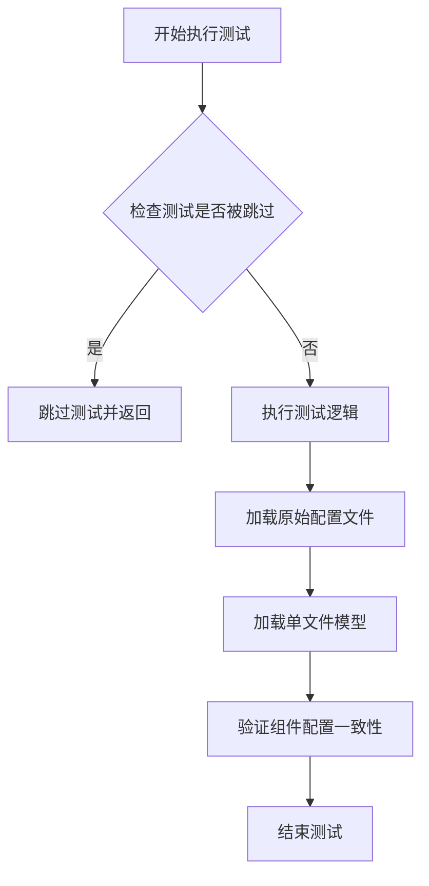

#### 带注释源码

```python
@pytest.mark.skip(reason="runwayml original config has been removed")
def test_single_file_components_with_original_config_local_files_only(self):
    """
    测试单文件组件与原始配置的本地文件加载
    
    该测试方法原本用于验证：
    1. 能够使用本地原始配置文件加载单文件模型
    2. 验证单文件格式的组件配置与原始配置一致
    
    由于 runwayml 原始配置文件已被移除，该测试被跳过
    """
    return
```

#### 相关信息

**类信息**：该方法属于 `TestStableDiffusionInpaintPipelineSingleFileSlow` 类，该类继承自 `SDSingleFileTesterMixin`，用于测试 Stable Diffusion 图像修复管道的单文件加载功能。

**关键组件**：

- `pipeline_class`：指定被测试的管道类为 `StableDiffusionInpaintPipeline`
- `ckpt_path`：单文件检查点的远程路径
- `original_config`：原始模型配置文件的远程路径

**潜在的技术债务或优化空间**：

1. **未实现的测试逻辑**：该方法体仅为 `return` 语句，完全没有实现任何测试逻辑，属于占位符代码
2. **过时的测试用例**：由于依赖的原始配置文件已被移除，该测试用例已失效，需要重新评估是否应该完全删除或替换为新的测试方案
3. **缺少替代验证方案**：没有提供替代的测试方法来验证单文件组件配置的合法性

**其它项目**：

- **设计目标**：验证单文件格式加载的模型组件配置与原始预训练模型配置的一致性
- **错误处理**：通过 `@pytest.mark.skip` 装饰器显式跳过测试，并说明跳过原因
- **外部依赖**：依赖远程的原始配置文件（`runwayml/stable-diffusion` 仓库的配置文件）
- **接口契约**：该方法遵循 `SDSingleFileTesterMixin` 定义的测试接口规范


### `TestStableDiffusionInpaintPipelineSingleFileSlow.setup_method`

该方法是测试类的初始化方法，在每个测试方法执行前被调用，主要用于清理Python垃圾回收和GPU/后端缓存，确保测试环境处于干净状态，避免因缓存残留导致的测试结果不一致。

参数：

- `self`：隐式参数，`TestStableDiffusionInpaintPipelineSingleFileSlow` 类实例，无需显式传入

返回值：`None`，无返回值，仅执行环境清理操作

#### 流程图

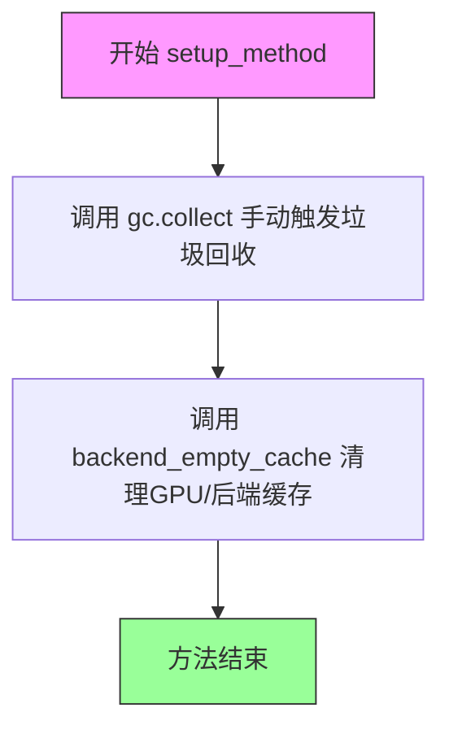

#### 带注释源码

```python
def setup_method(self):
    """
    在每个测试方法运行前执行的环境初始化方法
    
    该方法确保测试之间不会因为残留的GPU内存或Python对象
    互相影响，提供一个干净、一致的测试起点
    """
    # 手动触发Python的垃圾回收器，释放不再使用的对象占用的内存
    gc.collect()
    
    # 清理后端（通常是CUDA/GPU）的内存缓存
    # 防止GPU内存泄漏导致后续测试出现内存不足或结果异常
    backend_empty_cache(torch_device)
```


### `TestStableDiffusionInpaintPipelineSingleFileSlow.teardown_method`

这是 pytest 测试框架的清理方法（teardown method），用于在每个测试方法执行完毕后进行资源清理。主要功能是调用垃圾回收（gc.collect()）释放 Python 对象，并清空 GPU 缓存（backend_empty_cache）以释放显存资源，确保测试之间的资源隔离。

参数：

- `self`：隐式参数，当前测试类实例，无需显式传递

返回值：`None`，无返回值，仅执行清理操作

#### 流程图

```mermaid
flowchart TD
    A[开始 teardown_method] --> B[执行 gc.collect<br/>调用垃圾回收器清理无用对象]
    --> C{backend_empty_cache}
    --> D[调用 backend_empty_cache(torch_device)<br/>清空 GPU 显存缓存]
    --> E[结束 teardown_method]
```

#### 带注释源码

```python
def teardown_method(self):
    """
    pytest 测试方法清理函数
    在每个测试方法执行完毕后自动调用，用于释放测试过程中占用的资源
    """
    # 执行 Python 垃圾回收，清理测试过程中创建的无法访问的对象
    gc.collect()
    
    # 清空 GPU 显存缓存，释放 CUDA 设备上的显存资源
    # torch_device 是全局变量，指定了当前使用的计算设备
    backend_empty_cache(torch_device)
```

---

**备注**：同名的 `teardown_method` 也存在于 `TestStableDiffusion21InpaintPipelineSingleFileSlow` 类中，实现完全相同，两者的功能描述和流程图一致。


### `TestStableDiffusionInpaintPipelineSingleFileSlow.get_inputs`

该方法用于生成Stable Diffusion图像修复（inpainting） pipeline的测试输入数据。它创建一个包含提示词、初始图像、掩码图像、生成器以及推理参数的字典，用于测试pipeline的运行。

参数：

- `self`：类实例方法隐含参数
- `device`：`torch.device`，指定运行设备
- `generator_device`：`str`，生成器设备，默认为 `"cpu"`
- `dtype`：`torch.dtype`，数据类型，默认为 `torch.float32`
- `seed`：`int`，随机种子，默认为 `0`

返回值：`Dict`，包含以下键值对：
- `prompt` (`str`)：文本提示词
- `image` (`PIL.Image` 或 `ndarray`)：初始输入图像
- `mask_image` (`PIL.Image` 或 `ndarray`)：修复掩码图像
- `generator` (`torch.Generator`)：随机生成器对象
- `num_inference_steps` (`int`)：推理步数
- `guidance_scale` (`float`)：引导_scale
- `output_type` (`str`)：输出类型

#### 流程图

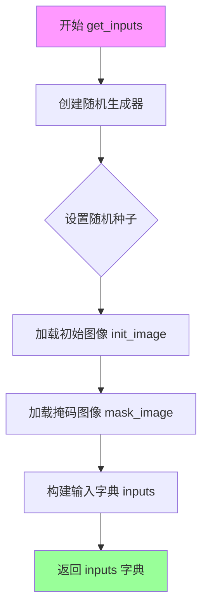

#### 带注释源码

```python
def get_inputs(self, device, generator_device="cpu", dtype=torch.float32, seed=0):
    """
    生成Stable Diffusion图像修复pipeline的测试输入参数
    
    参数:
        device: 运行设备
        generator_device: 生成器设备，默认为"cpu"
        dtype: 数据类型，默认为torch.float32
        seed: 随机种子，默认为0
    
    返回:
        包含pipeline所需所有输入参数的字典
    """
    # 使用指定设备创建随机生成器，并设置随机种子以确保可复现性
    generator = torch.Generator(device=generator_device).manual_seed(seed)
    
    # 从HuggingFace加载测试用的初始图像（待修复的图像）
    init_image = load_image(
        "https://huggingface.co/datasets/diffusers/test-arrays/resolve/main"
        "/stable_diffusion_inpaint/input_bench_image.png"
    )
    
    # 从HuggingFace加载测试用的掩码图像（标识需要修复的区域）
    mask_image = load_image(
        "https://huggingface.co/datasets/diffusers/test-arrays/resolve/main"
        "/stable_diffusion_inpaint/input_bench_mask.png"
    )
    
    # 构建完整的输入参数字典
    inputs = {
        "prompt": "Face of a yellow cat, high resolution, sitting on a park bench",  # 文本提示词
        "image": init_image,              # 待修复的输入图像
        "mask_image": mask_image,          # 修复掩码（白色区域将被重新生成）
        "generator": generator,            # 随机生成器（确保结果可复现）
        "num_inference_steps": 3,          # 扩散模型推理步数（较少步数用于快速测试）
        "guidance_scale": 7.5,             # CFG引导强度（值越大越忠于prompt）
        "output_type": "np",               # 输出类型为numpy数组
    }
    
    # 返回包含所有输入参数的字典，供pipeline调用
    return inputs
```


### `TestStableDiffusionInpaintPipelineSingleFileSlow.test_single_file_format_inference_is_same_as_pretrained`

该方法是一个测试用例，用于验证从单个文件格式加载的Stable Diffusion修复管道（Stable Diffusion Inpaint Pipeline）的推理结果与预训练模型（pretrained model）的推理结果是否一致。通过设置允许的最大差异阈值（expected_max_diff=1e-3）来确保两种加载方式产生的输出在数值上足够接近。

参数：

- `self`：`TestStableDiffusionInpaintPipelineSingleFileSlow` 类型，测试类实例本身，包含类属性如 `pipeline_class`、`ckpt_path`、`original_config` 和 `repo_id` 等，用于指定要测试的管道类和模型路径

返回值：`None`，该方法为 pytest 测试用例，无返回值，通过 pytest 框架的断言机制验证结果

#### 流程图

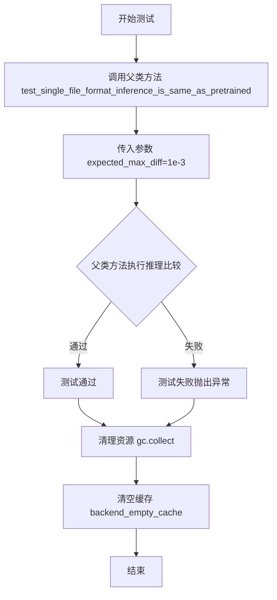

#### 带注释源码

```python
def test_single_file_format_inference_is_same_as_pretrained(self):
    """
    测试单文件格式推理是否与预训练模型结果相同
    
    该测试方法验证从单个检查点文件（single file）加载的管道
    与从预训练模型仓库加载的管道在推理结果上是否一致。
    通过设置 expected_max_diff 参数来控制允许的最大数值差异。
    """
    # 调用父类 SDSingleFileTesterMixin 的同名方法
    # 传入 expected_max_diff=1e-3 表示期望最大差异为 0.001
    # 这确保了单文件格式和预训练格式的输出在浮点数精度范围内一致
    super().test_single_file_format_inference_is_same_as_pretrained(expected_max_diff=1e-3)
```

#### 补充说明

该方法是 `TestStableDiffusionInpaintPipelineSingleFileSlow` 类的一部分，该类继承自 `SDSingleFileTesterMixin`。测试类的关键属性包括：

- `pipeline_class`: `StableDiffusionInpaintPipeline`，待测试的管道类
- `ckpt_path`: HuggingFace 模型检查点路径（单文件格式）
- `original_config`: 原始模型配置文件路径
- `repo_id`: HuggingFace 模型仓库 ID

测试方法依赖 `setup_method` 和 `teardown_method` 进行资源管理（垃圾回收和缓存清理），确保测试环境的一致性。


### `TestStableDiffusionInpaintPipelineSingleFileSlow.test_single_file_loading_4_channel_unet`

该测试方法用于验证能否通过单文件方式加载具有4通道输入的UNet模型的Stable Diffusion Inpaint Pipeline，并确保UNet的输入通道数被正确配置为4。

参数：

- `self`：测试类实例本身，无需显式传入

返回值：`None`，该方法为测试方法，通过断言验证功能，不返回任何值

#### 流程图

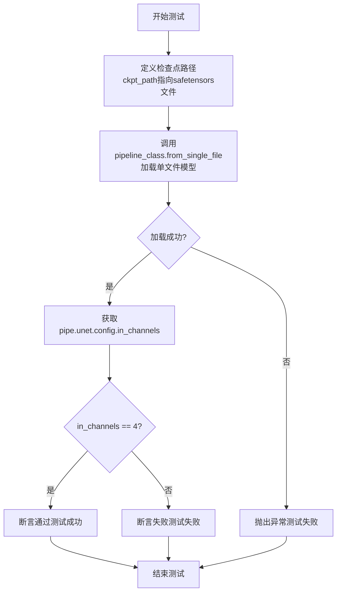

#### 带注释源码

```python
def test_single_file_loading_4_channel_unet(self):
    """
    测试单文件加载方式能否正确加载4通道UNet的inpaint pipeline
    
    该测试验证：
    1. from_single_file方法能够正确加载模型
    2. 加载后的UNet配置中in_channels被正确设置为4（用于inpainting任务）
    """
    
    # 定义检查点路径，指向stable-diffusion-v1-5的权重文件
    # 使用safetensors格式，该格式比pytorch.bin更安全高效
    ckpt_path = "https://huggingface.co/stable-diffusion-v1-5/stable-diffusion-v1-5/blob/main/v1-5-pruned-emaonly.safetensors"
    
    # 使用pipeline_class的from_single_file类方法从单个文件加载模型
    # pipeline_class在类定义中指定为StableDiffusionInpaintPipeline
    # 该方法会自动解析权重文件并构建完整的pipeline组件
    pipe = self.pipeline_class.from_single_file(ckpt_path)
    
    # 断言验证UNet的输入通道数是否为4
    # 对于inpainting任务，UNet需要接收图像+mask共4个通道
    # (原图像3通道 + mask图像1通道 = 4通道)
    assert pipe.unet.config.in_channels == 4
```


### `TestStableDiffusionInpaintPipelineSingleFileSlow.test_single_file_components_with_original_config`

该方法用于测试使用原始配置文件加载单文件 Stable Diffusion Inpaint Pipeline 的组件，但由于原始配置文件已被移除，该测试目前被跳过。

参数：
- 无参数

返回值：`None`，该方法直接返回，不返回任何值。

#### 流程图

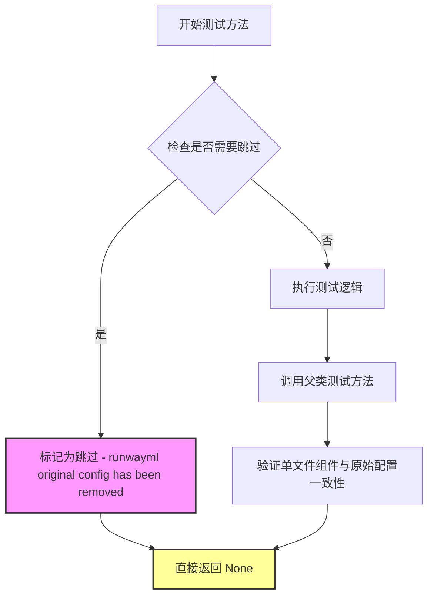

#### 带注释源码

```python
@pytest.mark.skip(reason="runwayml original config has been removed")
def test_single_file_components_with_original_config(self):
    """
    测试使用原始配置文件加载单文件组件的功能。
    
    该测试方法旨在验证 StableDiffusionInpaintPipeline 能够通过 from_single_file 方法
    并结合原始配置文件（original_config）正确加载各个组件（UNet、VAE、Text Encoder 等）。
    
    然而，由于 runwayml 提供的原始配置文件已被移除，该测试目前被跳过。
    """
    return  # 直接返回，不执行任何测试逻辑
```

#### 技术债务与优化空间

1. **死代码问题**：该方法已被标记为跳过且无实际功能，属于死代码。建议：
   - 如果将来可能恢复该功能，应保留并维护
   - 如果不再需要，应彻底删除以保持代码库整洁

2. **测试覆盖缺失**：该测试原本用于验证单文件加载与原始配置的一致性，目前该验证路径未被覆盖

3. **文档过时**：应更新相关文档，说明该测试被跳过的原因及替代验证方案


### `TestStableDiffusionInpaintPipelineSingleFileSlow.test_single_file_components_with_original_config_local_files_only`

这是一个被pytest跳过的测试方法，用于测试单文件组件是否与原始配置本地文件一起工作。由于runwayml原始配置已被移除，该测试方法被标记为跳过，实际上是一个空实现。

参数：

- `self`：`TestStableDiffusionInpaintPipelineSingleFileSlow`，代表测试类实例本身，无需额外参数

返回值：`None`，该方法没有返回值，直接返回None

#### 流程图

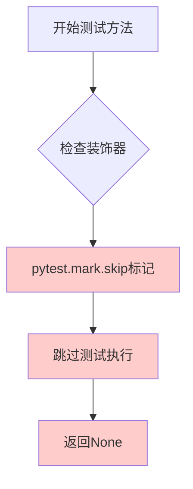

#### 带注释源码

```python
@pytest.mark.skip(reason="runwayml original config has been removed")
def test_single_file_components_with_original_config_local_files_only(self):
    """
    测试单文件组件与原始配置本地文件的兼容性
    
    该测试方法用于验证StableDiffusionInpaintPipeline能否从本地单文件
    加载并使用原始配置文件。然而，由于runwayml的原始配置文件已被移除，
    该测试被标记为跳过。
    
    参数:
        self: TestStableDiffusionInpaintPipelineSingleFileSlow的实例
        
    返回值:
        None: 该方法被跳过，不执行任何测试逻辑
    """
    return  # 直接返回None，因为测试被跳过
```

#### 额外信息

**跳过原因**：该测试方法被标记为跳过，原因是原始的runwayml配置文件已被移除。这是一个测试维护相关的技术债务，表明测试套件中存在过期的测试用例，需要更新或移除。

**设计意图**：该方法原本计划测试从单文件加载模型配置的功能，但由于外部依赖（runwayml的原始配置文件）不再可用，测试无法执行。

**潜在优化空间**：
1. 可以考虑删除这个过时的测试方法，而不是简单地跳过它
2. 或者更新测试以使用可用的配置源
3. 在测试文档中明确记录为何该测试被跳过及何时可以恢复


### `TestStableDiffusion21InpaintPipelineSingleFileSlow.setup_method`

这是一个测试类的初始化方法，在每个测试方法执行前被调用，用于清理 Python 垃圾回收和 GPU 缓存，确保测试环境的一致性和可重复性。

参数：

- `self`：隐式的 `TestStableDiffusion21InpaintPipelineSingleFileSlow` 实例，代表测试类本身

返回值：`None`，该方法不返回任何值

#### 流程图

```mermaid
graph TD
    A[开始 setup_method] --> B[执行 gc.collect]
    B --> C[调用 backend_empty_cache 清理 GPU 缓存]
    C --> D[结束]
```

#### 带注释源码

```python
def setup_method(self):
    """
    在每个测试方法运行前调用的初始化方法。
    用于清理 Python 垃圾回收和 GPU 缓存，确保测试环境的一致性。
    """
    gc.collect()  # 手动触发 Python 垃圾回收，释放未使用的内存对象
    backend_empty_cache(torch_device)  # 清空当前 GPU 设备的缓存内存
```


### `TestStableDiffusion21InpaintPipelineSingleFileSlow.teardown_method`

该方法是一个测试清理（teardown）方法，用于在每个测试用例执行完毕后清理Python垃圾回收和GPU显存缓存，以确保测试环境干净，避免内存泄漏和显存残留影响后续测试。

参数：
- 该方法无显式参数（Python的`self`参数隐式存在但不计入接口定义）

返回值：`None`，无返回值

#### 流程图

```mermaid
flowchart TD
    A[开始 teardown_method] --> B[执行 gc.collect]
    B --> C[调用 backend_empty_cache]
    C --> D[传入 torch_device 参数]
    D --> E[结束清理流程]
```

#### 带注释源码

```python
def teardown_method(self):
    """
    测试方法清理钩子
    
    在每个测试用例执行完毕后自动调用，用于释放测试过程中
    积累的内存和GPU显存资源，确保测试环境的干净和隔离。
    
    注意：
    - 这是 pytest 框架的测试生命周期钩子之一
    - 会在每个测试方法运行结束后自动执行
    - 与 setup_method 配对使用，分别负责测试前准备和测试后清理
    """
    # 触发 Python 垃圾回收，释放不再使用的 Python 对象
    gc.collect()
    
    # 清空 GPU/加速器显存缓存，防止显存泄漏
    # torch_device 是全局变量，表示当前使用的计算设备
    backend_empty_cache(torch_device)
```

#### 技术债务与优化空间

| 类别 | 描述 |
|------|------|
| **硬编码设备依赖** | 直接使用全局变量 `torch_device`，缺乏灵活性，建议改为从测试配置或 fixture 获取 |
| **重复代码** | 与 `TestStableDiffusionInpaintPipelineSingleFileSlow` 类的 `teardown_method` 完全相同，可考虑提取到父类 `SDSingleFileTesterMixin` 中统一实现 |
| **缺少异常处理** | 如果 `gc.collect()` 或 `backend_empty_cache` 抛出异常，可能导致测试框架行为异常，建议添加 try-except 保护 |
| **无资源释放确认** | 仅调用清理函数，未验证清理是否成功（如检测显存是否真正释放） |

#### 关键组件信息

| 组件名称 | 一句话描述 |
|----------|------------|
| `gc` | Python 内置垃圾回收模块，用于清理不可达对象 |
| `backend_empty_cache` | 来自测试工具函数，封装了不同后端的显存缓存清理逻辑 |
| `torch_device` | 全局变量，标识当前测试使用的计算设备（如 "cuda:0"、"cpu"） |


### `TestStableDiffusion21InpaintPipelineSingleFileSlow.get_inputs`

该方法用于为 Stable Diffusion 2.1 图像修复管道测试准备输入参数，生成包含提示词、初始图像、掩码图像、生成器以及推理配置的标准输入字典，确保测试的可重复性和一致性。

参数：

- `device`：`torch.device`，目标设备，用于指定管道运行设备
- `generator_device`：默认为 `"cpu"`，`str` 类型，生成器设备，用于随机数生成
- `dtype`：默认为 `torch.float32`，`torch.dtype` 类型，数据类型，指定张量数据类型
- `seed`：默认为 `0`，`int` 类型，随机种子，用于确保测试结果可复现

返回值：`Dict[str, Any]`，返回包含图像修复管道所需全部输入参数的字典，包括提示词、初始图像、掩码图像、生成器、推理步数、引导比例和输出类型。

#### 流程图

```mermaid
flowchart TD
    A[开始] --> B[创建随机数生成器]
    B --> C[设置随机种子]
    C --> D[加载初始图像]
    D --> E[加载掩码图像]
    E --> F[构建输入字典]
    F --> G[设置prompt: Face of a yellow cat...]
    G --> H[添加image: init_image]
    H --> I[添加mask_image: mask_image]
    I --> J[添加generator: generator]
    J --> K[添加num_inference_steps: 3]
    K --> L[添加guidance_scale: 7.5]
    L --> M[添加output_type: np]
    M --> N[返回inputs字典]
    N --> O[结束]
```

#### 带注释源码

```python
def get_inputs(self, device, generator_device="cpu", dtype=torch.float32, seed=0):
    """
    为 Stable Diffusion 2.1 图像修复管道测试准备输入参数
    
    参数:
        device: 目标设备
        generator_device: 生成器设备，默认为 "cpu"
        dtype: 数据类型，默认为 torch.float32
        seed: 随机种子，默认为 0
    
    返回:
        包含管道输入参数的字典
    """
    # 创建随机数生成器并设置种子，确保测试可复现
    generator = torch.Generator(device=generator_device).manual_seed(seed)
    
    # 从 Hugging Face 加载测试用的初始图像
    init_image = load_image(
        "https://huggingface.co/datasets/diffusers/test-arrays/resolve/main"
        "/stable_diffusion_inpaint/input_bench_image.png"
    )
    
    # 从 Hugging Face 加载测试用的掩码图像
    mask_image = load_image(
        "https://huggingface.co/datasets/diffusers/test-arrays/resolve/main"
        "/stable_diffusion_inpaint/input_bench_mask.png"
    )
    
    # 构建完整的输入参数字典
    inputs = {
        "prompt": "Face of a yellow cat, high resolution, sitting on a park bench",  # 修复提示词
        "image": init_image,              # 待修复的初始图像
        "mask_image": mask_image,         # 修复区域的掩码图像
        "generator": generator,           # 随机数生成器，确保确定性输出
        "num_inference_steps": 3,         # 推理步数，较少步数用于快速测试
        "guidance_scale": 7.5,            # CFG 引导强度
        "output_type": "np",              # 输出类型为 NumPy 数组
    }
    return inputs  # 返回包含所有输入参数的字典
```


### `TestStableDiffusion21InpaintPipelineSingleFileSlow.test_single_file_format_inference_is_same_as_pretrained`

该测试方法用于验证从单文件格式加载的 Stable Diffusion 2.1 图像修复管道的推理结果与使用预训练模型权重加载的管道结果是否一致，通过比较两者的输出差异是否在可接受的阈值范围内（默认 1e-3）。

参数：

- `self`：`TestStableDiffusion21InpaintPipelineSingleFileSlow`，测试类实例本身，表示当前测试对象

返回值：`None`，该方法为测试方法，通过 pytest 框架执行，不返回具体数值，结果通过断言验证

#### 流程图

```mermaid
flowchart TD
    A[开始执行测试方法] --> B[调用父类方法]
    B --> C[传入 expected_max_diff=1e-3 参数]
    C --> D[执行父类测试逻辑]
    D --> E{推理结果差异是否 <= 1e-3?}
    E -->|是| F[测试通过]
    E -->|否| G[测试失败: 断言错误]
    F --> H[结束]
    G --> H
```

#### 带注释源码

```python
def test_single_file_format_inference_is_same_as_pretrained(self):
    """
    测试单文件格式推理结果是否与预训练模型相同
    
    该测试方法验证从单文件（如 .safetensors 或 .ckpt）加载的管道
    与从原始预训练模型加载的管道在推理输出上是否一致。
    通过比较两者的最大差异来确保单文件加载功能的正确性。
    """
    # 调用父类 SDSingleFileTesterMixin 的同名方法
    # expected_max_diff=1e-3 表示期望的最大差异阈值为千分之一
    super().test_single_file_format_inference_is_same_as_pretrained(expected_max_diff=1e-3)
```

#### 父类方法信息（SDSingleFileTesterMixin.test_single_file_format_inference_is_same_as_pretrained）

由于该方法调用了父类方法，以下是父类方法的相关信息：

参数：

- `expected_max_diff`：`float`，期望的最大差异阈值，默认为 1e-3

返回值：`None`，测试通过时无返回值，失败时抛出断言错误

## 关键组件


### 张量索引与惰性加载

通过 `from_single_file` 方法实现单文件格式的模型加载，采用惰性加载策略，在需要时才加载权重数据，支持从 HuggingFace Hub 或本地路径加载模型权重。

### 反量化支持

使用 `safetensors` 格式加载模型权重，该格式支持反量化操作，可以将量化后的模型权重还原为全精度浮点数进行推理，确保推理精度。

### 量化策略

通过 `dtype=torch.float32` 参数显式指定推理时使用 float32 精度，同时支持通过 `generator_device` 参数控制随机数生成设备，实现不同精度策略的测试验证。

### 4通道UNet支持

测试类验证了单文件加载的修复管线支持 4 通道 UNet（2通道图像 + 2通道掩码），通过 `test_single_file_loading_4_channel_unet` 方法确认 `pipe.unet.config.in_channels == 4`。

### 测试输入构建

`get_inputs` 方法构建完整的测试输入数据，包括提示词、初始图像、掩码图像、随机数生成器、推理步数和引导_scale，支持可复现的测试场景。

### 内存管理机制

通过 `setup_method` 和 `teardown_method` 方法实现测试前后的内存清理，使用 `gc.collect()` 和 `backend_empty_cache` 确保 GPU 内存及时释放，避免测试间的内存泄漏。

### 单文件与预训练模型一致性验证

`test_single_file_format_inference_is_same_as_pretrained` 方法比较从单文件加载的模型与预训练模型的推理结果，使用 `expected_max_diff=1e-3` 作为一致性阈值。


## 问题及建议


### 已知问题

-   **重复代码**：两个测试类（`TestStableDiffusionInpaintPipelineSingleFileSlow` 和 `TestStableDiffusion21InpaintPipelineSingleFileSlow`）中的 `setup_method`、`teardown_method` 和 `get_inputs` 方法几乎完全相同，造成代码冗余，可提取到父类或 mixin 中
-   **URL 格式错误**：`ckpt_path` 中使用了 `blob/main` 格式（`https://huggingface.co/.../blob/main/...`），对于直接下载文件应使用 `resolve/main` 格式，这会导致文件无法正确下载
-   **测试隔离性不足**：`test_single_file_loading_4_channel_unet` 方法使用了硬编码的 `ckpt_path`，与类属性定义的 `ckpt_path` 不一致，且未使用类属性，可能导致测试维护困难
-   **资源泄漏风险**：`get_inputs` 方法中加载的 `init_image` 和 `mask_image` 在测试完成后未被显式释放，可能导致内存占用
-   **网络依赖缺乏容错**：所有测试依赖外部 URL（ HuggingFace Hub 和 GitHub），无备选方案或缓存机制，网络不稳定时测试会失败
-   **魔法字符串**：图像 URL、提示词等硬编码在方法中，应提取为类常量或配置文件，提高可维护性
-   **跳过测试无实现**：`test_single_file_components_with_original_config` 和 `test_single_file_components_with_original_config_local_files_only` 直接 `return`，虽然标记 skip 但逻辑可简化

### 优化建议

-   将重复的 `setup_method`、`teardown_method` 和 `get_inputs` 提取到 `SDSingleFileTesterMixin` 父类或创建基类，避免代码重复
-   修正 HuggingFace Hub 的 URL 格式，将 `blob/main` 改为 `resolve/main`，确保文件可直接下载
-   将网络 URL、提示词等硬编码值提取为类常量或测试配置，提高可读性和可维护性
-   在 `get_inputs` 中显式释放图像对象或在 `teardown_method` 中添加资源清理逻辑
-   为关键测试添加网络超时处理和重试机制，或提供本地缓存的测试文件路径
-   统一 `test_single_file_loading_4_channel_unet` 中的 `ckpt_path` 使用类属性，或将其重构为参数化测试
-   考虑使用 pytest fixture 管理测试资源（图像加载、生成器初始化），提高测试的资源管理能力

## 其它


### 设计目标与约束

验证StableDiffusionInpaintPipeline从单文件加载后与预训练模型推理结果一致性，支持SDv1.5和SDv2-inpainting两种模型变体，确保4通道UNet正确加载，测试环境要求CUDA加速和足够显存。

### 错误处理与异常设计

测试失败时通过pytest断言抛出详细错误信息，包括expected_max_diff阈值对比结果；网络加载失败时pytest.mark.skip用于跳过无法执行的测试用例（如original_config已删除的情况）。

### 数据流与状态机

测试数据流：加载检查点文件→初始化pipeline→准备输入图像和mask→执行推理→对比输出差异。状态转换：setup_method(初始化)→test_*(执行测试)→teardown_method(清理)。

### 外部依赖与接口契约

依赖diffusers库的StableDiffusionInpaintPipeline、load_image工具函数，依赖testing_utils模块的CUDA环境检测、确定性控制、内存清理函数，依赖SDSIngleFileTesterMixin基类定义的单文件测试接口契约。

### 性能考虑

setup_method和teardown_method中执行gc.collect()和backend_empty_cache以释放GPU显存，适用于长时间运行的慢速测试，避免显存泄漏导致后续测试失败。

### 安全考虑

使用safetensors格式加载检查点文件以提高安全性，跳过需要原始config的测试用例（该配置已从runwayml仓库移除），避免加载不可信配置导致潜在安全风险。

### 测试覆盖范围

test_single_file_format_inference_is_same_as_pretrained验证单文件与预训练模型推理结果一致性；test_single_file_loading_4_channel_unet验证4通道UNet正确加载；test_single_file_components_with_original_config及local_files_only验证原始配置兼容性（当前跳过）。

### 配置管理

类级别配置包含pipeline_class（管道类）、ckpt_path（远程检查点URL）、original_config（原始配置文件URL）、repo_id（HuggingFace仓库ID）；方法级配置通过get_inputs生成，包含prompt、image、mask_image、generator、num_inference_steps、guidance_scale、output_type等推理参数。

### 环境要求

@slow标记表示长时间运行测试，@require_torch_accelerator要求CUDA加速环境，确保测试在GPU上执行以验证模型推理正确性。

### 代码组织结构

两个测试类分别对应SDv1.5-inpainting和SDv2-inpainting模型，共享相同的get_inputs实现和setup/teardown逻辑，体现代码复用和一致性测试策略。


    