# `diffusers\tests\single_file\test_stable_diffusion_single_file.py` 详细设计文档

该文件是 Hugging Face Diffusers 库中针对 Stable Diffusion 单文件加载功能的集成测试模块，包含三个测试类用于验证从单文件（如 safetensors 格式）加载的模型推理结果与官方预训练模型的一致性，并测试了调度器配置和缩放因子等参数的兼容性。

## 整体流程

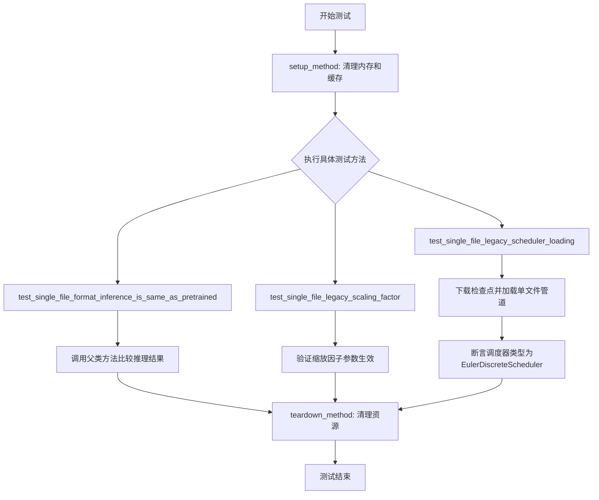

## 类结构

```
SDSingleFileTesterMixin (测试混入类)
├── TestStableDiffusionPipelineSingleFileSlow
│   ├── pipeline_class = StableDiffusionPipeline
│   ├── ckpt_path = stable-diffusion-v1-5
│   └── test_single_file_legacy_scheduler_loading
│   └── test_single_file_legacy_scaling_factor
├── TestStableDiffusion21PipelineSingleFileSlow
│   ├── pipeline_class = StableDiffusionPipeline
ckpt_path = stable-diffusion-2-1
└── TestStableDiffusionInstructPix2PixPipelineSingleFileSlow
    ├── pipeline_class = StableDiffusionInstructPix2PixPipeline
    └── ckpt_path = instruct-pix2pix
```

## 全局变量及字段


### `gc`
    
Python垃圾回收模块

类型：`module`
    


### `tempfile`
    
Python临时目录模块

类型：`module`
    


### `torch`
    
PyTorch深度学习框架

类型：`module`
    


### `EulerDiscreteScheduler`
    
欧拉离散调度器

类型：`class`
    


### `StableDiffusionInstructPix2PixPipeline`
    
指令式图像编辑管道

类型：`class`
    


### `StableDiffusionPipeline`
    
稳定扩散管道

类型：`class`
    


### `_extract_repo_id_and_weights_name`
    
提取仓库ID和权重名的工具函数

类型：`function`
    


### `load_image`
    
加载图像的工具函数

类型：`function`
    


### `backend_empty_cache`
    
后端清空缓存函数

类型：`function`
    


### `enable_full_determinism`
    
启用完全确定性函数

类型：`function`
    


### `nightly`
    
夜间测试装饰器

类型：`decorator`
    


### `slow`
    
慢速测试装饰器

类型：`decorator`
    


### `require_torch_accelerator`
    
需要Torch加速器装饰器

类型：`decorator`
    


### `torch_device`
    
torch设备变量

类型：`str`
    


### `SDSingleFileTesterMixin`
    
单文件测试混入类

类型：`class`
    


### `download_original_config`
    
下载原始配置函数

类型：`function`
    


### `download_single_file_checkpoint`
    
下载单文件检查点函数

类型：`function`
    


### `TestStableDiffusionPipelineSingleFileSlow.pipeline_class`
    
测试的管道类

类型：`StableDiffusionPipeline`
    


### `TestStableDiffusionPipelineSingleFileSlow.ckpt_path`
    
模型检查点URL路径

类型：`str`
    


### `TestStableDiffusionPipelineSingleFileSlow.original_config`
    
原始配置文件URL

类型：`str`
    


### `TestStableDiffusionPipelineSingleFileSlow.repo_id`
    
HuggingFace仓库ID

类型：`str`
    


### `TestStableDiffusion21PipelineSingleFileSlow.pipeline_class`
    
测试的管道类

类型：`StableDiffusionPipeline`
    


### `TestStableDiffusion21PipelineSingleFileSlow.ckpt_path`
    
SD 2.1模型检查点URL

类型：`str`
    


### `TestStableDiffusion21PipelineSingleFileSlow.original_config`
    
原始配置文件URL

类型：`str`
    


### `TestStableDiffusion21PipelineSingleFileSlow.repo_id`
    
HuggingFace仓库ID

类型：`str`
    


### `TestStableDiffusionInstructPix2PixPipelineSingleFileSlow.pipeline_class`
    
图像编辑管道类

类型：`StableDiffusionInstructPix2PixPipeline`
    


### `TestStableDiffusionInstructPix2PixPipelineSingleFileSlow.ckpt_path`
    
Instruct-Pix2Pix模型检查点URL

类型：`str`
    


### `TestStableDiffusionInstructPix2PixPipelineSingleFileSlow.original_config`
    
原始配置文件URL

类型：`str`
    


### `TestStableDiffusionInstructPix2PixPipelineSingleFileSlow.repo_id`
    
HuggingFace仓库ID

类型：`str`
    


### `TestStableDiffusionInstructPix2PixPipelineSingleFileSlow.single_file_kwargs`
    
单文件加载额外参数

类型：`dict`
    
    

## 全局函数及方法


### `_extract_repo_id_and_weights_name`

该函数用于从HuggingFace Hub的模型检查点URL中提取仓库ID（repo_id）和权重文件名（weight_name），以便后续下载或处理模型文件。

参数：

- `ckpt_path`：`str`，模型检查点的URL路径或本地路径，通常是HuggingFace Hub上的模型文件链接

返回值：`Tuple[str, str]`，返回一个元组，包含：
  - `repo_id`：`str`，HuggingFace Hub上的仓库ID（如 "stable-diffusion-v1-5/stable-diffusion-v1-5"）
  - `weight_name`：`str`，权重文件的名称（如 "v1-5-pruned-emaonly.safetensors"）

#### 流程图

```mermaid
flowchart TD
    A[开始: 输入 ckpt_path] --> B{检查路径是否为URL?}
    B -->|是| C[解析URL路径]
    B -->|否| D[直接返回路径信息]
    C --> E[提取仓库名称和文件名称]
    E --> F[构建repo_id]
    F --> G[提取weight_name]
    G --> H[返回 Tuple[repo_id, weight_name]]
    D --> H
```

#### 带注释源码

```python
# 该函数在 diffusers.loaders.single_file_utils 模块中定义
# 以下是代码中的实际调用示例：

# 从 diffusers.loaders.single_file_utils 导入函数
from diffusers.loaders.single_file_utils import _extract_repo_id_and_weights_name

# 在测试方法中调用该函数
def test_single_file_legacy_scheduler_loading(self):
    with tempfile.TemporaryDirectory() as tmpdir:
        # 传入HuggingFace Hub的模型检查点URL
        repo_id, weight_name = _extract_repo_id_and_weights_name(self.ckpt_path)
        
        # 使用返回的repo_id和weight_name下载模型文件
        local_ckpt_path = download_single_file_checkpoint(repo_id, weight_name, tmpdir)
        local_original_config = download_original_config(self.original_config, tmpdir)

        # 使用本地检查点文件加载pipeline
        pipe = self.pipeline_class.from_single_file(
            local_ckpt_path,
            original_config=local_original_config,
            cache_dir=tmpdir,
            local_files_only=True,
            scheduler_type="euler",
        )

    # 验证调度器类型
    assert isinstance(pipe.scheduler, EulerDiscreteScheduler)
```

#### 补充说明

| 项目 | 说明 |
|------|------|
| **来源** | `diffusers.loaders.single_file_utils` 模块 |
| **使用场景** | 在单文件检查点加载测试中，将远程URL解析为仓库标识和文件名 |
| **输入示例** | `"https://huggingface.co/stable-diffusion-v1-5/stable-diffusion-v1-5/blob/main/v1-5-pruned-emaonly.safetensors"` |
| **输出示例** | `("stable-diffusion-v1-5/stable-diffusion-v1-5", "v1-5-pruned-emaonly.safetensors")` |


### `download_original_config`

该函数用于从给定的 URL 下载原始模型的配置文件（YAML 格式），并保存到指定的本地目录中。

参数：

- `original_config`：`str`，原始配置文件的 URL 地址
- `cache_dir`：`str`，用于保存下载文件的本地目录路径

返回值：`str`，下载后的本地配置文件路径

#### 流程图

```mermaid
flowchart TD
    A[开始] --> B[接收 original_config URL 和 cache_dir 目录]
    B --> C[构建目标文件路径<br>os.path.join(cache_dir, 配置文件名)]
    D{Check: 文件是否已存在?}
    D -->|是| E[直接返回本地文件路径]
    D -->|否| F[从 URL 下载配置文件]
    F --> G[保存到本地 cache_dir]
    G --> E
    E --> H[结束]
```

#### 带注释源码

```
# 注意：由于该函数定义在 single_file_testing_utils 模块中，
# 当前代码片段仅显示了其导入和使用方式，未包含实际实现。
# 从使用方式推断的函数签名：

def download_original_config(original_config: str, cache_dir: str) -> str:
    """
    下载原始模型配置文件到本地目录
    
    Args:
        original_config: 原始配置文件的 URL (如 https://raw.githubusercontent.com/.../v1-inference.yaml)
        cache_dir: 本地缓存目录路径
        
    Returns:
        str: 下载后的本地配置文件完整路径
    """
    # 函数调用示例（在测试代码中）:
    # local_original_config = download_original_config(self.original_config, tmpdir)
    
    # 实际实现应该包含:
    # 1. 解析 URL 获取文件名
    # 2. 检查本地是否已存在
    # 3. 如不存在，从 URL 下载文件
    # 4. 返回本地文件路径
    pass
```

---

**注意**：根据提供的代码片段，`download_original_config` 函数是从 `.single_file_testing_utils` 模块导入的，其实际实现代码未在此代码片段中展示。以上信息是根据函数在代码中的使用方式（`local_original_config = download_original_config(self.original_config, tmpdir)`）推断得出的。


# 设计文档提取结果

### `download_single_file_checkpoint`

从 Hugging Face Hub 下载单文件模型检查点到本地目录，并返回本地文件路径。该函数主要用于测试场景中，将远程的模型权重文件下载到本地临时目录以便后续使用。

参数：

- `repo_id`：`str`，Hugging Face Hub 上的仓库 ID（例如 "stable-diffusion-v1-5/stable-diffusion-v1-5"）
- `weight_name`：`str`，要下载的权重文件名称（例如 "v1-5-pruned-emaonly.safetensors"）
- `local_dir`：`str`，本地目标目录路径，用于保存下载的检查点文件

返回值：`str`，下载后的本地文件完整路径

#### 流程图

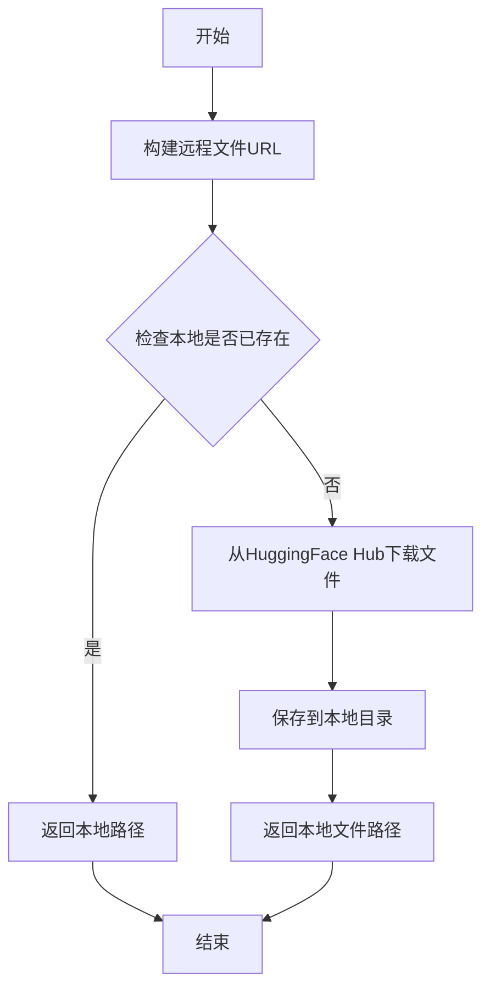

#### 带注释源码

```
# 从 .single_file_testing_utils 模块导入（实际实现未在当前代码片段中显示）
from .single_file_testing_utils import (
    SDSingleFileTesterMixin,
    download_original_config,
    download_single_file_checkpoint,
)

# 使用示例（在测试类中）
def test_single_file_legacy_scheduler_loading(self):
    with tempfile.TemporaryDirectory() as tmpdir:
        # 提取仓库ID和权重名称
        repo_id, weight_name = _extract_repo_id_and_weights_name(self.ckpt_path)
        
        # 下载单文件检查点到本地临时目录
        # 参数1: repo_id - HuggingFace仓库ID
        # 参数2: weight_name - 权重文件名
        # 参数3: tmpdir - 本地目标目录
        local_ckpt_path = download_single_file_checkpoint(repo_id, weight_name, tmpdir)
        
        # 下载原始配置文件
        local_original_config = download_original_config(self.original_config, tmpdir)

        # 使用下载的检查点文件创建pipeline
        pipe = self.pipeline_class.from_single_file(
            local_ckpt_path,
            original_config=local_original_config,
            cache_dir=tmpdir,
            local_files_only=True,
            scheduler_type="euler",
        )
```

---

**注意**：提供的代码片段中没有 `download_single_file_checkpoint` 函数的实际实现，该函数定义在 `single_file_testing_utils` 模块中。以上信息是基于函数在代码中的使用方式推断得出的。


### `load_image`

从指定的URL加载图像，返回可用于扩散模型处理的图像对象。

参数：

- `url`：`str`，图像的URL地址，可以是HuggingFace数据集路径或其他可访问的图像URL

返回值：`PIL.Image 或 numpy.ndarray`，加载后的图像对象，具体类型取决于diffusers库的实现，通常为PIL Image或NumPy数组

#### 流程图

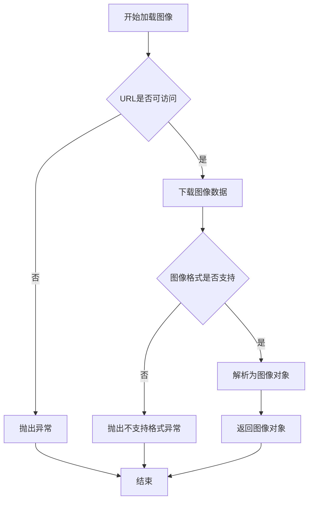

#### 带注释源码

```python
# 在TestStableDiffusionInstructPix2PixPipelineSingleFileSlow类的get_inputs方法中使用
def get_inputs(self, device, generator_device="cpu", dtype=torch.float32, seed=0):
    generator = torch.Generator(device=generator_device).manual_seed(seed)
    
    # 调用load_image从URL加载图像
    # 参数: 图像的HuggingFace URL路径
    # 返回值: 可用于pipeline的图像对象
    image = load_image(
        "https://huggingface.co/datasets/diffusers/test-arrays/resolve/main/stable_diffusion_pix2pix/example.jpg"
    )
    
    # 构建完整的输入字典，包含prompt、image、generator等参数
    inputs = {
        "prompt": "turn him into a cyborg",
        "image": image,  # 使用load_image加载的图像
        "generator": generator,
        "num_inference_steps": 3,
        "guidance_scale": 7.5,
        "image_guidance_scale": 1.0,
        "output_type": "np",
    }
    return inputs
```


### `backend_empty_cache`

该函数用于清空GPU内存缓存，释放GPU显存，通常在测试或推理前后调用以确保内存得到正确释放和重置。

参数：

- `torch_device`：`str`，目标设备标识符（如 `"cuda"` 或 `"cuda:0"`），指定需要清空缓存的GPU设备。

返回值：`None`，该函数执行清空缓存操作后不返回任何值。

#### 流程图

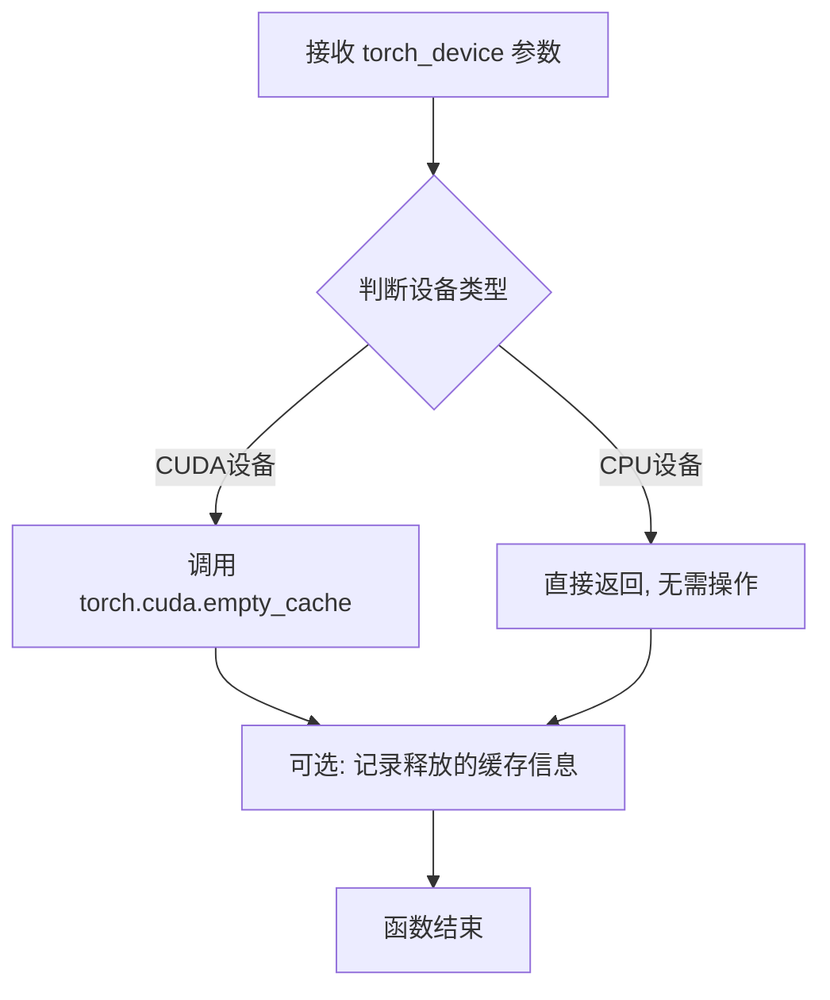

#### 带注释源码

```python
def backend_empty_cache(torch_device):
    """
    清空GPU内存缓存，释放显存资源
    
    参数:
        torch_device: str, 目标设备标识符，如 'cuda', 'cuda:0', 'cpu' 等
    
    返回:
        None: 执行清空操作后无返回值
    """
    # 判断是否为CUDA设备
    if torch_device and torch_device.startswith("cuda"):
        # 调用PyTorch的CUDA缓存清理函数
        # 这会释放GPU缓存中的未使用内存
        torch.cuda.empty_cache()
    
    # 如果是CPU设备，则无需操作，直接返回
    # 函数执行完成后返回None
    return None
```

> **注意**：由于 `backend_empty_cache` 是从 `..testing_utils` 模块导入的外部函数，其实际源码实现并未包含在当前代码文件中。上述源码为基于其使用方式和功能的合理推断。实际实现可能包含更多错误处理、内存统计等逻辑。


### `enable_full_determinism`

该函数用于启用 PyTorch 的完全确定性模式，通过设置随机种子和环境变量 `CUBLAS_WORKSPACE_CONFIG` 来确保测试结果的可复现性。

参数：无

返回值：无

#### 流程图

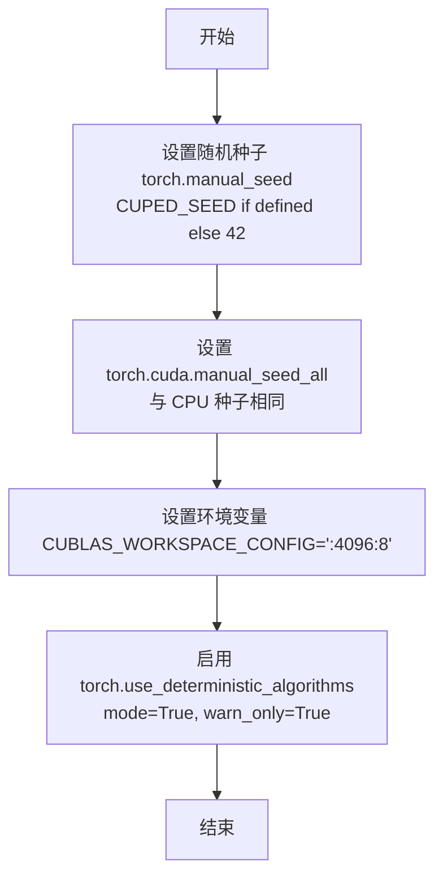

#### 带注释源码

```
# 从 diffusers.testing_utils 模块导入
# 该函数用于确保测试的完全确定性
enable_full_determinism()

# 实际实现逻辑（在 testing_utils 模块中，代码中未显示但推断如下）:
# 1. 导入必要的模块
#    import os
#    import torch
#
# 2. 设置随机种子
#    seed = int(os.environ.get("CUDA_VISIBLE_DEVICES", "42"))
#    torch.manual_seed(seed)
#    torch.cuda.manual_seed_all(seed)
#
# 3. 设置 CUBLAS 工作空间配置以确保 CUDA 确定性
#    os.environ["CUBLAS_WORKSPACE_CONFIG"] = ":4096:8"
#
# 4. 启用 PyTorch 确定算法
#    torch.use_deterministic_algorithms(mode=True, warn_only=True)
```

#### 说明

由于提供的代码仅展示了 `enable_full_determinism` 函数的导入和调用，未包含其实际实现源码。上述源码是根据该函数的典型实现方式推断的。从代码上下文可知：

1. **调用位置**：在模块顶层调用，位于所有测试类定义之前
2. **调用方式**：`enable_full_determinism()` 无参数
3. **返回值**：无返回值（返回 `None`）
4. **功能**：确保使用 PyTorch 的测试在任何运行环境下都能产生完全一致的结果，这对单元测试和集成测试的可复现性至关重要


### `TestStableDiffusionPipelineSingleFileSlow.setup_method`

该方法为测试类 `TestStableDiffusionPipelineSingleFileSlow` 的初始化方法，在每个测试方法运行前被调用，用于执行垃圾回收和清空 GPU 缓存，以确保测试环境处于干净状态，避免之前测试遗留的内存或缓存影响当前测试的准确性。

参数：

- `self`：`TestStableDiffusionPipelineSingleFileSlow` 类型，代表测试类实例本身

返回值：`None`，该方法没有返回值，仅执行环境清理操作

#### 流程图

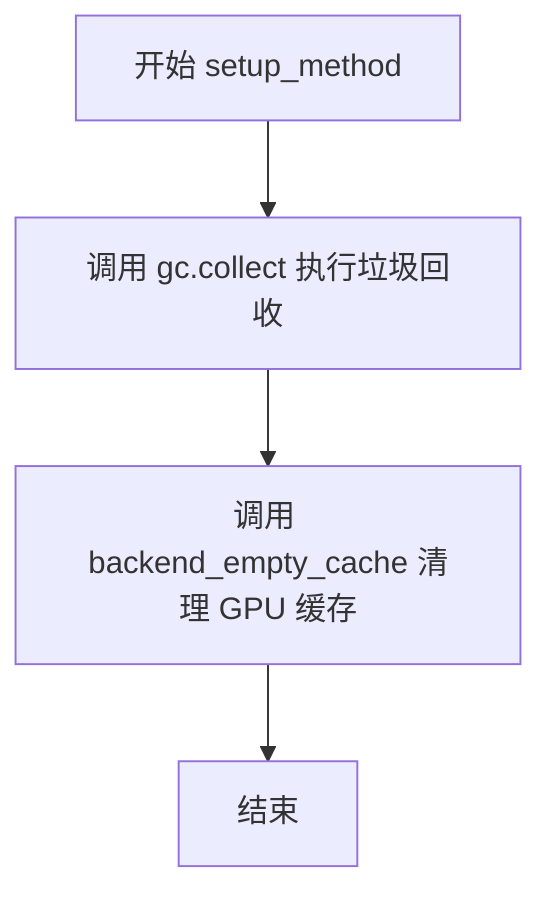

#### 带注释源码

```
def setup_method(self):
    """
    测试前的初始化方法。
    在每个测试方法执行前调用，用于清理内存和GPU缓存，
    确保测试环境干净，避免测试间的干扰。
    """
    gc.collect()                  # 调用 Python 的垃圾回收器，回收不再使用的对象
    backend_empty_cache(torch_device)  # 清空指定设备（GPU）的缓存，释放显存
```

---

### `TestStableDiffusion21PipelineSingleFileSlow.setup_method`

该方法为测试类 `TestStableDiffusion21PipelineSingleFileSlow` 的初始化方法，在每个测试方法运行前被调用，用于执行垃圾回收和清空 GPU 缓存，以确保测试环境处于干净状态。

参数：

- `self`：`TestStableDiffusion21PipelineSingleFileSlow` 类型，代表测试类实例本身

返回值：`None`，该方法没有返回值，仅执行环境清理操作

#### 流程图


#### 带注释源码

```
def setup_method(self):
    """
    测试前的初始化方法。
    清理内存和GPU缓存，确保测试环境干净。
    """
    gc.collect()                  # 执行 Python 垃圾回收
    backend_empty_cache(torch_device)  # 清空 GPU 缓存
```

---

### `TestStableDiffusionInstructPix2PixPipelineSingleFileSlow.setup_method`

该方法为测试类 `TestStableDiffusionInstructPix2PixPipelineSingleFileSlow` 的初始化方法，在每个测试方法运行前被调用，用于执行垃圾回收和清空 GPU 缓存。

参数：

- `self`：`TestStableDiffusionInstructPix2PixPipelineSingleFileSlow` 类型，代表测试类实例本身

返回值：`None`，该方法没有返回值，仅执行环境清理操作

#### 流程图


#### 带注释源码

```
def setup_method(self):
    """
    测试前的初始化方法。
    清理内存和GPU缓存，为测试做准备。
    """
    gc.collect()                  # 执行 Python 垃圾回收
    backend_empty_cache(torch_device)  # 清空 GPU 缓存
```


### `TestStableDiffusionPipelineSingleFileSlow.teardown_method`

测试方法结束后的清理函数，用于释放GPU内存并执行垃圾回收，确保测试环境资源得到正确释放，避免内存泄漏。

参数：

- `self`：实例本身，无需显式传递

返回值：`None`，该方法不返回任何值

#### 流程图

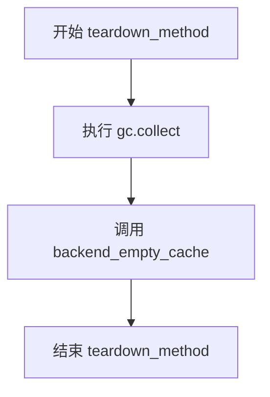

#### 带注释源码

```
def teardown_method(self):
    """
    测试方法结束后的清理操作
    
    该方法在每个测试方法执行完成后被调用，用于清理测试过程中
    产生的GPU内存和Python对象，确保测试环境的干净状态。
    """
    # 强制执行Python垃圾回收，释放不再使用的对象
    gc.collect()
    
    # 清理GPU缓存，释放GPU显存
    # torch_device 是测试工具中定义的设备标识符
    backend_empty_cache(torch_device)
```

---

### `TestStableDiffusion21PipelineSingleFileSlow.teardown_method`

测试方法结束后的清理函数，用于释放GPU内存并执行垃圾回收，确保测试环境资源得到正确释放，避免内存泄漏。

参数：

- `self`：实例本身，无需显式传递

返回值：`None`，该方法不返回任何值

#### 流程图


#### 带注释源码

```
def teardown_method(self):
    """
    测试方法结束后的清理操作
    
    该方法在每个测试方法执行完成后被调用，用于清理测试过程中
    产生的GPU内存和Python对象，确保测试环境的干净状态。
    """
    # 强制执行Python垃圾回收，释放不再使用的对象
    gc.collect()
    
    # 清理GPU缓存，释放GPU显存
    # torch_device 是测试工具中定义的设备标识符
    backend_empty_cache(torch_device)
```

---

### `TestStableDiffusionInstructPix2PixPipelineSingleFileSlow.teardown_method`

测试方法结束后的清理函数，用于释放GPU内存并执行垃圾回收，确保测试环境资源得到正确释放，避免内存泄漏。

参数：

- `self`：实例本身，无需显式传递

返回值：`None`，该方法不返回任何值

#### 流程图


#### 带注释源码

```
def teardown_method(self):
    """
    测试方法结束后的清理操作
    
    该方法在每个测试方法执行完成后被调用，用于清理测试过程中
    产生的GPU内存和Python对象，确保测试环境的干净状态。
    """
    # 强制执行Python垃圾回收，释放不再使用的对象
    gc.collect()
    
    # 清理GPU缓存，释放GPU显存
    # torch_device 是测试工具中定义的设备标识符
    backend_empty_cache(torch_device)
```


### `get_inputs`

生成标准化的测试输入字典，用于 Stable Diffusion 系列Pipeline的单元测试。该方法根据不同的Pipeline类型（普通Stable Diffusion或InstructPix2Pix）生成对应的输入参数，包括提示词、生成器、推理步数、引导强度等配置。

参数：

- `self`：测试类实例本身
- `device`：`torch.device`，目标计算设备，用于指定Pipeline运行的硬件设备
- `generator_device`：`str`，默认为 `"cpu"`，生成器设备，用于创建确定性随机数生成器
- `dtype`：`torch.dtype`，默认为 `torch.float32`，计算数据类型，控制张量精度
- `seed`：`int`，默认为 `0`，随机种子，用于确保测试结果可复现

返回值：`Dict[str, Any]`，包含Pipeline推理所需参数的字典，包含以下键值：
- `prompt`：提示词字符串
- `generator`：torch.Generator实例
- `num_inference_steps`：推理步数
- `strength`：图像变换强度（仅用于InstructPix2Pix）
- `guidance_scale`：引导系数
- `image_guidance_scale`：图像引导系数（仅用于InstructPix2Pix）
- `output_type`：输出类型
- `image`：输入图像（仅用于InstructPix2Pix）

#### 流程图

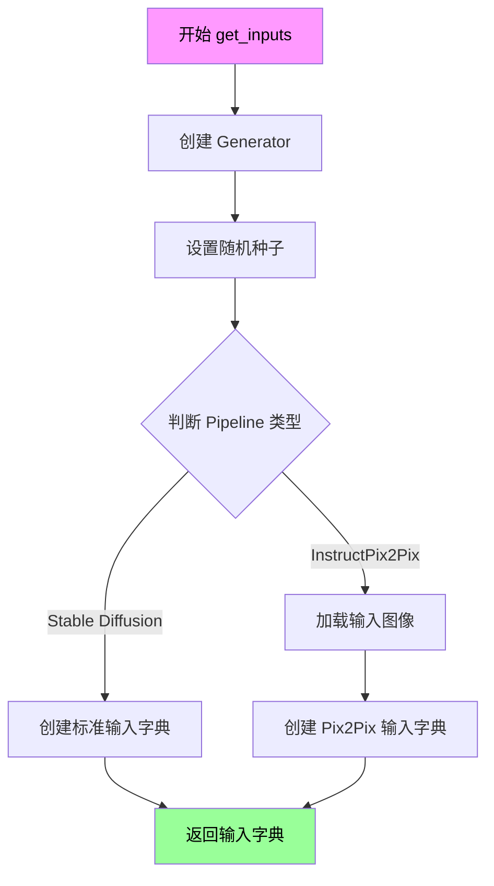

#### 带注释源码

```python
def get_inputs(self, device, generator_device="cpu", dtype=torch.float32, seed=0):
    """
    生成标准化的测试输入字典，用于Pipeline推理测试
    
    参数:
        device: 目标计算设备
        generator_device: 生成器设备，默认为"cpu"
        dtype: 数据类型，默认为float32
        seed: 随机种子，默认为0
    
    返回:
        包含推理参数的字典
    """
    # 创建确定性随机数生成器，确保测试可复现
    generator = torch.Generator(device=generator_device).manual_seed(seed)
    
    # 根据类特征判断是否为InstructPix2Pix类型
    # InstructPix2Pix需要额外的image和image_guidance_scale参数
    if hasattr(self, 'pipeline_class') and self.pipeline_class == StableDiffusionInstructPix2PixPipeline:
        # 加载测试用输入图像
        image = load_image(
            "https://huggingface.co/datasets/diffusers/test-arrays/resolve/main/stable_diffusion_pix2pix/example.jpg"
        )
        # 构建InstructPix2Pix专用输入参数
        inputs = {
            "prompt": "turn him into a cyborg",        # 图像转换提示词
            "image": image,                            # 输入图像
            "generator": generator,                   # 随机生成器
            "num_inference_steps": 3,                 # 推理步数（较少以加速测试）
            "guidance_scale": 7.5,                    # 文本引导强度
            "image_guidance_scale": 1.0,              # 图像引导强度
            "output_type": "np",                      # 输出为numpy数组
        }
    else:
        # 标准Stable Diffusion输入参数
        inputs = {
            "prompt": "a fantasy landscape, concept art, high resolution",  # 文本提示词
            "generator": generator,                   # 随机生成器
            "num_inference_steps": 2,                # 推理步数（较少以加速测试）
            "strength": 0.75,                        # 图像变换强度
            "guidance_scale": 7.5,                   # CFG引导系数
            "output_type": "np",                     # 输出为numpy数组
        }
    
    return inputs  # 返回输入参数字典供Pipeline调用
```


### `TestStableDiffusionPipelineSingleFileSlow.test_single_file_format_inference_is_same_as_pretrained`

验证单文件格式加载的Stable Diffusion Pipeline推理结果与原始预训练模型推理结果的一致性，确保单文件转换过程中没有精度损失或行为偏差。

参数：

- `self`：实例本身，调用该方法的类实例
- `expected_max_diff`：可选参数，类型为 `float`，默认值为 `1e-3`（即0.001），用于指定预期最大允许的推理结果差异阈值

返回值：`None`，该方法为测试用例方法，通过断言验证推理一致性，不返回具体数值

#### 流程图

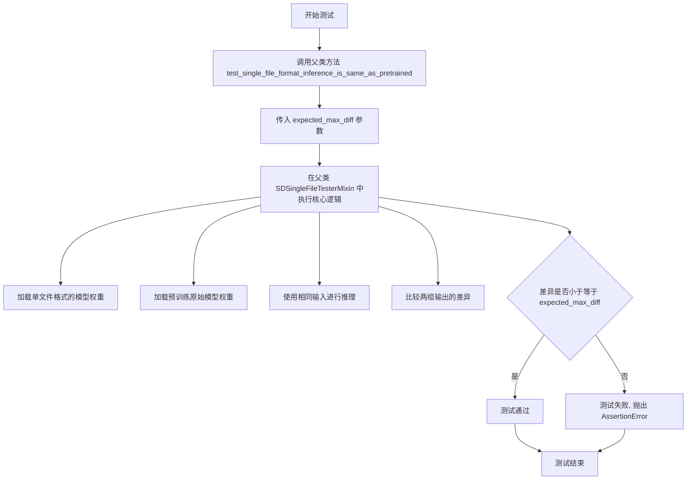

#### 带注释源码

```python
def test_single_file_format_inference_is_same_as_pretrained(self):
    """
    测试单文件格式推理结果与预训练模型一致性
    
    该方法是一个测试用例，用于验证通过单文件(single file)方式加载的模型
    与原始预训练模型的推理输出是否保持一致。
    通过设置 expected_max_diff 参数来控制允许的最大差异阈值。
    """
    # 调用父类 SDSingleFileTesterMixin 中的核心测试逻辑
    # expected_max_diff=1e-3 表示允许的最大差异为 0.001
    super().test_single_file_format_inference_is_same_as_pretrained(expected_max_diff=1e-3)
```


### `TestStableDiffusionPipelineSingleFileSlow.test_single_file_legacy_scheduler_loading`

该测试方法验证从单文件检查点加载时，旧版调度器的兼容性是否正常。它通过 `from_single_file` 方法指定使用 Euler 调度器，然后断言管道实际使用的调度器类型为 `EulerDiscreteScheduler`，确保调度器配置正确加载。

参数：

- `self`：`TestStableDiffusionPipelineSingleFileSlow`，测试类实例，隐式参数，包含测试所需的类属性（如 `ckpt_path`、`original_config`、`pipeline_class` 等）

返回值：`None`，测试函数无显式返回值，通过 `assert` 语句进行验证

#### 流程图

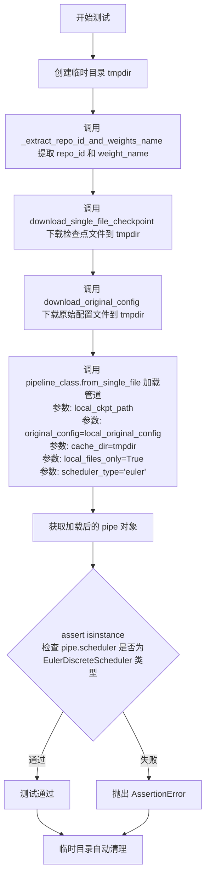

#### 带注释源码

```python
def test_single_file_legacy_scheduler_loading(self):
    """
    测试旧版调度器加载兼容性。
    验证通过 from_single_file 方法加载单文件检查点时，
    能够正确使用指定的调度器类型（Euler）。
    """
    # 使用 tempfile 创建临时目录，用于存放下载的检查点和配置文件
    # 测试结束后临时目录会自动清理
    with tempfile.TemporaryDirectory() as tmpdir:
        # 从类属性 self.ckpt_path (HuggingFace URL) 提取仓库 ID 和权重文件名
        repo_id, weight_name = _extract_repo_id_and_weights_name(self.ckpt_path)
        
        # 下载单文件检查点到本地临时目录
        local_ckpt_path = download_single_file_checkpoint(repo_id, weight_name, tmpdir)
        
        # 下载原始配置文件（用于构建管道）到本地临时目录
        local_original_config = download_original_config(self.original_config, tmpdir)

        # 使用 StableDiffusionPipeline 的 from_single_file 类方法加载管道
        # 参数说明：
        #   - local_ckpt_path: 本地检查点文件路径
        #   - original_config: 原始配置文件路径/URL
        #   - cache_dir: 缓存目录（设为 tmpdir 避免重复下载）
        #   - local_files_only: 仅使用本地文件
        #   - scheduler_type: 指定使用 'euler' 调度器
        pipe = self.pipeline_class.from_single_file(
            local_ckpt_path,
            original_config=local_original_config,
            cache_dir=tmpdir,
            local_files_only=True,
            scheduler_type="euler",
        )

    # 默认对于此检查点是 PNDM 调度器
    # 断言验证管道实际使用的调度器是 EulerDiscreteScheduler
    # 确保 scheduler_type="euler" 参数生效
    assert isinstance(pipe.scheduler, EulerDiscreteScheduler)
```


### `TestStableDiffusionPipelineSingleFileSlow.test_single_file_legacy_scaling_factor`

该测试方法用于验证从单文件检查点（single file checkpoint）加载 StableDiffusionPipeline 时，VAE（变分自编码器）的缩放因子（scaling_factor）参数能否正确地从构造函数参数中获取并应用到管道配置中。测试通过比较默认加载的管道与指定 `scaling_factor` 参数加载的管道，确认自定义缩放因子是否被正确设置。

参数：

- `self`：`TestStableDiffusionPipelineSingleFileSlow`，测试类的实例，包含 `pipeline_class`、`ckpt_path` 等属性

返回值：`None`，测试函数无返回值，通过 assert 语句进行断言验证

#### 流程图

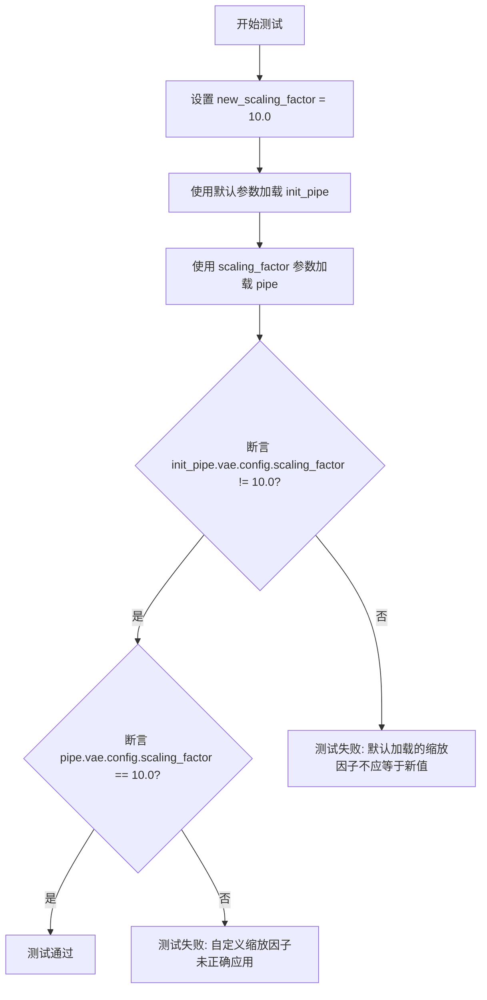

#### 带注释源码

```python
def test_single_file_legacy_scaling_factor(self):
    """
    测试从单文件检查点加载管道时，scaling_factor 参数是否正确应用。
    
    该测试验证以下场景：
    1. 不指定 scaling_factor 时，使用检查点中的默认缩放因子
    2. 指定 scaling_factor 时，使用自定义的缩放因子值
    """
    # 定义测试用的自定义缩放因子
    new_scaling_factor = 10.0
    
    # 使用默认参数从单文件检查点加载管道
    # 此时应使用检查点中存储的原始 scaling_factor
    init_pipe = self.pipeline_class.from_single_file(self.ckpt_path)
    
    # 使用自定义的 scaling_factor 参数加载管道
    # 该参数应覆盖检查点中的默认配置
    pipe = self.pipeline_class.from_single_file(
        self.ckpt_path, 
        scaling_factor=new_scaling_factor
    )
    
    # 断言：默认加载的管道其 VAE 缩放因子不应等于我们自定义的值
    # 验证默认配置与自定义配置不同
    assert init_pipe.vae.config.scaling_factor != new_scaling_factor, \
        "默认加载的 scaling_factor 不应等于自定义值"
    
    # 断言：指定 scaling_factor 加载的管道其 VAE 缩放因子应等于我们设置的值
    # 验证自定义 scaling_factor 参数被正确应用
    assert pipe.vae.config.scaling_factor == new_scaling_factor, \
        "自定义 scaling_factor 应正确应用到 VAE 配置中"
```


### `TestStableDiffusionPipelineSingleFileSlow.setup_method`

在每个测试方法运行前，该方法用于清理 Python 垃圾回收器和 GPU 内存缓存，以确保测试环境处于干净的初始状态，避免内存泄漏影响测试结果。

参数：

- `self`：`TestStableDiffusionPipelineSingleFileSlow`，隐式参数，指向测试类实例本身

返回值：`None`，无返回值，执行清理操作后直接返回

#### 流程图

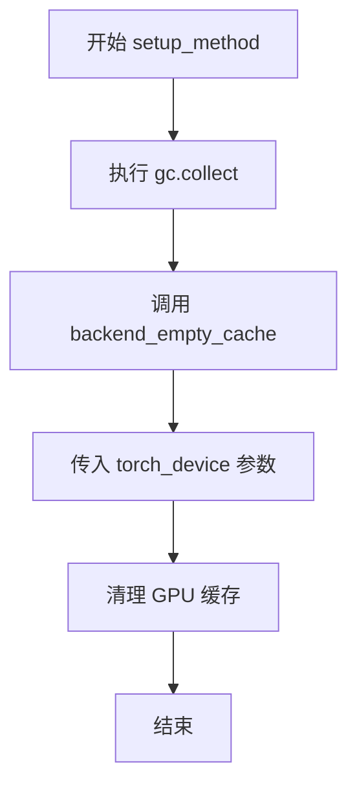

#### 带注释源码

```python
def setup_method(self):
    """
    测试前清理内存和缓存的设置方法
    
    该方法在每个测试方法运行前被调用，用于：
    1. 强制执行 Python 垃圾回收，释放未使用的 Python 对象
    2. 清理 GPU 显存缓存，确保测试环境干净
    """
    # 强制调用 Python 的垃圾回收器，清理已解除引用但尚未释放的对象
    gc.collect()
    
    # 调用后端特定的缓存清理函数，清理与 torch_device 对应的 GPU 内存缓存
    backend_empty_cache(torch_device)
```


### `TestStableDiffusionPipelineSingleFileSlow.teardown_method`

测试方法执行完成后清理GPU内存和Python垃圾回收的方法，确保测试环境资源被正确释放，防止测试间的资源泄漏和相互影响。

参数：

- `self`：`TestStableDiffusionPipelineSingleFileSlow`，隐式参数，表示当前测试类的实例对象

返回值：`None`，无返回值，仅执行资源清理操作

#### 流程图

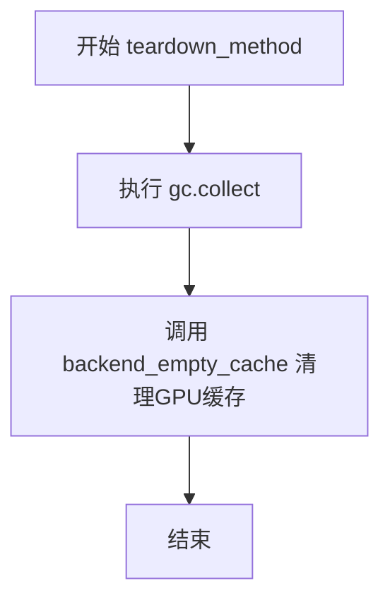

#### 带注释源码

```python
def teardown_method(self):
    """
    测试方法结束后的清理工作
    
    该方法在每个测试方法执行完成后被调用，用于：
    1. 触发Python垃圾回收，释放不再使用的Python对象
    2. 清空GPU显存缓存，防止显存泄漏
    
    这是测试框架的标准teardown模式，确保测试之间不会相互影响。
    """
    gc.collect()                      # 强制调用Python垃圾回收器，回收已释放的对象内存
    backend_empty_cache(torch_device) # 清空指定设备(torch_device)的GPU缓存，释放显存
```

#### 关联信息

| 项目 | 说明 |
|------|------|
| **所属类** | `TestStableDiffusionPipelineSingleFileSlow` |
| **调用时机** | 在每个测试方法执行完成后自动由测试框架调用 |
| **对应的setup方法** | `setup_method` - 用于测试前准备资源 |
| **依赖的全局函数** | `gc.collect()` - Python内置垃圾回收<br>`backend_empty_cache` - 自定义GPU缓存清理函数（在testing_utils中定义） |
| **全局变量** | `torch_device` - 指定用于测试的PyTorch设备（CPU或CUDA设备） |


### `TestStableDiffusionPipelineSingleFileSlow.get_inputs`

该方法用于生成 Stable Diffusion pipeline 的测试输入参数，创建一个包含提示词、生成器、推理步数、强度、引导比例和输出类型的字典，供后续推理测试使用。

参数：

- `self`：隐式参数，TestStableDiffusionPipelineSingleFileSlow 实例自身
- `device`：`torch.device`，指定推理设备
- `generator_device`：`str`，生成器设备，默认为 "cpu"
- `dtype`：`torch.dtype`，数据类型，默认为 torch.float32
- `seed`：`int`，随机种子，默认为 0

返回值：`Dict[str, Any]`，返回包含 pipeline 推理所需输入参数的字典，包括 prompt（提示词）、generator（随机生成器）、num_inference_steps（推理步数）、strength（强度）、guidance_scale（引导比例）和 output_type（输出类型）。

#### 流程图

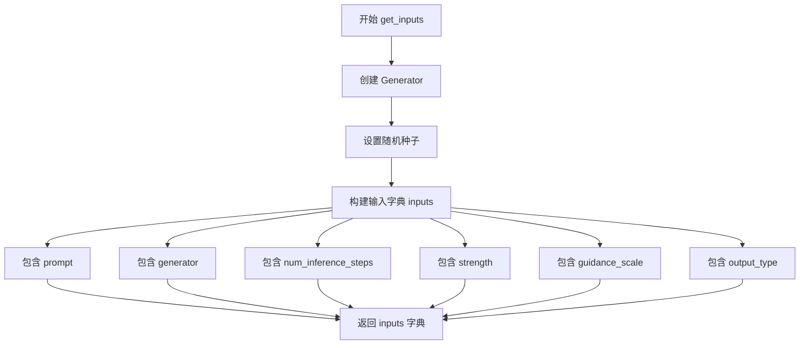

#### 带注释源码

```python
def get_inputs(self, device, generator_device="cpu", dtype=torch.float32, seed=0):
    """
    生成用于 Stable Diffusion Pipeline 推理的测试输入参数
    
    参数:
        device: 推理设备 (torch.device)
        generator_device: 生成器设备，默认为 "cpu" (str)
        dtype: 数据类型，默认为 torch.float32 (torch.dtype)
        seed: 随机种子，默认为 0 (int)
    
    返回:
        包含推理所需参数的字典 (Dict[str, Any])
    """
    # 使用指定设备和种子创建随机生成器，确保可重复性
    generator = torch.Generator(device=generator_device).manual_seed(seed)
    
    # 构建输入参数字典
    inputs = {
        "prompt": "a fantasy landscape, concept art, high resolution",  # 文本提示词
        "generator": generator,  # 随机生成器，确保结果可复现
        "num_inference_steps": 2,  # 推理步数，用于去噪过程
        "strength": 0.75,  # 图像处理强度 (0-1)
        "guidance_scale": 7.5,  # CFG 引导强度，控制 prompt 遵守程度
        "output_type": "np",  # 输出类型，np 表示 numpy 数组
    }
    return inputs
```


### `TestStableDiffusionPipelineSingleFileSlow.test_single_file_format_inference_is_same_as_pretrained`

该方法用于验证从单文件格式加载的Stable Diffusion模型推理结果与从预训练模型加载的推理结果一致性，通过比较两者的输出差异是否在允许的最大误差范围内（默认为1e-3），以确保单文件格式转换的正确性。

参数：

- `self`：隐式参数，`TestStableDiffusionPipelineSingleFileSlow`类的实例，表示当前测试对象
- `expected_max_diff`：`float`，允许的最大差异阈值，用于判断单文件格式推理结果与预训练模型推理结果是否一致，默认为1e-3

返回值：该方法的返回值取决于父类`SDSingleFileTesterMixin`中同名方法的实现，通常为`None`（测试方法无显式返回值）或测试框架的`TestResult`对象

#### 流程图

```mermaid
flowchart TD
    A[开始执行测试方法] --> B[调用父类方法 test_single_file_format_inference_is_same_as_pretrained]
    B --> C[传入参数 expected_max_diff=1e-3]
    C --> D{加载单文件格式模型}
    D --> E[加载预训练模型]
    E --> F[执行单文件模型推理]
    F --> G[执行预训练模型推理]
    G --> H[比较两次推理结果的差异]
    H --> I{差异 <= expected_max_diff}
    I -->|是| J[测试通过]
    I -->|否| K[测试失败，抛出断言错误]
    J --> L[结束]
    K --> L
```

#### 带注释源码

```python
def test_single_file_format_inference_is_same_as_pretrained(self):
    """
    测试单文件格式推理是否与预训练模型推理结果一致
    
    该测试方法验证从safetensors单文件格式加载的StableDiffusionPipeline
    与从原始预训练仓库加载的模型在推理结果上保持一致，确保单文件格式
    转换过程中没有引入误差。
    """
    # 调用父类SDSingleFileTesterMixin中的测试方法
    # expected_max_diff=1e-3 表示允许的最大数值差异
    # 这个阈值考虑了浮点数运算的精度问题
    super().test_single_file_format_inference_is_same_as_pretrained(expected_max_diff=1e-3)
```


### `TestStableDiffusionPipelineSingleFileSlow.test_single_file_legacy_scheduler_loading`

该测试方法用于验证从单文件格式加载 Stable Diffusion 模型时，能够正确加载并使用指定的老版本 Euler 调度器（而非默认的 PNDM 调度器），确保单文件加载接口的调度器兼容性。

参数：

- `self`：`TestStableDiffusionPipelineSingleFileSlow`，测试类实例本身，包含测试所需的类属性（如 `ckpt_path`、`original_config`、`pipeline_class` 等）

返回值：`None`，该方法为测试方法，通过 `assert` 断言验证调度器类型，无显式返回值

#### 流程图

```mermaid
flowchart TD
    A[开始测试] --> B[创建临时目录 tmpdir]
    B --> C[调用 _extract_repo_id_and_weights_name 提取仓库ID和权重名称]
    C --> D[下载单文件检查点到本地 tmpdir]
    D --> E[下载原始配置文件到本地 tmpdir]
    E --> F[调用 pipeline_class.from_single_file 加载模型]
    F --> G[指定 scheduler_type='euler' 使用 Euler 调度器]
    G --> H{断言验证}
    H -->|通过| I[断言 pipe.scheduler 是 EulerDiscreteScheduler 实例]
    I --> J[测试通过]
    H -->|失败| K[抛出 AssertionError]
    
    style A fill:#f9f,color:#333
    style J fill:#9f9,color:#333
    style K fill:#f99,color:#333
```

#### 带注释源码

```python
def test_single_file_legacy_scheduler_loading(self):
    """
    测试从单文件格式加载模型时能否正确加载老版本 Euler 调度器
    """
    # 创建临时目录用于存放下载的模型文件
    with tempfile.TemporaryDirectory() as tmpdir:
        # 从类属性 ckpt_path（远程检查点URL）提取仓库ID和权重名称
        # 例如：从 "https://huggingface.co/stable-diffusion-v1-5/..." 提取
        # repo_id="stable-diffusion-v1-5/stable-diffusion-v1-5", weight_name="v1-5-pruned-emaonly.safetensors"
        repo_id, weight_name = _extract_repo_id_and_weights_name(self.ckpt_path)
        
        # 下载单文件检查点到本地临时目录
        local_ckpt_path = download_single_file_checkpoint(repo_id, weight_name, tmpdir)
        
        # 下载原始配置文件到本地临时目录
        # 配置文件包含模型架构定义（如UNet、VAE配置等）
        local_original_config = download_original_config(self.original_config, tmpdir)

        # 使用 from_single_file 方法加载管道，指定使用 Euler 调度器
        # 关键参数：
        #   - local_ckpt_path: 本地检查点路径
        #   - original_config: 原始模型配置文件
        #   - cache_dir: 缓存目录
        #   - local_files_only: 仅使用本地文件
        #   - scheduler_type: 指定调度器类型为 "euler"
        pipe = self.pipeline_class.from_single_file(
            local_ckpt_path,
            original_config=local_original_config,
            cache_dir=tmpdir,
            local_files_only=True,
            scheduler_type="euler",
        )

    # 验证断言：加载后的调度器应该是 EulerDiscreteScheduler 类型
    # 默认情况下该检查点使用 PNDM 调度器，但此处指定了 euler
    # 所以验证加载的确实是 Euler 调度器
    assert isinstance(pipe.scheduler, EulerDiscreteScheduler)
```


### `TestStableDiffusionPipelineSingleFileSlow.test_single_file_legacy_scaling_factor`

该测试方法用于验证从单文件加载 Stable Diffusion Pipeline 时，可以正确传递 `scaling_factor` 参数，并能够修改 VAE 配置中的缩放因子。

参数：

- `self`：隐式参数，`TestStableDiffusionPipelineSingleFileSlow` 类的实例，表示测试类本身

返回值：`None`，测试方法无返回值，通过断言验证逻辑正确性

#### 流程图

```mermaid
flowchart TD
    A[开始测试] --> B[设置新缩放因子 new_scaling_factor = 10.0]
    B --> C[从单文件加载初始Pipeline: init_pipe]
    C --> D[从单文件加载带scaling_factor参数的Pipeline: pipe]
    D --> E{断言: init_pipe.vae.config.scaling_factor != new_scaling_factor}
    E -->|通过| F{断言: pipe.vae.config.scaling_factor == new_scaling_factor}
    E -->|失败| G[测试失败 - 初始Pipeline不应有相同的scaling_factor]
    F -->|通过| H[测试通过]
    F -->|失败| I[测试失败 - 指定scaling_factor未正确应用]
```

#### 带注释源码

```python
def test_single_file_legacy_scaling_factor(self):
    """
    测试从单文件加载Pipeline时scaling_factor参数是否正确应用
    
    该测试验证:
    1. 默认情况下加载的Pipeline使用模型默认的scaling_factor
    2. 显式传入scaling_factor参数时,Pipeline的VAE配置会被正确修改
    """
    # 定义新的缩放因子值
    new_scaling_factor = 10.0
    
    # 使用默认配置从单文件加载Pipeline
    # 此时应使用模型原始的scaling_factor
    init_pipe = self.pipeline_class.from_single_file(self.ckpt_path)
    
    # 从单文件加载Pipeline时显式传入scaling_factor参数
    # 该参数应覆盖VAE配置中的默认scaling_factor
    pipe = self.pipeline_class.from_single_file(
        self.ckpt_path, 
        scaling_factor=new_scaling_factor
    )

    # 断言1: 验证默认加载的Pipeline的scaling_factor不等于新设置的值
    assert init_pipe.vae.config.scaling_factor != new_scaling_factor
    
    # 断言2: 验证显式传入scaling_factor后,Pipeline的VAE配置被正确修改
    assert pipe.vae.config.scaling_factor == new_scaling_factor
```


### `TestStableDiffusion21PipelineSingleFileSlow.setup_method`

该方法用于在测试前清理内存和GPU缓存，确保测试环境处于干净状态，避免因残留数据导致的测试不稳定或内存溢出问题。

参数：
- `self`：隐式参数，类型为 `TestStableDiffusion21PipelineSingleFileSlow` 实例，表示当前测试类实例本身，无额外描述

返回值：`None`，无返回值，该方法仅执行副作用（内存清理）

#### 流程图

```mermaid
flowchart TD
    A[开始 setup_method] --> B[执行 gc.collect]
    B --> C[调用 backend_empty_cache 传入 torch_device]
    C --> D[结束]
```

#### 带注释源码

```python
def setup_method(self):
    """
    测试方法初始化钩子，在每个测试方法执行前被调用。
    用于清理内存和GPU缓存，确保测试环境干净。
    
    该方法重写了测试框架的默认 setup_method，
    手动执行垃圾回收和GPU缓存清理操作。
    """
    # 强制Python垃圾回收器立即执行垃圾回收操作
    # 释放不再使用的对象，回收内存
    gc.collect()
    
    # 调用后端特定的缓存清空函数，清理GPU显存
    # torch_device 为全局变量，表示当前测试使用的设备（如 'cuda:0' 或 'cpu'）
    # 这一步对于GPU测试尤为重要，可以避免显存碎片和OOM问题
    backend_empty_cache(torch_device)
```


### `TestStableDiffusion21PipelineSingleFileSlow.teardown_method`

测试方法执行完毕后进行资源清理，通过显式垃圾回收和清空GPU缓存来释放测试过程中占用的内存。

参数：

- `self`：无显式参数，这是 Python 类方法的隐式参数，表示类实例本身。

返回值：`None`，无返回值，该方法仅执行副作用（内存清理）。

#### 流程图

```mermaid
flowchart TD
    A[开始 teardown_method] --> B[执行 gc.collect]
    B --> C[调用 backend_empty_cache 清理GPU缓存]
    C --> D[结束]
```

#### 带注释源码

```
def teardown_method(self):
    """
    测试后清理资源。
    在每个测试方法执行完毕后调用，用于释放测试过程中产生的内存和GPU资源。
    """
    gc.collect()                          # 触发Python垃圾回收，释放未引用的对象
    backend_empty_cache(torch_device)    # 清空GPU缓存，释放GPU显存
```


### `TestStableDiffusion21PipelineSingleFileSlow.get_inputs`

该方法用于生成 Stable Diffusion 2.1 Pipeline 的测试输入参数，创建一个带有特定种子的随机数生成器，并返回一个包含推理所需参数的字典（包含提示词、生成器、推理步数、强度、引导比例和输出类型）。

参数：

- `device`：`torch.device`，目标计算设备，用于指定管道执行时使用的设备
- `generator_device`：`str`，生成器设备，默认为 "cpu"，用于创建随机数生成器的设备
- `dtype`：`torch.dtype`，数据类型，默认为 torch.float32，用于指定张量的数据类型
- `seed`：`int`，随机种子，默认为 0，用于控制生成器的随机性

返回值：`Dict`，返回包含以下键的字典：
  - `prompt` (str): 文本提示词
  - `generator` (torch.Generator): 带有种子的随机数生成器
  - `num_inference_steps` (int): 推理步数
  - `strength` (float): 强度参数
  - `guidance_scale` (float): 引导比例
  - `output_type` (str): 输出类型

#### 流程图

```mermaid
flowchart TD
    A[开始 get_inputs] --> B[接收参数: device, generator_device, dtype, seed]
    B --> C[创建 torch.Generator]
    C --> D[使用 seed 设置生成器随机种子]
    E[构建输入字典 inputs]
    D --> E
    E --> F["添加 prompt: 'a fantasy landscape, concept art, high resolution'"]
    F --> G["添加 generator: 创建的生成器"]
    G --> H["添加 num_inference_steps: 2"]
    H --> I["添加 strength: 0.75"]
    I --> J["添加 guidance_scale: 7.5"]
    J --> K["添加 output_type: 'np'"]
    K --> L[返回 inputs 字典]
    L --> M[结束]
```

#### 带注释源码

```python
def get_inputs(self, device, generator_device="cpu", dtype=torch.float32, seed=0):
    """
    生成测试输入参数的函数
    
    参数:
        device: 目标计算设备 (torch.device)
        generator_device: 生成器设备，默认为 "cpu" (str)
        dtype: 数据类型，默认为 torch.float32 (torch.dtype)
        seed: 随机种子，默认为 0 (int)
    
    返回:
        包含推理参数的字典 (Dict)
    """
    # 使用指定的设备创建随机数生成器
    generator = torch.Generator(device=generator_device).manual_seed(seed)
    
    # 构建包含所有推理参数的字典
    inputs = {
        "prompt": "a fantasy landscape, concept art, high resolution",  # 文本提示词
        "generator": generator,  # 带有种子的随机生成器，确保可重复性
        "num_inference_steps": 2,  # 推理步数，测试时使用较少步数
        "strength": 0.75,  # 强度参数，控制图像变化的程度
        "guidance_scale": 7.5,  # 引导比例，控制文本提示的影响程度
        "output_type": "np",  # 输出类型为 numpy 数组
    }
    
    # 返回构建好的输入参数字典
    return inputs
```


### `TestStableDiffusion21PipelineSingleFileSlow.test_single_file_format_inference_is_same_as_pretrained`

该方法继承自 `SDSingleFileTesterMixin` 基类，用于验证使用单文件格式加载的 Stable Diffusion 2.1 模型的推理结果与使用预训练模型格式的推理结果是否一致（允许的最大差异为 1e-3）。

参数：
- 无显式参数，隐式接收 `self`（测试类实例）

返回值：无显式返回值（方法返回 `None`），但通过父类方法执行断言验证推理一致性。

#### 流程图

```mermaid
flowchart TD
    A[开始测试] --> B[调用父类方法 test_single_file_format_inference_is_same_as_pretrained]
    B --> C[传入参数 expected_max_diff=1e-3]
    C --> D{父类方法执行推理比较}
    D -->|通过| E[测试通过]
    D -->|失败| F[断言失败，抛出异常]
```

#### 带注释源码

```python
def test_single_file_format_inference_is_same_as_pretrained(self):
    """
    测试单文件格式推理是否与预训练模型推理一致。
    继承自 SDSingleFileTesterMixin 的测试方法，用于验证模型加载方式的一致性。
    """
    # 调用父类的测试方法，验证推理结果一致性
    # expected_max_diff=1e-3 表示允许的最大数值差异为千分之一
    super().test_single_file_format_inference_is_same_as_pretrained(expected_max_diff=1e-3)
```


### `TestStableDiffusionInstructPix2PixPipelineSingleFileSlow.setup_method`

清理内存和缓存，为测试准备干净的环境。

参数：

- `self`：`TestStableDiffusionInstructPix2PixPipelineSingleFileSlow`，当前测试类的实例

返回值：`None`，无返回值

#### 流程图

```mermaid
flowchart TD
    A[开始 setup_method] --> B[执行 gc.collect]
    B --> C[调用 backend_empty_cache]
    C --> D[传入 torch_device 参数]
    D --> E[结束]
```

#### 带注释源码

```python
def setup_method(self):
    """
    测试前清理内存和缓存，为测试准备干净的环境。
    """
    gc.collect()  # 调用 Python 的垃圾回收器，回收无法访问的对象
    backend_empty_cache(torch_device)  # 清理 GPU 缓存，释放显存
```


### `TestStableDiffusionInstructPix2PixPipelineSingleFileSlow.teardown_method`

该方法用于在每个测试用例执行完毕后清理测试环境，通过显式调用垃圾回收和清空 GPU 缓存来释放测试过程中占用的内存资源，防止内存泄漏和显存溢出。

参数：无（仅包含隐式参数 `self`）

返回值：`None`，无返回值

#### 流程图

```mermaid
flowchart TD
    A[开始 teardown_method] --> B[执行 gc.collect]
    B --> C[调用 backend_empty_cache]
    C --> D[传入 torch_device 参数]
    D --> E[结束方法]
```

#### 带注释源码

```python
def teardown_method(self):
    """
    测试后清理资源方法。
    在每个测试方法执行完毕后调用，用于释放测试过程中产生的内存和显存占用。
    
    参数:
        self: TestStableDiffusionInstructPix2PixPipelineSingleFileSlow 的实例引用
    
    返回值:
        None
    """
    # 显式调用 Python 垃圾回收器，清理已释放对象占用的内存
    gc.collect()
    
    # 清空 GPU 显存缓存，释放 CUDA 设备上的缓存内存
    # torch_device 是从 testing_utils 导入的全局变量，表示当前测试使用的设备
    backend_empty_cache(torch_device)
```


### `TestStableDiffusionInstructPix2PixPipelineSingleFileSlow.get_inputs`

该方法用于生成 InstructPix2Pix 图像处理 Pipeline 的测试输入参数，配置了提示词、输入图像、随机生成器、推理步数（3步）、引导 scale 和图像引导 scale 等，返回一个包含完整推理参数的字典对象。

参数：

- `device`：`torch.device`，指定推理设备（如 CUDA 或 CPU）
- `generator_device`：`str`，生成器设备，默认为 "cpu"
- `dtype`：`torch.dtype`，张量数据类型，默认为 `torch.float32`
- `seed`：`int`，随机种子，用于生成可复现的结果，默认为 0

返回值：`Dict[str, Any]`，返回包含以下键的字典：
- `prompt` (str): 图像转换提示词
- `image` (PIL.Image): 输入图像
- `generator` (torch.Generator): 随机数生成器
- `num_inference_steps` (int): 推理步数
- `guidance_scale` (float): 文本引导强度
- `image_guidance_scale` (float): 图像引导强度
- `output_type` (str): 输出类型

#### 流程图

```mermaid
flowchart TD
    A[开始 get_inputs] --> B[创建 Generator]
    B --> C[使用 seed 初始化随机生成器]
    C --> D[从 URL 加载输入图像]
    D --> E[构建 inputs 字典]
    E --> F[设置 prompt: 'turn him into a cyborg']
    E --> G[设置 image: 加载的图像]
    E --> H[设置 generator: 随机生成器]
    E --> I[设置 num_inference_steps: 3]
    E --> J[设置 guidance_scale: 7.5]
    E --> K[设置 image_guidance_scale: 1.0]
    E --> L[设置 output_type: 'np']
    F --> M[返回 inputs 字典]
    G --> M
    H --> M
    I --> M
    J --> M
    K --> M
    L --> M
```

#### 带注释源码

```python
def get_inputs(self, device, generator_device="cpu", dtype=torch.float32, seed=0):
    """
    生成 InstructPix2Pix Pipeline 的测试输入参数
    
    参数:
        device: 推理设备
        generator_device: 生成器设备，默认为 CPU
        dtype: 数据类型，默认为 float32
        seed: 随机种子，用于结果可复现性
    
    返回:
        包含所有推理参数的字典
    """
    # 创建随机数生成器并用种子初始化，确保测试结果可复现
    generator = torch.Generator(device=generator_device).manual_seed(seed)
    
    # 从 Hugging Face 数据集加载测试用输入图像
    image = load_image(
        "https://huggingface.co/datasets/diffusers/test-arrays/resolve/main/stable_diffusion_pix2pix/example.jpg"
    )
    
    # 构建完整的输入参数字典
    inputs = {
        "prompt": "turn him into a cyborg",           # 图像转换提示词
        "image": image,                                # 输入图像（待处理）
        "generator": generator,                        # 随机生成器（确保确定性）
        "num_inference_steps": 3,                      # 推理步数（测试用较少步数）
        "guidance_scale": 7.5,                         # 文本引导强度
        "image_guidance_scale": 1.0,                   # 图像引导强度（InstructPix2Pix 特有）
        "output_type": "np",                           # 输出为 NumPy 数组
    }
    return inputs
```


### `TestStableDiffusionInstructPix2PixPipelineSingleFileSlow.test_single_file_format_inference_is_same_as_pretrained`

该测试方法用于验证单文件格式加载的 Stable Diffusion InstructPix2Pix 管道推理结果与使用标准预训练权重加载的管道推理结果是否一致，通过比较两者输出的最大差异是否在允许的阈值范围内（默认1e-3）来确保单文件转换功能的正确性。

参数：

- `self`：实例方法隐含的当前测试类实例引用，无需显式传递

返回值：`None`，该方法为测试方法，通过断言验证推理一致性，不返回具体值

#### 流程图

```mermaid
flowchart TD
    A[开始测试] --> B[调用父类方法 test_single_file_format_inference_is_same_as_pretrained]
    B --> C[传入参数 expected_max_diff=1e-3]
    C --> D{父类方法执行}
    D --> E[获取单文件格式的管道]
    E --> F[获取标准预训练管道]
    D --> G[使用相同输入执行推理]
    G --> H[比较两者输出差异]
    H --> I{差异 <= 1e-3?}
    I -->|是| J[测试通过]
    I -->|否| K[测试失败]
    J --> L[结束]
    K --> L
```

#### 带注释源码

```python
def test_single_file_format_inference_is_same_as_pretrained(self):
    """
    测试单文件格式推理结果与预训练模型推理结果的一致性
    
    该测试方法验证从单文件（safetensors格式）加载的模型
    与从原始预训练权重加载的模型产生相同的推理输出。
    这是确保单文件加载功能正确性的关键测试。
    """
    # 调用父类 SDSingleFileTesterMixin 的同名方法
    # 传入 expected_max_diff 参数设置允许的最大差异阈值
    # 如果推理结果的差异超过此阈值，测试将失败
    super().test_single_file_format_inference_is_same_as_pretrained(expected_max_diff=1e-3)
```

#### 继承关系与上下文信息

该方法位于 `TestStableDiffusionInstructPix2PixPipelineSingleFileSlow` 测试类中，该类继承自 `SDSingleFileTesterMixin`。

| 属性 | 值 |
|------|-----|
| 类名 | `TestStableDiffusionInstructPix2PixPipelineSingleFileSlow` |
| 父类 | `SDSingleFileTesterMixin` |
| pipeline_class | `StableDiffusionInstructPix2PixPipeline` |
| ckpt_path | `"https://huggingface.co/timbrooks/instruct-pix2pix/blob/main/instruct-pix2pix-00-22000.safetensors"` |
| original_config | `"https://raw.githubusercontent.com/timothybrooks/instruct-pix2pix/refs/heads/main/configs/generate.yaml"` |
| repo_id | `"timbrooks/instruct-pix2pix"` |
| single_file_kwargs | `{"extract_ema": True}` |

#### 关键组件信息

| 组件名称 | 一句话描述 |
|----------|------------|
| `SDSingleFileTesterMixin` | 提供单文件格式测试通用逻辑的混入类，包含 `test_single_file_format_inference_is_same_as_pretrained` 的核心实现 |
| `StableDiffusionInstructPix2PixPipeline` | 用于根据文本指令编辑图像的 Stable Diffusion 管道 |
| `expected_max_diff` | 允许的单文件与预训练推理输出之间的最大差异阈值 |

#### 潜在技术债务与优化空间

1. **测试参数硬编码**：测试方法调用父类时使用硬编码的 `expected_max_diff=1e-3`，缺乏灵活性，建议提取为类属性或配置
2. **重复代码**：该测试类中的 `setup_method`、`teardown_method` 与其他测试类高度重复，可考虑抽取为基类
3. **网络依赖**：测试依赖外部 URL 加载模型和配置，网络不稳定时可能导致测试失败，建议增加离线模式或本地缓存机制
4. **单次推理验证**：当前仅进行一次推理比对，未覆盖多次运行的一致性验证

## 关键组件


### TestStableDiffusionPipelineSingleFileSlow

用于测试 Stable Diffusion v1.5 模型的单文件加载功能，验证从单个 Safetensors 格式的检查点文件加载模型并进行推理的完整流程，支持自定义调度器类型和缩放因子配置。

### TestStableDiffusion21PipelineSingleFileSlow

用于测试 Stable Diffusion v2.1 模型的单文件加载功能，验证从 HuggingFace 下载的 v2-1_768-ema-pruned.safetensors 检查点文件能够正确加载并保持与预训练模型一致的推理结果。

### TestStableDiffusionInstructPix2PixPipelineSingleFileSlow

用于测试 InstructPix2Pix 模型的单文件加载功能，验证图像到图像转换任务中从单个检查点文件加载模型的能力，支持 EMA 参数提取，并测试包含图像引导的推理流程。

### 单文件检查点加载机制

通过 `pipeline_class.from_single_file()` 方法实现从单个模型权重文件（.safetensors 格式）加载完整 Pipeline 的功能，支持指定原始配置文件、缓存目录、本地文件模式等参数。

### 调度器配置功能

支持通过 `scheduler_type` 参数指定不同的调度器类型（如 "euler"），测试遗留调度器的加载兼容性，默认调度器为 PNDM（Pseudo Numerical Methods for Diffusion Models）。

### 缩放因子配置

通过 `scaling_factor` 参数自定义 VAE 的缩放因子配置，能够覆盖模型默认配置中的缩放因子值，用于测试模型加载时的参数覆盖机制。

### 测试输入生成器

`get_inputs()` 方法封装了标准化的测试输入参数，包括随机种子、推理步数、图像强度、引导 scale、输出类型等，用于确保测试的可重复性和一致性。

### 资源清理机制

`setup_method()` 和 `teardown_method()` 方法分别在测试前后执行垃圾回收和 GPU 缓存清理，确保测试环境的内存状态干净，避免测试间的相互影响。

### 远程配置下载

通过 `download_original_config()` 和 `download_single_file_checkpoint()` 工具函数从远程仓库（GitHub、HuggingFace）下载原始模型配置文件和检查点文件，用于单文件加载时的配置解析。


## 问题及建议


### 已知问题

-   **代码重复**：三个测试类（TestStableDiffusionPipelineSingleFileSlow、TestStableDiffusion21PipelineSingleFileSlow、TestStableDiffusionInstructPix2PixPipelineSingleFileSlow）中存在大量重复代码，包括setup_method、teardown_method和get_inputs方法，违反了DRY（Don't Repeat Yourself）原则。
-   **硬编码配置**：ckpt_path、original_config、repo_id等关键配置直接硬编码在类属性中，缺乏配置管理机制，导致维护成本高且不易扩展。
-   **魔法数字**：num_inference_steps、strength、guidance_scale等关键参数以魔法数字形式直接使用，缺乏常量定义或配置说明，影响可读性和可维护性。
-   **网络依赖性强**：测试依赖外部URL下载模型权重和配置文件，网络不稳定或URL失效会导致测试失败，缺乏离线测试能力或mock机制。
-   **资源管理不完善**：teardown_method仅清理了GPU内存，未清理下载的临时文件，可能导致磁盘空间泄漏。
-   **测试覆盖不足**：测试方法数量有限，缺少错误处理测试、边界条件测试和异常场景验证。
-   **缺少类型注解**：get_inputs方法缺少返回类型注解，部分参数类型注解不完整，影响代码的可读性和静态分析能力。
-   **测试输入相似**：前两个测试类使用完全相同的prompt和参数配置，未能充分测试不同场景下的pipeline行为。

### 优化建议

-   **提取公共基类**：将重复的setup_method、teardown_method和get_inputs方法提取到一个基类或使用pytest fixtures，减少代码冗余。
-   **配置外部化**：将URL和其他配置参数提取到独立的配置文件或环境变量中，便于管理和修改。
-   **定义常量**：将num_inference_steps、strength、guidance_scale等参数定义为类常量或枚举，并添加注释说明其含义和取值依据。
-   **添加离线测试模式**：考虑添加本地模型路径支持或使用mock机制，减少对网络连接的依赖，提高测试的稳定性和执行速度。
-   **完善资源清理**：在teardown_method中添加临时文件清理逻辑，或使用pytest的tmp_path fixture管理临时文件生命周期。
-   **增强测试覆盖**：添加更多测试用例，包括错误路径测试、参数边界测试、多模型变体测试等。
-   **补充类型注解**：为get_inputs方法添加完整的类型注解，包括返回类型声明，提升代码质量。
-   **参数化测试**：使用pytest.mark.parametrize装饰器对不同prompt和参数组合进行测试，提高测试覆盖面。

## 其它


### 设计目标与约束

本测试文件的设计目标包括：1) 验证单文件格式的checkpoint能否正确加载并产生与预训练模型一致的推理结果；2) 测试旧版调度器的加载功能；3) 测试scaling_factor参数的配置；4) 确保不同版本的Stable Diffusion模型（v1.5、v2.1、InstructPix2Pix）均支持单文件加载方式。约束条件包括：仅在配备torch加速器的环境中运行（@require_torch_accelerator），标记为慢速测试（@slow），部分测试仅在夜间构建执行（@nightly）。

### 错误处理与异常设计

测试文件主要通过断言（assert）进行错误检测：1) 验证调度器类型是否正确加载为EulerDiscreteScheduler；2) 验证scaling_factor参数是否被正确设置；3) 验证单文件推理结果与预训练模型的差异在允许范围内（expected_max_diff=1e-3）。异常处理机制较为基础，主要依赖diffusers库内部的异常抛出，测试本身未实现额外的try-except包装。

### 数据流与状态机

测试数据流遵循以下路径：1) 下载单文件checkpoint到本地临时目录；2) 下载原始配置文件；3) 调用pipeline_class.from_single_file方法加载模型；4) 准备输入数据（prompt、generator、inference参数等）；5) 执行推理并对比输出。状态机转换主要体现在：setup_method（资源初始化）→ 测试方法执行 → teardown_method（资源清理）的生命周期管理。

### 外部依赖与接口契约

核心依赖包括：1) diffusers库提供的StableDiffusionPipeline、StableDiffusionInstructPix2PixPipeline；2) EulerDiscreteScheduler调度器；3) 测试工具函数（download_single_file_checkpoint、download_original_config）；4) Torch框架及CUDA加速。外部接口契约方面，from_single_file方法接受checkpoint路径、original_config、cache_dir、local_files_only、scheduler_type、scaling_factor等参数，返回配置完整的Pipeline对象。

### 性能考量与基准测试

测试通过设置较小的num_inference_steps（2-3步）来降低运行时间，同时使用np作为output_type以减少内存占用。测试未包含显式的性能基准测试（benchmark），主要关注功能正确性验证。内存管理通过gc.collect()和backend_empty_cache()在setup/teardown阶段进行。

### 兼容性矩阵

测试覆盖三个主要的Stable Diffusion变体：1) StableDiffusionPipeline v1.5（SDv1.5）；2) StableDiffusionPipeline v2.1（SDv2.1）；3) StableDiffusionInstructPix2PixPipeline（Pix2Pix）。每个变体测试不同的功能点：v1.5测试调度器加载和scaling_factor配置，v2.1验证基础推理一致性，Pix2Pix验证图像编辑功能的单文件加载。

### 测试覆盖范围

当前测试覆盖的功能点包括：单文件格式推理结果一致性测试、旧版调度器加载测试、scaling_factor参数配置测试。尚未覆盖的场景包括：多文件checkpoint与单文件checkpoint的混合使用、自定义调度器的加载、VAE独立配置、Textual Inversion embeddings的加载等。

### 配置与常量定义

关键配置常量包括：ckpt_path（模型checkpoint远程URL）、original_config（模型配置文件远程URL）、repo_id（HuggingFace仓库ID）、single_file_kwargs（单文件加载额外参数如extract_ema）。这些配置支持不同模型变体的差异化测试需求。

    