# `diffusers\tests\single_file\test_stable_diffusion_upscale_single_file.py` 详细设计文档

这是一个用于测试StableDiffusionUpscalePipeline的测试文件，主要验证从预训练模型仓库加载和从单个Safetensors文件加载的模型在进行图像超分辨率推理时结果的一致性。

## 整体流程

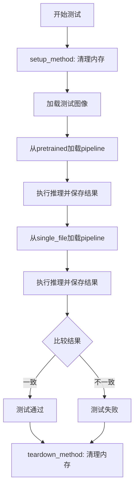

## 类结构

```
TestStableDiffusionUpscalePipelineSingleFileSlow (测试类)
└── SDSingleFileTesterMixin (父类)
```

## 全局变量及字段


### `image`
    
输入的低分辨率图像，用于超分辨率处理

类型：`PIL.Image.Image`
    


### `prompt`
    
文本提示，描述希望生成的图像内容

类型：`str`
    


### `pipe`
    
从预训练模型加载的Stable Diffusion超分辨率管道

类型：`StableDiffusionUpscalePipeline`
    


### `generator`
    
PyTorch随机数生成器，用于确保推理过程的可重复性

类型：`torch.Generator`
    


### `output`
    
管道输出的结果字典，包含生成的图像列表

类型：`dict`
    


### `image_from_pretrained`
    
从预训练模型生成的图像，格式为numpy数组

类型：`numpy.ndarray`
    


### `pipe_from_single_file`
    
从单个文件检查点加载的Stable Diffusion超分辨率管道

类型：`StableDiffusionUpscalePipeline`
    


### `output_from_single_file`
    
从单个文件管道输出的结果字典

类型：`dict`
    


### `image_from_single_file`
    
从单个文件管道生成的图像，格式为numpy数组

类型：`numpy.ndarray`
    


### `TestStableDiffusionUpscalePipelineSingleFileSlow.pipeline_class`
    
测试使用的管道类，即StableDiffusionUpscalePipeline

类型：`type`
    


### `TestStableDiffusionUpscalePipelineSingleFileSlow.ckpt_path`
    
单个文件检查点的HuggingFace URL

类型：`str`
    


### `TestStableDiffusionUpscalePipelineSingleFileSlow.original_config`
    
原始模型配置的YAML文件URL

类型：`str`
    


### `TestStableDiffusionUpscalePipelineSingleFileSlow.repo_id`
    
HuggingFace模型仓库的标识符

类型：`str`
    
    

## 全局函数及方法


### `gc.collect`

描述：`gc.collect` 是 Python 内置的垃圾回收函数，用于显式触发垃圾回收机制，遍历所有三代垃圾回收器并收集不可达对象。在该代码中用于在测试方法执行前后强制进行内存清理，以确保测试环境的一致性。

参数：无参数

返回值：`int`，返回本次垃圾回收中找到的不可达对象数量（通常为 0）。

#### 流程图

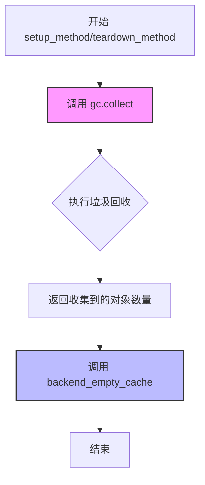

#### 带注释源码

```python
def setup_method(self):
    """
    测试方法开始前的初始化操作
    目的：确保每次测试开始时内存状态干净
    """
    gc.collect()  # 显式触发 Python 垃圾回收，释放未使用的 Python 对象
    backend_empty_cache(torch_device)  # 清理 GPU 缓存内存

def teardown_method(self):
    """
    测试方法结束后的清理操作
    目的：确保每次测试结束后释放资源，避免测试间相互影响
    """
    gc.collect()  # 显式触发 Python 垃圾回收，释放测试中产生的临时对象
    backend_empty_cache(torch_device)  # 清理 GPU 缓存内存
```


### `backend_empty_cache`

这是一个用于清理 GPU 缓存的工具函数，通常在测试或推理完成后调用，以释放 GPU 内存资源。

参数：

-  `device`：`str`，目标设备标识，通常为 `"cuda"` 或 `"cpu"` 等，用于指定要清理缓存的设备。

返回值：`None`，无返回值，仅执行缓存清理操作。

#### 流程图

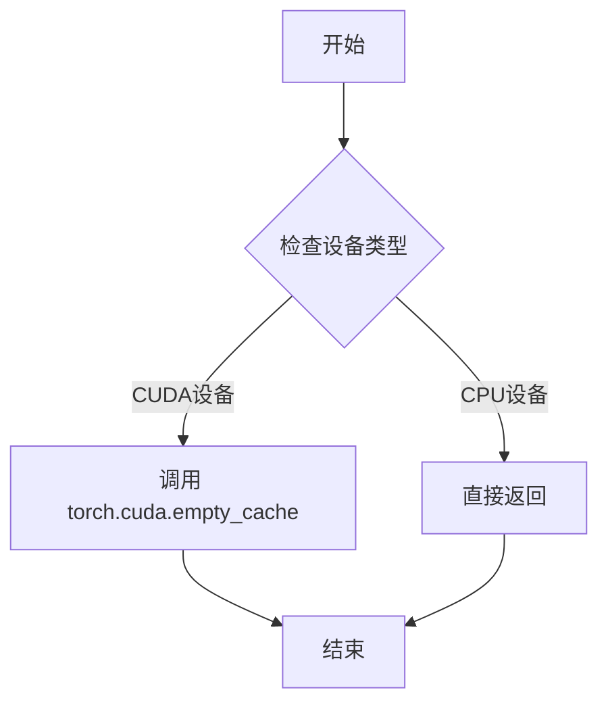

#### 带注释源码

```
# 该函数定义在 diffusers 库的 testing_utils.py 中
# 以下是基于其使用方式和常见模式的推断实现

def backend_empty_cache(device: str):
    """
    清理指定设备的 GPU 缓存
    
    参数:
        device: 设备字符串标识，如 'cuda:0', 'cuda', 'cpu' 等
    """
    import torch
    
    # 检查是否为 CUDA 设备
    if torch.cuda.is_available() and 'cuda' in device:
        # 清空 GPU 缓存，释放未使用的显存
        torch.cuda.empty_cache()
    
    # 对于 CPU 设备，无需操作，直接返回
    return
```

> **注意**：由于 `backend_empty_cache` 函数定义在外部模块 `testing_utils.py` 中（未在当前代码文件中给出完整定义），以上信息基于函数名、导入路径及其在 `setup_method` 和 `teardown_method` 中的使用方式推断得出。该函数在测试框架中用于在每个测试方法前后清理 GPU 内存，确保测试环境的一致性。


### `enable_full_determinism`

该函数用于启用 PyTorch 的完全确定性模式，通过设置随机种子和环境变量来确保深度学习模型在每次运行时产生相同的结果，从而保证测试的可重复性。

参数：

- 该函数无参数

返回值：`None`，该函数不返回任何值，主要通过副作用（设置随机种子和环境变量）来影响程序行为

#### 流程图

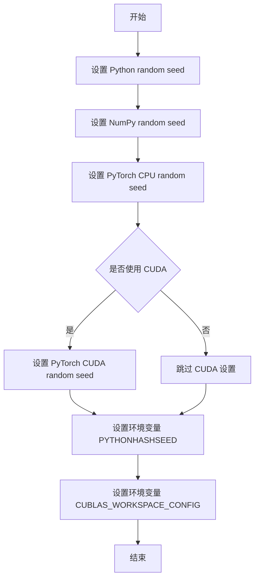

#### 带注释源码

```python
# 从 testing_utils 模块导入 enable_full_determinism 函数
# 该函数用于确保测试的完全确定性
enable_full_determinism()

# 完整函数定义（在 testing_utils 模块中）大致如下：
"""
def enable_full_determinism(seed: int = 0, warn_only: bool = False):
    '''
    启用完全确定性，确保每次运行产生相同结果
    
    参数：
        seed: 随机种子，默认为 0
        warn_only: 是否仅警告而非报错，默认为 False
    
    返回值：
        None
    '''
    import os
    import random
    import numpy as np
    import torch
    
    # 设置各种随机种子以确保可重复性
    random.seed(seed)
    np.random.seed(seed)
    torch.manual_seed(seed)
    
    # 如果使用 CUDA，设置 GPU 随机种子
    if torch.cuda.is_available():
        torch.cuda.manual_seed_all(seed)
    
    # 设置环境变量确保完全确定性
    os.environ["PYTHONHASHSEED"] = str(seed)
    os.environ["CUBLAS_WORKSPACE_CONFIG"] = ":4096:8"
    
    # 启用 PyTorch 的确定性模式
    torch.backends.cudnn.deterministic = True
    torch.backends.cudnn.benchmark = False
    if hasattr(torch, 'use_deterministic_algorithms'):
        torch.use_deterministic_algorithms(warn_only=warn_only)
"""
```


### `numpy_cosine_similarity_distance`

该函数是一个用于计算两个向量之间余弦相似度距离的工具函数，常用于比较两个图像数组之间的相似程度。在测试代码中用于验证从预训练模型和单文件加载的模型生成的图像是否一致。

参数：

-  `vector1`：`numpy.ndarray`，第一个向量，通常是图像flatten后的数组
-  `vector2`：`numpy.ndarray`，第二个向量，通常是另一张图像flatten后的数组

返回值：`float`，返回两个向量之间的余弦相似度距离（数值越小表示两个向量越相似）

#### 流程图

```mermaid
flowchart TD
    A[开始] --> B[接收两个向量 vector1 和 vector2]
    B --> C[计算 vector1 的 L2 范数]
    C --> D[计算 vector2 的 L2 范数]
    D --> E[计算两个向量的点积]
    E --> F[余弦相似度 = 点积 / (范数1 * 范数2)]
    F --> G[余弦距离 = 1 - 余弦相似度]
    G --> H[返回余弦距离]
```

#### 带注释源码

```python
def numpy_cosine_similarity_distance(vector1, vector2):
    """
    计算两个向量之间的余弦相似度距离
    
    余弦距离 = 1 - 余弦相似度
    余弦相似度 = dot(v1, v2) / (||v1|| * ||v2||)
    
    参数:
        vector1: 第一个向量 (numpy数组)
        vector2: 第二个向量 (numpy数组)
    
    返回:
        float: 余弦距离值，范围 [0, 2]
              0 表示完全相同
              1 表示正交（无相似性）
              2 表示完全相反
    """
    # 将输入转换为 numpy 数组（如果还不是）
    vector1 = np.array(vector1)
    vector2 = np.array(vector2)
    
    # 计算向量的点积
    dot_product = np.dot(vector1, vector2)
    
    # 计算向量的 L2 范数（欧几里得范数）
    norm1 = np.linalg.norm(vector1)
    norm2 = np.linalg.norm(vector2)
    
    # 避免除以零
    if norm1 == 0 or norm2 == 0:
        return 1.0  # 如果任一向量为零向量，返回最大距离
    
    # 计算余弦相似度
    cosine_similarity = dot_product / (norm1 * norm2)
    
    # 余弦距离 = 1 - 余弦相似度
    cosine_distance = 1 - cosine_similarity
    
    return cosine_distance
```

---

**注意**：该函数定义在 `testing_utils` 模块中（`from ..testing_utils import numpy_cosine_similarity_distance`），在当前提供的代码文件中仅作为导入使用，其完整实现源代码位于 `testing_utils.py` 模块中。上面的源码是基于函数用途和调用方式的推断实现。


### `load_image`

`load_image` 是 `diffusers.utils` 模块提供的工具函数，用于从 URL 或本地路径加载图像文件，并将其转换为 Pillow (PIL) 图像对象，以便后续在扩散模型 pipeline 中使用。

参数：

- `image_source`：`str`，图像来源，可以是 URL 字符串或本地文件路径

返回值：`PIL.Image.Image`，返回加载后的 Pillow 图像对象

#### 流程图

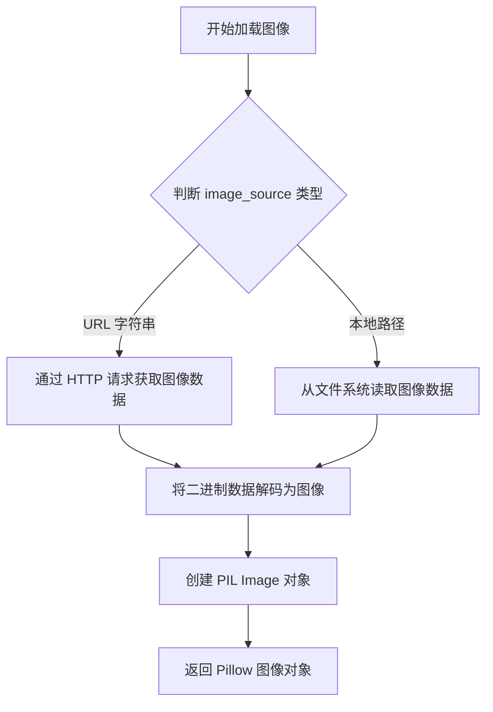

#### 带注释源码

```python
# load_image 函数源码示例（基于 diffusers 库的实现）
def load_image(image_source: str) -> "PIL.Image.Image":
    """
    从 URL 或本地路径加载图像
    
    参数:
        image_source: 图像的 URL 或本地文件路径
        
    返回:
        PIL.Image.Image: 加载后的图像对象
    """
    # 导入必要的库
    import requests
    from PIL import Image
    from io import BytesIO
    
    # 判断是否为 URL（以 http:// 或 https:// 开头）
    if image_source.startswith(("http://", "https://")):
        # 如果是 URL，通过 HTTP 请求下载图像
        response = requests.get(image_source)
        response.raise_for_status()  # 检查请求是否成功
        # 将响应内容加载为图像
        image = Image.open(BytesIO(response.content))
    else:
        # 如果是本地路径，直接从文件系统加载
        image = Image.open(image_source)
    
    # 转换为 RGB 模式（确保图像格式一致）
    if image.mode != "RGB":
        image = image.convert("RGB")
    
    return image
```

#### 使用示例

```python
# 在测试代码中的实际调用
image = load_image(
    "https://huggingface.co/datasets/hf-internal-testing/diffusers-images/resolve/main"
    "/sd2-upscale/low_res_cat.png"
)
# 返回值 image 是一个 PIL.Image.Image 对象
# 后续作为 StableDiffusionUpscalePipeline 的输入参数使用
```


### `StableDiffusionUpscalePipeline.from_pretrained`

该函数是一个类方法（Class Method），用于从预训练模型（通常是 Hugging Face Hub 上的模型仓库或本地路径）加载 `StableDiffusionUpscalePipeline` 的配置、权重并实例化管道。它负责下载必要的模型文件（如 UNet、VAE、Text Encoder 的权重和配置文件），解析配置以确定模型架构，并最终返回一个完全初始化且可进行推理的 pipeline 对象。

参数：

-  `pretrained_model_name_or_path`：`str`，模型在 Hugging Face Hub 上的仓库 ID（例如 "stabilityai/stable-diffusion-x4-upscaler"）或本地包含权重和配置文件的目录路径。

返回值：`StableDiffusionUpscalePipeline`，返回一个加载了权重和配置的管道实例，可用于图像上采样推理。

#### 流程图

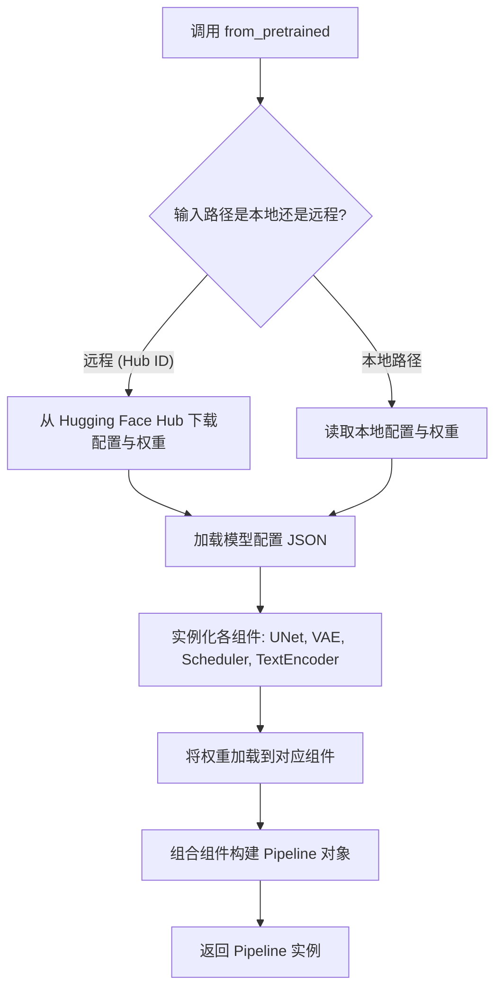

#### 带注释源码

```python
@classmethod
def from_pretrained(cls, pretrained_model_name_or_path: str, **kwargs):
    """
    从预训练模型加载管道。

    参数:
        pretrained_model_name_or_path (str): 模型仓库ID或本地路径。
        **kwargs: 其他可选参数，如 torch_dtype, device_map 等。
    """
    # 1. 解析路径，确定是本地还是远程
    # 2. 调用 DiffusionPipeline._from_pretrained_id_or_path
    #    这是一个内部方法，负责处理具体的下载和加载逻辑
    return super().from_pretrained(pretrained_model_name_or_path, **kwargs)
```
*(注：实际的源代码位于 `diffusers.pipelines.pipeline_utils.DiffusionPipeline` 基类中，`StableDiffusionUpscalePipeline` 继承自该基类并调用了父类方法。上述代码展示了在子类中的典型调用形式。)*


# StableDiffusionUpscalePipeline.from_single_file

## 描述

`StableDiffusionUpscalePipeline.from_single_file` 是 Diffusers 库中 `StableDiffusionUpscalePipeline` 类的类方法，用于从单个模型检查点文件（通常是 .safetensors 或 .ckpt 格式）加载整个扩散模型管道，而无需预先下载完整的预训练模型仓库。

## 参数

- `pretrained_model_link_or_path`：`str`，模型检查点的路径或 Hugging Face Hub 上的模型 ID/URL
- `torch_dtype`：`torch.dtype`（可选），指定模型加载的数据类型（如 `torch.float16`）
- `use_safetensors`：`bool`（可选），是否优先使用 safetensors 格式加载模型
- `variant`：`str`（可选），模型变体（如 "fp16"）
- `cache_dir`：`str`（可选），模型缓存目录
- `resume_download`：`bool`（可选），是否恢复中断的下载
- `force_download`：`bool`（可选），是否强制重新下载
- `proxies`：`dict`（可选），代理服务器配置
- `local_files_only`：`bool`（可选），是否仅使用本地文件
- `token`：`str`（可选），Hugging Face 认证令牌

## 返回值

- `StableDiffusionUpscalePipeline`：加载完成的扩散模型管道实例，可直接用于图像上采样推理

## 流程图

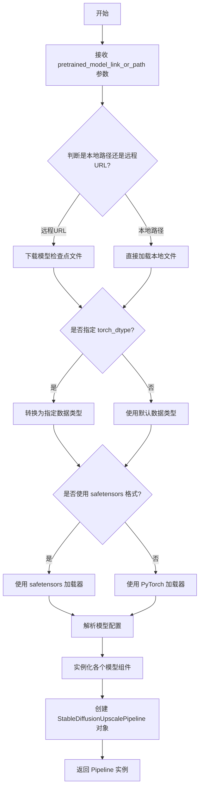

## 带注释源码

```python
# 测试代码片段展示 from_single_file 的使用方式
# 这并非 from_single_file 的实际实现源码

# 从预训练模型加载（对比基准）
pipe = StableDiffusionUpscalePipeline.from_pretrained(self.repo_id)

# 从单个检查点文件加载（被测方法）
pipe_from_single_file = StableDiffusionUpscalePipeline.from_single_file(self.ckpt_path)

# 参数说明：
# self.ckpt_path = "https://huggingface.co/stabilityai/stable-diffusion-x4-upscaler/blob/main/x4-upscaler-ema.safetensors"
# 这是一个远程 URL，指向 Hugging Face Hub 上的模型文件

# 启用 CPU 卸载以节省显存
pipe_from_single_file.enable_model_cpu_offload(device=torch_device)

# 使用示例
generator = torch.Generator("cpu").manual_seed(0)
output_from_single_file = pipe_from_single_file(
    prompt=prompt, 
    image=image, 
    generator=generator, 
    output_type="np", 
    num_inference_steps=3
)
```

## 关键组件信息

- **StableDiffusionUpscalePipeline**: 图像上采样扩散管道类，基于 Stable Diffusion 架构进行 4x 图像放大
- **SDSingleFileTesterMixin**: 单文件测试混入类，提供通用的单文件加载测试逻辑
- **x4-upscaler-ema.safetensors**: Stability AI 的 4倍上采样模型权重文件

## 潜在技术债务

1. **配置不匹配问题**: 代码中标记了两个 `@pytest.mark.xfail` 的测试用例，表明使用 `original_config` 时存在配置不匹配问题，当前设计选择保持下游用例兼容性而非完全修复
2. **测试覆盖不足**: 测试仅验证了基本功能和输出相似性，未覆盖错误处理路径、边界条件等

## 其它说明

- **设计目标**: 允许用户直接从单个模型检查点文件加载管道，无需预先通过 `from_pretrained` 下载完整模型仓库
- **错误处理**: 测试中使用了 `xfail` 标记来处理已知的配置不匹配问题，表明该方法在某些配置组合下可能产生非预期结果
- **外部依赖**: 依赖 Hugging Face Hub 进行远程模型文件下载，依赖 `safetensors` 或 PyTorch 格式的模型文件


### `TestStableDiffusionUpscalePipelineSingleFileSlow.setup_method`

该方法为测试类的前置设置方法，在每个测试方法执行前被自动调用，用于清理 Python 垃圾回收和 GPU 显存缓存，确保测试环境处于干净状态，避免测试之间的相互影响。

参数：

- `self`：`TestStableDiffusionUpscalePipelineSingleFileSlow`，测试类实例本身，包含测试所需的类属性（如 pipeline_class、ckpt_path、repo_id 等）

返回值：`None`，该方法执行清理操作后不返回任何值

#### 流程图

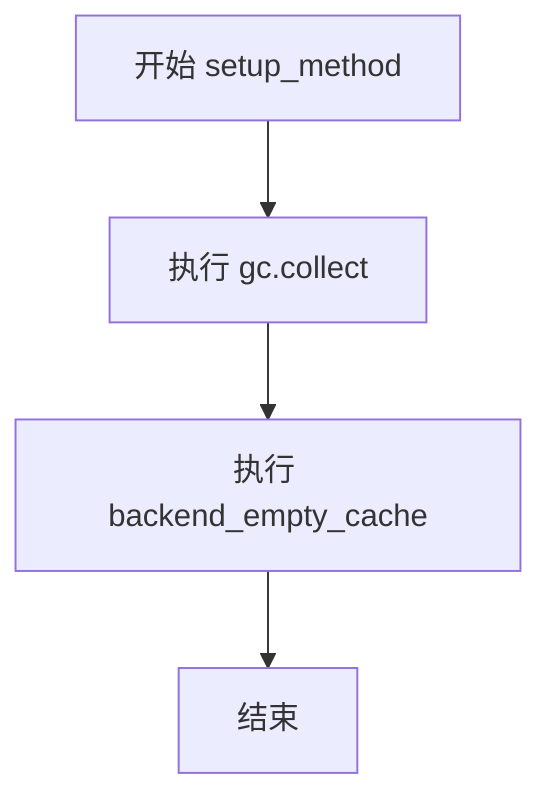

#### 带注释源码

```python
def setup_method(self):
    """
    测试方法设置前的准备工作
    
    该方法在每个测试方法运行之前被自动调用，用于清理内存和GPU缓存，
    确保测试环境处于干净状态，避免测试间的相互影响。
    """
    gc.collect()  # 手动调用Python垃圾回收器，清理已创建但不再引用的对象，释放内存
    backend_empty_cache(torch_device)  # 调用后端工具函数清理GPU显存缓存，确保GPU内存得到释放
```


### `TestStableDiffusionUpscalePipelineSingleFileSlow.teardown_method`

这是一个测试清理方法（teardown），在每个测试方法执行完毕后被调用，用于释放GPU内存和进行垃圾回收，以确保测试之间的资源隔离，避免内存泄漏。

参数：

- `self`：`TestStableDiffusionUpscalePipelineSingleFileSlow`，隐式参数，代表测试类实例本身

返回值：`None`，无返回值描述

#### 流程图

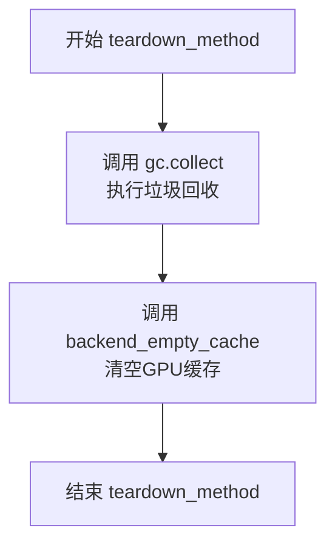

#### 带注释源码

```python
def teardown_method(self):
    """
    测试方法清理函数。
    在每个测试方法执行完毕后自动调用，用于释放资源。
    """
    gc.collect()  # 手动触发Python垃圾回收，清理不再使用的对象
    backend_empty_cache(torch_device)  # 清空GPU/CUDA缓存，释放显存
```

#### 潜在技术债务与优化空间

1. **资源清理粒度**：当前清理操作针对所有资源，可以考虑按设备或按管道进行更细粒度的清理。
2. **异常处理**：当前实现未包含异常处理，若清理过程中出现异常可能导致后续测试无法正常执行。
3. **重复代码**：setup_method 和 teardown_method 中有重复的清理逻辑，可以提取为公共方法。
4. **静态方法可能性**：torch_device 是全局变量，理论上可以将清理逻辑抽取为模块级工具函数，提高可测试性。

#### 关键组件信息

| 组件名称 | 描述 |
|---------|------|
| `gc.collect()` | Python内置垃圾回收机制，手动触发以清理已释放的对象 |
| `backend_empty_cache` | 后端缓存清理函数，用于释放GPU显存 |
| `torch_device` | 全局变量，指定测试使用的设备（如cuda:0或cpu） |


### `TestStableDiffusionUpscalePipelineSingleFileSlow.test_single_file_format_inference_is_same_as_pretrained`

这是一个测试方法，用于验证使用单文件格式（safetensors）加载的 StableDiffusionUpscalePipeline 与使用预训练模型（from_pretrained）加载的管道在推理结果上是否一致。通过比较两个管道生成的图像的余弦相似度来确保输出一致性。

参数：

- `self`：`TestStableDiffusionUpscalePipelineSingleFileSlow`，测试类的实例，隐含参数

返回值：`None`，该方法为测试方法，使用 assert 语句进行断言验证，不返回任何值

#### 流程图

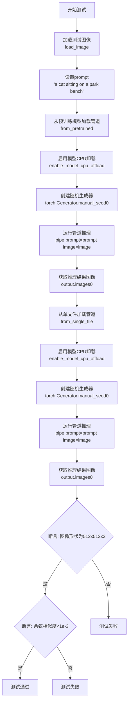

#### 带注释源码

```python
def test_single_file_format_inference_is_same_as_pretrained(self):
    """
    测试单文件格式推理结果与预训练模型推理结果是否一致
    验证 StableDiffusionUpscalePipeline.from_single_file 与 from_pretrained 输出一致性
    """
    # 加载测试用的低分辨率猫图像
    image = load_image(
        "https://huggingface.co/datasets/hf-internal-testing/diffusers-images/resolve/main"
        "/sd2-upscale/low_res_cat.png"
    )

    # 设置文本提示词
    prompt = "a cat sitting on a park bench"
    
    # 从预训练模型加载 StableDiffusionUpscalePipeline
    # 使用 repo_id = "stabilityai/stable-diffusion-x4-upscaler"
    pipe = StableDiffusionUpscalePipeline.from_pretrained(self.repo_id)
    
    # 启用模型CPU卸载以节省显存
    # 将模型各组件在推理时动态移入/移出CPU和GPU
    pipe.enable_model_cpu_offload(device=torch_device)

    # 创建CPU随机生成器，设置固定种子(0)以保证可重复性
    generator = torch.Generator("cpu").manual_seed(0)
    
    # 调用管道进行图像超分辨率推理
    # output_type="np" 返回numpy数组
    # num_inference_steps=3 减少推理步数以加快测试速度
    output = pipe(prompt=prompt, image=image, generator=generator, output_type="np", num_inference_steps=3)
    
    # 获取推理结果的第一张图像
    image_from_pretrained = output.images[0]

    # 从单文件(safetensors格式)加载管道
    # ckpt_path 指向 HuggingFace 上的 safetensors 文件
    pipe_from_single_file = StableDiffusionUpscalePipeline.from_single_file(self.ckpt_path)
    
    # 同样启用模型CPU卸载
    pipe_from_single_file.enable_model_cpu_offload(device=torch_device)

    # 创建相同的随机生成器(种子为0)确保可重复性
    generator = torch.Generator("cpu").manual_seed(0)
    
    # 使用单文件管道进行相同的推理
    output_from_single_file = pipe_from_single_file(
        prompt=prompt, image=image, generator=generator, output_type="np", num_inference_steps=3
    )
    
    # 获取单文件管道推理结果
    image_from_single_file = output_from_single_file.images[0]

    # 断言验证：预训练管道输出的图像形状为 512x512x3
    assert image_from_pretrained.shape == (512, 512, 3)
    
    # 断言验证：单文件管道输出的图像形状为 512x512x3
    assert image_from_single_file.shape == (512, 512, 3)
    
    # 断言验证：两张图像的余弦相似度距离小于 1e-3
    # 确保两种加载方式产生的图像在数值上非常接近
    assert (
        numpy_cosine_similarity_distance(image_from_pretrained.flatten(), image_from_single_file.flatten()) < 1e-3
    )
```


### `TestStableDiffusionUpscalePipelineSingleFileSlow.test_single_file_components_with_original_config`

这是一个测试单文件组件与原始配置兼容性的测试方法，使用 `@pytest.mark.xfail` 装饰器标记，预期该测试会失败（由于配置不匹配）。该方法调用父类 `SDSingleFileTesterMixin` 的同名方法执行实际的测试逻辑。

参数：

- `self`：实例方法，指向测试类 `TestStableDiffusionUpscalePipelineSingleFileSlow` 的实例对象，无显式参数描述

返回值：`None`，该方法没有显式返回值，通过调用父类方法执行测试逻辑

#### 流程图

```mermaid
flowchart TD
    A[开始执行 test_single_file_components_with_original_config] --> B{检查 xfail 条件}
    B -->|条件为 True| C[标记测试为预期失败]
    B -->|条件为 False| D[正常执行测试]
    C --> E[调用父类方法 super().test_single_file_components_with_original_config]
    D --> E
    E --> F[执行单文件组件与原始配置兼容性测试]
    F --> G[测试完成后执行 teardown_method]
    G --> H[结束]
```

#### 带注释源码

```python
@pytest.mark.xfail(
    condition=True,  # 标记测试预期失败
    reason="Test fails because of mismatches in the configs but it is very hard to properly fix this considering downstream usecase.",  # 失败原因：配置不匹配
    strict=True,  # 严格模式：测试必须失败，否则报告错误
)
def test_single_file_components_with_original_config(self):
    """
    测试单文件组件与原始配置的兼容性
    
    该测试方法执行以下操作：
    1. 调用父类 SDSingleFileTesterMixin 的同名方法
    2. 验证单文件加载的组件配置与原始预训练模型配置的一致性
    3. 由于配置不匹配，测试预期失败
    """
    super().test_single_file_components_with_original_config()
    # 调用父类方法执行实际的测试逻辑
    # 父类方法会验证：
    # - 单文件加载的组件（如 UNet、VAE、Tokenizer 等）配置
    # - 与原始模型配置文件的兼容性
    # - 组件参数的一致性
```


### `TestStableDiffusionUpscalePipelineSingleFileSlow.test_single_file_components_with_original_config_local_files_only`

该测试方法用于验证从单文件加载的Stable Diffusion Upscale管道组件与使用原始配置文件本地加载的组件是否一致，通过调用父类的同名测试方法执行实际验证逻辑。

参数：

- `self`：`TestStableDiffusionUpscalePipelineSingleFileSlow`，测试类实例本身，包含测试所需的类属性（`pipeline_class`、`ckpt_path`、`original_config`、`repo_id`等）

返回值：`None`，该方法为pytest测试方法，不返回任何值

#### 流程图

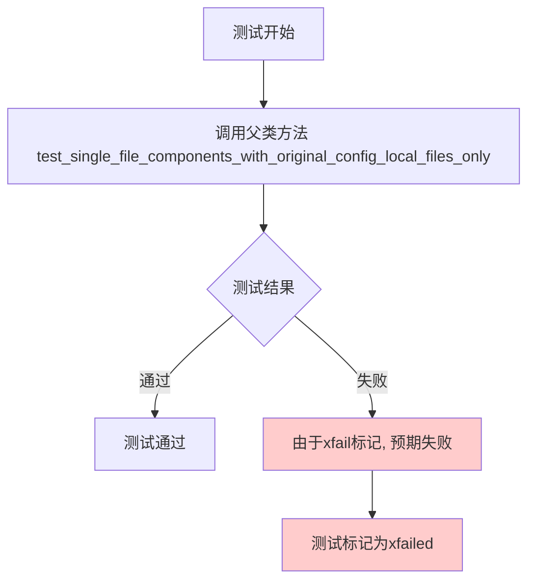

#### 带注释源码

```python
@pytest.mark.xfail(
    condition=True,
    reason="Test fails because of mismatches in the configs but it is very hard to properly fix this considering downstream usecase.",
    strict=True,
)
def test_single_file_components_with_original_config_local_files_only(self):
    """
    测试方法：验证单文件组件与原始配置本地文件的兼容性
    
    该测试方法被标记为 xfail（预期失败），因为配置文件中存在不匹配问题，
    但考虑到下游用例，很难完全修复。测试通过调用父类的方法来执行实际验证逻辑。
    
    测试流程：
    1. 使用类属性中定义的 ckpt_path（单文件检查点路径）加载模型
    2. 使用类属性中定义的 original_config（原始配置文件）加载配置
    3. 比较两者的组件是否一致
    4. 验证本地文件加载方式的正确性
    """
    super().test_single_file_components_with_original_config_local_files_only()
```

## 关键组件


### StableDiffusionUpscalePipeline

Stable Diffusion X4 upscaler模型流水线，支持从预训练仓库或单个safetensors文件加载，用于图像超分辨率推理。

### from_pretrained 方法

从HuggingFace Hub预训练模型仓库加载完整流水线配置和权重，支持模型CPU卸载。

### from_single_file 方法

从单个safetensors检查点文件加载流水线，结合原始配置文件构建模型结构。

### 测试图片加载

通过load_image从URL加载低分辨率图像，用于超分辨率处理。

### 推理流程

使用文本提示和低分辨率图像生成高分辨率输出，支持numpy数组输出和可配置推理步数。

### 内存管理组件

在测试setup和teardown阶段调用gc.collect()和backend_empty_cache清理GPU内存，确保测试隔离。

### 结果一致性验证

通过numpy_cosine_similarity_distance计算预训练模型与单文件模型输出相似度，确保功能等价。

### 测试配置参数

定义模型检查点URL、原始配置文件URL和仓库ID，用于测试环境搭建和验证。


## 问题及建议


### 已知问题

- **xfail 标记的测试**：两个测试方法 `test_single_file_components_with_original_config` 和 `test_single_file_components_with_original_config_local_files_only` 被标记为已知失败（xfail），表明存在未解决的核心功能问题（配置不匹配），但由于修复困难而被长期搁置，这是技术债务的明确标志。
- **资源管理效率低下**：`setup_method` 和 `teardown_method` 中每次都调用 `gc.collect()`，这对大型模型测试来说开销较大且可能不是必需的，应该根据实际内存压力来决定是否手动触发垃圾回收。
- **外部依赖脆弱性**：测试依赖于外部 URL（HuggingFace Hub 的模型和图片），网络不稳定、模型仓库变更或图片链接失效都会导致测试失败，缺乏离线或本地 fallback 机制。
- **硬编码参数缺乏说明**：`num_inference_steps=3`（远低于典型推理步数）、相似度阈值 `< 1e-3`、随机种子 `0` 等关键参数以魔法数字形式出现，没有常量定义或注释说明，降低了代码可读性和可维护性。
- **异常处理缺失**：网络请求（如 `from_pretrained`、`load_image`）没有 try-except 包装，测试会因网络超时或资源不存在而直接崩溃而非给出明确错误信息。
- **测试单一性**：仅有一个主要推理测试验证格式一致性，缺少对不同输入分辨率、批量推理、CPU/GPU 兼容性等方面的测试覆盖。

### 优化建议

- **重构 xfail 测试**：深入分析配置不匹配的根本原因，考虑是否能通过配置文件映射或版本兼容层来修复，而不是长期标记为 xfail；如确实无法修复，应添加详细的文档说明原因和后续计划。
- **优化资源管理**：使用 pytest fixture 管理测试资源，按需调用 `gc.collect()`（如检测到显存不足时），或考虑使用 context manager 自动释放 pipeline 资源。
- **引入本地测试资产**：将模型权重和测试图片缓存到本地或使用 pytest 的 fixture 化资源，降低对外部网络的依赖，提高 CI/CD 稳定性。
- **提取魔法数字**：定义具名常量（如 `INFERENCE_STEPS = 3`、`COSINE_SIMILARITY_THRESHOLD = 1e-3`）并添加注释，提升代码可读性。
- **增强异常处理**：为网络请求添加超时和重试逻辑，捕获并转换异常为更友好的测试失败信息。
- **扩展测试覆盖**：添加参数化测试用例覆盖不同场景（如不同分辨率、batch size、device），并分离单元测试和集成测试。

## 其它


### 设计目标与约束

本测试类的核心设计目标是验证 StableDiffusionUpscalePipeline 从单文件（safetensors格式）加载的方式是否与从预训练模型仓库（from_pretrained）加载的方式产生一致的推理结果。约束条件包括：必须使用 torch 加速器（@require_torch_accelerator），测试标记为慢速测试（@slow），需要网络访问加载远程检查点和配置文件，且测试对精度要求较高（余弦相似度距离小于1e-3）。

### 错误处理与异常设计

测试中使用了 pytest 的 @pytest.mark.xfail 装饰器处理两个预期失败的测试用例：test_single_file_components_with_original_config 和 test_single_file_components_with_original_config_local_files_only。这两个测试由于配置文件不匹配导致失败，标记为 strict=True 表示预期失败且确实失败。测试方法本身通过 setup_method 和 teardown_method 进行资源清理（gc.collect 和 backend_empty_cache），确保测试环境不会因显存泄漏导致后续测试失败。

### 数据流与状态机

测试数据流如下：1）加载测试图像（load_image 从 HF Hub）；2）创建原始管道（from_pretrained）；3）启用 CPU 卸载（enable_model_cpu_offload）；4）使用固定随机种子生成器执行推理；5）保存输出图像；6）加载单文件管道并重复推理流程；7）比较两次输出的形状和相似度。状态机转换：初始化状态 → 管道加载状态 → 模型卸载状态 → 推理执行状态 → 结果比较状态 → 资源清理状态。

### 外部依赖与接口契约

主要外部依赖包括：diffusers 库的 StableDiffusionUpscalePipeline 和 load_image 函数；torch 库用于张量操作和生成器；pytest 框架用于测试运行；numpy 用于相似度计算。远程资源依赖：模型检查点（safetensors 文件）、原始配置文件（YAML）、测试用低分辨率猫图像。接口契约：from_pretrained 和 from_single_file 方法应返回相同的管道接口，管道调用需支持 prompt、image、generator、output_type、num_inference_steps 参数。

### 测试策略与覆盖率

测试采用等价类划分策略，验证两种加载方式的功能等价性。test_single_file_format_inference_is_same_as_pretrained 覆盖核心功能等价性测试，使用相同的随机种子和推理步骤数确保结果可复现且可比较。两个 xfail 测试覆盖配置文件兼容性测试，但当前因配置不匹配而失败。

### 性能考虑与资源管理

测试标记为 @slow 表明执行时间较长。setup_method 和 teardown_method 中调用 gc.collect() 和 backend_empty_cache() 进行显式资源管理，确保 GPU 显存及时释放。enable_model_cpu_offload() 的使用降低了显存峰值需求，但可能增加推理时间。测试使用较少的推理步数（num_inference_steps=3）平衡测试速度和覆盖度。

### 兼容性考虑

测试验证了 safetensors 格式与预训练格式的兼容性，同时检查了远程配置文件加载能力。测试假设运行环境有网络连接访问 HuggingFace Hub。当前两个配置文件相关测试标记为 xfail，说明单文件加载与原始 YAML 配置的兼容性问题尚未解决，这是潜在的改进方向。

### 配置与环境要求

测试需要 CUDA 或其他 torch 加速器支持（通过 @require_torch_accelerator 装饰器验证）。环境变量或配置需支持远程资源下载。测试使用固定随机种子（manual_seed(0)）确保结果确定性，enable_full_determinism() 进一步增强可复现性。测试图像尺寸为 512x512x3，输出类型为 numpy 数组。


    