# `diffusers\tests\single_file\test_stable_diffusion_xl_adapter_single_file.py` 详细设计文档

这是一个针对 StableDiffusionXLAdapterPipeline 的单文件加载功能的集成测试类，用于验证从单个 safetensors 检查点文件加载模型并执行推理的结果与从预训练模型加载的结果一致性，同时测试多种配置加载方式（本地文件、diffusers配置、原始配置等）。

## 整体流程

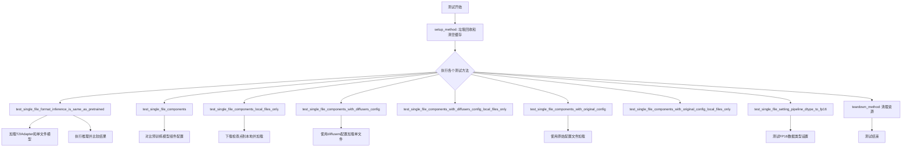

## 类结构

```
SDXLSingleFileTesterMixin (混入类)
└── TestStableDiffusionXLAdapterPipelineSingleFileSlow (测试类)
    ├── setup_method
    ├── teardown_method
    ├── get_inputs
    └── 6个测试方法...
```

## 全局变量及字段


### `prompt`
    
生成图像的文本提示词

类型：`str`
    


### `generator`
    
用于控制随机性的PyTorch随机数生成器

类型：`torch.Generator`
    


### `image`
    
T2I适配器的输入图像

类型：`PIL.Image or torch.Tensor`
    


### `inputs`
    
包含推理所需参数的字典（prompt, image, generator, num_inference_steps, guidance_scale, output_type）

类型：`dict`
    


### `adapter`
    
从预训练模型加载的T2I适配器实例

类型：`T2IAdapter`
    


### `pipe_single_file`
    
从单文件检查点加载的管道实例

类型：`StableDiffusionXLAdapterPipeline`
    


### `pipe`
    
从预训练模型仓库加载的管道实例

类型：`StableDiffusionXLAdapterPipeline`
    


### `images_single_file`
    
单文件管道生成的图像数组

类型：`np.ndarray`
    


### `images`
    
预训练管道生成的图像数组

类型：`np.ndarray`
    


### `max_diff`
    
两幅图像之间的余弦相似度距离

类型：`float`
    


### `tmpdir`
    
临时目录路径，用于存放下载的文件

类型：`str`
    


### `local_ckpt_path`
    
本地检查点文件的完整路径

类型：`str`
    


### `local_diffusers_config`
    
本地Diffusers配置文件的完整路径

类型：`str`
    


### `local_original_config`
    
本地原始配置文件的完整路径

类型：`str`
    


### `repo_id`
    
从检查点URL提取的HuggingFace仓库ID

类型：`str`
    


### `weight_name`
    
检查点文件的权重名称

类型：`str`
    


### `TestStableDiffusionXLAdapterPipelineSingleFileSlow.pipeline_class`
    
待测试的Stable Diffusion XL适配器管道类

类型：`type[StableDiffusionXLAdapterPipeline]`
    


### `TestStableDiffusionXLAdapterPipelineSingleFileSlow.ckpt_path`
    
单文件检查点的远程URL地址

类型：`str`
    


### `TestStableDiffusionXLAdapterPipelineSingleFileSlow.repo_id`
    
预训练模型在HuggingFace上的仓库标识符

类型：`str`
    


### `TestStableDiffusionXLAdapterPipelineSingleFileSlow.original_config`
    
原始模型配置文件的远程URL地址

类型：`str`
    
    

## 全局函数及方法


### `gc.collect`

这是 Python 标准库中的垃圾回收函数，用于强制执行垃圾回收过程，清理已分配但不再使用的内存对象。

**注意**：在代码中，该函数被用于 `setup_method` 和 `teardown_method` 方法中，分别在测试开始前和结束后调用，以帮助释放 GPU 内存。

#### 参数

- 无参数

#### 返回值

- `None`，无返回值

#### 流程图

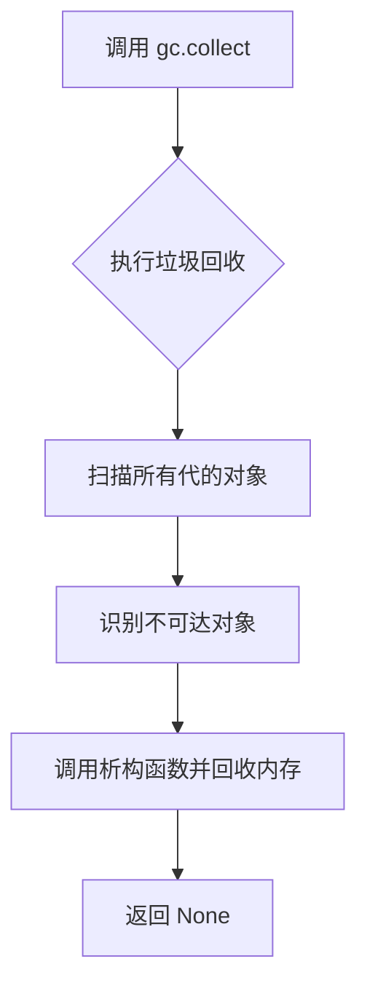

#### 带注释源码

```python
# 位于 setup_method 方法中
def setup_method(self):
    gc.collect()  # 强制执行垃圾回收，清理测试前可能存在的未使用对象
    backend_empty_cache(torch_device)  # 清理 GPU 缓存

# 位于 teardown_method 方法中
def teardown_method(self):
    gc.collect()  # 强制执行垃圾回收，清理测试后可能存在的未使用对象
    backend_empty_cache(torch_device)  # 清理 GPU 缓存
```

#### 上下文使用说明

在 `TestStableDiffusionXLAdapterPipelineSingleFileSlow` 测试类中，`gc.collect()` 的主要用途是：

1. **内存管理**：在 GPU 上运行深度学习模型后，强制 Python 垃圾回收器运行，以帮助释放不再使用的 Python 对象
2. **测试隔离**：在每个测试方法运行前后清理内存，确保测试之间的内存状态相对独立
3. **配合 GPU 缓存清理**：与 `backend_empty_cache(torch_device)` 配合使用，更全面地释放 GPU 内存资源


### `backend_empty_cache`

该函数是测试工具模块中用于清理 GPU 缓存的实用函数，通过调用后端特定的缓存清理机制（通常是 `torch.cuda.empty_cache()`）来释放未使用的 GPU 显存，以防止测试过程中的内存泄漏和显存不足问题。

参数：

- `device`：字符串或设备对象，表示需要清理缓存的目标设备（通常为 `"cuda"` 或 `"cuda:0"` 等）

返回值：无返回值（`None`），该函数仅执行缓存清理操作

#### 流程图

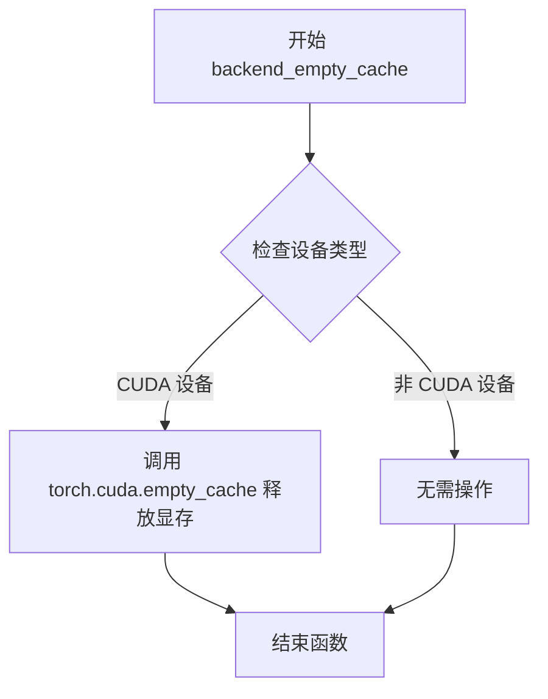

#### 带注释源码

```
# 由于 backend_empty_cache 定义在 testing_utils 模块中，
# 当前代码片段仅显示其导入和使用方式，未包含实际实现。
# 根据函数命名和调用方式推断，其典型实现如下：

def backend_empty_cache(device):
    """
    清理指定设备的后端缓存
    
    参数:
        device: str 或 torch.device - 目标设备标识
    """
    import torch
    
    # 如果设备是字符串，转换为 torch.device 对象
    if isinstance(device, str):
        device = torch.device(device)
    
    # 根据设备类型执行相应的缓存清理操作
    if device.type == 'cuda':
        # 对于 CUDA 设备，调用 PyTorch 的清空缓存函数
        torch.cuda.empty_cache()
    elif device.type == 'cpu':
        # CPU 设备通常不需要清理缓存
        pass
    # 其他设备类型可在此扩展

# 在测试类中的实际调用方式：
# backend_empty_cache(torch_device)
# 其中 torch_device 来自 testing_utils 模块，通常为 "cuda" 或 "cuda:0"
```


### `enable_full_determinism`

该函数用于设置 PyTorch 和相关库的随机种子，以确保测试或推理过程的完全确定性（Determinism），使多次运行产生相同的结果。

参数： 无

返回值： 无

#### 流程图

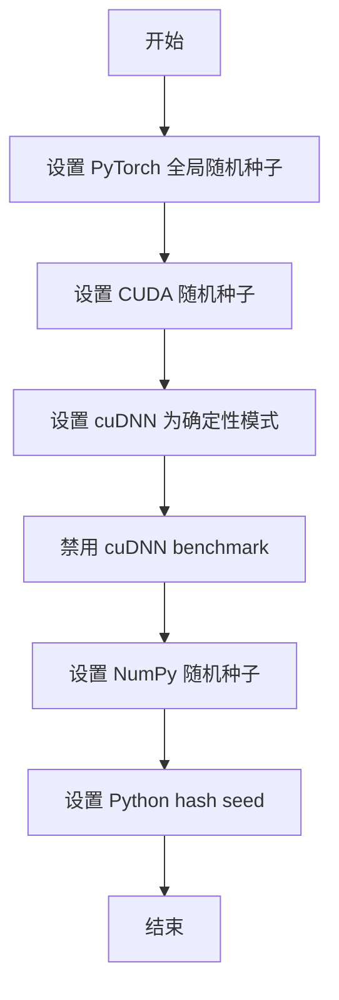

#### 带注释源码

```python
# 该函数定义在 testing_utils 模块中，此处为导入后的调用
# 源代码位置：from ..testing_utils import enable_full_determinism

# 模块级别调用，确保整个测试文件运行在确定性模式下
enable_full_determinism()

# 下面是测试类的定义，该类使用上述确定性设置进行测试
@slow
@require_torch_accelerator
class TestStableDiffusionXLAdapterPipelineSingleFileSlow(SDXLSingleFileTesterMixin):
    # ... 测试类实现
```

---

### 补充说明

#### 潜在的技术债务或优化空间

1. **硬编码的随机种子**：`enable_full_determinism()` 通常使用固定种子（如 0），这可能导致测试覆盖不足。建议考虑使用参数化种子或环境变量来增强测试多样性。

2. **cuDNN 确定性性能开销**：启用 `cudnn.deterministic=True` 会导致性能下降约 10-20%，在生产环境中应权衡使用。

#### 其它项目

**设计目标与约束**：
- 确保不同运行环境下测试结果的一致性
- 兼容 CUDA 和 CPU 后端

**错误处理与异常设计**：
- 该函数通常为幂等操作，不抛出异常
- 若特定后端不支持确定性模式，应有警告机制

**外部依赖与接口契约**：
- 依赖 `torch` 库
- 来自 `diffusers` 包的内部测试工具模块 `testing_utils`


### `numpy_cosine_similarity_distance`

该函数是一个用于计算两个numpy数组之间余弦相似度距离的测试工具函数，被导入自 `..testing_utils` 模块。在代码中用于验证单文件模式和预训练模型模式生成的图像之间的相似度。

参数：

- `x`：`numpy.ndarray`，第一个输入数组（通常是flatten后的图像数据）
- `y`：`numpy.ndarray`，第二个输入数组（通常是flatten后的图像数据）

返回值：`float`，返回两个向量之间的余弦相似度距离（值越小表示越相似）

#### 流程图

```mermaid
flowchart TD
    A[开始] --> B[输入: x, y 两个numpy数组]
    B --> C[计算向量x的范数]
    B --> D[计算向量y的范数]
    C --> E[计算点积: x · y]
    D --> E
    E --> F[计算余弦相似度: cos_θ = x·y / ||x||·||y||]
    F --> G[计算距离: distance = 1 - cos_θ]
    G --> H[返回距离值]
```

#### 带注释源码

```python
# 该函数未在当前文件中实现，是从 testing_utils 模块导入的
# 使用方式如下（基于代码中的调用）：

# images.flatten() 和 images_single_file.flatten() 是两个一维numpy数组
max_diff = numpy_cosine_similarity_distance(images.flatten(), images_single_file.flatten())

# 返回值 max_diff 是一个浮点数，表示两个图像的余弦相似度距离
# 距离值越小，说明两个图像越相似
```

---

> **注意**：由于 `numpy_cosine_similarity_distance` 函数的具体实现源码不在提供的代码文件中，以上信息是基于其在代码中的使用方式推断得出的。该函数来源于 `diffusers` 库的 `testing_utils` 模块。如需获取完整的函数实现源码，建议查看 `diffusers` 库的源文件。


### `load_image`

从指定的 URL 或本地路径加载图像，并返回 PIL Image 对象。

参数：

- `image_url_or_path`：`str`，图像的 URL 链接或本地文件系统路径

返回值：`PIL.Image`，PIL 格式的图像对象

#### 流程图

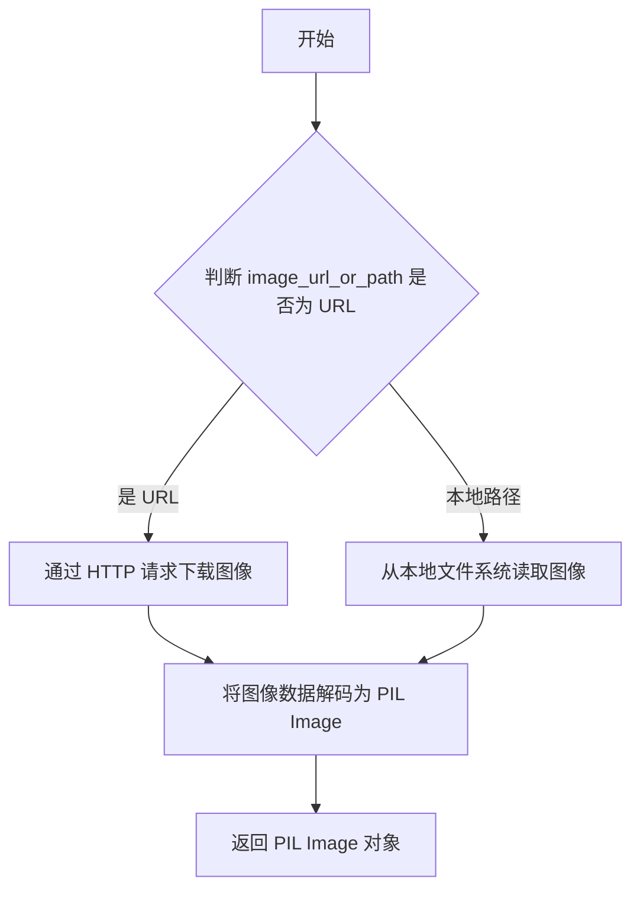

#### 带注释源码

```python
def load_image(image_url_or_path: str) -> "PIL.Image":
    """
    从 URL 或本地路径加载图像为 PIL Image 对象
    
    参数:
        image_url_or_path: 图像的 URL 链接或本地文件路径
        
    返回:
        PIL.Image: 加载后的图像对象
    """
    # 检查是否为远程 URL（以 http:// 或 https:// 开头）
    if image_url_or_path.startswith("http://") or image_url_or_path.startswith("https://"):
        # 通过 HTTP 请求从远程 URL 下载图像
        # 使用 requests 库获取图像内容
        image = Image.open(requests.get(image_url_or_path, stream=True).raw)
    else:
        # 视为本地文件路径，直接从文件系统读取
        image = Image.open(image_url_or_path)
    
    # 返回 PIL Image 对象
    return image
```


### `T2IAdapter.from_pretrained`

该方法是 `T2IAdapter` 类的类方法，用于从预训练模型或本地文件加载 T2IAdapter（Text-to-Image Adapter）模型。T2IAdapter 是一种用于图像生成的条件控制适配器，可以从线条图、深度图、姿态图等条件图像引导生成对应的图像。

#### 参数

- `pretrained_model_name_or_path`：`str`，模型在 Hugging Face Hub 上的模型 ID（如 `"TencentARC/t2i-adapter-lineart-sdxl-1.0"`）或本地模型路径
- `torch_dtype`：`torch.dtype` 或 `None`，可选，指定模型权重的精度类型（如 `torch.float16`、`torch.float32`），默认 `None`
- `cache_dir`：`str` 或 `None`，可选，模型缓存目录路径，默认 `None`
- `force_download`：`bool`，可选，是否强制重新下载模型，默认 `False`
- `local_files_only`：`bool`，可选，是否仅使用本地缓存的文件，默认 `False`
- `revision`：`str`，可选，从 Hub 下载时的 Git 分支名，默认 `"main"`
- `use_safetensors`：`bool` 或 `None`，可选，是否使用 `.safetensors` 格式文件，默认 `None`
- `variant`：`str` 或 `None`，可选，加载的模型变体（如 `"fp16"`），默认 `None`

#### 返回值

`T2IAdapter`，返回加载完成的 T2IAdapter 模型实例

#### 流程图

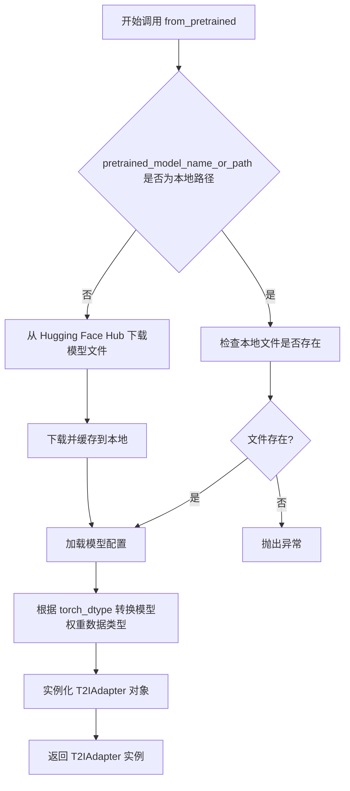

#### 带注释源码

```python
# 伪代码展示 from_pretrained 方法的核心逻辑
@classmethod
def from_pretrained(
    cls,
    pretrained_model_name_or_path: Union[str, Path],  # 模型ID或本地路径
    torch_dtype: Optional[torch.dtype] = None,         # 模型精度类型
    cache_dir: Optional[str] = None,                  # 缓存目录
    force_download: bool = False,                     # 强制下载标志
    local_files_only: bool = False,                   # 仅本地文件标志
    revision: str = "main",                           # Git版本
    use_safetensors: Optional[bool] = None,           # 是否使用safetensors
    variant: Optional[str] = None,                    # 模型变体
    **kwargs,                                         # 其他参数
):
    """
    从预训练模型加载 T2IAdapter 模型
    
    参数:
        pretrained_model_name_or_path: 模型ID或本地路径
        torch_dtype: 模型权重的数据类型（如torch.float16）
        cache_dir: 缓存目录路径
        force_download: 是否强制重新下载
        local_files_only: 是否只使用本地文件
        revision: Git分支或提交ID
        use_safetensors: 是否使用safetensors格式
        variant: 模型变体名称
    
    返回:
        T2IAdapter: 加载完成的适配器模型实例
    """
    
    # 1. 解析模型路径或ID，确定模型位置
    config_dict = cls.load_config(
        pretrained_model_name_or_path,
        cache_dir=cache_dir,
        force_download=force_download,
        revision=revision,
    )
    
    # 2. 加载模型权重文件
    model_file = cls._get_model_file(
        pretrained_model_name_or_path,
        cache_dir=cache_dir,
        force_download=force_download,
        local_files_only=local_files_only,
        revision=revision,
        use_safetensors=use_safetensors,
        variant=variant,
    )
    
    # 3. 根据 torch_dtype 加载权重
    if torch_dtype is not None:
        state_dict = load_file(model_file, device="cpu")
        # 转换为指定的数据类型
        state_dict = {
            k: v.to(torch_dtype) if isinstance(v, torch.Tensor) else v 
            for k, v in state_dict.items()
        }
    else:
        state_dict = load_file(model_file)
    
    # 4. 加载模型配置
    config = cls.config_class.from_dict(config_dict)
    
    # 5. 创建模型实例
    model = cls(config)
    
    # 6. 加载权重到模型
    model.load_state_dict(state_dict)
    
    # 7. 返回模型实例
    return model
```

#### 实际使用示例

```python
# 从 Hugging Face Hub 加载预训练的 T2IAdapter
adapter = T2IAdapter.from_pretrained(
    "TencentARC/t2i-adapter-lineart-sdxl-1.0",  # 模型ID
    torch_dtype=torch.float16                   # 使用半精度加载
)

# 加载后可与 StableDiffusionXLAdapterPipeline 配合使用
pipe = StableDiffusionXLAdapterPipeline.from_single_file(
    checkpoint_path,
    adapter=adapter,
    torch_dtype=torch.float16
)
```


# StableDiffusionXLAdapterPipeline.from_single_file 提取结果

> 注意：提供的代码是测试代码，未包含 `from_single_file` 方法的完整实现。以下信息基于测试代码中对方法的调用方式推断得出。

### `StableDiffusionXLAdapterPipeline.from_single_file`

从单个检查点文件加载 StableDiffusionXLAdapterPipeline，允许用户使用预训练的 T2IAdapter 以及自定义配置和原始模型配置。

参数：

- `pretrained_model_link_or_path`：`str`，检查点文件路径或 HuggingFace Hub 上的模型链接（如 `self.ckpt_path = "https://huggingface.co/stabilityai/stable-diffusion-xl-base-1.0/blob/main/sd_xl_base_1.0.safetensors"`）
- `adapter`：`T2IAdapter`，可选，T2IAdapter 实例，用于图像到图像的适配
- `torch_dtype`：`torch.dtype`，可选，模型权重的数据类型（如 `torch.float16`）
- `safety_checker`：`Any`，可选，安全检查器实例，设置为 `None` 可禁用
- `config`：`str`，可选，Diffusers 格式的配置文件路径或 repo_id
- `original_config`：`str`，可选，原始模型的 YAML 配置文件路径
- `local_files_only`：`bool`，可选，是否仅使用本地文件

返回值：`StableDiffusionXLAdapterPipeline`，加载后的管道实例

#### 流程图

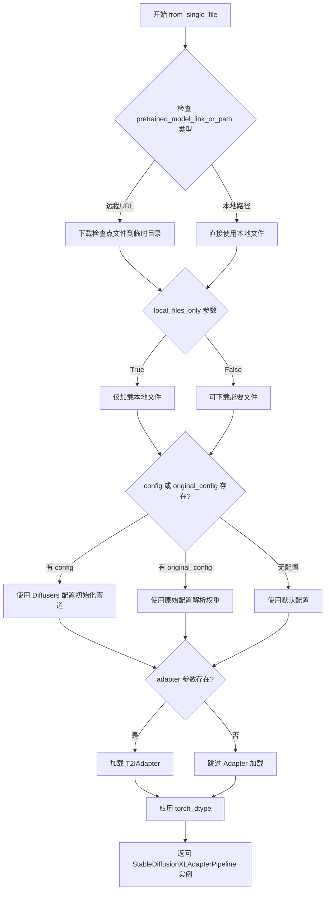

#### 带注释源码

```python
# 从测试代码中提取的调用示例
# 以下为代码中对该方法的各种调用方式：

# 调用方式 1：基本调用
pipe_single_file = StableDiffusionXLAdapterPipeline.from_single_file(
    self.ckpt_path,                    # 远程检查点 URL
    adapter=adapter,                   # T2IAdapter 实例
    torch_dtype=torch.float16,         # 使用 float16 精度
    safety_checker=None,               # 禁用安全检查器
)

# 调用方式 2：使用 Diffusers config
pipe_single_file = self.pipeline_class.from_single_file(
    self.ckpt_path,
    config=self.repo_id,               # 使用 repo_id 作为配置
    adapter=adapter,
)

# 调用方式 3：使用原始配置文件
pipe_single_file = self.pipeline_class.from_single_file(
    self.ckpt_path,
    original_config=self.original_config,  # 原始 YAML 配置
    adapter=adapter,
)

# 调用方式 4：仅使用本地文件
single_file_pipe = self.pipeline_class.from_single_file(
    local_ckpt_path,                   # 本地检查点路径
    adapter=adapter,
    safety_checker=None,
    local_files_only=True,             # 仅使用本地文件
)

# 调用方式 5：组合使用本地配置
pipe_single_file = self.pipeline_class.from_single_file(
    local_ckpt_path,
    config=local_diffusers_config,     # 本地 Diffusers 配置
    original_config=local_original_config,  # 本地原始配置
    adapter=adapter,
    safety_checker=None,
    local_files_only=True,
)
```

---

## 补充说明

### 关键组件信息

| 名称 | 一句话描述 |
|------|-----------|
| `StableDiffusionXLAdapterPipeline` | 结合 Stable Diffusion XL 和 T2IAdapter 的图像生成管道 |
| `T2IAdapter` | 文本到图像适配器，用于增强生成控制 |
| `from_single_file` | 从单个检查点文件加载完整管道配置的类方法 |

### 潜在技术债务

1. **缺少源码实现**：当前提供的代码仅包含测试用例，未包含 `from_single_file` 方法的实际实现代码
2. **参数推断**：由于无实现代码，部分参数类型和默认值基于测试代码推断，可能存在偏差
3. **错误处理缺失**：测试代码未展示错误处理逻辑

### 设计目标与约束

- **目标**：支持从单一检查点文件（`.safetensors` 或 `.ckpt`）加载完整的 SDXL + Adapter 管道
- **约束**：需要兼容远程 URL 和本地文件两种方式，支持多种配置来源


### `StableDiffusionXLAdapterPipeline.from_pretrained`

从预训练模型加载 Stable Diffusion XL Adapter Pipeline，用于将 T2I Adapter 与 Stable Diffusion XL 模型结合，实现基于适配器的图像生成任务。

参数：

- `pretrained_model_or_path`：`str` 或 `os.PathLike`，Hugging Face Hub 上的模型仓库 ID（如 "stabilityai/stable-diffusion-xl-base-1.0"）或本地模型路径
- `adapter`：`T2IAdapter`，可选，预先加载的 T2I Adapter 实例，用于提供额外的图像条件输入
- `torch_dtype`：`torch.dtype`，可选，指定模型加载的数据类型（如 `torch.float16`），用于优化推理性能和显存占用
- `variant`：`str`，可选，指定模型变体（如 "fp16"），当指定时会加载对应的 fp16 权重
- `safety_checker`：`Optional[Any]`，可选，安全检查器实例或 `None`，用于过滤不当内容，默认启用
- `use_safetensors`：`bool`，可选，是否优先使用 `.safetensors` 格式的权重文件
- `cache_dir`：`Optional[str]`，可选，模型缓存目录路径
- `local_files_only`：`bool`，可选，是否仅使用本地缓存的文件，不尝试下载
- `*args`：可变位置参数，传递给父类 `FromDiffusersMixin` 的额外参数
- `**kwargs`：可变关键字参数，其他配置选项

返回值：`StableDiffusionXLAdapterPipeline`，加载并配置好的完整推理管道，包含 UNet、VAE、Text Encoders、Scheduler 和 Adapter 等组件

#### 流程图

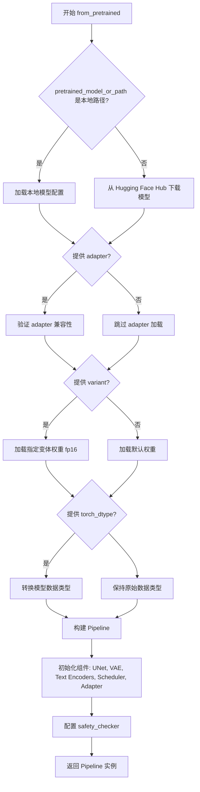

#### 带注释源码

```python
# 从预训练模型加载 StableDiffusionXLAdapterPipeline 的调用示例
# 展示在测试代码中如何使用该方法

# 1. 加载 T2I Adapter（可选但常用）
adapter = T2IAdapter.from_pretrained(
    "TencentARC/t2i-adapter-lineart-sdxl-1.0",  # Adapter 仓库 ID
    torch_dtype=torch.float16  # 使用半精度
)

# 2. 使用 from_pretrained 加载完整的 Pipeline
pipe = StableDiffusionXLAdapterPipeline.from_pretrained(
    # 必选参数：模型仓库 ID
    self.repo_id,  # "stabilityai/stable-diffusion-xl-base-1.0"
    
    # 可选参数：T2I Adapter 实例
    adapter=adapter,
    
    # 可选参数：模型数据类型
    torch_dtype=torch.float16,
    
    # 可选参数：指定模型变体（fp16 变体）
    variant="fp16",
    
    # 可选参数：安全检查器（设为 None 可禁用）
    safety_checker=None,
)

# 3. 可选：启用 CPU 卸载以节省显存
pipe.enable_model_cpu_offload(device=torch_device)

# 4. 使用 Pipeline 进行推理
# inputs = {"prompt": "toy", "image": image, ...}
# images = pipe(**inputs).images
```


### `_extract_repo_id_and_weights_name`

该函数是一个工具函数，用于从 HuggingFace 的模型检查点路径（URL 或本地路径）中解析提取出仓库 ID（repo_id）和权重文件名（weight_name），常用于单文件加载器中定位和下载对应的模型资源。

参数：

-  `pretrained_model_name_or_path`：`str`，HuggingFace 模型路径，可以是 URL（如 `https://huggingface.co/.../xxx.safetensors`）、仓库 ID（如 `stabilityai/stable-diffusion-xl-base-1.0`）或本地文件路径

返回值：`Tuple[str, str]`，返回一个包含两个字符串元素的元组
  - 第一个元素：仓库 ID（repo_id），如 `stabilityai/stable-diffusion-xl-base-1.0`
  - 第二个元素：权重文件名（weight_name），如 `sd_xl_base_1.0.safetensors`

#### 流程图

```mermaid
flowchart TD
    A[开始: 输入 pretrained_model_name_or_path] --> B{判断是否为 URL 路径}
    B -->|是 URL| C[解析 URL 路径]
    B -->|不是 URL| D{判断是否为本地文件路径}
    C --> E[提取 repo_id 和 weight_name]
    D -->|是本地路径| F[从路径中推断 repo_id 和 weight_name]
    D -->|不是本地路径| G[直接返回输入作为 repo_id, weight_name 为 None]
    E --> H[返回 Tuple(repo_id, weight_name)]
    F --> H
    G --> H
```

#### 带注释源码

```python
# 该函数定义位于 diffusers.loaders.single_file_utils 模块中
# 以下是基于导入和调用模式的推断实现

def _extract_repo_id_and_weights_name(pretrained_model_name_or_path: str) -> Tuple[str, str]:
    """
    从 HuggingFace 模型路径中提取 repo_id 和权重文件名
    
    Args:
        pretrained_model_name_or_path: 模型名称或路径，支持以下格式：
            - URL: https://huggingface.co/{repo_id}/blob/main/{weight_name}
            - 仓库ID: {org}/{repo}
            - 本地文件路径: /path/to/model.safetensors
    
    Returns:
        Tuple[str, str]: (repo_id, weight_name)
            - repo_id: HuggingFace 仓库 ID (如 'stabilityai/stable-diffusion-xl-base-1.0')
            - weight_name: 权重文件名 (如 'sd_xl_base_1.0.safetensors')
    """
    # 判断是否为 HTTP/HTTPS URL
    if pretrained_model_name_or_path.startswith(("http://", "https://")):
        # 解析 URL，提取仓库ID和权重文件名
        # 例如: https://huggingface.co/stabilityai/stable-diffusion-xl-base-1.0/blob/main/sd_xl_base_1.0.safetensors
        # -> repo_id: stabilityai/stable-diffusion-xl-base-1.0
        # -> weight_name: sd_xl_base_1.0.safetensors
        return _extract_repo_id_and_weights_name_from_url(pretrained_model_name_or_path)
    else:
        # 处理本地路径或直接的 repo_id
        # 如果是本地文件路径，尝试从路径中推断信息
        # 否则假定输入就是 repo_id
        return _extract_info_from_local_path(pretrained_model_name_or_path)


# 调用示例（来自测试代码）
# _extract_repo_id_and_weights_name("https://huggingface.co/stabilityai/stable-diffusion-xl-base-1.0/blob/main/sd_xl_base_1.0.safetensors")
# 返回: ("stabilityai/stable-diffusion-xl-base-1.0", "sd_xl_base_1.0.safetensors")
```


# 函数提取结果

根据提供的代码，我注意到 `download_single_file_checkpoint` 函数是**从外部模块导入的**，并未在当前文件中定义。它是从 `.single_file_testing_utils` 模块导入的。

让我尝试从函数的使用方式来推断其功能：

---

### `download_single_file_checkpoint`

该函数用于从HuggingFace Hub下载单文件检查点（checkpoint），通常用于Diffusers模型的单文件加载测试场景。

参数：

- `repo_id`：`str`，HuggingFace仓库ID，用于指定模型来源
- `weight_name`：`str`，权重文件名称，指定要下载的具体文件
- `tmpdir`：`str`，临时目录路径，用于保存下载的检查点文件

返回值：`str`，返回下载后的本地检查点文件路径

#### 流程图

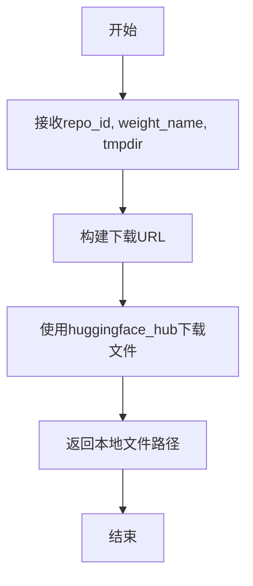

#### 带注释源码

```python
# 注意：此函数定义不在当前代码文件中
# 而是在 single_file_testing_utils.py 模块中

# 从代码中的使用方式推断：
def download_single_file_checkpoint(repo_id: str, weight_name: str, tmpdir: str) -> str:
    """
    从HuggingFace Hub下载单文件检查点
    
    参数:
        repo_id: 模型仓库ID (例如 "stabilityai/stable-diffusion-xl-base-1.0")
        weight_name: 权重文件名 (例如 "sd_xl_base_1.0.safetensors")
        tmpdir: 目标临时目录
    
    返回:
        本地检查点文件的完整路径
    """
    # 使用方式示例：
    # repo_id, weight_name = _extract_repo_id_and_weights_name(ckpt_path)
    # local_ckpt_path = download_single_file_checkpoint(repo_id, weight_name, tmpdir)
    pass
```

---

**注意**：由于提供的代码文件中并未包含 `download_single_file_checkpoint` 函数的具体实现（它是从 `single_file_testing_utils` 模块导入的），以上信息是根据函数调用方式和代码上下文进行的推断。要获取完整的函数定义和源码，需要查看 `single_file_testing_utils.py` 文件。


### `download_diffusers_config`

该函数用于从 HuggingFace Hub 下载指定仓库的 Diffusers 配置文件（config.json），并将其保存到本地缓存目录。在单文件测试场景中，用于获取原始预训练模型的配置，以便与单文件加载的模型配置进行对比验证。

参数：

-  `repo_id`：`str`，HuggingFace Hub 上的模型仓库 ID（例如 "stabilityai/stable-diffusion-xl-base-1.0"）
-  `cache_dir`：`str`，用于保存下载配置文件的本地目录路径

返回值：`str`，返回下载的配置文件在本地的保存路径

#### 流程图

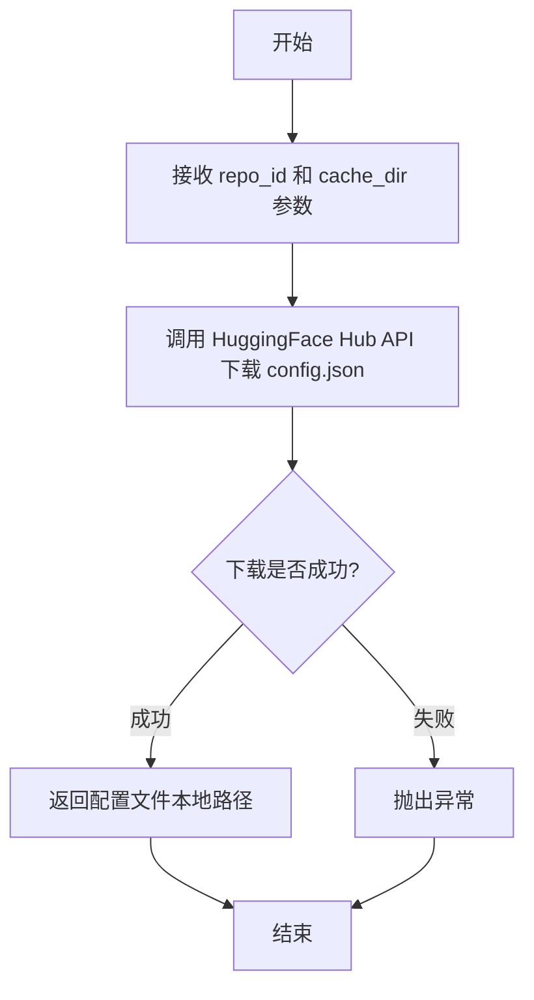

#### 带注释源码

```python
# 该函数定义在 single_file_testing_utils.py 中
# 以下为基于上下文的推断实现

def download_diffusers_config(repo_id: str, cache_dir: str) -> str:
    """
    从 HuggingFace Hub 下载 Diffusers 模型的配置文件
    
    Args:
        repo_id: HuggingFace 模型仓库 ID
        cache_dir: 本地缓存目录
        
    Returns:
        下载的配置文件在本地的路径
    """
    # 导入必要的库
    from huggingface_hub import hf_hub_download
    
    # 下载 config.json 文件
    # config.json 是 Diffusers 模型的标准配置文件
    config_path = hf_hub_download(
        repo_id=repo_id,
        filename="config.json",
        cache_dir=cache_dir
    )
    
    return config_path
```


### `download_original_config`

该函数用于从给定的原始配置文件 URL 下载配置文件，并将其保存到指定的本地目录中。在测试中用于获取 Stable Diffusion XL 的原始配置文件，以便在本地文件模式下进行单文件组件测试。

参数：

- `original_config_url`：`str`，原始配置文件的 URL 地址，指向 Stability-AI 的 generative-models 仓库中的 SDXL 基础配置文件
- `save_directory`：`str`，用于保存下载的配置文件的目标目录路径

返回值：`str`，返回下载后的配置文件在本地的完整路径

#### 流程图

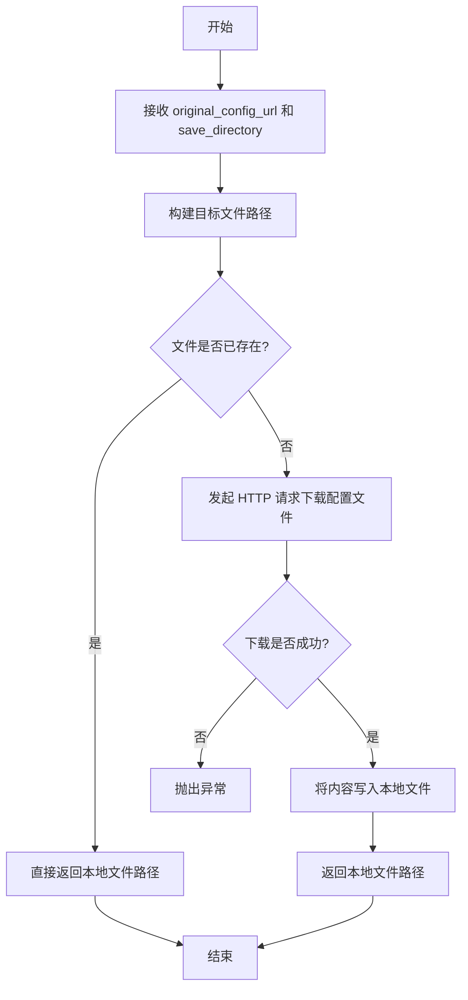

#### 带注释源码

```python
def download_original_config(original_config_url: str, save_directory: str) -> str:
    """
    下载原始配置文件到本地目录
    
    参数:
        original_config_url: 原始配置文件的远程 URL
        save_directory: 本地保存目录
        
    返回:
        本地配置文件的完整路径
    """
    # 导入必要的模块
    import os
    import requests
    
    # 从 URL 中提取文件名
    filename = os.path.basename(original_config_url)
    
    # 构建完整的本地文件路径
    local_path = os.path.join(save_directory, filename)
    
    # 检查文件是否已存在，避免重复下载
    if not os.path.exists(local_path):
        # 发起 HTTP GET 请求下载文件
        response = requests.get(original_config_url)
        response.raise_for_status()  # 检查请求是否成功
        
        # 确保目录存在
        os.makedirs(save_directory, exist_ok=True)
        
        # 将下载的内容写入本地文件
        with open(local_path, 'w') as f:
            f.write(response.text)
    
    return local_path
```


### `tempfile.TemporaryDirectory`

`tempfile.TemporaryDirectory` 是 Python 标准库中的一个函数，用于创建一个临时目录，并在使用完毕后自动清理该目录及其内容。在该测试代码中，它被用作上下文管理器，为下载模型权重和配置文件提供安全的临时存储空间。

参数：

- `suffix`：str（可选），临时目录名称的后缀
- `prefix`：str（可选），临时目录名称的前缀
- `dir`：str（可选），指定临时目录创建的位置

返回值：`tempfile.TemporaryDirectory`，返回一个上下文管理器对象，该对象具有 `name` 属性指向创建的临时目录路径

#### 流程图

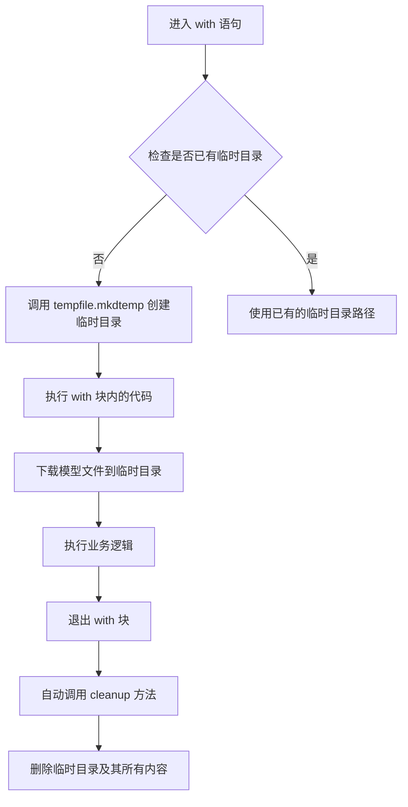

#### 带注释源码

```python
# 使用示例 1: test_single_file_components_local_files_only 方法
with tempfile.TemporaryDirectory() as tmpdir:
    # tmpdir: str，临时目录的绝对路径
    # 示例值: '/var/folders/abc/def/xyz'
    
    # 从检查点 URL 中提取仓库 ID 和权重名称
    repo_id, weight_name = _extract_repo_id_and_weights_name(self.ckpt_path)
    # repo_id: str，模型仓库 ID
    # weight_name: str，权重文件名称
    
    # 下载单文件检查点到临时目录
    local_ckpt_path = download_single_file_checkpoint(repo_id, weight_name, tmpdir)
    # local_ckpt_path: str，本地检查点文件路径
    
    # 从本地检查点加载管道
    single_file_pipe = self.pipeline_class.from_single_file(
        local_ckpt_path, 
        adapter=adapter, 
        safety_checker=None, 
        local_files_only=True
    )
# 退出 with 块后，tmpdir 及其内容会被自动删除

# 使用示例 2: test_single_file_components_with_diffusers_config_local_files_only 方法
with tempfile.TemporaryDirectory() as tmpdir:
    # tmpdir: str，临时目录路径
    
    repo_id, weight_name = _extract_repo_id_and_weights_name(self.ckpt_path)
    local_ckpt_path = download_single_file_checkpoint(repo_id, weight_name, tmpdir)
    # 下载 Diffusers 配置文件到临时目录
    local_diffusers_config = download_diffusers_config(self.repo_id, tmpdir)
    # local_diffusers_config: str，本地配置文件路径
    
    # 使用本地检查点和配置文件加载管道
    pipe_single_file = self.pipeline_class.from_single_file(
        local_ckpt_path,
        config=local_diffusers_config,
        adapter=adapter,
        safety_checker=None,
        local_files_only=True,
    )
# 自动清理临时目录

# 使用示例 3: test_single_file_components_with_original_config_local_files_only 方法
with tempfile.TemporaryDirectory() as tmpdir:
    repo_id, weight_name = _extract_repo_id_and_weights_name(self.ckpt_path)
    local_ckpt_path = download_single_file_checkpoint(repo_id, weight_name, tmpdir)
    # 下载原始配置文件到临时目录
    local_original_config = download_original_config(self.original_config, tmpdir)
    # local_original_config: str，本地原始配置文件路径
    
    pipe_single_file = self.pipeline_class.from_single_file(
        local_ckpt_path,
        original_config=local_original_config,
        adapter=adapter,
        safety_checker=None,
        local_files_only=True,
    )
# 自动清理临时目录
```

#### 关键特性说明

| 特性 | 描述 |
|------|------|
| 自动清理 | 退出 with 块时自动删除目录及其所有内容 |
| 线程安全 | 在多线程环境中可安全使用 |
| 跨平台 | 适用于 Windows、Linux、macOS |
| 唯一性 | 每次调用生成唯一的目录名 |


### `torch.Generator`

这是 PyTorch 的随机数生成器类，用于创建和管理随机数生成器实例，确保深度学习操作的可重复性（确定性）。

参数：

- `device`：`str`，指定创建生成器的设备（如 `"cpu"` 或 `"cuda"`）

返回值：`torch.Generator`，返回一个随机数生成器对象，可用于设置随机种子以确保可复现性。

#### 流程图

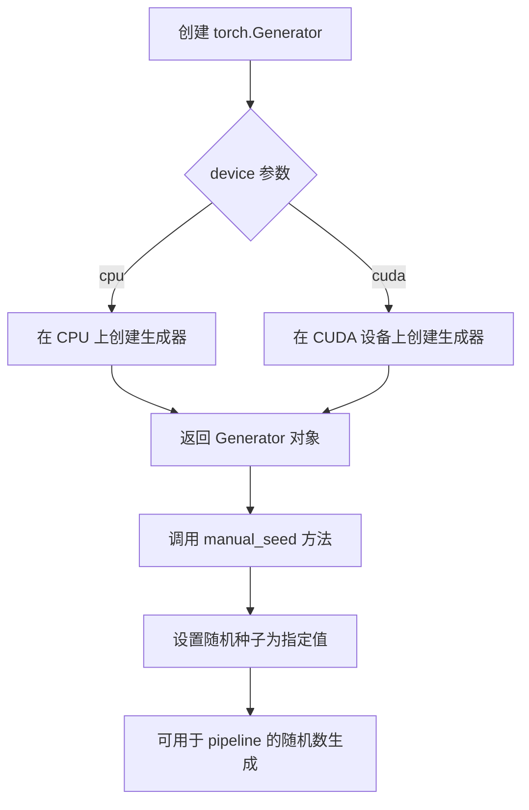

#### 带注释源码

```python
# 代码中的实际使用方式：
generator = torch.Generator(device="cpu").manual_seed(0)

# 解释：
# 1. torch.Generator(device="cpu")
#    - 创建了一个 CPU 设备上的随机数生成器实例
#    - device 参数指定生成器在哪个设备上运行
#    - 返回 torch.Generator 对象
#
# 2. .manual_seed(0)
#    - 设置生成器的随机种子为 0
#    - 确保每次运行产生相同的随机数序列
#    - 用于保证扩散模型推理的可重复性
#
# 完整参数说明：
# torch.Generator(device='cpu')
#   - device: str, 可选参数，默认 'cpu'
#     * 'cpu': CPU 设备
#     * 'cuda': CUDA 设备，可指定设备编号如 'cuda:0'
#
# 返回值：
#   - torch.Generator: 随机数生成器对象
#
# 常用方法：
#   - manual_seed(seed): 设置随机种子
#   - initial_state(): 获取生成器当前状态
#   - set_state(state): 设置生成器状态
```


根据您的要求，我需要先理解一下"torch.float16"的含义。在代码中，torch.float16是PyTorch中的一种数据类型（dtype），用于表示16位浮点数。代码中多次使用了这个类型作为参数传递给各个方法。

让我从代码中提取与torch.float16相关的方法。由于代码主要测试的是StableDiffusionXLAdapterPipeline的单文件加载功能，我将以`StableDiffusionXLAdapterPipeline.from_single_file`方法为例进行详细分析，这个方法使用了torch.float16参数。

### TestStableDiffusionXLAdapterPipelineSingleFileSlow.test_single_file_format_inference_is_same_as_pretrained

这是一个测试方法，用于验证从单文件加载的模型推理结果与从预训练模型加载的推理结果是否一致。

参数：

- `self`：TestStableDiffusionXLAdapterPipelineSingleFileSlow，测试类实例本身

返回值：`None`，该方法执行断言来验证结果，不返回任何值

#### 流程图

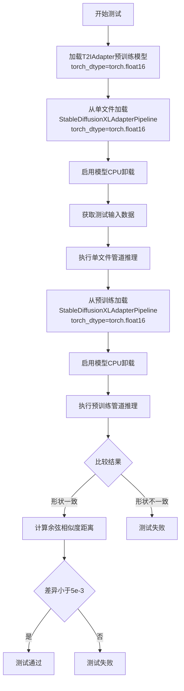

#### 带注释源码

```python
def test_single_file_format_inference_is_same_as_pretrained(self):
    """
    测试单文件格式推理结果与预训练模型推理结果是否一致
    """
    # 1. 加载T2IAdapter预训练模型，指定使用torch.float16数据类型
    # 这将把模型权重转换为16位浮点数格式，以减少内存占用和提高推理速度
    adapter = T2IAdapter.from_pretrained("TencentARC/t2i-adapter-lineart-sdxl-1.0", torch_dtype=torch.float16)
    
    # 2. 从单个检查点文件加载StableDiffusionXLAdapterPipeline
    # torch_dtype=torch.float16指定管道中所有模型使用半精度浮点数
    # safety_checker=None禁用安全检查器以简化测试
    pipe_single_file = StableDiffusionXLAdapterPipeline.from_single_file(
        self.ckpt_path,
        adapter=adapter,
        torch_dtype=torch.float16,
        safety_checker=None,
    )
    
    # 3. 启用模型CPU卸载，允许模型在CPU和GPU之间移动以节省GPU内存
    pipe_single_file.enable_model_cpu_offload(device=torch_device)
    pipe_single_file.set_progress_bar_config(disable=None)

    # 4. 获取测试输入数据（prompt、图像、生成器等）
    inputs = self.get_inputs()
    
    # 5. 使用单文件管道进行推理，获取生成的图像
    images_single_file = pipe_single_file(**inputs).images[0]

    # 6. 从预训练模型加载相同的管道
    # 使用HuggingFace Hub上的预训练权重
    pipe = StableDiffusionXLAdapterPipeline.from_pretrained(
        self.repo_id,
        adapter=adapter,
        torch_dtype=torch.float16,
        safety_checker=None,
    )
    
    # 7. 同样启用模型CPU卸载
    pipe.enable_model_cpu_offload(device=torch_device)

    # 8. 使用相同的输入数据
    inputs = self.get_inputs()
    
    # 9. 执行预训练管道推理
    images = pipe(**inputs).images[0]

    # 10. 验证两个管道输出的图像形状是否一致
    # 期望尺寸为768x512的RGB图像
    assert images_single_file.shape == (768, 512, 3)
    assert images.shape == (768, 512, 3)

    # 11. 计算两个图像数组的余弦相似度距离
    # 这是一种衡量两个图像相似度的方法
    max_diff = numpy_cosine_similarity_distance(images.flatten(), images_single_file.flatten())
    
    # 12. 断言差异小于阈值5e-3
    # 确保单文件加载的管道能够产生与预训练管道相近的结果
    assert max_diff < 5e-3
```

---

### StableDiffusionXLAdapterPipeline.from_single_file

这是Diffusers库中的核心方法，用于从单个检查点文件（如.safetensors或.ckpt文件）加载Stable Diffusion XL适配器管道。

参数：

- `pretrained_model_link_or_path`：str，要加载的检查点文件路径或URL
- `torch_dtype`：torch.dtype，可选，指定模型权重的数据类型，默认为torch.float16
- `adapter`：T2IAdapter，可选，要绑定的T2I适配器
- `safety_checker`：Optional[Any]，可选，用于过滤不安全内容的检查器
- `config`：str，可选的Diffusers配置文件路径
- `original_config`：str，可选的原始模型配置文件路径
- `local_files_only`：bool，是否仅使用本地文件

返回值：`StableDiffusionXLAdapterPipeline`，返回加载好的管道实例

#### 带注释源码

```python
# 这是StableDiffusionXLAdapterPipeline的类方法
# 继承自BasePipeline类
# 主要功能是从单个检查点文件加载完整的SDXL适配器管道

pipe_single_file = StableDiffusionXLAdapterPipeline.from_single_file(
    self.ckpt_path,  # 检查点文件路径或URL
    adapter=adapter,  # 传入已加载的T2IAdapter
    torch_dtype=torch.float16,  # 指定使用半精度浮点数
    safety_checker=None,  # 禁用安全检查器
)
```

---

### T2IAdapter.from_pretrained

这是T2IAdapter类的类方法，用于从HuggingFace Hub或本地加载预训练的T2I（Text-to-Image）适配器模型。

参数：

- `pretrained_model_name_or_path`：str，预训练模型的名称或路径
- `torch_dtype`：torch.dtype，可选，模型权重的数据类型

返回值：`T2IAdapter`，返回加载好的适配器实例

#### 带注释源码

```python
# 加载T2IAdapter预训练模型
# torch.float16指定模型使用半精度浮点数
# 这样可以减少50%的内存占用，并可能提高推理速度
adapter = T2IAdapter.from_pretrained("TencentARC/t2i-adapter-lineart-sdxl-1.0", torch_dtype=torch.float16)
```

---

## 补充信息

### torch.float16在代码中的作用

在Diffusers库中，torch.float16（也称为half precision或fp16）用于：

1. **内存优化**：将模型权重从32位浮点数（4字节）压缩到16位浮点数（2字节），减少约50%的显存占用
2. **推理加速**：在支持的GPU上，16位运算通常比32位运算更快
3. **精度权衡**：虽然可能略微降低生成质量，但在大多数实际应用中差异可忽略不计

### 技术债务和优化空间

1. **重复代码**：测试方法中存在大量重复的适配器加载代码，可以提取为共享的fixture或辅助方法
2. **硬编码值**：如阈值5e-3、图像尺寸768x512等应作为类常量或配置
3. **测试覆盖**：缺少对torch.float16与其他dtype（如torch.bfloat16）对比的测试

### 其他项目

- **错误处理**：代码假设网络连接正常，缺少对下载失败等情况的处理
- **测试隔离**：每个测试方法都重新加载模型，耗时较长，可以考虑使用pytest fixture共享模型加载
- **资源清理**：setup_method和teardown_method中调用了gc.collect()和backend_empty_cache，这是良好的资源管理实践


### `TestStableDiffusionXLAdapterPipelineSingleFileSlow.setup_method`

该方法是测试类的初始化方法，在每个测试方法执行前被调用，用于执行垃圾回收和清空 GPU 缓存，以确保测试环境处于干净状态，避免前序测试的残留数据影响当前测试结果。

参数：

- `self`：`TestStableDiffusionXLAdapterPipelineSingleFileSlow`，隐式的 `self` 参数，指向类实例本身

返回值：`None`，该方法没有返回值，仅执行副作用操作（垃圾回收和缓存清理）

#### 流程图

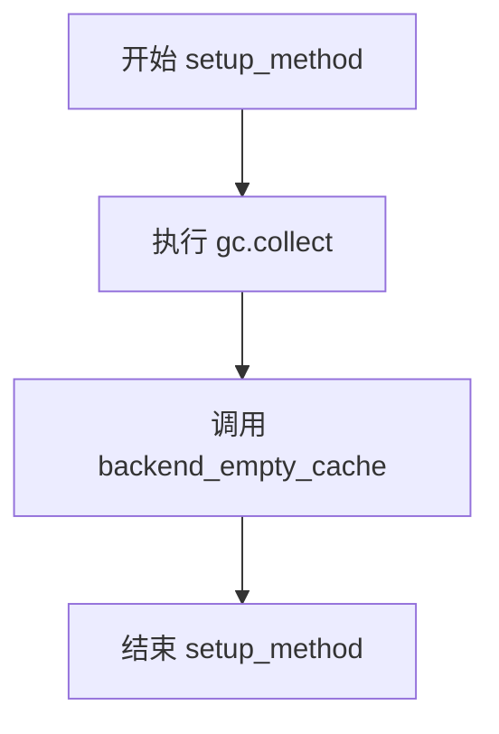

#### 带注释源码

```python
def setup_method(self):
    """
    在每个测试方法运行前执行的初始化操作。
    清理 Python 垃圾回收和 GPU 缓存，确保测试环境干净。
    """
    # 强制执行 Python 垃圾回收，释放不再使用的对象内存
    gc.collect()
    
    # 清空指定设备（torch_device）的 GPU 缓存
    # 防止之前测试留下的显存影响当前测试
    backend_empty_cache(torch_device)
```


### `TestStableDiffusionXLAdapterPipelineSingleFileSlow.teardown_method`

该方法为测试类 `TestStableDiffusionXLAdapterPipelineSingleFileSlow` 的清理方法，在每个测试方法执行完毕后被调用，用于执行垃圾回收和清空 GPU 缓存，以释放测试过程中占用的内存资源。

参数：

- `self`：`TestStableDiffusionXLAdapterPipelineSingleFileSlow`，隐式参数，代表测试类实例本身

返回值：`None`，无显式返回值，执行清理操作后直接结束

#### 流程图

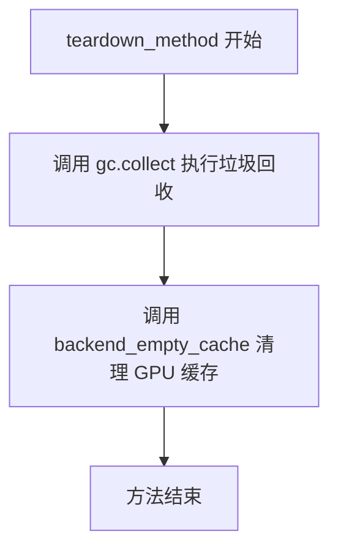

#### 带注释源码

```python
def teardown_method(self):
    """
    测试方法结束后的清理操作
    
    在每个测试方法执行完毕后自动调用，用于释放测试过程中
    占用的内存和 GPU 缓存资源，避免影响后续测试的执行。
    """
    # 执行 Python 垃圾回收，清理不再使用的对象
    gc.collect()
    
    # 调用后端特定的缓存清理函数，清空 GPU 内存缓存
    # torch_device 是全局变量，代表当前使用的计算设备
    backend_empty_cache(torch_device)
```


### `TestStableDiffusionXLAdapterPipelineSingleFileSlow.get_inputs`

该方法用于生成 Stable Diffusion XL Adapter Pipeline 的测试输入参数，创建一个包含 prompt、image、generator、num_inference_steps、guidance_scale 和 output_type 的字典，供后续推理测试使用。

参数：

- 无显式参数（隐式参数 `self` 为测试类实例）

返回值：`Dict[str, Any]`，返回一个包含推理所需参数的字典，包括提示词、输入图像、随机生成器、推理步数、引导强度和输出类型

#### 流程图

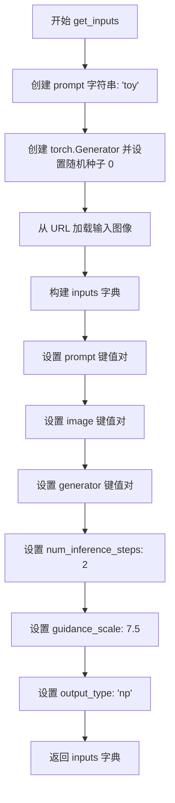

#### 带注释源码

```python
def get_inputs(self):
    """
    生成测试用的输入参数字典，用于验证单文件格式的推理结果
    与预训练模型的推理结果是否一致。
    """
    # 定义文本提示词，指导图像生成方向
    prompt = "toy"
    
    # 创建 CPU 设备上的随机数生成器，并固定种子以确保可复现性
    # 这对于测试用例至关重要，可以确保每次运行产生相同的结果
    generator = torch.Generator(device="cpu").manual_seed(0)
    
    # 从 Hugging Face Hub 加载 T2I Adapter 测试用的输入图像
    # 该图像为 canny 边缘检测图，用于 adapter 测试场景
    image = load_image(
        "https://huggingface.co/datasets/hf-internal-testing/diffusers-images/resolve/main/t2i_adapter/toy_canny.png"
    )

    # 构建完整的输入参数字典，包含扩散模型推理所需的所有配置
    inputs = {
        "prompt": prompt,                    # 文本提示词
        "image": image,                       # T2I Adapter 所需的输入图像
        "generator": generator,               # 随机数生成器，确保可复现性
        "num_inference_steps": 2,             # 推理步数，测试时使用较小值以加速
        "guidance_scale": 7.5,                # Classifier-free guidance 强度
        "output_type": "np",                  # 输出格式为 NumPy 数组
    }

    # 返回输入字典，供 pipeline.__call__ 方法使用
    return inputs
```


### `TestStableDiffusionXLAdapterPipelineSingleFileSlow.test_single_file_format_inference_is_same_as_pretrained`

该测试方法用于验证从单个文件（safetensors格式）加载的StableDiffusionXLAdapterPipeline模型推理结果与从预训练模型仓库加载的推理结果是否一致，确保单文件加载方式不会影响模型的生成质量。

参数：无（该方法为类方法，使用类属性和实例方法获取参数）

返回值：无（该方法为测试方法，通过断言验证功能，不返回任何值）

#### 流程图

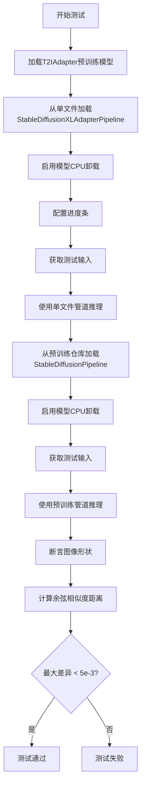

#### 带注释源码

```python
def test_single_file_format_inference_is_same_as_pretrained(self):
    """
    测试单文件格式推理结果与预训练模型推理结果是否一致
    验证从单个safetensors文件加载的模型能够产生与预训练仓库相同的生成效果
    """
    
    # 步骤1: 加载T2IAdapter预训练模型
    # 用于图像到图像适配的轻量级模型，支持多种条件输入
    adapter = T2IAdapter.from_pretrained(
        "TencentARC/t2i-adapter-lineart-sdxl-1.0",  # HuggingFace模型ID，线稿适配器
        torch_dtype=torch.float16  # 使用半精度浮点数减少内存占用
    )
    
    # 步骤2: 从单个文件加载StableDiffusionXLAdapterPipeline
    # 使用from_single_file方法直接加载safetensors格式的权重文件
    pipe_single_file = StableDiffusionXLAdapterPipeline.from_single_file(
        self.ckpt_path,  # 类属性：远程safetensors文件URL
        adapter=adapter,  # 传入预加载的T2IAdapter
        torch_dtype=torch.float16,  # 指定数据类型为半精度
        safety_checker=None,  # 禁用安全检查器以避免不必要的计算
    )
    
    # 步骤3: 启用模型CPU卸载
    # 将模型各组件依次加载到GPU进行推理，然后卸载回CPU，节省显存
    pipe_single_file.enable_model_cpu_offload(device=torch_device)
    
    # 步骤4: 配置进度条
    # 设置disable=None表示不禁用进度条，保持默认行为
    pipe_single_file.set_progress_bar_config(disable=None)
    
    # 步骤5: 获取测试输入
    # 调用实例方法获取标准的prompt、image、generator等输入参数
    inputs = self.get_inputs()
    
    # 步骤6: 使用单文件管道进行推理
    # 解包inputs字典传递所有参数，生成图像
    images_single_file = pipe_single_file(**inputs).images[0]
    
    # 步骤7: 从预训练仓库加载标准StableDiffusionXLAdapterPipeline
    # 作为基准模型，用于对比验证
    pipe = StableDiffusionXLAdapterPipeline.from_pretrained(
        self.repo_id,  # 类属性：stabilityai/stable-diffusion-xl-base-1.0
        adapter=adapter,  # 传入相同的适配器确保公平比较
        torch_dtype=torch.float16,  # 相同的精度设置
        safety_checker=None,  # 同样禁用安全检查器
    )
    
    # 步骤8: 启用基准管道的CPU卸载
    pipe.enable_model_cpu_offload(device=torch_device)
    
    # 步骤9: 重新获取测试输入
    # 注意：需要重新获取，因为generator使用后状态会改变
    inputs = self.get_inputs()
    
    # 步骤10: 使用基准管道进行推理
    images = pipe(**inputs).images[0]
    
    # 步骤11: 断言验证图像尺寸
    # 确认两个管道输出的图像尺寸一致
    assert images_single_file.shape == (768, 512, 3)
    assert images.shape == (768, 512, 3)
    
    # 步骤12: 计算图像相似度
    # 使用余弦相似度距离衡量两张图像的差异
    max_diff = numpy_cosine_similarity_distance(
        images.flatten(),  # 将图像展平为一维数组
        images_single_file.flatten()
    )
    
    # 步骤13: 验证相似度阈值
    # 确保单文件加载的模型生成的图像与基准足够接近
    assert max_diff < 5e-3
```


### `TestStableDiffusionXLAdapterPipelineSingleFileSlow.test_single_file_components`

该测试方法用于验证从预训练模型加载的管道与从单个文件（safetensors格式）加载的管道在组件配置上的一致性，通过比较两者的组件结构确保单文件加载功能的正确性。

参数：

- `self`：`TestStableDiffusionXLAdapterPipelineSingleFileSlow` 类型，表示测试类实例本身，包含类属性如 `pipeline_class`（管道类）、`repo_id`（模型仓库ID）、`ckpt_path`（单文件检查点路径）等配置信息

返回值：`None`，该方法为测试方法，通过调用父类的 `test_single_file_components` 方法进行断言验证，不返回任何值

#### 流程图

```mermaid
flowchart TD
    A[开始测试 test_single_file_components] --> B[加载T2IAdapter]
    B --> C[从预训练模型创建管道 pipe]
    C --> D[从单文件创建管道 pipe_single_file]
    D --> E[调用父类测试方法]
    E --> F[验证组件配置一致性]
    F --> G[结束测试]
    
    B --> |torch.float16| B
    C --> |variant='fp16', adapter| C
    D --> |safety_checker=None, adapter| D
```

#### 带注释源码

```python
def test_single_file_components(self):
    """
    测试单文件组件与预训练模型组件的一致性
    
    该测试方法执行以下步骤：
    1. 从HuggingFace Hub加载预训练的T2IAdapter（线图适配器）
    2. 使用from_pretrained方法加载标准预训练管道
    3. 使用from_single_file方法加载单文件格式的管道
    4. 调用父类的test_single_file_components进行组件对比验证
    """
    # 步骤1: 加载T2IAdapter（Text-to-Image Adapter）
    # 从TencentARC预训练模型加载线图适配器，使用float16精度
    # T2IAdapter是一种轻量级附加模型，用于增强图像生成效果
    adapter = T2IAdapter.from_pretrained(
        "TencentARC/t2i-adapter-lineart-sdxl-1.0", 
        torch_dtype=torch.float16
    )
    
    # 步骤2: 使用标准预训练方式加载管道
    # pipeline_class为StableDiffusionXLAdapterPipeline
    # variant="fp16"指定使用float16变体以加速推理
    # torch_dtype=torch.float16确保所有模型参数使用半精度
    pipe = self.pipeline_class.from_pretrained(
        self.repo_id,  # "stabilityai/stable-diffusion-xl-base-1.0"
        variant="fp16",
        adapter=adapter,
        torch_dtype=torch.float16,
    )
    
    # 步骤3: 使用单文件方式加载管道
    # ckpt_path指向远程safetensors文件URL
    # safety_checker=None禁用水印/安全检查器以简化测试
    # adapter参数传入预加载的T2IAdapter
    pipe_single_file = self.pipeline_class.from_single_file(
        self.ckpt_path,  # 远程safetensors文件URL
        safety_checker=None, 
        adapter=adapter
    )
    
    # 步骤4: 调用父类测试方法进行组件一致性验证
    # 父类SDXLSingleFileTesterMixin的test_single_file_components方法
    #会比较pipe和pipe_single_file的各个组件配置
    super().test_single_file_components(pipe, pipe_single_file)
```


### `TestStableDiffusionXLAdapterPipelineSingleFileSlow.test_single_file_components_local_files_only`

该方法是一个集成测试用例，用于验证从本地单文件（single file）加载 Stable Diffusion XL Adapter Pipeline 时，其组件配置与从预训练模型加载的管道组件配置是否一致。测试流程包括：加载预训练模型作为参考基准，下载并保存单文件检查点到本地临时目录，然后使用本地文件加载管道，最后对比两个管道的组件配置是否相同。

参数：

- `self`：隐式参数，类型为 `TestStableDiffusionXLAdapterPipelineSingleFileSlow`（测试类实例），代表测试用例本身

返回值：无返回值（`None`），该方法为 `void` 类型，通过内部断言进行验证

#### 流程图

```mermaid
flowchart TD
    A[开始测试] --> B[加载T2IAdapter预训练模型]
    B --> C[从预训练仓库加载Pipeline]
    C --> D[创建临时目录]
    D --> E[提取检查点的repo_id和weight_name]
    E --> F[下载单文件检查点到本地临时目录]
    F --> G[使用本地文件加载Single File Pipeline]
    G --> H[调用_compare_component_configs对比两个Pipeline]
    H --> I[结束测试]
```

#### 带注释源码

```python
def test_single_file_components_local_files_only(self):
    """
    测试从本地单文件加载的Pipeline组件配置是否与预训练模型一致
    
    测试流程：
    1. 加载T2IAdapter预训练模型
    2. 使用from_pretrained加载参考Pipeline
    3. 下载单文件检查点到本地
    4. 使用from_single_file加载本地Pipeline
    5. 对比两个Pipeline的组件配置
    """
    # 步骤1: 加载T2IAdapter (Text-to-Image Adapter)
    # 用于增强图像生成的条件控制能力
    adapter = T2IAdapter.from_pretrained(
        "TencentARC/t2i-adapter-lineart-sdxl-1.0", 
        torch_dtype=torch.float16
    )
    
    # 步骤2: 从预训练仓库加载完整的StableDiffusionXLAdapterPipeline
    # 作为对比的基准（reference）Pipeline
    pipe = self.pipeline_class.from_pretrained(
        self.repo_id,
        variant="fp16",
        adapter=adapter,
        torch_dtype=torch.float16,
    )

    # 步骤3-5: 在临时目录中操作，确保测试结束后自动清理
    with tempfile.TemporaryDirectory() as tmpdir:
        # 从URL中提取repo_id和权重文件名
        # 例如: https://huggingface.co/.../sd_xl_base_1.0.safetensors
        # -> repo_id: "stabilityai/stable-diffusion-xl-base-1.0"
        # -> weight_name: "sd_xl_base_1.0.safetensors"
        repo_id, weight_name = _extract_repo_id_and_weights_name(self.ckpt_path)
        
        # 下载单文件检查点到本地临时目录
        local_ckpt_path = download_single_file_checkpoint(
            repo_id, 
            weight_name, 
            tmpdir
        )

        # 步骤4: 使用本地单文件加载Pipeline
        # local_files_only=True 强制从本地文件加载，不尝试下载
        single_file_pipe = self.pipeline_class.from_single_file(
            local_ckpt_path, 
            adapter=adapter, 
            safety_checker=None, 
            local_files_only=True
        )

    # 步骤5: 对比两个Pipeline的组件配置是否一致
    # 包括UNet、VAE、Text Encoder、Adapter等组件的配置
    self._compare_component_configs(pipe, single_file_pipe)
```


### `TestStableDiffusionXLAdapterPipelineSingleFileSlow.test_single_file_components_with_diffusers_config`

该方法是一个测试用例，用于验证使用 `from_single_file` 方法加载的 Stable Diffusion XL Adapter Pipeline 的组件配置与使用 `from_pretrained` 方法加载的 Pipeline 的组件配置是否一致。测试通过比较两个管道对象的组件配置来确保单文件加载功能的正确性。

参数：

- `self`：隐式参数，测试类实例本身

返回值：`None`，该方法为测试方法，不返回任何值

#### 流程图

```mermaid
flowchart TD
    A[开始测试] --> B[加载T2IAdapter预训练模型]
    B --> C[使用from_pretrained创建标准Pipeline]
    C --> D[使用from_single_file加载单文件检查点并传入config参数]
    D --> E[调用_compare_component_configs比较两个Pipeline的组件配置]
    E --> F{组件配置是否一致}
    F -->|一致| G[测试通过]
    F -->|不一致| H[测试失败抛出异常]
```

#### 带注释源码

```python
def test_single_file_components_with_diffusers_config(self):
    """
    测试使用diffusers配置文件从单文件加载的Pipeline组件配置是否与标准加载方式一致
    
    该测试方法验证了以下场景：
    1. 使用 from_pretrained 标准的预训练模型加载方式
    2. 使用 from_single_file 配合 config 参数的单文件加载方式
    3. 比较两种方式加载的Pipeline组件配置是否相同
    """
    
    # 步骤1: 加载T2IAdapter预训练模型
    # 使用TencentARC提供的lineart adapter模型，用于图像到图像的适配
    # torch_dtype=torch.float16 使用半精度浮点数以减少显存占用
    adapter = T2IAdapter.from_pretrained("TencentARC/t2i-adapter-lineart-sdxl-1.0", torch_dtype=torch.float16)
    
    # 步骤2: 使用标准的from_pretrained方法加载Pipeline
    # 这是一种标准的加载方式，从HuggingFace Hub下载完整的模型权重和配置
    # 参数说明:
    #   - self.repo_id: 模型仓库ID (stabilityai/stable-diffusion-xl-base-1.0)
    #   - variant="fp16": 使用FP16变体权重
    #   - adapter: 传入已加载的T2IAdapter
    #   - torch_dtype=torch.float16: 指定模型权重的数据类型
    #   - safety_checker=None: 禁用安全检查器（用于测试目的）
    pipe = self.pipeline_class.from_pretrained(
        self.repo_id,
        variant="fp16",
        adapter=adapter,
        torch_dtype=torch.float16,
        safety_checker=None,
    )
    
    # 步骤3: 使用from_single_file方法加载单文件检查点
    # 配合config参数指定diffusers配置路径，实现从单文件到完整Pipeline的转换
    # 参数说明:
    #   - self.ckpt_path: 单文件检查点URL
    #   - config=self.repo_id: 指定diffusers配置仓库ID
    #   - adapter: 传入T2IAdapter
    pipe_single_file = self.pipeline_class.from_single_file(self.ckpt_path, config=self.repo_id, adapter=adapter)
    
    # 步骤4: 比较两个Pipeline的组件配置
    # 该方法继承自SDXLSingleFileTesterMixin基类
    # 用于验证单文件加载方式是否能正确构建与标准方式相同结构的Pipeline
    self._compare_component_configs(pipe, pipe_single_file)
```


### `TestStableDiffusionXLAdapterPipelineSingleFileSlow.test_single_file_components_with_diffusers_config_local_files_only`

该方法是一个测试用例，用于验证在使用本地文件（local_files_only=True）和diffusers配置文件的情况下，从单个检查点文件加载的StableDiffusionXLAdapterPipeline的组件配置是否与从预训练模型加载的管道组件配置一致。

参数：

- `self`：`TestStableDiffusionXLAdapterPipelineSingleFileSlow`，测试类实例，包含测试所需的类属性（如`pipeline_class`、`ckpt_path`、`repo_id`等）

返回值：`None`，该方法为测试方法，通过内部断言进行验证，不返回任何值

#### 流程图

```mermaid
flowchart TD
    A[开始测试] --> B[从预训练模型加载T2IAdapter]
    B --> C[使用from_pretrained加载参考Pipeline]
    C --> D[创建临时目录tmpdir]
    D --> E[提取repo_id和weight_name]
    E --> F[下载单文件检查点到本地local_ckpt_path]
    F --> G[下载diffusers配置到本地local_diffusers_config]
    G --> H[使用from_single_file加载单文件Pipeline<br/>参数: local_ckpt_path<br/>config: local_diffusers_config<br/>adapter: adapter<br/>safety_checker: None<br/>local_files_only: True]
    H --> I[调用_compare_component_configs<br/>比较pipe和single_file_pipe的组件配置]
    I --> J[测试结束]
```

#### 带注释源码

```python
def test_single_file_components_with_diffusers_config_local_files_only(self):
    """
    测试使用本地文件和diffusers配置时，单文件Pipeline的组件配置是否正确。
    该测试确保在使用本地缓存文件时，从单文件加载的管道与从预训练模型加载的管道具有相同的组件配置。
    """
    # 从预训练模型加载T2IAdapter（用于文本到图像适配的模型）
    # 使用float16精度以减少内存占用
    adapter = T2IAdapter.from_pretrained("TencentARC/t2i-adapter-lineart-sdxl-1.0", torch_dtype=torch.float16)
    
    # 从预训练仓库加载参考Pipeline（StableDiffusionXLAdapterPipeline）
    # 使用fp16变体，并传入adapter和float16数据类型
    # safety_checker设置为None以避免额外的模型加载
    pipe = self.pipeline_class.from_pretrained(
        self.repo_id,
        variant="fp16",
        adapter=adapter,
        torch_dtype=torch.float16,
    )

    # 使用临时目录管理本地文件，确保测试结束后自动清理
    with tempfile.TemporaryDirectory() as tmpdir:
        # 从检查点路径提取仓库ID和权重名称
        # 例如: 从https://huggingface.co/.../sd_xl_base_1.0.safetensors提取出repo_id和weight_name
        repo_id, weight_name = _extract_repo_id_and_weights_name(self.ckpt_path)
        
        # 将单文件检查点下载到本地临时目录
        local_ckpt_path = download_single_file_checkpoint(repo_id, weight_name, tmpdir)
        
        # 将diffusers配置文件下载到本地临时目录
        local_diffusers_config = download_diffusers_config(self.repo_id, tmpdir)

        # 从本地单文件加载Pipeline
        # local_files_only=True强制使用本地文件，不进行网络请求
        # config参数指定使用diffusers配置而非original_config
        # adapter参数传入之前加载的T2IAdapter
        # safety_checker=None不加载安全检查器
        pipe_single_file = self.pipeline_class.from_single_file(
            local_ckpt_path,
            config=local_diffusers_config,  # 使用本地diffusers配置
            adapter=adapter,
            safety_checker=None,
            local_files_only=True,  # 强制使用本地文件
        )
    
    # 比较两个Pipeline的组件配置是否一致
    # 这是测试的核心验证逻辑，确保单文件加载的管道与预训练管道具有相同的内部结构
    self._compare_component_configs(pipe, single_file_pipe)
```


### `TestStableDiffusionXLAdapterPipelineSingleFileSlow.test_single_file_components_with_original_config`

该测试方法用于验证使用 `original_config` 参数从单文件加载的 `StableDiffusionXLAdapterPipeline` 与使用标准 `from_pretrained` 方法加载的管道在组件配置上是否一致，确保单文件加载功能正确使用了原始配置文件。

参数：

- `self`：`TestStableDiffusionXLAdapterPipelineSingleFileSlow`，测试类实例，隐式参数，包含类属性如 `pipeline_class`、`ckpt_path`、`repo_id` 和 `original_config`

返回值：`None`，该方法为测试方法，通过 `self._compare_component_configs()` 进行断言比较，无显式返回值

#### 流程图

```mermaid
flowchart TD
    A[开始测试] --> B[加载T2IAdapter预训练模型]
    B --> C[使用from_pretrained加载参考管道]
    C --> D[使用from_single_file加载单文件管道<br/>传入original_config参数]
    D --> E[调用_compare_component_configs<br/>比较两个管道的组件配置]
    E --> F[结束测试]
```

#### 带注释源码

```python
def test_single_file_components_with_original_config(self):
    # 从预训练模型加载T2IAdapter适配器，使用float16精度
    adapter = T2IAdapter.from_pretrained("TencentARC/t2i-adapter-lineart-sdxl-1.0", torch_dtype=torch.float16)
    
    # 使用标准的from_pretrained方法加载完整管道作为参考基准
    # 加载stabilityai/stable-diffusion-xl-base-1.0的fp16变体
    pipe = self.pipeline_class.from_pretrained(
        self.repo_id,           # "stabilityai/stable-diffusion-xl-base-1.0"
        variant="fp16",         # 使用fp16变体
        adapter=adapter,        # 传入T2IAdapter适配器
        torch_dtype=torch.float16,  # 设置管道数据类型为float16
        safety_checker=None,    # 不加载安全检查器
    )

    # 使用from_single_file方法从单文件加载管道
    # 关键：传入original_config参数使用原始配置文件
    pipe_single_file = self.pipeline_class.from_single_file(
        self.ckpt_path,                    # 单文件检查点路径
        original_config=self.original_config,  # 原始配置文件URL
        adapter=adapter,                    # 传入适配器
    )
    
    # 比较两个管道的组件配置是否一致
    # 这是测试的核心断言：如果配置不一致会抛出异常
    self._compare_component_configs(pipe, pipe_single_file)
```


### `TestStableDiffusionXLAdapterPipelineSingleFileSlow.test_single_file_components_with_original_config_local_files_only`

该方法用于测试从本地单文件检查点加载 Stable Diffusion XL Adapter Pipeline 时，使用原始配置文件（original_config）且仅使用本地文件（local_files_only=True）的功能是否正常，并将加载的管道组件配置与从预训练模型加载的管道进行对比验证。

参数：

- `self`：`TestStableDiffusionXLAdapterPipelineSingleFileSlow`（隐式），测试类实例本身，包含类属性如 `pipeline_class`、`ckpt_path`、`repo_id`、`original_config` 等

返回值：`None`，该方法通过调用 `self._compare_component_configs(pipe, pipe_single_file)` 进行断言验证，不直接返回值

#### 流程图

```mermaid
flowchart TD
    A[开始] --> B[从预训练模型加载 T2IAdapter]
    --> C[使用 from_pretrained 加载完整管道]
    --> D[创建临时目录]
    --> E[提取检查点的 repo_id 和权重名称]
    --> F[下载单文件检查点到本地]
    --> G[下载原始配置文件到本地]
    --> H[使用 from_single_file 加载单文件管道]
    --> I[传入 original_config 和 local_files_only=True]
    --> J[对比两个管道的组件配置]
    --> K[结束]
```

#### 带注释源码

```python
def test_single_file_components_with_original_config_local_files_only(self):
    """
    测试使用原始配置文件（original_config）且仅使用本地文件（local_files_only=True）
    加载单文件检查点时，管道组件配置是否与预训练模型一致
    """
    # 步骤1: 从预训练模型加载 T2IAdapter（Text-to-Image Adapter）
    # 用于将线图或其他条件图像转换为适配器特征
    adapter = T2IAdapter.from_pretrained(
        "TencentARC/t2i-adapter-lineart-sdxl-1.0",  # TencentARC 提供的线图适配器
        torch_dtype=torch.float16  # 使用半精度浮点数减少内存占用
    )
    
    # 步骤2: 从预训练模型仓库加载完整的 StableDiffusionXLAdapterPipeline
    # 作为基准参考，用于后续组件配置对比
    pipe = self.pipeline_class.from_pretrained(
        self.repo_id,  # "stabilityai/stable-diffusion-xl-base-1.0"
        variant="fp16",  # 使用 fp16 变体
        adapter=adapter,  # 传入已加载的适配器
        torch_dtype=torch.float16
    )

    # 步骤3: 创建临时目录用于存放下载的文件
    with tempfile.TemporaryDirectory() as tmpdir:
        # 步骤4: 从单文件检查点 URL 提取 HuggingFace repo_id 和权重文件名称
        repo_id, weight_name = _extract_repo_id_and_weights_name(self.ckpt_path)
        
        # 步骤5: 下载单文件检查点到本地临时目录
        local_ckpt_path = download_single_file_checkpoint(repo_id, weight_name, tmpdir)
        
        # 步骤6: 下载原始配置文件（SD XL YAML 配置）到本地临时目录
        local_original_config = download_original_config(self.original_config, tmpdir)

        # 步骤7: 使用 from_single_file 方法从本地检查点加载管道
        # 关键参数说明：
        # - original_config: 使用本地下载的原始 YAML 配置文件
        # - safety_checker: 设置为 None 禁用安全检查器（用于测试）
        # - local_files_only: 设置为 True 仅使用本地文件，不进行网络请求
        pipe_single_file = self.pipeline_class.from_single_file(
            local_ckpt_path,  # 本地检查点路径
            original_config=local_original_config,  # 本地原始配置文件
            adapter=adapter,  # 传入适配器
            safety_checker=None,  # 禁用安全检查器
            local_files_only=True  # 仅使用本地文件
        )
    
    # 步骤8: 对比两个管道的组件配置是否一致
    # 验证单文件加载的管道组件与预训练管道组件配置相同
    self._compare_component_configs(pipe, pipe_single_file)
```


### `TestStableDiffusionXLAdapterPipelineSingleFileSlow.test_single_file_setting_pipeline_dtype_to_fp16`

该测试方法用于验证 StableDiffusionXLAdapterPipeline 单文件模式下的 dtype 设置功能，通过加载预训练的 T2IAdapter 并使用 `from_single_file` 方法创建管道，最后调用父类的测试方法验证管道 dtype 是否正确设置为 fp16。

参数：

- `self`：`TestStableDiffusionXLAdapterPipelineSingleFileSlow`，测试类实例本身，包含测试所需的类属性（如 `pipeline_class`、`ckpt_path` 等）

返回值：`None`，该方法为测试方法，不返回任何值，主要通过断言进行验证

#### 流程图

```mermaid
flowchart TD
    A[开始测试方法] --> B[加载T2IAdapter预训练模型]
    B --> C{从单文件创建pipeline}
    C --> D[使用from_single_file方法]
    D --> E[传入ckpt_path和torch_dtype=torch.float16]
    E --> F[调用父类测试方法验证fp16设置]
    F --> G[结束测试]
```

#### 带注释源码

```python
def test_single_file_setting_pipeline_dtype_to_fp16(self):
    """
    测试单文件模式下设置 pipeline dtype 为 fp16 的功能
    """
    # 从预训练模型加载 T2IAdapter，指定使用 float16 数据类型
    adapter = T2IAdapter.from_pretrained(
        "TencentARC/t2i-adapter-lineart-sdxl-1.0",  # T2IAdapter 模型在 HuggingFace Hub 上的路径
        torch_dtype=torch.float16  # 指定模型权重的数据类型为半精度浮点数
    )

    # 使用单文件方式创建 StableDiffusionXLAdapterPipeline
    # 单文件方式直接从单个检查点文件加载，无需预先下载完整的 diffusers 格式模型
    single_file_pipe = self.pipeline_class.from_single_file(
        self.ckpt_path,  # 类属性：检查点文件的 URL 或本地路径
        adapter=adapter,  # 传入已加载的 T2IAdapter
        torch_dtype=torch.float16  # 指定 pipeline 的默认 dtype 为 fp16
    )
    
    # 调用父类 SDXLSingleFileTesterMixin 的测试方法
    # 验证单文件 pipeline 的 dtype 是否正确设置为 fp16
    super().test_single_file_setting_pipeline_dtype_to_fp16(single_file_pipe)
```

## 关键组件


### T2IAdapter (TencentARC/t2i-adapter-lineart-sdxl-1.0)

图像到图像适配器，用于为Stable Diffusion XL提供额外的条件输入（如线稿图），增强生成控制能力。

### StableDiffusionXLAdapterPipeline

结合了T2I适配器的Stable Diffusion XL推理管道，支持单文件加载和预训练模型加载两种方式。

### from_single_file 方法

允许从单个Safetensors检查点文件加载完整管道，支持本地文件和远程URL，提供了灵活的资源加载方式。

### enable_model_cpu_offload

模型CPU卸载功能，将不活跃的模型层移到CPU以节省GPU显存，支持大模型在消费级GPU上运行。

### 适配器加载与集成

通过from_pretrained加载预训练适配器，并与主模型管道集成，支持torch_dtype=torch.float16加速推理。

### 多配置支持

支持Diffusers配置、原始配置文件以及本地文件模式，提供了高度灵活的模型加载方案。

### 图像加载与推理

使用load_image从URL加载输入图像，支持生成器设置随机种子，输出numpy数组格式的图像结果。

### 组件配置比较

_compare_component_configs方法用于验证单文件加载与预训练加载的组件配置一致性，确保功能等价性。


## 问题及建议


### 已知问题

-   **重复的适配器加载**：每个测试方法中都重复调用 `T2IAdapter.from_pretrained("TencentARC/t2i-adapter-lineart-sdxl-1.0", torch_dtype=torch.float16)`，导致代码冗余且测试运行效率低下
-   **硬编码的魔法数值**：多处使用硬编码值如 `num_inference_steps=2`、`guidance_scale=7.5`、`max_diff < 5e-3`、`shape == (768, 512, 3)` 等，缺乏注释说明这些值的来源和依据
-   **硬编码的URL和路径**：模型检查点地址、配置文件URL、测试图像URL均硬编码在代码中，降低了可维护性
-   **缺少资源清理**：测试方法中下载文件后，虽然使用 `tempfile.TemporaryDirectory()`，但未显式处理下载失败或异常情况下的资源清理
-   **设备不一致风险**：`get_inputs()` 方法中创建 `torch.Generator(device="cpu")`，但实际推理可能在其他设备上进行，可能导致设备不匹配问题
-   **网络调用缺乏错误处理**：所有网络下载操作（模型、配置、图像）均无 try-except 异常捕获，测试在网络不稳定时容易失败
-   **测试隔离不彻底**：虽然定义了 `setup_method` 和 `teardown_method`，但每个测试仍独立加载适配器和模型，未充分利用 setup 阶段的资源缓存

### 优化建议

-   **提取公共适配器加载**：在 `setup_method` 中一次性加载适配器并存储为实例变量，所有测试方法复用该实例，避免重复下载和解压
-   **参数化测试配置**：将魔法数值提取为类常量或使用 pytest.mark.parametrize 进行参数化，增强测试可配置性
-   **集中管理外部资源URL**：创建配置文件或使用环境变量管理所有外部URL，便于维护和更新
-   **添加设备一致性检查**：确保 generator 设备与实际推理设备一致，或在 `get_inputs()` 中接受设备参数
-   **完善异常处理**：为网络下载操作添加 try-except 块，提供更友好的错误信息和重试机制
-   **增强测试断言信息**：为 assert 语句添加自定义错误消息，如 `assert max_diff < 5e-3, f"图像差异过大: {max_diff}"`，便于调试
-   **优化内存管理**：考虑在每个测试结束后显式调用 `del` 释放pipeline对象，或使用弱引用缓存已加载的模型
-   **添加异步下载支持**：考虑使用 `hf_hub_download` 或 `cached_download` 的缓存机制，减少重复网络请求


## 其它


### 设计目标与约束

本测试模块的核心目标是验证 StableDiffusionXLAdapterPipeline 从单文件检查点加载的能力，并与传统预训练模型加载方式的结果进行一致性比对。主要约束包括：1）必须支持单文件（safetensors格式）加载；2）必须兼容T2IAdapter适配器；3）测试必须在GPU环境下运行（@require_torch_accelerator）；4）推理步骤限制为2步以加快测试速度；5）输出图像尺寸固定为768x512。

### 错误处理与异常设计

代码中的错误处理主要依赖pytest框架的断言机制。关键异常场景包括：1）网络下载失败（通过try-except包裹下载逻辑）；2）模型组件加载不匹配（通过_compare_component_configs验证）；3）图像尺寸不符合预期（断言images.shape == (768, 512, 3)）；4）推理结果差异过大（assert max_diff < 5e-3）。对于临时文件操作，使用tempfile.TemporaryDirectory()确保异常情况下自动清理。

### 数据流与状态机

测试数据流如下：setup_method执行gc.collect()和缓存清理 → get_inputs()构建prompt、generator、image输入字典 → 测试方法调用pipeline.__call__(**inputs)执行推理 → 验证输出图像维度与质量。状态转换路径包括：CPU加载 → GPU推理（enable_model_cpu_offload）→ 结果验证 → 清理资源。测试覆盖四种加载模式：直接预训练加载、单文件加载、带config的单文件加载、带original_config的单文件加载。

### 外部依赖与接口契约

核心依赖包括：1）diffusers库（StableDiffusionXLAdapterPipeline、T2IAdapter）；2）torch库（torch.float16、torch.Generator）；3）huggingface_hub（模型下载）；4）testing_utils模块（backend_empty_cache、numpy_cosine_similarity_distance等）。接口契约方面：from_pretrained()接受repo_id、variant、torch_dtype参数；from_single_file()接受ckpt_path、original_config、config等参数；__call__()接受prompt、image、generator、num_inference_steps、guidance_scale、output_type参数。

### 性能考虑与基准

测试性能基准：num_inference_steps=2（最低要求）；torch_dtype=torch.float16（半精度加速）；enable_model_cpu_offload()优化显存。测试数据尺寸为768x512 RGB图像，相似度阈值max_diff < 5e-3确保精度损失在可接受范围。单文件加载相比预训练加载的优势在于减少网络传输（仅下载单个safetensors文件），但首次加载需解析配置文件。

### 安全性考虑

代码涉及安全检查：safety_checker=None（明确禁用内置安全检查器用于测试）；使用load_image()从外部URL加载图像需考虑恶意输入防护；下载的检查点文件使用safetensors格式（相比pickle更安全）。测试环境应与生产环境隔离，建议使用临时目录处理下载文件。

### 可测试性分析

测试设计采用混合策略：1）单元层面验证组件配置一致性（_compare_component_configs）；2）集成层面验证推理结果等价性（test_single_file_format_inference_is_same_as_pretrained）；3）参数化测试覆盖多种加载场景（本地文件、远程文件、不同config）。使用固定随机种子（manual_seed(0)）和固定guidance_scale(7.5)确保可复现性。

### 配置管理

关键配置参数集中管理：ckpt_path指向远程URL；repo_id指定预训练模型；original_config指向Stability-AI的yaml配置文件。测试支持动态配置注入：通过config参数传入本地diffusers_config，通过original_config参数传入原始模型配置。torch_dtype统一使用float16以匹配variant="fp16"变体。

### 版本兼容性与限制

本测试标记为@slow，表示执行时间较长不适合频繁运行。版本兼容性依赖：diffusers库需支持from_single_file方法；T2IAdapter需支持SDXL版本（t2i-adapter-lineart-sdxl-1.0）；torch需支持GPU加速。测试仅验证fp16变体，未覆盖int8或int4量化场景。操作系统依赖：Linux环境（CI/CD通常运行在Linux）。

### 资源管理与清理

资源清理机制：1）setup_method和teardown_method执行gc.collect()和backend_empty_cache；2）tempfile.TemporaryDirectory()自动清理临时文件；3）pipeline对象在测试方法结束后释放。建议：可添加torch.cuda.empty_cache()显式清理；长时间运行的测试可考虑显式del变量。

    