# `diffusers\tests\single_file\test_stable_diffusion_xl_controlnet_single_file.py` 详细设计文档

这是一个用于测试StableDiffusionXLControlNetPipeline单文件加载功能的测试类，通过多种场景验证从单个检查点文件加载的模型与从预训练模型加载的模型在组件配置和推理结果上的一致性。

## 整体流程

```mermaid
graph TD
    A[开始] --> B[setup_method: 清理内存]
    B --> C{执行具体测试方法}
    C --> D1[test_single_file_format_inference_is_same_as_pretrained]
    C --> D2[test_single_file_components]
    C --> D3[test_single_file_components_local_files_only]
    C --> D4[test_single_file_components_with_original_config]
    C --> D5[test_single_file_components_with_original_config_local_files_only]
    C --> D6[test_single_file_components_with_diffusers_config]
    C --> D7[test_single_file_components_with_diffusers_config_local_files_only]
    C --> D8[test_single_file_setting_pipeline_dtype_to_fp16]
    D1 --> E1[加载ControlNet模型]
    D1 --> E2[从单文件加载pipeline]
    D1 --> E3[从预训练加载pipeline]
    D1 --> E4[对比推理结果]
    D2 --> F1[从预训练加载pipeline]
    D2 --> F2[从单文件加载pipeline]
    D2 --> F3[对比组件配置]
    D3 --> G1[下载检查点到本地]
    D3 --> G2[从本地单文件加载]
    D3 --> G3[对比组件配置]
    D4 --> H1[从单文件加载with original_config]
    D4 --> H2[对比组件配置]
    D5 --> I1[下载检查点到本地]
    D5 --> I2[从本地单文件加载with original_config]
    D5 --> I3[对比组件配置]
    D6 --> J1[从单文件加载with diffusers_config]
    D6 --> J2[对比组件配置]
    D7 --> K1[下载检查点和配置到本地]
    D7 --> K2[从本地单文件加载with diffusers_config]
    D7 --> K3[对比组件配置]
    D8 --> L1[从单文件加载并设置dtype为fp16]
    D8 --> L2[验证dtype设置]
    C --> M[teardown_method: 清理内存]
    M --> N[结束]
```

## 类结构

```
SDXLSingleFileTesterMixin (mixin测试基类)
└── TestStableDiffusionXLControlNetPipelineSingleFileSlow (具体测试类)
```

## 全局变量及字段


### `gc`
    
Python垃圾回收模块，用于手动垃圾回收和内存管理

类型：`module`
    


### `tempfile`
    
Python临时文件模块，用于创建临时目录和文件

类型：`module`
    


### `torch`
    
PyTorch深度学习框架，提供张量计算和神经网络功能

类型：`module`
    


### `ControlNetModel`
    
ControlNet模型类，用于条件图像生成的控制网络

类型：`class`
    


### `StableDiffusionXLControlNetPipeline`
    
StableDiffusion XL ControlNet pipeline类，整合了SDXL和ControlNet的推理管道

类型：`class`
    


### `_extract_repo_id_and_weights_name`
    
从URL中提取HuggingFace仓库ID和权重文件名的工具函数

类型：`function`
    


### `load_image`
    
从URL或本地路径加载图像的工具函数

类型：`function`
    


### `enable_full_determinism`
    
启用完全确定性模式的测试工具函数，确保测试可复现

类型：`function`
    


### `numpy_cosine_similarity_distance`
    
计算余弦相似度距离的函数，用于比较图像相似度

类型：`function`
    


### `backend_empty_cache`
    
后端缓存清理函数，用于释放GPU内存

类型：`function`
    


### `torch_device`
    
测试使用的PyTorch设备标识符

类型：`str`
    


### `SDXLSingleFileTesterMixin`
    
SDXL单文件测试混入类，提供单文件加载测试的通用方法

类型：`class`
    


### `download_diffusers_config`
    
下载Diffusers配置的测试工具函数

类型：`function`
    


### `download_single_file_checkpoint`
    
下载单文件检查点的测试工具函数

类型：`function`
    


### `TestStableDiffusionXLControlNetPipelineSingleFileSlow.pipeline_class`
    
待测试的pipeline类引用，指向StableDiffusionXLControlNetPipeline

类型：`type`
    


### `TestStableDiffusionXLControlNetPipelineSingleFileSlow.ckpt_path`
    
单文件检查点的URL路径，指向HuggingFace上的safetensors权重文件

类型：`str`
    


### `TestStableDiffusionXLControlNetPipelineSingleFileSlow.repo_id`
    
HuggingFace模型仓库ID，指定预训练模型的仓库标识符

类型：`str`
    


### `TestStableDiffusionXLControlNetPipelineSingleFileSlow.original_config`
    
原始配置文件URL，指向Stability-AI提供的SDXL推理配置文件

类型：`str`
    
    

## 全局函数及方法


### `enable_full_determinism`

该函数用于启用完全确定性测试模式，通过设置随机种子和环境变量确保测试结果的可重复性，是测试框架的基础设施函数。

参数： 无

返回值： 无返回值（或返回 `None`），该函数主要通过副作用生效

#### 流程图

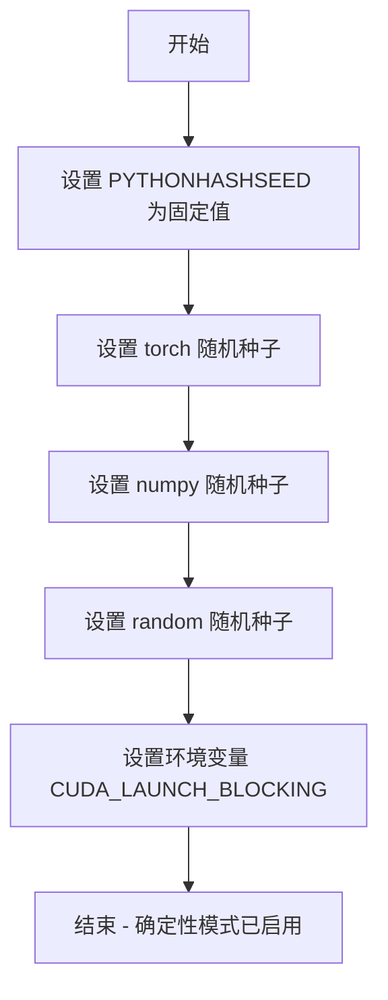

#### 带注释源码

```python
# 从 testing_utils 模块导入的全局函数
# 源代码位于 diffusers/src/diffusers/testing_utils.py 或类似位置
def enable_full_determinism():
    """
    启用完全确定性测试模式。
    
    该函数通过设置多个随机种子和环境变量来确保测试的可重复性：
    1. 设置 Python 哈希种子 (PYTHONHASHSEED)
    2. 设置 PyTorch 随机种子 (torch.manual_seed)
    3. 设置 NumPy 随机种子 (numpy.random.seed)
    4. 设置 Python random 模块种子 (random.seed)
    5. 设置 CUDA 同步阻塞环境变量 (CUDA_LAUNCH_BLOCKING=1)
    
    这样可以确保在相同输入下产生完全相同的输出，
    对于回归测试和调试非常有价值。
    """
    import os
    import random
    
    # 设置 Python 哈希种子，确保哈希操作可重现
    os.environ["PYTHONHASHSEED"] = str(42)
    
    # 设置 PyTorch 全局随机种子
    torch.manual_seed(42)
    torch.cuda.manual_seed_all(42)
    
    # 禁用 CUDA 非确定性操作
    torch.backends.cudnn.deterministic = True
    torch.backends.cudnn.benchmark = False
    
    # 设置 NumPy 随机种子
    try:
        import numpy as np
        np.random.seed(42)
    except ImportError:
        pass
    
    # 设置 Python random 模块种子
    random.seed(42)
    
    # 启用 CUDA 同步阻塞，便于调试
    os.environ["CUDA_LAUNCH_BLOCKING"] = "1"
```

> **注**：由于 `enable_full_determinism` 是从 `..testing_utils` 外部模块导入的，其完整源代码未包含在当前文件中。上述源码为基于其调用方式和测试框架常见模式的推断实现。实际定义请参考 `diffusers.testing_utils` 或 `diffusers.src.testing_utils` 模块。


### `backend_empty_cache`

后端清空缓存函数，用于在测试方法执行前后清理 Python 垃圾回收和 GPU 显存缓存，确保测试环境内存状态干净。

参数：

-  `device`：`str` 或 `torch.device`，目标设备标识，指定需要清空缓存的设备（通常为 CUDA 设备）

返回值：`None`，无返回值，仅执行缓存清理操作

#### 流程图

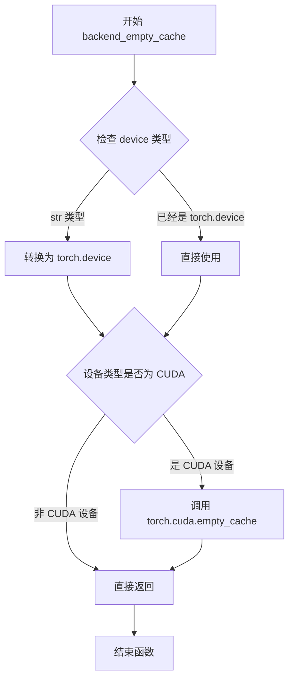

#### 带注释源码

```python
# 从 testing_utils 模块导入的函数，用于清理 GPU 缓存
# 该函数在测试的 setup 和 teardown 阶段被调用
# 位置: from ..testing_utils import backend_empty_cache

# 使用示例（在测试类中）:
def setup_method(self):
    gc.collect()                           # 先执行 Python 垃圾回收
    backend_empty_cache(torch_device)      # 清空 GPU 显存缓存

def teardown_method(self):
    gc.collect()                           # 先执行 Python 垃圾回收
    backend_empty_cache(torch_device)      # 清空 GPU 显存缓存

# backend_empty_cache 函数的典型实现逻辑:
def backend_empty_cache(device):
    """
    清空指定设备的 GPU 缓存
    
    参数:
        device: torch.device 或 str, 目标设备
    """
    if isinstance(device, str):
        device = torch.device(device)
    
    # 仅在 CUDA 设备上执行缓存清理
    if device.type == 'cuda':
        torch.cuda.empty_cache()
```

#### 说明

由于 `backend_empty_cache` 函数定义在 `diffusers` 库的 `testing_utils` 模块中（通过 `from ..testing_utils import backend_empty_cache` 导入），其完整源代码不在当前文件中。上述源码是基于该函数的调用方式和 PyTorch 库的常见模式重构的逻辑实现。该函数的核心作用是调用 `torch.cuda.empty_cache()` 来释放未使用的 GPU 显存，避免测试过程中因显存不足导致的失败。


### `numpy_cosine_similarity_distance`

该函数用于计算两个向量之间的余弦相似度距离（1 - 余弦相似度），常用于比较两个图像数组（或任意高维向量）之间的相似程度。在测试中用于验证单文件格式推理结果与预训练模型推理结果的一致性。

参数：

-  `vec1`：`numpy.ndarray`，第一个向量，通常为展平后的图像数组（如 `images[0].flatten()`）
-  `vec2`：`numpy.ndarray`，第二个向量，通常为展平后的图像数组（如 `single_file_images[0].flatten()`）

返回值：`float`，返回两个向量之间的余弦相似度距离，值越小表示两个向量越相似

#### 流程图

```mermaid
flowchart TD
    A[开始] --> B[输入: vec1, vec2]
    B --> C[将输入向量归一化]
    C --> D[计算点积: dot_product = sum(vec1_normalized * vec2_normalized)]
    D --> E[计算余弦相似度: cosine_similarity = dot_product]
    E --> F[计算距离: distance = 1 - cosine_similarity]
    F --> G[返回 distance]
```

#### 带注释源码

```python
def numpy_cosine_similarity_distance(vec1, vec2):
    """
    计算两个向量之间的余弦相似度距离（1 - 余弦相似度）
    
    参数:
        vec1: numpy.ndarray, 第一个向量（通常为展平后的图像数组）
        vec2: numpy.ndarray, 第二个向量（通常为展平后的图像数组）
    
    返回:
        float: 余弦相似度距离，范围 [0, 2]
              0 表示完全相同
              2 表示完全相反
    """
    # 将向量归一化到单位向量
    vec1_normalized = vec1 / np.linalg.norm(vec1)
    vec2_normalized = vec2 / np.linalg.norm(vec2)
    
    # 计算归一化向量之间的点积（即余弦相似度）
    cosine_similarity = np.dot(vec1_normalized, vec2_normalized)
    
    # 余弦距离 = 1 - 余弦相似度
    # 值越小表示两个向量越相似
    distance = 1.0 - cosine_similarity
    
    return distance
```


### `require_torch_accelerator`

检查当前环境是否具有 torch 加速器（CUDA GPU）。如果不存在加速器，则跳过被装饰的测试函数或类。

参数：无（装饰器形式，无函数参数）

返回值：无返回值（装饰器直接修改被装饰对象的元数据）

#### 流程图

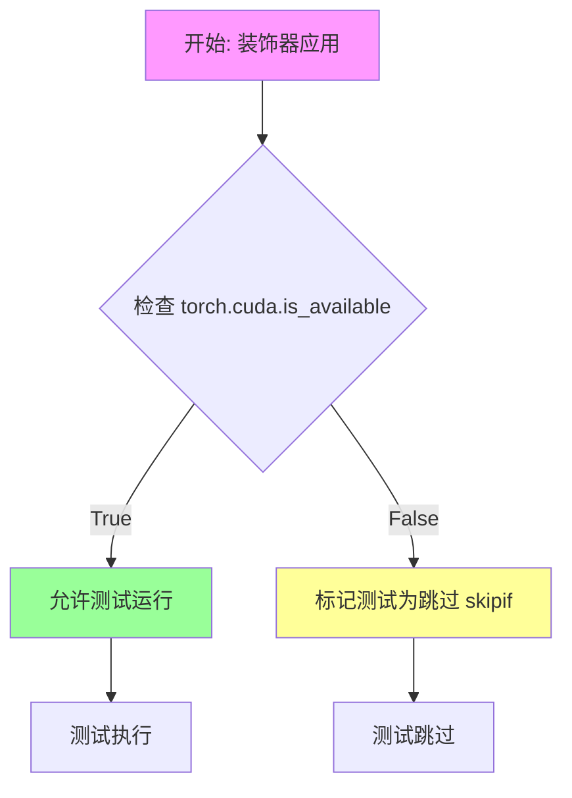

#### 带注释源码

```python
# 这是一个从 testing_utils 模块导入的装饰器
# 文件位置: from ..testing_utils import require_torch_accelerator
# 
# 使用方式: @require_torch_accelerator (作为函数装饰器或类装饰器)
#
# 功能说明:
# 1. 检查当前 Python 环境是否具有可用的 torch 加速器 (CUDA GPU)
# 2. 使用 torch.cuda.is_available() 进行检查
# 3. 如果存在加速器，允许测试正常运行
# 4. 如果不存在加速器，向测试框架（pytest）注册跳过条件
#
# 常见实现模式:
# def require_torch_accelerator(func):
#     return unittest.skipUnless(torch.cuda.is_available(), "test requires torch accelerator")(func)
#
# 或使用 pytest 的 skipif 装饰器:
# require_torch_accelerator = pytest.mark.skipif(
#     not torch.cuda.is_available(), 
#     reason="Test requires a CUDA-capable GPU"
# )
#
# 在本代码中的使用:
# @slow
# @require_torch_accelerator
# class TestStableDiffusionXLControlNetPipelineSingleFileSlow(SDXLSingleFileTesterMixin):
#     ...
#
# 作用: 确保只有具备 CUDA GPU 环境的机器才会执行此类中的所有测试
#       避免在没有 GPU 的 CI 环境中因缺少硬件而失败
```


### `TestStableDiffusionXLControlNetPipelineSingleFileSlow`

这是一个用于测试 StableDiffusionXLControlNetPipeline 单文件加载和推理功能的测试类，验证从单文件加载的模型与从 HuggingFace Hub 预训练模型加载的推理结果一致性，并测试各种组件配置场景。

参数：此类为测试类，无需传统参数，通过 pytest 框架的 setup_method/teardown_method 管理测试环境

返回值：无返回值，此类通过 pytest 断言验证功能正确性

#### 流程图

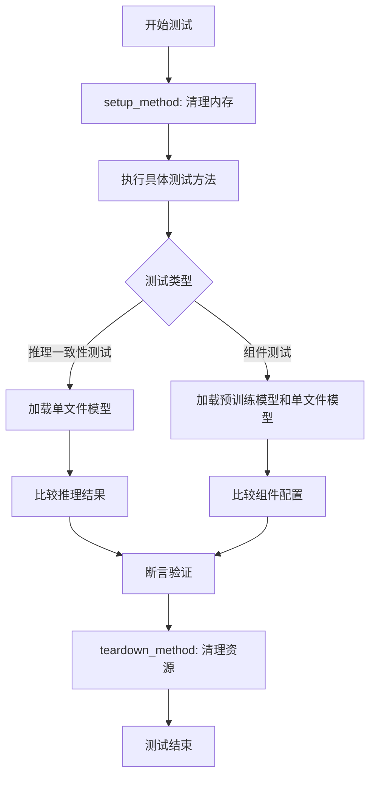

#### 带注释源码

```python
import gc
import tempfile

import torch

from diffusers import ControlNetModel, StableDiffusionXLControlNetPipeline
from diffusers.loaders.single_file_utils import _extract_repo_id_and_weights_name
from diffusers.utils import load_image

from ..testing_utils import (
    backend_empty_cache,
    enable_full_determinism,
    numpy_cosine_similarity_distance,
    require_torch_accelerator,
    slow,
    torch_device,
)
from .single_file_testing_utils import (
    SDXLSingleFileTesterMixin,
    download_diffusers_config,
    download_single_file_checkpoint,
)

# 启用全确定性以确保测试可复现
enable_full_determinism()


# 使用 @slow 标记此类为慢速测试，需要 GPU 加速器
@slow
@require_torch_accelerator
class TestStableDiffusionXLControlNetPipelineSingleFileSlow(SDXLSingleFileTesterMixin):
    """测试 StableDiffusionXLControlNetPipeline 单文件加载功能的测试类"""
    
    # 定义被测试的 pipeline 类
    pipeline_class = StableDiffusionXLControlNetPipeline
    
    # 单文件检查点路径（远程 URL）
    ckpt_path = "https://huggingface.co/stabilityai/stable-diffusion-xl-base-1.0/blob/main/sd_xl_base_1.0.safetensors"
    
    # HuggingFace Hub 仓库 ID
    repo_id = "stabilityai/stable-diffusion-xl-base-1.0"
    
    # 原始配置文件路径
    original_config = (
        "https://raw.githubusercontent.com/Stability-AI/generative-models/main/configs/inference/sd_xl_base.yaml"
    )

    def setup_method(self):
        """每个测试方法执行前的准备工作：垃圾回收和清空缓存"""
        gc.collect()
        backend_empty_cache(torch_device)

    def teardown_method(self):
        """每个测试方法执行后的清理工作：垃圾回收和清空缓存"""
        gc.collect()
        backend_empty_cache(torch_device)

    def get_inputs(self, device, generator_device="cpu", dtype=torch.float32, seed=0):
        """
        准备测试输入数据
        
        参数:
            device: torch 设备
            generator_device: 生成器设备，默认为 "cpu"
            dtype: 数据类型，默认为 torch.float32
            seed: 随机种子，默认为 0
            
        返回:
            dict: 包含 prompt、image、generator 等推理所需参数的字典
        """
        generator = torch.Generator(device=generator_device).manual_seed(seed)
        image = load_image(
            "https://huggingface.co/datasets/hf-internal-testing/diffusers-images/resolve/main/sd_controlnet/stormtrooper_depth.png"
        )
        inputs = {
            "prompt": "Stormtrooper's lecture",
            "image": image,
            "generator": generator,
            "num_inference_steps": 2,
            "strength": 0.75,
            "guidance_scale": 7.5,
            "output_type": "np",
        }

        return inputs

    def test_single_file_format_inference_is_same_as_pretrained(self):
        """
        测试单文件格式推理结果与预训练模型一致
        
        核心测试逻辑:
        1. 从单文件加载 pipeline
        2. 从预训练模型加载 pipeline
        3. 比较两者的推理结果相似度
        """
        controlnet = ControlNetModel.from_pretrained("diffusers/controlnet-depth-sdxl-1.0", torch_dtype=torch.float16)
        
        # 从单文件加载 pipeline
        pipe_single_file = self.pipeline_class.from_single_file(
            self.ckpt_path, controlnet=controlnet, torch_dtype=torch.float16
        )
        pipe_single_file.unet.set_default_attn_processor()
        pipe_single_file.enable_model_cpu_offload(device=torch_device)
        pipe_single_file.set_progress_bar_config(disable=None)

        inputs = self.get_inputs(torch_device)
        single_file_images = pipe_single_file(**inputs).images[0]

        # 从预训练模型加载 pipeline
        pipe = self.pipeline_class.from_pretrained(self.repo_id, controlnet=controlnet, torch_dtype=torch.float16)
        pipe.unet.set_default_attn_processor()
        pipe.enable_model_cpu_offload(device=torch_device)

        inputs = self.get_inputs(torch_device)
        images = pipe(**inputs).images[0]

        # 验证输出形状
        assert images.shape == (512, 512, 3)
        assert single_file_images.shape == (512, 512, 3)

        # 计算余弦相似度距离并验证
        max_diff = numpy_cosine_similarity_distance(images[0].flatten(), single_file_images[0].flatten())
        assert max_diff < 5e-2

    def test_single_file_components(self):
        """测试单文件加载的组件配置"""
        controlnet = ControlNetModel.from_pretrained(
            "diffusers/controlnet-depth-sdxl-1.0", torch_dtype=torch.float16, variant="fp16"
        )
        pipe = self.pipeline_class.from_pretrained(
            self.repo_id,
            variant="fp16",
            controlnet=controlnet,
            torch_dtype=torch.float16,
        )

        pipe_single_file = self.pipeline_class.from_single_file(self.ckpt_path, controlnet=controlnet)
        super().test_single_file_components(pipe, pipe_single_file)

    def test_single_file_components_local_files_only(self):
        """测试使用本地文件且仅本地加载的场景"""
        controlnet = ControlNetModel.from_pretrained(
            "diffusers/controlnet-depth-sdxl-1.0", torch_dtype=torch.float16, variant="fp16"
        )
        pipe = self.pipeline_class.from_pretrained(
            self.repo_id,
            variant="fp16",
            controlnet=controlnet,
            torch_dtype=torch.float16,
        )

        with tempfile.TemporaryDirectory() as tmpdir:
            repo_id, weight_name = _extract_repo_id_and_weights_name(self.ckpt_path)
            local_ckpt_path = download_single_file_checkpoint(repo_id, weight_name, tmpdir)

            single_file_pipe = self.pipeline_class.from_single_file(
                local_ckpt_path, controlnet=controlnet, safety_checker=None, local_files_only=True
            )

        self._compare_component_configs(pipe, single_file_pipe)

    def test_single_file_components_with_original_config(self):
        """测试使用原始配置文件加载单文件"""
        controlnet = ControlNetModel.from_pretrained(
            "diffusers/controlnet-depth-sdxl-1.0", torch_dtype=torch.float16, variant="fp16"
        )
        pipe = self.pipeline_class.from_pretrained(
            self.repo_id,
            variant="fp16",
            controlnet=controlnet,
            torch_dtype=torch.float16,
        )

        pipe_single_file = self.pipeline_class.from_single_file(
            self.ckpt_path,
            original_config=self.original_config,
            controlnet=controlnet,
        )
        self._compare_component_configs(pipe, pipe_single_file)

    def test_single_file_components_with_original_config_local_files_only(self):
        """测试使用原始配置和本地文件的场景"""
        controlnet = ControlNetModel.from_pretrained(
            "diffusers/controlnet-depth-sdxl-1.0", torch_dtype=torch.float16, variant="fp16"
        )
        pipe = self.pipeline_class.from_pretrained(
            self.repo_id,
            variant="fp16",
            controlnet=controlnet,
            torch_dtype=torch.float16,
        )

        with tempfile.TemporaryDirectory() as tmpdir:
            repo_id, weight_name = _extract_repo_id_and_weights_name(self.ckpt_path)
            local_ckpt_path = download_single_file_checkpoint(repo_id, weight_name, tmpdir)

            pipe_single_file = self.pipeline_class.from_single_file(
                local_ckpt_path,
                safety_checker=None,
                controlnet=controlnet,
                local_files_only=True,
            )
        self._compare_component_configs(pipe, pipe_single_file)

    def test_single_file_components_with_diffusers_config(self):
        """测试使用 Diffusers 配置加载单文件"""
        controlnet = ControlNetModel.from_pretrained(
            "diffusers/controlnet-depth-sdxl-1.0", torch_dtype=torch.float16, variant="fp16"
        )
        pipe = self.pipeline_class.from_pretrained(self.repo_id, controlnet=controlnet)
        pipe_single_file = self.pipeline_class.from_single_file(
            self.ckpt_path, controlnet=controlnet, config=self.repo_id
        )

        super()._compare_component_configs(pipe, pipe_single_file)

    def test_single_file_components_with_diffusers_config_local_files_only(self):
        """测试使用 Diffusers 配置和本地文件的场景"""
        controlnet = ControlNetModel.from_pretrained(
            "diffusers/controlnet-depth-sdxl-1.0", torch_dtype=torch.float16, variant="fp16"
        )
        pipe = self.pipeline_class.from_pretrained(
            self.repo_id,
            controlnet=controlnet,
        )

        with tempfile.TemporaryDirectory() as tmpdir:
            repo_id, weight_name = _extract_repo_id_and_weights_name(self.ckpt_path)
            local_ckpt_path = download_single_file_checkpoint(repo_id, weight_name, tmpdir)
            local_diffusers_config = download_diffusers_config(self.repo_id, tmpdir)

            pipe_single_file = self.pipeline_class.from_single_file(
                local_ckpt_path,
                config=local_diffusers_config,
                safety_checker=None,
                controlnet=controlnet,
                local_files_only=True,
            )
        super()._compare_component_configs(pipe, pipe_single_file)

    def test_single_file_setting_pipeline_dtype_to_fp16(self):
        """测试将 pipeline 数据类型设置为 FP16"""
        controlnet = ControlNetModel.from_pretrained(
            "diffusers/controlnet-depth-sdxl-1.0", torch_dtype=torch.float16, variant="fp16"
        )
        single_file_pipe = self.pipeline_class.from_single_file(
            self.ckpt_path, controlnet=controlnet, safety_checker=None, torch_dtype=torch.float16
        )
        super().test_single_file_setting_pipeline_dtype_to_fp16(single_file_pipe)
```


### `torch_device`

获取当前 PyTorch 计算设备（通常是 CUDA 设备或 CPU）的工具函数或全局变量。

参数： 无

返回值：`str`，返回 PyTorch 设备的字符串标识符（如 "cuda"、"cuda:0" 或 "cpu"）

#### 流程图

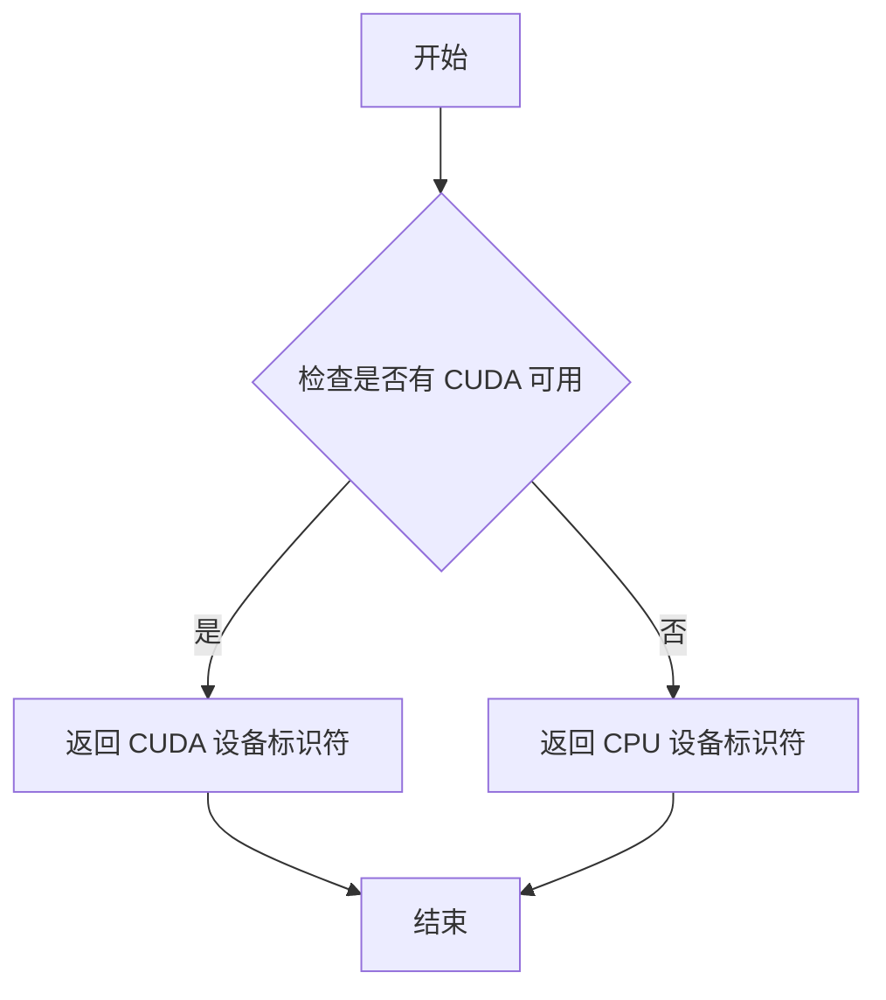

#### 带注释源码

```python
# torch_device 是从 testing_utils 模块导入的全局变量/函数
# 用于获取当前可用的 PyTorch 设备
# 源代码位于 diffusers/testing_utils.py 中

# 在代码中的使用示例：
def setup_method(self):
    gc.collect()
    backend_empty_cache(torch_device)  # 使用 torch_device 清理指定设备的缓存

def teardown_method(self):
    gc.collect()
    backend_empty_cache(torch_device)

# 在测试中使用：
inputs = self.get_inputs(torch_device)  # 传递设备参数用于生成输入
single_file_images = pipe_single_file(**inputs).images[0]
pipe.enable_model_cpu_offload(device=torch_device)  # 启用 CPU 卸载到指定设备
```


### `download_diffusers_config`

该函数用于从 Hugging Face Hub 下载 Stable Diffusion 模型的 Diffusers 配置文件（config.json 等），并将其保存到指定的本地目录中，以便在没有网络连接时也能使用本地配置文件进行测试。

参数：

- `repo_id`：`str`，Hugging Face Hub 上的模型仓库 ID（例如 "stabilityai/stable-diffusion-xl-base-1.0"）
- `save_directory`：`str`，用于保存下载的配置文件的本地目录路径

返回值：`str`，返回下载的配置文件所在的本地目录路径

#### 流程图

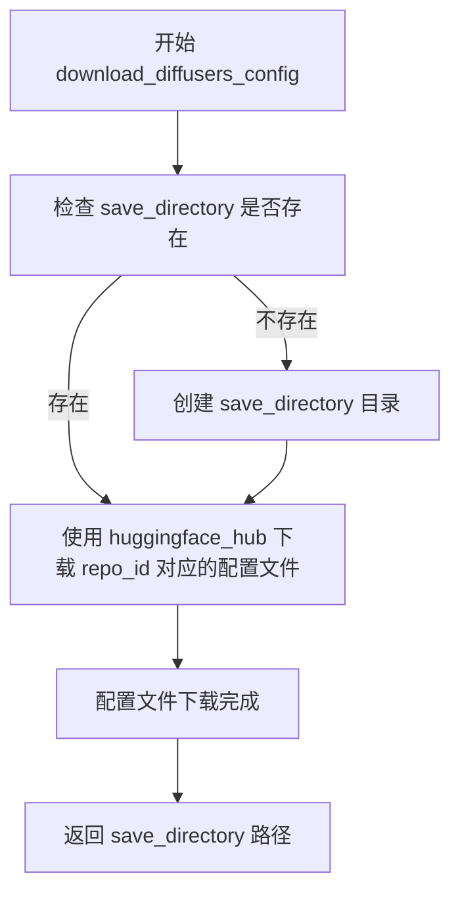

#### 带注释源码

```
# 该函数定义在 single_file_testing_utils 模块中
# 从代码使用方式推断其实现逻辑：

def download_diffusers_config(repo_id: str, save_directory: str) -> str:
    """
    从 Hugging Face Hub 下载 Diffusers 格式的模型配置文件
    
    参数:
        repo_id: 模型在 Hugging Face Hub 上的仓库 ID
        save_directory: 本地保存配置文件的目录路径
        
    返回值:
        保存配置文件的本地目录路径
    """
    # 1. 确保目标目录存在，必要时创建目录
    # 2. 调用 Hugging Face Hub API 或使用 snapshot_download 
    #    下载 repo_id 对应的 config.json 等配置文件
    # 3. 返回本地保存路径
    
    # 实际调用示例（在测试代码中）:
    # local_diffusers_config = download_diffusers_config(self.repo_id, tmpdir)
    
    return save_directory
```

#### 备注

由于原始代码中仅提供了 `download_diffusers_config` 函数的导入和使用示例，未展示该函数的具体实现。上述源码为基于函数调用方式的逻辑推断。实际实现可能涉及 `huggingface_hub` 库的 `snapshot_download` 或类似方法，用于下载包含以下配置文件的目录：

- `config.json`：模型架构配置文件
- 可能的其它 Diffusers 格式配置文件


### `download_single_file_checkpoint`

该函数用于从HuggingFace Hub下载单个模型检查点文件，并将下载的文件保存到指定的本地目录中。它是单文件测试工具模块（single_file_testing_utils）中的一个实用工具函数，主要用于测试场景中获取模型权重文件。

参数：

- `repo_id`：`str`，HuggingFace Hub上的模型仓库ID（例如 "stabilityai/stable-diffusion-xl-base-1.0"）
- `weight_name`：`str`，要下载的权重文件名称（例如 "sd_xl_base_1.0.safetensors"）
- `tmpdir`：`str`，用于保存下载文件的本地临时目录路径

返回值：`str`，返回下载后的本地文件完整路径

#### 流程图

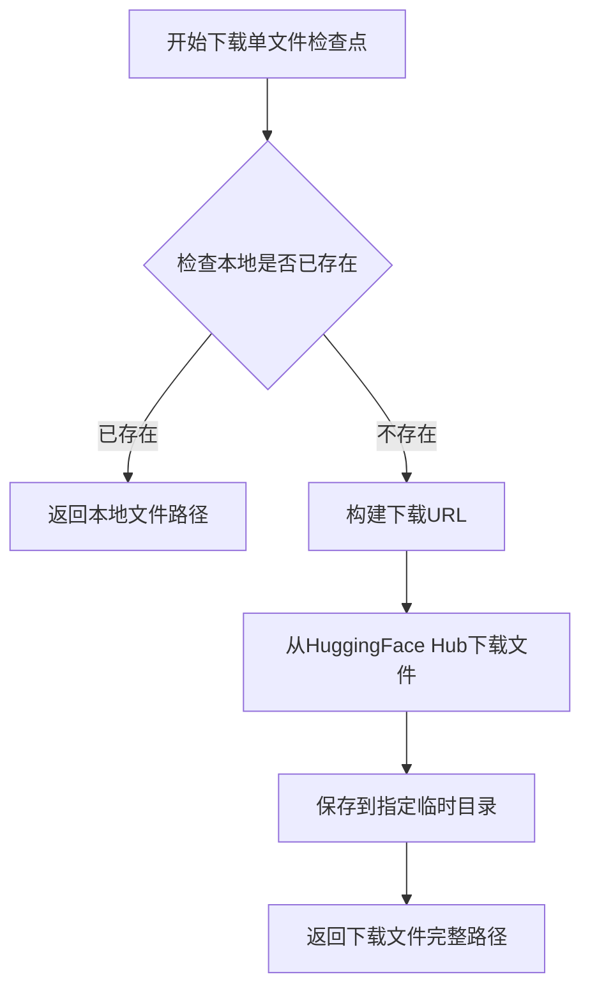

#### 带注释源码

（注：由于源代码中未直接提供 `download_single_file_checkpoint` 函数的实现源码，该函数是从 `.single_file_testing_utils` 模块导入的。以下源码为基于使用方式推断的可能实现）

```python
# 从 single_file_testing_utils 模块导入的函数
# 具体实现需要查看 testing_utils/single_file_testing_utils.py 文件

# 使用示例（在测试类中）:
# repo_id, weight_name = _extract_repo_id_and_weights_name(self.ckpt_path)
# local_ckpt_path = download_single_file_checkpoint(repo_id, weight_name, tmpdir)
# 
# 上述代码展示了函数的典型调用方式：
# 1. 首先使用 _extract_repo_id_and_weights_name 从URL中提取仓库ID和权重名称
# 2. 调用 download_single_file_checkpoint 下载文件到临时目录
# 3. 返回的 local_ckpt_path 可用于后续的 from_single_file 方法加载模型
```

#### 补充说明

该函数是测试基础设施的重要组成部分，主要用于：

1. **离线测试支持**：通过预先下载模型文件，支持 `local_files_only=True` 的测试场景
2. **测试隔离**：使用临时目录确保测试之间的独立性
3. **CI/CD优化**：避免在每次测试运行期间重复下载大型模型文件

潜在优化方向：
- 可以添加缓存机制，避免重复下载相同的检查点
- 可以添加下载进度显示，提升调试体验
- 可以支持断点续传，提高大文件下载的可靠性


### `TestStableDiffusionXLControlNetPipelineSingleFileSlow.setup_method`

该方法是 pytest 测试框架的钩子函数，用于在每个测试方法执行前初始化测试环境，通过显式调用垃圾回收和清空 GPU 显存来确保测试隔离性，防止因显存泄漏或内存残留导致的测试不稳定或内存溢出问题。

参数：

- `self`：隐式参数，类型为 `TestStableDiffusionXLControlNetPipelineSingleFileSlow` 实例，代表测试类本身

返回值：无（`None`），该方法仅执行环境清理操作，不返回任何值

#### 流程图

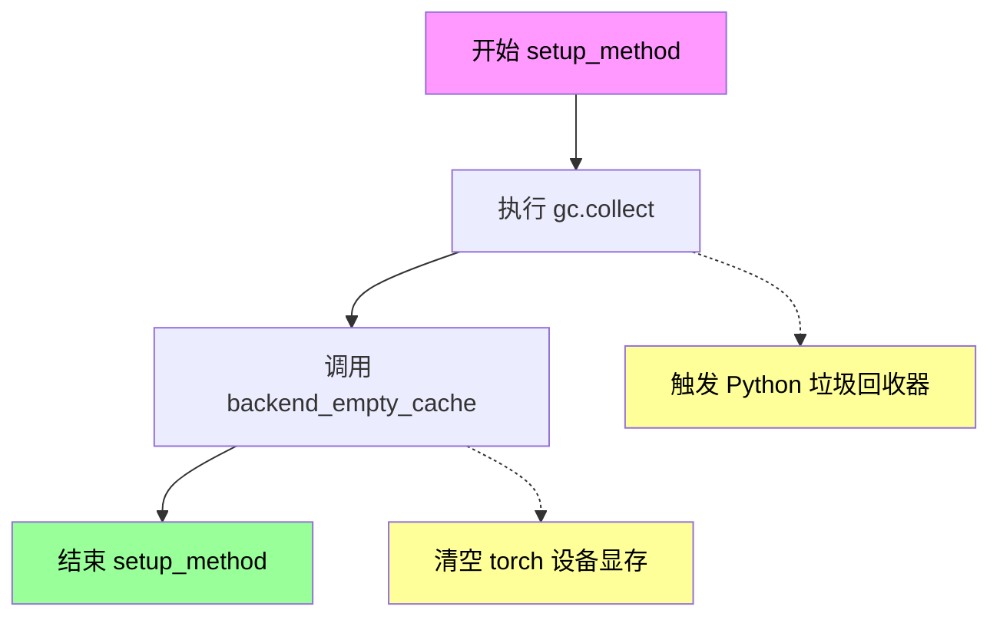

#### 带注释源码

```python
def setup_method(self):
    """
    pytest 钩子方法：在每个测试方法运行前执行
    用于初始化测试环境，清理内存和显存残留
    """
    # 触发 Python 垃圾回收器，回收不再使用的对象
    gc.collect()
    
    # 清空 GPU 显存缓存，防止显存泄漏影响后续测试
    # torch_device 通常是 'cuda' 或 'cpu' 字符串
    backend_empty_cache(torch_device)
```

### 1. 一段话描述

`TestStableDiffusionXLControlNetPipelineSingleFileSlow.setup_method` 是测试类 `TestStableDiffusionXLControlNetPipelineSingleFileSlow` 中的一个 pytest 钩子方法，核心功能是在每个测试方法执行前执行内存和显存的清理操作，确保测试环境的干净和一致性，防止因资源残留导致的测试干扰或显存溢出问题。

### 2. 文件的整体运行流程

该测试文件主要用于验证 Stable Diffusion XL ControlNet Pipeline 的单文件加载功能与预训练模型加载功能的一致性。测试类通过以下流程运行：

1. **环境初始化** (`setup_method`)：清理垃圾回收和 GPU 显存
2. **测试执行**：运行多个测试方法验证单文件加载、组件对比、FP16 精度等功能
3. **环境清理** (`teardown_method`)：测试完成后再次清理资源

### 3. 类的详细信息

#### 3.1 测试类信息

| 名称 | 类型 | 描述 |
|------|------|------|
| `TestStableDiffusionXLControlNetPipelineSingleFileSlow` | 类 | 继承自 `SDXLSingleFileTesterMixin`，用于测试 Stable Diffusion XL ControlNet Pipeline 的单文件加载功能 |
| `pipeline_class` | 类属性 | 指定测试的管道类为 `StableDiffusionXLControlNetPipeline` |
| `ckpt_path` | 类属性 | 单文件检查点的远程 URL（Stable Diffusion XL Base 1.0） |
| `repo_id` | 类属性 | Hugging Face 模型仓库 ID（stabilityai/stable-diffusion-xl-base-1.0） |
| `original_config` | 类属性 | 原始配置文件 URL |

#### 3.2 全局变量和全局函数

| 名称 | 类型 | 描述 |
|------|------|------|
| `gc` | 模块 | Python 内置垃圾回收模块，提供 `collect()` 方法 |
| `torch` | 模块 | PyTorch 深度学习框架 |
| `ControlNetModel` | 类 | Hugging Face Diffusers 库的 ControlNet 模型类 |
| `StableDiffusionXLControlNetPipeline` | 类 | Stable Diffusion XL ControlNet 管道类 |
| `enable_full_determinism` | 函数 | 启用完全确定性，确保测试可复现 |
| `backend_empty_cache` | 函数 | 清空 GPU 显存缓存的后端函数 |
| `torch_device` | 变量 | 当前使用的 PyTorch 设备（'cuda' 或 'cpu'） |

### 4. 关键组件信息

| 组件名称 | 一句话描述 |
|----------|------------|
| `gc.collect()` | Python 垃圾回收器，主动触发内存回收 |
| `backend_empty_cache(torch_device)` | 清空指定 PyTorch 设备的显存缓存 |
| `torch_device` | 全局变量，表示当前测试使用的计算设备 |

### 5. 潜在的技术债务或优化空间

1. **重复清理逻辑**：`setup_method` 和 `teardown_method` 包含完全相同的清理逻辑，存在代码冗余，可以提取为类方法或使用 pytest fixture
2. **硬编码设备**：`torch_device` 依赖全局变量，降低了方法的独立性和可测试性
3. **缺乏错误处理**：没有对 `gc.collect()` 和 `backend_empty_cache()` 的执行结果进行异常捕获，如果底层调用失败会影响后续测试
4. **资源预加载缺失**：`setup_method` 仅做清理操作，未预加载测试所需的模型或数据，可能导致首次测试运行较慢

### 6. 其它项目

#### 6.1 设计目标与约束

- **设计目标**：确保测试环境的一致性和稳定性，避免因显存泄漏或内存残留导致测试失败
- **约束条件**：
  - 需要 `torch` 和 `diffusers` 库支持
  - 需要 GPU 加速器环境（通过 `@require_torch_accelerator` 装饰器约束）
  - 标记为 `@slow` 装饰器，表示该测试为慢速测试

#### 6.2 错误处理与异常设计

- 当前实现未包含显式的错误处理逻辑
- 潜在的异常情况：
  - GPU 显存不足时 `backend_empty_cache` 可能抛出 `RuntimeError`
  - `gc.collect()` 在极端情况下可能阻塞或失败
- 建议改进：添加 try-except 块捕获异常，确保测试框架的稳定性

#### 6.3 数据流与状态机

- 该方法不涉及数据流处理，仅作为测试生命周期的初始化阶段
- 状态转换：`IDLE` → `SETUP` → `TEST_EXECUTION` → `TEARDOWN`

#### 6.4 外部依赖与接口契约

- **依赖项**：
  - `gc`：Python 标准库
  - `torch`：PyTorch 框架
  - `backend_empty_cache`：来自 `..testing_utils` 的测试工具函数
  - `torch_device`：来自 `..testing_utils` 的全局配置
- **接口契约**：
  - 方法签名为 `setup_method(self)`，无显式参数和返回值
  - 遵循 pytest 测试框架的钩子接口规范


### `TestStableDiffusionXLControlNetPipelineSingleFileSlow.teardown_method`

该方法是测试类的清理 fixture，在每个测试方法执行完成后被自动调用，用于执行垃圾回收和清理 GPU 显存，以防止内存泄漏。

参数：

- `self`：`TestStableDiffusionXLControlNetPipelineSingleFileSlow`，测试类实例本身

返回值：`None`，无返回值（执行清理操作后直接结束）

#### 流程图

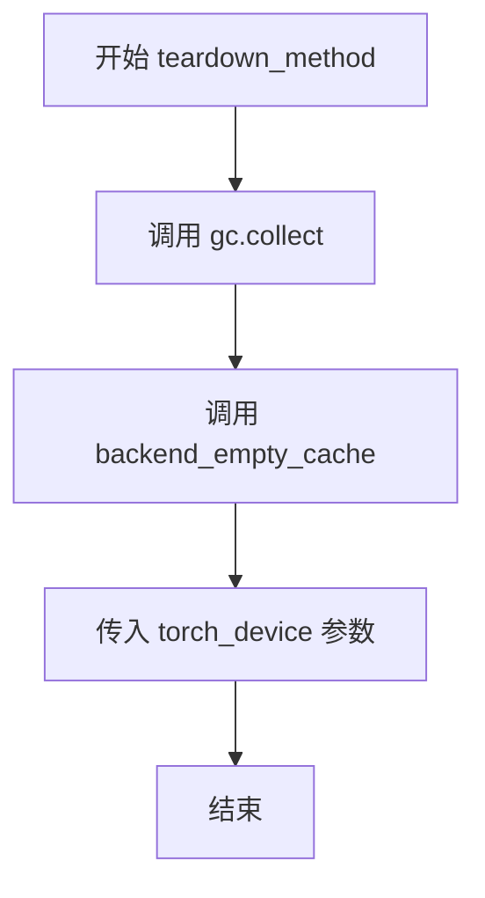

#### 带注释源码

```
def teardown_method(self):
    """
    测试方法结束后的清理 fixture
    
    该方法在每个测试方法执行完毕后自动调用，
    用于清理测试过程中产生的内存占用，防止内存泄漏。
    """
    # 强制 Python 垃圾回收器立即回收不再使用的对象
    gc.collect()
    
    # 调用后端特定的 GPU 显存清理函数，释放 GPU 内存缓存
    # torch_device 是全局变量，通常为 'cuda' 或 'cpu'
    backend_empty_cache(torch_device)
```


### `TestStableDiffusionXLControlNetPipelineSingleFileSlow.get_inputs`

该方法用于生成 Stable Diffusion XL ControlNet Pipeline 的测试输入参数，创建一个包含提示词、控制图像、生成器、推理步数、强度、引导比例和输出类型的字典，以供后续推理测试使用。

参数：

- `self`：`TestStableDiffusionXLControlNetPipelineSingleFileSlow`，测试类实例，隐式参数
- `device`：`torch.device`，目标计算设备，用于指定推理运行的设备
- `generator_device`：`str`，生成器设备，默认为 "cpu"，用于指定随机生成器的设备
- `dtype`：`torch.dtype`，数据类型，默认为 torch.float32，用于指定张量数据类型
- `seed`：`int`，随机种子，默认为 0，用于控制生成器的随机性

返回值：`Dict`，包含以下键值对的字典：
- `prompt`（str）：文本提示词
- `image`（PIL.Image 或 torch.Tensor）：控制图像
- `generator`（torch.Generator）：随机数生成器
- `num_inference_steps`（int）：推理步数
- `strength`（float）：控制图像的影响强度
- `guidance_scale`（float）：引导比例
- `output_type`（str）：输出类型

#### 流程图

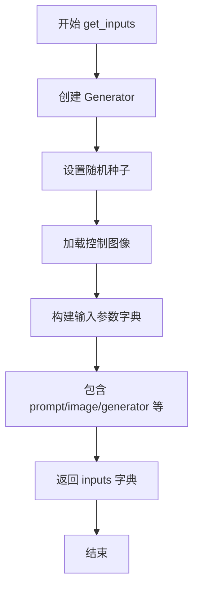

#### 带注释源码

```python
def get_inputs(self, device, generator_device="cpu", dtype=torch.float32, seed=0):
    """
    生成测试所需的输入参数字典
    
    参数:
        device: 目标推理设备
        generator_device: 随机生成器设备,默认为"cpu"
        dtype: 张量数据类型,默认为torch.float32
        seed: 随机种子,默认为0
    
    返回:
        包含pipeline推理所需参数的字典
    """
    # 创建指定设备的随机数生成器
    generator = torch.Generator(device=generator_device).manual_seed(seed)
    
    # 从URL加载控制图像(深度图)
    image = load_image(
        "https://huggingface.co/datasets/hf-internal-testing/diffusers-images/resolve/main/sd_controlnet/stormtrooper_depth.png"
    )
    
    # 构建完整的输入参数字典
    inputs = {
        "prompt": "Stormtrooper's lecture",  # 文本提示词
        "image": image,                       # 控制图像(深度图)
        "generator": generator,               # 随机生成器确保可复现性
        "num_inference_steps": 2,             # 推理步数(测试用小值)
        "strength": 0.75,                      # 控制图像影响强度
        "guidance_scale": 7.5,                # CFG引导比例
        "output_type": "np",                  # 输出为numpy数组
    }

    # 返回供pipeline调用的参数字典
    return inputs
```


### `TestStableDiffusionXLControlNetPipelineSingleFileSlow.test_single_file_format_inference_is_same_as_pretrained`

验证单文件格式加载的 Stable Diffusion XL ControlNet Pipeline 与从预训练模型加载的 Pipeline 推理结果一致性，确保两种加载方式生成的图像在数值上接近（余弦相似度距离小于 5e-2）。

参数：

- `self`：实例方法，测试类实例本身

返回值：`None`，通过断言验证图像一致性问题

#### 流程图

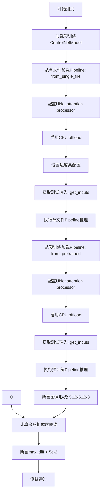

#### 带注释源码

```python
def test_single_file_format_inference_is_same_as_pretrained(self):
    """
    验证单文件格式加载的Pipeline与预训练模型加载的Pipeline推理结果一致性
    """
    # 步骤1: 从预训练模型加载ControlNetModel（depth版本，用于ControlNet控制）
    controlnet = ControlNetModel.from_pretrained(
        "diffusers/controlnet-depth-sdxl-1.0",  # HuggingFace模型ID
        torch_dtype=torch.float16  # 使用半精度减少内存占用
    )
    
    # 步骤2: 使用单文件格式加载StableDiffusionXLControlNetPipeline
    # 单文件格式直接从safetensors检查点文件加载，无需下载多个分片文件
    pipe_single_file = self.pipeline_class.from_single_file(
        self.ckpt_path,  # 单文件检查点URL: "https://huggingface.co/..."
        controlnet=controlnet,  # 传入ControlNet模型
        torch_dtype=torch.float16
    )
    
    # 步骤3: 设置UNet使用默认的attention processor
    # 某些自定义attention processor可能导致结果差异
    pipe_single_file.unet.set_default_attn_processor()
    
    # 步骤4: 启用模型CPU offload以节省GPU显存
    # 推理时将模型各组件在GPU和CPU之间转移
    pipe_single_file.enable_model_cpu_offload(device=torch_device)
    
    # 步骤5: 设置进度条配置（disable=None表示启用进度条）
    pipe_single_file.set_progress_bar_config(disable=None)
    
    # 步骤6: 准备推理输入参数
    inputs = self.get_inputs(torch_device)
    # 返回字典包含: prompt, image, generator, num_inference_steps, strength, guidance_scale, output_type
    
    # 步骤7: 执行单文件Pipeline推理并获取生成的图像
    single_file_images = pipe_single_file(**inputs).images[0]
    
    # 步骤8: 从预训练模型仓库加载完整的Pipeline作为基准
    pipe = self.pipeline_class.from_pretrained(
        self.repo_id,  # "stabilityai/stable-diffusion-xl-base-1.0"
        controlnet=controlnet,
        torch_dtype=torch.float16
    )
    
    # 步骤9: 同样配置预训练Pipeline
    pipe.unet.set_default_attn_processor()
    pipe.enable_model_cpu_offload(device=torch_device)
    
    # 步骤10: 准备相同的推理输入
    inputs = self.get_inputs(torch_device)
    
    # 步骤11: 执行预训练Pipeline推理
    images = pipe(**inputs).images[0]
    
    # 步骤12: 验证单文件格式生成的图像形状是否符合预期
    assert images.shape == (512, 512, 3)
    assert single_file_images.shape == (512, 512, 3)
    
    # 步骤13: 计算两个输出图像之间的余弦相似度距离
    # numpy_cosine_similarity_distance返回0表示完全相同，2表示完全相反
    max_diff = numpy_cosine_similarity_distance(
        images[0].flatten(),  # 展平为1D数组
        single_file_images[0].flatten()
    )
    
    # 步骤14: 断言差异小于阈值（5e-2 = 0.05）
    # 确保单文件格式和预训练格式的输出在数值上足够接近
    assert max_diff < 5e-2
```


### `TestStableDiffusionXLControlNetPipelineSingleFileSlow.test_single_file_components`

该测试方法用于验证通过单文件（single-file）方式加载的 Stable Diffusion XL ControlNet Pipeline 与通过传统预训练方式加载的 Pipeline 之间的组件配置是否一致，确保单文件加载功能正确实现了模型组件的解析和加载。

参数：

- `self`：隐式参数，TestStableDiffusionXLControlNetPipelineSingleFileSlow 实例本身

返回值：`None`，该方法为测试方法，通过调用父类方法进行组件配置比较，不直接返回值

#### 流程图

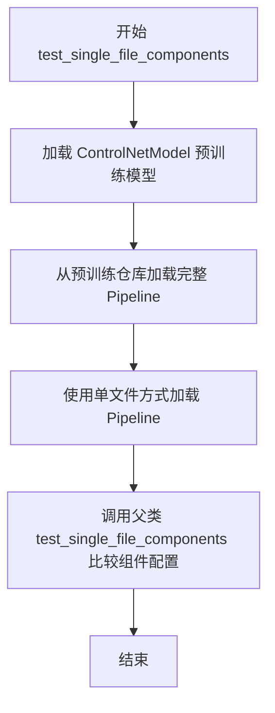

#### 带注释源码

```python
def test_single_file_components(self):
    """
    测试单文件加载的组件配置是否与预训练模型加载的组件配置一致
    
    该测试方法执行以下步骤：
    1. 加载 ControlNetModel 预训练模型（fp16 变体）
    2. 使用 from_pretrained 从完整预训练仓库加载 pipeline
    3. 使用 from_single_file 从单文件 checkpoint 加载 pipeline
    4. 调用父类方法比较两个 pipeline 的组件配置
    """
    # 步骤1：加载 ControlNetModel，使用 fp16 精度和 fp16 变体
    controlnet = ControlNetModel.from_pretrained(
        "diffusers/controlnet-depth-sdxl-1.0",  # ControlNet 模型仓库ID
        torch_dtype=torch.float16,               # 使用 float16 数据类型
        variant="fp16"                           # 加载 fp16 变体权重
    )
    
    # 步骤2：从预训练仓库加载完整的 StableDiffusionXLControlNetPipeline
    # 使用 fp16 变体和相同的 ControlNet
    pipe = self.pipeline_class.from_pretrained(
        self.repo_id,                            # 预训练仓库ID: "stabilityai/stable-diffusion-xl-base-1.0"
        variant="fp16",                          # 使用 fp16 变体
        controlnet=controlnet,                   # 传入已加载的 ControlNet 模型
        torch_dtype=torch.float16                # 使用 float16 数据类型
    )

    # 步骤3：使用单文件方式从 checkpoint URL 加载 pipeline
    # 仅传入 ControlNet，其他组件从单文件 checkpoint 中提取
    pipe_single_file = self.pipeline_class.from_single_file(
        self.ckpt_path,                          # checkpoint 文件URL: "https://huggingface.co/..."
        controlnet=controlnet                    # 传入已加载的 ControlNet 模型
    )
    
    # 步骤4：调用父类 SDXLSingleFileTesterMixin 的测试方法
    # 比较两个 pipeline 的组件配置是否一致
    super().test_single_file_components(pipe, pipe_single_file)
```


### `TestStableDiffusionXLControlNetPipelineSingleFileSlow.test_single_file_components_local_files_only`

验证从本地单文件加载 Stable Diffusion XL ControlNet Pipeline 时，组件配置与从预训练模型加载的管道组件配置一致。该测试方法通过下载检查点到本地，使用 `from_single_file` 方法加载，并对比两个管道对象的组件配置是否相同。

参数：

- `self`：`TestStableDiffusionXLControlNetPipelineSingleFileSlow`，测试类实例本身，包含类属性如 `pipeline_class`、`ckpt_path`、`repo_id` 等

返回值：`None`，无返回值（测试方法，通过断言验证配置一致性）

#### 流程图

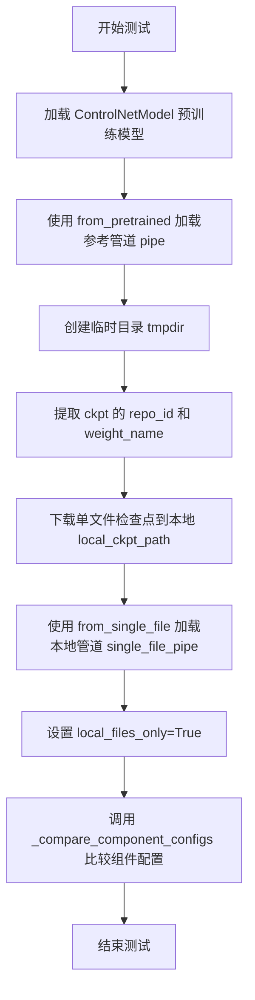

#### 带注释源码

```python
def test_single_file_components_local_files_only(self):
    """
    测试从本地单文件加载的组件配置是否与预训练模型一致
    """
    # 步骤1: 从预训练模型加载 ControlNetModel，指定 fp16 变体和 float16 数据类型
    controlnet = ControlNetModel.from_pretrained(
        "diffusers/controlnet-depth-sdxl-1.0", torch_dtype=torch.float16, variant="fp16"
    )
    
    # 步骤2: 使用 from_pretrained 加载完整的 StableDiffusionXLControlNetPipeline 作为参考
    pipe = self.pipeline_class.from_pretrained(
        self.repo_id,  # "stabilityai/stable-diffusion-xl-base-1.0"
        variant="fp16",
        controlnet=controlnet,
        torch_dtype=torch.float16,
    )

    # 步骤3: 创建临时目录用于存放下载的检查点文件
    with tempfile.TemporaryDirectory() as tmpdir:
        # 步骤4: 从 ckpt_path (URL) 提取 repo_id 和权重名称
        repo_id, weight_name = _extract_repo_id_and_weights_name(self.ckpt_path)
        
        # 步骤5: 下载单文件检查点到本地临时目录
        local_ckpt_path = download_single_file_checkpoint(repo_id, weight_name, tmpdir)

        # 步骤6: 使用 from_single_file 从本地文件加载管道
        # 参数说明:
        #   - local_ckpt_path: 本地检查点文件路径
        #   - controlnet: 已加载的 ControlNet 模型
        #   - safety_checker: 设为 None，禁用安全检查器
        #   - local_files_only: True，强制从本地加载，验证离线可用性
        single_file_pipe = self.pipeline_class.from_single_file(
            local_ckpt_path, controlnet=controlnet, safety_checker=None, local_files_only=True
        )

    # 步骤7: 比较参考管道和单文件加载管道的组件配置是否一致
    self._compare_component_configs(pipe, single_file_pipe)
```


### `TestStableDiffusionXLControlNetPipelineSingleFileSlow.test_single_file_components_with_original_config`

该方法用于验证使用原始配置文件（original_config）加载单文件 Stable Diffusion XL ControlNet Pipeline 的组件配置是否与从预训练模型加载的管道组件配置一致。

参数：

- `self`：调用该方法的实例对象，包含类属性 `pipeline_class`（管道类）、`ckpt_path`（检查点路径）、`repo_id`（仓库 ID）、`original_config`（原始配置文件 URL）

返回值：`None`，该方法通过 `self._compare_component_configs(pipe, pipe_single_file)` 断言比较两个管道的组件配置，若不一致则抛出异常。

#### 流程图

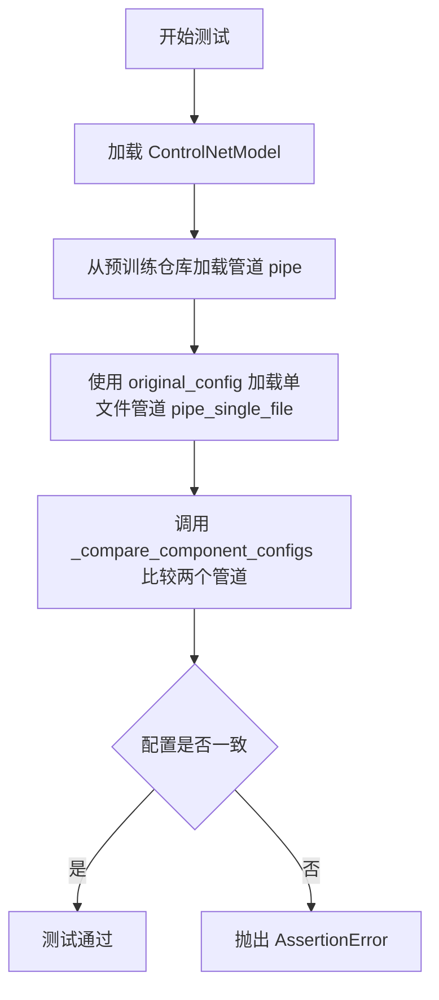

#### 带注释源码

```python
def test_single_file_components_with_original_config(self):
    """
    测试使用 original_config 参数的单文件加载方式，
    验证其组件配置与标准预训练管道一致
    """
    # 步骤1: 加载预训练的 ControlNet 模型
    # 从 HuggingFace Hub 下载 depth 类型的 ControlNet 模型，精度为 float16
    controlnet = ControlNetModel.from_pretrained(
        "diffusers/controlnet-depth-sdxl-1.0", torch_dtype=torch.float16, variant="fp16"
    )
    
    # 步骤2: 从预训练仓库加载完整的 StableDiffusionXLControlNetPipeline
    # 作为基准管道用于后续配置比较
    pipe = self.pipeline_class.from_pretrained(
        self.repo_id,                      # "stabilityai/stable-diffusion-xl-base-1.0"
        variant="fp16",                   # 使用 FP16 变体
        controlnet=controlnet,            # 传入 ControlNet 模型
        torch_dtype=torch.float16,        # 设置张量数据类型
    )

    # 步骤3: 使用 from_single_file 方法加载管道
    # 关键参数 original_config 指定了原始模型配置文件
    # 这样可以从单文件检查点正确解析模型结构
    pipe_single_file = self.pipeline_class.from_single_file(
        self.ckpt_path,                   # 单文件检查点 URL
        original_config=self.original_config,  # 原始配置文件 URL
        controlnet=controlnet,            # 传入 ControlNet 模型
    )
    
    # 步骤4: 比较两个管道的组件配置
    # 验证单文件加载的管道与预训练管道配置完全一致
    self._compare_component_configs(pipe, pipe_single_file)
```

---

### 补充信息

#### 关键组件信息

| 名称 | 描述 |
|------|------|
| `pipeline_class` | StableDiffusionXLControlNetPipeline 类，用于图像生成的 ControlNet 管道 |
| `ckpt_path` | 单文件检查点的 HuggingFace Hub URL |
| `repo_id` | 预训练模型的仓库 ID |
| `original_config` | 原始模型配置文件（YAML）的 URL，用于解析模型架构 |
| `ControlNetModel` | ControlNet 模型类，用于条件图像生成 |

#### 技术债务与优化空间

1. **测试数据依赖外部网络**：测试依赖 HuggingFace Hub 下载模型和配置，在网络不稳定环境下可能失败，建议添加离线测试模式或使用本地缓存
2. **重复的模型加载代码**：多个测试方法重复加载相同的 ControlNet 模型，可提取为类级别的 fixture
3. **硬编码的测试参数**：如 `num_inference_steps=2`、`strength=0.75` 等可在类中统一管理

#### 设计目标与约束

- **设计目标**：验证单文件加载路径（使用 `original_config`）能够正确解析模型结构，生成与标准预训练管道相同配置的管道实例
- **约束条件**：需要 `torch_accelerator` 环境支持，且测试标记为 `@slow`，执行耗时较长

#### 错误处理与异常设计

- **AssertionError**：当 `_compare_component_configs` 检测到配置不一致时抛出，表示单文件加载的组件参数与预期不符
- **网络异常**：若 `original_config` URL 无法访问，会在 `from_single_file` 调用时抛出 `HTTPError` 或 `RepositoryNotFoundError`


### `TestStableDiffusionXLControlNetPipelineSingleFileSlow.test_single_file_components_with_original_config_local_files_only`

该方法用于验证使用本地单文件（safetensors格式）+本地配置文件加载 Stable Diffusion XL ControlNet Pipeline 的功能，通过与标准预训练模型加载方式的组件配置进行对比，确保两种加载方式的兼容性。

参数：无显式参数（使用类属性和self）

返回值：`None`，无返回值（测试方法，通过 `self._compare_component_configs` 断言验证）

#### 流程图

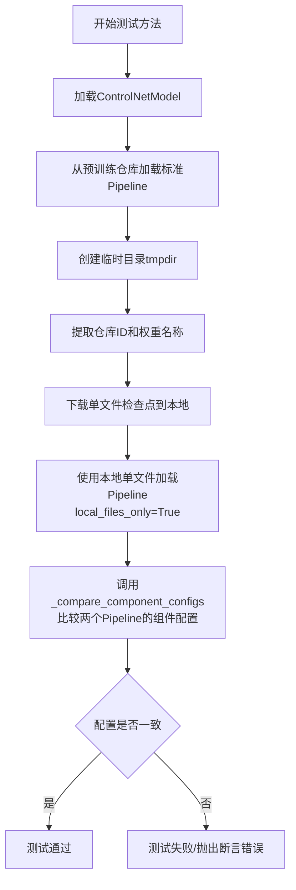

#### 带注释源码

```python
def test_single_file_components_with_original_config_local_files_only(self):
    """
    测试方法：验证本地单文件+原始配置加载
    通过对比 from_pretrained 和 from_single_file 两种方式加载的 Pipeline 组件配置，
    确保本地文件加载模式的正确性
    """
    # 步骤1: 加载 ControlNetModel（用于 ControlNet 引导生成）
    # 从预训练模型 "diffusers/controlnet-depth-sdxl-1.0" 加载
    # 使用 float16 精度和 fp16 变体
    controlnet = ControlNetModel.from_pretrained(
        "diffusers/controlnet-depth-sdxl-1.0", 
        torch_dtype=torch.float16, 
        variant="fp16"
    )
    
    # 步骤2: 使用标准方式从预训练仓库加载 Pipeline
    # self.repo_id = "stabilityai/stable-diffusion-xl-base-1.0"
    # 作为基准参考 Pipeline
    pipe = self.pipeline_class.from_pretrained(
        self.repo_id,          # "stabilityai/stable-diffusion-xl-base-1.0"
        variant="fp16",        # 使用 fp16 变体
        controlnet=controlnet, # 传入 ControlNet 模型
        torch_dtype=torch.float16,
    )

    # 步骤3: 创建临时目录用于存放本地下载的文件
    with tempfile.TemporaryDirectory() as tmpdir:
        # 步骤4: 从远程 URL (self.ckpt_path) 提取仓库ID和权重名称
        # self.ckpt_path = "https://huggingface.co/stabilityai/stable-diffusion-xl-base-1.0/blob/main/sd_xl_base_1.0.safetensors"
        repo_id, weight_name = _extract_repo_id_and_weights_name(self.ckpt_path)
        
        # 步骤5: 下载单文件检查点到本地临时目录
        local_ckpt_path = download_single_file_checkpoint(repo_id, weight_name, tmpdir)

        # 步骤6: 使用本地单文件方式加载 Pipeline
        # local_files_only=True 强制仅使用本地文件，不尝试下载
        # safety_checker=None 禁用安全检查器（测试场景常用配置）
        pipe_single_file = self.pipeline_class.from_single_file(
            local_ckpt_path,    # 本地检查点路径
            safety_checker=None,# 不加载安全检查器
            controlnet=controlnet,
            local_files_only=True,  # 关键参数：仅使用本地文件
        )
    
    # 步骤7: 比较两个 Pipeline 的组件配置是否一致
    # 验证单文件加载方式与标准预训练加载方式的组件配置相同
    self._compare_component_configs(pipe, pipe_single_file)
```


### `TestStableDiffusionXLControlNetPipelineSingleFileSlow.test_single_file_components_with_diffusers_config`

验证使用 Diffusers 配置的单文件加载方式，通过 from_single_file 方法加载单文件检查点并指定 config 参数，然后与标准 from_pretrained 方法加载的管道进行组件配置对比，确保两者配置一致。

参数：

- `self`：`TestStableDiffusionXLControlNetPipelineSingleFileSlow`，测试类实例，包含测试所需的配置信息和辅助方法

返回值：`None`，该方法通过调用父类的 `_compare_component_configs` 方法进行断言验证，直接进行组件配置对比测试

#### 流程图

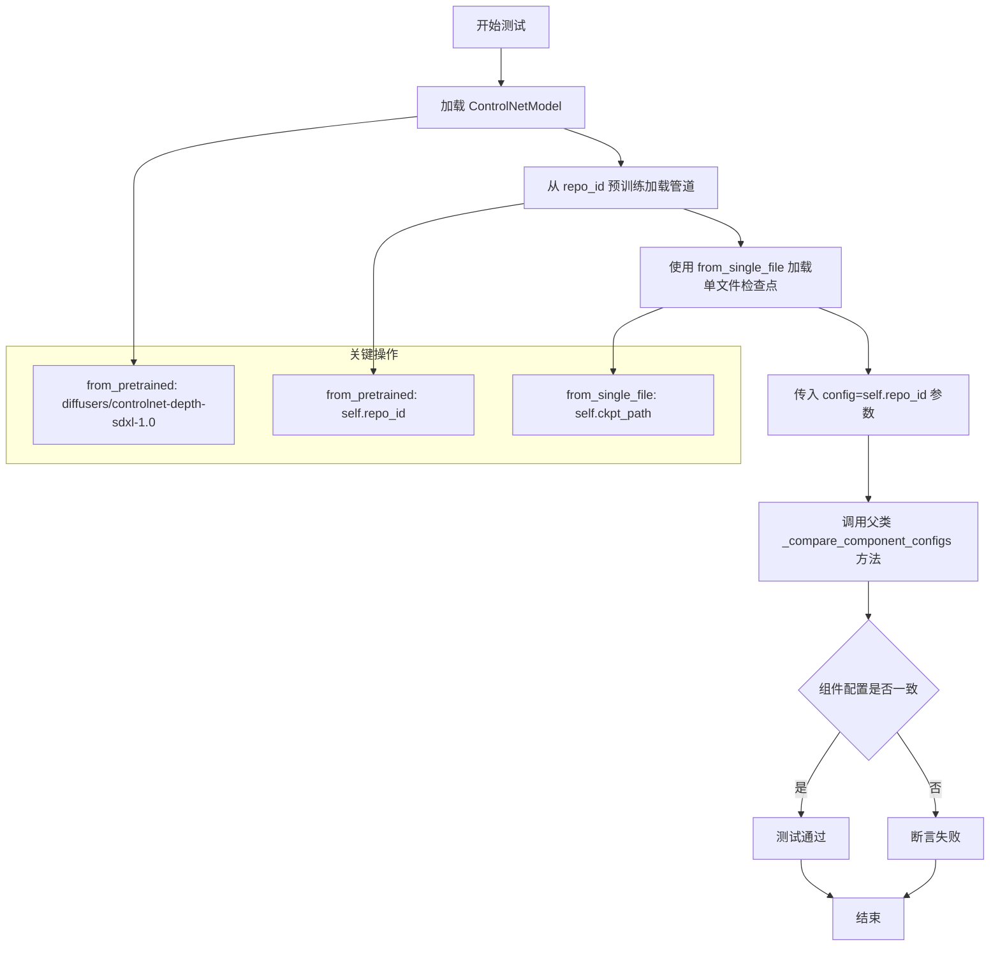

#### 带注释源码

```python
def test_single_file_components_with_diffusers_config(self):
    """
    测试使用 Diffusers 配置的单文件加载方式
    
    该测试验证从单文件检查点加载时传入 config 参数（指向 HuggingFace repo_id），
    能够正确解析配置并与标准 from_pretrained 方式加载的管道进行组件配置对比
    """
    # 步骤1: 从预训练模型加载 ControlNetModel
    # 加载 ControlNet 深度估计模型，使用 fp16 变体以提高推理效率
    controlnet = ControlNetModel.from_pretrained(
        "diffusers/controlnet-depth-sdxl-1.0",  # HuggingFace 模型ID
        torch_dtype=torch.float16,              # 使用半精度浮点数
        variant="fp16"                          # 加载 fp16 变体权重
    )
    
    # 步骤2: 使用标准 from_pretrained 方法加载完整管道
    # 这是对照组的管道加载方式，从完整的 Diffusers 格式模型仓库加载
    pipe = self.pipeline_class.from_pretrained(
        self.repo_id,  # "stabilityai/stable-diffusion-xl-base-1.0"
        controlnet=controlnet  # 传入已加载的 ControlNet 模型
    )
    
    # 步骤3: 使用 from_single_file 方法从单文件加载管道
    # 关键参数: config=self.repo_id，指定使用 Diffusers 格式的配置
    # 这样可以从单文件检查点中提取配置信息，与标准加载方式对齐
    pipe_single_file = self.pipeline_class.from_single_file(
        self.ckpt_path,  # 单文件检查点路径（远程URL）
        controlnet=controlnet,  # 传入 ControlNet 模型
        config=self.repo_id  # 指定 HuggingFace repo_id 作为配置来源
    )
    
    # 步骤4: 调用父类方法比较两个管道的组件配置
    # 验证单文件加载的管道与标准加载的管道在组件配置上是否一致
    super()._compare_component_configs(pipe, pipe_single_file)
```


### `TestStableDiffusionXLControlNetPipelineSingleFileSlow.test_single_file_components_with_diffusers_config_local_files_only`

该测试方法验证了使用本地单文件检查点和本地 Diffusers 配置加载 StableDiffusionXLControlNetPipeline 的功能，通过对比从预训练模型加载的管道组件配置来确保本地加载模式的正确性。

参数：无显式参数（`self` 为隐式参数）

返回值：`None`，该方法为测试方法，执行组件配置比较操作

#### 流程图

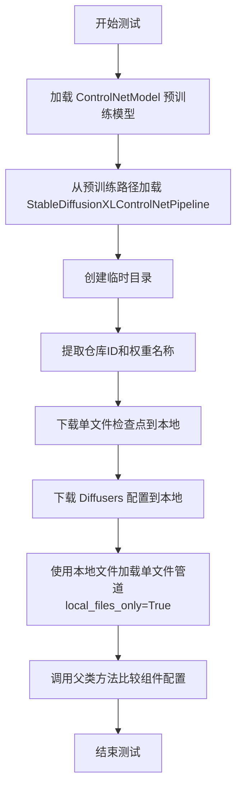

#### 带注释源码

```python
def test_single_file_components_with_diffusers_config_local_files_only(self):
    """
    测试使用本地单文件检查点和本地Diffusers配置加载管道
    验证组件配置与预训练模型加载方式的一致性
    """
    # 第一步：加载预训练的 ControlNetModel
    # 从 HuggingFace 加载 depth 版本的 SDXL ControlNet，使用 fp16 变体
    controlnet = ControlNetModel.from_pretrained(
        "diffusers/controlnet-depth-sdxl-1.0", 
        torch_dtype=torch.float16, 
        variant="fp16"
    )
    
    # 第二步：从预训练路径加载完整的 StableDiffusionXLControlNetPipeline
    # 作为基准参考，用于后续配置比较
    pipe = self.pipeline_class.from_pretrained(
        self.repo_id,
        controlnet=controlnet,
    )
    
    # 第三步：创建临时目录用于存放本地文件
    with tempfile.TemporaryDirectory() as tmpdir:
        # 第四步：从检查点 URL 提取仓库ID和权重名称
        # 使用工具函数解析 https://huggingface.co/.../sd_xl_base_1.0.safetensors
        repo_id, weight_name = _extract_repo_id_and_weights_name(self.ckpt_path)
        
        # 第五步：下载单文件检查点到本地临时目录
        local_ckpt_path = download_single_file_checkpoint(repo_id, weight_name, tmpdir)
        
        # 第六步：下载 Diffusers 配置文件到本地临时目录
        local_diffusers_config = download_diffusers_config(self.repo_id, tmpdir)
        
        # 第七步：使用本地文件加载单文件管道
        # local_files_only=True 强制从本地加载，不尝试网络请求
        # safety_checker=None 禁用安全检查器（测试环境常见做法）
        pipe_single_file = self.pipeline_class.from_single_file(
            local_ckpt_path,
            config=local_diffusers_config,  # 传入本地 Diffusers 配置
            safety_checker=None,
            controlnet=controlnet,
            local_files_only=True,
        )
    
    # 第八步：调用父类方法比较两个管道的组件配置
    # 验证从单文件加载的管道与预训练管道配置一致
    super()._compare_component_configs(pipe, single_file_pipe)
```


### `test_single_file_setting_pipeline_dtype_to_fp16`

该测试方法验证使用单文件（Single File）方式加载StableDiffusionXLControlNetPipeline时，能够正确将管道的dtype设置为fp16（半精度浮点数），确保模型在加载时使用半精度进行推理，以减少内存占用并提高推理速度。

参数：
- `self`：测试类实例本身，包含测试所需的配置信息（如`ckpt_path`、`pipeline_class`等）

返回值：无显式返回值（通过`super()`调用父类的测试方法进行验证，测试通过时无异常，失败时抛出断言错误）

#### 流程图

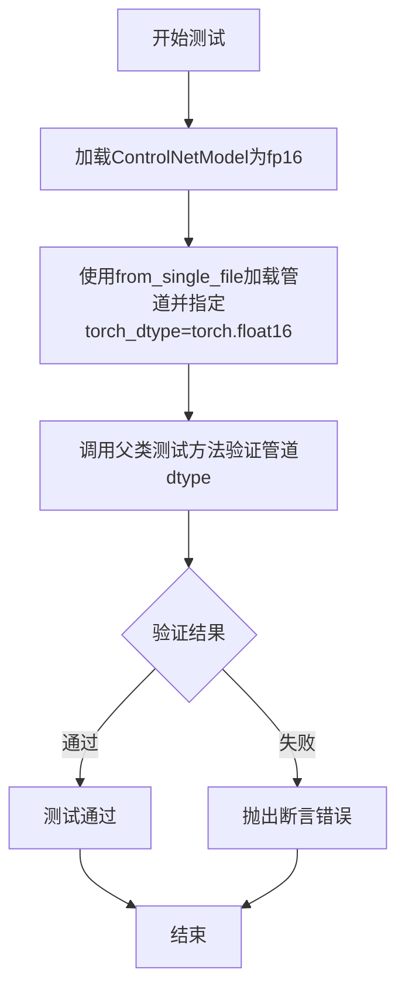

#### 带注释源码

```python
def test_single_file_setting_pipeline_dtype_to_fp16(self):
    """
    测试单文件加载时设置dtype为fp16的功能
    
    该测试验证：
    1. ControlNet模型可以正确加载为fp16精度
    2. 管道可以使用from_single_file方法并指定torch_dtype参数
    3. 父类测试方法会验证管道内部的组件（unet、controlnet等）是否都正确设置为fp16
    """
    # 步骤1: 加载ControlNet模型，指定使用fp16精度和fp16变体
    # from_pretrained: 从预训练模型加载ControlNet
    # torch_dtype=torch.float16: 指定模型参数为半精度浮点数
    # variant="fp16": 使用fp16变体权重
    controlnet = ControlNetModel.from_pretrained(
        "diffusers/controlnet-depth-sdxl-1.0", 
        torch_dtype=torch.float16, 
        variant="fp16"
    )
    
    # 步骤2: 使用单文件方式加载完整的StableDiffusionXLControlNetPipeline
    # from_single_file: 从单个检查点文件加载整个管道
    # self.ckpt_path: 指向SDXL Base 1.0的safetensors检查点URL
    # controlnet: 传入已加载的ControlNet模型
    # safety_checker=None: 禁用安全检查器（用于测试目的）
    # torch_dtype=torch.float16: 关键参数，指定管道使用fp16精度
    single_file_pipe = self.pipeline_class.from_single_file(
        self.ckpt_path, 
        controlnet=controlnet, 
        safety_checker=None, 
        torch_dtype=torch.float16
    )
    
    # 步骤3: 调用父类的测试方法进行实际验证
    # 父类SDXLSingleFileTesterMixin的test_single_file_setting_pipeline_dtype_to_fp16
    # 会检查管道内部的unet、controlnet等组件的dtype是否都是torch.float16
    super().test_single_file_setting_pipeline_dtype_to_fp16(single_file_pipe)
```

## 关键组件


### TestStableDiffusionXLControlNetPipelineSingleFileSlow

测试类，用于验证StableDiffusionXLControlNetPipeline从单文件加载的功能是否与从预训练模型加载等效

### from_single_file

单文件加载方法，支持从单个检查点文件（safetensors格式）加载完整的StableDiffusion XL ControlNet流水线

### ControlNetModel.from_pretrained

控制网模型加载方法，从HuggingFace Hub加载预训练的ControlNet深度估计模型

### StableDiffusionXLControlNetPipeline

StableDiffusion XL ControlNet推理流水线，支持基于深度图的图像生成控制

### torch_dtype (float16)

数据类型转换参数，用于将模型权重从默认的float32转换为float16以节省显存和提高推理速度

### enable_model_cpu_offload

模型CPU卸载功能，通过动态在CPU和GPU之间移动模型层来减少显存占用

### set_default_attn_processor

设置默认注意力处理器，用于配置UNet的注意力机制实现

### _extract_repo_id_and_weights_name

工具函数，从检查点URL中提取HuggingFace仓库ID和权重文件名

### download_single_file_checkpoint

工具函数，从远程仓库下载单文件检查点到本地目录

### download_diffusers_config

工具函数，下载Diffusers格式的配置文件到本地目录

### test_single_file_format_inference_is_same_as_pretrained

核心测试方法，验证单文件加载与预训练模型加载的推理结果一致性，通过余弦相似度距离判断

### test_single_file_components

测试方法，验证单文件加载的组件配置与预训练模型加载的组件配置是否一致

### _compare_component_configs

组件配置比较方法，用于比较两个流水线的模型配置参数是否完全匹配


## 问题及建议


### 已知问题

-   **重复的 ControlNet 模型加载**：8 个测试方法中重复加载相同的 ControlNet 模型（`diffusers/controlnet-depth-sdxl-1.0`），导致测试执行时间长且浪费计算资源
-   **缺少资源清理**：创建的 pipeline 对象（如 `pipe_single_file`、`pipe`）未在测试方法结束时显式释放内存，可能导致显存泄漏
-   **硬编码的模型路径和 URL**：`ckpt_path`、`repo_id` 等关键配置硬编码在类属性中，降低了代码的可维护性和可配置性
-   **测试缺乏异常处理**：未测试网络失败、文件损坏、模型加载错误等异常场景
-   **测试间无隔离**：所有测试共享相同的类级别配置，测试顺序可能影响结果
-   **魔法数字**：阈值 `5e-2`、`num_inference_steps=2`、`strength=0.75` 等参数以魔法数字形式出现，缺乏配置说明
-   **未使用的参数**：`test_single_file_components` 方法中的 `torch_dtype` 参数未实际使用
-   **测试函数过于复杂**：`get_inputs` 方法包含测试数据准备逻辑，混合了测试配置和测试数据

### 优化建议

-   **提取公共资源加载逻辑**：在 `setup_method` 中一次性加载 ControlNet 模型并缓存，避免重复下载
-   **增强资源清理**：在 `teardown_method` 或每个测试方法结束时显式调用 `del` 并清理 GPU 缓存
-   **外部化配置**：将模型路径、URL 等配置提取到测试配置文件或环境变量中
-   **添加异常测试**：增加网络超时、文件不存在、模型加载失败等异常场景的测试用例
-   **使用 fixture 管理资源**：利用 pytest fixture 管理 ControlNet 模型的生命周期，提高资源利用效率
-   **参数化测试**：对关键参数（如 `num_inference_steps`、`strength`）使用 pytest 参数化，减少重复代码
-   **添加超时机制**：为模型加载和推理操作添加超时控制，避免测试长时间挂起
-   **日志增强**：添加更详细的日志记录，便于调试和问题定位

## 其它


### 设计目标与约束

本测试模块旨在验证StableDiffusionXLControlNetPipeline能够正确从单文件（safetensors格式）加载模型权重，并确保其推理结果与从预训练模型加载的推理结果保持一致。约束条件包括：需要GPU加速（@require_torch_accelerator）、测试为慢速测试（@slow）、依赖特定版本的diffusers库、以及需要网络访问以下载模型权重和测试图像。

### 错误处理与异常设计

代码中的错误处理主要依赖于pytest断言机制。在test_single_file_format_inference_is_same_as_pretrained方法中，通过numpy_cosine_similarity_distance计算图像相似度并断言max_diff < 5e-2来验证结果一致性。文件下载使用tempfile.TemporaryDirectory()确保临时文件在测试结束后自动清理。网络相关操作未显式处理超时和重试机制。

### 数据流与状态机

测试数据流：1) setup_method中执行gc.collect()和backend_empty_cache清理GPU内存；2) get_inputs方法生成测试所需的prompt、image、generator等输入参数；3) 测试方法调用pipeline_class.from_single_file或from_pretrained加载模型；4) 执行pipeline推理生成图像；5) teardown_method清理资源。状态转换：初始化→模型加载→推理执行→结果验证→资源清理。

### 外部依赖与接口契约

核心依赖包括：torch（GPU计算）、diffusers库（StableDiffusionXLControlNetPipeline、ControlNetModel）、transformers相关模型。外部资源契约：ckpt_path指向HuggingFace上的safetensors文件、repo_id为"stabilityai/stable-diffusion-xl-base-1.0"、original_config指向Stability-AI的GitHub配置文件、测试图像URL为hf-internal-testing数据集的stormtrooper_depth.png。接口方法：from_single_file支持单文件加载，from_pretrained支持传统目录加载，enable_model_cpu_offload支持CPU卸载。

### 性能考虑

测试使用num_inference_steps=2和较小的图像尺寸（512x512）来降低测试执行时间。使用torch.float16减少显存占用。enable_model_cpu_offload()用于在GPU内存有限时将模型部分卸载到CPU。测试中的max_diff阈值设为5e-2，允许一定的数值精度差异。

### 安全考虑

代码中safety_checker=None用于禁用安全检查器，这在测试环境中是合理的。测试不涉及用户数据处理，仅使用公开的模型和测试图像。临时文件使用tempfile.TemporaryDirectory()自动管理，避免文件泄漏。

### 配置管理

测试配置通过类属性集中管理：pipeline_class指定管道类、ckpt_path指定单文件URL、repo_id指定预训练模型ID、original_config指定原始配置文件URL。测试方法支持多种配置组合：本地文件模式(local_files_only=True)、原始配置文件模式(original_config参数)、diffusers配置模式(config参数)。

### 测试覆盖范围

测试覆盖了6个主要场景：1) 单文件推理结果与预训练模型一致性验证；2) 单文件组件完整性验证；3) 本地文件加载；4) 使用原始配置文件加载；5) 使用diffusers配置加载；6) 数据类型设置(fp16)。每种场景都通过_compare_component_configs方法验证组件配置一致性。

### 潜在的技术债务或优化空间

1) 网络请求缺乏重试机制和超时处理，在网络不稳定时可能导致测试失败；2) 测试图像URL为外部资源，URL变更会导致测试中断；3) 硬编码的模型URL和版本号缺乏配置化管理；4) gc.collect()和empty_cache在每个测试方法中重复调用，可提取为共享的fixture；5) 缺乏对不同GPU型号的兼容性测试；6) 缺少对内存泄漏的长期监控测试；7) 测试使用的num_inference_steps=2过少，可能无法充分验证模型的完整推理流程。

    