# `diffusers\tests\single_file\test_stable_diffusion_xl_img2img_single_file.py` 详细设计文档

该文件包含两个测试类，用于验证Stable Diffusion XL (SDXL) 图像到图像管道从单个safetensors文件加载时与从预训练模型加载时的推理结果一致性，确保单文件格式的模型能够正常工作。

## 整体流程

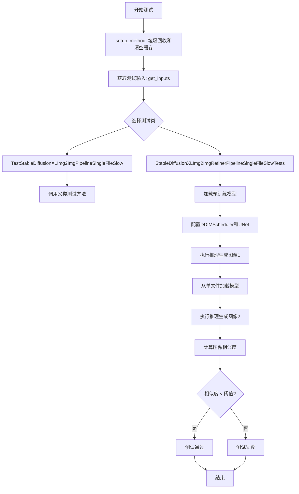

## 类结构

```
SDXLSingleFileTesterMixin (混入类)
└── TestStableDiffusionXLImg2ImgPipelineSingleFileSlow (测试类)
SDXLSingleFileTesterMixin (混入类)
└── StableDiffusionXLImg2ImgRefinerPipelineSingleFileSlowTests (测试类)
```

## 全局变量及字段


### `gc`
    
Python垃圾回收模块，用于手动控制内存管理

类型：`module`
    


### `torch`
    
PyTorch深度学习框架，提供张量计算和神经网络构建功能

类型：`module`
    


### `DDIMScheduler`
    
DDIM调度器类，用于控制扩散模型的采样调度策略

类型：`class`
    


### `StableDiffusionXLImg2ImgPipeline`
    
Stable Diffusion XL图像到图像生成管道类，用于基于文本提示进行图像转换

类型：`class`
    


### `load_image`
    
加载图像工具函数，用于从URL或本地路径加载图像为PIL图像对象

类型：`function`
    


### `backend_empty_cache`
    
清空后端缓存函数，用于释放GPU内存缓存

类型：`function`
    


### `enable_full_determinism`
    
启用完全确定性函数，用于设置随机种子以确保测试可复现性

类型：`function`
    


### `numpy_cosine_similarity_distance`
    
NumPy余弦相似度距离函数，用于计算两个数组之间的余弦距离

类型：`function`
    


### `require_torch_accelerator`
    
要求Torch加速器装饰器，用于标记需要GPU加速的测试

类型：`decorator`
    


### `slow`
    
慢速测试标记装饰器，用于标记耗时较长的测试用例

类型：`decorator`
    


### `torch_device`
    
torch设备变量，指定PyTorch计算设备（如'cuda'或'cpu'）

类型：`str`
    


### `SDXLSingleFileTesterMixin`
    
单文件测试混入类，提供SDXL单文件模型测试的通用方法

类型：`class`
    


### `TestStableDiffusionXLImg2ImgPipelineSingleFileSlow.pipeline_class`
    
SDXL图像到图像管道类，用于执行图像转换任务

类型：`class`
    


### `TestStableDiffusionXLImg2ImgPipelineSingleFileSlow.ckpt_path`
    
单文件模型检查点URL路径，指向HuggingFace上的模型文件

类型：`str`
    


### `TestStableDiffusionXLImg2ImgPipelineSingleFileSlow.repo_id`
    
HuggingFace模型仓库ID，标识预训练模型在Hub上的位置

类型：`str`
    


### `TestStableDiffusionXLImg2ImgPipelineSingleFileSlow.original_config`
    
原始配置文件URL，指向模型原始配置文件（YAML格式）

类型：`str`
    


### `StableDiffusionXLImg2ImgRefinerPipelineSingleFileSlowTests.pipeline_class`
    
SDXL Refiner图像到图像管道类，用于执行精细化图像转换

类型：`class`
    


### `StableDiffusionXLImg2ImgRefinerPipelineSingleFileSlowTests.ckpt_path`
    
Refiner单文件模型检查点URL路径，指向Refiner模型文件

类型：`str`
    


### `StableDiffusionXLImg2ImgRefinerPipelineSingleFileSlowTests.repo_id`
    
HuggingFace Refiner模型仓库ID，标识Refiner模型在Hub上的位置

类型：`str`
    


### `StableDiffusionXLImg2ImgRefinerPipelineSingleFileSlowTests.original_config`
    
Refiner原始配置文件URL，指向Refiner模型原始配置文件

类型：`str`
    
    

## 全局函数及方法


### `enable_full_determinism`

该函数用于启用测试的完全确定性，通过设置随机种子和环境变量确保测试结果可重现，是测试框架中保证测试稳定性和可重复性的关键函数。

参数：

- 该函数无显式参数

返回值：`None`，无返回值

#### 流程图

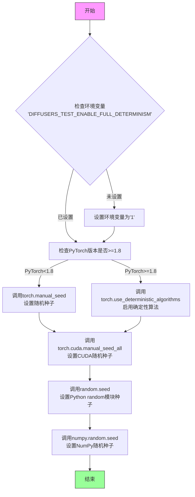

#### 带注释源码

```
# 注意：以下为基于函数名和常见实现的推断源码
# 实际源码位于 diffusers.testing_utils 模块中

def enable_full_determinism(seed: int = 0, extra_seed: Optional[int] = None) -> None:
    """
    启用完全确定性，确保测试结果可重现。
    
    参数:
        seed: 基础随机种子，默认为0
        extra_seed: 额外的随机种子，可选
    返回值:
        无
    """
    # 设置环境变量，标识已启用完全确定性
    os.environ["DIFFUSERS_TEST_ENABLE_FULL_DETERMINISM"] = "1"
    
    # 设置PyTorch确定性算法（PyTorch >= 1.8）
    if hasattr(torch, "use_deterministic_algorithms"):
        torch.use_deterministic_algorithms(True)
    
    # 设置各个随机种子源
    torch.manual_seed(seed)           # PyTorch CPU随机种子
    torch.cuda.manual_seed_all(seed)  # PyTorch CUDA随机种子
    random.seed(seed)                 # Python random模块种子
    np.random.seed(seed)              # NumPy随机种子
    
    # 额外设置：配置CUDA确定性
    torch.backends.cudnn.deterministic = True
    torch.backends.cudnn.benchmark = False
```

**注意**：由于该函数的实际实现位于 `diffusers.testing_utils` 模块中，未在给定代码段内展示，上述源码为基于函数调用场景的合理推断。实际使用中该函数通过 `from ..testing_utils import enable_full_determinism` 导入后直接调用，不传递任何参数。


### `TestStableDiffusionXLImg2ImgPipelineSingleFileSlow.setup_method`

该方法是测试类的初始化方法，在每个测试方法执行前被调用，主要用于清理垃圾回收和清空GPU缓存，确保测试环境处于干净状态，避免之前测试的残留数据影响当前测试结果。

参数：

- `self`：`TestStableDiffusionXLImg2ImgPipelineSingleFileSlow`，测试类实例，隐式参数，表示当前测试类的对象

返回值：`None`，无返回值，该方法仅执行清理操作

#### 流程图

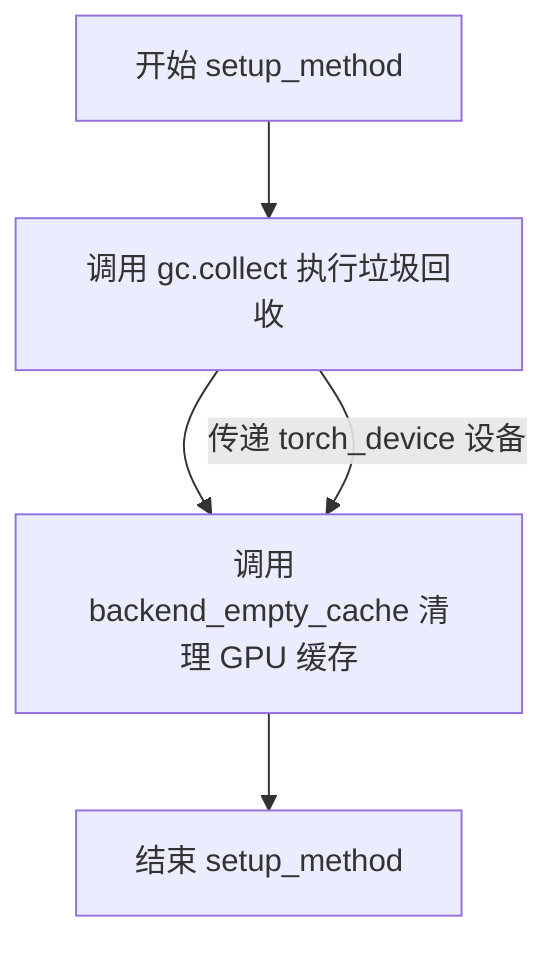

#### 带注释源码

```python
def setup_method(self):
    """
    测试方法初始化准备
    
    在每个测试方法执行前调用，用于清理之前测试可能遗留的
    内存和GPU缓存数据，确保测试环境的干净和一致性。
    """
    # 手动触发 Python 垃圾回收，释放不再使用的对象内存
    gc.collect()
    
    # 清空指定设备（torch_device）的后端缓存
    # 主要是清理 GPU 缓存，避免显存泄漏影响测试
    backend_empty_cache(torch_device)
```


### `TestStableDiffusionXLImg2ImgPipelineSingleFileSlow.teardown_method`

测试方法执行完成后进行资源清理，释放内存和GPU缓存，确保测试环境干净，避免内存泄漏。

参数：

- 无显式参数（隐式参数 `self` 表示测试类实例）

返回值：`None`，无返回值，执行清理操作后直接结束

#### 流程图

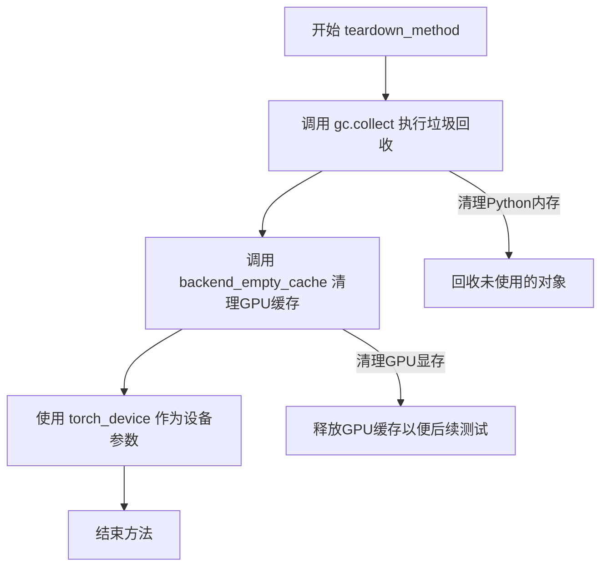

#### 带注释源码

```python
def teardown_method(self):
    """
    测试方法执行完成后的清理工作
    
    该方法在每个测试方法运行结束后自动被调用，
    用于清理测试过程中产生的内存占用和GPU缓存。
    """
    # 执行Python垃圾回收，回收测试过程中创建的不可达对象
    gc.collect()
    
    # 清理GPU/后端缓存，释放显存资源
    # torch_device 是测试工具函数，返回当前测试设备（如 'cuda' 或 'cpu'）
    backend_empty_cache(torch_device)
```


### `TestStableDiffusionXLImg2ImgPipelineSlow.get_inputs`

获取测试输入数据，用于 Stable Diffusion XL Img2Img Pipeline 的单文件测试。

参数：

- `device`：`torch.device`，目标设备，用于指定推理设备
- `generator_device`：`str`，生成器设备，默认为 "cpu"，用于创建随机数生成器
- `dtype`：`torch.dtype`，数据类型，默认为 torch.float32，指定张量数据类型
- `seed`：`int`，随机种子，默认为 0，用于保证测试可复现性

返回值：`Dict`，包含推理所需参数的字典，包含以下键值对：
- `prompt`：str - 文本提示词
- `image`：PIL.Image - 输入图像
- `generator`：torch.Generator - 随机数生成器
- `num_inference_steps`：int - 推理步数
- `strength`：float - 图像变换强度
- `guidance_scale`：float - 引导系数
- `output_type`：str - 输出类型

#### 流程图

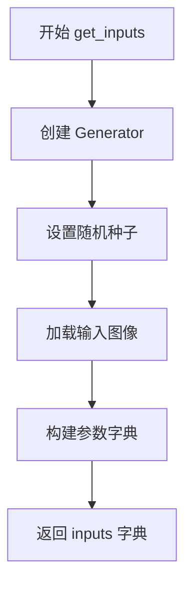

#### 带注释源码

```python
def get_inputs(self, device, generator_device="cpu", dtype=torch.float32, seed=0):
    # 创建一个指定设备的随机数生成器，用于保证图像生成的可复现性
    generator = torch.Generator(device=generator_device).manual_seed(seed)
    
    # 从 Hugging Face 加载测试用的输入图像（山脉素描图）
    init_image = load_image(
        "https://huggingface.co/datasets/diffusers/test-arrays/resolve/main"
        "/stable_diffusion_img2img/sketch-mountains-input.png"
    )
    
    # 构建包含所有推理参数的字典
    inputs = {
        "prompt": "a fantasy landscape, concept art, high resolution",  # 文本提示词
        "image": init_image,                                          # 输入图像
        "generator": generator,                                       # 随机生成器
        "num_inference_steps": 3,                                     # 推理步数（较少用于快速测试）
        "strength": 0.75,                                              # 图像变换强度（0-1）
        "guidance_scale": 7.5,                                         # Classifier-free guidance 引导系数
        "output_type": "np",                                           # 输出为 numpy 数组
    }
    
    # 返回包含完整推理参数的字典
    return inputs
```


### `test_single_file_format_inference_is_same_as_pretrained`

该测试方法验证使用单文件格式（from_single_file）加载的 StableDiffusionXLImg2ImgPipeline 与使用预训练模型（from_pretrained）加载的管道在推理结果上的一致性，确保单文件加载功能正确实现了模型权重和配置的完整加载。

参数：

- `self`：隐式参数，测试类实例本身

返回值：`None`，该方法为测试方法，无返回值，通过断言验证一致性

#### 流程图

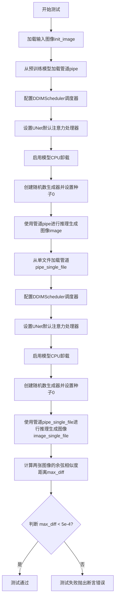

#### 带注释源码

```python
def test_single_file_format_inference_is_same_as_pretrained(self):
    """
    测试单文件格式加载的管道与预训练模型加载的管道推理结果一致性
    """
    # 从URL加载输入图像，用于图像到图像的转换测试
    init_image = load_image(
        "https://huggingface.co/datasets/diffusers/test-arrays/resolve/main"
        "/stable_diffusion_img2img/sketch-mountains-input.png"
    )

    # 步骤1: 使用from_pretrained加载预训练模型管道
    pipe = self.pipeline_class.from_pretrained(self.repo_id, torch_dtype=torch.float16)
    
    # 步骤2: 配置DDIMScheduler调度器，用于控制扩散过程的采样策略
    pipe.scheduler = DDIMScheduler.from_config(pipe.scheduler.config)
    
    # 步骤3: 设置UNet的默认注意力处理器，确保推理一致性
    pipe.unet.set_default_attn_processor()
    
    # 步骤4: 启用模型CPU卸载，节省GPU显存
    pipe.enable_model_cpu_offload(device=torch_device)

    # 步骤5: 创建固定种子的随机数生成器，确保可重复性
    generator = torch.Generator(device="cpu").manual_seed(0)
    
    # 步骤6: 使用预训练管道进行推理，生成图像
    image = pipe(
        prompt="mountains", 
        image=init_image, 
        num_inference_steps=5, 
        generator=generator, 
        output_type="np"
    ).images[0]

    # 步骤7: 使用from_single_file从单文件加载管道
    pipe_single_file = self.pipeline_class.from_single_file(self.ckpt_path, torch_dtype=torch.float16)
    
    # 步骤8: 配置单文件管道的调度器
    pipe_single_file.scheduler = DDIMScheduler.from_config(pipe_single_file.scheduler.config)
    
    # 步骤9: 设置单文件管道的UNet默认注意力处理器
    pipe_single_file.unet.set_default_attn_processor()
    
    # 步骤10: 启用单文件管道的模型CPU卸载
    pipe_single_file.enable_model_cpu_offload(device=torch_device)

    # 步骤11: 创建相同种子的随机数生成器
    generator = torch.Generator(device="cpu").manual_seed(0)
    
    # 步骤12: 使用单文件管道进行推理，生成图像
    image_single_file = pipe_single_file(
        prompt="mountains", 
        image=init_image, 
        num_inference_steps=5, 
        generator=generator, 
        output_type="np"
    ).images[0]

    # 步骤13: 计算两张图像的余弦相似度距离
    max_diff = numpy_cosine_similarity_distance(image.flatten(), image_single_file.flatten())

    # 步骤14: 断言两张图像的差异小于阈值，确保一致性
    assert max_diff < 5e-4
```


### `TestStableDiffusionXLImg2ImgPipelineSingleFileSlow.setup_method`

测试前设置方法，用于在每个测试方法运行前执行垃圾回收和清空GPU缓存，以确保测试环境处于干净状态。

参数：

- `self`：`TestStableDiffusionXLImg2ImgPipelineSingleFileSlow`，类实例自身引用，当前测试类的实例

返回值：`None`，无返回值

#### 流程图

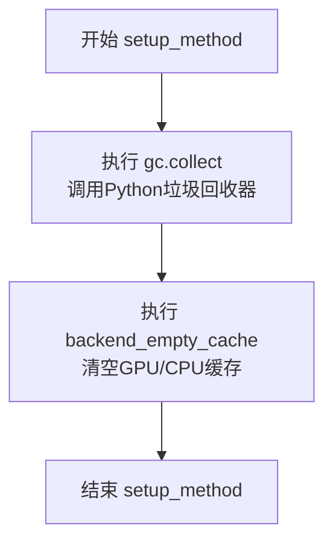

#### 带注释源码

```python
def setup_method(self):
    """
    Pytest setup method - 在每个测试方法运行前调用
    用于初始化测试环境，确保没有残留的GPU内存或Python对象
    """
    # 调用Python的垃圾回收器，清理不再使用的Python对象
    gc.collect()
    
    # 调用后端特定的缓存清空函数，释放GPU显存
    # torch_device 是全局变量，表示当前测试使用的设备（如 'cuda:0'）
    backend_empty_cache(torch_device)
```


### `TestStableDiffusionXLImg2ImgPipelineSingleFileSlow.teardown_method`

测试后清理方法，负责垃圾回收和清空GPU缓存，释放测试过程中占用的内存资源。

参数：

- `self`：`TestStableDiffusionXLImg2ImgPipelineSingleFileSlow`，测试类实例，代表当前测试类本身（隐式参数，无需显式传入）

返回值：`None`，无返回值，执行清理操作后直接结束

#### 流程图

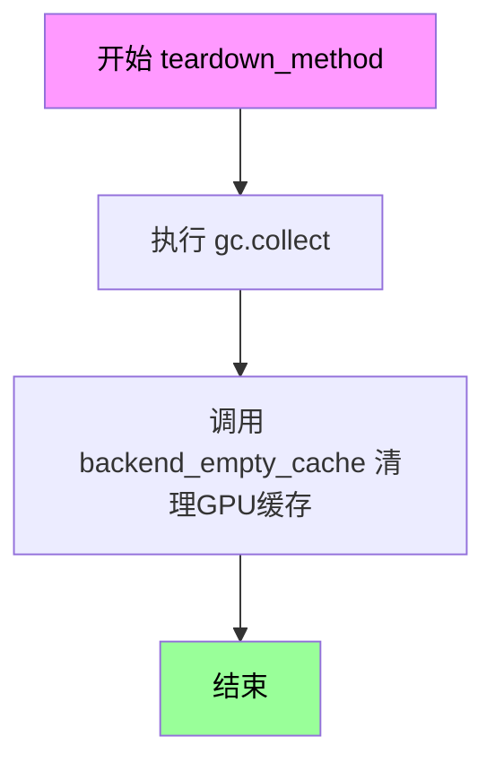

#### 带注释源码

```python
def teardown_method(self):
    """
    测试方法结束后的清理操作
    
    该方法在每个测试用例执行完毕后自动调用，
    用于清理测试过程中产生的内存占用和GPU缓存，
    确保测试环境不会因为资源未释放而影响后续测试。
    """
    # 触发Python垃圾回收器，回收测试过程中创建的无法访问的对象
    gc.collect()
    
    # 调用后端特定函数清空GPU缓存，释放显存资源
    # torch_device 是全局变量，指定了当前使用的计算设备
    backend_empty_cache(torch_device)
```


### `TestStableDiffusionXLImg2ImgPipelineSingleFileSlow.get_inputs`

该方法是Stable Diffusion XL图像到图像（Img2Img）管道单文件慢速测试的输入数据准备函数，用于构建包含提示词、初始图像、生成器、推理步数、强度、引导比例和输出类型等参数的字典，为后续的图像生成测试提供标准化的输入数据。

参数：

- `device`：`str`，目标计算设备（如"cuda"、"cpu"），指定推理时模型运行的设备
- `generator_device`：`str`，生成器设备，默认为"cpu"，用于创建随机数生成器
- `dtype`：`torch.dtype`，数据类型，默认为torch.float32，指定张量的数据类型
- `seed`：`int`，随机种子，默认为0，用于确保测试结果的可重复性

返回值：`Dict[str, Any]`，包含以下键值的字典：
- `prompt`（str）：文本提示词，描述期望生成的图像内容
- `image`（PIL.Image）：初始图像，作为图像到图像转换的输入
- `generator`（torch.Generator）：PyTorch随机数生成器，确保生成过程的可确定性
- `num_inference_steps`（int）：推理步数，设置为3用于快速测试
- `strength`（float）：转换强度，0.75表示保留75%的原始图像特征
- `guidance_scale`（float）：引导比例，7.5用于平衡提示词引导和样本多样性
- `output_type`（str）：输出类型，"np"表示返回NumPy数组

#### 流程图

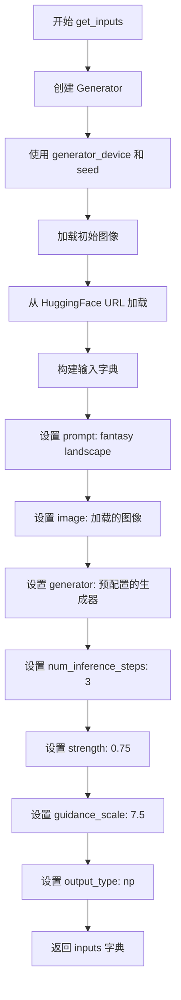

#### 带注释源码

```python
def get_inputs(self, device, generator_device="cpu", dtype=torch.float32, seed=0):
    """
    准备测试输入数据
    
    参数:
        device: 目标计算设备
        generator_device: 生成器设备，默认为"cpu"
        dtype: 数据类型，默认为torch.float32
        seed: 随机种子，默认为0
    
    返回:
        包含所有管道参数的字典
    """
    # 使用指定的设备创建随机数生成器
    # 确保测试的可重复性
    generator = torch.Generator(device=generator_device).manual_seed(seed)
    
    # 从远程URL加载初始图像
    # 该图像作为图像到图像转换的输入
    init_image = load_image(
        "https://huggingface.co/datasets/diffusers/test-arrays/resolve/main"
        "/stable_diffusion_img2img/sketch-mountains-input.png"
    )
    
    # 构建输入参数字典
    # 包含所有必要的管道参数
    inputs = {
        "prompt": "a fantasy landscape, concept art, high resolution",  # 文本提示词
        "image": init_image,                                          # 初始输入图像
        "generator": generator,                                       # 确定性生成器
        "num_inference_steps": 3,                                     # 推理步数（低值用于测试）
        "strength": 0.75,                                            # 转换强度
        "guidance_scale": 7.5,                                       # CFG引导比例
        "output_type": "np",                                         # NumPy数组输出
    }
    
    return inputs  # 返回输入字典供管道使用
```

---

### 类的详细信息

#### `TestStableDiffusionXLImg2ImgPipelineSingleFileSlow`

**类字段：**

- `pipeline_class`：StableDiffusionXLImg2ImgPipeline，管道类
- `ckpt_path`：str，模型检查点远程路径
- `repo_id`：`str`，HuggingFace模型仓库ID
- `original_config`：str，原始配置文件URL

**类方法：**

- `setup_method`：测试前的环境准备（GC和缓存清理）
- `teardown_method`：测试后的环境清理
- `get_inputs`：准备测试输入数据
- `test_single_file_format_inference_is_same_as_pretrained`：验证单文件格式推理结果与预训练模型一致

---

### 关键组件信息

| 组件名称 | 描述 |
|---------|------|
| `StableDiffusionXLImg2ImgPipeline` | Stable Diffusion XL图像到图像转换管道 |
| `torch.Generator` | PyTorch随机数生成器，用于确保测试可重复性 |
| `load_image` | 从URL加载PIL图像的工具函数 |
| `SDXLSingleFileTesterMixin` | 单文件测试混入类，提供通用测试方法 |

---

### 潜在的技术债务或优化空间

1. **硬编码的URL和参数**：图像URL和默认参数硬编码在方法中，缺乏灵活性
2. **测试参数过于简化**：`num_inference_steps=3`仅为快速测试设计，不反映真实生产环境
3. **缺少错误处理**：网络请求加载图像缺乏重试机制和超时处理
4. **设备管理不一致**：`device`和`generator_device`分离可能导致设备不匹配问题

---

### 其它项目

#### 设计目标与约束
- **目标**：验证单文件格式的SDXL Img2Img管道与完整预训练模型输出的一致性
- **约束**：受`@slow`和`@require_torch_accelerator`装饰器限制，仅在GPU环境运行

#### 错误处理与异常设计
- 图像加载失败会导致测试中断
- 网络连接问题未被显式处理

#### 数据流与状态机
- 输入准备 → 管道调用 → 输出验证的标准测试流程

#### 外部依赖与接口契约
- 依赖HuggingFace Hub远程模型和测试数据集
- 输入格式必须符合`StableDiffusionXLImg2ImgPipeline`的要求


### `TestStableDiffusionXLImg2ImgPipelineSingleFileSlow.test_single_file_format_inference_is_same_as_pretrained`

验证单文件格式（safetensors）推理结果与预训练模型（from_pretrained）一致，确保两种加载方式产生的图像差异在可接受范围内（1e-3）。

参数：

- `self`：`TestStableDiffusionXLImg2ImgPipelineSingleFileSlow`，测试类实例，隐含参数，包含 pipeline_class、ckpt_path、repo_id 等配置属性

返回值：`None`，无显式返回值，该方法为测试方法，通过内部断言验证结果一致性

#### 流程图

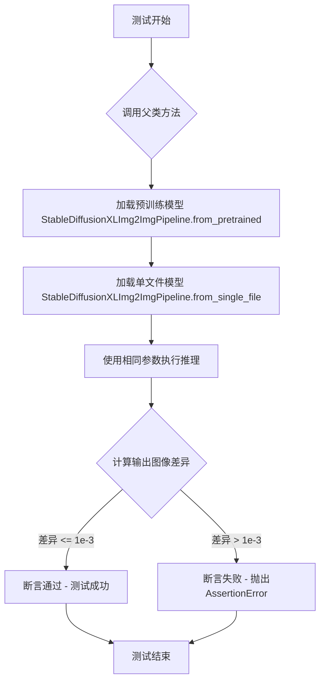

#### 带注释源码

```python
def test_single_file_format_inference_is_same_as_pretrained(self):
    """
    验证单文件格式推理结果与预训练模型一致。
    
    该测试方法继承自 SDXLSingleFileTesterMixin 父类，通过调用父类方法
    比较 from_pretrained 和 from_single_file 两种方式加载的模型
    在相同输入条件下的推理结果差异。
    
    测试流程：
    1. 使用 from_pretrained 加载预训练模型
    2. 使用 from_single_file 加载单文件格式模型
    3. 使用相同种子、相同推理参数生成图像
    4. 计算两张图像的余弦相似度距离
    5. 断言差异值小于 expected_max_diff (1e-3)
    
    Args:
        self: TestStableDiffusionXLImg2ImgPipelineSingleFileSlow 的实例
              包含以下配置属性：
              - pipeline_class: StableDiffusionXLImg2ImgPipeline
              - ckpt_path: "https://huggingface.co/.../sd_xl_base_1.0.safetensors"
              - repo_id: "stabilityai/stable-diffusion-xl-base-1.0"
              - original_config: "https://raw.githubusercontent.com/.../sd_xl_base.yaml"
    
    Returns:
        None: 测试方法，通过断言验证，不返回具体值
    
    Raises:
        AssertionError: 当两种加载方式的推理结果差异超过 expected_max_diff 时抛出
    """
    # 调用父类 SDXLSingleFileTesterMixin 的同名测试方法
    # 传入预期最大差异阈值 1e-3
    super().test_single_file_format_inference_is_same_as_pretrained(expected_max_diff=1e-3)
```


### `StableDiffusionXLImg2ImgRefinerPipelineSingleFileSlowTests.test_single_file_format_inference_is_same_as_pretrained`

验证Refiner单文件格式推理结果与预训练模型一致，通过加载预训练仓库模型和单文件格式模型，使用相同的输入参数生成图像，并比较两者输出图像的余弦相似度距离是否在允许范围内。

参数：

- `self`：类实例方法隐含参数，无需显式传递

返回值：`assert max_diff < 5e-4`，无显式返回值，通过断言验证预训练模型与单文件模型生成的图像余弦相似度距离小于阈值5e-4

#### 流程图

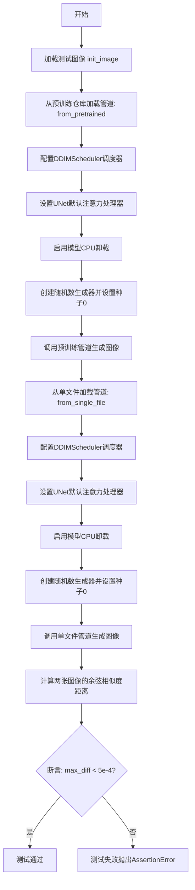

#### 带注释源码

```python
def test_single_file_format_inference_is_same_as_pretrained(self):
    """
    测试单文件格式推理结果与预训练模型是否一致
    验证从单文件加载的模型与从预训练仓库加载的模型产生相同的输出
    """
    # 加载测试用的输入图像（山脉风景）
    init_image = load_image(
        "https://huggingface.co/datasets/diffusers/test-arrays/resolve/main"
        "/stable_diffusion_img2img/sketch-mountains-input.png"
    )

    # ========== 第一部分：加载预训练模型并生成图像 ==========
    # 从预训练仓库加载StableDiffusionXLImg2ImgPipeline管道
    # 使用float16精度以提高推理速度
    pipe = self.pipeline_class.from_pretrained(self.repo_id, torch_dtype=torch.float16)
    
    # 配置DDIMScheduler调度器，用于控制去噪采样过程
    pipe.scheduler = DDIMScheduler.from_config(pipe.scheduler.config)
    
    # 设置UNet使用默认的注意力处理器
    pipe.unet.set_default_attn_processor()
    
    # 启用模型CPU卸载以节省GPU显存
    pipe.enable_model_cpu_offload(device=torch_device)

    # 创建固定种子的随机数生成器，确保结果可复现
    generator = torch.Generator(device="cpu").manual_seed(0)
    
    # 调用管道进行图像到图像的生成
    # 参数：prompt提示词、input图像、推理步数、生成器、输出类型
    image = pipe(
        prompt="mountains", 
        image=init_image, 
        num_inference_steps=5, 
        generator=generator, 
        output_type="np"
    ).images[0]

    # ========== 第二部分：加载单文件模型并生成图像 ==========
    # 从单文件格式（safetensors）加载模型
    pipe_single_file = self.pipeline_class.from_single_file(self.ckpt_path, torch_dtype=torch.float16)
    
    # 同样配置调度器和处理器
    pipe_single_file.scheduler = DDIMScheduler.from_config(pipe_single_file.scheduler.config)
    pipe_single_file.unet.set_default_attn_processor()
    pipe_single_file.enable_model_cpu_offload(device=torch_device)

    # 使用相同的种子确保可比较性
    generator = torch.Generator(device="cpu").manual_seed(0)
    
    # 使用单文件模型生成图像
    image_single_file = pipe_single_file(
        prompt="mountains", 
        image=init_image, 
        num_inference_steps=5, 
        generator=generator, 
        output_type="np"
    ).images[0]

    # ========== 第三部分：比较结果 ==========
    # 计算两张图像的余弦相似度距离（展平后）
    max_diff = numpy_cosine_similarity_distance(image.flatten(), image_single_file.flatten())

    # 断言：两张图像的差异必须小于5e-4，否则测试失败
    assert max_diff < 5e-4
```


### `SDXLSingleFileTesterMixin.test_single_file_format_inference_is_same_as_pretrained`

该方法是 SDXLSingleFileTesterMixin 类的核心测试方法，用于验证使用 `from_single_file` 方法加载的模型与使用 `from_pretrained` 方法加载的预训练模型在进行图像到图像转换推理时的结果一致性，确保单文件格式加载不会引入精度损失。

参数：

-  `expected_max_diff`：`float`，预期最大差异阈值，用于判断单文件加载和预训练加载的推理结果是否在可接受范围内，默认值为 1e-3

返回值：`None`，该方法通过断言验证模型推理结果的一致性，如果不一致则抛出断言错误

#### 流程图

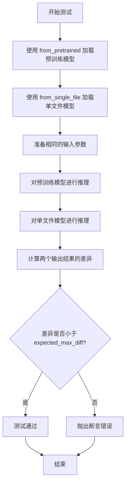

#### 带注释源码

```python
def test_single_file_format_inference_is_same_as_pretrained(self, expected_max_diff=1e-3):
    """
    测试单文件格式推理是否与预训练模型结果相同
    
    参数:
        expected_max_diff: float, 允许的最大差异阈值，默认值为1e-3
    
    该测试方法执行以下步骤:
    1. 使用 from_pretrained 加载预训练模型
    2. 使用 from_single_file 加载单文件格式模型
    3. 使用相同的输入对两个模型进行推理
    4. 比较输出结果的差异是否在预期范围内
    """
    # 1. 从预训练仓库加载模型
    pipe = self.pipeline_class.from_pretrained(self.repo_id, torch_dtype=torch.float16)
    
    # 2. 配置调度器和处理器
    pipe.scheduler = DDIMScheduler.from_config(pipe.scheduler.config)
    pipe.unet.set_default_attn_processor()
    pipe.enable_model_cpu_offload(device=torch_device)
    
    # 3. 准备输入数据
    generator = torch.Generator(device="cpu").manual_seed(0)
    init_image = load_image("...")
    
    # 4. 执行预训练模型推理
    image = pipe(
        prompt="mountains", 
        image=init_image, 
        num_inference_steps=5, 
        generator=generator, 
        output_type="np"
    ).images[0]
    
    # 5. 从单文件加载模型
    pipe_single_file = self.pipeline_class.from_single_file(self.ckpt_path, torch_dtype=torch.float16)
    pipe_single_file.scheduler = DDIMScheduler.from_config(pipe_single_file.scheduler.config)
    pipe_single_file.unet.set_default_attn_processor()
    pipe_single_file.enable_model_cpu_offload(device=torch_device)
    
    # 6. 执行单文件模型推理
    generator = torch.Generator(device="cpu").manual_seed(0)
    image_single_file = pipe_single_file(
        prompt="mountains", 
        image=init_image, 
        num_inference_steps=5, 
        generator=generator, 
        output_type="np"
    ).images[0]
    
    # 7. 计算差异并断言
    max_diff = numpy_cosine_similarity_distance(image.flatten(), image_single_file.flatten())
    
    assert max_diff < expected_max_diff
```


## 关键组件


### TestStableDiffusionXLImg2ImgPipelineSingleFileSlow

用于测试StableDiffusionXL基础模型单文件格式推理一致性的测试类，继承SDXLSingleFileTesterMixin，通过比较from_pretrained和from_single_file两种方式加载的模型推理结果来验证一致性。

### StableDiffusionXLImg2ImgRefinerPipelineSingleFileSlowTests

用于测试StableDiffusionXL Refiner模型单文件格式推理一致性的测试类，同样通过对比两种加载方式的推理结果来验证模型转换的正确性。

### get_inputs

准备测试输入数据的方法，生成包含prompt、image、generator、num_inference_steps、strength、guidance_scale和output_type的字典，用于管道推理。

### test_single_file_format_inference_is_same_as_pretrained

核心测试方法，通过numpy_cosine_similarity_distance计算两张图像的余弦相似度距离，验证单文件格式加载的模型与预训练模型推理结果的一致性。

### StableDiffusionXLImg2ImgPipeline

diffusers库中的图像到图像扩散管道类，支持从预训练模型或单文件格式加载，用于SDXL图像生成任务。

### DDIMScheduler

用于控制扩散模型采样过程的调度器，通过from_config方法从已有调度器配置创建实例。

### from_pretrained

从HuggingFace Hub或本地目录加载预训练模型管道的方法。

### from_single_file

从单个safetensors文件加载模型管道的方法，支持简化模型部署和分发。

### load_image

从URL加载图像的辅助函数，返回PIL Image对象用于管道输入。

### enable_model_cpu_offload

模型CPU卸载功能，将不活跃的模型组件移至CPU以节省GPU显存。

### numpy_cosine_similarity_distance

计算两幅图像之间余弦相似度距离的函数，用于量化推理结果差异。

### set_default_attn_processor

设置UNet默认注意力处理器的方法，用于控制注意力机制实现。


## 问题及建议


### 已知问题

- **类命名不规范**：`StableDiffusionXLImg2ImgRefinerPipelineSingleFileSlowTests` 类名不以 `Test` 开头，不符合 pytest 测试类命名规范，可能导致该测试类无法被自动发现和执行
- **类继承缺失**：`StableDiffusionXLImg2ImgRefinerPipelineSingleFileSlowTests` 没有继承任何测试基类或 mixin，与 `TestStableDiffusionXLImg2ImgPipelineSingleFileSlow` 的实现方式不一致，导致代码重复
- **代码重复**：两个测试类中使用了相同的初始化图像 URL（`https://huggingface.co/datasets/diffusers/test-arrays/resolve/main/stable_diffusion_img2img/sketch-mountains-input.png`），违反 DRY 原则
- **设备硬编码**：在 `StableDiffusionXLImg2ImgRefinerPipelineSingleFileSlowTests.test_single_file_format_inference_is_same_as_pretrained` 方法中，`generator` 设备硬编码为 `"cpu"`，但测试运行在 `torch_device` 上，可能导致设备不一致问题
- **资源未清理**：测试方法中没有显式删除 pipeline 对象，虽然调用了 `gc.collect()` 和 `backend_empty_cache`，但 pipeline 对象可能仍然占用 GPU 内存
- **网络请求无错误处理**：加载图像和模型 URL 没有异常处理，网络请求失败时测试会直接崩溃
- **缺少类型注解**：所有方法参数和返回值都缺少类型注解，降低了代码的可读性和可维护性
- **魔法数字**：`num_inference_steps`（3、5）、`strength`（0.75）、`guidance_scale`（7.5）等参数值作为魔法数字存在，没有常量定义或配置说明

### 优化建议

- 将 `StableDiffusionXLImg2ImgRefinerPipelineSingleFileSlowTests` 重命名为 `TestStableDiffusionXLImg2ImgRefinerPipelineSingleFileSlow` 并继承 `SDXLSingleFileTesterMixin`，复用父类方法
- 将共享的初始化图像 URL 提取为类属性或常量，避免重复定义
- 统一使用 `torch_device` 作为 generator 设备，或从配置中读取设备参数
- 在测试方法结束后显式删除 pipeline 对象（使用 `del pipe`），或使用 pytest fixture 管理资源
- 添加网络请求的重试机制或超时处理，并捕获可能的异常（如 `requests.exceptions.RequestException`）
- 为方法参数和返回值添加类型注解，提高代码可读性
- 将魔法数字提取为类属性或配置常量，如 `self.num_inference_steps = 5`、`self.strength = 0.75` 等

## 其它


### 设计目标与约束

**设计目标**：
验证 `StableDiffusionXLImg2ImgPipeline` 通过单文件（Single File）方式加载后的推理结果与通过标准预训练仓库（Pretrained Repository）加载的推理结果在数值精度上保持高度一致，确保单文件加载功能的正确性。

**约束条件**：
- **精度要求**：Base 模型允许最大差异阈值 `1e-3`，Refiner 模型允许最大差异阈值 `5e-4`。
- **硬件要求**：测试标记为 `@slow` 和 `@require_torch_accelerator`，必须在带有 GPU 的环境中运行。
- **推理限制**：为控制测试时间，Base 测试限制为 `num_inference_steps=3`，Refiner 测试限制为 `num_inference_steps=5`。
- **数据类型**：强制使用 `torch.float16` 以模拟实际部署场景。

### 错误处理与异常设计

**网络依赖异常**：
- 测试依赖 HuggingFace Hub 下载模型权重（`ckpt_path`, `repo_id`）和测试输入图像（`load_image` URL）。
- 若网络不可达或资源 404，测试将抛出异常并失败，这是集成测试的预期行为。

**资源耗尽 (OOM) 处理**：
- 使用 `enable_model_cpu_offload` 尝试将模型权重在推理后卸载至 CPU，防止单卡显存不足。
- 在 `setup` 和 `teardown` 阶段显式调用 `gc.collect()` 和 `backend_empty_cache` 尝试回收显存。
- 若显存严重不足，将触发 PyTorch Runtime Error。

**断言逻辑**：
- 使用 `assert max_diff < threshold` 判断一致性。
- 若推理结果差异过大，抛出 `AssertionError` 并附带具体的差异数值，便于定位模型加载或权重转换问题。

### 数据流与状态机

**状态流程**：
1.  **初始化 (Init)**：
    - 加载输入图像 `init_image`。
    - 初始化 PyTorch 生成器 `generator` 并设置固定种子。
2.  **模型加载 (Load)**：
    - 路径 A：调用 `pipeline_class.from_pretrained(self.repo_id)` 加载标准模型。
    - 路径 B：调用 `pipeline_class.from_single_file(self.ckpt_path)` 加载单文件模型。
3.  **推理执行 (Inference)**：
    - 分别使用相同的 `prompt`, `num_inference_steps`, `strength`, `guidance_scale` 执行推理。
4.  **结果对比 (Compare)**：
    - 提取生成的图像数组。
    - 使用 `numpy_cosine_similarity_distance` 计算差异。
5.  **清理 (Cleanup)**：
    - 释放模型及中间变量占用的显存。

### 外部依赖与接口契约

**核心依赖库**：
- `diffusers`：提供 `StableDiffusionXLImg2ImgPipeline`, `DDIMScheduler`。
- `torch`：深度学习计算框架。
- `PIL` / `diffusers.utils`：图像加载与处理。
- `numpy`：数值计算。

**关键接口契约**：
- `StableDiffusionXLImg2ImgPipeline.from_pretrained(...)`: 标准 Hub 加载接口。
- `StableDiffusionXLImg2ImgPipeline.from_single_file(...)`: 单文件加载接口，依赖 `original_config` 解析模型结构。
- `load_image(...)`: 从 URL 异步下载并转换为 PIL Image 对象。
- `numpy_cosine_similarity_distance(...)`: 用于比较两幅图像像素级差异的度量函数。

### 测试环境与资源配置

**环境标记**：
- `@slow`：标记为慢速测试，不会在常规快速 CI 中运行。
- `@require_torch_accelerator`：强制要求 CUDA 设备。

**确定性保障**：
- 调用 `enable_full_determinism()` 全局配置，以锁定随机种子和 cuDNN 算子，确保在相同硬件下结果可复现。

### 性能基准与优化

**推理性能**：
- 尽管使用了较少的推理步数（3-5 步）来加快测试，但作为参考，单次 SDXL Img2Img 推理在消费级 GPU 上通常需要数秒到数十秒。
- 通过 `enable_model_cpu_offload` 牺牲一定的推理速度以换取显存空间的优化策略在此测试中被采用。

**资源占用**：
- 测试峰值显存占用取决于模型大小（Base 约 6-7GB, Refiner 类似），加上输入图像和中间激活值，需留有足够余量。

### 关键组件交互

- **SDXLSingleFileTesterMixin**: 提供通用的测试逻辑模板（Mixin），被 `TestStableDiffusionXLImg2ImgPipelineSingleFileSlow` 继承复用。
- **StableDiffusionXLImg2ImgRefinerPipelineSingleFileSlowTests**: 显式实现了测试逻辑，展示了不通过 Mixin 直接编写测试用例的方式，用于对比 Refiner 模型。

### 潜在技术债务与优化空间

- **资源清理缺失**：`StableDiffusionXLImg2ImgRefinerPipelineSingleFileSlowTests` 类未定义 `setup_method` 和 `teardown_method`，连续运行可能导致显存泄漏（虽然通常测试套件运行间隔会清理）。建议统一资源管理。
- **代码冗余**：Refiner 测试类中手动复制了 `from_pretrained` 和 `from_single_file` 的加载与对比逻辑，与父类Mixin 高度重复，建议重构以复用通用逻辑。
- **URL 硬编码**：测试图片 URL 和模型 URL 硬编码在类属性中，缺乏灵活性，一旦资源失效测试将无法运行。

    