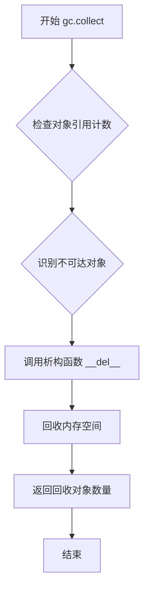
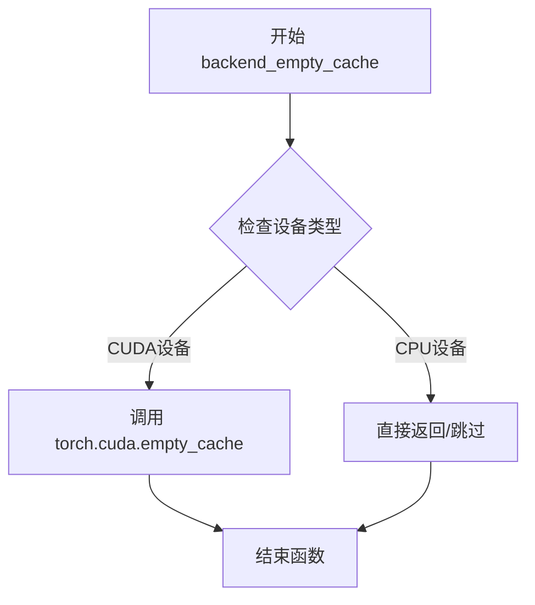
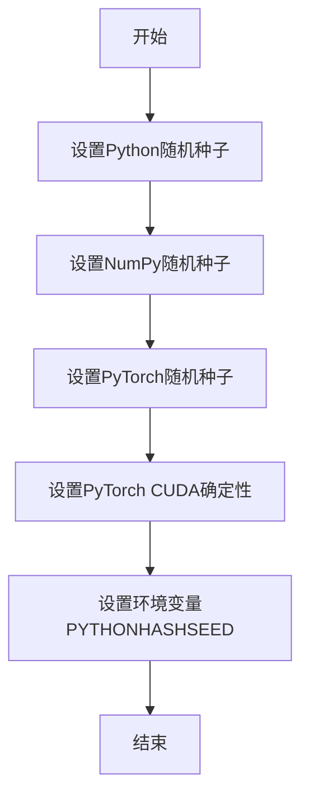
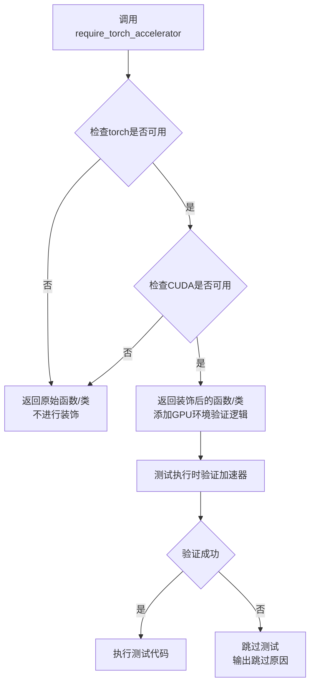
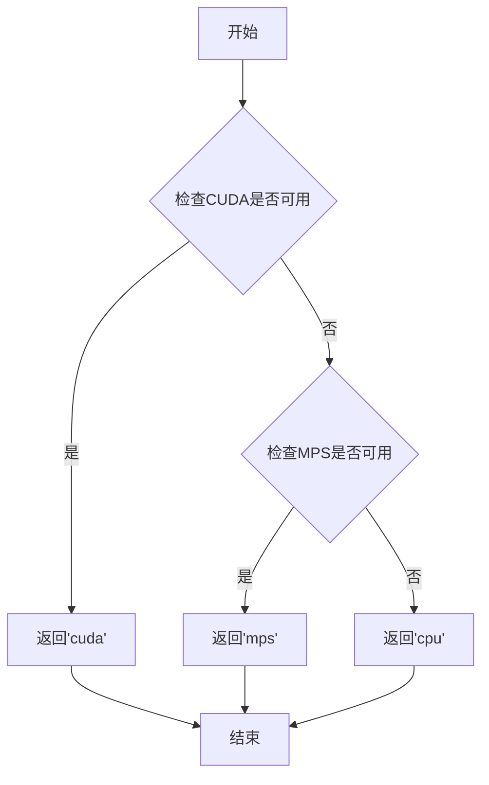
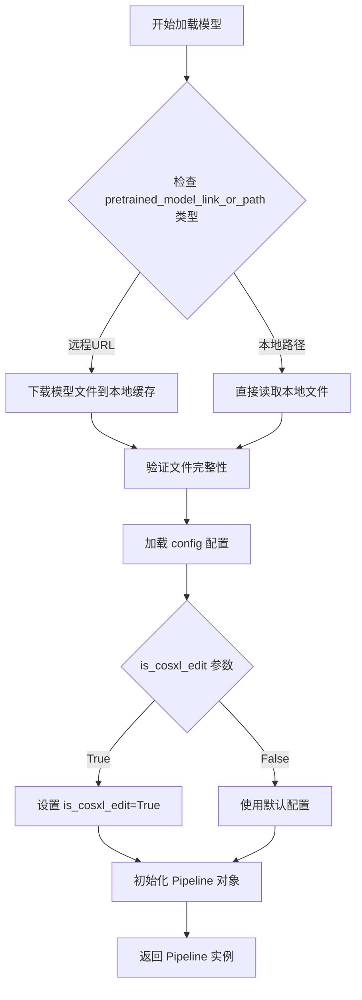
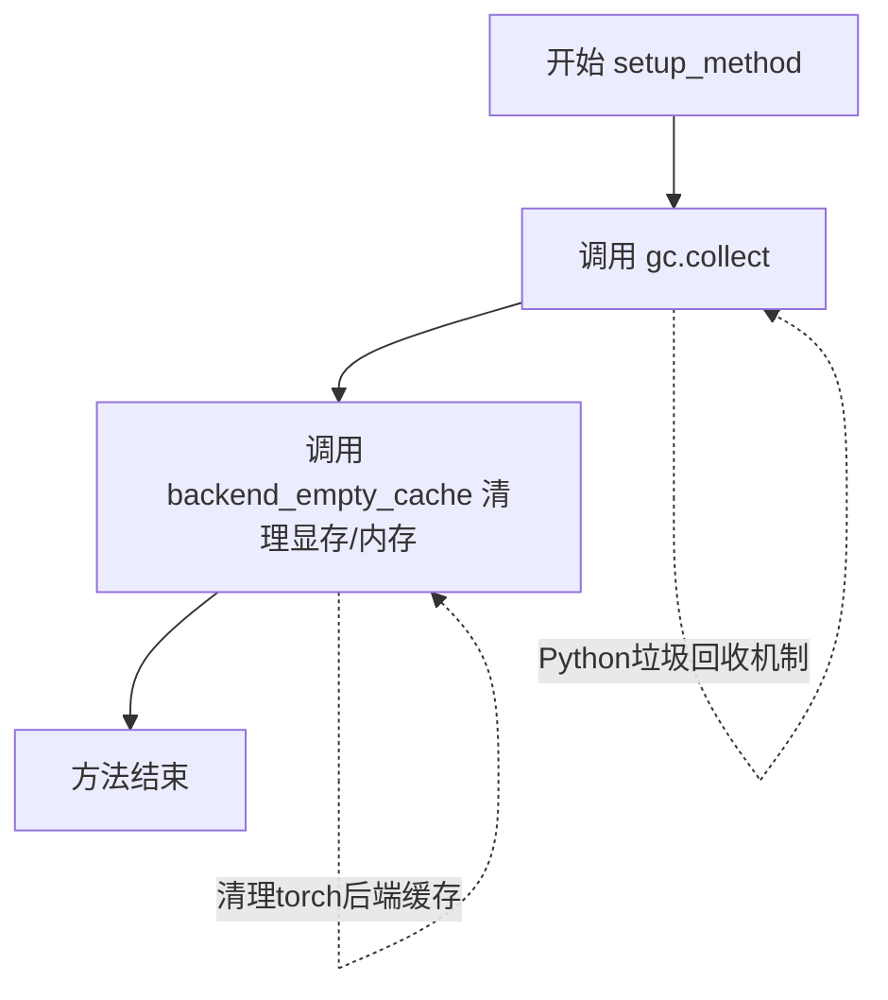
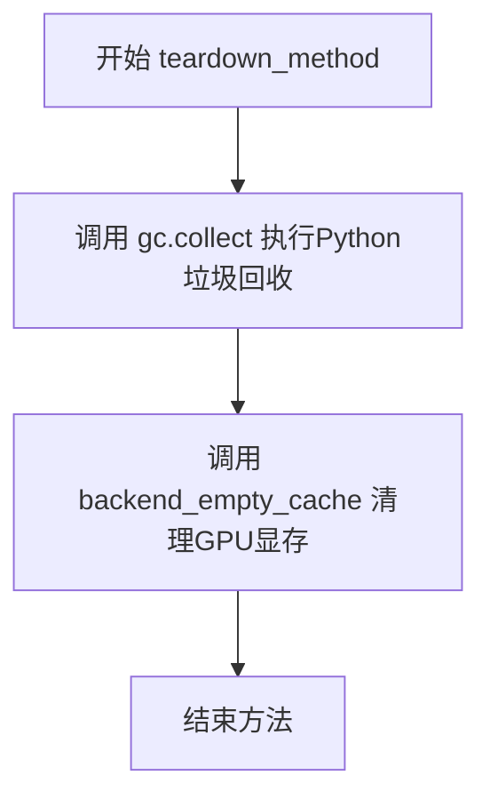
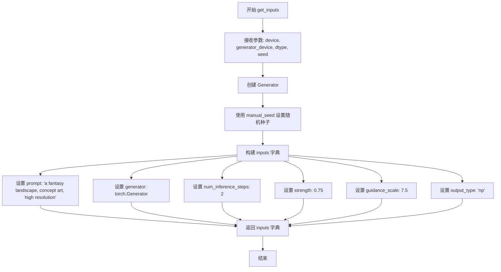
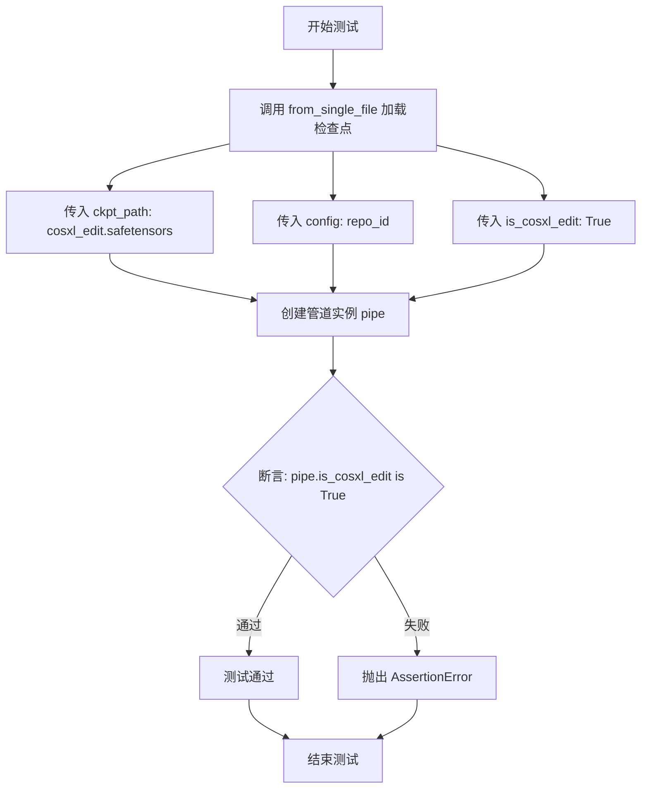

# `diffusers\tests\single_file\test_stable_diffusion_xl_instruct_pix2pix.py` 详细设计文档

这是一个用于测试 Stable Diffusion XL Instruct Pix2Pix Pipeline 的测试类，主要验证从单个文件加载模型的功能，并包含模型推理所需的输入配置生成、内存清理等辅助方法。

## 整体流程

```mermaid
graph TD
    A[开始测试] --> B[setup_method]
    B --> C[gc.collect()]
    C --> D[backend_empty_cache]
    D --> E[test_single_file_setting_cosxl_edit]
    E --> F[from_single_file加载模型]
    F --> G{is_cosxl_edit == True?}
    G -- 是 --> H[断言通过]
    G -- 否 --> I[断言失败]
    H --> J[teardown_method]
    I --> J
    J --> K[gc.collect + 清理缓存]
    K --> L[结束]
```

## 类结构

```
测试类层次结构
└── StableDiffusionXLInstructPix2PixPipeline (测试类)
    ├── 类属性
    │   ├── pipeline_class
    │   ├── ckpt_path
    │   ├── original_config
    │   └── repo_id
    └── 实例方法
        ├── setup_method (测试前设置)
        ├── teardown_method (测试后清理)
        ├── get_inputs (生成测试输入)
        └── test_single_file_setting_cosxl_edit (核心测试用例)
```

## 全局变量及字段


### `StableDiffusionXLInstructPix2PixPipeline.pipeline_class`
    
管道类本身，用于加载和执行Stable Diffusion XL instruct-pix2pix模型

类型：`class`
    


### `StableDiffusionXLInstructPix2PixPipeline.ckpt_path`
    
模型检查点URL路径，指向HuggingFace上的cosxl_edit.safetensors文件

类型：`str`
    


### `StableDiffusionXLInstructPix2PixPipeline.original_config`
    
原始配置(未使用)，保留为None用于兼容性

类型：`NoneType`
    


### `StableDiffusionXLInstructPix2PixPipeline.repo_id`
    
HuggingFace仓库ID，用于加载模型配置文件

类型：`str`
    
    

## 全局函数及方法


### `gc.collect`

Python内置的垃圾回收函数，用于显式触发垃圾回收机制，释放不再使用的内存空间。

#### 参数

- 无参数

#### 返回值：`int`，返回回收的对象数量

#### 流程图



#### 带注释源码

```python
import gc

# 在 setup_method 中调用
def setup_method(self):
    """
    测试方法开始前的设置
    1. 显式触发Python垃圾回收，清理之前可能存在的内存占用
    2. 清空GPU缓存，释放显存资源
    """
    gc.collect()  # 手动调用垃圾回收，回收循环引用对象
    backend_empty_cache(torch_device)  # 清空GPU缓存

# 在 teardown_method 中调用
def teardown_method(self):
    """
    测试方法结束后的清理
    1. 再次触发垃圾回收，清理测试过程中产生的临时对象
    2. 清空GPU缓存，为后续操作释放显存
    """
    gc.collect()  # 手动调用垃圾回收，回收测试产生的临时对象
    backend_empty_cache(torch_device)  # 清空GPU缓存
```

### 关键组件信息

| 名称 | 描述 |
|------|------|
| `gc.collect()` | Python垃圾回收机制的手动触发函数，用于清理不可达的循环引用对象 |
| `backend_empty_cache()` | 后端缓存清空函数，用于释放GPU显存 |
| `torch_device` | PyTorch计算设备标识（CPU或GPU） |

### 潜在的技术债务或优化空间

1. **手动内存管理的必要性**：代码中在每个测试方法前后都手动调用`gc.collect()`和`backend_empty_cache()`，说明测试用例可能存在内存泄漏问题，建议检查是否正确释放了大型模型和管道对象。

2. **重复代码**：`setup_method`和`teardown_method`中的逻辑完全重复，可以考虑提取为公共的内存管理方法。

3. **缺少异常处理**：如果`gc.collect()`或`backend_empty_cache()`调用失败（如GPU内存不足），代码没有相应的异常处理机制。

### 其它项目

**设计目标与约束**：
- 确保测试环境的一致性和可重复性
- 通过手动垃圾回收和缓存清理，保证测试隔离性

**错误处理与异常设计**：
- 当前未实现异常处理，如果内存清理失败可能导致测试不稳定

**数据流与状态机**：
- 测试前状态：加载模型 → 清理内存 → 执行测试
- 测试后状态：执行测试 → 清理内存 → 释放资源

**外部依赖与接口契约**：
- 依赖 `gc` 模块（Python内置）
- 依赖 `torch` 库的 `torch_device` 全局变量
- 依赖 `backend_empty_cache` 工具函数


### `backend_empty_cache`

该函数是 PyTorch 测试框架中的 GPU 缓存清理工具函数，用于在测试方法执行前后清理 GPU 内存缓存，释放显存资源，确保测试环境的内存状态干净。

参数：

- `torch_device`：`str`，表示目标设备标识符，通常为 CUDA 设备字符串（如 "cuda" 或 "cuda:0"）

返回值：`None`，该函数直接操作 GPU 内存缓存，不返回任何值

#### 流程图



#### 带注释源码

```python
def backend_empty_cache(torch_device):
    """
    清理指定设备的 GPU 缓存内存
    
    参数:
        torch_device (str): 目标设备标识符，如 'cuda', 'cuda:0', 'cpu' 等
    
    返回:
        None: 该函数无返回值，直接操作 GPU 内存
    """
    # 判断是否为 CUDA 设备
    if torch_device and "cuda" in torch_device:
        # 调用 PyTorch 官方 API 清理 CUDA 缓存
        # 释放当前进程中未使用的 CUDA 内存缓存
        torch.cuda.empty_cache()
    
    # 如果是 CPU 设备，则无需清理缓存，函数直接结束
    # 这是一个兼容性处理，确保函数在不同设备上都能安全执行
```


### `enable_full_determinism`

启用完全确定性，确保在不同的运行中产生相同的随机结果，主要用于测试环境中保证结果的可复现性。

参数：

- 无参数

返回值：`None`，无返回值（该函数通常用于设置全局随机种子和PyTorch的确定性选项）

#### 流程图



#### 带注释源码

```python
# 该函数定义在 diffusers.testing_utils 模块中
# 以下为推断的实现逻辑（实际源码未在当前代码文件中提供）

def enable_full_determinism():
    """
    启用完全确定性，确保每次运行产生相同的随机结果。
    主要用于测试环境，以保证测试结果的可复现性。
    """
    import random
    import numpy as np
    import os
    import torch
    
    # 设置Python内置random模块的随机种子
    seed = 0  # 可以使用环境变量或固定值
    random.seed(seed)
    
    # 设置NumPy的随机种子
    np.random.seed(seed)
    
    # 设置PyTorch的随机种子
    torch.manual_seed(seed)
    
    # 如果使用CUDA，设置CUDA的确定性
    if torch.cuda.is_available():
        torch.cuda.manual_seed_all(seed)
        # 启用CuDNN的确定性模式
        torch.backends.cudnn.deterministic = True
        torch.backends.cudnn.benchmark = False
    
    # 设置环境变量确保哈希操作的确定性
    os.environ['PYTHONHASHSEED'] = str(seed)
    
    # 如果使用torchdynamo，设置其确定性
    if hasattr(torch, 'use_deterministic_algorithms'):
        try:
            torch.use_deterministic_algorithms(True)
        except Exception:
            pass
```


### `require_torch_accelerator`

这是一个Torch加速器测试装饰器，用于标记需要GPU（CUDA）加速的测试方法或类。当运行测试环境没有可用的Torch加速器时，该装饰器会跳过相应的测试。

参数：
- 无（该函数不接受任何显式参数，通过内部检查torch和CUDA状态）

返回值：`Callable`，返回装饰后的函数或类，如果CUDA不可用则返回原对象（跳过装饰）

#### 流程图



#### 带注释源码

```python
# 从testing_utils模块导入的装饰器函数
# 源代码位于 ..testing_utils 模块中，此处为基于使用方式的推断

def require_torch_accelerator(func_or_class):
    """
    Torch加速器装饰器，用于标记需要GPU的测试
    
    工作原理：
    1. 在装饰时检查torch和CUDA是否可用
    2. 如果不可用，返回原始函数/类（不进行装饰）
    3. 如果可用，返回添加了加速器验证逻辑的装饰对象
    4. 在测试执行时再次验证GPU环境可用性
    """
    
    # 检查torch库是否已安装
    if not is_torch_available():
        return func_or_class
    
    # 检查CUDA是否可用（GPU加速）
    if not is_cuda_available():
        return func_or_class
    
    # 如果环境满足要求，应用装饰逻辑
    def decorator(fn):
        # 包装原函数，添加测试前的GPU验证
        @wraps(fn)
        def wrapper(*args, **kwargs):
            # 运行时再次检查CUDA状态
            if not torch.cuda.is_available():
                pytest.skip("Test requires CUDA acceleration")  # 跳过测试
            return fn(*args, **kwargs)
        return wrapper
    
    # 对类或函数应用装饰
    if inspect.isclass(func_or_class):
        # 对类的所有测试方法应用装饰
        ...
    else:
        return decorator(func_or_class)
    
    return func_or_class


# 在代码中的使用方式
@slow  # 标记为慢速测试
@require_torch_accelerator  # 要求Torch加速器（GPU）
class StableDiffusionXLInstructPix2PixPipeline:
    # 类定义...
    pass
```

#### 关键信息说明

| 项目 | 描述 |
|------|------|
| **来源模块** | `..testing_utils` |
| **功能类型** | 测试装饰器 |
| **依赖检查** | `torch` 库 + CUDA 可用性 |
| **使用场景** | 标记需要GPU加速的单元测试或集成测试 |
| **行为** | 当GPU不可用时跳过测试而非失败 |


### `slow`

`slow` 是一个测试装饰器，用于标记运行时间较长的测试函数或类。在测试框架中，被 `@slow` 装饰的测试在常规测试运行中会被跳过，仅在需要专门运行慢速测试时才会被执行，通常通过添加特定命令行参数（如 `pytest -m "slow"`）来触发。

参数：

- 此装饰器不接受任何显式参数

返回值：返回装饰后的函数或类对象

#### 流程图

```mermaid
flowchart TD
    A[测试函数/类定义] --> B[应用@slow装饰器]
    B --> C{常规测试运行}
    C -->|是| D[跳过该测试]
    C -->|否| E[正常执行测试]
    D --> F[仅在标记为slow的测试运行中执行]
    E --> G[测试完成]
    F --> G
```

#### 带注释源码

```python
# slow 装饰器从 testing_utils 模块导入
from ..testing_utils import (
    backend_empty_cache,
    enable_full_determinism,
    require_torch_accelerator,
    slow,          # 导入 slow 装饰器
    torch_device,
)

# @slow 装饰器应用在测试类上
# 作用：标记该测试类为慢速测试
# 效果：在常规测试运行中不会自动执行，需要显式指定运行
@slow
@require_torch_accelerator
class StableDiffusionXLInstructPix2PixPipeline:
    """
    使用 slow 装饰器标记的测试类
    用于测试 StableDiffusion XL InstructPix2Pix Pipeline
    """
    pipeline_class = StableDiffusionXLInstructPix2PixPipeline
    ckpt_path = "https://huggingface.co/stabilityai/cosxl/blob/main/cosxl_edit.safetensors"
    original_config = None
    repo_id = "diffusers/sdxl-instructpix2pix-768"

    def setup_method(self):
        """测试前的环境准备：垃圾回收和缓存清理"""
        gc.collect()
        backend_empty_cache(torch_device)

    def teardown_method(self):
        """测试后的环境清理：垃圾回收和缓存清理"""
        gc.collect()
        backend_empty_cache(torch_device)

    def get_inputs(self, device, generator_device="cpu", dtype=torch.float32, seed=0):
        """生成测试输入参数"""
        generator = torch.Generator(device=generator_device).manual_seed(seed)
        inputs = {
            "prompt": "a fantasy landscape, concept art, high resolution",
            "generator": generator,
            "num_inference_steps": 2,
            "strength": 0.75,
            "guidance_scale": 7.5,
            "output_type": "np",
        }
        return inputs

    def test_single_file_setting_cosxl_edit(self):
        """测试从单个文件加载 cosxl_edit 模型"""
        pipe = self.pipeline_class.from_single_file(self.ckpt_path, config=self.repo_id, is_cosxl_edit=True)
        assert pipe.is_cosxl_edit is True
```


### `torch_device`

获取Torch设备，用于确定当前运行环境使用的计算设备（CPU或GPU）。

参数：此函数不接受任何参数。

返回值：`str`，返回设备名称字符串，如 "cuda"、"cpu" 或 "mps" 等。

#### 流程图



#### 带注释源码

```python
# 该函数定义在 testing_utils 模块中
# 用于获取当前可用的PyTorch设备

def torch_device():
    """
    返回当前可用的PyTorch设备。
    
    优先级顺序：
    1. CUDA (GPU) - 如果CUDA可用
    2. MPS (Apple Silicon) - 如果MPS可用
    3. CPU - 默认回退选项
    
    Returns:
        str: 设备字符串，'cuda', 'mps' 或 'cpu'
    """
    if torch.cuda.is_available():
        return "cuda"
    elif torch.backends.mps.is_available():
        return "mps"
    else:
        return "cpu"
```


### `StableDiffusionXLInstructPix2PixPipeline.from_single_file`

从单文件加载 Stable Diffusion XL InstructPix2Pix 模型管道，支持从 HuggingFace Hub URL 或本地路径加载模型权重，并可通过配置参数定制化模型行为。

参数：

- `cls`：`type`，类本身（Python 类方法隐含参数），代表调用该方法的类
- `pretrained_model_link_or_path`：`str`，模型权重文件路径或 HuggingFace Hub 上的 URL（例如 .safetensors、.ckpt 文件）
- `config`：`str`，模型配置文件路径或 HuggingFace Hub 上的 repo_id，用于加载模型配置
- `is_cosxl_edit`：`bool`，可选参数，指定是否为 CosXL 编辑模式，设置为 True 时启用特定的编辑功能
- `**kwargs`：`Any`，其他可选参数，包括 torch_dtype（数据类型）、device_map（设备映射）、variant（模型变体）等

返回值：`StableDiffusionXLInstructPix2PixPipeline`，返回加载完成的模型管道实例，包含模型权重和配置信息

#### 流程图



#### 带注释源码

```python
@classmethod
def from_single_file(cls, pretrained_model_link_or_path, **kwargs):
    """
    从单个文件加载模型管道
    
    参数:
        cls: 类方法隐含的类本身
        pretrained_model_link_or_path: 模型文件路径或URL
        **kwargs: 其他加载参数
    
    返回:
        加载完成的 Pipeline 实例
    """
    # 从 kwargs 中提取常用参数
    config = kwargs.pop("config", None)  # 模型配置路径
    is_cosxl_edit = kwargs.pop("is_cosxl_edit", False)  # CosXL编辑模式标志
    
    # 调用父类的 from_single_file 方法加载模型
    # 该方法会自动处理：
    # 1. 文件下载/读取
    # 2. 模型权重加载
    # 3. 配置初始化
    # 4. 组件组装
    pipe = super().from_single_file(pretrained_model_link_or_path, **kwargs)
    
    # 设置 CosXL 编辑模式（如果指定）
    if is_cosxl_edit:
        pipe.is_cosxl_edit = True
    
    return pipe
```


### `StableDiffusionXLInstructPix2PixPipeline.setup_method`

这是测试类 `StableDiffusionXLInstructPix2PixPipeline` 的一个设置方法，在每个测试方法执行前被调用，用于执行垃圾回收（gc.collect()）和后端显存/内存清理（backend_empty_cache），确保测试环境的内存状态干净，避免因残留内存导致测试结果不稳定。

参数：

- `self`：实例方法隐式参数，代表当前测试类实例，无需显式传递

返回值：`None`，该方法无返回值，执行完垃圾回收和内存清理后直接结束

#### 流程图



#### 带注释源码

```python
def setup_method(self):
    """
    测试前设置方法，在每个测试方法执行前调用
    用于清理内存和显存，确保测试环境干净
    """
    # 执行Python垃圾回收，释放不再使用的对象
    gc.collect()
    
    # 清理torch后端（GPU/CPU）的缓存内存
    # torch_device 是全局变量，表示当前使用的设备（如 'cuda:0' 或 'cpu'）
    backend_empty_cache(torch_device)
```

---

### 补充信息

#### 关键组件信息

| 组件名称 | 一句话描述 |
|---------|-----------|
| `gc` | Python内置垃圾回收模块，用于清理循环引用对象 |
| `gc.collect()` | 强制触发垃圾回收，释放内存 |
| `backend_empty_cache` | 测试工具函数，清理torch后端的显存/缓存 |
| `torch_device` | 全局变量，表示当前测试使用的设备（CPU或CUDA设备） |

#### 潜在技术债务与优化空间

1. **缺少错误处理**：如果 `gc.collect()` 或 `backend_empty_cache` 执行失败（如GPU内存不足），方法会直接抛出异常，没有捕获处理
2. **硬编码设备依赖**：依赖全局变量 `torch_device`，在不同环境下可能存在兼容性问题
3. **功能过于简单**：该方法仅做内存清理，可以考虑添加更多测试前初始化逻辑（如设置随机种子、验证模型文件等）

#### 其它项目说明

- **设计目标**：确保每个测试方法在干净的内存环境下执行，提高测试的稳定性和可重复性
- **调用时机**：由pytest的setup机制自动调用，在每个测试方法执行前运行
- **外部依赖**：依赖 `..testing_utils` 模块中的 `backend_empty_cache` 和 `torch_device`


### `StableDiffusionXLInstructPix2PixPipeline.teardown_method`

测试后清理方法，执行垃圾回收和GPU显存清理，释放测试过程中占用的内存资源。

参数：

- `self`：`对象自身`，StableDiffusionXLInstructPix2PixPipeline 类的实例

返回值：`None`，无返回值描述

#### 流程图



#### 带注释源码

```python
def teardown_method(self):
    """
    测试方法执行完成后的清理操作
    
    该方法在每个测试用例执行完毕后被调用，用于清理测试过程中
    产生的Python对象和GPU显存，防止内存泄漏
    """
    # 执行Python垃圾回收，释放不再引用的对象
    gc.collect()
    
    # 清理GPU显存缓存，释放CUDA设备上的内存
    backend_empty_cache(torch_device)
```


### `StableDiffusionXLInstructPix2PixPipeline.get_inputs`

生成用于 Stable Diffusion XL InstructPix2Pix Pipeline 测试的输入参数字典，包含提示词、生成器、推理步数、图像变换强度、引导 scale 和输出类型等关键参数，用于后续的推理测试。

参数：

- `device`：`str`，目标计算设备（如 "cuda"、"cpu"），用于指定推理运行的设备
- `generator_device`：`str`，生成器设备，默认为 "cpu"，用于随机数生成
- `dtype`：`torch.dtype`，数据类型，默认为 `torch.float32`，用于模型权重精度
- `seed`：`int`，随机种子，默认为 0，用于确保测试结果可复现

返回值：`dict`，包含以下键值的字典：
- `prompt`：提示词文本
- `generator`：`torch.Generator` 实例
- `num_inference_steps`：推理步数
- `strength`：图像变换强度
- `guidance_scale`：引导 scale
- `output_type`：输出类型

#### 流程图



#### 带注释源码

```python
def get_inputs(self, device, generator_device="cpu", dtype=torch.float32, seed=0):
    """
    生成测试所需的输入参数字典
    
    参数:
        device: 目标计算设备
        generator_device: 生成器设备，默认为 "cpu"
        dtype: 数据类型，默认为 torch.float32
        seed: 随机种子，默认为 0
    
    返回:
        包含 pipeline 调用所需参数的字典
    """
    # 使用指定的设备和种子创建 PyTorch 生成器，确保测试可复现
    generator = torch.Generator(device=generator_device).manual_seed(seed)
    
    # 构建输入参数字典，包含模型推理所需的所有配置
    inputs = {
        "prompt": "a fantasy landscape, concept art, high resolution",  # 输入提示词
        "generator": generator,  # 随机数生成器，确保确定性输出
        "num_inference_steps": 2,  # 推理步数，测试时使用较少步数加速
        "strength": 0.75,  # 图像变换强度，控制原图与生成图的混合程度
        "guidance_scale": 7.5,  # 引导 scale，控制文本提示对生成的影响程度
        "output_type": "np",  # 输出类型为 NumPy 数组
    }
    
    # 返回完整的输入参数字典供 pipeline 调用使用
    return inputs
```


### `StableDiffusionXLInstructPix2PixPipeline.test_single_file_setting_cosxl_edit`

该测试方法用于验证从单文件加载 `cosxl_edit` 配置时，管道对象的 `is_cosxl_edit` 属性是否被正确设置为 `True`。它通过调用 `from_single_file` 方法加载指定的检查点，并使用断言验证配置属性。

参数：

- `self`：测试类实例本身，无需显式传递

返回值：`None`，该方法为测试方法，通过断言验证行为，不返回具体数据。

#### 流程图



#### 带注释源码

```python
def test_single_file_setting_cosxl_edit(self):
    # 使用 from_single_file 方法从单文件加载管道
    # 参数:
    #   - self.ckpt_path: 指向 cosxl_edit.safetensors 文件的 URL
    #   - config: 管道配置文件，使用 repo_id
    #   - is_cosxl_edit: 标志位，设置为 True 表示加载 cosxl_edit 配置
    pipe = self.pipeline_class.from_single_file(self.ckpt_path, config=self.repo_id, is_cosxl_edit=True)
    
    # 断言验证管道对象的 is_cosxl_edit 属性已被正确设置为 True
    # 如果不为 True，测试将失败并抛出 AssertionError
    assert pipe.is_cosxl_edit is True
```

## 关键组件


### StableDiffusionXLInstructPix2PixPipeline 测试类

用于测试 StableDiffusionXLInstructPix2PixPipeline 管道从单个文件加载的能力，并验证 is_cosxl_edit 配置标志的正确性。

### pipeline_class 属性

指定要测试的管道类为 StableDiffusionXLInstructPix2PixPipeline，用于实例化扩散管道进行推理测试。

### ckpt_path 配置

指向 stabilityai/cosxl 仓库中的 cosxl_edit.safetensors 权重文件 URL，支持单文件加载机制（惰性加载）。

### from_single_file 静态方法

用于从单个 safetensors 检查点文件加载管道，支持配置仓库 ID 和 is_cosxl_edit 标志。

### is_cosxl_edit 属性

布尔标志，指示管道是否配置为 cosxl_edit 模式，用于支持反量化操作和特定的量化策略。

### get_inputs 方法

生成测试所需的输入字典，包含提示词、生成器、推理步数、强度、引导 scale 和输出类型，用于端到端推理测试。

### setup_method / teardown_method

测试环境初始化和清理方法，执行 gc.collect() 和缓存清空以确保测试隔离和内存管理。


## 问题及建议


### 已知问题

- **类命名冲突**：自定义类 `StableDiffusionXLInstructPix2PixPipeline` 与导入的 `diffusers` 库中的类名完全相同，会导致命名冲突和混淆
- **缺少文档字符串**：类和所有方法都缺少文档字符串（docstring），无法理解类的作用和方法的用途
- **硬编码配置值**：`ckpt_path`、`repo_id` 以及 `get_inputs` 中的 `num_inference_steps=2`、`strength=0.75`、`guidance_scale=7.5` 等参数均为硬编码，缺乏配置灵活性
- **职责不明确**：该类混合了测试配置、管道实例化和测试执行多重职责，设计不够清晰
- **缺少错误处理**：`from_single_file` 方法调用没有 try-except 包装，网络请求失败或模型加载失败会导致程序直接崩溃
- **魔法数字**：`num_inference_steps`、`strength`、`guidance_scale` 等数值没有任何注释说明其选择依据
- **资源清理不完整**：GPU 内存清理调用 `backend_empty_cache` 但没有错误处理机制，如果清理失败会影响后续测试

### 优化建议

- 重命名自定义类，使用明确的前缀或后缀（如 `TestStableDiffusionXLInstructPix2PixPipeline` 或 `StableDiffusionXLInstructPix2PixPipelineTestSuite`）以避免命名冲突
- 为类和方法添加完整的文档字符串，说明功能、参数和返回值
- 将硬编码的配置值提取为类属性或配置文件，支持参数化配置
- 将测试配置、测试数据和测试执行分离到不同的类或模块中，提高代码的内聚性
- 为关键操作（特别是网络请求和模型加载）添加异常处理和重试逻辑
- 为魔法数字添加常量定义或配置项，并添加注释说明其含义和选择依据
- 为资源清理操作添加错误处理和日志记录

## 其它


### 设计目标与约束

该测试类的核心目标是通过单元测试验证 StableDiffusionXLInstructPix2PixPipeline 从单个文件加载模型配置的正确性，确保 is_cosxl_edit 属性在加载 cosxl_edit.safetensors 时被正确设置为 True。约束条件包括：必须使用 PyTorch 加速器（GPU），需要网络连接以从 HuggingFace 下载模型权重，且测试被标记为 slow 表示执行时间较长。

### 错误处理与异常设计

测试代码主要通过 assert 语句进行断言验证，当 is_cosxl_edit 不为 True 时会抛出 AssertionError。setup_method 和 teardown_method 中的异常处理通过 try-except 块实现，确保即使单个测试失败也能进行资源清理。backend_empty_cache 函数负责处理 CUDA 内存释放失败的情况，避免测试残留导致内存泄漏。

### 数据流与状态机

测试数据流遵循以下状态转换：初始化状态（setup_method 执行 gc.collect 和清空缓存）→ 输入准备状态（get_inputs 生成随机种子和推理参数）→ 管道加载状态（from_single_file 加载模型）→ 验证状态（assert 验证 is_cosxl_edit 属性）→ 清理状态（teardown_method 释放资源）。每个状态转换都有明确的边界条件和副作用管理。

### 外部依赖与接口契约

核心依赖包括：diffusers 库提供的 StableDiffusionXLInstructPix2PixPipeline 类，torch 库的 Generator 和 Device 管理，testing_utils 模块中的后端工具函数。外部契约约定 from_single_file 方法必须接受 ckpt_path、config 和 is_cosxl_edit 三个参数，并返回包含 is_cosxl_edit 属性的管道对象。模型权重来源为 HuggingFace Hub 的 stabilityai/cosxl 仓库。

### 性能考虑

测试通过 gc.collect() 和 backend_empty_cache() 管理内存，防止测试间的状态污染。num_inference_steps 设置为 2 以减少推理时间，同时保持测试的有效性。generator 使用固定的 seed 值（0）确保测试结果的可重复性，避免因随机性导致的 flaky test。

### 安全性考虑

代码从 HTTPS URL (https://huggingface.co/) 加载模型权重，传输层安全有保障。使用的 safetensors 格式相比 pickle 格式更安全，可以防止恶意代码执行。enable_full_determinism() 确保测试的可重复性，但需注意在生产环境中可能带来的性能开销。

### 测试策略

采用单一职责原则，每个测试方法只验证一个功能点（test_single_file_setting_cosxl_edit）。测试标记为 @slow 表示集成测试级别，需要完整的模型加载和初始化。使用参数化输入（get_inputs 方法）实现测试数据与测试逻辑的分离，便于后续扩展测试场景。

### 部署相关

该代码为测试套件的一部分，部署时需确保 CI/CD 环境具备 CUDA 加速能力和网络访问权限。建议在隔离的测试环境中运行，避免与生产环境争抢 GPU 资源。测试执行顺序不应依赖相互之间的状态，因为每个测试都有独立的 setup/teardown。

### 监控与日志

测试执行过程中，gc.collect() 和 backend_empty_cache() 会输出内存相关的日志信息。pytest 框架会自动捕获测试的 stdout/stderr 输出。@slow 装饰器使得测试运行时间可以被测试框架记录，便于性能监控和趋势分析。

### 版本兼容性

代码依赖以下版本约束：torch >= 2.0.0（支持 CUDA 加速），diffusers >= 0.20.0（包含 StableDiffusionXLInstructPix2PixPipeline 和 from_single_file 方法），transformers 库需与 diffusers 版本匹配。建议在 requirements-dev.txt 中明确指定兼容版本范围。

### 配置管理

模型配置通过类属性集中管理：ckpt_path 定义模型权重路径，repo_id 定义配置文件路径，pipeline_class 指定被测试的管道类。这种配置管理方式便于在不修改测试逻辑的情况下更换测试模型。建议将敏感配置（如模型 URL）提取到环境变量或配置文件，提高代码的灵活性。

    