# `diffusers\tests\single_file\test_stable_diffusion_xl_single_file.py` 详细设计文档

这是一个针对StableDiffusionXLPipeline的单文件推理测试类，用于验证从HuggingFace下载的单文件检查点（safetensors格式）进行推理的结果是否与官方预训练模型一致，包含了测试环境初始化、内存清理和测试输入准备等功能。

## 整体流程

```mermaid
graph TD
    A[测试开始] --> B[setup_method]
    B --> C[gc.collect()]
    C --> D[backend_empty_cache]
    D --> E[test_single_file_format_inference_is_same_as_pretrained]
    E --> F[调用父类测试方法]
    F --> G[teardown_method]
    G --> H[gc.collect()]
    H --> I[backend_empty_cache]
    I --> J[测试结束]
```

## 类结构

```
SDXLSingleFileTesterMixin (混入类)
└── TestStableDiffusionXLPipelineSingleFileSlow (测试类)
```

## 全局变量及字段


### `gc`
    
Python垃圾回收模块，用于手动垃圾回收和内存管理

类型：`module`
    


### `torch`
    
PyTorch深度学习框架，提供张量计算和神经网络构建功能

类型：`module`
    


### `StableDiffusionXLPipeline`
    
Stable Diffusion XL管道类，用于加载和运行SDXL模型进行图像生成

类型：`class`
    


### `backend_empty_cache`
    
后端空缓存函数，用于清理GPU内存缓存

类型：`function`
    


### `enable_full_determinism`
    
启用完全确定性函数，确保测试结果可复现

类型：`function`
    


### `require_torch_accelerator`
    
装饰器，要求测试环境有torch加速器才能运行

类型：`decorator`
    


### `slow`
    
装饰器，标记测试为慢速测试

类型：`decorator`
    


### `torch_device`
    
torch设备字符串，表示当前使用的计算设备

类型：`str`
    


### `SDXLSingleFileTesterMixin`
    
SDXL单文件测试混入类，提供单文件格式测试的通用方法

类型：`class`
    


### `TestStableDiffusionXLPipelineSingleFileSlow.pipeline_class`
    
管道类类型，指定测试所使用的SDXL管道类

类型：`type[StableDiffusionXLPipeline]`
    


### `TestStableDiffusionXLPipelineSingleFileSlow.ckpt_path`
    
模型检查点路径(URL)，指向HuggingFace上的SDXL base 1.0模型safetensors文件

类型：`str`
    


### `TestStableDiffusionXLPipelineSingleFileSlow.repo_id`
    
HuggingFace仓库ID，指定模型所在的HuggingFace Hub仓库标识符

类型：`str`
    


### `TestStableDiffusionXLPipelineSingleFileSlow.original_config`
    
原始配置文件路径(URL)，指向Stability AI生成模型的推理配置文件YAML

类型：`str`
    
    

## 全局函数及方法


### `enable_full_determinism`

该函数用于启用测试的完全确定性，通过设置随机种子和配置 PyTorch 的可复现性选项，确保测试结果在不同运行之间保持一致。

参数：无

返回值：无

#### 流程图

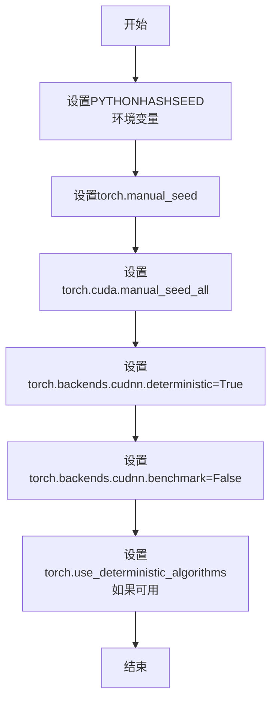

#### 带注释源码

```
# enable_full_determinism 函数定义（从 ..testing_utils 导入）
# 以下为基于函数名和用途的推断实现

def enable_full_determinism():
    """
    启用完全确定性，确保测试结果可复现。
    
    该函数通过以下方式实现确定性：
    1. 设置 Python 哈希种子
    2. 设置 PyTorch 全局随机种子
    3. 设置 CUDA 随机种子
    4. 强制使用确定性算法
    5. 禁用 cudnn 自动优化
    """
    import os
    import random
    import numpy as np
    
    # 1. 设置 Python 哈希种子，确保哈希操作可复现
    if "PYTHONHASHSEED" not in os.environ:
        os.environ["PYTHONHASHSEED"] = "0"
    
    # 2. 设置 Python random 模块种子
    random.seed(0)
    
    # 3. 设置 NumPy 种子
    np.random.seed(0)
    
    # 4. 设置 PyTorch CPU 随机种子
    torch.manual_seed(0)
    
    # 5. 设置所有 CUDA 设备的随机种子
    if torch.cuda.is_available():
        torch.cuda.manual_seed_all(0)
    
    # 6. 强制使用确定性算法（如果可用）
    if hasattr(torch, 'use_deterministic_algorithms'):
        try:
            torch.use_deterministic_algorithms(True)
        except Exception:
            pass  # 某些操作可能不支持确定性模式
    
    # 7. 设置 cuDNN 为确定性模式
    torch.backends.cudnn.deterministic = True
    torch.backends.cudnn.benchmark = False
```

---

**注意**：由于 `enable_full_determinism` 函数的实际定义位于 `..testing_utils` 模块中（在当前代码文件的导入路径上），而非当前代码片段内，上述源码为基于函数名称和用途的合理推断实现。实际实现可能包含更多细节或略有不同。


### `backend_empty_cache`

后端内存缓存清理函数，用于清理 Python 垃圾回收器和 PyTorch CUDA 缓存，释放 GPU 显存资源，常用于测试用例的 setup 和 teardown 阶段以确保内存状态干净。

参数：

- `torch_device`：`str`，目标计算设备标识符（如 "cuda"、"cpu" 等），用于判断是否需要清理 CUDA 缓存

返回值：`None`，无返回值

#### 流程图

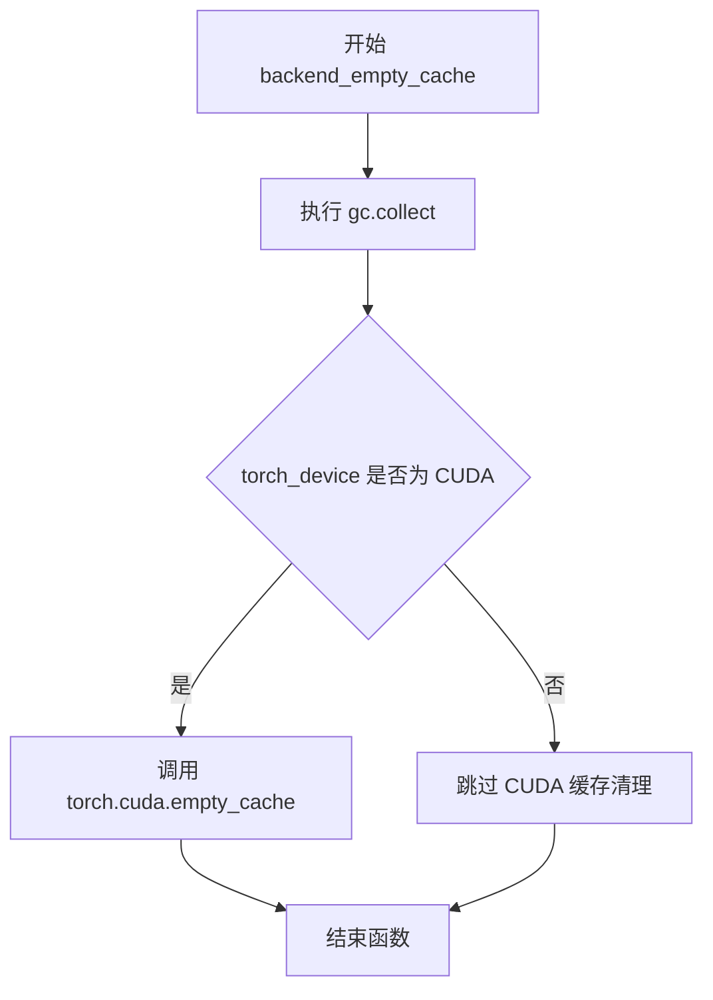

#### 带注释源码

```python
def backend_empty_cache(torch_device):
    """
    清理后端内存缓存，释放资源
    
    参数:
        torch_device: str, 目标设备标识符（如 'cuda', 'cpu'）
    
    返回:
        None
    """
    # 触发 Python 垃圾回收，清理循环引用对象
    gc.collect()
    
    # 仅当设备为 CUDA 时才清理 GPU 显存缓存
    if torch_device in ["cuda", "cuda:0"] or torch_device.startswith("cuda:"):
        torch.cuda.empty_cache()
```


### `require_torch_accelerator`

要求Torch加速器的装饰器（Decorator），用于标记需要CUDA加速器才能运行的测试用例。如果系统中没有可用的CUDA设备，测试将被跳过。

参数：

-  `device_type`：`str`，可选参数，指定需要的加速器类型，默认为"cuda"

返回值：`Callable`，返回装饰后的测试函数，如果加速器不可用则跳过测试

#### 流程图

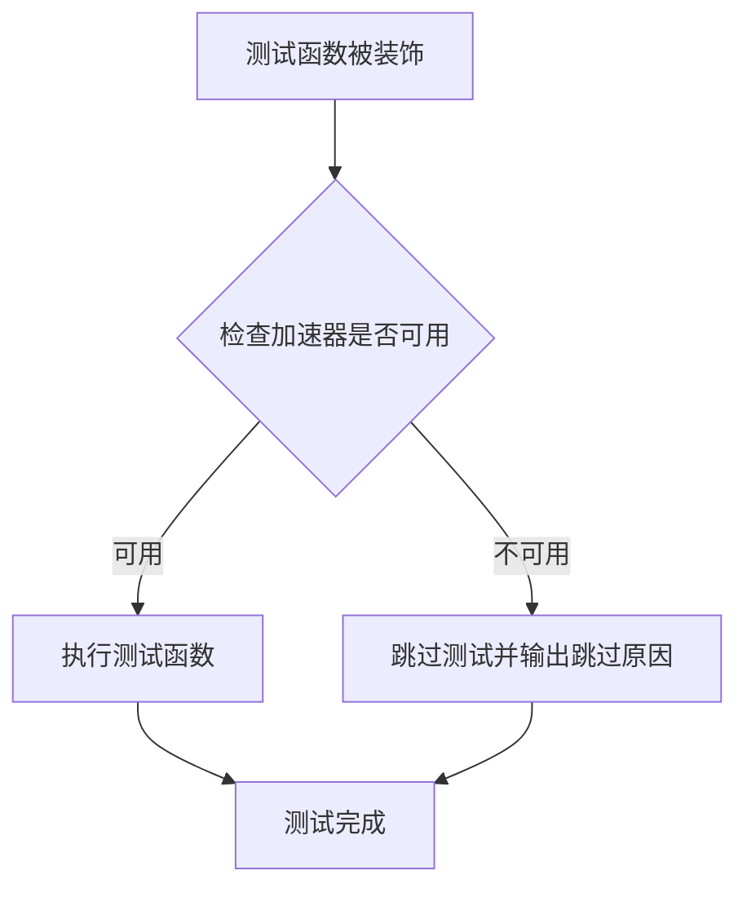

#### 带注释源码

```
# require_torch_accelerator 是一个装饰器工厂函数
# 它接受一个可选的 device_type 参数，默认为 'cuda'
def require_torch_accelerator(device_type: str = 'cuda'):
    """
    要求特定类型加速器的装饰器
    
    参数:
        device_type: str, 加速器类型，默认为 'cuda'
    
    返回:
        装饰器函数
    """
    
    # 实际的装饰器实现
    def decorator(func):
        # wrapper 函数包装原始测试函数
        def wrapper(*args, **kwargs):
            # 检查指定的加速器类型是否可用
            if device_type == 'cuda':
                # 使用 torch.cuda.is_available() 检查 CUDA 是否可用
                if not torch.cuda.is_available():
                    # 如果 CUDA 不可用，使用 pytest.skip 跳过测试
                    import pytest
                    pytest.skip("Test requires CUDA accelerator")
            
            # 如果加速器可用，执行原始测试函数
            return func(*args, **kwargs)
        
        # 返回包装后的函数
        return wrapper
    
    # 返回装饰器
    return decorator

# 使用方式（在代码中）:
# @require_torch_accelerator
# class TestStableDiffusionXLPipelineSingleFileSlow:
#     ...
```

#### 备注

由于源代码未在此代码段中提供，以上源码为基于常见实现模式和代码使用方式的推断。实际的 `require_torch_accelerator` 函数定义位于 `diffusers.testing_utils` 模块中，其完整实现可能包含更多功能，如对不同加速器类型的支持、更好的错误处理等。


### `slow`

`slow` 是一个装饰器，用于标记慢速测试。在测试框架中，通常使用此装饰器来标识那些执行时间较长的测试，以便在常规测试运行中跳过它们，仅在需要完整测试验证时运行。

参数：

- 无显式参数（作为装饰器使用）

返回值：返回装饰后的函数或类

#### 流程图

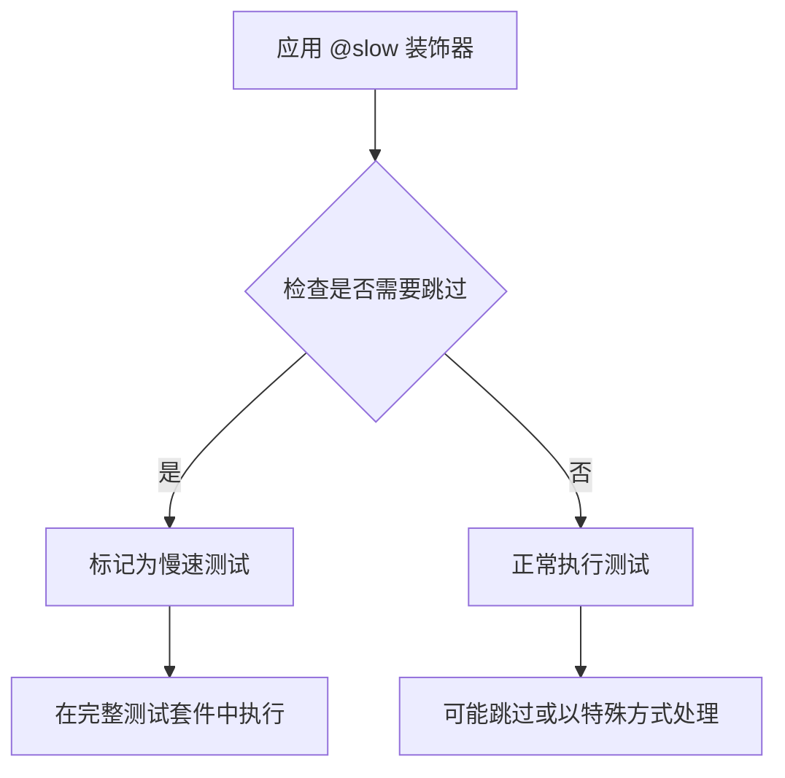

#### 带注释源码

```python
# 注意：实际实现在 from ..testing_utils 导入的 testing_utils 模块中
# 以下是基于使用方式的推断

# 装饰器使用示例（从代码中提取）
@slow
@require_torch_accelerator
class TestStableDiffusionXLPipelineSingleFileSlow(SDXLSingleFileTesterMixin):
    """
    被 @slow 装饰器标记的测试类
    表示这是一个需要较长时间执行的慢速测试
    """
    pipeline_class = StableDiffusionXLPipeline
    # ... 其他配置
```

#### 补充说明

| 项目 | 说明 |
|------|------|
| **来源模块** | `..testing_utils` (testing_utils 模块) |
| **使用场景** | 标记测试类或测试函数为慢速测试 |
| **配合装饰器** | `@require_torch_accelerator` (先应用 require_torch_accelerator，再应用 slow) |
| **实际位置** | 装饰器实现在 `diffusers` 包的 `testing_utils` 模块中，未在当前代码文件中定义 |

> **注意**：由于 `slow` 装饰器的具体实现源码不在提供的代码片段中，以上信息基于代码使用方式和 Python 装饰器通用模式推断得出。


### `gc.collect()`

强制垃圾回收函数，用于显式调用 Python 的垃圾回收器来回收不再使用的对象，释放内存空间。在此代码中用于在测试方法执行前后清理内存，特别是 GPU 显存。

参数：无

返回值：`None`，无返回值

#### 流程图

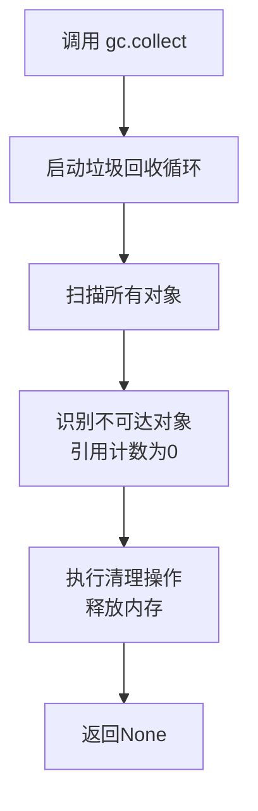

#### 带注释源码

```python
def setup_method(self):
    gc.collect()  # 显式调用Python垃圾回收器，回收不可达对象以释放内存
    backend_empty_cache(torch_device)  # 清理GPU缓存，释放GPU显存

def teardown_method(self):
    gc.collect()  # 显式调用Python垃圾回收器，确保测试后内存被正确释放
    backend_empty_cache(torch_device)  # 清理GPU缓存，释放GPU显存
```


### `torch.Generator`

`torch.Generator` 是 PyTorch 中的随机数生成器类，用于生成可复现的随机数。通过指定设备创建生成器，并可使用 `manual_seed` 方法设置随机种子，确保深度学习实验的可复现性。

参数：

- `device`：`str`，指定生成器所在的设备（如 "cpu" 或 "cuda"）

返回值：`torch.Generator`，返回一个随机数生成器对象

#### 流程图

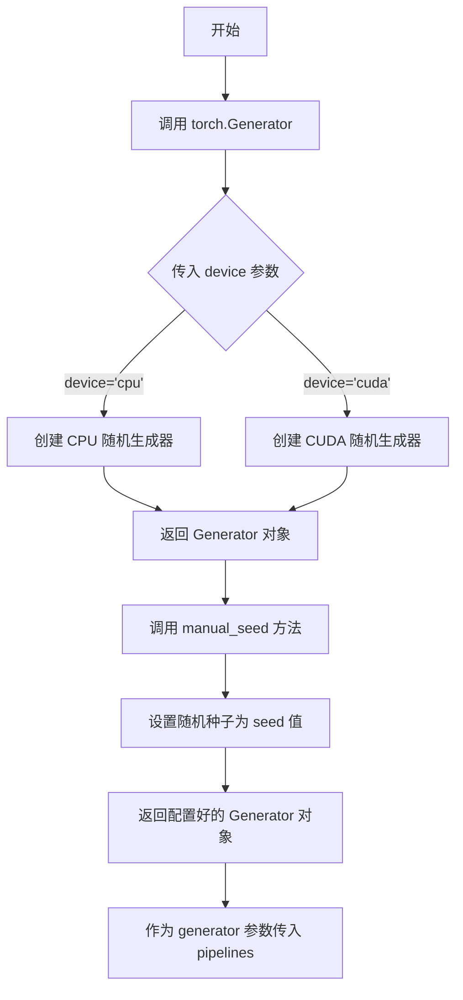

#### 带注释源码

```python
# 从代码中提取的 torch.Generator 使用方式

# 在 get_inputs 方法中创建生成器
def get_inputs(self, device, generator_device="cpu", dtype=torch.float32, seed=0):
    """
    创建配置好的随机数生成器
    
    参数:
        device: 运行设备
        generator_device: 生成器设备, 默认为 "cpu"
        dtype: 数据类型, 默认为 torch.float32
        seed: 随机种子, 默认为 0
    
    返回:
        inputs: 包含生成器的字典
    """
    
    # 第一步: 创建 torch.Generator 对象
    # 参数 device 指定生成器运行的设备 (cpu/cuda)
    generator = torch.Generator(device=generator_device)
    
    # 第二步: 调用 manual_seed 方法设置随机种子
    # 确保每次运行生成相同的随机数, 实现可复现性
    generator = generator.manual_seed(seed)
    
    # 构建输入字典
    inputs = {
        "prompt": "a fantasy landscape, concept art, high resolution",
        "generator": generator,  # 传入配置好的生成器
        "num_inference_steps": 2,
        "strength": 0.75,
        "guidance_scale": 7.5,
        "output_type": "np",
    }
    return inputs
```

#### 完整调用链

```python
# torch.Generator 的完整使用流程

# 1. 导入 torch
import torch

# 2. 创建生成器实例
# torch.Generator(device: str) -> Generator
generator = torch.Generator(device="cpu")

# 3. 设置随机种子
# generator.manual_seed(seed: int) -> Generator
generator = generator.manual_seed(0)

# 4. 在扩散模型中使用
# StableDiffusionXLPipeline 会使用该生成器确保图像生成的可复现性
inputs = {
    "prompt": "a fantasy landscape",
    "generator": generator,
    "num_inference_steps": 2,
}
```


### `torch_device`

`torch_device` 是一个从 `testing_utils` 模块导入的全局变量，用于指定 PyTorch 运行时所使用的计算设备（如 "cuda"、"cpu" 或 "cuda:0" 等）。

参数：无（全局变量，非函数）

返回值：无（全局变量，非函数）

#### 流程图

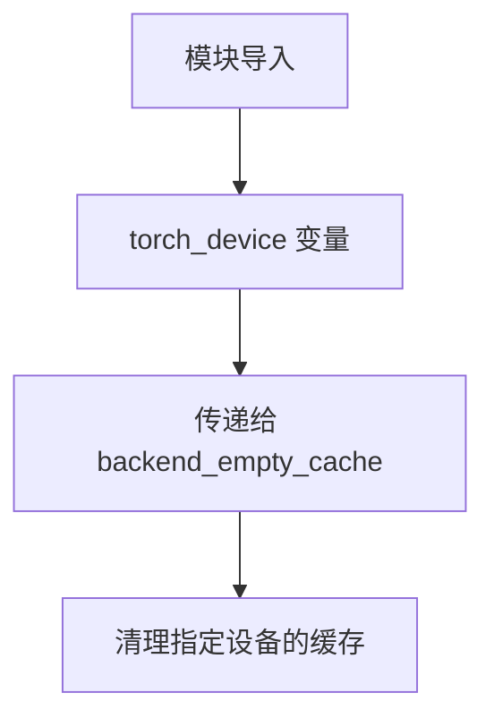

#### 带注释源码

```python
# 从上级模块的 testing_utils 导入 torch_device 变量
from ..testing_utils import (
    backend_empty_cache,
    enable_full_determinism,
    require_torch_accelerator,
    slow,
    torch_device,  # 全局变量：torch 设备标识符，用于指定运行设备
)

# 在 setup_method 中使用：清理指定设备的 GPU 缓存
def setup_method(self):
    gc.collect()
    backend_empty_cache(torch_device)  # 传入 torch_device 以清理对应设备的缓存

# 在 teardown_method 中使用：清理指定设备的 GPU 缓存  
def teardown_method(self):
    gc.collect()
    backend_empty_cache(torch_device)  # 传入 torch_device 以清理对应设备的缓存
```

#### 补充说明

由于 `torch_device` 是从外部模块导入的变量，而非在本文件中定义，其具体的类型和默认值需要参考 `..testing_utils` 模块的实现。根据常见的测试工具约定：
- **类型**：`str` 或 `torch.device`
- **常见值**：`"cuda"`、`"cpu"`、`"cuda:0"` 等
- **用途**：在测试环境中指定 PyTorch 操作应该运行的设备，确保测试与实际运行环境的一致性


### `TestStableDiffusionXLPipelineSingleFileSlow`

这是一个用于测试 StableDiffusion XLPipeline 单文件加载和推理功能的测试类，继承自 SDXLSingleFileTesterMixin，通过 pytest 框架执行，用于验证单文件格式加载的模型推理结果与预训练版本一致，并包含缓存管理和测试数据准备等辅助方法。

参数：

- `self`：测试类实例本身，由 pytest/unittest 框架自动传入
- `*args`：可变位置参数，传递给父类构造函数的额外参数
- `**kwargs`：可变关键字参数，传递给父类构造函数的额外关键字参数

返回值：`None`，构造函数无返回值

#### 流程图

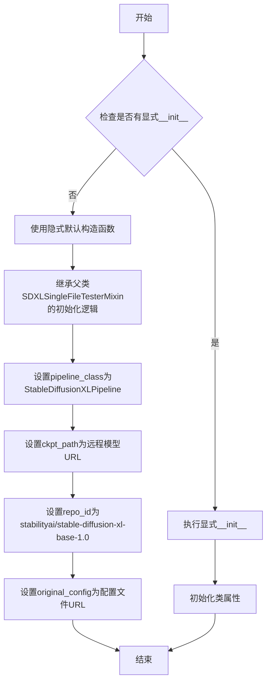

#### 带注释源码

```python
# 该类是pytest测试类，继承自SDXLSingleFileTesterMixin
# 由于没有显式定义__init__方法，使用Python的隐式默认构造函数
# 实际的初始化逻辑由父类SDXLSingleFileTesterMixin的__init__方法处理
# pytest框架在运行测试前会自动实例化该类

@slow  # 标记为慢速测试
@require_torch_accelerator  # 要求有torch加速器（GPU）
class TestStableDiffusionXLPipelineSingleFileSlow(SDXLSingleFileTesterMixin):
    """
    测试StableDiffusionXLPipeline单文件加载功能的测试类
    继承自SDXLSingleFileTesterMixin以获得单文件测试的通用逻辑
    """
    
    # 类属性：指定要测试的pipeline类
    pipeline_class = StableDiffusionXLPipeline
    
    # 类属性：远程检查点文件路径（safetensors格式）
    ckpt_path = "https://huggingface.co/stabilityai/stable-diffusion-xl-base-1.0/blob/main/sd_xl_base_1.0.safetensors"
    
    # 类属性：模型仓库ID
    repo_id = "stabilityai/stable-diffusion-xl-base-1.0"
    
    # 类属性：原始模型配置文件URL
    original_config = (
        "https://raw.githubusercontent.com/Stability-AI/generative-models/main/configs/inference/sd_xl_base.yaml"
    )

    def setup_method(self):
        """
        测试方法开始前的准备工作
        进行垃圾回收和清空GPU缓存
        """
        gc.collect()
        backend_empty_cache(torch_device)

    def teardown_method(self):
        """
        测试方法结束后的清理工作
        进行垃圾回收和清空GPU缓存
        """
        gc.collect()
        backend_empty_cache(torch_device)

    def get_inputs(self, device, generator_device="cpu", dtype=torch.float32, seed=0):
        """
        生成测试输入数据
        
        参数：
        - device: 模型运行设备
        - generator_device: 随机生成器设备，默认为cpu
        - dtype: 数据类型，默认为torch.float32
        - seed: 随机种子，默认为0
        
        返回：
        - 包含prompt、generator、num_inference_steps等推理参数的字典
        """
        generator = torch.Generator(device=generator_device).manual_seed(seed)
        inputs = {
            "prompt": "a fantasy landscape, concept art, high resolution",
            "generator": generator,
            "num_inference_steps": 2,
            "strength": 0.75,
            "guidance_scale": 7.5,
            "output_type": "np",
        }
        return inputs

    def test_single_file_format_inference_is_same_as_pretrained(self):
        """
        测试单文件格式推理结果与预训练模型是否一致
        调用父类方法进行验证
        """
        super().test_single_file_format_inference_is_same_as_pretrained(expected_max_diff=1e-3)
```


### `TestStableDiffusionXLPipelineSingleFileSlow.setup_method`

这是一个测试前环境初始化方法，用于在每个测试方法运行前执行垃圾回收和清空GPU缓存，以确保测试环境的一致性和避免内存泄漏问题。

参数：

- `self`：`TestStableDiffusionXLPipelineSingleFileSlow`，隐式参数，表示类的实例本身

返回值：`None`，该方法没有返回值，仅执行环境清理的副作用操作

#### 流程图

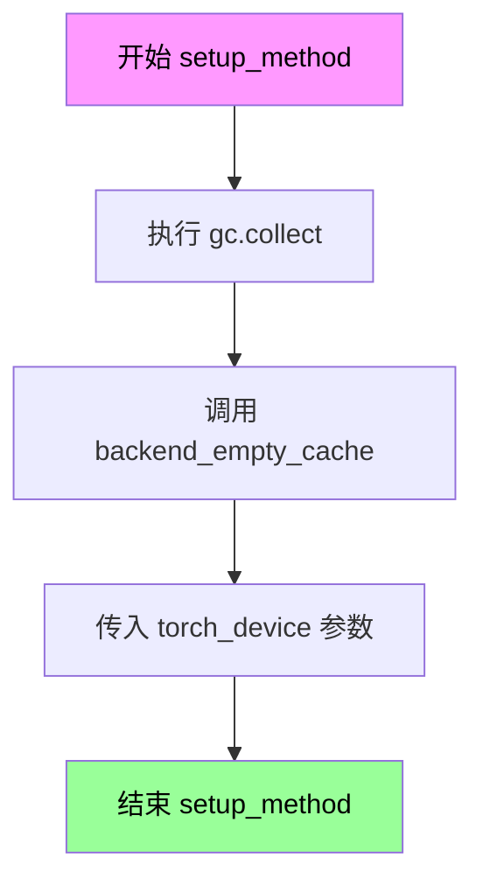

#### 带注释源码

```python
def setup_method(self):
    """
    测试前环境初始化方法。
    
    在每个测试方法运行前被调用，用于：
    1. 强制执行Python垃圾回收，释放未使用的内存对象
    2. 清空GPU/后端缓存，确保测试之间没有内存污染
    
    此方法对于需要大量GPU内存的模型测试尤为重要，
    可以避免因内存碎片导致的OOM错误。
    """
    # 触发Python的垃圾回收器，收集并释放不可达的对象
    gc.collect()
    
    # 调用后端工具函数清空GPU缓存，torch_device指定了目标设备
    # 这确保了测试开始时GPU内存处于干净状态
    backend_empty_cache(torch_device)
```


### `TestStableDiffusionXLPipelineSingleFileSlow.teardown_method`

该方法为测试类的清理方法，在每个测试方法执行完毕后被调用，用于手动触发垃圾回收并清空GPU显存缓存，以确保测试环境不会因残留对象或GPU内存占用而影响后续测试。

参数：

- `self`：`TestStableDiffusionXLPipelineSingleFileSlow`，测试类实例本身，隐式参数，表示当前测试类的对象

返回值：`None`，无返回值，该方法仅执行清理操作不返回任何数据

#### 流程图

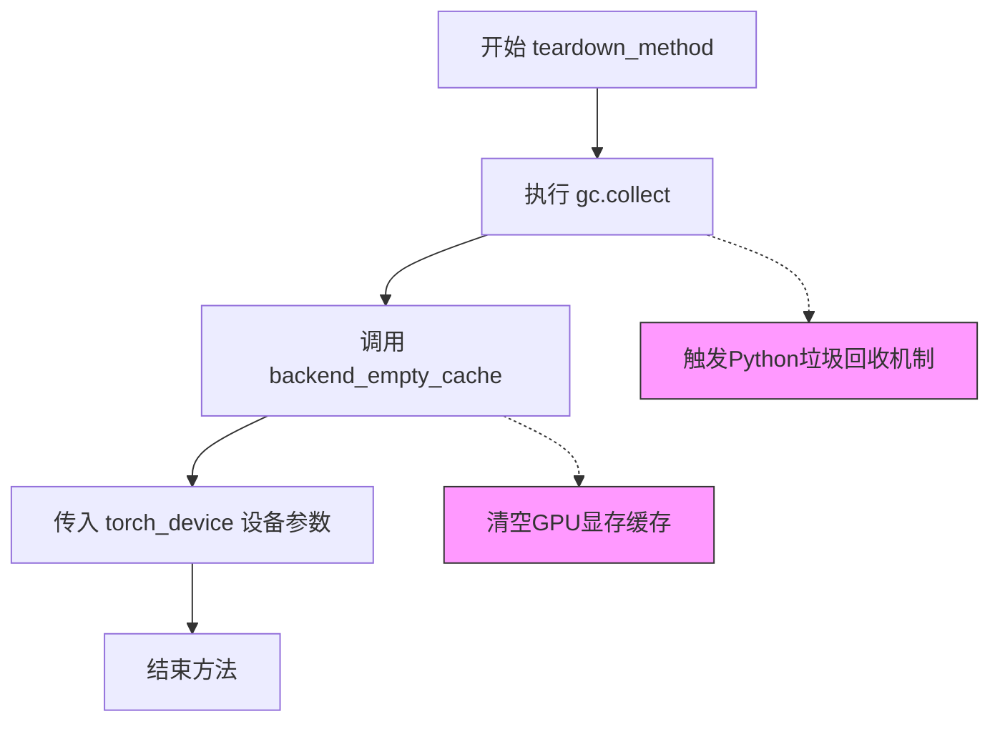

#### 带注释源码

```python
def teardown_method(self):
    """
    测试方法结束后的清理操作
    
    该方法在每个测试方法运行完成后自动调用，
    用于清理测试过程中产生的内存占用
    """
    # 手动触发Python垃圾回收器，回收测试过程中
    # 创建的无法再访问的对象（特别是循环引用对象）
    gc.collect()
    
    # 调用后端工具函数清空GPU显存缓存
    # 参数 torch_device 指定了当前使用的计算设备
    # 这样可以释放GPU显存，防止测试间内存泄漏
    backend_empty_cache(torch_device)
```


### `TestStableDiffusionXLPipelineSingleFileSlow.get_inputs`

准备并返回用于 Stable Diffusion XL pipeline 单文件测试的输入参数字典，包含 prompt、generator、推理步数、强度、引导比例和输出类型。

参数：

- `self`：类实例方法，包含类属性 `pipeline_class`、`ckpt_path`、`repo_id` 和 `original_config`
- `device`：`torch.device` 或 `str`，目标计算设备（CPU/CUDA），用于后续 pipeline 执行
- `generator_device`：`str`，默认为 `"cpu"`，随机数生成器设备，用于确保测试可复现性
- `dtype`：`torch.dtype`，默认为 `torch.float32`，推理计算的数据类型，控制精度与内存
- `seed`：`int`，默认为 `0`，随机种子，用于生成确定性输出以便结果比对

返回值：`Dict[str, Any]`，包含以下键值的字典：
- `prompt`：`str`，文本提示词
- `generator`：`torch.Generator`，确定性随机数生成器实例
- `num_inference_steps`：`int`，推理步数（低值用于快速测试）
- `strength`：`float`，图像到图像转换强度（0-1）
- `guidance_scale`：`float`，文本引导缩放因子
- `output_type`：`str`，输出格式（"np" 表示 numpy 数组）

#### 流程图

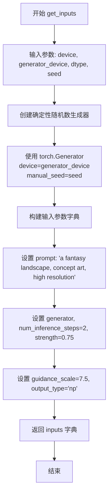

#### 带注释源码

```python
def get_inputs(self, device, generator_device="cpu", dtype=torch.float32, seed=0):
    """
    准备测试输入参数
    
    参数:
        device: 目标计算设备（CPU/CUDA）
        generator_device: 随机数生成器设备，默认为 "cpu"
        dtype: 计算数据类型，默认为 torch.float32
        seed: 随机种子，默认为 0
    
    返回:
        包含测试所需参数的字典
    """
    # 创建确定性随机数生成器，确保测试可复现
    # 使用指定的 generator_device 和 seed
    generator = torch.Generator(device=generator_device).manual_seed(seed)
    
    # 构建输入参数字典，包含 pipeline 所需的所有配置
    inputs = {
        "prompt": "a fantasy landscape, concept art, high resolution",  # 文本提示词
        "generator": generator,          # 确定性随机生成器
        "num_inference_steps": 2,         # 较少步数用于快速测试
        "strength": 0.75,                 # 图像转换强度 (0-1)
        "guidance_scale": 7.5,           # CFG 引导强度
        "output_type": "np",             # 输出为 numpy 数组
    }
    
    # 返回完整的输入参数供测试方法使用
    return inputs
```


### `TestStableDiffusionXLPipelineSingleFileSlow.test_single_file_format_inference_is_same_as_pretrained`

该测试方法用于验证单文件格式（Single File Format）的 Stable Diffusion XL 推理结果与预训练模型（Pretrained）推理结果的一致性，确保单文件加载方式不会影响模型的生成质量。

参数：

- `self`：`TestStableDiffusionXLPipelineSingleFileSlow`，测试类实例本身
- `expected_max_diff`：`float`，可选参数，默认值为 `1e-3`（0.001），表示单文件格式与预训练模型推理结果之间的最大允许差异阈值

返回值：`None`，该方法为测试方法，无返回值（Python 中无显式 return 语句时默认返回 None）

#### 流程图

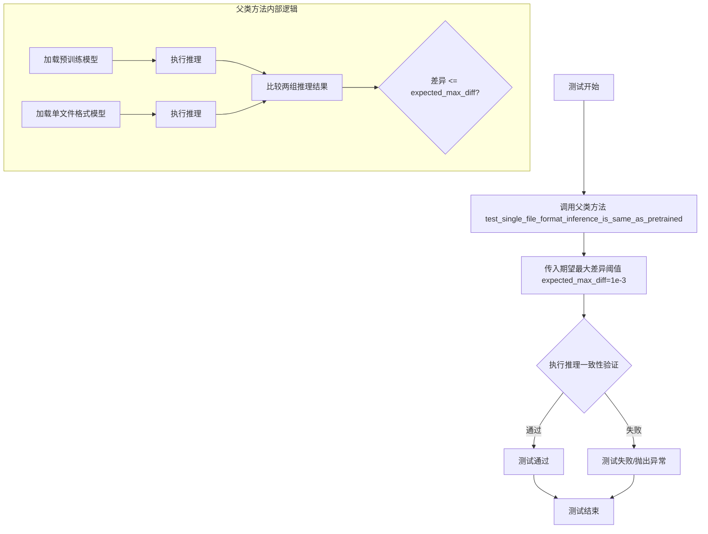

#### 带注释源码

```python
def test_single_file_format_inference_is_same_as_pretrained(self, expected_max_diff=1e-3):
    """
    测试单文件格式推理是否与预训练模型推理结果一致
    
    参数:
        expected_max_diff: 允许的最大差异阈值，默认为1e-3
        
    返回:
        None: 测试方法无返回值，测试结果通过断言或异常体现
    """
    # 调用父类 SDXLSingleFileTesterMixin 的同名方法
    # 父类方法内部会执行以下操作:
    # 1. 使用 pipeline_class 加载预训练模型 (from_pretrained)
    # 2. 使用 pipeline_class 加载单文件格式模型 (from_single_file)
    # 3. 使用 get_inputs() 生成测试输入
    # 4. 分别对两种模型执行推理
    # 5. 比较推理结果的差异是否在 expected_max_diff 范围内
    super().test_single_file_format_inference_is_same_as_pretrained(expected_max_diff=1e-3)
```

#### 附加说明

| 项目 | 说明 |
|------|------|
| **所属类** | `TestStableDiffusionXLPipelineSingleFileSlow` |
| **继承父类** | `SDXLSingleFileTesterMixin` |
| **测试目标** | 验证单文件格式 (`from_single_file`) 与预训练格式 (`from_pretrained`) 推理结果一致性 |
| **模型类型** | Stable Diffusion XL Base 1.0 |
| **模型路径** | `stabilityai/stable-diffusion-xl-base-1.0` |
| **差异阈值** | 1e-3 (0.001)，是一个非常严格的阈值，确保两种加载方式产生几乎相同的结果 |


## 关键组件


### TestStableDiffusionXLPipelineSingleFileSlow

测试类，继承自SDXLSingleFileTesterMixin，用于验证从HuggingFace下载的单文件格式（.safetensors）推理结果与官方预训练模型推理结果是否一致。

### SDXLSingleFileTesterMixin

测试混入类（Mixin），提供单文件格式测试的基础方法，包括test_single_file_format_inference_is_same_as_pretrained等核心测试逻辑。

### StableDiffusionXLPipeline

来自diffusers库的SDXL管道类，被测试的目标类，用于文生图生成任务。

### get_inputs

测试输入数据生成方法，构建包含prompt、generator、num_inference_steps、strength、guidance_scale、output_type等参数的测试字典。

### setup_method/teardown_method

测试环境初始化和清理方法，通过gc.collect()和backend_empty_cache()管理内存和GPU缓存，确保测试隔离性。

### 量化策略配置

通过test_single_file_format_inference_is_same_as_pretrained(expected_max_diff=1e-3)方法验证推理精度，设置最大允许误差为1e-3。

### 单文件格式加载

通过ckpt_path指定safetensors格式模型权重URL，配合original_config YAML配置实现自定义模型加载。


## 问题及建议


### 已知问题

-   **硬编码的模型路径和配置URL**：CKPT路径、repo_id和original_config都是硬编码的URL，如果远程资源变更或不可用会导致测试失败
-   **固定的测试参数**：num_inference_steps=2设置过低，可能无法充分验证模型质量；strength=0.75和guidance_scale=7.5也是固定值，缺乏多样性测试
-   **缺少错误处理**：没有对网络下载失败、模型加载失败、内存不足等异常情况的处理
-   **内存管理不够智能**：setup和teardown中重复调用gc.collect()和empty_cache()，缺乏更精细的内存管理策略
- **精度测试覆盖不足**：仅使用torch.float32，未测试float16等更高效的推理精度
- **缺乏参数化测试**：没有使用pytest参数化来覆盖不同的输入组合
- **测试断言不够灵活**：expected_max_diff=1e-3是硬编码的，缺乏根据不同硬件调整的能力

### 优化建议

-   **外部化配置**：将模型路径、repo_id等配置提取到配置文件或环境变量中，支持动态配置
-   **增加参数化测试**：使用pytest.mark.parametrize测试多组(num_inference_steps, strength, guidance_scale)组合
-   **添加异常处理**：增加对网络超时、下载失败、CUDA OOM等情况的try-except处理和友好的错误提示
-   **优化内存管理**：考虑使用context manager或try-finally确保资源释放，或实现更智能的内存监控
-   **增加精度测试**：添加float16/bfloat16的测试用例，验证不同精度下的推理结果一致性
-   **添加性能基准**：除了功能测试，可以添加推理时间、显存占用等性能指标的记录
-   **分离测试关注点**：将slow测试和快速单元测试分离，使用更细粒度的pytest markers
-   **增强日志记录**：添加更详细的日志记录测试过程，便于调试和问题追踪


## 其它


### 设计目标与约束

本测试类旨在验证StableDiffusionXLPipeline单文件格式（safetensors）加载后的推理结果与使用预训练模型格式的推理结果保持一致性，确保单文件转换功能的正确性。约束条件包括：1）仅在配备torch accelerator的设备上运行；2）使用慢速测试标记；3）测试使用较小的推理步数（2步）以平衡测试时间和覆盖率；4）允许的最大差异为1e-3。

### 错误处理与异常设计

测试类未显式实现异常处理逻辑，依赖父类SDXLSingleFileTesterMixin的test_single_file_format_inference_is_same_as_pretrained方法进行断言验证。当推理结果差异超过expected_max_diff（1e-3）时，测试失败并抛出AssertionError。setup_method和teardown_method中的gc.collect()和backend_empty_cache()调用确保GPU内存清理，失败时可能影响后续测试。

### 外部依赖与接口契约

本测试依赖于以下外部组件：1）diffusers库的StableDiffusionXLPipeline类；2）torch库用于生成器和张量操作；3）本地testing_utils模块提供的backend_empty_cache、enable_full_determinism、require_torch_accelerator、slow、torch_device等工具函数；4）single_file_testing_utils模块的SDXLSingleFileTesterMixin基类；5）远程模型资源（ckpt_path指向的safetensors文件）和配置文件（original_config指向的yaml文件）。输入接口为get_inputs方法返回的字典，包含prompt、generator、num_inference_steps、strength、guidance_scale、output_type等参数。

### 测试策略与覆盖范围

采用单文件格式一致性测试策略，通过对比测试验证从预训练模型转换为单safetensors文件后的推理结果与原始模型的一致性。测试覆盖范围包括：模型加载流程、推理流程、输出结果一致性验证。测试使用固定种子（seed=0）确保可重复性，并通过enable_full_determinism()启用确定性计算。

### 性能考虑

测试使用num_inference_steps=2和较小的batch size来降低测试执行时间，同时通过setup_method和teardown_method中的gc.collect()和backend_empty_cache()管理GPU内存。expected_max_diff=1e-3的设置在保证精度的同时允许浮点数计算的微小差异。

### 配置管理

类属性ckpt_path、repo_id和original_config集中管理模型配置，支持远程模型加载和本地配置文件的指定。这种配置方式便于在不同环境下的模型替换和测试。

    