# `diffusers\tests\testing_utils.py` 详细设计文档

这是diffusers项目的测试工具库，提供了一系列用于测试的辅助函数、pytest装饰器、设备管理函数、图像/模型加载导出函数、日志捕获工具以及基于设备属性的期望管理类，支持CUDA/XPU/MPS等多种硬件后端的测试场景。

## 整体流程

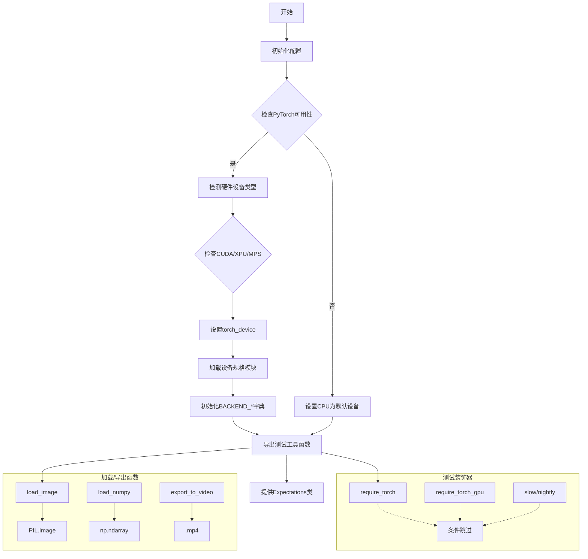

## 类结构

```
Expectations (DevicePropertiesUserDict的子类)
└── 继承自: UserDict

CaptureLogger (上下文管理器)
└── 用于捕获logging输出

全局函数分类:
├── 张量测试: torch_all_close, assert_tensors_close, floats_tensor
├── 数据加载: load_numpy, load_pt, load_image, load_hf_numpy
├── 图像处理: preprocess_image, export_to_gif
├── 模型导出: export_to_ply, export_to_obj, export_to_video
├── 设备管理: _device_agnostic_dispatch, backend_* 系列函数
├── 设备检测: get_device_properties, _is_torch_fp16/fp64_available
├── 测试装饰器: require_*, is_*, slow, nightly, is_* 系列
├── 版本检查: require_*_version_greater 系列
├── pytest配置: pytest_addoption_shared, pytest_terminal_summary_main
├── 工具函数: str_to_bool, parse_flag_from_env, get_tests_dir
└── 其他: enable_full_determinism, disable_full_determinism, is_flaky
```

## 全局变量及字段


### `global_rng`
    
Global random number generator instance for reproducible random operations

类型：`random.Random`
    


### `logger`
    
Logger instance for this module to track runtime information and errors

类型：`logging.Logger`
    


### `_required_peft_version`
    
Boolean indicating whether PEFT version requirement (greater than 0.5) is satisfied

类型：`bool`
    


### `_required_transformers_version`
    
Boolean indicating whether transformers version requirement (greater than 4.33) is satisfied

类型：`bool`
    


### `USE_PEFT_BACKEND`
    
Flag to determine if PEFT backend should be used based on version requirements

类型：`bool`
    


### `BIG_GPU_MEMORY`
    
Threshold in GB for big GPU memory requirement (default 40GB)

类型：`int`
    


### `torch_device`
    
The selected PyTorch device string (cuda, xpu, mps, or cpu) based on availability

类型：`str`
    


### `IS_ROCM_SYSTEM`
    
Flag indicating whether the system is running on AMD ROCm platform

类型：`bool`
    


### `IS_CUDA_SYSTEM`
    
Flag indicating whether the system has NVIDIA CUDA available

类型：`bool`
    


### `IS_XPU_SYSTEM`
    
Flag indicating whether the system has Intel XPU available

类型：`bool`
    


### `IS_GITHUB_ACTIONS`
    
Flag indicating whether the code is running in GitHub Actions CI environment

类型：`bool`
    


### `_run_slow_tests`
    
Environment flag to determine if slow tests should be executed

类型：`bool`
    


### `_run_nightly_tests`
    
Environment flag to determine if nightly tests should be executed

类型：`bool`
    


### `pytest_opt_registered`
    
Dictionary tracking registered pytest options to prevent duplicate registration

类型：`dict`
    


### `BACKEND_SUPPORTS_TRAINING`
    
Mapping of device backend to training support boolean flags

类型：`dict[str, bool]`
    


### `BACKEND_EMPTY_CACHE`
    
Mapping of device backend to memory cache clearing functions

类型：`dict[str, Callable]`
    


### `BACKEND_DEVICE_COUNT`
    
Mapping of device backend to device count retrieval functions

类型：`dict[str, Callable]`
    


### `BACKEND_MANUAL_SEED`
    
Mapping of device backend to manual random seed functions

类型：`dict[str, Callable]`
    


### `BACKEND_RESET_PEAK_MEMORY_STATS`
    
Mapping of device backend to peak memory stats reset functions

类型：`dict[str, Callable]`
    


### `BACKEND_RESET_MAX_MEMORY_ALLOCATED`
    
Mapping of device backend to maximum memory allocated reset functions

类型：`dict[str, Callable]`
    


### `BACKEND_MAX_MEMORY_ALLOCATED`
    
Mapping of device backend to maximum memory allocated query functions

类型：`dict[str, Callable]`
    


### `BACKEND_SYNCHRONIZE`
    
Mapping of device backend to device synchronization functions

类型：`dict[str, Callable]`
    


### `CaptureLogger.logger`
    
The logging logger object to capture output from

类型：`logging.Logger`
    


### `CaptureLogger.io`
    
In-memory string buffer to store captured log output

类型：`StringIO`
    


### `CaptureLogger.sh`
    
Stream handler that writes log records to the StringIO buffer

类型：`logging.StreamHandler`
    


### `CaptureLogger.out`
    
Captured log output as string after exiting the context manager

类型：`str`
    


### `Expectations.DevicePropertiesUserDict`
    
Base class providing dictionary-like storage for device property expectations

类型：`UserDict`
    
    

## 全局函数及方法


### `torch_all_close`

该函数用于比较两个 PyTorch 张量是否在数值上足够接近（使用 `torch.allclose` 进行比较），如果不相近则抛出断言错误，相近时返回 `True`。

参数：

- `a`：`Any`，第一个要比较的 PyTorch 张量
- `b`：`Any`，第二个要比较的 PyTorch 张量
- `*args`：`Tuple`，可变位置参数，会传递给底层的 `torch.allclose` 函数
- `**kwargs`：`Dict`，可变关键字参数，会传递给底层的 `torch.allclose` 函数

返回值：`bool`，如果两个张量接近则返回 `True`，否则会触发断言错误

#### 流程图

```mermaid
flowchart TD
    A[开始] --> B{检查 PyTorch 是否可用}
    B -->|不可用| C[抛出 ValueError: PyTorch needs to be installed]
    B -->|可用| D[调用 torch.allclose 比较 a 和 b]
    D --> E{比较结果}
    E -->|不相近| F[计算差值绝对值<br/>max_diff = (a - b).abs().max<br/>diff_tensor = (a - b).abs]
    E -->|相近| G[返回 True]
    F --> H[触发 assert False<br/>显示 max diff 和 diff tensor]
    H --> I[测试失败]
    G --> J[结束]
    I --> J
```

#### 带注释源码

```python
def torch_all_close(a, b, *args, **kwargs):
    """
    比较两个 PyTorch 张量是否在数值上足够接近。
    
    该函数是对 torch.allclose 的封装，提供了更友好的错误信息。
    如果张量不相近，会显示最大差值和完整的差值张量。
    
    参数:
        a: 第一个要比较的张量
        b: 第二个要比较的张量
        *args: 可变位置参数，传递给 torch.allclose
        **kwargs: 可变关键字参数，传递给 torch.allclose
    
    返回:
        bool: 如果两个张量接近则返回 True
    
    异常:
        ValueError: 如果 PyTorch 不可用
        AssertionError: 如果两个张量不相近
    """
    # 检查 PyTorch 是否可用，如果不可用则抛出异常
    if not is_torch_available():
        raise ValueError("PyTorch needs to be installed to use this function.")
    
    # 调用 torch.allclose 进行比较
    if not torch.allclose(a, b, *args, **kwargs):
        # 计算差值信息用于错误报告
        assert False, f"Max diff is absolute {(a - b).abs().max()}. Diff tensor is {(a - b).abs()}."
    
    # 如果比较通过，返回 True
    return True
```


### `assert_tensors_close`

该函数用于断言两个 PyTorch 张量在给定容差范围内是否相等，提供了清晰的错误信息而不会输出完整的张量数据。

参数：

- `actual`：`torch.Tensor`，实际计算得到的张量
- `expected`：`torch.Tensor`，用于比较的期望张量
- `atol`：`float`，绝对容差，默认为 1e-5
- `rtol`：`float`，相对容差，默认为 1e-5
- `msg`：`str`，断言错误消息的前缀，默认为空字符串

返回值：`None`，无返回值，通过抛出 `AssertionError` 表示断言失败

#### 流程图

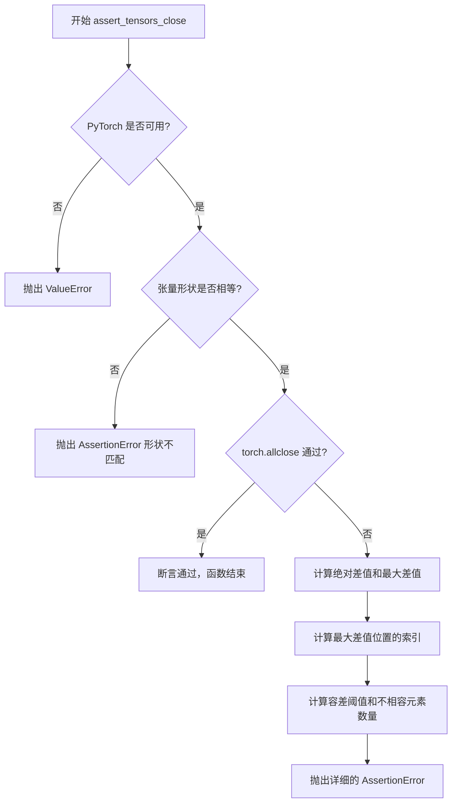

#### 带注释源码

```python
def assert_tensors_close(
    actual: "torch.Tensor",
    expected: "torch.Tensor",
    atol: float = 1e-5,
    rtol: float = 1e-5,
    msg: str = "",
) -> None:
    """
    Assert that two tensors are close within tolerance.

    Uses the same formula as torch.allclose: |actual - expected| <= atol + rtol * |expected|
    Provides concise, actionable error messages without dumping full tensors.

    Args:
        actual: The actual tensor from the computation.
        expected: The expected tensor to compare against.
        atol: Absolute tolerance.
        rtol: Relative tolerance.
        msg: Optional message prefix for the assertion error.

    Raises:
        AssertionError: If tensors have different shapes or values exceed tolerance.

    Example:
        >>> assert_tensors_close(output, expected_output, atol=1e-5, rtol=1e-5, msg="Forward pass")
    """
    # 检查 PyTorch 是否可用，如果不可用则抛出错误
    if not is_torch_available():
        raise ValueError("PyTorch needs to be installed to use this function.")

    # 检查两个张量的形状是否一致，不一致则抛出形状不匹配错误
    if actual.shape != expected.shape:
        raise AssertionError(f"{msg} Shape mismatch: actual {actual.shape} vs expected {expected.shape}")

    # 使用 torch.allclose 检查张量是否在容差范围内close
    if not torch.allclose(actual, expected, atol=atol, rtol=rtol):
        # 计算绝对差值张量
        abs_diff = (actual - expected).abs()
        # 获取最大差值
        max_diff = abs_diff.max().item()

        # 获取最大差值在扁平化数组中的索引
        flat_idx = abs_diff.argmax().item()
        # 将扁平化索引转换为多维索引
        max_idx = tuple(idx.item() for idx in torch.unravel_index(torch.tensor(flat_idx), actual.shape))

        # 计算每个位置的容差阈值: atol + rtol * |expected|
        threshold = atol + rtol * expected.abs()
        # 统计超过阈值的元素数量
        mismatched = (abs_diff > threshold).sum().item()
        # 获取总元素数量
        total = actual.numel()

        # 抛出详细的断言错误信息，包含：
        # - 错误前缀消息
        # - 不匹配元素的数量和百分比
        # - 最大差值及其位置
        # - 实际值和期望值
        # - 使用的容差参数
        raise AssertionError(
            f"{msg}\n"
            f"Tensors not close! Mismatched elements: {mismatched}/{total} ({100 * mismatched / total:.1f}%)\n"
            f"  Max diff: {max_diff:.6e} at index {max_idx}\n"
            f"  Actual:   {actual.flatten()[flat_idx].item():.6e}\n"
            f"  Expected: {expected.flatten()[flat_idx].item():.6e}\n"
            f"  atol: {atol:.6e}, rtol: {rtol:.6e}"
        )
```


### `numpy_cosine_similarity_distance`

该函数用于计算两个向量之间的余弦相似度距离。首先通过点积和范数计算余弦相似度，然后取平均值后用1减去得到距离值，常用于衡量向量间的相似程度。

参数：

- `a`：`numpy.ndarray`，第一个输入向量，用于计算余弦相似度
- `b`：`numpy.ndarray`，第二个输入向量，用于计算余弦相似度

返回值：`float`，返回 1 减去余弦相似度均值的距离值，值越小表示两个向量越相似

#### 流程图

```mermaid
flowchart TD
    A[输入向量 a 和 b] --> B[计算向量范数]
    A --> C[计算向量点积]
    B --> D[计算余弦相似度<br/>similarity = np.dot(a, b) / norm(a) * norm(b)]
    C --> D
    D --> E[计算相似度均值<br/>similarity.mean]
    E --> F[计算距离<br/>distance = 1.0 - similarity.mean]
    F --> G[返回距离值]
```

#### 带注释源码

```python
def numpy_cosine_similarity_distance(a, b):
    """
    计算两个向量之间的余弦相似度距离。
    
    通过计算余弦相似度的均值，然后用1减去该均值得到距离值。
    距离值范围通常在[0, 2]之间，值越小表示两个向量越相似。
    
    参数:
        a: 第一个numpy数组向量
        b: 第二个numpy数组向量
    
    返回:
        float: 余弦相似度距离 (1 - 余弦相似度均值)
    """
    # 计算两个向量的点积，再除以各自范数的乘积，得到余弦相似度
    # np.dot(a, b) 计算向量a和b的点积
    # norm(a) 和 norm(b) 分别计算向量a和b的L2范数
    # 结果是一个标量（如果a和b是一维向量）或数组（如果是多维输入）
    similarity = np.dot(a, b) / (norm(a) * norm(b))
    
    # 计算相似度的均值，然后从1中减去得到距离
    # 使用.mean()可以处理多维数组的情况，返回一个标量距离值
    # 距离为0表示完全相同，距離越大表示越不相似
    distance = 1.0 - similarity.mean()

    # 返回计算得到的距离值
    return distance
```


### `check_if_dicts_are_equal`

该函数用于比较两个字典是否相等，特别处理了字典中值为 `set` 类型的情况（因为 set 是无序的，需要转换为排序后的列表进行比较）。

参数：

- `dict1`：`dict`，第一个要比较的字典
- `dict2`：`dict`，第二个要比较的字典

返回值：`bool`，如果两个字典相等返回 `True`，否则返回 `False`

#### 流程图

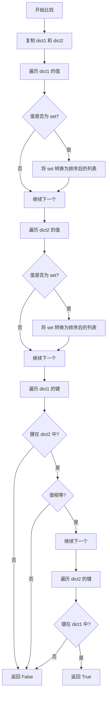

#### 带注释源码

```python
def check_if_dicts_are_equal(dict1, dict2):
    """
    比较两个字典是否相等。

    注意：该函数会修改字典副本，将 set 转换为排序后的列表，以便进行正确的比较。
    这是因为 set 是无序的，需要转换为有序结构才能进行相等性比较。

    Args:
        dict1: 第一个要比较的字典
        dict2: 第二个要比较的字典

    Returns:
        如果两个字典相等返回 True，否则返回 False
    """
    # 复制字典以避免修改原始字典
    dict1, dict2 = dict1.copy(), dict2.copy()

    # 处理 dict1 中的 set 类型值，转换为排序后的列表
    for key, value in dict1.items():
        if isinstance(value, set):
            dict1[key] = sorted(value)
    
    # 处理 dict2 中的 set 类型值，转换为排序后的列表
    for key, value in dict2.items():
        if isinstance(value, set):
            dict2[key] = sorted(value)

    # 检查 dict1 中的所有键是否都在 dict2 中，并且值相等
    for key in dict1:
        if key not in dict2:
            return False
        if dict1[key] != dict2[key]:
            return False

    # 检查 dict2 中的所有键是否都在 dict1 中（防止 dict2 有额外键）
    for key in dict2:
        if key not in dict1:
            return False

    return True
```


### `print_tensor_test`

该函数用于将张量数据格式化为 NumPy 数组字符串，并追加写入指定的测试校正文件，通常用于生成测试用例中的预期值或记录调试信息。

参数：

- `tensor`：`torch.Tensor | np.ndarray`，输入的张量数据，可以是 PyTorch 张量或 NumPy 数组
- `limit_to_slices`：`Optional[slice]`，可选参数，用于限制只取张量的特定切片，默认为 None
- `max_torch_print`：`Optional[int]`，可选参数，当设置时用于设置 PyTorch 的打印阈值，默认为 None
- `filename`：`str`，输出文件名，默认为 "test_corrections.txt"
- `expected_tensor_name`：`str`，生成的 NumPy 数组变量名，默认为 "expected_slice"

返回值：`None`，该函数没有返回值，仅执行文件写入操作

#### 流程图

```mermaid
flowchart TD
    A[开始] --> B{max_torch_print 是否设置?}
    B -->|是| C[设置 torch 打印阈值为 10000]
    B -->|否| D[跳过]
    C --> E[获取 PYTEST_CURRENT_TEST 环境变量]
    D --> E
    E --> F{tensor 是否为 PyTorch 张量?}
    F -->|否| G[将 numpy 数组转换为 torch 张量]
    F -->|是| H{limit_to_slices 是否设置?}
    G --> H
    H -->|是| I[对张量进行切片: tensor[0, -3:, -3:, -1]]
    H -->|否| J[将张量 detach 后转到 CPU 并转换为 float32]
    I --> J
    J --> K[将张量展平并转为字符串]
    K --> L[替换 'tensor' 为 '{expected_tensor_name} = np.array']
    L --> M[解析测试名称: 文件::类名::函数名]
    M --> N[打开文件并以追加模式写入]
    O[结束] --> N
```

#### 带注释源码

```python
def print_tensor_test(
    tensor,
    limit_to_slices=None,
    max_torch_print=None,
    filename="test_corrections.txt",
    expected_tensor_name="expected_slice",
):
    """
    将张量格式化为 numpy 数组字符串并写入文件
    
    参数:
        tensor: 输入的张量或 numpy 数组
        limit_to_slices: 可选的切片参数，用于提取特定部分
        max_torch_print: 设置 torch.print 的阈值
        filename: 输出文件名
        expected_tensor_name: 生成的变量名
    """
    # 如果设置了 max_torch_print，设置 PyTorch 打印选项的阈值
    # 这样可以避免打印过大的张量
    if max_torch_print:
        torch.set_printoptions(threshold=10_000)

    # 从环境变量获取当前测试的名称，格式通常为 test_file.py::TestClass::test_function
    test_name = os.environ.get("PYTEST_CURRENT_TEST")
    
    # 如果输入不是 PyTorch 张量，则从 numpy 数组转换
    if not torch.is_tensor(tensor):
        tensor = torch.from_numpy(tensor)
    
    # 如果提供了 limit_to_slices，则对张量进行切片
    # 这里硬编码为 [0, -3:, -3:, -1]，用于提取特定的通道层
    if limit_to_slices:
        tensor = tensor[0, -3:, -3:, -1]

    # 将张量 detach（脱离计算图）、移到 CPU、展平、转换为 float32
    # 然后转为字符串，并去掉换行符
    tensor_str = str(tensor.detach().cpu().flatten().to(torch.float32)).replace("\n", "")
    
    # 格式化输出字符串，将 'tensor' 替换为指定的变量名
    # 例如: tensor([1.0, 2.0]) -> expected_slice = np.array([1.0, 2.0])
    output_str = tensor_str.replace("tensor", f"{expected_tensor_name} = np.array")
    
    # 解析测试名称，提取文件路径、测试类名和测试函数名
    test_file, test_class, test_fn = test_name.split("::")
    # 取函数名（去掉参数部分）
    test_fn = test_fn.split()[0]
    
    # 以追加模式打开文件，写入格式化的测试数据
    # 格式: test_file::TestClass::test_function::expected_slice = np.array([...])
    with open(filename, "a") as f:
        print("::".join([test_file, test_class, test_fn, output_str]), file=f)
```


### `get_tests_dir`

该函数用于获取测试目录的绝对路径，通过向上遍历调用者的文件路径直到找到以"tests"结尾的目录，从而实现从任意位置调用都能正确获取测试目录的目的，并支持可选地附加子路径。

参数：

- `append_path`：`Optional[str]`，可选参数，要附加在测试目录后的路径

返回值：`str`，返回测试目录的完整路径（如果提供了 append_path，则返回测试目录与附加路径的组合，使用 POSIX 风格路径）

#### 流程图

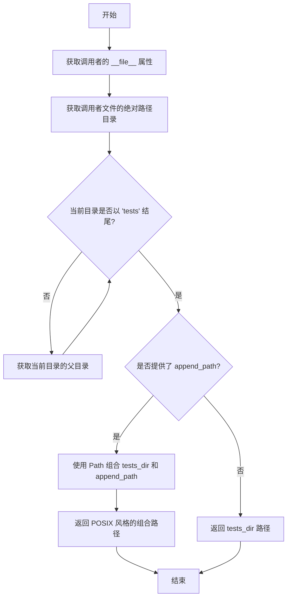

#### 带注释源码

```python
def get_tests_dir(append_path=None):
    """
    获取测试目录的完整路径，使得测试可以从任何位置调用。
    如果提供了 append_path，则将其连接到测试目录之后。
    
    参数:
        append_path: 可选的路径，附加到测试目录路径
    
    返回:
        测试目录的完整路径，如果提供了 append_path，则返回组合后的路径
    """
    # 获取调用此函数的调用者的 __file__ 属性
    caller__file__ = inspect.stack()[1][1]
    
    # 获取调用者文件所在目录的绝对路径
    tests_dir = os.path.abspath(os.path.dirname(caller__file__))

    # 向上遍历目录直到找到以 'tests' 结尾的目录
    while not tests_dir.endswith("tests"):
        tests_dir = os.path.dirname(tests_dir)

    # 如果提供了附加路径，则组合路径并返回 POSIX 格式的路径
    if append_path:
        return Path(tests_dir, append_path).as_posix()
    else:
        return tests_dir
```


### `str_to_bool`

将字符串表示的真值转换为整数 1（真）或 0（假）。真值包括 `y`、`yes`、`t`、`true`、`on` 和 `1`；假值包括 `n`、`no`、`f`、`false`、`off` 和 `0`。

参数：

- `value`：`Any`，需要转换的字符串值

返回值：`int`，如果值为真返回 1，如果值为假返回 0

#### 流程图

```mermaid
flowchart TD
    A[开始: str_to_bool] --> B{value.lower()}
    B --> C{value in<br/>y, yes, t, true, on, 1?}
    C -->|Yes| D[返回 1]
    C -->|No| E{value in<br/>n, no, f, false, off, 0?}
    E -->|Yes| F[返回 0]
    E -->|No| G[抛出 ValueError]
    D --> H[结束]
    F --> H
    G --> H
```

#### 带注释源码

```python
def str_to_bool(value) -> int:
    """
    Converts a string representation of truth to `True` (1) or `False` (0). True values are `y`, `yes`, `t`, `true`,
    `on`, and `1`; False value are `n`, `no`, `f`, `false`, `off`, and `0`;
    """
    # 将输入值转换为小写，以便进行不区分大小写的匹配
    value = value.lower()
    
    # 检查是否为真值
    if value in ("y", "yes", "t", "true", "on", "1"):
        return 1  # 返回 1 表示真
    # 检查是否为假值
    elif value in ("n", "no", "f", "false", "off", "0"):
        return 0  # 返回 0 表示假
    # 如果既不是真值也不是假值，抛出异常
    else:
        raise ValueError(f"invalid truth value {value}")
```


### `parse_flag_from_env`

该函数用于从环境变量中解析布尔标志值，支持将环境变量的字符串值（如 "yes"、"true"、"1" 等）转换为布尔值（1 或 0），如果环境变量未设置则返回默认值。

参数：

- `key`：`str`，要读取的环境变量名称
- `default`：`bool`，当环境变量未设置时返回的默认值，默认为 `False`

返回值：`int`，返回转换后的布尔值（1 表示 True，0 表示 False）

#### 流程图

```mermaid
flowchart TD
    A[开始: parse_flag_from_env] --> B{尝试获取 os.environ[key]}
    B -->|成功获取| C{调用 str_to_bool 转换值}
    B -->|KeyError 异常| D[返回 default 值]
    C -->|转换成功| E[返回转换后的值]
    C -->|ValueError 异常| F[抛出 ValueError: 环境变量必须为 yes 或 no]
    E --> G[结束]
    D --> G
    F --> G
```

#### 带注释源码

```python
def parse_flag_from_env(key, default=False):
    """
    从环境变量中解析布尔标志值。
    
    参数:
        key: 环境变量的名称
        default: 当环境变量未设置时返回的默认值
        
    返回:
        转换后的布尔值（1 表示 True，0 表示 False）
    """
    try:
        # 尝试从环境变量中获取指定 key 的值
        value = os.environ[key]
    except KeyError:
        # 如果环境变量未设置（抛出 KeyError），使用默认值
        _value = default
    else:
        # 环境变量已设置，尝试将其转换为布尔值
        try:
            # 使用 str_to_bool 函数将字符串转换为 0 或 1
            _value = str_to_bool(value)
        except ValueError:
            # 如果转换失败（值不是有效的布尔字符串），抛出异常
            # 支持的值有：y, yes, t, true, on, 1 (True) 和 n, no, f, false, off, 0 (False)
            raise ValueError(f"If set, {key} must be yes or no.")
    return _value
```


### `floats_tensor`

该函数用于创建一个指定形状的随机 float32 类型张量，常用于测试场景中生成模拟数据。

参数：

- `shape`：`tuple` 或 `int`，要创建的张量的形状
- `scale`：`float`，默认值 `1.0`，随机值的缩放因子，用于控制生成数值的范围
- `rng`：`random.Random`，默认值 `None`，随机数生成器对象，默认为全局随机数生成器 `global_rng`
- `name`：`str` 或 `None`，默认值 `None`，张量的名称标识（当前未被使用）

返回值：`torch.Tensor`，生成的随机 float32 类型张量

#### 流程图

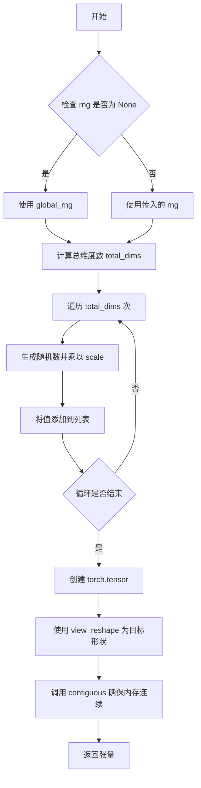

#### 带注释源码

```python
def floats_tensor(shape, scale=1.0, rng=None, name=None):
    """Creates a random float32 tensor"""
    # 如果未提供随机数生成器，则使用全局随机数生成器
    if rng is None:
        rng = global_rng

    # 计算总维度数（元素总数）
    total_dims = 1
    for dim in shape:
        total_dims *= dim

    # 生成随机值列表
    values = []
    for _ in range(total_dims):
        # 生成 0-1 之间的随机数并乘以缩放因子
        values.append(rng.random() * scale)

    # 创建 float32 类型的 PyTorch 张量
    # 使用 view 方法 reshape 为目标形状
    # 调用 contiguous 确保内存连续（view 需要连续内存）
    return torch.tensor(data=values, dtype=torch.float).view(shape).contiguous()
```


### `slow`

装饰器函数，用于将测试标记为慢速测试。慢速测试默认会被跳过，只有在设置 `RUN_SLOW` 环境变量为真值时才会运行。

参数：

- `test_case`：`Callable`，需要被标记为慢速的测试函数或测试类

返回值：`Callable`，应用了 `pytest.mark.skipif` 装饰器的测试用例

#### 流程图

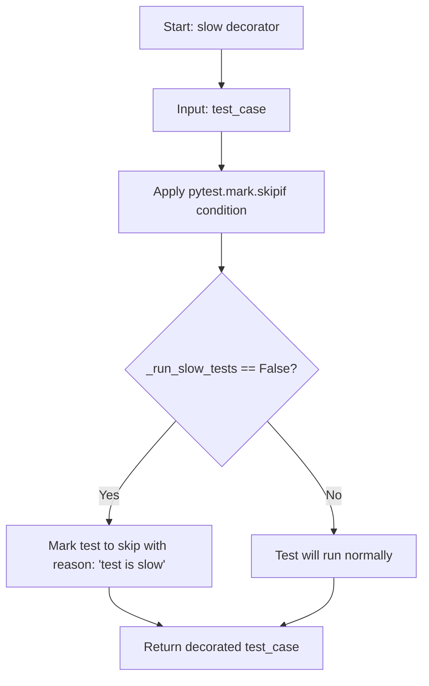

#### 带注释源码

```python
def slow(test_case):
    """
    Decorator marking a test as slow.

    Slow tests are skipped by default. Set the RUN_SLOW environment variable to a truthy value to run them.

    """
    # _run_slow_tests is set by parsing the RUN_SLOW environment variable (default: False)
    # If _run_slow_tests is False, the test will be skipped with the reason "test is slow"
    # If _run_slow_tests is True, the test will run normally
    return pytest.mark.skipif(not _run_slow_tests, reason="test is slow")(test_case)
```


### `nightly`

这是一个用于标记在 diffusers CI 中夜间运行的测试的装饰器。默认情况下会跳过这些测试，只有将 `RUN_NIGHTLY` 环境变量设置为真值（truthy）时才执行。

参数：

- `test_case`：`Callable`，被装饰的测试函数或测试类

返回值：`Callable`，pytest 装饰器（根据条件跳过的测试）

#### 流程图

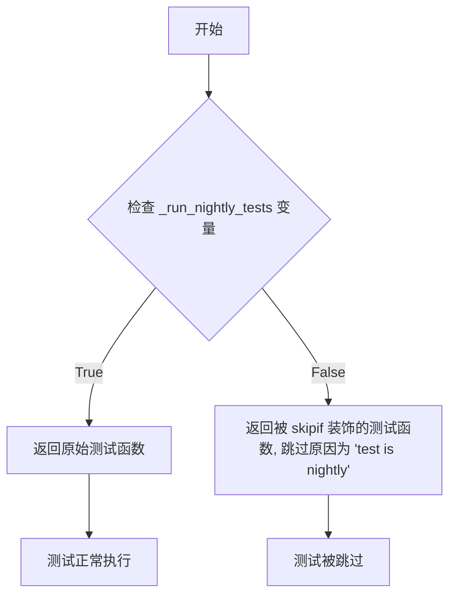

#### 带注释源码

```python
def nightly(test_case):
    """
    Decorator marking a test that runs nightly in the diffusers CI.

    Slow tests are skipped by default. Set the RUN_NIGHTLY environment variable to a truthy value to run them.

    """
    # _run_nightly_tests 是通过解析环境变量 RUN_NIGHTLY 得到的布尔值
    # 使用 pytest.mark.skipif 实现条件跳过：
    # - 如果 _run_nightly_tests 为 False（未设置环境变量），测试被跳过
    # - 如果 _run_nightly_tests 为 True（已设置环境变量），测试正常执行
    return pytest.mark.skipif(not _run_nightly_tests, reason="test is nightly")(test_case)
```


### `is_torch_compile`

该函数是一个 pytest 装饰器，用于标记测试用例为 torch.compile 测试。通过 pytest 的标记机制，可以方便地使用 `pytest -m compile` 仅运行这些测试，或使用 `pytest -m "not compile"` 跳过这些测试。

参数：

- `test_case`：`Callable`，被装饰的测试函数或测试类

返回值：`Callable`，装饰后的测试函数，绑定有 `compile` 标记

#### 流程图

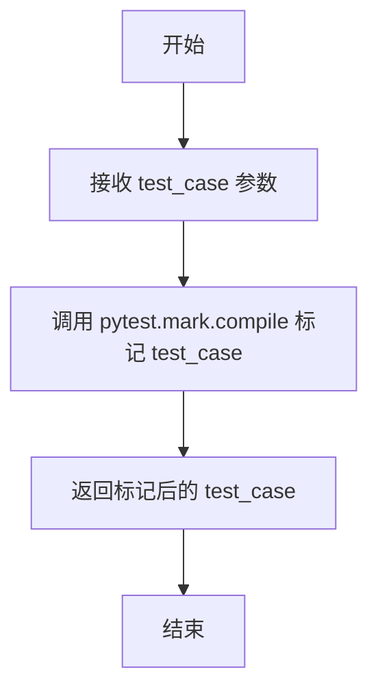

#### 带注释源码

```python
def is_torch_compile(test_case):
    """
    Decorator marking a test as a torch.compile test. These tests can be filtered using:
        pytest -m "not compile" to skip
        pytest -m compile to run only these tests
    """
    # 使用 pytest 的 mark.compile 装饰器标记测试用例
    # 这样可以通过 pytest -m compile 或 pytest -m "not compile" 来过滤测试
    return pytest.mark.compile(test_case)
```


### `is_single_file`

这是一个装饰器函数，用于将测试标记为单文件加载测试。通过使用 pytest 的 marker 功能，可以方便地通过命令行过滤运行或跳过此类测试。

参数：

- `test_case`：`Callable`，需要标记的测试函数或类对象

返回值：`Callable`，返回装饰后的测试函数或类，添加了 `single_file` 标记

#### 流程图

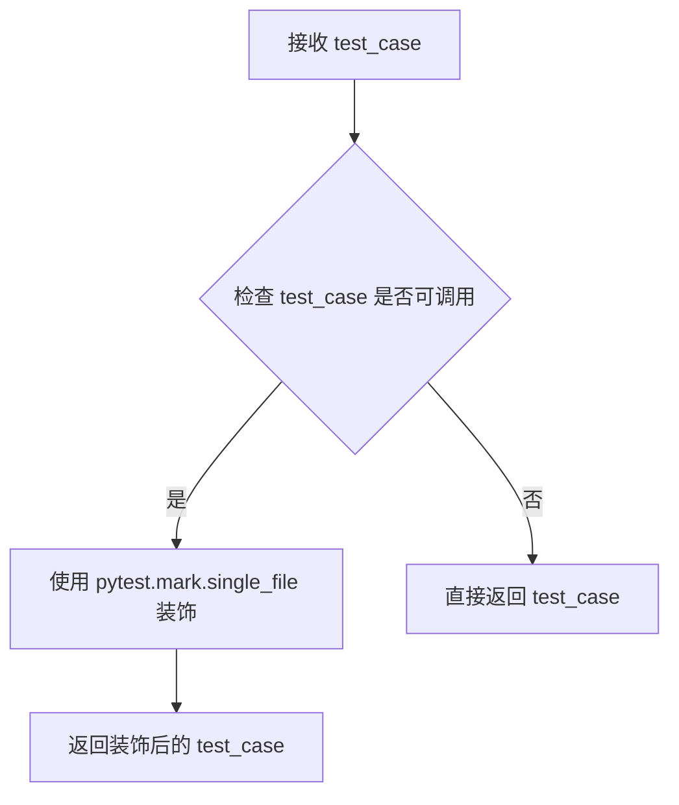

#### 带注释源码

```python
def is_single_file(test_case):
    """
    Decorator marking a test as a single file loading test. These tests can be filtered using:
        pytest -m "not single_file" to skip
        pytest -m single_file to run only these tests
    """
    # 使用 pytest 的 marker 功能为测试添加 'single_file' 标记
    # 该标记可用于过滤测试执行
    return pytest.mark.single_file(test_case)
```


### `is_lora`

该函数是一个pytest装饰器，用于将测试标记为LoRA（Low-Rank Adaptation）相关测试，以便通过pytest的marker机制进行筛选和运行。

参数：

- `test_case`：`Callable`，需要标记为LoRA测试的测试函数或测试类

返回值：`Callable`，返回经`pytest.mark.lora`装饰器处理后的测试用例

#### 流程图

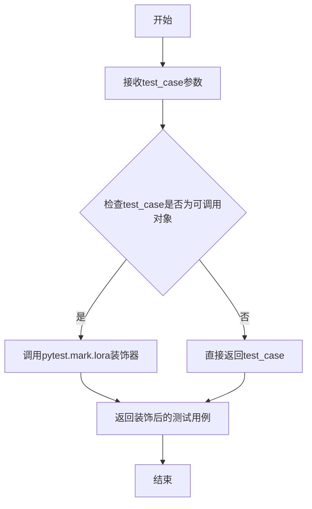

#### 带注释源码

```python
def is_lora(test_case):
    """
    Decorator marking a test as a LoRA test. These tests can be filtered using:
        pytest -m "not lora" to skip
        pytest -m lora to run only these tests
    
    Args:
        test_case: 测试函数或测试类
        
    Returns:
        经过pytest.mark.lora装饰器处理的测试用例
    """
    # 使用pytest的marker机制为测试添加lora标记
    # 这样可以通过 pytest -m lora 来仅运行LoRA相关测试
    # 或通过 pytest -m "not lora" 来跳过LoRA相关测试
    return pytest.mark.lora(test_case)
```


### `is_ip_adapter`

这是一个pytest装饰器函数，用于将测试用例标记为IP Adapter测试，以便可以通过pytest的标记机制进行筛选和运行。

参数：

- `test_case`：`Callable`，需要被标记的测试用例（函数或类）

返回值：`Callable`，添加了IP Adapter标记的测试用例

#### 流程图

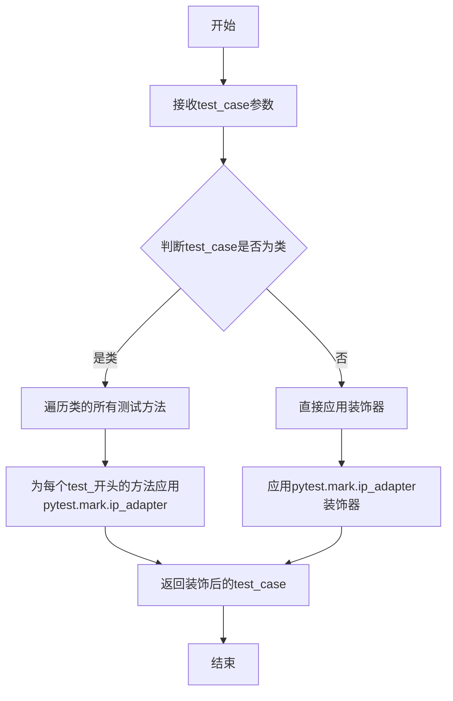

#### 带注释源码

```python
def is_ip_adapter(test_case):
    """
    Decorator marking a test as an IP Adapter test. These tests can be filtered using:
        pytest -m "not ip_adapter" to skip
        pytest -m ip_adapter to run only these tests
    
    这个装饰器用于标记测试为IP Adapter类型的测试。
    IP Adapter是Stable Diffusion中的一种注意力机制特征注入方法。
    通过使用pytest标记，可以有选择性地运行或跳过这类测试。
    
    使用示例：
        pytest -m "ip_adapter" 只运行IP Adapter测试
        pytest -m "not ip_adapter" 跳过IP Adapter测试
    """
    # 使用pytest的mark.ip_adapter标记该测试用例
    # 返回装饰后的测试函数，该函数会被pytest识别为ip_adapter类型的测试
    return pytest.mark.ip_adapter(test_case)
```


### `is_training`

装饰器函数，用于将测试用例标记为训练测试，以便通过 pytest 的 `-m training` 选项进行筛选运行。

参数：

- `test_case`：`Callable`，需要被标记为训练测试的测试用例（函数或类）

返回值：`Callable`，返回带有 `training` 标记的测试用例

#### 流程图

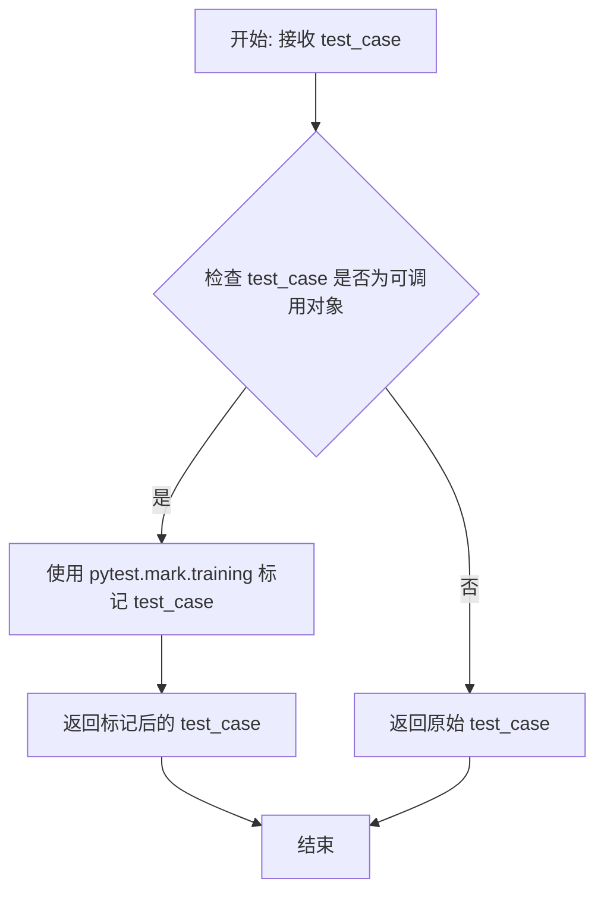

#### 带注释源码

```python
def is_training(test_case):
    """
    Decorator marking a test as a training test. These tests can be filtered using:
        pytest -m "not training" to skip
        pytest -m training to run only these tests
    """
    # 使用 pytest 的标记功能将测试用例标记为 training 类型
    # 这样可以通过 pytest -m training 来只运行被标记的测试
    # 或者通过 pytest -m "not training" 来跳过这些测试
    return pytest.mark.training(test_case)
```


### `is_attention`

装饰器函数，用于将测试标记为注意力（attention）测试。该装饰器使用 `pytest.mark.attention` 标记测试用例，允许通过 pytest 的 `-m` 选项进行筛选运行。

参数：

- `test_case`：`Callable`，需要标记的测试函数或测试方法

返回值：`Callable`，应用了 `pytest.mark.attention` 装饰器后的测试函数

#### 流程图

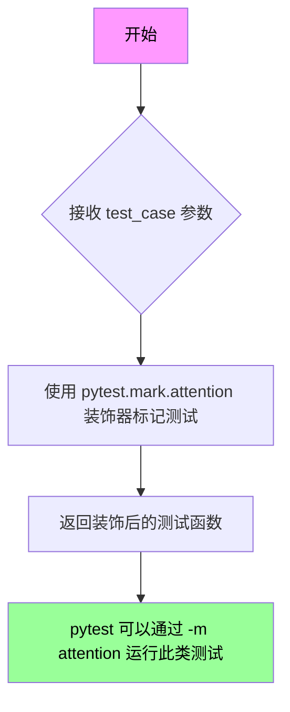

#### 带注释源码

```python
def is_attention(test_case):
    """
    Decorator marking a test as an attention test. These tests can be filtered using:
        pytest -m "not attention" to skip
        pytest -m attention to run only these tests
    """
    return pytest.mark.attention(test_case)
```


### `is_memory`

这是一个装饰器函数，用于将测试标记为内存优化测试。通过 pytest 的标记机制，可以方便地筛选和运行特定的内存相关测试用例。

参数：

- `test_case`：`Callable`，需要被标记为内存优化测试的测试函数或测试类

返回值：`Callable`，返回带有 `pytest.mark.memory` 标记的测试用例

#### 流程图

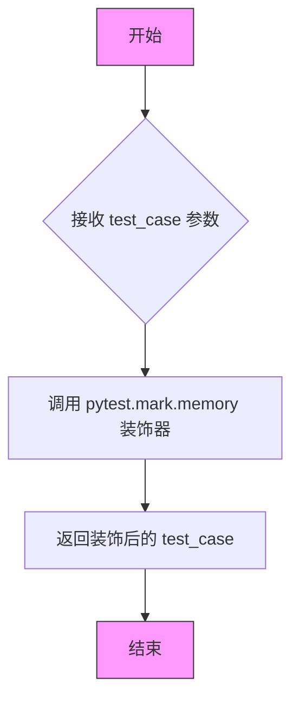

#### 带注释源码

```python
def is_memory(test_case):
    """
    Decorator marking a test as a memory optimization test. These tests can be filtered using:
        pytest -m "not memory" to skip
        pytest -m memory to run only these tests
    
    Args:
        test_case: The test case (function or class) to be decorated.
        
    Returns:
        The decorated test case with memory marker applied.
        
    Example:
        >>> @is_memory
        ... def test_memory_efficient_attention():
        ...     # test implementation
        ...     pass
    """
    return pytest.mark.memory(test_case)
```


### `is_cpu_offload`

这是一个 pytest 装饰器函数，用于标记测试用例为 CPU offload 测试，使其可以通过 pytest 的 marker 机制进行过滤和选择性运行。

参数：

- `test_case`：`Callable`，被装饰的测试函数或测试类

返回值：`Callable`，经过 `pytest.mark.cpu_offload` 标记装饰后的测试函数或测试类

#### 流程图

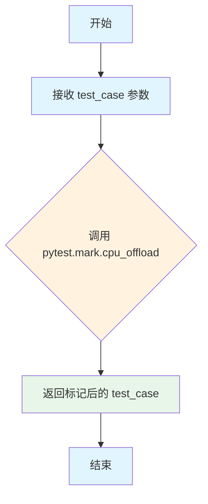

#### 带注释源码

```python
def is_cpu_offload(test_case):
    """
    Decorator marking a test as a CPU offload test. These tests can be filtered using:
        pytest -m "not cpu_offload" to skip
        pytest -m cpu_offload to run only these tests
    
    Args:
        test_case: 被装饰的测试函数或测试类
        
    Returns:
        经过 pytest.mark.cpu_offload 标记装饰后的测试函数或测试类
        
    Example:
        >>> @is_cpu_offload
        ... def test_model_cpu_offload():
        ...     # 测试 CPU offload 功能
        ...     pass
    """
    # 使用 pytest 的 marker 机制标记测试用例为 cpu_offload 类型
    # 这样可以通过 pytest -m cpu_offload 或 pytest -m "not cpu_offload" 来过滤测试
    return pytest.mark.cpu_offload(test_case)
```


### `is_group_offload`

该函数是一个pytest装饰器，用于标记测试用例为group offload测试，以便通过pytest的`-m group_offload`标记进行过滤和运行。

参数：

- `test_case`：`Callable`，需要被标记的测试函数或测试类

返回值：`Callable`，添加了`group_offload`标记的测试用例

#### 流程图

```mermaid
flowchart TD
    A[开始] --> B[接收test_case参数]
    B --> C[调用pytest.mark.group_offload标记test_case]
    C --> D[返回标记后的test_case]
    E[结束]
```

#### 带注释源码

```python
def is_group_offload(test_case):
    """
    Decorator marking a test as a group offload test. These tests can be filtered using:
        pytest -m "not group_offload" to skip
        pytest -m group_offload to run only these tests
    """
    # 使用pytest的mark机制为测试用例添加group_offload标记
    # 这样可以通过 pytest -m group_offload 来仅运行这类测试
    # 或通过 pytest -m "not group_offload" 来跳过这类测试
    return pytest.mark.group_offload(test_case)
```


### `is_quantization`

这是一个 pytest 装饰器函数，用于将测试标记为量化测试，使得可以通过 pytest 的标记过滤机制来选择性地运行这些测试。

参数：

- `test_case`：`Callable`，需要被标记为量化测试的测试函数或测试类

返回值：`Callable`，返回带有 `pytest.mark.quantization` 标记的测试函数或测试类

#### 流程图

```mermaid
flowchart TD
    A[开始] --> B[接收 test_case 参数]
    B --> C{检查 test_case 是否为可调用对象}
    C -->|是| D[使用 pytest.mark.quantization 标记 test_case]
    C -->|否| E[返回原始 test_case]
    D --> F[返回标记后的 test_case]
    E --> F
```

#### 带注释源码

```python
def is_quantization(test_case):
    """
    Decorator marking a test as a quantization test. These tests can be filtered using:
        pytest -m "not quantization" to skip
        pytest -m quantization to run only these tests
    """
    # 使用 pytest 的标记机制将测试标记为 quantization 类型
    # 这样可以通过 pytest -m quantization 来只运行这些测试
    # 或者通过 pytest -m "not quantization" 来跳过这些测试
    return pytest.mark.quantization(test_case)
```


### `is_bitsandbytes`

标记测试为 BitsAndBytes 量化测试的装饰器函数，用于在运行测试时进行过滤（可通过 `pytest -m "bitsandbytes"` 或 `pytest -m "not bitsandbytes"` 来选择性地运行或跳过此类测试）。

参数：

- `test_case`：`Callable`，被装饰的测试函数或测试类

返回值：`Callable`，添加了 `bitsandbytes` 标记的测试用例

#### 流程图

```mermaid
flowchart TD
    A[开始] --> B[接收 test_case 参数]
    B --> C{调用 pytest.mark.bitsandbytes]
    C --> D[返回装饰后的测试用例]
    D --> E[结束]
```

#### 带注释源码

```python
def is_bitsandbytes(test_case):
    """
    Decorator marking a test as a BitsAndBytes quantization test. These tests can be filtered using:
        pytest -m "not bitsandbytes" to skip
        pytest -m bitsandbytes to run only these tests
    """
    # 使用 pytest.mark.bitsandbytes 标记装饰测试用例
    # 这样可以通过 pytest 的 -m 选项来过滤运行
    return pytest.mark.bitsandbytes(test_case)
```


### `is_quanto`

这是一个pytest装饰器函数，用于将测试标记为Quanto量化测试，使得可以通过pytest的mark机制进行筛选运行。

参数：

- `test_case`：任意类型，需要被标记的pytest测试用例（函数或类方法）

返回值：`pytest.mark.quanto`，返回带有Quanto标记的测试用例

#### 流程图

```mermaid
flowchart TD
    A[开始] --> B{接收test_case参数}
    B --> C[调用pytest.mark.quanto标记测试]
    C --> D[返回标记后的test_case]
    D --> E[结束]
```

#### 带注释源码

```python
def is_quanto(test_case):
    """
    Decorator marking a test as a Quanto quantization test. These tests can be filtered using:
        pytest -m "not quanto" to skip
        pytest -m quanto to run only these tests
    
    该装饰器用于标记测试为Quanto量化测试，允许通过pytest的mark机制
    来筛选运行或跳过这些测试。
    
    Args:
        test_case: 需要被标记的测试用例（函数或类方法）
    
    Returns:
        带有pytest.mark.quanto标记的测试用例
    """
    return pytest.mark.quanto(test_case)
```


### `is_torchao`

这是一个装饰器函数，用于将测试标记为 TorchAO 量化测试，使其可以通过 pytest 的 marker 机制进行过滤和选择执行。

参数：

- `test_case`：`Callable`，被装饰的测试函数或测试类

返回值：`Callable`，返回带有 `pytest.mark.torchao` 标记的测试用例

#### 流程图

```mermaid
flowchart TD
    A[开始] --> B[接收 test_case 参数]
    B --> C[调用 pytest.mark.torchao 装饰器]
    C --> D[返回装饰后的 test_case]
    D --> E[结束]
    
    style A fill:#e1f5fe
    style E fill:#e1f5fe
    style C fill:#fff3e0
```

#### 带注释源码

```python
def is_torchao(test_case):
    """
    Decorator marking a test as a TorchAO quantization test. These tests can be filtered using:
        pytest -m "not torchao" to skip
        pytest -m torchao to run only these tests
    """
    # 使用 pytest 的 marker 机制为测试添加 torchao 标记
    # 这样可以通过 pytest -m torchao 只运行这些测试
    # 或通过 pytest -m "not torchao" 跳过这些测试
    return pytest.mark.torchao(test_case)
```


### `is_gguf`

该函数是一个pytest装饰器，用于标记测试为GGUF量化测试。通过pytest的mark机制，可以实现对GGUF相关测试的过滤和选择性运行。

参数：

- `test_case`：`Callable`，需要被标记为GGUF量化测试的测试函数或测试类

返回值：`Callable`，添加了GGUF标记的测试函数或测试类

#### 流程图

```mermaid
flowchart TD
    A[开始] --> B{接收test_case参数}
    B --> C[调用pytest.mark.gguf标记测试]
    C --> D[返回装饰后的test_case]
    D --> E[结束]
```

#### 带注释源码

```python
def is_gguf(test_case):
    """
    Decorator marking a test as a GGUF quantization test. These tests can be filtered using:
        pytest -m "not gguf" to skip
        pytest -m gguf to run only these tests
    """
    return pytest.mark.gguf(test_case)
```


### `is_modelopt`

该函数是一个pytest装饰器，用于标记支持NVIDIA ModelOpt量化测试的测试用例。通过pytest的marker机制，可以过滤运行或跳过这些测试。

参数：

- `test_case`：`Callable`，需要被标记的测试函数或测试类

返回值：`Callable`，返回标记后的测试函数或测试类

#### 流程图

```mermaid
flowchart TD
    A[开始] --> B{接收 test_case 参数}
    B --> C[调用 pytest.mark.modelopt 标记 test_case]
    C --> D[返回标记后的 test_case]
    D --> E[结束]
    
    style A fill:#e1f5fe
    style E fill:#e1f5fe
    style C fill:#fff3e0
    style D fill:#fff3e0
```

#### 带注释源码

```python
def is_modelopt(test_case):
    """
    Decorator marking a test as a NVIDIA ModelOpt quantization test. These tests can be filtered using:
        pytest -m "not modelopt" to skip
        pytest -m modelopt to run only these tests
    
    Args:
        test_case: The test function or test class to be marked
        
    Returns:
        The decorated test function/class with modelopt marker
    """
    # 使用 pytest.mark.modelopt 标记测试用例
    # 这样可以通过 pytest -m modelopt 来专门运行这些测试
    # 或者通过 pytest -m "not modelopt" 来跳过这些测试
    return pytest.mark.modelopt(test_case)
```


### `is_context_parallel`

该函数是一个pytest装饰器，用于标记测试为上下文并行推理测试。通过添加`context_parallel`标记，可以方便地在pytest中筛选或跳过这类测试。

参数：

- `test_case`：`Callable`，需要被标记的测试函数或测试类

返回值：`Callable`，添加了`context_parallel`标记的测试函数或测试类

#### 流程图

```mermaid
flowchart TD
    A[开始: 输入测试函数 test_case] --> B{应用 pytest.mark.context_parallel 标记}
    B --> C[返回装饰后的测试函数]
    C --> D[结束]
```

#### 带注释源码

```python
def is_context_parallel(test_case):
    """
    Decorator marking a test as a context parallel inference test. These tests can be filtered using:
        pytest -m "not context_parallel" to skip
        pytest -m context_parallel to run only these tests
    
    参数:
        test_case: 需要标记的测试函数或测试类
    
    返回:
        添加了 context_parallel 标记的测试函数或测试类，可用于 pytest -m context_parallel 筛选
    """
    # 使用 pytest.mark.context_parallel 标记测试用例
    # 这样可以通过 pytest -m "context_parallel" 运行所有上下文并行测试
    # 或通过 pytest -m "not context_parallel" 跳过这些测试
    return pytest.mark.context_parallel(test_case)
```


### `is_cache`

用于将测试标记为缓存测试的装饰器函数，允许通过 pytest 的标记机制来筛选运行或跳过缓存相关的测试。

参数：

- `test_case`：`Callable`，被装饰的测试函数或测试方法

返回值：`Callable`，添加了 cache 标记的测试函数

#### 流程图

```mermaid
flowchart TD
    A[开始] --> B{接收 test_case 参数}
    B --> C[调用 pytest.mark.cache 装饰器]
    C --> D[返回装饰后的测试函数]
    D --> E[结束]
```

#### 带注释源码

```python
def is_cache(test_case):
    """
    Decorator marking a test as a cache test. These tests can be filtered using:
        pytest -m "not cache" to skip
        pytest -m cache to run only these tests
    """
    # 使用 pytest.mark.cache 标记测试函数
    # 该标记允许通过 pytest -m cache 来专门运行缓存相关的测试
    # 或通过 pytest -m "not cache" 来跳过这些测试
    return pytest.mark.cache(test_case)
```


### `require_torch`

该函数是一个 pytest 装饰器，用于标记需要 PyTorch 的测试用例。当 PyTorch 不可用时，通过 `pytest.mark.skipif` 跳过该测试。

参数：

- `test_case`：`Callable`，需要装饰的测试函数或测试类

返回值：`Callable`，装饰后的测试用例（如果 PyTorch 可用则原样返回，否则返回跳过的测试）

#### 流程图

```mermaid
flowchart TD
    A[开始] --> B{is_torch_available?}
    B -->|True| C[返回原test_case]
    B -->|False| D[返回skipif标记的test_case]
    C --> E[测试正常执行]
    D --> F[测试被跳过 - reason: test requires PyTorch]
```

#### 带注释源码

```python
def require_torch(test_case):
    """
    Decorator marking a test that requires PyTorch. These tests are skipped when PyTorch isn't installed.
    """
    # 使用 pytest.mark.skipif 装饰器：
    # - 条件：not is_torch_available()（即 PyTorch 不可用）
    # - 跳过原因：test requires PyTorch
    return pytest.mark.skipif(not is_torch_available(), reason="test requires PyTorch")(test_case)
```


### `require_torch_2`

该函数是一个 pytest 装饰器，用于标记需要 PyTorch 2.0.0 或更高版本的测试。当 PyTorch 未安装或版本低于 2.0.0 时，测试会被自动跳过。

参数：

- `test_case`：`Callable`，需要装饰的测试函数或类

返回值：`Callable`，装饰后的测试函数（带有 skipif 标记）

#### 流程图

```mermaid
flowchart TD
    A[开始: 接收 test_case] --> B{检查 is_torch_available}
    B -->|True| C{检查 is_torch_version >= 2.0.0}
    B -->|False| D[返回 skipif 标记的测试, reason: test requires PyTorch 2]
    C -->|True| E[返回 skipif 标记的测试, 条件为 False - 不跳过]
    C -->|False| F[返回 skipif 标记的测试, 条件为 True - 跳过]
    D --> G[结束]
    E --> G
    F --> G
```

#### 带注释源码

```python
def require_torch_2(test_case):
    """
    Decorator marking a test that requires PyTorch 2. These tests are skipped when it isn't installed.
    """
    # 使用 pytest.mark.skipif 装饰测试用例
    # 条件: PyTorch 已安装 AND PyTorch 版本 >= 2.0.0
    # 如果条件不满足（即 PyTorch 未安装或版本 < 2.0.0），测试会被跳过，原因是 "test requires PyTorch 2"
    return pytest.mark.skipif(
        not (is_torch_available() and is_torch_version(">=", "2.0.0")), reason="test requires PyTorch 2"
    )(test_case)
```


### `require_torch_version_greater_equal`

该函数是一个 pytest 装饰器工厂，用于标记需要特定版本或更高版本 PyTorch 的测试用例。如果当前 PyTorch 版本不满足要求，测试将被跳过。

参数：

- `torch_version`：`str`，指定的最低 PyTorch 版本号（例如 "1.8.0"）

返回值：`Callable`，返回一个装饰器函数，用于标记测试用例

#### 流程图

```mermaid
flowchart TD
    A[开始: require_torch_version_greater_equal] --> B[输入: torch_version 字符串]
    B --> C[定义内部装饰器函数 decorator]
    C --> D{检查 PyTorch 是否可用}
    D -->|是| E[调用 is_torch_version with '>=' 和 torch_version]
    D -->|否| F[correct_torch_version = False]
    E --> G{版本检查结果}
    G -->|通过| H[correct_torch_version = True]
    G -->|失败| I[correct_torch_version = False]
    F --> J[构建 skipif 装饰器]
    H --> J
    I --> J
    J --> K[返回 pytest.mark.skipif 装饰器]
    K --> L[结束: 返回 decorator 函数]
```

#### 带注释源码

```python
def require_torch_version_greater_equal(torch_version):
    """
    装饰器工厂函数，用于标记需要特定版本或更高版本 PyTorch 的测试。
    
    Args:
        torch_version: 最低要求的 PyTorch 版本号字符串（如 "1.8.0"）
    
    Returns:
        返回一个装饰器函数，该装饰器会根据 PyTorch 版本条件跳过不满足要求的测试
    """
    
    def decorator(test_case):
        """
        内部装饰器函数，实际用于装饰测试用例
        
        Args:
            test_case: 被装饰的测试函数或测试类
        
        Returns:
            根据条件标记后的测试用例，可能被 skipif 装饰器跳过
        """
        # 检查 PyTorch 是否可用且版本是否满足要求
        correct_torch_version = is_torch_available() and is_torch_version(">=", torch_version)
        
        # 使用 pytest.mark.skipif 装饰器
        # 如果版本不满足要求，测试将被跳过，并显示指定的跳过原因
        return pytest.mark.skipif(
            not correct_torch_version,
            reason=f"test requires torch with the version greater than or equal to {torch_version}",
        )(test_case)

    # 返回装饰器函数，供 pytest 在运行测试时调用
    return decorator
```


### `require_torch_version_greater`

该函数是一个装饰器工厂，用于标记需要特定版本以上 PyTorch 的测试。如果安装的 PyTorch 版本不满足要求，测试将被跳过。

参数：

-  `torch_version`：`str`，要比较的 PyTorch 版本号（ exclusive，大于）

返回值：`Callable`，返回一个装饰器函数，用于包装测试用例

#### 流程图

```mermaid
flowchart TD
    A[开始] --> B[接收 torch_version 参数]
    B --> C[定义 decorator 函数]
    C --> D{检查 PyTorch 是否可用且版本 > torch_version}
    D -->|是| E[返回原始测试用例]
    D -->|否| F[使用 pytest.mark.skipif 包装测试用例]
    F --> G[设置跳过原因: test requires torch with the version greater than {torch_version}]
    E --> H[返回测试用例/装饰后的测试用例]
    G --> H
    H --> I[结束]
```

#### 带注释源码

```python
def require_torch_version_greater(torch_version):
    """Decorator marking a test that requires torch with a specific version greater."""
    # torch_version: str, the minimum PyTorch version required (exclusive comparison)
    
    def decorator(test_case):
        # 检查 PyTorch 是否可用且版本是否大于指定版本
        # is_torch_available() 检查 PyTorch 是否已安装
        # is_torch_version(">", torch_version) 检查版本是否大于指定版本
        correct_torch_version = is_torch_available() and is_torch_version(">", torch_version)
        
        # 如果版本不满足要求，使用 pytest.mark.skipif 跳过测试
        # 跳过原因包含要求的版本号
        return pytest.mark.skipif(
            not correct_torch_version, 
            reason=f"test requires torch with the version greater than {torch_version}"
        )(test_case)

    return decorator
```

#### 使用示例

```python
# 使用方式：作为装饰器应用于测试函数
@require_torch_version_greater("2.0.0")
def test_something():
    # 这个测试仅在 PyTorch 版本 > 2.0.0 时运行
    pass

# 等价于
def test_something():
    pass
test_something = require_torch_version_greater("2.0.0")(test_something)
```

#### 相关函数对比

| 函数名 | 比较方式 | 描述 |
|--------|----------|------|
| `require_torch_version_greater` | `>` (exclusive) | 要求版本大于指定版本 |
| `require_torch_version_greater_equal` | `>=` (inclusive) | 要求版本大于或等于指定版本 |
| `require_torch_2` | `>= 2.0.0` | 要求 PyTorch 2.x |
| `require_torch` | - | 仅要求 PyTorch 可用 |


### `require_torch_gpu`

这是一个pytest装饰器函数，用于标记需要CUDA和PyTorch的测试。如果测试环境没有CUDA支持（torch_device不等于"cuda"），则跳过该测试。

参数：

- `test_case`：`Callable`，需要装饰的测试函数或测试类

返回值：`Callable`，返回装饰后的测试函数，如果设备不是cuda则会被pytest标记为跳过

#### 流程图

```mermaid
flowchart TD
    A[开始] --> B{传入 test_case}
    B --> C{torch_device == 'cuda'?}
    C -->|是| D[正常运行 test_case]
    C -->|否| E[pytest.mark.skipif 标记跳过]
    D --> F[返回 test_case]
    E --> F
    F[结束]
```

#### 带注释源码

```python
def require_torch_gpu(test_case):
    """Decorator marking a test that requires CUDA and PyTorch."""
    # 使用 pytest.mark.skipif 装饰器：
    # - 条件：torch_device 不等于 "cuda"
    # - 原因：test requires PyTorch+CUDA
    # 当条件为 True 时，测试会被跳过
    return pytest.mark.skipif(torch_device != "cuda", reason="test requires PyTorch+CUDA")(test_case)
```


### `require_torch_cuda_compatibility`

该函数是一个 pytest 装饰器工厂，用于标记需要特定 CUDA 计算能力（compute capability）的测试。如果当前 CUDA 设备的计算能力与期望值不匹配，则跳过该测试。

参数：

- `expected_compute_capability`：`float` 或 `str`，期望的 CUDA 计算能力（如 7.0、8.0 等）

返回值：`Callable`，返回一个新的装饰器函数，用于包装测试函数

#### 流程图

```mermaid
flowchart TD
    A[调用 require_torch_cuda_compatibility] --> B[接收 expected_compute_capability 参数]
    B --> C[返回 decorator 函数]
    C --> D{测试函数被调用}
    D --> E{torch.cuda.is_available()}
    E -->|是| F[获取当前 CUDA 设备计算能力]
    E -->|否| G[返回原始测试函数不跳过]
    F --> H{当前计算能力 != 期望计算能力?}
    H -->|是| I[标记测试为跳过 skipif]
    H -->|否| J[正常执行测试]
    I --> K[返回包装后的测试函数]
    J --> K
    G --> K
```

#### 带注释源码

```python
def require_torch_cuda_compatibility(expected_compute_capability):
    """
    装饰器工厂：标记需要特定 CUDA 计算能力的测试。
    
    Args:
        expected_compute_capability: 期望的 CUDA 计算能力（如 7.0 表示 Volta，8.0 表示 Ampere 等）
    
    Returns:
        返回一个装饰器函数，用于包装测试函数
    """
    def decorator(test_case):
        # 检查 CUDA 是否可用
        if torch.cuda.is_available():
            # 获取当前 CUDA 设备的计算能力
            current_compute_capability = get_torch_cuda_device_capability()
            # 使用 pytest.mark.skipif 装饰测试，如果计算能力不匹配则跳过
            return pytest.mark.skipif(
                float(current_compute_capability) != float(expected_compute_capability),
                reason="Test not supported for this compute capability.",
            )(test_case)
        # 如果 CUDA 不可用，直接返回测试函数（不跳过）
        return test_case

    return decorator
```


### `require_torch_accelerator`

该函数是一个 pytest 装饰器，用于标记需要硬件加速器（如 CUDA、XPU、MPS 等）且需要 PyTorch 的测试。如果测试环境只有 CPU（`torch_device == "cpu"`），则跳过该测试。

参数：

- `test_case`：`Callable`，需要被装饰的测试函数或测试类

返回值：`Callable`，返回装饰后的测试用例，如果设备为 CPU 则该测试会被跳过

#### 流程图

```mermaid
flowchart TD
    A[开始] --> B{torch_device == 'cpu'?}
    B -->|是| C[返回带 skipif 标记的测试用例<br/>跳过原因: test requires accelerator+PyTorch]
    B -->|否| D[返回带 skipif 标记的测试用例<br/>不跳过]
    C --> E[测试执行时检查条件]
    D --> E
    E --> F{条件判断}
    F -->|跳过| G[跳过测试]
    F -->|不跳过| H[执行测试]
```

#### 带注释源码

```python
def require_torch_accelerator(test_case):
    """Decorator marking a test that requires an accelerator backend and PyTorch."""
    # 使用 pytest.mark.skipif 装饰测试用例
    # 当 torch_device 为 "cpu" 时（即没有 GPU/XPU/MPS 等加速器）
    # 测试将被跳过，原因为 "test requires accelerator+PyTorch"
    return pytest.mark.skipif(torch_device == "cpu", reason="test requires accelerator+PyTorch")(test_case)
```


### `require_torch_multi_gpu`

用于标记需要多 GPU 环境的 pytest 测试装饰器。如果系统没有安装 PyTorch 或 GPU 数量不足，该装饰器会将测试标记为跳过。

参数：

- `test_case`：`Callable`，需要多 GPU 环境的测试用例函数或类

返回值：`Callable`，经过 `pytest.mark.skipif` 装饰后的测试用例，如果条件不满足则跳过测试

#### 流程图

```mermaid
flowchart TD
    A[开始: require_torch_multi_gpu] --> B{is_torch_available?}
    B -->|否| C[返回 pytest.mark.skip<br/>reason: test requires PyTorch]
    B -->|是| D{torch.cuda.device_count > 1?}
    D -->|否| E[返回 pytest.mark.skipif<br/>reason: test requires multiple GPUs]
    D -->|是| F[返回 pytest.mark.skipif<br/>条件: device_count <= 1]
    C --> G[结束]
    E --> G
    F --> G
```

#### 带注释源码

```python
def require_torch_multi_gpu(test_case):
    """
    Decorator marking a test that requires a multi-GPU setup (in PyTorch). These tests are skipped on a machine without
    multiple GPUs. To run *only* the multi_gpu tests, assuming all test names contain multi_gpu: $ pytest -sv ./tests
    -k "multi_gpu"
    """
    # 检查 PyTorch 是否可用，若不可用则跳过测试并提示需要 PyTorch
    if not is_torch_available():
        return pytest.mark.skip(reason="test requires PyTorch")(test_case)

    # 导入 torch 模块以检查 GPU 数量
    import torch

    # 检查 CUDA 设备数量是否大于 1，若不足则跳过测试并提示需要多个 GPU
    # torch.cuda.device_count() 返回系统中 CUDA 设备的数量
    return pytest.mark.skipif(torch.cuda.device_count() <= 1, reason="test requires multiple GPUs")(test_case)
```


### `require_torch_multi_accelerator`

该函数是一个pytest装饰器，用于标记需要多硬件加速器（如多GPU或多XPU）环境的测试用例。当系统中没有多个硬件加速器时，对应的测试会被跳过。

参数：

- `test_case`：`Callable`，需要被装饰的测试函数或测试类

返回值：`Callable`，装饰后的测试函数或测试类（包含pytest跳过逻辑）

#### 流程图

```mermaid
flowchart TD
    A[开始] --> B{检查PyTorch是否可用}
    B -->|不可用| C[返回跳过的测试<br/>reason: test requires PyTorch]
    B -->|可用| D{检查CUDA或XPU设备数量}
    D -->|设备数量 ≤ 1| E[返回跳过的测试<br/>reason: test requires multiple hardware accelerators]
    D -->|设备数量 > 1| F[返回原始测试用例<br/>不跳过]
```

#### 带注释源码

```python
def require_torch_multi_accelerator(test_case):
    """
    Decorator marking a test that requires a multi-accelerator setup (in PyTorch). 
    These tests are skipped on a machine without multiple hardware accelerators.
    
    这个装饰器用于标记需要多个硬件加速器的测试。
    如果系统没有多个CUDA或XPU设备，测试将被跳过。
    """
    # 首先检查PyTorch是否可用，如果不可用则跳过测试
    if not is_torch_available():
        return pytest.mark.skip(reason="test requires PyTorch")(test_case)

    # 导入torch模块（已在上面检查过可用性）
    import torch

    # 检查CUDA或XPU设备数量是否大于1
    # 只有当至少有一个后端有多个设备时才运行测试
    return pytest.mark.skipif(
        not (torch.cuda.device_count() > 1 or torch.xpu.device_count() > 1),
        reason="test requires multiple hardware accelerators",
    )(test_case)
```


### `require_torch_accelerator_with_fp16`

这是一个装饰器函数，用于标记需要支持 FP16（半精度浮点数）数据类型的硬件加速器的测试。如果当前设备不支持 FP16，则跳过该测试。

参数：

- `test_case`：`Callable`，需要被装饰的测试函数或测试类

返回值：`Callable`，装饰后的测试函数，如果设备不支持 FP16 则测试被跳过

#### 流程图

```mermaid
flowchart TD
    A[开始] --> B{检查 _is_torch_fp16_available}
    B -->|支持| C[允许测试执行]
    B -->|不支持| D[跳过测试并显示原因]
    C --> E[返回装饰后的 test_case]
    D --> E
```

#### 带注释源码

```python
def require_torch_accelerator_with_fp16(test_case):
    """
    Decorator marking a test that requires an accelerator with support for the FP16 data type.
    
    这个装饰器用于标记那些需要硬件加速器支持 FP16（半精度浮点数）数据类型的测试。
    它内部调用 _is_torch_fp16_available 函数来检测当前设备是否支持 FP16。
    
    参数:
        test_case: 需要被装饰的测试函数或测试类
        
    返回值:
        装饰后的测试函数，如果设备不支持 FP16 则测试会被跳过
    """
    return pytest.mark.skipif(
        not _is_torch_fp16_available(torch_device), 
        reason="test requires accelerator with fp16 support"
    )(test_case)


def _is_torch_fp16_available(device):
    """
    检查给定设备是否支持 FP16（半精度浮点数）操作。
    
    该函数通过尝试在指定设备上创建一个 FP16 张量并执行乘法运算来验证支持情况。
    
    参数:
        device: torch.device 或字符串，表示要检查的设备（如 'cuda', 'cpu', 'xpu', 'mps'）
        
    返回值:
        bool: 如果设备支持 FP16 返回 True，否则返回 False
        
    异常:
        ValueError: 如果设备类型是 'cuda' 但无法正确执行 FP16 操作
    """
    if not is_torch_available():
        return False

    import torch

    device = torch.device(device)

    try:
        # 尝试创建一个 FP16 张量并执行乘法运算来验证支持情况
        x = torch.zeros((2, 2), dtype=torch.float16).to(device)
        _ = torch.mul(x, x)
        return True

    except Exception as e:
        if device.type == "cuda":
            # 如果是 CUDA 设备但不支持 FP16，抛出错误提示
            raise ValueError(
                f"You have passed a device of type 'cuda' which should work with 'fp16', but 'cuda' does not seem to be correctly installed on your machine: {e}"
            )

        return False
```


### `require_torch_accelerator_with_fp64`

这是一个装饰器函数，用于标记需要支持 FP64（64位浮点数）数据类型的硬件加速器的测试。如果测试环境不支持 FP64，则跳过该测试。

参数：

- `test_case`：`Callable`，需要被装饰的测试用例（函数或类）

返回值：`Callable`，返回装饰后的测试用例，如果加速器不支持 FP64 则会被跳过

#### 流程图

```mermaid
flowchart TD
    A[开始] --> B{检查 _is_torch_fp64_available}
    B -->|支持| C[返回被 pytest.mark.skipif 装饰的测试用例]
    B -->|不支持| D[测试被标记为跳过]
    C --> E[测试执行]
    D --> F[跳过测试]
    
    subgraph "_is_torch_fp64_available 函数"
    G[检查 PyTorch 是否可用] --> H{可用?}
    H -->|否| I[返回 False]
    H -->|是| J[获取设备]
    J --> K[尝试创建 float64 张量并执行乘法]
    K --> L{成功?}
    L -->|是| M[返回 True]
    L -->|否| N{设备类型是 cuda?}
    N -->|是| O[抛出 ValueError]
    N -->|否| P[返回 False]
    end
```

#### 带注释源码

```python
def require_torch_accelerator_with_fp64(test_case):
    """
    Decorator marking a test that requires an accelerator with support for the FP64 data type.
    
    用于标记需要支持 FP64（64位浮点数/双精度）数据类型的硬件加速器的装饰器。
    如果当前测试设备的 torch 不支持 FP64，则跳过该测试。
    
    Args:
        test_case: 要被装饰的测试用例（函数或类）
        
    Returns:
        被 pytest.mark.skipif 装饰后的测试用例，如果设备不支持 FP64 则会被跳过
    """
    return pytest.mark.skipif(
        not _is_torch_fp64_available(torch_device), 
        reason="test requires accelerator with fp64 support"
    )(test_case)


def _is_torch_fp64_available(device):
    """
    检查指定的设备是否支持 FP64（float64）数据类型。
    
    通过尝试在指定设备上创建并执行 float64 张量运算来验证支持情况。
    
    Args:
        device: 设备标识字符串（如 'cuda', 'cpu', 'xpu', 'mps'）
        
    Returns:
        bool: 如果设备支持 FP64 返回 True，否则返回 False
        
    Raises:
        ValueError: 当设备类型是 'cuda' 但 FP64 不可用时抛出
    """
    # 检查 PyTorch 是否已安装
    if not is_torch_available():
        return False

    import torch

    # 将设备字符串转换为 torch.device 对象
    device = torch.device(device)

    try:
        # 尝试创建一个 float64 类型的张量并执行乘法运算
        # 如果设备不支持 FP64，这里会抛出异常
        x = torch.zeros((2, 2), dtype=torch.float64).to(device)
        _ = torch.mul(x, x)
        return True

    except Exception as e:
        # 如果是 CUDA 设备且出现异常，说明 CUDA 安装可能有问题
        if device.type == "cuda":
            raise ValueError(
                f"You have passed a device of type 'cuda' which should work with 'fp64', but 'cuda' does not seem to be correctly installed on your machine: {e}"
            )

        # 其他设备类型（如 CPU）不支持 FP64 时返回 False
        return False
```


### `require_big_gpu_with_torch_cuda`

该函数是一个pytest装饰器，用于标记需要大型GPU（默认24GB，通过环境变量`BIG_GPU_MEMORY`配置）的测试用例。它会检查PyTorch和CUDA的可用性，并验证GPU显存是否满足最低要求，不满足则跳过测试。

参数：

- `test_case`：`Callable`，需要被装饰的测试函数或测试类

返回值：`Callable`，装饰后的测试函数，若GPU内存不足则返回带有skip标记的测试函数

#### 流程图

```mermaid
flowchart TD
    A[开始: require_big_gpu_with_torch_cuda] --> B{is_torch_available?}
    B -->|否| C[返回 pytest.mark.skip test_case]
    B -->|是| D{torch.cuda.is_available?}
    D -->|否| E[返回 pytest.mark.skip test_case]
    D -->|是| F[获取GPU设备属性]
    F --> G[计算总显存 GB]
    G --> H{total_memory >= BIG_GPU_MEMORY?}
    H -->|否| I[返回 pytest.mark.skipif test_case]
    H -->|是| J[返回原始 test_case]
```

#### 带注释源码

```python
def require_big_gpu_with_torch_cuda(test_case):
    """
    Decorator marking a test that requires a bigger GPU (24GB) for execution. Some example pipelines: Flux, SD3, Cog,
    etc.
    """
    # 检查PyTorch是否可用，若不可用则跳过测试
    if not is_torch_available():
        return pytest.mark.skip(reason="test requires PyTorch")(test_case)

    # 导入torch模块
    import torch

    # 检查CUDA是否可用，若不可用则跳过测试
    if not torch.cuda.is_available():
        return pytest.mark.skip(reason="test requires PyTorch CUDA")(test_case)

    # 获取第一个GPU设备的属性信息
    device_properties = torch.cuda.get_device_properties(0)
    # 将显存从字节转换为GB (1024**3 = 1073741824)
    total_memory = device_properties.total_memory / (1024**3)
    
    # 判断GPU显存是否满足最低要求（默认40GB），不满足则跳过测试
    return pytest.mark.skipif(
        total_memory < BIG_GPU_MEMORY, reason=f"test requires a GPU with at least {BIG_GPU_MEMORY} GB memory"
    )(test_case)
```


### `require_big_accelerator`

这是一个 pytest 装饰器函数，用于标记需要大型硬件加速器（如 GPU 或 XPU）的测试用例。函数会检查 PyTorch 是否可用、是否有 CUDA 或 XPU 设备，并验证设备显存是否大于等于 40GB（默认阈值，可通过环境变量 BIG_GPU_MEMORY 配置），如果不满足条件则跳过测试。

参数：

- `test_case`：`Callable`，需要被装饰的测试函数或测试类方法

返回值：`Callable`，装饰后的测试函数，如果条件不满足则返回跳过的测试

#### 流程图

```mermaid
flowchart TD
    A[开始: require_big_accelerator] --> B[使用 pytest.mark.big_accelerator 标记测试]
    B --> C{is_torch_available?}
    C -->|否| D[返回跳过: test requires PyTorch]
    C -->|是| E{torch.cuda.is_available 或 torch.xpu.is_available?}
    E -->|否| F[返回跳过: test requires PyTorch CUDA]
    E -->|是| G{torch.xpu.is_available?}
    G -->|是| H[获取 XPU 设备属性]
    G -->|否| I[获取 CUDA 设备属性]
    H --> J[计算总内存 GB]
    I --> J
    J --> K{total_memory >= BIG_GPU_MEMORY (40GB)?}
    K -->|否| L[返回跳过: 需要至少 40GB 内存]
    K -->|是| M[返回标记的测试函数]
    D --> M
    F --> M
    L --> M
```

#### 带注释源码

```python
def require_big_accelerator(test_case):
    """
    Decorator marking a test that requires a bigger hardware accelerator (24GB) for execution. Some example pipelines:
    Flux, SD3, Cog, etc.
    """
    import pytest

    # 首先使用 pytest.mark.big_accelerator 标记该测试用例
    test_case = pytest.mark.big_accelerator(test_case)

    # 检查 PyTorch 是否可用，如果不可用则跳过测试
    if not is_torch_available():
        return pytest.mark.skip(reason="test requires PyTorch")(test_case)

    import torch

    # 检查是否有 CUDA 或 XPU 可用，两者都没有则跳过测试
    if not (torch.cuda.is_available() or torch.xpu.is_available()):
        return pytest.mark.skip(reason="test requires PyTorch CUDA")(test_case)

    # 根据可用的设备类型获取设备属性
    if torch.xpu.is_available():
        device_properties = torch.xpu.get_device_properties(0)
    else:
        device_properties = torch.cuda.get_device_properties(0)

    # 计算设备总内存（单位：GB）
    total_memory = device_properties.total_memory / (1024**3)
    
    # 如果设备内存小于 BIG_GPU_MEMORY（默认 40GB），则跳过测试
    return pytest.mark.skipif(
        total_memory < BIG_GPU_MEMORY,
        reason=f"test requires a hardware accelerator with at least {BIG_GPU_MEMORY} GB memory",
    )(test_case)
```


### `require_torch_accelerator_with_training`

这是一个装饰器函数，用于标记需要支持训练功能的加速器（如 CUDA、XPU 等）的测试。如果当前环境不满足训练支持条件，测试将被跳过。

参数：

- `test_case`：`Callable`，被装饰的测试函数或测试类

返回值：`Callable`，装饰后的测试函数，如果环境不支持训练则会被跳过

#### 流程图

```mermaid
flowchart TD
    A[开始: require_torch_accelerator_with_training] --> B{检查 is_torch_available}
    B -->|False| C[返回跳过标记: test requires accelerator with training support]
    B -->|True| D{调用 backend_supports_training(torch_device)}
    D -->|True| E[返回原始 test_case]
    D -->|False| C
    F[backend_supports_training 流程] --> F1{device 在 BACKEND_SUPPORTS_TRAINING 中?}
    F1 -->|否| F2[使用 'default' 设备]
    F1 -->|是| F3[直接查找 device]
    F2 --> F4[返回 BACKEND_SUPPORTS_TRAINING[device]]
    F3 --> F4
```

#### 带注释源码

```python
def require_torch_accelerator_with_training(test_case):
    """Decorator marking a test that requires an accelerator with support for training."""
    # 使用 pytest.mark.skipif 装饰器来条件性地跳过测试
    # 条件：is_torch_available() and backend_supports_training(torch_device)
    # 如果 torch 不可用或后端不支持训练，则跳过测试
    return pytest.mark.skipif(
        not (is_torch_available() and backend_supports_training(torch_device)),
        reason="test requires accelerator with training support",
    )(test_case)
```

---

**相关依赖函数 `backend_supports_training`**：

```python
# 定义各后端对训练的支持情况
# cuda: True - 支持训练
# xpu: True - 支持训练  
# cpu: True - 支持训练（但可能较慢）
# mps: False - Apple MPS 后端不支持训练
# default: True - 默认支持训练
BACKEND_SUPPORTS_TRAINING = {"cuda": True, "xpu": True, "cpu": True, "mps": False, "default": True}


def backend_supports_training(device: str):
    """
    检查指定设备后端是否支持训练功能
    
    参数:
        device: 设备字符串，如 'cuda', 'xpu', 'cpu', 'mps' 等
        
    返回:
        bool: 如果后端支持训练返回 True，否则返回 False
    """
    # 如果 torch 不可用，直接返回 False
    if not is_torch_available():
        return False

    # 如果设备不在已知的后端映射中，使用 'default' 作为后备
    if device not in BACKEND_SUPPORTS_TRAINING:
        device = "default"

    # 返回该设备是否支持训练
    return BACKEND_SUPPORTS_TRAINING[device]
```


### skip_mps

这是一个 pytest 装饰器函数，用于在测试环境中跳过不支持 Apple MPS (Metal Performance Shaders) 后端的测试用例。当检测到 `torch_device` 为 `'mps'` 时，该装饰器会将测试标记为跳过。

参数：

- `test_case`：`Callable`，被装饰的测试函数或测试类

返回值：`Callable`，返回带有 `pytest.mark.skipif` 装饰器的测试用例，当 `torch_device` 为 `'mps'` 时该测试将被跳过

#### 流程图

```mermaid
flowchart TD
    A[开始: 传入 test_case] --> B{检查 torch_device == 'mps'}
    B -->|是| C[返回 skipif 装饰器<br/>reason: 'test requires non mps device']
    B -->|否| D[返回 skipif 装饰器<br/>条件为 False, 测试正常执行]
    C --> E[测试被跳过]
    D --> F[测试正常执行]
    
    style A fill:#e1f5fe
    style E fill:#ffcdd2
    style F fill:#c8e6c9
```

#### 带注释源码

```python
def skip_mps(test_case):
    """
    Decorator marking a test to skip if torch_device is 'mps'
    
    这是一个 pytest 装饰器工厂，用于标记需要在非 MPS 设备上运行的测试。
    Apple 的 MPS 后端在某些操作上存在限制，此装饰器用于跳过不支持 MPS 的测试。
    
    Args:
        test_case: 要被装饰的测试函数或测试类
        
    Returns:
        返回配置了 skipif 标记的测试用例，当 torch_device 为 'mps' 时该测试会被跳过
    """
    # 使用 pytest.mark.skipif 创建条件跳过标记
    # 条件: torch_device == "mps"
    # 跳过原因: test requires non 'mps' device
    return pytest.mark.skipif(torch_device == "mps", reason="test requires non 'mps' device")(test_case)
```


### `require_flax`

该函数是一个pytest装饰器，用于标记需要JAX和Flax库的测试用例。当JAX或Flax未安装时，对应的测试会被自动跳过。

参数：

- `test_case`：`Callable`，需要被装饰的测试函数或测试类

返回值：`Callable`，返回经过`pytest.mark.skipif`装饰器处理后的测试函数，若Flax不可用则返回跳过的测试

#### 流程图

```mermaid
flowchart TD
    A[开始 require_flax] --> B{is_flax_available?}
    B -->|True| C[返回原始test_case]
    B -->|False| D[返回pytest.mark.skipif包装的test_case<br/>reason: test requires JAX & Flax]
    C --> E[结束]
    D --> E
```

#### 带注释源码

```python
def require_flax(test_case):
    """
    Decorator marking a test that requires JAX & Flax. These tests are skipped when one / both are not installed
    """
    # 使用pytest.mark.skipif装饰器，当is_flax_available()返回False时跳过测试
    # is_flax_available() 是从diffusers.utils.import_utils导入的函数，用于检测Flax是否可用
    return pytest.mark.skipif(not is_flax_available(), reason="test requires JAX & Flax")(test_case)
```


### `require_compel`

这是一个装饰器函数，用于标记需要 `compel` 库的测试。当 `compel` 库未安装时，跳过相应的测试。

参数：

- `test_case`：`Callable` 或 `type`，需要被装饰的测试函数或测试类

返回值：`Callable` 或 `type`，返回带有 `pytest.mark.skipif` 标记的测试用例，如果 `compel` 库不可用则测试会被跳过

#### 流程图

```mermaid
flowchart TD
    A[开始: require_compel 装饰器] --> B{is_compel_available?}
    B -->|True| C[返回原始 test_case]
    B -->|False| D[返回带 skipif 标记的 test_case<br/>reason: 'test requires compel']
    C --> E[结束: 测试正常执行]
    D --> F[结束: 测试被跳过]
```

#### 带注释源码

```python
def require_compel(test_case):
    """
    Decorator marking a test that requires compel: https://github.com/damian0815/compel. These tests are skipped when
    the library is not installed.
    
    Args:
        test_case: The test function or test class to be decorated.
        
    Returns:
        The decorated test case with skipif marker applied if compel is not available.
        
    Example:
        >>> @require_compel
        ... def test_compel_functionality():
        ...     # Test code that requires compel library
        ...     pass
    """
    # is_compel_available() is imported from diffusers.utils.import_utils
    # It checks if the compel library is installed by attempting to import it
    return pytest.mark.skipif(not is_compel_available(), reason="test requires compel")(test_case)
```


### `require_onnxruntime`

这是一个 pytest 装饰器函数，用于标记需要 ONNX Runtime 的测试。当 ONNX Runtime 未安装时，对应的测试会被自动跳过，确保测试环境的一致性。

参数：

- `test_case`：`Callable`，需要被装饰的测试函数或测试类

返回值：`Callable`，装饰后的测试函数，如果 ONNX Runtime 不可用则返回跳过的测试

#### 流程图

```mermaid
flowchart TD
    A[开始: 装饰器接收 test_case] --> B{调用 is_onnx_available 检查 ONNX Runtime}
    B -->|True 已安装| C[返回 pytest.mark.skipif 条件为 False]
    B -->|False 未安装| D[返回 pytest.mark.skipif 条件为 True]
    C --> E[测试正常运行]
    D --> F[测试被跳过<br/>reason: test requires onnxruntime]
    E --> G[结束]
    F --> G
```

#### 带注释源码

```python
def require_onnxruntime(test_case):
    """
    Decorator marking a test that requires onnxruntime. These tests are skipped when onnxruntime isn't installed.
    
    这个装饰器用于标记需要 ONNX Runtime 的测试用例。它通过检查 is_onnx_available() 的返回值
    来决定是否跳过测试。如果 ONNX Runtime 未安装，pytest 将跳过该测试并显示指定的跳过原因。
    
    Args:
        test_case: 需要装饰的测试函数或测试类
        
    Returns:
        装饰后的测试函数，当 ONNX Runtime 不可用时会被跳过
    """
    # 使用 pytest.mark.skipif 装饰测试，当条件为 True 时跳过测试
    # is_onnx_available() 检查 ONNX Runtime 是否可用
    return pytest.mark.skipif(not is_onnx_available(), reason="test requires onnxruntime")(test_case)
```

#### 相关依赖信息

- **依赖函数**：`is_onnx_available()` - 从 `diffusers.utils.import_utils` 导入，用于检测 ONNX Runtime 是否已安装
- **使用场景**：在 Diffusers 项目的测试套件中，用于标识需要 ONNX Runtime 后端的测试，例如 ONNX 导出、ONNX 推理等相关测试


### `require_note_seq`

这是一个 pytest 装饰器函数，用于标记需要 `note_seq` 库的测试。当 `note_seq` 不可用时，使用该装饰器的测试会被自动跳过。

参数：

- `test_case`：`Callable`，需要装饰的测试函数或测试类

返回值：`Callable`，装饰后的测试函数或测试类

#### 流程图

```mermaid
flowchart TD
    A[开始] --> B{is_note_seq_available?}
    B -->|True| C[返回原测试用例]
    B -->|False| D[返回跳过标记的测试用例 reason='test requires note_seq']
    C --> E[结束]
    D --> E
```

#### 带注释源码

```python
def require_note_seq(test_case):
    """
    Decorator marking a test that requires note_seq. These tests are skipped when note_seq isn't installed.
    """
    # 使用 pytest.mark.skipif 装饰器，当条件为 True 时跳过测试
    # is_note_seq_available() 检查 note_seq 是否已安装
    # 如果未安装，测试将被跳过，并显示 reason 信息
    return pytest.mark.skipif(not is_note_seq_available(), reason="test requires note_seq")(test_case)
```


### `require_accelerator`

该函数是一个测试装饰器，用于标记需要硬件加速器（如 CUDA、GPU、XPU 等）的测试用例。当测试环境中没有硬件加速器（即 `torch_device` 为 "cpu"）时，该装饰器会使测试被跳过。

参数：

- `test_case`：`Callable`，需要装饰的测试函数或测试类

返回值：`Callable`，装饰后的测试函数或测试类

#### 流程图

```mermaid
flowchart TD
    A[开始] --> B{torch_device == 'cpu'?}
    B -->|是| C[返回跳过的测试<br/>reason: test requires a hardware accelerator]
    B -->|否| D[返回原始测试用例<br/>不跳过]
    C --> E[结束]
    D --> E
```

#### 带注释源码

```python
def require_accelerator(test_case):
    """
    Decorator marking a test that requires a hardware accelerator backend. These tests are skipped when there are no
    hardware accelerator available.
    
    该装饰器用于标记需要硬件加速器后端的测试。当没有硬件加速器可用时（即 torch_device 为 "cpu"），
    测试会被跳过。
    
    Args:
        test_case: 需要装饰的测试函数或测试类
        
    Returns:
        装饰后的测试函数或测试类，如果设备为 CPU 则会被标记为跳过
    """
    # 使用 pytest.mark.skipif 装饰器，当 torch_device 等于 "cpu" 时跳过测试
    # 原因信息：test requires a hardware accelerator
    return pytest.mark.skipif(torch_device == "cpu", reason="test requires a hardware accelerator")(test_case)
```


### `require_torchsde`

装饰器函数，用于标记需要 `torchsde` 库的测试。当 `torchsde` 未安装时，这些测试会被跳过。

参数：

- `test_case`：`Callable`，需要装饰的测试函数或测试类

返回值：`Callable`，装饰后的测试函数或测试类（应用了 `pytest.mark.skipif` 装饰器）

#### 流程图

```mermaid
flowchart TD
    A[开始] --> B{is_torchsde_available?}
    B -->|True| C[返回 test_case 正常执行]
    B -->|False| D[返回 skipif 标记: test requires torchsde]
    D --> E[测试被跳过]
    C --> F[继续执行测试]
    
    style B fill:#f9f,stroke:#333
    style D fill:#ff6,stroke:#333
    style E fill:#f99,stroke:#333
```

#### 带注释源码

```python
def require_torchsde(test_case):
    """
    Decorator marking a test that requires torchsde. These tests are skipped when torchsde isn't installed.
    
    这是一个 pytest 装饰器工厂函数，用于标记需要 torchsde 库的测试用例。
    torchsde 是 PyTorch 的随机微分方程库，用于神经网络的随机微分方程建模。
    
    工作原理：
    1. 调用 is_torchsde_available() 检查 torchsde 是否已安装
    2. 如果已安装，返回原始测试用例，测试正常执行
    3. 如果未安装，返回一个 skipif 标记的测试用例，测试会被跳过
    
    Args:
        test_case: 需要装饰的测试函数或测试类
        
    Returns:
        装饰后的测试函数或测试类，应用了 pytest.mark.skipif 条件跳过装饰器
    """
    # 使用 pytest.mark.skipif 装饰测试用例
    # 条件：not is_torchsde_available() - 当 torchsde 不可用时为 True
    # 跳过原因：reason="test requires torchsde"
    return pytest.mark.skipif(not is_torchsde_available(), reason="test requires torchsde")(test_case)
```

#### 关联函数说明

| 名称 | 类型 | 描述 |
|------|------|------|
| `is_torchsde_available` | 全局函数 | 检查 torchsde 库是否已安装可用，返回布尔值 |
| `pytest.mark.skipif` | pytest 装饰器 | 条件跳过测试的装饰器，当条件为 True 时跳过测试 |


### `require_peft_backend`

这是一个装饰器函数，用于标记需要 PEFT 后端的测试。该函数会检查 PEFT 和 transformers 库的版本是否满足要求（PEFT > 0.5 且 transformers > 4.33），如果不满足则跳过测试。

参数：

- `test_case`：`Callable`，需要被装饰的测试函数或类

返回值：`Callable`，返回装饰后的测试用例，如果 PEFT 后端不可用则添加跳过标记

#### 流程图

```mermaid
flowchart TD
    A[开始] --> B{USE_PEFT_BACKEND 是否为真}
    B -->|是| C[返回原 test_case]
    B -->|否| D[添加 skipif 标记<br/>reason: test requires PEFT backend]
    C --> E[结束]
    D --> E
```

#### 带注释源码

```python
def require_peft_backend(test_case):
    """
    Decorator marking a test that requires PEFT backend, this would require some specific versions of PEFT and
    transformers.
    
    该装饰器用于标记需要 PEFT 后端的测试。PEFT 后端的可用性由全局变量 USE_PEFT_BACKEND 决定，
    该变量在模块加载时检查以下条件：
    1. PEFT 库已安装且版本大于 0.5
    2. Transformers 库已安装且版本大于 4.33
    
    如果不满足这些条件，测试将被跳过。
    
    Args:
        test_case: 需要被装饰的测试函数或测试类
        
    Returns:
        装饰后的测试用例，如果 PEFT 后端不可用则添加 pytest.mark.skipif 跳过标记
    """
    return pytest.mark.skipif(not USE_PEFT_BACKEND, reason="test requires PEFT backend")(test_case)
```


### `require_timm`

用于标记需要 timm 库的测试的装饰器。当 timm 未安装时，测试将被跳过。

参数：

-  `test_case`：`Callable`，需要 timm 库的测试函数或测试类

返回值：`Callable`，返回带有 `pytest.mark.skipif` 装饰的测试函数或类，如果 timm 不可用则跳过测试

#### 流程图

```mermaid
flowchart TD
    A[开始: 装饰器 receive test_case] --> B{检查 timm 是否可用<br/>is_timm_available()}
    B -->|可用| C[返回原始 test_case]
    B -->|不可用| D[返回 pytest.mark.skipif 装饰的 test_case<br/>reason: test requires timm]
    C --> E[结束: 测试正常执行]
    D --> F[结束: 测试跳过]
```

#### 带注释源码

```python
def require_timm(test_case):
    """
    Decorator marking a test that requires timm. These tests are skipped when timm isn't installed.
    
    Args:
        test_case: The test function or test class to be decorated.
        
    Returns:
        The decorated test function or class that will be skipped if timm is not installed.
        
    Example:
        >>> @require_timm
        ... def test_timm_model():
        ...     # Test code that requires timm library
        ...     pass
    """
    # 使用 pytest.mark.skipif 装饰测试，当 timm 不可用时跳过测试
    # is_timm_available() 是从 diffusers.utils.import_utils 导入的函数
    # 用于检查 timm 库是否已安装
    return pytest.mark.skipif(not is_timm_available(), reason="test requires timm")(test_case)
```


### `require_bitsandbytes`

用于标记需要 bitsandbytes 库的测试装饰器。当 bitsandbytes 未安装时，跳过相应的测试。

参数：

- `test_case`：`Callable`，需要装饰的测试函数或测试类

返回值：`Callable`，装饰后的测试函数或测试类

#### 流程图

```mermaid
flowchart TD
    A[开始] --> B{检查 bitsandbytes 是否可用}
    B -->|可用| C[返回原始测试函数]
    B -->|不可用| D[返回被 skipif 装饰的测试函数]
    C --> E[结束]
    D --> E
```

#### 带注释源码

```
def require_bitsandbytes(test_case):
    """
    Decorator marking a test that requires bitsandbytes. These tests are skipped when bitsandbytes isn't installed.
    
    该装饰器用于标记需要 bitsandbytes 库的测试。当 bitsandbytes 库未安装时，
    使用 pytest.mark.skipif 跳过该测试，并提供明确的跳过原因。
    
    Args:
        test_case: 需要装饰的测试函数或测试类
        
    Returns:
        装饰后的测试函数或测试类。如果 bitsandbytes 可用，则返回原始测试；
        否则返回被标记为跳过的测试。
    """
    # 调用 is_bitsandbytes_available() 检查 bitsandbytes 是否可用
    # 使用 pytest.mark.skipif 在条件为 True 时跳过测试
    return pytest.mark.skipif(not is_bitsandbytes_available(), reason="test requires bitsandbytes")(test_case)
```


### `require_quanto`

该函数是一个 pytest 装饰器，用于标记需要 `quanto` 库的测试用例。当 `quanto` 未安装时，测试将被跳过。

参数：

- `test_case`：`Callable`，待装饰的测试函数或测试类

返回值：`Callable`，应用了 `skipif` 装饰器的测试函数或测试类

#### 流程图

```mermaid
flowchart TD
    A[开始] --> B{检查 is_optimum_quanto_available}
    B -->|True| C[允许测试执行]
    B -->|False| D[跳过测试<br>reason: test requires quanto]
    C --> E[返回装饰后的 test_case]
    D --> E
```

#### 带注释源码

```python
def require_quanto(test_case):
    """
    Decorator marking a test that requires quanto. These tests are skipped when quanto isn't installed.
    
    这是一个 pytest 装饰器，用于标记需要 quanto 量化库的测试。
    当 quanto 不可用时，测试会被跳过。
    
    Args:
        test_case: 要装饰的测试函数或测试类
        
    Returns:
        装饰后的测试函数或测试类，带有条件跳过标记
    """
    # 使用 is_optimum_quanto_available() 检查 quanto 是否可用
    # 如果不可用，则返回 pytest.mark.skipif 装饰器，reason 说明需要 quanto
    return pytest.mark.skipif(not is_optimum_quanto_available(), reason="test requires quanto")(test_case)
```


### `require_accelerate`

该函数是一个 pytest 装饰器，用于标记需要 `accelerate` 库的测试。当 `accelerate` 库未安装时，对应的测试会被跳过。

参数：

- `test_case`：`Callable`，需要装饰的测试函数或测试类

返回值：`Callable`，装饰后的测试函数或类（如果 accelerate 不可用则返回跳过的测试）

#### 流程图

```mermaid
flowchart TD
    A[开始: require_accelerate] --> B{检查 accelerate 是否可用}
    B -->|可用| C[返回正常装饰的测试用例]
    B -->|不可用| D[返回跳过标记: pytest.mark.skipif]
    C --> E[测试正常执行]
    D --> F[测试被跳过, 显示原因: test requires accelerate]
```

#### 带注释源码

```python
def require_accelerate(test_case):
    """
    Decorator marking a test that requires accelerate. These tests are skipped when accelerate isn't installed.
    """
    # 使用 pytest.mark.skipif 装饰器，当 accelerate 不可用时跳过测试
    # is_accelerate_available() 检查 accelerate 库是否已安装
    return pytest.mark.skipif(not is_accelerate_available(), reason="test requires accelerate")(test_case)
```


### `require_peft_version_greater`

这是一个装饰器工厂函数，用于标记需要特定版本以上的 PEFT 后端的测试。如果 PEFT 库版本不符合要求，测试将被跳过。

参数：

- `peft_version`：`str`，需要检查的 PEFT 最低版本号

返回值：`Callable`，返回一个装饰器函数，用于根据条件跳过测试

#### 流程图

```mermaid
graph TD
    A[开始 require_peft_version_greater] --> B[传入 peft_version]
    B --> C{is_peft_available?}
    C -->|是| D[获取 peft 版本信息]
    C -->|否| E[decorator 返回跳过测试]
    D --> F[version.parse 安装的版本]
    G[version.parse peft_version]
    F --> H{版本比较: installed > required?}
    G --> H
    H -->|是| I[正常运行测试]
    H -->|否| E
    E --> J[返回带 skipif 标记的测试]
    I --> J
```

#### 带注释源码

```python
def require_peft_version_greater(peft_version):
    """
    Decorator marking a test that requires PEFT backend with a specific version, 
    this would require some specific versions of PEFT and transformers.
    
    Args:
        peft_version: 字符串形式的版本号，如 "0.5", "1.0.0" 等
        
    Returns:
        一个装饰器函数，用于根据 PEFT 版本条件决定是否跳过测试
    """

    def decorator(test_case):
        # 检查 PEFT 是否可用，并解析已安装的 PEFT 版本
        # 使用 version.parse 两次：第一次获取 base_version，第二次进行版本比较
        correct_peft_version = is_peft_available() and version.parse(
            version.parse(importlib.metadata.version("peft")).base_version
        ) > version.parse(peft_version)
        
        # 如果版本不满足要求，使用 pytest.mark.skipif 跳过测试
        return pytest.mark.skipif(
            not correct_peft_version, 
            reason=f"test requires PEFT backend with the version greater than {peft_version}"
        )(test_case)

    return decorator
```


### `require_transformersVersion_greater`

这是一个装饰器函数，用于标记需要特定版本以上的 transformers 库的测试。如果 transformers 版本不满足要求，则跳过该测试。

参数：

- `transformers_version`：`str`，需要比较的 transformers 版本号（测试要求 transformers 版本必须大于此版本）

返回值：`Callable`，返回一个 pytest 装饰器，用于在版本不满足条件时跳过测试

#### 流程图

```mermaid
flowchart TD
    A[开始] --> B[接收 transformers_version 参数]
    B --> C[定义内部 decorator 函数]
    C --> D{检查 transformers 是否可用}
    D -->|是| E[获取 transformers 版本号]
    D -->|否| F[返回 skip 装饰器]
    E --> G[解析并比较版本号]
    G --> H{当前版本 > 要求版本?}
    H -->|是| I[返回正常的测试装饰器]
    H -->|否| J[返回 skip 装饰器]
    F --> K[返回装饰器]
    I --> K
    J --> K
    K[结束]
```

#### 带注释源码

```python
def require_transformersVersion_greater(transformers_version):
    """
    Decorator marking a test that requires transformers with a specific version, this would require some specific
    versions of PEFT and transformers.
    """

    def decorator(test_case):
        # 检查 transformers 是否可用，并比较版本号
        # 如果 transformers 不可用，则 correct_transformers_version 为 False
        # 如果可用，则解析当前安装的 transformers 版本并与要求的版本进行比较
        correct_transformers_version = is_transformers_available() and version.parse(
            version.parse(importlib.metadata.version("transformers")).base_version
        ) > version.parse(transformers_version)
        # 返回一个 skipif 装饰器，当版本不满足要求时跳过测试
        return pytest.mark.skipif(
            not correct_transformers_version,
            reason=f"test requires transformers with the version greater than {transformers_version}",
        )(test_case)

    # 返回装饰器函数
    return decorator
```


### `require_accelerate_version_greater`

该函数是一个 pytest 装饰器工厂，用于检查并确保运行环境中的 `accelerate` 库版本大于指定的版本。如果版本不满足要求，则跳过相应的测试。

参数：

- `accelerate_version`：`str`，期望的最低 accelerate 版本号（如 "0.20.0"）

返回值：`Callable`，返回一个 pytest 装饰器，用于根据版本检查结果决定是否跳过测试

#### 流程图

```mermaid
flowchart TD
    A[开始] --> B[接收 accelerate_version 参数]
    B --> C{检查 accelerate 是否可用}
    C -->|不可用| D[返回跳过测试的装饰器]
    C -->|可用| E[获取 accelerate 版本号]
    E --> F[解析版本号为 Version 对象]
    F --> G{当前版本 > 要求的版本?}
    G -->|是| H[返回正常执行测试的装饰器]
    G -->|否| I[返回跳过测试的装饰器]
    D --> J[结束]
    H --> J
    I --> J
```

#### 带注释源码

```python
def require_accelerate_version_greater(accelerate_version):
    """
    装饰器工厂函数，用于标记需要特定版本 accelerate 的测试。
    如果当前环境的 accelerate 版本低于要求，则跳过该测试。
    
    参数:
        accelerate_version: str, 必需的最低版本号
    返回:
        decorator: 返回一个装饰器函数，用于包装测试函数
    """
    def decorator(test_case):
        # 检查 accelerate 是否可用，并解析版本号进行比较
        # 使用 version.parse 两次：第一次获取基础版本，第二次解析为可比较的 Version 对象
        correct_accelerate_version = is_accelerate_available() and version.parse(
            version.parse(importlib.metadata.version("accelerate")).base_version
        ) > version.parse(accelerate_version)
        
        # 返回 pytest skipif 装饰器，根据版本检查结果决定是否跳过测试
        return pytest.mark.skipif(
            not correct_accelerate_version,
            reason=f"Test requires accelerate with the version greater than {accelerate_version}.",
        )(test_case)

    return decorator
```


### `require_bitsandbytes_version_greater`

该函数是一个测试装饰器工厂，用于验证 bitsandbytes 库的版本是否大于指定版本号。如果版本不满足要求，则跳过相应的测试。

参数：

- `bnb_version`：字符串，要比较的 bitsandbytes 版本号

返回值：函数，返回一个装饰器（decorator），用于标记测试用例

#### 流程图

```mermaid
flowchart TD
    A[开始] --> B[接收 bnb_version 参数]
    B --> C{检查 bitsandbytes 是否可用}
    C -->|可用| D[获取已安装的 bitsandbytes 版本]
    D --> E{比较版本}
    E -->|大于| F[返回允许执行的装饰器]
    E -->|不大于| G[返回跳过测试的装饰器]
    C -->|不可用| G
    F --> H[测试执行或跳过]
    G --> H
```

#### 带注释源码

```python
def require_bitsandbytes_version_greater(bnb_version):
    """
    装饰器工厂函数，用于标记需要 bitsandbytes 库版本大于指定版本的测试。
    
    Args:
        bnb_version: 字符串，表示所需的最低版本号
        
    Returns:
        一个装饰器函数，根据版本检查结果决定是否跳过测试
    """
    def decorator(test_case):
        # 检查 bitsandbytes 是否可用，并比较版本号
        correct_bnb_version = is_bitsandbytes_available() and version.parse(
            version.parse(importlib.metadata.version("bitsandbytes")).base_version
        ) > version.parse(bnb_version)
        # 如果版本不满足要求，则跳过测试
        return pytest.mark.skipif(
            not correct_bnb_version, reason=f"Test requires bitsandbytes with the version greater than {bnb_version}."
        )(test_case)

    return decorator
```


### `require_hf_hub_version_greater`

这是一个装饰器工厂函数，用于检查 `huggingface_hub` 库的版本是否大于指定版本，如果不满足条件则跳过测试。

参数：

- `hf_hub_version`：`str`，需要比较的 `huggingface_hub` 版本号

返回值：`Callable`，返回一个装饰器函数，该装饰器用于标记测试用例是否需要根据版本检查结果跳过

#### 流程图

```mermaid
flowchart TD
    A[开始] --> B[输入: hf_hub_version]
    B --> C[定义内部decorator函数]
    C --> D[获取huggingface_hub当前版本]
    D --> E{当前版本 > hf_hub_version?}
    E -->|是| F[返回pytest.mark.skipif条件为False<br/>测试正常执行]
    E -->|否| G[返回pytest.mark.skipif条件为True<br/>测试被跳过]
    F --> H[结束]
    G --> H
```

#### 带注释源码

```python
def require_hf_hub_version_greater(hf_hub_version):
    """
    装饰器工厂函数：标记需要特定版本以上huggingface_hub的测试
    
    Args:
        hf_hub_version: 字符串形式的目标版本号，用于与已安装的huggingface_hub进行比较
        
    Returns:
        返回一个装饰器函数，用于包装测试函数并根据版本条件决定是否跳过测试
    """
    
    def decorator(test_case):
        """
        内部装饰器：实际执行版本检查的装饰器
        
        Args:
            test_case: 被装饰的测试函数或测试类
            
        Returns:
            如果huggingface_hub版本大于指定版本，返回原测试函数；
            否则返回被pytest.mark.skipif标记的跳过版本
        """
        # 获取当前安装的huggingface_hub版本并解析
        # 使用version.parse进行语义化版本解析
        # .base_version去除预发布标识等，只保留主要版本号
        correct_hf_hub_version = version.parse(
            version.parse(importlib.metadata.version("huggingface_hub")).base_version
        ) > version.parse(hf_hub_version)
        
        # 使用pytest.mark.skipif在版本不满足条件时跳过测试
        # skipif条件为not correct_hf_hub_version，即版本不大于指定版本时跳过
        return pytest.mark.skipif(
            not correct_hf_hub_version,
            reason=f"Test requires huggingface_hub with the version greater than {hf_hub_version}.",
        )(test_case)

    return decorator
```


### `require_gguf_version_greater_or_equal`

该函数是一个 pytest 装饰器工厂，用于标记需要 gguf 库特定版本或更高版本的测试。当 gguf 库未安装或版本不符合要求时，测试将被跳过。

参数：

- `gguf_version`：`str`，需要检查的 gguf 版本号

返回值：`Callable`，返回装饰器函数，用于包装测试函数

#### 流程图

```mermaid
flowchart TD
    A[开始: require_gguf_version_greater_or_equal] --> B[接收 gguf_version 参数]
    B --> C{decorator 函数}
    C --> D[检查 is_gguf_available]
    D --> E{gguf 是否可用}
    E -->|是| F[获取 gguf 版本并解析]
    E -->|否| G[correct_gguf_version = False]
    F --> H[比较版本: current >= required]
    H --> I[correct_gguf_version = 比较结果]
    G --> J[创建 skipif 装饰器]
    I --> J
    J --> K[返回 pytest.mark.skipif 装饰器]
    K --> L[结束: 返回装饰器等待应用到测试函数]
```

#### 带注释源码

```python
def require_gguf_version_greater_or_equal(gguf_version):
    """
    Decorator marking a test that requires gguf with a specific version or greater.
    
    Args:
        gguf_version: The minimum required version of gguf library.
    
    Returns:
        A decorator function that marks the test to be skipped if gguf version
        requirement is not met.
    """
    def decorator(test_case):
        # Check if gguf is available and parse its version
        correct_gguf_version = is_gguf_available() and version.parse(
            version.parse(importlib.metadata.version("gguf")).base_version
        ) >= version.parse(gguf_version)
        
        # Return a pytest skipif decorator that skips the test if version requirement is not met
        return pytest.mark.skipif(
            not correct_gguf_version, 
            reason=f"Test requires gguf with the version greater than {gguf_version}."
        )(test_case)

    return decorator
```


### `require_torchao_version_greater_or_equal`

该函数是一个装饰器工厂，用于创建 pytest 装饰器，检查 torchao 库的版本是否大于或等于指定版本。如果版本不满足要求，则跳过测试。

**参数：**

- `torchao_version`：`str`，需要检查的 torchao 最低版本号

**返回值：** `Callable`，返回一个装饰器函数，用于标记测试用例

#### 流程图

```mermaid
flowchart TD
    A[开始] --> B[传入 torchao_version]
    B --> C[定义内部 decorator 函数]
    C --> D{检查 torchao 是否可用}
    D -->|是| E[获取 torchao 版本号并解析]
    D -->|否| F[correct_torchao_version = False]
    E --> G{版本号 >= 要求版本}
    G -->|是| H[correct_torchao_version = True]
    G -->|否| F
    H --> I[返回 pytest.mark.skipif 装饰器]
    F --> I
    I --> J[返回 decorator 函数]
```

#### 带注释源码

```python
def require_torchao_version_greater_or_equal(torchao_version):
    """
    装饰器工厂：创建用于检查 torchao 版本的 pytest 装饰器。
    
    Args:
        torchao_version (str): 要求的 torchao 最低版本号
        
    Returns:
        decorator: 返回一个装饰器函数，用于包装测试用例
    """
    
    def decorator(test_case):
        """
        内部装饰器：实际执行版本检查的函数
        
        Args:
            test_case: 被装饰的测试函数或测试类
            
        Returns:
            pytest.mark.skipif: 如果版本检查失败则跳过测试，否则返回原测试
        """
        # 检查 torchao 是否可用，并比较版本号
        # 使用 version.parse 解析版本字符串进行比较
        correct_torchao_version = is_torchao_available() and version.parse(
            version.parse(importlib.metadata.version("torchao")).base_version
        ) >= version.parse(torchao_version)
        
        # 返回 pytest 跳过标记，如果版本不满足要求则跳过测试
        return pytest.mark.skipif(
            not correct_torchao_version, 
            reason=f"Test requires torchao with version greater than {torchao_version}."
        )(test_case)

    return decorator
```


### `require_kernels_version_greater_or_equal`

该函数是一个 pytest 装饰器工厂，用于检查系统中安装的 `kernels` 库版本是否满足测试所需的最低版本要求。如果版本不满足要求，则跳过测试。

参数：

- `kernels_version`：`str`，需要检查的最低 kernels 版本号

返回值：`function`，返回一个装饰器函数，该装饰器将根据版本检查结果决定是否跳过测试

#### 流程图

```mermaid
flowchart TD
    A[开始] --> B[输入: kernels_version]
    B --> C[定义内部decorator函数]
    C --> D{检查 is_kernels_available}
    D -->|True| E[获取kernels包版本]
    D -->|False| F[correct_kernels_version = False]
    E --> G[解析base_version并比较版本]
    G --> H{版本 >= kernels_version?}
    H -->|True| I[correct_kernels_version = True]
    H -->|False| J[correct_kernels_version = False]
    I --> K[创建skipif装饰器]
    J --> K
    K --> L[返回装饰器应用于test_case]
    L --> M[结束]
```

#### 带注释源码

```python
def require_kernels_version_greater_or_equal(kernels_version):
    """
    装饰器工厂：标记需要特定kernels版本或更高版本的测试。
    
    Args:
        kernels_version: 最低要求的kernels版本号（字符串格式）
    
    Returns:
        一个装饰器函数，用于根据版本条件跳过测试
    """
    
    def decorator(test_case):
        """
        内部装饰器：实际执行版本检查的装饰器
        
        Args:
            test_case: 被装饰的测试函数或类
        
        Returns:
            标记为skipif的测试，条件为版本不满足要求
        """
        # 检查kernels库是否可用，并比较版本号
        # 1. is_kernels_available() 检查kernels是否安装
        # 2. 获取kernels包版本并解析base_version（去除dev/cpu等后缀）
        # 3. 使用version.parse比较版本
        correct_kernels_version = is_kernels_available() and version.parse(
            version.parse(importlib.metadata.version("kernels")).base_version
        ) >= version.parse(kernels_version)
        
        # 如果版本不满足要求，返回skipif装饰器标记测试为跳过
        return pytest.mark.skipif(
            not correct_kernels_version, 
            reason=f"Test requires kernels with version greater than {kernels_version}."
        )(test_case)

    return decorator
```


### `require_modelopt_version_greater_or_equal`

该函数是一个 pytest 装饰器工厂，用于标记需要特定版本或更高版本的 NVIDIA ModelOpt 库的测试。如果当前安装的 ModelOpt 版本低于指定版本，则跳过该测试。

参数：

- `modelopt_version`：`str`，需要检测的 ModelOpt 最低版本要求

返回值：`Callable`，返回一个装饰器函数，该函数将 pytest.mark.skipif 应用于测试用例

#### 流程图

```mermaid
flowchart TD
    A[开始] --> B[接收 modelopt_version 参数]
    B --> C[定义内部装饰器函数 decorator]
    C --> D[调用 is_nvidia_modelopt_version 函数<br/>参数: '>=' 和 modelopt_version]
    D --> E{ModelOpt 版本 >= 要求版本?}
    E -->|是| F[返回 test_case<br/>不跳过测试]
    E -->|否| G[返回 pytest.mark.skipif<br/>跳过测试]
    F --> H[结束]
    G --> H
    
    style A fill:#e1f5fe
    style H fill:#e1f5fe
    style F fill:#c8e6c9
    style G fill:#ffcdd2
```

#### 带注释源码

```python
def require_modelopt_version_greater_or_equal(modelopt_version):
    """
    装饰器工厂函数，用于标记需要 NVIDIA ModelOpt 库特定版本或更高版本的测试。
    
    Args:
        modelopt_version (str): 所需的最低 ModelOpt 版本号
        
    Returns:
        decorator: 一个内部装饰器函数，用于包装测试用例并根据版本条件决定是否跳过
    """
    
    def decorator(test_case):
        """
        内部装饰器函数，用于检查 ModelOpt 版本并相应地标记测试。
        
        Args:
            test_case: 要被装饰的测试函数或测试类方法
            
        Returns:
            装饰后的测试用例，带有条件跳过标记
        """
        # 使用 is_nvidia_modelopt_version 检查当前安装的 ModelOpt 版本
        # 参数">="表示检查版本是否大于或等于指定的 modelopt_version
        # 如果版本不满足要求，pytest.mark.skipif 会跳过该测试
        return pytest.mark.skipif(
            not is_nvidia_modelopt_version(">=", modelopt_version),
            reason=f"Test requires modelopt with version greater than {modelopt_version}.",
        )(test_case)

    return decorator
```


### `deprecate_after_peft_backend`

这是一个装饰器函数，用于标记在 PEFT 后端可用时将被跳过的测试用例。当 `USE_PEFT_BACKEND` 为 `True` 时，使用该装饰器的测试会被跳过，原因是该测试功能已被 PEFT 后端替代。

参数：

- `test_case`：`Callable`，需要被装饰的测试函数或测试类

返回值：`Callable`，返回装饰后的测试函数（如果 PEFT 后端可用则会被跳过执行）

#### 流程图

```mermaid
flowchart TD
    A[开始 deprecate_after_peft_backend] --> B{检查 USE_PEFT_BACKEND}
    B -->|True| C[返回 pytest.mark.skipif 装饰器<br/>reason: test skipped in favor of PEFT backend]
    B -->|False| D[返回原始 test_case]
    C --> E[测试被标记为跳过]
    D --> F[测试正常执行]
```

#### 带注释源码

```python
def deprecate_after_peft_backend(test_case):
    """
    Decorator marking a test that will be skipped after PEFT backend
    
    这是一个 pytest 装饰器，用于标记那些在 PEFT 后端可用时应该被跳过的测试。
    当 USE_PEFT_BACKEND 为 True 时（意味着系统同时安装了足够版本的 PEFT 和 
    Transformers），使用此装饰器的测试会被自动跳过。
    
    Args:
        test_case: 需要被装饰的测试函数或测试类
        
    Returns:
        装饰后的测试函数，如果 PEFT 后端可用则会被标记为跳过
    """
    # 使用 pytest.mark.skipif 条件跳过装饰器
    # 条件：USE_PEFT_BACKEND 为 True 时跳过测试
    # 原因：测试功能已被 PEFT 后端替代
    return pytest.mark.skipif(USE_PEFT_BACKEND, reason="test skipped in favor of PEFT backend")(test_case)
```


### get_python_version

获取当前Python解释器的主版本号和次版本号。

参数：
- 无参数

返回值：`Tuple[int, int]`，返回Python版本的主版本号和次版本号组成的元组。

#### 流程图

```mermaid
flowchart TD
    A[开始] --> B[获取sys.version_info]
    B --> C[提取major和minor版本号]
    C --> D[返回元组(major, minor)]
    D --> E[结束]
```

#### 带注释源码

```python
def get_python_version():
    """
    获取当前Python解释器的主版本号和次版本号。
    
    Returns:
        Tuple[int, int]: 包含主版本号和次版本号的元组，例如 (3, 11) 表示 Python 3.11
    """
    # 获取系统Python版本信息对象
    sys_info = sys.version_info
    
    # 从版本信息对象中提取主版本号和次版本号
    major, minor = sys_info.major, sys_info.minor
    
    # 返回版本号元组
    return major, minor
```


### `load_numpy`

该函数是一个用于加载 numpy 数组的工具函数，支持从 URL 下载、本地文件读取或直接接收 numpy 数组三种方式加载数据，并返回 numpy 数组对象。

参数：

- `arry`：`str | np.ndarray`，要加载的数据，可以是 URL 字符串、本地文件路径或 numpy 数组
- `local_path`：`str | None`，可选的本地路径，用于修正测试图像的路径

返回值：`np.ndarray`，返回加载后的 numpy 数组

#### 流程图

```mermaid
flowchart TD
    A[load_numpy 开始] --> B{arry 是否为字符串?}
    B -->|是| C{local_path 是否为 None?}
    B -->|否| D{arry 是否为 np.ndarray?}
    C -->|否| E[使用 local_path 和 arry 拼接路径]
    C -->|是| F{arry 是否以 http:// 或 https:// 开头?}
    E --> G[返回路径字符串]
    F -->|是| H[发起 HTTP GET 请求]
    F -->|否| I{arry 是否为本地文件?}
    H --> J[检查响应状态码]
    J --> K[将响应内容转为 BytesIO]
    K --> L[使用 np.load 加载数组]
    I -->|是| M[使用 np.load 加载文件]
    I -->|否| N[抛出 ValueError 异常]
    D -->|是| O[直接返回 arry]
    D -->|否| P[抛出 ValueError 异常]
    L --> Q[返回加载的数组]
    M --> Q
    O --> Q
    G --> Q
```

#### 带注释源码

```python
def load_numpy(arry: str | np.ndarray, local_path: str | None = None) -> np.ndarray:
    """
    加载 numpy 数组，支持从 URL、本地文件或直接传入数组。
    
    Args:
        arry: 要加载的数据，可以是 URL 字符串、本地文件路径或 numpy 数组
        local_path: 可选的本地路径，用于修正测试图像的路径
    
    Returns:
        加载后的 numpy 数组
    """
    # 判断输入是否为字符串类型
    if isinstance(arry, str):
        # 如果提供了 local_path，使用它来构造完整路径
        if local_path is not None:
            # local_path can be passed to correct images of tests
            # 通过截取 arry 中的特定路径部分来构建完整路径
            return Path(local_path, arry.split("/")[-5], arry.split("/")[-2], arry.split("/")[-1]).as_posix()
        # 判断是否为 HTTP/HTTPS URL
        elif arry.startswith("http://") or arry.startswith("https://"):
            # 发起 HTTP GET 请求获取远程文件
            response = requests.get(arry, timeout=DIFFUSERS_REQUEST_TIMEOUT)
            # 检查 HTTP 响应状态，确保请求成功
            response.raise_for_status()
            # 将响应内容转换为 BytesIO 并使用 numpy 加载
            arry = np.load(BytesIO(response.content))
        # 判断是否为本地文件路径
        elif os.path.isfile(arry):
            # 从本地文件系统加载 numpy 数组
            arry = np.load(arry)
        else:
            # 输入既不是有效的 URL 也不是有效的本地路径
            raise ValueError(
                f"Incorrect path or url, URLs must start with `http://` or `https://`, and {arry} is not a valid path"
            )
    # 如果已经是 numpy 数组，直接使用
    elif isinstance(arry, np.ndarray):
        pass
    else:
        # 输入格式不正确
        raise ValueError(
            "Incorrect format used for numpy ndarray. Should be an url linking to an image, a local path, or a"
            " ndarray."
        )

    # 返回加载后的 numpy 数组
    return arry
```


### load_pt

该函数从指定的 URL 下载 PyTorch 模型或权重文件，并使用 `torch.load` 将其加载到内存中。它支持指定设备映射和权重加载模式，适用于加载预训练模型权重。

参数：

- `url`：`str`，要下载的 PyTorch 文件的 URL 地址，支持 HTTP/HTTPS 协议
- `map_location`：`str | None`，可选参数，用于指定如何将张量映射到不同的设备（如 "cpu"、"cuda" 等），默认为 None
- `weights_only`：`bool`，可选参数，控制是否只加载权重而不加载代码对象，默认为 True（更安全）

返回值：`任意 PyTorch 对象`，返回通过 `torch.load` 加载的对象，可能是模型权重字典、模型实例或其他 PyTorch 序列化对象

#### 流程图

```mermaid
flowchart TD
    A[开始] --> B[发起 HTTP GET 请求]
    B --> C{请求是否成功?}
    C -->|否| D[抛出 HTTP 错误]
    C -->|是| E[获取响应内容]
    E --> F[将内容转换为 BytesIO]
    F --> G[调用 torch.load 加载]
    G --> H[返回加载的对象]
    
    B -.->|使用 DIFFUSERS_REQUEST_TIMEOUT| B
    G -.->|传入 map_location 和 weights_only| G
```

#### 带注释源码

```python
def load_pt(url: str, map_location: str | None = None, weights_only: bool = True):
    """
    从 URL 加载 PyTorch 权重文件
    
    Args:
        url: PyTorch 文件的 HTTP/HTTPS URL
        map_location: 指定设备映射，用于将张量加载到不同设备
        weights_only: 是否只加载权重（更安全，避免执行任意代码）
    
    Returns:
        加载的 PyTorch 对象（通常是模型权重字典）
    """
    # 发起 HTTP GET 请求下载文件，使用配置的超时时间
    response = requests.get(url, timeout=DIFFUSERS_REQUEST_TIMEOUT)
    # 检查 HTTP 响应状态，若出错则抛出异常
    response.raise_for_status()
    
    # 将响应内容转换为 BytesIO 对象（内存中的二进制流）
    # 然后使用 torch.load 加载，支持设备映射和安全模式
    arry = torch.load(BytesIO(response.content), map_location=map_location, weights_only=weights_only)
    return arry
```


### `load_image`

该函数用于将图像加载为 PIL Image 对象，支持从 URL、本地文件路径或已有的 PIL Image 对象加载图像，并自动处理 EXIF 旋转和转换为 RGB 格式。

**参数：**

- `image`：`str | PIL.Image.Image`，要加载的图像，可以是 HTTP/HTTPS URL、本地文件路径或已存在的 PIL Image 对象

**返回值：**

- `PIL.Image.Image`，返回加载并处理后的 PIL Image 对象

#### 流程图

```mermaid
flowchart TD
    A[开始: load_image] --> B{image 是否为字符串?}
    B -- 是 --> C{URL 还是文件路径?}
    C -- HTTP/HTTPS URL --> D[使用 requests 库下载图像]
    D --> E[PIL.Image.open 下载的图像]
    C -- 本地文件 --> F[PIL.Image.open 打开文件]
    F --> E
    C -- 无效路径 --> G[抛出 ValueError 异常]
    B -- 否 --> H{image 是否为 PIL.Image?}
    H -- 是 --> I[直接使用该 image]
    H -- 否 --> J[抛出 ValueError 异常]
    E --> K[PIL.ImageOps.exif_transpose 处理 EXIF 旋转]
    I --> K
    K --> L[image.convert RGB 转换]
    L --> M[返回处理后的 PIL Image]
    G --> M
    J --> M
```

#### 带注释源码

```python
def load_image(image: str | PIL.Image.Image) -> PIL.Image.Image:
    """
    Loads `image` to a PIL Image.

    Args:
        image (`str` or `PIL.Image.Image`):
            The image to convert to the PIL Image format.
    Returns:
        `PIL.Image.Image`:
            A PIL Image.
    """
    # 判断输入是否为字符串类型（URL 或文件路径）
    if isinstance(image, str):
        # 检查是否为 HTTP/HTTPS URL
        if image.startswith("http://") or image.startswith("https://"):
            # 通过 requests 库下载图像，使用流式下载和超时控制
            image = PIL.Image.open(requests.get(image, stream=True, timeout=DIFFUSERS_REQUEST_TIMEOUT).raw)
        # 检查是否为本地文件路径
        elif os.path.isfile(image):
            # 使用 PIL 打开本地图像文件
            image = PIL.Image.open(image)
        else:
            # 无效路径，抛出 ValueError 异常
            raise ValueError(
                f"Incorrect path or url, URLs must start with `http://` or `https://`, and {image} is not a valid path"
            )
    # 判断输入是否已经是 PIL Image 对象
    elif isinstance(image, PIL.Image.Image):
        # 直接使用该图像对象
        image = image
    else:
        # 不支持的格式，抛出 ValueError 异常
        raise ValueError(
            "Incorrect format used for image. Should be an url linking to an image, a local path, or a PIL image."
        )
    # 使用 exif_transpose 处理图像的 EXIF 旋转信息
    image = PIL.ImageOps.exif_transpose(image)
    # 将图像转换为 RGB 格式
    image = image.convert("RGB")
    return image
```


### `preprocess_image`

该函数用于将 PIL 图像预处理为适合深度学习模型输入的批量张量形式，包括调整尺寸使其能被8整除、归一化到[0,1]范围、转换为PyTorch张量并映射到[-1,1]区间。

**参数：**

- `image`：`PIL.Image`，输入的PIL图像对象
- `batch_size`：`int`，批量大小，指定要生成的图像副本数量

**返回值：** `torch.Tensor`，形状为 (batch_size, 3, H, W) 的预处理后图像张量，值域为 [-1, 1]

#### 流程图

```mermaid
flowchart TD
    A[开始: preprocess_image] --> B[获取图像宽高 w, h]
    B --> C{调整尺寸至8的倍数}
    C --> D[w = w - w % 8<br/>h = h - h % 8]
    D --> E[使用LANCZOS重采样调整图像尺寸]
    E --> F[转换为NumPy数组<br/>数据类型float32]
    F --> G[归一化: 除以255.0<br/>映射到[0, 1]区间]
    G --> H[添加批次维度并转置<br/>从HWC转换为CHW]
    H --> I[垂直堆叠batch_size个副本]
    I --> J[转换为PyTorch张量]
    J --> K[线性变换: 2.0 * x - 1.0<br/>映射到[-1, 1]区间]
    K --> L[返回预处理后的张量]
```

#### 带注释源码

```python
def preprocess_image(image: PIL.Image, batch_size: int):
    """
    将PIL图像预处理为神经网络所需的批量张量格式
    
    参数:
        image: PIL.Image 输入图像
        batch_size: int 批量大小
    返回:
        torch.Tensor 预处理后的图像张量，形状为 (batch_size, 3, H, W)
    """
    # 获取图像的宽度和高度
    w, h = image.size
    
    # 将宽度和高度调整为8的倍数（确保能被8整除）
    # 这是因为许多diffusion模型的下采样blocks要求尺寸能被8整除
    w, h = (x - x % 8 for x in (w, h))
    
    # 使用LANCZOS重采样方法调整图像尺寸到目标大小
    image = image.resize((w, h), resample=PIL.Image.LANCZOS)
    
    # 转换为NumPy数组，数据类型转换为float32以提高精度
    # 并归一化到[0, 1]区间（除以255）
    image = np.array(image).astype(np.float32) / 255.0
    
    # 处理图像维度:
    # 1. image[None] 添加批次维度: (H, W, C) -> (1, H, W, C)
    # 2. .transpose(0, 3, 1, 2) 转换通道顺序: (1, H, W, C) -> (1, C, W, H)
    # 3. np.vstack([...] * batch_size) 复制batch_size份并垂直堆叠
    # 最终形状: (batch_size, C, H, W) 即 (batch_size, 3, H, W)
    image = np.vstack([image[None].transpose(0, 3, 1, 2)] * batch_size)
    
    # 将NumPy数组转换为PyTorch张量
    image = torch.from_numpy(image)
    
    # 将像素值从[0, 1]区间线性变换到[-1, 1]区间
    # 这是许多diffusion模型（如Stable Diffusion）使用的输入格式
    return 2.0 * image - 1.0
```


### `export_to_gif`

该函数接受一个PIL图像列表并将其保存为GIF动画格式，支持多帧GIF的生成，默认每帧显示100毫秒，无限循环播放。

参数：

- `image`：`list[PIL.Image.Image]`，需要转换为GIF的图像列表，至少需要包含一张图像
- `output_gif_path`：`str | None`，可选参数，用于指定输出GIF文件的保存路径。如果为`None`，则使用临时文件存储

返回值：`str`，返回生成的GIF文件的完整路径

#### 流程图

```mermaid
flowchart TD
    A[开始 export_to_gif] --> B{output_gif_path 是否为 None?}
    B -->|是| C[创建临时 GIF 文件]
    B -->|否| D[使用指定的输出路径]
    C --> E[调用 PIL Image.save 方法]
    D --> E
    E --> F[设置 save_all=True]
    E --> G[设置 append_images=image[1:]]
    E --> H[设置 optimize=False]
    E --> I[设置 duration=100ms]
    E --> J[设置 loop=0 无限循环]
    E --> K[保存 GIF 文件]
    K --> L[返回文件路径]
    L --> M[结束]
```

#### 带注释源码

```python
def export_to_gif(image: list[PIL.Image.Image], output_gif_path: str = None) -> str:
    """
    将一系列PIL图像导出为GIF动画文件
    
    参数:
        image: PIL图像列表，至少需要包含一张图像
        output_gif_path: 可选的输出GIF文件路径，默认使用临时文件
    
    返回:
        生成的GIF文件的路径字符串
    """
    # 如果未指定输出路径，则创建临时文件
    if output_gif_path is None:
        output_gif_path = tempfile.NamedTemporaryFile(suffix=".gif").name

    # 使用PIL库的save方法将图像保存为GIF
    # save_all=True 表示保存所有帧而不仅仅是第一帧
    # append_images=image[1:] 添加剩余的图像作为后续帧
    # optimize=False 禁用优化以确保兼容性
    # duration=100 设置每帧显示100毫秒
    # loop=0 设置无限循环播放
    image[0].save(
        output_gif_path,
        save_all=True,
        append_images=image[1:],
        optimize=False,
        duration=100,
        loop=0,
    )
    return output_gif_path
```


### buffered_writer

这是一个上下文管理器，用于为原始文件对象提供缓冲写入功能，并在退出时自动刷新缓冲区。

参数：

- `raw_f`：文件对象，需要缓冲写入的原始底层文件对象（通常是二进制模式打开的文件）

返回值：`io.BufferedWriter`，返回一个缓冲写入器对象

#### 流程图

```mermaid
flowchart TD
    A[开始] --> B[创建io.BufferedWriter包装raw_f]
    B --> C{yield缓冲写入器}
    C --> D[执行with块内的写入操作]
    D --> E[退出with块 - 调用f.flush]
    E --> F[结束]
    
    style C fill:#e1f5fe
    style E fill:#fff3e0
```

#### 带注释源码

```python
@contextmanager
def buffered_writer(raw_f):
    """
    上下文管理器，为原始文件对象提供缓冲写入功能。
    
    该函数使用 contextmanager 装饰器实现，确保在使用完毕后
    自动刷新缓冲区，避免数据丢失。
    
    Args:
        raw_f: 原始文件对象，通常是使用 'wb' 模式打开的底层文件
        
    Yields:
        io.BufferedWriter: 包装后的缓冲写入器对象
    """
    # 将原始文件对象包装成缓冲写入器
    # BufferedWriter 会将写入操作缓存起来，减少系统调用次数
    f = io.BufferedWriter(raw_f)
    
    # 将缓冲写入器提供给调用者
    # 此时进入 with 块，可以进行写入操作
    yield f
    
    # 退出 with 块时执行，确保所有缓存的数据都被写入底层文件
    f.flush()
```


### `export_to_ply`

将3D网格数据导出为PLY（Polygon File Format）文件，支持顶点坐标、RGB颜色和面索引信息的二进制格式输出。

参数：

- `mesh`：任意类型，包含`verts`（顶点坐标）、`faces`（面索引）和`vertex_channels`（顶点颜色）属性的3D网格对象
- `output_ply_path`：`str | None`，输出PLY文件的路径，默认为`None`时会创建临时文件

返回值：`str`，返回生成的PLY文件的路径

#### 流程图

```mermaid
flowchart TD
    A[开始 export_to_ply] --> B{output_ply_path是否为None?}
    B -- 是 --> C[创建临时PLY文件]
    B -- 否 --> D[使用指定路径]
    C --> E[提取网格数据: coords, faces, rgb]
    D --> E
    E --> F[写入PLY文件头: ply格式声明]
    F --> G[写入顶点数量和属性定义]
    G --> H{rgb是否存在?}
    H -- 是 --> I[写入顶点数据: 坐标+颜色]
    H -- 否 --> J[写入顶点数据: 仅坐标]
    I --> K{faces是否存在?}
    J --> K
    K -- 是 --> L[写入面索引数据]
    K -- 否 --> M[返回文件路径]
    L --> M
```

#### 带注释源码

```python
def export_to_ply(mesh, output_ply_path: str = None):
    """
    Write a PLY file for a mesh.
    """
    # 如果未指定输出路径，则创建临时文件
    if output_ply_path is None:
        output_ply_path = tempfile.NamedTemporaryFile(suffix=".ply").name

    # 从mesh对象提取顶点坐标，转换为numpy数组
    coords = mesh.verts.detach().cpu().numpy()
    # 提取面索引数据
    faces = mesh.faces.cpu().numpy()
    # 提取RGB颜色数据并堆叠为(n, 3)形状
    rgb = np.stack([mesh.vertex_channels[x].detach().cpu().numpy() for x in "RGB"], axis=1)

    # 使用buffered_writer上下文管理器打开文件
    with buffered_writer(open(output_ply_path, "wb")) as f:
        # 写入PLY文件头
        f.write(b"ply\n")
        f.write(b"format binary_little_endian 1.0\n")
        # 写入顶点数量
        f.write(bytes(f"element vertex {len(coords)}\n", "ascii"))
        # 定义顶点属性：x, y, z坐标
        f.write(b"property float x\n")
        f.write(b"property float y\n")
        f.write(b"property float z\n")
        # 如果存在RGB颜色，写入颜色属性
        if rgb is not None:
            f.write(b"property uchar red\n")
            f.write(b"property uchar green\n")
            f.write(b"property uchar blue\n")
        # 如果存在面数据，写入面元素定义
        if faces is not None:
            f.write(bytes(f"element face {len(faces)}\n", "ascii"))
            f.write(b"property list uchar int vertex_index\n")
        # 结束文件头
        f.write(b"end_header\n")

        # 写入顶点数据
        if rgb is not None:
            # 将RGB值从[0,1]范围转换为[0,255]整数
            rgb = (rgb * 255.499).round().astype(int)
            # 组合坐标和颜色数据
            vertices = [
                (*coord, *rgb)
                for coord, rgb in zip(
                    coords.tolist(),
                    rgb.tolist(),
                )
            ]
            # 使用二进制格式：3个float + 3个unsigned char
            format = struct.Struct("<3f3B")
            for item in vertices:
                f.write(format.pack(*item))
        else:
            # 仅写入坐标数据：3个float
            format = struct.Struct("<3f")
            for vertex in coords.tolist():
                f.write(format.pack(*vertex))

        # 写入面索引数据
        if faces is not None:
            # 使用二进制格式：1个unsigned char表示顶点数 + 3个int表示索引
            format = struct.Struct("<B3I")
            for tri in faces.tolist():
                f.write(format.pack(len(tri), *tri))

    # 返回输出文件路径
    return output_ply_path
```


### `export_to_obj`

将3D网格（mesh）对象导出为Wavefront OBJ格式文件，支持顶点位置和顶点颜色信息。

参数：

- `mesh`：输入的3D网格对象，包含顶点坐标、面索引和顶点颜色通道
- `output_obj_path`：`str`，输出OBJ文件的路径，如果为`None`则使用临时文件

返回值：`str`，返回实际使用的输出文件路径

#### 流程图

```mermaid
flowchart TD
    A[开始 export_to_obj] --> B{output_obj_path 是否为 None?}
    B -->|是| C[创建临时 OBJ 文件]
    B -->|否| D[使用提供的路径]
    C --> E[获取网格顶点数据]
    D --> E
    E --> F[提取顶点坐标到 numpy 数组]
    F --> G[提取面索引到 numpy 数组]
    G --> H[提取 RGB 顶点颜色]
    H --> I[组合顶点坐标和颜色形成顶点字符串]
    I --> J[将面索引转换为 OBJ 格式字符串]
    J --> K[合并顶点和面数据]
    K --> L[写入 OBJ 文件]
    L --> M[返回文件路径]
```

#### 带注释源码

```python
def export_to_obj(mesh, output_obj_path: str = None):
    """
    将3D网格导出为Wavefront OBJ格式文件
    
    Args:
        mesh: 包含verts（顶点）、faces（面）、vertex_channels（顶点颜色通道）的3D网格对象
        output_obj_path: 输出文件路径，默认为None则创建临时文件
        
    Returns:
        str: 输出OBJ文件的路径
    """
    # 如果未指定输出路径，则创建临时文件
    if output_obj_path is None:
        output_obj_path = tempfile.NamedTemporaryFile(suffix=".obj").name

    # 从mesh对象中提取顶点数据并转换为numpy数组
    # .detach() 分离计算图，.cpu() 移至CPU，.numpy() 转为numpy数组
    verts = mesh.verts.detach().cpu().numpy()
    
    # 提取面索引数据（三角形顶点索引）
    faces = mesh.faces.cpu().numpy()

    # 提取RGB三个通道的顶点颜色数据，并沿axis=1堆叠
    # mesh.vertex_channels 是一个字典，键为'R'、'G'、'B'
    vertex_colors = np.stack(
        [mesh.vertex_channels[x].detach().cpu().numpy() for x in "RGB"], 
        axis=1
    )
    
    # 组合顶点坐标和颜色为字符串格式 "x y z r g b"
    # 使用zip将顶点和对应颜色配对
    vertices = [
        "{} {} {} {} {} {}".format(*coord, *color) 
        for coord, color in zip(verts.tolist(), vertex_colors.tolist())
    ]

    # 将面索引转换为OBJ格式 "f v1 v2 v3"
    # OBJ索引从1开始，所以需要+1
    faces = [
        "f {} {} {}".format(str(tri[0] + 1), str(tri[1] + 1), str(tri[2] + 1)) 
        for tri in faces.tolist()
    ]

    # 合并顶点行和面行，顶点行需要加"v "前缀
    combined_data = ["v " + vertex for vertex in vertices] + faces

    # 打开文件并写入数据
    with open(output_obj_path, "w") as f:
        f.writelines("\n".join(combined_data))

    # 返回输出文件路径供调用者使用
    return output_obj_path
```


### `export_to_video`

该函数用于将一系列图像帧导出为 MP4 视频文件，内部使用 OpenCV 进行视频编码，支持自定义输出路径，默认使用临时文件。

参数：

- `video_frames`：`list[np.ndarray]` ，待导出为视频的图像帧列表，每帧为 NumPy 数组（RGB 格式）
- `output_video_path`：`str | None`，输出视频文件路径，默认为 `None`，会创建临时文件

返回值：`str`，返回生成的视频文件路径

#### 流程图

```mermaid
flowchart TD
    A[开始] --> B{检查 OpenCV 是否可用}
    B -->|可用| C[导入 cv2]
    B -->|不可用| D[抛出 ImportError]
    C --> E{output_video_path 是否为 None}
    E -->|是| F[创建临时 mp4 文件]
    E -->|否| G[使用指定路径]
    F --> H[创建 VideoWriter 对象]
    G --> H
    H --> I[设置 fourcc 为 'mp4v']
    I --> J[获取帧尺寸 h, w, c]
    J --> K[创建 VideoWriter: fps=8, frameSize=(w, h)]
    K --> L{遍历 video_frames}
    L -->|逐帧| M[将帧从 RGB 转为 BGR]
    M --> N[写入视频]
    L -->|完成| O[返回 output_video_path]
    O --> P[结束]
```

#### 带注释源码

```python
def export_to_video(video_frames: list[np.ndarray], output_video_path: str = None) -> str:
    """
    将图像帧列表导出为 MP4 视频文件。

    Args:
        video_frames: 待导出的图像帧列表，每帧为 RGB 格式的 numpy 数组
        output_video_path: 输出视频路径，默认为 None（使用临时文件）

    Returns:
        生成的视频文件路径

    Raises:
        ImportError: 当 OpenCV 不可用时
    """
    # 检查 OpenCV 是否可用，不可用则抛出导入错误
    if is_opencv_available():
        import cv2
    else:
        raise ImportError(BACKENDS_MAPPING["opencv"][1].format("export_to_video"))
    
    # 若未指定输出路径，则创建临时 MP4 文件
    if output_video_path is None:
        output_video_path = tempfile.NamedTemporaryFile(suffix=".mp4").name

    # 使用 'mp4v' 编解码器
    fourcc = cv2.VideoWriter_fourcc(*"mp4v")
    
    # 从第一帧获取视频尺寸
    h, w, c = video_frames[0].shape
    
    # 创建 VideoWriter 对象，帧率设为 8fps
    video_writer = cv2.VideoWriter(output_video_path, fourcc, fps=8, frameSize=(w, h))
    
    # 遍历所有帧并写入视频
    for i in range(len(video_frames)):
        # OpenCV 需要 BGR 格式，将 RGB 转为 BGR
        img = cv2.cvtColor(video_frames[i], cv2.COLOR_RGB2BGR)
        video_writer.write(img)
    
    # 返回生成的视频文件路径
    return output_video_path
```


### `load_hf_numpy`

该函数是一个便捷的加载工具，用于从HuggingFace数据集仓库中获取numpy数组文件。它通过构造URL或直接使用本地路径，调用`load_numpy`函数来完成实际的数据加载工作。

参数：

- `path`：`str`，文件路径或URL，可以是相对于HuggingFace数据集仓库的路径，也可以是完整的http/https URL

返回值：`np.ndarray`，从指定路径加载的numpy数组

#### 流程图

```mermaid
flowchart TD
    A[开始: load_hf_numpy] --> B{path是否以http://或https://开头?}
    B -- 是 --> C[直接使用path作为URL]
    B -- 否 --> D[构造完整URL]
    D --> E[使用urllib.parse.quote对path进行URL编码]
    E --> F[拼接base_url和编码后的path]
    F --> G[调用load_numpy函数加载数据]
    C --> G
    G --> H[返回numpy数组]
```

#### 带注释源码

```python
def load_hf_numpy(path) -> np.ndarray:
    # 定义HuggingFace数据集的基础URL
    # 指向diffusers-testing数据集的main分支
    base_url = "https://huggingface.co/datasets/fusing/diffusers-testing/resolve/main"

    # 检查path是否为完整的HTTP/HTTPS URL
    if not path.startswith("http://") and not path.startswith("https://"):
        # 如果不是URL，则认为是相对路径，需要拼接base_url
        # 使用urllib.parse.quote对路径进行URL编码，处理特殊字符
        path = os.path.join(base_url, urllib.parse.quote(path))

    # 调用load_numpy函数执行实际的加载操作
    # load_numpy函数支持从URL、本地路径或直接传入ndarray
    return load_numpy(path)
```


### `pytest_addoption_shared`

该函数是pytest的配置钩子函数，用于注册pytest的命令行选项 `--make-reports`。它通过全局注册表机制确保在加载多个`conftest.py`文件时不会重复注册相同的选项，从而避免pytest运行时出现选项冲突的错误。

参数：

- `parser`：`pytest.config.Parser`，pytest的选项解析器对象，用于注册新的命令行选项

返回值：`None`，该函数没有返回值，仅执行副作用（注册命令行选项）

#### 流程图

```mermaid
flowchart TD
    A[开始: pytest_addoption_shared] --> B{检查 '--make-reports' 选项是否已注册}
    B -->|未注册| C[使用 parser.addoption 注册 --make-reports 选项]
    C --> D[在 pytest_opt_registered 中标记该选项已注册]
    D --> E[结束]
    B -->|已注册| E[结束]
```

#### 带注释源码

```python
# 全局注册表，用于跟踪已注册的pytest选项
# 避免重复注册导致错误
pytest_opt_registered = {}


def pytest_addoption_shared(parser):
    """
    此函数需通过 conftest.py 中的 pytest_addoption 包装器调用。
    
    它允许同时加载两个 conftest.py 文件，而不会因添加相同的 pytest 选项
    而导致失败。
    
    参数:
        parser: pytest 的配置解析器对象
        
    返回值:
        None
    """
    # 定义要注册的选项名称
    option = "--make-reports"
    
    # 检查该选项是否已经被注册过
    # 如果未注册，则进行注册
    if option not in pytest_opt_registered:
        # 向pytest添加 --make-reports 命令行选项
        parser.addoption(
            option,                          # 选项名称
            action="store",                  # 存储值的动作
            default=False,                    # 默认值为 False
            help="generate report files. The value of this option is used as a prefix to report names"
        )
        # 在注册表中标记该选项已注册，防止重复注册
        pytest_opt_registered[option] = 1
```


### `pytest_terminal_summary_main`

生成多个测试报告文件，每个报告写入专门的文件中，报告文件以测试套件名称为前缀。该函数模拟了 pytest 的 `--duration` 和 `-rA` 参数功能。

参数：

- `tr`：`terminalreporter`，从 `conftest.py` 传递过来的终端报告器对象
- `id`：`str`，唯一标识符（如 `tests` 或 `examples`），用于合并到最终报告文件名中，因为某些作业有多个 pytest 运行

返回值：`None`，无返回值

#### 流程图

```mermaid
flowchart TD
    A[开始 pytest_terminal_summary_main] --> B{检查 id 是否为空}
    B -->|是| C[设置 id = 'tests']
    B -->|否| D[使用传入的 id]
    C --> E[获取 config 和原始 writer]
    E --> F[创建 reports 目录]
    F --> G[生成自定义 durations 报告]
    G --> H[生成 failures_long 报告]
    H --> I[生成 failures_short 报告]
    I --> J[生成 failures_line 报告]
    J --> K[生成 errors 报告]
    K --> L[生成 warnings 报告]
    L --> M[生成 passes 报告]
    M --> N[生成 summary_short 报告]
    N --> O[生成 stats 报告]
    O --> P[恢复原始 writer 和配置]
    P --> Q[结束]
```

#### 带注释源码

```python
def pytest_terminal_summary_main(tr, id):
    """
    Generate multiple reports at the end of test suite run - each report goes into a dedicated file in the current
    directory. The report files are prefixed with the test suite name.

    This function emulates --duration and -rA pytest arguments.

    This function is to be called from `conftest.py` via `pytest_terminal_summary` wrapper that has to be defined
    there.

    Args:
    - tr: `terminalreporter` passed from `conftest.py`
    - id: unique id like `tests` or `examples` that will be incorporated into the final reports filenames - this is
      needed as some jobs have multiple runs of pytest, so we can't have them overwrite each other.

    NB: this functions taps into a private _pytest API and while unlikely, it could break should
    pytest do internal changes - also it calls default internal methods of terminalreporter which
    can be hijacked by various `pytest-` plugins and interfere.

    """
    from _pytest.config import create_terminal_writer

    # 如果 id 为空，默认设置为 'tests'
    if not len(id):
        id = "tests"

    # 获取配置和原始的终端 writer
    config = tr.config
    orig_writer = config.get_terminal_writer()
    orig_tbstyle = config.option.tbstyle
    orig_reportchars = tr.reportchars

    # 创建 reports 目录
    dir = "reports"
    Path(dir).mkdir(parents=True, exist_ok=True)
    
    # 定义报告文件名映射
    report_files = {
        k: f"{dir}/{id}_{k}.txt"
        for k in [
            "durations",        # 测试执行时间
            "errors",           # 错误报告
            "failures_long",    # 失败详情（长格式）
            "failures_short",   # 失败详情（短格式）
            "failures_line",    # 失败详情（单行）
            "passes",           # 通过的测试
            "stats",            # 统计信息
            "summary_short",    # 简短摘要
            "warnings",         # 警告信息
        ]
    }

    # custom durations report
    # note: there is no need to call pytest --durations=XX to get this separate report
    # adapted from https://github.com/pytest-dev/pytest/blob/897f151e/src/_pytest/runner.py#L66
    dlist = []
    # 遍历所有测试结果，收集有 duration 属性的报告
    for replist in tr.stats.values():
        for rep in replist:
            if hasattr(rep, "duration"):
                dlist.append(rep)
    
    # 按执行时间降序排序并写入文件
    if dlist:
        dlist.sort(key=lambda x: x.duration, reverse=True)
        with open(report_files["durations"], "w") as f:
            durations_min = 0.05  # sec
            f.write("slowest durations\n")
            for i, rep in enumerate(dlist):
                # 如果执行时间小于阈值，停止写入
                if rep.duration < durations_min:
                    f.write(f"{len(dlist) - i} durations < {durations_min} secs were omitted")
                    break
                # 写入格式: 执行时间 测试阶段 测试节点ID
                f.write(f"{rep.duration:02.2f}s {rep.when:<8} {rep.nodeid}\n")

    # 定义简短失败报告函数
    def summary_failures_short(tr):
        # expecting that the reports were --tb=long (default) so we chop them off here to the last frame
        reports = tr.getreports("failed")
        if not reports:
            return
        tr.write_sep("=", "FAILURES SHORT STACK")
        for rep in reports:
            msg = tr._getfailureheadline(rep)
            tr.write_sep("_", msg, red=True, bold=True)
            # chop off the optional leading extra frames, leaving only the last one
            # 使用正则表达式去除多余的堆栈帧，只保留最后一部分
            longrepr = re.sub(r".*_ _ _ (_ ){10,}_ _ ", "", rep.longreprtext, 0, re.M | re.S)
            tr._tw.line(longrepr)
            # note: not printing out any rep.sections to keep the report short

    # use ready-made report funcs, we are just hijacking the filehandle to log to a dedicated file each
    # adapted from https://github.com/pytest-dev/pytest/blob/897f151e/src/_pytest/terminal.py#L814
    # note: some pytest plugins may interfere by hijacking the default `terminalreporter` (e.g.
    # pytest-instafail does that)

    # report failures with line/short/long styles
    config.option.tbstyle = "auto"  # full tb
    with open(report_files["failures_long"], "w") as f:
        tr._tw = create_terminal_writer(config, f)
        tr.summary_failures()

    # config.option.tbstyle = "short" # short tb
    with open(report_files["failures_short"], "w") as f:
        tr._tw = create_terminal_writer(config, f)
        summary_failures_short(tr)

    config.option.tbstyle = "line"  # one line per error
    with open(report_files["failures_line"], "w") as f:
        tr._tw = create_terminal_writer(config, f)
        tr.summary_failures()

    # 生成错误报告
    with open(report_files["errors"], "w") as f:
        tr._tw = create_terminal_writer(config, f)
        tr.summary_errors()

    # 生成警告报告（调用两次：普通警告和最终警告）
    with open(report_files["warnings"], "w") as f:
        tr._tw = create_terminal_writer(config, f)
        tr.summary_warnings()  # normal warnings
        tr.summary_warnings()  # final warnings

    # 模拟 -rA 参数以在 summary_passes() 和 short_test_summary() 中使用
    tr.reportchars = "wPpsxXEf"
    with open(report_files["passes"], "w") as f:
        tr._tw = create_terminal_writer(config, f)
        tr.summary_passes()

    # 生成简短测试摘要
    with open(report_files["summary_short"], "w") as f:
        tr._tw = create_terminal_writer(config, f)
        tr.short_test_summary()

    # 生成统计信息
    with open(report_files["stats"], "w") as f:
        tr._tw = create_terminal_writer(config, f)
        tr.summary_stats()

    # restore: 恢复原始配置和 writer
    tr._tw = orig_writer
    tr.reportchars = orig_reportchars
    config.option.tbstyle = orig_tbstyle
```


### `is_flaky`

用于装饰可能不稳定的测试（方法或类）的装饰器函数。当测试失败时，它会自动重试指定次数。

参数：

- `max_attempts`：`int`，可选参数，默认值为 `5`。最大重试次数。
- `wait_before_retry`：`float | None`，可选参数。如果提供该参数，将在重试前等待指定的秒数。
- `description`：`str | None`，可选参数。用于描述情况（什么/哪里/为什么是不稳定的、GitHub issue/PR 链接、错误信息等）。

返回值：返回一个装饰器函数，用于包装测试函数或类。

#### 流程图

```mermaid
flowchart TD
    A[开始: is_flaky 装饰器] --> B{检查 obj 是否为类}
    B -->|是| C[遍历类的所有属性]
    B -->|否| D[创建 wrapper 函数]
    C --> E{属性为可调用且以 'test' 开头?}
    E -->|是| F[递归装饰该方法]
    E -->|否| G[保留原属性]
    F --> C
    C --> H[返回装饰后的类]
    D --> I[定义 wrapper 函数]
    I --> J[设置 retry_count = 1]
    J --> K{retry_count < max_attempts?}
    K -->|否| L[执行最后一次测试并返回结果]
    K -->|是| M[尝试执行测试函数]
    M --> N{测试是否抛出异常?}
    N -->|否| O[返回测试结果]
    N -->|是| P[打印错误信息到 stderr]
    P --> Q{wait_before_retry 是否为 None?}
    Q -->|否| R[等待 wait_before_retry 秒]
    Q -->|是| S[retry_count += 1]
    R --> S
    S --> K
    D --> T[返回 wrapper 函数]
    H --> U[结束]
    O --> U
    L --> U
    T --> U
```

#### 带注释源码

```python
def is_flaky(max_attempts: int = 5, wait_before_retry: float | None = None, description: str | None = None):
    """
    To decorate flaky tests (methods or entire classes). They will be retried on failures.

    Args:
        max_attempts (`int`, *optional*, defaults to 5):
            The maximum number of attempts to retry the flaky test.
        wait_before_retry (`float`, *optional*):
            If provided, will wait that number of seconds before retrying the test.
        description (`str`, *optional*):
            A string to describe the situation (what / where / why is flaky, link to GH issue/PR comments, errors,
            etc.)
    """

    def decorator(obj):
        # If decorating a class, wrap each test method on it
        if inspect.isclass(obj):
            # 遍历类的所有属性
            for attr_name, attr_value in list(obj.__dict__.items()):
                # 检查属性是否可调用且是测试方法（以 'test' 开头）
                if callable(attr_value) and attr_name.startswith("test"):
                    # 递归装饰该方法
                    setattr(obj, attr_name, decorator(attr_value))
            return obj

        # Otherwise we're decorating a single test function / method
        # 使用 functools.wraps 保留原函数的元信息
        @functools.wraps(obj)
        def wrapper(*args, **kwargs):
            retry_count = 1
            # 循环直到达到最大重试次数
            while retry_count < max_attempts:
                try:
                    # 尝试执行测试函数
                    return obj(*args, **kwargs)
                except Exception as err:
                    # 构建错误消息，包含测试名称、重试次数和错误信息
                    msg = (
                        f"[FLAKY] {description or obj.__name__!r} "
                        f"failed on attempt {retry_count}/{max_attempts}: {err}"
                    )
                    # 将错误信息打印到标准错误输出
                    print(msg, file=sys.stderr)
                    # 如果指定了等待时间，则在重试前等待
                    if wait_before_retry is not None:
                        time.sleep(wait_before_retry)
                    # 增加重试计数
                    retry_count += 1

            # 达到最大重试次数后，执行最后一次测试并返回结果
            return obj(*args, **kwargs)

        return wrapper

    return decorator
```


### `run_test_in_subprocess`

在子进程中运行测试函数的工具函数，主要用于避免 GPU 内存问题。该函数通过 multiprocessing 创建隔离的子进程环境，将测试逻辑在子进程中执行，并通过队列传递输入和获取结果。

参数：

- `test_case`：`pytest.TestCase`，执行测试的测试用例对象，用于在失败时调用 `fail` 方法报告错误
- `target_func`：`Callable`，实现实际测试逻辑的函数，接收 `(input_queue, output_queue, timeout)` 三个参数
- `inputs`：`dict`，可选，要传递给目标函数的输入数据，默认为 None，通过输入队列传递
- `timeout`：`int`，可选，超时时间（秒），默认为 None，会从环境变量 `PYTEST_TIMEOUT` 获取，若未设置则默认为 600

返回值：`None`，该函数不直接返回结果，而是通过 `test_case.fail()` 方法报告子进程中的错误

#### 流程图

```mermaid
flowchart TD
    A[开始] --> B{timeout是否为空?}
    B -->|是| C[从环境变量PYTEST_TIMEOUT获取超时值<br/>默认为600]
    B -->|否| D[使用传入的timeout值]
    C --> E
    D --> E
    E[创建multiprocessing spawn上下文] --> F[创建输入队列和输出队列]
    F --> G[将inputs放入输入队列] --> H[创建子进程<br/>target为目标函数<br/>args为input_queue, output_queue, timeout]
    H --> I[启动子进程] --> J{从输出队列获取结果是否超时?}
    J -->|是| K[终止子进程] --> L[调用test_case.fail报告异常]
    J -->|否| M{results中是否存在error?}
    M -->|是| N[调用test_case.fail报告error]
    M -->|否| O[调用process.join等待进程结束]
    L --> P[结束]
    N --> O
    O --> P
```

#### 带注释源码

```python
def run_test_in_subprocess(test_case, target_func, inputs=None, timeout=None):
    """
    To run a test in a subprocess. In particular, this can avoid (GPU) memory issue.

    Args:
        test_case:
            The test case object that will run `target_func`.
        target_func (`Callable`):
            The function implementing the actual testing logic.
        inputs (`dict`, *optional*, defaults to `None`):
            The inputs that will be passed to `target_func` through an (input) queue.
        timeout (`int`, *optional*, defaults to `None`):
            The timeout (in seconds) that will be passed to the input and output queues. If not specified, the env.
            variable `PYTEST_TIMEOUT` will be checked. If still `None`, its value will be set to `600`.
    """
    # 如果未指定超时时间，则从环境变量获取，默认为600秒
    if timeout is None:
        timeout = int(os.environ.get("PYTEST_TIMEOUT", 600))

    # 使用spawn方式创建子进程，避免fork带来的潜在问题
    start_methohd = "spawn"
    ctx = multiprocessing.get_context(start_methohd)

    # 创建队列用于进程间通信
    # 输入队列：向子进程传递测试数据
    input_queue = ctx.Queue(1)
    # 输出队列：从子进程接收测试结果
    output_queue = ctx.JoinableQueue(1)

    # 将输入数据放入队列，传递给子进程
    # 注意：不能直接传递test_case对象，因为pickle序列化问题
    input_queue.put(inputs, timeout=timeout)

    # 创建子进程，target_func是子进程中执行的测试函数
    # 参数通过队列传递：input_queue输入, output_queue输出, timeout超时时间
    process = ctx.Process(target=target_func, args=(input_queue, output_queue, timeout))
    
    # 启动子进程
    process.start()
    
    # 尝试从输出队列获取结果，设置超时
    # 如果超时则终止子进程，避免进程挂起导致测试无法正常退出
    try:
        results = output_queue.get(timeout=timeout)
        output_queue.task_done()
    except Exception as e:
        # 发生异常时终止子进程
        process.terminate()
        # 调用测试用例的fail方法报告错误
        test_case.fail(e)
    
    # 等待子进程结束
    process.join(timeout=timeout)

    # 如果子进程返回了错误，调用test_case.fail报告
    if results["error"] is not None:
        test_case.fail(f"{results['error']}")
```


### enable_full_determinism

该函数是一个全局辅助函数，用于在分布式训练过程中实现可复现的行为。通过设置多个环境变量和PyTorch配置参数，启用PyTorch的确定性模式，确保每次运行产生相同的结果。

参数：

- 该函数没有参数

返回值：`None`，无返回值描述

#### 流程图

```mermaid
flowchart TD
    A[开始] --> B[设置环境变量 CUDA_LAUNCH_BLOCKING = 1]
    B --> C[设置环境变量 CUBLAS_WORKSPACE_CONFIG = :16:8]
    C --> D[调用 torch.use_deterministic_algorithms(True)]
    D --> E[设置 torch.backends.cudnn.deterministic = True]
    E --> F[设置 torch.backends.cudnn.benchmark = False]
    F --> G[设置 torch.backends.cuda.matmul.allow_tf32 = False]
    G --> H[结束]
```

#### 带注释源码

```python
def enable_full_determinism():
    """
    Helper function for reproducible behavior during distributed training. See
    - https://pytorch.org/docs/stable/notes/randomness.html for pytorch
    """
    # Enable PyTorch deterministic mode. This potentially requires either the environment
    # variable 'CUDA_LAUNCH_BLOCKING' or 'CUBLAS_WORKSPACE_CONFIG' to be set,
    # depending on the CUDA version, so we set them both here
    
    # 设置CUDA launch阻塞模式，确保CUDA操作顺序执行
    os.environ["CUDA_LAUNCH_BLOCKING"] = "1"
    # 配置CUBLAS工作空间，用于CUDA 10.2+版本确定性计算
    os.environ["CUBLAS_WORKSPACE_CONFIG"] = ":16:8"
    # 启用PyTorch确定性算法模式，要求所有操作都有确定性实现
    torch.use_deterministic_algorithms(True)

    # Enable CUDNN deterministic mode
    # 启用CUDNN确定性模式，禁止使用非确定性算法
    torch.backends.cudnn.deterministic = True
    # 禁用CUDNN自动调优，每次使用固定的卷积算法
    torch.backends.cudnn.benchmark = False
    # 禁用TF32计算精度，确保浮点运算精度
    torch.backends.cuda.matmul.allow_tf32 = False
```


### `disable_full_determinism`

该函数用于禁用完全确定性模式，通过重置环境变量和关闭 PyTorch 的确定性算法来恢复默认的非确定性行为，以支持更快的计算速度。

参数： 无

返回值：`None`，无返回值（隐式返回 None）

#### 流程图

```mermaid
flowchart TD
    A[开始 disable_full_determinism] --> B[设置环境变量 CUDA_LAUNCH_BLOCKING = "0"]
    B --> C[设置环境变量 CUBLAS_WORKSPACE_CONFIG = ""]
    C --> D[调用 torch.use_deterministic_algorithms(False)]
    D --> E[结束]
```

#### 带注释源码

```python
def disable_full_determinism():
    """
    禁用完全确定性模式，恢复默认的非确定性计算行为。
    该函数是 enable_full_determinism 的反向操作，用于在测试或调试完成后
    恢复 PyTorch 的默认行为，以获得更好的性能。
    """
    # 将 CUDA_LAUNCH_BLOCKING 环境变量设置为 "0"，解除 CUDA 操作的单线程阻塞模式
    os.environ["CUDA_LAUNCH_BLOCKING"] = "0"
    
    # 清空 CUBLAS_WORKSPACE_CONFIG 环境变量，解除 cuBLAS 的确定性工作区配置
    os.environ["CUBLAS_WORKSPACE_CONFIG"] = ""
    
    # 关闭 PyTorch 的确定性算法模式，允许使用非确定性操作以提高计算速度
    torch.use_deterministic_algorithms(False)
```


### `_is_torch_fp16_available`

该函数用于检测当前环境是否支持在指定设备上进行 FP16（半精度浮点）运算。它通过尝试在目标设备上创建一个 FP16 张量并执行简单的乘法操作来验证兼容性。

参数：

- `device`：`str`，目标设备类型字符串（如 "cuda"、"cpu"、"xpu"、"mps" 等）

返回值：`bool`，如果指定设备支持 FP16 运算则返回 `True`，否则返回 `False`

#### 流程图

```mermaid
flowchart TD
    A[开始] --> B{is_torch_available?}
    B -->|否| C[返回 False]
    B -->|是| D[将 device 转换为 torch.device 对象]
    D --> E[尝试创建 2x2 FP16 张量并移动到目标设备]
    E --> F{运算成功?}
    F -->|是| G[返回 True]
    F -->|否| H{device.type == 'cuda'?}
    H -->|是| I[抛出 ValueError 异常]
    H -->|否| J[返回 False]
```

#### 带注释源码

```python
def _is_torch_fp16_available(device):
    """
    检测指定设备是否支持 FP16（半精度浮点）运算。
    
    该函数通过尝试在目标设备上创建并执行一个简单的 FP16 张量运算来验证兼容性。
    如果设备不支持 FP16 操作，会捕获异常并根据设备类型返回相应结果。
    
    Args:
        device: 目标设备类型字符串，如 'cuda'、'cpu'、'xpu'、'mps' 等
        
    Returns:
        bool: 如果设备支持 FP16 运算返回 True，否则返回 False
        
    Raises:
        ValueError: 当设备类型为 'cuda' 但 FP16 运算失败时抛出，
                    表示 CUDA 可能未正确安装
    """
    # 检查 PyTorch 是否可用，如果不可用直接返回 False
    if not is_torch_available():
        return False

    # 导入 torch 模块
    import torch

    # 将设备字符串转换为 torch.device 对象
    device = torch.device(device)

    try:
        # 尝试创建一个 2x2 的 FP16 零张量并移动到目标设备
        x = torch.zeros((2, 2), dtype=torch.float16).to(device)
        # 执行乘法运算，进一步验证 FP16 支持
        _ = torch.mul(x, x)
        # 如果操作成功，说明该设备支持 FP16
        return True

    except Exception as e:
        # 如果 FP16 操作失败
        if device.type == "cuda":
            # 对于 CUDA 设备，抛出明确的错误信息，提示可能是 CUDA 安装问题
            raise ValueError(
                f"You have passed a device of type 'cuda' which should work with 'fp16', but 'cuda' does not seem to be correctly installed on your machine: {e}"
            )

        # 对于其他设备（如 CPU、XPU 等），返回 False 表示不支持
        return False
```


### `_is_torch_fp64_available`

该函数用于检查给定的设备是否支持 PyTorch 的 float64 (FP64) 数据类型操作。它首先检查 PyTorch 是否可用，然后尝试在指定设备上创建一个 float64 类型的张量并进行乘法运算，以验证该设备是否真正支持 FP64。

参数：

- `device`：`str`，表示目标设备（如 "cuda", "cpu", "xpu", "mps" 等）

返回值：`bool`，如果设备支持 FP64 操作则返回 `True`，否则返回 `False`（对于 CUDA 设备会抛出异常）

#### 流程图

```mermaid
flowchart TD
    A[开始] --> B{is_torch_available?}
    B -->|否| C[返回 False]
    B -->|是| D[导入 torch]
    E[创建 torch.device] --> F[创建 float64 张量]
    F --> G[尝试执行 torch.mul]
    G --> H{操作成功?}
    H -->|是| I[返回 True]
    H -->|否| J{device.type == 'cuda'?}
    J -->|是| K[抛出 ValueError 异常]
    J -->|否| L[返回 False]
```

#### 带注释源码

```python
def _is_torch_fp64_available(device):
    """
    检查给定设备是否支持 PyTorch float64 (FP64) 数据类型。
    
    通过尝试在设备上创建和操作 float64 张量来验证支持情况。
    
    Args:
        device: 目标设备字符串 (如 "cuda", "cpu", "xpu", "mps")
    
    Returns:
        bool: 设备支持 FP64 返回 True，否则返回 False
    
    Raises:
        ValueError: 当设备类型为 CUDA 但 FP64 验证失败时
    """
    # 检查 PyTorch 是否已安装
    if not is_torch_available():
        return False

    import torch

    # 将字符串转换为 torch.device 对象
    device = torch.device(device)

    try:
        # 创建一个 2x2 的 float64 零张量并移动到目标设备
        x = torch.zeros((2, 2), dtype=torch.float64).to(device)
        # 执行乘法操作以验证 FP64 支持
        _ = torch.mul(x, x)
        return True

    except Exception as e:
        # CUDA 设备通常应支持 FP64，失败则表示安装问题
        if device.type == "cuda":
            raise ValueError(
                f"You have passed a device of type 'cuda' which should work with 'fp64', but 'cuda' does not seem to be correctly installed on your machine: {e}"
            )

        # 其他设备（如某些 CPU 变体）可能不支持 FP64，返回 False
        return False
```


### `_device_agnostic_dispatch`

根据设备类型从调度表中选择并执行对应的函数，实现设备无关的函数分发。如果指定设备不存在于调度表中，则回退使用 "default" 对应的函数。

参数：

- `device`：`str`，设备标识符（如 "cuda"、"xpu"、"cpu"、"mps" 等）
- `dispatch_table`：`dict[str, Callable]`，设备名称到可调用函数的映射表
- `*args`：可变位置参数，传递给目标函数的额外位置参数
- `**kwargs`：可变关键字参数，传递给目标函数的额外关键字参数

返回值：`Any`，调度表中对应设备函数执行后的返回值，如果对应值不可调用则直接返回该值

#### 流程图

```mermaid
flowchart TD
    A[开始] --> B{device in dispatch_table?}
    B -->|Yes| C{dispatch_table[device] callable?}
    B -->|No| D[使用 dispatch_table['default']]
    D --> E[调用 default 函数]
    C -->|Yes| F[调用对应设备函数]
    C -->|No| G[直接返回该值]
    E --> H[返回结果]
    F --> H
    G --> H
```

#### 带注释源码

```python
# This dispatches a defined function according to the accelerator from the function definitions.
def _device_agnostic_dispatch(device: str, dispatch_table: dict[str, Callable], *args, **kwargs):
    # 如果设备不在调度表中，使用 "default" 作为回退选项
    if device not in dispatch_table:
        return dispatch_table["default"](*args, **kwargs)

    # 从调度表中获取对应设备的函数
    fn = dispatch_table[device]

    # Some device agnostic functions return values. Need to guard against 'None' instead at
    # user level
    # 检查获取的函数是否可调用，有些设备函数可能直接返回值（如 None）
    if not callable(fn):
        return fn

    # 调用对应的设备函数并传递参数
    return fn(*args, **kwargs)
```


### `backend_manual_seed`

该函数是一个设备无关的随机种子设置函数，根据传入的设备类型（cuda/xpu/cpu/mps）自动分派到对应的 PyTorch 后端手动设置随机种子的函数，以确保在各种硬件加速器上实现可复现的随机行为。

参数：

- `device`：`str`，目标设备标识符（如 "cuda", "xpu", "cpu", "mps", "default"）
- `seed`：`int`，要设置的随机种子值

返回值：`Any`，返回对应后端 `manual_seed` 函数的执行结果（通常为 None）

#### 流程图

```mermaid
flowchart TD
    A[开始 backend_manual_seed] --> B{device 是否在 BACKEND_MANUAL_SEED 中}
    B -->|是| C[获取 device 对应的 seed 函数]
    B -->|否| D[使用 default 对应的 seed 函数]
    C --> E[调用 seed 函数设置随机种子]
    D --> E
    E --> F[返回结果]
```

#### 带注释源码

```python
def backend_manual_seed(device: str, seed: int):
    """
    设备无关的随机种子设置函数。
    
    根据传入的 device 参数，从 BACKEND_MANUAL_SEED 字典中获取对应设备的后端函数，
    并调用该函数设置随机种子。这允许在不同硬件加速器（CUDA/XPU/CPU/MPS）上
    统一设置随机种子，以确保测试和训练过程的可复现性。
    
    Args:
        device: 目标设备字符串标识符，如 "cuda", "xpu", "cpu", "mps" 或 "default"
        seed: 要设置的随机整数值
    
    Returns:
        返回对应后端 manual_seed 函数的执行结果，通常为 None
    
    Example:
        >>> backend_manual_seed("cuda", 42)  # 在 CUDA 设备上设置种子
        >>> backend_manual_seed("cpu", 123)  # 在 CPU 上设置种子
    """
    return _device_agnostic_dispatch(device, BACKEND_MANUAL_SEED, seed)
```


### `backend_synchronize`

根据传入的 `device` 参数，自动分派到对应硬件后端的同步函数，用于同步 CUDA/XPU 等设备的计算结果。

参数：

- `device`：`str`，目标设备标识符（如 "cuda"、"xpu"、"cpu"、"mps" 等）

返回值：`any`，返回对应后端同步函数的执行结果（通常为 None）

#### 流程图

```mermaid
flowchart TD
    A[开始: backend_synchronize] --> B{device 是否在 dispatch_table 中}
    B -->|是| C[获取 dispatch_table[device] 对应的函数]
    B -->|否| D[获取 dispatch_table['default'] 对应的函数]
    C --> E{函数是否可调用?}
    D --> E
    E -->|是| F[调用函数并返回结果]
    E -->|否| G[直接返回函数对象]
    F --> H[结束]
    G --> H
```

#### 带注释源码

```python
def backend_synchronize(device: str):
    """
    设备无关的同步函数，根据 device 参数自动分派到对应的硬件同步实现。
    
    该函数是 PyTorch 各硬件后端（CUDA、XPU 等）的统一同步入口，
    使得测试代码可以在不同硬件平台上无差别地调用同步操作。
    
    Args:
        device: 目标设备标识符，支持的取值包括 "cuda", "xpu", "cpu", "mps" 等
        
    Returns:
        返回对应后端同步函数的执行结果，通常为 None
        
    Example:
        >>> # 在 CUDA 设备上同步
        >>> backend_synchronize("cuda")
        >>> # 在 XPU 设备上同步
        >>> backend_synchronize("xpu")
    """
    # 使用设备无关的分发机制，根据 device 参数从 BACKEND_SYNCHRONIZE 字典中
    # 获取对应的同步函数并执行
    return _device_agnostic_dispatch(device, BACKEND_SYNCHRONIZE)
```


### `backend_empty_cache`

该函数是一个设备无关的缓存清理分发函数，根据传入的设备类型（cuda/xpu/mps/cpu）调用对应后端的 `empty_cache` 方法来释放 GPU/XPU 缓存内存。

参数：

- `device`：`str`，目标设备类型，可选值为 "cuda"、"xpu"、"mps"、"cpu" 或其他自定义设备标识符

返回值：`None`，该函数直接调用对应后端的 empty_cache 方法，不返回任何值

#### 流程图

```mermaid
flowchart TD
    A[开始 backend_empty_cache] --> B{device 在 dispatch_table 中?}
    B -->|是| C[获取 dispatch_table[device] 对应的函数]
    B -->|否| D[获取 dispatch_table['default'] 对应的函数]
    C --> E{函数可调用?}
    D --> E
    E -->|是| F[调用 empty_cache 函数]
    E -->|否| G[返回 None]
    F --> H[结束]
    G --> H
```

#### 带注释源码

```python
def backend_empty_cache(device: str):
    """
    设备无关的缓存清理分发函数。
    
    根据传入的 device 参数，从 BACKEND_EMPTY_CACHE 字典中获取对应后端的
    empty_cache 函数并执行，用于释放 GPU/XPU 等设备的缓存内存。
    
    Args:
        device: 目标设备类型字符串，如 'cuda', 'xpu', 'mps', 'cpu' 等
        
    Returns:
        None: 直接调用后端的 empty_cache 方法，无返回值
    """
    # 调用内部的分发函数，根据 device 查找并执行对应的 empty_cache 函数
    return _device_agnostic_dispatch(device, BACKEND_EMPTY_CACHE)
```


### `backend_device_count`

该函数是一个设备无关的封装器，用于获取指定后端设备（如CUDA、XPU、CPU、MPS）的设备数量。它通过`_device_agnostic_dispatch`函数根据传入的设备类型从预定义的`BACKEND_DEVICE_COUNT`字典中获取对应的设备计数方法并执行。

参数：

- `device`：`str`，设备标识符，用于指定要查询的后端设备类型（如"cuda"、"xpu"、"cpu"、"mps"等）

返回值：`int`，返回指定后端的设备数量。对于CPU和MPS始终返回0；对于CUDA和XPU则调用对应的PyTorch方法获取实际设备数量。

#### 流程图

```mermaid
flowchart TD
    A[开始] --> B{device是否在BACKEND_DEVICE_COUNT中?}
    B -->|是| C[获取对应的函数或值]
    B -->|否| D[使用default值]
    C --> E{获取的fn是否可调用?}
    D --> F[返回default值]
    E -->|是| G[调用fn并返回结果]
    E -->|否| H[直接返回fn的值]
    F --> I[结束]
    G --> I
    H --> I
```

#### 带注释源码

```python
def backend_device_count(device: str):
    """
    获取指定后端设备的数量。
    
    这是一个设备无关的封装器，根据传入的device参数，
    自动调度到对应的后端设备计数函数。
    
    Args:
        device: 设备标识符，如"cuda", "xpu", "cpu", "mps"等
        
    Returns:
        int: 指定后端的设备数量
    """
    # 调用设备无关调度函数，传入设备和后端设备计数映射表
    return _device_agnostic_dispatch(device, BACKEND_DEVICE_COUNT)
```


### `backend_reset_peak_memory_stats`

这是一个设备无关的调度函数，用于重置不同硬件加速器（CUDA、XPU、MPS等）的峰值内存统计信息。它根据传入的 `device` 参数，路由到对应的后端函数（如 `torch.cuda.reset_peak_memory_stats`），如果后端不支持则返回 `None`。

参数：

- `device`：`str`，目标设备标识符（如 "cuda"、"xpu"、"cpu"、"mps"），用于确定调用哪个后端的重置函数

返回值：`Any`，返回对应后端的重置峰值内存统计信息的函数执行结果，如果后端不支持则返回 `None`

#### 流程图

```mermaid
flowchart TD
    A[开始: backend_reset_peak_memory_stats] --> B{device 是否在 BACKEND_RESET_PEAK_MEMORY_STATS 中}
    B -- 是 --> C[获取 device 对应的后端函数]
    B -- 否 --> D[使用 default 后端函数]
    C --> E{函数是否可调用?}
    D --> E
    E -- 是 --> F[调用后端函数并返回结果]
    E -- 否 --> G[返回 None]
    F --> H[结束]
    G --> H
```

#### 带注释源码

```python
def backend_reset_peak_memory_stats(device: str):
    """
    重置指定设备的峰值内存统计信息。
    
    这是一个设备无关的调度函数，根据传入的 device 参数，
    将调用请求路由到对应的后端实现（如 torch.cuda.reset_peak_memory_stats）。
    
    参数:
        device (str): 目标设备标识符，常见值包括 "cuda"、"xpu"、"cpu"、"mps"。
                     如果设备不在预定义的映射表中，则使用 "default" 后端。
    
    返回:
        Any: 返回对应后端函数执行的结果。如果指定后端不支持此操作（如 cpu 或 mps），
             则返回 None。
    
    示例:
        >>> backend_reset_peak_memory_stats("cuda")  # 重置 CUDA 设备的峰值内存统计
        >>> backend_reset_peak_memory_stats("xpu")   # 重置 XPU 设备的峰值内存统计
        >>> backend_reset_peak_memory_stats("cpu")   # 返回 None，CPU 不支持此操作
    """
    return _device_agnostic_dispatch(device, BACKEND_RESET_PEAK_MEMORY_STATS)
```


### `backend_reset_max_memory_allocated`

该函数是一个设备无关的内存统计重置函数，用于重置指定计算设备（CUDA、XPU等）的最大内存分配统计信息。它通过设备分派机制，根据传入的设备类型调用相应的后端函数。

参数：

- `device`：`str`，设备标识符，指定要重置内存统计的目标设备（如 "cuda"、"xpu"、"cpu"、"mps" 等）

返回值：取决于设备类型。对于 CUDA 设备调用 `torch.cuda.reset_max_memory_allocated()`；对于 XPU 设备调用 `torch.xpu.reset_peak_memory_stats()`；对于不支持的设备（如 CPU、MPS）返回 `None`

#### 流程图

```mermaid
flowchart TD
    A[开始: backend_reset_max_memory_allocated] --> B{device 是否在 dispatch_table 中}
    B -->|是| C[获取 device 对应的函数 fn]
    B -->|否| D[使用 default 对应的函数]
    C --> E{fn 是否可调用}
    D --> E
    E -->|是| F[调用 fn 函数并返回结果]
    E -->|否| G[直接返回 fn 值]
    F --> H[结束]
    G --> H
```

#### 带注释源码

```python
def backend_reset_max_memory_allocated(device: str):
    """
    重置指定设备的最大内存分配统计信息。
    
    这是一个设备无关的封装函数，根据传入的 device 参数，
    自动分派到对应的后端实现（CUDA、XPU 等）。
    
    Args:
        device: 设备标识符字符串，如 "cuda"、"xpu"、"cpu" 或 "mps"
    
    Returns:
        调用对应设备的重置函数，或返回 None（当设备不支持时）
    """
    return _device_agnostic_dispatch(device, BACKEND_RESET_MAX_MEMORY_ALLOCATED)
```

---

**补充说明：**

- **底层数据结构**：`BACKEND_RESET_MAX_MEMORY_ALLOCATED` 是一个字典，映射了不同设备到其对应的重置函数：
  - `"cuda"` → `torch.cuda.reset_max_memory_allocated`
  - `"xpu"` → `torch.xpu.reset_peak_memory_stats`（注意：这里使用的是 `reset_peak_memory_stats` 而非 `reset_max_memory_allocated`）
  - `"cpu"` → `None`
  - `"mps"` → `None`
  - `"default"` → `None`

- **调用链**：该函数内部调用 `_device_agnostic_dispatch`，该函数首先检查设备是否在分派表中，如果存在则获取对应的函数，否则使用默认函数。如果函数不可调用（为 `None`），则直接返回该值。

- **使用场景**：通常用于测试或基准测试中，在执行内存密集型操作前后重置内存统计，以便准确测量特定操作的内存使用情况。


### `backend_max_memory_allocated`

获取指定计算设备后端的最大内存分配值，提供设备无关的内存统计接口。

参数：

- `device`：`str`，设备标识符（如 "cuda", "xpu", "cpu", "mps" 等）

返回值：`int` 或 `torch.cuda.max_memory_allocated 返回值`，返回设备的最大内存分配值（字节），非加速设备返回 0

#### 流程图

```mermaid
flowchart TD
    A[开始] --> B{device 在 dispatch_table 中?}
    B -->|是| C[获取 device 对应的函数]
    B -->|否| D[使用 default 处理器]
    C --> E{函数可调用?}
    D --> E
    E -->|是| F[调用函数返回结果]
    E -->|否| G[直接返回值]
    F --> H[返回结果]
    G --> H
    H[结束]
```

#### 带注释源码

```python
def backend_max_memory_allocated(device: str):
    """
    获取指定设备的最大内存分配值。
    
    这是一个设备无关的封装函数，根据传入的 device 参数自动调度到
    对应后端的 torch.cuda.max_memory_allocated 或 torch.xpu.max_memory_allocated。
    
    对于不支持的设备（如 cpu, mps），返回 0。
    
    Args:
        device: str, 设备标识符，常见值包括:
            - "cuda": NVIDIA GPU
            - "xpu": Intel XPU
            - "cpu": CPU（不支持，返回 0）
            - "mps": Apple MPS（不支持，返回 0）
    
    Returns:
        int 或 torch.cuda.max_memory_allocated 的返回值，表示设备的最大内存分配（字节）
    """
    return _device_agnostic_dispatch(device, BACKEND_MAX_MEMORY_ALLOCATED)
```


### `backend_supports_training`

该函数用于检查给定的设备后端是否支持训练操作。它通过查询预定义的 `BACKEND_SUPPORTS_TRAINING` 字典来返回设备是否支持训练功能的布尔值。

参数：

- `device`：`str`，设备类型标识符（如 "cuda"、"xpu"、"cpu"、"mps" 等）

返回值：`bool`，如果指定设备支持训练则返回 `True`，否则返回 `False`

#### 流程图

```mermaid
flowchart TD
    A[开始] --> B{is_torch_available?}
    B -->|否| C[返回 False]
    B -->|是| D{device in BACKEND_SUPPORTS_TRAINING?}
    D -->|否| E[device = "default"]
    D -->|是| F[保持原 device]
    E --> G[返回 BACKEND_SUPPORTS_TRAINING[device]]
    F --> G
    C --> H[结束]
    G --> H
```

#### 带注释源码

```python
def backend_supports_training(device: str):
    """
    检查给定设备是否支持训练功能。
    
    Args:
        device: 设备类型字符串，如 "cuda", "xpu", "cpu", "mps", "default" 等
        
    Returns:
        bool: 如果设备支持训练则返回 True，否则返回 False
    """
    # 如果 PyTorch 不可用，直接返回 False（无法进行任何训练操作）
    if not is_torch_available():
        return False

    # 如果设备不在预定义的 BACKEND_SUPPORTS_TRAINING 字典中，
    # 则使用 "default" 作为后备选项
    if device not in BACKEND_SUPPORTS_TRAINING:
        device = "default"

    # 从字典中返回该设备对训练的支持状态
    # BACKEND_SUPPORTS_TRAINING 的定义：
    # {"cuda": True, "xpu": True, "cpu": True, "mps": False, "default": True}
    return BACKEND_SUPPORTS_TRAINING[device]
```

#### 相关上下文信息

**BACKEND_SUPPORTS_TRAINING 字典定义：**

```python
BACKEND_SUPPORTS_TRAINING = {"cuda": True, "xpu": True, "cpu": True, "mps": False, "default": True}
```

这个字典定义了各设备对训练的支持情况：
- `cuda`: 支持训练 (True)
- `xpu`: 支持训练 (True)  
- `cpu`: 支持训练 (True)
- `mps`: 不支持训练 (False) - Apple Silicon 的 Metal Performance Shaders
- `default`: 支持训练 (True) - 未知设备的默认值

**使用场景：**

此函数主要用于测试装饰器 `require_torch_accelerator_with_training` 中，用于判断是否跳过需要训练支持的测试用例：

```python
def require_torch_accelerator_with_training(test_case):
    """Decorator marking a test that requires an accelerator with support for training."""
    return pytest.mark.skipif(
        not (is_torch_available() and backend_supports_training(torch_device)),
        reason="test requires accelerator with training support",
    )(test_case)
```


### `get_device_properties`

获取当前运行环境的设备属性（设备类型和计算能力版本），用于测试框架中根据不同硬件平台选择合适的测试用例。

参数：
- 无

返回值：`DeviceProperties`（即 `Tuple[Union[str, None], Union[int, None]]`），返回一个元组 `(设备类型, 计算能力主版本)`。设备类型可能为 `"cuda"`、`"rocm"`、`"xpu"` 或 `"cpu"`，计算能力主版本为整数（如 7、8、9 表示 CUDA Compute Capability 7.x、8.x、9.x），非 CUDA/XPU 系统时为 `None`。

#### 流程图

```mermaid
flowchart TD
    A[开始 get_device_properties] --> B{IS_CUDA_SYSTEM 或 IS_ROCM_SYSTEM?}
    B -->|是| C[import torch]
    C --> D[获取 CUDA 设备计算能力 major, _]
    D --> E{IS_ROCM_SYSTEM?}
    E -->|是| F[返回 ('rocm', major)]
    E -->|否| G[返回 ('cuda', major)]
    B -->|否| H{IS_XPU_SYSTEM?}
    H -->|是| I[import torch]
    I --> J[获取 XPU 架构信息 arch]
    J --> K[计算 gen = (arch & 0x000000FF00000000) >> 32]
    K --> L[返回 ('xpu', gen)]
    H -->|否| M[返回 (torch_device, None)]
```

#### 带注释源码

```python
@functools.lru_cache
def get_device_properties() -> DeviceProperties:
    """
    Get environment device properties.
    """
    # 检查是否为 CUDA 或 ROCm 系统
    if IS_CUDA_SYSTEM or IS_ROCM_SYSTEM:
        import torch

        # 获取 GPU 计算能力主版本号（如 7, 8, 9 对应 sm_70, sm_80, sm_90）
        major, _ = torch.cuda.get_device_capability()
        if IS_ROCM_SYSTEM:
            # AMD ROCm 系统，返回 ROCm 和计算能力版本
            return ("rocm", major)
        else:
            # NVIDIA CUDA 系统，返回 CUDA 和计算能力版本
            return ("cuda", major)
    # 检查是否为 Intel XPU 系统
    elif IS_XPU_SYSTEM:
        import torch

        # 获取 XPU 架构信息，architecture 是一个位掩码
        # 架构含义和位分配参考: https://github.com/intel/llvm/blob/sycl/sycl/include/sycl/ext/oneapi/experimental/device_architecture.def
        arch = torch.xpu.get_device_capability()["architecture"]
        # 提取世代信息（gen）: 位掩码 0x000000FF00000000 对应 32-39 位
        gen_mask = 0x000000FF00000000
        gen = (arch & gen_mask) >> 32
        return ("xpu", gen)
    else:
        # CPU 或其他设备，返回 torch_device 变量值和 None
        return (torch_device, None)
```


### `_get_expected_safetensors_files`

该函数用于计算并返回在模块卸载（offload）到磁盘后预期的 safetensors 文件集合。它通过分析 PyTorch 模块的结构，根据指定的 offload 类型（block_level 或 leaf_level）计算每个模块组对应的哈希文件名，用于后续验证磁盘上的文件是否与模块参数匹配。

参数：

- `module`：`torch.nn.Module`，需要计算预期 safetensors 文件的 PyTorch 模块
- `offload_to_disk_path`：`str`，模块 offload 到磁盘的目标路径
- `offload_type`：`str`，offload 类型，支持 "block_level" 和 "leaf_level" 两种模式
- `num_blocks_per_group`：`int | None`，每个组包含的模块块数量，仅在 block_level offload 时需要提供
- `block_modules`：`list[str] | None`，需要进行 group offloading 的模块名称列表
- `module_prefix`：`str`，模块名称前缀，用于构建组 ID

返回值：`set[str]`，返回预期的 safetensors 文件路径集合

#### 流程图

```mermaid
flowchart TD
    A[开始 _get_expected_safetensors_files] --> B{offload_type == 'block_level'}
    
    B -->|Yes| C[检查 num_blocks_per_group 是否为 None]
    C --> D[创建 block_modules 集合]
    D --> E[遍历 module 的子模块]
    
    E --> F{子模块在 block_modules 中?}
    F -->|Yes| G[递归调用获取子模块的预期文件]
    F -->|No| H{子模块是 ModuleList 或 Sequential?}
    
    H -->|Yes| I[按 num_blocks_per_group 分块处理]
    I --> J[为每个块生成组 ID 和文件名]
    H -->|No| K[添加到 unmatched_modules 列表]
    
    G --> L[更新 expected_files]
    J --> L
    K --> L
    
    L --> M[收集无 group offloading 的参数和缓冲区]
    M --> N{有未匹配的模块/参数/缓冲区?}
    N -->|Yes| O[添加 unmatched_group 文件]
    N -->|No| P[返回 expected_files]
    
    B -->|No| Q{offload_type == 'leaf_level'}
    Q -->|Yes| R[遍历模块的所有子模块]
    R --> S{子模块是 _GO_LC_SUPPORTED_PYTORCH_LAYERS?}
    S -->|Yes| T[为支持的层添加预期文件]
    S -->|No| U[继续遍历]
    
    T --> V[收集孤儿参数和缓冲区]
    V --> W{有孤儿张量?}
    W -->|Yes| X[为每个父模块添加预期文件]
    W -->|No| Y[添加 lazy_leaf 文件]
    Y --> P
    
    Q -->|No| Z[抛出 ValueError 异常]
    Z --> P
    
    O --> P
    
    P --> AA[结束]
```

#### 带注释源码

```python
def _get_expected_safetensors_files(
    module: torch.nn.Module,
    offload_to_disk_path: str,
    offload_type: str,
    num_blocks_per_group: int | None = None,
    block_modules: list[str] | None = None,
    module_prefix: str = "",
) -> set[str]:
    """
    计算模块在 offload 到磁盘后预期的 safetensors 文件集合。
    
    Args:
        module: 需要计算预期文件的 PyTorch 模块
        offload_to_disk_path: offload 到磁盘的目标路径
        offload_type: offload 类型，支持 'block_level' 或 'leaf_level'
        num_blocks_per_group: 每个组的块数量（block_level 必需）
        block_modules: 需要进行 group offloading 的模块列表
        module_prefix: 模块名称前缀
    
    Returns:
        预期的 safetensors 文件路径集合
    """
    # 初始化结果集合
    expected_files = set()

    def get_hashed_filename(group_id: str) -> str:
        """根据组 ID 计算哈希文件名"""
        short_hash = _compute_group_hash(group_id)
        return os.path.join(offload_to_disk_path, f"group_{short_hash}.safetensors")

    if offload_type == "block_level":
        # Block-level offloading 处理逻辑
        if num_blocks_per_group is None:
            raise ValueError("num_blocks_per_group must be provided for 'block_level' offloading.")

        # 将 block_modules 转换为集合以便快速查找
        block_modules_set = set(block_modules) if block_modules is not None else set()

        modules_with_group_offloading = set()
        unmatched_modules = []
        
        # 遍历模块的直接子模块
        for name, submodule in module.named_children():
            if name in block_modules_set:
                # 在 block_modules 列表中的模块，递归处理
                new_prefix = f"{module_prefix}{name}." if module_prefix else f"{name}."
                submodule_files = _get_expected_safetensors_files(
                    submodule, offload_to_disk_path, offload_type, 
                    num_blocks_per_group, block_modules, new_prefix
                )
                expected_files.update(submodule_files)
                modules_with_group_offloading.add(name)

            elif isinstance(submodule, (torch.nn.ModuleList, torch.nn.Sequential)):
                # 对于 ModuleList 或 Sequential，按块处理
                for i in range(0, len(submodule), num_blocks_per_group):
                    current_modules = submodule[i : i + num_blocks_per_group]
                    if not current_modules:
                        continue
                    # 构建组 ID
                    group_id = f"{module_prefix}{name}_{i}_{i + len(current_modules) - 1}"
                    expected_files.add(get_hashed_filename(group_id))
                    # 记录已处理的模块索引
                    for j in range(i, i + len(current_modules)):
                        modules_with_group_offloading.add(f"{name}.{j}")
            else:
                # 不匹配的模块
                unmatched_modules.append(submodule)

        # 收集没有 group offloading 父节点的参数和缓冲区
        parameters = _gather_parameters_with_no_group_offloading_parent(module, modules_with_group_offloading)
        buffers = _gather_buffers_with_no_group_offloading_parent(module, modules_with_group_offloading)

        # 如果有未匹配的模块、参数或缓冲区，添加 unmatched_group 文件
        if len(unmatched_modules) > 0 or len(parameters) > 0 or len(buffers) > 0:
            expected_files.add(
                get_hashed_filename(f"{module_prefix}{module.__class__.__name__}_unmatched_group")
            )

    elif offload_type == "leaf_level":
        # Leaf-level offloading 处理逻辑
        
        # 首先处理叶子层模块
        for name, submodule in module.named_modules():
            if isinstance(submodule, _GO_LC_SUPPORTED_PYTORCH_LAYERS):
                # 这些组总是有参数，所以需要生成文件
                expected_files.add(get_hashed_filename(name))

        # 收集有 group offloading 的模块
        modules_with_group_offloading = {
            name for name, sm in module.named_modules() 
            if isinstance(sm, _GO_LC_SUPPORTED_PYTORCH_LAYERS)
        }
        
        # 获取孤儿参数和缓冲区
        parameters = _gather_parameters_with_no_group_offloading_parent(module, modules_with_group_offloading)
        buffers = _gather_buffers_with_no_group_offloading_parent(module, modules_with_group_offloading)

        all_orphans = parameters + buffers
        if all_orphans:
            # 将孤儿张量按父模块分组
            parent_to_tensors = {}
            module_dict = dict(module.named_modules())
            for tensor_name, _ in all_orphans:
                parent_name = _find_parent_module_in_module_dict(tensor_name, module_dict)
                if parent_name not in parent_to_tensors:
                    parent_to_tensors[parent_name] = []
                parent_to_tensors[parent_name].append(tensor_name)

            # 为每个有孤儿张量的父模块添加预期文件
            for parent_name in parent_to_tensors:
                expected_files.add(get_hashed_filename(parent_name))
        
        # 添加 lazy_leaf 文件
        expected_files.add(get_hashed_filename(_GROUP_ID_LAZY_LEAF))

    else:
        raise ValueError(f"Unsupported offload_type: {offload_type}")

    return expected_files
```


### `_check_safetensors_serialization`

验证给定模块的 safetensors 文件序列化是否正确，通过比较预期生成的 safetensors 文件与磁盘上实际存在的文件。

参数：

- `module`：`torch.nn.Module`，要检查的 PyTorch 模块
- `offload_to_disk_path`：`str`，safetensors 文件所在的磁盘路径
- `offload_type`：`str`，卸载类型（"block_level" 或 "leaf_level"）
- `num_blocks_per_group`：`int | None`，每个组包含的块数量，仅在 block_level 模式下使用
- `block_modules`：`list[str] | None`，要分块的模块名称列表

返回值：`tuple[bool, set, set]`，返回一个元组，包含：(是否正确布尔值, 额外文件集合, 缺失文件集合)

#### 流程图

```mermaid
flowchart TD
    A[开始 _check_safetensors_serialization] --> B{offload_to_disk_path 是目录?}
    B -- 否 --> C[返回 False, None, None]
    B -- 是 --> D[调用 _get_expected_safetensors_files 获取期望文件列表]
    D --> E[使用 glob 获取磁盘上实际存在的 .safetensors 文件]
    E --> F[计算缺失文件: expected - actual]
    F --> G[计算额外文件: actual - expected]
    G --> H{缺失文件为空 且 额外文件为空?}
    H -- 是 --> I[is_correct = True]
    H -- 否 --> J[is_correct = False]
    I --> K[返回 is_correct, extra_files, missing_files]
    J --> K
```

#### 带注释源码

```python
def _check_safetensors_serialization(
    module: torch.nn.Module,
    offload_to_disk_path: str,
    offload_type: str,
    num_blocks_per_group: int | None = None,
    block_modules: list[str] | None = None,
) -> bool:
    """
    检查 safetensors 文件序列化是否正确。
    
    通过比较模块预期生成的 safetensors 文件与磁盘上实际存在的文件，
    验证序列化过程的完整性。
    """
    # 首先验证路径是否为有效目录
    if not os.path.isdir(offload_to_disk_path):
        # 如果路径不存在或不是目录，返回失败状态
        return False, None, None

    # 调用辅助函数获取期望的 safetensors 文件集合
    # 该函数根据模块结构、offload_type 和相关参数计算预期文件名
    expected_files = _get_expected_safetensors_files(
        module, offload_to_disk_path, offload_type, num_blocks_per_group, block_modules
    )
    
    # 使用 glob 模块查找磁盘上所有的 .safetensors 文件
    actual_files = set(glob.glob(os.path.join(offload_to_disk_path, "*.safetensors")))
    
    # 计算缺失的文件（预期存在但磁盘上没有）
    missing_files = expected_files - actual_files
    
    # 计算额外的文件（磁盘上存在但不在预期中）
    extra_files = actual_files - expected_files

    # 判断是否完全匹配：既没有缺失也没有额外的文件
    is_correct = not missing_files and not extra_files
    
    # 返回验证结果和详细文件信息
    return is_correct, extra_files, missing_files
```


### `CaptureLogger.__init__`

用于初始化日志捕获上下文管理器的构造函数，接收一个日志记录器对象，并配置内存字符串缓冲区用于捕获日志输出。

参数：

- `logger`：`logging.Logger`，需要捕获其日志输出的日志记录器对象

返回值：`None`，构造函数不返回任何值

#### 流程图

```mermaid
flowchart TD
    A[开始 __init__] --> B[接收 logger 参数]
    B --> C[将 logger 赋值给实例属性 self.logger]
    C --> D[创建 StringIO 对象并赋值给 self.io]
    D --> E[创建 StreamHandler 指向 self.io 并赋值给 self.sh]
    E --> F[初始化 self.out 为空字符串]
    F --> G[结束 __init__]
```

#### 带注释源码

```python
def __init__(self, logger):
    """
    初始化 CaptureLogger 实例
    
    Args:
        logger: 日志记录器对象，用于指定要捕获的日志来源
    """
    # 保存传入的日志记录器引用，用于后续添加/移除处理器
    self.logger = logger
    
    # 创建内存字符串缓冲区，用于存储捕获的日志输出
    self.io = StringIO()
    
    # 创建日志流处理器，将日志输出重定向到 StringIO 缓冲区
    self.sh = logging.StreamHandler(self.io)
    
    # 初始化输出字符串为空，__exit__ 后可通过 self.out 获取捕获内容
    self.out = ""
```


### `CaptureLogger.__enter__`

实现上下文管理器的进入操作，将日志处理器添加到记录器以捕获日志输出。

参数：
- 此方法无显式参数（隐式参数 `self` 为 `CaptureLogger` 实例）

返回值：`CaptureLogger`，返回上下文管理器实例本身，供 `with` 语句使用

#### 流程图

```mermaid
flowchart TD
    A[开始 __enter__] --> B[self.logger.addHandler self.sh]
    B --> C[返回 self]
    C --> D[结束]
```

#### 带注释源码

```python
def __enter__(self):
    """
    上下文管理器入口方法，在进入 with 语句块时调用。
    将自定义的 StreamHandler 添加到 logger 实例，
    使得所有日志输出都会被捕获到 self.io (StringIO) 中。
    
    Returns:
        CaptureLogger: 返回 self，即上下文管理器实例，
                      供 with 语句的 as 子句获取
    """
    # 将日志处理器添加到 logger，开始捕获日志输出
    self.logger.addHandler(self.sh)
    # 返回 self，使调用者可以访问 CaptureLogger 实例及其属性
    return self
```


### CaptureLogger.__exit__

退出上下文管理器，移除日志处理器并获取捕获的日志输出。

参数：

-  `*exc`：可变参数，包含异常信息（exc_type, exc_value, exc_traceback），用于在上下文管理器退出时处理异常。类型为 `Tuple[type, BaseException, types.TracebackType | None]` 的变体，但在代码中使用 `*exc` 捕获。

返回值：`None`（无返回值），默认允许异常传播。

#### 流程图

```mermaid
flowchart TD
    A[开始 __exit__] --> B{检查是否有异常}
    B -->|有异常| C[保留异常信息]
    B -->|无论是否有异常| D[执行核心逻辑]
    D --> E[从 logger 移除 StreamHandler]
    E --> F[从 StringIO 获取捕获的日志内容]
    F --> G[将内容赋值给 self.out]
    G --> H[返回 None, 允许异常传播]
```

#### 带注释源码

```python
def __exit__(self, *exc):
    # 移除之前在 __enter__ 中添加的 StreamHandler
    # 恢复 logger 到原始状态，避免影响后续日志记录
    self.logger.removeHandler(self.sh)
    
    # 从 StringIO 缓冲区获取捕获的日志内容
    # 此时 io 对象中包含了在上下文管理器期间所有写入的日志
    self.out = self.io.getvalue()
    
    # 返回 None 表示不抑制异常
    # 如果有异常发生，会被重新抛出
    # 上下文管理器协议要求 __exit__ 返回 True 来抑制异常
```


### `CaptureLogger.__repr__`

该方法为 `CaptureLogger` 类的字符串表示方法，返回捕获日志的字符串形式。

参数：
- （无显式参数，self 为隐式参数）

返回值：`str`，返回捕获的日志输出，格式为 `"captured: {self.out}\n"`

#### 流程图

```mermaid
flowchart TD
    A[开始 __repr__] --> B{self.out 是否为空}
    B -->|是| C[返回 'captured: \n']
    B -->|否| D[返回 f'captured: {self.out}\n']
    C --> E[结束]
    D --> E
```

#### 带注释源码

```python
def __repr__(self):
    """
    返回 CaptureLogger 对象的字符串表示。
    
    该方法继承自父类，用于将 CaptureLogger 实例转换为字符串形式。
    当需要打印或显示 CaptureLogger 对象时，会自动调用此方法。
    
    Returns:
        str: 包含捕获日志的字符串，格式为 "captured: {内容}\n"。
             如果没有捕获任何内容，则 self.out 为空字符串。
    """
    return f"captured: {self.out}\n"
```


### `Expectations.get_expectation`

获取当前环境设备属性匹配的最佳期望值（expectation）。

参数：
- 无显式参数（隐式使用 `self`）

返回值：`Any`，返回与当前设备属性最匹配的期望值，如果没有匹配则抛出 `ValueError`。

#### 流程图

```mermaid
flowchart TD
    A[调用 get_expectation] --> B[调用 get_device_properties 获取当前设备属性]
    B --> C{设备类型判断}
    C -->|CUDA| D[获取CUDA计算能力]
    C -->|ROCM| E[获取ROCM计算能力]
    C -->|XPU| F[获取XPU架构信息]
    C -->|其他| G[返回CPU设备]
    D --> H[返回元组: ('cuda', major)]
    E --> I[返回元组: ('rocm', major)]
    F --> J[返回元组: ('xpu', gen)]
    G --> K[返回元组: (torch_device, None)]
    H --> L[调用 find_expectation 查找最佳匹配]
    I --> L
    J --> L
    K --> L
    L --> M[遍历所有期望项计算得分]
    M --> N[使用 max 函数按得分排序]
    N --> O{最高得分是否为0?}
    O -->|是| P[抛出 ValueError]
    O -->|否| Q[返回最佳匹配的期望值]
```

#### 带注释源码

```python
def get_expectation(self) -> Any:
    """
    Find best matching expectation based on environment device properties.
    该方法用于根据当前环境设备属性查找最匹配的期望值。
    """
    # 获取当前环境的设备属性（使用缓存避免重复计算）
    # 设备属性为元组 (device_type, major_version)
    # - CUDA: ('cuda', major)
    # - ROCM: ('rocm', major)
    # - XPU: ('xpu', generation)
    # - CPU: ('cpu', None)
    return self.find_expectation(get_device_properties())
```


### `Expectations.is_default`

检查给定的设备属性键是否为默认配置（所有属性均为 None）。

参数：

- `key`：`DeviceProperties`（即 `Tuple[Union[str, None], Union[int, None]]`），设备属性元组，包含设备类型（如 "cuda"、"rocm"、"xpu"）和计算能力主版本号

返回值：`bool`，如果 key 是默认配置（所有属性都为 None）返回 `True`，否则返回 `False`

#### 流程图

```mermaid
flowchart TD
    A[开始 is_default] --> B[接收 key 参数]
    B --> C{遍历 key 中的所有元素}
    C --> D{当前元素是否为 None?}
    D -->|是| E[继续检查下一个元素]
    D -->|否| F[返回 False]
    E --> C
    C -->|所有元素检查完毕| G[返回 True]
```

#### 带注释源码

```python
@staticmethod
def is_default(key: DeviceProperties) -> bool:
    """
    检查设备属性键是否为默认配置。
    
    默认配置指所有属性都为 None，即 (None, None)。
    用于在 Expectations 字典中识别通用的默认期望值。
    
    Args:
        key: 设备属性元组，格式为 (device_type, compute_capability_major)
             例如：("cuda", 8) 表示 CUDA 设备且计算能力为 8
                  (None, None) 表示默认配置
    
    Returns:
        bool: 如果 key 是默认配置返回 True，否则返回 False
        
    Example:
        >>> Expectations.is_default((None, None))
        True
        >>> Expectations.is_default(("cuda", 8))
        False
        >>> Expectations.is_default(("cuda", None))
        False
    """
    # 使用 all() 检查 key 元组中的所有元素是否都为 None
    # key 是一个二元组：(device_type, major_version)
    # 只有当两者都为 None 时才认为是默认配置
    return all(p is None for p in key)
```


### Expectations.score

计算两个设备属性元组之间的相似度得分，用于在 `Expectations` 字典中查找最匹配的预期值。该方法通过位运算计算分数，根据设备类型完全匹配、部分匹配（cuda/rocm）、计算能力主版本匹配和默认属性等条件给予不同分值。

参数：

- `key`：`DeviceProperties`，要匹配的设备属性元组，包含设备类型和计算能力主版本
- `other`：`DeviceProperties`，用于比较的另一个设备属性元组

返回值：`int`，返回相似度得分（0-15之间的整数），得分越高表示匹配度越高

#### 流程图

```mermaid
flowchart TD
    A[开始: score key, other] --> B[初始化 score = 0]
    B --> C{device_type == other_device_type?}
    C -->|是| D[score |= 0b1000]
    C -->|否| E{device_type in [cuda, rocm] AND<br/>other_device_type in [cuda, rocm]?}
    D --> F{major == other_major<br/>and other_major is not None?}
    E -->|是| G[score |= 0b100]
    E -->|否| F
    F -->|是| H[score |= 0b10]
    F -->|否| I{Expectations.is_default(other)?}
    H --> I
    I -->|是| J[score |= 0b1]
    I -->|否| K[返回 int(score)]
    J --> K
```

#### 带注释源码

```python
@staticmethod
def score(key: DeviceProperties, other: DeviceProperties) -> int:
    """
    Returns score indicating how similar two instances of the `Properties` tuple are. Points are calculated using
    bits, but documented as int. Rules are as follows:
        * Matching `type` gives 8 points.
        * Semi-matching `type`, for example cuda and rocm, gives 4 points.
        * Matching `major` (compute capability major version) gives 2 points.
        * Default expectation (if present) gives 1 points.
    """
    # 解包两个设备属性元组
    # key: 当前环境的设备属性 (device_type, major)
    # other: Expectations 中存储的设备属性
    (device_type, major) = key
    (other_device_type, other_major) = other

    # 初始化分数为0（二进制: 0b0000）
    score = 0b0
    
    # 检查设备类型是否完全匹配
    # 完全匹配加8分（二进制: 0b1000）
    if device_type == other_device_type:
        score |= 0b1000
    # 检查是否同属 CUDA/ROCM 系列（半匹配）
    # 半匹配加4分（二进制: 0b0100）
    elif device_type in ["cuda", "rocm"] and other_device_type in ["cuda", "rocm"]:
        score |= 0b100

    # 检查计算能力主版本是否匹配
    # 匹配且不为None时加2分（二进制: 0b0010）
    if major == other_major and other_major is not None:
        score |= 0b10

    # 检查是否为默认属性（(None, None)）
    # 默认属性加1分（二进制: 0b0001）
    if Expectations.is_default(other):
        score |= 0b1

    # 返回整数形式的分数
    return int(score)
```


### Expectations.find_expectation

该方法用于根据提供的设备属性（device_type 和 compute capability major version）在 Expectations 字典中查找最匹配的期望值。它使用评分机制来计算键与每个条目的相似度，返回得分最高的条目，如果没有匹配则抛出 ValueError。

参数：

- `key`：`DeviceProperties`，设备属性元组，默认为 `(None, None)`，包含设备类型（如 "cuda"、"rocm"、"xpu" 等）和计算能力主版本号

返回值：`Any`，返回最匹配的期望值

#### 流程图

```mermaid
flowchart TD
    A[开始 find_expectation] --> B[获取key参数<br/>DeviceProperties类型<br/>默认为(None, None)]
    B --> C[使用max函数遍历self.data.items()]
    C --> D[对每个条目调用Expectations.score<br/>计算key与条目的相似度得分]
    D --> E[找出得分最高的条目<br/>返回result_key和result]
    E --> F{最高得分是否为0?}
    F -->|是| G[抛出ValueError<br/>No matching expectation found]
    F -->|否| H[返回result最匹配的期望值]
    G --> I[结束]
    H --> I
```

#### 带注释源码

```python
def find_expectation(self, key: DeviceProperties = (None, None)) -> Any:
    """
    Find best matching expectation based on provided device properties.
    
    参数:
        key: DeviceProperties 元组，默认为 (None, None)
             包含 (device_type: str|None, major: int|None)
    
    返回值:
        Any: 返回最匹配的期望值
    
    异常:
        ValueError: 当没有找到任何匹配时抛出
    """
    # 使用 max 函数基于评分找出最佳匹配的条目
    # self.data.items() 包含 (DeviceProperties, Any) 键值对
    # 评分函数使用 Expectations.score(key, x[0]) 计算相似度
    (result_key, result) = max(self.data.items(), key=lambda x: Expectations.score(key, x[0]))

    # 如果最高评分为0，说明没有任何匹配
    if Expectations.score(key, result_key) == 0:
        raise ValueError(f"No matching expectation found for {key}")

    # 返回最匹配的期望值
    return result
```


### `Expectations.__repr__`

该方法返回 Expectations 对象内部存储的字典数据的字符串表示形式，用于调试和日志输出。

参数： 无

返回值：`str`，返回字典的字符串表示形式

#### 流程图

```mermaid
flowchart TD
    A[开始 __repr__] --> B[返回 self.data 的字符串表示]
    B --> C[结束]
```

#### 带注释源码

```python
def __repr__(self):
    """
    返回对象的字符串表示形式。
    
    Returns:
        str: 内部字典数据的字符串表示，用于调试和日志输出。
    """
    return f"{self.data}"
```

## 关键组件


### 张量索引与惰性加载

提供基于 safetensors 的模块参数惰性加载与序列化检查功能，支持块级和叶子级两种 offloading 模式，能够递归计算预期的 safetensors 文件集合并验证实际序列化结果。

### 反量化支持

提供设备无关的后端函数分发机制，支持 CUDA、XPU、CPU、MPS 等多种设备的后端操作映射，包括内存管理、随机种子设置、同步等核心功能。

### 量化策略

提供针对不同量化后端的测试标记与条件跳过装饰器，包括 bitsandbytes、quanto、torchao、gguf、modelopt 等主流量化方案，以及对应的版本检查函数。

### 测试数据加载器

提供多种测试数据加载函数，包括 numpy 数组、PyTorch 张量、PIL 图像、视频帧等格式的加载与预处理，支持本地路径、HTTP URL 等数据源。

### 测试装饰器体系

提供基于环境变量和设备条件的测试筛选装饰器，支持按慢速测试、夜间测试、GPU 内存、加速器类型、训练/推理模式等维度过滤测试用例。

### 设备属性期望管理

提供基于设备类型和计算能力匹配的期望值管理类，支持为不同硬件平台配置特定的测试期望值，并通过评分机制选择最佳匹配。


## 问题及建议


### 已知问题

- **重复导入torch模块**：代码在多个地方重复导入`torch`（如第62行和第67行），增加了模块加载开销，建议统一在is_torch_available()条件块内导入一次。
- **版本解析代码重复**：多处使用`version.parse(version.parse(...).base_version)`模式，如第56-60行，可提取为工具函数`parse_base_version()`以提高可维护性。
- **全局状态管理风险**：`torch_device`和`global_rng`作为全局变量，可能导致测试之间的状态污染和不确定性。
- **装饰器实现冗余**：大量装饰器（如`is_lora`, `is_ip_adapter`, `is_training`等约20个）实现几乎相同，只是返回不同的pytest标记，建议使用工厂函数或配置驱动方式重构。
- **函数命名不一致**：混用下划线命名（`parse_flag_from_env`）和驼峰命名（`get_tests_dir`），不符合Python PEP8规范。
- **资源管理缺陷**：`export_to_ply`函数中直接使用`open()`而未使用上下文管理器，可能导致文件句柄泄漏。
- **`_get_expected_safetensors_files`函数过于复杂**：该函数包含大量嵌套逻辑（200+行），违反单一职责原则，建议拆分为多个独立函数。
- **硬编码魔法值**：如`durations_min = 0.05`、`BIG_GPU_MEMORY = 40`等缺乏配置说明文档。

### 优化建议

- 将torch导入统一到条件块顶部，移除后续冗余导入。
- 创建`parse_base_version()`函数封装版本解析逻辑。
- 考虑将`torch_device`改为通过参数传递或从配置对象获取，减少全局依赖。
- 使用装饰器工厂模式重构测试标记装饰器，例如：`def make_test_marker(name): return pytest.mark.name if condition else lambda x: x`。
- 统一代码风格，强制使用下划线命名法。
- 将文件操作改用`with open()`上下文管理器。
- 拆分`_get_expected_safetensors_files`函数，按offload_type分支拆分为独立函数。
- 将硬编码阈值提取为模块级常量并添加文档注释说明其用途。
- 添加更完整的类型注解，特别是对装饰器函数的返回值类型标注。
- 考虑将环境变量相关的逻辑封装为配置类，提供类型安全的访问接口。

## 其它


### 设计目标与约束

本模块的设计目标是提供一个全面的测试工具框架，用于支持diffusers项目的跨平台、多设备测试需求。核心约束包括：(1) 必须支持PyTorch生态下的多种硬件加速器（CUDA、XPU、MPS）；(2) 测试装饰器需与pytest框架无缝集成；(3) 设备抽象层需保持向后兼容性和可扩展性；(4) 内存管理和资源释放需严格遵循上下文管理器规范。

### 错误处理与异常设计

本模块采用分层异常处理策略：(1) 导入阶段通过`is_torch_available()`等函数进行可选依赖检查，未安装时提供明确的跳过机制；(2) 设备初始化阶段验证环境变量配置的合法性，抛出`ModuleNotFoundError`、`RuntimeError`或`ValueError`；(3) 张量比较函数`assert_tensors_close`在形状不匹配或数值超差时抛出`AssertionError`，并提供位置信息；(4) 设备能力检测函数`_is_torch_fp16_available`和`_is_torch_fp64_available`捕获底层异常并转化为用户友好的错误消息。

### 数据流与状态机

模块的数据流主要分为三条路径：(1) 设备初始化流程：环境变量检查→设备检测→后端函数映射表初始化→全局`torch_device`变量赋值；(2) 测试执行流程：装饰器标记→pytest收集→条件跳过判定→实际测试运行；(3) 设备抽象分发流程：调用`_device_agnostic_dispatch`→查表→设备特定函数执行。状态转换主要体现在`torch_device`从初始化到运行时的值变化，以及`BACKEND_*`字典在`DIFFUSERS_TEST_DEVICE_SPEC`加载后的更新。

### 外部依赖与接口契约

核心外部依赖包括：(1) `torch`：必须依赖，提供张量操作和设备抽象；(2) `numpy`：必须依赖，用于数值计算和数组操作；(3) `PIL`：必须依赖，用于图像加载和预处理；(4) `pytest`：必须依赖，提供测试框架和装饰器；(5) `packaging`：必须依赖，用于版本解析；(6) `requests`：必须依赖，用于HTTP资源加载；(7) 多个可选依赖通过`is_*_available()`函数动态检测。主要接口契约包括：`load_image`接受str或PIL.Image返回RGB格式PIL.Image；`load_numpy`接受str或ndarray返回ndarray；`assert_tensors_close`要求两个tensor形状相同且在容差范围内。

### 配置与环境变量

模块依赖以下环境变量进行行为控制：(1) `DIFFUSERS_TEST_DEVICE`：指定测试设备（cuda/xpu/cpu/mps）；(2) `DIFFUSERS_TEST_BACKEND`：加载自定义后端模块；(3) `DIFFUSERS_TEST_DEVICE_SPEC`：指定设备规范文件路径；(4) `DIFFUSERS_REQUEST_TIMEOUT`：HTTP请求超时时间；(5) `RUN_SLOW`：控制慢速测试执行；(6) `RUN_NIGHTLY`：控制夜间测试执行；(7) `BIG_GPU_MEMORY`：大显存GPU阈值（默认40GB）；(8) `GITHUB_ACTIONS`和`DIFFUSERS_IS_CI`：CI环境标识。

### 线程安全与并发考虑

`global_rng`全局随机数生成器在多进程场景下存在潜在竞态条件，建议使用进程本地随机数生成器。`run_test_in_subprocess`使用`multiprocessing.get_context("spawn")`创建隔离子进程，避免共享状态。`pytest_terminal_summary_main`函数直接操作文件系统和pytest内部API，在并行测试执行时可能产生报告文件覆盖冲突，建议添加文件锁机制。

### 性能优化建议

(1) `get_device_properties()`已使用`@functools.lru_cache`缓存，但`Expectations.score`方法在每次查询时被重复调用，可考虑预计算；(2) `_device_agnostic_dispatch`每次调用都进行字典查找和函数调用，可使用functools.singledispatch优化；(3) `torch_all_close`和`assert_tensors_close`存在重复实现，可统一；(4) 多个`require_*`装饰器存在相似的版本解析逻辑，建议提取公共基类。

### 兼容性矩阵

模块明确支持的设备组合包括：(1) CUDA 1.12+ with MPS fallback；(2) ROCm系统；(3) XPU (Intel GPU)；(4) CPU (所有功能)。版本约束：PEFT≥0.5、transformers≥4.33、torch≥2.0.0（部分功能）。不支持的场景包括：MPS设备训练、CPU设备上的FP16/FP64测试、多GPU测试在单GPU环境。


    