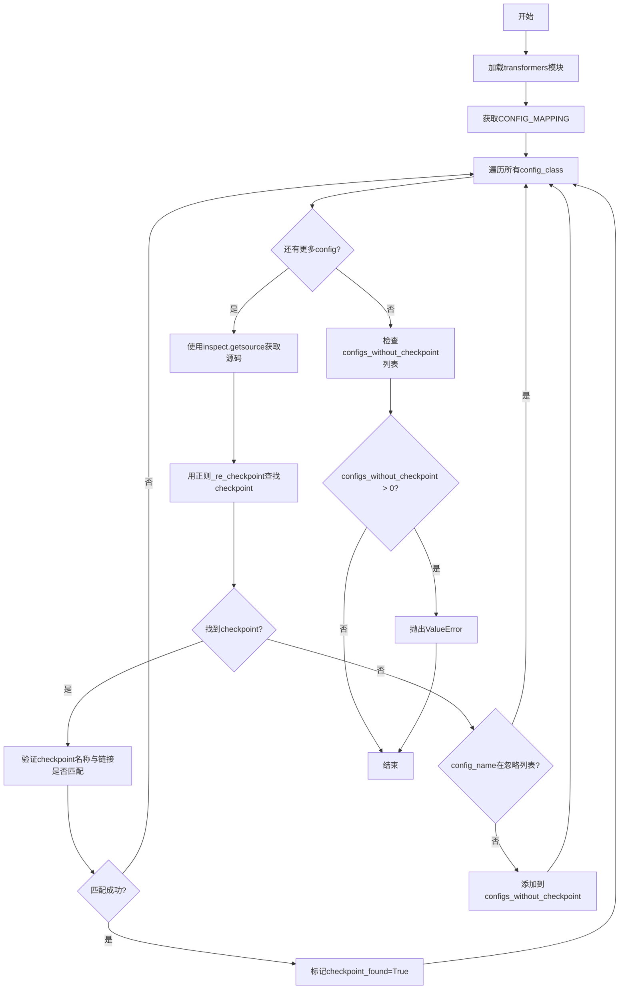
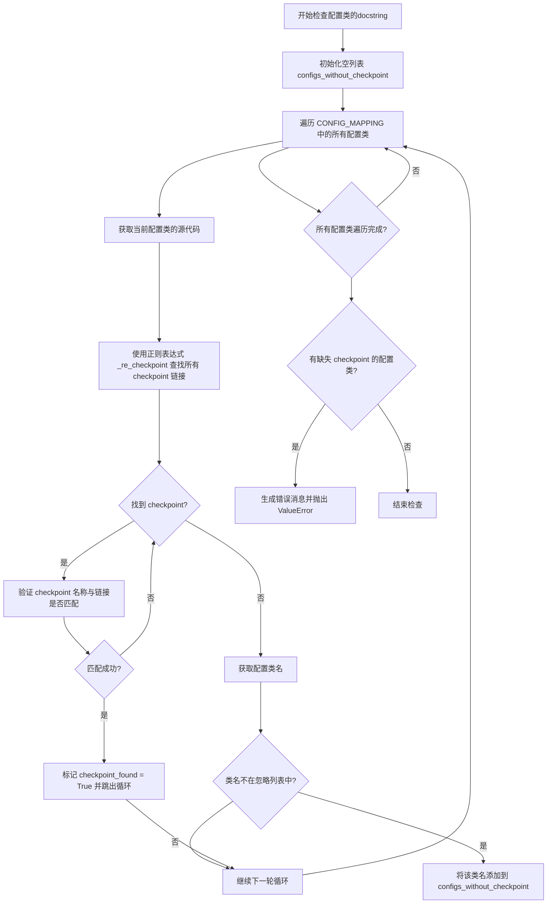

# `diffusers\utils\check_config_docstrings.py` 详细设计文档

这是一个用于检查HuggingFace Transformers库中配置类(CONFIG_MAPPING)文档字符串的脚本，它通过正则表达式验证每个配置类的docstring中是否包含有效的HuggingFace checkpoint链接（如bert-base-uncased），并确保链接格式正确（名称与URL对应），否则抛出ValueError列出缺失checkpoint的配置类。

## 整体流程



## 类结构

```
该脚本为扁平结构，无类定义
仅有模块级全局变量和函数
```

## 全局变量及字段


### `PATH_TO_TRANSFORMERS`
    
transformers库源码路径常量

类型：`str`
    


### `transformers`
    
动态加载的transformers模块对象

类型：`module`
    


### `CONFIG_MAPPING`
    
从auto.configuration_auto获取的配置类映射字典

类型：`dict`
    


### `_re_checkpoint`
    
用于匹配docstring中checkpoint链接的正则表达式

类型：`re.Pattern`
    


### `CONFIG_CLASSES_TO_IGNORE_FOR_DOCSTRING_CHECKPOINT_CHECK`
    
需要忽略检查的配置类名称集合

类型：`set`
    


### `configs_without_checkpoint`
    
存储缺少有效checkpoint的配置类名称

类型：`list`
    


    

## 全局函数及方法


### `check_config_docstrings_have_checkpoints`

该函数是配置文档字符串检查工具，遍历所有配置类（来自 HuggingFace Transformers 库），检查每个配置类的源代码 docstring 中是否包含有效的 checkpoint 链接（如 `[bert-base-uncased](https://huggingface.co/bert-base-uncased)`），若未找到有效链接且该类不在忽略列表中，则收集该类名并在最后抛出 ValueError 异常列出所有缺失 checkpoint 链接的配置类。

参数：此函数无参数

返回值：`None`，若检查失败则抛出 `ValueError` 异常

#### 流程图



#### 带注释源码

```python
def check_config_docstrings_have_checkpoints():
    """
    检查所有配置类的 docstring 是否包含有效的 checkpoint 链接。
    若未找到有效链接，收集该配置类名并在最后抛出 ValueError。
    """
    # 用于存储缺少有效 checkpoint 链接的配置类名
    configs_without_checkpoint = []

    # 遍历 CONFIG_MAPPING 字典中的所有配置类值
    for config_class in list(CONFIG_MAPPING.values()):
        # 初始化标志：假设未找到有效的 checkpoint
        checkpoint_found = False

        # 获取配置类的源代码（包含 docstring）
        config_source = inspect.getsource(config_class)
        # 使用正则表达式查找所有形如 [name](https://huggingface.co/name) 的链接
        checkpoints = _re_checkpoint.findall(config_source)

        # 遍历找到的每一个 checkpoint
        for checkpoint in checkpoints:
            # 每个 checkpoint 是 (名称, 链接) 的元组
            # 例如: ('bert-base-uncased', 'https://huggingface.co/bert-base-uncased')
            ckpt_name, ckpt_link = checkpoint

            # 根据名称构造期望的链接格式
            ckpt_link_from_name = f"https://huggingface.co/{ckpt_name}"
            
            # 验证链接是否与名称匹配
            if ckpt_link == ckpt_link_from_name:
                checkpoint_found = True
                # 找到有效的 checkpoint 后跳出内层循环
                break

        # 获取配置类的名称用于报告
        name = config_class.__name__
        
        # 如果未找到有效 checkpoint 且该类不在忽略列表中
        if not checkpoint_found and name not in CONFIG_CLASSES_TO_IGNORE_FOR_DOCSTRING_CHECKPOINT_CHECK:
            # 将该类名添加到待报告列表
            configs_without_checkpoint.append(name)

    # 检查是否存在缺少 checkpoint 的配置类
    if len(configs_without_checkpoint) > 0:
        # 按字母排序后生成错误消息
        message = "\n".join(sorted(configs_without_checkpoint))
        # 抛出 ValueError 异常
        raise ValueError(f"The following configurations don't contain any valid checkpoint:\n{message}")
```

#### 全局变量详情

| 变量名 | 类型 | 描述 |
|--------|------|------|
| `PATH_TO_TRANSFORMERS` | `str` | Transformers 库源码路径常量 |
| `spec` | `ModuleSpec` | 通过 importlib 创建的模块规格对象 |
| `transformers` | `ModuleType` | 动态加载的 transformers 模块对象 |
| `CONFIG_MAPPING` | `dict` | 模型配置类名到配置类的映射字典 |
| `_re_checkpoint` | `re.Pattern` | 用于匹配 HuggingFace checkpoint 链接的正则表达式 |
| `CONFIG_CLASSES_TO_IGNORE_FOR_DOCSTRING_CHECKPOINT_CHECK` | `set` | 需跳过检查的配置类名称集合 |

#### 关键组件信息

| 组件名 | 描述 |
|--------|------|
| `CONFIG_MAPPING` | HuggingFace Transformers 库中所有模型配置类的映射表，通过自动模块加载获取 |
| `_re_checkpoint` | 正则表达式 `\[(.+?)\]\((https://huggingface\.co/.+?)\)` 用于从 docstring 中提取 Markdown 格式的链接 |

#### 潜在技术债务与优化空间

1. **硬编码路径**：`PATH_TO_TRANSFORMERS` 使用硬编码相对路径 `"src/transformers"`，缺乏灵活性，建议改为可配置或自动检测
2. **忽略列表维护成本**：`CONFIG_CLASSES_TO_IGNORE_FOR_DOCSTRING_CHECKPOINT_CHECK` 为硬编码集合，后续新增需修改代码，建议改为配置文件或装饰器方式
3. **正则性能**：对每个配置类都调用 `inspect.getsource()` 获取完整源码，当配置类较多时存在重复 IO 操作，可考虑缓存或增量检查
4. **缺少日志输出**：函数无任何日志记录，排查问题时缺乏上下文，建议增加 logging 模块输出检查进度

#### 错误处理与异常设计

- **ValueError**：当存在任何配置类的 docstring 未包含有效 checkpoint 链接时，抛出包含所有违规类名的 ValueError 异常
- **预期行为**：函数设计为「fail fast」模式，一旦检测到问题立即终止运行，而非收集所有问题后继续

#### 外部依赖与接口契约

| 依赖项 | 用途 |
|--------|------|
| `importlib` | 动态加载 transformers 模块 |
| `inspect` | 获取配置类的源代码 |
| `os` | 路径拼接操作 |
| `re` | 正则表达式匹配 |
| `transformers.models.auto.configuration_auto.CONFIG_MAPPING` | 获取所有模型配置类映射 |

#### 设计目标与约束

- **目标**：确保 Transformers 库中每个配置类的文档都包含可验证的模型 checkpoint 链接，便于用户快速查找预训练模型
- **约束**：仅检查 docstring 中的 Markdown 格式链接 `[name](url)`，不支持其他链接格式；忽略列表中的配置类（如 Mixin 类）不参与检查

## 关键组件


### 动态模块加载机制 (Dynamic Module Loading)

使用 importlib.util.spec_from_file_location 动态加载 transformers 模块，确保加载的是仓库本地的模块而非已安装的版本，防止使用 outdated 的 pip 安装版本。

### CONFIG_MAPPING 全局配置映射

从 transformers.models.auto.configuration_auto 导入的全局配置映射表，包含了所有预定义配置类与模型名称的映射关系，是整个检查流程的数据源。

### _checkpoint 正则表达式模式

用于匹配 docstring 中的 Markdown 格式 checkpoint 链接，例如 `[bert-base-uncased](https://huggingface.co/bert-base-uncased)`，提取模型名称和链接URL。

### 配置类忽略名单 (CONFIG_CLASSES_TO_IGNORE_FOR_DOCSTRING_CHECKPOINT_CHECK)

预定义的一组需要跳过检查的配置类mixin，这些类本身不直接对应具体模型 checkpoint，因此从验证流程中排除。

### 配置检查点验证函数 (check_config_docstrings_have_checkpoints)

核心业务逻辑函数，遍历所有配置类，使用 inspect.getsource 获取源码，通过正则提取 checkpoint 链接，并验证链接格式与模型名称的一致性，最终汇总缺失有效 checkpoint 的配置类并抛出 ValueError。

### 源代码检查机制 (inspect.getsource)

利用 Python inspect 模块动态获取配置类的源代码，用于解析其中的 docstring 内容，实现对文档字符串的静态检查而无需实例化类。

### 错误报告与异常设计

当存在缺少有效 checkpoint 的配置类时，以格式化的错误消息输出按字母排序的配置类名称列表，并包装为 ValueError 异常，便于 CI/CD 流程捕获和展示。


## 问题及建议


### 已知问题

- **硬编码路径问题**：`PATH_TO_TRANSFORMERS = "src/transformers"` 采用硬编码方式，缺少命令行参数支持，导致脚本在不同项目结构中缺乏灵活性
- **模块加载缺乏错误处理**：`spec.loader.load_module()` 调用未进行异常捕获，若模块加载失败（如路径不存在或 `__init__.py` 损坏），脚本将以不友好的方式崩溃
- **正则匹配范围过宽**：`_re_checkpoint.findall(config_source)` 针对整个类源代码执行正则匹配，而非仅解析 docstring，可能产生误报（代码注释中的链接）或漏报（docstring 中的链接未被正确提取）
- **首次匹配即退出**：找到第一个有效 checkpoint 后立即 `break`，未检查是否存在其他无效或格式不规范的 checkpoint 链接
- **CONFIG_MAPPING 依赖无校验**：直接依赖 `transformers.models.auto.configuration_auto.CONFIG_MAPPING`，未检查该属性是否存在或为空，脚本在非标准环境下可能失败
- **逐一获取源码效率低下**：对每个 `config_class` 调用 `inspect.getsource()`，在配置类较多时性能不理想，且未实现结果缓存机制
- **忽略列表硬编码**：`CONFIG_CLASSES_TO_IGNORE_FOR_DOCSTRING_CHECKPOINT_CHECK` 作为静态集合内嵌于代码，扩展和维护不便
- **错误信息缺乏诊断价值**：仅输出缺少 checkpoint 的配置类名称，未提供具体 docstring 片段或缺失原因，调试困难

### 优化建议

- **引入命令行参数解析**：使用 `argparse` 添加 `--path` 参数，支持自定义 transformers 路径，提升脚本通用性
- **增加异常处理与友好提示**：对模块加载、属性访问等关键操作添加 try-except，输出有意义的错误信息
- **精确提取 docstring**：使用 `inspect.getdoc()` 或 `ast` 模块解析，仅针对类的 docstring 进行正则匹配
- **改进验证逻辑**：收集所有 checkpoint 链接并逐一验证，而非首次匹配即退出，提供完整的验证报告
- **添加属性存在性检查**：在访问 `CONFIG_MAPPING` 前使用 `hasattr()` 或 `getattr()` 进行校验
- **实现缓存机制**：对已加载的源码或解析结果进行缓存，避免重复 I/O 操作
- **配置外部化**：将忽略列表配置化，可通过环境变量或配置文件管理
- **增强输出信息**：在错误报告中包含配置类的 docstring 摘要或具体缺失内容，便于快速定位问题

## 其它


### 设计目标与约束

该脚本的设计目标是确保Transformers库中所有配置类的文档字符串都包含有效的HuggingFace检查点链接。具体约束包括：1) 只检查CONFIG_MAPPING中存在的配置类；2) 使用正则表达式从源码中提取检查点信息；3) 忽略CONFIG_CLASSES_TO_IGNORE_FOR_DOCSTRING_CHECKPOINT_CHECK中列出的特定配置类；4) 验证检查点名称与链接的对应关系是否正确。

### 错误处理与异常设计

脚本在检测到任何配置类缺少有效检查点时会抛出ValueError异常，异常信息包含所有不符合要求的配置类名称列表。异常设计采用快速失败模式，一旦找到有效检查点就立即break，提高执行效率。没有进行任何异常捕获处理，因为脚本设计为在CI/CD流程中运行，任何错误都应该导致构建失败。

### 数据流与状态机

数据流主要分为三个阶段：1) 初始化阶段加载transformers模块和CONFIG_MAPPING；2) 遍历阶段逐个检查配置类的源码，使用正则表达式提取检查点信息并验证链接有效性；3) 输出阶段将缺少检查点的配置类收集到列表中并抛出异常。状态机相对简单，只有"检查中"和"完成"两种状态。

### 外部依赖与接口契约

主要外部依赖包括：importlib用于动态加载transformers模块；inspect用于获取配置类的源代码；os用于路径操作；re用于正则表达式匹配。CONFIG_MAPPING是从transformers.models.auto.configuration_auto模块导入的字典对象，其结构为{模型名称: 配置类}。正则表达式_re_checkpoint用于匹配Markdown格式的检查点链接，期望格式为"[名称](链接)"。

### 性能考虑

脚本性能主要考虑：1) 使用list(CONFIG_MAPPING.values())一次性获取所有配置类避免重复迭代；2) 在找到第一个有效检查点后立即break避免不必要的正则匹配；3) 使用set进行配置类名称的忽略检查提高查找效率；4) 对configs_without_checkpoint列表进行排序保证输出稳定性。在大型配置集合下执行时间应在可接受范围内。

### 安全性考虑

脚本从本地文件系统加载模块，不涉及网络请求或用户输入处理，安全性风险较低。主要安全考虑包括：PATH_TO_TRANSFORMERS路径硬编码为相对路径，运行前需确认工作目录；通过importlib动态加载模块需确保模块路径可信；正则表达式使用了精确的模式避免ReDoS风险。

### 测试策略

该脚本作为验证工具本身无需单元测试，但可考虑：1) 创建包含模拟配置类的测试用例验证检测逻辑；2) 测试正则表达式对各种链接格式的匹配准确性；3) 验证忽略列表功能正常工作；4) 测试异常消息格式正确性。测试应在CI流程中作为必检步骤运行。

### 部署注意事项

该脚本设计为在Transformers仓库本地运行，使用路径"src/transformers"作为模块位置。部署时需确保：1) 从仓库根目录执行；2) Python环境已安装transformers及其依赖；3) 脚本具有读取src/transformers目录下文件的权限；4) 可集成到pre-commit hooks或CI pipeline中作为代码质量检查环节。

    