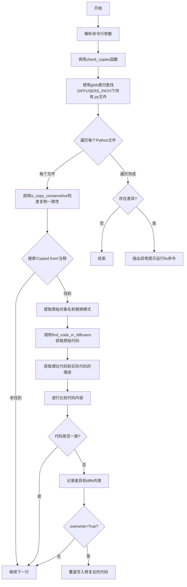
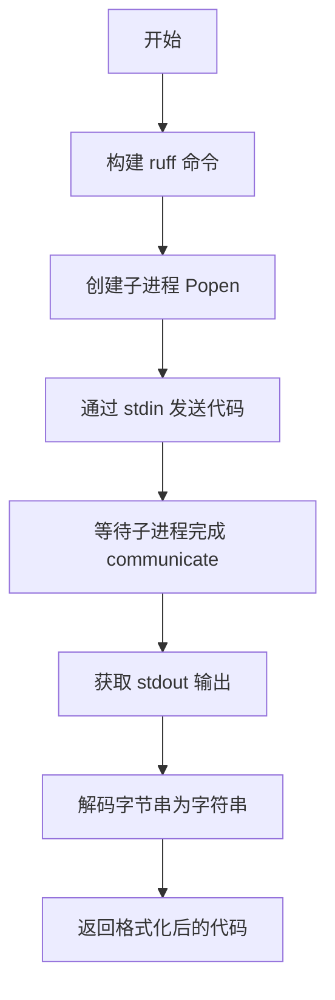
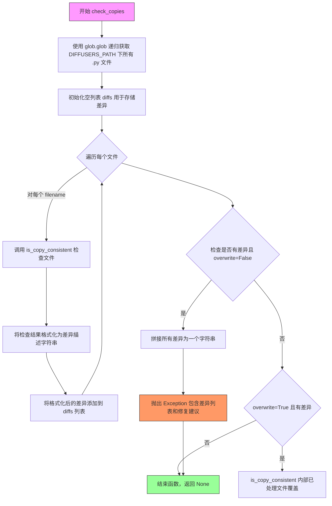

# `diffusers\utils\check_copies.py` 详细设计文档

一个用于检查diffusers库中代码复制一致性的工具，通过解析'Copied from diffusers.xxx'注释，比对复制代码与原始代码是否一致，支持自动修复不一致的代码复制。

## 整体流程



## 类结构

```
无类定义
所有函数均为模块级函数
├── 全局变量
│   ├── DIFFUSERS_PATH
│   └── REPO_PATH
├── 正则表达式模块
│   ├── _re_copy_warning
│   ├── _re_replace_pattern
│   └── _re_fill_pattern
└── 函数列表
    ├── _should_continue
    ├── find_code_in_diffusers
    ├── get_indent
    ├── run_ruff
    ├── stylify
    ├── is_copy_consistent
    └── check_copies
```

## 全局变量及字段


### `DIFFUSERS_PATH`
    
指定diffusers包的源代码目录路径，默认为'src/diffusers'

类型：`str`
    


### `REPO_PATH`
    
指向当前仓库根目录的路径，默认为当前目录'.'

类型：`str`
    


### `_re_copy_warning`
    
用于匹配'# Copied from diffusers.xxx'注释的正则表达式模式对象

类型：`re.Pattern`
    


### `_re_replace_pattern`
    
用于匹配代码替换模式(如'old->new')的正则表达式模式对象

类型：`re.Pattern`
    


### `_re_fill_pattern`
    
用于匹配<FILL ...>占位符的正则表达式模式对象（当前未在代码中使用）

类型：`re.Pattern`
    


    

## 全局函数及方法


### `_should_continue`

判断在解析代码块时是否应该继续读取当前行。该函数用于在解析 Python 代码时识别代码块的边界，通过检查行缩进、空行或函数/方法定义的结束行来决定是否继续处理。

参数：

-  `line`：`str`，待检查的代码行
-  `indent`：`str`，用于比较的缩进字符串

返回值：`bool`，如果应该继续处理该行返回 `True`，否则返回 `False`

#### 流程图

```mermaid
flowchart TD
    A[开始] --> B{line.startswith<br/>indent?}
    B -->|Yes| C[返回 True]
    B -->|No| D{len.line <= 1?}
    D -->|Yes| C
    D -->|No| E{正则匹配<br/>^\s*\)(\s*->.*\|:)\s*$}
    E -->|匹配| C
    E -->|不匹配| F[返回 False]
```

#### 带注释源码

```
def _should_continue(line, indent):
    """
    判断在解析代码块时是否应该继续读取当前行。
    
    参数:
        line (str): 待检查的代码行
        indent (str): 用于比较的缩进字符串
    
    返回:
        bool: 如果应该继续处理该行返回 True，否则返回 False
    """
    # 检查行是否以给定的缩进开头（表示属于同一代码块）
    # 或者行是否为空/仅包含换行符（空行）
    # 或者行是否是函数/方法定义的结束行（如 `) -> type:` 或 `):`）
    return line.startswith(indent) or len(line) <= 1 or re.search(r"^\s*\)(\s*->.*|:)\s*$", line) is not None
```


### `find_code_in_diffusers`

该函数用于在 diffusers 代码库中查找指定对象（类或函数）的源代码，通过解析对象名称定位模块文件，然后基于缩进规则提取完整的类或函数定义并返回其源码字符串。

参数：

- `object_name`：`str`，点分隔的对象名称（如 `ClassName.method_name` 或 `module.submodule.ClassName`），表示要查找的类或函数的全限定名

返回值：`str`，返回找到的类或函数定义部分的源代码字符串

#### 流程图

```mermaid
flowchart TD
    A[开始] --> B[将 object_name 按 '.' 分割为 parts 列表]
    B --> C[初始化 i = 0, module = parts[0]]
    C --> D{判断模块文件是否存在}
    D -->|否| E[i += 1, 拼接 module 路径]
    E --> D
    D -->|是| F{判断 i 是否越界}
    F -->|是| G[抛出 ValueError: object_name 无效]
    F -->|否| H[打开模块文件并读取所有行]
    H --> I[初始化 indent = '', line_index = 0]
    I --> J{遍历 parts[i+1:] 中的名称}
    J -->|未找到定义| K[line_index += 1]
    K --> J
    J -->|找到定义| L[indent += '    ', line_index += 1]
    L --> M{判断 line_index 是否越界}
    M -->|是| N[抛出 ValueError: 未匹配到函数或类]
    M -->|否| O[记录 start_index = line_index]
    O --> P[循环: 缩进保持或满足特定条件时继续]
    P --> Q[line_index += 1]
    Q --> P
    P --> R{清理尾部空行}
    R --> S[提取代码行 lines[start_index:line_index]]
    S --> T[拼接为字符串并返回]
    T --> U[结束]
```

#### 带注释源码

```python
def find_code_in_diffusers(object_name):
    """Find and return the code source code of `object_name`."""
    # 将传入的对象名称按 '.' 分割成列表
    # 例如: "DiffusionPipeline.from_pretrained" -> ["DiffusionPipeline", "from_pretrained"]
    parts = object_name.split(".")
    i = 0

    # 首先找到对象所在的模块
    # 尝试通过不断追加路径来定位模块文件
    module = parts[i]
    # 循环查找模块文件是否存在，如果当前 module 不是有效文件，
    # 则继续尝试拼接下一部分直到找到文件或越界
    while i < len(parts) and not os.path.isfile(os.path.join(DIFFUSERS_PATH, f"{module}.py")):
        i += 1
        if i < len(parts):
            # 构造可能的模块路径，如 "pipelines" -> "pipelines/stable_diffusion"
            module = os.path.join(module, parts[i])
    
    # 如果遍历完所有部分仍未找到模块文件，抛出异常
    if i >= len(parts):
        raise ValueError(f"`object_name` should begin with the name of a module of diffusers but got {object_name}.")

    # 打开找到的模块文件并读取所有行
    with open(
        os.path.join(DIFFUSERS_PATH, f"{module}.py"),
        "r",
        encoding="utf-8",
        newline="\n",
    ) as f:
        lines = f.readlines()

    # 现在在代码中查找类 / 函数定义
    indent = ""      # 用于跟踪嵌套层级（每次进入下一层增加4个空格）
    line_index = 0   # 当前行索引
    
    # 遍历剩余部分（跳过模块名），逐层查找类或函数定义
    for name in parts[i + 1 :]:
        # 使用正则表达式匹配 class 或 def 声明
        # 匹配格式: "class ClassName(" 或 "def function_name(" 或 "def function_name:"
        while (
            line_index < len(lines) and re.search(rf"^{indent}(class|def)\s+{name}(\(|\:)", lines[line_index]) is None
        ):
            line_index += 1
        # 找到后增加缩进层级，准备查找嵌套的类或方法
        indent += "    "
        line_index += 1

    # 检查是否成功找到类或函数定义
    if line_index >= len(lines):
        raise ValueError(f" {object_name} does not match any function or class in {module}.")

    # 找到了类/函数的起始位置，现在通过缩进变化找到其结束位置
    # 当缩进减少时，表示类或函数定义结束
    start_index = line_index
    while line_index < len(lines) and _should_continue(lines[line_index], indent):
        line_index += 1
    
    # 清理末尾的空行
    while len(lines[line_index - 1]) <= 1:
        line_index -= 1

    # 提取从起始到结束位置的代码行
    code_lines = lines[start_index:line_index]
    # 将代码行列表拼接为单个字符串并返回
    return "".join(code_lines)
```


### `get_indent`

该函数用于从给定的代码字符串中提取第一行非空行的前导缩进空格数。

参数：

- `code`：`str`，要检查缩进量的代码字符串

返回值：`str`，代码第一行非空行前的空白字符（缩进字符串）

#### 流程图

```mermaid
flowchart TD
    A[开始] --> B[将code按换行符分割成lines列表]
    B --> C[初始化idx = 0]
    C --> D{idx < len(lines) 且 lines[idx]为空字符串?}
    D -->|是| E[idx += 1]
    E --> D
    D -->|否| F{idx < len(lines)?}
    F -->|是| G[使用正则表达式^(\s*)\S搜索lines[idx]]
    G --> H[返回正则匹配的第一个分组即缩进字符串]
    F -->|否| I[返回空字符串]
    H --> J[结束]
    I --> J
```

#### 带注释源码

```python
def get_indent(code):
    """
    从给定代码中提取第一行非空行的前导缩进空格。
    
    Args:
        code (str): 要检查缩进量的代码字符串
        
    Returns:
        str: 代码第一行非空行前的空白字符（缩进字符串）
    """
    # 将代码字符串按换行符分割成行列表
    lines = code.split("\n")
    # 初始化索引，从第一行开始
    idx = 0
    # 跳过开头的空行，找到第一行非空行
    while idx < len(lines) and len(lines[idx]) == 0:
        idx += 1
    # 如果存在非空行
    if idx < len(lines):
        # 使用正则表达式匹配行首的空白字符
        # (\s*) 捕获零个或多个空白字符
        # \S 匹配第一个非空白字符
        return re.search(r"^(\s*)\S", lines[idx]).groups()[0]
    # 如果代码全是空行，返回空字符串
    return ""
```


### `run_ruff`

该函数用于调用外部工具 `ruff` 对代码进行格式化处理，通过子进程执行 ruff 命令并返回格式化后的代码结果。

参数：

-  `code`：`str`，需要格式化的源代码字符串

返回值：`str`，ruff 格式化后的代码字符串

#### 流程图



#### 带注释源码

```python
def run_ruff(code):
    """
    使用 ruff 格式化工具对输入的代码进行格式化处理。
    
    Args:
        code (str): 需要格式化的代码字符串
        
    Returns:
        str: ruff 格式化后的代码字符串
    """
    # 构建 ruff 命令：格式化标准输入，使用项目配置，静音输出
    command = ["ruff", "format", "-", "--config", "pyproject.toml", "--silent"]
    
    # 创建子进程，设置管道捕获 stdout 和 stderr，stdin 用于输入
    process = subprocess.Popen(
        command, 
        stdout=subprocess.PIPE, 
        stderr=subprocess.PIPE, 
        stdin=subprocess.PIPE
    )
    
    # 向子进程发送代码（编码为字节），并等待其完成
    stdout, _ = process.communicate(input=code.encode())
    
    # 将字节串解码为字符串并返回
    return stdout.decode()
```


### `stylify`

该函数用于使用 ruff 格式化工具对代码进行格式化处理。由于 ruff 没有提供 Python API，该函数通过子进程调用 ruff 命令，并对有缩进的代码进行临时类包装处理后再移除类声明，以实现正确的格式化。

参数：

- `code`：`str`，需要格式化的原始代码字符串

返回值：`str`，格式化后的代码字符串

#### 流程图

```mermaid
flowchart TD
    A[开始] --> B{检查代码是否有缩进}
    B -->|有缩进| C[将代码包装为临时类: class Bla:\n{code}]
    B -->|无缩进| D[直接使用原代码]
    C --> E[调用 run_ruff 函数执行格式化]
    D --> E
    E --> F{之前有缩进?}
    F -->|是| G[从格式化结果中移除 class Bla:\n 前缀]
    F -->|否| H[直接返回格式化结果]
    G --> I[返回处理后的格式化代码]
    H --> I
```

#### 带注释源码

```python
def stylify(code: str) -> str:
    """
    Applies the ruff part of our `make style` command to some code. This formats the code using `ruff format`.
    As `ruff` does not provide a python api this cannot be done on the fly.

    Args:
        code (`str`): The code to format.

    Returns:
        `str`: The formatted code.
    """
    # 检查代码是否有缩进（有缩进说明是类或函数内部的代码块）
    has_indent = len(get_indent(code)) > 0
    
    # 如果有缩进，需要将代码包装在一个临时类中
    # 这样 ruff 格式化器才能正确处理类内部的代码缩进
    if has_indent:
        code = f"class Bla:\n{code}"
    
    # 调用 run_ruff 函数，通过子进程执行 ruff format 命令
    formatted_code = run_ruff(code)
    
    # 如果之前添加了临时类，则移除类声明行
    # 只返回类内部的代码部分
    return formatted_code[len("class Bla:\n") :] if has_indent else formatted_code
```


### `is_copy_consistent`

检查文件中标记为 `# Copied from diffusers.xxx` 的代码片段是否与 diffusers 源代码库中的原始代码一致。如果发现不一致，根据 `overwrite` 参数决定是覆盖文件内容还是仅返回差异列表。

参数：

- `filename`：`str`，要检查的文件路径
- `overwrite`：`bool`，是否覆盖文件中的不一致代码（默认 `False`）

返回值：`list[list[str | int]]`，返回差异列表，每个元素为 `[object_name, start_index]`，其中 `object_name` 是被复制对象的名称，`start_index` 是差异开始的行号

#### 流程图

```mermaid
flowchart TD
    A([开始 is_copy_consistent]) --> B[打开文件并读取所有行]
    B --> C[初始化 line_index = 0, diffs = []]
    C --> D{line_index < len(lines)?}
    D -->|Yes| E[搜索当前行的 _re_copy_warning 模式]
    E --> F{找到匹配?}
    F -->|No| G[line_index += 1]
    G --> D
    F -->|Yes| H[提取 indent, object_name, replace_pattern]
    H --> I[调用 find_code_in_diffusers 获取原始代码]
    I --> J[计算实际起始索引，考虑缩进]
    J --> K[遍历后续行，收集被复制代码的观察版本]
    K --> L{遇到缩进减少或 '# End copy'?}
    L -->|No| K
    L -->|Yes| M[清理行尾空白]
    M --> N[提取观察到的代码片段]
    N --> O{replace_pattern 是否存在?}
    O -->|Yes| P[应用替换模式到理论代码]
    P --> Q[规范化理论代码]
    O -->|No| Q
    Q --> R{观察代码 == 理论代码?}
    R -->|Yes| S[记录差异 [object_name, start_index]]
    S --> G
    R -->|No| T{overwrite = True?}
    T -->|Yes| U[覆盖文件中的代码]
    U --> V[更新 line_index]
    V --> G
    T -->|No| G
    D -->|No| W[返回 diffs]
    W --> X([结束])
```

#### 带注释源码

```python
def is_copy_consistent(filename, overwrite=False):
    """
    Check if the code commented as a copy in `filename` matches the original.
    Return the differences or overwrites the content depending on `overwrite`.
    """
    # 打开文件并读取所有行
    with open(filename, "r", encoding="utf-8", newline="\n") as f:
        lines = f.readlines()
    
    # 初始化差异列表和行索引
    diffs = []
    line_index = 0
    
    # 遍历每一行（使用 while 循环以支持动态修改 lines）
    while line_index < len(lines):
        # 在当前行搜索复制警告正则表达式
        search = _re_copy_warning.search(lines[line_index])
        
        # 如果没有找到匹配，继续下一行
        if search is None:
            line_index += 1
            continue

        # 提取复制警告的三个部分：缩进、对象名、替换模式
        indent, object_name, replace_pattern = search.groups()
        
        # 从 diffusers 源代码中查找原始代码
        theoretical_code = find_code_in_diffusers(object_name)
        theoretical_indent = get_indent(theoretical_code)

        # 根据缩进计算实际起始索引
        start_index = line_index + 1 if indent == theoretical_indent else line_index + 2
        indent = theoretical_indent
        line_index = start_index

        # 循环检查观察到的代码，当缩进减少或遇到 '# End copy' 时停止
        should_continue = True
        while line_index < len(lines) and should_continue:
            line_index += 1
            if line_index >= len(lines):
                break
            line = lines[line_index]
            should_continue = _should_continue(line, indent) and re.search(f"^{indent}# End copy", line) is None
        
        # 清理行尾空行
        while len(lines[line_index - 1]) <= 1:
            line_index -= 1

        # 提取观察到的代码（被复制的部分）
        observed_code_lines = lines[start_index:line_index]
        observed_code = "".join(observed_code_lines)

        # 移除理论代码中的嵌套 'Copied from' 注释以避免循环复制
        theoretical_code = [line for line in theoretical_code.split("\n") if _re_copy_warning.search(line) is None]
        theoretical_code = "\n".join(theoretical_code)

        # 如果存在替换模式，应用到理论代码
        if len(replace_pattern) > 0:
            patterns = replace_pattern.replace("with", "").split(",")
            patterns = [_re_replace_pattern.search(p) for p in patterns]
            for pattern in patterns:
                if pattern is None:
                    continue
                obj1, obj2, option = pattern.groups()
                theoretical_code = re.sub(obj1, obj2, theoretical_code)
                if option.strip() == "all-casing":
                    theoretical_code = re.sub(obj1.lower(), obj2.lower(), theoretical_code)
                    theoretical_code = re.sub(obj1.upper(), obj2.upper(), theoretical_code)

            # 替换后进行代码风格化处理
            theoretical_code = stylify(lines[start_index - 1] + theoretical_code)
            theoretical_code = theoretical_code[len(lines[start_index - 1]) :]

        # 检查是否有差异并采取相应行动
        if observed_code != theoretical_code:
            diffs.append([object_name, start_index])
            if overwrite:
                lines = lines[:start_index] + [theoretical_code] + lines[line_index:]
                line_index = start_index + 1

    # 如果覆盖模式且存在差异，写入文件
    if overwrite and len(diffs) > 0:
        print(f"Detected changes, rewriting {filename}.")
        with open(filename, "w", encoding="utf-8", newline="\n") as f:
            f.writelines(lines)
    
    return diffs
```


### `check_copies`

该函数是代码库中的复制一致性检查工具，用于扫描 `diffusers` 目录下所有 Python 文件，验证注释标记为"Copied from"的代码块是否与原始代码保持同步，并在发现不一致时提供修复建议。

参数：

- `overwrite`：`bool`，默认为 `False`，当设为 `True` 时自动将不一致的代码覆盖为原始代码，设为 `False` 时仅报告差异并抛出异常。

返回值：`None`，该函数通过抛出异常来报告发现的不一致，或者在覆盖模式下静默执行完成。

#### 流程图



#### 带注释源码

```python
def check_copies(overwrite: bool = False):
    """
    检查 diffusers 目录下的所有 Python 文件中的复制代码是否与原始代码一致。
    
    该函数递归扫描 DIFFUSERS_PATH 下的所有 .py 文件，查找带有 '# Copied from' 注释的代码块，
    并与 find_code_in_diffusers 获取的原始代码进行比对。不一致时收集差异信息，
    若未启用覆盖模式则抛出异常报告所有不一致之处。
    
    Args:
        overwrite (bool): 是否自动修复不一致的代码。True 时直接覆盖文件，False 时仅报告差异。
    
    Returns:
        None: 函数通过异常机制报告错误，或在覆盖模式下静默完成。
    """
    # 使用 glob 递归获取 DIFFUSERS_PATH 下所有 Python 文件的完整路径列表
    all_files = glob.glob(os.path.join(DIFFUSERS_PATH, "**/*.py"), recursive=True)
    
    # 初始化差异列表，用于收集所有文件中的复制不一致信息
    diffs = []
    
    # 遍历每一个 Python 文件进行复制一致性检查
    for filename in all_files:
        # 调用 is_copy_consistent 检查单个文件的复制代码是否与原始代码匹配
        # 返回值为一个列表，包含 [object_name, start_index] 形式的差异项
        new_diffs = is_copy_consistent(filename, overwrite)
        
        # 将每条差异格式化为字符串，格式为 "- filename: copy does not match object_name at line number"
        # 并添加到总差异列表中
        diffs += [f"- {filename}: copy does not match {d[0]} at line {d[1]}" for d in new_diffs]
    
    # 如果不是覆盖模式且发现了任何不一致
    if not overwrite and len(diffs) > 0:
        # 将所有差异用换行符连接成一个字符串
        diff = "\n".join(diffs)
        
        # 抛出异常，包含详细的差异信息和修复建议
        raise Exception(
            "Found the following copy inconsistencies:\n"
            + diff
            + "\nRun `make fix-copies` or `python utils/check_copies.py --fix_and_overwrite` to fix them."
        )
    
    # 如果是覆盖模式或没有差异，函数正常结束（隐式返回 None）
```

## 关键组件


### 代码复制检测与验证机制

检测diffusers库中标记为"Copied from"的代码段是否与原始源代码保持一致，支持差异报告和自动修复功能。

### 源代码定位与解析模块

通过模块路径递归查找并提取diffusers库中指定类或函数的完整源代码，支持嵌套模块和多层缩进的代码解析。

### 正则表达式匹配引擎

使用预编译正则表达式识别代码复制警告、替换模式指令和填充标记，为代码一致性检查提供模式匹配基础。

### 缩进分析与代码块边界判定

通过缩进层级判断类、函数或代码块的起止位置，支持处理多层级嵌套的Python代码结构。

### 差异检测与修复模块

对比观察到的代码与理论代码（原始代码经过替换后），生成差异报告并在overwrite模式下自动重写文件。

### 模式替换与转换器

支持"obj1->obj2"格式的替换指令，可选"all-casing"参数实现大小写同步替换，将原始代码中的符号替换为目标名称。

### 代码格式化集成

封装ruff工具为Python函数，动态格式化代码片段以消除格式差异对一致性检查的干扰。

### 命令行参数解析与入口函数

提供--fix_and_overwrite参数控制修复行为，集成所有模块实现批量检查diffusers项目所有Python文件。


## 问题及建议


### 已知问题

-   **未使用的全局变量**：`REPO_PATH` 定义但从未使用，`_re_fill_pattern` 正则表达式定义但未使用
-   **子进程错误处理缺失**：`run_ruff` 函数调用 `ruff format` 时未检查返回码，命令失败时静默忽略
-   **潜在的无限阻塞**：`subprocess.Popen` 的 `communicate()` 调用未设置超时，可能无限期挂起
-   **空行检测逻辑错误**：`_should_continue` 函数中使用 `len(line) <= 1` 判断空行，应使用 `len(line.strip()) <= 1` 以正确处理仅包含空白字符的行
-   **正则表达式未预编译**：多个正则表达式在循环中重复编译，每次调用都重新创建，影响性能
-   **文件重复读取**：`check_copies` 中每个文件被读取两次（一次在 `is_copy_consistent`，一次在可能覆盖时）
-   **类型注解不足**：大多数函数缺少参数和返回值的类型注解，影响代码可维护性和 IDE 支持
-   **嵌套循环逻辑复杂**：`is_copy_consistent` 函数中有多层嵌套循环和多个退出条件，代码可读性差，难以调试
-   **缩进检测脆弱**：依赖正则表达式检测缩进，对制表符和空格混用处理不完善
-   **缺少日志记录**：仅使用 `print` 输出信息，无法控制日志级别或重定向到文件

### 优化建议

-   移除未使用的全局变量 `REPO_PATH` 和 `_re_fill_pattern`
-   为 `run_ruff` 添加超时参数和返回码检查，失败时抛出异常或记录警告
-   预编译所有正则表达式为模块级常量
-   修复空行检测逻辑，使用 `line.strip()` 进行判断
-   为关键函数添加类型注解（使用 `typing` 模块）
-   考虑添加缓存机制避免重复读取文件内容
-   将 `is_copy_consistent` 函数拆分为更小的单元函数以提高可读性
-   替换 `print` 为 `logging` 模块，支持日志级别配置
-   添加单元测试覆盖核心功能（`find_code_in_diffusers`、`_should_continue`、`stylify` 等）
-   使用 `pathlib` 替代 `os.path` 和 `glob` 以获得更现代的文件路径操作 API

## 其它


### 设计目标与约束

本代码的核心设计目标是实现一个自动化工具，用于检测和修复diffusers代码库中"Copied from"注释所标记的代码片段与原始代码之间的一致性问题。主要约束包括：1) 仅处理Python文件；2) 通过正则表达式识别复制标记；3) 支持可选的原地修复功能；4) 依赖外部工具ruff进行代码格式化。

### 错误处理与异常设计

代码中包含两类主要错误处理：1) ValueError异常：当object_name无法匹配任何模块或函数/类时抛出，包含具体的错误信息；2) Exception异常：当检测到复制不一致且未启用overwrite模式时抛出，详细列出所有不一致的文件和位置。此外，文件读写操作使用try-except隐式处理IO异常，上下文管理器确保资源正确释放。

### 数据流与状态机

程序采用线性数据流处理模式：首先通过glob获取所有Python文件列表，然后逐个文件调用is_copy_consistent进行检查。is_copy_consistent内部使用状态机逻辑：初始状态→搜索复制标记→提取原始代码→比较差异→根据overwrite参数决定是否写入。状态转换由正则匹配结果和缩进级别控制，确保准确识别代码块的边界。

### 外部依赖与接口契约

主要外部依赖包括：1) 标准库：argparse(命令行参数)、glob(文件遍历)、os(路径操作)、re(正则表达式)、subprocess(调用ruff)；2) 外部工具：ruff(代码格式化工具)。接口契约方面：check_copies接受布尔参数overwrite，返回diffs列表；is_copy_consistent接受文件名和overwrite标志，返回该文件的差异列表；find_code_in_diffusers接受对象名返回源代码字符串。

### 安全性考虑

代码在安全性方面有以下考量：1) 使用encoding="utf-8"明确指定文件编码，避免编码问题；2) 通过newline="\n"统一换行符处理；3) subprocess调用ruff时使用stdin管道传递代码而非直接执行用户输入；4) 文件操作限制在DIFFUSERS_PATH指定目录内，防止路径遍历攻击。

### 性能要求与优化空间

当前实现存在以下性能考量：1) 每次调用stylify都会启动新的subprocess，建议缓存ruff进程；2) 逐个文件顺序处理，可考虑并行化；3) 正则表达式预编译可提升匹配效率；4) 对于大型代码库，可增加增量检查机制。

### 配置与参数说明

主要配置项包括：DIFFUSERS_PATH = "src/diffusers"(diffusers源码目录)、REPO_PATH = "."(仓库根目录)。命令行参数：--fix_and_overwrite(启用自动修复模式)。运行时依赖：ruff可执行文件需在系统PATH中，pyproject.toml配置文件需存在。

### 使用示例

基本检查用法：python utils/check_copies.py
自动修复用法：python utils/check_copies.py --fix_and_overwrite
或在Makefile中：make fix-copies

### 测试策略建议

建议补充的测试用例包括：1) 正常一致的复制代码场景；2) 存在语法差异的复制代码场景；3) 包含replace_pattern的复制代码场景；4) 嵌套"Copied from"注释的场景；5) 空文件和边界情况处理；6) overwrite模式下的文件写入测试。

### 术语表

Copy Consistency：复制一致性，指"Copied from"注释标记的代码与原始代码的匹配程度；Overwrite：覆盖模式，直接修改源文件以消除不一致；Stylify：代码格式化，使用ruff工具规范代码样式；Replace Pattern：替换模式，用于在复制时修改变量名等标识符。

    