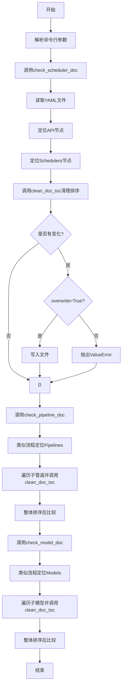
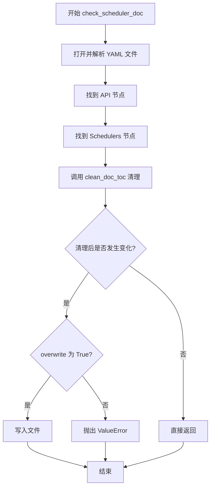
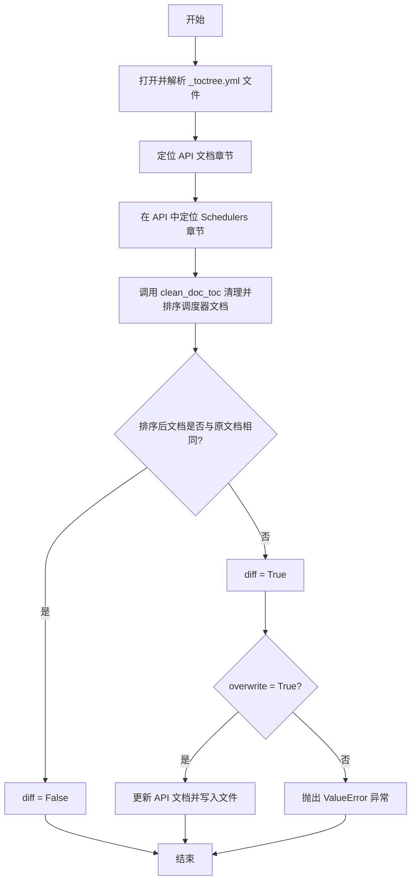
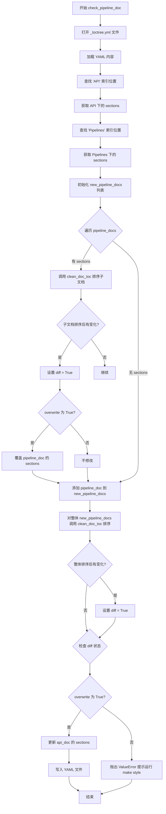

# `diffusers\utils\check_doc_toc.py` 详细设计文档

该脚本用于检查和整理HuggingFace文档目录结构(_toctree.yml)，通过去除重复项、按字母顺序排序模型/管道/调度器文档，并支持自动修复不一致问题。

## 整体流程



## 类结构

```
模块级函数
├── clean_doc_toc (核心排序函数)
├── check_scheduler_doc (调度器检查)
├── check_pipeline_doc (管道检查)
└── check_model_doc (模型检查)
```

## 全局变量及字段


### `PATH_TO_TOC`
    
YAML文档目录文件路径，指向HuggingFace文档的_toctree.yml文件

类型：`str`
    


### `FIXED_POSITION_TITLES`
    
需要保持原始位置的标题集合，用于指定哪些文档标题不应按字母顺序排序

类型：`set`
    


    

## 全局函数及方法


# clean_doc_toc 函数详细设计文档

## 一段话描述

该函数是 Hugging Face 文档工具链中的核心组件，负责清理模型文档目录列表（TOC），通过去除重复项、按字母顺序排序，同时保留特定标题的原始位置，确保文档目录结构的一致性和可维护性。

## 文件的整体运行流程

该脚本作为命令行工具运行，主要流程如下：

1. **初始化阶段**：解析命令行参数 `--fix_and_overwrite`
2. **读取配置**：加载 `docs/source/en/_toctree.yml` YAML 文件
3. **验证与修复**：依次调用 `check_scheduler_doc()`、`check_pipeline_doc()`、`check_model_doc()` 三个验证函数
4. **输出结果**：若检测到不一致且未启用自动修复，则抛出错误；否则写入更新后的 YAML 文件

---

## 全局变量详细信息

### `PATH_TO_TOC`

- **类型**：`str`
- **描述**：指向文档目录树 YAML 配置文件的路径，用于存储文档的层级结构

### `FIXED_POSITION_TITLES`

- **类型**：`set`
- **描述**：包含需要保持原始顺序的标题集合，目前包含 `"overview"` 和 `"autopipeline"`，这些标题不会参与字母排序

---

## 函数详细信息

### `clean_doc_toc(doc_list: List[dict]) -> List[dict]`

#### 参数

- `doc_list`：`List[dict]`，待清理的文档列表，每个元素为包含 `title` 和 `local` 键的字典

#### 返回值

- `List[dict]`，清理并排序后的文档列表

#### 流程图

```mermaid
flowchart TD
    A[开始 clean_doc_toc] --> B[初始化计数器 counts 和列表]
    B --> C[遍历 doc_list]
    C --> D{"local" 字段是否存在?}
    D -->|是| E[counts[local] += 1]
    D -->|否| F
    E --> F{"title" 是否在 FIXED_POSITION_TITLES?}
    F -->|是| G[加入 fixed_position_docs]
    F -->|否| H[加入 new_doc_list]
    G --> I
    H --> I
    C --> I[遍历完成?]
    I -->|否| C
    I -->|是| J[查找重复的 local 键]
    J --> K[是否有重复且 title 不同?]
    K -->|是| L[抛出 ValueError]
    K -->|否| M[构建去重后的文档列表]
    M --> N[按 title 字母排序]
    N --> O[追加 fixed_position_docs 到结果]
    O --> P[返回最终结果]
```

#### 带注释源码

```python
def clean_doc_toc(doc_list):
    """
    Cleans the table of content of the model documentation by removing duplicates and sorting models alphabetically.
    """
    # 使用 defaultdict 统计每个 local 键出现的次数
    counts = defaultdict(int)
    # 存储需要保持固定位置的文档
    fixed_position_docs = []
    # 存储非固定位置的文档
    new_doc_list = []
    
    # 第一遍遍历：分离固定位置文档和普通文档，同时统计 local 出现次数
    for doc in doc_list:
        if "local" in doc:
            counts[doc["local"]] += 1

        # 检查标题是否需要保持固定位置（不参与排序）
        if doc["title"].lower() in FIXED_POSITION_TITLES:
            fixed_position_docs.append({"local": doc["local"], "title": doc["title"]})
        else:
            new_doc_list.append(doc)

    # 更新 doc_list 为非固定位置的文档
    doc_list = new_doc_list
    # 找出所有出现多次的 local 键
    duplicates = [key for key, value in counts.items() if value > 1]

    new_doc = []
    # 处理重复的 local 键
    for duplicate_key in duplicates:
        # 获取该 local 键对应的所有 title
        titles = list({doc["title"] for doc in doc_list if doc["local"] == duplicate_key})
        # 如果同一个 local 有多个不同的 title，抛出错误
        if len(titles) > 1:
            raise ValueError(
                f"{duplicate_key} is present several times in the documentation table of content at "
                "`docs/source/en/_toctree.yml` with different *Title* values. Choose one of those and remove the "
                "others."
            )
        # 只添加一次（去重）
        new_doc.append({"local": duplicate_key, "title": titles[0]})

    # 添加没有重复的文档（local 不在 counts 中或只出现一次）
    new_doc.extend([doc for doc in doc_list if "local" not in counts or counts[doc["local"]] == 1])
    # 按 title 字母顺序排序（不区分大小写）
    new_doc = sorted(new_doc, key=lambda s: s["title"].lower())

    # 固定位置的标题保持原始顺序
    result = []
    for doc in fixed_position_docs:
        result.append(doc)

    # 将排序后的文档追加到固定位置文档后面
    result.extend(new_doc)
    return result
```

---

### `check_scheduler_doc(overwrite=False)`

#### 参数

- `overwrite`：`bool`，是否将修复后的内容写入文件，默认为 `False`

#### 返回值

- 无返回值

#### 流程图



---

### `check_pipeline_doc(overwrite=False)`

#### 参数

- `overwrite`：`bool`，是否将修复后的内容写入文件，默认为 `False`

#### 返回值

- 无返回值

#### 带注释源码

```python
def check_pipeline_doc(overwrite=False):
    with open(PATH_TO_TOC, encoding="utf-8") as f:
        content = yaml.safe_load(f.read())

    # 定位到 API 文档部分
    api_idx = 0
    while content[api_idx]["title"] != "API":
        api_idx += 1
    api_doc = content[api_idx]["sections"]

    # 定位到 Pipelines 部分
    pipeline_idx = 0
    while api_doc[pipeline_idx]["title"] != "Pipelines":
        pipeline_idx += 1

    diff = False
    pipeline_docs = api_doc[pipeline_idx]["sections"]
    new_pipeline_docs = []

    # 对每个子管道文档进行排序
    for pipeline_doc in pipeline_docs:
        if "sections" in pipeline_doc:
            sub_pipeline_doc = pipeline_doc["sections"]
            new_sub_pipeline_doc = clean_doc_toc(sub_pipeline_doc)
            if new_sub_pipeline_doc != sub_pipeline_doc:
                diff = True
                if overwrite:
                    pipeline_doc["sections"] = new_sub_pipeline_doc
        new_pipeline_docs.append(pipeline_doc)

    # 对整体管道文档进行排序
    new_pipeline_docs = clean_doc_toc(new_pipeline_docs)

    if new_pipeline_docs != pipeline_docs:
        diff = True
        if overwrite:
            api_doc[pipeline_idx]["sections"] = new_pipeline_docs

    if diff:
        if overwrite:
            content[api_idx]["sections"] = api_doc
            with open(PATH_TO_TOC, "w", encoding="utf-8") as f:
                f.write(yaml.dump(content, allow_unicode=True))
        else:
            raise ValueError(
                "The model doc part of the table of content is not properly sorted, run `make style` to fix this."
            )
```

---

### `check_model_doc(overwrite=False)`

#### 参数

- `overwrite`：`bool`，是否将修复后的内容写入文件，默认为 `False`

#### 返回值

- 无返回值

---

## 关键组件信息

| 组件名称 | 一句话描述 |
|---------|-----------|
| `clean_doc_toc` | 核心去重排序函数，处理文档目录的去重和字母排序逻辑 |
| `check_scheduler_doc` | 验证并修复 Schedulers 部分的文档目录结构 |
| `check_pipeline_doc` | 验证并修复 Pipelines 部分的文档目录结构（含嵌套排序） |
| `check_model_doc` | 验证并修复 Models 部分的文档目录结构（含嵌套排序） |
| `PATH_TO_TOC` | YAML 配置文件路径常量 |
| `FIXED_POSITION_TITLES` | 固定位置标题集合，确保特定文档保持原始位置 |

---

## 潜在的技术债务或优化空间

1. **硬编码路径问题**：`PATH_TO_TOC` 被硬编码为特定语言路径（`docs/source/en/_toctree.yml`），不支持多语言文档处理
2. **重复代码**：三个 `check_*_doc` 函数包含大量重复的遍历和写入逻辑，可提取公共父函数
3. **异常处理不足**：文件读取失败、YAML 解析错误等场景缺乏明确的异常处理
4. **算法效率**：使用 `defaultdict` 统计后再次遍历查找重复项，可合并为单次遍历
5. **可配置性差**：`FIXED_POSITION_TITLES` 集合写死在代码中，应考虑从配置文件读取

---

## 其它项目

### 设计目标与约束

- **目标**：确保文档目录树的一致性，去除重复项并按字母排序
- **约束**：特定标题（如 overview、autopipeline）需保持原始位置不变
- **输入格式**：YAML 文件，包含嵌套的 sections 结构

### 错误处理与异常设计

| 异常场景 | 处理方式 |
|---------|---------|
| 同一 `local` 键对应多个不同 `title` | 抛出 `ValueError`，提示用户手动选择保留的 title |
| 文档目录未正确排序且未启用自动修复 | 抛出 `ValueError`，提示运行 `make style` 命令 |
| 文件不存在或权限问题 | 由 Python 文件 I/O 抛出原生异常 |

### 数据流与状态机

```
输入 YAML → 解析为嵌套字典 → 定位目标章节 
    → 调用 clean_doc_toc 清理 → 比较差异 
    → 根据 overwrite 决定是否写入 → 输出结果
```

### 外部依赖与接口契约

- **依赖库**：`argparse`（命令行参数）、`defaultdict`（计数）、`yaml`（配置文件解析）
- **接口契约**：
  - 输入：`List[dict]`，每个元素须包含 `title` 键，`local` 键可选
  - 输出：`List[dict]`，去重排序后的列表，保持 `local` 和 `title` 字段


### `check_scheduler_doc`

该函数用于检查并验证 Hugging Face 文档目录中调度器（Schedulers）部分的排序是否正确，如果指定 `overwrite=True` 则自动修复排序问题，否则抛出错误提示需要运行 `make style` 命令。

参数：

- `overwrite`：`bool`，可选参数，默认为 `False`。当设置为 `True` 时，会将排序后的文档内容写回原文件；当设置为 `False` 时，如果发现排序不一致则抛出 `ValueError` 异常。

返回值：`None`，该函数不返回任何值，仅执行文档检查和可能的写入操作。

#### 流程图



#### 带注释源码

```python
def check_scheduler_doc(overwrite=False):
    """
    检查调度器文档的排序是否正确，必要时可以覆盖写入以修复排序问题。
    
    参数:
        overwrite: bool, 默认为 False。如果为 True，则自动修复排序问题并写入文件；
                   如果为 False，则在发现问题时报错提示运行 make style。
    返回值:
        None
    """
    
    # 步骤1: 打开并解析 YAML 格式的目录配置文件
    with open(PATH_TO_TOC, encoding="utf-8") as f:
        content = yaml.safe_load(f.read())

    # 步骤2: 在顶层内容中定位到 "API" 文档章节
    # API 索引用于追踪 API 章节在 content 列表中的位置
    api_idx = 0
    while content[api_idx]["title"] != "API":
        api_idx += 1
    # 获取 API 章节下的所有子章节
    api_doc = content[api_idx]["sections"]

    # 步骤3: 在 API 子章节中定位 "Schedulers" 章节
    scheduler_idx = 0
    while api_doc[scheduler_idx]["title"] != "Schedulers":
        scheduler_idx += 1
    # 获取调度器章节的内容列表
    scheduler_doc = api_doc[scheduler_idx]["sections"]

    # 步骤4: 调用 clean_doc_toc 函数对调度器文档进行清理和排序
    # 该函数会去除重复项并按标题字母顺序排序
    new_scheduler_doc = clean_doc_toc(scheduler_doc)

    # 步骤5: 比较排序前后的文档内容
    diff = False  # 标记是否有差异
    if new_scheduler_doc != scheduler_doc:
        diff = True
        # 如果存在差异且允许覆盖，则更新内存中的 API 文档
        if overwrite:
            api_doc[scheduler_idx]["sections"] = new_scheduler_doc

    # 步骤6: 根据 diff 标志和 overwrite 参数决定后续操作
    if diff:
        if overwrite:
            # 将更新后的内容写回文件
            content[api_idx]["sections"] = api_doc
            with open(PATH_TO_TOC, "w", encoding="utf-8") as f:
                f.write(yaml.dump(content, allow_unicode=True))
        else:
            # 抛出错误，要求用户运行 make style 命令自动修复
            raise ValueError(
                "The model doc part of the table of content is not properly sorted, run `make style` to fix this."
            )
```


### `check_pipeline_doc`

该函数用于检查并验证文档目录中"Pipelines"部分的排序是否正确（按字母顺序排列），如果检测到排序问题且未启用覆盖模式，则抛出错误提示运行`make style`修复；支持通过`overwrite`参数直接修正排序后的文档。

参数：

- `overwrite`：`bool`，控制是否直接覆盖写入排序后的文档目录，默认为`False`（仅检查不修复）

返回值：`None`，该函数无返回值，主要通过抛异常或写入文件来报告状态

#### 流程图



#### 带注释源码

```python
def check_pipeline_doc(overwrite=False):
    """
    检查管道文档的排序是否正确，必要时可覆盖写入排序后的文档。
    此函数专门处理 Pipelines 部分的文档排序，包括子层级管道的排序。
    
    参数:
        overwrite: 布尔值，若为 True 则直接修改文件，若为 False 则仅检查并抛出异常
    """
    # 打开文档目录配置文件 (docs/source/en/_toctree.yml)
    with open(PATH_TO_TOC, encoding="utf-8") as f:
        content = yaml.safe_load(f.read())

    # 定位到 API 文档部分
    # 通过遍历找到 title 为 "API" 的章节索引
    api_idx = 0
    while content[api_idx]["title"] != "API":
        api_idx += 1
    # 获取 API 章节下的所有子章节
    api_doc = content[api_idx]["sections"]

    # 定位到 Pipelines 文档部分
    # 继续在 API 的子章节中查找 title 为 "Pipelines" 的索引
    pipeline_idx = 0
    while api_doc[pipeline_idx]["title"] != "Pipelines":
        pipeline_idx += 1

    # 标记是否有排序变化
    diff = False
    # 获取当前 Pipelines 下的所有文档条目
    pipeline_docs = api_doc[pipeline_idx]["sections"]
    # 用于存储处理后的文档列表
    new_pipeline_docs = []

    # 遍历每个管道文档条目，排序其子文档（如果存在）
    for pipeline_doc in pipeline_docs:
        # 检查当前管道文档是否有子章节（subsections）
        if "sections" in pipeline_doc:
            # 获取子文档列表
            sub_pipeline_doc = pipeline_doc["sections"]
            # 调用 clean_doc_toc 对子文档进行排序和去重
            new_sub_pipeline_doc = clean_doc_toc(sub_pipeline_doc)
            # 检查子文档排序后是否有变化
            if new_sub_pipeline_doc != sub_pipeline_doc:
                diff = True  # 标记存在差异
                # 如果 overwrite 为 True，则更新子文档
                if overwrite:
                    pipeline_doc["sections"] = new_sub_pipeline_doc
        # 将处理后的管道文档添加到新列表
        new_pipeline_docs.append(pipeline_doc)

    # 对整体管道文档列表进行排序
    # 调用 clean_doc_toc 对整个 Pipelines 列表进行排序
    new_pipeline_docs = clean_doc_toc(new_pipeline_docs)

    # 检查整体排序后是否有变化
    if new_pipeline_docs != pipeline_docs:
        diff = True
        # 如果 overwrite 为 True，则更新 API 中的 Pipelines 部分
        if overwrite:
            api_doc[pipeline_idx]["sections"] = new_pipeline_docs

    # 如果存在差异（排序不正确），根据 overwrite 参数决定处理方式
    if diff:
        if overwrite:
            # 将更新后的 API 文档部分写回 content
            content[api_idx]["sections"] = api_doc
            # 打开文件并写入排序后的 YAML 内容
            with open(PATH_TO_TOC, "w", encoding="utf-8") as f:
                f.write(yaml.dump(content, allow_unicode=True))
        else:
            # 不覆盖时抛出异常，提示用户运行 make style 命令修复
            raise ValueError(
                "The model doc part of the table of content is not properly sorted, run `make style` to fix this."
            )
```


### `check_model_doc`

该函数用于检查模型文档在 `_toctree.yml` 文件中的排序是否正确。它会读取文档目录配置文件，定位到 API 下的 Models 节点，通过 `clean_doc_toc` 函数清理并排序模型文档条目，比较排序前后的差异。如果发现排序不一致且 `overwrite` 参数为 `True`，则直接写入文件修复；否则抛出错误提示需要运行 `make style` 命令。

参数：

- `overwrite`：`bool`，默认为 `False`，是否覆盖并修复文档排序

返回值：`None`，无返回值

#### 流程图

```mermaid
flowchart TD
    A[开始] --> B[打开 PATH_TO_TOC YAML 文件]
    B --> C[查找 title 为 'API' 的节点索引]
    C --> D[获取 api_doc = content[api_idx]['sections']]
    E[查找 title 为 'Models' 的节点索引]
    D --> E
    E --> F[获取 model_docs = api_doc[model_idx]['sections']]
    F --> G[初始化 new_model_docs = []]
    G --> H[遍历 model_docs 中的每个 model_doc]
    H --> I{检查 model_doc 是否有 'sections' 键}
    I -->|是| J[获取子文档 sub_model_doc]
    J --> K[调用 clean_doc_toc 排序]
    K --> L{排序后是否与原文档不同}
    L -->|是| M[设置 diff = True]
    L -->|否| N[跳过]
    M --> O{overwrite 为 True}
    O -->|是| P[更新 model_doc['sections']]
    O -->|否| Q[不修改]
    P --> R[将 model_doc 添加到 new_model_docs]
    Q --> R
    I -->|否| R
    R --> S[继续遍历下一个 model_doc]
    S --> H
    H --> T[遍历完成]
    T --> U[对 new_model_docs 整体调用 clean_doc_toc 排序]
    U --> V{排序后是否与原 model_docs 不同}
    V -->|是| W[设置 diff = True]
    V -->|否| X[不修改]
    W --> Y{overwrite 为 True}
    Y -->|是| Z[更新 api_doc[model_idx]['sections']]
    Y -->|否| AA[跳过]
    Z --> AB[更新 content[api_idx]['sections']]
    AB --> AC[写入 YAML 文件]
    AA --> AD
    X --> AD
    AD{diff 为 True}
    AD -->|是| AE{overwrite 为 False}
    AE -->|是| AF[结束]
    AE -->|否| AG[抛出 ValueError 错误]
    V -->|否| AD
    W --> AD
```

#### 带注释源码

```python
def check_model_doc(overwrite=False):
    """
    检查模型文档的排序是否正确，必要时进行修复。
    
    参数:
        overwrite (bool): 是否覆盖并修复文档排序。默认为 False。
    
    返回:
        None
    """
    # 打开并读取 _toctree.yml 配置文件
    with open(PATH_TO_TOC, encoding="utf-8") as f:
        content = yaml.safe_load(f.read())

    # 定位到 API 文档节点
    # 遍历顶层内容，查找 title 为 "API" 的节点索引
    api_idx = 0
    while content[api_idx]["title"] != "API":
        api_idx += 1
    # 获取 API 节点下的 sections（即子节点列表）
    api_doc = content[api_idx]["sections"]

    # 定位到 Models 文档节点
    # 遍历 API 的子节点，查找 title 为 "Models" 的节点索引
    model_idx = 0
    while api_doc[model_idx]["title"] != "Models":
        model_idx += 1

    # 初始化差异标志
    diff = False
    # 获取当前模型文档列表
    model_docs = api_doc[model_idx]["sections"]
    # 用于存储处理后的模型文档
    new_model_docs = []

    # 遍历子模型文档，对每个有子章节的模型进行排序
    for model_doc in model_docs:
        # 检查该模型文档是否有子章节（sections）
        if "sections" in model_doc:
            # 获取子章节文档
            sub_model_doc = model_doc["sections"]
            # 调用 clean_doc_toc 清理并排序子文档
            new_sub_model_doc = clean_doc_toc(sub_model_doc)
            # 比较排序后与排序前是否相同
            if new_sub_model_doc != sub_model_doc:
                diff = True  # 标记有差异
                if overwrite:
                    # 如果允许覆盖，则更新子章节
                    model_doc["sections"] = new_sub_model_doc
        # 将处理后的模型文档添加到新列表
        new_model_docs.append(model_doc)

    # 对整体模型文档进行排序
    new_model_docs = clean_doc_toc(new_model_docs)

    # 比较整体排序后与原始是否相同
    if new_model_docs != model_docs:
        diff = True
        if overwrite:
            # 如果允许覆盖，则更新模型文档
            api_doc[model_idx]["sections"] = new_model_docs

    # 如果存在差异，根据 overwrite 参数决定如何处理
    if diff:
        if overwrite:
            # 允许覆盖：更新 API 文档并写入文件
            content[api_idx]["sections"] = api_doc
            with open(PATH_TO_TOC, "w", encoding="utf-8") as f:
                f.write(yaml.dump(content, allow_unicode=True))
        else:
            # 不允许覆盖：抛出错误，提示运行 make style
            raise ValueError(
                "The model doc part of the table of content is not properly sorted, run `make style` to fix this."
            )
```

## 关键组件


### PATH_TO_TOC

指向文档目录YAML文件的路径常量，用于定位待检查的TOC文件。

### FIXED_POSITION_TITLES

固定位置标题集合，用于标识哪些文档标题不应参与字母排序，需保持原始顺序。

### clean_doc_toc(doc_list)

清理并排序文档目录列表的函数，负责去重、排序以及处理固定位置标题。

### check_scheduler_doc(overwrite=False)

检查HuggingFace文档中Schedulers部分的TOC是否正确排序，检测到不一致时可选择覆盖写入。

### check_pipeline_doc(overwrite=False)

检查Pipelines文档目录的排序状态，包括对子管道文档进行递归检查和整体排序。

### check_model_doc(overwrite=False)

检查Models文档目录的排序状态，对子模型文档进行递归清理和排序处理。


## 问题及建议


### 已知问题

-   **代码重复（DRY 原则违反）**：`check_scheduler_doc`、`check_pipeline_doc` 和 `check_model_doc` 三个函数结构几乎完全相同，仅在查找的 section 标题（"Schedulers"、"Pipelines"、"Models"）上有所不同，应提取公共逻辑为通用函数。
-   **硬编码值过多**：`PATH_TO_TOC` 路径、"API"、"Schedulers"、"Pipelines"、"Models" 等字符串字面量散布在代码中，修改时需要多处改动。
-   **缺少异常处理**：文件读写操作（`open`）没有 try-except 包裹，可能因文件不存在、权限问题或 YAML 解析错误导致程序直接崩溃。
-   **YAML 结构缺乏验证**：直接使用 `content[api_idx]["title"]` 和 `content[api_idx]["sections"]` 访问嵌套结构，若 YAML 格式不符合预期（如缺少 key、类型错误），会抛出难以追踪的 KeyError 或 TypeError。
- **线性搜索效率低下**：使用 `while` 循环遍历列表查找 "API"、"Schedulers" 等索引，时间复杂度为 O(n)，可改用字典索引实现 O(1) 查找。
- **缺少日志记录**：程序执行过程中没有任何日志输出，无法追踪修改了哪些内容、为何失败，排查问题困难。
- **单文件写入无事务性**：读取文件、修改、再写入的过程不是原子操作，若写入失败或程序中断，会导致 YAML 文件损坏。
- **魔法字符串**：错误信息中提示运行 `make style`，该信息与代码逻辑耦合，且对非 Makefile 项目不适用。

### 优化建议

-   **提取通用逻辑**：创建 `check_section_doc(section_title, overwrite=False)` 通用函数，将遍历 YAML 查找 section、调用 `clean_doc_toc`、比较差异、写入文件的公共流程封装。
-   **配置常量化**：将 "API"、"Schedulers"、"Pipelines"、"Models" 等字符串定义为常量或枚举类，路径配置化为模块级常量或从配置文件读取。
-   **添加异常处理**：为所有文件 I/O 操作添加 try-except，捕获 `FileNotFoundError`、`PermissionError`、`yaml.YAMLError` 等异常，并给出友好提示。
-   **验证 YAML 结构**：在访问嵌套结构前进行存在性和类型检查（如 `if "title" in content[api_idx] and isinstance(content[api_idx].get("sections"), list):`），或使用 Pydantic 等库定义预期的数据结构。
-   **使用字典索引**：将 API doc 转换为以 title 为 key 的字典，直接通过 `api_doc["Schedulers"]` 获取，避免线性遍历。
-   **引入日志模块**：使用 `logging` 模块记录执行步骤、修改内容和错误信息，替代无声失败或仅抛异常的方式。
-   **原子写入**：采用写入临时文件再重命名的方式，或使用文件锁机制，确保写入过程的原子性。
-   **解耦错误信息**：将错误提示信息参数化或移除特定项目依赖（如 "make style"），提高脚本的可复用性。

## 其它


### 设计目标与约束

该脚本的主要设计目标是自动化检查并规范化Hugging Face文档目录（_toctree.yml）的排序，确保Schedulers、Pipelines和Models三个部分的文档列表按字母顺序排列，同时保留特定标题（如"overview"和"autopipeline"）的固定位置。约束条件包括：1）仅处理YAML格式的TOC文件；2）不允许重复的local路径对应不同的title；3）固定标题列表（FIXED_POSITION_TITLES）目前仅包含"overview"和"autopipeline"，其他特殊处理需手动扩展。

### 错误处理与异常设计

代码采用以下错误处理机制：1）当检测到duplicate local路径对应多个不同title时，抛出ValueError并提示用户选择一个title后删除其他条目；2）当TOC未正确排序且未启用overwrite模式时，抛出ValueError提示运行`make style`修复；3）文件读取使用UTF-8编码，YAML解析使用安全的yaml.safe_load。潜在改进：可添加文件不存在异常捕获、YAML解析失败处理、写入失败回滚机制等。

### 数据流与状态机

数据流为：读取YAML文件 → 定位API节点 → 定位具体分类节点（Schedulers/Pipelines/Models）→ 调用clean_doc_toc处理文档列表 → 比较新旧列表是否相同 → 根据overwrite参数决定是否写入。具体状态转换包括：初始状态 → 解析YAML → 遍历API索引 → 遍历分类索引 → 处理文档列表 → diff检测 → 写入或异常。clean_doc_toc内部状态：接收doc_list → 统计local计数 → 分离固定位置文档 → 检测重复项 → 去重构建新列表 → 排序 → 合并固定位置文档 → 返回结果。

### 外部依赖与接口契约

外部依赖包括：1）Python标准库argparse用于命令行参数解析；2）Python标准库collections.defaultdict用于计数；3）PyYAML库（yaml）用于YAML文件读写。接口契约：PATH_TO_TOC常量定义TOC文件路径（默认"docs/source/en/_toctree.yml"）；FIXED_POSITION_TITLES集合定义固定位置的标题；clean_doc_toc函数接收doc_list列表返回处理后的列表；check_scheduler_doc/check_pipeline_doc/check_model_doc三个函数接收可选的overwrite布尔参数。

### 配置文件与参数说明

主要配置通过命令行参数传递：--fix_and_overwrite（布尔标志）决定是否直接修改TOC文件。内部配置常量：PATH_TO_TOC定义TOC文件路径；FIXED_POSITION_TITLES定义不参与排序的标题集合。YAML文件结构要求：顶层需包含"API"标题的节点，API节点sections需包含"Schedulers"、"Pipelines"、"Models"标题的节点，每个节点可包含嵌套的sections子节点。

### 性能考虑与资源消耗

性能特点：1）时间复杂度为O(n log n)由于排序操作，其中n为文档条目数；2）空间复杂度为O(n)用于存储处理过程中的列表；3）文件读写为顺序操作，YAML解析可能存在一定开销。优化建议：可考虑增量检查而非全量重写、使用更高效的YAML流式解析、缓存已解析的TOC内容避免重复读取。

### 安全考虑与权限管理

安全考量：1）文件操作仅限于指定的TOC文件路径，避免路径遍历攻击；2）使用yaml.safe_load而非yaml.load防止恶意YAML执行任意代码；3）写入文件时使用UTF-8编码确保字符正确处理。权限要求：需要文件系统对TOC文件的读权限，overwrite模式下还需写权限。

### 可维护性与扩展性

可维护性方面：1）代码结构清晰，clean_doc_toc作为核心函数被多处复用；2）使用有意义的变量名和函数名；3）包含完整的docstring说明。扩展性方面：1）可通过修改FIXED_POSITION_TITLES添加新的固定位置标题；2）可通过添加新的check_xxx_doc函数扩展检查其他分类；3）可配置化PATH_TO_TOC支持不同语言版本。潜在改进：提取公共的遍历索引逻辑为辅助函数、创建配置类集中管理常量、添加日志记录而非仅依赖异常输出。

### 测试策略

测试应覆盖：1）clean_doc_toc函数的单元测试，包括正常排序、固定位置保留、去重逻辑、异常检测；2）各check函数的集成测试，验证文件读写和修改逻辑；3）边界情况测试：空列表、单元素列表、已排序列表、全部重复、嵌套sections处理。测试数据可构建模拟的YAML结构和预期的输出结果。

### 使用示例与调用流程

基本调用流程：python script.py（仅检查不修改）→ 若检测到排序问题抛出异常；python script.py --fix_and_overwrite → 自动修复排序问题并写回文件。直接导入使用示例：from module import check_scheduler_doc, check_pipeline_doc, check_model_doc; check_scheduler_doc(overwrite=True)可单独检查并修复Schedulers部分。调用顺序为：解析命令行参数 → 依次执行三个检查函数 → 每个函数独立读写文件。


    