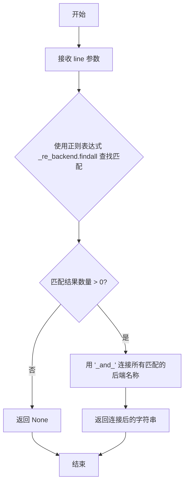
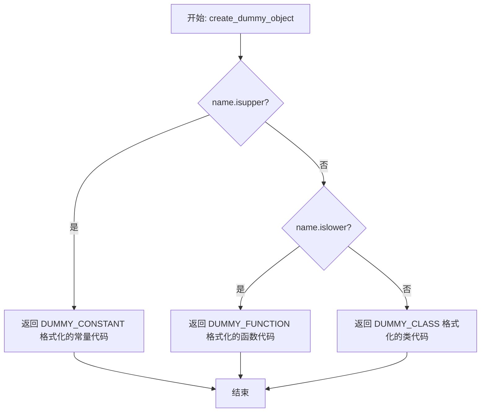
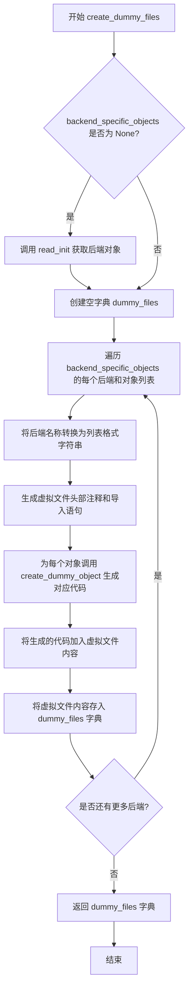
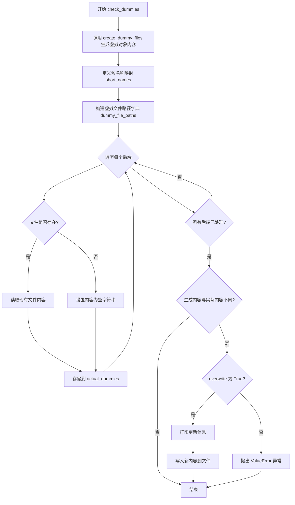
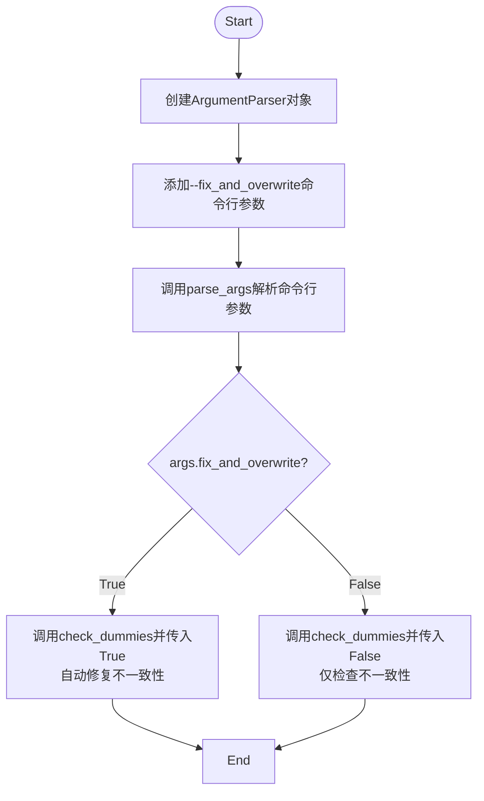

# `diffusers\utils\check_dummies.py` 详细设计文档

这是一个工具脚本，用于检查和生成HuggingFace Diffusers库中的dummy对象文件，确保当某些可选依赖（如PyTorch、TensorFlow等）不可用时，库仍能正确导入这些backend特定的对象。

## 整体流程

```mermaid
graph TD
    A[开始] --> B[解析命令行参数]
    B --> C{fix_and_overwrite?}
    C -- 否 --> D[调用check_dummies(False)]
    C -- 是 --> E[调用check_dummies(True)]
    D --> F[create_dummy_files]
    E --> F
    F --> G[读取__init__.py]
    G --> H[find_backend查找backend]
    H --> I{找到backend?}
    I -- 是 --> J[提取backend特定对象]
    I -- 否 --> K[继续下一行]
    J --> L[创建dummy对象代码]
    K --> M{文件结束?}
    M -- 否 --> H
    M -- 是 --> N[返回backend_specific_objects]
    L --> N
    N --> O[读取现有dummy文件]
    O --> P{内容一致?}
    P -- 是 --> Q[检查通过]
    P -- 否 --> R{overwrite?}
    R -- 否 --> S[抛出ValueError]
    R -- 是 --> T[写入更新后的dummy文件]
    Q --> U[结束]
    S --> U
    T --> U
```

## 类结构

```
check_dummies.py (脚本模块)
├── 全局变量
│   ├── PATH_TO_DIFFUSERS
│   ├── _re_backend
│   ├── _re_single_line_import
│   ├── DUMMY_CONSTANT
│   ├── DUMMY_CLASS
│   └── DUMMY_FUNCTION
├── 辅助函数
│   ├── find_backend(line)
│   ├── read_init()
│   ├── create_dummy_object(name, backend_name)
│   ├── create_dummy_files(backend_specific_objects)
│   └── check_dummies(overwrite)
└── 主程序入口
```

## 全局变量及字段


### `PATH_TO_DIFFUSERS`
    
diffusers库的源代码根目录路径

类型：`str`
    


### `_re_backend`
    
正则表达式，用于匹配is_xxx_available()格式的后端检查函数

类型：`re.Pattern`
    


### `_re_single_line_import`
    
正则表达式，用于匹配from xxx import xxx格式的单行导入语句

类型：`re.Pattern`
    


### `DUMMY_CONSTANT`
    
模板字符串，用于生成dummy常量的代码

类型：`str`
    


### `DUMMY_CLASS`
    
模板字符串，用于生成dummy类的代码框架

类型：`str`
    


### `DUMMY_FUNCTION`
    
模板字符串，用于生成dummy函数的代码框架

类型：`str`
    


### `backend_specific_objects`
    
存储从__init__.py中解析出的后端特定对象列表，键为后端名，值为对象名列表

类型：`dict`
    


### `dummy_files`
    
存储生成的虚拟对象文件内容，键为后端名，值为文件内容字符串

类型：`dict`
    


### `short_names`
    
后端名称到短名称的映射，用于生成dummy文件名

类型：`dict`
    


### `actual_dummies`
    
存储当前实际存在的dummy文件内容，用于与生成内容比对

类型：`dict`
    


### `dummy_file_paths`
    
各后端对应的dummy文件完整路径

类型：`dict`
    


    

## 全局函数及方法


### `find_backend`

该函数用于在代码行中查找一个或多个后端名称，通过正则表达式匹配 `is_xxx_available()` 格式的字符串，并返回用下划线连接的后端名称字符串，若无匹配则返回 `None`。

参数：

- `line`：`str`，需要进行检查的代码行文本

返回值：`Optional[str]`，如果找到后端则返回用 "_and_" 连接的后端名称字符串（如 "torch_and_tf"），否则返回 `None`

#### 流程图



#### 带注释源码

```python
def find_backend(line):
    """Find one (or multiple) backend in a code line of the init."""
    # 使用预编译的正则表达式查找 is_xxx_available() 模式
    # 正则解释: is_([a-z_]*)_available\(\)
    #   - is_ : 匹配字面量 "is_"
    #   - ([a-z_]*) : 捕获组，匹配零个或多个小写字母或下划线（即后端名）
    #   - _available\(\) : 匹配字面量 "_available()"
    backends = _re_backend.findall(line)
    
    # 如果没有找到任何匹配（backends 为空列表）
    if len(backends) == 0:
        return None

    # 将多个后端用 "_and_" 连接起来
    # 例如: ['torch', 'tf'] -> 'torch_and_tf'
    return "_and_".join(backends)
```


### `read_init`

该函数用于读取 diffusers 库的 `__init__.py` 文件，并从中提取后端特定的对象（如 PyTorch、TensorFlow、SentencePiece 和 Tokenizers 相关的对象），以便后续生成虚拟对象文件进行依赖检查。

参数： 无

返回值：`Dict[str, List[str]]`，返回一个字典，其中键为后端名称（如 "torch"、"tensorflow" 等），值为该后端对应的对象名称列表。

#### 流程图

```mermaid
flowchart TD
    A[开始] --> B[打开 __init__.py 文件]
    B --> C[读取所有行到列表]
    C --> D[初始化 line_index = 0]
    D --> E{当前行是否以 'if TYPE_CHECKING' 开头?}
    E -->|否| F[line_index += 1]
    F --> E
    E -->|是| G[初始化空字典 backend_specific_objects]
    G --> H{line_index < 文件总行数?}
    H -->|否| I[返回 backend_specific_objects]
    H -->|是| J[在当前行查找后端名称]
    J --> K{找到后端?}
    K -->|否| L[line_index += 1, 继续循环]
    L --> H
    K -->|是| M[移动到 'else:' 块]
    M --> N[初始化空列表 objects]
    N --> O{当前行缩进 <= 1 或以 8 个空格开头?}
    O -->|否| P{对象列表长度 > 0?}
    P -->|是| Q[backend_specific_objects[backend] = objects]
    Q --> L
    P -->|否| L
    O -->|是| R[匹配单行导入或提取对象名]
    R --> S[将对象添加到 objects 列表]
    S --> T[line_index += 1]
    T --> O
```

#### 带注释源码

```python
def read_init():
    """Read the init and extracts PyTorch, TensorFlow, SentencePiece and Tokenizers objects."""
    # 打开 diffusers 库的 __init__.py 文件进行读取
    # 使用 UTF-8 编码和 Unix 换行符
    with open(os.path.join(PATH_TO_DIFFUSERS, "__init__.py"), "r", encoding="utf-8", newline="\n") as f:
        lines = f.readlines()  # 读取所有行到列表中

    # 定位到 TYPE_CHECKING 块开始位置（实际导入检查的类型定义部分）
    line_index = 0
    # 循环查找以 'if TYPE_CHECKING' 开头的行
    while not lines[line_index].startswith("if TYPE_CHECKING"):
        line_index += 1

    # 初始化后端特定对象字典，用于存储每个后端对应的对象列表
    backend_specific_objects = {}
    
    # 遍历文件的剩余部分，从 TYPE_CHECKING 块开始到文件结尾
    while line_index < len(lines):
        # 在当前行查找后端信息（如 is_torch_available 等）
        backend = find_backend(lines[line_index])
        
        # 如果找到了后端信息
        if backend is not None:
            # 移动到对应的 else 块（实际导入发生的位置）
            while not lines[line_index].startswith("    else:"):
                line_index += 1
            line_index += 1  # 跳过 'else:' 这一行
            
            objects = []  # 初始化当前后端的对象列表
            
            # 遍历 else 块中的所有行（直到缩进减少或空行）
            # 条件：行长度 <= 1（空行）或以 8 个空格开头（缩进的导入行）
            while len(lines[line_index]) <= 1 or lines[line_index].startswith(" " * 8):
                line = lines[line_index]
                
                # 尝试匹配单行导入语句（from xxx import a, b, c）
                single_line_import_search = _re_single_line_import.search(line)
                if single_line_import_search is not None:
                    # 将导入的对象分割并添加到列表
                    objects.extend(single_line_import_search.groups()[0].split(", "))
                # 如果是以 12 个空格开头的行（可能是多行导入的一部分）
                elif line.startswith(" " * 12):
                    # 提取对象名（去掉前 12 个空格和末尾换行符）
                    objects.append(line[12:-2])
                
                line_index += 1  # 移动到下一行

            # 如果找到的对象列表不为空，则添加到结果字典
            if len(objects) > 0:
                backend_specific_objects[backend] = objects
        else:
            # 如果当前行没有后端信息，只是简单地移动索引
            line_index += 1

    # 返回收集到的后端特定对象字典
    return backend_specific_objects
```


### `create_dummy_object`

根据对象名称的大小写类型（常量、函数或类），生成对应的虚拟对象（dummy object）代码模板。

参数：

- `name`：`str`，对象名称，用于判断类型（大写为常量，小写为函数，混合为类）
- `backend_name`：`str`，后端名称，用于生成虚拟对象的 `requires_backends` 调用

返回值：`str`，返回格式化后的虚拟对象代码（常量、函数或类的虚拟实现）

#### 流程图



#### 带注释源码

```python
def create_dummy_object(name, backend_name):
    """Create the code for the dummy object corresponding to `name`.
    
    根据对象名称的大小写判断其类型，并生成对应的虚拟对象代码。
    
    Args:
        name: 对象名称字符串，通过大小写判断类型：
              - 全大写: 常量 (constant)
              - 全小写: 函数 (function)
              - 混合大小写: 类 (class)
        backend_name: 后端名称，用于生成 requires_backends 调用的参数
    
    Returns:
        str: 格式化后的虚拟对象代码模板
    """
    # 判断是否为常量（全大写）
    if name.isupper():
        # 使用常量模板格式化，生成 "NAME = None"
        return DUMMY_CONSTANT.format(name)
    # 判断是否为函数（全小写）
    elif name.islower():
        # 使用函数模板格式化，生成 dummy 函数代码
        return DUMMY_FUNCTION.format(name, backend_name)
    # 否则视为类（混合大小写）
    else:
        # 使用类模板格式化，生成 dummy 类代码
        return DUMMY_CLASS.format(name, backend_name)
```


### `create_dummy_files`

该函数用于生成虚拟（dummy）文件的内容，这些虚拟文件用于处理可选依赖项（如 PyTorch、TensorFlow 等）的延迟导入。它读取后端特定对象的字典，为每个后端生成对应的虚拟模块代码，并返回包含所有虚拟文件内容的字典。

参数：

- `backend_specific_objects`：`Optional[Dict[str, List[str]]]`，可选参数，后端特定对象的字典，键为后端名称（如 "torch"），值为该后端对应的对象名称列表。如果为 `None`，则自动调用 `read_init()` 函数从 `__init__.py` 中读取。

返回值：`Dict[str, str]`，返回生成的虚拟文件内容字典，键为后端名称，值为虚拟文件的完整代码字符串。

#### 流程图



#### 带注释源码

```python
def create_dummy_files(backend_specific_objects=None):
    """Create the content of the dummy files."""
    # 如果未提供 backend_specific_objects，则从 __init__.py 自动读取
    if backend_specific_objects is None:
        backend_specific_objects = read_init()
    
    # 用于存储生成的所有虚拟文件内容
    dummy_files = {}

    # 遍历每个后端及其对应的对象列表
    for backend, objects in backend_specific_objects.items():
        # 将后端名称（如 "torch" 或 "torch_and_tf"）转换为 Python 列表字符串格式
        # 例如: "torch" -> '["torch"]'
        #       "torch_and_tf" -> '["torch", "tf"]'
        backend_name = "[" + ", ".join(f'"{b}"' for b in backend.split("_and_")) + "]"
        
        # 初始化虚拟文件内容，包含自动生成警告和必要的导入语句
        dummy_file = "# This file is autogenerated by the command `make fix-copies`, do not edit.\n"
        dummy_file += "from ..utils import DummyObject, requires_backends\n\n"
        
        # 为每个对象生成对应的虚拟代码（常量、函数或类）
        dummy_file += "\n".join([create_dummy_object(o, backend_name) for o in objects])
        
        # 将生成的虚拟文件内容存入字典，键为后端名称
        dummy_files[backend] = dummy_file

    # 返回包含所有虚拟文件内容的字典
    return dummy_files
```


### `check_dummies`

该函数用于检查 diffusers 库中的虚拟对象（dummy objects）文件是否与主 `__init__.py` 中的后端特定导入保持同步，如果检测到不一致且 `overwrite` 为 `True` 则自动更新文件，否则抛出错误。

参数：

- `overwrite`：`bool`，是否覆盖现有的虚拟对象文件以更新其内容

返回值：`None`，该函数没有返回值

#### 流程图



#### 带注释源码

```python
def check_dummies(overwrite=False):
    """Check if the dummy files are up to date and maybe `overwrite` with the right content."""
    # 调用 create_dummy_files 函数生成当前应该存在的虚拟对象内容
    # 该函数会读取 src/diffusers/__init__.py 中的后端特定导入
    # 并根据导入的对象类型（常量、函数、类）生成对应的虚拟对象代码
    dummy_files = create_dummy_files()
    
    # 定义后端名称到短名称的映射，用于构建虚拟文件路径
    # 例如: "torch" -> "pt", 这样会生成 dummy_pt_objects.py
    short_names = {"torch": "pt"}

    # 构建虚拟文件路径字典，键为后端名，值为完整的文件路径
    # 路径格式: src/diffusers/utils/dummy_{backend}_objects.py
    path = os.path.join(PATH_TO_DIFFUSERS, "utils")
    dummy_file_paths = {
        backend: os.path.join(path, f"dummy_{short_names.get(backend, backend)}_objects.py")
        for backend in dummy_files.keys()
    }

    # 读取现有的虚拟文件内容
    actual_dummies = {}
    for backend, file_path in dummy_file_paths.items():
        if os.path.isfile(file_path):
            # 如果文件存在，读取其内容
            with open(file_path, "r", encoding="utf-8", newline="\n") as f:
                actual_dummies[backend] = f.read()
        else:
            # 如果文件不存在，设置为空字符串
            actual_dummies[backend] = ""

    # 遍历每个后端，比较生成的内容与实际文件内容
    for backend in dummy_files.keys():
        # 如果内容不一致
        if dummy_files[backend] != actual_dummies[backend]:
            if overwrite:
                # 如果 overwrite 为 True，更新文件内容
                print(
                    f"Updating diffusers.utils.dummy_{short_names.get(backend, backend)}_objects.py as the main "
                    "__init__ has new objects."
                )
                with open(dummy_file_paths[backend], "w", encoding="utf-8", newline="\n") as f:
                    f.write(dummy_files[backend])
            else:
                # 如果 overwrite 为 False，抛出错误
                raise ValueError(
                    "The main __init__ has objects that are not present in "
                    f"diffusers.utils.dummy_{short_names.get(backend, backend)}_objects.py. Run `make fix-copies` "
                    "to fix this."
                )
```


### `main` (if __name__ == "__main__")

这是代码的入口点，用于检查 diffusers 库中的虚拟对象（dummy objects）是否与主 `__init__.py` 文件中的后端特定对象保持同步，并支持自动修复不一致性。

参数：

- 无直接参数（通过命令行传入参数）
  - `fix_and_overwrite`：`bool`，通过 `--fix_and_overwrite` 命令行标志传入，表示是否自动修复不一致性

返回值：`None`，无返回值

#### 流程图



#### 带注释源码

```python
# 主入口点：当脚本作为主程序运行时执行
if __name__ == "__main__":
    # 创建命令行参数解析器
    parser = argparse.ArgumentParser()
    
    # 添加 --fix_and_overwrite 参数
    # action="store_true" 表示该标志存在时值为 True，不存在时为 False
    # help 参数提供命令行帮助信息
    parser.add_argument(
        "--fix_and_overwrite", 
        action="store_true", 
        help="Whether to fix inconsistencies."
    )
    
    # 解析命令行参数，将命令行输入转换为 Namespace 对象
    args = parser.parse_args()
    
    # 调用 check_dummies 函数进行检查
    # 传入 args.fix_and_overwrite 决定是否自动修复不一致
    # 如果为 True，将更新虚拟对象文件
    # 如果为 False（默认），仅检查并在发现不一致时抛出 ValueError
    check_dummies(args.fix_and_overwrite)
```

## 关键组件


### 路径配置与常量定义

定义了diffusers项目的路径和用于匹配后端可用性检查的正则表达式，以及生成dummy对象的模板字符串。

### 正则表达式引擎

使用`_re_backend`匹配`is_xxx_available()`形式的backend检查，使用`_re_single_line_import`匹配`from xxx import bla`形式的单行导入语句。

### Dummy对象模板

包含三种模板：DUMMY_CONSTANT用于常量，DUMMY_CLASS用于类，DUMMY_FUNCTION用于函数，这些模板在特定后端不可用时提供占位符。

### find_backend函数

从代码行中提取backend名称，支持多backend组合（用_and_连接）。

### read_init函数

读取diffusers的__init__.py文件，解析TYPE_CHECKING块后的后端特定对象导入，提取每个backend对应的对象列表。

### create_dummy_object函数

根据对象名称的大小写判断类型（全大写为常量，全小写为函数，其他为类），并使用对应模板生成dummy对象代码。

### create_dummy_files函数

遍历后端特定对象，为每个backend生成完整的dummy文件内容，包含文件头和所有dummy对象定义。

### check_dummies函数

对比生成的dummy文件与实际文件内容，若不一致且传入fix_and_overwrite=True则自动更新，否则抛出错误提醒运行make fix-copies。


## 问题及建议


### 已知问题

-   **魔法数字与硬编码缩进**：代码中使用了硬编码的数字8和12（如`lines[line_index].startswith(" " * 8)`）来控制缩进逻辑，这些数字的含义不直观，且依赖于特定的代码格式，脆弱性高
-   **缺乏错误处理**：`read_init()`函数在找不到`if TYPE_CHECKING`时会抛出`IndexError`异常，文件读写操作也未捕获可能的`IOError`或`FileNotFoundError`
-   **正则表达式局限性**：`_re_single_line_import`只能匹配单行导入语句，无法处理多行导入或复杂的导入格式，可能遗漏某些对象
-   **路径硬编码**：`PATH_TO_DIFFUSERS`被硬编码为`"src/diffusers"`，降低了脚本的可移植性和复用性
-   **缺少类型注解**：整个代码没有使用Python类型提示（type hints），降低了代码的可读性和可维护性，也无法被静态类型检查工具验证
-   **函数参数不一致**：`check_dummies()`函数参数为`overwrite`，但命令行解析使用`fix_and_overwrite`，命名不一致可能导致理解困惑
-   **字符串格式化方式过时**：使用了`.format()`方法而非更现代的f-string，代码可读性稍差

### 优化建议

-   **提取魔法数字为常量**：将缩进相关的数字定义为具名常量，如`INDENT_LEVEL_2 = 8`、`INDENT_LEVEL_3 = 12`，提高代码可读性
-   **增强错误处理**：为文件读取操作添加try-except块，为`read_init()`中的循环添加边界检查和异常处理
-   **改进正则表达式**：使用更健壮的导入匹配模式，或考虑使用`ast`模块解析Python代码以更准确地提取导入信息
-   **添加命令行参数**：允许通过命令行参数指定`PATH_TO_DIFFUSERS`，提高灵活性
-   **添加类型注解**：为所有函数参数和返回值添加类型提示，提升代码质量和IDE支持
-   **统一命名风格**：将`fix_and_overwrite`改为与函数参数一致的`overwrite`
-   **使用f-string**：将字符串格式化改为更现代的f-string语法
-   **模块化拆分**：考虑将功能拆分为更小的函数或模块，提升可测试性

## 其它


### 设计目标与约束

本脚本旨在自动化管理diffusers库中针对可选后端（如PyTorch、TensorFlow、SentencePiece等）的dummy对象文件。通过检测`__init__.py`中条件导入的对象，确保在相应后端不可用时，仍能提供一致的导入接口，避免运行时导入错误。核心约束包括：1) 脚本必须在diffusers仓库根目录执行；2) 依赖正则表达式解析`__init__.py`的结构；3) 输出文件路径遵循`dummy_{backend}_objects.py`命名规范。

### 错误处理与异常设计

代码中的错误处理主要体现在`check_dummies`函数中：1) 当dummy文件内容与预期不符时，若`overwrite=False`则抛出`ValueError`，提示运行`make fix-copies`命令；2) 若`overwrite=True`则自动更新文件并打印操作信息；3) 文件读取使用`try-except`处理潜在IO异常；4) 正则匹配失败时返回空结果而非直接终止。此外，`read_init`函数假设文件存在且格式符合预期，若`__init__.py`结构变化可能导致解析失败。

### 数据流与状态机

数据流转过程如下：1) `check_dummies`作为入口，调用`create_dummy_files`获取预期内容；2) `create_dummy_files`首先调用`read_init`解析`__init__.py`；3) `read_init`通过状态机模式遍历文件：定位`if TYPE_CHECKING`后，遇到`is_xxx_available()`则进入backend块，解析`else`分支下的导入语句；4) 解析结果存储为`backend_specific_objects`字典；5) 最后根据backend生成对应的dummy文件内容字符串。

### 外部依赖与接口契约

本脚本依赖以下外部组件：1) Python标准库：`argparse`(命令行参数)、`os`(文件路径操作)、`re`(正则表达式)；2) diffusers内部模块：`..utils`中的`DummyObject`和`requires_backends`；3) 目标文件路径约定：`src/diffusers/__init__.py`作为输入源，`src/diffusers/utils/dummy_{backend}_objects.py`作为输出目标。接口契约要求：backend名称遵循`is_{backend}_available()`命名规则，导入语句分为单行`from xxx import a, b`和缩进12空格的多行形式。

### 正则表达式模式说明

代码定义了两个关键正则表达式：1) `_re_backend = re.compile(r"is\_([a-z_]*)_available\(\)")`用于匹配后端检测函数，捕获backend名称（如"torch"、"tensorflow"），多backend用"_and_"连接；2) `_re_single_line_import = re.compile(r"\s+from\s+\S*\s+import\s+([^\(\s].*)\n")`用于匹配单行导入语句，捕获import后的对象列表（不含括号和换行符前的空格）。

### 命令行参数说明

脚本接受一个命令行参数`--fix_and_overwrite`：类型为布尔开关（action="store_true"），作用是控制当检测到dummy文件不一致时的行为模式。默认行为（不加参数）是抛出异常要求手动修复；添加参数时自动覆盖更新文件。

### 文件输出规范

生成的dummy文件遵循统一格式：1) 文件头部包含自动生成注释`# This File is autogenerated by the command make fix-copies, do not edit.`；2) 导入语句`from ..utils import DummyObject, requires_backends`；3) 根据对象命名规则生成：全大写生成Dummy常量（赋值None）、全小写生成Dummy函数（调用requires_backends）、首字母大写生成Dummy类（继承DummyObject并实现配置方法）。

### 性能与效率考虑

当前实现的主要性能特征：1) 文件读取采用全量读取`readlines()`，对大型`__init__.py`可能有内存开销；2) 正则匹配逐行执行，时间复杂度O(n*m)；3) 重复执行时每次都重新解析文件，可考虑缓存机制；4) 无并行处理，多backend串行生成。建议在CI环境中运行时关注文件大小和解析效率。

### 安全性考虑

代码涉及文件写入操作（`overwrite=True`时），潜在风险包括：1) 路径遍历风险——虽然路径硬编码为`utils/dummy_*.py`，但建议增加路径验证；2) 文件覆盖风险——直接写入可能覆盖未备份的现有文件；3) 编码处理——显式指定`encoding="utf-8"`和`newline="\n"`是正确的，但应确保跨平台一致性。

### 边界情况与特殊处理

代码对以下边界情况有特殊处理：1) 空行和缩进判断——使用`len(lines[line_index]) <= 1`判断空行；2) 多backend组合——使用`_and_`连接符合并多个backend名称；3) 短名称映射——定义`short_names = {"torch": "pt"}`处理特殊缩写；4) 对象类型推断——通过`name.isupper()`、`name.islower()`和首字母大写判断常量/函数/类。


    