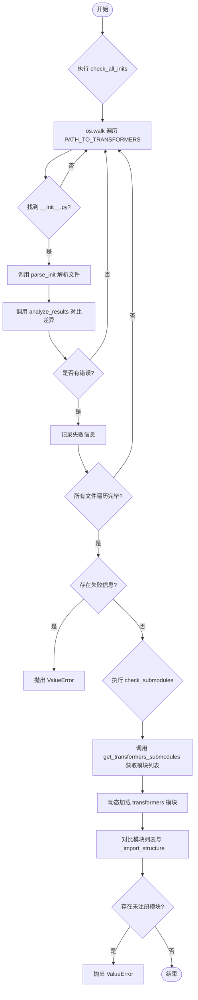
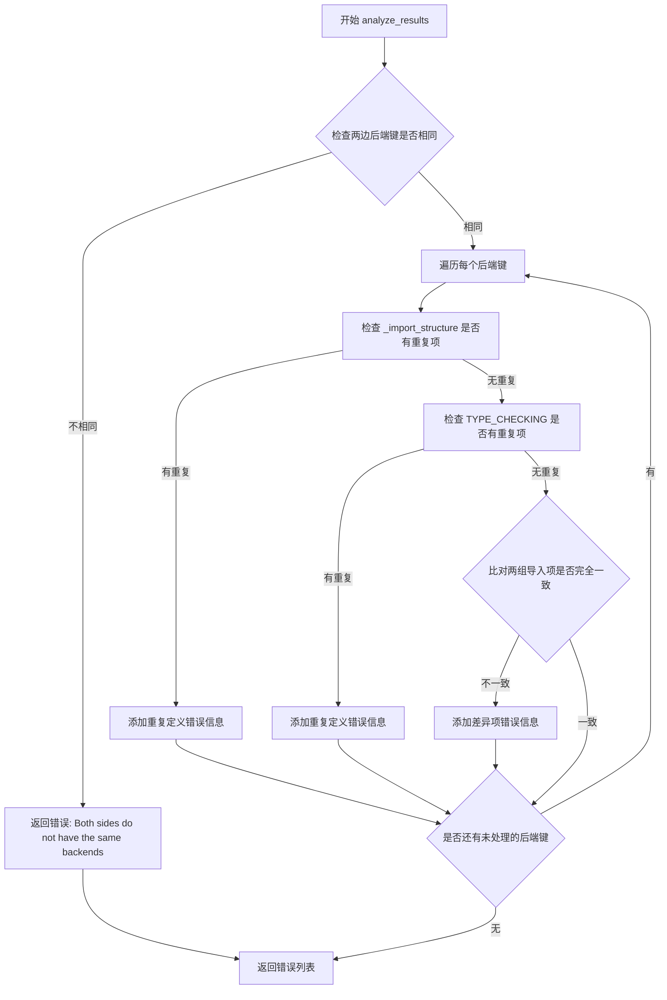
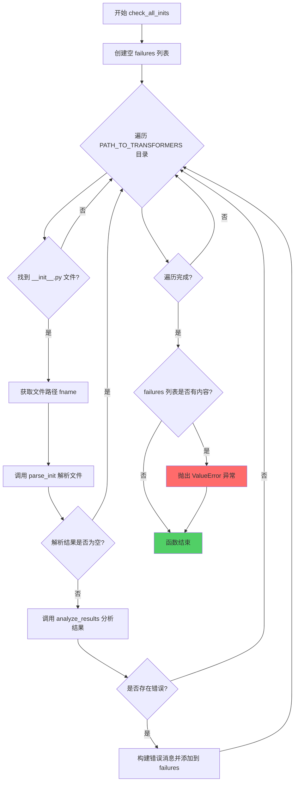
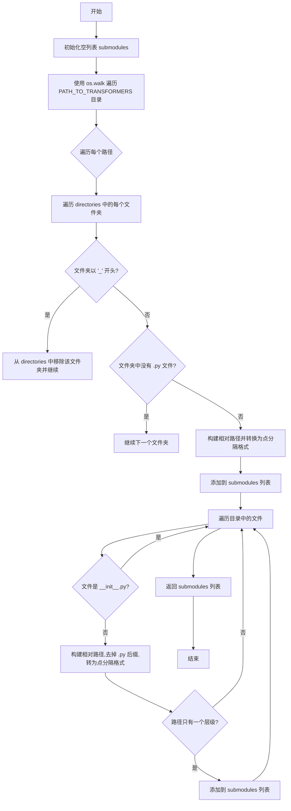
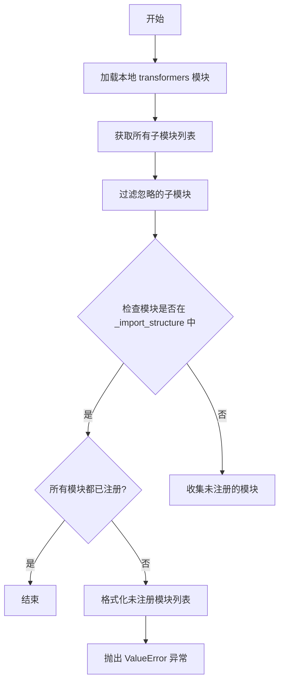

# `diffusers\utils\check_inits.py` 详细设计文档

这是一个代码一致性检查工具，用于扫描 Transformers 项目中的所有 __init__.py 文件，验证运行时导入 (_import_structure) 与静态类型检查 (TYPE_CHECKING) 的一致性，并确保所有子模块都已正确注册在主入口文件中。

## 整体流程



## 类结构

```
check_init.py (脚本根文件)
└── 工具函数集
    ├── find_backend (正则匹配后端)
    ├── parse_init (核心解析逻辑)
    ├── analyze_results (差异分析)
    ├── check_all_inits (目录遍历入口)
    ├── get_transformers_submodules (文件系统扫描)
    └── check_submodules (注册校验)
```

## 全局变量及字段


### `PATH_TO_TRANSFORMERS`
    
项目根路径

类型：`str`
    


### `_re_backend`
    
匹配 is_xxx_available

类型：`re.Pattern`
    


### `_re_one_line_import_struct`
    
匹配单行字典定义

类型：`re.Pattern`
    


### `_re_import_struct_key_value`
    
匹配键值对

类型：`re.Pattern`
    


### `_re_test_backend`
    
匹配条件判断

类型：`re.Pattern`
    


### `_re_import_struct_add_one`
    
匹配 append 单个

类型：`re.Pattern`
    


### `_re_import_struct_add_many`
    
匹配 extend/赋值 多个

类型：`re.Pattern`
    


### `_re_quote_object`
    
匹配引号对象

类型：`re.Pattern`
    


### `_re_between_brackets`
    
匹配括号内对象

类型：`re.Pattern`
    


### `_re_import`
    
匹配 from import 语句

类型：`re.Pattern`
    


### `_re_try`
    
匹配 try 块

类型：`re.Pattern`
    


### `_re_else`
    
匹配 else 块

类型：`re.Pattern`
    


### `IGNORE_SUBMODULES`
    
忽略列表

类型：`list`
    


    

## 全局函数及方法


### `find_backend`

该函数用于从代码行中提取后端名称（如 'torch_and_tf'），通过正则表达式匹配 `if not is_xxx_available()` 模式，并处理多个后端的情况。

参数：

- `line`：`str`，代码行，用于检测后端信息

返回值：`str | None`，返回连接的后端名称（如 "torch_and_tf"），如果没有找到后端测试则返回 None

#### 流程图

```mermaid
flowchart TD
    A[开始] --> B{检查 _re_test_backend.search(line)}
    B -->|是 None| C[返回 None]
    B -->|不是 None| D[使用 _re_backend.findall 提取所有后端]
    D --> E[对后端列表排序]
    E --> F[用 '_and_' 连接后端名称]
    F --> G[返回连接后的字符串]
    C --> H[结束]
    G --> H
```

#### 带注释源码

```python
def find_backend(line):
    """Find one (or multiple) backend in a code line of the init."""
    # 第一步：检查该行是否包含后端测试语句
    # _re_test_backend 用于匹配 "if not is_xxx_available()" 模式
    # 如果没有找到这种模式，说明该行不涉及后端检测，直接返回 None
    if _re_test_backend.search(line) is None:
        return None
    
    # 第二步：从行中提取所有后端名称
    # _re_backend 正则表达式为 r"is\_([a-z_]*)_available()"
    # findall 会返回所有匹配的组，即所有后端名称（如 'torch', 'tf' 等）
    backends = [b[0] for b in _re_backend.findall(line)]
    
    # 第三步：对后端名称进行排序，确保输出顺序一致
    backends.sort()
    
    # 第四步：用 "_and_" 连接多个后端
    # 例如：['tf', 'torch'] -> 'torch_and_tf'
    # 如果只有一个后端，如 ['torch']，则直接返回 'torch'
    return "_and_".join(backends)
```

#### 相关正则表达式

```python
# 用于检测后端测试行的正则表达式
# 匹配形如 "if not is_xxx_available():" 的语句
_re_test_backend = re.compile(r"^\s*if\s+not\s+is\_[a-z_]*\_available\(\)")

# 用于提取后端名称的正则表达式
# 从 "is_xxx_available()" 中提取 "xxx" 部分
_re_backend = re.compile(r"is\_([a-z_]*)_available()")
```

#### 使用示例

```python
# 示例输入行
line1 = "    if not is_torch_available():"
line2 = "    if not is_torch_available() and not is_tf_available():"

# 调用结果
find_backend(line1)   # 返回: 'torch'
find_backend(line2)  # 返回: 'torch_and_tf'
find_backend("some other line")  # 返回: None
```


### `parse_init`

该函数用于解析 Hugging Face Transformers 库的 `__init__.py` 文件，提取 `_import_structure` 字典中定义的导入项和 `TYPE_CHECKING` 块中定义的类型提示项，并按后端（如 PyTorch、TensorFlow 等）进行分类组织。

**参数：**

- `init_file`：`str`，要解析的 `__init__.py` 文件路径

**返回值：**`tuple[dict, dict] | None`，返回一个包含两个字典的元组 `(import_dict_objects, type_hint_objects)`，每个字典的键为后端名称（如 "none" 表示无后端依赖，"pytorch" 表示 PyTorch 后端），值为对应的导入项列表；如果文件不符合预期格式则返回 `None`

#### 流程图

```mermaid
flowchart TD
    A[开始] --> B[打开 init_file 并读取所有行]
    B --> C[查找 '_import_structure = {' 的起始位置]
    C --> D{是否找到起始位置?}
    D -->|否| E[返回 None]
    D -->|是| F[解析无后端的 _import_structure 对象]
    F --> G[解析有后端的 _import_structure 对象]
    G --> H[进入 TYPE_CHECKING 部分]
    H --> I[解析无后端的 TYPE_CHECKING 对象]
    I --> J[解析有后端的 TYPE_CHECKING 对象]
    J --> K[返回 (import_dict_objects, type_hint_objects)]
    E --> L[结束]
    K --> L
```

#### 带注释源码

```python
def parse_init(init_file):
    """
    Read an init_file and parse (per backend) the _import_structure objects defined and the TYPE_CHECKING objects
    defined
    """
    # 打开文件并读取所有行
    with open(init_file, "r", encoding="utf-8", newline="\n") as f:
        lines = f.readlines()

    line_index = 0
    # 定位到 _import_structure 定义开始的位置
    while line_index < len(lines) and not lines[line_index].startswith("_import_structure = {"):
        line_index += 1

    # 如果是传统的 init（没有 _import_structure），直接返回 None
    if line_index >= len(lines):
        return None

    # ---- 第一部分：解析无后端特定的 _import_structure 对象 ----
    objects = []
    # 继续读取直到遇到 TYPE_CHECKING 或后端定义
    while not lines[line_index].startswith("if TYPE_CHECKING") and find_backend(lines[line_index]) is None:
        line = lines[line_index]
        # 处理单行定义的 _import_structure = {...}
        if _re_one_line_import_struct.search(line):
            content = _re_one_line_import_struct.search(line).groups()[0]
            imports = re.findall(r"\[([^\]]+)\]", content)
            for imp in imports:
                objects.extend([obj[1:-1] for obj in imp.split(", ")])
            line_index += 1
            continue
        # 处理单行键值对: "key": ["value1", "value2"]
        single_line_import_search = _re_import_struct_key_value.search(line)
        if single_line_import_search is not None:
            imports = [obj[1:-1] for obj in single_line_import_search.groups()[0].split(", ") if len(obj) > 0]
            objects.extend(imports)
        # 处理缩进的对象:     "MyClass",
        elif line.startswith(" " * 8 + '"'):
            objects.append(line[9:-3])
        line_index += 1

    # 保存无后端的导入对象，键为 "none"
    import_dict_objects = {"none": objects}

    # ---- 第二部分：解析有后端特定的 _import_structure 对象 ----
    # 继续遍历直到 TYPE_CHECKING 部分
    while not lines[line_index].startswith("if TYPE_CHECKING"):
        # 查找后端名称（如 is_torch_available 中的 "torch"）
        backend = find_backend(lines[line_index])
        # 检查是否在 try 块中，如果是则忽略该后端
        if _re_try.search(lines[line_index - 1]) is None:
            backend = None

        if backend is not None:
            line_index += 1

            # 滚动到 else 块（try-except-else 结构）
            while _re_else.search(lines[line_index]) is None:
                line_index += 1

            line_index += 1

            objects = []
            # 读取所有后端相关的导入对象（直到取消缩进）
            while len(lines[line_index]) <= 1 or lines[line_index].startswith(" " * 4):
                line = lines[line_index]
                # 处理 _import_structure["key"].append("value")
                if _re_import_struct_add_one.search(line) is not None:
                    objects.append(_re_import_struct_add_one.search(line).groups()[0])
                # 处理 _import_structure["key"].extend([...]) 或 = [...]
                elif _re_import_struct_add_many.search(line) is not None:
                    imports = _re_import_struct_add_many.search(line).groups()[0].split(", ")
                    imports = [obj[1:-1] for obj in imports if len(obj) > 0]
                    objects.extend(imports)
                # 处理 [obj1, obj2], 形式
                elif _re_between_brackets.search(line) is not None:
                    imports = _re_between_brackets.search(line).groups()[0].split(", ")
                    imports = [obj[1:-1] for obj in imports if len(obj) > 0]
                    objects.extend(imports)
                # 处理 "Object",
                elif _re_quote_object.search(line) is not None:
                    objects.append(_re_quote_object.search(line).groups()[0])
                # 处理缩进的对象
                elif line.startswith(" " * 8 + '"'):
                    objects.append(line[9:-3])
                elif line.startswith(" " * 12 + '"'):
                    objects.append(line[13:-3])
                line_index += 1

            # 按后端名称保存导入对象
            import_dict_objects[backend] = objects
        else:
            line_index += 1

    # ---- 第三部分：解析 TYPE_CHECKING 部分 ----
    # 首先解析无后端的类型提示对象
    objects = []
    while (
        line_index < len(lines)
        and find_backend(lines[line_index]) is None
        and not lines[line_index].startswith("else")
    ):
        line = lines[line_index]
        # 处理 from xxx import yyy 形式
        single_line_import_search = _re_import.search(line)
        if single_line_import_search is not None:
            objects.extend(single_line_import_search.groups()[0].split(", "))
        # 处理缩进的类型提示
        elif line.startswith(" " * 8):
            objects.append(line[8:-2])
        line_index += 1

    # 保存无后端的类型提示对象
    type_hint_objects = {"none": objects}

    # ---- 第四部分：解析有后端特定的 TYPE_CHECKING 对象 ----
    # 继续解析剩余的类型提示（按后端分类）
    while line_index < len(lines):
        # 查找后端名称
        backend = find_backend(lines[line_index])
        # 检查是否在 try 块中
        if _re_try.search(lines[line_index - 1]) is None:
            backend = None

        if backend is not None:
            line_index += 1

            # 滚动到 else 块
            while _re_else.search(lines[line_index]) is None:
                line_index += 1

            line_index += 1

            objects = []
            # 读取后端相关的类型提示对象
            while len(lines[line_index]) <= 1 or lines[line_index].startswith(" " * 8):
                line = lines[line_index]
                single_line_import_search = _re_import.search(line)
                if single_line_import_search is not None:
                    objects.extend(single_line_import_search.groups()[0].split(", "))
                elif line.startswith(" " * 12):
                    objects.append(line[12:-2])
                line_index += 1

            type_hint_objects[backend] = objects
        else:
            line_index += 1

    # 返回两个字典：导入结构和类型提示
    return import_dict_objects, type_hint_objects
```


### `analyze_results`

该函数用于分析并比对 `_import_structure` 对象与 `TYPE_CHECKING` 对象之间的差异，检测两边的后端键是否一致、是否存在重复定义以及导入项是否匹配，并返回错误信息列表。

参数：

- `import_dict_objects`：`dict`，包含从 init 文件解析出的 `_import_structure` 对象，按后端键（如 "none", "torch_backend" 等）组织
- `type_hint_objects`：`dict`，包含从 init 文件解析出的 `TYPE_CHECKING` 对象，按后端键组织

返回值：`list[str]`，返回错误信息列表，若两边定义一致则返回空列表

#### 流程图



#### 带注释源码

```python
def analyze_results(import_dict_objects, type_hint_objects):
    """
    分析 init 文件中 _import_structure 对象与 TYPE_CHECKING 对象之间的差异
    """
    # 内部函数：查找列表中的重复项
    def find_duplicates(seq):
        # 使用 Counter 统计每个元素出现次数，返回出现次数大于1的元素列表
        return [k for k, v in collections.Counter(seq).items() if v > 1]

    # 步骤1：检查两边后端键是否完全一致
    if list(import_dict_objects.keys()) != list(type_hint_objects.keys()):
        # 键不一致，返回错误信息
        return ["Both sides of the init do not have the same backends!"]

    errors = []  # 初始化错误列表
    # 步骤2：遍历每个后端键进行详细比对
    for key in import_dict_objects.keys():
        # 检查 _import_structure 中是否存在重复定义
        duplicate_imports = find_duplicates(import_dict_objects[key])
        if duplicate_imports:
            # 存在重复则记录错误
            errors.append(f"Duplicate _import_structure definitions for: {duplicate_imports}")
        
        # 检查 TYPE_CHECKING 中是否存在重复定义
        duplicate_type_hints = find_duplicates(type_hint_objects[key])
        if duplicate_type_hints:
            # 存在重复则记录错误
            errors.append(f"Duplicate TYPE_CHECKING objects for: {duplicate_type_hints}")

        # 步骤3：将两组列表转为集合比较，检查是否有差异
        if sorted(set(import_dict_objects[key])) != sorted(set(type_hint_objects[key])):
            # 区分 "none"（无后端）和具体后端名称
            name = "base imports" if key == "none" else f"{key} backend"
            errors.append(f"Differences for {name}:")
            
            # 找出在 TYPE_HINT 但不在 _import_structure 中的项
            for a in type_hint_objects[key]:
                if a not in import_dict_objects[key]:
                    errors.append(f"  {a} in TYPE_HINT but not in _import_structure.")
            
            # 找出在 _import_structure 但不在 TYPE_HINT 中的项
            for a in import_dict_objects[key]:
                if a not in type_hint_objects[key]:
                    errors.append(f"  {a} in _import_structure but not in TYPE_HINT.")
    
    # 返回完整的错误列表（可能为空）
    return errors
```


### `check_all_inits`

该函数是 transformers 仓库的初始化检查工具，遍历所有 `__init__.py` 文件并验证每个文件中的 `_import_structure` 和 `TYPE_CHECKING` 部分定义的对象是否一致，若存在不一致则收集所有错误信息并抛出 `ValueError` 异常。

参数： 无

返回值：`None`，无返回值（若检查失败则抛出 `ValueError` 异常）

#### 流程图



#### 带注释源码

```python
def check_all_inits():
    """
    Check all inits in the transformers repo and raise an error if at least one does not define the same objects in
    both halves.
    """
    # 初始化一个列表用于收集所有检查失败的信息
    failures = []
    
    # 使用 os.walk 遍历 PATH_TO_TRANSFORMERS 目录下的所有文件和子目录
    for root, _, files in os.walk(PATH_TO_TRANSFORMERS):
        # 检查当前目录是否包含 __init__.py 文件
        if "__init__.py" in files:
            # 构造 __init__.py 文件的完整路径
            fname = os.path.join(root, "__init__.py")
            
            # 调用 parse_init 函数解析该 init 文件
            # 返回 (import_dict_objects, type_hint_objects) 元组或 None
            objects = parse_init(fname)
            
            # 如果解析结果不为 None（表示这是一个传统的 init 文件而非空文件）
            if objects is not None:
                # 调用 analyze_results 分析两个部分的对象是否一致
                errors = analyze_results(*objects)
                
                # 如果分析结果中存在错误
                if len(errors) > 0:
                    # 在第一个错误消息前添加文件路径信息
                    errors[0] = f"Problem in {fname}, both halves do not define the same objects.\n{errors[0]}"
                    # 将所有错误信息合并并添加到 failures 列表
                    failures.append("\n".join(errors))
    
    # 检查是否有任何失败项
    if len(failures) > 0:
        # 将所有失败信息用双换行符连接并抛出 ValueError 异常
        raise ValueError("\n\n".join(failures))
```


### `get_transformers_submodules`

该函数通过遍历 `PATH_TO_TRANSFORMERS` 目录（即 `src/transformers`），扫描文件系统获取所有子模块的路径，并以点分隔的字符串形式返回子模块列表，同时忽略私有模块（以 `_` 开头）和空文件夹。

参数：无

返回值：`list[str]`，返回 Transformers 项目的所有子模块路径列表，每个路径使用点分隔符（例如 `"models.bert"`）。

#### 流程图



#### 带注释源码

```python
def get_transformers_submodules():
    """
    Returns the list of Transformers submodules.
    """
    # 初始化用于存储子模块路径的列表
    submodules = []
    
    # 使用 os.walk 遍历 PATH_TO_TRANSFORMERS 目录 (即 "src/transformers")
    for path, directories, files in os.walk(PATH_TO_TRANSFORMERS):
        # 遍历当前路径下的所有文件夹
        for folder in directories:
            # 忽略私有模块（以 "_" 开头的文件夹）
            if folder.startswith("_"):
                directories.remove(folder)  # 从遍历列表中移除，避免深入搜索
                continue
            
            # 忽略空文件夹（没有 .py 文件的文件夹，排除分支遗留的空目录）
            if len(list((Path(path) / folder).glob("*.py"))) == 0:
                continue
            
            # 计算相对于 PATH_TO_TRANSFORMERS 的路径
            short_path = str((Path(path) / folder).relative_to(PATH_TO_TRANSFORMERS))
            
            # 将路径分隔符替换为点，构建子模块名称（如 "models.bert"）
            submodule = short_path.replace(os.path.sep, ".")
            submodules.append(submodule)
        
        # 遍历当前路径下的所有文件
        for fname in files:
            # 跳过 __init__.py 文件
            if fname == "__init__.py":
                continue
            
            # 计算相对路径并去掉 .py 后缀
            short_path = str((Path(path) / fname).relative_to(PATH_TO_TRANSFORMERS))
            submodule = short_path.replace(".py", "").replace(os.path.sep, ".")
            
            # 只添加顶层模块（路径只有一个层级，例如 "utils"）
            if len(submodule.split(".")) == 1:
                submodules.append(submodule)
    
    # 返回所有子模块的列表
    return submodules
```


### `check_submodules`

该函数用于验证 Transformers 库的所有子模块是否已在主 `__init__.py` 文件的 `_import_structure` 字典中正确注册，确保模块可被正确导入。

参数：
- 无

返回值：`None`，无返回值

#### 流程图



#### 带注释源码

```python
def check_submodules():
    # 加载本地 transformers 模块
    # 使用 importlib.util.spec_from_file_location 从文件加载模块
    # 并指定 submodule_search_locations 以便正确解析子模块
    spec = importlib.util.spec_from_file_location(
        "transformers",
        os.path.join(PATH_TO_TRANSFORMERS, "__init__.py"),
        submodule_search_locations=[PATH_TO_TRANSFORMERS],
    )
    transformers = spec.loader.load_module()

    # 筛选出未在 _import_structure 中注册的子模块
    # 排除 IGNORE_SUBMODULES 中定义的子模块
    module_not_registered = [
        module
        for module in get_transformers_submodules()
        if module not in IGNORE_SUBMODULES and module not in transformers._import_structure.keys()
    ]
    
    # 如果存在未注册的子模块，抛出详细的错误信息
    if len(module_not_registered) > 0:
        list_of_modules = "\n".join(f"- {module}" for module in module_not_registered)
        raise ValueError(
            "The following submodules are not properly registered in the main init of Transformers:\n"
            f"{list_of_modules}\n"
            "Make sure they appear somewhere in the keys of `_import_structure` with an empty list as value."
        )
```

## 关键组件


### 正则表达式模式集合

用于匹配`__init__.py`文件中各种导入语句的正则表达式，包括后端检测、单行结构、键值对、添加操作、引号对象、括号内容、import语句、try/else块等。

### find_backend 函数

识别代码行中的后端名称，通过正则表达式匹配`is_xxx_available()`模式，返回后端名称或None。

### parse_init 函数

解析`__init__.py`文件，提取`_import_structure`和`TYPE_CHECKING`部分中定义的对象，按后端分组返回包含导入字典对象和类型提示对象的元组。

### analyze_results 函数

分析`_import_structure`和`TYPE_CHECKING`对象之间的差异，检测重复定义和不匹配项，返回错误信息列表。

### check_all_inits 函数

遍历Transformers仓库中所有`__init__.py`文件，调用parse_init和analyze_results检查导入一致性，若有问题则抛出ValueError。

### get_transformers_submodules 函数

遍历PATH_TO_TRANSFORMERS目录，返回所有子模块名称列表，自动忽略私有模块和空文件夹。

### check_submodules 函数

验证所有子模块是否已在主init的_import_structure中正确注册，确保每个子模块都有对应的键。

### PATH_TO_TRANSFORMERS 全局变量

定义Transformers源代码目录路径，默认为"src/transformers"。

### IGNORE_SUBMODULES 全局变量

列出需要忽略的子模块名称列表，如"convert_pytorch_checkpoint_to_tf2"和"modeling_flax_pytorch_utils"。


## 问题及建议


### 已知问题

- **硬编码路径问题**：`PATH_TO_TRANSFORMERS = "src/transformers"` 是硬编码的，缺少从配置文件、环境变量或命令行参数获取路径的机制，降低了代码的灵活性和可测试性。
- **缺少类型注解**：整个代码未使用 Python 类型提示（Type Hints），函数参数和返回值均无类型声明，不利于静态分析工具和 IDE 的支持，降低了代码的可维护性和可读性。
- **正则表达式过度复杂**：使用大量复杂的正则表达式（如 `_re_import_struct_add_many`、`_re_between_brackets` 等）来解析代码，部分逻辑难以理解和维护，容易产生边界情况 bug。
- **重复代码模式**：在 `parse_init` 函数中，处理 `_import_structure` 和 `TYPE_CHECKING` 部分的逻辑高度相似，存在代码重复，可以抽象为通用函数。
- **异常处理不足**：
  - 打开文件时未检查文件是否存在或权限问题
  - `spec.loader.load_module()` 调用失败时缺少具体错误处理
  - 正则匹配失败时缺乏适当的错误提示
- **全局状态依赖**：大量使用全局变量和模块级常量（如正则表达式、路径变量），降低了函数的可测试性和可复用性。
- **未使用的正则表达式**：定义了 `_re_import`、`_re_try`、`_re_else` 等正则，但在代码中实际使用较少或未完全利用。
- **字符串魔数**：代码中存在大量魔数（如 `line[9:-3]`、`line[13:-3]`、`line[12:-2]`），缺乏注释说明其含义，可读性差。
- **忽略子模块硬编码**：`IGNORE_SUBMODULES` 列表是硬编码的，新增需要忽略的模块时需要修改源代码，不够灵活。
- **目录遍历效率**：使用 `os.walk` 遍历整个 `PATH_TO_TRANSFORMERS` 目录，对于大型仓库可能效率不高，且未利用缓存机制。

### 优化建议

- **添加类型注解**：为所有函数参数和返回值添加类型注解，如 `def parse_init(init_file: str) -> Optional[Tuple[Dict, Dict]]:`，提高代码可维护性。
- **配置化管理路径**：将 `PATH_TO_TRANSFORMERS` 和 `IGNORE_SUBMODULES` 改为从配置文件或环境变量读取，支持参数化配置。
- **提取公共逻辑**：将 `parse_init` 函数中处理 import 对象的逻辑抽取为独立的辅助函数，减少重复代码。
- **增强错误处理**：
  - 添加文件存在性检查
  - 为关键操作添加 try-except 块并记录具体错误信息
  - 使用自定义异常类区分不同类型的错误
- **添加日志记录**：使用 `logging` 模块替代当前的 print/raise 方式，便于生产环境调试。
- **魔数提取为常量**：将字符串切片中的索引数字提取为有意义的常量或使用更清晰的字符串操作方法。
- **优化正则使用**：审查并移除未使用的正则表达式，或将复杂正则封装为独立的解析类。
- **添加单元测试**：为关键函数（如 `find_backend`、`parse_init`、`analyze_results`）添加单元测试，确保边界情况正确处理。
- **考虑性能优化**：
  - 缓存已解析的 init 文件结果
  - 使用 `pathlib.Path.rglob()` 替代 `os.walk`
  - 批量处理文件时使用多进程或异步 IO

## 其它


### 设计目标与约束

**设计目标**：自动检查HuggingFace Transformers仓库中所有__init__.py文件的_import_structure与TYPE_CHECKING定义的一致性，确保子模块正确注册，验证导入结构的完整性和正确性。

**约束条件**：
- 仅支持Python 3.x环境
- 依赖标准库（re、os、pathlib、collections、importlib.util）
- 需要访问src/transformers目录
- 假设__init__.py文件遵循特定的格式规范（_import_structure和TYPE_CHECKING块）

### 错误处理与异常设计

**异常类型**：
- `ValueError`：当检测到不一致时抛出，包含详细的错误信息
- `FileNotFoundError`：当指定的init文件不存在时由open()抛出
- `UnicodeDecodeError`：当文件编码不是UTF-8时可能抛出

**错误传播机制**：
- 收集所有失败项到failures列表，统一在最后抛出
- 错误信息格式：文件路径 + 错误类型 + 具体差异列表
- 使用字符串拼接构建多行错误报告

### 数据流与状态机

**主流程状态机**：
1. START → 遍历文件系统
2. PARSING → 解析单个__init__.py
3. ANALYZING → 比较_import_structure与TYPE_CHECKING
4. COLLECTING_ERRORS → 收集错误
5. END → 汇总结果或抛出异常

**解析器内部状态**：
- 阶段1：定位_import_structure开始位置
- 阶段2：解析无backend的导入对象
- 阶段3：解析有backend的导入对象
- 阶段4：解析TYPE_CHECKING部分（无backend）
- 阶段5：解析TYPE_CHECKING部分（有backend）

### 外部依赖与接口契约

**外部依赖**：
- `os`：文件系统遍历
- `re`：正则表达式匹配
- `pathlib.Path`：路径操作
- `collections.Counter`：重复检测
- `importlib.util`：动态模块加载

**接口契约**：
- `parse_init(init_file)`：接收文件路径，返回(import_dict_objects, type_hint_objects)元组或None
- `analyze_results(import_dict_objects, type_hint_objects)`：返回错误列表
- `find_backend(line)`：返回backend字符串或None
- `get_transformers_submodules()`：返回子模块列表
- `check_submodules()`：无返回值，失败时抛出ValueError

### 性能考虑

**时间复杂度**：
- O(n × m)：n为文件数，m为平均文件行数
- 正则表达式匹配在每行上执行多次

**空间复杂度**：
- O(k)：k为所有导入对象的总数量
- import_dict_objects和type_hint_objects存储所有解析结果

**优化建议**：
- 预编译的正则表达式已优化
- 可考虑增量检查而非全量扫描
- 可添加缓存机制避免重复解析

### 安全性考虑

**输入验证**：
- PATH_TO_TRANSFORMERS路径未做安全检查
- 文件读取未设置大小限制
- 正则表达式存在ReDoS风险（复杂模式）

**防护措施**：
- 使用encoding="utf-8"明确编码
- 使用newline="\n"规范化换行符
- 依赖Python标准库的安全特性

### 可维护性与扩展性

**扩展点**：
- 添加新的backend支持：修改find_backend()函数
- 添加新的导入格式：添加新的正则表达式
- 添加新的检查规则：在analyze_results()中添加逻辑

**代码组织**：
- 全局变量与函数混合，未使用类封装
- 正则表达式分散在模块顶部
- 魔法字符串（如"src/transformers"）应提取为配置

### 测试策略

**测试覆盖建议**：
- 单元测试：各正则表达式匹配规则
- 集成测试：完整的check_all_inits()流程
- 边界测试：空文件、格式异常文件、特殊编码文件

**测试数据需求**：
- 标准格式的__init__.py
- 缺少_import_structure的文件
- TYPE_CHECKING与_import_structure不一致的文件
- 包含条件导入的文件
- 多backend组合的文件

### 版本兼容性

**Python版本要求**：
- 依赖re、os、pathlib等标准库，无版本特定需求
- 建议Python 3.6+

**外部库依赖**：
- 无第三方依赖
- transformers库作为被测对象

### 日志与监控

**当前实现**：
- 无日志记录功能
- 错误信息通过异常传播

**改进建议**：
- 添加--verbose选项控制输出
- 记录检查统计信息（文件数、错误数）
- 支持JSON格式输出便于集成

### 配置管理

**硬编码配置**：
- PATH_TO_TRANSFORMERS = "src/transformers"
- IGNORE_SUBMODULES列表

**可配置化建议**：
- 路径通过命令行参数或环境变量指定
- 忽略列表可通过配置文件扩展
- 支持自定义检查规则

    