# `diffusers\utils\check_repo.py` 详细设计文档

这是diffusers库的代码质量检查脚本，用于验证所有模型是否正确导出、测试、文档化并在自动配置类中注册，确保代码库的完整性和一致性。

## 整体流程

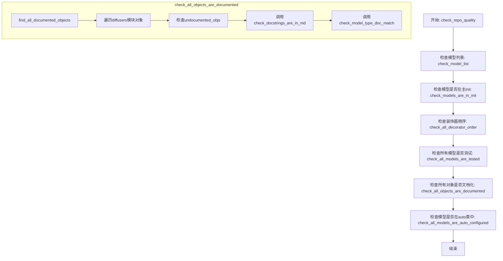

## 类结构

```
脚本文件 (无类)
├── 全局配置常量
│   ├── PATH_TO_DIFFUSERS
│   ├── PATH_TO_TESTS
│   ├── PATH_TO_DOC
│   ├── PRIVATE_MODELS
│   ├── IGNORE_NON_TESTED
│   ├── TEST_FILES_WITH_NO_COMMON_TESTS
│   ├── IGNORE_NON_AUTO_CONFIGURED
│   ├── MODEL_TYPE_TO_DOC_MAPPING
│   ├── DEPRECATED_OBJECTS
│   ├── UNDOCUMENTED_OBJECTS
│   └── SHOULD_HAVE_THEIR_OWN_PAGE
├── 核心检查函数
│   ├── check_model_list
│   ├── get_model_modules
│   ├── get_models
│   ├── is_a_private_model
│   ├── check_models_are_in_init
│   ├── get_model_test_files
│   ├── find_tested_models
│   ├── check_models_are_tested
│   ├── check_all_models_are_tested
│   ├── get_all_auto_configured_models
│   ├── ignore_unautoclassed
│   ├── check_models_are_auto_configured
│   ├── check_all_models_are_auto_configured
│   ├── check_decorator_order
│   ├── check_all_decorator_order
│   ├── find_all_documented_objects
│   ├── ignore_undocumented
│   ├── check_all_objects_are_documented
│   ├── check_model_type_doc_match
│   ├── is_rst_docstring
│   ├── check_docstrings_are_in_md
│   └── check_repo_quality
└── 模块加载
    └── diffusers模块动态加载
```

## 全局变量及字段


### `PATH_TO_DIFFUSERS`
    
指向diffusers库源代码主目录的路径字符串

类型：`str`
    


### `PATH_TO_TESTS`
    
指向测试目录的路径字符串

类型：`str`
    


### `PATH_TO_DOC`
    
指向文档源文件目录的路径字符串

类型：`str`
    


### `PRIVATE_MODELS`
    
私有模型名称列表，这些模型不应在主init中公开

类型：`list[str]`
    


### `IGNORE_NON_TESTED`
    
未测试模型名称列表，包含私有模型和作为大型模型组成部分的子模型

类型：`list[str]`
    


### `TEST_FILES_WITH_NO_COMMON_TESTS`
    
缺少公共测试的测试文件路径列表，用于跳过all_model_classes检查

类型：`list[str]`
    


### `IGNORE_NON_AUTO_CONFIGURED`
    
未在自动配置映射中注册的模型名称列表，包含私有模型和特殊模型

类型：`list[str]`
    


### `MODEL_TYPE_TO_DOC_MAPPING`
    
模型类型到文档名的有序映射字典，用于处理同一文档对应多个模型类型的情况

类型：`OrderedDict[str, str]`
    


### `spec`
    
importlib模块规格对象，用于动态加载diffusers模块

类型：`ModuleSpec`
    


### `diffusers`
    
动态加载的diffusers库模块对象，包含所有公共API

类型：`ModuleType`
    


### `_re_decorator`
    
用于匹配Python装饰器的正则表达式模式

类型：`re.Pattern`
    


### `_re_rst_special_words`
    
用于匹配RST文档中特殊词(:obj:、:class:、:func:、:meth:)的正则表达式模式

类型：`re.Pattern`
    


### `_re_double_backquotes`
    
用于匹配双反引号内容的正则表达式模式

类型：`re.Pattern`
    


### `_re_rst_example`
    
用于匹配RST文档中示例引入行的正则表达式模式

类型：`re.Pattern`
    


### `DEPRECATED_OBJECTS`
    
已弃用对象名称列表，这些对象不应出现在文档中

类型：`list[str]`
    


### `UNDOCUMENTED_OBJECTS`
    
不应被文档化的对象名称列表，包括内部使用或外部模块

类型：`list[str]`
    


### `SHOULD_HAVE_THEIR_OWN_PAGE`
    
应拥有独立文档页面的对象名称列表，如基准测试类

类型：`list[str]`
    


    

## 全局函数及方法


### `check_model_list`

该函数用于验证 diffusers 库中的模型列表完整性，确保 `src/diffusers/models/` 目录下的每个模型子目录都已在 `diffusers.models` 模块中正确导出，若存在缺失则抛出异常。

参数：无

返回值：无返回值（若检测到缺失模型则抛出 `Exception`）

#### 流程图

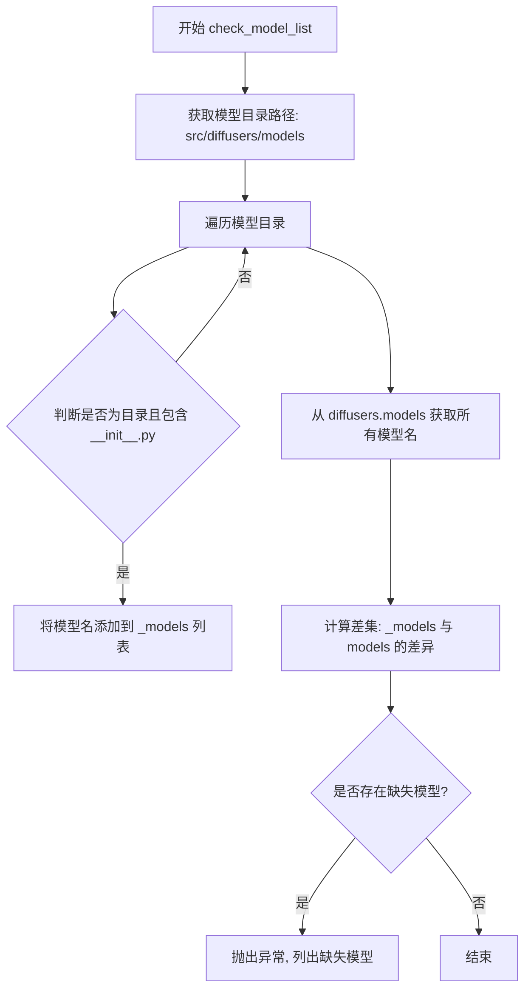

#### 带注释源码

```python
def check_model_list():
    """Check the model list inside the transformers library."""
    # 获取 diffusers 库中模型目录的路径
    # PATH_TO_DIFFUSERS = "src/diffusers"
    models_dir = os.path.join(PATH_TO_DIFFUSERS, "models")
    
    # 存储从文件系统目录结构中发现的模型
    _models = []
    
    # 遍历 models 目录下的所有条目
    for model in os.listdir(models_dir):
        # 拼接完整的模型目录路径
        model_dir = os.path.join(models_dir, model)
        
        # 检查该路径是否为目录且包含 __init__.py 文件
        # 只有包含 __init__.py 的子目录才是有效的模型模块
        if os.path.isdir(model_dir) and "__init__.py" in os.listdir(model_dir):
            _models.append(model)

    # 从 diffusers.models 模块获取所有导出的模型
    # 排除所有以双下划线开头的魔法属性/方法
    models = [model for model in dir(diffusers.models) if not model.startswith("__")]

    # 计算文件系统中有但模块中未导出的模型列表
    # 使用集合差集找出缺失的模型
    missing_models = sorted(set(_models).difference(models))
    
    # 如果存在缺失模型,抛出异常提示需要添加到 __init__.py
    if missing_models:
        raise Exception(
            f"The following models should be included in {models_dir}/__init__.py: {','.join(missing_models)}."
        )
```


### `get_model_modules`

获取diffusers库中所有符合条件建模模块的函数，遍历模型子目录并过滤掉特定的工具类和自动映射模块，返回包含所有建模模块的列表。

参数：
- 无参数

返回值：`List[module]`，返回从diffusers.models模块中获取的所有建模子模块列表，每个元素都是一个Python模块对象

#### 流程图

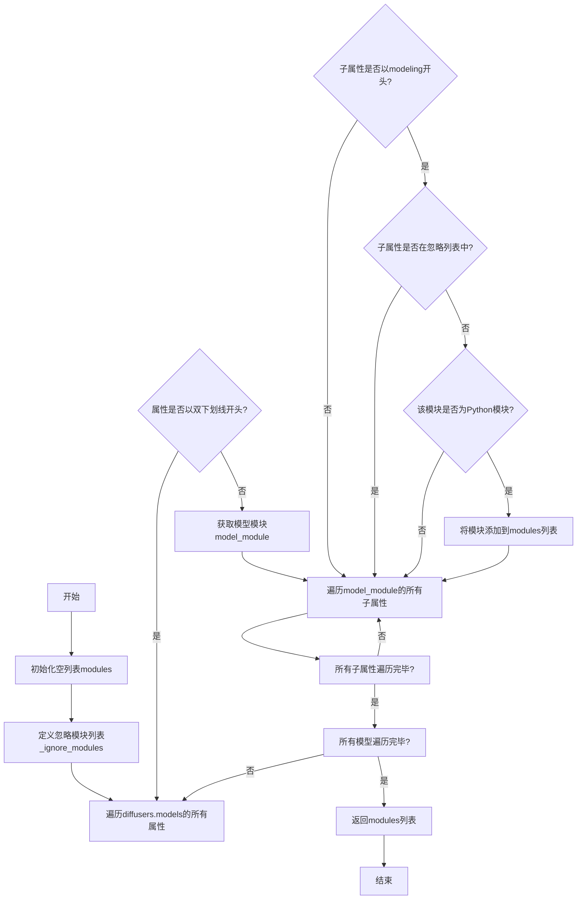

#### 带注释源码

```python
def get_model_modules():
    """Get the model modules inside the transformers library."""
    # 定义需要忽略的模块列表，这些模块是自动映射、工具类或输出类而非具体模型
    _ignore_modules = [
        "modeling_auto",                    # PyTorch自动映射模块
        "modeling_encoder_decoder",         # 编码器-解码器基类
        "modeling_marian",                  # Marian模型基类
        "modeling_mmbt",                    # MMBT多模态基类
        "modeling_outputs",                 # 输出数据结构
        "modeling_retribert",               # RetriBert基类
        "modeling_utils",                   # PyTorch工具类
        "modeling_flax_auto",               # Flax自动映射模块
        "modeling_flax_encoder_decoder",    # Flax编码器-解码器基类
        "modeling_flax_utils",              # Flax工具类
        "modeling_speech_encoder_decoder",  # 语音编码器-解码器基类
        "modeling_flax_speech_encoder_decoder",  # Flax语音编码器-解码器基类
        "modeling_flax_vision_encoder_decoder",  # Flax视觉编码器-解码器基类
        "modeling_transfo_xl_utilities",    # Transformer-XL工具类
        "modeling_tf_auto",                 # TensorFlow自动映射模块
        "modeling_tf_encoder_decoder",     # TensorFlow编码器-解码器基类
        "modeling_tf_outputs",              # TensorFlow输出数据结构
        "modeling_tf_pytorch_utils",        # TensorFlow-PyTorch转换工具
        "modeling_tf_utils",                # TensorFlow工具类
        "modeling_tf_transfo_xl_utilities", # TensorFlow Transformer-XL工具类
        "modeling_tf_vision_encoder_decoder",  # TensorFlow视觉编码器-解码器基类
        "modeling_vision_encoder_decoder", # 视觉编码器-解码器基类
    ]
    # 初始化结果列表
    modules = []
    # 遍历diffusers.models下的所有模型目录
    for model in dir(diffusers.models):
        # 过滤掉双下划线开头的魔法属性（如__init__, __path__等）
        if not model.startswith("__"):
            # 获取具体的模型子模块（如diffusers.models.bert）
            model_module = getattr(diffusers.models, model)
            # 遍历该模型下的所有子模块
            for submodule in dir(model_module):
                # 筛选以modeling开头的子模块
                if submodule.startswith("modeling") and submodule not in _ignore_modules:
                    # 获取建模模块对象
                    modeling_module = getattr(model_module, submodule)
                    # 确认是Python模块类型（而非类、函数等）
                    if inspect.ismodule(modeling_module):
                        modules.append(modeling_module)
    # 返回所有符合条件的建模模块列表
    return modules
```


### `get_models`

获取指定模块中的模型类对象。

参数：

- `module`：`module`，要搜索模型的模块对象
- `include_pretrained`：`bool`，是否包含预训练模型类，默认为 `False`

返回值：`list`，包含模型类名称和类对象的元组列表 `[(attr_name, attr), ...]`

#### 流程图

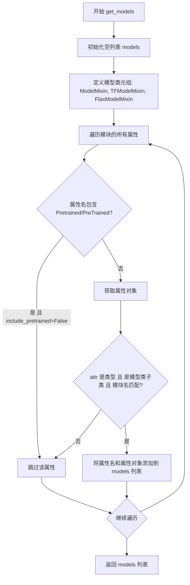

#### 带注释源码

```python
def get_models(module, include_pretrained=False):
    """Get the objects in module that are models."""
    # 初始化结果列表，用于存储找到的模型类
    models = []
    
    # 定义模型类的基类元组，用于判断属性是否为模型类
    # 包含 PyTorch、TensorFlow 和 Flax 三种框架的模型混入类
    model_classes = (diffusers.ModelMixin, diffusers.TFModelMixin, diffusers.FlaxModelMixin)
    
    # 遍历模块中的所有属性
    for attr_name in dir(module):
        # 如果不包含预训练模型且属性名包含 Pretrained 或 PreTrained，则跳过
        if not include_pretrained and ("Pretrained" in attr_name or "PreTrained" in attr_name):
            continue
        
        # 获取属性对象
        attr = getattr(module, attr_name)
        
        # 判断属性是否为模型类：
        # 1. attr 是类型对象
        # 2. attr 是 model_classes 的子类
        # 3. 属性定义在当前模块中（模块名匹配）
        if isinstance(attr, type) and issubclass(attr, model_classes) and attr.__module__ == module.__name__:
            # 将模型类名称和类对象添加到结果列表
            models.append((attr_name, attr))
    
    # 返回找到的模型类列表
    return models
```


### `is_a_private_model`

判断给定模型名称是否为私有模型（不应在主 `__init__` 中公开）。

参数：

- `model`：`str`，待检查的模型类名称

返回值：`bool`，如果模型是私有模型返回 `True`，否则返回 `False`

#### 流程图

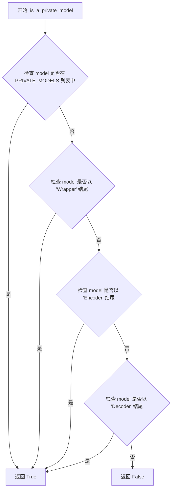

#### 带注释源码

```python
def is_a_private_model(model):
    """Returns True if the model should not be in the main init."""
    # 首先检查模型是否在 PRIVATE_MODELS 显式列表中
    if model in PRIVATE_MODELS:
        return True

    # Wrapper、Encoder 和 Decoder 类型的模型默认都是私有的
    # 检查模型名是否以 "Wrapper" 结尾
    if model.endswith("Wrapper"):
        return True
    # 检查模型名是否以 "Encoder" 结尾
    if model.endswith("Encoder"):
        return True
    # 检查模型名是否以 "Decoder" 结尾
    if model.endswith("Decoder"):
        return True
    
    # 以上条件都不满足，返回 False，表示该模型是公开的
    return False
```


### `check_models_are_in_init`

该函数用于检查 diffusers 库中定义的所有模型是否都存在于主 `__init__.py` 中。如果有模型未在主初始化中导出，该函数会抛出异常并列出缺失的模型。

参数：无

返回值：无返回值（若检查失败则抛出 `Exception`）

#### 流程图

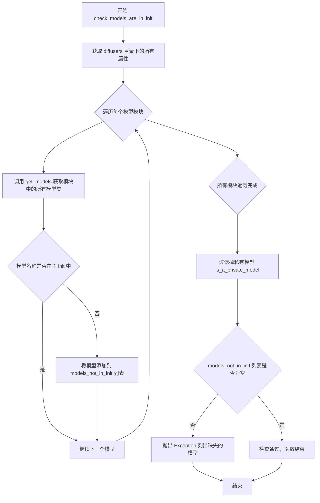

#### 带注释源码

```
def check_models_are_in_init():
    """Checks all models defined in the library are in the main init."""
    # 初始化空列表，用于存储不在主 init 中的模型
    models_not_in_init = []
    
    # 获取 diffusers 主模块的所有属性名称
    dir_transformers = dir(diffusers)
    
    # 遍历所有模型模块
    for module in get_model_modules():
        # 从当前模块中获取所有模型类（包括预训练模型）
        # 筛选出不在主 init 中的模型
        models_not_in_init += [
            model[0] for model in get_models(module, include_pretrained=True) 
            if model[0] not in dir_transformers
        ]

    # 移除私有模型（以 Wrapper、Encoder、Decoder 结尾的模型）
    models_not_in_init = [
        model for model in models_not_in_init 
        if not is_a_private_model(model)
    ]
    
    # 如果有未在主 init 中导出的模型，抛出异常
    if len(models_not_in_init) > 0:
        raise Exception(f"The following models should be in the main init: {','.join(models_not_in_init)}.")
```


### `get_model_test_files`

获取模型测试文件列表，返回不包含 `tests` 目录前缀的相对路径，用于定位 `tests` 目录下的所有模型测试文件。

参数： 无

返回值：`List[str]`，返回模型测试文件的相对路径列表（相对于 `tests` 目录）

#### 流程图

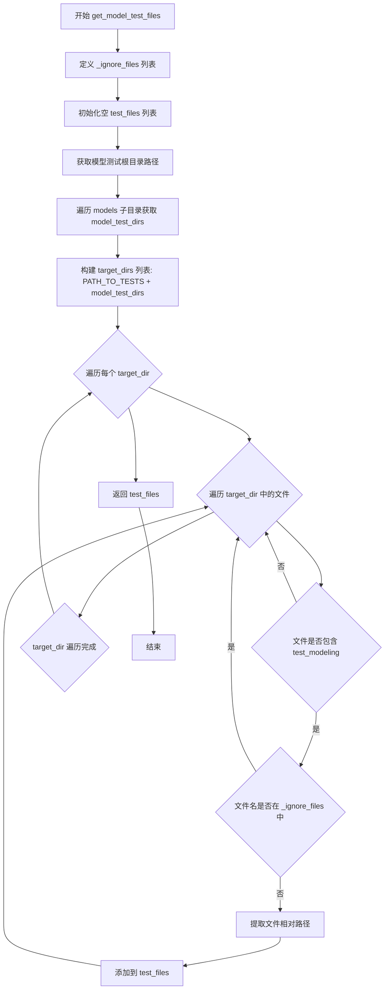

#### 带注释源码

```python
def get_model_test_files():
    """Get the model test files.

    The returned files should NOT contain the `tests` (i.e. `PATH_TO_TESTS` defined in this script). They will be
    considered as paths relative to `tests`. A caller has to use `os.path.join(PATH_TO_TESTS, ...)` to access the files.
    """
    # 定义需要忽略的测试文件名列表，这些是通用测试文件而非具体模型测试
    _ignore_files = [
        "test_modeling_common",              # PyTorch 通用模型测试
        "test_modeling_encoder_decoder",     # Encoder-Decoder 架构测试
        "test_modeling_flax_encoder_decoder",# Flax Encoder-Decoder 测试
        "test_modeling_flax_speech_encoder_decoder", # Flax 语音编码器-解码器测试
        "test_modeling_marian",              # Marian 机器翻译模型测试
        "test_modeling_tf_common",           # TensorFlow 通用模型测试
        "test_modeling_tf_encoder_decoder", # TensorFlow Encoder-Decoder 测试
    ]
    
    # 初始化结果列表
    test_files = []
    
    # 获取 tests/models 目录路径，用于扫描各模型的测试目录
    model_test_root = os.path.join(PATH_TO_TESTS, "models")
    model_test_dirs = []
    
    # 遍历 models 目录下的所有子目录（每个模型一个目录）
    for x in os.listdir(model_test_root):
        x = os.path.join(model_test_root, x)
        if os.path.isdir(x):
            model_test_dirs.append(x)

    # 合并根测试目录和模型子目录，统一遍历
    for target_dir in [PATH_TO_TESTS] + model_test_dirs:
        # 遍历目标目录中的所有文件和子目录
        for file_or_dir in os.listdir(target_dir):
            path = os.path.join(target_dir, file_or_dir)
            
            # 仅处理文件（排除目录）
            if os.path.isfile(path):
                filename = os.path.split(path)[-1]  # 获取文件名
                
                # 检查文件名是否包含 test_modeling 且不在忽略列表中
                if "test_modeling" in filename and os.path.splitext(filename)[0] not in _ignore_files:
                    # 提取相对路径（去掉 tests/ 前缀）
                    file = os.path.join(*path.split(os.sep)[1:])
                    test_files.append(file)

    return test_files
```


### `find_tested_models`

解析测试文件内容，检测 `all_model_classes` 变量中定义的模型类列表，用于验证模型是否被正确测试。

参数：

- `test_file`：`str`，测试文件的相对路径（相对于 `PATH_TO_TESTS` 目录），用于定位要解析的测试文件。

返回值：`List[str] | None`，返回测试文件中所有被测试的模型名称列表；如果未找到 `all_model_classes` 定义则返回 `None`。

#### 流程图

```mermaid
flowchart TD
    A[开始: find_tested_models] --> B[打开测试文件]
    B --> C[读取文件内容]
    C --> D[使用正则匹配 all_model_classes = ((...))]
    D --> E{是否匹配到?}
    E -->|是| F[遍历每个匹配条目]
    E -->|否| G[返回 None]
    F --> H[按逗号分割条目]
    H --> I[清理每个模型名称]
    I --> J{名称非空?}
    J -->|是| K[添加到模型列表]
    J -->|否| L[继续下一个]
    K --> M{还有更多条目?}
    L --> M
    M -->|是| H
    M -->|否| N[返回模型名称列表]
```

#### 带注释源码

```python
def find_tested_models(test_file):
    """Parse the content of test_file to detect what's in all_model_classes"""
    # This is a bit hacky but I didn't find a way to import the test_file as a module and read inside the class
    # 使用文件路径拼接完整测试文件路径并打开读取内容
    with open(os.path.join(PATH_TO_TESTS, test_file), "r", encoding="utf-8", newline="\n") as f:
        content = f.read()
    
    # 使用正则表达式查找 all_model_classes = ((...)) 形式的定义（双括号）
    all_models = re.findall(r"all_model_classes\s+=\s+\(\s*\(([^\)]*)\)", content)
    
    # 也尝试匹配单括号形式 all_model_classes = (...)
    # Check with one less parenthesis as well
    all_models += re.findall(r"all_model_classes\s+=\s+\(([^\)]*)\)", content)
    
    # 如果找到匹配项，则解析提取模型名称
    if len(all_models) > 0:
        model_tested = []
        # 遍历每个匹配到的条目
        for entry in all_models:
            # 按逗号分割每个条目（每行可能有多个模型）
            for line in entry.split(","):
                name = line.strip()  # 去除首尾空格
                if len(name) > 0:  # 只添加非空名称
                    model_tested.append(name)
        return model_tested
    
    # 未找到任何匹配时返回 None（调用方需要处理这种情况）
```


### `check_models_are_tested`

该函数用于检查指定模块中定义的模型是否在对应的测试文件中被测试。它通过比对模块中定义的模型类和测试文件中声明的 `all_model_classes` 列表，找出未被测试的模型并返回相关错误信息。

参数：

- `module`：`module`，要检查的模型模块对象，包含需要验证的模型类定义
- `test_file`：`str`，测试文件的相对路径（相对于 `tests` 目录），用于检查其中的 `all_model_classes` 是否覆盖了模块中定义的所有模型

返回值：`Optional[List[str]]`，如果所有模型都被正确测试则返回 `None`；如果存在未被测试的模型，则返回包含详细错误信息的字符串列表

#### 流程图

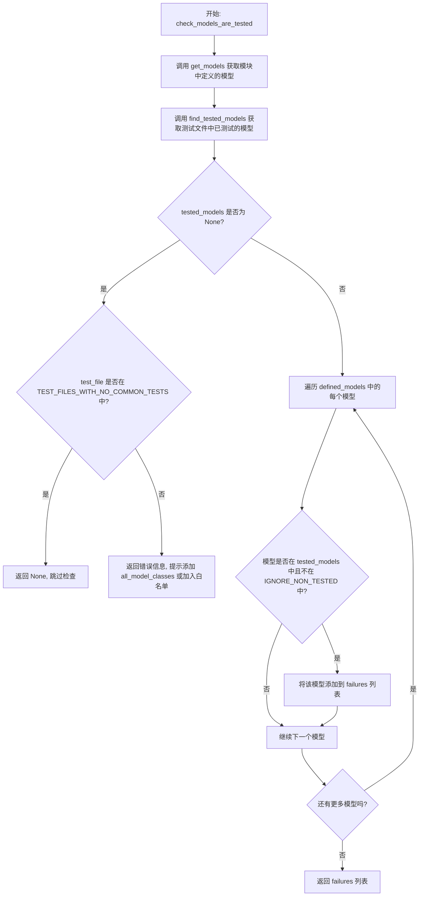

#### 带注释源码

```python
def check_models_are_tested(module, test_file):
    """Check models defined in module are tested in test_file."""
    # 获取模块中定义的所有模型类（排除 Mixin 类）
    defined_models = get_models(module)
    # 从测试文件中解析出 all_model_classes 变量，获取已测试的模型列表
    tested_models = find_tested_models(test_file)
    
    # 如果测试文件中没有定义 all_model_classes
    if tested_models is None:
        # 检查该测试文件是否在允许没有 common tests 的白名单中
        if test_file.replace(os.path.sep, "/") in TEST_FILES_WITH_NO_COMMON_TESTS:
            return  # 是白名单文件，直接返回，不报错
        # 否则返回错误提示信息
        return [
            f"{test_file} should define `all_model_classes` to apply common tests to the models it tests. "
            + "If this intentional, add the test filename to `TEST_FILES_WITH_NO_COMMON_TESTS` in the file "
            + "`utils/check_repo.py`."
        ]
    
    # 初始化失败列表
    failures = []
    # 遍历模块中定义的每个模型
    for model_name, _ in defined_models:
        # 如果该模型既不在测试列表中，也不在忽略列表中，则记录失败
        if model_name not in tested_models and model_name not in IGNORE_NON_TESTED:
            failures.append(
                f"{model_name} is defined in {module.__name__} but is not tested in "
                + f"{os.path.join(PATH_TO_TESTS, test_file)}. Add it to the all_model_classes in that file."
                + "If common tests should not applied to that model, add its name to `IGNORE_NON_TESTED`"
                + "in the file `utils/check_repo.py`."
            )
    # 返回所有失败信息（如果有的话）
    return failures
```


### `check_all_models_are_tested`

该函数是全局检验函数，用于验证diffusers库中所有模型是否都有对应的测试文件，并确保每个模型都在测试文件的 `all_model_classes` 中被正确测试。如果任何模型缺少测试或测试不完整，该函数会收集所有失败项并抛出异常。

参数： 无

返回值：无返回值，验证失败时抛出 `Exception`

#### 流程图

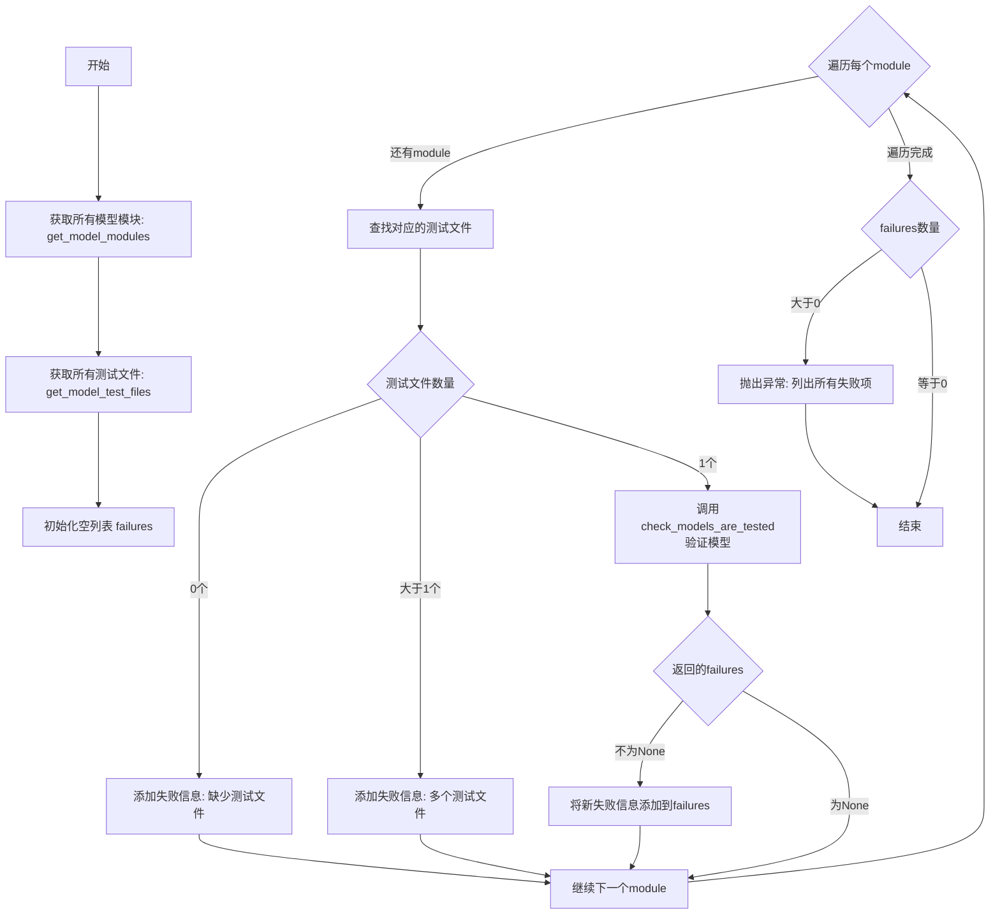

#### 带注释源码

```python
def check_all_models_are_tested():
    """Check all models are properly tested."""
    # 1. 获取diffusers库中所有的模型模块
    modules = get_model_modules()
    
    # 2. 获取所有模型测试文件路径列表
    test_files = get_model_test_files()
    
    # 3. 初始化失败信息列表，用于收集所有验证失败的情况
    failures = []
    
    # 4. 遍历每个模型模块，验证其是否有对应且唯一的测试文件
    for module in modules:
        # 提取模块名并在test_files中查找对应的测试文件
        # 例如模块名为 'diffusers.models.unet' 时，查找 'test_modeling_unet.py'
        test_file = [file for file in test_files if f"test_{module.__name__.split('.')[-1]}.py" in file]
        
        # 情况1: 没有找到对应的测试文件
        if len(test_file) == 0:
            failures.append(f"{module.__name__} does not have its corresponding test file {test_file}.")
        
        # 情况2: 找到了多个测试文件（异常情况）
        elif len(test_file) > 1:
            failures.append(f"{module.__name__} has several test files: {test_file}.")
        
        # 情况3: 正好找到一个测试文件，进行详细验证
        else:
            test_file = test_file[0]
            # 调用check_models_are_tested验证该模块中的模型是否都在测试文件的all_model_classes中
            new_failures = check_models_are_tested(module, test_file)
            
            # 如果返回了失败信息（不为None），则添加到总失败列表
            if new_failures is not None:
                failures += new_failures
    
    # 5. 如果存在任何失败信息，抛出异常报告所有问题
    if len(failures) > 0:
        raise Exception(f"There were {len(failures)} failures:\n" + "\n".join(failures))
```


### `get_all_auto_configured_models`

该函数用于扫描并收集所有在自动配置映射（Auto Mapping）中注册的模型名称，支持 PyTorch 和 Flax 两种后端，最终返回一个包含所有自动配置模型名称的列表。

参数：无

返回值：`list`，返回所有在至少一个自动配置类中注册的模型名称列表。

#### 流程图

```mermaid
flowchart TD
    A[开始] --> B[初始化空集合 result]
    B --> C{is_torch_available?}
    C -->|True| D[遍历 diffusers.models.auto.modeling_auto]
    C -->|False| E{is_flax_available?}
    D --> F[查找以 MODEL_ 开头且 MAPPING_NAMES 结尾的属性]
    F --> G[获取属性值并使用 get_values 提取模型名称]
    G --> H[将模型名称加入 result 集合]
    H --> E
    E -->|True| I[遍历 diffusers.models.auto.modeling_flax_auto]
    E -->|False| J[return list(result)]
    I --> K[查找以 FLAX_MODEL_ 开头且 MAPPING_NAMES 结尾的属性]
    K --> L[获取属性值并使用 get_values 提取模型名称]
    L --> M[将模型名称加入 result 集合]
    M --> J
```

#### 带注释源码

```python
def get_all_auto_configured_models():
    """Return the list of all models in at least one auto class."""
    # 使用集合来避免重复的模型名称
    result = set()  
    
    # 如果 PyTorch 可用，扫描 PyTorch 自动配置映射
    if is_torch_available():
        # 遍历 modeling_auto 模块中的所有属性
        for attr_name in dir(diffusers.models.auto.modeling_auto):
            # 筛选以 MODEL_ 开头且以 MAPPING_NAMES 结尾的属性（如 MODEL_MAPPING_NAMES）
            if attr_name.startswith("MODEL_") and attr_name.endswith("MAPPING_NAMES"):
                # 获取该属性的值（是一个字典，映射配置名到模型类名）
                mapping = getattr(diffusers.models.auto.modeling_auto, attr_name)
                # 使用 get_values 提取字典中的所有模型名称，并加入结果集合
                result = result | set(get_values(mapping))
    
    # 如果 Flax 可用，扫描 Flax 自动配置映射
    if is_flax_available():
        # 遍历 modeling_flax_auto 模块中的所有属性
        for attr_name in dir(diffusers.models.auto.modeling_flax_auto):
            # 筛选以 FLAX_MODEL_ 开头且以 MAPPING_NAMES 结尾的属性
            if attr_name.startswith("FLAX_MODEL_") and attr_name.endswith("MAPPING_NAMES"):
                # 获取该属性的值
                mapping = getattr(diffusers.models.auto.modeling_flax_auto, attr_name)
                # 使用 get_values 提取字典中的所有模型名称，并加入结果集合
                result = result | set(get_values(mapping))
    
    # 将集合转换为列表并返回
    return list(result)
```


### `ignore_unautoclassed`

该函数用于判断给定的模型名称是否应该被包含在自动配置类（auto class）中。它通过检查模型名称是否在预定义的黑名单中，或者模型名称是否包含"Encoder"或"Decoder"后缀来确定是否应该被忽略。

参数：

- `model_name`：`str`，需要检查的模型名称

返回值：`bool`，如果模型应该被排除在自动配置类之外则返回`True`，否则返回`False`

#### 流程图

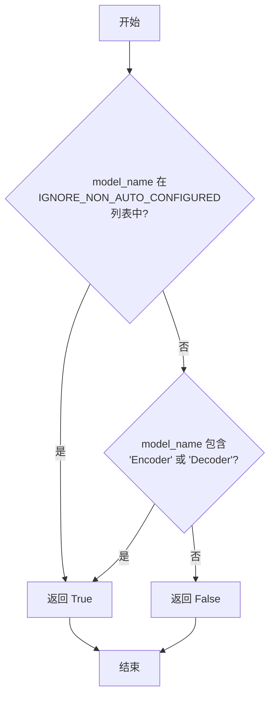

#### 带注释源码

```python
def ignore_unautoclassed(model_name):
    """Rules to determine if `name` should be in an auto class."""
    # Special white list
    # 检查模型是否在特殊的白名单中（实际上是需要忽略的非自动配置模型列表）
    if model_name in IGNORE_NON_AUTO_CONFIGURED:
        return True
    # Encoder and Decoder should be ignored
    # 如果模型名称包含Encoder或Decoder后缀，也应该被忽略
    # 因为这些通常是更大模型的内部组件
    if "Encoder" in model_name or "Decoder" in model_name:
        return True
    return False
```


### `check_models_are_auto_configured`

检查给定模块中定义的所有模型是否都存在于自动配置类中。如果模型不在自动配置类中且不符合忽略规则，则将其添加到失败列表中。

参数：

- `module`：`module`，要检查的模型模块，从中获取定义的模型
- `all_auto_models`：`list`，包含所有在自动配置类（如 AutoModel、AutoConfig 等）中注册的模型名称列表

返回值：`list`，返回未在自动配置类中的模型名称列表，如果所有模型都已配置则返回空列表

#### 流程图

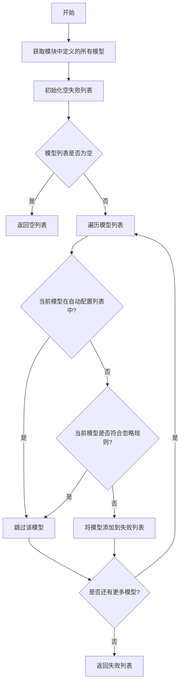

#### 带注释源码

```python
def check_models_are_auto_configured(module, all_auto_models):
    """Check models defined in module are each in an auto class."""
    # 从传入的模块中获取所有定义的模型
    defined_models = get_models(module)
    # 初始化一个空列表用于存储失败的模型
    failures = []
    # 遍历模块中定义的每个模型
    for model_name, _ in defined_models:
        # 检查模型是否不在自动配置模型列表中，且不符合忽略规则
        if model_name not in all_auto_models and not ignore_unautoclassed(model_name):
            # 如果模型未在自动映射中，添加详细的错误信息到失败列表
            failures.append(
                f"{model_name} is defined in {module.__name__} but is not present in any of the auto mapping. "
                "If that is intended behavior, add its name to `IGNORE_NON_AUTO_CONFIGURED` in the file "
                "`utils/check_repo.py`."
            )
    # 返回失败列表，可能为空
    return failures
```


### `check_all_models_are_auto_configured`

检查所有模型是否都正确配置在自动类（Auto Classes）中，确保每个模型都能通过自动配置机制进行加载。

参数：

- 无参数

返回值：无返回值（void），函数执行成功则正常返回，失败则抛出 `Exception` 异常。

#### 流程图

```mermaid
flowchart TD
    A[开始: check_all_models_are_auto_configured] --> B{missing_backends = []}
    B --> C{PyTorch 可用?}
    C -->|是| D{missing_backends = []}
    C -->|否| E[添加 'PyTorch' 到 missing_backends]
    E --> D
    D --> F{Flax 可用?}
    F -->|是| G{missing_backends 检查}
    F -->|否| H[添加 'Flax' 到 missing_backends]
    H --> G
    G --> I{missing_backends 数量 > 0?}
    I -->|是| J{是否在 CI 环境中?}
    I -->|否| K[modules = get_model_modules]
    J -->|是| L[抛出 Exception: 需要安装所有后端]
    J -->|否| M[发出 Warning: 建议安装缺失后端]
    M --> K
    L --> N[结束]
    K --> O[all_auto_models = get_all_auto_configured_models]
    O --> P[failures = []]
    P --> Q[遍历 modules 中的每个 module]
    Q --> R[check_models_are_auto_configured 结果]
    R --> S{new_failures 不为 None?}
    S -->|是| T[将 new_failures 添加到 failures]
    S -->|否| U{failures 数量 > 0?}
    T --> U
    U -->|是| V[抛出 Exception: 列出所有失败项]
    U -->|否| W[正常返回]
    V --> N
    W --> N
```

#### 带注释源码

```python
def check_all_models_are_auto_configured():
    """Check all models are each in an auto class."""
    # 初始化缺失后端列表，用于记录未安装的机器学习框架
    missing_backends = []
    
    # 检查 PyTorch 是否可用，如果不可用则记录到缺失后端列表
    if not is_torch_available():
        missing_backends.append("PyTorch")
    
    # 检查 Flax 是否可用，如果不可用则记录到缺失后端列表
    if not is_flax_available():
        missing_backends.append("Flax")
    
    # 如果存在缺失的后端，进行相应处理
    if len(missing_backends) > 0:
        # 将缺失后端列表转换为逗号分隔的字符串
        missing = ", ".join(missing_backends)
        
        # 检查是否在 CI 环境中运行
        if os.getenv("TRANSFORMERS_IS_CI", "").upper() in ENV_VARS_TRUE_VALUES:
            # 在 CI 环境中，抛出异常阻止继续执行
            raise Exception(
                "Full quality checks require all backends to be installed (with `pip install -e .[dev]` in the "
                f"Transformers repo, the following are missing: {missing}."
            )
        else:
            # 非 CI 环境中，只发出警告但继续执行
            warnings.warn(
                "Full quality checks require all backends to be installed (with `pip install -e .[dev]` in the "
                f"Transformers repo, the following are missing: {missing}. While it's probably fine as long as you "
                "didn't make any change in one of those backends modeling files, you should probably execute the "
                "command above to be on the safe side."
            )
    
    # 获取所有模型模块，用于后续检查
    modules = get_model_modules()
    
    # 获取所有已配置到自动类中的模型名称集合
    all_auto_models = get_all_auto_configured_models()
    
    # 初始化失败列表，用于记录不符合自动配置要求的模型
    failures = []
    
    # 遍历每个模型模块，检查其中的模型是否都在自动配置中
    for module in modules:
        # 对单个模块进行检查，返回该模块中不符合要求的模型列表
        new_failures = check_models_are_auto_configured(module, all_auto_models)
        
        # 如果该模块存在不符合要求的模型，将其添加到总失败列表
        if new_failures is not None:
            failures += new_failures
    
    # 如果存在任何失败项，抛出异常并列出所有问题模型
    if len(failures) > 0:
        raise Exception(f"There were {len(failures)} failures:\n" + "\n".join(failures))
```


### `check_decorator_order`

检查测试文件中装饰器的顺序，确保 `parameterized` 装饰器（及其变体）始终位于其他装饰器之前。如果发现违规情况，返回错误行号列表。

参数：

- `filename`：`str`，要检查的测试文件路径

返回值：`list[int]`，返回包含错误行号的列表，如果所有装饰器顺序正确则返回空列表

#### 流程图

```mermaid
flowchart TD
    A[开始] --> B[打开filename文件并读取所有行]
    B --> C[初始化 decorator_before = None, errors = []]
    C --> D{遍历每一行}
    D -->|是| E[使用正则表达式搜索装饰器]
    E --> F{找到装饰器?}
    F -->|是| G[提取装饰器名称]
    G --> H{decorator_before不为None 且 装饰器名称以parameterized开头?}
    H -->|是| I[将当前行号加入errors]
    H -->|否| J[更新decorator_before为当前装饰器名称]
    I --> J
    J --> K{继续遍历下一行}
    K --> D
    F -->|否| L{decorator_before不为None?}
    L -->|是| M[重置decorator_before为None]
    L -->|否| K
    M --> K
    D -->|否| N[返回errors列表]
    N --> O[结束]
```

#### 带注释源码

```python
def check_decorator_order(filename):
    """Check that in the test file `filename` the slow decorator is always last."""
    # 打开指定文件，以UTF-8编码读取所有行
    with open(filename, "r", encoding="utf-8", newline="\n") as f:
        lines = f.readlines()
    
    # decorator_before: 记录上一次出现的装饰器名称，初始为None
    decorator_before = None
    # errors: 存储所有违规装饰器顺序的行号
    errors = []
    
    # 遍历文件中的每一行，enumerate同时获取行索引i和行内容line
    for i, line in enumerate(lines):
        # 使用预编译的正则表达式_re_decorator搜索当前行中的装饰器
        # 正则表达式匹配格式: @装饰器名
        search = _re_decorator.search(line)
        
        if search is not None:
            # 提取装饰器名称（去掉@符号后的部分）
            decorator_name = search.groups()[0]
            
            # 检查是否违反了装饰器顺序规则:
            # 如果之前存在装饰器 且 当前装饰器以"parameterized"开头，
            # 则说明parameterized装饰器没有放在最前面，这是错误的
            if decorator_before is not None and decorator_name.startswith("parameterized"):
                errors.append(i)  # 记录错误行号
            
            # 更新decorator_before为当前装饰器名称
            decorator_before = decorator_name
        
        # 如果当前行没有装饰器（search为None），则重置decorator_before
        # 因为一个装饰器序列可能已经结束
        elif decorator_before is not None:
            decorator_before = None
    
    # 返回所有违规装饰器顺序的行号列表
    return errors
```

---

**补充说明：**

- **设计目标**：确保测试文件中的 `@parameterized` 装饰器始终位于其他装饰器（如 `@slow`、`@pytest.mark.xxx` 等）之前，这是 `parameterized` 库的要求，否则会导致测试发现或执行顺序问题
- **错误处理**：如果文件不存在或无法读取，会抛出 `FileNotFoundError` 或 `IOError`
- **正则表达式**：使用模块级变量 `_re_decorator = re.compile(r"^\s*@(\S+)\s+$")` 来匹配装饰器行，该正则匹配行首可选空白字符后跟 `@`，然后是非空白字符作为装饰器名称，最后是可选空白字符


### `check_all_decorator_order`

该函数用于检查所有测试文件中装饰器（decorator）的顺序是否正确，确保 `parameterized` 装饰器（及其变体）始终位于其他装饰器（如 `@slow`）之前。

参数：无

返回值：`None`，该函数没有显式返回值，若检查失败则抛出 `ValueError` 异常

#### 流程图

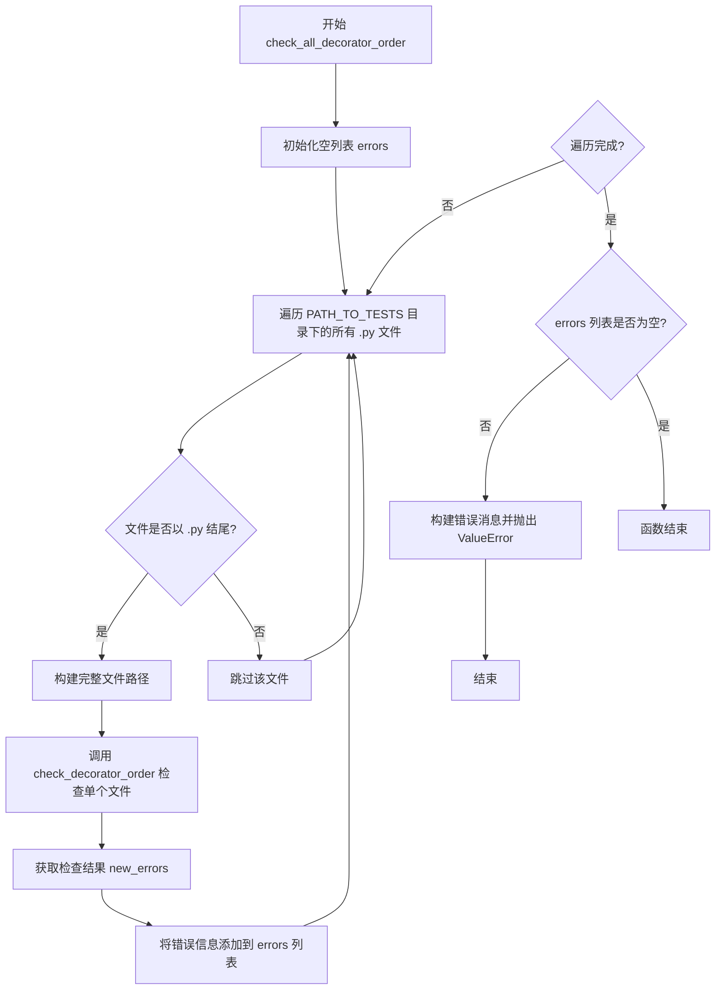

#### 带注释源码

```python
def check_all_decorator_order():
    """Check that in all test files, the slow decorator is always last."""
    # 初始化错误列表，用于收集所有装饰器顺序不符合规范的文件和行号
    errors = []
    
    # 遍历测试目录下的所有文件
    for fname in os.listdir(PATH_TO_TESTS):
        # 只处理 Python 文件
        if fname.endswith(".py"):
            # 构建完整的文件路径
            filename = os.path.join(PATH_TO_TESTS, fname)
            # 调用 check_decorator_order 检查单个文件中的装饰器顺序
            new_errors = check_decorator_order(filename)
            # 将每个错误转换为带文件路径和行号的格式，并添加到错误列表
            errors += [f"- {filename}, line {i}" for i in new_errors]
    
    # 如果存在任何错误，则抛出 ValueError 异常
    if len(errors) > 0:
        msg = "\n".join(errors)
        raise ValueError(
            "The parameterized decorator (and its variants) should always be first, but this is not the case in the"
            f" following files:\n{msg}"
        )
```


### `find_all_documented_objects`

该函数用于解析文档目录中的 RST 和 MD 文件，提取其中通过 autodoc 指令记录的类和函数名称，并返回一个包含所有已文档化对象名称的列表。

参数：无

返回值：`List[str]`，返回所有已文档化对象的名称列表

#### 流程图

```mermaid
flowchart TD
    A[开始] --> B[初始化空列表 documented_obj]
    B --> C[遍历 PATH_TO_DOC 下所有 .rst 文件]
    C --> D{还有更多 RST 文件?}
    D -->|是| E[读取当前 RST 文件内容]
    E --> F[使用正则提取 autoclass/autofunction 指令]
    F --> G[提取对象名称并去掉模块前缀]
    G --> H[添加到 documented_obj 列表]
    H --> D
    D -->|否| I[遍历 PATH_TO_DOC 下所有 .md 文件]
    I --> J{还有更多 MD 文件?}
    J -->|是| K[读取当前 MD 文件内容]
    K --> L[使用正则提取 [[autodoc]] 标记]
    L --> M[提取对象名称并去掉模块前缀]
    M --> H
    J -->|否| N[返回 documented_obj 列表]
    N --> O[结束]
```

#### 带注释源码

```python
def find_all_documented_objects():
    """Parse the content of all doc files to detect which classes and functions it documents"""
    documented_obj = []  # 用于存储已文档化对象名称的列表
    
    # 遍历文档目录下的所有 RST 文件
    for doc_file in Path(PATH_TO_DOC).glob("**/*.rst"):
        # 以 UTF-8 编码读取文件内容
        with open(doc_file, "r", encoding="utf-8", newline="\n") as f:
            content = f.read()
        
        # 使用正则表达式查找 RST 文件中的 autoclass 和 autofunction 指令
        # 匹配模式: autoclass:: transformers.类名 或 autofunction:: transformers.函数名
        raw_doc_objs = re.findall(r"(?:autoclass|autofunction):: transformers.(\S+)\s+", content)
        
        # 提取对象名称，保留完整路径（去掉 transformers. 前缀）
        # 例如: "transformers.AutoModel" -> "AutoModel"
        documented_obj += [obj.split(".")[-1] for obj in raw_doc_objs]
    
    # 遍历文档目录下的所有 MD 文件
    for doc_file in Path(PATH_TO_DOC).glob("**/*.md"):
        # 以 UTF-8 编码读取文件内容
        with open(doc_file, "r", encoding="utf-8", newline="\n") as f:
            content = f.read()
        
        # 使用正则表达式查找 MD 文件中的 [[autodoc]] 标记
        # 匹配模式: [[autodoc]] 对象名
        raw_doc_objs = re.findall(r"\[\[autodoc\]\]\s+(\S+)\s+", content)
        
        # 提取对象名称，保留完整路径
        documented_obj += [obj.split(".")[-1] for obj in raw_doc_objs]
    
    # 返回所有已文档化对象的名称列表
    return documented_obj
```


### `ignore_undocumented`

该函数用于判断给定的名称是否应该保持未文档化状态，基于一系列预定义的规则（如名称格式、后缀、是否在黑名单中等）来决定是否跳过文档化。

参数：

- `name`：`str`，需要检查是否应该文档化的名称

返回值：`bool`，如果名称应该保持未文档化状态则返回 `True`，否则返回 `False`

#### 流程图

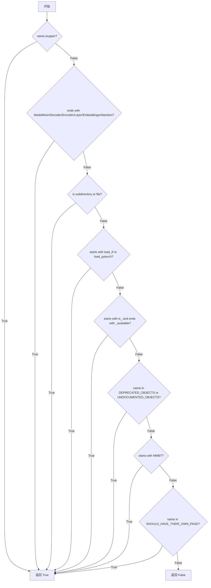

#### 带注释源码

```python
def ignore_undocumented(name):
    """Rules to determine if `name` should be undocumented."""
    # NOT DOCUMENTED ON PURPOSE.
    # Constants uppercase are not documented.
    # 检查是否为大写常量，大写常量不需要文档
    if name.isupper():
        return True
    # ModelMixins / Encoders / Decoders / Layers / Embeddings / Attention are not documented.
    # 检查是否以特定后缀结尾，这些通常是内部组件，不对外公开文档
    if (
        name.endswith("ModelMixin")
        or name.endswith("Decoder")
        or name.endswith("Encoder")
        or name.endswith("Layer")
        or name.endswith("Embeddings")
        or name.endswith("Attention")
    ):
        return True
    # Submodules are not documented.
    # 检查是否是子模块（目录或文件），子模块不直接文档化
    if os.path.isdir(os.path.join(PATH_TO_DIFFUSERS, name)) or os.path.isfile(
        os.path.join(PATH_TO_DIFFUSERS, f"{name}.py")
    ):
        return True
    # All load functions are not documented.
    # 加载函数是内部函数，不对外公开文档
    if name.startswith("load_tf") or name.startswith("load_pytorch"):
        return True
    # is_xxx_available functions are not documented.
    # 可用性检查函数是内部函数，不对外公开文档
    if name.startswith("is_") and name.endswith("_available"):
        return True
    # Deprecated objects are not documented.
    # 已废弃的对象不进行文档化
    if name in DEPRECATED_OBJECTS or name in UNDOCUMENTED_OBJECTS:
        return True
    # MMBT model does not really work.
    # MMBT 模型存在问题，不进行文档化
    if name.startswith("MMBT"):
        return True
    # 某些对象应该拥有独立文档页面，这里检查是否在其中
    if name in SHOULD_HAVE_THEIR_OWN_PAGE:
        return True
    # 默认返回 False，表示应该进行文档化
    return False
```


### `check_all_objects_are_documented`

检查所有模型是否已正确文档化。该函数通过比较 `diffusers` 公共 API 中暴露的对象与文档中记录的对象，找出未被文档化的对象，并进一步检查文档格式是否符合 Markdown 规范以及模型类型文档是否匹配。

参数：无

返回值：无（`None`），该函数通过抛出异常来报告错误

#### 流程图

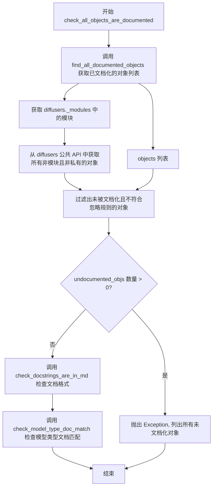

#### 带注释源码

```python
def check_all_objects_are_documented():
    """Check all models are properly documented."""
    # 步骤1: 获取所有在文档中有记录的对象名称
    # 通过解析 PATH_TO_DOC 目录下的 .rst 和 .md 文件
    # 使用正则表达式提取 autoclass, autofunction, [[autodoc]] 等标记的对象
    documented_objs = find_all_documented_objects()
    
    # 步骤2: 获取 diffusers 库中的内部模块列表
    # 这些模块不应该是公共 API 的一部分
    modules = diffusers._modules
    
    # 步骤3: 获取 diffusers 公共 API 中暴露的所有对象
    # 过滤掉模块和以下划线开头的私有对象
    objects = [c for c in dir(diffusers) if c not in modules and not c.startswith("_")]
    
    # 步骤4: 筛选出未被文档化且不符合忽略规则的对象
    # ignore_undocumented 函数定义了一系列不应被文档化的规则
    # 例如: 全大写常量、Encoder/Decoder后缀、内部模块等
    undocumented_objs = [c for c in objects if c not in documented_objs and not ignore_undocumented(c)]
    
    # 步骤5: 如果存在未文档化的对象,抛出异常
    if len(undocumented_objs) > 0:
        raise Exception(
            "The following objects are in the public init so should be documented:\n - "
            + "\n - ".join(undocumented_objs)
        )
    
    # 步骤6: 检查文档字符串格式是否为 Markdown
    # RST 格式的文档字符串应被转换为 Markdown
    check_docstrings_are_in_md()
    
    # 步骤7: 检查模型文档页面是否与模型类型匹配
    # 确保每个模型文档都有对应的模型类型定义
    check_model_type_doc_match()
```


### `check_model_type_doc_match`

检查所有文档页面是否都有对应的模型类型，确保文档中的模型标识符与自动配置中的模型名称映射相匹配。

参数： 无

返回值：`None`，该函数没有返回值，主要通过抛出 ValueError 异常来报告错误

#### 流程图

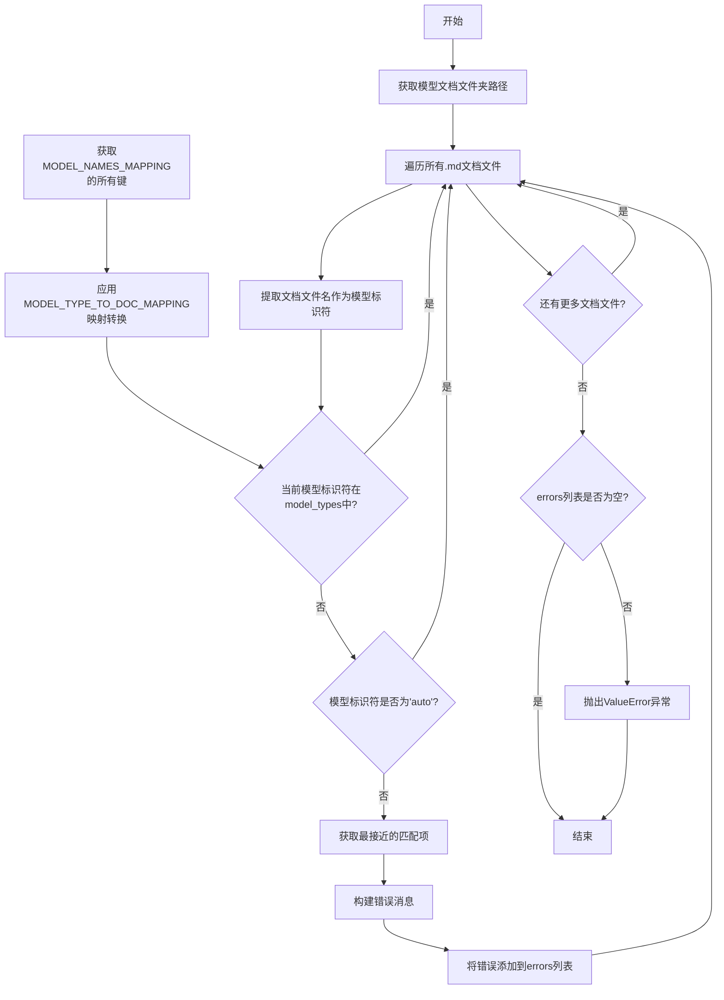

#### 带注释源码

```python
def check_model_type_doc_match():
    """Check all doc pages have a corresponding model type."""
    # 获取模型文档文件夹路径 (PATH_TO_DOC / "model_doc")
    model_doc_folder = Path(PATH_TO_DOC) / "model_doc"
    # 遍历文件夹下所有.md文件，提取文件名（不含扩展名）作为文档记录的模型列表
    model_docs = [m.stem for m in model_doc_folder.glob("*.md")]

    # 从diffusers.models.auto.configuration_auto获取MODEL_NAMES_MAPPING的所有键（模型类型）
    model_types = list(diffusers.models.auto.configuration_auto.MODEL_NAMES_MAPPING.keys())
    # 使用MODEL_TYPE_TO_DOC_MAPPING将某些模型类型映射到统一的文档名
    # 例如: data2vec-text, data2vec-audio, data2vec-vision 都映射到 data2vec
    model_types = [MODEL_TYPE_TO_DOC_MAPPING[m] if m in MODEL_TYPE_TO_DOC_MAPPING else m for m in model_types]

    # 存储所有发现的错误
    errors = []
    # 遍历每个文档文件名，检查是否在模型类型列表中
    for m in model_docs:
        # 如果模型标识符不在模型类型列表中，且不是"auto"，则记录错误
        if m not in model_types and m != "auto":
            # 使用difflib的get_close_matches获取最接近的匹配项作为建议
            close_matches = get_close_matches(m, model_types)
            error_message = f"{m} is not a proper model identifier."
            # 如果找到接近的匹配，添加到错误消息中作为建议
            if len(close_matches) > 0:
                close_matches = "/".join(close_matches)
                error_message += f" Did you mean {close_matches}?"
            errors.append(error_message)

    # 如果存在错误，抛出ValueError异常并提供详细错误信息
    if len(errors) > 0:
        raise ValueError(
            "Some model doc pages do not match any existing model type:\n"
            + "\n".join(errors)
            + "\nYou can add any missing model type to the `MODEL_NAMES_MAPPING` constant in "
            "models/auto/configuration_auto.py."
        )
```


### `is_rst_docstring`

该函数用于检查给定的 docstring 是否使用 RST (reStructuredText) 格式编写，通过正则表达式匹配 RST 特有的语法元素（如 `:obj:`、`:class:`、双反引号、Example 示例等）来判断。

参数：

- `docstring`：`str`，需要检查的文档字符串内容

返回值：`bool`，如果 docstring 包含 RST 格式标记返回 `True`，否则返回 `False`

#### 流程图

```mermaid
flowchart TD
    A[开始: is_rst_docstring] --> B{检查 _re_rst_special_words 是否匹配}
    B -->|匹配| C[返回 True]
    B -->|不匹配| D{检查 _re_double_backquotes 是否匹配}
    D -->|匹配| C
    D -->|不匹配| E{检查 _re_rst_example 是否匹配}
    E -->|匹配| C
    E -->|不匹配| F[返回 False]
```

#### 带注释源码

```python
def is_rst_docstring(docstring):
    """
    Returns `True` if `docstring` is written in rst.
    """
    # 检查是否包含 RST 特殊词汇模式，如 :obj:`xx`, :class:`xx`, :func:`xx`, :meth:`xx`
    if _re_rst_special_words.search(docstring) is not None:
        return True
    # 检查是否包含双反引号语法，如 ``example``
    if _re_double_backquotes.search(docstring) is not None:
        return True
    # 检查是否包含 RST Example 引入语句，如 "Example::"
    if _re_rst_example.search(docstring) is not None:
        return True
    # 如果以上都不匹配，返回 False，表示该 docstring 不是 RST 格式
    return False
```


### `check_docstrings_are_in_md`

该函数用于检查项目中的所有文档字符串是否采用 Markdown 格式，而非 RST（reStructuredText）格式。它会扫描 `PATH_TO_DIFFUSERS` 目录下的所有 Python 文件，提取文档字符串并使用 `is_rst_docstring` 函数判断其格式。如果发现任何文件仍使用 RST 格式的文档字符串，则抛出 `ValueError` 异常，列出所有问题文件并提供修复建议。

参数： 无

返回值： 无（该函数通过抛出异常来表示检查失败，若检查通过则正常返回）

#### 流程图

```mermaid
flowchart TD
    A[开始检查] --> B[初始化空列表 files_with_rst]
    B --> C[遍历 PATH_TO_DIFFUSERS 下所有 .py 文件]
    C --> D{还有文件吗?}
    D -->|是| E[读取文件内容]
    E --> F[用三引号分割获取文档字符串列表]
    F --> G[遍历文档字符串]
    G --> H{索引 % 2 == 1 且 is_rst_docstring?}
    H -->|是| I[将文件添加到 files_with_rst]
    H -->|否| J[跳过继续]
    I --> J
    J --> K{还有文档字符串?}
    K -->|是| G
    K -->|否| L{还有文件?}
    L -->|是| C
    L -->|否| M{files_with_rst 非空?}
    M -->|是| N[抛出 ValueError 列出所有 RST 文件]
    M -->|否| O[检查通过，函数正常返回]
    N --> P[结束]
    O --> P
```

#### 带注释源码

```python
def check_docstrings_are_in_md():
    """
    Check all docstrings are in md
    
    该函数检查 diffusers 库中所有 Python 文件的文档字符串是否使用 Markdown 格式。
    如果发现任何文件仍使用 RST 格式的文档字符串，则抛出 ValueError 异常。
    """
    # 用于存储包含 RST 格式文档字符串的文件列表
    files_with_rst = []
    
    # 递归遍历 PATH_TO_DIFFUSERS 目录下的所有 .py 文件
    for file in Path(PATH_TO_DIFFUSERS).glob("**/*.py"):
        # 以只读模式打开文件
        with open(file, "r") as f:
            code = f.read()
        
        # 用三引号 """ 分割代码，获取文档字符串列表
        # 分割后奇数索引位置为文档字符串，偶数索引位置为普通代码
        docstrings = code.split('"""')

        # 遍历所有文档字符串（索引为奇数的元素）
        for idx, docstring in enumerate(docstrings):
            # idx % 2 == 0 表示非文档字符串部分，跳过
            # not is_rst_docstring(docstring) 表示不是 RST 格式，继续
            if idx % 2 == 0 or not is_rst_docstring(docstring):
                continue
            
            # 发现 RST 格式的文档字符串，将文件添加到列表
            files_with_rst.append(file)
            # 找到第一个 RST 文档字符串后即可跳出内层循环
            break

    # 如果存在使用 RST 格式文档字符串的文件
    if len(files_with_rst) > 0:
        # 构造错误消息，列出所有问题文件
        raise ValueError(
            "The following files have docstrings written in rst:\n"
            + "\n".join([f"- {f}" for f in files_with_rst])
            + "\nTo fix this run `doc-builder convert path_to_py_file` after installing `doc-builder`\n"
            "(`pip install git+https://github.com/huggingface/doc-builder`)"
        )
```


### `check_repo_quality`

该函数是代码仓库质量检查的总入口，依次调用多个子检查函数，验证所有模型是否正确包含在初始化文件中、是否经过充分测试、是否已正确文档化，以及是否配置在自动类中。

参数：
- 无

返回值：`None`，无返回值，仅执行检查逻辑

#### 流程图

```mermaid
flowchart TD
    A([开始]) --> B[打印: "Checking all models are included."]
    B --> C[调用 check_model_list<br/>检查模型列表完整性]
    C --> D[打印: "Checking all models are public."]
    D --> E[调用 check_models_are_in_init<br/>检查模型是否在主init中]
    E --> F[打印: "Checking all models are properly tested."]
    F --> G[调用 check_all_decorator_order<br/>检查装饰器顺序]
    G --> H[调用 check_all_models_are_tested<br/>检查所有模型是否被测试]
    H --> I[打印: "Checking all objects are properly documented."]
    I --> J[调用 check_all_objects_are_documented<br/>检查所有对象是否已文档化]
    J --> K[打印: "Checking all models are in at least one auto class."]
    K --> L[调用 check_all_models_are_auto_configured<br/>检查所有模型是否配置在自动类中]
    L --> M([结束])
```

#### 带注释源码

```python
def check_repo_quality():
    """Check all models are properly tested and documented."""
    # 步骤1: 检查所有模型是否已包含在模型列表中
    print("Checking all models are included.")
    check_model_list()  # 验证 src/diffusers/models/ 目录下的模型是否都包含在 __init__.py 中
    
    # 步骤2: 检查所有模型是否在主模块中公开
    print("Checking all models are public.")
    check_models_are_in_init()  # 确保所有非私有模型都已在主 init 中导出
    
    # 步骤3: 检查所有模型是否经过充分测试
    print("Checking all models are properly tested.")
    check_all_decorator_order()  # 验证测试文件中装饰器顺序是否正确（parameterized 装饰器应在最前）
    check_all_models_are_tested()  # 确保每个模型都有对应的测试文件和 all_model_classes 定义
    
    # 步骤4: 检查所有对象是否已正确文档化
    print("Checking all objects are properly documented.")
    check_all_objects_are_documented()  # 验证公共对象是否在文档中，且文档格式为 Markdown 而非 RST
    
    # 步骤5: 检查所有模型是否配置在自动类中
    print("Checking all models are in at least one auto class.")
    check_all_models_are_auto_configured()  # 确保每个模型都存在于 MODEL_XXX_MAPPING 或 FLAX_MODEL_XXX_MAPPING 中
```

## 关键组件


### 模型列表完整性检查 (check_model_list)

检查 `src/diffusers/models/` 目录结构中的模型是否都包含在 `diffusers/models/__init__.py` 中，确保所有模型都被正确导出。

### 模型模块动态获取 (get_model_modules)

遍历 `diffusers.models` 下的所有子模块，筛选出包含 `modeling` 前缀的模块（排除特定忽略列表如 `modeling_auto`, `modeling_utils` 等），实现惰性加载模型模块。

### 模型类提取 (get_models)

从给定模块中提取所有继承自 `ModelMixin`、`TFModelMixin` 或 `FlaxModelMixin` 的模型类，支持可选排除预训练相关类，用于后续的测试和配置检查。

### 私有模型识别 (is_a_private_model)

根据命名规则判断模型是否应为私有：模型名在 `PRIVATE_MODELS` 列表中，或以 "Wrapper"/"Encoder"/"Decoder" 结尾的模型被视为私有模型，不应暴露在主入口。

### 测试覆盖检查 (check_models_are_tested, find_tested_models)

通过正则表达式解析测试文件，提取 `all_model_classes` 变量定义的模型类，与模块中定义的模型进行比对，找出未被测试覆盖的模型。

### 自动配置映射检查 (check_models_are_auto_configured, get_all_auto_configured_models)

遍历所有自动配置类（PyTorch 和 Flax），收集映射中的模型名称，检查每个定义的模型是否至少存在于一个自动类中，确保模型可通过 `AutoModel` 等接口加载。

### 文档完整性验证 (check_all_objects_are_documented)

解析所有 RST 和 Markdown 文档文件，提取 `autoclass`/`autofunction` 声明的对象，与 `diffusers` 主模块的公共对象进行比对，找出缺失文档的对象。

### 文档格式检查 (check_docstrings_are_in_md, is_rst_docstring)

使用正则表达式检测 Python 文件中的 docstring 是否使用 RST 格式（包含 `:obj:`、``:`` 或 "Example" 等标记），确保文档符合 Markdown 格式要求。

### 装饰器顺序验证 (check_decorator_order)

检查测试文件中装饰器的顺序，确保 `@parameterized` 装饰器始终在最前面，其他装饰器（如 `@slow`）在后面，维护测试代码的一致性。

### 模型类型与文档匹配 (check_model_type_doc_match)

比对 `docs/source/en/model_doc/` 目录下的文档文件与 `configuration_auto.MODEL_NAMES_MAPPING` 中的模型类型，确保每个文档都有对应的模型类型。

### 全局配置常量

定义了多个全局列表用于控制检查行为：`PRIVATE_MODELS`（私有模型）、`IGNORE_NON_TESTED`（免测试模型）、`IGNORE_NON_AUTO_CONFIGURED`（免自动配置模型）、`DEPRECATED_OBJECTS`（已弃用对象）、`UNDOCUMENTED_OBJECTS`（不文档化对象）等。


## 问题及建议


### 已知问题

- **硬编码的路径和配置**: `PATH_TO_DIFFUSERS`、`PATH_TO_TESTS`、`PATH_TO_DOC` 等路径以字符串形式硬编码，缺乏从配置文件或环境变量读取的灵活性
- **手动维护的大量列表**: `IGNORE_NON_TESTED`、`IGNORE_NON_AUTO_CONFIGURED`、`UNDOCUMENTED_OBJECTS` 等列表需要手动更新，容易遗漏且难以扩展
- **性能问题**: `get_model_modules()` 函数多次使用 `dir()` 遍历，效率较低；`find_tested_models()` 使用正则表达式解析文件而非导入模块，性能欠佳
- **跨平台路径处理不一致**: 在 `check_models_are_tested()` 中使用 `test_file.replace(os.path.sep, "/")` 与 `TEST_FILES_WITH_NO_COMMON_TESTS` 中的正斜杠进行比较，但在 Windows 上可能产生问题
- **正则表达式解析的脆弱性**: `find_tested_models()` 中的正则表达式 `r"all_model_classes\s+=\s+\(\s*\(([^\)]*)\)"` 无法覆盖所有 `all_model_classes` 的定义格式
- **缺乏类型注解**: 整个代码中没有使用类型提示（type hints），降低了代码的可读性和可维护性
- **装饰器检查的正则缺陷**: `_re_decorator = re.compile(r"^\s*@(\S+)\s+$")` 中的结尾 `$` 可能导致匹配多行装饰器时出现问题

### 优化建议

- **引入配置管理**: 将硬编码的路径和列表迁移到独立的配置文件（如 YAML 或 JSON），通过配置类统一管理
- **添加缓存机制**: 对 `get_model_modules()`、`get_all_auto_configured_models()` 等频繁调用的函数结果进行缓存，避免重复计算
- **改进模块导入方式**: 考虑使用 `ast` 模块或导入测试文件的方式替代正则表达式解析，提高准确性和性能
- **统一路径处理**: 使用 `pathlib.Path` 替代 `os.path` 进行跨平台路径操作，统一使用 `Path` 对象进行比较
- **增加类型注解**: 为所有函数参数和返回值添加类型提示，提高代码可读性和 IDE 支持
- **模块化拆分**: 将 `check_repo_quality()` 中的检查逻辑拆分为独立的检查器类，降低函数复杂度
- **增强错误处理**: 为文件读取、目录遍历等操作添加异常处理，提供更友好的错误信息和恢复机制
- **日志系统**: 引入标准日志模块替代 `print` 语句，便于配置日志级别和输出目标
- **单元测试覆盖**: 为关键函数（如 `find_tested_models()`、`is_rst_docstring()` 等）添加单元测试，确保边界情况正确处理

## 其它


### 设计目标与约束

该脚本的设计目标是自动化检查 diffusers 仓库的质量，包括验证所有模型是否正确包含在 `__init__.py` 中、是否具有对应的测试文件、是否在自动配置映射中注册、是否具有适当的文档，以及测试文件中的装饰器顺序是否正确。核心约束包括必须从仓库根目录运行、依赖 PyTorch 和 Flax 后端才能进行完整检查、某些检查在 CI 环境中会强制要求所有后端可用。

### 错误处理与异常设计

脚本采用异常抛出机制进行错误报告。当检测到问题时，函数会抛出 `Exception` 或 `ValueError`，包含详细的错误信息说明问题所在和修复建议。例如模型未在 `__init__.py` 中声明时会抛出异常并列出缺失的模型名称。警告机制用于提醒用户某些后端缺失但不阻断执行（在非 CI 环境下）。所有检查函数遵循统一的失败模式：返回 None 表示无需检查、返回空列表表示检查通过、返回包含错误消息的列表表示检查失败。

### 外部依赖与接口契约

主要外部依赖包括 `importlib`（模块加载）、`inspect`（模块检查）、`os` 和 `pathlib.Path`（文件系统操作）、`re`（正则表达式）、`warnings`（警告输出）、`collections.OrderedDict`（有序字典）、`difflib.get_close_matches`（模糊匹配）、`diffusers.models.auto.get_values`（获取自动映射值）、`diffusers.utils` 中的环境变量检查和后端可用性判断。脚本通过动态加载 `src/diffusers/__init__.py` 获取 diffusers 模块对象，并假设目录结构遵循标准的 `src/diffusers/models/` 和 `tests/models/` 布局。

### 配置与常量

脚本定义了多个关键配置常量：`PATH_TO_DIFFUSERS`（指向 src/diffusers）、`PATH_TO_TESTS`（指向 tests 目录）、`PATH_TO_DOC`（指向文档目录）。模型过滤列表包括 `PRIVATE_MODELS`（私有模型，不应出现在主 init 中）、`IGNORE_NON_TESTED`（豁免测试检查的模型）、`IGNORE_NON_AUTO_CONFIGURED`（豁免自动配置检查的模型）、`TEST_FILES_WITH_NO_COMMON_TESTS`（没有通用测试的文件）。此外还定义了 `DEPRECATED_OBJECTS`、`UNDOCUMENTED_OBJECTS` 和 `SHOULD_HAVE_THEIR_OWN_PAGE` 三个文档相关列表用于文档完整性检查。

### 正则表达式模式

代码使用三个主要正则表达式模式：`_re_decorator`（匹配装饰器定义，格式为 `@decorator_name`）、`_re_rst_special_words`（匹配 RST 文档中的交叉引用，格式如 `:obj:`, `:class:`, `:func:`, `:meth:`）、`_re_double_backquotes`（匹配双反引号包围的内容）、`_re_rst_example`（匹配 RST 中的示例块，以 "Example" 开头并以 "::" 结尾）。

### 性能考虑与优化空间

当前实现使用 `os.listdir()` 遍历目录，每次检查都会重新扫描文件系统。可优化的方向包括：缓存目录扫描结果以避免重复遍历、使用并行处理同时检查多个模块和测试文件、将配置列表转换为集合以加快成员检测速度。find_tested_models 函数使用正则表达式解析测试文件内容，可以考虑改为 AST 解析以提高准确性和效率。

### 安全性考虑

脚本主要在本地开发环境中运行，安全性风险较低。主要考虑包括：路径遍历防护（通过 `os.path.join` 防止路径注入）、文件读取使用指定的编码 `utf-8`、动态模块加载仅限于预期的 diffusers 包。

### 版本兼容性

代码遵循 Python 3 标准库，无额外第三方依赖（diffusers 本身除外）。使用 `from __future__ import annotations` 风格的类型提示注释（虽然此文件未使用）。建议在 Python 3.8+ 环境中运行以获得最佳兼容性。

### 使用示例

从仓库根目录运行完整检查：`python utils/check_repo.py`。该脚本会在检测到任何质量问题时抛出异常并退出，返回非零退出码供 CI/CD 流程捕获。可以设置环境变量 `TRANSFORMERS_IS_CI` 为真值以在 CI 环境中强制执行完整的后端检查。

### 维护建议

当前代码存在一些可改进之处：多个硬编码的路径和列表应迁移到配置文件；检查逻辑可以拆分为独立的类以提高可测试性；缺乏单元测试覆盖；错误消息可以包含更多上下文信息以帮助开发者快速定位问题；某些魔法字符串（如装饰器名称、目录名模式）应定义为常量以提高可维护性。

    