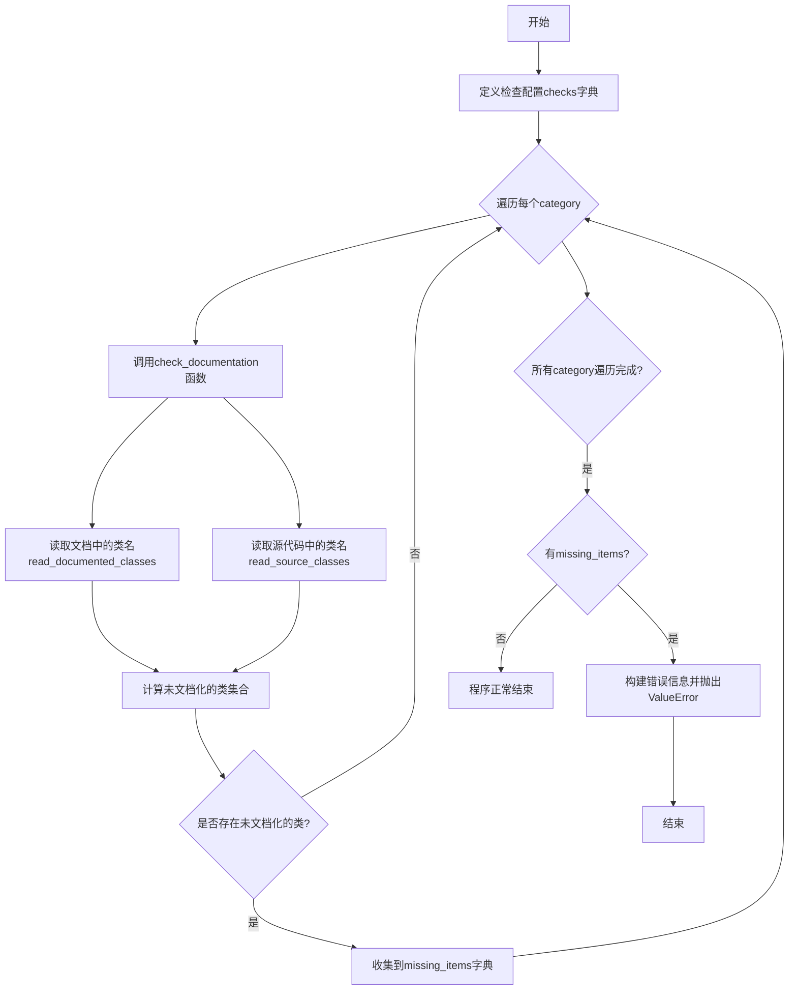
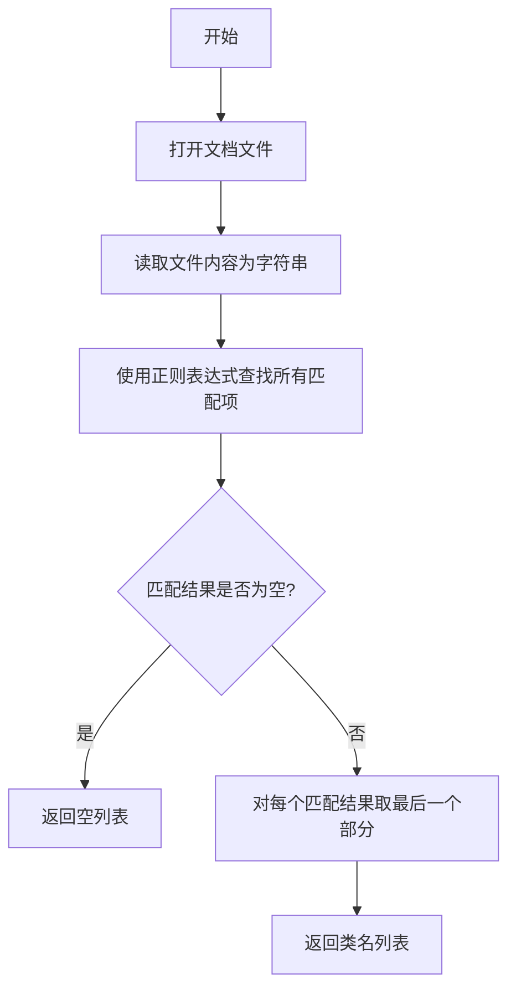
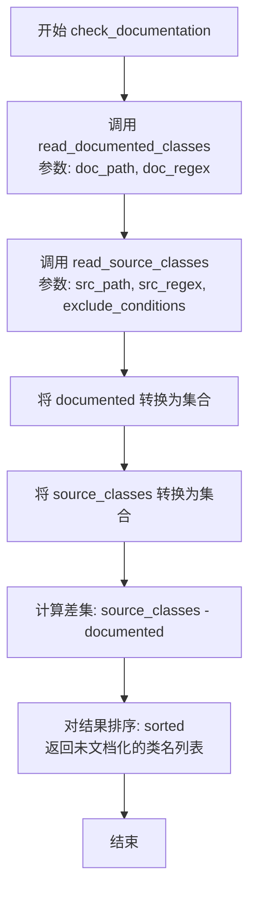

# `diffusers\utils\check_support_list.py` 详细设计文档

这是一个文档一致性检查工具，用于验证diffusers库中的各种处理器、激活函数、归一化层等模块是否在相应的API文档中正确记录（通过[[autodoc]]标记），并报告未文档化的类。

## 整体流程



## 类结构

```
无类定义（纯函数模块）
└── 模块级函数
    ├── read_documented_classes
    ├── read_source_classes
    └── check_documentation
```

## 全局变量及字段


### `REPO_PATH`
    
基础仓库路径，用于构造文件路径，设置为当前目录('.')，使得脚本可以从仓库根目录运行

类型：`str`
    


    

## 全局函数及方法


### `read_documented_classes`

从文档文件中读取使用 autodoc 标记的类名，并返回类名列表（仅返回类名部分，不包含完整路径）。

参数：

- `doc_path`：`str`，文档文件的相对路径
- `autodoc_regex`：`str`（默认值为 `r"\[\[autodoc\]\]\s([^\n]+)"`），用于匹配文档中 [[autodoc]] 标记行的正则表达式

返回值：`List[str]`，从文档中提取的类名列表

#### 流程图



#### 带注释源码

```python
def read_documented_classes(doc_path, autodoc_regex=r"\[\[autodoc\]\]\s([^\n]+)"):
    """
    Reads documented classes from a doc file using a regex to find lines like [[autodoc]] my.module.Class.
    Returns a list of documented class names (just the class name portion).
    """
    # 拼接完整路径并打开文档文件进行读取
    with open(os.path.join(REPO_PATH, doc_path), "r") as f:
        # 读取整个文件内容为字符串
        doctext = f.read()
    # 使用正则表达式查找所有匹配的 autodoc 行
    matches = re.findall(autodoc_regex, doctext)
    # 对每个匹配结果按 '.' 分割，取最后一部分（即类名），返回类名列表
    return [match.split(".")[-1] for match in matches]
```


### `read_source_classes`

该函数用于从源代码文件中读取匹配的类名，并通过可选的排除条件过滤掉不需要的类，返回过滤后的类名列表。

参数：

- `src_path`：`str`，源代码文件的相对路径
- `class_regex`：`str`，用于匹配类定义的正则表达式模式
- `exclude_conditions`：`List[Callable]`，可选参数，用于排除类的条件函数列表，每个条件函数接收类名并返回布尔值

返回值：`List[str]`，返回过滤后的类名列表

#### 流程图

```mermaid
flowchart TD
    A[开始 read_source_classes] --> B{exclude_conditions is None}
    B -->|是| C[设置 exclude_conditions = []]
    B -->|否| D[使用传入的 exclude_conditions]
    C --> E[打开源文件 src_path]
    D --> E
    E --> F[读取文件内容为字符串]
    F --> G[使用 re.findall 提取匹配的类名]
    G --> H[初始化空列表 filtered_classes]
    H --> I{遍历 classes 中的每个类名 c}
    I --> J{任一条件函数 cond(c) 返回 True}
    J -->|是| K[跳过该类名]
    J -->|否| L[将类名添加到 filtered_classes]
    K --> M{还有更多类名?}
    L --> M
    M -->|是| I
    M -->|否| N[返回 filtered_classes]
```

#### 带注释源码

```python
def read_source_classes(src_path, class_regex, exclude_conditions=None):
    """
    Reads class names from a source file using a regex that captures class definitions.
    Optionally exclude classes based on a list of conditions (functions that take class name and return bool).
    
    参数:
        src_path: 源代码文件的相对路径
        class_regex: 用于匹配类定义的正则表达式
        exclude_conditions: 可选的排除条件列表，用于过滤不需要的类名
    
    返回:
        过滤后的类名列表
    """
    # 如果没有提供排除条件，初始化为空列表
    if exclude_conditions is None:
        exclude_conditions = []
    
    # 打开并读取源代码文件内容
    with open(os.path.join(REPO_PATH, src_path), "r") as f:
        doctext = f.read()
    
    # 使用正则表达式查找所有匹配的类名
    classes = re.findall(class_regex, doctext)
    
    # 过滤掉满足任一排除条件的类名
    # 遍历每个类名，如果任意一个条件函数返回 True，则排除该类
    filtered_classes = [c for c in classes if not any(cond(c) for cond in exclude_conditions)]
    
    return filtered_classes
```


### `check_documentation`

通用函数，用于检查在 `src_path` 中定义的所有类是否都在 `doc_path` 文档中有所记录。通过读取文档中的类名和源代码中的类名，进行集合差运算找出未文档化的类名集合。

参数：

-  `doc_path`：`str`，文档文件路径，指向包含 `[[autodoc]]` 标记的 Markdown 文档
-  `src_path`：`str`，源代码文件路径，指向需要检查的 Python 源文件
-  `doc_regex`：`str`，用于从文档中提取类名的正则表达式，匹配 `[[autodoc]] my.module.Class` 格式
-  `src_regex`：`str`，用于从源代码中提取类名的正则表达式，匹配类定义语句
-  `exclude_conditions`：`List[Callable] | None`，可选的排除条件列表，每个条件是一个接收类名并返回布尔值的函数，用于过滤掉不需要检查的类

返回值：`List[str]`，返回未在文档中记录的类名列表，按字母顺序排序

#### 流程图



#### 带注释源码

```python
def check_documentation(doc_path, src_path, doc_regex, src_regex, exclude_conditions=None):
    """
    Generic function to check if all classes defined in `src_path` are documented in `doc_path`.
    Returns a set of undocumented class names.
    """
    # 从文档文件中读取已文档化的类名，使用 doc_regex 正则表达式匹配 [[autodoc]] 标记
    documented = set(read_documented_classes(doc_path, doc_regex))
    
    # 从源代码文件中读取定义的类名，使用 src_regex 正则表达式匹配类定义
    # 可选地应用 exclude_conditions 过滤条件排除特定类
    source_classes = set(read_source_classes(src_path, src_regex, exclude_conditions=exclude_conditions))

    # 找出源代码中存在但文档中未记录的类，使用集合差运算
    # sorted() 确保返回结果是确定性的有序列表
    undocumented = sorted(source_classes - documented)
    return undocumented
```

## 关键组件


### 文档检查框架

该脚本是一个自动化文档一致性检查工具，用于验证diffusers项目中各类（注意力处理器、图像处理器、激活函数、归一化层、LoRA混合类）是否在对应的markdown文档中正确注册了autodoc条目，确保代码实现与文档同步。

### 正则表达式匹配引擎

使用正则表达式从源代码和文档文件中提取类名，支持灵活的模式匹配，如`class\s+(\w+Processor(?:\d*_?\d*))[:(]`用于匹配各种命名的处理器类。

### 多类别检查配置

通过`checks`字典定义了5个检查类别，每个类别指定了文档路径、源代码路径、文档正则、源代码正则和排除条件，支持针对不同类型类的差异化验证策略。

### 排除条件机制

通过`exclude_conditions`参数支持灵活的类过滤，例如排除包含"LoRA"的类或特定的"Attention"、"LayerNorm"类，以适应项目的特殊文档策略。

### 差集比较算法

`check_documentation`函数通过集合运算（`source_classes - documented`）找出未文档化的类，使用确定性排序保证结果一致性。

### 错误聚合报告

将所有类别的未文档化类收集到`missing_items`字典中，最终合并为一条包含所有缺失信息的错误消息，便于开发者一次性了解所有问题。

### 文档路径配置

使用相对路径配置，通过`REPO_PATH`变量支持从仓库根目录运行脚本，文档路径涵盖`docs/source/en/api/`下的多个文档文件。


## 问题及建议


### 已知问题

- **文件读取缺乏错误处理**：代码直接使用 `open()` 读取文件，没有 try-except 保护，如果文件不存在或编码错误会导致程序直接崩溃
- **硬编码的正则表达式模式**：`checks` 字典中的 `src_regex` 和 `doc_regex` 是硬编码的，这些模式对代码格式敏感，可能因为代码格式变化而失效，且维护成本高
- **正则表达式匹配不够精确**：例如 `r"class\s+(\w+Processor(?:\d*_?\d*))[:(]"` 只匹配特定命名模式的类，可能遗漏其他有效的处理器类
- **Lambda 排除条件不够灵活**：`exclude_conditions` 使用硬编码的 lambda 函数，如 `lambda c: "LoRA" in c`，这种字符串匹配方式容易误判，且无法处理更复杂的排除逻辑
- **硬编码的 REPO_PATH**：`REPO_PATH = "."` 假设从仓库根目录运行，缺少灵活性，不支持从其他目录运行或传入自定义路径
- **缺乏命令行参数支持**：所有配置都硬编码在代码中，无法通过命令行参数指定自定义的文档路径、源代码路径或检查规则
- **重复的文档解析逻辑**：`read_documented_classes` 和 `read_source_classes` 函数有重复的打开文件和正则匹配逻辑，可以进一步抽象
- **缺乏测试覆盖**：整个脚本没有任何单元测试或集成测试，难以保证在代码变化时的正确性

### 优化建议

- 为文件读取操作添加 try-except 异常处理，捕获 FileNotFoundError、UnicodeDecodeError 等常见异常，并给出有意义的错误信息
- 将正则表达式和配置提取到独立的配置文件（如 JSON 或 YAML）中，提高可维护性和可扩展性
- 考虑使用 AST（抽象语法树）解析代替正则表达式来提取类名，这样更健壮且不受代码格式影响
- 将 `exclude_conditions` 改为更结构化的配置方式，例如使用列表存储需要排除的类名，而不是使用 lambda 函数
- 使用 `argparse` 添加命令行参数支持，允许用户指定 REPO_PATH、文档路径、源代码路径等
- 将通用的文件读取和正则匹配逻辑提取为工具函数，减少重复代码
- 添加单元测试，覆盖常见的边界情况，如空文件、不存在的路径、特殊命名的类等
- 增加日志输出功能，允许用户选择输出级别（info、warning、error），便于调试和集成到 CI/CD 流程中
- 考虑将检查结果输出为结构化格式（如 JSON），便于其他工具解析和处理


## 其它


### 设计目标与约束

该脚本的设计目标是通过比对源代码中定义的类与文档中记录的类，自动检测diffusers库中未正确文档化的模块（如Attention Processors、Image Processors、Activations等），确保API文档的完整性和一致性。约束条件包括：仅支持Python源码文件解析，使用正则表达式进行模式匹配，假设文档采用特定的`[[autodoc]]`标记格式，且必须从仓库根目录运行。

### 错误处理与异常设计

脚本在以下场景进行错误处理：1）文件读取失败时抛出`FileNotFoundError`；2）当检测到未文档化的类时，构造包含类别和类名的组合错误信息，抛出`ValueError`并附带分类的错误列表。错误信息按类别组织，每行显示一个类别及其对应的未文档化类列表，便于开发者快速定位问题。

### 数据流与状态机

脚本的数据流如下：1）主流程读取配置字典`checks`，定义需要检查的类别及其对应的文档路径、源码路径和正则表达式；2）对每个类别调用`check_documentation`函数；3）该函数依次调用`read_documented_classes`读取文档中的类名，调用`read_source_classes`读取源码中的类名；4）计算差集得到未文档化的类；5）所有检查完成后，如有未文档化类则抛出异常，否则正常退出。

### 外部依赖与接口契约

脚本依赖以下外部组件：1）Python标准库`os`用于路径拼接；2）Python标准库`re`用于正则表达式匹配；3）文件系统中的文档文件（`docs/source/en/api/*.md`）和源码文件（`src/diffusers/models/*.py`、`src/diffusers/image_processor.py`、`src/diffusers/loaders/lora_pipeline.py`）。接口契约要求：文档文件必须包含`[[autodoc]] 类名`格式的标记，源码文件必须包含符合指定正则表达式的类定义。

### 使用示例与调用方式

脚本可通过命令行直接运行：`python utils/check_support_list.py`。无需参数，脚本会自动读取`REPO_PATH`指定的当前目录下的配置。成功运行时无输出，检测到问题时抛出`ValueError`并列出所有未文档化的类。

### 性能考量与限制

性能方面，该脚本在运行时需读取多个文件并执行正则表达式匹配，文件数量和大小直接影响执行时间。限制包括：1）正则表达式可能无法覆盖所有类定义风格；2）排除条件使用简单的字符串包含判断；3）不支持自定义检查规则，必须修改源码才能扩展。

### 维护指南

维护时需要注意：1）新增检查类别需在`checks`字典中添加条目；2）修改正则表达式时需确保与源码格式匹配；3）排除条件可根据项目发展调整；4）建议定期运行脚本以确保文档同步更新。

    