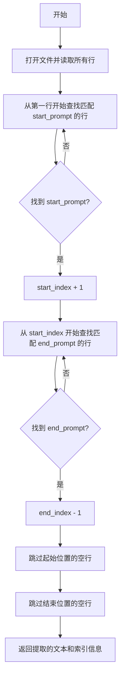
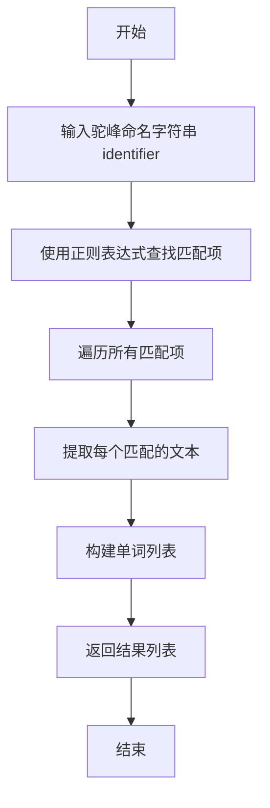
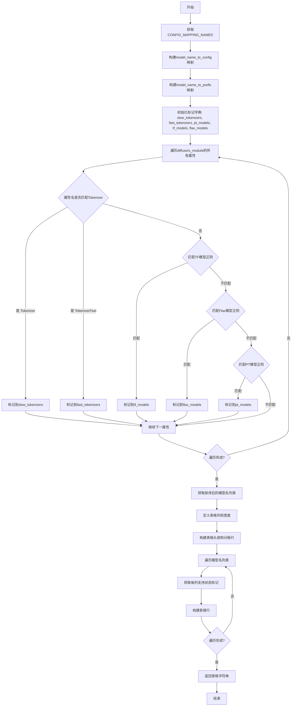
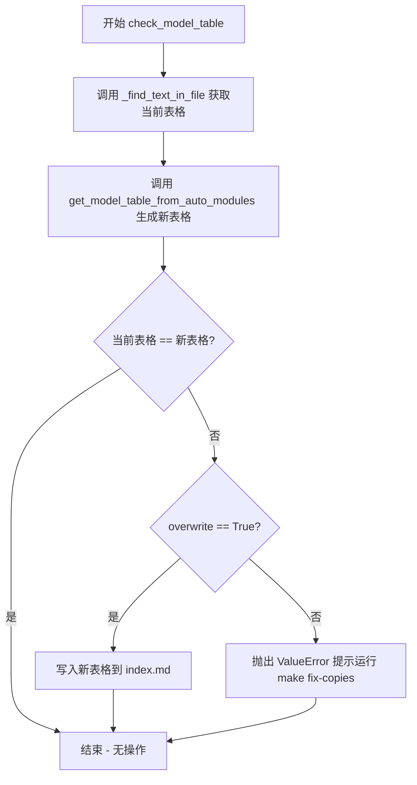
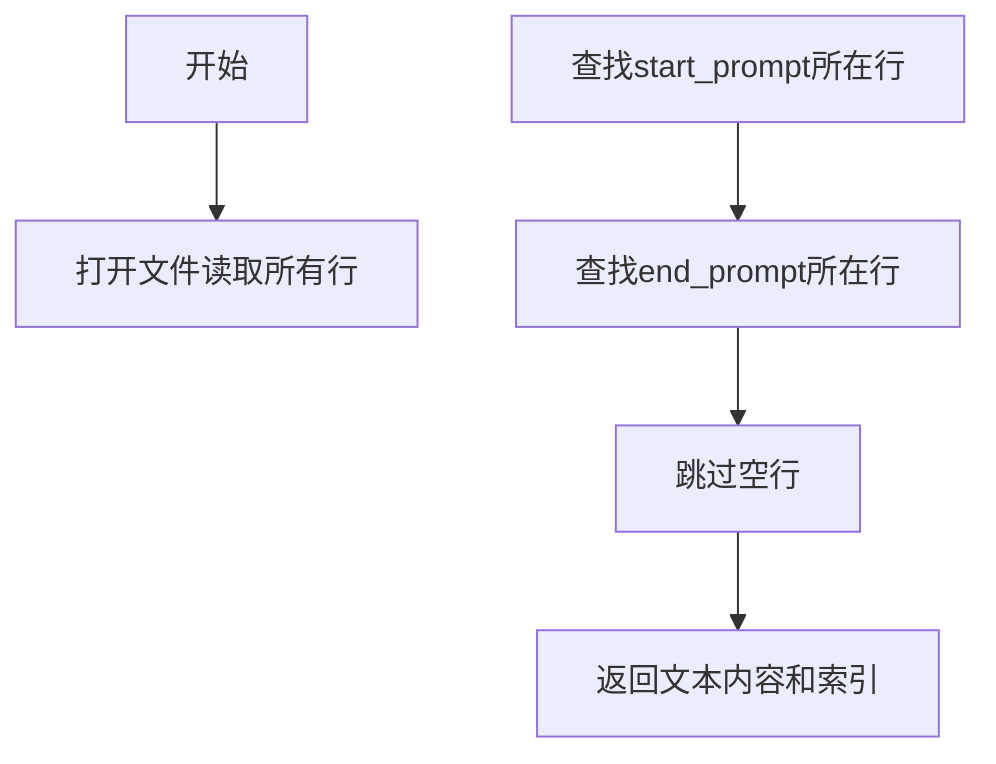
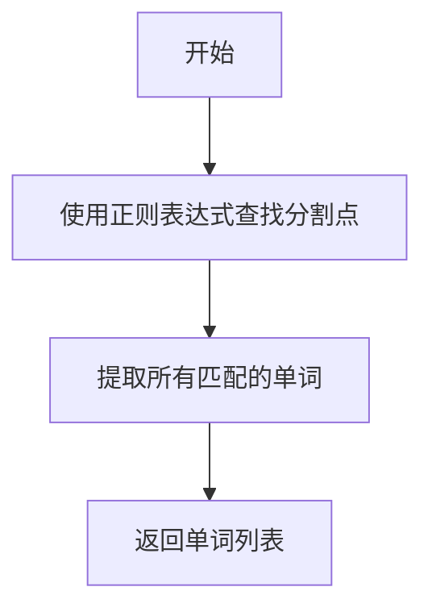
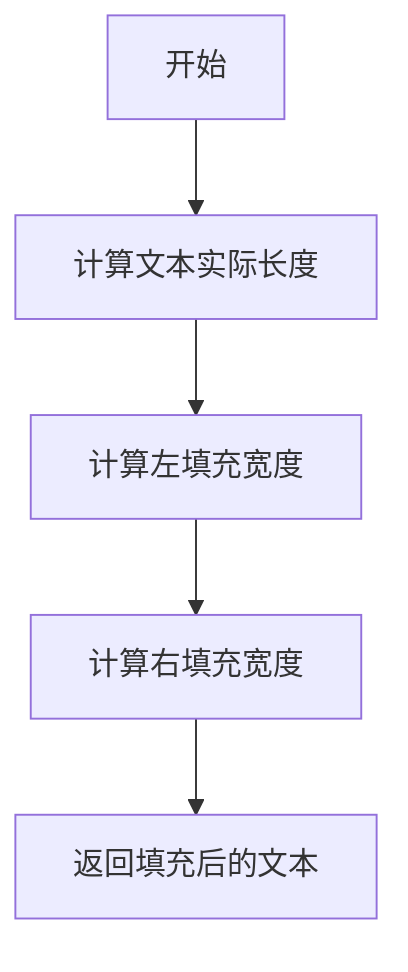
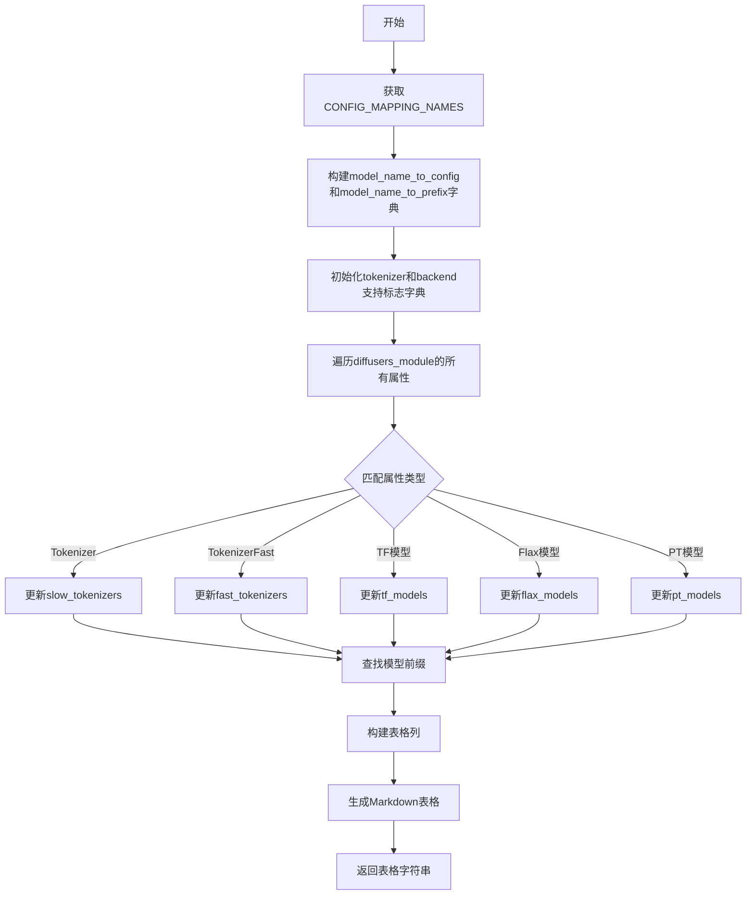
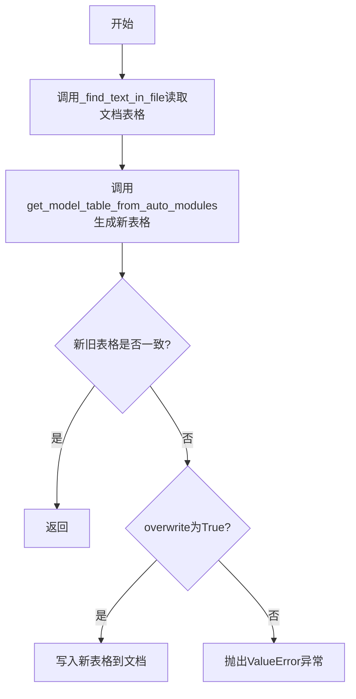

# `diffusers\utils\check_table.py` 详细设计文档

这是一个用于检查并生成diffusers库模型支持表的脚本，它会扫描diffusers模块中的所有模型类（PyTorch、TensorFlow、Flax）， tokenizer（slow/fast），然后与docs/source/en/index.md文档中的模型表格进行对比，确保文档中的模型支持信息与代码库保持一致，可选择自动覆盖更新文档。

## 整体流程

```mermaid
graph TD
    A[开始: 解析命令行参数] --> B[调用 check_model_table]
B --> C[_find_text_in_file: 读取index.md中的表格]
C --> D[调用 get_model_table_from_auto_modules]
D --> E[加载 diffusers_module]
E --> F[遍历 dir(diffusers_module) 获取所有对象]
F --> G{根据后缀和正则匹配分类}
G --> H[构建 model_name_to_config 和 model_name_to_prefix]
G --> I[构建 slow_tokenizers, fast_tokenizers, pt_models, tf_models, flax_models]
H --> J[生成新表格字符串]
J --> K{current_table == new_table?}
K -- 是 --> L[通过检查，退出]
K -- 否 --> M{overwrite=True?}
M -- 是 --> N[覆盖写入index.md]
M -- 否 --> O[抛出 ValueError 提示运行 make fix-copies]
```

## 类结构

```
脚本级模块（无类）
└── 全局函数:
    ├── _find_text_in_file()
    ├── camel_case_split()
    ├── _center_text()
    ├── get_model_table_from_auto_modules()
    └── check_model_table()
```

## 全局变量及字段


### `TRANSFORMERS_PATH`
    
diffusers库的源代码路径，用于定位模块目录

类型：`str`
    


### `PATH_TO_DOCS`
    
文档文件的根目录路径，用于定位文档文件

类型：`str`
    


### `REPO_PATH`
    
仓库的根目录路径，默认为当前目录

类型：`str`
    


### `ALLOWED_MODEL_SUFFIXES`
    
用于识别模型类型的允许后缀，以管道分隔符连接

类型：`str`
    


### `_re_tf_models`
    
正则表达式对象，用于匹配TensorFlow模型类名称

类型：`re.Pattern`
    


### `_re_flax_models`
    
正则表达式对象，用于匹配Flax模型类名称

类型：`re.Pattern`
    


### `_re_pt_models`
    
正则表达式对象，用于匹配PyTorch模型类名称

类型：`re.Pattern`
    


### `diffusers_module`
    
通过importlib动态加载的diffusers模块对象

类型：`ModuleType`
    


    

## 全局函数及方法


### `_find_text_in_file`

该函数用于在指定文件中查找介于以 `start_prompt` 开头的行与以 `end_prompt` 开头的行之间的文本内容，并去除空行，同时返回相关索引位置信息。

参数：

- `filename`：`str`，要搜索的文件路径
- `start_prompt`：`str`，起始提示符，标识要提取内容的起始位置（行首匹配）
- `end_prompt`：`str`，结束提示符，标识要提取内容的结束位置（行首匹配）

返回值：`tuple`，包含以下四个元素：
- 提取的文本内容（`str`）
- 起始索引（`int`）
- 结束索引（`int`）
- 文件所有行的列表（`list`）

#### 流程图



#### 带注释源码

```python
def _find_text_in_file(filename, start_prompt, end_prompt):
    """
    Find the text in `filename` between a line beginning with `start_prompt` and before `end_prompt`, removing empty
    lines.
    """
    # 以 UTF-8 编码打开文件，读取所有行到列表中
    with open(filename, "r", encoding="utf-8", newline="\n") as f:
        lines = f.readlines()
    
    # 查找起始提示符的位置
    start_index = 0
    # 循环直到找到以 start_prompt 开头的行
    while not lines[start_index].startswith(start_prompt):
        start_index += 1
    # start_index 指向匹配行，实际内容从下一行开始
    start_index += 1

    # 从起始位置开始查找结束提示符
    end_index = start_index
    while not lines[end_index].startswith(end_prompt):
        end_index += 1
    # end_index 指向匹配行，内容到前一行为止
    end_index -= 1

    # 跳过开头的空行（只包含换行符或空字符的行）
    while len(lines[start_index]) <= 1:
        start_index += 1
    # 跳过结尾的空行
    while len(lines[end_index]) <= 1:
        end_index -= 1
    # end_index 需要加 1，因为切片是左闭右开区间
    end_index += 1
    
    # 返回提取的文本内容、起始索引、结束索引以及所有行
    return "".join(lines[start_index:end_index]), start_index, end_index, lines
```


### `camel_case_split`

将驼峰命名风格的标识符分割成独立的单词列表，用于处理模型名称等驼峰格式字符串。

参数：

- `identifier`：`str`，要分割的驼峰命名标识符

返回值：`List[str]`，分割后的单词列表

#### 流程图



#### 带注释源码

```python
def camel_case_split(identifier):
    """Split a camelcased `identifier` into words."""
    # 正则表达式解释：
    # .+?             匹配任意字符（非贪婪），至少一个字符
    # (?<=            负向后瞻断言，断言前面是...
    #    [a-z]       小写字母
    # )(?=[A-Z])     前面是小写字母，后面是大写字母 -> 分割点
    # |
    # (?<=[A-Z])(?=[A-Z][a-z])  前面是大写字母，后面是大写字母+小写 -> 分割点
    # |
    # $               字符串结束位置 -> 最后一个单词
    matches = re.finditer(
        ".+?(?:(?<=[a-z])(?=[A-Z])|(?<=[A-Z])(?=[A-Z][a-z])|$)",
        identifier
    )
    # 从每个匹配中提取组0（即整个匹配的内容）
    return [m.group(0) for m in matches]
```


### `_center_text`

该函数是一个辅助函数，用于将文本居中显示在指定宽度的字符串中。它根据文本长度计算左右两边的缩进空格数，使文本能够居中对齐。

参数：

- `text`：`str`，需要居中的文本内容
- `width`：`int`，目标宽度，即最终返回字符串的总长度

返回值：`str`，包含原始文本及左右两侧填充空格的新字符串

#### 流程图

```mermaid
flowchart TD
    A[Start] --> B{text == '✅' or '❌'?}
    B -->|Yes| C[text_length = 2]
    B -->|No| D[text_length = len(text)]
    C --> E[left_indent = (width - text_length) // 2]
    D --> E
    E --> F[right_indent = width - text_length - left_indent]
    F --> G[Return ' ' * left_indent + text + ' ' * right_indent]
```

#### 带注释源码

```python
def _center_text(text, width):
    """
    将文本居中对齐到指定宽度。
    
    Args:
        text: 需要居中的文本
        width: 目标宽度
        
    Returns:
        居中对齐后的字符串
    """
    # 对于特殊字符（勾/叉），使用固定长度2进行计算
    # 这是因为这些emoji字符在等宽字体中可能显示宽度不同
    text_length = 2 if text == "✅" or text == "❌" else len(text)
    
    # 计算左侧缩进：使用整数除法确保left_indent为整数
    left_indent = (width - text_length) // 2
    
    # 计算右侧缩进：确保左右缩进之和等于剩余空间
    right_indent = width - text_length - left_indent
    
    # 返回左右填充空格后的字符串
    return " " * left_indent + text + " " * right_indent
```


### `get_model_table_from_auto_modules`

该函数是diffusers项目中的一个工具函数，用于从auto模块的内容自动生成最新的模型支持情况表格（Markdown格式），包含模型名称、tokenizer支持情况以及PyTorch、TensorFlow、Flax各后端的支持状态。

参数： 无

返回值：`str`，返回生成的Markdown格式模型支持情况表格字符串

#### 流程图



#### 带注释源码

```python
def get_model_table_from_auto_modules():
    """Generates an up-to-date model table from the content of the auto modules."""
    # 从auto模块获取配置映射名称字典
    # 这是一个从配置代码到配置类名的映射
    config_mapping_names = diffusers_module.models.auto.configuration_auto.CONFIG_MAPPING_NAMES
    
    # 构建模型名到配置的映射：通过MODEL_NAMES_MAPPING和CONFIG_MAPPING_NAMES
    # MODEL_NAMES_MAPPING: 代码 -> 模型名 (如 "bert" -> "BERT")
    # config_mapping_names: 代码 -> 配置名 (如 "bert" -> "BertConfig")
    model_name_to_config = {
        name: config_mapping_names[code]
        for code, name in diffusers_module.MODEL_NAMES_MAPPING.items()
        if code in config_mapping_names
    }
    
    # 构建模型名到前缀的映射：去掉"ConfigMixin"后缀
    # 例如: "BertConfig" -> "Bert"
    model_name_to_prefix = {name: config.replace("ConfigMixin", "") for name, config in model_name_to_config.items()}

    # 初始化标记字典，用于记录每个模型前缀是否支持特定功能
    # 使用defaultdict(bool)确保未命中的键返回False
    slow_tokenizers = collections.defaultdict(bool)   # 慢速tokenizer支持
    fast_tokenizers = collections.defaultdict(bool)   # 快速tokenizer支持
    pt_models = collections.defaultdict(bool)         # PyTorch模型支持
    tf_models = collections.defaultdict(bool)        # TensorFlow模型支持
    flax_models = collections.defaultdict(bool)      # Flax模型支持

    # 遍历diffusers_module的所有属性，一次性查找所有对象
    for attr_name in dir(diffusers_module):
        lookup_dict = None  # 当前属性应该标记到哪个字典
        
        # 检查是否是Tokenizer（慢速）
        if attr_name.endswith("Tokenizer"):
            lookup_dict = slow_tokenizers
            attr_name = attr_name[:-9]  # 去掉"Tokenizer"后缀
        # 检查是否是TokenizerFast（快速）
        elif attr_name.endswith("TokenizerFast"):
            lookup_dict = fast_tokenizers
            attr_name = attr_name[:-13]  # 去掉"TokenizerFast"后缀
        # 检查是否匹配TensorFlow模型命名模式 (TFXXXModel)
        elif _re_tf_models.match(attr_name) is not None:
            lookup_dict = tf_models
            # 提取模型名主体（如"TF Bert Model" -> "Bert"）
            attr_name = _re_tf_models.match(attr_name).groups()[0]
        # 检查是否匹配Flax模型命名模式 (FlaxXXXModel)
        elif _re_flax_models.match(attr_name) is not None:
            lookup_dict = flax_models
            attr_name = _re_flax_models.match(attr_name).groups()[0]
        # 检查是否匹配PyTorch模型命名模式 (XXXModel)
        elif _re_pt_models.match(attr_name) is not None:
            lookup_dict = pt_models
            attr_name = _re_pt_models.match(attr_name).groups()[0]

        # 如果找到了匹配的模型类型
        if lookup_dict is not None:
            # 循环尝试匹配，去除驼峰命名的最后一部分
            # 例如: "BertForMaskedLM" -> "Bert" (匹配成功)
            while len(attr_name) > 0:
                if attr_name in model_name_to_prefix.values():
                    lookup_dict[attr_name] = True  # 标记该前缀支持此功能
                    break
                # 尝试去掉最后一个驼峰单词后重新匹配
                # 例如: "BertForMaskedLM" -> "BertFor" -> "Bert"
                attr_name = "".join(camel_case_split(attr_name)[:-1])

    # 获取所有模型名并按字母顺序排序
    model_names = list(model_name_to_config.keys())
    model_names.sort(key=str.lower)
    
    # 定义表格列
    columns = ["Model", "Tokenizer slow", "Tokenizer fast", "PyTorch support", "TensorFlow support", "Flax Support"]
    
    # 计算每列宽度（用于居中显示）
    widths = [len(c) + 2 for c in columns]
    widths[0] = max([len(name) for name in model_names]) + 2  # 模型名列宽度取最大值

    # 构建表格：先添加表头
    table = "|" + "|".join([_center_text(c, w) for c, w in zip(columns, widths)]) + "|\n"
    # 使用 ":-----:" 格式实现居中对齐
    table += "|" + "|".join([":" + "-" * (w - 2) + ":" for w in widths]) + "|\n"

    # 状态符号映射：True -> ✅, False -> ❌
    check = {True: "✅", False: "❌"}
    
    # 遍历每个模型，填充表格行
    for name in model_names:
        prefix = model_name_to_prefix[name]
        line = [
            name,
            check[slow_tokenizers[prefix]],      # 慢速tokenizer支持
            check[fast_tokenizers[prefix]],     # 快速tokenizer支持
            check[pt_models[prefix]],           # PyTorch支持
            check[tf_models[prefix]],           # TensorFlow支持
            check[flax_models[prefix]],         # Flax支持
        ]
        # 添加表格行，每列居中对齐
        table += "|" + "|".join([_center_text(l, w) for l, w in zip(line, widths)]) + "|\n"
    
    return table  # 返回完整的Markdown表格字符串
```


### `check_model_table`

检查 `index.md` 文件中的模型表格是否与库的自动模块状态一致，并在需要时可以选择覆盖更新。

参数：

-  `overwrite`：`bool`，是否在检测到不一致时覆盖写入文件

返回值：`None`，该函数不返回任何值，仅执行文件操作或抛出异常

#### 流程图



#### 带注释源码

```python
def check_model_table(overwrite=False):
    """
    Check the model table in the index.rst is consistent with the state of the lib and maybe `overwrite`.
    
    参数:
        overwrite: bool, 是否在检测到不一致时覆盖写入文件，默认 False
        
    返回值:
        None, 该函数不返回任何值
        
    异常:
        ValueError: 当表格不一致且 overwrite 为 False 时抛出
    """
    # 步骤1: 从文档中读取当前的模型表格
    # 使用 _find_text_in_file 函数在 index.md 中查找以特定注释包围的表格内容
    # 返回: 当前表格内容、起始索引、结束索引、文件所有行
    current_table, start_index, end_index, lines = _find_text_in_file(
        filename=os.path.join(PATH_TO_DOCS, "index.md"),
        start_prompt="<!--This table is updated automatically from the auto modules",
        end_prompt="<!-- End table-->",
    )
    
    # 步骤2: 从自动模块生成最新的模型表格
    # 该函数会扫描 diffusers_module 中的所有对象，构建模型支持情况表格
    new_table = get_model_table_from_auto_modules()

    # 步骤3: 比对当前表格与新生成的表格
    if current_table != new_table:
        # 表格不一致，需要处理
        if overwrite:
            # 如果 overwrite 为 True，写入新表格到文件
            # 保留文件开始到表格之前的内容 + 新表格 + 表格之后到文件结尾的内容
            with open(os.path.join(PATH_TO_DOCS, "index.md"), "w", encoding="utf-8", newline="\n") as f:
                f.writelines(lines[:start_index] + [new_table] + lines[end_index:])
        else:
            # 如果 overwrite 为 False，抛出错误提示用户运行 fix-copies
            raise ValueError(
                "The model table in the `index.md` has not been updated. Run `make fix-copies` to fix this."
            )
```

## 关键组件


### 1. 核心功能概述
该代码是一个模型表格检查工具，用于验证diffusers库的文档(index.md)中的模型支持表格是否与库的实际状态保持一致，检查每个模型是否支持PyTorch、TensorFlow、Flax以及tokenizer的slow/fast版本。

### 2. 文件运行流程
脚本首先定义路径常量和辅助函数，然后加载diffusers模块，接着通过`get_model_table_from_auto_modules()`函数从库中动态获取模型支持信息并生成Markdown表格，最后通过`check_model_table()`函数与文档中的表格进行比对，若不一致则抛出异常或根据参数决定是否覆盖写入。

### 3. 类详细信息
该代码无类定义，全部为函数式编程。

### 4. 全局变量和全局函数详细信息

#### 4.1 全局变量

| 名称 | 类型 | 描述 |
|------|------|------|
| TRANSFORMERS_PATH | str | diffusers模块的源代码路径 |
| PATH_TO_DOCS | str | 文档目录路径 |
| REPO_PATH | str | 仓库根目录路径 |
| ALLOWED_MODEL_SUFFIXES | str | 允许的模型后缀，用\|分隔 |
| _re_tf_models | re.Pattern | 匹配TensorFlow模型的正则表达式 |
| _re_flax_models | re.Pattern | 匹配Flax模型的正则表达式 |
| _re_pt_models | re.Pattern | 匹配PyTorch模型的正则表达式 |
| diffusers_module | module | 动态加载的diffusers模块对象 |

#### 4.2 全局函数

##### _find_text_in_file

- **名称**: `_find_text_in_file`
- **参数**:
  - `filename` (str): 要读取的文件名
  - `start_prompt` (str): 起始提示字符串
  - `end_prompt` (str): 结束提示字符串
- **参数描述**: 在指定文件中查找位于start_prompt和end_prompt之间的文本内容
- **返回值类型**: tuple[str, int, int, list]
- **返回值描述**: 返回(提取的文本内容, 起始索引, 结束索引, 所有行列表)
- **mermaid流程图**: 

- **源码**:
```python
def _find_text_in_file(filename, start_prompt, end_prompt):
    """
    Find the text in `filename` between a line beginning with `start_prompt` and before `end_prompt`, removing empty
    lines.
    """
    with open(filename, "r", encoding="utf-8", newline="\n") as f:
        lines = f.readlines()
    # Find the start prompt.
    start_index = 0
    while not lines[start_index].startswith(start_prompt):
        start_index += 1
    start_index += 1

    end_index = start_index
    while not lines[end_index].startswith(end_prompt):
        end_index += 1
    end_index -= 1

    while len(lines[start_index]) <= 1:
        start_index += 1
    while len(lines[end_index]) <= 1:
        end_index -= 1
    end_index += 1
    return "".join(lines[start_index:end_index]), start_index, end_index, lines
```

##### camel_case_split

- **名称**: `camel_case_split`
- **参数**:
  - `identifier` (str): 驼峰命名的标识符
- **参数描述**: 将驼峰命名的字符串拆分成单词列表
- **返回值类型**: list[str]
- **返回值描述**: 拆分后的单词列表
- **mermaid流程图**:

- **源码**:
```python
def camel_case_split(identifier):
    """Split a camelcased `identifier` into words."""
    matches = re.finditer(".+?(?:(?<=[a-z])(?=[A-Z])|(?<=[A-Z])(?=[A-Z][a-z])|$)", identifier)
    return [m.group(0) for m in matches]
```

##### _center_text

- **名称**: `_center_text`
- **参数**:
  - `text` (str): 要居中的文本
  - `width` (int): 总宽度
- **参数描述**: 将文本居中显示在指定宽度的空间中
- **返回值类型**: str
- **返回值描述**: 居中后的文本字符串
- **mermaid流程图**:

- **源码**:
```python
def _center_text(text, width):
    text_length = 2 if text == "✅" or text == "❌" else len(text)
    left_indent = (width - text_length) // 2
    right_indent = width - text_length - left_indent
    return " " * left_indent + text + " " * right_indent
```

##### get_model_table_from_auto_modules

- **名称**: `get_model_table_from_auto_modules`
- **参数**: 无
- **参数描述**: 无
- **返回值类型**: str
- **返回值描述**: 生成的Markdown格式模型支持表格
- **mermaid流程图**:

- **源码**:
```python
def get_model_table_from_auto_modules():
    """Generates an up-to-date model table from the content of the auto modules."""
    # Dictionary model names to config.
    config_mapping_names = diffusers_module.models.auto.configuration_auto.CONFIG_MAPPING_NAMES
    model_name_to_config = {
        name: config_mapping_names[code]
        for code, name in diffusers_module.MODEL_NAMES_MAPPING.items()
        if code in config_mapping_names
    }
    model_name_to_prefix = {name: config.replace("ConfigMixin", "") for name, config in model_name_to_config.items()}

    # Dictionaries flagging if each model prefix has a slow/fast tokenizer, backend in PT/TF/Flax.
    slow_tokenizers = collections.defaultdict(bool)
    fast_tokenizers = collections.defaultdict(bool)
    pt_models = collections.defaultdict(bool)
    tf_models = collections.defaultdict(bool)
    flax_models = collections.defaultdict(bool)

    # Let's lookup through all diffusers object (once).
    for attr_name in dir(diffusers_module):
        lookup_dict = None
        if attr_name.endswith("Tokenizer"):
            lookup_dict = slow_tokenizers
            attr_name = attr_name[:-9]
        elif attr_name.endswith("TokenizerFast"):
            lookup_dict = fast_tokenizers
            attr_name = attr_name[:-13]
        elif _re_tf_models.match(attr_name) is not None:
            lookup_dict = tf_models
            attr_name = _re_tf_models.match(attr_name).groups()[0]
        elif _re_flax_models.match(attr_name) is not None:
            lookup_dict = flax_models
            attr_name = _re_flax_models.match(attr_name).groups()[0]
        elif _re_pt_models.match(attr_name) is not None:
            lookup_dict = pt_models
            attr_name = _re_pt_models.match(attr_name).groups()[0]

        if lookup_dict is not None:
            while len(attr_name) > 0:
                if attr_name in model_name_to_prefix.values():
                    lookup_dict[attr_name] = True
                    break
                # Try again after removing the last word in the name
                attr_name = "".join(camel_case_split(attr_name)[:-1])

    # Let's build that table!
    model_names = list(model_name_to_config.keys())
    model_names.sort(key=str.lower)
    columns = ["Model", "Tokenizer slow", "Tokenizer fast", "PyTorch support", "TensorFlow support", "Flax Support"]
    # We'll need widths to properly display everything in the center (+2 is to leave one extra space on each side).
    widths = [len(c) + 2 for c in columns]
    widths[0] = max([len(name) for name in model_names]) + 2

    # Build the table per se
    table = "|" + "|".join([_center_text(c, w) for c, w in zip(columns, widths)]) + "|\n"
    # Use ":-----:" format to center-aligned table cell texts
    table += "|" + "|".join([":" + "-" * (w - 2) + ":" for w in widths]) + "|\n"

    check = {True: "✅", False: "❌"}
    for name in model_names:
        prefix = model_name_to_prefix[name]
        line = [
            name,
            check[slow_tokenizers[prefix]],
            check[fast_tokenizers[prefix]],
            check[pt_models[prefix]],
            check[tf_models[prefix]],
            check[flax_models[prefix]],
        ]
        table += "|" + "|".join([_center_text(l, w) for l, w in zip(line, widths)]) + "|\n"
    return table
```

##### check_model_table

- **名称**: `check_model_table`
- **参数**:
  - `overwrite` (bool): 是否覆盖写入文档
- **参数描述**: 检查文档中的模型表格是否与库状态一致
- **返回值类型**: None
- **返回值描述**: 无返回值，若不一致则抛出ValueError或写入文件
- **mermaid流程图**:

- **源码**:
```python
def check_model_table(overwrite=False):
    """Check the model table in the index.rst is consistent with the state of the lib and maybe `overwrite`."""
    current_table, start_index, end_index, lines = _find_text_in_file(
        filename=os.path.join(PATH_TO_DOCS, "index.md"),
        start_prompt="<!--This table is updated automatically from the auto modules",
        end_prompt="<!-- End table-->",
    )
    new_table = get_model_table_from_auto_modules()

    if current_table != new_table:
        if overwrite:
            with open(os.path.join(PATH_TO_DOCS, "index.md"), "w", encoding="utf-8", newline="\n") as f:
                f.writelines(lines[:start_index] + [new_table] + lines[end_index:])
        else:
            raise ValueError(
                "The model table in the `index.md` has not been updated. Run `make fix-copies` to fix this."
            )
```

### 5. 关键组件信息

#### 动态模块加载机制
使用importlib动态加载本地仓库中的diffusers模块，确保使用的是开发中的代码而非已安装的版本

#### 模型属性识别系统
通过正则表达式匹配TF/Flax/PT模型、Tokenizer和TokenizerFast类，支持从模块属性动态推断模型支持情况

#### 驼峰命名处理
camel_case_split函数处理复杂的模型命名，将驼峰命名拆分为单词列表用于前缀匹配

#### 表格生成与比对
自动生成Markdown格式的模型支持表格，并与文档中的表格进行精确比对

#### 文本定位查找
_find_text_in_file实现在文档中定位特定注释区间，用于定位和替换模型表格内容

### 6. 潜在技术债务与优化空间

1. **硬编码路径**: TRANSFORMERS_PATH和PATH_TO_DOCS为硬编码值，应考虑通过命令行参数或配置文件传入
2. **模块加载方式**: 使用load_module已弃用，应使用exec_module替代
3. **错误处理不足**: 文件读取和正则匹配缺少异常捕获，若文件格式不符预期会导致程序崩溃
4. **重复遍历**: 每次运行都遍历整个diffusers_module，可考虑缓存机制
5. **正则表达式编译**: 正则表达式在模块加载时已编译，但可考虑将其移至全局常量以便维护

### 7. 其它项目

#### 设计目标与约束
- 确保文档中的模型表格与库的实际支持情况保持同步
- 支持PyTorch、TensorFlow、Flax三种框架以及slow/fast两种tokenizer
- 提供命令行参数用于自动修复不一致

#### 错误处理与异常设计
- 若表格不一致且overwrite=False，抛出ValueError并提示运行make fix-copies
- 文件读取使用utf-8编码，指定newline参数避免Windows兼容性问题

#### 数据流与状态机
- 状态1: 加载diffusers模块
- 状态2: 扫描模块属性构建支持字典
- 状态3: 生成Markdown表格
- 状态4: 读取文档现有表格进行比对
- 状态5: 根据比对结果决定是否写入

#### 外部依赖与接口契约
- 依赖diffusers_module.models.auto.configuration_auto.CONFIG_MAPPING_NAMES
- 依赖diffusers_module.MODEL_NAMES_MAPPING
- 依赖文档文件index.md中的特定注释格式


## 问题及建议


### 已知问题

-   **硬编码路径问题**：`TRANSFORMERS_PATH`、`PATH_TO_DOCS` 和 `REPO_PATH` 都是硬编码的路径，缺乏灵活性，应通过命令行参数或配置文件传入
-   **未使用的变量**：`ALLOWED_MODEL_SUFFIXES` 和 `REPO_PATH` 定义了但从未被使用，是死代码
-   **缺失的错误处理**：`_find_text_in_file` 函数没有处理文件不存在、找不到 `start_prompt` 或 `end_prompt` 的情况，会导致 `IndexError` 或无限循环
-   **已弃用的API**：`spec.loader.load_module()` 是已弃用的方法，应使用 `module = importlib.util.module_from_spec(spec); spec.loader.exec_module(module)` 代替
-   **缺乏类型注解**：整个代码没有任何类型注解，降低了代码的可读性和可维护性
-   **魔法字符串**：多处使用硬编码的字符串如 `"ConfigMixin"`、`"Tokenizer"`、`"TokenizerFast"`，这些应该提取为常量
-   **函数设计问题**：`_find_text_in_file` 返回4个值（`lines` 也被返回，但实际上可以通过重新读取文件避免），增加了调用方的复杂度
-   **正则表达式匹配顺序**：`_re_pt_models` 会匹配任何带指定后缀的名称，可能导致过度匹配，应该在 TF/Flax 之后才匹配
-   **魔法数字**：`text_length = 2` 用于 emoji 宽度计算，缺乏注释说明，且使用了硬编码的宽度值
-   **假设运行目录**：代码假设从仓库根目录运行，但没有检查或验证当前目录是否正确

### 优化建议

-   将路径变量改为命令行参数或使用配置文件，增强脚本的灵活性
-   删除未使用的变量 `ALLOWED_MODEL_SUFFIXES` 和 `REPO_PATH`，或实现其预期功能
-   为 `_find_text_in_file` 添加异常处理，处理文件不存在或找不到标记的情况
-   使用新的模块加载方式替代已弃用的 `load_module()` API
-   为所有函数添加类型注解，提高代码质量
-   将魔法字符串提取为模块级常量，便于维护和修改
-   重构 `_find_text_in_file` 函数，考虑返回一个更清晰的数据结构或将文件读取与解析分离
-   调整正则表达式匹配顺序，确保更具体的模式（TF/Flax）先于通用的 PT 模式匹配
-   为 `2` 这样的魔法数字添加注释说明，或将其提取为命名常量
-   添加对运行目录的检查或提供明确的错误信息，指导用户从正确的目录运行脚本


## 其它


### 设计目标与约束

该脚本的核心目标是验证并生成diffusers库中各模型的支持情况表，确保文档中的模型表格与代码库实际状态保持同步。设计约束包括：必须从src/diffusers路径导入模块以确保使用本地版本，文档文件固定为docs/source/en/index.md，模型后缀识别仅支持特定的命名模式（Model、Encoder、Decoder、ForConditionalGeneration）。

### 错误处理与异常设计

错误处理主要通过ValueError异常实现，当检测到文档表格与实际状态不一致时抛出，并提示运行make fix-copies命令进行修复。文件读取使用UTF-8编码并指定newline参数确保跨平台兼容性。代码中未实现重试机制或详细的错误分类，所有异常均直接向上传播。

### 数据流与状态机

数据流分为三个主要阶段：首先通过importlib动态加载本地diffusers模块，其次遍历模块中所有对象并根据命名规则分类（Tokenizer、TokenizerFast、TF/Flax/PyTorch模型），最后生成Markdown表格字符串。状态机表现为单向流程：加载模块→解析命名→分类标记→表格生成→对比验证→可选覆写，无循环状态或条件分支导致的复杂状态转换。

### 外部依赖与接口契约

主要外部依赖包括标准库argparse（命令行参数解析）、collections（defaultdict数据结构）、importlib.util（动态模块加载）、os和re（路径操作与正则匹配）。依赖diffusers模块的内部结构：models.auto.configuration_auto.CONFIG_MAPPING_NAMES、MODEL_NAMES_MAPPING以及各类模型类。外部接口契约包括_find_text_in_file函数接收文件名和起止提示符返回文本片段及行号，camel_case_split函数将驼峰命名拆分为单词列表。

### 性能考虑与优化空间

当前实现使用dir()遍历所有模块属性并逐个匹配正则表达式，对于大型模块可能存在性能瓶颈。优化方向包括：缓存model_name_to_prefix.values()集合以减少重复查找，使用集合而非字典进行前缀匹配，懒加载不必要的模块属性。表格生成部分时间复杂度为O(n log n)主要来自排序操作。

### 安全性考虑

脚本直接读取文件系统中的文件路径，存在路径遍历风险但当前实现仅处理固定路径。动态导入模块时未验证模块签名或来源，主要适用于可信的本地开发环境。命令行参数fix_and_overwrite允许覆写文档文件，需确保调用者权限适当。

### 测试策略建议

应包含单元测试覆盖camel_case_split函数的各类驼峰命名场景，_center_text函数的宽度计算逻辑，_find_text_in_file函数的边界条件（空行、连续提示符等）。集成测试应验证与真实diffusers模块的交互，模拟不同模型配置下的表格生成结果，以及文档文件不存在或格式异常时的错误处理。

### 配置与参数说明

命令行参数fix_and_overwrite为布尔标志，设置为True时自动将新表格写入文档，默认为False仅进行验证。环境变量依赖REPO_PATH（当前设为"."）、TRANSFORMERS_PATH（"src/diffusers"）、PATH_TO_DOCS（"docs/source/en"），这些路径假设从仓库根目录执行脚本。

### 维护性与扩展性建议

当前硬编码的模型后缀ALLOWED_MODEL_SUFFIXES和正则表达式配置位于模块顶部，便于后续扩展新模型类型。表格列定义（columns列表）和宽度计算逻辑集中管理，添加新后端支持仅需修改列名和对应遍历逻辑。主要技术债务包括：重复的正则匹配逻辑可抽象为统一的模式匹配器，固定的文件路径缺乏配置灵活性，缺少日志记录机制难以追踪执行过程。
    