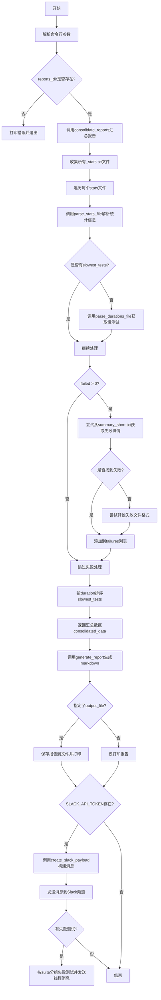
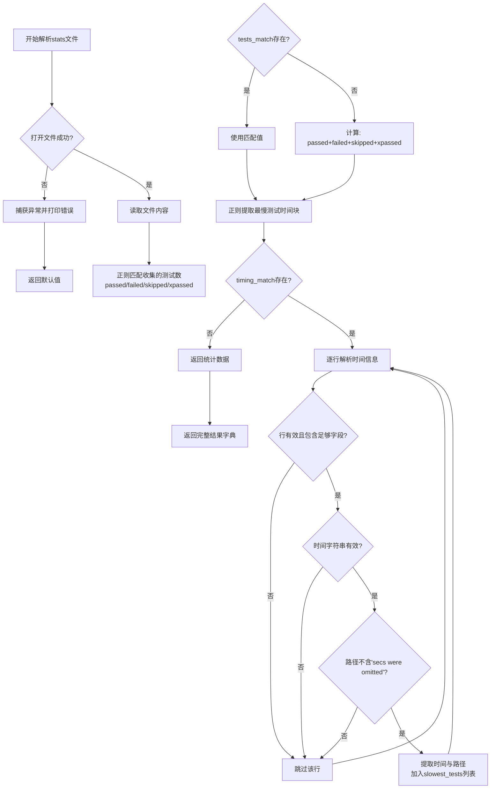
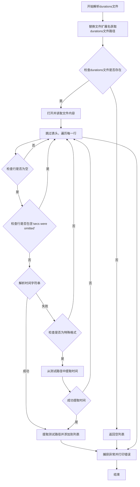
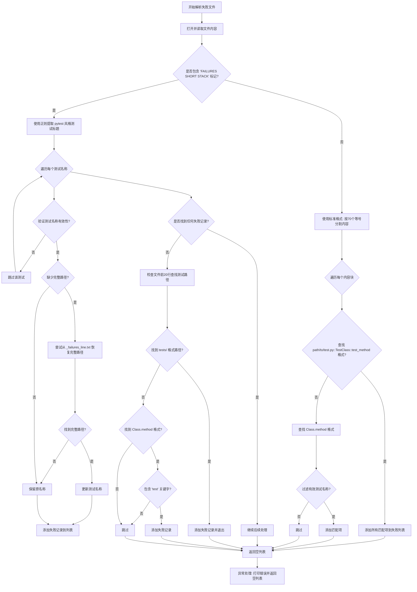
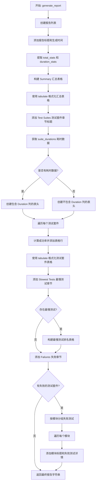
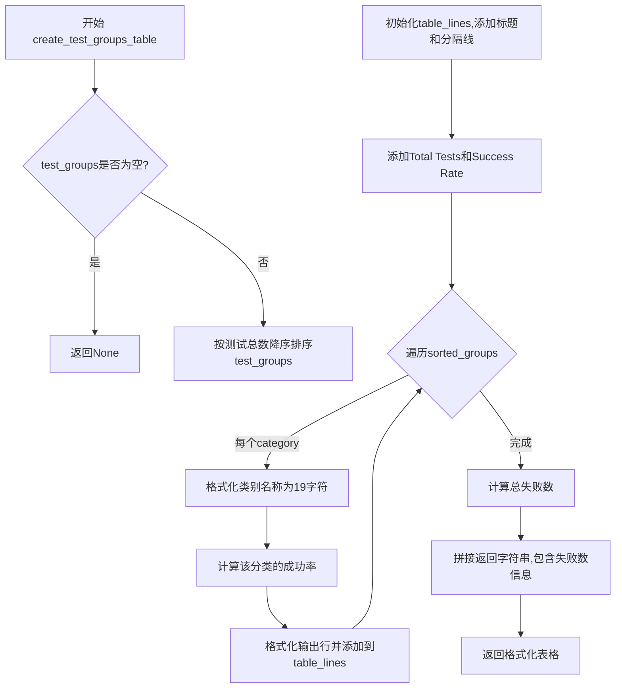
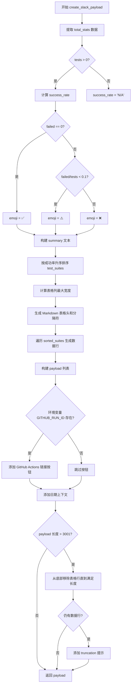
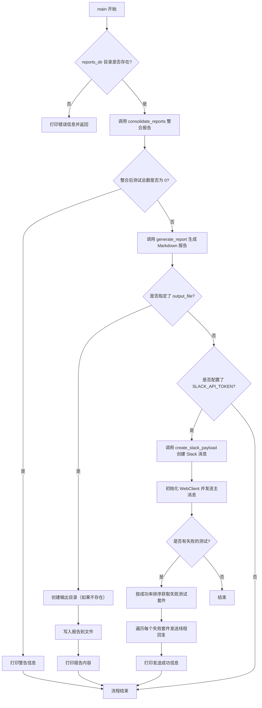

# `diffusers\utils\consolidated_test_report.py` 详细设计文档

该脚本是一个测试报告汇总工具，用于解析diffusers项目的pytest测试结果文件（stats、durations、failures等），生成汇总统计信息，并可选择生成markdown格式报告或通过Slack Webhook发送测试结果摘要到指定频道。

## 整体流程



## 类结构

```
无类层次结构（纯函数式编程）
所有函数均为模块级函数
```

## 全局变量及字段


### `MAX_LEN_MESSAGE`
    
Slack消息最大字符数限制（3001）

类型：`int`
    


    

## 全局函数及方法


### `parse_stats_file`

解析stats文件，提取测试统计数据（包括收集的测试数、通过数、失败数、跳过数以及最慢测试的执行时间信息）。

参数：

- `file_path`：`str`，待解析的stats文件路径

返回值：`dict`，包含以下键的字典：
- `tests` (`int`)：收集的测试总数
- `passed` (`int`)：通过的测试数量
- `failed` (`int`)：失败的测试数量
- `skipped` (`int`)：跳过的测试数量
- `slowest_tests` (`list[dict]`)：最慢测试列表，每个元素包含 `test`（测试路径字符串）和 `duration`（执行时长秒数）

#### 流程图



#### 带注释源码

```python
def parse_stats_file(file_path):
    """Parse a stats file to extract test statistics."""
    try:
        # 打开并读取stats文件内容
        with open(file_path, "r") as f:
            content = f.read()

            # 定义正则表达式模式，匹配pytest输出的各项统计数据
            tests_pattern = r"collected (\d+) items"       # 收集的总测试数
            passed_pattern = r"(\d+) passed"              # 通过的测试数
            failed_pattern = r"(\d+) failed"               # 失败的测试数
            skipped_pattern = r"(\d+) skipped"             # 跳过的测试数
            xpassed_pattern = r"(\d+) xpassed"             # 意外通过的测试数

            # 使用正则搜索各模式
            tests_match = re.search(tests_pattern, content)
            passed_match = re.search(passed_pattern, content)
            failed_match = re.search(failed_pattern, content)
            skipped_match = re.search(skipped_pattern, content)
            xpassed_match = re.search(xpassed_pattern, content)

            # 提取数值，匹配不到时默认为0
            passed = int(passed_match.group(1)) if passed_match else 0
            failed = int(failed_match.group(1)) if failed_match else 0
            skipped = int(skipped_match.group(1)) if skipped_match else 0
            xpassed = int(xpassed_match.group(1)) if xpassed_match else 0

            # 如果存在collected项则使用，否则通过各项相加计算总数
            if tests_match:
                tests = int(tests_match.group(1))
            else:
                tests = passed + failed + skipped + xpassed

            # 提取最慢测试的时间信息（位于"slowest N test durations"和"====="之间）
            timing_pattern = r"slowest \d+ test durations[\s\S]*?\n([\s\S]*?)={70}"
            timing_match = re.search(timing_pattern, content, re.MULTILINE)
            slowest_tests = []

            # 如果找到时间信息块，则逐行解析
            if timing_match:
                timing_text = timing_match.group(1).strip()
                test_timing_lines = timing_text.split("\n")
                
                for line in test_timing_lines:
                    if line.strip():
                        # 典型格式: "10.37s call     tests/path/to/test.py::TestClass::test_method"
                        parts = line.strip().split()
                        if len(parts) >= 3:
                            time_str = parts[0]              # 如 "10.37s"
                            test_path = " ".join(parts[2:])  # 测试路径

                            # 跳过被省略的条目
                            if "secs were omitted" in test_path:
                                continue

                            # 解析时间值（去除末尾的's'）
                            try:
                                time_seconds = float(time_str.rstrip("s"))
                                slowest_tests.append({
                                    "test": test_path, 
                                    "duration": time_seconds
                                })
                            except ValueError:
                                pass  # 解析失败时跳过该行

            # 返回解析结果字典
            return {
                "tests": tests,
                "passed": passed,
                "failed": failed,
                "skipped": skipped,
                "slowest_tests": slowest_tests,
            }
    except Exception as e:
        # 异常处理：打印错误并返回默认值
        print(f"Error parsing {file_path}: {e}")
        return {
            "tests": 0, 
            "passed": 0, 
            "failed": 0, 
            "skipped": 0, 
            "slowest_tests": []
        }
```


### `parse_durations_file`

该函数用于解析pytest生成的durations文件，提取测试耗时信息，并将结果作为测试名称和持续时间的字典列表返回。

参数：

- `file_path`：`str`，stats文件的路径，用于推导对应的durations文件路径

返回值：`List[Dict[str, Union[str, float]]]`，返回包含测试路径和持续时间的字典列表，每个字典包含`test`（测试路径字符串）和`duration`（耗时秒数，浮点数）字段

#### 流程图



#### 带注释源码

```python
def parse_durations_file(file_path):
    """Parse a durations file to extract test timing information."""
    # 初始化返回列表，用于存储最慢的测试及其耗时
    slowest_tests = []
    try:
        # 通过替换文件扩展名来获取对应的durations文件路径
        # 例如: tests_pipeline_cuda_stats.txt -> tests_pipeline_cuda_durations.txt
        durations_file = file_path.replace("_stats.txt", "_durations.txt")
        
        # 检查durations文件是否存在
        if os.path.exists(durations_file):
            # 打开文件并读取全部内容
            with open(durations_file, "r") as f:
                content = f.read()

                # 跳过第一行表头，遍历剩余的所有行
                for line in content.split("\n")[1:]:
                    # 跳过空行
                    if line.strip():
                        # 典型的行格式: "10.37s call     tests/path/to/test.py::TestClass::test_method"
                        # 使用空格分割行，获取各个部分
                        parts = line.strip().split()
                        
                        # 确保行至少有3个部分（时间、类型、测试路径）
                        if len(parts) >= 3:
                            # 提取时间字符串（可能包含's'后缀，如"10.37s"）
                            time_str = parts[0]
                            # 提取测试路径（从第3个部分开始，因为第2个部分是"call"等类型）
                            test_path = " ".join(parts[2:])

                            # 跳过包含"secs were omitted"的行（这些是被省略的短测试）
                            if "secs were omitted" in test_path:
                                continue

                            # 尝试将时间字符串转换为浮点数
                            try:
                                # 去除末尾的's'后缀并转换为浮点数
                                time_seconds = float(time_str.rstrip("s"))
                                # 将测试路径和耗时添加到结果列表
                                slowest_tests.append({"test": test_path, "duration": time_seconds})
                            except ValueError:
                                # 如果时间字符串不是有效浮点数，可能使用了不同格式
                                # 例如，某些pytest格式显示"< 0.05s"或类似格式
                                if test_path.startswith("<") and "secs were omitted" in test_path:
                                    # 处理时间在测试路径本身中的条目
                                    # 格式例如: "< 0.05 secs were omitted"
                                    try:
                                        # 使用正则表达式从test_path中提取数字时间值
                                        dur_match = re.search(r"(\d+(?:\.\d+)?)", test_path)
                                        if dur_match:
                                            time_seconds = float(dur_match.group(1))
                                            slowest_tests.append({"test": test_path, "duration": time_seconds})
                                    except ValueError:
                                        pass  # 忽略无法解析的条目
    except Exception as e:
        # 捕获并打印任何异常，避免程序崩溃
        print(f"Error parsing durations file {file_path.replace('_stats.txt', '_durations.txt')}: {e}")

    # 返回最慢测试的列表
    return slowest_tests
```


### `parse_failures_file`

该函数用于解析测试失败文件，提取失败测试的详细信息，包括测试名称和错误描述，支持多种 pytest 输出格式（如短格式、标准格式等），并尝试从辅助文件中恢复完整的测试路径。

参数：

- `file_path`：`str`，待解析的失败测试文件路径

返回值：`list[dict]`，返回包含失败测试信息的字典列表，每个字典包含 `"test"`（测试名称）、`error`（错误描述）和 `"original_test_name"`（原始测试名称）字段

#### 流程图



#### 带注释源码

```python
def parse_failures_file(file_path):
    """Parse a failures file to extract failed test details."""
    failures = []
    try:
        with open(file_path, "r") as f:
            content = f.read()

            # We don't need the base file name anymore as we're getting test paths from summary

            # Check if it's a short stack format
            if "============================= FAILURES SHORT STACK =============================" in content:
                # First, look for pytest-style failure headers with underscores and clean them up
                # 正则匹配: 至少5个下划线 + 空格 + 非下划线的测试名 + 空格 + 至少5个下划线
                test_headers = re.findall(r"_{5,}\s+([^_\n]+?)\s+_{5,}", content)

                for test_name in test_headers:
                    test_name = test_name.strip()
                    # Make sure it's a valid test name (contains a dot and doesn't look like a number)
                    # 有效测试名必须包含点号，且不能是纯数字
                    if "." in test_name and not test_name.replace(".", "").isdigit():
                        # For test names missing the full path, check if we can reconstruct it from failures_line.txt
                        # This is a best effort - we won't always have the line file available
                        # 如果测试名缺少完整路径（不以.py结尾，不包含::和/），尝试从line文件恢复
                        if not test_name.endswith(".py") and "::" not in test_name and "/" not in test_name:
                            # Try to look for a corresponding line file
                            # 构造对应的line文件路径: _failures_short.txt -> _failures_line.txt
                            line_file = file_path.replace("_failures_short.txt", "_failures_line.txt")
                            if os.path.exists(line_file):
                                try:
                                    with open(line_file, "r") as lf:
                                        line_content = lf.read()
                                        # Look for test name in line file which might have the full path
                                        # 使用正则从line文件中查找完整测试路径
                                        path_match = re.search(
                                            r"(tests/[\w/]+\.py::[^:]+::" + test_name.split(".")[-1] + ")",
                                            line_content,
                                        )
                                        if path_match:
                                            test_name = path_match.group(1)
                                except Exception:
                                    pass  # If we can't read the line file, just use what we have

                        failures.append(
                            {
                                "test": test_name,
                                "error": "Error occurred",
                                "original_test_name": test_name,  # Keep original for reference
                            }
                        )

                # If we didn't find any pytest-style headers, try other formats
                if not failures:
                    # Look for test names at the beginning of the file (in first few lines)
                    first_lines = content.split("\n")[:20]  # Look at first 20 lines
                    for line in first_lines:
                        # Look for test names in various formats
                        # Format: tests/file.py::TestClass::test_method
                        path_match = re.search(r"(tests/[\w/]+\.py::[\w\.]+::\w+)", line)
                        # Format: TestClass.test_method
                        class_match = re.search(r"([A-Za-z][A-Za-z0-9_]+\.[A-Za-z][A-Za-z0-9_]+)", line)

                        if path_match:
                            test_name = path_match.group(1)
                            failures.append(
                                {"test": test_name, "error": "Error occurred", "original_test_name": test_name}
                            )
                            break  # Found a full path, stop looking
                        elif class_match and "test" in line.lower():
                            test_name = class_match.group(1)
                            # Make sure it's likely a test name (contains test in method name)
                            if "test" in test_name.lower():
                                failures.append(
                                    {"test": test_name, "error": "Error occurred", "original_test_name": test_name}
                                )
            else:
                # Standard format - try to extract from standard pytest output
                # 标准格式: 按70个等号分割内容块
                failure_blocks = re.split(r"={70}", content)

                for block in failure_blocks:
                    if not block.strip():
                        continue

                    # Look for test paths in the format: path/to/test.py::TestClass::test_method
                    path_matches = re.findall(r"([\w/]+\.py::[\w\.]+::\w+)", block)
                    if path_matches:
                        for test_name in path_matches:
                            failures.append(
                                {"test": test_name, "error": "Error occurred", "original_test_name": test_name}
                            )
                    else:
                        # Try alternative format: TestClass.test_method
                        class_matches = re.findall(r"([A-Za-z][A-Za-z0-9_]+\.[A-Za-z][A-Za-z0-9_]+)", block)
                        for test_name in class_matches:
                            # Filter out things that don't look like test names
                            # 过滤掉以 e.g, i.e, etc. 开头、纯数字、或不包含 test 关键字的名称
                            if (
                                not test_name.startswith(("e.g", "i.e", "etc."))
                                and not test_name.isdigit()
                                and "test" in test_name.lower()
                            ):
                                failures.append(
                                    {"test": test_name, "error": "Error occurred", "original_test_name": test_name}
                                )

    except Exception as e:
        print(f"Error parsing failures in {file_path}: {e}")

    return failures
```


### `consolidate_reports`

该函数递归收集指定目录下所有测试套件的统计信息（包括测试数量、通过/失败/跳过计数），并汇总各套件中最慢的测试以及失败测试的详细信息，最终返回包含总体统计、测试套件详情、最慢测试列表和耗时统计的字典。

参数：

- `reports_dir`：`str`，包含测试报告的目录路径（会递归搜索所有子目录）

返回值：`dict`，返回包含以下键的字典：
- `total_stats`：总体统计信息（tests, passed, failed, skipped）
- `test_suites`：各测试套件的统计和失败信息
- `slowest_tests`：最慢的测试列表（按耗时降序，默认取前10个）
- `duration_stats`：耗时统计信息（总耗时和各套件耗时）

#### 流程图

```mermaid
flowchart TD
    A[开始 consolidate_reports] --> B[递归查找所有 *_stats.txt 文件]
    B --> C[初始化 results, total_stats, all_slow_tests]
    C --> D{遍历每个 stats_file}
    D --> E[从文件名提取测试套件名称]
    E --> F[包含父目录名称到套件名中]
    F --> G[调用 parse_stats_file 解析统计信息]
    G --> H{stats 中是否有 slowest_tests?}
    H -->|是| I[直接使用]
    H -->|否| J[调用 parse_durations_file 解析耗时文件]
    J --> I
    I --> K[更新 total_stats 计数]
    K --> L[收集 all_slow_tests]
    L --> M{stats['failed'] > 0?}
    M -->|是| N[查找 _summary_short.txt 文件]
    N --> O{文件存在且可解析?}
    O -->|是| P[提取失败测试路径和错误信息]
    O -->|否| Q[尝试 _failures_short.txt 等文件]
    Q --> R[调用 parse_failures_file 解析失败信息]
    R --> S[将失败信息添加到 results]
    M -->|否| S
    S --> T{继续处理下一个文件?}
    T -->|是| D
    T -->|否| U[过滤掉 'secs were omitted' 的条目]
    U --> V[按耗时降序排序]
    V --> W[从环境变量获取 SHOW_SLOWEST_TESTS, 默认10]
    W --> X[取前 N 个最慢测试]
    X --> Y[计算总耗时和每套件耗时]
    Y --> Z[返回汇总结果字典]
```

#### 带注释源码

```python
def consolidate_reports(reports_dir):
    """Consolidate test reports from multiple test runs, including from subdirectories."""
    # 递归查找 reports_dir 下所有的 *_stats.txt 文件（包括子目录）
    stats_files = glob.glob(f"{reports_dir}/**/*_stats.txt", recursive=True)

    # 初始化结果存储
    results = {}
    # 初始化总统计计数器
    total_stats = {"tests": 0, "passed": 0, "failed": 0, "skipped": 0}

    # 收集所有测试套件的最慢测试
    all_slow_tests = []

    # 遍历每个统计文件并处理
    for stats_file in stats_files:
        # 从文件名提取测试套件名（如 tests_pipeline_allegro_cuda_stats.txt -> pipeline_allegro_cuda）
        base_name = os.path.basename(stats_file).replace("_stats.txt", "")

        # 如果文件在子目录中，将父目录名称包含到套件名中
        rel_path = os.path.relpath(os.path.dirname(stats_file), reports_dir)
        if rel_path and rel_path != ".":
            # 如果目录名以 '_test_reports' 结尾则移除该后缀
            dir_name = os.path.basename(rel_path)
            if dir_name.endswith("_test_reports"):
                dir_name = dir_name[:-13]  # 移除 '_test_reports' 后缀
            base_name = f"{dir_name}/{base_name}"

        # 解析统计文件获取测试数据
        stats = parse_stats_file(stats_file)

        # 如果统计文件中没有最慢测试记录，则尝试从耗时文件解析
        if not stats.get("slowest_tests"):
            stats["slowest_tests"] = parse_durations_file(stats_file)

        # 更新总统计计数
        for key in ["tests", "passed", "failed", "skipped"]:
            total_stats[key] += stats[key]

        # 收集最慢测试并标记所属套件名
        for slow_test in stats.get("slowest_tests", []):
            all_slow_tests.append({
                "test": slow_test["test"],
                "duration": slow_test["duration"],
                "suite": base_name
            })

        # 解析失败测试信息（如果存在失败）
        failures = []
        if stats["failed"] > 0:
            # 优先尝试从 summary_short.txt 获取最佳格式的失败测试路径
            summary_file = stats_file.replace("_stats.txt", "_summary_short.txt")
            if os.path.exists(summary_file):
                try:
                    with open(summary_file, "r") as f:
                        content = f.read()
                        # 匹配格式：FAILED test_path - error_msg
                        failed_test_lines = re.findall(
                            r"FAILED\s+(tests/[\w/]+\.py::[A-Za-z0-9_\.]+::[A-Za-z0-9_]+)(?:\s+-\s+(.+))?",
                            content
                        )

                        if failed_test_lines:
                            for match in failed_test_lines:
                                test_path = match[0]
                                error_msg = match[1] if len(match) > 1 and match[1] else "No error message"
                                failures.append({"test": test_path, "error": error_msg})
                except Exception as e:
                    print(f"Error parsing summary file: {e}")

            # 如果 summary 文件中没有失败信息，尝试其他失败文件格式
            if not failures:
                failure_patterns = [
                    "_failures_short.txt",
                    "_failures.txt",
                    "_failures_line.txt",
                    "_failures_long.txt"
                ]

                for pattern in failure_patterns:
                    failures_file = stats_file.replace("_stats.txt", pattern)
                    if os.path.exists(failures_file):
                        failures = parse_failures_file(failures_file)
                        if failures:
                            break

        # 存储该测试套件的结果
        results[base_name] = {"stats": stats, "failures": failures}

    # 过滤掉包含 "secs were omitted" 的条目
    filtered_slow_tests = [
        test for test in all_slow_tests
        if "secs were omitted" not in test["test"]
    ]

    # 按耗时降序排序
    filtered_slow_tests.sort(key=lambda x: x["duration"], reverse=True)

    # 从环境变量获取要显示的最慢测试数量，默认为10
    num_slowest_tests = int(os.environ.get("SHOW_SLOWEST_TESTS", "10"))
    top_slowest_tests = filtered_slow_tests[:num_slowest_tests] if filtered_slow_tests else []

    # 计算总耗时
    total_duration = sum(test["duration"] for test in all_slow_tests)

    # 计算每个套件的耗时
    suite_durations = {}
    for test in all_slow_tests:
        suite_name = test["suite"]
        if suite_name not in suite_durations:
            suite_durations[suite_name] = 0
        suite_durations[suite_name] += test["duration"]

    # 返回汇总结果
    return {
        "total_stats": total_stats,
        "test_suites": results,
        "slowest_tests": top_slowest_tests,
        "duration_stats": {
            "total_duration": total_duration,
            "suite_durations": suite_durations
        },
    }
```


### `generate_report`

生成一个综合的 Markdown 格式的测试报告，包含汇总信息、测试套件统计、最慢测试列表以及按模块分组的失败测试详情。

参数：

-  `consolidated_data`：`dict`，整合后的测试数据，包含 total_stats（总统计数据）、test_suites（各测试套件详情）、slowest_tests（最慢测试列表）、duration_stats（耗时统计数据）等键

返回值：`str`，返回格式化的 Markdown 报告字符串

#### 流程图



#### 带注释源码

```python
def generate_report(consolidated_data):
    """Generate a comprehensive markdown report from consolidated data."""
    report = []  # 初始化报告列表，用于存储各部分内容

    # Add report header
    report.append("# Diffusers Nightly Test Report")  # 添加报告主标题
    report.append(f"Generated on: {datetime.now().strftime('%Y-%m-%d %H:%M:%S')}\n")  # 添加生成时间戳

    # Add summary section
    total = consolidated_data["total_stats"]  # 提取总统计数据
    report.append("## Summary")  # 添加汇总章节标题

    # Get duration stats if available
    duration_stats = consolidated_data.get("duration_stats", {})  # 获取耗时统计数据（可能不存在）
    total_duration = duration_stats.get("total_duration", 0)  # 获取总耗时

    # 构建汇总表格数据，包含测试总数、通过/失败/跳过数量、成功率和总耗时
    summary_table = [
        ["Total Tests", total["tests"]],
        ["Passed", total["passed"]],
        ["Failed", total["failed"]],
        ["Skipped", total["skipped"]],
        ["Success Rate", f"{(total['passed'] / total['tests'] * 100):.2f}%" if total["tests"] > 0 else "N/A"],
        ["Total Duration", f"{total_duration:.2f}s" if total_duration else "N/A"],
    ]

    report.append(tabulate(summary_table, tablefmt="pipe"))  # 使用 pipe 格式生成 Markdown 表格
    report.append("")  # 添加空行

    # Add test suites summary
    report.append("## Test Suites")  # 添加测试套件章节标题

    # Include duration in test suites table if available
    suite_durations = consolidated_data.get("duration_stats", {}).get("suite_durations", {})  # 获取各套件耗时

    # 根据是否有耗时数据选择不同的表头
    if suite_durations:
        suites_table = [["Test Suite", "Tests", "Passed", "Failed", "Skipped", "Success Rate", "Duration (s)"]]
    else:
        suites_table = [["Test Suite", "Tests", "Passed", "Failed", "Skipped", "Success Rate"]]

    # Sort test suites by success rate (ascending - least successful first)
    # 按成功率升序排序，使最不成功的测试套件排在前面
    sorted_suites = sorted(
        consolidated_data["test_suites"].items(),
        key=lambda x: (x[1]["stats"]["passed"] / x[1]["stats"]["tests"] * 100) if x[1]["stats"]["tests"] > 0 else 0,
        reverse=False,
    )

    # 遍历每个测试套件，构建表格行
    for suite_name, suite_data in sorted_suites:
        stats = suite_data["stats"]
        success_rate = f"{(stats['passed'] / stats['tests'] * 100):.2f}%" if stats["tests"] > 0 else "N/A"

        if suite_durations:
            duration = suite_durations.get(suite_name, 0)
            suites_table.append(
                [
                    suite_name,
                    stats["tests"],
                    stats["passed"],
                    stats["failed"],
                    stats["skipped"],
                    success_rate,
                    f"{duration:.2f}",
                ]
            )
        else:
            suites_table.append(
                [suite_name, stats["tests"], stats["passed"], stats["failed"], stats["skipped"], success_rate]
            )

    report.append(tabulate(suites_table, headers="firstrow", tablefmt="pipe"))  # 生成测试套件表格
    report.append("")

    # Add slowest tests section
    slowest_tests = consolidated_data.get("slowest_tests", [])  # 获取最慢测试列表
    if slowest_tests:
        report.append("## Slowest Tests")  # 添加最慢测试章节标题

        slowest_table = [["Rank", "Test", "Duration (s)", "Test Suite"]]  # 创建最慢测试表格
        for i, test in enumerate(slowest_tests, 1):
            # Skip entries that don't contain actual test names
            if "< 0.05 secs were omitted" in test["test"]:
                continue
            slowest_table.append([i, test["test"], f"{test['duration']:.2f}", test["suite"]])

        report.append(tabulate(slowest_table, headers="firstrow", tablefmt="pipe"))
        report.append("")

    # Add failures section if there are any
    # 筛选出有失败测试的套件
    failed_suites = [s for s in sorted_suites if s[1]["stats"]["failed"] > 0]

    if failed_suites:
        report.append("## Failures")  # 添加失败章节标题

        # Group failures by module for cleaner organization
        failures_by_module = {}  # 按模块分组失败测试

        for suite_name, suite_data in failed_suites:
            # Extract failures data for this suite
            for failure in suite_data.get("failures", []):
                test_name = failure["test"]

                # If test name doesn't look like a full path, try to reconstruct it
                # 尝试重构不完整的测试路径
                if not ("/" in test_name or "::" in test_name) and "." in test_name:
                    # For simple 'TestClass.test_method' format, try to get full path from suite name
                    if suite_name.startswith("tests_") and "_cuda" in suite_name:
                        component = suite_name.replace("tests_", "").replace("_cuda", "")
                        if "." in test_name:
                            class_name, method_name = test_name.split(".", 1)
                            possible_path = f"tests/{component}/test_{component}.py::{class_name}::{method_name}"
                            if "test_" in method_name:
                                test_name = possible_path

                # Extract module name from test name
                # 从测试名称中提取模块名
                if "::" in test_name:
                    parts = test_name.split("::")
                    module_name = parts[-2] if len(parts) >= 2 else "Other"
                elif "." in test_name:
                    parts = test_name.split(".")
                    module_name = parts[0]
                else:
                    module_name = "Other"

                # Skip module names that don't look like class/module names
                if (
                    module_name.startswith(("e.g", "i.e", "etc"))
                    or module_name.replace(".", "").isdigit()
                    or len(module_name) < 3
                ):
                    module_name = "Other"

                # Add to the module group
                if module_name not in failures_by_module:
                    failures_by_module[module_name] = []

                # Prepend the suite name if the test name doesn't already have a full path
                if "/" not in test_name and suite_name not in test_name:
                    full_test_name = f"{suite_name}::{test_name}"
                else:
                    full_test_name = test_name

                # Add this failure to the module group
                failures_by_module[module_name].append(
                    {"test": full_test_name, "original_test": test_name, "error": failure["error"]}
                )

        # Create a list of failing tests for each module
        if failures_by_module:
            for module_name, failures in sorted(failures_by_module.items()):
                report.append(f"### {module_name}")  # 添加模块子标题

                # Put all failed tests in a single code block
                report.append("```")
                for failure in failures:
                    # Show test path and error message if available
                    if failure.get("error") and failure["error"] != "No error message":
                        report.append(f"{failure['test']} - {failure['error']}")
                    else:
                        report.append(failure['test'])
                report.append("```")

                report.append("")  # Add space between modules
        else:
            report.append("*No detailed failure information available*")
            report.append("")

    return "\n".join(report)  # 将报告列表连接为字符串并返回
```


### `create_test_groups_table`

该函数接收测试分组数据、总数和成功率，生成一个格式化的markdown表格文本，展示各类别的测试总数、失败数和成功率，便于在报告中展示测试分组汇总信息。

参数：

- `test_groups`：`Dict[str, Dict[str, int]]`，键为分类名称，值为包含"total"和"failed"键的字典，表示该分类的测试总数和失败数
- `total_tests`：`int`，所有测试的总数
- `total_success_rate`：`str`，整体成功率字符串（如"95.00%"）

返回值：`str`，返回格式化的markdown表格文本，包含测试分组汇总信息；若test_groups为空则返回None

#### 流程图



#### 带注释源码

```python
def create_test_groups_table(test_groups, total_tests, total_success_rate):
    """
    Create a table-like format for test groups showing total tests and success rate.
    
    Args:
        test_groups: Dictionary mapping category name to dict with 'total' and 'failed' keys
        total_tests: Total number of tests across all categories
        total_success_rate: Overall success rate as a string
        
    Returns:
        Formatted markdown table string, or None if test_groups is empty
    """
    # 空字典检查：若没有测试分组则直接返回None
    if not test_groups:
        return None

    # 按测试总数降序排列，便于查看最常测试的分组
    sorted_groups = sorted(test_groups.items(), key=lambda x: x[1]["total"], reverse=True)

    # 初始化表格内容，添加markdown代码块标记和标题
    table_lines = ["```"]
    table_lines.append("Test Results Summary")
    table_lines.append("-------------------")
    table_lines.append(f"Total Tests:  {total_tests:,}")
    table_lines.append(f"Success Rate: {total_success_rate}")
    table_lines.append("")
    # 添加表头，使用固定宽度分隔符对齐
    table_lines.append("Category            | Total Tests | Failed | Success Rate")
    table_lines.append("------------------- | ----------- | ------ | ------------")

    # 遍历每个测试分组，格式化输出行
    for category, stats in sorted_groups:
        # Pad category name to fixed width (19 chars)
        padded_cat = category[:19].ljust(19)  # Truncate if too long
        # Right-align counts
        padded_total = str(stats["total"]).rjust(11)
        padded_failed = str(stats["failed"]).rjust(6)
        # Calculate and format success rate
        if stats["total"] > 0:
            # 计算该分类的成功率：(总数-失败)/总数 * 100
            cat_success_rate = f"{((stats['total'] - stats['failed']) / stats['total'] * 100):.1f}%"
        else:
            cat_success_rate = "N/A"
        padded_rate = cat_success_rate.rjust(12)
        # 拼接完整的表格行
        table_lines.append(f"{padded_cat} | {padded_total} | {padded_failed} | {padded_rate}")

    # 关闭markdown代码块
    table_lines.append("```")

    # 计算所有分组的总失败数
    total_failures = sum(stats["failed"] for stats in test_groups.values())
    # 返回格式化字符串，包含失败数（单复数处理）
    return (
        f"*Test Groups Summary ({total_failures} {'failure' if total_failures == 1 else 'failures'}):*\n"
        + "\n".join(table_lines)
    )
```


### `create_slack_payload`

该函数负责将合并后的测试数据转换为符合 Slack 消息格式的 payload 结构，用于自动化报告推送。它根据测试成功率选择合适的表情符号、构建 Markdown 格式的测试套件表格、处理 Slack 按钮和上下文元素，并强制执行 3001 字符的消息长度限制以适配 Slack API 要求。

参数：

- `consolidated_data`：`dict`，包含合并后的测试统计数据，结构为 `{"total_stats": {...}, "test_suites": {...}, "slowest_tests": [...], "duration_stats": {...}}`

返回值：`list[dict]`，返回 Slack Block Kit 格式的消息块列表，每个块包含类型和内容，用于 `slack_sdk.WebClient.chat_postMessage` 的 `blocks` 参数

#### 流程图



#### 带注释源码

```python
def create_slack_payload(consolidated_data):
    """Create a concise Slack message payload from consolidated data."""
    # 从合并数据中提取总体统计信息
    total = consolidated_data["total_stats"]
    # 计算成功率，处理除零情况
    success_rate = f"{(total['passed'] / total['tests'] * 100):.2f}%" if total["tests"] > 0 else "N/A"

    # Determine emoji based on success rate
    # 根据失败测试数量选择合适的表情符号
    if total["failed"] == 0:
        emoji = "✅"  # 全部通过
    elif total["failed"] / total["tests"] < 0.1:
        emoji = "⚠️"  # 失败率小于 10%
    else:
        emoji = "❌"  # 失败率大于等于 10%

    # Create a more compact summary section
    # 构建摘要文本，包含 emoji、测试结果统计和可选的跳过数量
    summary = f"{emoji} *Diffusers Nightly Tests:* {success_rate} success ({total['passed']}/{total['tests']} tests"
    if total["skipped"] > 0:
        summary += f", {total['skipped']} skipped"
    summary += ")"

    # Create the test suites table in markdown format
    # 构建 Markdown 格式的测试套件表格
    table_lines = []
    table_lines.append("```")

    # Sort test suites by success rate (ascending - least successful first)
    # 按成功率升序排序，使失败率最高的套件显示在前面
    sorted_suites = sorted(
        consolidated_data["test_suites"].items(),
        key=lambda x: (x[1]["stats"]["passed"] / x[1]["stats"]["tests"] * 100) if x[1]["stats"]["tests"] > 0 else 0,
        reverse=False,
    )

    # Calculate max widths for proper alignment
    # 计算各列最大宽度以实现表格对齐
    max_suite_name_len = max(len(suite_name) for suite_name, _ in sorted_suites) if sorted_suites else 10
    max_suite_name_len = max(max_suite_name_len, len("Test Suite"))  # Ensure header fits

    # Create header with proper spacing (only Tests, Failed, Success Rate)
    # 生成表头，使用动态宽度进行对齐
    header = f"| {'Test Suite'.ljust(max_suite_name_len)} | {'Tests'.rjust(6)} | {'Failed'.rjust(6)} | {'Success Rate'.ljust(12)} |"
    separator = f"|:{'-' * max_suite_name_len}|{'-' * 7}:|{'-' * 7}:|:{'-' * 11}|"

    table_lines.append(header)
    table_lines.append(separator)

    # Add data rows with proper alignment
    # 遍历排序后的测试套件，生成数据行
    for suite_name, suite_data in sorted_suites:
        stats = suite_data["stats"]
        suite_success_rate = f"{(stats['passed'] / stats['tests'] * 100):.2f}%" if stats["tests"] > 0 else "N/A"

        row = f"| {suite_name.ljust(max_suite_name_len)} | {str(stats['tests']).rjust(6)} | {str(stats['failed']).rjust(6)} | {suite_success_rate.ljust(12)} |"

        table_lines.append(row)

    table_lines.append("```")

    # Create the Slack payload with character limit enforcement
    # 构建 Slack payload，使用 Block Kit 格式
    payload = [
        {"type": "section", "text": {"type": "mrkdwn", "text": summary}},
        {"type": "section", "text": {"type": "mrkdwn", "text": "\n".join(table_lines)}},
    ]

    # Add action button
    # 如果存在 GitHub Run ID，添加跳转到 GitHub Actions 的链接按钮
    if os.environ.get("GITHUB_RUN_ID"):
        run_id = os.environ["GITHUB_RUN_ID"]
        payload.append(
            {
                "type": "section",
                "text": {
                    "type": "mrkdwn",
                    "text": f"*<https://github.com/huggingface/diffusers/actions/runs/{run_id}|View full report on GitHub>*",
                },
            }
        )

    # Add date in more compact form
    # 添加生成日期的上下文元素
    payload.append(
        {
            "type": "context",
            "elements": [
                {
                    "type": "plain_text",
                    "text": f"Results for {date.today()}",
                },
            ],
        }
    )

    # Enforce 3001 character limit
    # Slack API 限制消息最多 3001 字符，需要进行截断处理
    payload_text = str(payload)
    if len(payload_text) > MAX_LEN_MESSAGE:
        # Truncate table if payload is too long
        # 从表格底部移除数据行直到满足长度限制
        original_table_lines = table_lines[:]
        while len(str(payload)) > MAX_LEN_MESSAGE and len(table_lines) > 3:  # Keep at least header and separator
            # Remove the last data row (but keep ``` at the end)
            table_lines.pop(-2)  # Remove second to last (last is the closing ```)

            # Recreate payload with truncated table
            payload[1] = {"type": "section", "text": {"type": "mrkdwn", "text": "\n".join(table_lines)}}

        # Add note if we had to truncate
        # 如果发生了截断，添加提示信息
        if len(table_lines) < len(original_table_lines):
            truncated_count = len(original_table_lines) - len(table_lines)
            table_lines.insert(-1, f"... {truncated_count} more test suites (truncated due to message limit)")
            payload[1] = {"type": "section", "text": {"type": "mrkdwn", "text": "\n".join(table_lines)}}

    return payload
```


### `create_failed_tests_by_suite_ordered`

该函数将失败的测试按测试套件分组，并按成功率升序排列，以便优先展示失败率最高的测试套件。

参数：

- `consolidated_data`：`dict`，包含已整合的测试数据，结构为 `{"total_stats": {...}, "test_suites": {suite_name: {"stats": {...}, "failures": [...]}}}` 的字典

返回值：`list[dict]`，返回失败测试套件的列表，每个元素包含 `suite_name`（套件名称）、`tests`（失败测试列表）、`success_rate`（成功率）

#### 流程图

```mermaid
flowchart TD
    A[开始: create_failed_tests_by_suite_ordered] --> B[获取consolidated_data中的test_suites]
    B --> C[按成功率升序排序test_suites]
    C --> D[初始化空列表failed_suite_tests]
    D --> E{遍历排序后的套件}
    E -->|套件有失败| F[检查suite_data['stats']['failed'] > 0]
    F --> G[初始化空列表suite_failures]
    G --> H{遍历套件的failures}
    H --> I{判断test_name格式}
    I -->|包含::和/| J[full_test_name = test_name]
    I -->|包含::或.| K{检查是否有/或suite_name}
    K -->|无| L[full_test_name = f'{suite_name}::{test_name}']
    K -->|有| M[full_test_name = test_name]
    I -->|其他| N[full_test_name = f'{suite_name}::{test_name}']
    J --> O[添加full_test_name到suite_failures]
    L --> O
    M --> O
    N --> O
    O --> H
    H -->|遍历完成| P[排序并去重suite_failures]
    P --> Q{检查suite_failures非空}
    Q -->|是| R[创建字典包含suite_name, tests, success_rate]
    R --> S[添加到failed_suite_tests]
    Q -->|否| E
    E -->|套件无失败| E
    E -->|遍历完成| T[返回failed_suite_tests]
```

#### 带注释源码

```python
def create_failed_tests_by_suite_ordered(consolidated_data):
    """Group failed tests by test suite, ordered by success rate (ascending)."""
    # 按成功率升序排序测试套件（最不成功的排在前面）
    sorted_suites = sorted(
        consolidated_data["test_suites"].items(),
        key=lambda x: (x[1]["stats"]["passed"] / x[1]["stats"]["tests"] * 100) if x[1]["stats"]["tests"] > 0 else 0,
        reverse=False,  # 升序排列
    )

    failed_suite_tests = []  # 存储失败套件的列表

    # 按成功率顺序处理套件
    for suite_name, suite_data in sorted_suites:
        # 仅处理有失败测试的套件
        if suite_data["stats"]["failed"] > 0:
            suite_failures = []  # 当前套件的失败测试列表

            # 遍历套件中的所有失败测试
            for failure in suite_data.get("failures", []):
                test_name = failure["test"]  # 获取测试名称

                # 尝试重建完整路径（如果test_name是部分路径）
                # 情况1: test_name已经包含完整路径 (如 tests/path/test.py::Class::method)
                if "::" in test_name and "/" in test_name:
                    full_test_name = test_name
                # 情况2: test_name是部分路径（包含::或.）
                elif "::" in test_name or "." in test_name:
                    # 如果test_name不包含/且不包含suite_name，则需要拼接
                    if "/" not in test_name and suite_name not in test_name:
                        full_test_name = f"{suite_name}::{test_name}"
                    else:
                        full_test_name = test_name
                # 情况3: 其他情况，直接拼接
                else:
                    full_test_name = f"{suite_name}::{test_name}"

                suite_failures.append(full_test_name)

            # 对套件内的测试进行排序和去重
            suite_failures = sorted(set(suite_failures))

            # 如果有失败测试，则添加到结果列表
            if suite_failures:
                failed_suite_tests.append(
                    {
                        "suite_name": suite_name,  # 套件名称
                        "tests": suite_failures,   # 失败测试列表
                        "success_rate": (suite_data["stats"]["passed"] / suite_data["stats"]["tests"] * 100)
                        if suite_data["stats"]["tests"] > 0
                        else 0,  # 计算成功率
                    }
                )

    # 返回按成功率排序的失败套件列表
    return failed_suite_tests
```


### `main`

该函数是整个测试报告整合工具的主入口点，负责协调整个报告生成和发送流程：验证报告目录存在性、调用报告整合模块、生成Markdown报告、保存到文件（可选）、以及将报告发送到Slack频道（当SLACK_API_TOKEN环境变量配置时）。

参数：

-  `args`：`argparse.Namespace`，包含命令行参数解析后的结果。具体包含以下属性：
  - `reports_dir`：str，测试报告所在目录路径（默认值为"reports"）
  -  `output_file`：str，生成的Markdown报告输出文件路径（默认为None，表示不保存文件）
  -  `slack_channel_name`：str，Slack频道名称用于发送报告（默认值为"diffusers-ci-nightly"）

返回值：`None`，该函数无返回值，主要通过打印和文件操作产生副作用

#### 流程图



#### 带注释源码

```python
def main(args):
    """主函数入口，协调整个报告生成和发送流程。
    
    参数:
        args: argparse.Namespace 对象，包含以下属性:
            - reports_dir: 测试报告目录路径
            - output_file: 输出文件路径（可选）
            - slack_channel_name: Slack 频道名称
    
    返回值:
        无返回值，主要通过打印和文件操作产生副作用
    """
    # 步骤1: 验证报告目录是否存在
    if not os.path.isdir(args.reports_dir):
        print(f"Error: Reports directory '{args.reports_dir}' does not exist.")
        return

    # 步骤2: 调用 consolidate_reports 整合所有测试报告数据
    # 该函数会递归扫描 reports_dir 下的所有 *_stats.txt 文件
    # 返回包含总统计、测试套件、最慢测试和时长统计的整合数据
    consolidated_data = consolidate_reports(args.reports_dir)

    # 步骤3: 检查是否找到任何测试结果
    if consolidated_data["total_stats"]["tests"] == 0:
        print(f"Warning: No test results found in '{args.reports_dir}' or its subdirectories.")

    # 步骤4: 生成 Markdown 格式的测试报告
    # 报告包含: 摘要、测试套件表格、最慢测试列表、失败详情等
    report = generate_report(consolidated_data)

    # 步骤5: 如果指定了输出文件路径，则保存报告到文件
    if args.output_file:
        # 创建父目录（如果不存在）
        output_dir = os.path.dirname(args.output_file)
        if output_dir and not os.path.exists(output_dir):
            os.makedirs(output_dir)

        # 写入 Markdown 报告到指定文件
        with open(args.output_file, "w") as f:
            f.write(report)

        # 保存到文件时同时打印到控制台
        print(report)

    # 步骤6: 如果配置了 Slack API Token，则发送报告到 Slack
    slack_token = os.environ.get("SLACK_API_TOKEN")
    if slack_token and args.slack_channel_name:
        # 创建 Slack 消息载荷（包含摘要和测试套件表格）
        payload = create_slack_payload(consolidated_data)

        try:
            # 初始化 Slack WebClient
            client = WebClient(token=slack_token)
            
            # 发送主消息到指定 Slack 频道
            response = client.chat_postMessage(
                channel=f"#{args.slack_channel_name}", 
                blocks=payload
            )
            print(f"Report sent to Slack channel: {args.slack_channel_name}")

            # 步骤7: 如果有失败的测试，发送详细的失败列表作为线程回复
            total = consolidated_data["total_stats"]
            if total["failed"] > 0:
                # 按成功率（从低到高）排序失败的测试套件
                failed_suites = create_failed_tests_by_suite_ordered(consolidated_data)
                
                # 遍历每个失败套件，发送独立的线程消息
                for suite_info in failed_suites:
                    suite_name = suite_info["suite_name"]
                    suite_tests = suite_info["tests"]
                    success_rate = suite_info["success_rate"]
                    
                    # 格式化消息文本，包含套件名称、成功率和失败测试列表
                    message_text = (
                        f"**{suite_name}** (Success Rate: {success_rate:.2f}%)\n```\n"
                        + "\n".join(suite_tests)
                        + "\n```"
                    )
                    
                    # 在主消息的线程中发送失败测试详情
                    client.chat_postMessage(
                        channel=f"#{args.slack_channel_name}",
                        thread_ts=response["ts"],  # 回复到主消息线程
                        text=message_text,  # 使用 text 而非 blocks 以支持 Markdown 格式
                    )
                
                print(f"Failed tests details sent as {len(failed_suites)} thread replies")
        except Exception as e:
            print(f"Error sending report to Slack: {e}")
```

## 关键组件


### 命令行参数解析

使用 argparse 解析命令行参数，提供 --slack_channel_name（Slack 频道名）、--reports_dir（报告目录）和 --output_file（输出文件路径）三个配置选项。

### 统计文件解析器

从 pytest 生成的 `*_stats.txt` 文件中提取测试统计数据，包括收集的测试数、通过/失败/跳过的测试数量，以及通过正则表达式解析最慢测试的执行时间信息。

### 时长文件解析器

解析 `*_durations.txt` 文件获取详细的测试执行时间信息，支持多种时间格式（如 "10.37s"），并过滤掉被省略的测试条目。

### 失败文件解析器

解析 `*_failures_short.txt`、`*_failures.txt` 等失败报告文件，提取失败测试的名称和错误信息，支持 pytest 风格和标准格式的输出解析。

### 报告整合模块

递归扫描报告目录下的所有统计文件，整合多个测试套件的结果数据，汇总总统计数据、最慢测试列表和各套件的失败信息，按执行时长排序最慢测试。

### Markdown 报告生成器

根据整合数据生成格式化的 Markdown 报告，包含测试摘要表格、测试套件列表（按成功率升序排列）、最慢测试排名以及按模块分组的失败测试详情。

### Slack 消息载荷构建器

构建符合 Slack Block Kit 格式的消息载荷，包含测试结果摘要和测试套件表格，根据成功率选择适当的 emoji，并强制执行 3001 字符的消息长度限制。

### Slack 集成模块

使用 slack_sdk 库的 WebClient 发送报告到指定 Slack 频道，主消息发送后，将失败测试按成功率升序排列作为线程回复逐个发送。

### 测试套件分组构建器

将失败测试按测试套件分组并按成功率升序排列，便于查看哪些套件问题最多，支持去重和排序操作。

## 问题及建议


### 已知问题

-   **异常处理过于宽泛**：多处使用 `except Exception as e` 捕获所有异常，无法针对特定错误类型进行差异化处理，导致错误诊断困难
-   **正则表达式未预编译**：代码中多次使用 `re.search` 和 `re.findall` 但未预先编译正则模式（如 `tests_pattern`, `passed_pattern` 等），每次调用都会重新编译，降低性能
-   **代码重复**：解析 `time_str` 和 `test_path` 的逻辑在 `parse_stats_file`、`parse_durations_file` 和 `parse_failures_file` 中多次重复出现
-   **函数职责过重**：`consolidate_reports` 和 `generate_report` 函数过长（分别超过 150 行），承担了过多职责，降低了可维护性
-   **缺少输入验证**：未对命令行参数（如 `reports_dir` 路径有效性）进行充分验证，也未检查 `SHOW_SLOWEST_TESTS` 环境变量是否为有效整数
-   **硬编码和魔法值**：Slack 消息长度限制 `MAX_LEN_MESSAGE = 3001`、文件后缀名 `_stats.txt`、`_durations.txt` 等硬编码在多处，分散且难以维护
-   **被移除代码的残留**：代码中存在多处 `# Removed ...` 注释及对应的空逻辑，表明功能被不完整移除，留下混乱痕迹
-   **文件路径处理**：直接使用字符串拼接构建路径（如 `file_path.replace("_stats.txt", "_durations.txt")），未考虑跨平台兼容性
-   **Slack Token 安全**：从环境变量读取 Slack Token 但未进行有效性检查或加密处理提示
-   **缺乏类型注解**：所有函数均无类型提示（Type Hints），降低了代码的可读性和静态分析工具的效能
-   **无测试覆盖**：整个代码库缺少单元测试或集成测试，难以保证重构或修改的安全性

### 优化建议

-   **预编译正则表达式**：在模块顶部使用 `re.compile()` 预编译所有正则模式，提升匹配性能
-   **提取公共解析逻辑**：将重复的测试路径和时间解析逻辑抽取为独立函数（如 `parse_test_duration_line`），减少代码冗余
-   **拆分大型函数**：将 `consolidate_reports` 拆分为 `load_stats_files`、`merge_duration_data`、`collect_failures` 等更小的函数；将 `generate_report` 拆分为独立模块
-   **完善异常处理**：针对特定异常（如 `FileNotFoundError`、`PermissionError`、`json.JSONDecodeError`）进行捕获，提供具体错误上下文和恢复建议
-   **添加类型注解**：为所有函数参数和返回值添加类型提示（如 `def parse_stats_file(file_path: str) -> dict[str, Any]:`）
-   **集中配置管理**：创建配置类或 dataclass 存储所有硬编码常量（如文件后缀名、默认值），便于统一修改
-   **清理废弃代码**：移除所有 `# Removed` 注释及相关的空逻辑，保持代码整洁
-   **添加参数校验**：使用 `argparse` 的 `type` 参数或添加自定义验证函数，确保 `reports_dir` 存在、`SHOW_SLOWEST_TESTS` 为正整数等
-   **引入日志框架**：使用 `logging` 模块替代 `print` 语句，便于配置日志级别和输出目标
-   **编写单元测试**：使用 `pytest` 为核心解析函数编写测试用例，覆盖正常和异常输入场景

## 其它


### 设计目标与约束

设计目标：
- 实现自动化测试报告汇总，将多个测试套件的结果整合为统一的Markdown报告
- 支持从递归子目录中收集测试结果文件
- 提供可选的Slack集成，将测试摘要自动发送到指定频道
- 支持命令行参数配置，包括报告目录、输出文件和Slack频道名称

约束条件：
- Slack消息长度限制为3001字符，超过限制时自动截断表格内容
- 依赖于特定文件命名约定（如`*_stats.txt`、`*_failures_short.txt`）
- 测试文件必须存在于本地文件系统，不支持远程文件获取

### 错误处理与异常设计

整体错误处理策略采用异常捕获与降级处理相结合的机制：
- `parse_stats_file`、`parse_durations_file`、`parse_failures_file`函数中使用try-except捕获文件读写异常，返回默认值而非中断程序执行
- 文件不存在时使用`os.path.exists()`进行前置检查，避免FileNotFoundError
- Slack发送失败时捕获`Exception`并打印错误信息，不阻塞主流程
- 正则表达式匹配失败时返回None，后续代码通过条件判断处理缺失数据
- 正则解析异常使用try-except捕获ValueError，确保单点解析失败不影响整体报告生成

### 数据流与状态机

数据流处理分为四个主要阶段：
1. **文件发现阶段**：使用`glob.glob()`递归扫描reports目录，识别所有`*_stats.txt`文件
2. **数据解析阶段**：对每个stats文件依次调用`parse_stats_file()`、`parse_durations_file()`、`parse_failures_file()`提取测试数据
3. **数据聚合阶段**：在`consolidate_reports()`中汇总所有测试套件的统计数据、最慢测试和失败信息
4. **报告生成阶段**：调用`generate_report()`将聚合数据转换为Markdown格式，`create_slack_payload()`生成Slack消息结构

状态转换通过函数调用链隐式管理：无输入→文件扫描→单文件解析→全局汇总→报告生成→（可选）Slack推送

### 外部依赖与接口契约

外部依赖：
- `slack_sdk.WebClient`：用于向Slack API发送消息，需配置`SLACK_API_TOKEN`环境变量
- `tabulate`：用于将Python数据结构格式化为Markdown表格
- `argparse`：标准库，用于命令行参数解析
- `glob`、`os`、`re`、`datetime`：标准库，用于文件操作和文本处理

接口契约：
- **命令行接口**：接受`--slack_channel_name`（默认diffusers-ci-nightly）、`--reports_dir`（默认reports）、`--output_file`（可选）三个参数
- **环境变量**：`SLACK_API_TOKEN`（Slack认证）、`GITHUB_RUN_ID`（生成GitHub链接）、`SHOW_SLOWEST_TESTS`（控制最慢测试显示数量，默认10）
- **文件输入约定**：扫描`*_stats.txt`文件，对应可能存在的`*_durations.txt`、`*_failures_short.txt`、`*_summary_short.txt`等辅助文件
- **输出格式**：Markdown格式的测试报告，包含Summary、Test Suites、Slowest Tests、Failures四个主要章节

### 性能考虑

内存使用：使用生成器模式处理大文件，避免一次性加载全部内容到内存；对于大量测试套件场景，聚合结果存储在字典中，内存占用与测试套件数量线性相关
时间复杂度：文件扫描使用`glob.glob(recursive=True)`为O(n)，单文件解析使用正则表达式为O(m)，整体时间复杂度为O(n*m)

### 安全性考虑

敏感信息保护：
- Slack Token通过环境变量传入，代码中不硬编码凭证
- 命令行参数`--output_file`需防止路径遍历攻击，建议添加路径验证逻辑
- 错误信息输出可能泄露文件路径，建议在生产环境对调试信息进行脱敏处理

### 配置管理

所有配置通过命令行参数和环境变量管理，无独立配置文件：
- CLI参数使用`argparse`定义，支持默认值覆盖
- 运行时环境变量用于动态控制行为（如GITHUB_RUN_ID、SHOW_SLOWEST_TESTS）
- 常量配置（如MAX_LEN_MESSAGE）定义在模块顶部，便于统一维护
    