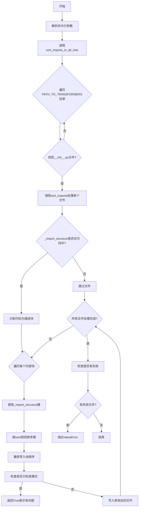
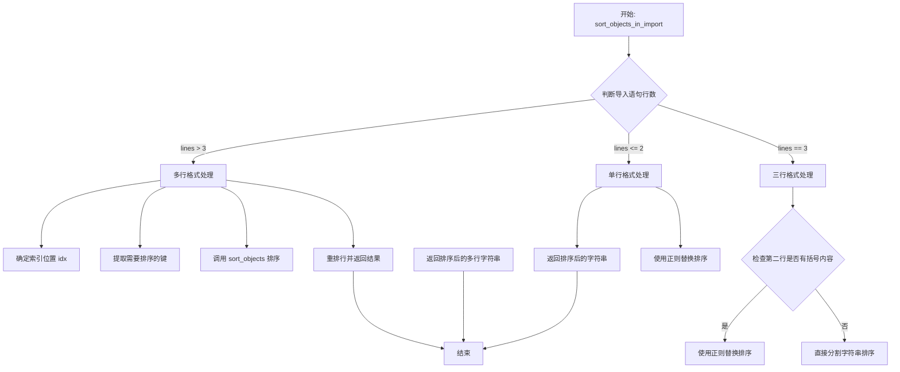
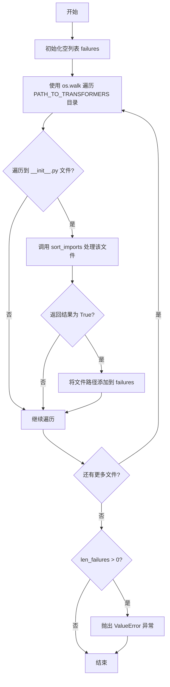

# `diffusers\utils\custom_init_isort.py` 详细设计文档

一个用于自动排序Diffusers库中自定义__init__.py文件里_import_structure字典导入项的工具，通过延迟导入机制优化导入速度，支持检查模式和自动修复模式。

## 整体流程



## 类结构

```
全局函数
├── get_indent
├── split_code_in_indented_blocks
├── ignore_underscore_and_lowercase
├── sort_objects
├── sort_objects_in_import
├── sort_imports
└── sort_imports_in_all_inits
```

## 全局变量及字段


### `PATH_TO_TRANSFORMERS`
    
The path to the diffusers source directory, used as the root for finding init files to process

类型：`str`
    


### `_re_indent`
    
Compiled regex pattern to extract indentation at the beginning of a line

类型：`re.Pattern`
    


### `_re_direct_key`
    
Compiled regex pattern to match direct dictionary keys in format "key":

类型：`re.Pattern`
    


### `_re_indirect_key`
    
Compiled regex pattern to match indirect dictionary keys in format _import_structure["key"]

类型：`re.Pattern`
    


### `_re_strip_line`
    
Compiled regex pattern to match and extract keys in format "key",

类型：`re.Pattern`
    


### `_re_bracket_content`
    
Compiled regex pattern to match any content within square brackets

类型：`re.Pattern`
    


    

## 全局函数及方法


### `get_indent`

该函数用于提取给定代码行的前导缩进（空格或制表符），返回缩进字符串；如果该行没有缩进则返回空字符串。

参数：

- `line`：`str`，需要检查缩进的代码行

返回值：`str`，返回该行的缩进字符串；如果没有缩进则返回空字符串

#### 流程图

```mermaid
graph TD
    A[开始: 输入line] --> B{正则表达式_re_indent.search匹配}
    B -->|匹配成功| C[获取groups()[0]]
    B -->|匹配失败| D[返回空字符串]
    C --> E[结束: 返回缩进字符串]
    D --> E
```

#### 带注释源码

```python
def get_indent(line: str) -> str:
    """Returns the indent in  given line (as string)."""
    # 使用预编译的正则表达式 _re_indent (r"^(\s*)\S") 搜索行首的缩进
    # 该正则匹配行首的连续空白字符（非捕获），直到遇到第一个非空白字符
    # 匹配结果的第一组（groups()[0]）即为缩进字符串
    search = _re_indent.search(line)
    # 如果没有匹配到（即行首就是非空白字符，或行为空），返回空字符串
    # 否则返回匹配到的缩进字符串
    return "" if search is None else search.groups()[0]
```


### `split_code_in_indented_blocks`

将代码按照指定的缩进级别分割成多个块，可选地从 `start_prompt` 开始到 `end_prompt` 结束，常用于解析 Python 文件中具有特定缩进的代码块。

参数：

- `code`：`str`，要分割的代码字符串
- `indent_level`：`str`，用于识别要分割的块的缩进级别（作为字符串）
- `start_prompt`：`str | None`，可选，如果提供则只在包含此文本的行开始分割
- `end_prompt`：`str | None`，可选，如果提供则在包含此文本的行停止分割

返回值：`List[str]`，分割后的代码块列表

#### 流程图

```mermaid
flowchart TD
    A[开始 split_code_in_indented_blocks] --> B{是否提供 start_prompt?}
    B -->|是| C[查找 start_prompt 所在行索引]
    B -->|否| D[设置 index = 0, blocks = []]
    C --> E[创建 blocks = 之前所有行]
    D --> F[current_block = [lines[index]]]
    F --> G[index += 1]
    G --> H{index < len(lines) 且<br/>未到达 end_prompt?}
    H -->|否| I[将 current_block 加入 blocks]
    H -->|是| J{当前行非空且缩进 == indent_level?}
    J -->|是| K{上一行缩进以 indent_level + 空格 开始?}
    J -->|否| L[将当前行加入 current_block]
    K -->|是| M[当前行属于当前块]
    K -->|否| N[当前行开始新块]
    M --> O[将 current_block 加入 blocks<br/>并创建新块]
    N --> P[保存当前块并创建新块]
    L --> Q[index += 1]
    O --> Q
    P --> Q
    I --> R{提供 end_prompt 且<br/>index < len(lines)?}
    R -->|是| S[添加剩余行到 blocks]
    R -->|否| T[返回 blocks]
    S --> T
```

#### 带注释源码

```python
def split_code_in_indented_blocks(
    code: str, indent_level: str = "", start_prompt: str | None = None, end_prompt: str | None = None
) -> List[str]:
    """
    Split some code into its indented blocks, starting at a given level.

    Args:
        code (`str`): The code to split.
        indent_level (`str`): The indent level (as string) to use for identifying the blocks to split.
        start_prompt (`str`, *optional*): If provided, only starts splitting at the line where this text is.
        end_prompt (`str`, *optional*): If provided, stops splitting at a line where this text is.

    Warning:
        The text before `start_prompt` or after `end_prompt` (if provided) is not ignored, just not split. The input `code`
        can thus be retrieved by joining the result.

    Returns:
        `List[str]`: The list of blocks.
    """
    # 将代码分割成行，并根据 start_prompt 定位起始索引
    index = 0
    lines = code.split("\n")
    if start_prompt is not None:
        # 找到 start_prompt 所在的行
        while not lines[index].startswith(start_prompt):
            index += 1
        # 包含 start_prompt 之前的所有行作为一个块
        blocks = ["\n".join(lines[:index])]
    else:
        # 没有 start_prompt，初始化空 blocks
        blocks = []

    # 初始化当前块为第一行（从 index 开始）
    current_block = [lines[index]]
    index += 1
    
    # 循环遍历直到到达 end_prompt 或文件末尾
    while index < len(lines) and (end_prompt is None or not lines[index].startswith(end_prompt)):
        # 判断是否为新块的开始：非空行且缩进等于目标缩进级别
        if len(lines[index]) > 0 and get_indent(lines[index]) == indent_level:
            # 检查上一行的缩进是否比目标缩进多一个空格
            # 如果是，说明当前行属于当前块的一部分（如闭合括号）
            if len(current_block) > 0 and get_indent(current_block[-1]).startswith(indent_level + " "):
                # 当前行属于当前块
                current_block.append(lines[index])
                blocks.append("\n".join(current_block))
                # 准备处理下一行
                if index < len(lines) - 1:
                    current_block = [lines[index + 1]]
                    index += 1
                else:
                    # 已到达最后一行
                    current_block = []
            else:
                # 当前行不属于当前块，开始新块
                blocks.append("\n".join(current_block))
                current_block = [lines[index]]
        else:
            # 将当前行添加到当前块
            current_block.append(lines[index])
        index += 1

    # 如果当前块非空，添加到结果中
    if len(current_block) > 0:
        blocks.append("\n".join(current_block))

    # 如果提供了 end_prompt，添加 end_prompt 之后的剩余行
    if end_prompt is not None and index < len(lines):
        blocks.append("\n".join(lines[index:]))

    return blocks
```


### `ignore_underscore_and_lowercase`

该函数是一个高阶函数，用于包装排序键函数，使其在排序时忽略下划线并将字符串转换为小写，从而实现更人性化的字母排序。

参数：

- `key`：`Callable[[Any], str]`，用于从对象中提取排序键的原始函数

返回值：`Callable[[Any], str]`，包装后的新函数，该函数将原始键函数的结果转换为小写并移除所有下划线

#### 流程图

```mermaid
flowchart TD
    A[开始] --> B[输入: key函数]
    B --> C[定义内部函数_inner]
    C --> D{调用_inner时}
    D --> E[应用key函数: key(x)]
    E --> F[转换为小写: .lower()]
    F --> G[移除下划线: .replace('_', '')]
    G --> H[返回处理后的字符串]
    H --> I[返回_inner函数]
    I --> J[结束]
    
    style A fill:#f9f,stroke:#333
    style J fill:#f9f,stroke:#333
```

#### 带注释源码

```python
def ignore_underscore_and_lowercase(key: Callable[[Any], str]) -> Callable[[Any], str]:
    """
    Wraps a key function (as used in a sort) to lowercase and ignore underscores.
    
    这个高阶函数接受一个键函数作为参数，返回一个新的函数。
    返回的函数会将键函数的结果转换为小写并移除所有下划线，
    从而在排序时实现更符合人类阅读习惯的字母顺序（忽略大小写和下划线）。
    
    例如：
        - "AutoModel" -> "automodel"
        - "my_function" -> "myfunction"
        - "BERT_MODEL" -> "bertmodel"
    """
    # 定义内部函数_inner，它会包装原始的key函数
    def _inner(x):
        # 1. 首先应用原始key函数获取字符串
        # 2. 转换为小写
        # 3. 移除所有下划线
        return key(x).lower().replace("_", "")

    # 返回包装后的函数
    return _inner
```


### `sort_objects`

该函数用于将对象列表按照 isort 规则进行排序：所有全大写的常量优先排列，其次是以大写字母开头的类名，最后是以小写字母开头的函数名。每组内按字母顺序（忽略下划线并转换为小写）排序。

参数：

- `objects`：`List[Any]`，需要排序的对象列表
- `key`：`Optional[Callable[[Any], str]]`，可选的键函数，用于从对象中提取排序用的字符串，默认使用恒等函数（仅当对象类型为字符串时可用）

返回值：`List[Any]`，排序后的列表，包含与输入相同的元素

#### 流程图

```mermaid
flowchart TD
    A[开始: sort_objects] --> B{key是否为None?}
    B -->|是| C[设置key为noop函数]
    B -->|否| D[使用提供的key函数]
    C --> E[提取常量: key(obj).isupper()]
    D --> E
    E --> F[提取类: key(obj)[0].isupper() 且 not key(obj).isupper()]
    F --> G[提取函数: not key(obj)[0].isupper()]
    G --> H[创建排序键: ignore_underscore_and_lowercase]
    H --> I[分别对常量、类、函数进行排序]
    I --> J[拼接排序结果: constants + classes + functions]
    J --> K[返回排序后的列表]
```

#### 带注释源码

```python
def sort_objects(objects: List[Any], key: Optional[Callable[[Any], str]] = None) -> List[Any]:
    """
    Sort a list of objects following the rules of isort (all uppercased first, camel-cased second and lower-cased
    last).

    Args:
        objects (`List[Any]`):
            The list of objects to sort.
        key (`Callable[[Any], str]`, *optional*):
            A function taking an object as input and returning a string, used to sort them by alphabetical order.
            If not provided, will default to noop (so a `key` must be provided if the `objects` are not of type string).

    Returns:
        `List[Any]`: The sorted list with the same elements as in the inputs
    """

    # 如果未提供key函数，定义一个恒等函数noop
    def noop(x):
        return x

    # 如果没有提供key，默认使用noop
    if key is None:
        key = noop
    
    # 常量：全部大写的对象排在最前面
    constants = [obj for obj in objects if key(obj).isupper()]
    
    # 类：不是全部大写但首字母大写的对象排在第二位
    classes = [obj for obj in objects if key(obj)[0].isupper() and not key(obj).isupper()]
    
    # 函数：以小写字母开头的对象排在最后
    functions = [obj for obj in objects if not key(obj)[0].isupper()]

    # 创建排序键：忽略下划线并转为小写
    key1 = ignore_underscore_and_lowercase(key)
    
    # 分别对三组进行排序并拼接返回
    return sorted(constants, key=key1) + sorted(classes, key=key1) + sorted(functions, key=key1)
```


### `sort_objects_in_import`

该函数用于对单个导入语句中的导入对象进行排序，支持多种格式（单行、多行、括号内），并遵循isort规则（常量优先，然后是类，最后是函数）。

参数：

- `import_statement`：`str`，需要排序的导入语句

返回值：`str`，排序后的导入语句

#### 流程图



#### 带注释源码

```python
def sort_objects_in_import(import_statement: str) -> str:
    """
    Sorts the imports in a single import statement.

    Args:
        import_statement (`str`): The import statement in which to sort the imports.

    Returns:
        `str`: The same as the input, but with objects properly sorted.
    """

    # This inner function sort imports between [ ].
    def _replace(match):
        # 从正则匹配中提取括号内的导入内容
        imports = match.groups()[0]
        # 如果只有一个导入，无需排序，直接返回
        if "," not in imports:
            return f"[{imports}]"
        # 分割导入项并去除空格和引号
        keys = [part.strip().replace('"', "") for part in imports.split(",")]
        # 如果最后一项为空（以逗号结尾），则移除最后一项
        if len(keys[-1]) == 0:
            keys = keys[:-1]
        # 调用 sort_objects 进行排序并重新组装为字符串
        return "[" + ", ".join([f'"{k}"' for k in sort_objects(keys)]) + "]"

    # 将导入语句按行分割
    lines = import_statement.split("\n")
    
    # 处理多行格式的导入（超过3行）
    if len(lines) > 3:
        # 格式示例:
        # key: [
        #     "object1",
        #     "object2",
        #     ...
        # ]
        
        # 根据第二行是否是 "[" 来确定需要跳过的行数
        idx = 2 if lines[1].strip() == "[" else 1
        # 提取需要排序的键值对（行索引，键名）
        keys_to_sort = [(i, _re_strip_line.search(line).groups()[0]) for i, line in enumerate(lines[idx:-idx])]
        # 使用 sort_objects 按键名排序
        sorted_indices = sort_objects(keys_to_sort, key=lambda x: x[1])
        # 根据排序后的索引重排行
        sorted_lines = [lines[x[0] + idx] for x in sorted_indices]
        # 重新组合所有行并返回
        return "\n".join(lines[:idx] + sorted_lines + lines[-idx:])
    
    # 处理三行格式的导入
    elif len(lines) == 3:
        # 格式示例:
        # key: [
        #     "object1", "object2", ...
        # ]
        
        # 检查中间行是否包含括号内容
        if _re_bracket_content.search(lines[1]) is not None:
            # 使用正则替换进行排序
            lines[1] = _re_bracket_content.sub(_replace, lines[1])
        else:
            # 直接分割字符串进行排序
            keys = [part.strip().replace('"', "") for part in lines[1].split(",")]
            # 处理末尾逗号的情况
            if len(keys[-1]) == 0:
                keys = keys[:-1]
            # 重新组合排序后的导入项，保持原始缩进
            lines[1] = get_indent(lines[1]) + ", ".join([f'"{k}"' for k in sort_objects(keys)])
        return "\n".join(lines)
    
    # 处理单行格式的导入
    else:
        # 使用正则替换排序括号内的内容
        import_statement = _re_bracket_content.sub(_replace, import_statement)
        return import_statement
```


### `sort_imports`

该函数用于对指定 `__init__.py` 文件中的 `_import_structure` 字典内的导入项进行排序，支持检查模式和自动修复模式。通过解析代码块、提取键、排序并重组，实现对延迟导入结构的规范化排序。

参数：

- `file`：`str`，需要检查/修复的 init 文件路径
- `check_only`：`bool`，可选，默认为 `True`。是否仅检查而不自动修复

返回值：`bool` 或 `None`，当 `check_only=True` 且文件需要修改时返回 `True`，否则返回 `None`

#### 流程图

```mermaid
flowchart TD
    A[开始: sort_imports] --> B[打开文件并读取代码]
    B --> C{代码中是否包含<br/>'_import_structure'?}
    C -->|否| D[直接返回]
    C -->|是| E[按缩进级别分割代码块<br/>start_prompt='_import_structure = {'<br/>end_prompt='if TYPE_CHECKING:']
    E --> F[遍历主代码块<br/>block_idx from 1 to len-2]
    F --> G[在当前块中查找<br/>包含'_import_structure'的行]
    G --> H{是否找到?}
    H -->|否| I[跳至下一块]
    H -->|是| J[提取内部块代码<br/>忽略首尾行]
    J --> K[按缩进级别分割内部块]
    K --> L{判断使用哪种模式<br/>'_import_structure = {' in line?}
    L -->|是| M[使用_direct_key正则]
    L -->|否| N[使用_indirect_key正则]
    M --> O[提取所有键<br/>包括空行/注释]
    N --> O
    O --> P[过滤出有效的键<br/>keys_to_sort]
    P --> Q[按字母顺序排序键]
    Q --> R[重新排序内部块<br/>保留空行和注释位置]
    R --> S[重组主块代码]
    S --> T[更新main_blocks列表]
    T --> F
    F --> U{所有块遍历完成?}
    U -->|否| F
    U --> V{代码是否有变化?}
    V -->|否| W[返回None]
    V -->|是| X{check_only模式?}
    X -->|是| Y[返回True]
    X -->|否| Z[打印覆盖信息并写入文件]
    Z --> AA[返回None]
```

#### 带注释源码

```python
def sort_imports(file: str, check_only: bool = True):
    """
    Sort the imports defined in the `_import_structure` of a given init.

    Args:
        file (`str`): The path to the init to check/fix.
        check_only (`bool`, *optional*, defaults to `True`): Whether or not to just check (and not auto-fix) the init.
    """
    # 打开文件并读取全部代码内容
    with open(file, encoding="utf-8") as f:
        code = f.read()

    # 如果文件不是自定义init（不包含_import_structure），则直接返回，无需处理
    if "_import_structure" not in code:
        return

    # 将代码按缩进级别分割成主块
    # 起始提示符：'_import_structure = {' 表示延迟导入结构的开始
    # 结束提示符：'if TYPE_CHECKING:' 表示类型检查部分的开始
    main_blocks = split_code_in_indented_blocks(
        code, start_prompt="_import_structure = {", end_prompt="if TYPE_CHECKING:"
    )

    # 遍历所有主块（忽略第0块：start_prompt之前的内容，和最后一块：end_prompt之后的内容）
    for block_idx in range(1, len(main_blocks) - 1):
        # 检查该块是否包含需要排序的_import_structure相关内容
        block = main_blocks[block_idx]
        block_lines = block.split("\n")

        # 定位到导入结构开始的行
        line_idx = 0
        while line_idx < len(block_lines) and "_import_structure" not in block_lines[line_idx]:
            # 跳过虚拟导入块（dummy import blocks）
            if "import dummy" in block_lines[line_idx]:
                line_idx = len(block_lines)
            else:
                line_idx += 1
        # 如果没找到相关行，跳过此块
        if line_idx >= len(block_lines):
            continue

        # 提取内部块代码（忽略首尾行，它们不包含实际内容）
        internal_block_code = "\n".join(block_lines[line_idx:-1])
        indent = get_indent(block_lines[1])  # 获取缩进级别
        
        # 按缩进级别1分割内部块
        internal_blocks = split_code_in_indented_blocks(internal_block_code, indent_level=indent)
        
        # 判断使用哪种键提取模式：
        # _import_structure = { 形式使用_direct_key正则
        # _import_structure["key"] 形式使用_indirect_key正则
        pattern = _re_direct_key if "_import_structure = {" in block_lines[0] else _re_indirect_key
        
        # 提取所有键（包括可能为None的空行或注释行）
        keys = [(pattern.search(b).groups()[0] if pattern.search(b) is not None else None) for b in internal_blocks]
        
        # 过滤出有效的键（排除None值）用于排序
        keys_to_sort = [(i, key) for i, key in enumerate(keys) if key is not None]
        # 按键的字母顺序排序，获取排序后的索引
        sorted_indices = [x[0] for x in sorted(keys_to_sort, key=lambda x: x[1])]

        # 重新排序内部块：保留空行和注释的位置，只对有效块进行排序
        count = 0
        reordered_blocks = []
        for i in range(len(internal_blocks)):
            if keys[i] is None:
                # 保持原样（空行或注释）
                reordered_blocks.append(internal_blocks[i])
            else:
                # 对有效导入块进行排序处理
                block = sort_objects_in_import(internal_blocks[sorted_indices[count]])
                reordered_blocks.append(block)
                count += 1

        # 重新组装主块：保留开头和结尾的行
        main_blocks[block_idx] = "\n".join(block_lines[:line_idx] + reordered_blocks + [block_lines[-1]])

    # 检查处理后的代码与原代码是否有差异
    if code != "\n".join(main_blocks):
        if check_only:
            # 仅检查模式：返回True表示需要修改
            return True
        else:
            # 自动修复模式：写入修改后的内容
            print(f"Overwriting {file}.")
            with open(file, "w", encoding="utf-8") as f:
                f.write("\n".join(main_blocks))
```


### `sort_imports_in_all_inits`

该函数遍历Diffusers仓库中所有的 `__init__.py` 文件，调用 `sort_imports` 函数对每个文件中的 `_import_structure` 字典里的导入进行排序检查或修复，并根据检查结果决定是否抛出异常。

参数：

- `check_only`：`bool`，可选，默认值为 `True`。表示是否仅检查而不自动修复导入排序。

返回值：`None`，无显式返回值。当 `check_only` 为 `True` 且存在需要修改的文件时，会抛出 `ValueError` 异常。

#### 流程图



#### 带注释源码

```python
def sort_imports_in_all_inits(check_only=True):
    """
    Sort the imports defined in the `_import_structure` of all inits in the repo.

    Args:
        check_only (`bool`, *optional*, defaults to `True`): Whether or not to just check (and not auto-fix) the init.
    """
    # 用于记录需要修改的文件路径列表
    failures = []
    # 遍历 PATH_TO_TRANSFORMERS 目录（值为 "src/diffusers"）
    for root, _, files in os.walk(PATH_TO_TRANSFORMERS):
        # 如果当前目录包含 __init__.py 文件
        if "__init__.py" in files:
            # 构建完整的文件路径
            file_path = os.path.join(root, "__init__.py")
            # 调用 sort_imports 函数检查/修复该文件的导入排序
            # 当 check_only=True 且文件需要修改时，result 为 True
            result = sort_imports(file_path, check_only=check_only)
            # 如果返回 True，表示文件需要修改且处于检查模式
            if result:
                # 将需要修改的文件路径添加到 failures 列表
                failures = [os.path.join(root, "__init__.py")]
    # 如果存在需要修改的文件
    if len(failures) > 0:
        # 抛出异常提示用户运行 make style 命令
        raise ValueError(f"Would overwrite {len(failures)} files, run `make style`.")
```

## 关键组件


### 延迟导入（Delayed Import / Lazy Loading）

Diffusers 使用延迟导入机制来避免在主 init 中加载所有模型，从而加快 `import transformers` 的速度。该脚本用于排序这些延迟导入结构中的内容。

### 正则表达式模式匹配（Regex Patterns）

使用多个正则表达式模式来识别代码中的不同结构：缩进检测、键值提取、行解析和括号内容提取。

### isort 兼容排序逻辑（isort-compatible Sorting）

实现了与 isort 相同的排序规则：常量（全大写）优先，类（CamelCase）次之，函数（全小写）最后，同时忽略下划线并忽略大小写进行排序。

### 缩进代码块分割（Indented Code Block Splitting）

将代码按缩进级别分割成独立的块，支持通过 `start_prompt` 和 `end_prompt` 指定起始和结束位置，用于处理 `_import_structure` 字典结构。

### 导入结构处理（Import Structure Processing）

遍历 `_import_structure` 字典中的所有键，识别直接键（`"key":`）和间接键（`_import_structure["key"]`），并对导入对象进行排序。

### 文件系统遍历与自动修复（Filesystem Traversal and Auto-fix）

递归遍历 `src/diffusers` 目录下的所有 `__init__.py` 文件，检查或自动修复导入排序问题，支持 `--check_only` 模式用于质量检查。

### 命令行接口（CLI Interface）

使用 argparse 提供命令行选项，支持 `--check_only` 参数用于切换检查模式和自动修复模式。


## 问题及建议


### 已知问题

-   **文件路径硬编码**：`PATH_TO_TRANSFORMERS = "src/diffusers"` 是硬编码的，缺乏灵活性和可配置性
-   **错误处理缺失**：文件读写操作没有异常处理，可能导致程序崩溃
-   **逻辑缺陷**：`sort_imports_in_all_inits`函数中的`failures`列表赋值逻辑错误，每次迭代都会覆盖而非追加，应改为`failures.append(os.path.join(root, "__init__.py"))`
-   **性能问题**：代码中多次使用`split("\n")`和`"\n".join()`进行字符串操作，效率较低
-   **类型提示不完整**：部分函数参数和返回值缺少类型注解，如`sort_objects_in_import`中的内部函数
-   **魔法数字/字符串**：`sort_objects_in_import`中存在魔法数字（如`idx = 2 if lines[1].strip() == "[" else 1`），缺乏注释说明其含义
-   **重复代码**：在`sort_objects_in_import`中解析import keys的逻辑有重复
-   **函数设计问题**：`sort_objects`函数每次调用时都重新定义内部`noop`函数，应该在外部定义以提高性能

### 优化建议

-   将`PATH_TO_TRANSFORMERS`改为可通过命令行参数或配置文件指定，提高灵活性
-   为所有文件读写操作添加try-except异常处理，提高代码健壮性
-   修复`failures`列表的赋值逻辑错误，改为追加操作
-   优化字符串处理逻辑，可考虑一次性分割后复用，或使用更高效的方式
-   补充完整的类型注解，提高代码可读性和可维护性
-   将魔法数字/字符串提取为命名常量，并添加注释说明
-   将内部`noop`函数提升到模块级别或使用functools.partial
-   考虑使用`pathlib`替代`os.path`提高代码可读性
-   添加单元测试覆盖边界情况，如空文件、格式错误的文件等

## 其它


### 设计目标与约束

本工具的设计目标是自动化排序Diffusers库中自定义__init__.py文件的_import_structure字典内的导入语句，以符合isort的排序规则。核心约束包括：1）仅处理包含_import_structure的延迟导入文件；2）保持文件原有格式和注释；3）支持check_only和auto-fix两种运行模式；4）遵循"常量→类→函数"的排序顺序。

### 错误处理与异常设计

错误处理机制主要包括：1）文件不存在或无读取权限时Python原生异常处理；2）对于不包含_import_structure的文件，函数直接返回而不报错；3）当检测到格式异常（如正则匹配失败）时，通过continue跳过该block继续处理；4）check_only模式下若检测到需要修改则返回True，调用方据此判断是否需要报错。

### 数据流与状态机

工具的数据流如下：1）parse阶段通过正则表达式识别_import_structure块的起始和结束；2）split阶段将代码按缩进级别分割为独立的blocks；3）extract阶段从每个block中提取待排序的key；4）sort阶段对keys进行排序（常量、类、函数分类排序）；5）reconstruct阶段将排好序的blocks重组为完整代码；6）output阶段根据check_only标志决定是否写入文件。

### 外部依赖与接口契约

主要外部依赖包括：1）argparse（标准库）用于命令行参数解析；2）os和re（标准库）用于文件操作和正则匹配；3）typing（标准库）用于类型注解。接口契约方面：sort_imports(file, check_only)接受文件路径和检查标志，返回True表示需要修改；sort_imports_in_all_inits(check_only)遍历PATH_TO_TRANSFORMERS目录下的所有__init__.py文件。

### 性能考虑

性能优化点包括：1）使用正则表达式预编译（模块级_re_*变量）；2）按需读取文件（不一次性加载所有文件到内存）；3）内部blocks处理采用增量式构建；4）使用os.walk而非递归遍历目录。

### 安全性考虑

安全性设计包括：1）仅处理指定的PATH_TO_TRANSFORMERS目录，防止路径遍历攻击；2）使用encoding="utf-8"明确编码避免编码问题；3）check_only模式默认开启，防止误修改；4）仅修改包含_import_structure的特定格式文件。

### 配置管理

配置通过命令行参数传入：--check_only标志用于切换检查/修复模式。PATH_TO_TRANSFORMERS定义为模块级常量，指向需要处理的源码目录。后续可考虑支持配置文件或环境变量扩展。

### 测试策略

测试覆盖应包括：1）单元测试：测试get_indent、sort_objects、sort_objects_in_import等纯函数；2）集成测试：使用示例__init__.py文件验证排序结果；3）边界测试：空文件、仅有TYPE_CHECKING文件、无效格式文件的处理；4）回归测试：确保不改变非目标文件内容。

### 使用示例

```bash
# 检查所有文件的导入排序情况（用于CI质量检查）
python utils/custom_init_isort.py --check_only

# 自动修复所有文件的导入排序（用于make style）
python utils/custom_init_isort.py

# 检查单个文件
python -c "from custom_init_isort import sort_imports; sort_imports('src/diffusers/pipelines/__init__.py', check_only=True)"
```

    