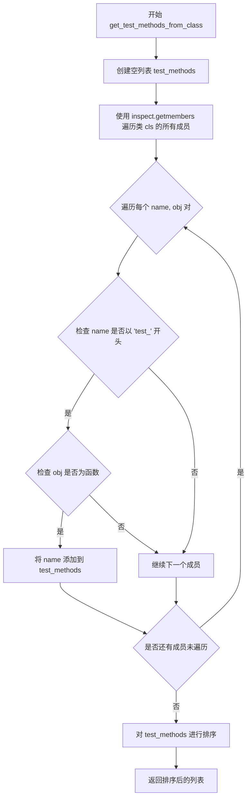
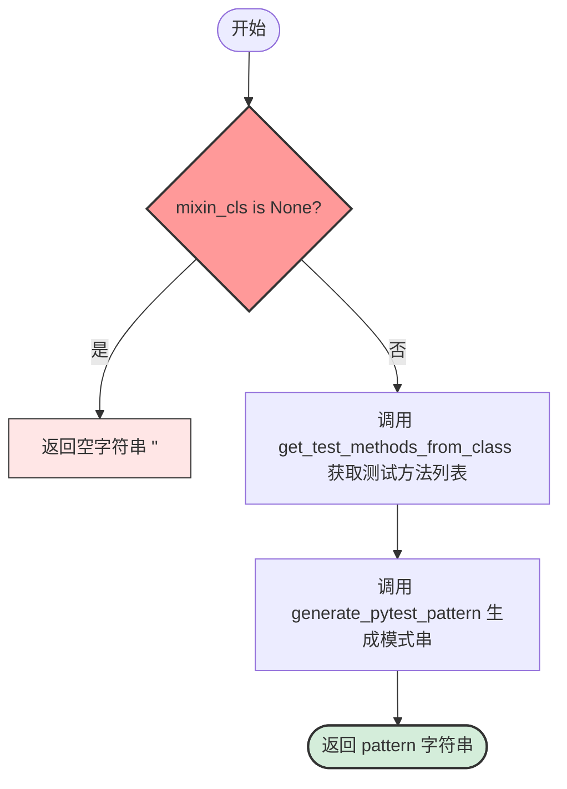

# `diffusers\utils\extract_tests_from_mixin.py` 详细设计文档

一个命令行工具脚本，用于根据用户输入的 --type 参数动态导入测试相关的 Mixin 类，并通过内省（inspect）该类获取所有以 'test_' 开头的方法，最后生成 pytest -k 命令所需的匹配模式字符串。

## 整体流程

```mermaid
graph TD
    Start([启动]) --> Parse[解析命令行参数 (argparse)]
    Parse --> CheckType{args.type == ?}
    CheckType -- 'pipeline' --> ImportPipeline[导入 PipelineTesterMixin]
    CheckType -- 'models' --> ImportModels[导入 ModelTesterMixin]
    CheckType -- 'lora' --> ImportLora[导入 PeftLoraLoaderMixinTests]
    CheckType -- other --> SetNone[mixin_cls = None]
    ImportPipeline --> Assign[mixin_cls = <Class>]
    ImportModels --> Assign
    ImportLora --> Assign
    SetNone --> Assign
    Assign --> CallFunc[调用 generate_pattern_for_mixin]
    CallFunc --> Inspect[调用 get_test_methods_from_class]
    Inspect --> Filter[筛选 test_ 开头的方法]
    Filter --> Join[调用 generate_pytest_pattern 拼接 or]
    Join --> Print[打印结果]
    style CheckType fill:#f9f,stroke:#333,stroke-width:2px
```

## 类结构

```
generate_pytest_pattern.py (Main Script)
├── 导入模块: argparse, inspect, sys, pathlib, typing
└── 外部依赖 (被导入的测试类):
    ├── PipelineTesterMixin (tests.pipelines.test_pipelines_common)
    ├── ModelTesterMixin (tests.models.test_modeling_common)
    └── PeftLoraLoaderMixinTests (tests.lora.utils)
```

## 全局变量及字段


### `root_dir`
    
项目根目录路径

类型：`Path`
    


### `parser`
    
命令行参数解析器

类型：`ArgumentParser`
    


### `args`
    
解析后的参数对象

类型：`Namespace`
    


### `mixin_cls`
    
当前上下文中引用的测试 Mixin 类

类型：`Type`
    


    

## 全局函数及方法


### `get_test_methods_from_class`

该函数接收一个类对象作为参数，利用 Python 的 `inspect` 模块遍历类的所有成员，筛选出以 `'test_'` 开头的函数方法，并返回按字母顺序排序的方法名列表，主要用于自动发现和收集测试类中的测试方法，以便后续生成 pytest 的 `-k` 参数模式匹配字符串。

参数：

- `cls`：`Type`，要遍历的类对象，用于从中提取测试方法

返回值：`List[str]`，返回按字母排序的测试方法名列表，只包含以 `'test_'` 开头的函数方法

#### 流程图



#### 带注释源码

```python
def get_test_methods_from_class(cls: Type) -> List[str]:
    """
    Get all test method names from a given class.
    Only returns methods that start with 'test_'.
    
    参数:
        cls (Type): 要检查的类对象，用于提取测试方法
        
    返回值:
        List[str]: 包含所有以 'test_' 开头的测试方法名，按字母排序
    """
    # 初始化空列表，用于存储测试方法名
    test_methods = []
    
    # 使用 inspect.getmembers 遍历类的所有成员（包括方法、属性等）
    # inspect.getmembers 返回 (name, value) 元组的列表
    for name, obj in inspect.getmembers(cls):
        # 筛选条件1: 方法名必须以 'test_' 开头（pytest 测试约定）
        if name.startswith("test_"):
            # 筛选条件2: 确保对象是一个函数（而非属性、类方法等）
            if inspect.isfunction(obj):
                # 将符合条件的方法名添加到列表中
                test_methods.append(name)
    
    # 对结果进行字母排序，确保输出顺序一致
    return sorted(test_methods)
```

---

### 文件整体运行流程

该脚本是一个命令行工具，用于生成特定测试类的 pytest 模式字符串。其整体运行流程如下：

1. **参数解析**：通过 `argparse` 接收 `--type` 参数，用于指定要处理的测试类类型
2. **条件导入**：根据 `type` 参数值，动态导入不同的测试混合类（Mixin）
3. **模式生成**：调用 `get_test_methods_from_class` 获取测试方法列表
4. **模式输出**：使用 `generate_pytest_pattern` 生成 pytest `-k` 参数可用的模式字符串并打印

---

### 关键组件信息

| 组件名称 | 一句话描述 |
|---------|-----------|
| `get_test_methods_from_class` | 核心函数，用于从类中提取所有以 `test_` 开头的测试方法名 |
| `generate_pytest_pattern` | 辅助函数，将测试方法列表转换为 pytest `-k` 参数的模式字符串 |
| `generate_pattern_for_mixin` | 包装函数，用于处理 mixin 类并生成对应的模式 |
| `root_dir` | 项目根目录路径，用于动态添加 sys.path |
| `parser` | 命令行参数解析器 |

---

### 潜在的技术债务或优化空间

1. **命名不一致**：在 `generate_pattern_for_mixin` 函数中，参数名为 `mixin_class`，但内部引用了 `mixin_cls`（应为 `mixin_class`），这是一个潜在的 bug
2. **缺乏错误处理**：没有对传入的 `cls` 参数进行类型检查，也没有处理 `inspect.getmembers` 可能抛出的异常
3. **魔法字符串**：`'test_'` 前缀硬编码在函数内部，如果项目采用不同的测试命名约定，函数将不适用
4. **缺少缓存机制**：如果多次调用同一类的相同方法，没有缓存机制会导致重复的 `inspect` 操作
5. **类型注解不完整**：`inspect.getmembers` 返回的类型注解缺失，且 `obj` 的类型推断可以更精确

---

### 其它项目

#### 设计目标与约束

- **设计目标**：自动化发现测试类中的测试方法，生成 pytest 模式以支持选择性运行特定测试
- **约束**：依赖 pytest 的 `test_` 命名约定，仅支持函数类型的测试方法

#### 错误处理与异常设计

- 当前实现缺乏显式的错误处理
- 建议添加：类型检查确保 `cls` 是有效类对象、处理 `ImportError` 异常、提供默认值或错误提示

#### 外部依赖与接口契约

- **依赖模块**：`argparse`（命令行解析）、`inspect`（反射机制）、`pathlib`（路径操作）、`typing`（类型注解）
- **接口契约**：输入有效的类对象，输出符合 pytest 约定的测试方法名列表


### `generate_pytest_pattern`

该函数接收测试方法名列表，使用字符串 `" or "` 将其连接，生成 pytest -k 参数所需的模式字符串。

**参数：**

- `test_methods`：`List[str]`，待处理的测试方法名列表

**返回值：** `str`，使用 `" or "` 连接后的模式字符串，用于 pytest 的 `-k` 参数

#### 流程图

```mermaid
graph LR
    A[输入: test_methods<br/>List[str]] --> B{检查列表是否为空}
    B -- 是 --> C[返回空字符串<br/>'']
    B -- 否 --> D[使用 ' or ' 连接<br/>" or ".join]
    D --> E[输出: pattern<br/>str]
```

#### 带注释源码

```python
def generate_pytest_pattern(test_methods: List[str]) -> str:
    """
    Generate pytest pattern string for the -k flag.
    
    该函数接收一个测试方法名列表，将其用 ' or ' 连接起来，
    生成可供 pytest -k 参数使用的模式匹配字符串。
    
    参数:
        test_methods (List[str]): 测试方法名列表，例如 ['test_method_a', 'test_method_b']
    
    返回值:
        str: 连接后的字符串，例如 'test_method_a or test_method_b'
              当列表为空时返回空字符串 ''
    """
    return " or ".join(test_methods)
```


### `generate_pattern_for_mixin`

该函数是顶层逻辑函数，接收 Mixin 类作为参数，调用测试方法获取和模式生成两个内部函数来构建 pytest 的 -k 标志所需的模式串。然而，代码中存在变量引用风险：函数参数定义为 `mixin_class`，但内部实际使用的是外部变量 `mixin_cls`，导致参数未被正确使用。

参数：

- `mixin_class`：`Type`，待处理的 Mixin 类类型，用于从中提取测试方法

返回值：`str`，生成的 pytest pattern 字符串，用于 pytest 的 -k 参数筛选

#### 流程图



#### 带注释源码

```python
def generate_pattern_for_mixin(mixin_class: Type) -> str:
    """
    Generate pytest pattern for a specific mixin class.
    
    从 Mixin 类中提取所有 test_ 开头的方法，
    并生成适用于 pytest -k 参数的模式匹配字符串。
    
    注意：代码中存在变量引用错误 - 使用了外部变量 mixin_cls
    而非函数参数 mixin_class，可能导致意外行为。
    """
    # 警告：此处应使用参数 mixin_class，而非外部变量 mixin_cls
    # 这是一个潜在的技术债务/ bug
    if mixin_cls is None:
        # 如果 mixin_cls 为 None，返回空字符串
        return ""
    
    # 从类中获取所有测试方法名
    test_methods = get_test_methods_from_class(mixin_class)
    
    # 生成 pytest -k 标志使用的模式串
    return generate_pytest_pattern(test_methods)
```

## 关键组件


### 命令行参数解析模块

使用 `argparse` 解析 `--type` 参数，支持三种类型：`pipeline`、`models`、`lora`，用于指定要生成测试模式的测试类别。

### 测试方法提取模块

`get_test_methods_from_class` 函数通过 `inspect` 模块遍历类的成员，筛选出所有以 `test_` 开头的函数方法，并返回排序后的方法名列表。

### pytest模式生成模块

`generate_pytest_pattern` 函数接收测试方法名列表，生成 pytest 的 `-k` 参数可用的模式字符串，使用 `or` 连接各测试方法名。

### mixin类处理模块

`generate_pattern_for_mixin` 函数根据传入的mixin类获取其测试方法，并生成对应的pytest模式字符串。

### 动态类导入模块

根据 `args.type` 的值，在运行时动态导入不同的测试mixin类：`PipelineTesterMixin`、`ModelTesterMixin` 或 `PeftLoraLoaderMixinTests`。


## 问题及建议


### 已知问题

-   **变量名不一致导致运行时错误**：`generate_pattern_for_mixin` 函数接收参数 `mixin_class`，但函数体内使用 `mixin_cls`，会导致 `NameError`
-   **缺少输入验证**：对命令行参数 `args.type` 没有校验，传入无效值时只返回空字符串，缺乏明确的错误提示
-   **硬编码的类导入**：不同的 mixin 类通过硬编码的 if-elif 分支导入，难以扩展和维护
-   **运行时导入风险**：导入语句在 `if __name__ == "__main__"` 块中，可能导致模块加载顺序问题和潜在的循环依赖
-   **空结果无区分**：`mixin_cls` 为 `None` 时返回空字符串，与"没有测试方法"的返回结果一致，无法区分是"未指定类型"还是"该类型无测试方法"
-   **类型注解不完整**：`get_test_methods_from_class` 函数的 `cls: Type` 参数注解过于宽泛，缺少运行时类型检查

### 优化建议

-   统一变量命名，将 `generate_pattern_for_mixin` 的参数改为 `mixin_cls` 或统一使用 `mixin_class`
-   添加命令行参数校验，当 `args.type` 无效时给出明确错误信息并退出
-   使用配置或注册表模式管理 type 到 mixin 类的映射，便于扩展
-   对 `generate_pattern_for_mixin` 函数的 `None` 输入添加明确处理逻辑或抛出自定义异常
-   考虑添加 `--list` 选项直接列出测试方法名而非仅生成模式
-   为关键函数添加更详细的文档字符串，说明参数约束和异常情况


## 其它


### 设计目标与约束

本工具的设计目标是根据不同的测试类型（pipeline、models、lora）动态生成pytest的-k模式字符串，以便开发者能够快速运行特定的测试用例集合。约束条件包括：1) 仅支持三种预定义的测试类型；2) 依赖于特定的测试模块结构（必须存在符合命名规范的test_开头的方法）；3) 必须在项目根目录下运行以确保正确的导入路径。

### 错误处理与异常设计

当前代码的错误处理机制较为简单。当传入无效的type参数时，mixin_cls保持为None，generate_pattern_for_mixin函数会返回空字符串，程序会打印空行。这种设计虽然不会导致程序崩溃，但可能造成用户困惑。建议增加以下错误处理：1) 当type参数无效时，输出明确的错误提示信息；2) 当导入模块失败时，捕获ImportError并给出有意义的错误信息；3) 当指定类型不存在时，提示用户可用的type选项。

### 外部依赖与接口契约

本脚本依赖以下外部组件：1) argparse模块 - 用于命令行参数解析；2) inspect模块 - 用于获取类的成员信息；3) pathlib模块 - 用于处理文件路径；4) typing模块 - 用于类型注解。接口契约方面，脚本期望被导入的mixin类必须包含以test_开头的测试方法，且这些方法必须是无参数的函数。不同的测试类型对应不同的模块路径：pipeline类型对应tests.pipelines.test_pipelines_common.PipelineTesterMixin，models类型对应tests.models.test_modeling_common.ModelTesterMixin，lora类型对应tests.lora.utils.PeftLoraLoaderMixinTests。

### 使用示例与运行方式

基本运行方式：python script_name.py --type {pipeline|models|lora}。示例1：python generate_pytest_pattern.py --type pipeline，输出类似"test_pipeline_run 或 test_pipeline_save 或 test_pipeline_load"的模式字符串。示例2：python generate_pytest_pattern.py --type models，输出models相关的测试方法模式。示例3：python generate_pytest_pattern.py --type lora，输出lora相关的测试方法模式。该输出通常与pytest的-k参数配合使用，如：pytest tests/ -k "$(python generate_pytest_pattern.py --type pipeline)"。

### 数据流与状态机

数据流如下：1) 解析命令行参数获取type值；2) 根据type值选择要导入的模块和类；3) 调用get_test_methods_from_class获取该类的所有test_开头的方法名；4) 调用generate_pytest_pattern将这些方法名用" or "连接成模式字符串；5) 打印模式字符串供外部使用。状态机表现：程序是一个简单的线性流程，没有复杂的状态转换，但可以根据type参数的值分为三个主要分支状态（pipeline状态、models状态、lora状态），以及一个默认的None状态。

### 边界条件与限制

边界条件包括：1) 当type参数为空时，使用默认值None，此时mixin_cls为None；2) 当指定的mixin类中没有test_开头的方法时，返回空列表，最终输出空字符串；3) 当inspect.getmembers返回的结果中包含非函数对象（如属性）时，通过inspect.isfunction进行过滤；4) 方法名排序使用sorted确保输出顺序一致。限制条件：1) 只能处理三种预定义的测试类型；2) 依赖于项目特定的目录结构和模块命名；3) 必须在Python 3.x环境下运行；4) root_dir的获取假设脚本位于项目合理深度的目录中。

### 性能考虑与优化建议

当前实现中，每次运行都会导入所有可能的模块（即使只使用其中一个），这会增加启动时间。优化建议：1) 将模块导入从if-elif块中延迟到函数内部，只有在实际需要时才导入对应的模块；2) 可以添加缓存机制，如果多次运行相同type，避免重复导入和分析；3) get_test_methods_from_class中使用inspect.getmembers可能获取较多成员，可以考虑使用hasattr进行预筛选减少开销。

### 版本兼容性说明

本代码使用Python 3的新特性：1) Type类型注解来自typing模块（Python 3.5+）；2) pathlib.Path（Python 3.4+）；3) f-string虽然未使用但代码风格应兼容Python 3.6+。最低Python版本建议为3.6，以确保所有依赖的模块和特性可用。


    