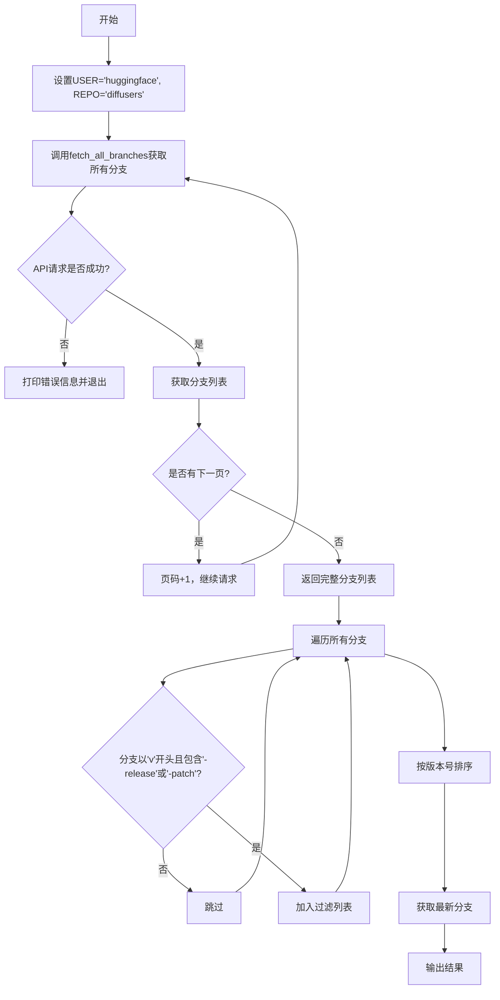
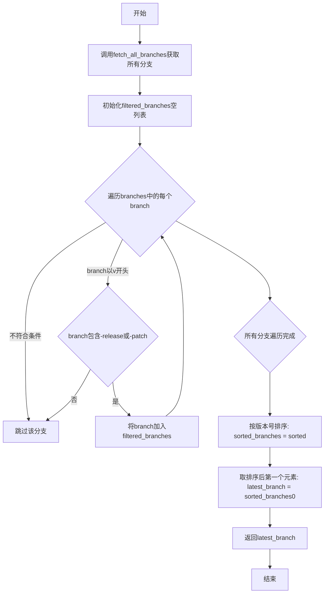

# `diffusers\utils\fetch_latest_release_branch.py` 详细设计文档

该脚本通过GitHub API获取huggingface/diffusers仓库的所有分支，过滤出以'v'开头且包含'-release'或'-patch'的版本分支，按版本号排序后返回最新的分支名称。

## 整体流程



## 类结构

```
该代码无类定义，仅包含全局函数和变量
```

## 全局变量及字段


### `USER`
    
GitHub用户名

类型：`string`
    


### `REPO`
    
GitHub仓库名

类型：`string`
    


    

## 全局函数及方法


### `fetch_all_branches`

该函数通过GitHub API分页获取指定仓库的所有分支名称，并返回一个包含所有分支名的列表。

参数：

- `user`：`str`，GitHub仓库所属的用户名或组织名
- `repo`：`str`，GitHub仓库名称

返回值：`List[str]`，返回仓库所有分支的名称列表

#### 流程图

```mermaid
flowchart TD
    A[开始] --> B[初始化: branches = [], page = 1]
    B --> C{循环请求GitHub API}
    C --> D[发送GET请求: /repos/{user}/{repo}/branches?page={page}]
    D --> E{检查响应状态码}
    E -->|200 成功| F[解析JSON获取分支名列表]
    E -->|非200| G[打印错误信息并退出循环]
    F --> H[将分支名添加到branches列表]
    H --> I{检查response.links中是否存在'next'}
    I -->|是| J[page += 1, 继续循环]
    I -->|否| K[退出循环]
    J --> C
    K --> L[返回branches列表]
    G --> L
```

#### 带注释源码

```python
def fetch_all_branches(user, repo):
    """
    获取指定GitHub仓库的所有分支名称
    
    参数:
        user: GitHub用户名或组织名
        repo: GitHub仓库名
    
    返回:
        包含所有分支名称的列表
    """
    branches = []  # List to store all branches - 存储所有分支的列表
    page = 1  # Start from first page - 从第一页开始
    
    while True:
        # Make a request to the GitHub API for the branches
        # 向GitHub API发送请求获取分支列表
        response = requests.get(
            f"https://api.github.com/repos/{user}/{repo}/branches",
            params={"page": page},      # 分页参数
            timeout=60,                 # 请求超时时间60秒
        )

        # Check if the request was successful
        # 检查请求是否成功（HTTP 200）
        if response.status_code == 200:
            # Add the branches from the current page to the list
            # 从当前页解析分支名称并添加到列表
            branches.extend([branch["name"] for branch in response.json()])

            # Check if there is a 'next' link for pagination
            # 检查响应中是否包含'next'链接用于分页
            if "next" in response.links:
                page += 1  # Move to the next page - 翻到下一页
            else:
                break  # Exit loop if there is no next page - 无下一页则退出
        else:
            # 请求失败时打印错误状态码
            print("Failed to retrieve branches:", response.status_code)
            break

    return branches  # 返回所有分支名称列表
```


### `main()`

主函数，负责执行分支过滤和排序逻辑，从 HuggingFace 的 diffusers 仓库获取所有分支，过滤出符合版本命名规范（v开头且包含-release或-patch）的分支，按版本号降序排序，并返回最新的版本分支。

参数：

- 该函数无参数

返回值：`str`，返回最新版本分支的名称

#### 流程图



#### 带注释源码

```python
def main():
    # Fetch all branches
    # 调用fetch_all_branches函数获取diffusers仓库的所有分支
    branches = fetch_all_branches(USER, REPO)

    # Filter branches.
    # 初始化过滤后的分支列表
    # print(f"Total branches: {len(branches)}")
    filtered_branches = []
    # 遍历所有分支，筛选出符合版本命名规范的分支
    for branch in branches:
        # 条件1: 分支名以v开头
        # 条件2: 分支名包含-release或-patch
        if branch.startswith("v") and ("-release" in branch or "-patch" in branch):
            filtered_branches.append(branch)
            # print(f"Filtered: {branch}")

    # 对过滤后的分支按版本号进行降序排序
    # 使用packaging.version.parse解析版本号
    # 提取v后面的版本号数字进行排序，reverse=True表示降序
    sorted_branches = sorted(filtered_branches, key=lambda x: parse(x.split("-")[0][1:]), reverse=True)
    # 获取排序后的第一个分支，即最新版本
    latest_branch = sorted_branches[0]
    # print(f"Latest branch: {latest_branch}")
    # 返回最新版本分支名称
    return latest_branch
```

## 关键组件


### GitHub API 交互模块

负责与 GitHub API 通信，获取指定仓库的分支列表，包含分页处理和错误处理机制。

### 分支获取函数 fetch_all_branches

通过递归调用 GitHub API 的分支端点，使用分页机制获取所有分支，处理响应状态码和 Link header 实现自动翻页。

### 分支过滤逻辑

遍历所有分支，根据命名模式（以 "v" 开头且包含 "-release" 或 "-patch"）进行筛选，提取符合条件的版本发布分支。

### 版本排序模块

使用 packaging.version.parse 对过滤后的分支进行版本号解析，按主版本号降序排列，确定最新的稳定版本分支。

### 全局配置常量

定义 USER="huggingface" 和 REPO="diffusers" 作为目标仓库的标识，用于构建 API 请求 URL。

### 主入口函数 main

协调整个流程：调用分支获取函数、执行过滤和排序逻辑、返回最新版本分支名称。

### 错误处理机制

对 HTTP 响应状态码进行检查，失败时打印错误信息并中断执行，确保程序在 API 请求失败时能够优雅退出。

### 分页处理机制

通过检查响应头的 "next" link 实现自动分页，无需预先知道总页数即可完整获取所有分支数据。


## 问题及建议


### 已知问题

- **硬编码配置**：USER 和 REPO 被硬编码在模块级别，缺乏灵活性，无法在不修改代码的情况下配置不同的仓库
- **异常处理不完善**：仅检查 HTTP 状态码，未捕获 requests 库可能抛出的异常（如连接错误、超时异常等）
- **无重试机制**：API 请求失败时直接退出，缺乏重试逻辑和指数退避策略
- **无认证导致低速率限制**：使用未认证请求，GitHub API 速率限制仅为 60 次/小时，应使用 Token 认证提升至 5000 次/小时
- **分页逻辑潜在问题**：使用基于页码的分页而非游标分页，在分支数量大时可能存在遗漏风险
- **空列表未处理**：若 filtered_branches 为空，访问 sorted_branches[0] 会抛出 IndexError 异常
- **版本解析无容错**：假设分支名格式严格为 "vX.Y.Z-release/patch"，格式不符时 parse() 可能抛出异常
- **使用 print 输出错误**：应使用标准日志模块记录错误，而非 print
- **缺乏类型注解**：无函数参数和返回值类型提示，降低代码可维护性和 IDE 支持
- **无输入验证**：fetch_all_branches 函数未对 user 和 repo 参数进行有效性验证
- **硬编码 API URL**：GitHub API 地址硬编码在请求中，缺乏配置灵活性

### 优化建议

- 将 USER、REPO 等配置提取为命令行参数或环境变量，提高代码可配置性
- 添加 try-except 块捕获 requests.RequestException 及其子类异常
- 实现带指数退避的重试机制，建议使用 tenacity 库
- 使用 GitHub Personal Access Token 认证，提高 API 调用限制
- 改用 GitHub API 的 Link header 进行分页（基于游标），提高可靠性
- 在访问 sorted_branches[0] 前检查列表是否为空，必要时抛出有意义的异常或返回默认值
- 使用日志模块（logging）替代 print 语句，实现分级日志记录
- 为所有函数添加类型注解（typing），提升代码可读性和静态检查能力
- 对 user 和 repo 参数进行正则验证，确保符合 GitHub 仓库命名规范
- 考虑添加简单的内存缓存或请求间隔控制，避免触发速率限制

## 其它


### 设计目标与约束

本代码的设计目标是从指定GitHub仓库（huggingface/diffusers）获取所有分支，过滤出符合版本规范的发布分支（vX.X.X-release或vX.X.X-patch格式），并按版本号排序找出最新的版本分支。约束条件包括：1）依赖GitHub API的可用性；2）网络请求超时限制为60秒；3）仅处理HTTP 200状态码的正常响应；4）使用packaging.version进行语义化版本比较。

### 错误处理与异常设计

1. **网络请求错误**：当GitHub API返回非200状态码时，打印错误信息并中断循环，返回已获取的分支列表
2. **分页处理**：通过检查响应头中的"next"链接来确定是否需要继续请求下一页
3. **版本解析异常**：假设所有过滤后的分支都遵循"v版本号-类型"格式，若格式不符可能导致parse函数抛出异常
4. **空列表处理**：若没有符合条件的分支，访问sorted_branches[0]会引发IndexError
5. **超时处理**：requests.get设置了60秒超时，避免无限等待

### 数据流与状态机

数据流处理流程：
1. 初始化：设置USER="huggingface"，REPO="diffusers"
2. 分支获取阶段：循环调用GitHub API获取所有分支页，直到没有"next"链接
3. 过滤阶段：遍历所有分支，筛选出以"v"开头且包含"-release"或"-patch"的分支
4. 排序阶段：使用lambda函数提取版本号（去掉"v"前缀），按版本号降序排序
5. 输出阶段：返回排序后的第一个分支（即最新版本）

### 外部依赖与接口契约

1. **requests库**：用于发送HTTP请求到GitHub API
   - 接口：requests.get(url, params, timeout)
   - 依赖版本：无特定版本要求
2. **packaging.version**：用于语义化版本比较
   - 接口：parse(version_string)
   - 依赖版本：无特定版本要求
3. **GitHub API**：
   - 端点：GET /repos/{owner}/{repo}/branches
   - 认证：无（公开仓库）
   - 速率限制：未处理，可能受GitHub API限制影响

### 配置与环境要求

1. Python版本：支持Python 3.x
2. 必需依赖包：requests、packaging
3. 网络要求：可访问api.github.com
4. 环境变量：无特殊要求

### 安全性考虑

1. **输入验证**：user和repo参数未做验证，可能存在注入风险
2. **敏感信息**：未包含任何敏感信息，但建议未来添加API token支持以提高速率限制
3. **超时设置**：60秒超时可防止无限等待，但可能需要根据网络环境调整

### 性能考量

1. **分页优化**：使用GitHub API的分页机制，避免一次性获取大量数据
2. **延迟风险**：未添加请求间隔，可能触发GitHub API速率限制
3. **内存使用**：所有分支存储在内存中，对于大型仓库可能存在内存压力

    