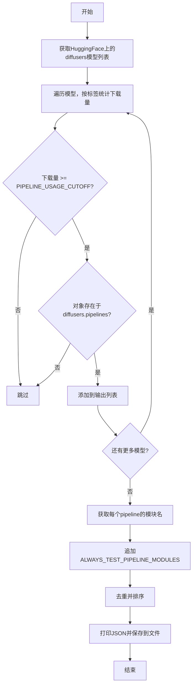
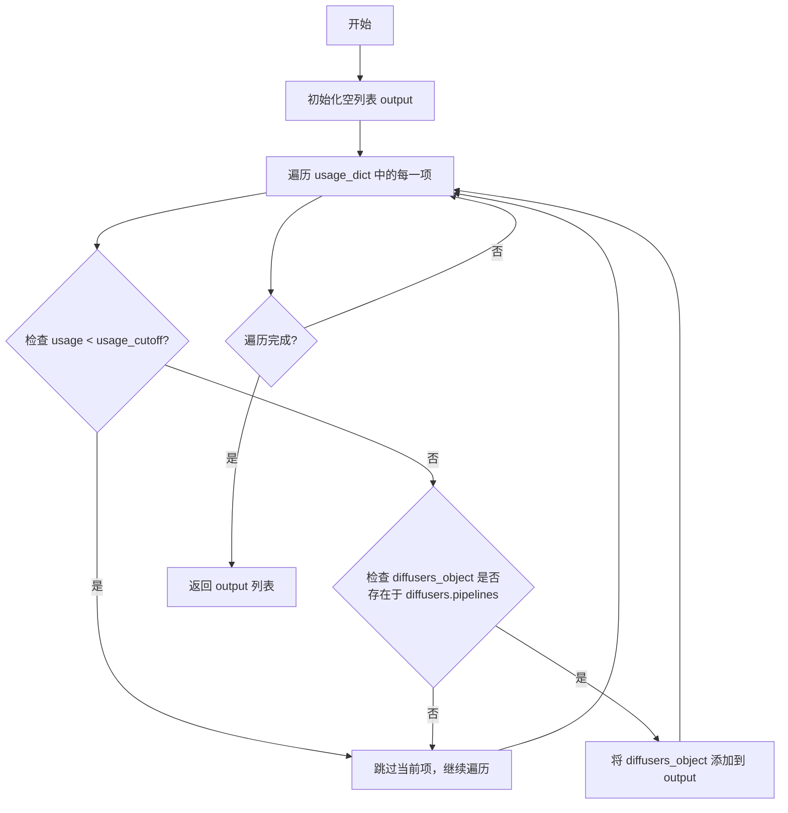
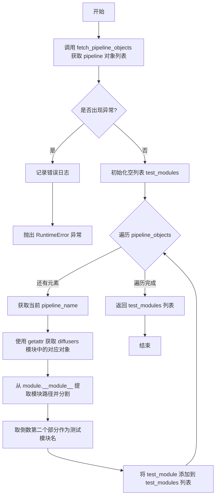
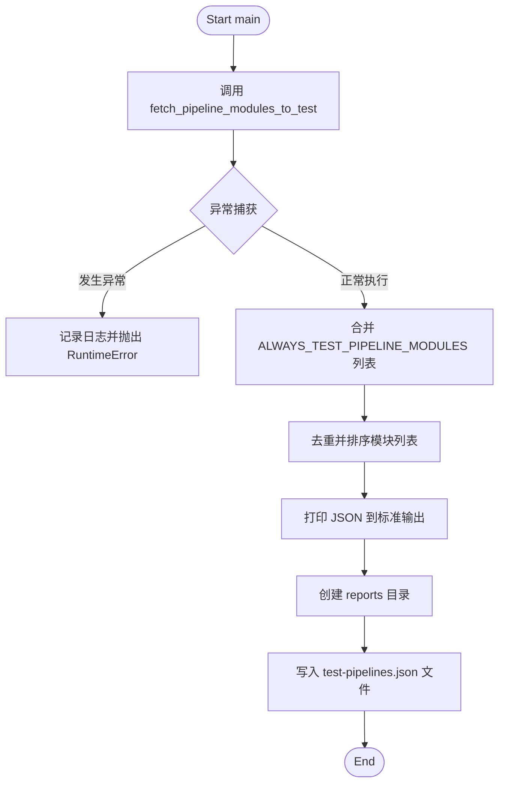

# `diffusers\utils\fetch_torch_cuda_pipeline_test_matrix.py` 详细设计文档

该脚本从HuggingFace Hub获取diffusers库的模型下载统计数据，根据下载量过滤出热门pipeline模块，并生成待测试模块列表供后续CI/CD流程使用。

## 整体流程



## 类结构

```
无类定义 (脚本级模块)
```

## 全局变量及字段


### `PATH_TO_REPO`
    
仓库根目录路径，通过获取当前文件父目录的父目录并解析为绝对路径得到

类型：`Path`
    


### `ALWAYS_TEST_PIPELINE_MODULES`
    
始终需要测试的pipeline模块名称列表，包含常见的diffusers pipeline模块如controlnet、stable_diffusion等

类型：`list`
    


### `PIPELINE_USAGE_CUTOFF`
    
Pipeline下载量过滤阈值，默认50000，用于过滤出高使用量的pipeline进行测试

类型：`int`
    


### `logger`
    
模块级日志记录器，用于记录脚本运行过程中的错误和信息

类型：`logging.Logger`
    


### `api`
    
HuggingFace Hub API客户端实例，用于调用HuggingFace Hub接口获取模型信息

类型：`HfApi`
    


    

## 全局函数及方法


### `filter_pipelines`

该函数用于从给定的下载量统计字典中筛选出符合条件的pipeline对象：筛选条件为下载量超过指定阈值且该对象存在于`diffusers.pipelines`模块中，最终返回满足条件的pipeline名称列表。

参数：

- `usage_dict`：`dict`，键为pipeline名称（字符串），值为对应的下载量（整数）的字典
- `usage_cutoff`：`int`，可选参数，默认值为`10000`，用于过滤的下载量阈值，只有下载量大于等于此值的pipeline才会被保留

返回值：`list`，返回满足条件的pipeline名称列表，列表中的每个元素都是字符串类型的pipeline名称

#### 流程图



#### 带注释源码

```python
def filter_pipelines(usage_dict, usage_cutoff=10000):
    """
    过滤出下载量超过阈值且存在于diffusers.pipelines中的pipeline对象
    
    参数:
        usage_dict: 键为pipeline名称，值为下载量的字典
        usage_cutoff: 下载量阈值，默认为10000
    
    返回:
        满足条件的pipeline名称列表
    """
    output = []  # 初始化结果列表
    # 遍历所有pipeline及其下载量
    for diffusers_object, usage in usage_dict.items():
        # 如果下载量低于阈值，直接跳过
        if usage < usage_cutoff:
            continue

        # 检查该对象是否存在于diffusers.pipelines模块中
        is_diffusers_pipeline = hasattr(diffusers.pipelines, diffusers_object)
        # 如果不是diffusers的pipeline，跳过
        if not is_diffusers_pipeline:
            continue

        # 满足条件，添加到输出列表
        output.append(diffusers_object)

    return output
```

---

### 关键组件信息

| 组件名称 | 描述 |
|---------|------|
| `diffusers.pipelines` | Hugging Face diffusers库中的pipeline模块，用于存储所有可用的pipeline类 |
| `usage_dict` | 来自HuggingFace Hub的pipeline下载量统计数据，以字典形式存储 |
| `PIPELINE_USAGE_CUTOFF` | 全局环境变量配置的默认阈值，用于在`fetch_pipeline_objects`中调用时覆盖默认参数 |

### 潜在的技术债务或优化空间

1. **缺乏类型注解**：函数参数和返回值都缺少Python类型注解（Type Hints），降低代码可读性和IDE支持度
2. **硬编码的默认值**：`usage_cutoff`默认值10000在函数内部定义，而在`fetch_pipeline_objects`中调用时使用了全局变量`PIPELINE_USAGE_CUTOFF`，这种不一致可能导致混淆
3. **效率优化空间**：当前实现使用`hasattr`逐个检查，建议可预先获取`diffusers.pipelines`的所有属性名以减少属性查找开销
4. **错误处理缺失**：未对`usage_dict`的类型进行检查，若传入非字典对象会抛出不够友好的错误信息

### 其它项目

#### 设计目标与约束

- **目标**：筛选出高下载量的官方diffusers pipeline，用于确定需要测试的模块范围
- **约束**：仅识别存在于`diffusers.pipelines`中的对象，排除第三方或自定义pipeline

#### 错误处理与异常设计

- 当前函数未实现显式的异常处理，依赖于调用方传入合法格式的数据
- 建议添加对`usage_dict`类型的验证，确保其为字典类型

#### 数据流与状态机

- **输入数据流**：`usage_dict`来自`fetch_pipeline_objects`函数，该函数通过HuggingFace API获取所有diffusers相关模型的下载量统计
- **输出数据流**：返回的列表传递给`fetch_pipeline_modules_to_test`，用于提取pipeline所属的模块名称

#### 外部依赖与接口契约

- **依赖模块**：`diffusers`库，需确保已安装且版本兼容
- **接口契约**：
  - `usage_dict`应为`Dict[str, int]`类型
  - `usage_cutoff`应为整数类型
  - 返回值始终为列表，即使无符合条件的pipeline也会返回空列表


### `fetch_pipeline_objects`

该函数通过HuggingFace Hub API获取所有diffusers库模型，根据模型标签（如"diffusers:stable_diffusion"）统计各pipeline的累计下载量，过滤掉下载量低于阈值的pipeline，并调用`filter_pipelines`筛选出真实存在于diffusers库中的pipeline对象，最终返回符合条件的pipeline名称列表。

参数：该函数无显式参数（依赖全局变量`api`和`PIPELINE_USAGE_CUTOFF`）

返回值：`List[str]`，返回符合下载量阈值且真实存在于diffusers库中的pipeline名称列表

#### 流程图

```mermaid
flowchart TD
    A[开始 fetch_pipeline_objects] --> B[调用 api.list_models 获取所有 diffusers 模型]
    B --> C[创建 defaultdict[int] 统计下载量]
    C --> D{遍历每个 model}
    D -->|对于每个 model| E{遍历 model.tags}
    E -->|tag 以 'diffusers:' 开头| F[提取标签名并累加下载量]
    F --> G[标记 is_counted = True]
    E -->|tag 不以 'diffusers:' 开头| H[继续下一个 tag]
    G --> H
    H -->|所有 tag 遍历完毕| I{is_counted == False?}
    I -->|是| J[downloads['other'] += model.downloads]
    I -->|否| K[继续下一个 model]
    J --> K
    K --> D
    D -->|所有 model 遍历完毕| L[过滤掉下载量为 0 的条目]
    L --> M[调用 filter_pipelines 过滤]
    M --> N[返回 pipeline_objects 列表]
```

#### 带注释源码

```python
def fetch_pipeline_objects():
    """
    从 HuggingFace Hub 获取 diffusers 模型，按标签统计下载量，
    返回符合阈值要求且真实存在于 diffusers 库中的 pipeline 对象列表
    """
    # 调用 HuggingFace API 获取所有 library="diffusers" 的模型
    # 返回值是一个迭代器，包含模型元数据（tags, downloads 等）
    models = api.list_models(library="diffusers")
    
    # 使用 defaultdict 初始化下载量统计字典，默认值为 0
    # 键为 pipeline 名称（如 'stable_diffusion'），值为累计下载量
    downloads = defaultdict(int)

    # 遍历所有模型，统计每个标签的下载量
    for model in models:
        # is_counted 用于标记该模型是否有 diffusers 相关标签
        is_counted = False
        
        # 遍历模型的标签，查找以 "diffusers:" 开头的标签
        for tag in model.tags:
            if tag.startswith("diffusers:"):
                is_counted = True
                # 提取标签名（去掉 "diffusers:" 前缀），累加下载量
                # 例如 "diffusers:stable_diffusion" -> "stable_diffusion"
                downloads[tag[len("diffusers:") :]] += model.downloads

        # 如果模型没有任何 diffusers 相关标签，归入 "other" 类别
        if not is_counted:
            downloads["other"] += model.downloads

    # 过滤掉下载量为 0 的条目（删除没有任何下载的 pipeline）
    downloads = {k: v for k, v in downloads.items() if v > 0}
    
    # 调用 filter_pipelines 函数，根据下载量阈值和是否为真实 pipeline 进行过滤
    # PIPELINE_USAGE_CUTOFF 是环境变量控制的阈值，默认为 50000
    pipeline_objects = filter_pipelines(downloads, PIPELINE_USAGE_CUTOFF)

    # 返回符合所有条件的 pipeline 名称列表
    return pipeline_objects
```

#### 关键依赖信息

| 名称 | 类型 | 描述 |
|------|------|------|
| `api` | `HfApi` | HuggingFace Hub API 实例，用于调用 `list_models` |
| `PIPELINE_USAGE_CUTOFF` | `int` | 环境变量控制的下载量阈值，默认 50000，用于过滤低热度 pipeline |
| `filter_pipelines` | `function` | 依赖的全局函数，用于进一步过滤 pipeline（检查是否为真实 pipeline 且下载量达标） |
| `diffusers.pipelines` | `module` | diffusers 库的 pipelines 模块，用于验证 pipeline 是否真实存在 |

#### 潜在技术债务与优化空间

1. **无显式参数设计**：函数依赖全局变量 `PIPELINE_USAGE_CUTOFF` 和 `api`，降低了函数的可测试性和可复用性，建议改为显式参数传入
2. **网络请求未做重试机制**：`api.list_models()` 可能因网络问题失败，缺乏重试逻辑和超时控制
3. **内存占用风险**：若 HuggingFace 上 diffusers 模型数量庞大，`downloads` 字典可能占用大量内存，可考虑分页处理或流式处理
4. **异常处理缺失**：未对 `api.list_models()` 的异常进行捕获，若 API 不可用会导致程序直接崩溃


### `fetch_pipeline_modules_to_test`

该函数是测试数据准备模块的核心函数，用于从HuggingFace Hub获取diffusers库的pipeline使用统计数据，筛选出高使用量的pipeline对象，然后提取其所属的模块名称，最终返回需要测试的模块列表，供后续测试流程使用。

参数：该函数没有参数。

返回值：`List[str]`，返回待测试的模块名称列表，每个元素为模块路径中的倒数第二个部分（如"pipelines"、"schedulers"等）。

#### 流程图



#### 带注释源码

```python
def fetch_pipeline_modules_to_test():
    """
    获取待测试的模块名称列表。
    
    该函数首先调用 fetch_pipeline_objects() 从 HuggingFace Hub 获取
    高使用量的 pipeline 对象列表，然后遍历每个 pipeline，提取其所属
    模块的名称，最终返回所有待测试模块的名称列表。
    
    Returns:
        List[str]: 待测试的模块名称列表
        
    Raises:
        RuntimeError: 当无法从 HuggingFace Hub 获取模型列表时抛出
    """
    # 尝试获取 pipeline 对象列表，包含异常处理机制
    try:
        # 调用 fetch_pipeline_objects 函数获取高使用量的 pipeline 对象
        pipeline_objects = fetch_pipeline_objects()
    except Exception as e:
        # 记录详细的异常信息用于调试
        logger.error(e)
        # 抛出运行时错误以阻止后续流程继续执行
        raise RuntimeError("Unable to fetch model list from HuggingFace Hub.")

    # 初始化用于存储测试模块名称的空列表
    test_modules = []
    
    # 遍历每个获取到的 pipeline 对象名称
    for pipeline_name in pipeline_objects:
        # 使用 getattr 从 diffusers 模块中动态获取对应的属性/对象
        # 这里假设 pipeline_name 是 diffusers 模块中存在的属性名
        module = getattr(diffusers, pipeline_name)

        # 从模块的 __module__ 属性提取完整的模块路径（如 "diffusers.pipelines.stable_diffusion"）
        # 使用 "." 分割后取倒数第二个元素，得到模块类别（如 "pipelines"）
        # strip() 用于去除可能的空白字符
        test_module = module.__module__.split(".")[-2].strip()
        
        # 将提取到的模块名称添加到测试模块列表中
        test_modules.append(test_module)

    # 返回包含所有待测试模块名称的列表
    return test_modules
```


### `main`

`main` 函数是整个脚本的入口点，负责协调整个数据获取、处理和输出的流程。它首先从 HuggingFace Hub 获取当前热门的 Diffusers Pipeline 模块，然后与预设的强制测试模块列表进行合并、去重和排序，最终将结果打印到标准输出并保存为 JSON 报告文件。

参数： 无

返回值：`None`，该函数不返回任何值，主要执行副作用（生成文件）。

#### 流程图



#### 带注释源码

```python
def main():
    # 1. 获取需要测试的模块列表
    # 调用 fetch_pipeline_modules_to_test 从 HuggingFace Hub 获取热门 Pipeline
    test_modules = fetch_pipeline_modules_to_test()
    
    # 2. 合并强制测试的模块
    # 将预定义的 Always Test 模块列表合并到自动获取的列表中
    test_modules.extend(ALWAYS_TEST_PIPELINE_MODULES)

    # 3. 数据清洗
    # 使用 set 去重，然后 sorted 排序以保证输出顺序一致性
    test_modules = sorted(set(test_modules))
    
    # 4. 输出到控制台
    # 将列表以 JSON 格式打印到 stdout，供后续 CI/CD 流水线捕获
    print(json.dumps(test_modules))

    # 5. 保存结果到文件
    # 定义保存路径：项目根目录/reports/test-pipelines.json
    save_path = f"{PATH_TO_REPO}/reports"
    
    # 确保目录存在，如果不存在则创建
    os.makedirs(save_path, exist_ok=True)

    # 写入 JSON 文件
    with open(f"{save_path}/test-pipelines.json", "w") as f:
        json.dump({"pipeline_test_modules": test_modules}, f)
```

## 关键组件


### 模型列表获取组件

从HuggingFace Hub通过HfApi获取所有diffusers库的模型列表，用于后续的使用量统计和分析。

### 使用量统计组件

遍历模型列表，解析diffusers标签，统计每个pipeline的下载量，并区分other类别。

### Pipeline过滤组件

根据使用量阈值（PIPELINE_USAGE_CUTOFF）过滤出符合测试要求的pipeline对象，排除非diffusers pipeline。

### 测试模块筛选组件

将筛选出的pipeline对象转换为对应的测试模块名称，并整合始终需要测试的模块列表。

### 配置管理组件

管理项目路径常量、从环境变量读取使用量阈值配置、定义始终测试的pipeline模块白名单。

### 结果输出组件

将测试模块列表序列化为JSON格式并保存到reports目录，包含模块去重和排序处理。


## 问题及建议


### 已知问题

-   **参数默认值不一致**：`filter_pipelines` 函数中 `usage_cutoff` 参数默认值为 `10000`，而全局变量 `PIPELINE_USAGE_CUTOFF` 默认值为 `50000`，调用 `fetch_pipeline_objects()` 时使用的是全局变量值，导致行为不一致
-   **HuggingFace API 分页缺失**：`api.list_models(library="diffusers")` 可能返回大量模型数据，未处理分页可能导致获取数据不完整或性能问题
-   **异常处理不完善**：`fetch_pipeline_modules_to_test` 中对 `diffusers` 模块的访问没有做异常捕获，如果 pipeline 名称不存在会导致代码崩溃
-   **模块路径假设脆弱**：`module.__module__.split(".")[-2]` 假设了特定的模块路径结构，这种硬编码的索引方式缺乏健壮性
-   **魔法字符串和数字**：如 `"diffusers:"` 前缀、`"other"` 键名等硬编码在代码中，缺乏配置化管理
-   **缺少类型注解**：函数参数和返回值都没有类型提示，影响代码可读性和维护性
-   **日志记录不充分**：仅在 `fetch_pipeline_modules_to_test` 中有日志，而关键的 API 调用和数据处理过程缺少日志
-   **资源清理未处理**：文件操作未使用 `with` 语句的上下文管理器（虽然实际使用了，但路径拼接可更优雅）

### 优化建议

-   统一 `usage_cutoff` 参数默认值，或移除 `filter_pipelines` 的默认参数，强制调用者传入值
-   实现分页机制遍历所有模型结果，使用 `HfApi` 的分页参数或迭代器
-   添加 `try-except` 块处理模块获取异常，并对无效 pipeline 进行跳过或记录
-   提取硬编码的字符串（如 `"diffusers:"`、`"other"`）为常量或配置文件
-   为所有函数添加类型注解，提升代码可维护性
-   在关键节点（如 API 调用、数据过滤、文件写入）增加适当的日志记录
-   考虑添加重试机制应对网络不稳定导致的 API 调用失败
-   将模块路径解析逻辑封装为独立函数，增加可测试性

## 其它


### 设计目标与约束

本脚本的设计目标是从HuggingFace Hub获取diffusers相关模型的下载统计数据，根据预设的下载量阈值过滤出热门pipeline模块，并生成测试模块列表供下游测试流程使用。约束条件包括：必须联网访问HuggingFace API、需要有效的网络连接、依赖diffusers库和huggingface_hub库、运行结果受HuggingFace API速率限制影响。

### 错误处理与异常设计

脚本采用分层异常处理策略：在fetch_pipeline_modules_to_test函数中捕获所有异常并记录日志后重新抛出RuntimeError，强制中断流程避免产生不完整的测试列表；filter_pipelines函数中使用hasattr进行安全检查避免属性访问错误；文件写入操作使用with语句确保资源正确释放。异常信息通过logging模块记录，支持日志级别配置。

### 数据流与状态机

数据流如下：1）通过HuggingFace API获取模型列表 2）遍历模型标签统计diffusers相关下载量 3）过滤低于阈值的pipeline 4）获取每个pipeline对应的测试模块 5）合并always test模块列表 6）去重排序后输出。状态机相对简单，主要为顺序执行流程，无复杂状态转换。

### 外部依赖与接口契约

外部依赖包括：huggingface_hub库的HfApi类用于调用HuggingFace Hub API、diffusers库用于检查pipeline对象有效性、Python标准库json/logging/os/pathlib/collections。接口契约方面：list_models返回迭代器对象，每个模型包含tags和downloads属性；filter_pipelines接收字典和整数参数返回列表；环境变量PIPELINE_USAGE_CUTOFF为可选配置默认为50000。

### 输入与输出规格

输入：环境变量PIPELINE_USAGE_CUTOFF（可选，默认为50000）。输出：控制台打印JSON格式的测试模块列表数组，同时在reports/test-pipelines.json文件中保存{"pipeline_test_modules": [...]}格式的数据。输出示例：["controlnet", "controlnet_flux", "stable_diffusion", ...]。

### 安全性考虑

当前代码不涉及敏感信息处理，API调用使用公开的HuggingFace Hub接口。潜在安全风险：输出目录使用PATH_TO_REPO动态计算需确保路径安全、文件写入操作需验证目录权限、建议未来添加API token安全管理机制。

### 性能考虑与优化空间

当前实现每次运行都需完整获取HuggingFace所有模型列表，当模型数量庞大时性能较低。优化方向：可添加本地缓存机制避免频繁API调用、可实现增量更新只获取新增数据、可考虑使用多线程并发处理模型数据、可添加请求结果缓存减少网络开销。

### 配置管理

配置通过全局变量和环境变量混合管理：PIPELINE_USAGE_CUTOFF通过环境变量配置支持运行时调整、ALWAYS_TEST_PIPELINE_MODULES为硬编码的强制测试模块列表、PATH_TO_REPO通过代码动态计算。建议未来将ALWAYS_TEST_PIPELINE_MODULES移至配置文件管理。

### 日志设计

使用Python标准logging模块，logger名称为模块名__name__。日志级别默认为WARNING及以上，当前仅在异常捕获时记录error级别日志。建议：添加INFO级别日志记录关键流程节点、添加DEBUG级别日志用于排查问题、考虑结构化日志便于日志分析。

### 部署与运行方式

部署方式：直接作为Python脚本运行（python script_name.py）或通过模块方式调用（python -m module_name）。运行前提：已安装依赖库（pip install huggingface_hub diffusers）、配置网络访问HuggingFace Hub。建议：添加__main__.py支持包式运行、添加setup.py或pyproject.toml支持pip安装。

### 版本兼容性

代码使用Python标准库特性（pathlib、defaultdict）需要Python 3.4+；依赖库版本未做约束，建议添加requirements.txt或pyproject.toml明确版本范围；HuggingFace API为外部服务需关注API变更公告。

### 测试策略

当前脚本未包含单元测试。测试建议：为filter_pipelines函数编写单元测试验证过滤逻辑、为fetch_pipeline_objects编写mock测试避免真实API调用、添加集成测试验证完整流程、测试边界条件如空输入、阈值边界值等。

### 可维护性与扩展性

代码结构清晰但扩展性有限。改进建议：将硬编码的模块列表移至配置文件、提取配置类集中管理配置项、添加插件机制支持自定义过滤规则、考虑将数据获取和处理逻辑解耦便于单元测试。

### 代码质量指标

当前代码行数约80行，复杂度较低。优点：职责清晰、命名规范、包含文档字符串。改进空间：缺少类型注解、缺少完整单元测试、错误信息可更具体、魔法数字PIPELINE_USAGE_CUTOFF默认值应提取为具名常量。

### 监控与可观测性

当前无监控能力。建议添加：执行耗时统计、API调用次数统计、过滤前后数据量统计、生成执行报告供后续分析。

### 故障排查指南

常见问题：1）网络超时 - 检查网络连接和代理配置 2）API限流 - 降低调用频率或添加重试机制 3）权限错误 - 确认HuggingFace Hub访问权限 4）输出目录无权限 - 检查reports目录写权限。


    