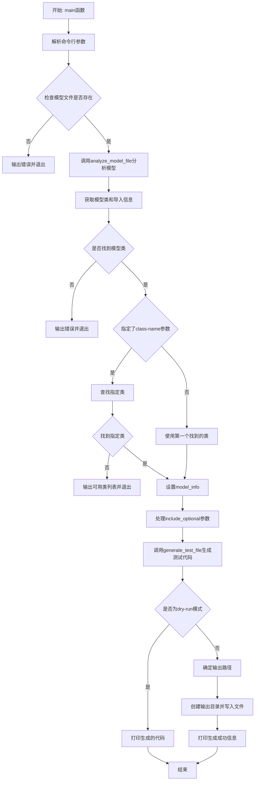
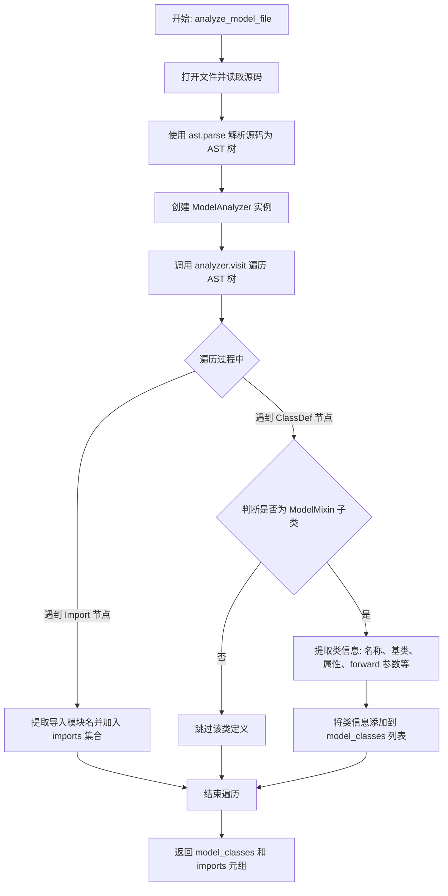
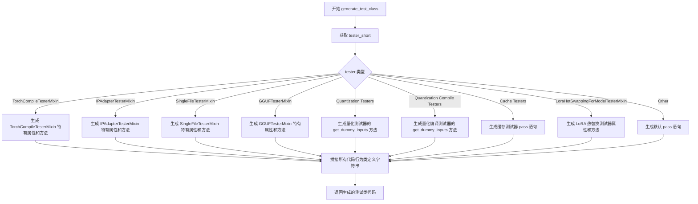
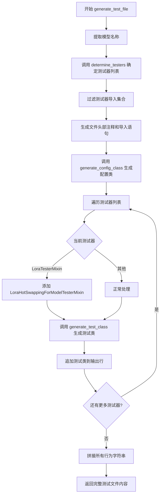
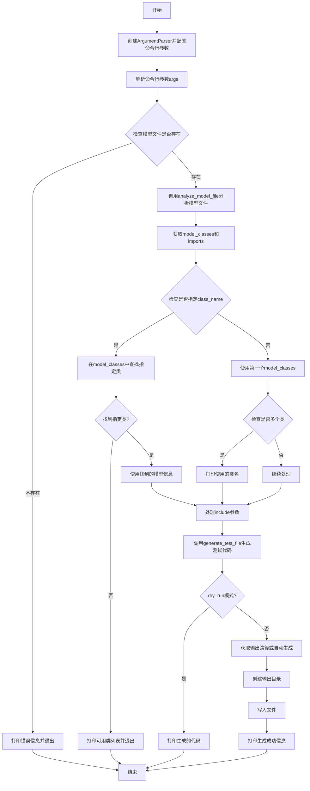
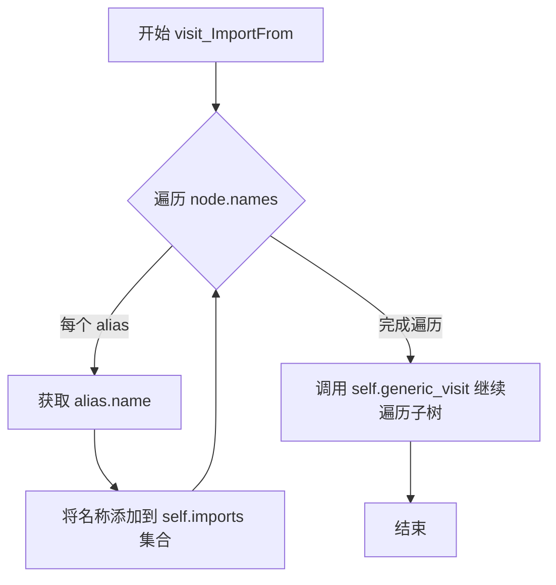
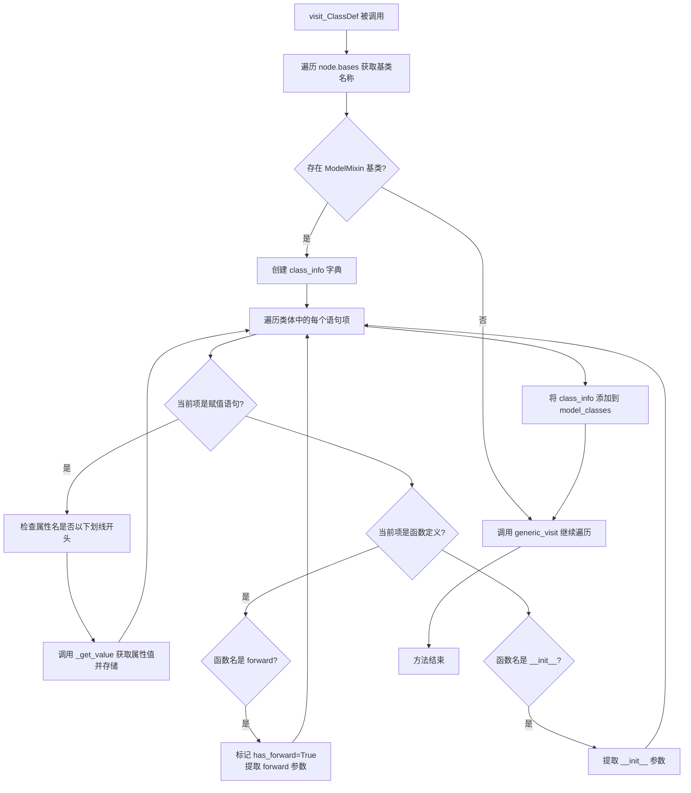
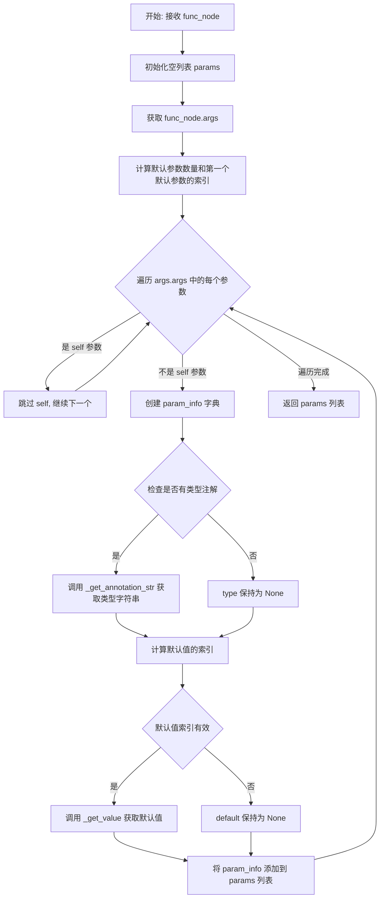
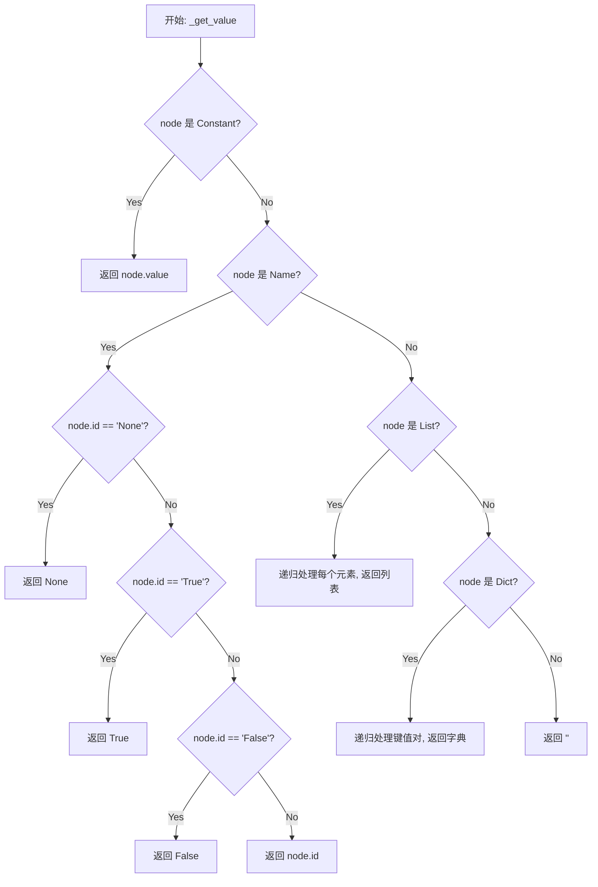

# `diffusers\utils\generate_model_tests.py` 详细设计文档

一个自动化工具脚本，用于分析diffusers模型文件并生成对应的测试套件。它通过AST解析模型类，提取类信息（基类、属性、forward参数等），然后根据预定义的规则（mixin类型、特殊属性、导入的注意力类等）动态确定需要包含的测试mixin，最终生成完整的测试文件代码。

## 整体流程



## 类结构

```
ModelAnalyzer (ast.NodeVisitor)
└── 内部方法: visit_Import, visit_ImportFrom, visit_ClassDef, _extract_func_params, _get_annotation_str, _get_value
```

## 全局变量及字段


### `MIXIN_TO_TESTER`
    
定义模型mixin类到对应测试器类的映射关系

类型：`dict[str, str]`
    


### `ATTRIBUTE_TO_TESTER`
    
定义模型属性到对应测试器类的映射关系

类型：`dict[str, str]`
    


### `ALWAYS_INCLUDE_TESTERS`
    
定义始终需要包含的测试器类列表

类型：`list[str]`
    


### `ATTENTION_INDICATORS`
    
用于标识模型是否使用attention的相关类名集合

类型：`set[str]`
    


### `OPTIONAL_TESTERS`
    
定义可选测试器类名及其对应flag标识的列表

类型：`list[tuple[str, str]]`
    


### `ModelAnalyzer.model_classes`
    
存储解析到的所有模型类信息

类型：`list[dict]`
    


### `ModelAnalyzer.current_class`
    
当前处理的类（未使用）

类型：`Optional[str]`
    


### `ModelAnalyzer.imports`
    
存储所有导入的模块名

类型：`set[str]`
    
    

## 全局函数及方法


### `analyze_model_file`

该函数是代码生成脚本的核心分析函数，负责解析给定的模型文件，提取其中的模型类信息（如类名、基类、属性、forward 参数等）以及导入的模块信息，为后续生成测试用例提供数据支撑。

参数：

- `filepath`：`str`，待分析的模型文件路径（例如 `src/diffusers/models/transformers/transformer_flux.py`）

返回值：`tuple[list[dict], set[str]]`，返回一个元组，其中第一个元素是模型类信息列表（每个字典包含类名、基类、属性、forward 参数等），第二个元素是文件中导入的模块名称集合。

#### 流程图



#### 带注释源码

```python
def analyze_model_file(filepath: str) -> tuple[list[dict], set[str]]:
    """
    分析模型文件并提取模型类信息及导入模块。

    参数:
        filepath: str, 待分析的模型文件路径

    返回:
        tuple[list[dict], set[str]]: 
            - 第一个元素: 模型类信息列表，每个字典包含类名、基类、属性、forward参数等
            - 第二个元素: 文件中导入的模块名称集合
    """
    # 1. 打开指定路径的文件，以文本模式读取全部源码内容
    with open(filepath) as f:
        source = f.read()

    # 2. 使用 Python 内置的 ast (抽象语法树) 模块解析源码
    #    将源代码字符串转换为 AST 节点组成的树形结构，便于程序化分析
    tree = ast.parse(source)
    
    # 3. 创建 ModelAnalyzer 实例，该类继承自 ast.NodeVisitor
    #    用于访问并提取 AST 中的关键信息（类定义、导入语句等）
    analyzer = ModelAnalyzer()
    
    # 4. 触发 AST 遍历，analyzer 会自动调用 visit 方法处理各类节点
    #    在遍历过程中提取并存储模型类信息和导入集合
    analyzer.visit(tree)

    # 5. 返回分析结果：
    #    - analyzer.model_classes: 包含所有检测到的 ModelMixin 子类的详细信息
    #    - analyzer.imports: 包含文件中所有 import 的模块名（去重后的集合）
    return analyzer.model_classes, analyzer.imports
```


### `determine_testers`

根据模型信息、导入的模块和指定的选项，动态确定需要使用的测试器（TesterMixin）列表。

参数：

- `model_info`：`dict`，包含模型基类和属性的字典，用于确定基础测试器
- `include_optional`：`list[str]`，可选测试器的标志列表，用于指定额外包含的测试器
- `imports`：`set[str]`，模型文件中导入的类名集合，用于检测注意力相关模块

返回值：`list[str]`，返回所有需要使用的测试器类名列表

#### 流程图

```mermaid
flowchart TD
    A[开始 determine_testers] --> B[初始化 testers = ALWAYS_INCLUDE_TESTERS]
    B --> C{遍历 model_info[bases]}
    C -->|base in MIXIN_TO_TESTER| D[添加对应的 tester]
    C --> E{遍历 ATTRIBUTE_TO_TESTER}
    D --> E
    E -->|attr 存在且 value 非 None/False| F[添加对应的 tester]
    E --> G{检查 _cp_plan 属性}
    G -->|存在且非 None| H[添加 ContextParallelTesterMixin]
    G --> I{检查 imports 与 ATTENTION_INDICATORS}
    H --> I
    I -->|有交集| J[添加 AttentionTesterMixin]
    I --> K{遍历 OPTIONAL_TESTERS}
    J --> K
    K -->|flag in include_optional| L[添加对应的 tester]
    K --> M[返回 testers 列表]
```

#### 带注释源码

```python
def determine_testers(model_info: dict, include_optional: list[str], imports: set[str]) -> list[str]:
    """
    根据模型信息、导入的模块和指定的选项，动态确定需要使用的测试器列表。
    
    参数:
        model_info: dict - 包含模型基类和属性的字典
        include_optional: list[str] - 可选测试器的标志列表
        imports: set[str] - 模型文件中导入的类名集合
    
    返回:
        list[str] - 所有需要使用的测试器类名列表
    """
    # 步骤1: 初始化测试器列表，包含始终需要包含的测试器
    testers = list(ALWAYS_INCLUDE_TESTERS)

    # 步骤2: 遍历模型的基类，添加基于基类的测试器
    # 例如: ModelMixin -> ModelTesterMixin, PeftAdapterMixin -> LoraTesterMixin
    for base in model_info["bases"]:
        if base in MIXIN_TO_TESTER:
            tester = MIXIN_TO_TESTER[base]
            if tester not in testers:
                testers.append(tester)

    # 步骤3: 遍历预定义的属性到测试器的映射，添加基于属性的测试器
    # 例如: _cp_plan -> ContextParallelTesterMixin, 
    #      _supports_gradient_checkpointing -> TrainingTesterMixin
    for attr, tester in ATTRIBUTE_TO_TESTER.items():
        if attr in model_info["attributes"]:
            value = model_info["attributes"][attr]
            # 只有当属性值不是 None 且不是 False 时才添加测试器
            if value is not None and value is not False:
                if tester not in testers:
                    testers.append(tester)

    # 步骤4: 特殊处理 _cp_plan 属性，如果存在且非 None，强制添加 ContextParallelTesterMixin
    if "_cp_plan" in model_info["attributes"] and model_info["attributes"]["_cp_plan"] is not None:
        if "ContextParallelTesterMixin" not in testers:
            testers.append("ContextParallelTesterMixin")

    # 步骤5: 如果模型导入了注意力相关的类，则添加 AttentionTesterMixin
    # ATTENTION_INDICATORS = {"AttentionMixin", "AttentionModuleMixin"}
    if imports & ATTENTION_INDICATORS:
        testers.append("AttentionTesterMixin")

    # 步骤6: 根据 include_optional 参数添加可选的测试器
    # OPTIONAL_TESTERS 包含量化、缓存、单文件、IP-Adapter等测试器及其对应标志
    for tester, flag in OPTIONAL_TESTERS:
        if flag in include_optional:
            if tester not in testers:
                testers.append(tester)

    # 返回完整的测试器列表
    return testers
```


### `generate_config_class`

该函数是测试套件生成工具的核心组件之一，用于根据模型分析结果动态生成测试配置类（TesterConfig）。它接收模型信息字典和模型名称，构造一个包含模型类属性、预训练模型路径、初始化参数和虚拟输入方法等的配置类代码字符串，为后续生成具体测试类提供基础配置模板。

参数：

- `model_info`：`dict`，包含模型分析结果的字典，必须包含 `name` 键（模型类名），可选包含 `forward_params`（forward 方法参数列表）和 `init_params`（`__init__` 方法参数列表）
- `model_name`：`str`，用于构造配置类名称的模型名称（通常为去除后缀的模型类名）

返回值：`str`，生成的测试配置类代码字符串

#### 流程图

```mermaid
flowchart TD
    A[开始: generate_config_class] --> B[构造配置类名称: {model_name}TesterConfig]
    B --> C[从 model_info 提取模型类名、forward_params、init_params]
    C --> D[初始化代码行列表 lines]
    D --> E[添加类定义和 model_class 属性]
    E --> F[添加 pretrained_model_name_or_path 属性]
    F --> G[添加 pretrained_model_kwargs 属性]
    G --> H[添加 generator 属性]
    H --> I[添加 get_init_dict 方法定义]
    I --> J{init_params 是否存在?}
    J -- 是 --> K[遍历 init_params 添加参数注释]
    J -- 否 --> L[添加空返回语句]
    K --> L
    L --> M[添加 get_dummy_inputs 方法定义]
    M --> N{forward_params 是否存在?}
    N -- 是 --> O[遍历 forward_params 添加参数注释]
    N -- 否 --> P[添加 TODO 占位符和空返回]
    O --> P
    P --> Q[添加 input_shape 属性]
    Q --> R[添加 output_shape 属性]
    R --> S[将 lines 列表连接为字符串]
    S --> T[返回生成的配置类代码]
```

#### 带注释源码

```python
def generate_config_class(model_info: dict, model_name: str) -> str:
    """
    根据模型信息生成测试配置类代码
    
    Args:
        model_info: 包含模型类名、forward参数、init参数等信息的字典
        model_name: 用于构造配置类名称的模型名称
    
    Returns:
        生成的测试配置类代码字符串
    """
    # 构造配置类名称，如 "FluxTesterConfig"
    class_name = f"{model_name}TesterConfig"
    # 从模型信息中提取模型类名
    model_class = model_info["name"]
    # 获取 forward 方法的参数列表，默认为空列表
    forward_params = model_info.get("forward_params", [])
    # 获取 __init__ 方法的参数列表，默认为空列表
    init_params = model_info.get("init_params", [])

    # 初始化代码行列表
    lines = [
        f"class {class_name}:",  # 定义配置类
        "    @property",
        "    def model_class(self):",  # 模型类属性
        f"        return {model_class}",  # 返回模型类名
        "",
        "    @property",
        "    def pretrained_model_name_or_path(self):",  # 预训练模型路径属性
        '        return ""  # TODO: Set Hub repository ID',  # 占位符，需要用户填充
        "",
        "    @property",
        "    def pretrained_model_kwargs(self):",  # 预训练模型参数字典
        '        return {"subfolder": "transformer"}',  # 默认使用 transformer 子文件夹
        "",
        "    @property",
        "    def generator(self):",  # 随机数生成器属性
        '        return torch.Generator("cpu").manual_seed(0)',  # 固定种子保证可复现性
        "",
        "    def get_init_dict(self) -> dict[str, int | list[int]]:",  # 获取初始化参数字典的方法
    ]

    # 如果存在 __init__ 参数，添加参数注释
    if init_params:
        lines.append("        # __init__ parameters:")  # 注释标题
        for param in init_params:
            # 构建参数字符串，包含名称、类型提示和默认值
            type_str = f": {param['type']}" if param["type"] else ""
            default_str = f" = {param['default']}" if param["default"] is not None else ""
            lines.append(f"        #   {param['name']}{type_str}{default_str}")

    # 添加方法返回值（空字典，待填充）
    lines.extend(
        [
            "        return {}",
            "",
            "    def get_dummy_inputs(self) -> dict[str, torch.Tensor]:",  # 获取虚拟输入的方法
        ]
    )

    # 如果存在 forward 参数，添加参数注释
    if forward_params:
        lines.append("        # forward() parameters:")  # 注释标题
        for param in forward_params:
            # 构建参数字符串，包含名称、类型提示和默认值
            type_str = f": {param['type']}" if param["type"] else ""
            default_str = f" = {param['default']}" if param["default"] is not None else ""
            lines.append(f"        #   {param['name']}{type_str}{default_str}")

    # 添加虚拟输入的返回值和形状属性
    lines.extend(
        [
            "        # TODO: Fill in dummy inputs",  # 待完成标记
            "        return {}",
            "",
            "    @property",
            "    def input_shape(self) -> tuple[int, ...]:",  # 输入形状属性
            "        return (1, 1)",  # 默认输入形状
            "",
            "    @property",
            "    def output_shape(self) -> tuple[int, ...]:",  # 输出形状属性
            "        return (1, 1)",  # 默认输出形状
        ]
    )

    # 将代码行列表连接为字符串并返回
    return "\n".join(lines)
```


### `generate_test_class`

该函数用于根据模型名称、配置类名和测试混合类名称生成对应的测试类代码。它会根据不同的 tester 类型（如 TorchCompileTesterMixin、IPAdapterTesterMixin 等）生成具有相应属性和方法的测试类结构，并最终返回完整的类定义代码字符串。

参数：

- `model_name`：`str`，模型名称，用于构造测试类的名称
- `config_class`：`str`，配置类名称，测试类将继承该配置类
- `tester`：`str`，测试混合类名称，测试类将继承该 tester，函数根据此参数确定需要生成的测试类具体内容

返回值：`str`，返回生成的测试类代码字符串

#### 流程图



#### 带注释源码

```python
def generate_test_class(model_name: str, config_class: str, tester: str) -> str:
    """
    生成单个测试类的代码字符串。
    
    参数:
        model_name: 模型名称，用于构造测试类名
        config_class: 配置类名，测试类继承该配置类
        tester: 测试混合类名，测试类继承该 tester
    
    返回:
        生成的测试类代码字符串
    """
    # 1. 移除 "TesterMixin" 后缀，得到简短的 tester 名称
    tester_short = tester.replace("TesterMixin", "")
    
    # 2. 根据模型名称和 tester 名称构造测试类名，如 "TestFluxModelTorchCompile"
    class_name = f"Test{model_name}{tester_short}"
    
    # 3. 初始化类定义行，格式为: class ClassName(ConfigClass, TesterMixin):
    lines = [f"class {class_name}({config_class}, {tester}):"]
    
    # 4. 根据不同的 tester 类型，生成不同的类成员（属性和方法）
    
    if tester == "TorchCompileTesterMixin":
        # 为 Torch 编译测试生成动态形状属性和虚拟输入方法
        lines.extend([
            "    @property",
            "    def different_shapes_for_compilation(self):",
            "        return [(4, 4), (4, 8), (8, 8)]",
            "",
            "    def get_dummy_inputs(self, height: int = 4, width: int = 4) -> dict[str, torch.Tensor]:",
            "        # TODO: Implement dynamic input generation",
            "        return {}",
        ])
        
    elif tester == "IPAdapterTesterMixin":
        # 为 IP Adapter 测试生成处理器类和适配器相关方法
        lines.extend([
            "    @property",
            "    def ip_adapter_processor_cls(self):",
            "        return None  # TODO: Set processor class",
            "",
            "    def modify_inputs_for_ip_adapter(self, model, inputs_dict):",
            "        # TODO: Add IP adapter image embeds to inputs",
            "        return inputs_dict",
            "",
            "    def create_ip_adapter_state_dict(self, model):",
            "        # TODO: Create IP adapter state dict",
            "        return {}",
        ])
        
    elif tester == "SingleFileTesterMixin":
        # 为单文件测试生成检查点路径属性
        lines.extend([
            "    @property",
            "    def ckpt_path(self):",
            '        return ""  # TODO: Set checkpoint path',
            "",
            "    @property",
            "    def alternate_ckpt_paths(self):",
            "        return []",
            "",
            "    @property",
            "    def pretrained_model_name_or_path(self):",
            '        return ""  # TODO: Set Hub repository ID',
        ])
        
    elif tester == "GGUFTesterMixin":
        # 为 GGUF 量化测试生成文件名属性和虚拟输入方法
        lines.extend([
            "    @property",
            "    def gguf_filename(self):",
            '        return ""  # TODO: Set GGUF filename',
            "",
            "    def get_dummy_inputs(self) -> dict[str, torch.Tensor]:",
            "        # TODO: Override with larger inputs for quantization tests",
            "        return {}",
        ])
        
    # 5. 处理量化相关的测试器（BitsAndBytes, Quanto, TorchAo, ModelOpt）
    elif tester in ["BitsAndBytesTesterMixin", "QuantoTesterMixin", "TorchAoTesterMixin", "ModelOptTesterMixin"]:
        lines.extend([
            "    def get_dummy_inputs(self) -> dict[str, torch.Tensor]:",
            "        # TODO: Override with larger inputs for quantization tests",
            "        return {}",
        ])
        
    # 6. 处理量化编译相关的测试器
    elif tester in [
        "BitsAndBytesCompileTesterMixin",
        "QuantoCompileTesterMixin",
        "TorchAoCompileTesterMixin",
        "ModelOptCompileTesterMixin",
    ]:
        lines.extend([
            "    def get_dummy_inputs(self) -> dict[str, torch.Tensor]:",
            "        # TODO: Override with larger inputs for quantization compile tests",
            "        return {}",
        ])
        
    elif tester == "GGUFCompileTesterMixin":
        # GGUF 编译测试特殊处理
        lines.extend([
            "    @property",
            "    def gguf_filename(self):",
            '        return ""  # TODO: Set GGUF filename',
            "",
            "    def get_dummy_inputs(self) -> dict[str, torch.Tensor]:",
            "        # TODO: Override with larger inputs for quantization compile tests",
            "        return {}",
        ])
        
    # 7. 处理缓存相关的测试器（PAB, FBC, FasterCache）
    elif tester in [
        "PyramidAttentionBroadcastTesterMixin",
        "FirstBlockCacheTesterMixin",
        "FasterCacheTesterMixin",
    ]:
        # 缓存测试器只需简单的 pass 语句
        lines.append("    pass")
        
    elif tester == "LoraHotSwappingForModelTesterMixin":
        # LoRA 热替换测试器生成编译形状属性和虚拟输入方法
        lines.extend([
            "    @property",
            "    def different_shapes_for_compilation(self):",
            "        return [(4, 4), (4, 8), (8, 8)]",
            "",
            "    def get_dummy_inputs(self, height: int = 4, width: int = 4) -> dict[str, torch.Tensor]:",
            "        # TODO: Implement dynamic input generation",
            "        return {}",
        ])
        
    else:
        # 8. 其他未知测试器类型，默认生成 pass 语句
        lines.append("    pass")
    
    # 9. 将代码行拼接为单个字符串并返回
    return "\n".join(lines)
```


### `generate_test_file`

该函数是测试生成流程的核心，负责根据模型分析结果生成完整的测试文件源码。它接收模型信息、文件路径、可选测试器标志和导入集合，通过组合配置类生成器和测试类生成器来构建包含所有必要测试用例的Python测试文件。

参数：

- `model_info`：`dict`，包含模型类名、基类、属性、前向参数等分析结果的字典
- `model_filepath`：`str`，模型源文件的路径，用于确定输出测试文件的路径
- `include_optional`：`list[str]`，可选测试器的标志列表（如"bnb", "quanto"等）
- `imports`：`set[str]`，从模型文件中提取的导入集合，用于判断是否需要添加特定测试器

返回值：`str`，生成的完整测试文件内容字符串

#### 流程图



#### 带注释源码

```python
def generate_test_file(model_info: dict, model_filepath: str, include_optional: list[str], imports: set[str]) -> str:
    # 1. 清理模型名称：移除常见后缀以获得基础名称
    #    例如: "TransformerFlux2DModel" -> "TransformerFlux"
    model_name = model_info["name"].replace("2DModel", "").replace("3DModel", "").replace("Model", "")
    
    # 2. 根据模型信息、配置和导入确定需要生成的测试器类型
    testers = determine_testers(model_info, include_optional, imports)
    
    # 3. 从测试器列表中排除特定不需要导入的测试器，并排序
    tester_imports = sorted(set(testers) - {"LoraHotSwappingForModelTesterMixin"})

    # 4. 初始化测试文件的基础内容：版权头、Python编码、torch导入
    lines = [
        "# coding=utf-8",
        "# Copyright 2025 HuggingFace Inc.",
        "#",
        '# Licensed under the Apache License, Version 2.0 (the "License");',
        "# you may not use this file except in compliance with the License.",
        "# You may obtain a copy of the License at",
        "#",
        "#     http://www.apache.org/licenses/LICENSE-2.0",
        "#",
        "# Unless required by applicable law or agreed to in writing, software",
        '# distributed under the License is distributed on an "AS IS" BASIS,',
        "# WITHOUT WARRANTIES OR CONDITIONS OF ANY KIND, either express or implied.",
        "# See the License for the specific language governing permissions and",
        "# limitations under the License.",
        "",
        "import torch",
        "",
        # 5. 导入模型类本身
        f"from diffusers import {model_info['name']}",
        "from diffusers.utils.torch_utils import randn_tensor",
        "",
        "from ...testing_utils import enable_full_determinism, torch_device",
    ]

    # 6. 如果包含LoRA测试器，额外导入热交换测试混合类
    if "LoraTesterMixin" in testers:
        lines.append("from ..test_modeling_common import LoraHotSwappingForModelTesterMixin")

    # 7. 导入所有需要的测试器混合类
    lines.extend(
        [
            "from ..testing_utils import (",
            *[f"    {tester}," for tester in sorted(tester_imports)],
            ")",
            "",
            # 8. 启用完整确定性以保证测试可复现
            "enable_full_determinism()",
            "",
            "",
        ]
    )

    # 9. 生成配置类名称并调用配置类生成器
    config_class = f"{model_name}TesterConfig"
    lines.append(generate_config_class(model_info, model_name))
    lines.append("")
    lines.append("")

    # 10. 遍历每个测试器，生成对应的测试类
    for tester in testers:
        lines.append(generate_test_class(model_name, config_class, tester))
        lines.append("")
        lines.append("")

    # 11. 如果包含LoRA测试器，额外生成热交换测试类
    if "LoraTesterMixin" in testers:
        lines.append(generate_test_class(model_name, config_class, "LoraHotSwappingForModelTesterMixin"))
        lines.append("")
        lines.append("")

    # 12. 将所有行拼接为单个字符串并返回，去除尾部空白后加换行符
    return "\n".join(lines).rstrip() + "\n"
```


### `get_test_output_path`

该函数根据模型文件的路径信息，自动生成对应的测试文件输出路径。它通过检查路径中是否包含特定关键词（transformers、unets、autoencoders）来确定测试文件应放置在哪个子目录下，如果路径中不包含这些关键词，则默认将测试文件放在 `tests/models/` 目录下。

参数：

- `model_filepath`：`str`，输入的模型文件路径，用于解析文件位置并生成对应的测试文件路径

返回值：`str`，返回生成的测试文件路径字符串

#### 流程图

```mermaid
flowchart TD
    A[开始] --> B[接收model_filepath]
    B --> C[创建Path对象并提取文件名stem]
    D{检查path.parts中是否包含关键词}
    D -->|transformers| E[返回 tests/models/transformers/test_models_{filename}.py]
    D -->|unets| F[返回 tests/models/unets/test_models_{filename}.py]
    D -->|autoencoders| G[返回 tests/models/autoencoders/test_models_{filename}.py]
    D -->|其他| H[返回 tests/models/test_models_{filename}.py]
    E --> I[结束]
    F --> I
    G --> I
    H --> I
```

#### 带注释源码

```python
def get_test_output_path(model_filepath: str) -> str:
    """
    根据模型文件路径生成对应的测试文件输出路径。
    
    该函数通过分析模型文件路径中的目录结构，自动确定测试文件应该
    放在哪个子目录下。支持三种模型类型目录：transformers、unets、autoencoders。
    
    参数:
        model_filepath: str - 模型文件的完整路径或相对路径
        
    返回值:
        str - 生成的测试文件路径
    """
    # 将输入路径转换为Path对象，便于提取路径组成部分
    path = Path(model_filepath)
    # 提取文件名（不含扩展名），用于构建测试文件名
    model_filename = path.stem

    # 根据路径中包含的关键词确定测试文件的输出目录
    if "transformers" in path.parts:
        # 变压器模型测试文件路径
        return f"tests/models/transformers/test_models_{model_filename}.py"
    elif "unets" in path.parts:
        # UNet模型测试文件路径
        return f"tests/models/unets/test_models_{model_filename}.py"
    elif "autoencoders" in path.parts:
        # 自编码器模型测试文件路径
        return f"tests/models/autoencoders/test_models_{model_filename}.py"
    else:
        # 默认测试文件路径（未知模型类型时使用）
        return f"tests/models/test_models_{model_filename}.py"
```


### `main`

主函数，作为脚本的入口点，负责解析命令行参数、分析模型文件、生成测试代码并输出到文件。

参数：

- 无显式参数（通过`argparse`从命令行获取）
  - `model_filepath`：`str`，模型文件路径
  - `output`：`str`，输出文件路径（可选，默认自动生成）
  - `include`：`list[str]`，可选测试器列表
  - `class-name`：`str`，指定生成的模型类名（可选）
  - `dry-run`：`bool`，是否仅打印代码不写入文件

返回值：`None`，无返回值（函数执行完成后程序正常退出）

#### 流程图



#### 带注释源码

```python
def main():
    """
    主函数，脚本入口点。
    
    负责：
    1. 解析命令行参数
    2. 分析模型文件
    3. 生成测试代码
    4. 输出到文件或打印
    """
    # 1. 创建参数解析器，配置命令行参数
    parser = argparse.ArgumentParser(description="Generate test suite for a diffusers model class")
    
    # 添加位置参数：模型文件路径
    parser.add_argument(
        "model_filepath",
        type=str,
        help="Path to the model file (e.g., src/diffusers/models/transformers/transformer_flux.py)",
    )
    
    # 添加可选参数：输出文件路径
    parser.add_argument(
        "--output", "-o",
        type=str,
        default=None,
        help="Output file path (default: auto-generated based on model path)"
    )
    
    # 添加可选参数：包含的可选测试器列表
    parser.add_argument(
        "--include", "-i",
        type=str,
        nargs="*",
        default=[],
        choices=[
            "bnb", "quanto", "torchao", "gguf", "modelopt",
            "bnb_compile", "quanto_compile", "torchao_compile", "gguf_compile", "modelopt_compile",
            "pab_cache", "fbc_cache", "faster_cache",
            "single_file", "ip_adapter", "all",
        ],
        help="Optional testers to include",
    )
    
    # 添加可选参数：指定模型类名
    parser.add_argument(
        "--class-name", "-c",
        type=str,
        default=None,
        help="Specific model class to generate tests for (default: first model class found)",
    )
    
    # 添加可选参数：dry-run模式
    parser.add_argument("--dry-run", action="store_true", help="Print generated code without writing to file")

    # 2. 解析命令行参数
    args = parser.parse_args()

    # 3. 检查模型文件是否存在
    if not Path(args.model_filepath).exists():
        print(f"Error: File not found: {args.model_filepath}", file=sys.stderr)
        sys.exit(1)

    # 4. 分析模型文件，获取模型类和导入信息
    model_classes, imports = analyze_model_file(args.model_filepath)

    # 5. 检查是否找到模型类
    if not model_classes:
        print(f"Error: No model classes found in {args.model_filepath}", file=sys.stderr)
        sys.exit(1)

    # 6. 确定使用哪个模型类
    if args.class_name:
        # 如果指定了类名，查找指定类
        model_info = next((m for m in model_classes if m["name"] == args.class_name), None)
        if not model_info:
            available = [m["name"] for m in model_classes]
            print(f"Error: Class '{args.class_name}' not found. Available: {available}", file=sys.stderr)
            sys.exit(1)
    else:
        # 否则使用第一个找到的类
        model_info = model_classes[0]
        if len(model_classes) > 1:
            print(f"Multiple model classes found, using: {model_info['name']}", file=sys.stderr)
            print("Use --class-name to specify a different class", file=sys.stderr)

    # 7. 处理include参数
    include_optional = args.include
    if "all" in include_optional:
        # 如果包含"all"，则添加所有可选测试器的标志
        include_optional = [flag for _, flag in OPTIONAL_TESTERS]

    # 8. 生成测试代码
    generated_code = generate_test_file(model_info, args.model_filepath, include_optional, imports)

    # 9. 输出结果
    if args.dry_run:
        # dry-run模式：打印生成的代码
        print(generated_code)
    else:
        # 正常模式：写入文件
        output_path = args.output or get_test_output_path(args.model_filepath)
        output_dir = Path(output_path).parent
        output_dir.mkdir(parents=True, exist_ok=True)

        with open(output_path, "w") as f:
            f.write(generated_code)

        print(f"Generated test file: {output_path}")
        print(f"Model class: {model_info['name']}")
        print(f"Detected attributes: {list(model_info['attributes'].keys())}")
```


### `ModelAnalyzer.visit_Import`

该方法用于访问并处理Python代码中的`import`语句节点，将导入的模块名提取并添加到`self.imports`集合中，以供后续分析使用。

参数：

- `node`：`ast.Import`，表示Python代码中的import语句节点

返回值：`None`，该方法没有返回值，仅修改对象状态

#### 流程图

```mermaid
graph TD
    A[开始 visit_Import] --> B[遍历 node.names 中的每个 alias]
    B --> C[获取 alias.name]
    C --> D[通过 split('.') 取最后一部分]
    D --> E[添加到 self.imports 集合]
    E --> F[调用 self.generic_visit 继续遍历子节点]
    F --> G[结束]
```

#### 带注释源码

```python
def visit_Import(self, node: ast.Import):
    """
    访问 import 语句节点
    
    参数:
        node: AST的Import节点，代表Python代码中的import语句
    """
    # 遍历import语句中的所有别名（例如 import a, b as c 中的a和b）
    for alias in node.names:
        # 将模块名分割并取最后一部分（去除路径前缀），添加到imports集合中
        # 例如: 'os.path' -> 'path', 'numpy' -> 'numpy'
        self.imports.add(alias.name.split(".")[-1])
    
    # 继续遍历子节点（虽然Import节点通常没有子节点，但这是AST访问器的标准做法）
    self.generic_visit(node)
```


### `ModelAnalyzer.visit_ImportFrom`

该方法是 `ModelAnalyzer` 类中的一个 AST 访问方法，用于处理 Python 代码中的 `from ... import ...` 语句。它遍历 AST 中的 ImportFrom 节点，将导入的模块名称添加到 `self.imports` 集合中，以供后续分析使用。

参数：

- `self`：隐式参数，`ModelAnalyzer` 类的实例本身
- `node`：`ast.ImportFrom`，Python AST 模块中的 ImportFrom 节点对象，表示代码中的一个 `from ... import ...` 语句

返回值：`None`，该方法无返回值，通过修改实例属性 `self.imports` 来存储结果

#### 流程图



#### 带注释源码

```python
def visit_ImportFrom(self, node: ast.ImportFrom):
    """
    访问 AST 中的 ImportFrom 节点（例如：from xxx import yyy）
    
    参数:
        node: ast.ImportFrom 类型，表示一个 import-from 语句的 AST 节点
    
    副作用:
        将导入的名称添加到 self.imports 集合中
    """
    # 遍历 import 语句中的所有导入项（例如：from os import path, getcwd 中的 path 和 getcwd）
    for alias in node.names:
        # 将每个导入的名称添加到实例的 imports 集合中
        # 例如：from transformers import BertModel -> 添加 'BertModel'
        self.imports.add(alias.name)
    
    # 继续递归访问子节点，确保完整的 AST 遍历
    self.generic_visit(node)
```


### `ModelAnalyzer.visit_ClassDef`

该方法是一个 AST 访问器，用于遍历 Python 代码中的类定义节点。当检测到类继承自 `ModelMixin` 时，会提取该模型的名称、基类、属性（以下划线开头的类变量）、forward 方法参数和 `__init__` 方法参数，并将这些信息封装到字典中添加到 `self.model_classes` 列表。

参数：

- `self`：`ModelAnalyzer`，访问器实例本身
- `node`：`ast.ClassDef`，AST 节点，表示正在访问的类定义

返回值：`None`，该方法通过修改 `self.model_classes` 列表来存储结果，无显式返回值

#### 流程图



#### 带注释源码

```python
def visit_ClassDef(self, node: ast.ClassDef):
    """
    访问 AST 中的类定义节点。
    如果类继承自 ModelMixin，则提取该模型的相关信息。
    """
    base_names = []
    # 遍历类的基类列表，收集所有基类的名称
    for base in node.bases:
        if isinstance(base, ast.Name):
            # 处理直接继承的情况，如 class Foo(ModelMixin)
            base_names.append(base.id)
        elif isinstance(base, ast.Attribute):
            # 处理模块限定继承，如 class Foo(module.ModelMixin)
            base_names.append(base.attr)

    # 仅处理继承自 ModelMixin 的类
    if "ModelMixin" in base_names:
        # 初始化类信息字典
        class_info = {
            "name": node.name,          # 类名
            "bases": base_names,        # 基类列表
            "attributes": {},           # 类属性（将填充以下划线开头的变量）
            "has_forward": False,       # 是否存在 forward 方法
            "init_params": [],          # __init__ 方法参数
        }

        # 遍历类体中的所有语句
        for item in node.body:
            if isinstance(item, ast.Assign):
                # 处理赋值语句，提取类属性
                for target in item.targets:
                    if isinstance(target, ast.Name):
                        attr_name = target.id
                        # 只保存以下划线开头的私有属性
                        if attr_name.startswith("_"):
                            class_info["attributes"][attr_name] = self._get_value(item.value)

            elif isinstance(item, ast.FunctionDef):
                # 处理函数定义
                if item.name == "forward":
                    # 记录 forward 方法存在，并提取其参数
                    class_info["has_forward"] = True
                    class_info["forward_params"] = self._extract_func_params(item)
                elif item.name == "__init__":
                    # 提取 __init__ 方法的参数
                    class_info["init_params"] = self._extract_func_params(item)

        # 将提取的类信息添加到列表中
        self.model_classes.append(class_info)

    # 继续遍历子节点（处理嵌套类等情况）
    self.generic_visit(node)
```


### `ModelAnalyzer._extract_func_params`

从 AST 函数定义节点中提取参数信息，返回包含参数名称、类型和默认值的字典列表。

参数：

- `self`：`ModelAnalyzer`，ModelAnalyzer 类的实例（隐式参数）
- `func_node`：`ast.FunctionDef`，Python AST 中的函数定义节点，从中提取参数信息

返回值：`list[dict]`，返回参数信息列表，每个字典包含以下键：

- `name`：参数名称（字符串）
- `type`：参数类型注解（字符串或 None）
- `default`：默认值（任意类型或 None）

#### 流程图



#### 带注释源码

```python
def _extract_func_params(self, func_node: ast.FunctionDef) -> list[dict]:
    """
    从 AST 函数定义节点中提取参数信息。

    参数:
        func_node: ast.FunctionDef
            Python AST 中的函数定义节点,代表一个函数定义。
            该节点包含函数的参数信息,如位置参数、默认参数等。

    返回:
        list[dict]
            返回一个包含参数信息的字典列表,每个字典包含:
            - name: 参数名称(字符串)
            - type: 参数的类型注解(字符串,如果存在),否则为 None
            - default: 参数的默认值,如果存在则返回具体值,否则为 None

    处理流程:
        1. 遍历函数的所有参数(排除 self)
        2. 对于每个参数,检查是否有类型注解并提取
        3. 计算并提取参数的默认值(如果存在)
    """
    # 用于存储提取出的参数信息字典列表
    params = []
    # 获取函数的参数对象,包含 args(位置参数)、defaults(默认值列表)等
    args = func_node.args

    # 计算默认参数的数量和位置
    # defaults 列表的长度不一定等于位置参数的数量
    num_defaults = len(args.defaults)  # 默认值列表的长度
    num_args = len(args.args)           # 位置参数列表的长度
    # 计算第一个默认参数在参数列表中的索引位置
    # 例如: def foo(a, b, c=1, d=2) 中,args.args=[a,b,c,d], defaults=[1,2]
    # num_args=4, num_defaults=2, first_default_idx=4-2=2 (即 c 的索引)
    first_default_idx = num_args - num_defaults

    # 遍历所有位置参数
    for i, arg in enumerate(args.args):
        # 跳过 self 参数(类方法中的第一个参数)
        if arg.arg == "self":
            continue

        # 初始化参数字典,包含名称、类型和默认值
        param_info = {"name": arg.arg, "type": None, "default": None}

        # 检查该参数是否有类型注解(annotation)
        # 例如: def foo(x: int) 中的 int 就是类型注解
        if arg.annotation:
            # 将 AST 类型注解节点转换为字符串表示
            # 例如: ast.Name(id='int') -> 'int'
            # 例如: ast.Subscript(value=..., slice=...) -> 'List[int]'
            param_info["type"] = self._get_annotation_str(arg.annotation)

        # 计算当前参数的默认值索引
        # default_idx 表示当前参数在 defaults 列表中的相对位置
        # 例如: 参数列表索引 i=2, first_default_idx=2, 则 default_idx=0
        default_idx = i - first_default_idx

        # 检查默认值索引是否在有效范围内
        # 只有当 default_idx >= 0 时,该参数才有默认值
        # 且 default_idx 必须小于 defaults 列表的长度
        if default_idx >= 0 and default_idx < len(args.defaults):
            # 将 AST 默认值节点转换为 Python 值
            # 支持 Constant、Name、List、Dict 等常见类型
            param_info["default"] = self._get_value(args.defaults[default_idx])

        # 将当前参数的信息添加到参数列表中
        params.append(param_info)

    # 返回提取出的所有参数信息
    return params
```


### `ModelAnalyzer._get_annotation_str`

该方法是一个递归辅助函数，用于将 Python AST（抽象语法树）节点转换为类型注解字符串形式，支持处理基本类型、泛型、属性访问、联合类型和元组等常见类型注解格式。

参数：

-  `node`：`ast.AST`，表示 Python 抽象语法树中的一个节点，用于表示类型注解的不同语法结构

返回值：`str`，返回解析后的类型注解字符串

#### 流程图

```mermaid
flowchart TD
    A[开始: _get_annotation_str] --> B{node 类型}
    
    B -->|ast.Name| C[返回 node.id]
    B -->|ast.Constant| D[返回 repr(node.value)]
    B -->|ast.Subscript| E[处理泛型类型]
    B -->|ast.Attribute| F[处理属性访问]
    B -->|ast.BinOp| G{是否为按位或操作}
    B -->|ast.Tuple| H[处理元组]
    B -->|其他| I[返回 'Any']
    
    E --> E1[获取基础类型]
    E1 --> E2{slice 是否为元组}
    E2 -->|是| E3[递归处理元组元素]
    E2 -->|否| E4[递归处理单个元素]
    E3 --> E5[返回 base[args]]
    E4 --> E5
    
    F --> F1[递归处理 value 和 attr]
    F1 --> F2[返回 value.attr 格式]
    
    G -->|是| G1[递归处理左右操作数]
    G1 --> G2[返回 left | right 格式]
    G -->|否| I
    
    H --> H1[递归处理元组元素]
    H1 --> H2[返回元素逗号分隔字符串]
    
    C --> J[结束]
    D --> J
    E5 --> J
    F2 --> J
    G2 --> J
    H2 --> J
    I --> J
```

#### 带注释源码

```python
def _get_annotation_str(self, node) -> str:
    """
    将 AST 节点转换为类型注解字符串。
    
    该方法递归处理不同类型的 AST 节点，将其转换为 Python 类型注解的字符串表示。
    支持的基本类型包括：
    - ast.Name: 简单类型名（如 int, str）
    - ast.Constant: 常量值（如 1, 'hello'）
    - ast.Subscript: 泛型类型（如 List[int], Dict[str, Any]）
    - ast.Attribute: 属性访问类型（如 typing.Optional）
    - ast.BinOp (BitOr): 联合类型（如 int | str）
    - ast.Tuple: 元组类型（如 tuple[int, str]）
    """
    # 处理简单类型名（ast.Name）
    # 例如：int, str, bool, MyClass
    if isinstance(node, ast.Name):
        return node.id
    
    # 处理常量值（ast.Constant）
    # 例如：用于表示字面量类型或默认值
    elif isinstance(node, ast.Constant):
        return repr(node.value)
    
    # 处理泛型类型 subscript（ast.Subscript）
    # 例如：List[int], Dict[str, Any], Optional[str]
    elif isinstance(node, ast.Subscript):
        # 递归获取基础类型（如 List, Dict）
        base = self._get_annotation_str(node.value)
        
        # 处理 slice 部分，可能为元组（多参数泛型）或单个元素
        if isinstance(node.slice, ast.Tuple):
            # 多参数泛型：Dict[str, int] -> slice.elts 为 (str, int)
            args = ", ".join(self._get_annotation_str(el) for el in node.slice.elts)
        else:
            # 单参数泛型：List[int] -> slice 为 int
            args = self._get_annotation_str(node.slice)
        
        # 组合为基础类型[参数]格式
        return f"{base}[{args}]"
    
    # 处理属性访问（ast.Attribute）
    # 例如：typing.List, torch.Tensor
    elif isinstance(node, ast.Attribute):
        # 递归处理 value（如 typing.List 中的 typing）
        # 组合为 value.attr 格式（如 typing.List）
        return f"{self._get_annotation_str(node.value)}.{node.attr}"
    
    # 处理联合类型（ast.BinOp 且操作符为 BitOr）
    # Python 3.10+ 的 int | str 语法
    elif isinstance(node, ast.BinOp) and isinstance(node.op, ast.BitOr):
        # 递归处理左侧操作数
        left = self._get_annotation_str(node.left)
        # 递归处理右侧操作数
        right = self._get_annotation_str(node.right)
        # 组合为联合类型格式
        return f"{left} | {right}"
    
    # 处理元组类型（ast.Tuple）
    # 例如：tuple[int, str] 在某些 AST 表示中
    elif isinstance(node, ast.Tuple):
        # 递归处理每个元组元素
        return ", ".join(self._get_annotation_str(el) for el in node.elts)
    
    # 默认情况：无法识别的节点类型
    return "Any"
```


### `ModelAnalyzer._get_value`

该方法是一个私有辅助方法，用于将 Python AST（抽象语法树）节点转换为其对应的 Python 值。它主要处理常量、标识符（None/True/False）、列表和字典等基本数据类型，对于不支持的复杂节点类型则返回占位符字符串。

参数：

- `node`：`ast.AST`，需要提取值的 AST 节点对象

返回值：`Any`，返回从 AST 节点解析得到的 Python 对象，可能为 `None`、`bool`、`int`、`str`、`list`、`dict` 或 `"<complex>"` 字符串

#### 流程图



#### 带注释源码

```python
def _get_value(self, node):
    """
    将AST节点转换为其对应的Python值。
    
    处理以下类型的节点:
    - ast.Constant: 返回其值
    - ast.Name: 处理None/True/False标识符或其他名称
    - ast.List: 递归处理列表元素
    - ast.Dict: 递归处理字典的键值对
    - 其他类型: 返回'<complex>'占位符
    
    参数:
        node: ast.AST - Python AST节点对象
        
    返回:
        Any - 解析后的Python值
    """
    # 处理常量节点 (如数字、字符串字面量)
    if isinstance(node, ast.Constant):
        return node.value
    
    # 处理名称标识符 (如变量名、关键字)
    elif isinstance(node, ast.Name):
        # 处理Python关键字None
        if node.id == "None":
            return None
        # 处理布尔值True
        elif node.id == "True":
            return True
        # 处理布尔值False
        elif node.id == "False":
            return False
        # 对于其他标识符，返回其名称字符串
        return node.id
    
    # 处理列表字面量 (如 [1, 2, 3])
    elif isinstance(node, ast.List):
        # 递归处理每个列表元素
        return [self._get_value(el) for el in node.elts]
    
    # 处理字典字面量 (如 {'a': 1, 'b': 2})
    elif isinstance(node, ast.Dict):
        # 递归处理所有键和值
        return {self._get_value(k): self._get_value(v) for k, v in zip(node.keys, node.values)}
    
    # 对于不支持的复杂AST节点类型，返回占位符
    # 这包括函数调用、lambda表达式、运算符表达式等
    return "<complex>"
```

## 关键组件


### MIXIN_TO_TESTER

将ModelMixin和PeftAdapterMixin等混合类映射到对应的测试器类（ModelTesterMixin和LoraTesterMixin），用于根据模型基类确定测试策略。

### ATTRIBUTE_TO_TESTER

将模型属性（如_cp_plan、_supports_gradient_checkpointing）映射到特定的测试器类（如ContextParallelTesterMixin、TrainingTesterMixin），实现基于属性的测试能力检测。

### ALWAYS_INCLUDE_TESTERS

始终包含的基础测试器列表，包括ModelTesterMixin、MemoryTesterMixin和TorchCompileTesterMixin，为所有模型提供基本的测试覆盖。

### ATTENTION_INDICATORS

包含AttentionMixin和AttentionModuleMixin的集合，用于检测模型是否使用了注意力机制，从而自动添加AttentionTesterMixin。

### OPTIONAL_TESTERS

可选测试器的列表，涵盖量化（BitsAndBytes、Quanto、TorchAo、GGUF、ModelOpt）、量化编译、缓存（PAB、FBC、FasterCache）和其他特性（SingleFile、IPAdapter），支持通过命令行参数灵活启用。

### ModelAnalyzer

AST节点访问器类，负责解析Python源代码提取模型类信息，包括类名、基类、属性（通过__init__和赋值语句）、forward方法参数，以及收集导入语句。

### analyze_model_file

读取指定路径的模型文件，使用AST解析并通过ModelAnalyzer访问节点，返回模型类信息列表和导入集合。

### determine_testers

根据模型信息、可选测试器标志和导入集合动态确定需要运行的测试器列表，包含始终测试器、基于mixin的测试器、基于属性的测试器、注意力测试器和可选测试器。

### generate_config_class

为指定的模型信息生成测试配置类，包含model_class、pretrained_model_name_or_path、get_init_dict、get_dummy_inputs、input_shape和output_shape等属性和方法。

### generate_test_class

根据模型名、配置类和测试器类型生成对应的测试类，针对不同测试器提供特定的属性实现（如TorchCompileTesterMixin的different_shapes_for_compilation、IPAdapterTesterMixin的ip_adapter_processor_cls等）。

### generate_test_file

生成完整的测试文件，包含版权头、导入语句、配置类定义和所有测试类，并处理LoraTesterMixin的特殊导入逻辑。

### get_test_output_path

根据模型文件路径自动推断测试输出路径，将transformers/unets/autoencoders目录下的模型文件映射到对应的tests/models子目录。

### main

脚本入口函数，解析命令行参数（模型文件路径、输出路径、可选测试器、类名选择、dry-run模式），执行模型分析、测试器确定和代码生成流程。

## 问题及建议


### 已知问题

-   **AST分析局限**：ModelAnalyzer 仅处理简单的属性赋值（如 `self.attr = value`），对于解包赋值、多行赋值或通过装饰器设置的属性无法正确提取。
-   **类型注解解析不完整**：`_get_annotation_str` 方法未覆盖 Literal、TypedDict、TypeVar、Callable 等复杂类型，也无法处理嵌套的复杂泛型（如 `dict[str, list[int]]`）。
-   **重复代码**：在 `generate_test_class` 函数中存在大量重复的模式，特别是对不同 Tester 的处理逻辑可以通过抽象减少冗余。
-   **缺乏错误处理**：文件读取、AST 解析、路径生成等关键操作缺少异常捕获和验证机制。
-   **硬编码的配置**：测试生成逻辑高度依赖全局字典（MIXIN_TO_TESTER、ATTRIBUTE_TO_TESTER、OPTIONAL_TESTERS），新增 Tester 需要修改多处代码，扩展性差。
-   **测试配置生成不完整**：生成的配置类包含大量 TODO 注释，`get_dummy_inputs` 等方法返回空字典，用户仍需手动实现核心逻辑。

### 优化建议

-   **增强 AST 分析能力**：支持更复杂的属性赋值模式，提取装饰器信息（如 `@property`、`@torch.no_grad`），识别继承链中的间接属性。
-   **完善类型注解解析**：扩展 `_get_annotation_str` 支持更多类型注解场景，或引入第三方类型解析库（如 `typing_extensions`）。
-   **提取公共逻辑**：将 `generate_test_class` 中重复的 Tester 处理逻辑抽象为配置驱动的生成方式，使用映射表或策略模式。
-   **添加验证和错误处理**：在关键操作（文件读取、解析、路径生成）处添加异常捕获，提供友好的错误提示。
-   **配置化扩展**：将 MIXIN_TO_TESTER、ATTRIBUTE_TO_TESTER 等映射关系外部化或插件化，支持通过配置文件或注册机制添加新的 Tester。
-   **改进测试配置生成**：提供更智能的默认实现，根据 forward 参数自动生成 dummy inputs 的框架代码，减少用户手动工作量。

## 其它


### 设计目标与约束

该脚本旨在自动化为diffusers模型类生成测试套件，减少手动编写测试的工作量。通过分析模型文件的AST，提取模型类信息（mixin、属性、方法参数等），根据预定义规则自动确定需要包含的测试器类型，并生成标准化的测试代码文件。约束包括：仅处理继承自ModelMixin的类、支持可选测试器的条件包含、通过命令行参数控制输出和行为。

### 错误处理与异常设计

脚本在以下场景进行错误处理：文件不存在时输出错误信息并以状态码1退出；未找到模型类时退出；指定的类名不存在时列出可用类名供选择。异常设计采用显式的条件检查配合sys.exit(1)进行终止，而非抛出Python异常。参数验证在main函数中集中处理，包括文件存在性检查、类名有效性验证、include参数choices限制等。

### 数据流与状态机

数据流分为以下阶段：输入阶段通过argparse解析命令行参数获取模型文件路径和选项；分析阶段使用ast.parse读取源代码，ModelAnalyzer遍历AST提取模型类信息（名称、基类、属性、forward参数、init参数）；决策阶段determine_testers函数根据模型信息和导入确定需要生成的测试器列表；生成阶段依次调用generate_config_class、generate_test_class、generate_test_file构建完整的测试代码字符串；输出阶段根据dry_run参数决定是打印还是写入文件。

### 外部依赖与接口契约

该脚本依赖Python标准库：argparse用于命令行参数解析、ast用于代码分析、sys和pathlib用于文件操作。生成的测试文件依赖diffusers项目内部模块：ModelTesterMixin等测试基类定义在tests/testing_utils或tests.test_modeling_common中，randn_tensor工具函数在diffusers.utils.torch_utils中。接口契约方面：输入接受模型文件路径（支持transformers/unets/autoencoders目录结构）、可选输出路径、可选测试器标志；输出生成符合diffusers测试约定的Python测试文件，包含配置类和测试类。

### 命令行接口规范

脚本提供5个命令行参数：model_filepath（位置参数）指定模型文件路径；--output/-o指定输出文件路径默认为自动生成；--include/-i指定包含的可选测试器（bnb/quanto/torchao/gguf/modelopt及其compile版本、pab_cache/fbc_cache/faster_cache、single_file、ip_adapter、all）；--class-name/-c指定生成测试的特定模型类名；--dry-run仅打印生成代码不写入文件。所有参数均有默认值，支持零参数运行。

### 代码生成规则

测试器包含规则如下：始终包含ModelTesterMixin、MemoryTesterMixin、TorchCompileTesterMixin；根据基类映射包含LoraTesterMixin（ModelMixin/PeftAdapterMixin）；根据属性包含ContextParallelTesterMixin（_cp_plan）、TrainingTesterMixin（_supports_gradient_checkpointing）；根据导入的attention相关类包含AttentionTesterMixin；根据命令行参数包含可选测试器。配置类生成规则：提取__init__和forward方法的参数信息，生成对应的属性和getter方法框架。测试类生成规则：根据测试器类型生成不同的属性和方法框架，对于未明确处理的测试器类型生成pass语句。

### 配置与输出路径映射

输出路径根据模型文件所在目录自动映射：包含transformers关键字映射到tests/models/transformers/test_models_{filename}.py；包含unets关键字映射到tests/models/unets/test_models_{filename}.py；包含autoencoders关键字映射到tests/models/autoencoders/test_models_{filename}.py；其他情况映射到tests/models/test_models_{filename}.py。输出目录自动创建若不存在。

### 代码模板与占位符

生成的代码包含多处TODO占位符待用户填充：pretrained_model_name_or_path需设置为Hub仓库ID；get_dummy_inputs需填充实际的虚拟输入数据；某些测试器特定的属性如ip_adapter_processor_cls、ckpt_path、gguf_filename等需根据具体模型设置。生成器种子使用torch.Generator("cpu").manual_seed(0)确保可复现性。

### 测试器类型分类

测试器分为四类：基础测试器（ModelTesterMixin、MemoryTesterMixin、TorchCompileTesterMixin、AttentionTesterMixin）始终包含；训练相关测试器（TrainingTesterMixin、ContextParallelTesterMixin、LoraTesterMixin）根据模型属性和基类条件包含；量化测试器（BitsAndBytes/Quanto/TorchAo/GGUF/ModelOpt及其compile版本）通过命令行参数包含；缓存测试器（PyramidAttentionBroadcast/FirstBlockCache/FasterCache）通过命令行参数包含。

### 版权与许可头

生成的测试文件包含Apache License 2.0的版权头，与diffusers项目许可证保持一致。版权年份设置为2025年，与脚本本身的版权年份对应。导入语句遵循diffusers项目的代码风格，使用绝对导入并包含必要的模块路径。
    