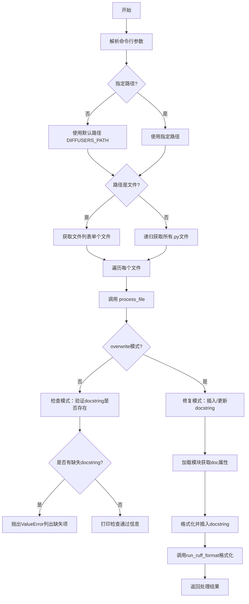
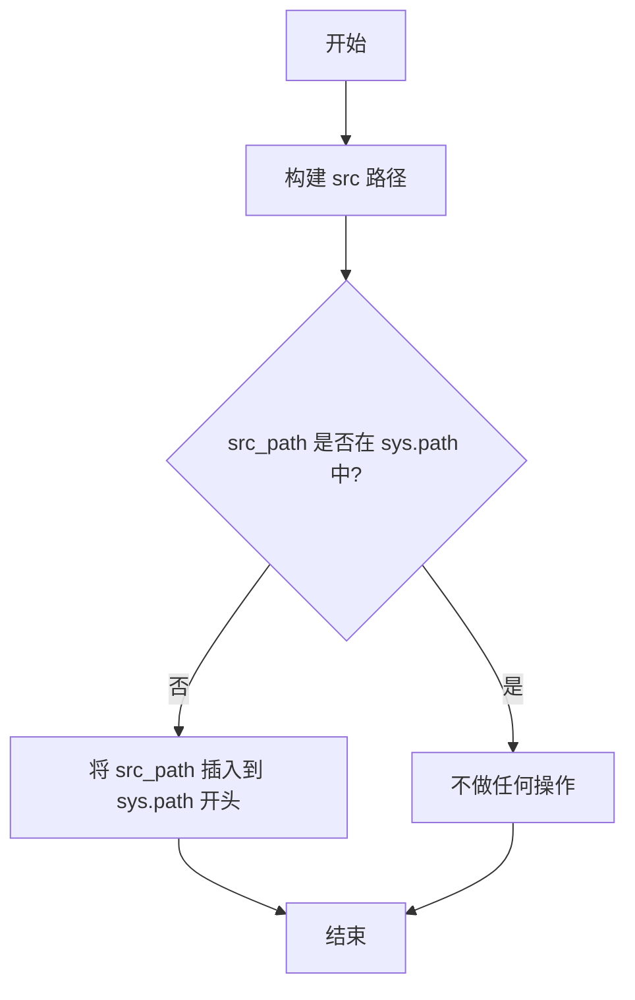
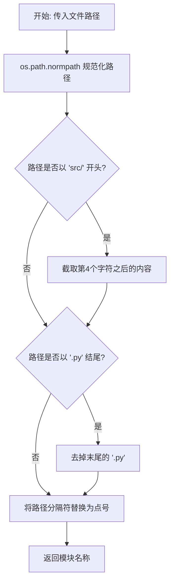
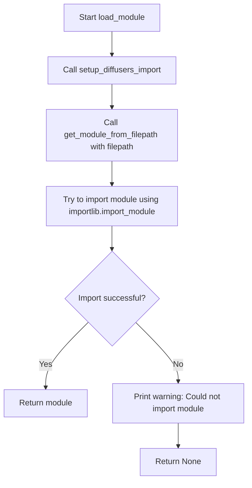
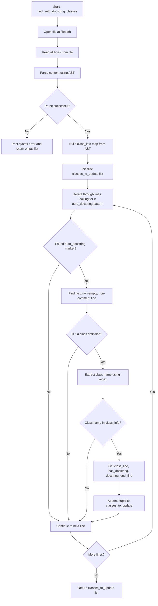
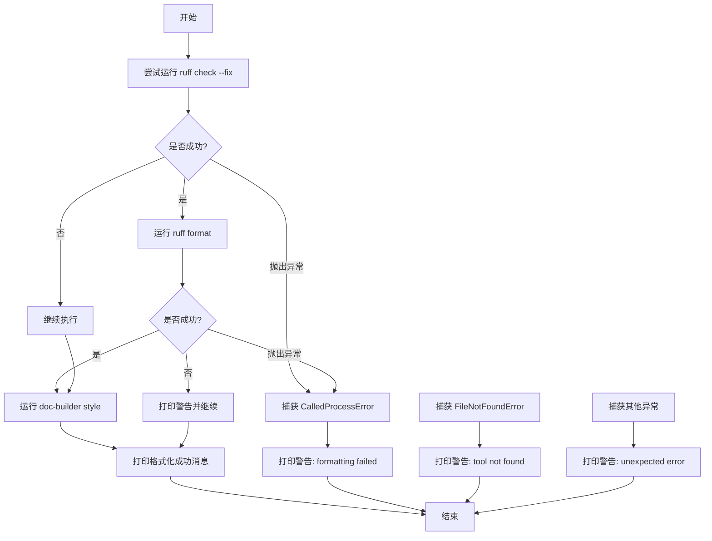
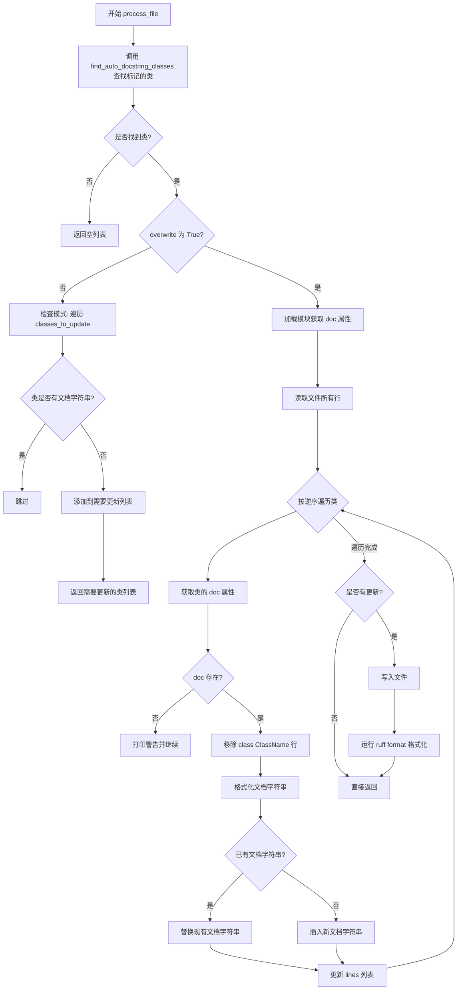

# `diffusers\utils\modular_auto_docstring.py` 详细设计文档

一个自动文档字符串生成工具，用于扫描Python文件中带有 # auto_docstring 注释的类，并从类的 doc 属性自动插入或更新文档字符串，支持检查模式和修复覆盖模式。

## 整体流程



## 类结构

```
模块: modular_auto_docstring (主脚本)
├── 全局变量
│   ├── DIFFUSERS_PATH
│   ├── REPO_PATH
│   └── AUTO_DOCSTRING_PATTERN
├── 辅助函数
│   ├── setup_diffusers_import
│   ├── get_module_from_filepath
│   ├── load_module
│   ├── get_doc_from_class
│   ├── find_auto_docstring_classes
│   ├── strip_class_name_line
│   ├── format_docstring
│   ├── run_ruff_format
│   └── get_existing_docstring
└── 核心功能函数
    ├── process_file
    └── check_auto_docstrings
```

## 全局变量及字段


### `DIFFUSERS_PATH`
    
指定diffusers模块的源代码目录路径，默认为'src/diffusers'，用于扫描需要处理docstring的Python文件

类型：`str`
    


### `REPO_PATH`
    
指定仓库的根目录路径，默认为当前目录'.'，用于设置模块导入路径和文件扫描基准路径

类型：`str`
    


### `AUTO_DOCSTRING_PATTERN`
    
编译后的正则表达式对象，用于匹配包含'auto_docstring'标记的注释行

类型：`re.Pattern`
    


    

## 全局函数及方法


### `setup_diffusers_import`

设置导入路径以使用本地 diffusers 模块，通过将 `src` 目录路径添加到 `sys.path` 开头，使得脚本能够正确导入本地开发版本的 diffusers 库。

参数：无

返回值：`None`，无返回值（该函数直接修改全局 `sys.path` 列表）

#### 流程图



#### 带注释源码

```python
def setup_diffusers_import():
    """Setup import path to use the local diffusers module."""
    # 构建 src 目录的绝对路径：REPO_PATH/src
    src_path = os.path.join(REPO_PATH, "src")
    # 检查 src_path 是否已经存在于 sys.path 中，避免重复添加
    if src_path not in sys.path:
        # 将 src_path 插入到 sys.path 的开头，优先于其他路径
        sys.path.insert(0, src_path)
```


### `get_module_from_filepath`

将给定的文件路径转换为 Python 模块名称，用于后续的模块导入操作。

参数：

- `filepath`：`str`，需要转换的文件路径

返回值：`str`，转换后的模块名称（例如 `src/diffusers/models/module.py` 转换为 `diffusers.models.module`）

#### 流程图



#### 带注释源码

```python
def get_module_from_filepath(filepath: str) -> str:
    """Convert a filepath to a module name."""
    # Step 1: 规范化路径，处理不同操作系统的路径分隔符差异
    filepath = os.path.normpath(filepath)

    # Step 2: 如果路径以 "src/" 开头，则去除 "src/" 前缀
    # 例如: "src/diffusers/models.py" -> "diffusers/models.py"
    if filepath.startswith("src" + os.sep):
        filepath = filepath[4:]

    # Step 3: 如果路径以 ".py" 结尾，则去除文件扩展名
    # 例如: "diffusers/models.py" -> "diffusers/models"
    if filepath.endswith(".py"):
        filepath = filepath[:-3]

    # Step 4: 将路径分隔符替换为 Python 模块的点号表示法
    # 例如: "diffusers/models" -> "diffusers.models"
    module_name = filepath.replace(os.sep, ".")
    return module_name
```


### `load_module`

该函数负责根据文件路径加载对应的 Python 模块。它首先设置导入路径，然后获取模块名称，最后使用 `importlib.import_module` 尝试导入模块。如果导入失败，会捕获异常并打印警告信息，返回 `None`。

参数：

-  `filepath`：`str`，要加载的模块文件路径

返回值：`module | None`，成功导入时返回模块对象，导入失败时返回 `None`

#### 流程图



#### 带注释源码

```python
def load_module(filepath: str):
    """Load a module from filepath."""
    # Step 1: Setup import path to ensure local diffusers module can be imported
    # This adds 'src' directory to sys.path if not already present
    setup_diffusers_import()
    
    # Step 2: Convert filepath to module name
    # e.g., "src/diffusers/pipelines/modular_pipeline.py" -> "diffusers.pipelines.modular_pipeline"
    module_name = get_module_from_filepath(filepath)

    try:
        # Step 3: Attempt to import the module using Python's importlib
        # This will execute the module's top-level code and return the module object
        module = importlib.import_module(module_name)
        return module
    except Exception as e:
        # Step 4: If import fails, print warning and return None
        # This handles cases like syntax errors, missing dependencies, etc.
        print(f"Warning: Could not import module {module_name}: {e}")
        return None
```


### `get_doc_from_class`

获取已实例化类的 `doc` 属性值，用于自动从类实例中提取文档字符串。

参数：

- `module`：`module`，Python 模块对象，包含需要获取 doc 属性的类
- `class_name`：`str`，类的名称，用于从模块中查找并实例化对应的类

返回值：`Optional[str]`，返回实例化后类对象的 `doc` 属性值，如果获取失败则返回 `None`

#### 流程图

```mermaid
flowchart TD
    A[开始] --> B{module is None?}
    B -->|Yes| C[返回 None]
    B -->|No| D[从 module 获取 class_name 对应的类对象]
    E{cls is None?}
    D --> E
    E -->|Yes| C
    E -->|No| F[尝试实例化类: instance = cls()]
    G{实例化成功?}
    F --> G
    G -->|No| H[打印警告: Could not instantiate {class_name}]
    H --> C
    G -->|Yes| I{instance 是否有 doc 属性?}
    I -->|No| C
    I -->|Yes| J[返回 instance.doc]
    C --> K[结束]
    J --> K
```

#### 带注释源码

```python
def get_doc_from_class(module, class_name: str) -> str:
    """Get the doc property from an instantiated class."""
    # 参数校验：如果模块为空，直接返回 None
    if module is None:
        return None

    # 从模块中获取指定名称的类对象
    cls = getattr(module, class_name, None)
    # 如果类不存在于模块中，返回 None
    if cls is None:
        return None

    # 尝试实例化类以访问其 doc 属性
    try:
        instance = cls()
        # 检查实例是否有 doc 属性
        if hasattr(instance, "doc"):
            return instance.doc
    except Exception as e:
        # 实例化失败时打印警告信息
        print(f"Warning: Could not instantiate {class_name}: {e}")

    # 默认返回 None（类无 doc 属性或实例化失败）
    return None
```


### `find_auto_docstring_classes`

该函数用于扫描指定的 Python 文件，查找所有带有 `# auto_docstring` 注释标记的类，并通过 AST 解析获取这些类的行号、是否已有文档字符串以及文档字符串的结束行号信息。

参数：

- `filepath`：`str`，要扫描的 Python 文件路径

返回值：`list`，返回包含 `(class_name, class_line_number, has_existing_docstring, docstring_end_line)` 元组的列表

#### 流程图



#### 带注释源码

```python
def find_auto_docstring_classes(filepath: str) -> list:
    """
    Find all classes in a file that have # auto_docstring comment above them.

    Returns list of (class_name, class_line_number, has_existing_docstring, docstring_end_line)
    """
    # 打开文件并读取所有行，使用 UTF-8 编码
    with open(filepath, "r", encoding="utf-8", newline="\n") as f:
        lines = f.readlines()

    # 将所有行合并为字符串用于 AST 解析
    content = "".join(lines)
    
    # 使用 AST 解析文件内容
    try:
        tree = ast.parse(content)
    except SyntaxError as e:
        # 如果解析失败，打印语法错误并返回空列表
        print(f"Syntax error in {filepath}: {e}")
        return []

    # 构建类名到类信息的映射字典
    # 映射内容: class_name -> (class_line, has_docstring, docstring_end_line)
    class_info = {}
    for node in ast.walk(tree):
        if isinstance(node, ast.ClassDef):
            has_docstring = False
            # 默认为类定义行
            docstring_end_line = node.lineno

            # 检查类是否有文档字符串
            if node.body and isinstance(node.body[0], ast.Expr):
                first_stmt = node.body[0]
                # 检查第一个语句是否为字符串常量
                if isinstance(first_stmt.value, ast.Constant) and isinstance(first_stmt.value.value, str):
                    has_docstring = True
                    # 获取文档字符串的结束行号
                    docstring_end_line = first_stmt.end_lineno or first_stmt.lineno

            # 存储类信息
            class_info[node.name] = (node.lineno, has_docstring, docstring_end_line)

    # 初始化需要更新的类列表
    classes_to_update = []

    # 遍历每一行，查找 # auto_docstring 注释标记
    for i, line in enumerate(lines):
        if AUTO_DOCSTRING_PATTERN.match(line):
            # 找到标记后，查找下一个非空、非注释行
            j = i + 1
            while j < len(lines):
                next_line = lines[j].strip()
                if next_line and not next_line.startswith("#"):
                    break
                j += 1

            # 判断该行是否为类定义
            if j < len(lines) and lines[j].strip().startswith("class "):
                # 使用正则表达式提取类名
                match = re.match(r"class\s+(\w+)", lines[j].strip())
                if match:
                    class_name = match.group(1)
                    # 如果类名在 class_info 中，则添加到待更新列表
                    if class_name in class_info:
                        class_line, has_docstring, docstring_end_line = class_info[class_name]
                        classes_to_update.append((class_name, class_line, has_docstring, docstring_end_line))

    # 返回需要更新的类列表
    return classes_to_update
```


### `strip_class_name_line`

该函数用于从类的文档字符串中移除第一行的 "class ClassName" 格式的标题行（如果存在），同时也会移除该行后面紧跟的任何空行，常用于处理从类的 `doc` 属性获取的文档内容，避免在生成的 docstring 中出现重复的类名标题。

参数：

-  `doc`：`str`，需要处理的文档字符串内容
-  `class_name`：`str`，用于匹配和移除的类名

返回值：`str`，处理后的文档字符串，移除了类名行和后续空行

#### 流程图

```mermaid
flowchart TD
    A[开始: strip_class_name_line] --> B[doc.strip .split \n 转为行列表]
    B --> C{lines 非空 且 第一行 == 'class {class_name}'}
    C -->|是| D[lines = lines[1:]]
    C -->|否| H[返回 '\n'.join(lines)]
    D --> E{lines 非空 且 第一行为空}
    E -->|是| F[lines = lines[1:]]
    E -->|否| G[返回 '\n'.join(lines)]
    F --> E
```

#### 带注释源码

```python
def strip_class_name_line(doc: str, class_name: str) -> str:
    """
    Remove the 'class ClassName' line from the doc if present.
    
    用于移除文档字符串顶部的 "class ClassName" 行，避免在自动生成的 docstring 中出现重复的类名标题。
    """
    # 去除首尾空白后按换行符分割成行列表
    lines = doc.strip().split("\n")
    
    # 检查是否存在匹配 "class {class_name}" 的第一行
    if lines and lines[0].strip() == f"class {class_name}":
        # 移除类名行（第一行）
        lines = lines[1:]
        
        # 继续移除后续的空行
        while lines and not lines[0].strip():
            lines = lines[1:]
    
    # 将处理后的行重新合并为字符串并返回
    return "\n".join(lines)
```


### `format_docstring`

将原始文档字符串内容格式化为符合 Python 规范的缩进文档字符串。

参数：

-  `doc`：`str`，需要格式化的原始文档字符串内容
-  `indent`：`str`，缩进字符，默认为四个空格

返回值：`str`，格式化后的文档字符串，包含三引号包裹

#### 流程图

```mermaid
flowchart TD
    A[开始 format_docstring] --> B[去除 doc 前后空白并按行分割]
    B --> C{判断行数是否为1}
    C -->|是| D[单行文档字符串处理]
    C -->|否| E[多行文档字符串处理]
    D --> F[返回单行格式: indent + \"\"\" + 内容 + \"\"\"\n]
    E --> G[初始化结果列表: indent + \"\"\"\n]
    G --> H{遍历每一行}
    H -->|当前行非空| I[添加缩进+当前行+换行符]
    H -->|当前行空| J[添加空行]
    I --> H
    J --> H
    H --> K{遍历完成?}
    K -->|否| H
    K -->是| L[添加结束三引号: indent + \"\"\"\n]
    L --> M[合并所有内容并返回]
    F --> N[结束]
    M --> N
```

#### 带注释源码

```python
def format_docstring(doc: str, indent: str = "    ") -> str:
    """Format a doc string as a properly indented docstring."""
    # 去除文档字符串前后的空白字符，并按换行符分割成行列表
    lines = doc.strip().split("\n")

    # 如果只有一行内容，使用单行文档字符串格式
    if len(lines) == 1:
        return f'{indent}"""{lines[0]}"""\n'
    else:
        # 多行文档字符串：构建结果列表，首先添加开始的三引号
        result = [f'{indent}"""\n']
        
        # 遍历每一行
        for line in lines:
            if line.strip():
                # 非空行：添加缩进前缀和换行符
                result.append(f"{indent}{line}\n")
            else:
                # 空行：直接添加换行符（不添加缩进，保持文档字符串内部空行格式）
                result.append("\n")
        
        # 添加结束的三引号
        result.append(f'{indent}"""\n')
        
        # 将所有部分合并为一个字符串并返回
        return "".join(result)
```


### `run_ruff_format`

该函数是模块化自动文档生成器的辅助函数，用于对 Python 源文件执行代码格式化操作。它依次调用 `ruff check --fix`（修复 linting 问题）、`ruff format`（代码格式化）和 `doc-builder style`（文档字符串格式化），确保代码风格一致性。

参数：

- `filepath`：`str`，要格式化的文件路径

返回值：`None`，该函数仅执行格式化操作，不返回任何值。

#### 流程图



#### 带注释源码

```python
def run_ruff_format(filepath: str):
    """
    Run ruff check --fix, ruff format, and doc-builder style on a file 
    to ensure consistent formatting.
    
    该函数依次执行三个格式化工具:
    1. ruff check --fix: 修复 linting 问题（包括行长度等）
    2. ruff format: 代码格式化
    3. doc-builder style: 文档字符串格式化
    
    Args:
        filepath: 要格式化的文件路径
        
    Returns:
        None: 该函数不返回任何值，仅执行副作用
        
    Raises:
        subprocess.CalledProcessError: 当 ruff format 执行失败时
        FileNotFoundError: 当所需的工具未安装时
        Exception: 其他可能的意外错误
    """
    try:
        # 第一步：运行 ruff check --fix 修复任何 linting 问题（包括行长度）
        # check=False 允许继续执行，即使存在无法修复的问题
        subprocess.run(
            ["ruff", "check", "--fix", filepath],
            check=False,  # Don't fail if there are unfixable issues
            capture_output=True,
            text=True,
        )
        # 第二步：运行 ruff format 进行代码格式化
        # check=True 会抛出异常如果格式化失败
        subprocess.run(
            ["ruff", "format", filepath],
            check=True,
            capture_output=True,
            text=True,
        )
        # 第三步：运行 doc-builder style 进行文档字符串格式化
        # max_len=119 设置文档字符串的最大行长度为 119 字符
        # check=False 允许继续执行，即使 doc-builder 有问题
        subprocess.run(
            ["doc-builder", "style", filepath, "--max_len", "119"],
            check=False,  # Don't fail if doc-builder has issues
            capture_output=True,
            text=True,
        )
        # 格式化完成后打印成功消息
        print(f"Formatted {filepath}")
    except subprocess.CalledProcessError as e:
        # 处理 ruff format 执行失败的情况
        # 打印包含 stderr 的警告信息
        print(f"Warning: formatting failed for {filepath}: {e.stderr}")
    except FileNotFoundError as e:
        # 处理工具未安装的情况
        # 可能是 ruff 或 doc-builder 未在 PATH 中
        print(f"Warning: tool not found ({e}). Skipping formatting.")
    except Exception as e:
        # 捕获所有其他意外错误
        # 确保格式化失败不会中断主流程
        print(f"Warning: unexpected error formatting {filepath}: {e}")
```

#### 关键组件信息

| 组件名称 | 一句话描述 |
|---------|-----------|
| `ruff` | Python linter 和代码格式化工具 |
| `doc-builder` | Hugging Face 的文档构建工具，用于格式化 docstring |
| `subprocess.run` | Python 标准库函数，用于执行外部命令 |

#### 潜在的技术债务或优化空间

1. **错误处理不够精细**：所有异常都仅打印警告，可能导致部分格式化失败但用户不知情。建议返回格式化状态或失败原因列表。

2. **工具依赖硬编码**：假设 `ruff` 和 `doc-builder` 已安装，没有安装检查或友好的错误提示。

3. **缺少日志记录**：使用 `print` 输出状态，建议使用 Python `logging` 模块以便配置日志级别。

4. **格式化顺序可能不是最优**：先修复 lint 再格式化，顺序合理，但可以考虑并行化某些步骤（如果工具支持）。

5. **没有验证格式化结果**：运行格式化后没有检查文件是否真的被修改，可能导致不必要的文件 I/O。

#### 其它项目

- **设计目标**：确保模块化管道块的代码风格一致性，包括代码格式和文档字符串格式
- **约束**：依赖外部工具（ruff、doc-builder），这些工具必须在系统 PATH 中可用
- **错误处理**：采用宽容策略，即使某个格式化步骤失败也继续执行，仅打印警告
- **外部依赖**：
  - `ruff`：必须安装
  - `doc-builder`：必须安装
  - Python `subprocess` 模块：用于执行外部命令


### `get_existing_docstring`

该函数用于从代码行列表中提取现有 docstring 的内容，通过指定的类定义行号和 docstring 结束行号定位并截取相应的行，然后合并成完整的 docstring 字符串返回。

参数：

- `lines`：`list`，代码文件的所有行列表，每行字符串以换行符`\n`结尾
- `class_line`：`int`，类定义所在的行号（1-indexed，即首行为1）
- `docstring_end_line`：`int`，docstring 结束的行号（1-indexed，包含该行）

返回值：`str`，提取出的 docstring 内容字符串

#### 流程图

```mermaid
flowchart TD
    A[开始 get_existing_docstring] --> B[输入 lines, class_line, docstring_end_line]
    B --> C[使用切片 lines[class_line:docstring_end_line] 提取行]
    C --> D{提取结果}
    D -->|成功| E[使用 join 合并为字符串]
    E --> F[返回 docstring 字符串]
    D -->|异常| G[返回空字符串]
    
    style A fill:#e1f5fe
    style F fill:#e8f5e8
    style G fill:#ffebee
```

#### 带注释源码

```python
def get_existing_docstring(lines: list, class_line: int, docstring_end_line: int) -> str:
    """Extract the existing docstring content from lines."""
    # class_line 是 1-indexed，docstring 从 class_line 开始（0-indexed 对应 class_line）
    # docstring_end_line 也是 1-indexed，且是包含的（inclusive）
    # 例如：class_line=10, docstring_end_line=12 时，提取 lines[10:12]，即第11-12行
    docstring_lines = lines[class_line:docstring_end_line]
    return "".join(docstring_lines)
```


### `process_file`

该函数是自动文档字符串生成器的核心处理函数，负责扫描指定文件，查找带有 `# auto_docstring` 标记的类，并根据类的 `doc` 属性插入或更新文档字符串。支持两种模式：检查模式（验证文档字符串是否存在）和覆盖模式（实际插入/更新文档字符串）。

参数：

- `filepath`：`str`，需要处理的文件路径
- `overwrite`：`bool`，是否覆盖写入文档字符串，默认为 `False`（仅检查模式）

返回值：`list`，返回需要更新的类列表，格式为 `[(filepath, class_name, line_number), ...]`

#### 流程图



#### 带注释源码

```python
def process_file(filepath: str, overwrite: bool = False) -> list:
    """
    Process a file and find/insert docstrings for # auto_docstring marked classes.

    Returns list of classes that need updating.
    """
    # 步骤1: 查找文件中带有 # auto_docstring 标记的类
    classes_to_update = find_auto_docstring_classes(filepath)

    # 步骤2: 如果没有找到标记的类，直接返回空列表
    if not classes_to_update:
        return []

    # 步骤3: 检查模式 (overwrite=False) - 仅验证文档字符串是否存在
    if not overwrite:
        # Content comparison is not reliable due to formatting differences
        classes_needing_update = []
        # 遍历所有标记的类，检查是否已有文档字符串
        for class_name, class_line, has_docstring, docstring_end_line in classes_to_update:
            if not has_docstring:
                # No docstring exists, needs update
                classes_needing_update.append((filepath, class_name, class_line))
        return classes_needing_update

    # 步骤4: 覆盖模式 (overwrite=True) - 实际插入/更新文档字符串
    
    # 加载模块以获取 doc 属性
    module = load_module(filepath)

    # 读取文件所有行到内存
    with open(filepath, "r", encoding="utf-8", newline="\n") as f:
        lines = f.readlines()

    # 步骤5: 逆序处理类以保持行号不变
    updated = False
    for class_name, class_line, has_docstring, docstring_end_line in reversed(classes_to_update):
        # 从模块实例获取 doc 属性
        doc = get_doc_from_class(module, class_name)

        if doc is None:
            print(f"Warning: Could not get doc for {class_name} in {filepath}")
            continue

        # 移除 "class ClassName" 行，因为文档字符串中冗余
        doc = strip_class_name_line(doc, class_name)

        # 使用 4 空格缩进格式化新文档字符串
        new_docstring = format_docstring(doc, "    ")

        if has_docstring:
            # 替换现有文档字符串 (从类定义行后到 docstring_end_line)
            # class_line 是 1 索引，我们想从 class_line+1 替换到 docstring_end_line
            lines = lines[:class_line] + [new_docstring] + lines[docstring_end_line:]
        else:
            # 在类定义行后立即插入新文档字符串
            # class_line 是 1 索引，所以 lines[class_line-1] 是类定义行
            # 插入位置 class_line (即类定义行之后)
            lines = lines[:class_line] + [new_docstring] + lines[class_line:]

        updated = True
        print(f"Updated docstring for {class_name} in {filepath}")

    # 步骤6: 如果有更新，写入文件并格式化
    if updated:
        with open(filepath, "w", encoding="utf-8", newline="\n") as f:
            f.writelines(lines)
        # 运行 ruff format 确保一致的换行格式化
        run_ruff_format(filepath)

    # 返回所有处理的类列表
    return [(filepath, cls_name, line) for cls_name, line, _, _ in classes_to_update]
```


### `check_auto_docstrings`

检查所有文件中的 `# auto_docstring` 标记，并可选择性地修复它们。该函数是脚本的主入口点，遍历指定路径下的所有 Python 文件，查找带有 `# auto_docstring` 注释的类，验证或更新其文档字符串。

参数：

- `path`：`str | None`，要检查的文件或目录路径，默认为 `None`，当为 `None` 时使用 `DIFFUSERS_PATH`（即 `src/diffusers`）
- `overwrite`：`bool`，是否修复并覆盖文档字符串，默认为 `False`

返回值：`None`，该函数无返回值，主要通过打印信息或抛出异常来反馈结果

#### 流程图

```mermaid
flowchart TD
    A[开始 check_auto_docstrings] --> B{path 是否为 None?}
    B -->|是| C[设置 path = DIFFUSERS_PATH]
    B -->|否| D{path 是文件还是目录?}
    C --> D
    D -->|文件| E[all_files = [path]]
    D -->|目录| F[使用 glob 递归获取所有 .py 文件]
    E --> G[初始化 all_markers 列表]
    F --> G
    G --> H[遍历 all_files 中的每个 filepath]
    H --> I[调用 process_file 处理文件]
    I --> J[将返回的 markers 添加到 all_markers]
    J --> K{是否还有更多文件?}
    K -->|是| H
    K -->|否| L{overwrite = False 且有未处理的标记?}
    L -->|是| M[构建错误消息并抛出 ValueError]
    L -->|否| N{overwrite = True 且有标记?}
    N -->|是| O[打印处理数量]
    N -->|否| P{没有标记?}
    P -->|是| Q[打印 'No # auto_docstring markers found.']
    P -->|否| R[打印 'All # auto_docstring markers have valid docstrings.']
    O --> S[结束]
    Q --> S
    R --> S
    M --> S
```

#### 带注释源码

```python
def check_auto_docstrings(path: str = None, overwrite: bool = False):
    """
    Check all files for # auto_docstring markers and optionally fix them.
    """
    # 如果未指定 path，则使用默认的 DIFFUSERS_PATH
    if path is None:
        path = DIFFUSERS_PATH

    # 判断 path 是单个文件还是目录
    if os.path.isfile(path):
        # 如果是文件，直接放入列表
        all_files = [path]
    else:
        # 如果是目录，递归获取所有 Python 文件
        all_files = glob.glob(os.path.join(path, "**/*.py"), recursive=True)

    # 用于存储所有需要处理的标记
    all_markers = []

    # 遍历所有文件进行处理
    for filepath in all_files:
        # 处理单个文件，返回需要更新的类列表
        markers = process_file(filepath, overwrite)
        # 收集所有标记
        all_markers.extend(markers)

    # 非覆盖模式：检查是否有未处理的标记
    if not overwrite and len(all_markers) > 0:
        # 构建错误消息，列出所有需要文档字符串的类和位置
        message = "\n".join([f"- {f}: {cls} at line {line}" for f, cls, line in all_markers])
        raise ValueError(
            f"Found the following # auto_docstring markers that need docstrings:\n{message}\n\n"
            f"Run `python utils/modular_auto_docstring.py --fix_and_overwrite` to fix them."
        )

    # 覆盖模式：处理完成后打印结果
    if overwrite and len(all_markers) > 0:
        print(f"\nProcessed {len(all_markers)} docstring(s).")
    # 非覆盖模式且没有需要处理的标记
    elif not overwrite and len(all_markers) == 0:
        print("All # auto_docstring markers have valid docstrings.")
    # 没有找到任何标记
    elif len(all_markers) == 0:
        print("No # auto_docstring markers found.")
```

## 关键组件


### 模块路径处理与导入系统

负责设置Python模块导入路径，将本地src目录添加到sys.path，并提供从文件路径到模块名的转换功能。

### AST代码解析引擎

使用Python的ast模块解析源代码，定位类定义及其文档字符串，构建类名与行号的映射关系，为后续文档字符串处理提供基础。

### 自动文档字符串标记识别器

通过正则表达式匹配`# auto_docstring`注释，定位需要自动生成文档字符串的类，并检查是否已存在文档字符串。

### 文档字符串提取与格式化器

从类的doc属性获取文档内容，移除冗余的类名行，将原始文档格式化为符合Python规范的缩进文档字符串。

### 代码格式化流水线

集成ruff和doc-builder工具，对处理后的文件进行代码格式化和文档字符串样式规范化，确保输出符合项目编码规范。

### 文件处理与批量检查引擎

递归扫描指定路径下的所有Python文件，检查或修复自动文档字符串标记，支持单独文件和目录两种处理模式。

### 命令行接口与错误报告

提供命令行参数解析，支持检查模式和覆盖修复模式，输出格式化的错误报告和操作结果摘要。


## 问题及建议


### 已知问题

- **错误处理不够健壮**：`load_module` 函数捕获所有异常但仅打印警告，无法区分不同类型的错误（如 ImportError、SyntaxError）；`get_doc_from_class` 中实例化类失败时没有区分可恢复和不可恢复的错误。
- **性能问题**：每次处理文件都重新加载模块，对于大量文件会导致重复导入开销；`find_auto_docstring_classes` 先读取所有行为 lines，再解析 AST 生成 tree，存在重复读取和解析的开销。
- **潜在的边界条件 bug**：`strip_class_name_line` 假设 doc 第一行一定是 `class ClassName`，但实际可能不存在此行或格式不同；`docstring_end_line` 默认设为 `node.lineno`，如果类定义紧跟在注释后会导致计算错误。
- **外部依赖缺少验证**：代码依赖 `ruff` 和 `doc-builder` 工具，但仅在工具不存在时打印警告继续执行，可能导致静默失败；依赖特定的目录结构（`src/diffusers`）但没有动态检测或配置机制。
- **代码可读性与维护性**：`process_file` 函数职责过多（读取文件、查找类、更新 docstring、写入文件、格式化），违反单一职责原则；多处使用魔法字符串（如 `"class "`, `".py"`, `"src"`）应提取为常量。

### 优化建议

- **增强错误处理**：区分不同异常类型并采取相应措施；对关键操作添加重试机制或更详细的日志记录；使用结构化日志替代 print。
- **优化性能**：缓存已加载的模块避免重复导入；使用 AST 一次遍历同时完成类查找和 docstring 检测；考虑增量处理只扫描有变化的文件的机制。
- **修复边界条件**：在 `strip_class_name_line` 中添加更健壮的检测逻辑；在 `find_auto_docstring_classes` 中验证行号计算的正确性。
- **依赖管理**：在脚本启动时检查外部工具是否存在，不存在时给出明确错误而非静默跳过；添加配置文件或命令行参数支持自定义路径。
- **代码重构**：将 `process_file` 拆分为更小的函数，每个函数负责单一职责；提取魔法字符串为模块级常量；为所有函数添加类型注解和详细文档字符串。

## 其它


### 设计目标与约束

本工具的设计目标是实现一个自动化的文档字符串生成器，用于扫描Python文件中标记有 `# auto_docstring` 注释的类，并从类的 `doc` 属性中自动插入或更新文档字符串。核心约束包括：1）仅处理带有特定注释标记的类；2）需要能够实例化类来获取 `doc` 属性；3）依赖外部工具（ruff、doc-builder）进行代码格式化；4）运行脚本时需要将仓库根目录作为工作目录。

### 错误处理与异常设计

代码采用分层错误处理策略：1）**可恢复错误**：对于无法导入的模块、无法实例化的类等，使用 `try-except` 捕获异常并打印警告信息，继续处理其他类，避免因单个问题导致整个流程中断；2）**致命错误**：对于语法错误（`SyntaxError`）导致AST解析失败，直接返回空列表并打印错误信息；3）**用户错误**：当检测到未修复的 `# auto_docstring` 标记时，抛出 `ValueError` 并提供明确的修复指令；4）**外部工具错误**：格式化工具执行失败时仅打印警告，不中断主流程。

### 数据流与状态机

工具的工作流程分为三个主要阶段：1）**扫描阶段**（`find_auto_docstring_classes`）：使用AST解析定位所有类和其现有文档字符串，同时扫描 `# auto_docstring` 注释标记，将两者关联生成待处理类列表；2）**处理阶段**（`process_file`）：对每个待处理类，获取其 `doc` 属性值，移除冗余的类名行，格式化为标准文档字符串格式；3）**写入阶段**：逆序更新文件内容以保持行号正确，写入后调用外部工具进行格式化。整个流程是单向的，从文件输入到文件输出，没有复杂的分支状态机。

### 外部依赖与接口契约

本工具依赖以下外部组件：1）**Python标准库**：`argparse`（命令行参数）、`ast`（代码解析）、`glob`（文件搜索）、`importlib`（动态导入）、`os/re/sub`（路径和正则操作）、`subprocess`（调用外部工具）、`sys`（系统操作）；2）**外部工具**：`ruff`（代码检查和格式化）、`doc-builder`（文档字符串格式化）；3）**项目内部模块**：需要能够导入 `src/diffusers` 路径下的模块以获取类的 `doc` 属性。接口契约规定：被标记的类必须可实例化且具有 `doc` 属性，该属性返回有效的Python文档字符串。

### 潜在技术债务与优化空间

当前实现存在以下可改进之处：1）**性能优化**：每次处理文件都重新加载模块，可以考虑缓存已加载的模块；2）**AST解析冗余**：在 `find_auto_docstring_classes` 中先完整解析AST再逐行扫描注释，可以合并为单次遍历；3）**错误恢复能力有限**：当某个类的 `doc` 属性获取失败时会跳过，无法批量重试或提供详细错误报告；4）**格式化工具依赖**：对外部工具（ruff、doc-builder）的依赖可能导致在某些环境中运行失败，且工具不可用时仅打印警告可能被忽视；5）**单元测试缺失**：代码缺少对应的单元测试文件，无法保证修改后的行为正确性；6）**硬编码路径**：`DIFFUSERS_PATH` 和 `REPO_PATH` 硬编码为相对路径，更适合作为命令行参数或配置文件提供。

### 关键组件信息

1. **AUTO_DOCSTRING_PATTERN**：正则表达式，用于匹配 `# auto_docstring` 注释标记
2. **setup_diffusers_import()**：设置Python导入路径，使本地 `src/diffusers` 模块可被导入
3. **get_module_from_filepath()**：将文件路径转换为Python模块名的工具函数
4. **load_module()**：动态加载Python模块的核心函数
5. **get_doc_from_class()**：从类的实例中获取 `doc` 属性值的函数
6. **find_auto_docstring_classes()**：使用AST和正则表达式查找所有标记类的核心函数
7. **format_docstring()**：将文档字符串格式化为标准格式的工具函数
8. **run_ruff_format()**：调用外部格式化工具的函数
9. **process_file()**：处理单个文件的主函数，协调所有操作
10. **check_auto_docstrings()**：入口函数，扫描并处理指定路径下的所有文件

### 测试策略建议

建议补充以下测试用例：1）**单元测试**：分别测试 `format_docstring`、`strip_class_name_line`、`get_module_from_filepath` 等工具函数；2）**集成测试**：创建包含 `# auto_docstring` 标记的测试Python文件，验证工具能否正确插入和更新文档字符串；3）**边界情况测试**：处理无标记的文件、已有文档字符串的类、`doc` 属性返回空值或无效值的类、语法错误的文件等；4）**Mock测试**：使用 `unittest.mock` 模拟外部工具调用，避免实际执行格式化命令。


    