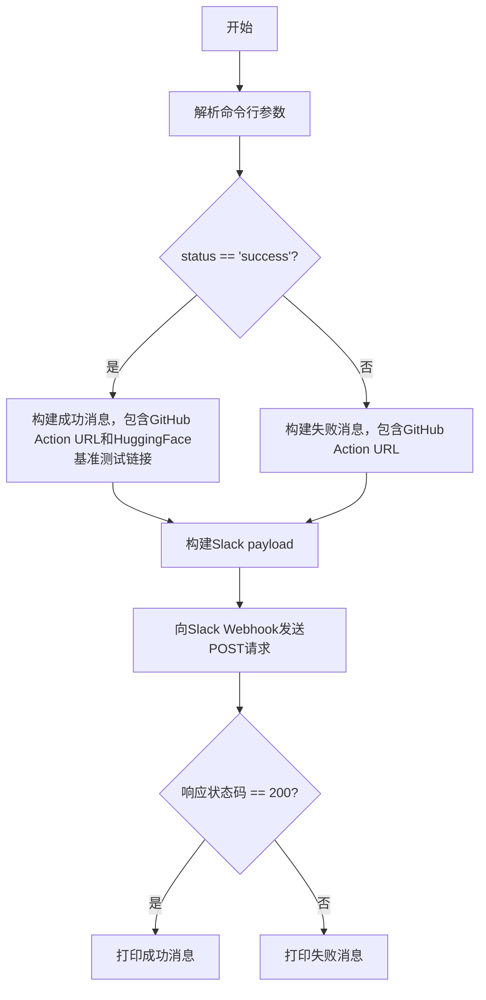
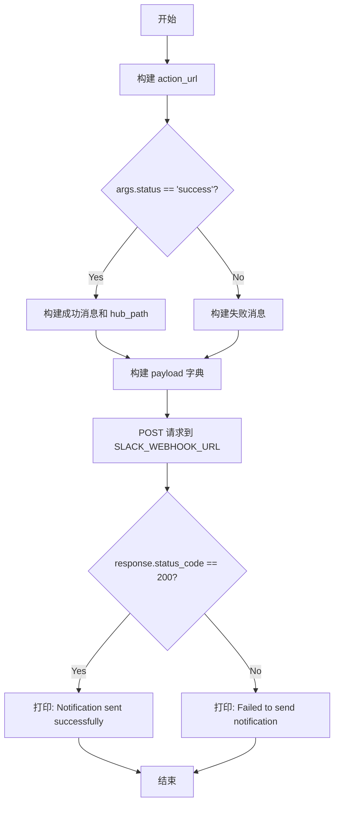

# `diffusers\utils\notify_benchmarking_status.py` 详细设计文档

这是一个Slack通知脚本，用于在GitHub Actions基准测试工作流完成后，向Slack发送通知，报告工作流的成功或失败状态，并提供GitHub Action和HuggingFace基准测试结果的链接。

## 整体流程



## 类结构

```
无类层次结构（脚本采用函数式编程）
```

## 全局变量及字段


### `GITHUB_REPO`
    
GitHub仓库名称

类型：`str`
    


### `GITHUB_RUN_ID`
    
GitHub Actions运行ID（从环境变量获取）

类型：`str`
    


### `SLACK_WEBHOOK_URL`
    
Slack Webhook URL（从环境变量获取）

类型：`str`
    


    

## 全局函数及方法


### `main(args)`

该函数是脚本的主入口点，接收命令行解析后的参数，根据工作流执行状态（成功或失败）构建对应的Slack通知消息，并通过Slack Webhook发送通知，最后根据响应状态码输出相应的执行结果。

参数：

- `args`：`argparse.Namespace`，包含从命令行解析的参数对象
  - `args.status`：`str`，工作流执行状态，值为 `"success"` 或 `"failure"`（通过 `--status` 参数传入）

返回值：`None`，该函数没有显式返回值，仅执行副作用操作（发送HTTP请求和打印日志）

#### 流程图



#### 带注释源码

```python
def main(args):
    # 构建GitHub Actions运行链接，用于Slack消息中展示
    action_url = f"https://github.com/{GITHUB_REPO}/actions/runs/{GITHUB_RUN_ID}"
    
    # 根据工作流执行状态构建不同的Slack消息内容
    if args.status == "success":
        # 成功状态：包含GitHub Action链接和HuggingFace数据集链接
        hub_path = "https://huggingface.co/datasets/diffusers/benchmarks/blob/main/collated_results.csv"
        message = (
            "✅ New benchmark workflow successfully run.\n"
            f"🕸️ GitHub Action URL: {action_url}.\n"
            f"🤗 Check out the benchmarks here: {hub_path}."
        )
    else:
        # 失败状态：仅包含GitHub Action链接供用户查看详情
        message = (
            "❌ Something wrong happened in the benchmarking workflow.\n"
            f"Check out the GitHub Action to know more: {action_url}."
        )

    # 构建Slack Webhook请求载荷
    payload = {"text": message}
    
    # 发送POST请求到Slack Webhook URL
    response = requests.post(SLACK_WEBHOOK_URL, json=payload)

    # 根据响应状态码判断通知是否发送成功
    if response.status_code == 200:
        print("Notification sent to Slack successfully.")
    else:
        print("Failed to send notification to Slack.")
```

## 关键组件


### 配置管理模块

管理GitHub仓库信息、运行ID和Slack Webhook URL等配置，通过环境变量获取敏感信息。

### 命令行参数解析

使用argparse解析--status参数，支持success和failure两种状态，默认值为success。

### 消息构建模块

根据工作流执行状态构建对应的Slack消息内容，包含GitHub Action链接和基准测试结果链接。

### HTTP请求模块

使用requests库向Slack Webhook发送POST请求，传递JSON格式的消息payload。

### 状态码处理模块

检查Slack Webhook响应的状态码，200表示成功，其他状态表示失败并打印相应提示。


## 问题及建议


### 已知问题

-   **环境变量未验证** - GITHUB_RUN_ID 和 SLACK_WEBHOOK_URL 直接使用但未检查是否为 None，可能导致运行时错误
-   **异常处理缺失** - requests.post() 调用没有 try-except 捕获，网络异常会导致程序崩溃
-   **错误退出码缺失** - 发送失败时仅打印消息，程序仍以成功状态码退出（exit code 0）
-   **日志记录不规范** - 使用 print 而非 Python logging 模块，不利于生产环境调试
-   **配置硬编码** - GITHUB_REPO、hub_path 等配置项直接写在代码中，缺乏灵活性
-   **类型注解缺失** - main() 函数参数和返回值没有类型提示，降低代码可维护性
-   **参数验证不足** - 未验证 GITHUB_RUN_ID 格式是否符合预期

### 优化建议

-   添加环境变量存在性检查，缺失时抛出明确的 ValueError 或使用 argparse 的 required 参数
-   用 try-except 包裹 requests.post()，捕获 requests.RequestException，并设置正确的退出码（sys.exit(1)）
-   替换 print 为 logging 模块，支持配置日志级别和格式
-   将配置项抽取为独立的配置文件或环境变量，增强可维护性
-   为函数添加类型注解（args: argparse.Namespace） -> None
-   考虑添加重试机制应对网络瞬时故障
-   对 GITHUB_RUN_ID 添加格式验证（如正则匹配数字串）

## 其它


### 设计目标与约束

本脚本的设计目标是在GitHub Actions工作流执行完成后，自动向指定Slack频道发送执行结果通知。约束条件包括：必须通过环境变量获取GITHUB_RUN_ID和SLACK_WEBHOOK_URL；仅支持success和failure两种状态；消息格式固定为Slack Block Kit文本格式；依赖外部Slack Webhook API进行消息推送。

### 错误处理与异常设计

代码目前仅通过response.status_code判断请求是否成功，缺乏对网络异常、连接超时、SSL错误等情况的处理。当GITHUB_RUN_ID或SLACK_WEBHOOK_URL环境变量未设置时，程序会抛出KeyError异常导致中断。建议增加环境变量缺失的预检查、try-except包裹网络请求、以及重试机制。

### 外部依赖与接口契约

主要外部依赖包括：requests库用于HTTP POST请求；Slack Webhook API接受JSON格式payload，字段text为必选，Content-Type需设置为application/json；GitHub Actions API通过构建URL访问工作流记录。SLACK_WEBHOOK_URL必须为有效的Slack Incoming Webhook URL地址。

### 配置管理

配置通过全局常量GITHUB_REPO（硬编码为"huggingface/diffusers"）和环境变量GITHUB_RUN_ID、SLACK_WEBHOOK_URL共同管理。当前设计不支持运行时动态修改仓库名称，配置变更需要修改代码或环境变量。

### 安全性考虑

代码存在以下安全隐患：SLACK_WEBHOOK_URL以明文形式存储在环境变量中，可能被日志泄露；GITHUB_RUN_ID和SLACK_WEBHOOK_URL缺少空值校验，若未设置会导致程序异常终止；message内容未经转义处理，建议对用户可控输入进行escape防止Slack Injection攻击。

### 测试策略

当前代码缺少单元测试和集成测试。建议添加的测试用例包括：环境变量缺失时的异常处理测试、不同status参数下的消息构建测试、Slack API返回非200状态码时的行为测试、网络请求超时测试等。

### 部署与运行要求

运行前需确保：Python 3.6+环境；安装requests库（pip install requests）；设置GITHUB_RUN_ID和SLACK_WEBHOOK_URL两个必需环境变量；通过命令行传递--status参数（success或failure）；运行命令示例：python script.py --status success。

### 可扩展性与未来改进

建议的改进方向包括：支持自定义消息模板、支持多个Slack Webhook接收者、集成更丰富的Slack消息格式（blocks）、增加日志记录而非仅打印到stdout、支持dry-run模式用于测试、添加健康检查和告警机制。

### 性能考量

当前实现为同步阻塞式HTTP请求，在高并发场景下可能成为瓶颈。建议在需要大量通知的场景下考虑异步请求（使用aiohttp）或消息队列解耦。


    