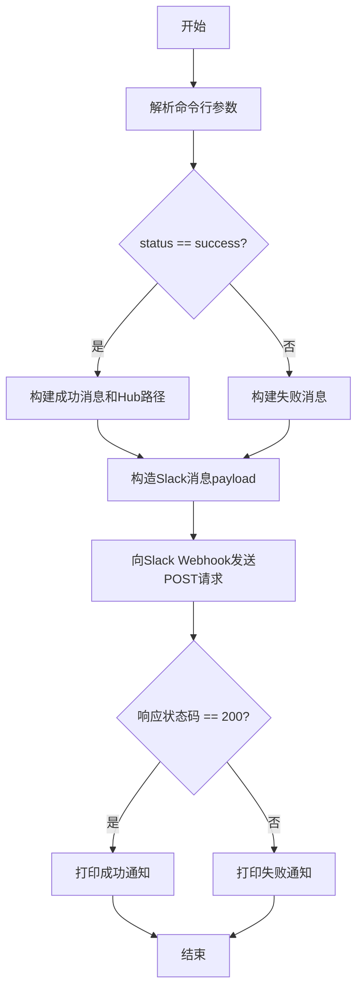
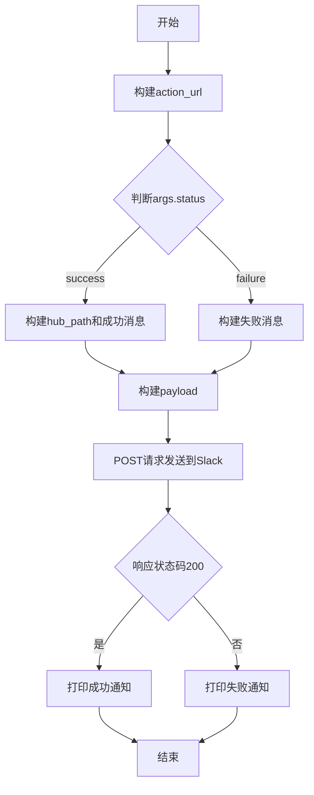

# `diffusers\utils\notify_community_pipelines_mirror.py` 详细设计文档

这是一个GitHub Action脚本，用于在CI/CD流程完成后向Slack发送通知消息，报告社区pipeline镜像操作的成功或失败状态。

## 整体流程



## 类结构

```
无类层次结构（脚本文件）
```

## 全局变量及字段


### `GITHUB_REPO`
    
GitHub仓库名称，值为'huggingface/diffusers'

类型：`str`
    


### `GITHUB_RUN_ID`
    
GitHub Actions运行ID，从环境变量获取

类型：`str`
    


### `SLACK_WEBHOOK_URL`
    
Slack Webhook URL，从环境变量获取

类型：`str`
    


### `PATH_IN_REPO`
    
仓库中的路径，从环境变量获取

类型：`str`
    


    

## 全局函数及方法


### `main(args)`

`main` 函数是脚本的主入口，接收解析后的命令行参数，根据操作状态构造包含 GitHub Action 运行链接和 HuggingFace Hub 路径的 Slack 消息，并发送通知到配置的 Slack Webhook。

参数：

- `args`：`argparse.Namespace`，包含从命令行解析的参数，当前仅包含 `status` 属性（可选值为 `"success"` 或 `"failure"`，默认为 `"success"`）

返回值：`None`，该函数无返回值，仅通过 `print` 输出操作结果

#### 流程图

```mermaid
flowchart TD
    A([开始: main args]) --> B[构建 GitHub Action URL]
    B --> C{args.status == "success"}
    C -->|Yes| D[构建 HuggingFace Hub 路径]
    D --> E[构建成功消息: ✅ 镜像成功]
    C -->|No| F[构建失败消息: ❌ 操作失败]
    E --> G[创建 Slack payload]
    F --> G
    G --> H[发送 POST 请求到 Slack Webhook]
    H --> I{response.status_code == 200}
    I -->|Yes| J[打印: 通知发送成功]
    I -->|No| K[打印: 通知发送失败]
    J --> L([结束])
    K --> L
```

#### 带注释源码

```python
def main(args):
    """
    主函数，构造 Slack 通知消息并发送
    
    参数:
        args: 包含命令行参数的命名空间对象，必须包含 status 属性
    """
    # 构建 GitHub Actions 运行页面链接
    action_url = f"https://github.com/{GITHUB_REPO}/actions/runs/{GITHUB_RUN_ID}"
    
    # 根据执行状态判断消息内容
    if args.status == "success":
        # 成功状态：构建 HuggingFace Hub 上的资源路径
        hub_path = f"https://huggingface.co/datasets/diffusers/community-pipelines-mirror/tree/main/{PATH_IN_REPO}"
        message = (
            "✅ Community pipelines successfully mirrored.\n"  # 成功emoji + 消息正文
            f"🕸️ GitHub Action URL: {action_url}.\n"          # 蜘蛛网emoji + GitHub 链接
            f"🤗 Hub location: {hub_path}."                   #拥抱emoji + HF Hub 路径
        )
    else:
        # 失败状态：仅包含错误提示和 GitHub Action 链接
        message = f"❌ Something wrong happened. Check out the GitHub Action to know more: {action_url}."

    # 构造 Slack 消息载荷（JSON 格式）
    payload = {"text": message}
    
    # 发送 HTTP POST 请求到 Slack Webhook
    response = requests.post(SLACK_WEBHOOK_URL, json=payload)

    # 检查响应状态码并输出结果
    if response.status_code == 200:
        print("Notification sent to Slack successfully.")
    else:
        print("Failed to send notification to Slack.")
```

## 关键组件


### 一段话描述

该代码是一个GitHub Actions工作流通知脚本，用于在社区流水线镜像任务执行完成后，通过Slack Webhook向指定渠道发送包含GitHub Action运行状态和HuggingFace Hub资源链接的通知消息。

### 文件的整体运行流程

1. 脚本启动时通过`argparse`解析命令行参数`--status`
2. 从环境变量获取`GITHUB_RUN_ID`、`SLACK_WEBHOOK_URL`和`PATH_IN_REPO`
3. 根据传入的status参数构建对应的消息内容（成功时包含Hub链接，失败时仅包含GitHub Action链接）
4. 使用`requests`库向Slack Webhook发送POST请求推送通知
5. 根据响应状态码输出成功或失败提示信息

### 全局变量详情

| 名称 | 类型 | 描述 |
|------|------|------|
| GITHUB_REPO | str | GitHub仓库名称，固定为"huggingface/diffusers" |
| GITHUB_RUN_ID | str | 从环境变量获取的GitHub Actions运行ID |
| SLACK_WEBHOOK_URL | str | 从环境变量获取的Slack Webhook URL |
| PATH_IN_REPO | str | 从环境变量获取的仓库中的路径 |

### 全局函数详情

#### main函数

**参数：**
| 参数名称 | 参数类型 | 参数描述 |
|----------|----------|----------|
| args | Namespace | 包含status属性的命名空间对象 |

**返回值：** 无（None）

**mermaid流程图：**


**带注释源码：**
```python
def main(args):
    # 构建GitHub Actions运行页面URL
    action_url = f"https://github.com/{GITHUB_REPO}/actions/runs/{GITHUB_RUN_ID}"
    
    # 根据执行状态构建不同的通知消息
    if args.status == "success":
        # 成功状态：构建HuggingFace Hub资源链接
        hub_path = f"https://huggingface.co/datasets/diffusers/community-pipelines-mirror/tree/main/{PATH_IN_REPO}"
        message = (
            "✅ Community pipelines successfully mirrored.\n"
            f"🕸️ GitHub Action URL: {action_url}.\n"
            f"🤗 Hub location: {hub_path}."
        )
    else:
        # 失败状态：仅提供GitHub Action链接供排查
        message = f"❌ Something wrong happened. Check out the GitHub Action to know more: {action_url}."

    # 构建Slack消息载荷
    payload = {"text": message}
    
    # 发送HTTP POST请求到Slack Webhook
    response = requests.post(SLACK_WEBHOOK_URL, json=payload)

    # 根据响应结果输出通知状态
    if response.status_code == 200:
        print("Notification sent to Slack successfully.")
    else:
        print("Failed to send notification to Slack.")
```

### 关键组件信息

### Slack Webhook通知组件

负责将工作流执行结果以格式化消息形式推送到Slack频道，支持成功和失败两种状态的消息模板。

### 环境变量配置组件

从环境变量读取敏感信息（Slack Webhook URL）和动态信息（GitHub运行ID、仓库路径），实现配置与代码分离。

### 命令行参数解析组件

使用argparse解析--status参数，限制只能为"success"或"failure"两个枚举值，提供默认值和帮助信息。

### 潜在的技术债务或优化空间

1. **缺乏错误处理机制**：Slack请求失败时仅打印消息，未抛出异常或进行重试，可能导致关键通知丢失
2. **环境变量未做校验**：GITHUB_RUN_ID、SLACK_WEBHOOK_URL等关键环境变量缺失时脚本仍会执行，运行时才会失败
3. **硬编码仓库名**：GITHUB_REPO作为常量硬编码，限制了脚本的通用性
4. **缺乏日志记录**：仅使用print输出简单信息，未记录详细日志，不便于问题排查
5. **超时配置缺失**：requests请求未设置超时参数，可能在网络问题时长时间阻塞

### 其它项目

#### 设计目标与约束
- 目标：在GitHub Actions工作流完成后自动通知相关人员
- 约束：依赖环境变量配置，必须在CI/CD环境中运行

#### 错误处理与异常设计
- 网络请求错误：仅打印失败消息，未向上传递异常
- 环境变量缺失：脚本会继续执行直至实际使用时失败
- Slack API错误：依赖状态码200判断成功，未解析响应体获取详细信息

#### 数据流与状态机
- 输入：命令行参数status + 环境变量（RUN_ID, WEBHOOK_URL, PATH_IN_REPO）
- 处理：根据status分支构建消息，发送HTTP请求
- 输出：控制台日志信息

#### 外部依赖与接口契约
- 依赖：`requests`库用于HTTP通信，`argparse`为标准库
- 接口：Slack Webhook采用POST方法，接收JSON格式的{"text": "消息内容"}载荷


## 问题及建议


### 已知问题

- 环境变量未做校验：如果 `GITHUB_RUN_ID`、`SLACK_WEBHOOK_URL` 或 `PATH_IN_REPO` 未设置，程序可能产生难以追踪的错误或异常
- HTTP 请求缺少超时设置：`requests.post` 调用未指定 timeout 参数，可能导致程序在网络问题下无限期阻塞
- 缺少错误处理逻辑：Slack API 返回非 200 状态码时仅打印失败消息，未抛出异常或进行重试
- 敏感信息未做脱敏处理：`SLACK_WEBHOOK_URL` 直接使用而未在日志中掩码，可能导致凭证泄露风险
- 缺少类型注解：函数参数和返回值缺乏类型标注，降低代码可维护性和 IDE 支持
- 硬编码配置：仓库名称 `huggingface/diffusers` 写死在代码中，降低了脚本的通用性
- 缺少日志框架：仅使用 `print` 而非标准 logging 模块，无法灵活控制日志级别和输出目标
- 函数文档字符串缺失：`main` 函数没有 docstring 说明其功能

### 优化建议

- 在程序启动时验证所有必需环境变量是否存在，不存在时给出明确错误提示或使用默认值
- 为 `requests.post` 添加 timeout 参数（如 10 秒），防止网络问题导致无限等待
- 实现重试机制或使用 `requests.adapters.HTTPAdapter` 处理临时性 API 失败
- 在日志输出或错误消息中对 Webhook URL 进行部分掩码处理
- 为函数添加类型注解（如 `args: argparse.Namespace` -> `args: argparse.Namespace`），使用 mypy 或 pyright 进行静态检查
- 将仓库名称等配置提取为环境变量或命令行参数，提升脚本复用性
- 替换 `print` 为 `logging` 模块，支持配置日志级别和格式
- 为 `main` 函数添加 docstring，说明其职责、参数和返回值
- 考虑将 Slack 消息构建逻辑封装为独立函数，提升代码可测试性

## 其它


### 设计目标与约束

本脚本的核心设计目标是在GitHub Actions工作流完成后，自动向Slack发送镜像操作结果的通知。约束条件包括：1) 必须在CI/CD环境中运行，依赖环境变量GITHUB_RUN_ID、SLACK_WEBHOOK_URL和PATH_IN_REPO；2) 仅支持两种状态（success/failure）的通知；3) 使用Slack Webhook作为唯一的通知渠道。

### 错误处理与异常设计

当前脚本的错误处理较为简单，仅在Slack API返回非200状态码时打印失败消息。潜在的异常情况包括：1) 环境变量未设置导致的KeyError或None值；2) 网络请求失败导致的ConnectionError或Timeout；3) HTTP响应非200但可能有响应体的情况。建议增加对环境变量的校验、网络异常捕获、以及更详细的错误日志记录。

### 数据流与状态机

数据流如下：1) 解析命令行参数获取status；2) 从环境变量读取GITHUB_RUN_ID、SLACK_WEBHOOK_URL、PATH_IN_REPO；3) 根据status构建对应的消息payload；4) 发送POST请求到Slack Webhook；5) 根据响应状态码判断是否成功。状态机包含两个状态：success状态构建包含Hub位置的成功消息，failure状态构建仅包含GitHub Action链接的失败消息。

### 外部依赖与接口契约

外部依赖包括：1) Python标准库（argparse、os）；2) requests库用于HTTP请求。接口契约方面：SLACK_WEBHOOK_URL必须是一个有效的Slack Incoming Webhook URL；GITHUB_RUN_ID必须是有效的GitHub Actions运行ID；PATH_IN_REPO是镜像文件在Hub仓库中的相对路径。

### 安全性考虑

当前代码存在以下安全考量：1) Slack Webhook URL存储在环境变量中，这是推荐的做法，但需确保环境变量在CI/CD secrets中安全配置；2) 代码本身未对输入参数进行严格校验，status参数虽有限制但未做防护；3) 建议在生产环境中增加请求超时设置，防止网络问题导致脚本挂起。

### 配置管理

配置通过环境变量和命令行参数管理。环境变量包括：GITHUB_REPO（当前硬编码为huggingface/diffusers）、GITHUB_RUN_ID（运行时环境变量）、SLACK_WEBHOOK_URL（需在CI/CD secrets中配置）、PATH_IN_REPO（运行时环境变量）。命令行参数仅有一个--status，建议未来可考虑将GITHUB_REPO等也改为可配置参数。

### 测试策略

当前代码缺乏测试。建议补充：1) 单元测试验证不同status参数下的消息构建逻辑；2) Mock requests库测试Slack API调用；3) 环境变量缺失时的异常处理测试；4) 集成测试（在CI环境中真实调用Slack Webhook，可使用测试webhook）。

### 性能考虑

脚本执行时间主要取决于网络请求延迟。建议：1) 为requests.post添加timeout参数（建议5-10秒）；2) 考虑添加重试机制处理临时网络故障；3) 由于是一次性通知脚本，性能要求不高，但需确保在CI/CD超时范围内完成。

    