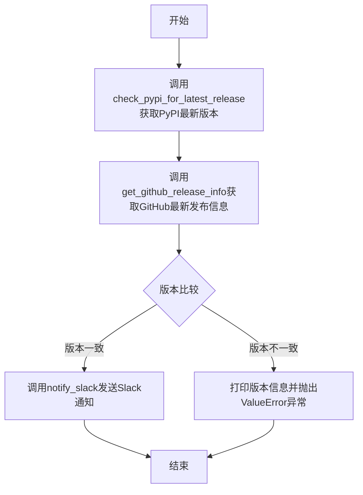
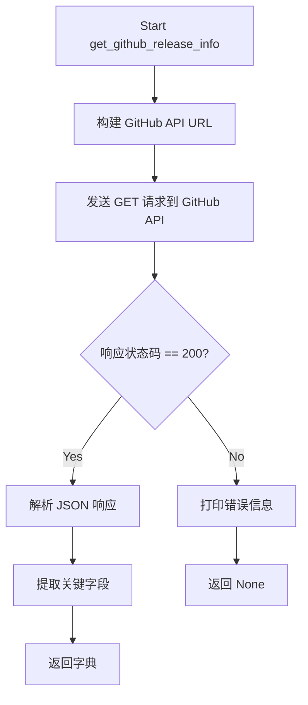
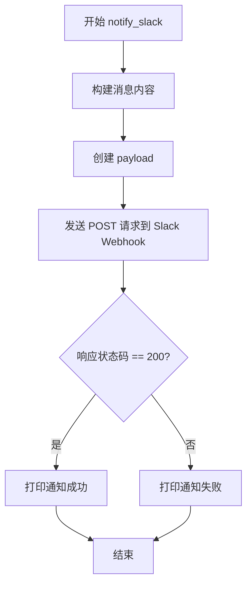

# `diffusers\utils\notify_slack_about_release.py` 详细设计文档

这是一个版本监控通知脚本，用于监控Diffusers库在PyPI和GitHub上的最新发布版本，当检测到新版本发布时通过Slack发送通知。

## 整体流程



## 类结构

```
无类结构 (脚本文件)
```

## 全局变量及字段


### `LIBRARY_NAME`
    
监控的库名称

类型：`str`
    


### `GITHUB_REPO`
    
GitHub仓库路径

类型：`str`
    


### `SLACK_WEBHOOK_URL`
    
Slack webhook URL从环境变量获取

类型：`str`
    


    

## 全局函数及方法


### `check_pypi_for_latest_release`

该函数用于查询PyPI获取指定Python库的最新版本号，通过调用PyPI的JSON API获取库的元数据信息，并在请求成功时返回版本号，请求失败时返回None并打印错误信息。

参数：

-  `library_name`：`str`，要查询版本的Python库名称（例如"diffusers"）

返回值：`Optional[str]`，返回最新的版本号字符串（如"0.21.0"），如果请求失败则返回None

#### 流程图

```mermaid
flowchart TD
    A[开始 check_pypi_for_latest_release] --> B[构建PyPI API URL]
    B --> C[发送GET请求到 https://pypi.org/pypi/{library_name}/json]
    C --> D{响应状态码 == 200?}
    D -->|是| E[解析JSON响应]
    E --> F[提取 version 字段]
    F --> G[返回版本号字符串]
    D -->|否| H[打印错误信息]
    H --> I[返回 None]
    G --> J[结束]
    I --> J
```

#### 带注释源码

```python
def check_pypi_for_latest_release(library_name):
    """Check PyPI for the latest release of the library."""
    # 构建PyPI API端点URL，使用library_name动态构建查询路径
    # 访问PyPI的JSON API获取库的最新版本信息，设置60秒超时防止请求挂起
    response = requests.get(f"https://pypi.org/pypi/{library_name}/json", timeout=60)
    
    # 检查HTTP响应状态码，200表示请求成功
    if response.status_code == 200:
        # 解析JSON响应体，PyPI返回的JSON包含info对象，其中version字段即为最新版本
        data = response.json()
        # 提取版本号并返回，格式如"1.2.3"
        return data["info"]["version"]
    else:
        # 请求失败时打印错误提示，便于调试追踪问题
        print("Failed to fetch library details from PyPI.")
        # 返回None表示未获取到有效版本，调用方需处理此情况
        return None
```


这段代码是一个自动化版本监控脚本，用于检测 `diffusers` 库的发布状态。它通过 PyPI API 获取最新发布版本，并调用 GitHub API 获取最新的 Release 信息进行对比，当检测到新版本发布时，会通过 Slack Webhook 发送通知。

### 文件整体运行流程

1. **启动**：执行 `main()` 函数。
2. **获取 PyPI 版本**：调用 `check_pypi_for_latest_release(LIBRARY_NAME)` 获取 PyPI 上的最新版本号。
3. **获取 GitHub Release 信息**：调用 `get_github_release_info(GITHUB_REPO)` 获取 GitHub 上的最新 Release 详情（版本标签、URL、发布时间）。
4. **版本对比**：解析 GitHub Release 的版本标签（去除 'v' 前缀），并与 PyPI 版本进行对比。
5. **通知或异常**：
    - 如果版本一致，调用 `notify_slack` 发送 Slack 通知。
    - 如果版本不一致或获取失败，抛出 `ValueError` 异常。

### 全局变量

- `LIBRARY_NAME`：`str`，目标库的名称，配置为 `"diffusers"`。
- `GITHUB_REPO`：`str`，目标 GitHub 仓库地址，配置为 `"huggingface/diffusers"`。
- `SLACK_WEBHOOK_URL`：`str`，从环境变量 `SLACK_WEBHOOK_URL` 获取的 Slack Webhook 地址。

### 全局函数

#### `get_github_release_info`

获取指定 GitHub 仓库的最新 Release 信息。

参数：
- `github_repo`：`str`，GitHub 仓库的全称（格式为 "owner/repo"，例如 "huggingface/diffusers"）。

返回值：`Optional[dict]`，如果请求成功，返回包含 `tag_name`（版本标签）、`url`（发布页面链接）、`release_time`（发布时间）的字典；否则返回 `None`。

#### 流程图



#### 带注释源码

```python
def get_github_release_info(github_repo):
    """Fetch the latest release info from GitHub."""
    # 构建完整的 GitHub API 端点 URL，指向指定仓库的最新 Release
    url = f"https://api.github.com/repos/{github_repo}/releases/latest"
    
    # 发送 HTTP GET 请求，设置超时时间为 60 秒以防止请求挂起
    response = requests.get(url, timeout=60)

    # 检查 HTTP 响应状态码是否为 200 (OK)
    if response.status_code == 200:
        # 解析 JSON 响应体
        data = response.json()
        
        # 提取所需的发布信息并构造字典返回
        # tag_name: 版本标签 (例如 "v0.1.0")
        # html_url: 发布页面的永久链接
        # published_at: ISO 8601 格式的发布时间
        return {
            "tag_name": data["tag_name"], 
            "url": data["html_url"], 
            "release_time": data["published_at"]
        }

    else:
        # 请求失败（例如 404 仓库未找到, 403 速率限制等），打印错误
        print("Failed to fetch release info from GitHub.")
        # 返回 None 表示获取失败，调用方需处理此情况
        return None
```

### 关键组件信息

- **requests 库**：用于执行 HTTP 网络请求。
- **GitHub API**：提供仓库 Release 数据的外部接口。
- **Slack Webhook**：用于自动化消息推送的外部服务接口。

### 潜在的技术债务或优化空间

1. **错误处理缺陷**：在 `main()` 函数中，`release_info["tag_name"]` 的访问位于 `if` 语句之外，若 `get_github_release_info` 返回 `None`，将导致 `TypeError` 或 `KeyError`。
2. **缺乏重试机制**：网络请求可能因瞬时故障失败，未实现重试逻辑（如指数退避）。
3. **日志记录不规范**：使用 `print` 进行输出，生产环境应使用 `logging` 模块。
4. **硬编码配置**：`LIBRARY_NAME` 和 `GITHUB_REPO` 应通过命令行参数或配置文件管理，提高灵活性。
5. **依赖管理缺失**：未提供 `requirements.txt` 或 `pyproject.toml` 来声明 `requests` 依赖。

### 其它项目

- **设计目标**：实现库版本的自动化监控与团队通知，减少人工检查成本。
- **约束**：
    - 依赖公开的 GitHub API（存在速率限制，未认证请求每小时限制约 60 次）。
    - 需要有效的 Slack Webhook URL 环境变量。
- **数据流**：
    - `PyPI JSON API` -> `check_pypi_for_latest_release` -> `version string`
    - `GitHub REST API` -> `get_github_release_info` -> `dict`
    - `Comparison Logic` -> `notify_slack` or `Exception`
- **外部依赖**：
    - `requests`：唯一的外部 Python 依赖。


### `notify_slack`

发送版本发布通知到Slack频道的函数。

参数：

- `webhook_url`：`str`，Slack Webhook URL，用于接收通知
- `library_name`：`str`，发布新版本的库名称
- `version`：`str`，新版本的版本号
- `release_info`：`dict`，包含发布信息的字典，需包含 `url`（发布页面链接）和 `release_time`（发布时间）键

返回值：`None`，无返回值，仅通过 `print` 输出操作结果

#### 流程图



#### 带注释源码

```python
def notify_slack(webhook_url, library_name, version, release_info):
    """Send a notification to a Slack channel.
    
    Args:
        webhook_url: Slack Webhook URL to send notification to
        library_name: Name of the library that has a new release
        version: Version number of the new release
        release_info: Dictionary containing release details (url, release_time)
    """
    # 构建包含发布信息的 Slack 消息文本
    # 使用 emoji 增强可读性，**加粗**版本号突出显示
    message = (
        f"🚀 New release for {library_name} available: version **{version}** 🎉\n"
        f"📜 Release Notes: {release_info['url']}\n"
        f"⏱️ Release time: {release_info['release_time']}"
    )
    
    # 构造 Slack Webhook 所需的 JSON payload
    # Slack Webhook API 只需要 "text" 字段
    payload = {"text": message}
    
    # 发送 POST 请求到 Slack Webhook URL
    # 使用 json 参数自动设置 Content-Type 为 application/json
    response = requests.post(webhook_url, json=payload)
    
    # 检查响应状态码判断通知是否发送成功
    if response.status_code == 200:
        # Slack 返回 200 表示请求成功接收
        print("Notification sent to Slack successfully.")
    else:
        # 非 200 状态码表示发送失败
        print("Failed to send notification to Slack.")
```


### `main`

主函数，协调整个版本检查和通知流程。该函数首先从PyPI获取库的 latest_version，从GitHub获取最新发布信息，然后比较两个来源的版本号。如果版本一致，则调用Slack通知函数发送版本更新通知；否则抛出异常表示存在问题。

参数：

- 该函数无参数

返回值：`None`，无返回值，仅执行流程控制

#### 流程图

```mermaid
flowchart TD
    A[开始 main] --> B[调用 check_pypi_for_latest_release<br/>获取 PyPI 最新版本]
    B --> C[调用 get_github_release_info<br/>获取 GitHub 发布信息]
    C --> D[解析版本号<br/>parsed_version = release_info['tag_name'].replace('v', '')]
    D --> E{版本是否一致<br/>latest_version == parsed_version?}
    E -->|是| F[调用 notify_slack<br/>发送 Slack 通知]
    E -->|否| G[打印调试信息并抛出 ValueError]
    F --> H[结束]
    G --> H
    
    style A fill:#f9f,stroke:#333
    style F fill:#9f9,stroke:#333
    style G fill:#f99,stroke:#333
```

#### 带注释源码

```python
def main():
    """
    主函数，协调整个版本检查和通知流程。
    
    执行步骤：
    1. 从 PyPI 获取库的最新版本
    2. 从 GitHub 获取最新发布信息
    3. 比较两个来源的版本号是否一致
    4. 如果一致，发送 Slack 通知；否则抛出异常
    """
    
    # 步骤1：调用 PyPI API 获取 diffusers 库的最新版本号
    # 返回值：latest_version (str) 或 None
    latest_version = check_pypi_for_latest_release(LIBRARY_NAME)
    
    # 步骤2：调用 GitHub API 获取最新发布信息
    # 返回值：release_info (dict) 包含 tag_name, url, release_time 或 None
    release_info = get_github_release_info(GITHUB_REPO)
    
    # 步骤3：解析 GitHub 发布的标签名，去掉 'v' 前缀
    # 例如：'v0.30.0' -> '0.30.0'
    parsed_version = release_info["tag_name"].replace("v", "")
    
    # 步骤4：版本一致性检查
    # 判断条件：PyPI 版本存在 AND GitHub 发布信息存在 AND 版本号完全一致
    if latest_version and release_info and latest_version == parsed_version:
        # 版本一致，发送 Slack 通知
        # 参数：webhook_url, library_name, version, release_info
        notify_slack(SLACK_WEBHOOK_URL, LIBRARY_NAME, latest_version, release_info)
    else:
        # 版本不一致或获取信息失败，打印调试信息用于排查问题
        # 输出当前版本信息便于定位问题
        print(f"{latest_version=}, {release_info=}, {parsed_version=}")
        
        # 抛出异常表示流程执行失败
        # 错误原因：版本不匹配或无法获取版本信息
        raise ValueError("There were some problems.")
```

## 关键组件


### PyPI版本检查模块

负责从PyPI获取指定库的 最新发布版本号，通过调用PyPI API获取JSON格式的元数据。

### GitHub发布信息获取模块

负责从GitHub API获取指定仓库的最新发布信息，包括标签名、发布页面URL和发布时间。

### Slack通知模块

负责构建包含版本信息和发布链接的消息，并发送到配置的Slack Webhook URL。

### 版本比较与主流程控制模块

负责协调各模块的执行：获取PyPI版本和GitHub发布信息，比较版本一致性，在版本匹配时触发通知，不匹配时抛出异常。

### 配置与常量定义

定义了LIBRARY_NAME（diffusers）、GITHUB_REPO（huggingface/diffusers）和SLACK_WEBHOOK_URL（环境变量）三个配置项。


## 问题及建议


### 已知问题

-   **缺少环境变量验证**：代码直接使用 `os.getenv("SLACK_WEBHOOK_URL")` 但未检查其是否为 `None`，会导致后续调用 Slack 通知时失败
-   **版本比较逻辑缺陷**：使用字符串直接比较版本号（如 `"1.0.10" == "1.0.9"`），字符串比较不符合语义版本号比较规则，可能导致版本判断错误
-   **异常处理不足**：`main()` 函数中直接访问 `release_info["tag_name"]` 但未检查 `release_info` 是否为 `None`，会导致 `TypeError`
-   **缺少超时异常捕获**：`requests.get()` 和 `requests.post()` 调用未捕获 `requests.exceptions.RequestException`，网络异常会导致程序崩溃
-   **硬编码配置**：配置项 `LIBRARY_NAME` 和 `GITHUB_REPO` 硬编码在全局，降低了代码的可复用性
-   **错误信息不完整**：失败时仅打印消息，没有记录日志或返回有意义的错误码
-   **HTTP 状态码处理简单**：仅检查 200 状态码，未处理重定向或其他 HTTP 错误情况
-   **缺少类型注解**：所有函数均无类型提示，降低了代码的可维护性和可读性

### 优化建议

-   在程序启动时验证 `SLACK_WEBHOOK_URL` 是否存在，不存在时给出明确提示或使用默认值/退出程序
-   使用 `packaging.version` 模块进行语义化版本比较，或至少使用简单的版本字符串分割比较逻辑
-   在访问字典键前增加 `None` 检查，或使用 `.get()` 方法提供默认值
-   使用 `try-except` 捕获网络请求异常，提供友好的错误处理和重试机制
-   将配置项抽取为配置文件或命令行参数，提高代码灵活性
-   引入 Python 标准日志模块 `logging` 替代 `print`，便于生产环境调试
-   添加类型注解（Type Hints），提高代码可读性和 IDE 支持
-   考虑添加重试机制（使用 `tenacity` 库）处理网络不稳定情况
-   对 GitHub API 请求添加适当的请求头（如 User-Agent），符合 API 调用规范

## 其它


### 设计目标与约束

**设计目标：**
该脚本旨在自动化监控指定库（diffusers）在PyPI和GitHub上的最新版本发布情况，并在检测到新版本时通过Slack渠道向相关人员发送通知，实现版本发布的自动化追踪和实时通知。

**约束条件：**
- 依赖外部API服务（PyPI、GitHub、Slack），需保证网络连通性
- Slack webhook URL必须通过环境变量配置，确保敏感信息不硬编码
- 版本比较逻辑假设PyPI版本与GitHub tag名称一致（需去除"v"前缀）
- 脚本设计为独立运行脚本，非库模块

---

### 错误处理与异常设计

**当前错误处理方式：**
- `check_pypi_for_latest_release`: HTTP请求失败时返回None并打印错误提示
- `get_github_release_info`: HTTP请求失败时返回None并打印错误提示
- `notify_slack`: Slack通知发送失败时打印错误提示
- `main`: 版本不匹配时抛出ValueError异常

**改进建议：**
- 缺乏重试机制，网络瞬时故障会导致任务失败
- 所有错误仅输出到标准输出，缺少结构化日志记录
- 未对library_name和github_repo参数进行有效性校验
- 异常类型过于宽泛，建议区分网络异常、数据解析异常等具体类型
- 建议引入日志框架（logging）替代print语句，便于生产环境监控

---

### 数据流与状态机

**数据流处理：**

```
开始 → 获取PyPI版本 → 获取GitHub发布信息 → 版本比较 → [匹配] → 发送Slack通知 → 结束
                                              ↓ [不匹配]
                                         抛出异常 → 结束
```

**状态说明：**
1. **初始状态**：脚本启动，准备获取版本信息
2. **获取状态**：分别调用PyPI API和GitHub API获取版本数据
3. **处理状态**：解析版本号（去除"v"前缀）并进行字符串比较
4. **决策状态**：根据版本是否一致决定后续流程
5. **通知状态**：版本一致时构造消息并发送Slack通知

---

### 外部依赖与接口契约

**外部依赖：**
- `requests`库：用于HTTP请求
- PyPI JSON API (`https://pypi.org/pypi/{library}/json`)：获取库的最新版本信息
- GitHub Releases API (`https://api.github.com/repos/{repo}/releases/latest`)：获取最新发布信息
- Slack Incoming Webhook：发送通知消息

**接口契约：**

| 函数 | 输入 | 输出 | 异常情况 |
|------|------|------|----------|
| check_pypi_for_latest_release | library_name (str) | str (版本号) 或 None | 网络超时、HTTP错误 |
| get_github_release_info | github_repo (str) | dict 或 None | 网络超时、HTTP错误 |
| notify_slack | webhook_url, library_name, version, release_info | None | HTTP错误 |

---

### 配置管理

**配置项：**
- `LIBRARY_NAME`：监控的库名称，定义为常量 "diffusers"
- `GITHUB_REPO`：GitHub仓库路径，定义为常量 "huggingface/diffusers"
- `SLACK_WEBHOOK_URL`：Slack webhook地址，从环境变量读取

**配置建议：**
- 当前环境变量无默认值判断，若未设置会导致后续流程失败
- 建议增加配置校验，在启动阶段检查必要配置是否存在
- 可考虑引入配置文件或命令行参数增强灵活性

---

### 安全性考虑

**当前安全措施：**
- Slack webhook URL通过环境变量存储，避免硬编码
- 使用HTTPS协议进行网络通信

**潜在安全风险：**
- 缺少输入参数校验，可能受到注入攻击
- 未对API响应数据进行验证和清洗
- 敏感配置信息在错误日志中可能泄露
- 缺少请求速率限制，可能触发API限流

**改进建议：**
- 对library_name和github_repo进行格式校验
- 添加请求重试和指数退避策略
- 考虑增加请求签名或认证机制
- 实施输出编码防止XSS类问题

---

### 可测试性分析

**当前测试能力：**
- 代码结构简单，函数职责明确
- 无单元测试框架集成
- 无mock对象支持

**测试建议：**
- `check_pypi_for_latest_release` 和 `get_github_release_info` 可通过mock requests响应进行单元测试
- 版本比较逻辑可抽取为独立函数便于测试
- notify_slack可mock requests.post进行测试
- 建议引入pytest框架并添加测试用例

---

### 可维护性与扩展性

**当前优势：**
- 函数命名清晰，职责单一
- 代码量小，易于理解
- 使用类型提示（虽然代码中未显式标注，但可通过注释明确）

**扩展建议：**
- 可轻松添加新的通知渠道（如邮件、钉钉、企业微信）
- 可扩展为支持多个库监控
- 可增加版本比较策略（如语义版本比较）
- 可添加缓存机制减少API调用频率
- 建议抽取配置到独立配置文件，支持多环境

---

### 部署与运维建议

**部署方式：**
- 建议通过cron job或定时任务框架（如APScheduler）定期执行
- 可打包为Docker容器运行
- 支持Serverless函数部署（如AWS Lambda）

**运维监控：**
- 建议记录执行日志到文件或日志服务
- 添加执行成功/失败指标监控
- 建立告警机制处理持续失败情况

**运行环境要求：**
- Python 3.7+
- 网络访问PyPI、GitHub、Slack的权限
- 安装requests库


    