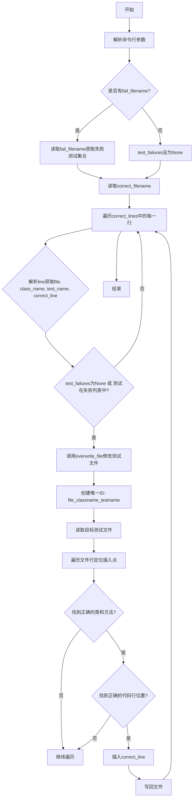
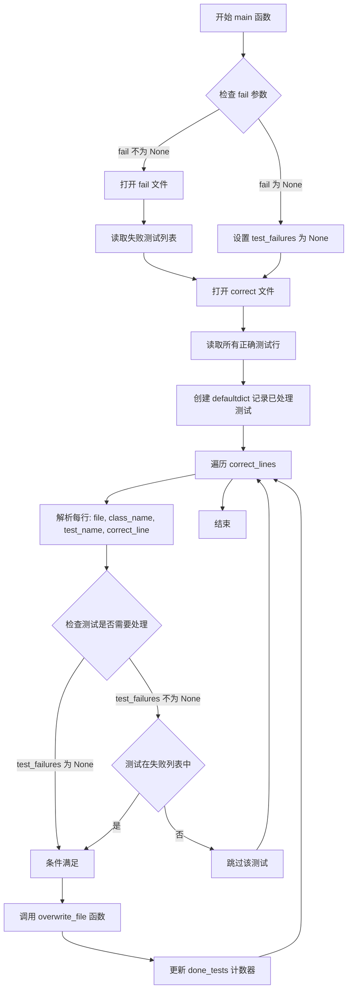
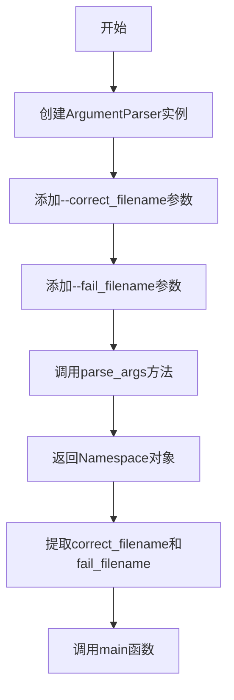

# `diffusers\utils\overwrite_expected_slice.py` 详细设计文档

该脚本是一个自动化测试修复工具，通过读取包含正确测试结果的文件（correct_filename）和可选的失败测试列表（fail_filename），解析测试文件并在指定位置插入正确的代码行，从而批量修正失败的单元测试。

## 整体流程



## 类结构

```
无类定义（脚本类文件）
├── 全局函数
│   ├── overwrite_file (文件修改函数)
│   └── main (主函数)
└── 命令行入口
```

## 全局变量及字段


### `argparse`
    
Python标准库模块，用于命令行参数解析

类型：`module`
    


### `defaultdict`
    
Python标准库模块，用于创建具有默认值的字典类型

类型：`module`
    


### `_id`
    
在overwrite_file函数中生成的唯一标识符，格式为 file_className_testName，用于标识特定的测试

类型：`str`
    


### `done_test`
    
传入的字典类型，用于记录已处理的测试执行次数，配合_id作为key

类型：`dict`
    


### `lines`
    
列表类型，存储从文件中读取的所有行内容，每行为一个字符串元素

类型：`list`
    


### `class_regex`
    
字符串类型，用于匹配测试类的正则表达式模式，格式为 'class className('

类型：`str`
    


### `test_regex`
    
字符串类型，用于匹配测试方法的正则表达式模式，包含4个空格的缩进

类型：`str`
    


### `line_begin_regex`
    
字符串类型，用于匹配目标行开头的正则表达式，包含8个空格的缩进

类型：`str`
    


### `another_line_begin_regex`
    
字符串类型，用于匹配目标行开头的另一种正则表达式，包含16个空格的缩进

类型：`str`
    


### `in_class`
    
布尔类型，标记当前解析行是否处于类定义内部

类型：`bool`
    


### `in_func`
    
布尔类型，标记当前解析行是否处于测试函数内部

类型：`bool`
    


### `in_line`
    
布尔类型，标记是否已找到目标行（即需要修改的行）

类型：`bool`
    


### `insert_line`
    
布尔类型，标记是否需要插入新行到目标位置

类型：`bool`
    


### `count`
    
整数类型，计数器，用于跟踪已匹配的目标行数量

类型：`int`
    


### `spaces`
    
整数类型，记录目标行的缩进空格数量，用于保持插入行的格式正确

类型：`int`
    


### `new_lines`
    
列表类型，用于存储修改后的新文件内容，每行为一个字符串元素

类型：`list`
    


### `test_failures`
    
集合类型或None，存储从失败文件中读取的测试失败记录，用于过滤需要修正的测试

类型：`set or None`
    


### `correct_lines`
    
列表类型，存储从正确测试文件中读取的所有行，每行格式为 file::className::testName::correctCode

类型：`list`
    


### `done_tests`
    
defaultdict类型，用于记录每个测试已处理的次数，避免重复修改

类型：`defaultdict`
    


    

## 全局函数及方法


### `overwrite_file`

该函数用于根据给定的测试类名、测试方法名和正确的代码行，将正确的代码行插入到指定的测试文件中。它通过解析文件的缩进结构，定位到目标测试方法中的特定代码行位置，并进行替换或插入操作。

参数：

- `file`：`str`，要修改的测试文件路径
- `class_name`：`str`，要定位的测试类名
- `test_name`：`str`，要定位的测试方法名
- `correct_line`：`str`，要插入的正确代码行内容
- `done_test`：`dict`，用于跟踪每个测试已处理次数的字典

返回值：`None`，该函数直接修改文件内容，不返回任何值

#### 流程图

```mermaid
flowchart TD
    A[开始] --> B[构建唯一ID并增加计数]
    B --> C[读取文件所有行]
    C --> D[初始化正则表达式和状态标志]
    D --> E{遍历每一行}
    E -->|找到类定义| F[设置 in_class = True]
    E -->|找到测试方法定义| G[设置 in_func = True]
    E -->|找到目标代码行| H[计算缩进空格数并增加计数]
    H --> I{计数等于已处理次数?}
    I -->|是| J[设置 in_line = True]
    I -->|否| E
    J --> K{当前行包含')'?}
    K -->|否| E
    K -->|是| L[设置 insert_line = True]
    L --> M[插入正确代码行]
    M --> N[重置所有状态标志]
    N --> O[将原行添加到新行列表]
    O --> E
    E --> P{文件遍历结束?}
    P -->|否| E
    P -->|是| Q[写入文件]
    Q --> R[结束]
```

#### 带注释源码

```python
def overwrite_file(file, class_name, test_name, correct_line, done_test):
    """
    将正确的代码行插入到指定的测试文件中
    
    参数:
        file: 要修改的测试文件路径
        class_name: 测试类名
        test_name: 测试方法名
        correct_line: 要插入的正确代码行
        done_test: 记录每个测试已处理次数的字典
    """
    # 构建唯一标识符，用于跟踪该测试的调用次数
    _id = f"{file}_{class_name}_{test_name}"
    done_test[_id] += 1  # 增加该测试的计数

    # 读取目标文件的全部内容
    with open(file, "r") as f:
        lines = f.readlines()

    # 构建各种匹配正则表达式
    class_regex = f"class {class_name}("  # 匹配类定义
    test_regex = f"{4 * ' '}def {test_name}("  # 匹配测试方法定义（4个空格缩进）
    # 匹配目标代码行的开始（8个或16个空格缩进）
    line_begin_regex = f"{8 * ' '}{correct_line.split()[0]}"
    another_line_begin_regex = f"{16 * ' '}{correct_line.split()[0]}"
    
    # 状态标志位，用于跟踪解析进度
    in_class = False       # 是否在目标类内部
    in_func = False        # 是否在目标方法内部
    in_line = False        # 是否找到了目标代码行
    insert_line = False    # 是否应该插入新行
    count = 0              # 匹配到的目标行计数
    spaces = 0             # 目标行的缩进空格数

    new_lines = []  # 存储修改后的所有行

    # 逐行遍历文件内容
    for line in lines:
        # 步骤1: 查找目标类
        if line.startswith(class_regex):
            in_class = True
        # 步骤2: 查找目标测试方法
        elif in_class and line.startswith(test_regex):
            in_func = True
        # 步骤3: 查找目标代码行
        elif in_class and in_func and (line.startswith(line_begin_regex) or line.startswith(another_line_begin_regex)):
            # 计算该行的缩进空格数
            spaces = len(line.split(correct_line.split()[0])[0])
            count += 1

            # 如果这是该测试的第N次调用（第N个目标行）
            if count == done_test[_id]:
                in_line = True

        # 步骤4: 确定插入位置（需要找到包含')'的行，表示代码块结束）
        if in_class and in_func and in_line:
            if ")" not in line:
                continue  # 跳过不包含')'的行
            else:
                insert_line = True  # 找到插入点

        # 步骤5: 执行插入操作
        if in_class and in_func and in_line and insert_line:
            # 插入正确代码行，保留原有缩进
            new_lines.append(f"{spaces * ' '}{correct_line}")
            # 重置所有状态标志
            in_class = in_func = in_line = insert_line = False
        else:
            # 如果不需要插入，则保留原行
            new_lines.append(line)

    # 将修改后的内容写回文件
    with open(file, "w") as f:
        for line in new_lines:
            f.write(line)
```


### `main`

该函数是脚本的主入口点，负责读取包含正确测试结果的文件，并根据可选的失败测试文件筛选需要修正的测试用例，然后逐个调用 `overwrite_file` 函数将正确的代码行写入对应的测试文件中。

参数：

- `correct`：`str`，正确测试结果文件的路径，文件格式为 `file::class_name::test_name::correct_line`
- `fail`：`str | None`，可选的失败测试文件名，如果提供则只处理在失败列表中的测试，默认为 `None`

返回值：`None`，该函数不返回任何值，仅执行文件写入操作

#### 流程图



#### 带注释源码

```python
def main(correct, fail=None):
    """
    主函数入口，读取正确测试结果文件并根据失败列表筛选需要修正的测试用例。
    
    参数:
        correct (str): 包含正确测试结果的文件路径，文件格式为每行包含:
                       "file_path::class_name::test_name::correct_code_line"
        fail (str | None): 可选的失败测试文件名，如果提供则只处理在该文件中的测试用例
    
    返回值:
        None: 该函数不返回任何值，直接修改目标测试文件
    """
    
    # 判断是否提供了失败测试文件名
    if fail is not None:
        # 打开失败测试文件并读取所有失败的测试标识
        with open(fail, "r") as f:
            # 使用集合存储失败测试，格式: "file_path::class_name::test_name"
            test_failures = {l.strip() for l in f.readlines()}
    else:
        # 未提供失败文件时，设置为空表示处理所有测试
        test_failures = None

    # 打开正确测试结果文件并读取所有行
    with open(correct, "r") as f:
        correct_lines = f.readlines()

    # 创建默认字典用于记录每个测试已处理的次数（用于去重）
    done_tests = defaultdict(int)
    
    # 遍历正确测试结果文件中的每一行
    for line in correct_lines:
        # 解析行内容，格式: file::class_name::test_name::correct_line
        file, class_name, test_name, correct_line = line.split("::")
        
        # 构建测试标识符
        test_identifier = "::".join([file, class_name, test_name])
        
        # 判断该测试是否需要处理:
        # 1. 如果没有失败列表(test_failures为None)，处理所有测试
        # 2. 或者该测试标识符在失败列表中
        if test_failures is None or test_identifier in test_failures:
            # 调用overwrite_file函数将正确代码行写入测试文件
            overwrite_file(file, class_name, test_name, correct_line, done_tests)
```


### `argparse.ArgumentParser`

在代码中用于创建命令行参数解析器，接收用户输入的 `--correct_filename` 和 `--fail_filename` 参数，并将其解析为可在程序中使用的命名空间对象。

参数：

- 无（代码中使用了所有默认参数）

返回值：`argparse.Namespace`，包含解析后的命令行参数对象

#### 流程图



#### 带注释源码

```python
# 创建ArgumentParser实例，用于解析命令行参数
# 使用默认参数：prog=None, usage=None, description=None等
parser = argparse.ArgumentParser()

# 添加--correct_filename参数
# type=str, default=None 由add_argument自动处理
parser.add_argument(
    "--correct_filename",          # 参数名称
    help="filename of tests with expected result"  # 帮助文本
)

# 添加--fail_filename参数
# type=str 指定参数值为字符串类型
# default=None 指定默认值为None
parser.add_argument(
    "--fail_filename",             # 参数名称
    help="filename of test failures",  # 帮助文本
    type=str,                      # 参数类型为字符串
    default=None                   # 默认值为None（可选参数）
)

# 解析命令行参数
# 从sys.argv中提取参数，返回Namespace对象
# 例如：--correct_filename=foo --fail_filename=bar
# 返回：Namespace(correct_filename='foo', fail_filename='bar')
args = parser.parse_args()

# 通过args.correct_filename和args.fail_filename访问参数值
main(args.correct_filename, args.fail_filename)
```

#### 参数详解

| 方法调用 | 参数名 | 类型 | 描述 |
|---------|--------|------|------|
| `ArgumentParser()` | - | - | 创建参数解析器实例，使用所有默认值 |
| `add_argument("--correct_filename", ...)` | help | str | 帮助文本，描述参数用途 |
| `add_argument("--fail_filename", ...)` | help | str | 帮助文本 |
| `add_argument("--fail_filename", ...)` | type | str | 参数值类型 |
| `add_argument("--fail_filename", ...)` | default | 任意 | 未提供参数时的默认值 |
| `parse_args()` | - | - | 解析sys.argv，返回Namespace对象 |

#### 技术说明

- `ArgumentParser` 是 Python 标准库 `argparse` 模块的核心类
- `parse_args()` 默认解析 `sys.argv[1:]`
- 返回的 `Namespace` 对象通过属性访问方式获取参数值（如 `args.correct_filename`）
- 当用户使用 `--help` 或 `-h` 参数时，会自动显示帮助信息


### `ArgumentParser.parse_args`

该函数是 `argparse.ArgumentParser` 类的核心方法，用于解析命令行参数。它读取 `sys.argv`（或自定义参数列表），根据之前通过 `add_argument()` 注册的参数定义进行解析，并返回一个包含解析结果的命名空间对象。

参数：

- `args`：可选的 `List[str]` 类型，默认为 `None`（即从 `sys.argv` 读取）。当需要解析非命令行传入的参数时使用。
- `namespace`：可选的 `argparse.Namespace` 类型，默认为 `None`。用于指定一个已有的命名空间对象来接收解析结果。

返回值：`argparse.Namespace`，包含所有命令行参数解析后的属性对象，每个属性对应一个通过 `add_argument()` 注册的参数，其名称为参数名（如 `correct_filename`、`fail_filename`），其值为用户传入的值或默认值。

#### 流程图

```mermaid
flowchart TD
    A[开始 parse_args] --> B{是否指定了 args 参数?}
    B -- 否 --> C[使用 sys.argv[1:] 作为输入]
    B -- 是 --> D[使用指定的 args 列表作为输入]
    C --> E[遍历所有注册的 Argument 定义]
    D --> E
    E --> F{逐个处理参数}
    F --> G{参数名是否匹配?}
    G -- 是 --> H{参数值是否有效?}
    G -- 否 --> I{参数是否定义为可选?}
    I -- 是 --> J[使用默认值或 None]
    I -- 否 --> K[抛出 SystemExit 异常]
    H -- 是 --> L[添加到命名空间]
    H -- 否 --> M[抛出 SystemExit 异常]
    F --> N{还有更多参数?}
    N -- 是 --> F
    N -- 否 --> O[返回 Namespace 对象]
```

#### 带注释源码

```python
# argparse.ArgumentParser.parse_args 方法的调用示例
# 在本代码中的实际使用方式如下：

if __name__ == "__main__":
    # 创建参数解析器实例
    parser = argparse.ArgumentParser()
    
    # 注册第一个命令行参数：--correct_filename
    # type 默认为 str，required 默认为 False
    # help 参数用于描述该参数的用途
    parser.add_argument(
        "--correct_filename", 
        help="filename of tests with expected result"
    )
    
    # 注册第二个命令行参数：--fail_filename
    # 指定 type=str，default=None 表示如果未提供该参数则默认为 None
    parser.add_argument(
        "--fail_filename", 
        help="filename of test failures", 
        type=str, 
        default=None
    )
    
    # 核心：调用 parse_args 方法解析命令行参数
    # 该方法内部会：
    # 1. 读取 sys.argv（去除脚本名称后的列表）
    # 2. 逐个匹配用户输入的参数与之前注册的参数
    # 3. 进行类型转换和默认值处理
    # 4. 返回一个 Namespace 对象，其属性名为参数名（去掉前缀符号）
    args = parser.parse_args()
    
    # 解析结果示例：
    # 如果命令行输入: script.py --correct_filename=tests.txt --fail_filename=fail.txt
    # 则 args.correct_filename = "tests.txt"
    #       args.fail_filename = "fail.txt"
    # 如果命令行输入: script.py --correct_filename=tests.txt
    # 则 args.correct_filename = "tests.txt"
    #       args.fail_filename = None (使用默认值)
    
    # 调用主函数，传入解析得到的参数
    main(args.correct_filename, args.fail_filename)
```

#### 补充说明

| 项目 | 说明 |
|------|------|
| **所属类** | `argparse.ArgumentParser` |
| **模块来源** | Python 标准库 `argparse` |
| **错误处理** | 如果遇到未知参数或缺少必需参数，会自动打印用法信息并以状态码 2 退出 |
| **与代码的关联** | 这是脚本的入口点，解析用户提供的 `--correct_filename` 和 `--fail_filename` 参数，传递给 `main()` 函数执行核心业务逻辑 |
| **技术债务** | 无明显技术债务，属于标准化的命令行参数处理方式 |
| **优化空间** | 可考虑添加参数验证、参数组或子解析器以支持更复杂的命令行界面 |

## 关键组件


### 文件覆盖模块 (overwrite_file 函数)

负责在指定的测试文件中定位并覆盖特定行的代码。通过逐行解析文件，使用状态机跟踪当前是否处于目标类和目标方法中，根据空格缩进精确识别需要替换的代码行。

### 主入口模块 (main 函数)

作为脚本的核心协调器，读取正确结果文件和可选的失败测试列表，遍历所有需要处理的测试项并调用文件覆盖逻辑完成批量修改。

### 命令行参数解析

使用 argparse 模块接收两个参数：correct_filename（必需，指定包含正确结果的CSV文件）和 fail_filename（可选，指定失败测试列表文件）。

### 状态机跟踪机制

通过四个布尔变量（in_class、in_func、in_line、insert_line）实现对代码块层级的精确跟踪，确保只在正确的位置插入新代码行。

### 测试匹配与过滤逻辑

根据CSV格式（file::class_name::test_name::correct_line）解析正确结果，结合可选的失败测试集合进行过滤，只处理需要修正的测试用例。

### 缩进计算与行定位

通过计算目标行首部的空格数量来确定正确的插入位置，使用字符串split方法提取行首空白字符的宽度。


## 问题及建议


### 已知问题

- **字符串操作脆弱性**：代码使用`correct_line.split()[0]`获取首词来匹配行首，且硬编码了4个空格（类方法）和8个空格（行内容）的缩进，假设了特定的代码格式，如果目标文件使用不同缩进（如tab或2空格）会导致匹配失败
- **实际使用的是字符串前缀匹配而非正则表达式**：变量名`class_regex`、`test_regex`等暗示使用正则，但实际使用`startswith()`进行简单字符串匹配，容易产生误匹配（如类名`MyTest`会匹配`class Test(`）
- **缺乏错误处理**：没有处理文件不存在、权限不足、输入文件格式错误（如`line.split("::")`不等于4部分）等异常情况
- **内存效率问题**：将整个文件读入内存再写入，对于大文件可能导致内存压力
- **数据丢失风险**：直接覆盖原文件，没有任何备份机制，一旦出错难以恢复
- **变量命名歧义**：`correct_line`参数实际包含完整的测试期望输出而非单行内容，命名具有误导性
- **控制流复杂且易出错**：使用多个布尔标志（`in_class`, `in_func`, `in_line`, `insert_line`）控制状态，逻辑嵌套深，难以维护和调试
- **文件编码未指定**：使用默认编码打开文件，不同操作系统可能导致编码不一致问题

### 优化建议

- 添加类型注解提高代码可读性和可维护性
- 使用`pathlib.Path`替代字符串路径操作，增强文件处理能力
- 添加encoding='utf-8'明确指定文件编码
- 实现异常处理（try-except）捕获文件操作可能的错误
- 在覆盖文件前创建备份（如`.bak`文件）
- 添加输入验证，检查split后的元素数量是否符合预期
- 考虑使用正则表达式替代字符串startswith匹配，提高匹配准确性
- 添加日志输出或verbose选项便于调试和追踪执行流程
- 将重复调用的`correct_line.split()[0]`提取到循环外部，减少重复计算
- 考虑使用`argparse`的`type=pathlib.Path`自动进行文件类型转换和验证

## 其它


### 设计目标与约束

本代码的设计目标是将正确测试结果批量写入测试文件，自动修复失败的测试用例。约束条件包括：输入文件格式必须为`file::class_name::test_name::correct_line`的CSV格式；仅处理指定文件中的指定测试方法；每次运行仅修复一个正确行。

### 错误处理与异常设计

代码缺少充分的错误处理机制。未对文件不存在、文件读取权限、行格式错误等情况进行捕获。若输入文件格式不正确（如split后不是4个元素），程序将直接抛出`ValueError`异常并终止。建议增加异常捕获与日志记录，确保部分失败时能继续处理其他测试。

### 数据流与状态机

程序采用状态机方式遍历测试文件：初始状态`in_class=False, in_func=False, in_line=False, insert_line=False`。当检测到目标类时`in_class`置true，检测到目标测试方法时`in_func`置true，检测到目标行时`in_line`置true，找到插入点时`insert_line`置true并执行插入操作。

### 外部依赖与接口契约

外部依赖包括Python标准库：`argparse`(命令行参数解析)、`collections.defaultdict`(计数器)。接口契约：命令行需提供`--correct_filename`参数（必填），可选提供`--fail_filename`参数。输入文件应为UTF-8编码的文本文件。

### 关键组件信息

- **overwrite_file函数**: 负责在指定测试文件的目标位置插入正确的测试代码行
- **main函数**: 协调读取输入文件和调度overwrite_file函数
- **done_tests字典**: 使用defaultdict记录每个测试已处理的次数，支持增量修复

### 潜在技术债务与优化空间

1. 字符串拼接和正则匹配使用硬编码空格（4个空格、8个空格、16个空格），假定代码使用4空格缩进，缺乏灵活性
2. 行匹配逻辑仅比较行首单词，易产生误匹配
3. 多次打开同一文件进行读写，效率较低
4. 缺乏日志输出，用户无法了解执行进度
5. 未支持回滚机制，若修复错误难以恢复

    