# `diffusers\utils\print_env.py` 详细设计文档

这是一个环境信息收集脚本，用于打印当前系统的Python版本、操作系统平台、内存信息以及已安装的深度学习框架（PyTorch、Transformers）的版本和硬件加速支持情况（CUDA、XPU）。

## 整体流程

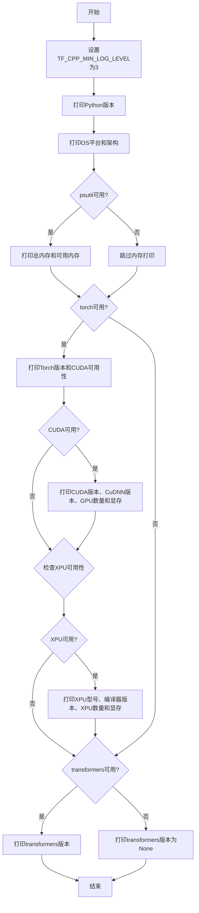

## 类结构

```
该脚本无面向对象结构，仅为顺序执行的脚本文件
```

## 全局变量及字段


### `vm`
    
psutil虚拟内存对象

类型：`psutil.virtual_memory`
    


### `total_gb`
    
系统总内存（GB）

类型：`float`
    


### `available_gb`
    
系统可用内存（GB）

类型：`float`
    


### `device_properties`
    
GPU/XPU设备属性对象

类型：`torch.cuda.device_properties or torch.xpu.device_properties`
    


### `total_memory`
    
设备显存大小（GB）

类型：`float`
    


    

## 全局函数及方法


### `print`

Python 内置函数，用于将对象转换为字符串并输出到标准输出流（stdout），支持多个参数的自定义分隔符、结束符和输出文件。

参数：

-  `*objects`：`任意类型`，要打印的对象，支持多个对象，用逗号分隔
-  `sep`：`str`，可选，分隔多个对象之间的字符，默认为空格 `' '`
-  `end`：`str`，可选，打印结束后的字符，默认为换行符 `'\n'`
-  `file`：`file-like object`，可选，输出目标文件，默认为 `sys.stdout`
-  `flush`：`bool`，可选，是否强制刷新输出流，默认为 `False`

返回值：`None`，该函数无返回值

#### 流程图

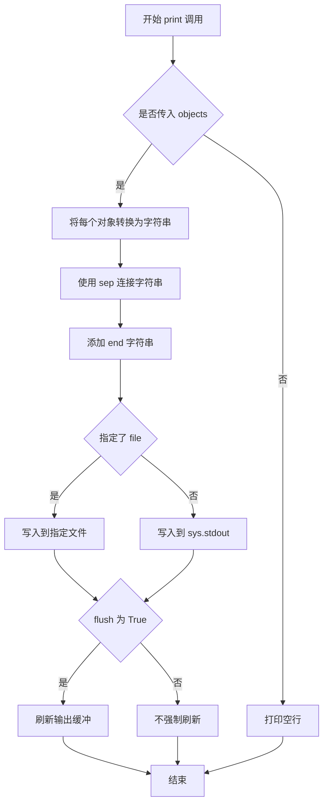

#### 带注释源码

```python
# 代码中使用的 print 调用示例及说明

# 1. 打印 Python 版本信息
# 语法: print(value, ..., sep=' ', end='\n', file=sys.stdout, flush=False)
print("Python version:", sys.version)
# 将 "Python version:" 字符串和 sys.version 对象用默认空格分隔打印到标准输出

# 2. 打印操作系统平台信息
print("OS platform:", platform.platform())
# 打印系统平台名称，如 'Linux-5.4.0-xxx-generic-x86_64'

# 3. 打印系统架构
print("OS architecture:", platform.machine())
# 打印系统架构，如 'x86_64', 'arm64' 等

# 4. 打印总内存（使用 f-string 格式化）
total_gb = vm.total / (1024**3)
print(f"Total RAM:     {total_gb:.2f} GB")
# f-string 在字符串前加 'f'，允许嵌入表达式 {total_gb:.2f} 表示保留两位小数

# 5. 打印可用内存
available_gb = vm.available / (1024**3)
print(f"Available RAM: {available_gb:.2f} GB")

# 6. 打印 PyTorch 版本
print("Torch version:", torch.__version__)
# 打印 PyTorch 库的版本号字符串

# 7. 打印 CUDA 是否可用
print("Cuda available:", torch.cuda.is_available())
# 返回布尔值，表示是否有 CUDA 设备可用

# 8. 打印 CUDA 版本
print("Cuda version:", torch.version.cuda)

# 9. 打印 cuDNN 版本
print("CuDNN version:", torch.backends.cudnn.version())

# 10. 打印可用 GPU 数量
print("Number of GPUs available:", torch.cuda.device_count())

# 11. 打印 GPU 显存大小
device_properties = torch.cuda.get_device_properties(0)
total_memory = device_properties.total_memory / (1024**3)
print(f"CUDA memory: {total_memory} GB")

# 12. 打印 XPU 是否可用
print("XPU available:", hasattr(torch, "xpu") and torch.xpu.is_available())
# 使用 hasattr 检查 torch 是否有 xpu 属性，然后检查是否可用

# 13. 打印 XPU 型号
print("XPU model:", torch.xpu.get_device_properties(0).name)

# 14. 打印 XPU 编译器版本
print("XPU compiler version:", torch.version.xpu)

# 15. 打印 XPU 数量
print("Number of XPUs available:", torch.xpu.device_count())

# 16. 打印 XPU 显存
device_properties = torch.xpu.get_device_properties(0)
total_memory = device_properties.total_memory / (1024**3)
print(f"XPU memory: {total_memory} GB")

# 17. 打印 transformers 版本（带异常处理）
try:
    import transformers
    print("transformers version:", transformers.__version__)
except ImportError:
    print("transformers version:", None)
# 当导入失败时打印 None
```


### `sys.version`

`sys.version` 是 Python 标准库 `sys` 模块中的一个只读属性，返回一个字符串，表示 Python 解释器的完整版本信息。该字符串包含版本号、构建日期、编译器类型以及 GC 模式等详细信息，通常用于环境诊断和版本兼容性检查。

参数： 无（这是一个属性访问，无需参数）

返回值： `str`，返回 Python 解释器的完整版本信息字符串，格式类似 `"3.11.4 (main, Jun 20 2023, 14:24:55) [GCC 11.4.0]"`

#### 流程图

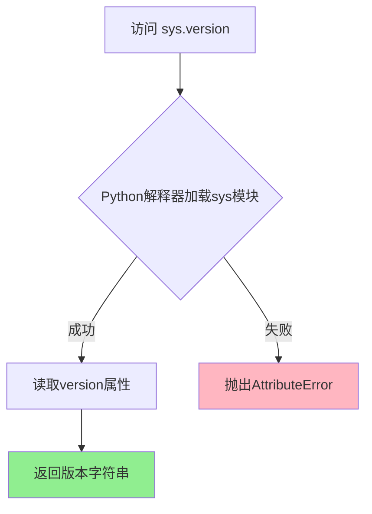

#### 带注释源码

```python
#!/usr/bin/env python3
"""
环境信息打印脚本 - 演示 sys.version 属性的使用
"""

import os
import platform
import sys

# 设置 TensorFlow 日志级别，减少输出干扰
os.environ["TF_CPP_MIN_LOG_LEVEL"] = "3"

# 访问 sys.version 属性 - 这是 Python 标准库 sys 模块的只读属性
# 返回格式: "主版本.次版本.补丁版本 (构建日期, 构建时间) [编译器信息]"
# 例如: "3.11.4 (main, Jun 20 2023, 14:24:55) [GCC 11.4.0]"
print("Python version:", sys.version)

# 其他环境信息获取
print("OS platform:", platform.platform())
print("OS architecture:", platform.machine())

# 后续代码继续检测其他依赖库的版本...
```

#### 补充说明

`sys.version` 属性详解：
- **属性类型**：只读字符串属性
- **所属模块**：`sys`（Python 标准库内置模块）
- **版本格式**：`major.minor.patchlevel (buildinfo) [compiler]`
  - `major`：主版本号（如 3）
  - `minor`：次版本号（如 11）
  - `patchlevel`：补丁版本（如 4）
  - `buildinfo`：构建日期和时间
  - `compiler`：编译器信息
- **常见用途**：版本兼容性检查、错误报告、环境诊断、特性检测


### `platform.platform()`

获取当前运行平台的详细标识字符串（如操作系统名称、内核版本、硬件架构等）。

参数：

- （无）

返回值：`str`，包含平台详细信息的字符串（例如 "Linux-5.10.0-1019-aws-x86_64-with-glibc2.31" 或 "Windows-10-10.0.19041-SP0"）。

#### 流程图

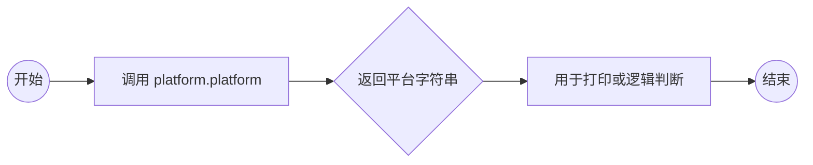

#### 带注释源码

```python
# 导入 Python 标准库 platform
import platform

# ... 省略环境脚本中的其他代码 ...

# 调用 platform.platform() 函数
# 功能：获取底层的平台标识符字符串
# 返回值示例：'Linux-5.10.0-1019-aws-x86_64-with-glibc2.31'
print("OS platform:", platform.platform())
```


### `platform.machine()`

该函数是Python标准库 `platform` 模块中的一个方法，用于获取运行Python解释器的硬件平台的机器架构类型（如 x86_64、aarch64、arm64 等），常用于系统环境信息收集和跨平台兼容性判断。

参数：无

返回值：`str`，返回表示机器硬件架构的字符串，例如 `'x86_64'`、`'aarch64'` 或 `'arm64'` 等。

#### 流程图

```mermaid
flowchart TD
    A[调用 platform.machine()] --> B{Python解释器}
    B --> C[调用底层操作系统API]
    C --> D{操作系统类型}
    D --> E[Linux: 调用 uname -m 或 /proc/cpuinfo]
    D --> F[Windows: 调用 GetNativeSystemInfo]
    D --> G[macOS: 调用 sysctl hw.machine]
    E --> H[返回架构字符串]
    F --> H
    G --> H
    H --> I[返回结果给调用者]
```

#### 带注释源码

```python
# platform.machine() 函数的实现原理（简化说明）

import platform

# 1. 调用 platform.machine() 函数
# 该函数位于 Python 标准库的 platform 模块中
machine_arch = platform.machine()

# 2. 函数的内部实现逻辑（概念性）
def machine():
    """
    返回运行 Python 解释器的机器类型。
    
    对于 POSIX 系统，通常通过 os.uname() 获取，
    对于 Windows 系统，调用底层 Win32 API。
    """
    # 底层实现通常调用 os.uname().machine
    # 在 Unix/Linux 系统上等价于 shell 命令: uname -m
    
    # 返回值示例：
    # - 'x86_64'    : 64位 x86 架构（常见于 Intel/AMD 处理器）
    # - 'aarch64'   : 64位 ARM 架构（常见于 ARM 服务器和现代 Mac）
    # - 'arm64'     : 与 aarch64 等价（Apple 命名）
    # - 'i686'      : 32位 x86 架构
    # - 'ppc64le'   : 64位 PowerPC 小端序
    
    return os.uname().machine  # 底层机制

# 3. 在给定的代码中的实际使用
# 第27行: 打印操作系统架构信息
print("OS architecture:", platform.machine())

# 4. 实际执行结果示例
# 在 x86_64 Linux 系统上: "OS architecture: x86_64"
# 在 Apple Silicon Mac 上:   "OS architecture: arm64"
# 在 Windows 64位系统上:    "OS architecture: AMD64"
```

---

**相关上下文信息**

在提供的脚本中，`platform.machine()` 的主要用途是：

- **环境诊断**：帮助开发者了解运行脚本的硬件平台
- **兼容性检查**：根据不同架构加载对应的库或执行特定逻辑
- **调试支持**：在报告问题时提供系统架构信息

**注意事项**

1. 该函数返回的是**Python解释器运行所在的机器架构**，而非 necessarily 硬件的原生架构（例如在虚拟化或容器环境中）
2. 在某些嵌入式系统上，可能返回 "unknown" 或其他非标准值
3. 对于跨平台应用，建议结合 `platform.system()` 和 `platform.processor()` 获取更完整的系统信息


### `psutil.virtual_memory()`

获取系统虚拟内存（RAM）信息，返回包含内存总量、可用内存、使用率等详细数据的内存信息对象。

参数：

- 该函数无参数

返回值：`psutil._common.virtualMemory`，包含以下属性的命名元组：

- `total`：`int`，物理内存总量（字节）
- `available`：`int`，可用内存（字节）
- `percent`：`float`，内存使用百分比
- `used`：`int`，已使用内存（字节）
- `free`：`int`，空闲内存（字节）
- `active`：`int`，活跃内存（字节）
- `inactive`：`int`，非活跃内存（字节）
- `buffers`：`int`，缓冲内存（字节）
- `cached`：`int`，缓存内存（字节）
- `shared`：`int`，共享内存（字节）
- `slab`：`int`，内核 slab 内存（字节）

#### 流程图

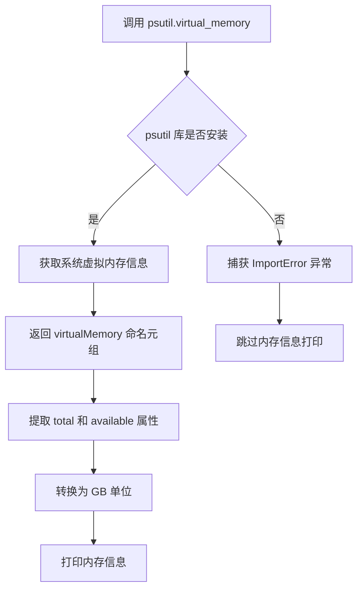

#### 带注释源码

```python
#!/usr/bin/env python3
# 环境信息打印脚本 - 用于诊断系统环境配置

import os
import platform
import sys

# 设置 TensorFlow 日志级别为 ERROR（不显示任何日志）
os.environ["TF_CPP_MIN_LOG_LEVEL"] = "3"

print("Python version:", sys.version)
print("OS platform:", platform.platform())
print("OS architecture:", platform.machine())

# 尝试导入 psutil 库并获取虚拟内存信息
try:
    import psutil  # 跨平台系统信息获取库

    # 调用 psutil.virtual_memory() 获取虚拟内存信息
    # 返回值是一个命名元组，包含内存的多种属性
    vm = psutil.virtual_memory()
    
    # 将字节转换为 GB（除以 1024 的三次方）
    total_gb = vm.total / (1024**3)
    available_gb = vm.available / (1024**3)
    
    # 打印总内存和可用内存
    print(f"Total RAM:     {total_gb:.2f} GB")
    print(f"Available RAM: {available_gb:.2f} GB")

# 如果 psutil 未安装，捕获 ImportError 并继续执行
except ImportError:
    pass  # 静默跳过内存信息打印
```


### `torch.__version__`（模块属性）

该代码片段中的 `torch.__version__` 是 PyTorch 模块的一个字符串属性，用于获取当前安装的 PyTorch 版本号。在此环境信息打印脚本中，该属性被用于输出 PyTorch 版本信息，帮助用户了解当前环境中的深度学习框架版本。

参数：

- （无参数，此为模块属性而非函数）

返回值：`str`，返回当前安装的 PyTorch 版本号字符串（如 "2.0.0"）

#### 流程图

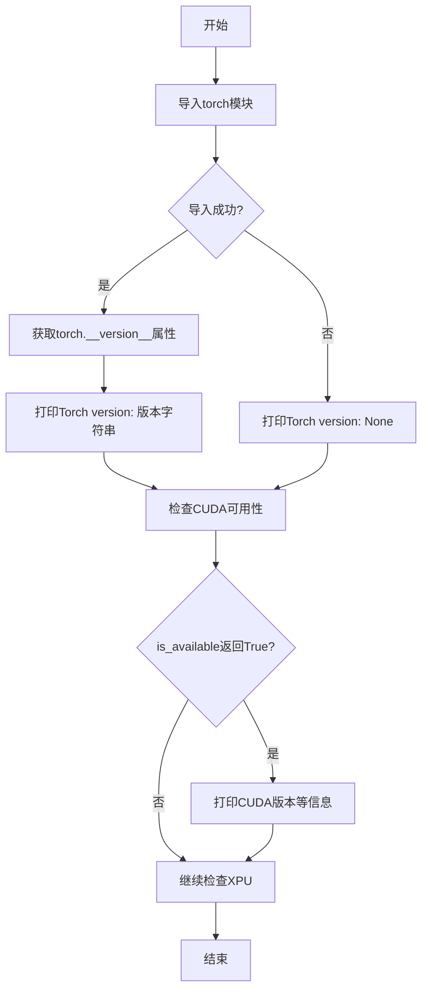

#### 带注释源码

```python
# 尝试导入torch模块
try:
    import torch

    # 访问PyTorch模块的__version__属性，获取版本字符串
    # 这是一个模块级属性，返回形如 "2.0.0" 或 "2.1.0+cu118" 的版本字符串
    print("Torch version:", torch.__version__)
    
    # 检查CUDA是否可用（GPU支持）
    print("Cuda available:", torch.cuda.is_available())
    
    # 如果CUDA可用，获取更多CUDA相关信息
    if torch.cuda.is_available():
        print("Cuda version:", torch.version.cuda)
        print("CuDNN version:", torch.backends.cudnn.version())
        print("Number of GPUs available:", torch.cuda.device_count())
        device_properties = torch.cuda.get_device_properties(0)
        total_memory = device_properties.total_memory / (1024**3)
        print(f"CUDA memory: {total_memory} GB")

    # 检查XPU（Intel GPU）是否可用
    print("XPU available:", hasattr(torch, "xpu") and torch.xpu.is_available())
    if hasattr(torch, "xpu") and torch.xpu.is_available():
        print("XPU model:", torch.xpu.get_device_properties(0).name)
        print("XPU compiler version:", torch.version.xpu)
        print("Number of XPUs available:", torch.xpu.device_count())
        device_properties = torch.xpu.get_device_properties(0)
        total_memory = device_properties.total_memory / (1024**3)
        print(f"XPU memory: {total_memory} GB")

# 如果torch模块未安装，捕获ImportError并打印None
except ImportError:
    print("Torch version:", None)
```


### `torch.cuda.is_available`

检查当前PyTorch环境是否支持CUDA（NVIDIA GPU计算）。

参数：

- （无参数）

返回值：`bool`，返回`True`表示CUDA可用（可以使用GPU加速），返回`False`表示CUDA不可用（仅使用CPU）。

#### 流程图

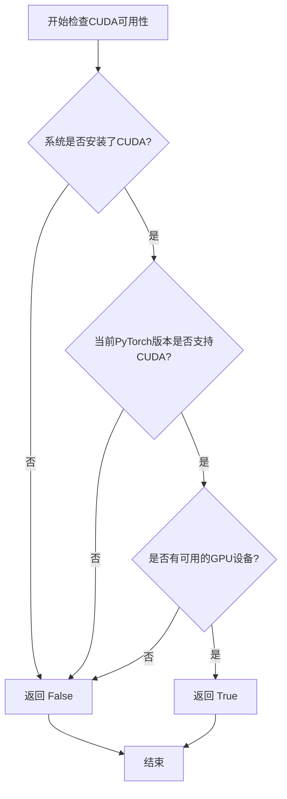

#### 带注释源码

```python
# 在代码中的实际使用示例
try:
    import torch
    
    # 检查CUDA是否可用
    # 返回值: True - CUDA可用, False - CUDA不可用
    cuda_available = torch.cuda.is_available()
    
    print("Cuda available:", cuda_available)
    
    # 根据CUDA可用性执行不同逻辑
    if cuda_available:
        # 获取CUDA版本
        print("Cuda version:", torch.version.cuda)
        
        # 获取GPU数量
        print("Number of GPUs available:", torch.cuda.device_count())
        
        # 获取第一个GPU的详细信息
        device_properties = torch.cuda.get_device_properties(0)
        total_memory = device_properties.total_memory / (1024**3)
        print(f"CUDA memory: {total_memory} GB")
        
        # 可以在GPU上创建张量
        device = torch.device("cuda")
    else:
        # 使用CPU
        device = torch.device("cpu")
        print("CUDA不可用，将使用CPU进行计算")

except ImportError:
    # PyTorch未安装
    print("PyTorch未安装")
```


### `torch.version.cuda`

该属性返回 PyTorch 编译时使用的 CUDA 版本字符串，用于获取当前环境中所安装的 CUDA 运行时版本信息。

参数：无（该属性不接受任何参数）

返回值：`str` 或 `None`，返回 CUDA 版本号字符串（如 "12.1"），如果 CUDA 不可用则返回 `None`

#### 流程图

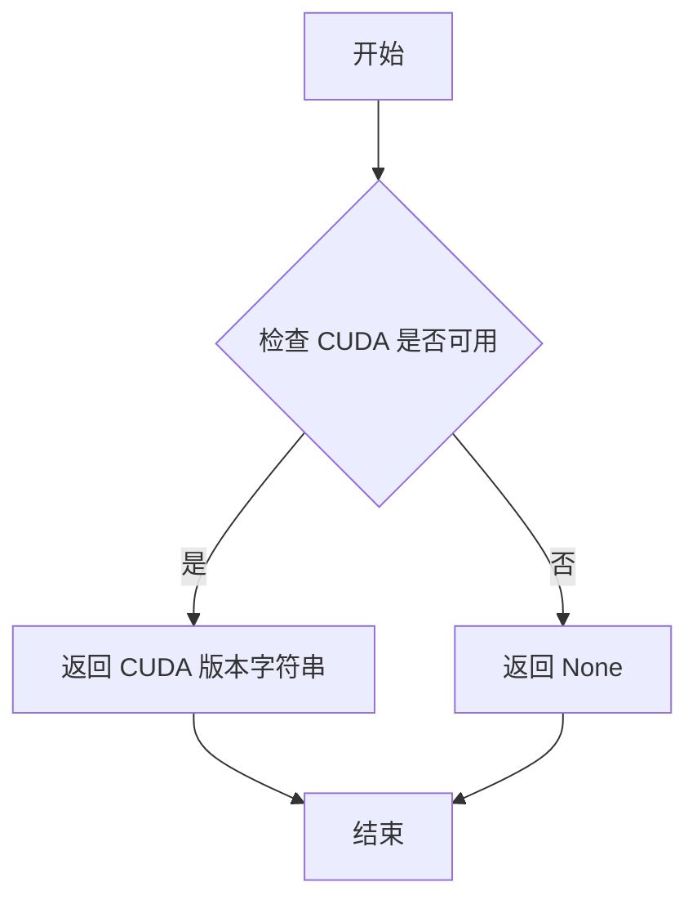

#### 带注释源码

```python
# 在代码中的使用方式
try:
    import torch

    print("Cuda available:", torch.cuda.is_available())
    if torch.cuda.is_available():
        # 访问 torch.version.cuda 获取 CUDA 版本
        # 这是一个模块属性，返回编译时使用的 CUDA 版本
        print("Cuda version:", torch.version.cuda)
        print("CuDNN version:", torch.backends.cudnn.version())
        print("Number of GPUs available:", torch.cuda.device_count())
        device_properties = torch.cuda.get_device_properties(0)
        total_memory = device_properties.total_memory / (1024**3)
        print(f"CUDA memory: {total_memory} GB")

except ImportError:
    print("Torch version:", None)
```


### `torch.backends.cudnn.version`

该函数是 PyTorch 框架中用于获取 CUDA Deep Neural Network (CuDNN) 库版本的接口函数。它通过调用 PyTorch 后端接口返回当前环境中安装的 CuDNN 库版本号，使开发者能够确认深度学习加速库的版本信息，以便进行兼容性检查和调试。

参数：

- （无参数）

返回值：`int` 或 `None`，返回当前安装的 CuDNN 库的版本号。如果 CuDNN 不可用或未正确安装，则返回 None。版本号通常以整数形式表示（例如 8700 表示 CuDNN 8.7.0）。

#### 流程图

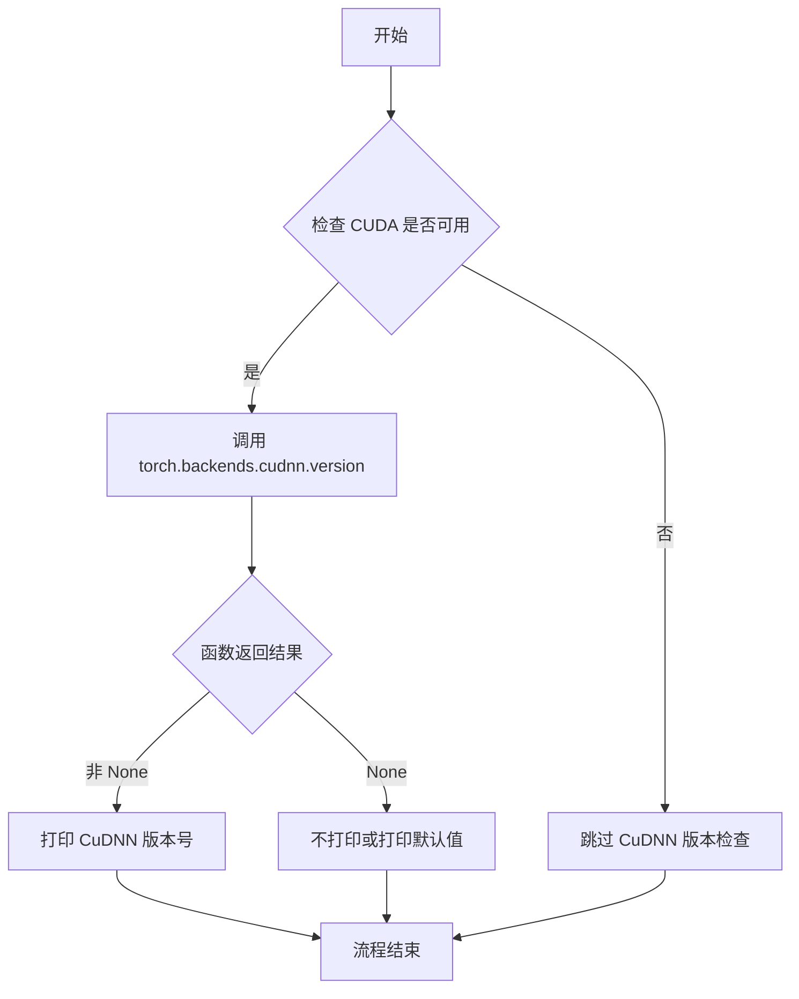

#### 带注释源码

```python
#!/usr/bin/env python3

# coding=utf-8
# Copyright 2025 The HuggingFace Inc. team.
#
# Licensed under the Apache License, Version 2.0 (the "License");
# you may not use this file except in compliance with the License.
# You may obtain a copy of the License at
#
#     http://www.apache.org/licenses/LICENSE-2.0
#
# Unless required by applicable law or agreed to in writing, software
# distributed under the License is distributed on an "AS IS" BASIS,
# WITHOUT WARRANTIES OR CONDITIONS OF ANY KIND, either express or implied.
# See the License for the specific language governing permissions and
# limitations under the License.

# this script dumps information about the environment

import os
import platform
import sys


os.environ["TF_CPP_MIN_LOG_LEVEL"] = "3"

print("Python version:", sys.version)

print("OS platform:", platform.platform())
print("OS architecture:", platform.machine())
try:
    import psutil

    vm = psutil.virtual_memory()
    total_gb = vm.total / (1024**3)
    available_gb = vm.available / (1024**3)
    print(f"Total RAM:     {total_gb:.2f} GB")
    print(f"Available RAM: {available_gb:.2f} GB")
except ImportError:
    pass

try:
    import torch

    print("Torch version:", torch.__version__)
    print("Cuda available:", torch.cuda.is_available())
    if torch.cuda.is_available():
        print("Cuda version:", torch.version.cuda)
        # 调用 torch.backends.cudnn.version() 获取 CuDNN 版本
        # 参数：无
        # 返回值：int 类型，表示 CuDNN 版本号（例如 8700 表示 8.7.0）
        # 如果 CuDNN 不可用则返回 None
        print("CuDNN version:", torch.backends.cudnn.version())
        print("Number of GPUs available:", torch.cuda.device_count())
        device_properties = torch.cuda.get_device_properties(0)
        total_memory = device_properties.total_memory / (1024**3)
        print(f"CUDA memory: {total_memory} GB")

    print("XPU available:", hasattr(torch, "xpu") and torch.xpu.is_available())
    if hasattr(torch, "xpu") and torch.xpu.is_available():
        print("XPU model:", torch.xpu.get_device_properties(0).name)
        print("XPU compiler version:", torch.version.xpu)
        print("Number of XPUs available:", torch.xpu.device_count())
        device_properties = torch.xpu.get_device_properties(0)
        total_memory = device_properties.total_memory / (1024**3)
        print(f"XPU memory: {total_memory} GB")


except ImportError:
    print("Torch version:", None)

try:
    import transformers

    print("transformers version:", transformers.__version__)
except ImportError:
    print("transformers version:", None)
```


### `torch.cuda.device_count`

获取当前系统中可用的GPU设备数量

参数：

- （无参数）

返回值：`int`，返回系统中可用的GPU数量

#### 流程图

```mermaid
flowchart TD
    A[调用 torch.cuda.device_count] --> B{CUDA是否可用?}
    B -->|是| C[返回GPU设备数量]
    B -->|否| D[返回0]
    C --> E[打印: Number of GPUs available: {数量}]
    D --> E
```

#### 带注释源码

```python
# 调用 torch.cuda.device_count() 获取系统中可用的 GPU 数量
# 参数: 无
# 返回值: int 类型，表示可用的 GPU 设备数量
print("Number of GPUs available:", torch.cuda.device_count())
```


### `torch.cuda.get_device_properties`

该函数用于获取指定CUDA设备的详细属性信息，包括设备名称、计算能力、显存大小等硬件规格。在代码中通过调用 `torch.cuda.get_device_properties(0)` 并访问其 `total_memory` 属性来获取第一个GPU的总显存容量。

参数：

-  `device`：`int`，CUDA设备的索引编号，用于指定要查询的GPU设备。代码中传入 `0` 表示第一个GPU设备。

返回值：`torch.cuda.DeviceProperties`，返回一个包含设备属性的对象，典型属性包括：
- `total_memory`：设备总显存大小（字节）
- `name`：设备名称
- `major`、`minor`：计算能力主版本号和次版本号
- `multi_processor_count`：多处理器数量

代码中通过 `device_properties.total_memory` 访问总显存，并以GB为单位进行打印输出。

#### 流程图

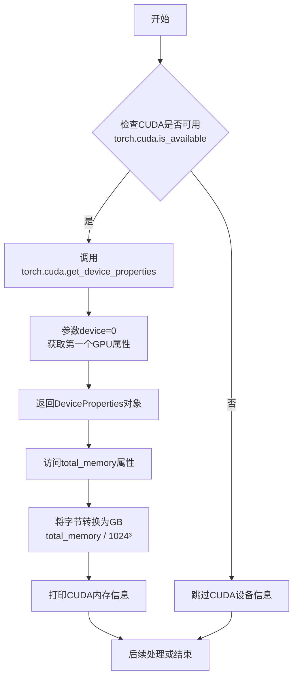

#### 带注释源码

```python
# 检查CUDA是否可用（确保系统上有支持CUDA的GPU和驱动）
if torch.cuda.is_available():
    # 打印CUDA版本信息
    print("Cuda version:", torch.version.cuda)
    # 打印CuDNN版本信息
    print("CuDNN version:", torch.backends.cudnn.version())
    # 打印系统中可用的GPU数量
    print("Number of GPUs available:", torch.cuda.device_count())
    
    # ============== 核心函数调用 ==============
    # 获取索引为0的GPU设备的所有属性信息
    # 参数: device=0 表示第一个GPU设备
    # 返回: DeviceProperties对象，包含该GPU的完整硬件规格
    device_properties = torch.cuda.get_device_properties(0)
    
    # 从返回的设备属性对象中提取total_memory字段（单位：字节）
    # 并将其转换为GB（1024³ = 1073741824）
    total_memory = device_properties.total_memory / (1024**3)
    
    # 打印格式化后的GPU显存信息
    print(f"CUDA memory: {total_memory} GB")
```


### `torch.xpu.is_available()`

该函数用于检查当前系统环境是否支持并启用了 Intel XPU（加速处理单元），返回布尔值表示 XPU 是否可用。

参数：

- （无参数）

返回值：`bool`，返回 True 表示 XPU 可用并已启用，返回 False 表示 XPU 不可用或未启用。

#### 流程图

```mermaid
flowchart TD
    A[开始检查 XPU 可用性] --> B{torch.xpu 模块是否存在?}
    B -->|否| C[返回 False]
    B -->|是| D{torch.xpu.is_available() 返回值?}
    D -->|True| E[返回 True - XPU 可用]
    D -->|False| F[返回 False - XPU 不可用]
    
    style A fill:#f9f,stroke:#333
    style E fill:#9f9,stroke:#333
    style C fill:#f99,stroke:#333
    style F fill:#f99,stroke:#333
```

#### 带注释源码

```python
# 检查 XPU 是否可用的典型用法
# 方式1：直接调用
is_xpu_available = torch.xpu.is_available()
# 返回值类型: bool
# True 表示 XPU 可用, False 表示不可用

# 方式2：结合 hasattr 安全检查（代码中实际使用的方式）
xpu_available = hasattr(torch, "xpu") and torch.xpu.is_available()
# 先检查 torch 是否有 xpu 属性，避免 AttributeError
# 然后再调用 is_available() 检查实际可用性

# 实际应用示例
if hasattr(torch, "xpu") and torch.xpu.is_available():
    # 获取 XPU 设备信息
    device = torch.device("xpu")
    print("XPU model:", torch.xpu.get_device_properties(0).name)
    print("Number of XPUs:", torch.xpu.device_count())
else:
    print("XPU is not available, falling back to CPU")
```


### `torch.xpu.get_device_properties`

获取指定XPU设备的详细属性信息，包括设备名称、内存大小、计算能力等硬件规格。

参数：

- `device`：`int`，要查询的XPU设备索引，0表示第一个XPU设备

返回值：`torch.xpu.device_properties`，返回包含XPU设备属性的命名元组对象，属性包括：
- `name`：设备名称（字符串）
- `total_memory`：设备总内存（字节数）
- `max_compute_units`：最大计算单元数
- `max_workgroup_size`：最大工作组大小
- `version`：XPU版本信息

#### 流程图

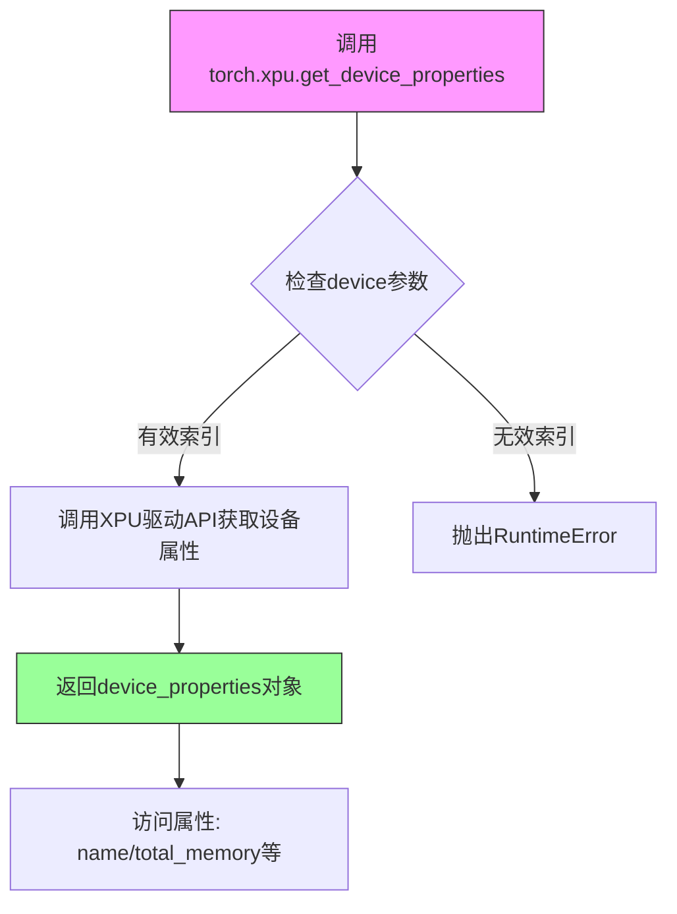

#### 带注释源码

```python
# 检查XPU是否可用
if hasattr(torch, "xpu") and torch.xpu.is_available():
    # 打印XPU设备型号
    print("XPU model:", torch.xpu.get_device_properties(0).name)
    # 打印XPU编译器版本
    print("XPU compiler version:", torch.version.xpu)
    # 打印可用XPU设备数量
    print("Number of XPUs available:", torch.xpu.device_count())
    
    # 获取第一个XPU设备的完整属性对象
    device_properties = torch.xpu.get_device_properties(0)
    
    # 计算总内存（从字节转换为GB）
    total_memory = device_properties.total_memory / (1024**3)
    print(f"XPU memory: {total_memory} GB")

# device_properties对象的属性说明：
# - name: 设备名称字符串，如 'Intel(R) Xeon(R) Platinum...'
# - total_memory: 设备总内存字节数
# - max_compute_units: 最大计算单元数
# - max_workgroup_size: 最大工作组大小
# - version: (major, minor) 版本号元组
```


### `torch.xpu.device_count`

该函数是PyTorch XPU模块的核心方法之一，用于查询系统中可用的Intel XPU设备（GPU）数量，并返回整数形式的设备计数，为后续XPU计算设备的选择提供依据。

参数：此函数不接受任何参数。

返回值：`int`，返回系统中可用的Intel XPU设备数量，如果无可用设备则返回0。

#### 流程图

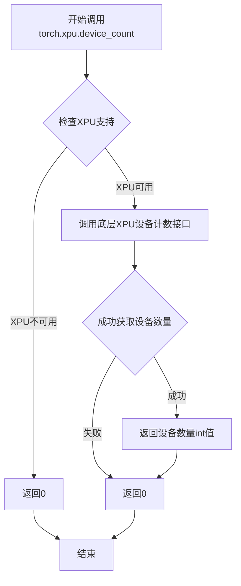

#### 带注释源码

```python
# 调用示例（在提供的代码中）
# 检查XPU是否可用并获取设备数量
if hasattr(torch, "xpu") and torch.xpu.is_available():
    # 打印系统中可用的XPU设备数量
    print("Number of XPUs available:", torch.xpu.device_count())
    
    # 获取第一个XPU设备的属性信息
    device_properties = torch.xpu.get_device_properties(0)
    
    # 计算并打印设备总内存（字节转换为GB）
    total_memory = device_properties.total_memory / (1024**3)
    print(f"XPU memory: {total_memory} GB")

# 函数原型（基于PyTorch文档）
# def device_count() -> int:
#     """
#     返回系统中可用的Intel XPU设备数量。
#     
#     Returns:
#         int: 可用的XPU设备数量。如果没有可用的XPU设备，返回0。
#     """
```

---

### 补充说明

#### 关键组件信息
- **torch.xpu**: PyTorch的XPU后端模块，提供XPU设备管理功能
- **torch.xpu.is_available()**: 前置检查函数，用于确认XPU支持是否可用

#### 潜在的技术债务或优化空间
- 错误处理：当前函数未公开抛出异常的明确文档，错误处理依赖于调用方的适当错误捕获
- 设备枚举：函数仅返回数量，如需设备详细信息需配合`get_device_properties()`使用

#### 其它项目

**设计目标与约束**:
- 提供统一的设备计数接口，与CUDA的`torch.cuda.device_count()`接口设计保持一致
- 无参数设计，简化调用复杂度

**错误处理与异常设计**:
- 函数本身设计为无异常抛出，返回0表示无设备
- 调用方需先通过`torch.xpu.is_available()`确认XPU可用性

**外部依赖与接口契约**:
- 依赖Intel XPU驱动和runtime环境
- 依赖PyTorch编译时包含XPU支持（`torch.xpu`模块存在性）


### `transformers.__version__`

描述：`transformers.__version__` 是 Transformers 库的一个模块属性，用于获取当前安装的 Transformers 库的版本号。

参数：

- 无参数（这是一个模块属性，而非函数或方法）

返回值：`str`，返回 Transformers 库的版本号字符串（例如 "4.30.0"），如果导入失败则返回 `None`。

#### 流程图

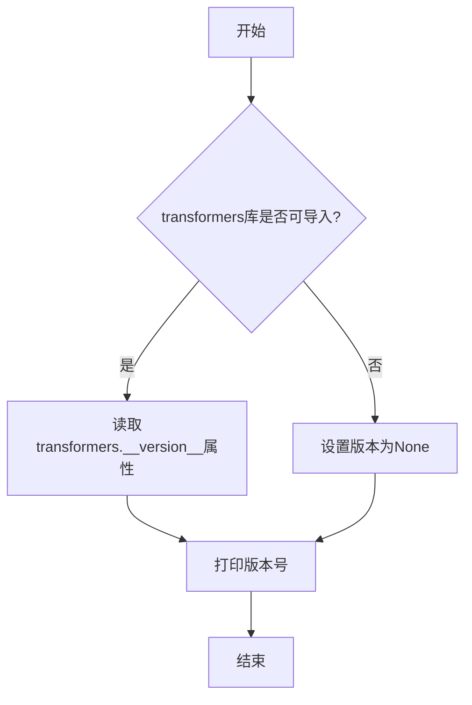

#### 带注释源码

```python
try:
    # 尝试导入transformers模块
    import transformers

    # 访问transformers模块的__version__属性，获取版本号
    # __version__是模块级别的字符串属性，存储了当前库的版本信息
    print("transformers version:", transformers.__version__)
except ImportError:
    # 如果transformers库未安装或导入失败，打印None
    print("transformers version:", None)
```

---

### 备注

`transformers.__version__` 不是函数或方法，而是 `transformers` 模块的一个内置属性。在 Python 中，大多数第三方库都会在模块级别定义 `__version__` 变量，用于存储库的版本信息。这是一个常见的 PEP 396 规范实践。该属性：- **类型**：字符串 (`str`)
- **访问方式**：通过模块名直接访问（如 `transformers.__version__`）- **用途**：用于检查已安装的 Transformers 库版本，以便进行版本兼容性检查或日志记录

## 关键组件


### 环境信息打印模块

负责打印Python版本、操作系统平台和架构信息，为后续硬件和库检测提供基础上下文。

### 内存信息检测模块

使用psutil库检测系统物理内存总量和可用内存，并以GB为单位打印输出。

### PyTorch环境检测模块

检测PyTorch是否安装及其版本，并进一步检测CUDA和XPU计算设备的可用性、版本和显存信息。

### CUDA检测子模块

在CUDA可用时，检测CUDA版本、CuDNN版本、GPU数量及第一个GPU的显存大小。

### XPU检测子模块

在XPU可用时，检测XPU设备名称、编译器版本、设备数量及显存大小。

### Transformers库检测模块

检测transformers库是否安装并打印其版本号，版本为None表示未安装。

### 异常处理模块

使用try-except结构优雅处理可选依赖库（psutil、torch、transformers）的缺失，避免脚本因导入错误而中断。

## 问题及建议


### 已知问题

-   **硬编码设备索引**：代码中多处使用 `torch.cuda.get_device_properties(0)` 和 `torch.xpu.get_device_properties(0)`，假设第一块GPU/XPU存在，未处理多设备场景或无设备时的索引越界问题
-   **重复代码模式**：CUDA 和 XPU 的信息打印逻辑高度相似，存在代码重复，应提取为通用函数
-   **缺乏函数封装**：所有代码直接运行在全局作用域，缺少结构化封装，不利于测试和复用
-   **静默失败处理**：部分操作（如 `torch.backends.cudnn.version()`）可能抛出异常，但未做额外保护；`psutil` 导入失败时完全静默
-   **魔法字符串未提取**：环境变量 `"TF_CPP_MIN_LOG_LEVEL"` 以硬编码形式出现，缺乏常量定义
-   **缺少类型注解**：代码无任何类型标注，降低了可读性和可维护性
-   **变量命名不够清晰**：如 `vm`、`total_gb` 等缩写形式可读性欠佳
-   **无 main 入口点**：未遵循标准脚本入口规范

### 优化建议

-   将 CUDA/XPU 信息打印逻辑提取为通用函数，接收设备类型和设备索引作为参数
-   添加设备数量检查，在设备存在时再获取属性，避免索引越界
-   使用 `logging` 模块替代 `print` 实现可配置的日志输出
-   定义常量类或模块级常量存储环境变量键名
-   封装为类或函数集合，如 `class EnvironmentInfoCollector`，提供结构化输出
-   为关键函数添加类型注解和文档字符串
-   改进变量命名，如 `virtual_memory` 替代 `vm`，`total_memory_gb` 替代 `total_gb`
-   考虑使用 `argparse` 支持命令行参数（如指定设备索引、输出格式等）
-   在 `psutil` 导入失败时打印友好提示，便于排查依赖问题
-   统一异常处理策略，为关键操作添加具体异常捕获


## 其它


### 设计目标与约束

本脚本的核心设计目标是收集并展示运行环境的详细信息，为机器学习项目的配置和调试提供基础环境信息支持。约束条件包括：1）脚本需要在多种操作系统（Linux、Windows、macOS）上正常运行；2）依赖库（torch、transformers等）为可选安装，脚本应能优雅处理缺失情况；3）输出信息需清晰可读，便于用户快速获取关键环境参数。

### 错误处理与异常设计

代码采用try-except块进行异常处理，主要处理ImportError类型异常。当可选依赖库（如psutil、torch、transformers）未安装时，脚本会捕获ImportError并执行相应的降级处理（如打印None值），确保脚本不会因缺少可选依赖而中断执行。对于可能引发其他异常的API调用（如torch.cuda.is_available()），通过前置条件检查（如if torch.cuda.is_available()）避免不必要的异常触发。当前错误处理粒度较粗，建议未来版本可区分不同异常类型并提供更详细的错误诊断信息。

### 外部依赖与接口契约

本脚本依赖以下外部组件：1）Python标准库（os、platform、sys）；2）psutil库（可选）用于获取RAM信息；3）PyTorch库（可选）用于获取深度学习框架环境信息；4）transformers库（可选）用于获取NLP库版本信息。接口契约方面，脚本通过标准输出打印信息，不返回任何数据，也不接受命令行参数配置，遵循最简单的脚本执行模式。

### 性能考虑

脚本性能开销极低，主要执行时间消耗在导入可选库（特别是PyTorch）上。PyTorch库导入可能耗时较长，建议在生产环境中使用时考虑缓存环境信息。脚本执行时间预计在1-3秒范围内，主要取决于系统上已安装的依赖库数量。

### 安全性考虑

脚本仅执行只读操作（读取环境信息和库版本），不涉及文件写入、网络通信或敏感数据访问，安全性风险较低。但需注意：1）脚本设置了环境变量TF_CPP_MIN_LOG_LEVEL，可能影响TensorFlow的日志输出行为；2）打印的GPU内存等硬件信息可能包含敏感的系统配置数据。

### 配置管理

当前脚本不包含配置文件，所有行为由代码硬编码决定。如需扩展配置能力，可考虑：1）添加命令行参数支持（如--format json输出JSON格式）；2）支持排除特定模块的信息收集；3）支持输出到文件而非仅打印到stdout。环境变量TF_CPP_MIN_LOG_LEVEL是唯一的运行时配置项。

### 可扩展性设计

脚本当前采用顺序执行的信息收集模式，扩展方向包括：1）添加更多硬件信息收集（如磁盘空间、GPU详细属性）；2）支持输出格式扩展（JSON、YAML）；3）支持模块化的信息收集插件体系；4）添加比较功能，与历史环境快照进行对比。当前代码结构简单，易于在任意位置添加新的信息收集逻辑。

### 兼容性考虑

脚本对Python版本无显式限制，建议在Python 3.7+环境运行。操作系统兼容性方面，使用了platform模块的跨平台API，理论上支持Linux、Windows、macOS。对于硬件检测功能，CUDA相关功能仅在NVIDIA GPU环境有效，XPU相关功能仅在Intel XPU环境有效，其他厂商GPU当前无法识别。

### 测试策略

由于脚本主要功能为信息打印，自动化测试难度较高。建议测试策略包括：1）在不同环境配置下手动验证输出正确性；2）添加单元测试验证各模块的异常处理逻辑；3）使用mock对象模拟可选库的导入进行测试；4）建立CI流程在多种Python版本和操作系统组合下运行冒烟测试。

### 部署相关

脚本部署极为简单，只需确保目标环境安装Python 3即可运行。无需容器化部署，脚本本身可作为快速诊断工具直接使用。建议将脚本放置在项目根目录的tools或scripts文件夹下，作为环境验证的标准工具。配合版本控制，可在不同项目版本中使用对应版本的脚本进行环境一致性验证。

### 维护建议

本脚本维护要点包括：1）跟进PyTorch新版本的API变化（如新的硬件加速器支持）；2）及时更新CUDA版本检测逻辑；3）考虑添加更多现代深度学习框架支持（如JAX、MindSpore）；4）建议添加版本注释说明脚本适用的环境范围；5）长期来看可将脚本重构为类结构，提升可测试性和可维护性。

    