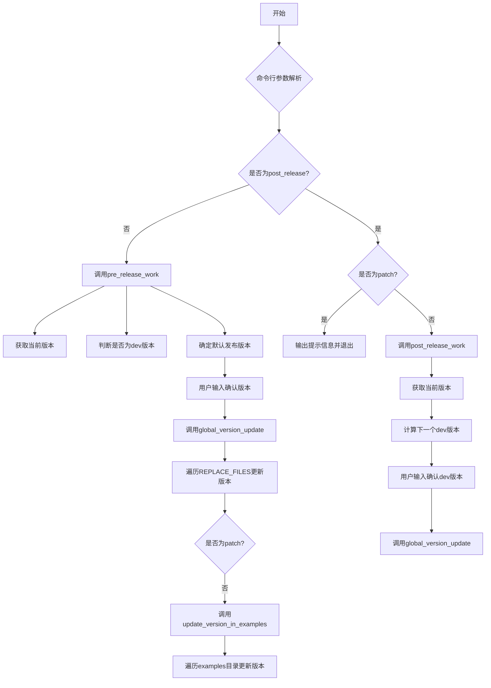
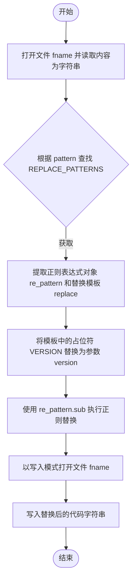
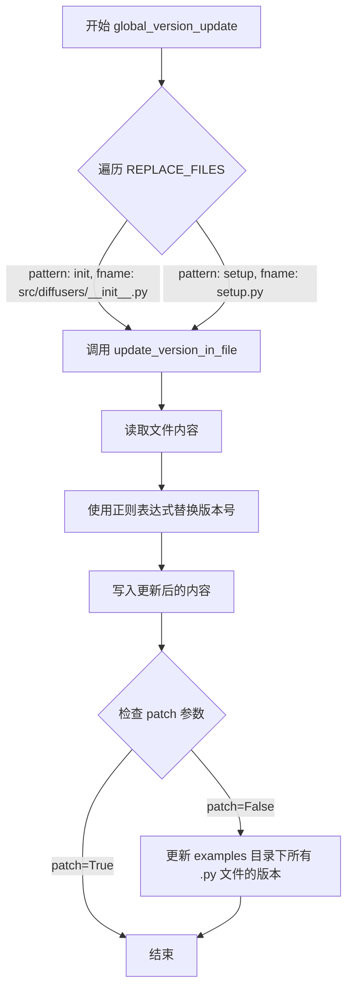
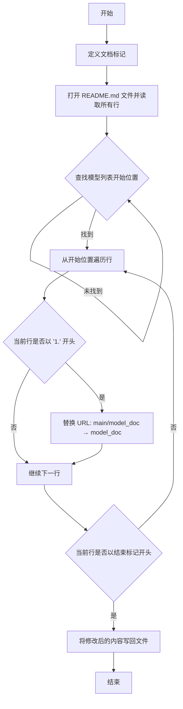
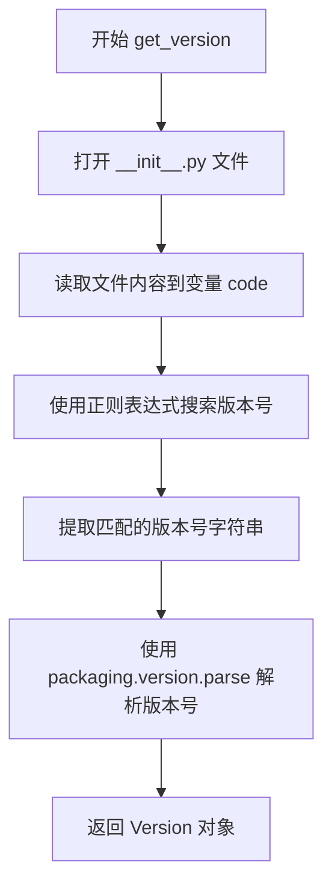
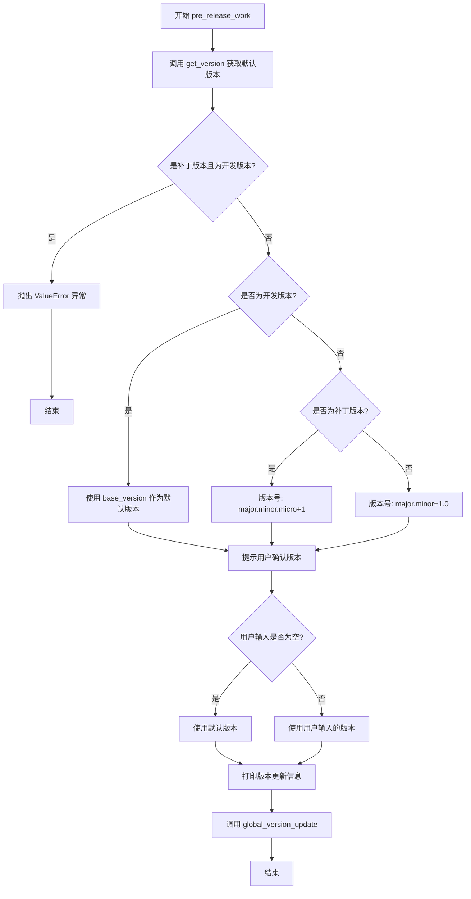
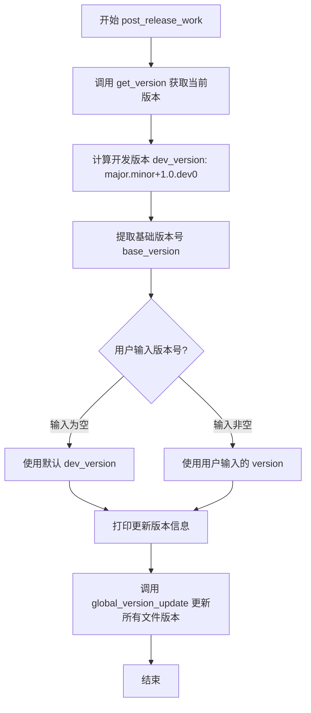

# `diffusers\utils\release.py` 详细设计文档

这是一个版本发布管理脚本，用于在diffusers项目中自动化更新版本号，支持pre-release和post-release工作流程，通过正则表达式批量替换__init__.py、setup.py和examples目录中所有Python文件的版本号。

## 整体流程



## 类结构

```
无类定义（纯模块脚本）
└── 模块级函数集合
    ├── update_version_in_file
    ├── update_version_in_examples
    ├── global_version_update
    ├── clean_main_ref_in_model_list
    ├── get_version
    ├── pre_release_work
    └── post_release_work
```

## 全局变量及字段


### `PATH_TO_EXAMPLES`
    
存储示例文件目录的路径

类型：`str`
    


### `REPLACE_PATTERNS`
    
包含用于匹配和替换版本号的不同正则表达式模式

类型：`dict`
    


### `REPLACE_FILES`
    
映射文件名到文件路径，用于版本更新

类型：`dict`
    


### `README_FILE`
    
README文件的名称

类型：`str`
    


    

## 全局函数及方法


### `update_version_in_file`

该函数是版本更新工具的核心组件，负责读取指定文件内容，根据预定义的正则表达式模式匹配并替换版本号字符串，最后将更新后的内容写回原文件。

参数：

- `fname`：`str`，目标文件的路径（包含文件名）。
- `version`：`str`，要写入的新版本号字符串。
- `pattern`：`str`，键名，用于从全局字典 `REPLACE_PATTERNS` 中获取对应的正则匹配模式和替换模板。

返回值：`None`，该函数直接修改文件系统中的文件内容，无返回值。

#### 流程图



#### 带注释源码

```python
def update_version_in_file(fname, version, pattern):
    """Update the version in one file using a specific pattern."""
    # 使用 UTF-8 编码打开文件，newline="\n" 确保换行符统一为 Unix 风格
    with open(fname, "r", encoding="utf-8", newline="\n") as f:
        code = f.read()
    
    # 从全局配置字典中获取对应的正则匹配模式和替换模板
    # pattern 决定了我们要替换文件中的哪部分版本信息（如 __init__ 中的 __version__）
    re_pattern, replace = REPLACE_PATTERNS[pattern]
    
    # 替换模板中的 VERSION 占位符为实际的新版本号
    # 例如：'__version__ = "VERSION"' -> '__version__ = "1.2.3"'
    replace = replace.replace("VERSION", version)
    
    # 执行正则替换：sub 方法会替换所有匹配到的内容
    code = re_pattern.sub(replace, code)
    
    # 将更新后的内容写回原文件，同样使用 UTF-8 编码和统一的换行符
    with open(fname, "w", encoding="utf-8", newline="\n") as f:
        f.write(code)
```


### `update_version_in_examples`

更新所有示例文件中的版本号，通过遍历示例目录并对每个Python文件调用版本更新函数来实现批量版本管理。

参数：

- `version`：`str`，需要更新的目标版本号

返回值：`None`，该函数无返回值，直接修改文件内容

#### 流程图

```mermaid
flowchart TD
    A[开始] --> B[使用os.walk遍历PATH_TO_EXAMPLES目录]
    B --> C{检查research_projects目录}
    C -->|存在| D[从directories中移除research_projects]
    C -->|不存在| E{检查legacy目录}
    D --> E
    E -->|存在| F[从directories中移除legacy]
    E -->不存在| G[遍历目录中的文件]
    F --> G
    G --> H{文件以.py结尾?}
    H -->|是| I[调用update_version_in_file更新版本]
    H -->|否| J[继续下一个文件]
    I --> J
    J --> K{还有更多文件?}
    K -->|是| G
    K -->|否| L{还有更多目录?}
    L -->|是| B
    L -->|否| M[结束]
```

#### 带注释源码

```python
def update_version_in_examples(version):
    """Update the version in all examples files."""
    # 使用os.walk递归遍历examples目录下的所有子目录
    # os.walk返回一个生成器，每次迭代返回 (当前目录路径, 子目录列表, 文件列表)
    for folder, directories, fnames in os.walk(PATH_TO_EXAMPLES):
        
        # 从遍历中移除research_projects文件夹
        # 这些是非维护的示例项目，不需要版本更新
        if "research_projects" in directories:
            directories.remove("research_projects")
        
        # 从遍历中移除legacy文件夹
        # 这些是旧版示例项目，也不需要版本更新
        if "legacy" in directories:
            directories.remove("legacy")
        
        # 遍历当前目录下的所有文件
        for fname in fnames:
            # 只处理Python文件（.py结尾）
            if fname.endswith(".py"):
                # 调用update_version_in_file函数更新文件中的版本号
                # pattern="examples"表示使用examples对应的正则替换模式
                update_version_in_file(os.path.join(folder, fname), version, pattern="examples")
```


### `global_version_update`

该函数是版本更新流程的核心函数，用于在所有需要更新版本的文件（如 `__init__.py` 和 `setup.py`）中更新版本号，支持补丁版本发布模式。

**参数：**

- `version`：`str`，要更新的目标版本号（例如 "1.2.3"）
- `patch`：`bool`，默认为 False，表示是否为补丁版本发布。True 时只更新核心文件，False 时还会更新示例文件

**返回值：** `None`，该函数不返回任何值，仅执行文件写入操作

#### 流程图



#### 带注释源码

```python
def global_version_update(version, patch=False):
    """Update the version in all needed files."""
    # 遍历 REPLACE_FILES 字典中的所有条目
    # REPLACE_FILES = {"init": "src/diffusers/__init__.py", "setup": "setup.py"}
    for pattern, fname in REPLACE_FILES.items():
        # 调用 update_version_in_file 更新指定文件的版本
        # 参数：文件名、版本号、模式（init 或 setup）
        update_version_in_file(fname, version, pattern)
    
    # 如果不是补丁版本发布，则更新示例文件中的版本
    # patch=False 时会递归遍历 examples/ 目录下所有 .py 文件
    # patch=True 时跳过示例文件更新（通常补丁发布不需要更新示例）
    if not patch:
        update_version_in_examples(version)
```


### `clean_main_ref_in_model_list`

该函数用于在 README 文件的模型列表中，将指向 main 分支文档的链接替换为指向稳定版文档的链接，从而确保文档链接在发布后指向正式版本而非开发版本。

参数： 无

返回值： `None`，该函数不返回任何值，仅执行文件修改操作

#### 流程图



#### 带注释源码

```python
def clean_main_ref_in_model_list():
    """Replace the links from main doc tp stable doc in the model list of the README."""
    # 如果模型列表的导言或结语发生变化，可能需要更新以下提示符
    # 定义模型列表的起始和结束提示符，用于定位文档中需要处理的段落
    _start_prompt = "🤗 Transformers currently provides the following architectures"
    _end_prompt = "1. Want to contribute a new model?"
    
    # 以读取模式打开 README.md 文件，指定 UTF-8 编码和 Unix 换行符
    with open(README_FILE, "r", encoding="utf-8", newline="\n") as f:
        lines = f.readlines()

    # 初始化索引，从文件开头开始查找模型列表的起始位置
    start_index = 0
    # 循环查找模型列表的开始标记
    while not lines[start_index].startswith(_start_prompt):
        start_index += 1
    # 跳过起始标记行，定位到第一个模型条目
    start_index += 1

    # 从起始位置开始遍历模型列表
    index = start_index
    # 遍历模型列表中的每一行，直到遇到结束标记
    while not lines[index].startswith(_end_prompt):
        # 检查当前行是否以 "1." 开头（即模型条目行）
        if lines[index].startswith("1."):
            # 替换链接：将 main 分支文档链接替换为稳定版文档链接
            # 这样在发布后，用户访问的是已发布的稳定版文档而非开发版
            lines[index] = lines[index].replace(
                "https://huggingface.co/docs/diffusers/main/model_doc",
                "https://huggingface.co/docs/diffusers/model_doc",
            )
        index += 1

    # 以写入模式打开文件，将修改后的内容写回
    with open(README_FILE, "w", encoding="utf-8", newline="\n") as f:
        f.writelines(lines)
```


### `get_version`

该函数用于从 `__init__.py` 文件中读取当前项目的版本号，并通过 `packaging.version.parse` 将其解析为版本对象返回。

参数： 无

返回值：`packaging.version.Version`，解析后的版本对象，包含主版本号、次版本号、修订号等信息

#### 流程图



#### 带注释源码

```python
def get_version():
    """Reads the current version in the __init__."""
    # 打开 REPLACE_FILES 字典中 "init" 键对应的文件（即 src/diffusers/__init__.py）
    # 以只读模式打开文件
    with open(REPLACE_FILES["init"], "r") as f:
        # 读取文件的全部内容
        code = f.read()
    
    # 从 REPLACE_PATTERNS 字典中获取 "init" 键对应的正则表达式模式
    # 该正则表达式为: re.compile(r'^__version__\s+=\s+"([^"]+)"\s*$', re.MULTILINE)
    # 用于匹配形如 __version__ = "1.2.3" 的版本定义
    # search() 方法查找第一个匹配项
    # groups()[0] 捕获括号中匹配的版本号字符串（即 "([^"]+)" 部分）
    default_version = REPLACE_PATTERNS["init"][0].search(code).groups()[0]
    
    # 使用 packaging.version.parse 将字符串版本的版本号解析为 Version 对象
    # 返回的 Version 对象可以直接比较版本大小、访问 major/minor/micro 等属性
    return packaging.version.parse(default_version)
```


### `pre_release_work`

该函数负责执行发布前的所有必要步骤，包括获取默认版本、提示用户确认版本号，并调用全局版本更新函数来更新代码库中的版本信息。

参数：

- `patch`：`bool`，指示是否为补丁版本发布（默认为 `False`）

返回值：`None`，该函数不返回任何值，仅执行版本更新操作

#### 流程图



#### 带注释源码

```python
def pre_release_work(patch=False):
    """Do all the necessary pre-release steps."""
    # 第一步：获取默认版本。如果是开发版本，使用基础版本；否则根据是否补丁版本递增
    default_version = get_version()
    
    # 检查是否尝试从开发分支创建补丁版本，这是不允许的
    if patch and default_version.is_devrelease:
        raise ValueError("Can't create a patch version from the dev branch, checkout a released version!")
    
    # 根据当前版本状态确定默认发布版本
    if default_version.is_devrelease:
        # 开发版本：使用基础版本号
        default_version = default_version.base_version
    elif patch:
        # 补丁版本：递增补丁号（micro版本）
        default_version = f"{default_version.major}.{default_version.minor}.{default_version.micro + 1}"
    else:
        # 正式版本：递增次版本号（minor版本）
        default_version = f"{default_version.major}.{default_version.minor + 1}.0"

    # 询问用户确认版本号，允许用户输入自定义版本或使用默认值
    version = input(f"Which version are you releasing? [{default_version}]")
    
    # 如果用户未输入，使用默认版本
    if len(version) == 0:
        version = default_version

    # 打印版本更新提示信息
    print(f"Updating version to {version}.")
    
    # 调用全局版本更新函数，执行实际的版本号更新操作
    global_version_update(version, patch=patch)
```


# post_release_work 函数详细设计文档

## 1. 概述

`post_release_work` 函数是 HuggingFace Diffusers 项目版本发布流程中的关键组成部分，负责在正式版本发布后自动更新代码库至下一个开发版本（dev version），确保版本号的正确迭代和管理。

## 2. 全局变量与全局函数详细信息

### 2.1 全局变量

| 名称 | 类型 | 描述 |
|------|------|------|
| `PATH_TO_EXAMPLES` | `str` | 示例文件目录路径，默认为 "examples/" |
| `REPLACE_PATTERNS` | `dict` | 版本替换正则表达式模式字典，包含 examples、init、setup、doc 四种模式 |
| `REPLACE_FILES` | `dict` | 需要替换版本的文件路径字典，映射到 __init__.py 和 setup.py |
| `README_FILE` | `str` | README 文件名，默认为 "README.md" |

### 2.2 全局函数

| 函数名 | 功能描述 |
|--------|----------|
| `get_version()` | 从 `__init__.py` 读取当前版本号并返回 `packaging.version.Version` 对象 |
| `global_version_update(version, patch=False)` | 在所有需要更新版本的文件中全局更新版本号 |
| `update_version_in_file(fname, version, pattern)` | 使用特定模式更新单个文件中的版本号 |
| `update_version_in_examples(version)` | 更新所有示例文件中的版本号 |

## 3. post_release_work 函数详细规格

### `post_release_work`

该函数执行发布后的版本更新工作，包括获取当前版本、计算下一个开发版本、用户确认以及全局版本更新。

参数：**无**

返回值：**无**（`None`），该函数通过副作用（文件写入和打印输出）完成工作

#### 流程图



#### 带注释源码

```python
def post_release_work():
    """Do all the necessary post-release steps."""
    # 第一步：获取当前发布的版本
    # 使用 get_version() 从 src/diffusers/__init__.py 读取当前版本
    current_version = get_version()
    
    # 第二步：计算下一个开发版本
    # 逻辑：当前版本为 X.Y.Z，发布后开发版本为 X.Y+1.0.dev0
    # 例如：1.2.3 发布后，下一个开发版本为 1.3.0.dev0
    dev_version = f"{current_version.major}.{current_version.minor + 1}.0.dev0"
    
    # 提取基础版本号（去除 .dev0 等后缀）
    # 例如：1.2.3.dev0 -> 1.2.3
    current_version = current_version.base_version

    # 第三步：与用户确认开发版本号
    # 如果用户直接回车，则使用自动计算的 dev_version
    # 如果用户输入其他版本号，则使用用户输入的版本
    version = input(f"Which version are we developing now? [{dev_version}]")
    if len(version) == 0:
        version = dev_version

    # 第四步：打印将要更新的版本信息
    print(f"Updating version to {version}.")
    
    # 第五步：全局更新版本号
    # 调用 global_version_update 更新以下文件：
    # - src/diffusers/__init__.py
    # - setup.py
    # - examples/ 目录下的所有 .py 文件
    global_version_update(version)
```

## 4. 关键组件信息

| 组件名称 | 描述 |
|----------|------|
| 版本号计算逻辑 | 基于当前版本号自动计算下一个开发版本号（major.minor+1.0.dev0） |
| 用户交互模块 | 通过 `input()` 获取用户确认，支持默认选项 |
| 版本更新引擎 | `global_version_update` 负责批量更新多个文件中的版本号 |
| 正则表达式替换系统 | `REPLACE_PATTERNS` 提供四种不同的版本匹配模式 |

## 5. 潜在的技术债务与优化空间

1. **缺少错误处理**：函数未对 `get_version()` 返回 `None` 或文件读取失败的情况进行处理
2. **硬编码路径**：`PATH_TO_EXAMPLES` 和 `README_FILE` 为硬编码值，缺乏配置灵活性
3. **未使用的代码**：`clean_main_ref_in_model_list()` 函数被注释但未被调用，可能导致 README 维护不一致
4. **版本号验证缺失**：未验证用户输入的版本号格式是否合法
5. **测试覆盖不足**：缺少对版本更新逻辑的单元测试

## 6. 其它项目信息

### 6.1 设计目标与约束
- **目标**：自动化版本发布后的版本号更新流程，减少人工操作错误
- **约束**：
  - 依赖 `packaging.version` 库进行版本解析
  - 需要文件写入权限
  - 正则表达式模式必须与文件内容格式严格匹配

### 6.2 错误处理与异常设计
- 用户输入为空时使用默认值
- 未处理文件不存在、权限不足等 I/O 异常
- 未处理版本解析异常

### 6.3 数据流与状态机
```
初始状态（发布完成） 
    ↓
读取当前版本（get_version）
    ↓
计算下一版本（dev_version）
    ↓
用户确认（input）
    ↓
更新全局版本（global_version_update）
    ↓
最终状态（开发版本已设置）
```

### 6.4 外部依赖与接口契约
- **依赖库**：`packaging.version`（标准库），`argparse`（标准库），`re`（标准库），`os`（标准库）
- **输入**：用户通过命令行或标准输入提供的版本号
- **输出**：修改后的文件内容（__init__.py, setup.py, examples/*.py）
- **接口**：无显式 API 接口，通过命令行参数 `--post_release` 和 `--patch` 调用

## 关键组件


### 版本模式匹配与替换 (REPLACE_PATTERNS)

用于定义不同文件中版本号的正则表达式匹配模式和替换模板，包含examples、init、setup、doc四种模式。

### 文件路径配置 (REPLACE_FILES)

定义了需要更新版本的目标文件路径映射，包括__init__.py和setup.py。

### 单文件版本更新 (update_version_in_file)

根据指定模式更新单个文件中的版本号，使用正则表达式替换实现。

### 批量示例文件更新 (update_version_in_examples)

遍历examples目录下的所有Python文件，排除research_projects和legacy目录，逐个更新版本号。

### 全局版本协调 (global_version_update)

协调更新所有目标文件中的版本，可选择是否更新examples目录。

### README链接修复 (clean_main_ref_in_model_list)

更新README.md中的模型文档链接，将main分支链接替换为稳定版链接。

### 版本读取 (get_version)

从__init__.py中解析当前版本号，使用packaging.version进行版本比较。

### 预发布流程 (pre_release_work)

确定发布版本号，支持dev版本、patch版本和minor版本升级，交互式获取用户确认。

### 后发布流程 (post_release_work)

在正式发布后切换到下一个开发版本，通常是minor版本+1并添加.dev0后缀。

### 命令行参数解析

支持--post_release和--patch两个布尔参数，控制发布流程的执行路径。


## 问题及建议


### 已知问题

-   **硬编码路径和文件名**：路径如 `examples/`、`README.md`、文件路径 `src/diffusers/__init__.py` 等都是硬编码，缺乏灵活性
-   **缺乏异常处理**：文件读写操作、正则匹配、版本解析等关键操作都没有 try-except 保护
-   **正则表达式匹配无验证**：`get_version()` 函数假设正则表达式必定能匹配到结果，如果匹配失败会导致 `AttributeError`
-   **注释掉的死代码**：多处注释掉的 `clean_main_ref_in_model_list` 调用和相关代码，既不执行又造成代码混乱
-   **输入验证缺失**：用户输入的版本号没有格式验证，可能导致无效版本号被写入文件
-   **重复代码**：`pre_release_work` 和 `post_release_work` 函数中存在大量相似逻辑
-   **缺乏类型注解**：所有函数都缺少参数和返回值的类型注解，降低了代码可读性和可维护性

### 优化建议

-   将硬编码的路径和文件名提取为配置文件或命令行参数
-   为所有文件操作添加异常处理，特别是 `open()` 调用需要捕获 `IOError` 和 `FileNotFoundError`
-   在 `get_version()` 中添加正则匹配结果验证，使用 `if ... is None` 检查
-   删除注释掉的死代码，或将其功能完善后取消注释
-   添加版本号格式验证函数，使用 `packaging.version.Version` 进行校验
-   抽取公共逻辑到独立函数，如版本确认、文件更新提示等
-   为所有函数添加类型注解和完整的 docstring 文档字符串
-   考虑将 `REPLACE_PATTERNS` 和 `REPLACE_FILES` 改为类属性或配置类，提高代码组织性

## 其它


### 设计目标与约束

本代码的设计目标是实现diffusers库的自动化版本发布流程，包括版本号更新、文件替换和发布前后处理。约束条件包括：只能处理Python文件（.py），需要保持原始文件的编码格式（UTF-8），并使用正则表达式进行精确的版本替换。

### 错误处理与异常设计

代码中的错误处理主要包括：1）patch版本不能从dev分支创建，会抛出ValueError异常；2）文件读取/写入失败会抛出IOError；3）版本解析失败会返回None。异常设计采用快速失败（fail-fast）策略，在发现无效状态时立即停止执行。

### 数据流与状态机

版本发布流程为一个线性状态机：初始状态 → 读取当前版本 → 用户确认新版本 → 更新版本文件 → 更新示例文件 → 结束。pre_release_work和post_release_work分别对应发布前和发布后两个主要状态分支。

### 外部依赖与接口契约

主要依赖包括：argparse（命令行参数解析）、os和re（文件操作和正则匹配）、packaging.version（版本解析）。对外接口为命令行参数：--post_release（布尔标志）和--patch（布尔标志）。PATH_TO_EXAMPLES、REPLACE_PATTERNS、REPLACE_FILES为可配置常量。

### 安全性考虑

代码在文件操作时使用UTF-8编码指定newline参数确保跨平台兼容性。未对用户输入的版本号进行严格验证，存在注入风险。文件写入前会完整读取内容，替换后再写入，支持原子性操作（可进一步优化为临时文件+重命名模式）。

### 性能考量

os.walk遍历examples目录时移除了research_projects和legacy目录以减少不必要的文件扫描。版本更新采用正则表达式替换，对于大型代码库性能可接受。建议：可增加并行处理多个文件的选项，以及缓存已读取的文件内容。

### 测试建议

建议添加以下测试用例：1）测试REPLACE_PATTERNS正则表达式匹配各种版本格式；2）测试update_version_in_file函数对不同文件内容的处理；3）测试pre_release_work和post_release_work的版本计算逻辑；4）测试异常场景（dev分支创建patch版本）；5）集成测试验证完整发布流程。

### 维护建议

当前代码中存在注释掉的clean_main_ref_in_model_list函数调用，建议明确该功能的状态。可考虑将硬编码的路径（PATH_TO_EXAMPLES、README_FILE）改为命令行参数或配置文件。版本号的语义化处理（major.minor.patch）可封装为专门的VersionManager类以提高可维护性。

    