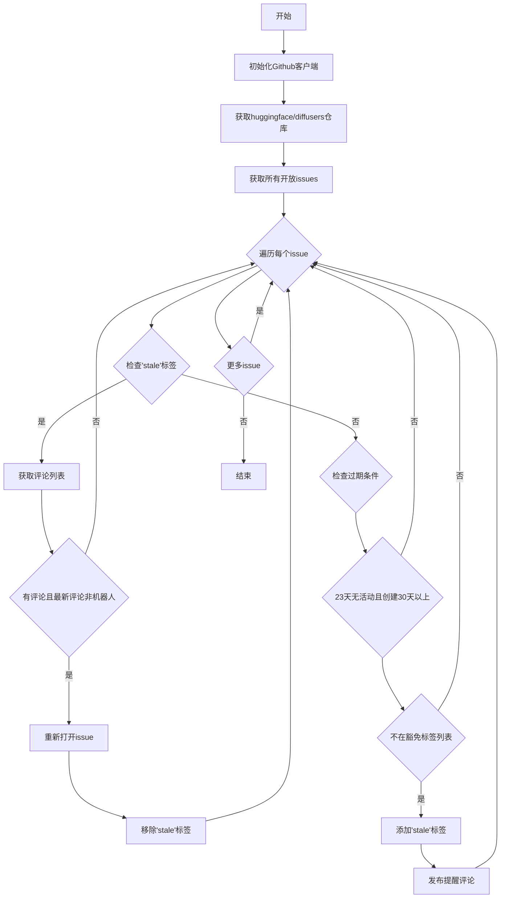

# `diffusers\utils\stale.py` 详细设计文档

该脚本通过GitHub API自动检测并管理diffusers仓库中长时间没有活动的issue，对超过23天未更新且创建超过30天的issue自动添加stale标签和提醒评论，同时对已有stale标签但有新评论的issue进行重新打开处理。

## 整体流程

```mermaid
graph TD
    A[开始] --> B[使用GITHUB_TOKEN认证]
B --> C[获取huggingface/diffusers仓库]
C --> D[获取所有open状态的issues]
D --> E{遍历每个issue}
E --> F{检查是否有stale标签?}
F -- 是 --> G[获取issue的所有评论]
G --> H[按创建时间倒序排序]
H --> I{有评论且最后评论者不是github-actions[bot]?}
I -- 是 --> J[重新打开issue]
J --> K[移除stale标签]
I -- 否 --> E
F -- 否 --> L{检查是否满足过期条件}
L -- 是 --> M[检查是否有豁免标签]
M -- 无豁免标签 --> N[创建stale提醒评论]
N --> O[添加stale标签]
O --> E
L -- 否 --> E
```

## 类结构

```
无类定义 (脚本文件)
└── 模块级函数: main()
```

## 全局变量及字段


### `LABELS_TO_EXEMPT`
    
豁免标签列表，包含不会被标记为stale的标签名称

类型：`list`
    


    

## 全局函数及方法


### `main`

主函数，执行关闭过期issue的逻辑，遍历diffusers仓库的开放issues，对带有"stale"标签但有人评论的issue重新开放，对长期无活动且不符合豁免条件的issue添加stale标记。

参数：

- 该函数无参数

返回值：`None`，无返回值

#### 流程图

```mermaid
flowchart TD
    A([开始]) --> B[创建GitHub客户端实例]
    B --> C[获取huggingface/diffusers仓库]
    C --> D[获取所有状态为open的issues]
    D --> E[遍历每个issue]
    
    E --> F{检查issue是否<br/>带有'stale'标签?}
    F -->|是| G[获取issue的所有评论<br/>按创建时间倒序排序]
    G --> H[获取最后一条评论]
    H --> I{最后评论存在且<br/>评论者不是<br/>github-actions[bot]?}
    I -->|是| J[重新打开issue<br/>state='open']
    J --> K[从issue中移除'stale'标签]
    I -->|否| L[跳过当前issue]
    K --> E
    
    F -->|否| M{检查条件:<br/>1. 超过23天未更新<br/>2. 创建时间>=30天<br/>3. 无豁免标签?}
    M -->|是| N[创建Stalebot评论<br/>提醒用户问题需要关注]
    N --> O[给issue添加'stale'标签]
    O --> E
    M -->|否| L
    
    L --> P{还有更多issues?}
    P -->|是| E
    P -->|否| Q([结束])
```

#### 带注释源码

```python
def main():
    """
    主函数，执行关闭过期issue的逻辑。
    遍历diffusers仓库的开放issues，处理stale标签和自动提醒。
    """
    # 使用环境变量中的GitHub Token创建GitHub API客户端
    g = Github(os.environ["GITHUB_TOKEN"])
    
    # 获取huggingface/diffusers仓库对象
    repo = g.get_repo("huggingface/diffusers")
    
    # 获取所有状态为open的issues（包括PR和issues）
    open_issues = repo.get_issues(state="open")

    # 遍历仓库中的每个开放issue
    for issue in open_issues:
        # 获取issue的所有标签名称，并转为小写以便比较
        labels = [label.name.lower() for label in issue.get_labels()]
        
        # 判断issue是否已经被标记为stale
        if "stale" in labels:
            # 获取该issue的所有评论，按创建时间倒序排列（最新的在前）
            comments = sorted(issue.get_comments(), key=lambda i: i.created_at, reverse=True)
            
            # 获取最新的一条评论，如果存在的话
            last_comment = comments[0] if len(comments) > 0 else None
            
            # 如果存在最新评论，且评论者不是github-actions[bot]
            # 说明有人（非Stalebot）回复了，则重新开放该issue并移除stale标签
            if last_comment is not None and last_comment.user.login != "github-actions[bot]":
                # Opens the issue if someone other than Stalebot commented.
                issue.edit(state="open")  # 将issue状态改为open
                issue.remove_from_labels("stale")  # 移除stale标签
        # 如果issue没有stale标签，则检查是否符合添加stale标签的条件
        elif (
            # 条件1：issue超过23天没有更新
            (dt.now(timezone.utc) - issue.updated_at).days > 23
            # 条件2：issue创建时间已超过30天
            and (dt.now(timezone.utc) - issue.created_at).days >= 30
            # 条件3：issue标签不在豁免列表中
            and not any(label in LABELS_TO_EXEMPT for label in labels)
        ):
            # Post a Stalebot notification after 23 days of inactivity.
            # 创建一个提醒评论，告知用户该issue可能被关闭
            issue.create_comment(
                "This issue has been automatically marked as stale because it has not had "
                "recent activity. If you think this still needs to be addressed "
                "please comment on this thread.\n\nPlease note that issues that do not follow the "
                "[contributing guidelines](https://github.com/huggingface/diffusers/blob/main/CONTRIBUTING.md) "
                "are likely to be ignored."
            )
            # 给issue添加stale标签
            issue.add_to_labels("stale")
```

## 关键组件


### GitHub API 集成模块

使用 PyGithub 库与 GitHub API 进行交互，包括获取仓库、获取 issue、创建评论、编辑 issue 状态和标签管理等操作。

### 豁免标签配置

定义了不在 stale 检测范围内的标签列表，包括 "close-to-merge"、"good first issue"、"enhancement" 等特殊标签，用于保护特定类型的 issue 不被自动标记为 stale。

### Stale 检测与标记逻辑

通过比较 issue 的创建时间和最后更新时间，判断 issue 是否满足 stale 条件（创建超过30天且23天无活动），并在满足条件时自动创建提醒评论并添加 "stale" 标签。

### Issue 复活机制

当已标记为 stale 的 issue 收到非 Stalebot 的用户评论时，自动将 issue 状态改为 open 并移除 "stale" 标签，实现issue的自动复活功能。

### 时间与时区处理

使用 Python datetime 模块结合 timezone 处理时间计算，确保以 UTC 时区为标准进行准确的时间差计算。


## 问题及建议


### 已知问题

- **硬编码配置**：仓库名称（`"huggingface/diffusers"`）和时间阈值（23天、30天）被硬编码在代码中，缺乏灵活性，无法通过命令行参数或配置文件调整
- **API 调用效率低下**：遍历所有开放 issues，每个 issue 都调用 `get_labels()` 和 `get_comments()`，可能导致 GitHub API rate limit 限制，特别是在大型仓库中
- **缺少异常处理**：网络请求、GitHub API 调用没有任何 try-except 保护，脚本可能在遇到单个 issue 错误时直接终止
- **环境变量未验证**：直接使用 `os.environ["GITHUB_TOKEN"]`，未检查变量是否存在，脚本会在缺少 token 时抛出 KeyError
- **无日志输出**：脚本没有任何日志记录，无法追踪执行进度和问题排查
- **分页缺失**：`repo.get_issues()` 返回所有开放 issues，GitHub API 默认分页（每页100条），可能遗漏或处理不完整
- **标签操作 API 兼容性**：`remove_from_labels` 和 `add_to_labels` 方法在某些 PyGithub 版本中可能存在兼容性问题
- **无dry-run模式**：无法在不实际修改 issues 的情况下预览脚本行为

### 优化建议

- **配置外化**：使用 `argparse` 或环境变量实现仓库名、时间阈值等参数的可配置化
- **速率限制保护**：实现 GitHub API 请求间隔、指数退避重试机制，并添加分页处理
- **完善异常处理**：为每个 GitHub API 调用添加异常捕获，记录失败日志并继续处理其他 issues
- **环境变量校验**：启动时检查必要环境变量，提供友好的错误提示
- **添加日志记录**：使用 `logging` 模块记录执行进度、处理统计和错误信息
- **实现 dry-run 模式**：添加 `--dry-run` 参数，仅输出将要执行的操作而不实际修改
- **添加重试机制**：对临时性网络错误和 GitHub API 限流实现自动重试
- **单元测试**：添加对核心逻辑的单元测试，特别是标签判断和时间计算逻辑

## 其它


### 一段话描述

该脚本用于自动管理HuggingFace diffusers仓库中的过时Issue，通过检测问题活跃度和创建时间，自动标记超过23天未更新且创建超过30天的问题为"stale"，同时当有人（除Stalebot外）评论时自动重新打开问题。

### 文件的整体运行流程

脚本启动后，首先通过环境变量获取GitHub Token并初始化Github客户端，然后连接到huggingface/diffusers仓库获取所有开放的问题。接着遍历每个开放Issue，检查其标签和活动时间：若已标记为"stale"且最新评论来自非机器人用户，则重新打开问题并移除标签；若满足过期条件（23天无活动且创建满30天）且不在豁免标签列表中，则自动添加"stale"标签并发布提醒评论。

### 全局变量信息

| 名称 | 类型 | 描述 |
|------|------|------|
| LABELS_TO_EXEMPT | List[str] | 豁免标签列表，包含不需要被标记为stale的标签 |

### 全局函数信息

| 名称 | 参数 | 参数类型 | 参数描述 | 返回值类型 | 返回值描述 |
|------|------|----------|----------|------------|------------|
| main | 无 | - | 主函数，执行业务逻辑 | None | 无返回值 |

#### main函数mermaid流程图



#### main函数带注释源码

```python
def main():
    # 使用环境变量中的GitHub Token初始化Github客户端
    g = Github(os.environ["GITHUB_TOKEN"])
    # 获取目标仓库
    repo = g.get_repo("huggingface/diffusers")
    # 获取所有开放的问题
    open_issues = repo.get_issues(state="open")

    # 遍历每个开放issue
    for issue in open_issues:
        # 获取所有标签名称（小写）
        labels = [label.name.lower() for label in issue.get_labels()]
        
        # 如果已经标记为stale
        if "stale" in labels:
            # 按创建时间倒序获取评论
            comments = sorted(issue.get_comments(), key=lambda i: i.created_at, reverse=True)
            # 获取最新评论
            last_comment = comments[0] if len(comments) > 0 else None
            
            # 如果有评论且评论者不是机器人
            if last_comment is not None and last_comment.user.login != "github-actions[bot]":
                # 重新打开issue
                issue.edit(state="open")
                # 移除stale标签
                issue.remove_from_labels("stale")
        # 如果未标记为stale，检查是否符合过期条件
        elif (
            (dt.now(timezone.utc) - issue.updated_at).days > 23
            and (dt.now(timezone.utc) - issue.created_at).days >= 30
            and not any(label in LABELS_TO_EXEMPT for label in labels)
        ):
            # 发布Stalebot提醒评论
            issue.create_comment(
                "This issue has been automatically marked as stale because it has not had "
                "recent activity. If you think this still needs to be addressed "
                "please comment on this thread.\n\nPlease note that issues that do not follow the "
                "[contributing guidelines](https://github.com/huggingface/diffusers/blob/main/CONTRIBUTING.md) "
                "are likely to be ignored."
            )
            # 添加stale标签
            issue.add_to_labels("stale")
```

### 关键组件信息

| 名称 | 一句话描述 |
|------|------------|
| Github客户端 | PyGithub库封装的GitHub API客户端，用于与GitHub仓库交互 |
| repo对象 | 代表huggingface/diffusers仓库的远程仓库对象 |
| issue对象 | 代表单个GitHub Issue的Python对象，包含操作方法 |
| 日期时间处理 | 使用datetime模块和timezone进行时间计算和比较 |

### 潜在的技术债务或优化空间

1. **硬编码配置问题**：仓库名称"huggingface/diffusers"硬编码在代码中，应提取为配置参数
2. **魔法数字**：23天和30天的阈值应提取为常量或配置项
3. **API效率问题**：遍历所有开放issues并逐个检查标签和评论，API调用次数过多，可考虑使用GitHub GraphQL API或添加缓存机制
4. **缺少错误处理**：网络异常、API限流、认证失败等情况没有异常捕获和处理
5. **注释消息硬编码**：提示信息应抽取为配置或外部文件
6. **单次运行模式**：脚本只运行一次，适合定时任务但缺乏重试机制
7. **标签名称大小写敏感**：标签比较使用.lower()但移除标签时使用"stale"字符串，可能存在大小写不匹配问题

### 设计目标与约束

**设计目标**：自动化管理GitHub仓库中的过时Issue，减少维护负担，通过自动提醒机制促使问题得到处理或关闭。

**约束条件**：
- 依赖GitHub API，需有效的GitHub Token
- 只能处理开放状态的问题
- 豁免标签列表需要手动维护
- 运行频率受GitHub API速率限制约束

### 错误处理与异常设计

1. **认证失败**：当GITHUB_TOKEN环境变量未设置或无效时，PyGithub会抛出异常，脚本会直接崩溃退出
2. **API限流**：GitHub API有速率限制，连续大量请求可能导致429错误，无重试机制
3. **网络异常**：网络中断或超时没有捕获处理
4. **仓库不存在**：目标仓库名称错误时无提示直接返回空列表
5. **Issue获取异常**：遍历过程中单个issue获取失败会导致整个脚本中断

### 数据流与状态机

**数据流**：
```
环境变量(GITHUB_TOKEN) 
    → Github客户端初始化 
    → 获取仓库对象 
    → 获取开放issues列表 
    → 逐个检查issue状态 
    → 根据条件执行操作(添加标签/评论/重新打开)
```

**Issue状态转换**：
- **正常状态**：开放且活跃的Issue → 超过23天无活动 → 添加"stale"标签
- **stale状态**：已标记stale的Issue → 有人评论（非机器人） → 重新打开并移除标签
- **豁免状态**：带有豁免标签的Issue → 始终保持正常状态

### 外部依赖与接口契约

| 依赖 | 版本要求 | 用途 |
|------|----------|------|
| PyGithub | 最新版本 | GitHub API Python封装库 |
| datetime | Python标准库 | 日期时间处理 |
| os | Python标准库 | 环境变量访问 |

**接口契约**：
- **输入**：通过os.environ["GITHUB_TOKEN"]获取GitHub访问令牌
- **输出**：通过GitHub API修改Issue状态、添加标签、发布评论
- **环境要求**：需要设置GITHUB_TOKEN环境变量，具备huggingface/diffusers仓库的访问权限

### 配置管理

**当前配置方式**：所有配置以硬编码形式存在，包括：
- 仓库名称："huggingface/diffusers"
- 过期天数阈值：23天（无活动）、30天（创建时间）
- 豁免标签列表：LABELS_TO_EXEMPT
- 提醒消息内容：硬编码的评论文本

**建议改进**：使用环境变量或配置文件管理，便于在不同仓库间复用

### 安全性考虑

1. **凭证管理**：GitHub Token通过环境变量传入，符合安全最佳实践
2. **Token权限**：应使用最小权限Token，仅需仓库的issues读写权限
3. **日志记录**：缺少操作日志记录，难以追溯执行历史
4. **速率限制**：未考虑API调用频率限制，可能触发GitHub限流

### 性能考虑

1. **API调用优化**：当前实现对每个issue进行多次API调用（获取标签、获取评论、获取详情），效率较低
2. **分页处理**：未处理分页，大型仓库可能有数千个开放issues
3. **批量操作**：标签添加和评论创建应可批量处理但当前逐个执行
4. **内存占用**：一次性获取所有开放issues，大型仓库可能内存压力大

### 可测试性

1. **单元测试困难**：直接依赖GitHub API，难以进行单元测试
2. **Mock需求**：需要Mock Github客户端和API响应
3. **集成测试**：适合作为CI/CD流程的一部分进行集成测试
4. **测试覆盖建议**：应测试豁免标签逻辑、时间计算逻辑、状态转换逻辑

### 部署/运行要求

1. **运行环境**：Python 3.x
2. **依赖安装**：pip install PyGithub
3. **环境变量**：必须设置GITHUB_TOKEN
4. **运行方式**：可作为定时任务（如cron）定期执行
5. **权限要求**：需要仓库的issues管理权限
6. **推荐运行频率**：建议每天运行一次，避免API调用过于频繁


    