# `diffusers\utils\tests_fetcher.py` 详细设计文档

A utility to identify modified files in a git repository and determine which tests are impacted by those changes through dependency analysis, outputting a filtered list of tests to run (including support for doctests and core pipeline tests when too many models are impacted).

## 整体流程

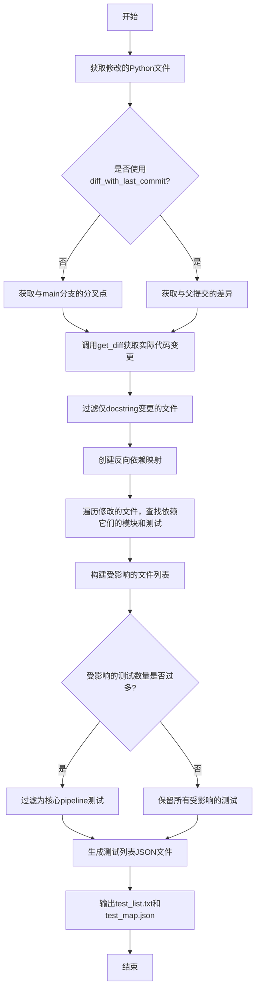

## 类结构

```
无类定义 (纯函数式模块)
所有函数和变量均为模块级定义
使用正则表达式作为全局模式匹配工具
```

## 全局变量及字段


### `PATH_TO_REPO`
    
仓库根目录路径，通过获取当前文件父目录的父目录并解析得到

类型：`Path`
    


### `PATH_TO_EXAMPLES`
    
examples文件夹路径，指向仓库中的examples目录

类型：`Path`
    


### `PATH_TO_DIFFUSERS`
    
diffusers源代码路径，指向src/diffusers目录

类型：`Path`
    


### `PATH_TO_TESTS`
    
tests文件夹路径，指向仓库中的tests目录

类型：`Path`
    


### `MODULES_TO_IGNORE`
    
需要忽略的模块列表，包含fixtures和lora，这些模块的测试将被跳过

类型：`List[str]`
    


### `IMPORTANT_PIPELINES`
    
重要pipeline列表，当受影响的模型过多时，仅运行这些核心pipeline的测试

类型：`List[str]`
    


### `_re_single_line_relative_imports`
    
单行相对导入正则表达式模式，用于匹配如from .xxx import yyy格式的导入语句

类型：`re.Pattern`
    


### `_re_multi_line_relative_imports`
    
多行相对导入正则表达式模式，用于匹配括号内多行的from .xxx import (yyy)格式导入

类型：`re.Pattern`
    


### `_re_single_line_direct_imports`
    
单行直接导入正则表达式模式，用于匹配from diffusers.xxx import yyy格式的导入语句

类型：`re.Pattern`
    


### `_re_multi_line_direct_imports`
    
多行直接导入正则表达式模式，用于匹配括号内多行的from diffusers.xxx import (yyy)格式导入

类型：`re.Pattern`
    


    

## 全局函数及方法


### `checkout_commit`

这是一个 Git 上下文管理器，用于在代码块执行期间临时切换到指定的 Git commit，并在执行完毕后自动恢复到原始的 HEAD 位置。该函数常用于在不影响当前工作状态的情况下读取特定版本的代码内容。

参数：

- `repo`：`git.Repo`，Git 仓库对象（例如 Transformers 仓库）
- `commit_id`：`str`，要在上下文管理器内检出的 commit 引用（可以是 SHA、分支名或标签名）

返回值：无返回值（`yield` 不携带值，仅作为上下文管理器使用）

#### 流程图

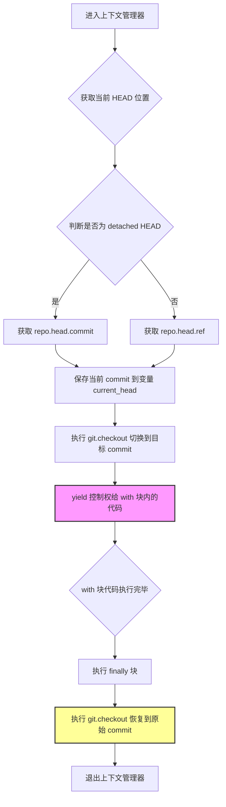

#### 带注释源码

```python
@contextmanager
def checkout_commit(repo: Repo, commit_id: str):
    """
    Context manager that checks out a given commit when entered, but gets back to the reference it was at on exit.

    Args:
        repo (`git.Repo`): A git repository (for instance the Transformers repo).
        commit_id (`str`): The commit reference to checkout inside the context manager.
    """
    # 保存当前 HEAD 的位置，以便后续恢复
    # 如果当前是 detached HEAD 状态，获取 commit 对象；否则获取 ref 对象
    current_head = repo.head.commit if repo.head.is_detached else repo.head.ref

    try:
        # 进入上下文：切换到目标 commit
        repo.git.checkout(commit_id)
        # 将控制权交给 with 块内的代码
        yield

    finally:
        # 无论代码块是否抛出异常，都在 finally 块中恢复到原始 commit
        repo.git.checkout(current_head)
```


### `clean_code`

移除代码中的docstring、空行和注释，用于检测diff是真实代码变更还是仅涉及注释或文档字符串。

参数：

- `content`：`str`，需要清理的代码内容

返回值：`str`，清理后的代码

#### 流程图

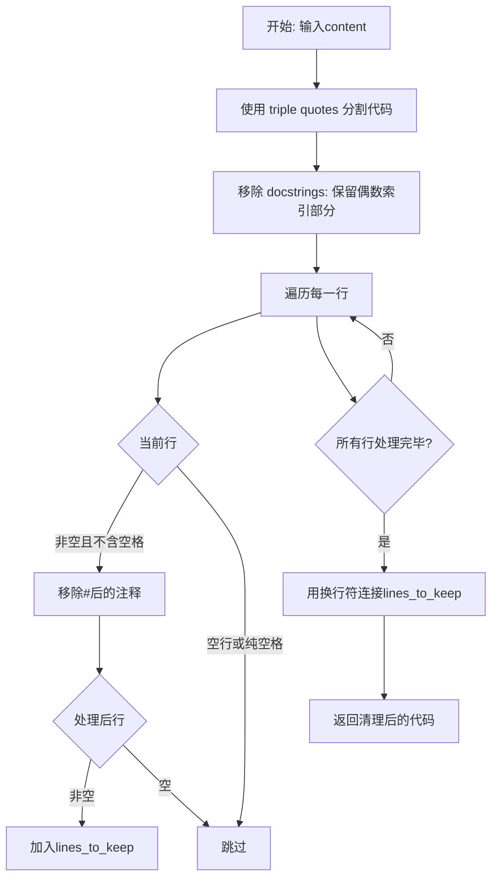

#### 带注释源码

```python
def clean_code(content: str) -> str:
    """
    Remove docstrings, empty line or comments from some code (used to detect if a diff is real or only concern
    comments or docstrings).

    Args:
        content (`str`): The code to clean

    Returns:
        `str`: The cleaned code.
    """
    # We need to deactivate autoformatting here to write escaped triple quotes (we cannot use real triple quotes or
    # this would mess up the result if this function applied to this particular file).
    # fmt: off
    # Remove docstrings by splitting on triple " then triple ':
    splits = content.split('\"\"\"')  # 使用三引号分割字符串
    content = "".join(splits[::2])    # 保留偶数索引部分，即去掉docstring
    splits = content.split("\'\'\'") # 处理单引号三引号
    # fmt: on
    content = "".join(splits[::2])    # 再次保留偶数索引部分

    # Remove empty lines and comments
    lines_to_keep = []                # 初始化待保留的行列表
    for line in content.split("\n"):  # 遍历每一行
        # remove anything that is after a # sign.
        line = re.sub("#.*$", "", line)  # 使用正则表达式移除#后的注释内容
        # remove white lines
        if len(line) != 0 and not line.isspace():  # 如果行非空且不是纯空格
            lines_to_keep.append(line)              # 加入保留列表
    return "\n".join(lines_to_keep)  # 用换行符连接所有保留的行并返回
```


### `keep_doc_examples_only`

从代码内容中提取并保留文档示例（位于三引号内的代码块），移除其他所有内容，用于判断差异是否应触发文档测试。

参数：

- `content`：`str`，需要清理的代码内容

返回值：`str`，仅包含文档示例的清理后代码。

#### 流程图

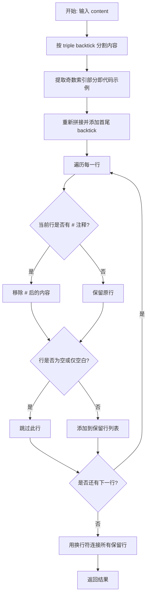

#### 带注释源码

```python
def keep_doc_examples_only(content: str) -> str:
    """
    Remove everything from the code content except the doc examples (used to determined if a diff should trigger doc
    tests or not).

    Args:
        content (`str`): The code to clean

    Returns:
        `str`: The cleaned code.
    """
    # Keep doc examples only by splitting on triple "`"
    # 按三引号分割内容，提取代码示例部分
    splits = content.split("```")
    
    # Add leading and trailing "```" so the navigation is easier when compared to the original input `content`
    # 重新拼接：取索引1,3,5...部分（即代码示例），并在首尾添加 ``` 便于对比
    content = "```" + "```".join(splits[1::2]) + "```"

    # Remove empty lines and comments
    # 移除空行和注释
    lines_to_keep = []
    for line in content.split("\n"):
        # remove anything that is after a # sign.
        # 移除 # 后的所有内容（注释）
        line = re.sub("#.*$", "", line)
        # remove white lines
        # 移除空行或仅含空白的行
        if len(line) != 0 and not line.isspace():
            lines_to_keep.append(line)
    # 返回清理后的文档示例内容
    return "\n".join(lines_to_keep)
```


### `get_all_tests`

该函数用于遍历 `tests` 文件夹，获取所有测试文件/子目录的列表，主要用于并行运行测试时的测试分组。返回结果包括：`tests` 目录下的文件夹（如 `tokenization`、`pipelines`，但排除 `models` 子目录）、`tests/models` 下的模型文件夹（如 `bert`、`gpt2`）以及 `tests` 目录下的测试文件（如 `test_modeling_common.py`、`test_tokenization_common.py`）。

参数： 无

返回值：`List[str]`，返回排序后的测试文件/目录路径列表，路径格式为 `tests/xxx`。

#### 流程图

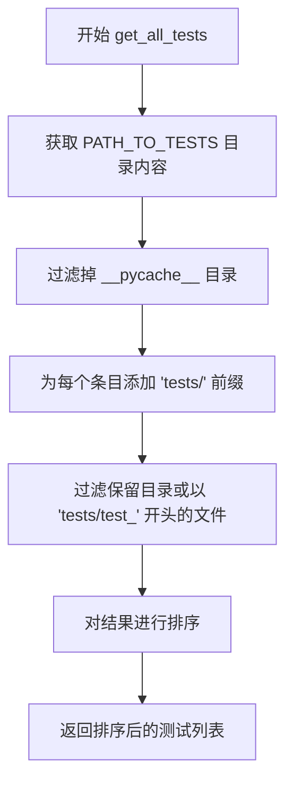

#### 带注释源码

```python
def get_all_tests() -> List[str]:
    """
    Walks the `tests` folder to return a list of files/subfolders. This is used to split the tests to run when using
    parallelism. The split is:

    - folders under `tests`: (`tokenization`, `pipelines`, etc) except the subfolder `models` is excluded.
    - folders under `tests/models`: `bert`, `gpt2`, etc.
    - test files under `tests`: `test_modeling_common.py`, `test_tokenization_common.py`, etc.
    """

    # 列出 tests 文件夹下的所有条目（文件或目录）
    tests = os.listdir(PATH_TO_TESTS)
    
    # 过滤掉 __pycache__ 目录，避免包含缓存文件
    tests = [f"tests/{f}" for f in tests if "__pycache__" not in f]
    
    # 过滤保留：1) 目录；2) 以 'tests/test_' 开头的文件（即测试文件）
    # 并对结果进行字母排序，确保输出顺序一致
    tests = sorted([f for f in tests if (PATH_TO_REPO / f).is_dir() or f.startswith("tests/test_")])

    # 返回排序后的测试文件/目录列表
    return tests
```


### `diff_is_docstring_only`

检查 diff 是否仅在 docstring、注释或空白中，用于过滤掉只修改文档的 PR。

参数：

- `repo`：`git.Repo`，Git 仓库对象（如 Transformers 仓库）
- `branching_point`：`str`，用于比较 diff 的分支点提交引用
- `filename`：`str`，要检查 diff 是否仅在 docstrings/comments 中的文件名

返回值：`bool`，diff 是否仅在 docstring/注释中的布尔值

#### 流程图

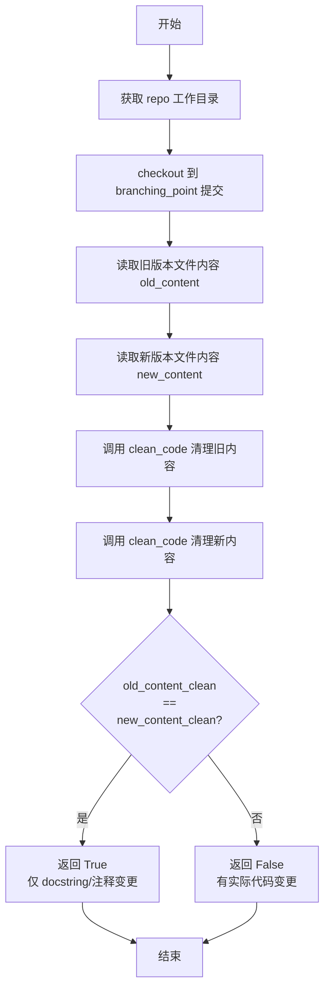

#### 带注释源码

```python
def diff_is_docstring_only(repo: Repo, branching_point: str, filename: str) -> bool:
    """
    Check if the diff is only in docstrings (or comments and whitespace) in a filename.

    Args:
        repo (`git.Repo`): A git repository (for instance the Transformers repo).
        branching_point (`str`): The commit reference of where to compare for the diff.
        filename (`str`): The filename where we want to know if the diff isonly in docstrings/comments.

    Returns:
        `bool`: Whether the diff is docstring/comments only or not.
    """
    # 获取 repo 的工作目录路径
    folder = Path(repo.working_dir)
    
    # 使用 checkout_commit 上下文管理器，切换到 branching_point 提交
    with checkout_commit(repo, branching_point):
        # 读取分支点时的文件旧内容
        with open(folder / filename, "r", encoding="utf-8") as f:
            old_content = f.read()

    # 读取当前工作区的文件新内容
    with open(folder / filename, "r", encoding="utf-8") as f:
        new_content = f.read()

    # 使用 clean_code 函数移除 docstrings、注释和空行
    old_content_clean = clean_code(old_content)
    new_content_clean = clean_code(new_content)

    # 比较清理后的内容是否相同
    # 如果相同，说明 diff 仅在 docstrings/注释/空白中
    return old_content_clean == new_content_clean
```


### `diff_contains_doc_examples`

该函数用于检查代码变更是否仅包含文档中的代码示例（doc examples）。它通过比较文件在分支点（branching point）和当前版本中的文档示例内容，来判断diff是否只涉及文档示例的修改。如果文档示例内容发生变化（即旧内容与新内容不同），则返回 `True`；否则返回 `False`。该函数常与 `get_diff_for_doctesting` 配合使用，用于确定是否需要运行文档测试（doctest）。

参数：

- `repo`：`git.Repo`，Git 仓库对象（例如 Transformers 仓库）
- `branching_point`：`str`，用于比较 diff 的分支点提交引用
- `filename`：`str`，要检查的文件名，用于判断 diff 是否仅在代码示例中

返回值：`bool`，diff 是否仅在文档代码示例中的布尔值

#### 流程图

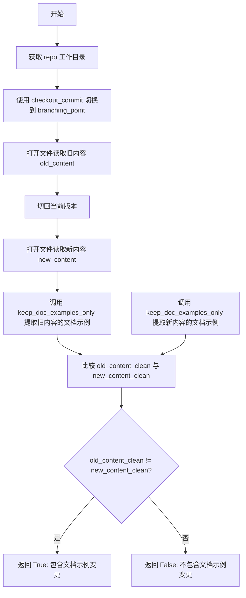

#### 带注释源码

```python
def diff_contains_doc_examples(repo: Repo, branching_point: str, filename: str) -> bool:
    """
    Check if the diff is only in code examples of the doc in a filename.

    Args:
        repo (`git.Repo`): A git repository (for instance the Transformers repo).
        branching_point (`str`): The commit reference of where to compare for the diff.
        filename (`str`): The filename where we want to know if the diff is only in codes examples.

    Returns:
        `bool`: Whether the diff is only in code examples of the doc or not.
    """
    # 获取 repo 的工作目录路径
    folder = Path(repo.working_dir)
    
    # 使用上下文管理器切换到 branching_point 提交，读取该版本的文件内容
    with checkout_commit(repo, branching_point):
        with open(folder / filename, "r", encoding="utf-8") as f:
            old_content = f.read()

    # 读取当前版本（HEAD）的文件内容
    with open(folder / filename, "r", encoding="utf-8") as f:
        new_content = f.read()

    # 提取两个版本中仅包含文档示例（doc examples）的部分
    # keep_doc_examples_only 函数通过分割 "```" 来保留代码块内容
    old_content_clean = keep_doc_examples_only(old_content)
    new_content_clean = keep_doc_examples_only(new_content)

    # 比较文档示例内容是否发生变化
    # 如果不同，说明 diff 包含文档示例的变更
    return old_content_clean != new_content_clean
```


### `get_diff`

获取base_commit与commits列表之间的diff，返回有变动的Python文件列表（新增、删除或修改的文件，修改的文件会过滤掉仅修改了文档字符串或注释的情况）。

参数：

- `repo`：`git.Repo`，Git仓库对象（例如Transformers仓库）
- `base_commit`：`str`，用于比较diff的提交引用（当前提交，而非分支点）
- `commits`：`List[str]`，用于与`base_commit`进行比较的提交列表（即分支点）

返回值：`List[str]`，有diff的Python文件列表（新增、重命名或删除的文件始终返回，修改的文件仅在diff不只是文档字符串或注释时才返回，参见`diff_is_docstring_only`）

#### 流程图

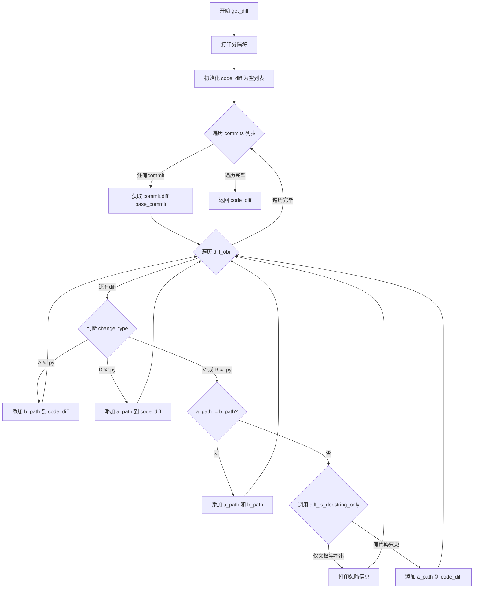

#### 带注释源码

```python
def get_diff(repo: Repo, base_commit: str, commits: List[str]) -> List[str]:
    """
    Get the diff between a base commit and one or several commits.

    Args:
        repo (`git.Repo`):
            A git repository (for instance the Transformers repo).
        base_commit (`str`):
            The commit reference of where to compare for the diff. This is the current commit, not the branching point!
        commits (`List[str]`):
            The list of commits with which to compare the repo at `base_commit` (so the branching point).

    Returns:
        `List[str]`: The list of Python files with a diff (files added, renamed or deleted are always returned, files
        modified are returned if the diff in the file is not only in docstrings or comments, see
        `diff_is_docstring_only`).
    """
    # 打印分隔符，便于日志阅读
    print("\n### DIFF ###\n")
    
    # 存储有变动的Python文件路径
    code_diff = []
    
    # 遍历每个commit（分支点可能有多个）
    for commit in commits:
        # 获取该commit相对于base_commit的diff
        for diff_obj in commit.diff(base_commit):
            # 处理新增的Python文件
            if diff_obj.change_type == "A" and diff_obj.b_path.endswith(".py"):
                code_diff.append(diff_obj.b_path)
            
            # 处理删除的Python文件（可能影响对应测试）
            elif diff_obj.change_type == "D" and diff_obj.a_path.endswith(".py"):
                code_diff.append(diff_obj.a_path)
            
            # 处理修改或重命名的Python文件
            elif diff_obj.change_type in ["M", "R"] and diff_obj.b_path.endswith(".py"):
                # 重命名情况：同时考虑新旧名称的测试
                if diff_obj.a_path != diff_obj.b_path:
                    code_diff.extend([diff_obj.a_path, diff_obj.b_path])
                else:
                    # 检查修改是否只在文档字符串/注释中
                    if diff_is_docstring_only(repo, commit, diff_obj.b_path):
                        print(f"Ignoring diff in {diff_obj.b_path} as it only concerns docstrings or comments.")
                    else:
                        code_diff.append(diff_obj.a_path)

    # 返回有变动的Python文件列表
    return code_diff
```


### `get_modified_python_files`

该函数用于获取当前代码仓库中自特定分支点以来修改过的 Python 文件列表。它通过 Git 操作比较当前 HEAD 与上游主分支（或父提交）之间的差异，排除仅修改了文档字符串或注释的文件，最终返回受影响的 Python 文件路径列表。

参数：

- `diff_with_last_commit`：`bool`，可选参数，默认为 `False`。当为 `False` 时，比较当前 HEAD 与上游主分支的分支点；为 `True` 时，比较当前 HEAD 与其父提交。

返回值：`List[str]`，返回修改过的 Python 文件路径列表。新增、重命名或删除的文件始终会被返回，修改的文件仅在变更内容不仅限于文档字符串或注释时才会返回（参见 `diff_is_docstring_only` 函数）。

#### 流程图

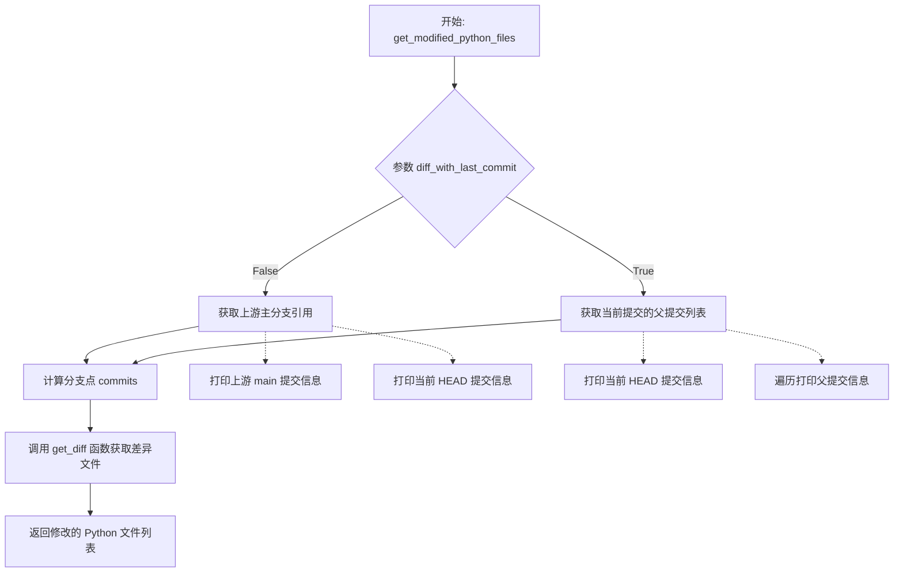

#### 带注释源码

```python
def get_modified_python_files(diff_with_last_commit: bool = False) -> List[str]:
    """
    Return a list of python files that have been modified between:

    - the current head and the main branch if `diff_with_last_commit=False` (default)
    - the current head and its parent commit otherwise.

    Returns:
        `List[str]`: The list of Python files with a diff (files added, renamed or deleted are always returned, files
        modified are returned if the diff in the file is not only in docstrings or comments, see
        `diff_is_docstring_only`).
    """
    # 初始化 Git 仓库对象，使用预定义的仓库路径
    repo = Repo(PATH_TO_REPO)

    # 根据参数决定比较范围：分支点 vs 父提交
    if not diff_with_last_commit:
        # 需要使用远程获取主分支引用（用于 GitHub Actions 环境）
        upstream_main = repo.remotes.origin.refs.main

        # 打印上游 main 分支和当前 HEAD 的提交信息用于调试
        print(f"main is at {upstream_main.commit}")
        print(f"Current head is at {repo.head.commit}")

        # 计算上游 main 分支与当前 HEAD 之间的分支点（共同祖先提交）
        branching_commits = repo.merge_base(upstream_main, repo.head)
        # 打印所有分支点提交
        for commit in branching_commits:
            print(f"Branching commit: {commit}")
        
        # 调用 get_diff 函数获取分支点到 HEAD 之间的差异文件
        return get_diff(repo, repo.head.commit, branching_commits)
    else:
        # 打印当前 HEAD 提交信息
        print(f"main is at {repo.head.commit}")
        # 获取当前提交的父提交列表
        parent_commits = repo.head.commit.parents
        # 打印所有父提交信息
        for commit in parent_commits:
            print(f"Parent commit: {commit}")
        
        # 调用 get_diff 函数获取父提交到 HEAD 之间的差异文件
        return get_diff(repo, repo.head.commit, parent_commits)
```


### `get_diff_for_doctesting`

获取文档示例的diff，用于确定需要运行文档测试的文件。

参数：
- `repo`：`git.Repo`，Git 仓库对象（例如 Transformers 仓库）
- `base_commit`：`str`，用于比较 diff 的提交引用（当前提交，而非分支点）
- `commits`：`List[str]`，要与 `base_commit` 进行比较的提交列表（即分支点）

返回值：`List[str]`，包含 diff 的 Python 和 Markdown 文件列表（新增或重命名的文件始终返回，修改的文件仅在 diff 包含文档示例时才返回）

#### 流程图

```mermaid
flowchart TD
    A[开始 get_diff_for_doctesting] --> B[初始化空列表 code_diff]
    B --> C{遍历 commits 列表}
    C --> D{遍历每个 commit 的 diff 对象}
    D --> E{检查文件类型}
    E --> F{文件是 .py 或 .md?}
    F -->|否| G[跳过该文件]
    F -->|是| H{检查 change_type}
    H --> I[change_type == 'A' 新增文件]
    H --> J[change_type in ['M', 'R'] 修改/重命名]
    I --> K[将新文件添加到 code_diff]
    J --> L{文件是否重命名}
    L -->|是| M[同时添加旧路径和新路径]
    L -->|否| N{检查是否包含文档示例}
    N -->|是| O[将文件添加到 code_diff]
    N -->|否| P[打印忽略信息并跳过]
    M --> Q{继续遍历}
    O --> Q
    G --> Q
    P --> Q
    Q --> D
    C --> R[返回 code_diff 列表]
```

#### 带注释源码

```python
def get_diff_for_doctesting(repo: Repo, base_commit: str, commits: List[str]) -> List[str]:
    """
    Get the diff in doc examples between a base commit and one or several commits.

    Args:
        repo (`git.Repo`):
            A git repository (for instance the Transformers repo).
        base_commit (`str`):
            The commit reference of where to compare for the diff. This is the current commit, not the branching point!
        commits (`List[str]`):
            The list of commits with which to compare the repo at `base_commit` (so the branching point).

    Returns:
        `List[str]`: The list of Python and Markdown files with a diff (files added or renamed are always returned, files
        modified are returned if the diff in the file is only in doctest examples).
    """
    print("\n### DIFF ###\n")
    code_diff = []
    # 遍历所有提交
    for commit in commits:
        # 遍历该提交产生的所有差异对象
        for diff_obj in commit.diff(base_commit):
            # 仅处理 Python 文件和 Markdown 文档文件
            if not diff_obj.b_path.endswith(".py") and not diff_obj.b_path.endswith(".md"):
                continue
            # 对于新增文件（A=Added），直接添加到列表
            if diff_obj.change_type in ["A"]:
                code_diff.append(diff_obj.b_path)
            # 对于修改（M=Modified）或重命名（R=Renamed）的文件
            elif diff_obj.change_type in ["M", "R"]:
                # 如果文件被重命名，同时包含旧路径和新路径
                if diff_obj.a_path != diff_obj.b_path:
                    code_diff.extend([diff_obj.a_path, diff_obj.b_path])
                else:
                    # 否则检查修改是否仅涉及文档示例
                    if diff_contains_doc_examples(repo, commit, diff_obj.b_path):
                        code_diff.append(diff_obj.a_path)
                    else:
                        print(f"Ignoring diff in {diff_obj.b_path} as it doesn't contain any doc example.")

    return code_diff
```


### `get_all_doctest_files`

#### 概述
该函数通过递归扫描代码仓库，筛选出符合特定路径条件（源码或文档）且未被列入黑名单的 Python 和 Markdown 文件，并返回排序后的完整列表，用于执行 doctest。

#### 整体运行流程
1. **文件发现**：使用 `glob` 查找仓库中所有的 `.py` 和 `.md` 文件。
2. **路径过滤**：仅保留路径前缀为 `src/` 或 `docs/source/en/` 的文件。
3. **初始化文件过滤**：排除所有 `__init__.py` 文件。
4. **黑名单读取**：读取 `utils/not_doctested.txt` 文件，获取不应被测试的文件列表。
5. **黑名单过滤**：从候选列表中移除黑名单内的文件。
6. **排序返回**：对最终的文件列表进行排序并返回。

#### 函数详细信息

**名称**: `get_all_doctest_files`

**参数**:
- 无

**返回值**:
- `List[str]`: 包含所有需要运行 doctest 的文件路径（相对于仓库根目录）的排序列表。

#### 流程图

```mermaid
graph TD
    Start([开始]) --> GlobPy[递归查找所有 .py 文件]
    Start --> GlobMd[递归查找所有 .md 文件]
    GlobPy --> Combine[合并文件列表]
    GlobMd --> Combine
    Combine --> FilterPath{路径是否以 src/ 或 docs/source/en/ 开头?}
    FilterPath -- 否 --> Discard[丢弃]
    FilterPath -- 是 --> FilterInit{是否以 __init__.py 结尾?}
    FilterInit -- 是 --> Discard
    FilterInit -- 否 --> ReadBlacklist[读取 utils/not_doctested.txt]
    ReadBlacklist --> ExcludeSet[构建排除集合]
    ExcludeSet --> FilterBlacklist{文件是否在排除集合中?}
    FilterBlacklist -- 是 --> Discard
    FilterBlacklist -- 否 --> Sort[排序列表]
    Sort --> Return([返回 List[str]])
```

#### 带注释源码

```python
def get_all_doctest_files() -> List[str]:
    """
    Return the complete list of python and Markdown files on which we run doctest.

    At this moment, we restrict this to only take files from `src/` or `docs/source/en/` that are not in `utils/not_doctested.txt`.

    Returns:
        `List[str]`: The complete list of Python and Markdown files on which we run doctest.
    """
    # 1. 发现文件：获取仓库中所有 Python 和 Markdown 文件的相对路径
    py_files = [str(x.relative_to(PATH_TO_REPO)) for x in PATH_TO_REPO.glob("**/*.py")]
    md_files = [str(x.relative_to(PATH_TO_REPO)) for x in PATH_TO_REPO.glob("**/*.md")]
    test_files_to_run = py_files + md_files

    # 2. 路径过滤：只保留 src 目录或文档目录下的文件
    test_files_to_run = [x for x in test_files_to_run if x.startswith(("src/", "docs/source/en/"))]
    
    # 3. 过滤初始化文件：排除 __init__.py
    test_files_to_run = [x for x in test_files_to_run if not x.endswith(("__init__.py",))]

    # 4. 读取黑名单：加载尚未支持 doctest 的文件列表
    # These are files not doctested yet.
    with open("utils/not_doctested.txt") as fp:
        # 读取文件，按空格分割取第一部分（文件名），去除空行
        not_doctested = {x.split(" ")[0] for x in fp.read().strip().split("\n")}

    # 5. 黑名单过滤：从待测列表中移除黑名单中的文件
    # So far we don't have 100% coverage for doctest. This line will be removed once we achieve 100%.
    test_files_to_run = [x for x in test_files_to_run if x not in not_doctested]

    # 6. 排序并返回
    return sorted(test_files_to_run)
```

#### 关键组件信息
- **`PATH_TO_REPO`** (`Path`): 全局路径变量，指向代码仓库的根目录。
- **`utils/not_doctested.txt`**: 配置文件，列出了所有不需要运行 doctest 的文件路径（基于空格分隔，第一列为文件名）。

#### 潜在的技术债务或优化空间
1.  **缺乏缓存**：该函数每次调用都会重新扫描文件系统和读取黑名单文件。如果在一次运行中多次调用（例如同时处理多个 PR），这会造成不必要的 I/O 开销。可以考虑将结果缓存或仅在文件更改时重新读取。
2.  **硬编码路径**：`"utils/not_doctested.txt"` 路径硬编码在函数内部，降低了灵活性。
3.  **文件不存在风险**：直接使用 `open` 读取黑名单文件，如果该文件不存在会导致程序崩溃，尽管在当前项目结构下该文件通常存在。

#### 其它项目
- **设计目标与约束**：该函数的设计目标是为 doctest 提供一个“全量”的候选文件池。它严格限制了文件来源（只从 `src` 和 `docs` 获取），以确保只测试项目自身的代码和文档示例。
- **错误处理**：目前缺乏对 `utils/not_doctested.txt` 文件读取失败（不存在或权限错误）的异常处理。
- **数据流**：输出是一个简单的字符串列表，直接传递给下游的测试运行脚本（如 pytest 的 doctest 插件）。


### `get_new_doctest_files`

该函数用于获取从 `utils/not_doctested.txt` 文件中被移除的文件列表，通过比较基础提交（base_commit）和分支提交（branching_commit）之间的差异，找出在该文本文件中被删除的条目。

参数：

- `repo`：`Repo`，Git 仓库对象，用于执行 git 操作
- `base_commit`：基础提交的引用（commit reference），用于比较的起点
- `branching_commit`：分支提交的引用，用于比较的终点

返回值：`List[str]`，从 `utils/not_doctested.txt` 文件中被移除的文件列表（已排序）

#### 流程图

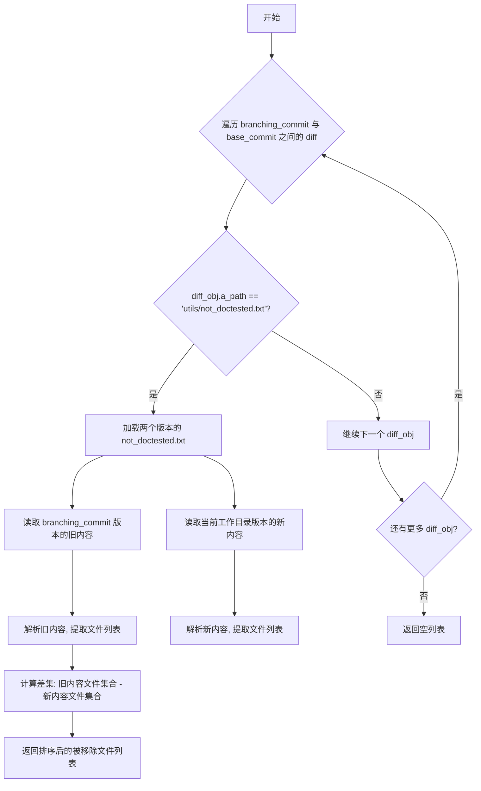

#### 带注释源码

```python
def get_new_doctest_files(repo, base_commit, branching_commit) -> List[str]:
    """
    Get the list of files that were removed from "utils/not_doctested.txt", between `base_commit` and
    `branching_commit`.

    Returns:
        `List[str]`: List of files that were removed from "utils/not_doctested.txt".
    """
    # 遍历两个提交之间的所有差异对象
    for diff_obj in branching_commit.diff(base_commit):
        # 忽略除了 "utils/not_doctested.txt" 之外的所有文件
        if diff_obj.a_path != "utils/not_doctested.txt":
            continue
        # 加载两个版本的文件内容
        folder = Path(repo.working_dir)
        # 使用 checkout_commit 上下文管理器切换到 branching_commit 以读取旧版本
        with checkout_commit(repo, branching_commit):
            with open(folder / "utils/not_doctested.txt", "r", encoding="utf-8") as f:
                old_content = f.read()
        # 读取当前工作目录中的新版本
        with open(folder / "utils/not_doctested.txt", "r", encoding="utf-8") as f:
            new_content = f.read()
        # 计算被移除的内容并返回
        # 解析旧内容，提取每行的第一个元素（文件名）构成集合
        removed_content = {x.split(" ")[0] for x in old_content.split("\n")} - {
            x.split(" ")[0] for x in new_content.split("\n")
        }
        # 返回排序后的被移除文件列表
        return sorted(removed_content)
    # 如果没有找到相关的 diff，返回空列表
    return []
```


### `get_doctest_files`

获取需要运行的doctest文件列表，用于在PR或主分支上运行文档示例测试。该函数通过比较当前提交与主分支（或父提交）的差异，识别出需要测试的Python和Markdown文件，并排除慢速文档测试。

参数：

- `diff_with_last_commit`：`bool`，可选参数（默认为`False`）。当设置为`True`时，表示与上一个提交进行比较（用于主分支）；当设置为`False`时（默认），表示与主分支的分支点进行比较（用于PR）。

返回值：`List[str]`，返回需要运行的Python和Markdown文件列表。这些文件是文档示例被修改过的文件（新增、重命名或修改的文件）。

#### 流程图

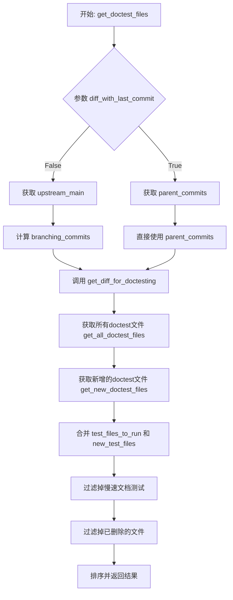

#### 带注释源码

```python
def get_doctest_files(diff_with_last_commit: bool = False) -> List[str]:
    """
    Return a list of python and Markdown files where doc example have been modified between:

    - the current head and the main branch if `diff_with_last_commit=False` (default)
    - the current head and its parent commit otherwise.

    Returns:
        `List[str]`: The list of Python and Markdown files with a diff (files added or renamed are always returned, files
        modified are returned if the diff in the file is only in doctest examples).
    """
    # 初始化git仓库对象
    repo = Repo(PATH_TO_REPO)

    # 初始化测试文件列表
    test_files_to_run = []  # noqa
    
    # 根据参数决定比较的基准提交
    if not diff_with_last_commit:
        # PR场景：获取主分支的远程引用
        upstream_main = repo.remotes.origin.refs.main
        print(f"main is at {upstream_main.commit}")
        print(f"Current head is at {repo.head.commit}")

        # 计算分支点提交（当前分支与主分支的共同祖先）
        branching_commits = repo.merge_base(upstream_main, repo.head)
        for commit in branching_commits:
            print(f"Branching commit: {commit}")
        # 获取文档示例的差异文件
        test_files_to_run = get_diff_for_doctesting(repo, repo.head.commit, branching_commits)
    else:
        # 主分支场景：获取当前提交的父提交
        print(f"main is at {repo.head.commit}")
        parent_commits = repo.head.commit.parents
        for commit in parent_commits:
            print(f"Parent commit: {commit}")
        # 获取文档示例的差异文件
        test_files_to_run = get_diff_for_doctesting(repo, repo.head.commit, parent_commits)

    # 获取所有需要运行doctest的文件
    all_test_files_to_run = get_all_doctest_files()

    # 添加从 "utils/not_doctested.txt" 中移除的文件（这些文件现在开始需要进行doctest）
    new_test_files = get_new_doctest_files(repo, repo.head.commit, upstream_main.commit)
    # 合并并去重
    test_files_to_run = list(set(test_files_to_run + new_test_files))

    # 读取慢速文档测试文件，排除这些测试
    with open("utils/slow_documentation_tests.txt") as fp:
        slow_documentation_tests = set(fp.read().strip().split("\n"))
    # 过滤：只保留在所有doctest文件中且不在慢速测试中的文件
    test_files_to_run = [
        x for x in test_files_to_run if x in all_test_files_to_run and x not in slow_documentation_tests
    ]

    # 确保测试文件实际存在（已删除的文件不应包含在列表中）
    test_files_to_run = [f for f in test_files_to_run if (PATH_TO_REPO / f).exists()]

    # 返回排序后的文件列表
    return sorted(test_files_to_run)
```


### `extract_imports`

从给定模块文件中提取其导入语句，返回该模块导入的其他模块文件名列表。函数通过正则表达式解析相对导入和直接导入，过滤文档字符串和注释，并处理多层相对导入路径。

参数：

- `module_fname`：`str`，模块文件名（相对于仓库根目录），如 `src/diffusers/pipelines/pipeline_utils.py`
- `cache`：`Dict[str, List[str]] | None`，可选，用于缓存之前计算的结果，以加速重复调用

返回值：`List[str]`，导入的模块文件名列表，每个元素为元组 `(模块文件路径, 导入的名称列表)`

#### 流程图

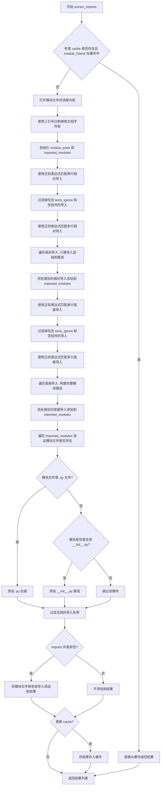

#### 带注释源码

```python
def extract_imports(module_fname: str, cache: Dict[str, List[str]] = None) -> List[str]:
    """
    获取给定模块所做的导入。

    参数:
        module_fname (`str`):
            要查看导入的模块文件的名称（相对于仓库根目录）。
        cache (Dictionary `str` to `List[str]`, *optional*):
            如果之前已对 module_fname 调用过此函数，为加速可以传入缓存的之前计算结果。

    返回:
        `List[str]`: 输入 module_fname 中导入的模块文件名列表（从子模块导入的子文件夹将给出其 init 文件）。
    """
    # 如果缓存存在且该模块已在缓存中，直接返回缓存结果
    if cache is not None and module_fname in cache:
        return cache[module_fname]

    # 打开并读取模块文件内容
    with open(PATH_TO_REPO / module_fname, "r", encoding="utf-8") as f:
        content = f.read()

    # 过滤掉所有文档字符串以避免获取代码示例中的导入
    # 使用 split 分割三引号，保留偶数索引部分（即文档字符串之外的内容）
    splits = content.split('"""')
    content = "".join(splits[::2])

    # 将模块文件名分割为路径部分
    module_parts = str(module_fname).split(os.path.sep)
    imported_modules = []

    # 首先处理相对导入
    # 使用正则表达式匹配单行相对导入: from .xxx import yyy
    relative_imports = _re_single_line_relative_imports.findall(content)
    # 过滤掉包含 tests_ignore 注释和空括号的导入
    relative_imports = [
        (mod, imp) for mod, imp in relative_imports if "# tests_ignore" not in imp and imp.strip() != "("
    ]
    # 使用正则表达式匹配多行相对导入: from .xxx import (yyy)
    multiline_relative_imports = _re_multi_line_relative_imports.findall(content)
    relative_imports += [(mod, imp) for mod, imp in multiline_relative_imports if "# tests_ignore" not in imp]

    # 根据相对导入的深度移除模块名称的部分
    for module, imports in relative_imports:
        level = 0
        # 计算相对导入的层级（点号的数量）
        while module.startswith("."):
            module = module[1:]
            level += 1

        # 构建依赖模块的路径
        if len(module) > 0:
            dep_parts = module_parts[: len(module_parts) - level] + module.split(".")
        else:
            dep_parts = module_parts[: len(module_parts) - level]
        imported_module = os.path.sep.join(dep_parts)
        # 将模块路径和导入的名称列表添加到结果中
        imported_modules.append((imported_module, [imp.strip() for imp in imports.split(",")]))

    # 继续处理直接导入（从 diffusers 导入）
    # 使用正则表达式匹配单行直接导入: from diffusers.xxx import yyy
    direct_imports = _re_single_line_direct_imports.findall(content)
    direct_imports = [(mod, imp) for mod, imp in direct_imports if "# tests_ignore" not in imp and imp.strip() != "("]
    # 使用正则表达式匹配多行直接导入
    multiline_direct_imports = _re_multi_line_direct_imports.findall(content)
    direct_imports += [(mod, imp) for mod, imp in multiline_direct_imports if "# tests_ignore" not in imp]

    # 找到这些导入的相对路径
    for module, imports in direct_imports:
        import_parts = module.split(".")[1:]  # 忽略仓库名称
        dep_parts = ["src", "diffusers"] + import_parts
        imported_module = os.path.sep.join(dep_parts)
        imported_modules.append((imported_module, [imp.strip() for imp in imports.split(",")]))

    result = []
    # 再次检查确保得到正确的模块（Python 文件或带 init 的文件夹）
    for module_file, imports in imported_modules:
        # 检查是否是 Python 文件
        if (PATH_TO_REPO / f"{module_file}.py").is_file():
            module_file = f"{module_file}.py"
        # 检查是否是带有 __init__.py 的目录
        elif (PATH_TO_REPO / module_file).is_dir() and (PATH_TO_REPO / module_file / "__init__.py").is_file():
            module_file = os.path.sep.join([module_file, "__init__.py"])
        # 过滤无效的导入名称（只保留字母数字下划线）
        imports = [imp for imp in imports if len(imp) > 0 and re.match("^[A-Za-z0-9_]*$", imp)]
        if len(imports) > 0:
            result.append((module_file, imports))

    # 如果有缓存，更新缓存
    if cache is not None:
        cache[module_fname] = result

    return result
```


### `get_module_dependencies`

获取模块的依赖列表，递归遍历 `__init__.py` 文件以解析子模块的真实依赖源，返回精炼后的模块文件名列表。

参数：

- `module_fname`：`str`，模块文件名（相对于代码库根目录），表示要分析其依赖的模块。
- `cache`：`Dict[str, List[str]] | None`，可选参数，用于缓存已处理过的模块的导入结果，以加速后续相同模块的查询。

返回值：`List[str]`，返回精炼后的模块依赖文件路径列表。

#### 流程图

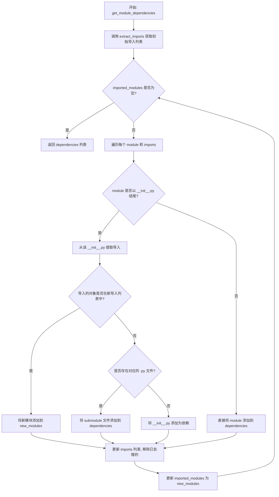

#### 带注释源码

```python
def get_module_dependencies(module_fname: str, cache: Dict[str, List[str]] = None) -> List[str]:
    """
    Refines the result of `extract_imports` to remove subfolders and get a proper list of module filenames: if a file
    as an import `from utils import Foo, Bar`, with `utils` being a subfolder containing many files, this will traverse
    the `utils` init file to check where those dependencies come from: for instance the files utils/foo.py and utils.bar.py.

    Warning: This presupposes that all intermediate inits are properly built (with imports from the respective
    submodules) and work better if objects are defined in submodules and not the intermediate init (otherwise the
    intermediate init is added, and inits usually have a lot of dependencies).

    Args:
        module_fname (`str`):
            The name of the file of the module where we want to look at the imports (given relative to the root of
            the repo).
        cache (Dictionary `str` to `List[str]`, *optional*):
            To speed up this function if it was previously called on `module_fname`, the cache of all previously
            computed results.

    Returns:
        `List[str]`: The list of module filenames imported in the input `module_fname` (with submodule imports refined).
    """
    # 初始化依赖列表
    dependencies = []
    # 调用 extract_imports 获取该模块的直接导入列表
    imported_modules = extract_imports(module_fname, cache=cache)
    
    # 使用 while 循环递归遍历所有遇到的 __init__.py 文件
    # 目的是解析出子模块的真实依赖
    while len(imported_modules) > 0:
        new_modules = []
        # 遍历当前导入的模块和对应的导入对象
        for module, imports in imported_modules:
            # 如果是 __init__.py 文件，说明我们导入的是整个包
            # 需要进一步解析这些对象来自哪些子模块
            if module.endswith("__init__.py"):
                # 从该 __init__.py 中提取它自己的导入
                new_imported_modules = extract_imports(module, cache=cache)
                # 检查哪些导入对象来自这些新模块
                for new_module, new_imports in new_imported_modules:
                    # 如果新模块中有我们需要的对象
                    if any(i in new_imports for i in imports):
                        if new_module not in dependencies:
                            # 添加新模块到待处理列表
                            new_modules.append((new_module, [i for i in new_imports if i in imports]))
                        # 从 imports 中移除已处理的对象
                        imports = [i for i in imports if i not in new_imports]
                
                # 如果还有剩余的导入对象
                if len(imports) > 0:
                    # 检查这些对象是否对应独立的 .py 子模块文件
                    path_to_module = PATH_TO_REPO / module.replace("__init__.py", "")
                    dependencies.extend(
                        [
                            os.path.join(module.replace("__init__.py", ""), f"{i}.py")
                            for i in imports
                            if (path_to_module / f"{i}.py").is_file()
                        ]
                    )
                    # 再次过滤，移除已是子模块文件的导入
                    imports = [i for i in imports if not (path_to_module / f"{i}.py").is_file()]
                    
                    # 如果还有剩余，说明这些对象完全定义在 __init__.py 中
                    # 将该 __init__.py 保留为依赖
                    if len(imports) > 0:
                        dependencies.append(module)
            else:
                # 非 __init__.py 文件，直接添加为依赖
                dependencies.append(module)

        # 更新 imported_modules 为新发现的需要进一步解析的模块
        imported_modules = new_modules

    return dependencies
```


### `create_reverse_dependency_tree`

创建反向依赖树边列表，遍历所有模块和测试文件，生成表示模块间影响关系的边列表 (a, b)，其中 a 表示被依赖的模块，b 表示受影响（依赖 a）的模块。

参数： 无

返回值：`List[Tuple[str, str]]`，返回所有边的列表，每条边是一个元组 `(被依赖模块, 依赖模块)`，表示修改被依赖模块会影响依赖模块。

#### 流程图

```mermaid
flowchart TD
    A[开始] --> B[初始化空缓存 cache]
    B --> C[获取所有 diffusers 模块]
    C --> D[获取所有测试模块]
    D --> E[合并所有 Python 模块]
    E --> F[遍历每个模块]
    F --> G[调用 get_module_dependencies 获取依赖]
    G --> H[构建边: (dep, mod)]
    H --> I{还有更多模块?}
    I -->|是| F
    I --> J[去重返回边列表]
    J --> K[结束]
```

#### 带注释源码

```python
def create_reverse_dependency_tree() -> List[Tuple[str, str]]:
    """
    Create a list of all edges (a, b) which mean that modifying a impacts b with a going over all module and test files.
    """
    # 初始化一个本地缓存字典，用于存储模块依赖关系以加速后续查询
    cache = {}
    
    # 获取 src/diffusers 目录下所有的 Python 文件（模块）
    all_modules = list(PATH_TO_DIFFUSERS.glob("**/*.py"))
    
    # 获取 tests 目录下所有的 Python 文件（测试）
    all_modules += list(PATH_TO_TESTS.glob("**/*.py"))
    
    # 将绝对路径转换为相对于仓库根目录的路径字符串
    all_modules = [str(mod.relative_to(PATH_TO_REPO)) for mod in all_modules]
    
    # 构建边列表：对于每个模块 mod，获取它的所有依赖 dep
    # 边 (dep, mod) 表示：修改 dep 会影响 mod（即 mod 依赖 dep）
    edges = [(dep, mod) for mod in all_modules for dep in get_module_dependencies(mod, cache=cache)]
    
    # 使用 set 去重，然后转回列表返回
    return list(set(edges))
```


### `get_tree_starting_at`

该函数用于根据给定的模块和依赖关系边列表，构建并返回从指定模块开始的依赖树结构。它通过迭代遍历边来获取所有直接或间接依赖于该模块的下游模块，排除 `__init__.py` 文件以避免循环依赖。

参数：

- `module`：`str`，作为子树根节点的模块名称
- `edges`：`List[Tuple[str, str]]`，包含所有依赖边的列表，每条边表示为 (上游模块, 下游模块) 的元组

返回值：`List[Union[str, List[str]]]`，返回的树结构，格式为 `[根模块, 第一层边列表, 第二层边列表, ...]`

#### 流程图

```mermaid
flowchart TD
    A[开始] --> B[初始化 vertices_seen = [module]]
    B --> C[查找以 module 为起点的边，排除 module 本身和 __init__.py]
    C --> D[tree = [module]]
    D --> E{new_edges 是否为空?}
    E -->|是| F[返回 tree]
    E -->|否| G[将 new_edges 添加到 tree]
    G --> H[提取 new_edges 的目标顶点]
    H --> I[将目标顶点加入 vertices_seen]
    I --> J[查找以新顶点为起点、去重且排除 __init__.py 的边]
    J --> E
```

#### 带注释源码

```python
def get_tree_starting_at(module: str, edges: List[Tuple[str, str]]) -> List[Union[str, List[str]]]:
    """
    Returns the tree starting at a given module following all edges.

    Args:
        module (`str`): The module that will be the root of the subtree we want.
        edges (`List[Tuple[str, str]]`): The list of all edges of the tree.

    Returns:
        `List[Union[str, List[str]]]`: The tree to print in the following format: [module, [list of edges
        starting at module], [list of edges starting at the preceding level], ...]
    """
    # 初始化已访问顶点列表，防止循环依赖
    vertices_seen = [module]
    
    # 筛选以输入 module 为起点的边，排除自环和 __init__.py 文件
    new_edges = [
        edge for edge in edges 
        if edge[0] == module and edge[1] != module and "__init__.py" not in edge[1]
    ]
    
    # 树的第一个元素是根模块
    tree = [module]
    
    # 迭代遍历：每层找到当前顶点的下游依赖，直到没有新的边为止
    while len(new_edges) > 0:
        # 将当前层的边添加到树结构中
        tree.append(new_edges)
        
        # 提取当前层所有边的目标顶点（去重）
        final_vertices = list({edge[1] for edge in new_edges})
        
        # 标记已访问的顶点，防止重复遍历
        vertices_seen.extend(final_vertices)
        
        # 查找以新顶点为起点的下一层边
        new_edges = [
            edge
            for edge in edges
            if edge[0] in final_vertices          # 起点在新顶点集合中
            and edge[1] not in vertices_seen     # 目标顶点未被访问过
            and "__init__.py" not in edge[1]    # 排除 __init__.py 文件
        ]

    return tree
```


### `print_tree_deps_of`

打印给定模块的依赖树，以树形结构展示所有依赖该模块的其他模块。

参数：

- `module`：`str`，要打印依赖树的根模块名称
- `all_edges`：`List[Tuple[str, str]]` 或 `None`，可选，树的边列表，如果不传则自动调用 `create_reverse_dependency_tree()` 生成

返回值：`None`，该函数直接打印结果到标准输出

#### 流程图

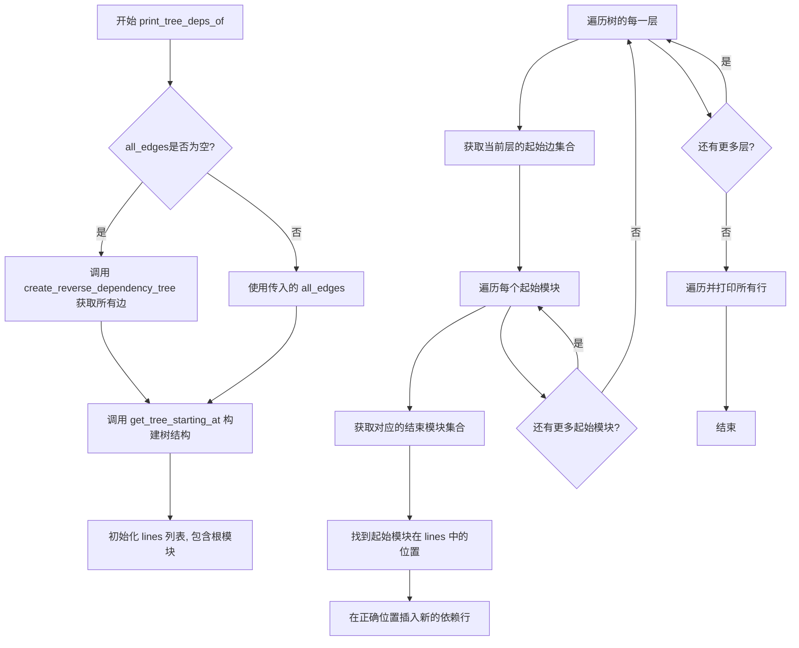

#### 带注释源码

```python
def print_tree_deps_of(module, all_edges=None):
    """
    Prints the tree of modules depending on a given module.

    Args:
        module (`str`): The module that will be the root of the subtree we want.
        all_edges (`List[Tuple[str, str]]`, *optional*):
            The list of all edges of the tree. Will be set to `create_reverse_dependency_tree()` if not passed.
    """
    # 如果没有传入 all_edges，则自动创建完整的反向依赖树
    if all_edges is None:
        all_edges = create_reverse_dependency_tree()
    
    # 获取以指定模块为起点的依赖树结构
    tree = get_tree_starting_at(module, all_edges)

    # lines 列表存储要打印的每一行，格式为 (打印内容, 模块名)
    # 保存模块名可以帮助我们知道在哪里插入新行
    lines = [(tree[0], tree[0])]
    
    # 从第二层开始遍历树的每一层（第一层是根节点）
    for index in range(1, len(tree)):
        edges = tree[index]
        # 获取当前层所有边的起始模块集合
        start_edges = {edge[0] for edge in edges}

        # 遍历每个起始模块
        for start in start_edges:
            # 获取从该起始模块出发的所有结束模块
            end_edges = {edge[1] for edge in edges if edge[0] == start}
            
            # 找到起始模块在 lines 列表中的位置
            pos = 0
            while lines[pos][1] != start:
                pos += 1
            
            # 在起始模块所在行之后插入新的依赖行
            # 使用缩进表示层级关系（2 * index 个空格）
            lines = (
                lines[: pos + 1] 
                + [(" " * (2 * index) + end, end) for end in end_edges] 
                + lines[pos + 1 :]
            )

    # 逐行打印，line[0] 是要打印的内容，line[1] 是模块名（仅用于构建结构）
    for line in lines:
        # 只打印用于显示的内容，不打印用于构建的模块引用
        print(line[0])
```


### `init_test_examples_dependencies`

该函数用于初始化测试示例的依赖关系映射。由于测试示例不从 examples 目录（它们只是脚本，不是模块）导入，因此需要额外的处理来构建依赖映射。该函数通过将每个示例链接到对应示例框架的测试文件来初始化示例文件的依赖映射。

参数：此函数无参数。

返回值：`Tuple[Dict[str, List[str]], List[str]]`，返回一个元组，包含两个元素：
- 第一个元素是初始化后的依赖映射字典，键为测试示例文件，值为可能被该测试文件测试的示例文件列表
- 第二个元素是所有示例文件的列表（用于避免后续重复计算）

#### 流程图

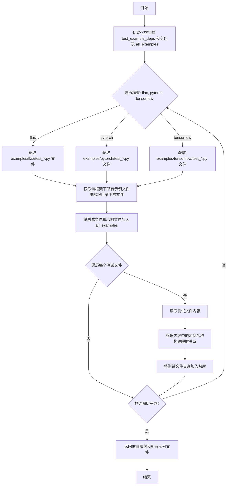

#### 带注释源码

```python
def init_test_examples_dependencies() -> Tuple[Dict[str, List[str]], List[str]]:
    """
    测试示例不从 examples 导入（它们只是脚本而非模块），
    因此需要额外初始化依赖映射，这就是该函数的目标。
    它通过将每个示例链接到对应示例框架的测试文件来初始化示例文件的依赖映射。

    返回:
        `Tuple[Dict[str, List[str]], List[str]]`: 
        包含两个元素的元组：
        - 第一个元素是初始化后的依赖映射字典，键为测试示例文件路径，
          值为可能被该测试文件测试的示例文件列表
        - 第二个元素是所有示例文件的列表（用于避免后续重复计算）
    """
    # 初始化空字典用于存储测试文件到示例文件的映射
    test_example_deps = {}
    # 初始化空列表用于存储所有示例文件
    all_examples = []
    
    # 遍历支持的深度学习框架：flax、pytorch、tensorflow
    for framework in ["flax", "pytorch", "tensorflow"]:
        # 获取该框架下的所有测试文件 (test_*.py)
        test_files = list((PATH_TO_EXAMPLES / framework).glob("test_*.py"))
        
        # 将测试文件添加到所有示例列表中
        all_examples.extend(test_files)
        
        # 获取该框架下所有的示例文件
        # 排除 examples/framework 根目录下的文件，因为它们不是真正的示例
        # （它们是工具或示例测试文件）
        examples = [
            f for f in (PATH_TO_EXAMPLES / framework).glob("**/*.py") 
            if f.parent != PATH_TO_EXAMPLES / framework
        ]
        
        # 将找到的示例文件添加到所有示例列表
        all_examples.extend(examples)
        
        # 遍历每个测试文件，构建依赖映射
        for test_file in test_files:
            # 读取测试文件内容，用于查找关联的示例
            with open(test_file, "r", encoding="utf-8") as f:
                content = f.read()
            
            # 将所有示例映射到在 examples/framework 中找到的测试文件
            # 根据测试文件内容中是否包含示例文件名来确定映射关系
            test_example_deps[str(test_file.relative_to(PATH_TO_REPO))] = [
                str(e.relative_to(PATH_TO_REPO)) 
                for e in examples 
                if e.name in content
            ]
            
            # 还将测试文件自身加入到映射中
            test_example_deps[str(test_file.relative_to(PATH_TO_REPO))].append(
                str(test_file.relative_to(PATH_TO_REPO))
            )
    
    # 返回构建好的依赖映射和所有示例文件列表
    return test_example_deps, all_examples
```


### `create_reverse_dependency_map`

创建反向依赖映射字典，将每个模块/测试文件名映射到递归依赖它的所有模块/测试列表。

参数：  
该函数没有参数。

返回值：`dict[str, List[str]]`，返回反向依赖映射字典，其中键是文件名，值是依赖于该文件的所有文件列表。这样，当文件 A 发生变化时，受影响的测试就是该字典中键 A 对应的值。

#### 流程图

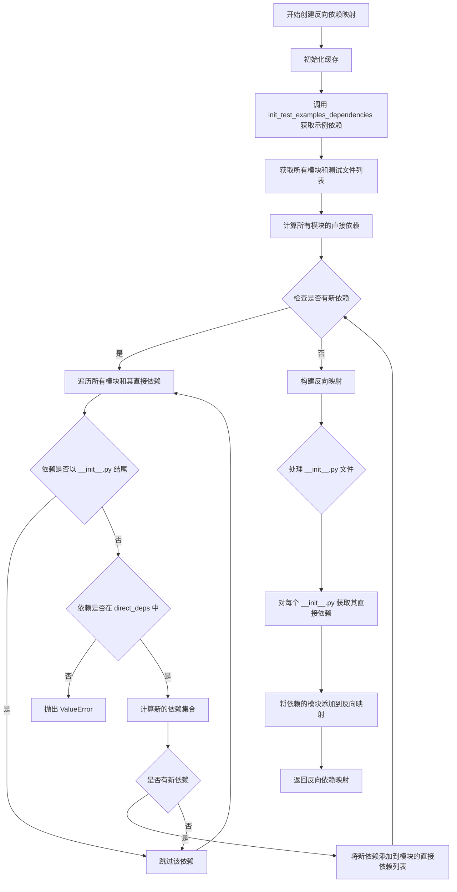

#### 带注释源码

```python
def create_reverse_dependency_map() -> dict[str, List[str]]:
    """
    Create the dependency map from module/test filename to the list of modules/tests that depend on it recursively.

    Returns:
        `Dict[str, List[str]]`: The reverse dependency map as a dictionary mapping filenames to all the filenames
        depending on it recursively. This way the tests impacted by a change in file A are the test files in the list
        corresponding to key A in this result.
    """
    # 初始化缓存，用于存储已解析的模块依赖结果
    cache = {}
    
    # 从示例依赖初始化开始，获取示例文件及其测试依赖关系
    example_deps, examples = init_test_examples_dependencies()
    
    # 获取所有模块和测试文件：diffusers源码 + tests目录 + 示例文件
    all_modules = list(PATH_TO_DIFFUSERS.glob("**/*.py")) + list(PATH_TO_TESTS.glob("**/*.py")) + examples
    # 转换为相对路径字符串
    all_modules = [str(mod.relative_to(PATH_TO_REPO)) for mod in all_modules]
    
    # 计算所有模块的直接依赖（递归解析imports）
    direct_deps = {m: get_module_dependencies(m, cache=cache) for m in all_modules}
    # 更新示例依赖关系
    direct_deps.update(example_deps)

    # 递归展开依赖关系，直到没有新依赖添加为止
    something_changed = True
    while something_changed:
        something_changed = False
        for m in all_modules:
            for d in direct_deps[m]:
                # 遇到 __init__.py 停止递归（避免将主init导入的所有文件都加入）
                if d.endswith("__init__.py"):
                    continue
                # 检查依赖是否存在于映射中
                if d not in direct_deps:
                    raise ValueError(f"KeyError:{d}. From {m}")
                # 计算新的依赖：取依赖d的所有依赖，减去已存在的依赖
                new_deps = set(direct_deps[d]) - set(direct_deps[m])
                if len(new_deps) > 0:
                    # 添加新依赖并标记有变化，需要继续迭代
                    direct_deps[m].extend(list(new_deps))
                    something_changed = True

    # 构建反向映射：key是被依赖的文件，value是依赖它的文件列表
    reverse_map = collections.defaultdict(list)
    for m in all_modules:
        for d in direct_deps[m]:
            reverse_map[d].append(m)

    # 特殊处理 __init__.py 文件：使用直接依赖而非反向依赖
    # 这样修改init时，能测试所有受该init影响的模块
    for m in [f for f in all_modules if f.endswith("__init__.py")]:
        direct_deps = get_module_dependencies(m, cache=cache)
        deps = sum([reverse_map[d] for d in direct_deps if not d.endswith("__init__.py")], direct_deps)
        reverse_map[m] = list(set(deps) - {m})

    return reverse_map
```


### `create_module_to_test_map`

该函数用于从逆向依赖映射中提取测试，并支持对模型测试进行潜在过滤。它接受一个可选的逆向依赖映射参数，如果未提供则自动创建，然后通过内部定义的 `is_test` 辅助函数判断文件是否为测试文件，最后构建并返回一个将每个模块映射到其相关测试文件的字典。

参数：

- `reverse_map`：`Dict[str, List[str]]`，可选，逆依赖映射，由 `create_reverse_dependency_map` 函数创建。如果未提供，默认使用该函数的结果。

返回值：`dict[str, List[str]]`，一个字典，将每个文件映射到如果该文件被修改则需要执行的测试列表。

#### 流程图

```mermaid
flowchart TD
    A[开始: create_module_to_test_map] --> B{reverse_map 是否为 None?}
    B -- 是 --> C[调用 create_reverse_dependency_map 创建逆依赖映射]
    B -- 否 --> D[使用传入的 reverse_map]
    C --> E[定义内部函数 is_test fname]
    E --> F[遍历 reverse_map 中的每个模块和依赖]
    F --> G{判断 f 是否为测试文件?}
    G -- 是 --> H[将 f 添加到测试列表]
    G -- 否 --> I[跳过该文件]
    H --> F
    I --> J{是否还有未处理的模块?}
    J -- 是 --> F
    J -- 否 --> K[返回 test_map 字典]
    D --> E
```

#### 带注释源码

```python
def create_module_to_test_map(reverse_map: Dict[str, List[str]] = None) -> dict[str, List[str]]:
    """
    Extract the tests from the reverse_dependency_map and potentially filters the model tests.

    Args:
        reverse_map (`Dict[str, List[str]]`, *optional*):
            The reverse dependency map as created by `create_reverse_dependency_map`. Will default to the result of
            that function if not provided.
        filter_pipelines (`bool`, *optional*, defaults to `False`):
            Whether or not to filter pipeline tests to only include core pipelines if a file impacts a lot of models.

    Returns:
        `Dict[str, List[str]]`: A dictionary that maps each file to the tests to execute if that file was modified.
    """
    # 如果没有提供 reverse_map，则调用 create_reverse_dependency_map 创建
    if reverse_map is None:
        reverse_map = create_reverse_dependency_map()

    # 内部辅助函数：判断给定的文件名是否为测试文件
    # 考虑了两类测试：1) tests 目录下的测试 2) examples 目录下以 test 开头的文件
    def is_test(fname):
        # 如果文件以 tests 开头，则是测试文件
        if fname.startswith("tests"):
            return True
        # 如果文件以 examples 开头，且文件名以 test 开头，也是测试文件
        if fname.startswith("examples") and fname.split(os.path.sep)[-1].startswith("test"):
            return True
        return False

    # 构建测试映射：对每个模块，找出其依赖中所有是测试的文件
    # 使用字典推导式遍历 reverse_map 中的每个 module 及其依赖 deps
    test_map = {module: [f for f in deps if is_test(f)] for module, deps in reverse_map.items()}

    return test_map
```


### `check_imports_all_exist`

该函数用于验证代码库中所有模块的导入依赖是否实际存在。它扫描 diffusers 和 tests 目录下的所有 Python 文件，提取每个文件的直接依赖项，然后检查这些依赖项对应的文件是否存在于文件系统中。如果发现不存在的依赖项，则输出警告信息。

参数：
- 该函数无参数

返回值：`None`，该函数没有返回值，仅通过 `print` 输出依赖检查结果

#### 流程图

```mermaid
flowchart TD
    A[开始] --> B[初始化空缓存字典 cache]
    B --> C[获取所有 diffusers 模块]
    C --> D[获取所有测试模块]
    D --> E[合并为 all_modules 列表]
    E --> F[对每个模块调用 get_module_dependencies 获取直接依赖]
    F --> G[构建 direct_deps 字典: module -> [deps]]
    G --> H[遍历 direct_deps 中的每个 module 和其 deps]
    H --> I{遍历每个 dep}
    I --> J{检查依赖文件是否存在}
    J -->|不存在| K[打印警告: module has dependency on dep which does not exist]
    J -->|存在| L[继续下一个 dep]
    K --> L
    I --> M{检查下一个 dep}
    M --> H
    H --> N[结束]
```

#### 带注释源码

```python
def check_imports_all_exist():
    """
    Isn't used per se by the test fetcher but might be used later as a quality check. Putting this here for now so the
    code is not lost. This checks all imports in a given file do exist.
    """
    # 初始化缓存字典，用于存储已解析的模块依赖关系，避免重复计算
    cache = {}
    
    # 获取 diffusers 目录下所有的 Python 文件（包含子目录）
    all_modules = list(PATH_TO_DIFFUSERS.glob("**/*.py"))
    
    # 获取 tests 目录下所有的 Python 文件（包含子目录）
    all_modules += list(PATH_TO_TESTS.glob("**/*.py"))
    
    # 将绝对路径转换为相对于仓库根目录的路径字符串
    all_modules = [str(mod.relative_to(PATH_TO_REPO)) for mod in all_modules]
    
    # 构建直接依赖字典：key 是模块路径，value 是该模块的直接依赖列表
    # 这里会调用 get_module_dependencies 函数来递归解析所有导入
    direct_deps = {m: get_module_dependencies(m, cache=cache) for m in all_modules}

    # 遍历所有模块及其依赖项
    for module, deps in direct_deps.items():
        # 检查每个依赖项
        for dep in deps:
            # 判断依赖的文件路径是否在文件系统中存在
            if not (PATH_TO_REPO / dep).is_file():
                # 如果依赖不存在，打印警告信息
                print(f"{module} has dependency on {dep} which does not exist.")
```


### `_print_list`

该函数用于美化打印列表，将列表中的每个元素转换为带有短横线前缀的单行字符串，常用于测试结果的友好展示。

参数：

- `l`：`List[Any]`，需要打印的元素列表

返回值：`str`，格式化后的字符串，每个元素前加上 "- " 前缀

#### 流程图

```mermaid
graph TD
    A[开始] --> B[接收列表 l]
    B --> C[对列表中每个元素 f 进行格式化]
    C --> D[将 f 转换为 '- f' 格式]
    D --> E[使用换行符 join 所有格式化后的元素]
    F[返回最终字符串] --> E
```

#### 带注释源码

```python
def _print_list(l) -> str:
    """
    Pretty print a list of elements with one line per element and a - starting each line.
    
    参数:
        l: 需要格式化的列表
        
    返回值:
        str: 格式化后的字符串，每个元素前带有 '- ' 前缀
    """
    # 使用列表推导式将每个元素转换为 '- {元素}' 格式
    # 然后用换行符 '\n' 连接所有元素
    return "\n".join([f"- {f}" for f in l])
```


### `update_test_map_with_core_pipelines`

该函数用于更新测试映射文件，添加核心pipeline测试组并从普通pipeline测试中移除核心pipeline测试，以确保在测试筛选时优先运行重要的核心模型pipeline测试。

参数：

- `json_output_file`：`str`，JSON输出文件的路径，用于存储测试映射关系

返回值：`None`，该函数无返回值，直接修改JSON文件

#### 流程图

```mermaid
flowchart TD
    A[开始] --> B[打印IMPORTANT_PIPELINES列表]
    B --> C[以二进制模式打开json_output_file]
    C --> D[加载JSON数据到test_map]
    E[添加core_pipelines键值对] --> E2{检查pipelines键是否存在?}
    E2 -->|不存在| F[直接保存test_map到文件]
    E2 -->|存在| G[弹出pipelines值并分割]
    G --> H[遍历pipeline_tests]
    H --> I{判断是否为core_pipeline?}
    I -->|是| J[跳过不添加到updated_pipeline_tests]
    I -->|否| K[添加到updated_pipeline_tests]
    J --> H
    K --> H
    H --> L{处理完毕?}
    L -->|否| H
    L -->|是| M{updated_pipeline_tests非空?}
    M -->|是| N[添加pipelines键并排序]
    M -->|否| O[不添加pipelines键]
    N --> P[保存test_map到文件]
    O --> P
    P --> Q[结束]
    F --> Q
```

#### 带注释源码

```python
def update_test_map_with_core_pipelines(json_output_file: str):
    """
    更新测试映射，添加核心pipeline测试组，并从普通pipeline测试中过滤掉核心pipeline测试。
    
    Args:
        json_output_file (str): JSON输出文件的路径，用于存储测试映射关系。
    """
    # 打印重要pipeline列表（用于日志输出）
    print(f"\n### ADD CORE PIPELINE TESTS ###\n{_print_list(IMPORTANT_PIPELINES)}")
    
    # 读取现有的测试映射JSON文件
    with open(json_output_file, "rb") as fp:
        test_map = json.load(fp)

    # 添加核心pipeline作为独立的测试组
    # IMPORTANT_PIPELINES是预先定义的重要pipeline列表
    test_map["core_pipelines"] = " ".join(
        sorted([str(PATH_TO_TESTS / f"pipelines/{pipe}") for pipe in IMPORTANT_PIPELINES])
    )

    # 如果没有现有的pipeline测试，直接保存映射并返回
    if "pipelines" not in test_map:
        with open(json_output_file, "w", encoding="UTF-8") as fp:
            json.dump(test_map, fp, ensure_ascii=False)

    # 取出pipeline测试列表并分割为数组
    pipeline_tests = test_map.pop("pipelines")
    pipeline_tests = pipeline_tests.split(" ")

    # 从fetched的pipeline测试中移除核心pipeline测试
    # 避免核心pipeline被重复测试
    updated_pipeline_tests = []
    for pipe in pipeline_tests:
        # 跳过tests/pipelines目录本身，以及属于核心pipeline的测试
        if pipe == "tests/pipelines" or Path(pipe).parts[2] in IMPORTANT_PIPELINES:
            continue
        updated_pipeline_tests.append(pipe)

    # 如果还有非核心pipeline测试，更新映射
    if len(updated_pipeline_tests) > 0:
        test_map["pipelines"] = " ".join(sorted(updated_pipeline_tests))

    # 将更新后的映射写回JSON文件
    with open(json_output_file, "w", encoding="UTF-8") as fp:
        json.dump(test_map, fp, ensure_ascii=False)
```


### `create_json_map`

该函数根据测试文件的路径结构创建测试分类的JSON映射，将测试文件按模块分类（如`models`、`pipelines`、`trainer`等），以便在运行并行测试或慢速测试时按类别分组执行。

参数：

- `test_files_to_run`：`List[str]`，需要运行的测试文件列表，每个元素是测试文件夹或文件的路径（如`tests/models/bert/test_modeling_bert.py`或`tests/trainer`）
- `json_output_file`：`str | None`，可选参数，存储生成的JSON映射文件的路径；如果为`None`，函数直接返回不做任何处理

返回值：`None`，该函数无返回值，主要通过写入JSON文件输出结果

#### 流程图

```mermaid
flowchart TD
    A[开始 create_json_map] --> B{json_output_file 是否为 None?}
    B -->|是| C[直接返回]
    B -->|否| D[初始化空字典 test_map]
    D --> E{遍历 test_files_to_run 中的每个 test_file}
    E --> F[提取路径第二部分作为 module]
    F --> G{module 是否在 MODULES_TO_IGNORE 中?}
    G -->|是| E
    G -->|否| H{路径层级 > 2 或 不是 .py 文件?}
    H -->|是| I[key = names[1:2] 拼接的路径]
    H -->|否| J[key = 'common']
    I --> K{key 是否已存在于 test_map?}
    J --> K
    K -->|否| L[test_map[key] = []]
    K -->|是| M[跳过创建空列表]
    L --> N[将 test_file 添加到 test_map[key] 列表]
    M --> N
    N --> E
    E --> O{所有测试文件处理完成?}
    O -->|否| E
    O -->|是| P[对 test_map 的键排序]
    P --> Q[将每个键对应的列表值排序并用空格连接成字符串]
    Q --> R[打开 json_output_file 并写入 JSON 格式的 test_map]
    R --> S[结束]
```

#### 带注释源码

```python
def create_json_map(test_files_to_run: List[str], json_output_file: str | None = None):
    """
    Creates a map from a list of tests to run to easily split them by category, when running parallelism of slow tests.

    Args:
        test_files_to_run (`List[str]`): The list of tests to run.
        json_output_file (`str`): The path where to store the built json map.
    """
    # 如果没有指定输出文件路径，直接返回不做任何处理
    if json_output_file is None:
        return

    # 初始化用于存储分类映射的字典
    test_map = {}
    
    # 遍历每个需要运行的测试文件
    for test_file in test_files_to_run:
        # `test_file` 是以 `tests/` 开头的测试文件夹或文件路径。例如：
        #   - `tests/models/bert/test_modeling_bert.py` 或 `tests/models/bert`
        #   - `tests/trainer/test_trainer.py` 或 `tests/trainer`
        #   - `tests/test_modeling_common.py`
        
        # 使用操作系统路径分隔符拆分路径，获取各部分名称
        names = test_file.split(os.path.sep)
        
        # 获取路径的第二部分（第一部分是 'tests'），作为模块名
        module = names[1]
        
        # 如果模块名在忽略列表中（fixtures、lora），跳过该文件
        if module in MODULES_TO_IGNORE:
            continue

        # 判断测试类型并确定分类键
        if len(names) > 2 or not test_file.endswith(".py"):
            # 测试文件夹（如 tests/models/bert）或非 Python 文件
            # 取第二部分作为分类键，如 'models', 'pipelines', 'trainer' 等
            key = os.path.sep.join(names[1:2])
        else:
            # 直接位于 tests/ 目录下的通用测试文件
            # 归类为 'common' 类别
            key = "common"

        # 如果该分类键尚不存在于映射中，初始化为空列表
        if key not in test_map:
            test_map[key] = []
        
        # 将当前测试文件添加到对应分类的列表中
        test_map[key].append(test_file)

    # 对分类键进行字母排序
    keys = sorted(test_map.keys())
    
    # 对每个分类下的测试文件列表排序，并转换为空格分隔的字符串
    test_map = {k: " ".join(sorted(test_map[k])) for k in keys}

    # 将生成的映射写入指定的 JSON 文件
    with open(json_output_file, "w", encoding="UTF-8") as fp:
        json.dump(test_map, fp, ensure_ascii=False)
```


### `infer_tests_to_run`

该函数是测试获取器的主入口函数，用于根据代码变更（diff）确定需要运行哪些测试。它通过分析修改的文件、构建反向依赖关系图，找出受影响模块和测试文件，并生成测试文件列表和分类映射。

参数：

- `output_file`：`str`，存储测试获取器分析结果的路径，其他文件将存储在同一文件夹下：
  - `examples_test_list.txt`：要运行的示例测试列表
  - `test_repo_utils.txt`：指示是否应运行 repo utils 测试
  - `doctest_list.txt`：要运行的 doctest 列表
- `diff_with_last_commit`：`bool`，可选，默认值为 `False`，是否分析与最后一个 commit 的差异（用于 PR 合并后的主分支）或与主分支的分支点（用于每个 PR）
- `json_output_file`：`str | None`，可选，存储将测试类别映射到要运行的测试的 json 文件路径（用于并行化或慢速测试）

返回值：无（该函数通过写入文件返回结果）

#### 流程图

```mermaid
flowchart TD
    A[开始: infer_tests_to_run] --> B[获取修改的Python文件]
    B --> C[创建反向依赖关系图]
    C --> D[遍历修改的文件]
    D --> E{文件是否在反向映射中?}
    E -->|是| F[添加所有依赖的文件到impacted_files]
    E -->|否| G[继续下一个文件]
    F --> G
    G --> H[去重并排序impacted_files]
    H --> I{是否有setup.py修改?}
    I -->|是| J[设置test_files_to_run为全部tests和examples]
    I -->|否| K{是否有tiny_model_summary.json修改?}
    K -->|是| L[设置test_files_to_run为全部tests]
    K -->|否| M[收集修改的测试文件]
    M --> N[使用模块到测试映射获取对应测试]
    N --> O[去重并排序test_files_to_run]
    O --> P{test_files_to_run包含tests?}
    P -->|是| Q[获取所有测试目录]
    P -->|否| R[创建JSON映射文件]
    Q --> R
    R --> S[写入测试文件列表到output_file]
    S --> T[分离示例测试和其他测试]
    T --> U[写入示例测试到examples_test_list.txt]
    U --> V[结束]
```

#### 带注释源码

```python
def infer_tests_to_run(
    output_file: str,
    diff_with_last_commit: bool = False,
    json_output_file: str | None = None,
):
    """
    The main function called by the test fetcher. Determines the tests to run from the diff.

    Args:
        output_file (`str`):
            The path where to store the summary of the test fetcher analysis. Other files will be stored in the same
            folder:

            - examples_test_list.txt: The list of examples tests to run.
            - test_repo_utils.txt: Will indicate if the repo utils tests should be run or not.
            - doctest_list.txt: The list of doctests to run.

        diff_with_last_commit (`bool`, *optional*, defaults to `False`):
            Whether to analyze the diff with the last commit (for use on the main branch after a PR is merged) or with
            the branching point from main (for use on each PR).
        filter_models (`bool`, *optional*, defaults to `True`):
            Whether or not to filter the tests to core models only, when a file modified results in a lot of model
            tests.
        json_output_file (`str`, *optional*):
            The path where to store the json file mapping categories of tests to tests to run (used for parallelism or
            the slow tests).
    """
    # 第一步：获取修改的Python文件列表
    # 根据diff_with_last_commit参数决定是相对于主分支还是最后一个commit
    modified_files = get_modified_python_files(diff_with_last_commit=diff_with_last_commit)
    print(f"\n### MODIFIED FILES ###\n{_print_list(modified_files)}")
    
    # 第二步：创建反向依赖关系图
    # 这个映射存储了每个文件到依赖它的所有模块/测试的映射
    reverse_map = create_reverse_dependency_map()
    
    # 第三步：找出所有受影响的文件
    # 从修改的文件出发，递归查找所有依赖它们的文件
    impacted_files = modified_files.copy()
    for f in modified_files:
        if f in reverse_map:
            impacted_files.extend(reverse_map[f])

    # 第四步：去重并排序
    impacted_files = sorted(set(impacted_files))
    print(f"\n### IMPACTED FILES ###\n{_print_list(impacted_files)}")

    # 第五步：确定要运行的测试文件
    # 如果修改了setup.py，需要运行所有测试
    if any(x in modified_files for x in ["setup.py"]):
        test_files_to_run = ["tests", "examples"]

    # 如果修改了tiny_model_summary.json，也需要运行所有测试
    # 这是为了确保管道测试能被触发
    elif "tests/utils/tiny_model_summary.json" in modified_files:
        test_files_to_run = ["tests"]
        any(f.split(os.path.sep)[0] == "utils" for f in modified_files)
    else:
        # 第六步：收集修改的测试文件
        # 首先添加所有修改的测试文件
        test_files_to_run = [
            f for f in modified_files if f.startswith("tests") and f.split(os.path.sep)[-1].startswith("test")
        ]
        
        # 第七步：使用模块到测试映射获取对应的测试文件
        test_map = create_module_to_test_map(reverse_map=reverse_map)
        for f in modified_files:
            if f in test_map:
                test_files_to_run.extend(test_map[f])
        
        # 去重、排序并验证测试文件是否存在
        test_files_to_run = sorted(set(test_files_to_run))
        test_files_to_run = [f for f in test_files_to_run if (PATH_TO_REPO / f).exists()]

        any(f.split(os.path.sep)[0] == "utils" for f in modified_files)

    # 第八步：分离示例测试和其他测试
    examples_tests_to_run = [f for f in test_files_to_run if f.startswith("examples")]
    test_files_to_run = [f for f in test_files_to_run if not f.startswith("examples")]
    
    print(f"\n### TEST TO RUN ###\n{_print_list(test_files_to_run)}")
    
    # 第九步：写入测试文件列表
    if len(test_files_to_run) > 0:
        with open(output_file, "w", encoding="utf-8") as f:
            f.write(" ".join(test_files_to_run))

        # 第十步：如果需要运行所有测试，获取所有测试目录
        if "tests" in test_files_to_run:
            test_files_to_run = get_all_tests()

        # 第十一步：创建JSON映射文件
        create_json_map(test_files_to_run, json_output_file)

    # 第十二步：处理示例测试
    print(f"\n### EXAMPLES TEST TO RUN ###\n{_print_list(examples_tests_to_run)}")
    if len(examples_tests_to_run) > 0:
        # 如果示例测试等于["examples"]，使用"all"表示运行所有示例测试
        if examples_tests_to_run == ["examples"]:
            examples_tests_to_run = ["all"]
        
        # 写入示例测试列表到文件
        example_file = Path(output_file).parent / "examples_test_list.txt"
        with open(example_file, "w", encoding="utf-8") as f:
            f.write(" ".join(examples_tests_to_run))
```


### `filter_tests`

该函数用于根据指定的文件夹列表过滤测试文件，从测试获取器的输出文件中移除属于指定文件夹的测试。

参数：

-  `output_file`：`str` 或 `os.PathLike`，测试获取器输出文件的路径
-  `filters`：`List[str]`，需要过滤的文件夹列表

返回值：`None`，该函数直接修改输出文件内容，无返回值

#### 流程图

```mermaid
flowchart TD
    A[开始 filter_tests] --> B{output_file 是否存在?}
    B -->|否| C[打印 'No test file found.' 并返回]
    B -->|是| D[读取 output_file 内容并按空格分割]
    E{test_files 是否为空?}
    E -->|是| F[打印 'No tests to filter.' 并返回]
    E -->|否| G{test_files 是否等于 ['tests']?}
    G -->|是| H[获取 tests 目录列表, 排除 __init__.py 和 filters 中的文件夹]
    G -->|否| I[遍历 test_files, 过滤掉第二级目录在 filters 中的文件]
    H --> J[将过滤后的 test_files 写入 output_file]
    I --> J
    J --> K[结束]
```

#### 带注释源码

```
def filter_tests(output_file: str, filters: List[str]):
    """
    读取测试获取器输出文件的内容，并过滤掉给定文件夹列表中的所有测试。

    参数:
        output_file (`str` 或 `os.PathLike`): 测试获取器的输出文件路径。
        filters (`List[str]`): 要过滤的文件夹列表。
    """
    # 检查输出文件是否存在，不存在则直接返回
    if not os.path.isfile(output_file):
        print("No test file found.")
        return
    
    # 读取输出文件内容并按空格分割为测试文件列表
    with open(output_file, "r", encoding="utf-8") as f:
        test_files = f.read().split(" ")

    # 检查是否有测试需要过滤
    if len(test_files) == 0 or test_files == [""]:
        print("No tests to filter.")
        return

    # 根据两种情况处理过滤逻辑
    if test_files == ["tests"]:
        # 情况1: 如果测试文件列表只有 'tests'，则列出 tests 目录下所有文件
        # 排除 __init__.py 和 filters 中指定的文件夹
        test_files = [os.path.join("tests", f) for f in os.listdir("tests") if f not in ["__init__.py"] + filters]
    else:
        # 情况2: 遍历测试文件列表，过滤掉第二级目录（即文件夹名）在 filters 中的文件
        test_files = [f for f in test_files if f.split(os.path.sep)[1] not in filters]

    # 将过滤后的测试文件列表写回输出文件
    with open(output_file, "w", encoding="utf-8") as f:
        f.write(" ".join(test_files))
```


### `parse_commit_message`

该函数用于解析提交消息（commit message），检测其中是否包含 CI 命令指令，如跳过 CI、运行所有测试或不过滤测试等。

参数：

- `commit_message`：`str`，当前提交的提交消息内容

返回值：`dict[str, bool]`，返回一个字典，包含三个布尔值键：
  - `skip`：是否跳过 CI
  - `no_filter`：是否不过滤测试
  - `test_all`：是否运行所有测试

#### 流程图

```mermaid
flowchart TD
    A[开始 parse_commit_message] --> B{commit_message is None?}
    B -->|是| C[返回默认字典<br/>skip: False<br/>no_filter: False<br/>test_all: False]
    B -->|否| D[使用正则表达式搜索<br/>r&quot;\[([^\]]*)\]&quot;]
    D --> E{command_search is not None?}
    E -->|否| F[返回默认字典<br/>skip: False<br/>no_filter: False<br/>test_all: False]
    E -->|是| G[提取命令内容]
    G --> H[转换为小写<br/>替换 - 为空格<br/>替换 _ 为空格]
    H --> I[检查命令是否为<br/>ci skip / skip ci /<br/>circleci skip / skip circleci]
    I --> J[设置 skip 布尔值]
    J --> K{command.split(&quot; &quot;) == {&quot;no&quot;, &quot;filter&quot;}?}
    K -->|是| L[设置 no_filter 为 True]
    K -->|否| M{command.split(&quot; &quot;) == {&quot;test&quot;, &quot;all&quot;}?}
    M -->|是| N[设置 test_all 为 True]
    M -->|否| O[继续]
    L --> P[返回结果字典]
    N --> P
    O --> P
    C --> P
    F --> P
    P --> Q[结束]
```

#### 带注释源码

```python
def parse_commit_message(commit_message: str) -> dict[str, bool]:
    """
    Parses the commit message to detect if a command is there to skip, force all or part of the CI.

    Args:
        commit_message (`str`): The commit message of the current commit.

    Returns:
        `Dict[str, bool]`: A dictionary of strings to bools with keys the following keys: `"skip"`,
        `"test_all_models"` and `"test_all"`.
    """
    # 如果提交消息为空，直接返回默认的 False 值
    if commit_message is None:
        return {"skip": False, "no_filter": False, "test_all": False}

    # 使用正则表达式搜索方括号中的内容，例如：[ci skip] 或 [test all]
    # r"\[([^\]]*)\]" 匹配方括号内的任意非 ] 字符
    command_search = re.search(r"\[([^\]]*)\]", commit_message)
    
    # 如果找到了命令
    if command_search is not None:
        # 提取方括号内的命令内容
        command = command_search.groups()[0]
        
        # 标准化命令：转小写，将连字符和下划线替换为空格
        command = command.lower().replace("-", " ").replace("_", " ")
        
        # 检查是否包含跳过 CI 的命令
        # 支持的格式：ci skip, skip ci, circleci skip, skip circleci
        skip = command in ["ci skip", "skip ci", "circleci skip", "skip circleci"]
        
        # 检查是否是 no filter 命令（运行所有测试，不过滤）
        no_filter = set(command.split(" ")) == {"no", "filter"}
        
        # 检查是否是 test all 命令（强制运行所有测试）
        test_all = set(command.split(" ")) == {"test", "all"}
        
        # 返回包含三个标志的字典
        return {"skip": skip, "no_filter": no_filter, "test_all": test_all}
    else:
        # 如果没有找到命令格式，返回默认的 False 值
        return {"skip": False, "no_filter": False, "test_all": False}
```

## 关键组件


### 1. 测试文件识别与获取模块

该模块负责从Git仓库中识别修改的Python文件，并获取需要运行的测试文件列表。包含核心函数如`get_modified_python_files`、`get_all_tests`和`get_diff`，通过分析代码变更来确定受影响的文件。

### 2. 代码清理与文档分析模块

该模块提供代码清理功能，用于判断diff是否仅涉及文档字符串或注释。包含`clean_code`、`keep_doc_examples_only`、`diff_is_docstring_only`和`diff_contains_doc_examples`等函数，这些函数通过正则表达式移除代码中的文档字符串和注释，从而实现精确的变更检测。

### 3. 依赖关系构建模块

该模块是测试获取工具的核心，负责构建模块间的依赖关系图。包含`extract_imports`、`get_module_dependencies`、`create_reverse_dependency_tree`、`create_reverse_dependency_map`和`create_module_to_test_map`等函数，通过分析import语句递归构建完整的依赖关系网络。

### 4. 文档测试获取模块

该模块专门处理文档测试的获取逻辑。包含`get_diff_for_doctesting`、`get_all_doctest_files`、`get_new_doctest_files`和`get_doctest_files`函数，用于识别文档中代码示例的变更并确定需要运行的文档测试文件。

### 5. 测试执行推理模块

该模块是主入口函数`infer_tests_to_run`所在的模块，负责综合分析修改的文件和依赖关系，最终推断出需要运行的测试。包含`infer_tests_to_run`、`filter_tests`、`update_test_map_with_core_pipelines`和`create_json_map`等函数。

### 6. 提交消息解析模块

该模块负责解析Git提交消息，以支持通过提交信息控制测试行为。包含`parse_commit_message`函数，可以识别"skip"、"test_all"等命令，实现灵活的测试控制机制。

### 7. 全局配置与路径常量

定义了项目路径常量（`PATH_TO_REPO`、`PATH_TO_EXAMPLES`、`PATH_TO_DIFFUSERS`、`PATH_TO_TESTS`）、需要忽略的模块列表（`MODULES_TO_IGNORE`）以及重要管道列表（`IMPORTANT_PIPELINES`），用于测试过滤和核心管道识别。

### 8. 导入正则表达式模块

定义了多个正则表达式用于匹配不同类型的import语句，包括单行和多行的相对导入与直接导入。这些正则表达式被`extract_imports`函数使用，以解析模块的依赖关系。

### 9. 提交检出上下文管理器

`checkout_commit`是一个上下文管理器，用于在临时切换到指定提交后自动恢复到原始提交状态。该函数在比较文件差异时非常有用，可以获取任意提交版本的文件内容。

### 10. 依赖树可视化模块

该模块提供依赖关系的可视化功能。包含`get_tree_starting_at`和`print_tree_deps_of`函数，可以打印出从某个模块开始的所有依赖模块树状结构，便于理解代码架构。


## 问题及建议


### 已知问题

- **`infer_tests_to_run` 函数中存在无效代码**：第595-596行和第606-607行分别有 `any(f.split(os.path.sep)[0] == "utils" for f in modified_files)` 语句，但该 `any()` 的返回值未被使用，属于死代码。
- **缺少异常处理**：多处文件读取操作（如 `open()` 调用）未进行异常捕获，可能导致程序在文件不存在或权限不足时直接崩溃。
- **硬编码路径和模块名**：`IMPORTANT_PIPELINES` 列表硬编码了重要的pipeline名称，缺乏动态获取机制，导致维护成本高且易遗漏新添加的核心pipeline。
- **`diff_is_docstring_only` 和 `diff_contains_doc_examples` 函数重复读取文件**：两个函数都在 `checkout_commit` 上下文管理器内部和外部分别读取文件，代码重复且效率低下。
- **`extract_imports` 函数的正则表达式不够健壮**：正则表达式 `_re_single_line_direct_imports` 只匹配 `from diffusers` 开头的导入，未处理 `import diffusers` 或第三方库的导入情况。
- **模块过滤逻辑不完善**：在 `infer_tests_to_run` 中判断是否触发所有测试时，仅检查 `tiny_model_summary.json` 文件，逻辑过于简单且容易遗漏其他应触发全量测试的场景。
- **循环依赖可能导致性能问题**：`create_reverse_dependency_map` 函数使用嵌套循环遍历所有模块的依赖关系，时间复杂度较高，在大型代码库中可能成为性能瓶颈。
- **类型注解不完整**：虽然导入了 `typing` 模块，但部分函数（如 `main` 入口部分）仍然缺少完整的类型注解，影响代码可读性和静态分析工具的效用。

### 优化建议

- 移除 `any()` 死代码或将其结果用于条件判断；为所有文件读取操作添加 `try-except` 异常处理；
- 将 `IMPORTANT_PIPELINES` 改为从配置文件或代码扫描动态获取；合并 `diff_is_docstring_only` 和 `diff_contains_doc_examples` 的文件读取逻辑以减少重复；
- 扩展 `extract_imports` 的正则表达式以支持更多导入模式；重构模块过滤逻辑使其更通用和可扩展；
- 考虑为 `create_reverse_dependency_map` 添加缓存机制或增量计算以优化性能；
- 为所有函数添加完整的类型注解并使用 `mypy` 进行静态类型检查。

## 其它


### 设计目标与约束

**设计目标：**
- **精准测试选择**：通过分析代码变更与模块依赖关系，仅运行受影响的测试，减少CI资源消耗
- **动态核心模型筛选**：当受影响的模型数量过多时，自动筛选核心模型测试集，确保核心功能验证
- **多场景支持**：支持PR场景（与main分支对比）和主分支场景（与上一commit对比）两种模式

**约束条件：**
- 仅过滤文件级别的测试，不支持单个测试函数过滤
- 依赖`__init__.py`仅做导入语义，不处理对象构建逻辑
- docstring和注释的变更不触发测试运行
- 使用Git作为版本控制依赖，需在Git仓库环境中运行

### 错误处理与异常设计

**异常处理策略：**
- **Git操作异常**：在`checkout_commit`上下文管理器中使用try-finally确保commit指针回退
- **文件读取异常**：使用编码指定"utf-8"，捕获文件不存在场景
- **依赖解析异常**：当依赖模块不存在时抛出`ValueError`并提示具体模块
- **回退机制**：任何获取测试失败时默认回退到运行全部测试

**关键异常点：**
- `get_module_dependencies`：依赖模块不存在时抛出`ValueError: KeyError:{d}. From {m}`
- `infer_tests_to_run`：异常捕获后设置`commit_flags["test_all"] = True`触发全量测试
- 文件路径操作使用`Path.exists()`进行前置检查

### 数据流与状态机

**主要数据流：**

```
修改文件识别 → 依赖关系构建 → 逆向依赖映射 → 测试映射生成 → 测试列表输出
     ↓              ↓              ↓              ↓            ↓
get_modified_   create_reverse_  create_module_  create_json_  输出到
python_files    dependency_map   to_test_map     map           test_list.txt
```

**核心状态转换：**
- **diff_with_last_commit参数**：决定使用`upstream_main`还是`parent_commits`作为比对基准
- **commit_flags状态**：skip（跳过CI）、no_filter（不过滤）、test_all（运行全部）
- **test_map结构**：从模块到测试文件的映射，支持按类别分组

### 外部依赖与接口契约

**直接依赖：**
- `git`（GitPython库）：`from git import Repo`
- `pathlib.Path`：文件系统路径操作
- `typing`：类型注解
- `json`：序列化测试映射
- `re`：正则表达式匹配导入语句
- `argparse`：命令行参数解析

**接口契约：**
- **CLI接口**：`python tests_fetcher.py [--output_file] [--json_output_file] [--diff_with_last_commit] [--filter_tests] [--print_dependencies_of] [--commit_message]`
- **输出文件**：test_list.txt（测试列表）、test_map.json（分类映射）、examples_test_list.txt（示例测试）
- **环境变量**：依赖PATH_TO_REPO环境变量确定仓库根目录

### 性能考虑

**优化策略：**
- **缓存机制**：extract_imports和get_module_dependencies使用cache参数缓存解析结果
- **惰性计算**：反向依赖图在create_reverse_dependency_map中一次性构建，后续查询复用
- **集合操作**：使用set进行去重和集合运算，提高大规模模块处理效率
- **正则编译**：预编译正则表达式`_re_single_line_relative_imports`等，避免重复编译开销

**性能瓶颈：**
- `create_reverse_dependency_tree`：需遍历所有模块并递归解析依赖，大仓库场景下耗时长
- `extract_imports`：需读取并解析每个模块文件，I/O密集型操作
- 建议：首次运行后持久化依赖图，避免重复计算

### 安全性考虑

**安全风险点：**
- **文件路径遍历**：使用`Path`对象拼接路径，需防止路径穿越攻击（当前实现依赖Git仓库上下文，风险可控）
- **命令注入**：未发现直接执行用户输入场景
- **敏感信息泄露**：输出文件可能包含内部模块路径信息

**防护措施：**
- 使用`pathlib.Path`而非字符串拼接，减少路径注入风险
- 输出文件存储在本地目录，不涉及网络传输

### 配置与参数设计

**全局配置常量：**
```python
PATH_TO_REPO = Path(__file__).parent.parent.resolve()
PATH_TO_EXAMPLES = PATH_TO_REPO / "examples"
PATH_TO_DIFFUSERS = PATH_TO_REPO / "src/diffusers"
PATH_TO_TESTS = PATH_TO_REPO / "tests"
MODULES_TO_IGNORE = ["fixtures", "lora"]
IMPORTANT_PIPELINES = ["controlnet", "stable_diffusion", ...]
```

**CLI参数设计：**
- `--output_file`：默认"test_list.txt"，控制测试列表输出路径
- `--json_output_file`：默认"test_map.json"，控制分类映射输出
- `--diff_with_last_commit`：flag参数，控制比对基准
- `--filter_tests`：flag参数，触发pipeline/repo_utils过滤
- `--commit_message`：从Git commit自动获取，支持手动覆盖

### 并发与同步机制

**当前实现：**
- 无显式并发机制，顺序执行文件解析和依赖构建
- 无多线程/多进程实现，依赖外部CI并行框架

**改进建议：**
- 可使用`concurrent.futures`并行化模块依赖解析
- JSON输出文件写入需考虑文件锁机制（当前单线程场景无冲突）

### 测试覆盖策略

**自身测试缺失：**
- 该工具为CI辅助脚本，代码中未包含单元测试
- 建议添加测试用例覆盖：
  - 模拟Git仓库状态测试diff识别
  - 测试依赖解析准确性
  - 测试核心管道筛选逻辑

**集成验证：**
- 实际PR场景验证修改文件识别
- 验证doctest文件筛选准确性
- 验证输出格式兼容性

### 版本兼容性

**依赖版本要求：**
- Python 3.8+（使用pathlib、typing特性）
- GitPython：需与git命令行工具版本兼容
- 无框架依赖，保持轻量

**兼容性处理：**
- 类型注解使用`str | List[str]`语法（Python 3.10+），可通过`from __future__ import annotations`实现向后兼容
- 建议添加版本检查或降级语法

### 关键组件信息

| 组件名称 | 功能描述 |
|---------|---------|
| checkout_commit | Git commit切换上下文管理器，异常安全 |
| clean_code | 移除代码中的docstring和注释，用于变更类型判断 |
| extract_imports | 解析模块导入语句，区分相对导入和直接导入 |
| create_reverse_dependency_map | 构建完整模块依赖关系图 |
| create_module_to_test_map | 生成模块到测试文件的映射 |
| infer_tests_to_run | 主入口函数，协调各组件输出最终测试列表 |
| parse_commit_message | 解析commit message中的CI控制指令 |


    