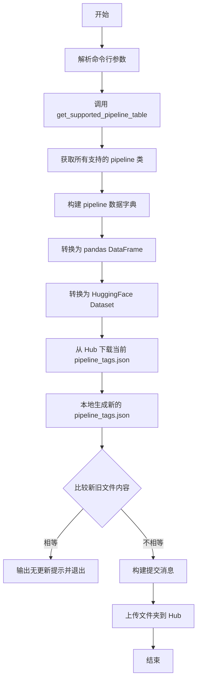
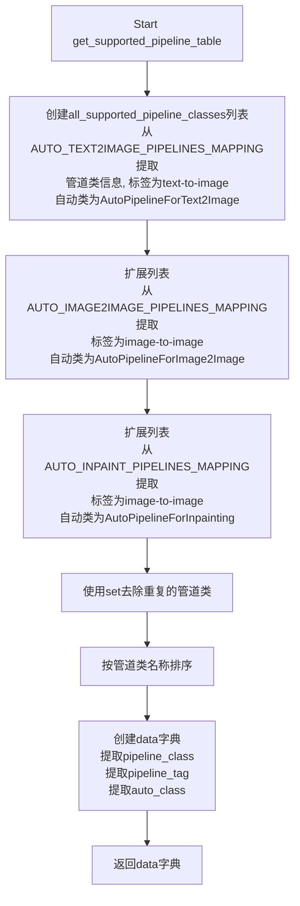
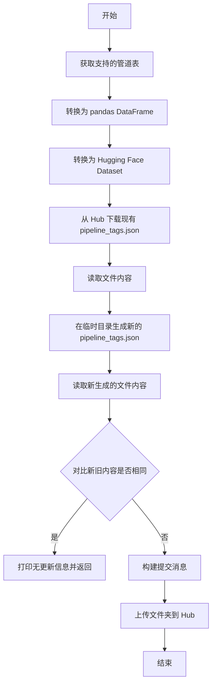

# `diffusers\utils\update_metadata.py` 详细设计文档

该脚本是一个元数据更新工具，用于同步 HuggingFace Hub 上 diffusers-metadata 数据集中的 pipeline 标签信息与本地代码库中的 AutoPipeline 映射，支持 Text2Image、Image2Image 和 Inpainting 三种类型的 pipeline 自动类映射。

## 整体流程



## 类结构

```
无类定义（模块级脚本）
└── 全局函数: get_supported_pipeline_table(), update_metadata()
```

## 全局变量及字段


### `PIPELINE_TAG_JSON`
    
The filename for the pipeline tags JSON file stored in the Hugging Face hub dataset for Diffusers metadata.

类型：`str`
    


    

## 全局函数及方法


### `get_supported_pipeline_table`

该函数用于生成一个包含Diffusers库所支持的所有自动管道类（Auto Pipeline Classes）的字典，通过读取auto模块中的映射关系，将管道类名称、管道标签和对应的自动类信息整理成结构化数据返回。

参数：

- 该函数无参数

返回值：`dict`，返回一个字典，包含三个键：`pipeline_class`（管道类名称列表）、`pipeline_tag`（管道标签列表，如"text-to-image"、"image-to-image"）、`auto_class`（对应的自动类名称列表，如"AutoPipelineForText2Image"）

#### 流程图



#### 带注释源码

```python
def get_supported_pipeline_table() -> dict:
    """
    Generates a dictionary containing the supported auto classes for each pipeline type,
    using the content of the auto modules.
    """
    # 从文本到图像的管道映射中提取所有支持的管道类
    # 每个元素为元组：(类名, 管道标签, 自动类名)
    all_supported_pipeline_classes = [
        (class_name.__name__, "text-to-image", "AutoPipelineForText2Image")
        for _, class_name in AUTO_TEXT2IMAGE_PIPELINES_MAPPING.items()
    ]
    
    # 从图像到图像的管道映射中提取支持的管道类
    # 标签为"image-to-image"，自动类为AutoPipelineForImage2Image
    all_supported_pipeline_classes += [
        (class_name.__name__, "image-to-image", "AutoPipelineForImage2Image")
        for _, class_name in AUTO_IMAGE2IMAGE_PIPELINES_MAPPING.items()
    ]
    
    # 从图像修复（inpainting）的管道映射中提取支持的管道类
    # 注意：虽然也是image-to-image类型，但使用不同的自动类AutoPipelineForInpainting
    all_supported_pipeline_classes += [
        (class_name.__name__, "image-to-image", "AutoPipelineForInpainting")
        for _, class_name in AUTO_INPAINT_PIPELINES_MAPPING.items()
    ]
    
    # 转换为set去除重复的管道类（因为某些管道可能同时支持多种类型）
    all_supported_pipeline_classes = list(set(all_supported_pipeline_classes))
    
    # 按管道类名称字母顺序排序，确保输出结果的一致性
    all_supported_pipeline_classes.sort(key=lambda x: x[0])

    # 构建最终的数据字典，将元组列表拆分为三个独立的列表
    data = {}
    data["pipeline_class"] = [sample[0] for sample in all_supported_pipeline_classes]
    data["pipeline_tag"] = [sample[1] for sample in all_supported_pipeline_classes]
    data["auto_class"] = [sample[2] for sample in all_supported_pipeline_classes]

    return data
```


### `update_metadata`

该函数用于更新 Hugging Face Diffusers 仓库的元数据，将当前支持的管道类别信息同步到 `huggingface/diffusers-metadata` 数据集中。

参数：

- `commit_sha`：`str`，用于标识此次更新的 Diffusers 仓库提交 SHA 值

返回值：`None`，该函数直接修改远程数据集，不返回任何值

#### 流程图



#### 带注释源码

```python
def update_metadata(commit_sha: str):
    """
    Update the metadata for the Diffusers repo in `huggingface/diffusers-metadata`.

    Args:
        commit_sha (`str`): The commit SHA on Diffusers corresponding to this update.
    """
    # 步骤1: 获取所有支持的管道类别表（包含管道类名、标签和自动类名）
    pipelines_table = get_supported_pipeline_table()
    
    # 步骤2: 将字典转换为 pandas DataFrame 格式，便于后续处理
    pipelines_table = pd.DataFrame(pipelines_table)
    
    # 步骤3: 将 DataFrame 转换为 Hugging Face Dataset 对象
    pipelines_dataset = Dataset.from_pandas(pipelines_table)

    # 步骤4: 从 Hugging Face Hub 下载当前已存在的元数据文件
    hub_pipeline_tags_json = hf_hub_download(
        repo_id="huggingface/diffusers-metadata",  # 远程仓库ID
        filename=PIPELINE_TAG_JSON,                 # 要下载的文件名
        repo_type="dataset",                        # 仓库类型为数据集
    )
    
    # 步骤5: 读取 Hub 上的现有元数据内容
    with open(hub_pipeline_tags_json) as f:
        hub_pipeline_tags_json = f.read()

    # 步骤6: 创建临时目录用于处理文件
    with tempfile.TemporaryDirectory() as tmp_dir:
        # 步骤7: 将新的数据集转换为 JSON 格式并保存到临时目录
        pipelines_dataset.to_json(os.path.join(tmp_dir, PIPELINE_TAG_JSON))

        # 步骤8: 读取新生成的 JSON 文件内容
        with open(os.path.join(tmp_dir, PIPELINE_TAG_JSON)) as f:
            pipeline_tags_json = f.read()

        # 步骤9: 对比 Hub 上的内容与新生成的内容是否完全相同
        hub_pipeline_tags_equal = hub_pipeline_tags_json == pipeline_tags_json
        
        # 步骤10: 如果内容相同，则无需更新，直接返回
        if hub_pipeline_tags_equal:
            print("No updates, not pushing the metadata files.")
            return

        # 步骤11: 构建提交消息，包含提交 SHA 和 GitHub 链接
        if commit_sha is not None:
            commit_message = (
                f"Update with commit {commit_sha}\n\nSee: https://github.com/huggingface/diffusers/commit/{commit_sha}"
            )
        else:
            commit_message = "Update"

        # 步骤12: 将更新后的文件夹上传到 Hugging Face Hub
        upload_folder(
            repo_id="huggingface/diffusers-metadata",
            folder_path=tmp_dir,
            repo_type="dataset",
            commit_message=commit_message,
        )
```

## 关键组件


### 自动管道映射获取

该组件从`diffusers.pipelines.auto_pipeline`模块导入三种自动管道映射（AUTO_TEXT2IMAGE_PIPELINES_MAPPING、AUTO_IMAGE2IMAGE_PIPELINES_MAPPING、AUTO_INPAINT_PIPELINES_MAPPING），用于获取Diffusers库支持的所有管道类信息。

### 管道表生成器

该组件通过`get_supported_pipeline_table()`函数实现，负责遍历所有自动管道映射，将管道类名、管道标签和自动类名整理为字典格式返回，包含去重和排序逻辑。

### 元数据下载模块

该组件使用`hf_hub_download`从Hugging Face Hub下载现有的`pipeline_tags.json`文件，用于与新生成的数据进行比较，以判断是否需要更新。

### 临时目录管理

该组件利用`tempfile.TemporaryDirectory()`创建临时目录，用于在本地构建新的JSON文件并与Hub上的文件进行比对。

### 元数据比较引擎

该组件负责比较本地生成的JSON与Hub上现有JSON的内容是否相同，如果相同则跳过更新流程，避免不必要的提交。

### 元数据上传模块

该组件使用`upload_folder`将更新后的元数据文件夹上传到Hugging Face Hub的diffusers-metadata数据集仓库，包含自动生成的提交消息。

### 命令行参数解析

该组件通过`argparse`模块解析`--commit_sha`参数，允许用户指定与此次更新关联的Diffusers仓库提交SHA值。

### 数据集转换

该组件使用`datasets.Dataset.from_pandas()`将Pandas DataFrame转换为Hugging Face数据集格式，便于序列化为JSON格式。


## 问题及建议


### 已知问题

- **错误处理缺失**：`hf_hub_download` 和 `upload_folder` 调用缺乏异常处理，网络异常、认证失败等情况会导致脚本直接崩溃
- **JSON 比较逻辑不可靠**：直接使用 `==` 比较两个 JSON 字符串可能因空格、键顺序等差异导致误判，应解析后比较实际内容
- **硬编码配置**：仓库 ID `"huggingface/diffusers-metadata"` 和文件名 `PIPELINE_TAG_JSON` 硬编码在代码中，缺乏灵活性
- **依赖耦合**：直接依赖 `diffusers.pipelines.auto_pipeline` 模块的内部映射结构，如果上游接口变化会导致脚本失效
- **缺少日志记录**：仅使用 `print` 输出信息，不利于生产环境的问题追踪和审计
- **参数校验不足**：`commit_sha` 参数未验证格式和有效性，可能传入无效值导致后续问题

### 优化建议

- 为所有外部调用（下载、上传）添加 try-except 异常处理，并实现重试机制
- 使用 `json.loads()` 解析后再比较，或使用 JSON 序列化后的标准格式进行比较
- 将仓库 ID、文件名等配置提取为命令行参数或环境变量，增强脚本灵活性
- 添加类型注解和输入参数校验，确保 `commit_sha` 符合 SHA 格式规范
- 引入标准日志模块（logging）替代 print，便于配置日志级别和输出目标
- 考虑添加 `--dry-run` 参数，在实际执行前预览将要上传的内容

## 其它


### 设计目标与约束

本工具旨在将Diffusers库中支持的自动管道类映射信息同步到HuggingFace Hub上的diffusers-metadata数据集中，确保管道标签的及时更新。设计约束包括：1) 依赖HuggingFace Hub API进行文件下载和上传；2) 仅支持text-to-image、image-to-image和inpainting三种管道类型；3) 使用pandas和datasets库进行数据处理；4) 通过GitHub Action自动化执行。

### 错误处理与异常设计

代码中的错误处理包括：1) 文件比较使用字符串直接比较（hub_pipeline_tags_equal = hub_pipeline_tags_json == pipeline_tags_json），若文件不存在或读取失败会抛出异常；2) hf_hub_download在仓库或文件不存在时会抛出异常；3) upload_folder在网络错误或权限不足时会失败；4) tempfile.TemporaryDirectory()在磁盘空间不足时会抛出异常。当前未实现重试机制和详细的错误日志记录，建议增加异常捕获和用户友好的错误提示。

### 数据流与状态机

数据流如下：1) 首先通过get_supported_pipeline_table()从AUTO_*_MAPPING字典中提取所有支持的管道类；2) 将数据转换为pandas DataFrame；3) 再转换为HuggingFace Dataset；4) 从Hub下载现有的pipeline_tags.json；5) 在临时目录中生成新的JSON文件；6) 比较新旧内容是否相同；7) 若不同则上传到Hub。状态机包括：初始化→获取数据→下载旧数据→比较→（相同则结束/不同则上传）→完成。

### 外部依赖与接口契约

主要外部依赖包括：1) huggingface_hub库（hf_hub_download, upload_folder函数）；2) datasets库（Dataset类）；3) pandas库（DataFrame）；4) diffusers.pipelines.auto_pipeline模块（AUTO_*_MAPPING常量）。接口契约：get_supported_pipeline_table()返回包含pipeline_class、pipeline_tag、auto_class三个键的字典；update_metadata(commit_sha)接受字符串参数并返回None，无返回值仅通过副作用更新Hub仓库。

### 性能考虑

当前实现使用内存处理小型数据集，性能良好。潜在优化点：1) 可以添加缓存机制避免重复下载Hub文件；2) 对于大规模管道映射，可以考虑增量更新而非全量比较；3) 可以添加超时控制避免网络请求长时间阻塞；4) 可以使用异步IO提升文件读写效率。

### 安全性考虑

代码安全性较高，无直接的用户输入执行风险。但需要注意：1) commit_sha参数应进行输入验证，避免注入恶意内容到提交信息；2) 临时目录清理依赖Python自动管理，建议显式处理；3) Hub凭据管理依赖huggingface_hub的默认认证机制，需确保CI/CD环境中的凭据安全；4) 建议对commit_message进行长度和内容限制。

### 配置与参数设计

命令行参数：--commit_sha（可选，默认为None），用于指定关联的Diffusers提交SHA。环境变量：依赖HUGGINGFACE_HUB_TOKEN或~/.huggingface凭据配置。配置常量：PIPELINE_TAG_JSON = "pipeline_tags.json"（Hub上的文件名），repo_id = "huggingface/diffusers-metadata"（目标仓库），repo_type = "dataset"（仓库类型）。建议将仓库ID和文件名提取为配置常量或环境变量以提高灵活性。

### 版本兼容性

代码依赖：1) Python标准库（argparse, os, tempfile）；2) pandas（数据处理）；3) datasets（HuggingFace数据集格式）；4) huggingface_hub（Hub交互）；5) diffusers（管道映射）。建议在requirements.txt或setup.py中声明版本约束，兼容性考虑：1) pandas的to_json和from_pandas方法在不同版本间可能有细微差异；2) huggingface_hub的API可能有变化，建议锁定版本；3) diffusers库版本影响AUTO_*_MAPPING的内容和结构。

### 测试策略

建议添加以下测试：1) 单元测试：get_supported_pipeline_table()返回数据结构的验证；2) 集成测试：模拟Hub API响应测试完整流程；3) 快照测试：验证生成的JSON结构符合预期；4) 离线测试：模拟无网络环境验证错误处理；5) 对比测试：验证不同diffusers版本生成的映射差异。当前代码缺少测试文件，建议添加tests/test_update_metadata.py。

### 部署与运维

部署方式：通过GitHub Action在特定事件触发时执行。工作流程：1) 手动触发或定时任务；2) 传递commit_sha参数；3) 执行update_metadata.py。运维监控：1) 建议添加日志输出记录执行状态；2) 可以集成Slack/邮件通知上传结果；3) 建议记录每次更新的时间戳和变更内容；4) 可以添加监控指标追踪更新频率和失败率。注意事项：1) 确保CI/CD角色具有dataset write权限；2) 考虑添加dry-run模式用于测试；3) 建议保留历史版本便于回滚。

    