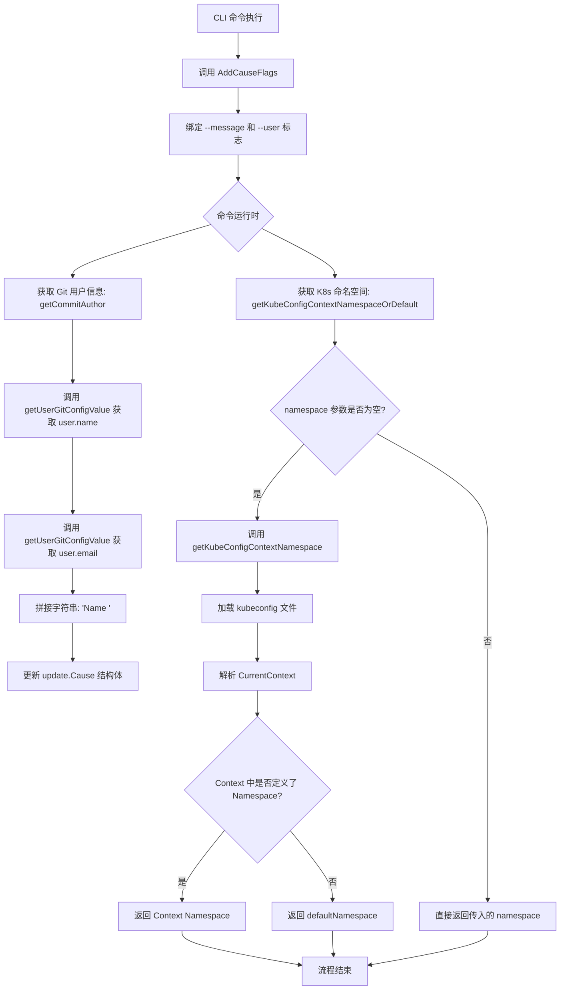
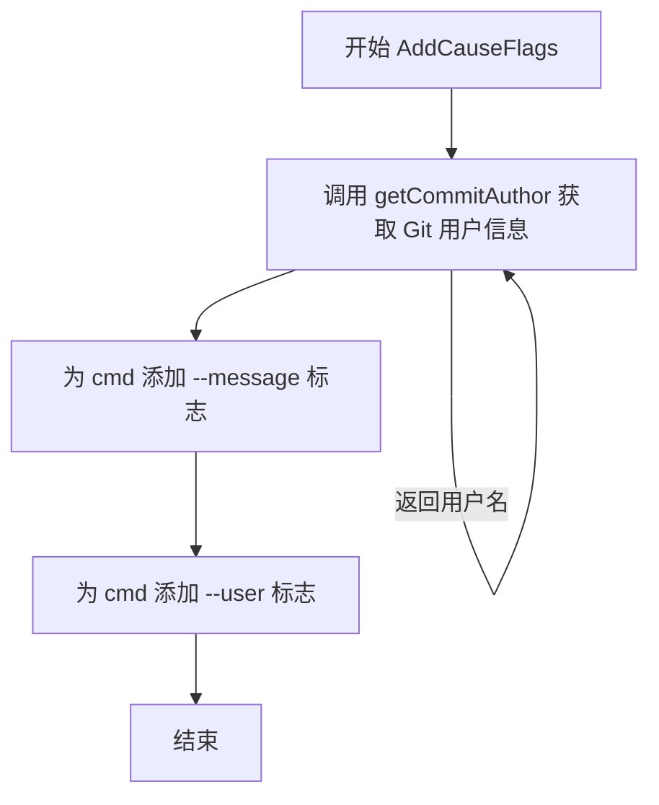
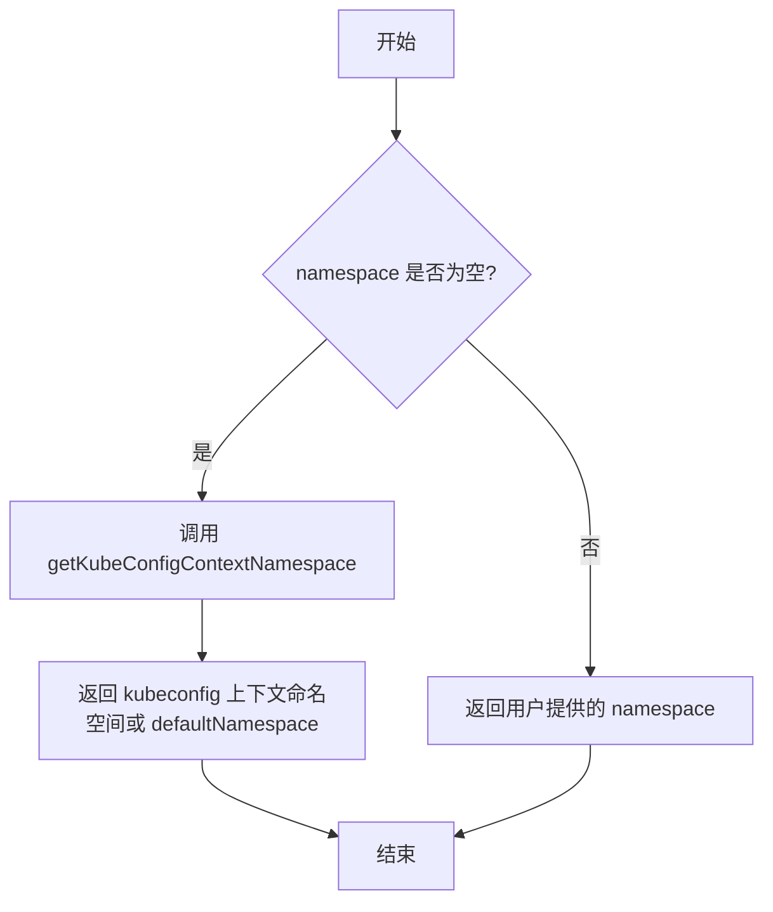
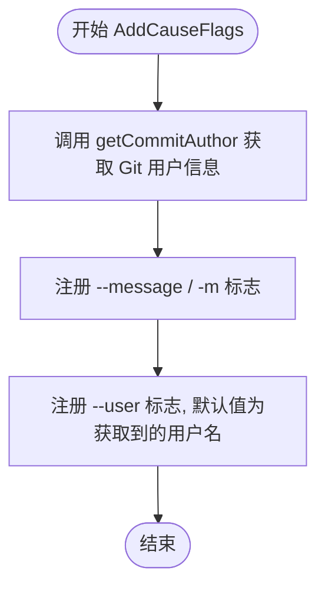
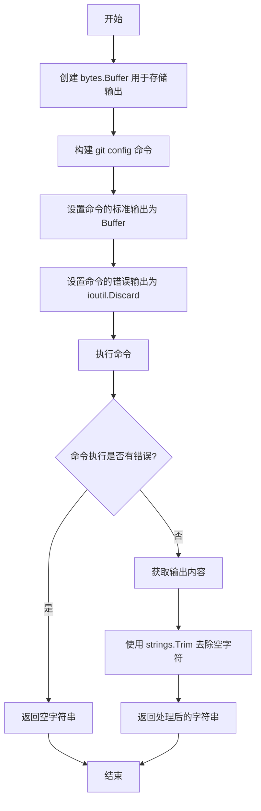
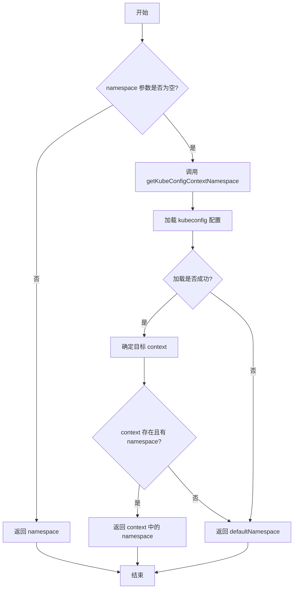

```mermaid
flowchart TD
    A[开始 getCommitAuthor] --> B[调用 getUserGitConfigValue 获取 user.name]
    B --> C[调用 getUserGitConfigValue 获取 user.email]
    C --> D{userName 和 userEmail 都非空?}
    D -->|是| E[返回 fmt.Sprintf&#40;%s <%s>, userName, userEmail&#41;]
    D -->|否| F{userEmail 非空?}
    F -->|是| G[返回 userEmail]
    F -->|否| H{userName 非空?}
    H -->|是| I[返回 userName]
    H -->|否| J[返回空字符串]
    E --> K[结束]
    G --> K
    I --> K
    J --> K
```

# `flux\cmd\fluxctl\args.go` 详细设计文档

该代码片段是一个 Go 语言编写的 CLI 工具（如 Flux CD 客户端）的核心辅助模块。它主要实现了两个功能：一是封装了 Git 用户信息的读取逻辑，自动从本地 Git 配置中获取用户名和邮箱，用于标识代码更新的发起者；二是封装了 Kubernetes 配置的读取逻辑，能够智能判断并获取当前 Context 的命名空间（Namespace），若未指定则回退到默认值。这两个功能共同服务于自动化部署流程中的元数据准备和目标集群定位。

## 整体流程



## 类结构

```
Package: main (CLI Helper Utils)
├── Git Configuration Utilities
│   ├── getCommitAuthor
│   └── getUserGitConfigValue
├── Kubernetes Context Utilities
│   ├── getKubeConfigContextNamespaceOrDefault
│   └── getKubeConfigContextNamespace (Global Var/Function)
└── CLI Flag Utilities
    └── AddCauseFlags
```

## 全局变量及字段


### `execCommand`
    
全局命令执行函数，允许注入mock

类型：`func(name string, arg ...string) *exec.Cmd`
    


### `getKubeConfigContextNamespace`
    
全局K8s命名空间解析函数，允许注入自定义解析逻辑

类型：`func(string, string) string`
    


    

## 全局函数及方法


### `AddCauseFlags`

该函数用于为 Cobra 命令行工具添加与更新原因（Cause）相关的标志位，包括消息内容（--message）和操作用户（--user），并自动从 Git 配置中获取当前用户的提交者信息作为默认用户。

参数：

- `cmd`：`*cobra.Command`，Cobra 命令对象，用于注册命令行标志
- `opts`：`*update.Cause`，更新原因的结构体指针，用于存储标志位解析后的值

返回值：`无`（函数无返回值，主要通过修改 `opts` 指针指向的对象来传递数据）

#### 流程图



#### 带注释源码

```go
// AddCauseFlags 为指定的 Cobra 命令添加更新原因相关的命令行标志
// cmd: Cobra 命令对象，用于注册标志位
// opts: Cause 结构体指针，用于存储标志位解析后的值
func AddCauseFlags(cmd *cobra.Command, opts *update.Cause) {
	// 获取当前 Git 提交者的用户名（优先使用 user.name，否则使用 user.email）
	username := getCommitAuthor()

	// 注册 --message / -m 标志，用于附加更新说明信息
	cmd.Flags().StringVarP(&opts.Message, "message", "m", "", "attach a message to the update")
	
	// 注册 --user 标志，允许覆盖默认的用户报告值
	// 默认值为 Git 配置中的提交者信息（由 getCommitAuthor 获取）
	cmd.Flags().StringVar(&opts.User, "user", username, "override the user reported as initiating the update")
}
```

#### 辅助函数信息

| 函数名 | 功能描述 |
|--------|----------|
| `getCommitAuthor` | 从 Git 配置中获取用户名称和邮箱，优先返回"名称 <邮箱>"格式 |
| `getUserGitConfigValue` | 执行 `git config --get` 命令获取指定 Git 配置项的值 |


### `getCommitAuthor`

获取当前Git用户的名称和邮箱信息，并按照约定格式返回提交者字符串。

参数：此函数无参数

返回值：`string`，返回格式化的Git提交者信息，优先级为："名称 <邮箱>" > "邮箱" > "名称" > 空字符串

#### 流程图



#### 带注释源码

```go
// getCommitAuthor 获取当前Git配置中的用户名和邮箱，并按格式返回
// 优先返回格式："用户名 <邮箱>"，其次仅邮箱、仅用户名，最后返回空字符串
func getCommitAuthor() string {
	// 获取Git全局配置中的user.name
	userName := getUserGitConfigValue("user.name")
	// 获取Git全局配置中的user.email
	userEmail := getUserGitConfigValue("user.email")

	// 使用switch语句进行多条件分支判断
	switch {
	// 情况1：用户名和邮箱都存在，返回格式化的字符串 "Name <email>"
	case userName != "" && userEmail != "":
		return fmt.Sprintf("%s <%s>", userName, userEmail)
	// 情况2：只有邮箱存在
	case userEmail != "":
		return userEmail
	// 情况3：只有用户名存在
	case userName != "":
		return userName
	}
	// 情况4：两者都不存在，返回空字符串
	return ""
}
```


### `getUserGitConfigValue`

该函数用于执行 git config 命令，获取指定用户配置项（如 user.name 或 user.email）的值，并通过字符串处理去除 null 字符后返回结果，如果命令执行失败则返回空字符串。

参数：

- `arg`：`string`，要获取的 git 配置项名称（如 "user.name" 或 "user.email"）

返回值：`string`，返回 git 配置项的值，如果执行出错则返回空字符串

#### 流程图

```mermaid
flowchart TD
    A[开始] --> B[创建 bytes.Buffer]
    B --> C[构建 git config --get --null 命令]
    C --> D[设置 cmd.Stdout = &out]
    D --> E[设置 cmd.Stderr = ioutil.Discard]
    E --> F[执行 cmd.Run()]
    F --> G{命令执行是否有错误?}
    G -->|是| H[返回空字符串 ""]
    G -->|否| I[获取输出 out.String()]
    I --> J[使用 strings.Trim 去除空字符 \x00]
    J --> K[返回处理后的结果]
    H --> K
```

#### 带注释源码

```go
// getUserGitConfigValue 执行 git config 命令获取指定配置项的值
// 参数 arg: 要获取的 git 配置项名称，如 "user.name" 或 "user.email"
// 返回: 配置项的值，出错时返回空字符串
var getUserGitConfigValue = func(arg string) string {
	// 用于存储命令输出的缓冲区
	var out bytes.Buffer
	
	// 构建 git config --get --null 命令
	// --get: 获取配置值
	// --null: 使用 null 字符作为输出分隔符
	cmd := execCommand("git", "config", "--get", "--null", arg)
	
	// 将标准输出重定向到缓冲区
	cmd.Stdout = &out
	
	// 丢弃标准错误输出，避免打印到控制台
	cmd.Stderr = ioutil.Discard
	
	// 执行 git 命令
	err := cmd.Run()
	
	// 如果命令执行失败，返回空字符串
	if err != nil {
		return ""
	}
	
	// 获取命令输出结果
	res := out.String()
	
	// 去除首尾的空字符 (\x00)
	// git config --null 使用 null 字符作为分隔符
	return strings.Trim(res, "\x00")
}
```


### `getKubeConfigContextNamespaceOrDefault`

获取Kubernetes配置上下文命名空间，如果用户未提供命名空间则回退到kubeconfig中的命名空间或默认命名空间。

参数：

- `namespace`：`string`，用户明确指定的命名空间
- `defaultNamespace`：`string`，当无法从kubeconfig获取命名空间时使用的默认值
- `kubeConfigContext`：`string`，要使用的kubeconfig上下文名称，为空时使用当前上下文

返回值：`string`，最终确定的命名空间，优先级：用户指定 > kubeconfig上下文 > 默认值

#### 流程图



#### 带注释源码

```go
// getKubeConfigContextNamespaceOrDefault 是一个包装函数，用于获取Kubernetes配置的命名空间
// 返回优先级：
// 1. 用户提供的 namespace
// 2. 从当前kubeconfig上下文获取的命名空间（如果1为空）
// 3. 指定的默认命名空间（如果1和2都失败）
func getKubeConfigContextNamespaceOrDefault(namespace string, defaultNamespace string, kubeConfigContext string) string {
	// 如果用户提供了命名空间，直接返回
	if namespace == "" {
		// 空的namespace，进入备用逻辑：尝试从kubeconfig上下文获取或使用默认值
		return getKubeConfigContextNamespace(defaultNamespace, kubeConfigContext)
	}
	// 用户已提供命名空间，直接使用
	return namespace
}
```

#### 关联的内部函数 `getKubeConfigContextNamespace`

此函数是上述函数的内部实现，用于从kubeconfig获取命名空间：

```go
// getKubeConfigContextNamespace 从kubeconfig中获取指定上下文的命名空间
// 如果获取失败或上下文无命名空间配置，则返回默认命名空间
var getKubeConfigContextNamespace = func(defaultNamespace string, kubeConfigContext string) string {
	// 使用非交互式延迟加载客户端配置获取原始配置
	config, err := clientcmd.NewNonInteractiveDeferredLoadingClientConfig(
		clientcmd.NewDefaultClientConfigLoadingRules(),
		&clientcmd.ConfigOverrides{},
	).RawConfig()
	// 配置加载失败时，返回默认命名空间
	if err != nil {
		return defaultNamespace
	}

	// 确定要使用的上下文名称
	var cc string
	if kubeConfigContext == "" {
		// 未指定上下文时，使用当前上下文
		cc = config.CurrentContext
	} else {
		// 使用用户指定的上下文
		cc = kubeConfigContext
	}

	// 检查指定上下文是否存在且是否配置了命名空间
	if c, ok := config.Contexts[cc]; ok && c.Namespace != "" {
		// 上下文存在且有命名空间配置，返回该命名空间
		return c.Namespace
	}

	// 无法从上下文获取命名空间，返回默认值
	return defaultNamespace
}
```


### `HelperFunctions.AddCauseFlags`

为 Cobra 命令添加自定义标志，主要用于 fluxcd 这样的 GitOps 工具中，允许用户指定更新的原因（`--message`）和发起人（`--user`）。该函数会自动调用 `getCommitAuthor` 获取当前 Git 用户的配置信息，并将其作为 `--user` 标志的默认值，从而减少用户手动输入。

参数：

- `cmd`：`*cobra.Command`，Cobra 命令对象，用于在其上注册标志。
- `opts`：`*update.Cause`，指向 `update.Cause` 结构体的指针，用于存储通过标志传入的值（Message 和 User）。

返回值：`无`（Go 语言中函数签名无返回值即为 void），该函数通过副作用（修改 `cmd` 和 `opts`）完成功能。

#### 流程图



#### 带注释源码

```go
// AddCauseFlags 为指定的 Cobra 命令添加自定义标志，用于描述更新的原因和发起人。
// cmd: 要添加标志的 Cobra 命令实例。
// opts: 指向 update.Cause 结构体的指针，标志的值将直接绑定到此结构体的字段。
func AddCauseFlags(cmd *cobra.Command, opts *update.Cause) {
	// 1. 自动获取当前 Git 配置中的用户名和邮箱作为默认值
	username := getCommitAuthor()

	// 2. 添加 --message (-m) 标志，允许用户附加更新说明
	cmd.Flags().StringVarP(&opts.Message, "message", "m", "", "attach a message to the update")

	// 3. 添加 --user 标志，允许覆盖默认的 Git 用户作为更新发起人
	cmd.Flags().StringVar(&opts.User, "user", username, "override the user reported as initiating the update")
}
```


### `getCommitAuthor`

该函数用于获取 Git 配置的用户信息，通过调用 `git config` 命令读取 `user.name` 和 `user.email` 配置项，并根据配置情况返回不同格式的用户信息字符串。

参数： 无

返回值：`string`，返回 Git 配置的用户信息，格式为 "用户名 <邮箱>"（当两者都存在时）、仅邮箱（当仅邮箱存在时）、仅用户名（当仅用户名存在时）或空字符串（当两者都不存在时）。

#### 流程图

```mermaid
flowchart TD
    A[开始 getCommitAuthor] --> B[调用 getUserGitConfigValue 获取 user.name]
    B --> C[调用 getUserGitConfigValue 获取 user.email]
    C --> D{userName 和 userEmail 都存在?}
    D -->|是| E[返回 "用户名 <邮箱>" 格式]
    D -->|否| F{userEmail 存在?}
    F -->|是| G[返回 userEmail]
    F -->|否| H{userName 存在?}
    H -->|是| I[返回 userName]
    H -->|否| J[返回空字符串]
    E --> K[结束]
    G --> K
    I --> K
    J --> K
```

#### 带注释源码

```go
// getCommitAuthor 获取 Git 配置的用户信息
// 该函数首先获取 Git 配置中的 user.name 和 user.email
// 根据获取结果返回不同格式的用户信息字符串
// 返回值格式优先级：用户名+邮箱 > 仅邮箱 > 仅用户名 > 空字符串
func getCommitAuthor() string {
	// 调用 getUserGitConfigValue 获取 Git 配置中的用户名
	userName := getUserGitConfigValue("user.name")
	// 调用 getUserGitConfigValue 获取 Git 配置中的邮箱
	userEmail := getUserGitConfigValue("user.email")

	// 使用 switch 语句根据配置情况返回对应格式的用户信息
	switch {
	// 当用户名和邮箱都存在时，返回 "用户名 <邮箱>" 格式
	case userName != "" && userEmail != "":
		return fmt.Sprintf("%s <%s>", userName, userEmail)
	// 当仅邮箱存在时，返回邮箱
	case userEmail != "":
		return userEmail
	// 当仅用户名存在时，返回用户名
	case userName != "":
		return userName
	}
	// 当两者都不存在时，返回空字符串
	return ""
}
```


### `getUserGitConfigValue`

该函数执行 `git config --get --null` 命令来获取指定的 Git 配置项值，并返回字符串结果。如果命令执行失败或配置项不存在，则返回空字符串。

参数：

- `arg`：`string`，要获取的 Git 配置键名（例如 "user.name"、"user.email"）

返回值：`string`，返回 Git 配置项的值，如果出错或配置项不存在则返回空字符串

#### 流程图



#### 带注释源码

```go
// getUserGitConfigValue 执行 git config --get --null 命令获取指定的 Git 配置值
// 参数 arg: 要获取的 Git 配置键名（如 "user.name" 或 "user.email"）
// 返回: 配置值字符串，如果出错则返回空字符串
var getUserGitConfigValue = func(arg string) string {
    // 创建缓冲区用于捕获命令输出
    var out bytes.Buffer
    
    // 构造 git config 命令：--get 获取值，--null 使用空字符作为行分隔符
    cmd := execCommand("git", "config", "--get", "--null", arg)
    
    // 将标准输出重定向到缓冲区
    cmd.Stdout = &out
    
    // 丢弃标准错误输出，避免打印到控制台
    cmd.Stderr = ioutil.Discard
    
    // 执行命令并检查错误
    err := cmd.Run()
    if err != nil {
        // 如果命令执行失败（如配置项不存在），返回空字符串
        return ""
    }
    
    // 获取命令输出结果
    res := out.String()
    
    // 去除可能存在的空字符（\x00），因为使用了 --null 选项
    return strings.Trim(res, "\x00")
}
```


### `getKubeConfigContextNamespaceOrDefault`

封装命名空间获取逻辑，提供三级回退机制：优先使用用户指定的命名空间，其次尝试从当前 kubeconfig context 中获取，若均不可用则使用默认命名空间。

参数：

- `namespace`：`string`，用户指定的命名空间，若不为空则直接返回
- `defaultNamespace`：`string`，当无法从其他来源获取命名空间时使用的默认值
- `kubeConfigContext`：`string`，kubeconfig 上下文名称，若为空则使用当前上下文

返回值：`string`，最终确定的命名空间字符串

#### 流程图



#### 带注释源码

```go
// getKubeConfigContextNamespaceOrDefault 封装命名空间获取逻辑，提供三级回退机制
// 回退顺序：
//   1. 用户提供的 namespace 参数
//   2. kubeconfig 当前 context 中的 namespace（若 1 为空）
//   3. defaultNamespace（若 1 和 2 均失败）
func getKubeConfigContextNamespaceOrDefault(namespace string, defaultNamespace string, kubeConfigContext string) string {
    // 第一级回退：如果用户指定了命名空间，直接使用
    if namespace == "" {
        // 第二级回退：尝试从 kubeconfig context 获取
        return getKubeConfigContextNamespace(defaultNamespace, kubeConfigContext)
    }
    // 使用用户提供的命名空间
    return namespace
}

// getKubeConfigContextNamespace 是内部实现函数，用于从 kubeconfig 中获取命名空间
// 注意：此函数被定义为包级变量，允许在测试中进行 mock
var getKubeConfigContextNamespace = func(defaultNamespace string, kubeConfigContext string) string {
    // 使用 client-go 加载 kubeconfig 配置（非交互式，不自动加载环境变量）
    config, err := clientcmd.NewNonInteractiveDeferredLoadingClientConfig(
        clientcmd.NewDefaultClientConfigLoadingRules(),
        &clientcmd.ConfigOverrides{},
    ).RawConfig()
    
    // 加载失败时，返回默认命名空间（第三级回退）
    if err != nil {
        return defaultNamespace
    }

    // 确定要使用的 context：优先使用传入的 context，否则使用当前上下文
    var cc string
    if kubeConfigContext == "" {
        cc = config.CurrentContext
    } else {
        cc = kubeConfigContext
    }

    // 从 context 配置中获取 namespace，若存在则返回
    if c, ok := config.Contexts[cc]; ok && c.Namespace != "" {
        return c.Namespace
    }

    // context 不存在或未设置 namespace，返回默认命名空间
    return defaultNamespace
}
```

## 关键组件


### AddCauseFlags 函数

为 cobra 命令添加更新原因相关标志的函数，包括消息和用户信息

### getCommitAuthor 函数

获取 Git 提交作者信息的函数，优先返回"名称 <邮箱>"格式，其次邮箱，最后名称

### getUserGitConfigValue 函数

通过执行 git config 命令获取用户 Git 配置值的工具函数

### getKubeConfigContextNamespaceOrDefault 函数

获取 Kubernetes 配置上下文命名空间的包装函数，提供三级回退机制：给定命名空间 -> kubeconfig 上下文命名空间 -> 默认命名空间

### getKubeConfigContextNamespace 变量（函数类型）

获取当前 kubeconfig 上下文命名空间的核心函数，支持自定义上下文，未设置时使用当前上下文


## 问题及建议


### 已知问题

- `execCommand` 和 `getKubeConfigContextNamespace` 使用全局变量赋值函数，虽然便于测试注入，但缺乏明确的依赖注入机制，导致依赖关系不清晰
- `getCommitAuthor` 每次调用都会执行两次 `git config` 命令（user.name 和 user.email），没有缓存机制，在频繁调用场景下性能较低
- `getUserGitConfigValue` 和 `getKubeConfigContextNamespace` 错误时直接返回空值或默认值，缺少日志记录，难以追踪问题根因
- `getKubeConfigContextNamespaceOrDefault` 函数命名过长且逻辑嵌套，可以简化为更清晰的Guard Clauses形式
- 代码缺少单元测试覆盖，特别是 `getUserGitConfigValue` 和 `getKubeConfigContextNamespace` 这些涉及外部命令和Kubernetes API的函数
- 使用 `strings.Trim(res, "\x00")` 去除空字符，但未处理可能存在的其他边界情况，如多行配置值

### 优化建议

- 引入缓存机制或单例模式，避免重复执行 `git config` 命令获取相同配置
- 添加结构化日志记录（如使用 `klog` 或 `zap`），在错误发生时记录上下文信息
- 将全局函数变量改为显式的依赖注入，通过接口或构造函数传递，提高可测试性和模块化程度
- 考虑将 `getUserGitConfigValue` 抽象为接口，便于在测试中mock外部git命令调用
- 简化 `getKubeConfigContextNamespaceOrDefault` 的逻辑，使用早期返回模式提高可读性
- 为关键函数添加单元测试，使用interface注入mock实现验证不同场景下的行为

## 其它


### 设计目标与约束

该代码主要服务于Kubernetes资源更新场景，提供灵活的Git配置和Kubeconfig上下文命名空间解析能力。设计目标包括：1) 自动从Git配置中提取提交者信息用于更新追溯；2) 支持多层级的命名空间回退机制（用户指定 > kubeconfig上下文 > 默认值）；3) 作为Flux CD工具集的底层辅助模块。约束条件：依赖Go标准库、client-go、cobra和flux/pkg/update等外部包；仅支持Linux/macOS环境（因调用git命令）；需要有效的kubeconfig配置。

### 错误处理与异常设计

代码采用保守的错误处理策略：
- `getUserGitConfigValue`: 执行git命令失败时静默返回空字符串，不抛出异常
- `getKubeConfigContextNamespace`: 加载kubeconfig失败时返回defaultNamespace，吞并所有错误
- 全局变量`execCommand`和`getKubeConfigContextNamespace`支持依赖注入，便于单元测试

异常场景包括：git命令未安装、用户无git配置、kubeconfig文件不存在或格式错误、context指定不存在。设计上选择返回默认值而非错误，保证上层调用链不会因配置缺失而中断。

### 外部依赖与接口契约

关键外部依赖：
- `k8s.io/client-go/tools/clientcmd`: Kubernetes配置加载
- `github.com/spf13/cobra`: CLI标志绑定
- `github.com/fluxcd/flux/pkg/update`: update.Cause结构体定义
- `exec.Command`: 系统命令执行（可注入）

接口契约：
- `AddCauseFlags`: 接收*cobra.Command和*update.Cause指针，无返回值
- `getCommitAuthor`: 无参数，返回字符串（格式："Name <email>"或单一字段）
- `getUserGitConfigValue`: 接收string参数（git config key），返回string值
- `getKubeConfigContextNamespaceOrDefault`: 接收三个string参数，返回最终命名空间字符串
- `getKubeConfigContextNamespace`: 接收两个string参数，返回命名空间字符串

### 性能考虑

潜在性能问题：
- 每次调用`getCommitAuthor`会执行两次git命令（user.name和user.email）
- `getKubeConfigContextNamespace`每次调用都重新加载并解析kubeconfig文件

优化建议：
- 考虑缓存git配置结果（使用sync.Once或全局变量）
- 考虑缓存kubeconfig解析结果，添加缓存失效机制
- 对于频繁调用的场景，可提供带缓存的版本

### 安全性考虑

- 命令注入风险：`getUserGitConfigValue`中arg参数直接拼接到git命令，建议添加参数校验
- 敏感信息泄露：git配置可能包含敏感信息，需确保日志记录时脱敏
- kubeconfig凭证：代码未直接处理凭证，但依赖client-go的安全加载机制


    