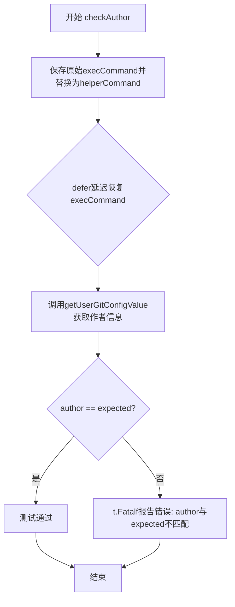
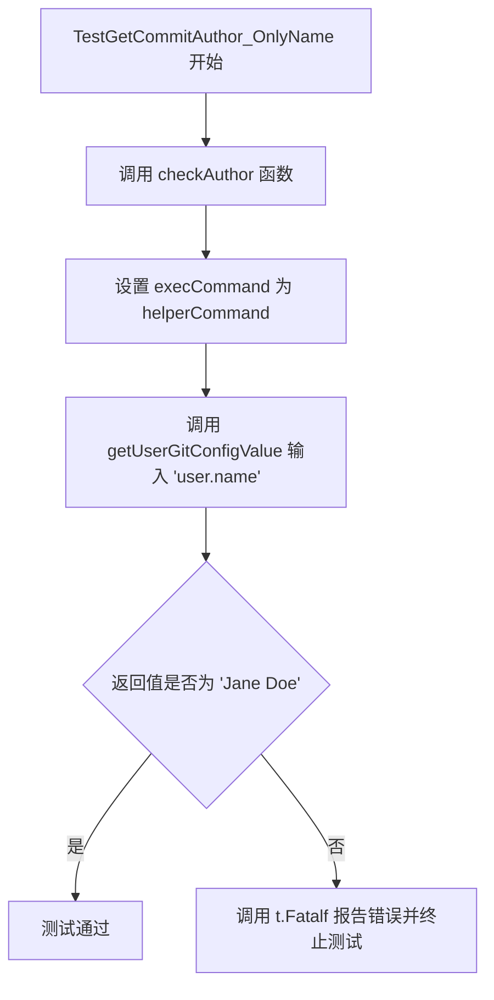
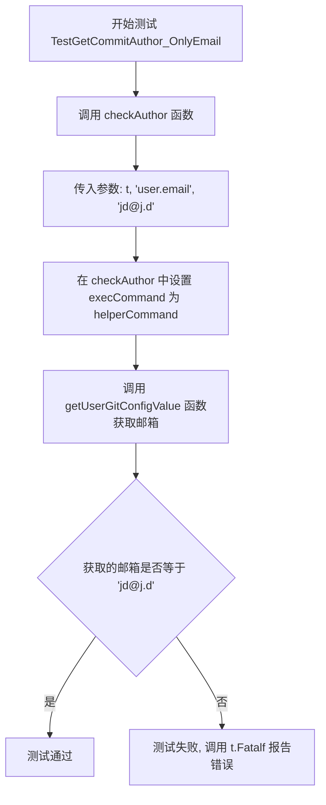

# `flux\cmd\fluxctl\args_test.go` 详细设计文档

这是一个Go语言测试文件，通过模拟git config命令的子进程来测试获取Git提交作者信息的功能。代码使用Go的exec包创建一个helper进程，该进程模拟git config命令返回user.name和user.email配置值，用于验证getUserGitConfigValue函数正确读取Git全局配置。

## 整体流程

```mermaid
graph TD
    A[开始测试] --> B[执行 checkAuthor]
    B --> C[设置 execCommand 为 helperCommand]
    C --> D[调用 getUserGitConfigValue(input)]
    D --> E{调用 execCommand}
    E --> F[创建子进程]
    F --> G[子进程执行 TestHelperProcess]
    G --> H{检查参数}
    H --> I[user.name --> 返回 'Jane Doe']
    H --> J[user.email --> 返回 'jd@j.d']
    I --> K[返回结果]
    J --> K
    K --> L[断言验证]
    L --> M[测试通过/失败]
```

## 类结构

```
Go测试文件 (无类结构)
└── 主要函数
    ├── helperCommand
    ├── TestHelperProcess
    ├── checkAuthor
    ├── TestGetCommitAuthor_OnlyName
    └── TestGetCommitAuthor_OnlyEmail
```

## 全局变量及字段


### `execCommand`
    
用于执行外部命令的函数引用，在测试中被模拟以控制命令执行行为

类型：`func(command string, s ...string) *exec.Cmd`
    


### `getUserGitConfigValue`
    
获取Git配置值的外部依赖函数，根据传入的配置键返回对应的配置值

类型：`func(key string) string`
    


    

## 全局函数及方法


### `helperCommand`

该函数用于创建并返回一个配置好的 `exec.Cmd` 结构，该结构用于在测试中启动子进程。它通过设置特定的环境变量和命令行参数，使子进程运行 `TestHelperProcess` 函数，从而模拟执行 git 命令（如获取用户配置信息）的测试场景。

参数：

- `command`：`string`，主命令字符串，表示要在子进程中执行的主要操作（如 "git config"）
- `s`：`...string`，可变参数，表示附加的命令行参数（如 "user.name"）

返回值：`*exec.Cmd`，指向 `exec.Cmd` 结构体的指针，可用于启动配置好的子进程

#### 流程图

```mermaid
flowchart TD
    A[开始 helperCommand] --> B[构建cs数组<br/>cs = {'-test.run=TestHelperProcess', '--', command}]
    B --> C[将可变参数s追加到cs数组]
    C --> D[使用os.Args[0]和cs创建exec.Cmd]
    D --> E[设置cmd.Env环境变量<br/>GO_WANT_HELPER_PROCESS=1]
    E --> F[返回cmd]
```

#### 带注释源码

```go
// helperCommand 创建一个用于测试的子进程命令
// 参数 command: 主命令字符串（如 "git"）
// 参数 s: 可变参数，表示子命令和参数（如 "config", "user.name"）
// 返回值: 配置好的 *exec.Cmd 结构，用于执行子进程
func helperCommand(command string, s ...string) (cmd *exec.Cmd) {
	// 初始化命令切片，包含测试运行标志和分隔符
	// -test.run=TestHelperProcess 指定只运行 TestHelperProcess
	// "--" 用于分隔 go test 参数和实际命令参数
	cs := []string{"-test.run=TestHelperProcess", "--", command}
	
	// 将可变参数追加到命令切片中
	cs = append(cs, s...)
	
	// 使用当前可执行文件路径和参数创建命令
	// os.Args[0] 是当前可执行文件的完整路径
	cmd = exec.Command(os.Args[0], cs...)
	
	// 设置环境变量，标识这是一个辅助进程
	// TestHelperProcess 会检查此环境变量以确认自身身份
	cmd.Env = []string{"GO_WANT_HELPER_PROCESS=1"}
	
	// 返回配置好的命令结构
	return cmd
}
```


### `TestHelperProcess`

该函数是一个测试辅助函数，作为模拟git config命令的helper进程运行。当环境变量`GO_WANT_HELPER_PROCESS`设置为"1"时，该进程会解析命令行参数，查找`user.name`或`user.email`配置项，并返回相应的预配置值（分别为"Jane Doe"和"jd@j.d"），用于测试环境中模拟Git配置读取逻辑。

参数：

-  `t`：`*testing.T`，testing框架的测试对象指针，用于报告测试失败

返回值：无（`void`），该函数通过`os.Stdout`输出配置值，并通过`os.Exit(0)`终止进程

#### 流程图

```mermaid
graph TD
    A[开始 TestHelperProcess] --> B{检查环境变量<br/>GO_WANT_HELPER_PROCESS == '1'}
    B -->|否| C[直接return返回]
    B -->|是| D[defer os.Exit(0)]
    D --> E[获取os.Args参数列表]
    E --> F[循环遍历args查找'--'分隔符]
    F --> G{找到'--'分隔符}
    G -->|否| H{args长度 == 0}
    H -->|是| I[t.Fatalf报错: No command]
    H -->|否| J[继续遍历]
    G -->|是| K[args = args[1:]<br/>跳过'--'获取实际命令参数]
    K --> L{args长度 == 0}
    L -->|是| I
    L -->|否| M[分离命令名和参数<br/>_, args = args[0], args[1:]]
    M --> N[遍历args参数]
    N --> O{当前参数 == 'user.name'}
    O -->|是| P[fmt.Fprintf os.Stdout: Jane Doe]
    O -->|否| Q{当前参数 == 'user.email'}
    Q -->|是| R[fmt.Fprintf os.Stdout: jd@j.d]
    Q -->|否| S[继续下一个参数]
    P --> S
    R --> S
    S --> N
    N --> T[遍历结束<br/>进程退出]
```

#### 带注释源码

```go
// TestHelperProcess 是一个测试辅助函数，作为模拟git config命令的helper进程运行
// 该函数在独立的进程中被调用，用于在测试环境中模拟Git配置读取
func TestHelperProcess(t *testing.T) {
	// 检查环境变量GO_WANT_HELPER_PROCESS是否为"1"
	// 只有设置了这个环境变量，才执行helper进程逻辑
	// 这样可以区分正常测试运行和helper进程调用
	if os.Getenv("GO_WANT_HELPER_PROCESS") != "1" {
		return
	}
	
	// 使用defer确保进程正常退出，状态码为0
	// 这个helper进程执行完毕后需要退出
	defer os.Exit(0)

	// 获取命令行参数列表
	// os.Args格式: [程序名, -test.run=TestHelperProcess, --, command, args...]
	args := os.Args
	
	// 循环遍历参数，找到"--"分隔符
	// "--"用于分隔go test的特殊参数和实际要执行的命令参数
	for len(args) > 0 {
		if args[0] == "--" {
			// 找到"--"后，跳过它，保留后面的实际命令参数
			args = args[1:]
			break
		}
		// 继续检查下一个参数
		args = args[1:]
	}
	
	// 如果没有剩余参数，说明没有提供要执行的命令
	if len(args) == 0 {
		t.Fatalf("No command\n")
	}

	// 分离命令名和命令参数
	// args[0]是命令名（如"config"），args[1:]是命令参数（如["user.name"]）
	_, args = args[0], args[1:]
	
	// 遍历命令参数，查找特定的配置项
	for _, a := range args {
		// 如果参数是"user.name"，输出预设的用户名
		if a == "user.name" {
			fmt.Fprintf(os.Stdout, "Jane Doe")
		} else if a == "user.email" {
			// 如果参数是"user.email"，输出预设的邮箱
			fmt.Fprintf(os.Stdout, "jd@j.d")
		}
	}
}
```


### `checkAuthor`

验证作者信息的测试辅助函数，用于测试`getUserGitConfigValue`函数是否能正确获取Git配置中的用户名称或邮箱。

参数：

- `t`：`*testing.T`，Go测试框架的测试对象，用于报告测试失败
- `input`：`string`，输入参数，指定要获取的Git配置项（如"user.name"或"user.email"）
- `expected`：`string`，期望返回的作者信息（如"Jane Doe"或"jd@j.d"）

返回值：`void`，无显式返回值，测试失败时通过`t.Fatalf`报告错误

#### 流程图



#### 带注释源码

```go
// checkAuthor 测试辅助函数，用于验证getUserGitConfigValue函数
// 能够正确获取Git配置中的用户名称或邮箱信息
// 参数:
//   - t: 测试框架的测试对象
//   - input: 要获取的配置项名称 (如 "user.name" 或 "user.email")
//   - expected: 期望返回的值
func checkAuthor(t *testing.T, input string, expected string) {
    // 1. 将全局execCommand变量替换为helperCommand
    //    helperCommand是一个测试用命令包装器，用于模拟执行git命令
    execCommand = helperCommand
    
    // 2. 使用defer确保测试结束后恢复原始的execCommand
    //    这样可以避免影响其他测试用例
    defer func() { execCommand = exec.Command }()
    
    // 3. 调用getUserGitConfigValue获取指定配置项的值
    author := getUserGitConfigValue(input)
    
    // 4. 比较获取到的值与期望值
    //    如果不匹配，调用t.Fatalf报告测试失败并终止测试
    if author != expected {
        t.Fatalf("author %q does not match expected value %q", author, expected)
    }
}
```

---

### 补充说明

#### 关键组件信息

| 组件名称 | 一句话描述 |
|---------|-----------|
| `helperCommand` | 测试用命令包装器，用于模拟子进程执行git命令并返回预设输出 |
| `TestHelperProcess` | 子进程处理函数，根据传入参数返回模拟的git配置值 |
| `execCommand` | 全局函数变量，用于执行外部命令（在此测试场景中被替换为helperCommand） |
| `getUserGitConfigValue` | 被测试的函数，用于从Git配置中获取指定项的值（定义在其它文件中） |

#### 技术债务与优化空间

1. **全局状态污染**：`execCommand`作为全局变量，通过替换的方式进行测试，这种做法存在副作用，可能影响并发测试场景
2. **硬编码测试数据**：测试数据（"Jane Doe"、"jd@j.d"）直接写在代码中，缺乏灵活性
3. **缺乏边界测试**：未覆盖空字符串、非法配置项等边界情况

#### 外部依赖与接口契约

- **依赖项**：`testing`包、`os`包、`fmt`包、`exec`包
- **接口契约**：`getUserGitConfigValue(input string) string`函数需返回对应Git配置项的值
- **环境依赖**：子进程通过环境变量`GO_WANT_HELPER_PROCESS=1`识别测试模式


### `TestGetCommitAuthor_OnlyName`

测试函数 `TestGetCommitAuthor_OnlyName` 用于验证获取 Git 配置中 `user.name` 字段的功能是否正确。该测试通过调用 `checkAuthor` 辅助函数，模拟 Git 命令执行并验证返回的用户名是否为预期的 "Jane Doe"。

参数：

-  `t`：`testing.T`，Go 语言标准测试框架的测试对象，用于报告测试失败和日志输出

返回值：`void`（无返回值），该测试函数通过 `t.Fatalf` 在验证失败时终止测试执行

#### 流程图



#### 带注释源码

```go
// TestGetCommitAuthor_OnlyName 测试函数
// 功能：验证 getUserGitConfigValue 函数能正确获取 Git 配置中的 user.name 字段
// 测试场景：仅设置 user.name 配置项，不设置 user.email
func TestGetCommitAuthor_OnlyName(t *testing.T) {
    // 调用 checkAuthor 辅助函数进行验证
    // 参数1: t - 测试框架提供的测试对象
    // 参数2: "user.name" - 要获取的 Git 配置键名
    // 参数3: "Jane Doe" - 预期的返回值
    checkAuthor(t, "user.name", "Jane Doe")
}
```

#### 关联函数信息

**`checkAuthor` 辅助函数**

参数：

-  `t`：`testing.T`，测试框架的测试对象
-  `input`：`string`，要查询的 Git 配置键名（如 "user.name" 或 "user.email"）
-  `expected`：`string`，预期返回的配置值

返回值：`void`（无返回值），通过内部调用 `getUserGitConfigValue` 获取实际值并与预期值比对

**`helperCommand` 辅助函数**

参数：

-  `command`：`string`，要执行的命令（如 "git config"）
-  `s`：`...string`，可变参数，表示命令的额外参数

返回值：`*exec.Cmd`，返回配置好的 `exec.Cmd` 对象，用于模拟命令执行


### `TestGetCommitAuthor_OnlyEmail`

该测试函数用于验证获取Git用户邮箱的功能是否正常工作，通过调用`checkAuthor`辅助函数并传入`user.email`参数和预期值`jd@j.d`来验证`getUserGitConfigValue`函数能否正确返回邮箱地址。

参数：

- `t`：`testing.T`，Go测试框架的测试实例指针，用于报告测试失败和日志输出

返回值：无（`void`），Go测试函数不返回值

#### 流程图



#### 带注释源码

```go
// TestGetCommitAuthor_OnlyEmail 测试获取Git用户邮箱功能
// 该测试验证当配置了user.email时，能够正确返回邮箱地址
func TestGetCommitAuthor_OnlyEmail(t *testing.T) {
    // 调用checkAuthor辅助函数进行验证
    // 第一个参数是测试框架的t
    // 第二个参数是git配置项名称: user.email
    // 第三个参数是预期的返回值: jd@j.d
	checkAuthor(t, "user.email", "jd@j.d")
}
```

---

### 附：`checkAuthor` 辅助函数详情

由于`TestGetCommitAuthor_OnlyEmail`的实际逻辑在`checkAuthor`函数中，以下是相关全局函数信息：

参数：

- `t`：`testing.T`，测试框架实例
- `input`：`string`，Git配置项名称（如"user.name"或"user.email"）
- `expected`：`string`，预期返回的配置值

返回值：无（`void`）

#### 带注释源码

```go
// checkAuthor 辅助测试函数，用于验证getUserGitConfigValue的返回值
// 参数:
//   - t: 测试框架实例
//   - input: Git配置项名称
//   - expected: 预期返回的配置值
func checkAuthor(t *testing.T, input string, expected string) {
    // 保存原始的execCommand，以便测试后恢复
	execCommand = helperCommand
    
    // 使用defer确保测试结束后恢复原始的execCommand
	defer func() { execCommand = exec.Command }()
    
    // 调用getUserGitConfigValue获取Git配置值
	author := getUserGitConfigValue(input)
    
    // 验证返回的值是否符合预期
	if author != expected {
        // 不匹配时报告测试失败
		t.Fatalf("author %q does not match expected value %q", author, expected)
	}
}
```

## 关键组件


### 测试辅助进程机制

通过环境变量 GO_WANT_HELPER_PROCESS 控制，子进程模拟 git 命令行工具的输出，用于测试依赖外部命令的代码。

### 命令模拟器

helperCommand 函数构建测试用的 exec.Cmd 对象，设置特殊环境变量 GO_WANT_HELPER_PROCESS=1，并通过 -- 分隔符传递实际要执行的命令和参数。

### Git配置值获取函数

getUserGitConfigValue 是被测试的核心函数（代码中未显示实现），接收 user.name 或 user.email 等键名，返回对应的 git 配置值。

### 测试用例组

包含 TestGetCommitAuthor_OnlyName 和 TestGetCommitAuthor_OnlyEmail 两个测试用例，验证获取 git 用户名和邮箱地址的功能。

### 环境变量注入机制

通过 os.Getenv 读取 GO_WANT_HELPER_PROCESS 环境变量，判断是否为测试辅助进程，并据此执行不同的逻辑分支。

### 参数解析器

TestHelperProcess 中的 args 切片解析逻辑，从命令行参数中分离出 -- 分隔符后的实际命令及其参数。


## 问题及建议


### 已知问题

-   **缺失核心功能实现**：代码中调用了 `getUserGitConfigValue` 函数和全局变量 `execCommand`，但未提供其具体实现，导致无法完整评估功能和潜在问题
-   **全局变量状态管理风险**：`checkAuthor` 函数通过直接赋值修改全局变量 `execCommand`，虽然使用 defer 恢复，但在并发测试场景下可能导致竞态条件
-   **子进程依赖不可靠**：`helperCommand` 依赖 `os.Args[0]` 获取当前可执行文件路径，在某些构建或部署场景下可能失效
-   **测试覆盖不足**：仅覆盖了正常流程（user.name 和 user.email），缺少错误场景测试，如命令执行失败、git 配置不存在等情况
-   **缺乏错误传播机制**：`getUserGitConfigValue` 函数的错误处理逻辑未知，若该函数返回错误，当前测试代码未做处理
-   **环境变量硬编码**：`GO_WANT_HELPER_PROCESS` 环境变量字符串在多处硬编码，容易产生拼写错误
-   **资源清理不完整**：`TestHelperProcess` 中使用 `defer os.Exit(0)`，但未确保子进程的标准输出等资源是否正确刷新和关闭

### 优化建议

-   补充 `getUserGitConfigValue` 和 `execCommand` 的实现代码，以便完整分析其设计合理性
-   将全局变量 `execCommand` 改为依赖注入方式，通过接口或参数传递，避免全局状态修改
-   添加完整的错误场景测试用例，包括 git 命令不存在、配置项为空、执行超时等情况
-   提取环境变量常量为具名常量，如 `const WantHelperProcessEnv = "GO_WANT_HELPER_PROCESS"`
-   在子进程输出前添加 `stdout.Flush()` 或使用带缓冲的 writer 确保数据及时写出
-   为关键函数和测试用例添加文档注释，说明测试意图和预期行为
-   考虑使用 Go 标准库的 `exec.Command` 相关的测试辅助库（如 `gotestsum` 或自定义 wrapper）简化子进程测试模式


## 其它


### 设计目标与约束

本代码的设计目标是测试获取Git配置用户信息（user.name和user.email）的功能。采用Go标准库的testing框架和helper process模式来实现测试，避免实际调用git命令。设计约束包括：仅支持模拟"user.name"和"user.email"两个配置项的查询，不支持其他git配置项，且helper process通过环境变量GO_WANT_HELPER_PROCESS识别。

### 错误处理与异常设计

1. **参数缺失错误**：当args为空时，调用t.Fatalf("No command\n")终止测试
2. **环境变量检查**：helper process通过检查GO_WANT_HELPER_PROCESS环境变量确认自身身份，若未设置则直接返回
3. **命令执行错误**：通过exec.Command创建命令，若执行失败会返回error，但当前代码未对execCommand进行错误处理
4. **返回值验证**：使用t.Fatalf比较实际返回值与期望值

### 数据流与状态机

```
主测试流程:
1. checkAuthor(t, input, expected)
   ↓
2. 设置execCommand为helperCommand
   ↓
3. 调用getUserGitConfigValue(input)
   ↓
4. 执行helperCommand创建子进程
   ↓
5. 子进程输出配置值
   ↓
6. 比较返回值与期望值

Helper Process流程:
1. 检查环境变量GO_WANT_HELPER_PROCESS
   ↓
2. 解析命令行参数找到"--"分隔符
   ↓
3. 提取实际命令和参数
   ↓
4. 根据参数输出对应配置值
   ↓
5. 调用os.Exit(0)退出
```

### 外部依赖与接口契约

1. **os包**：用于环境变量读取( os.Getenv)、标准输出写入(os.Stdout)、进程参数访问(os.Args)、进程退出(os.Exit)
2. **fmt包**：用于格式化输出(Fprintf)
3. **exec包**：用于执行外部命令(exec.Command)
4. **testing包**：用于测试框架(t.T)
5. **接口依赖**：代码依赖getUserGitConfigValue和execCommand两个外部符号，但当前代码中未定义，需要外部实现

### 测试覆盖范围

- TestGetCommitAuthor_OnlyName: 验证获取user.name配置
- TestGetCommitAuthor_OnlyEmail: 验证获取user.email配置
- 测试覆盖度较低，仅覆盖两个配置项的成功场景，缺少错误场景测试

### 并发与线程安全

当前代码为单线程顺序执行，无并发场景。execCommand全局变量在测试前后通过defer恢复默认值，避免测试间相互影响。

### 配置与可扩展性

1. **硬编码问题**：用户名"Jane Doe"和邮箱"jd@j.d"硬编码在helper process中
2. **扩展性限制**：仅支持两个固定配置项的模拟，若需测试更多git配置项需修改代码
3. **参数化需求**：可考虑将期望输出参数化以支持更多测试场景

### 代码质量评估

1. **缺失定义**：execCommand变量被使用但未在当前文件中定义，getUserGitConfigValue函数未实现
2. **魔法字符串**：环境变量名"GO_WANT_HELPER_PROCESS"、分隔符"--"为硬编码
3. **测试隔离**：通过defer恢复execCommand实现测试隔离，但依赖全局变量不是最佳实践

### 潜在改进方向

1. 定义execCommand变量和getUserGitConfigValue函数
2. 将helper process输出值参数化
3. 添加更多测试场景（错误输入、无效配置等）
4. 考虑使用接口替代全局execCommand变量以提高可测试性


    