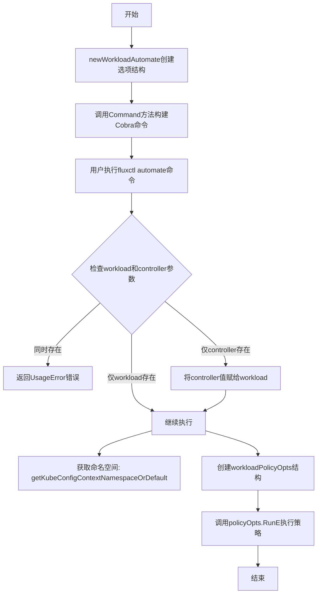
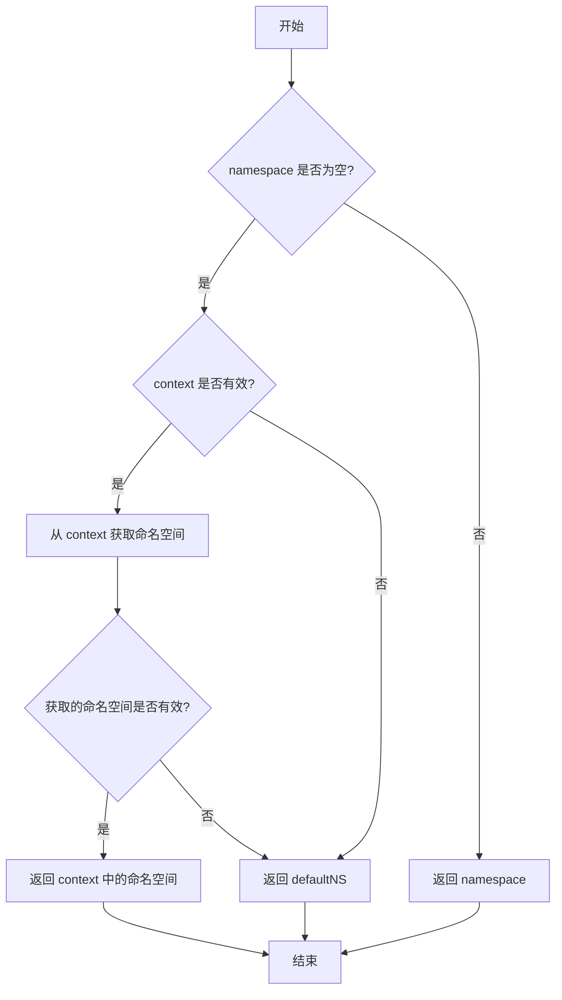
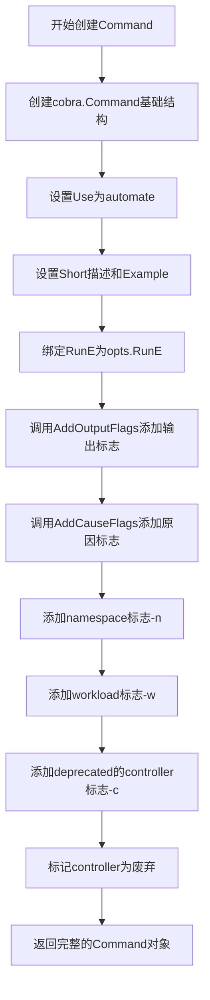
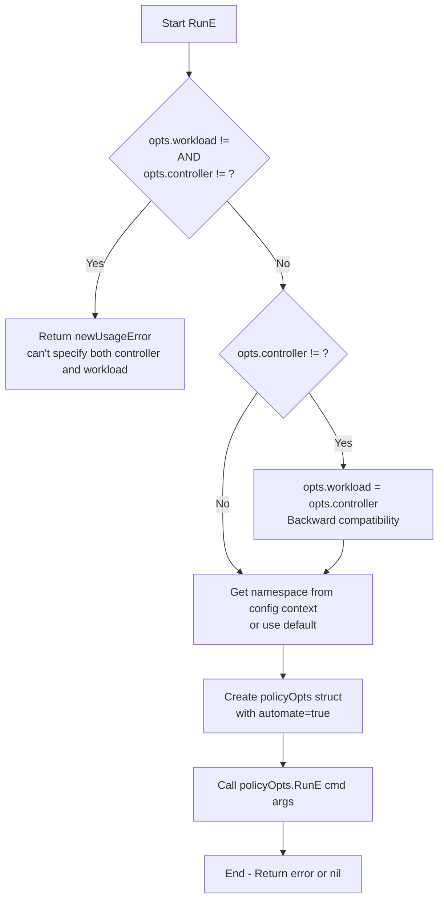
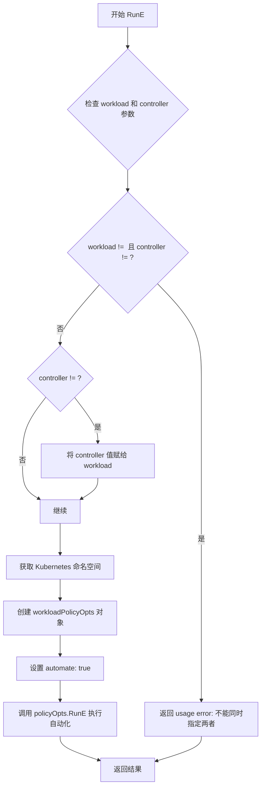

# `flux\cmd\fluxctl\automate_cmd.go` 详细设计文档

这是Flux CD项目中实现自动化部署工作负载的命令行工具模块，通过Cobra框架提供automate子命令，允许用户为指定的工作负载启用自动部署功能，并处理了与旧版--controller参数的向后兼容性。

## 整体流程



## 类结构

```
rootOpts (根选项配置)
└── workloadAutomateOpts (自动化部署选项)
    ├── outputOpts (输出选项)
    ├── workloadPolicyOpts (策略选项)
    └── update.Cause (更新原因)
```

## 全局变量及字段


### `newWorkloadAutomate`
    
创建并返回workloadAutomateOpts实例的构造函数

类型：`func(parent *rootOpts) *workloadAutomateOpts`
    


### `workloadAutomateOpts.rootOpts`
    
指向根选项配置的指针，用于共享命令行配置

类型：`*rootOpts`
    


### `workloadAutomateOpts.namespace`
    
目标工作负载所在的Kubernetes命名空间

类型：`string`
    


### `workloadAutomateOpts.workload`
    
目标工作负载标识，格式如default:deployment/helloworld

类型：`string`
    


### `workloadAutomateOpts.outputOpts`
    
输出格式配置，控制命令结果的展示方式

类型：`outputOpts`
    


### `workloadAutomateOpts.cause`
    
更新原因描述，记录触发自动化的原因信息

类型：`update.Cause`
    


### `workloadAutomateOpts.controller`
    
已弃用的控制器参数，为保持向后兼容而保留

类型：`string`
    


### `rootOpts.Context`
    
KubeConfig上下文配置，用于确定Kubernetes集群连接

类型：`string`
    


### `workloadPolicyOpts.rootOpts`
    
指向根选项配置的指针

类型：`*rootOpts`
    


### `workloadPolicyOpts.outputOpts`
    
输出格式配置

类型：`outputOpts`
    


### `workloadPolicyOpts.namespace`
    
工作负载命名空间

类型：`string`
    


### `workloadPolicyOpts.workload`
    
工作负载标识

类型：`string`
    


### `workloadPolicyOpts.cause`
    
更新原因

类型：`update.Cause`
    


### `workloadPolicyOpts.automate`
    
自动化部署标志，true表示开启自动化

类型：`bool`
    
    

## 全局函数及方法


### `newWorkloadAutomate`

创建 `workloadAutomateOpts` 实例的构造函数，初始化选项结构体并将父级 `rootOpts` 嵌入到该实例中，以便在命令层级中共享配置。

参数：

- `parent`：`*rootOpts`，指向父级根选项的指针，用于嵌入到 `workloadAutomateOpts` 结构体中

返回值：`*workloadAutomateOpts`，返回新创建的 `workloadAutomateOpts` 实例指针

#### 流程图

```mermaid
flowchart TD
    A[开始 newWorkloadAutomate] --> B[接收 parent 参数]
    B --> C{parent 是否为 nil}
    C -->|是| D[创建 workloadAutomateOpts{rootOpts: nil}]
    C -->|否| E[创建 workloadAutomateOpts{rootOpts: parent}]
    D --> F[返回 *workloadAutomateOpts]
    E --> F
```

#### 带注释源码

```go
// newWorkloadAutomate 创建一个新的 workloadAutomateOpts 实例
// 参数 parent: 指向 rootOpts 的指针，用于嵌入到结构体中共享配置
// 返回值: 指向新创建的 workloadAutomateOpts 的指针
func newWorkloadAutomate(parent *rootOpts) *workloadAutomateOpts {
    // 创建并返回 workloadAutomateOpts 实例
    // 将 parent 指针嵌入到 rootOpts 字段中
    return &workloadAutomateOpts{rootOpts: parent}
}
```


### `getKubeConfigContextNamespaceOrDefault`

获取Kubernetes配置上下文中的命名空间，如果未提供命名空间则返回默认值。

参数：

- `namespace`：`string`，用户提供的命名空间参数
- `defaultNS`：`string`，当 namespace 为空时使用的默认命名空间
- `context`：`string`，Kubernetes配置上下文名称

返回值：`string`，解析后的命名空间（优先使用用户提供的namespace，其次尝试从context获取，最后使用defaultNS）

#### 流程图



#### 带注释源码

```
// getKubeConfigContextNamespaceOrDefault 获取Kubernetes命名空间
// 如果提供了namespace则直接返回，否则尝试从context获取，
// 若context也无法获取有效命名空间，则返回defaultNS作为默认值
func getKubeConfigContextNamespaceOrDefault(namespace, defaultNS, context string) string {
    // 1. 首先检查用户是否直接提供了namespace
    if namespace != "" {
        return namespace
    }
    
    // 2. 如果未提供namespace，尝试从context中获取命名空间
    if context != "" {
        // 此处应包含从Kubernetes配置中查找context对应命名空间的逻辑
        // 获取到的nsNamespace可能为空，需要进一步判断
        nsFromContext := getNamespaceFromContext(context) // 假设存在此辅助函数
        if nsFromContext != "" {
            return nsFromContext
        }
    }
    
    // 3. 如果上述都未获取到有效命名空间，返回默认值
    return defaultNS
}
```

---

**注意**：由于提供的代码片段中未包含 `getKubeConfigContextNamespaceOrDefault` 函数的完整实现，以上内容基于函数调用方式和函数名称进行的合理推断与重构。具体实现可能需要参考项目中的实际定义。


### `workloadAutomateOpts.Command()`

该方法用于构建并返回一个 Cobra 命令对象，该命令用于开启指定工作负载的自动部署功能。通过定义命令行参数、标志和示例，帮助用户快速配置自动部署策略。

参数：此方法不接受任何显式参数（隐式接收 `opts *workloadAutomateOpts` 指针）

返回值：`*cobra.Command`，返回配置好的 Cobra 命令对象，用于将工作负载设置为自动部署模式

#### 流程图



#### 带注释源码

```go
// Command 构建并返回用于开启工作负载自动部署的Cobra命令
// 返回的Command对象包含完整的标志配置和执行逻辑
func (opts *workloadAutomateOpts) Command() *cobra.Command {
    // 创建基础的Cobra命令结构，设置命令名称为"automate"
    cmd := &cobra.Command{
        Use:   "automate", // 命令使用名称
        Short: "Turn on automatic deployment for a workload.", // 简短描述
        // 生成示例命令，展示如何使用该命令
        Example: makeExample(
            "fluxctl automate --workload=default:deployment/helloworld",
        ),
        // 绑定实际执行逻辑到RunE回调
        RunE: opts.RunE,
    }
    
    // 添加输出格式相关的标志（如json、yaml等）
    AddOutputFlags(cmd, &opts.outputOpts)
    // 添加原因（cause）相关的标志，用于记录变更原因
    AddCauseFlags(cmd, &opts.cause)
    
    // 添加namespace标志，支持短选项-n，默认值为空字符串
    cmd.Flags().StringVarP(&opts.namespace, "namespace", "n", "", "Workload namespace")
    // 添加workload标志，支持短选项-w，指定要自动化的工作负载
    cmd.Flags().StringVarP(&opts.workload, "workload", "w", "", "Workload to automate")

    // Deprecated: 已废弃的controller标志，保持向后兼容
    // 添加controller标志，支持短选项-c，用于旧的命令行接口
    cmd.Flags().StringVarP(&opts.controller, "controller", "c", "", "Controller to automate")
    // 标记controller标志为废弃，提示用户使用--workload代替
    cmd.Flags().MarkDeprecated("controller", "changed to --workload, use that instead")

    // 返回配置完成的Cobra命令对象
    return cmd
}
```


### `workloadAutomateOpts.RunE`

该方法是自动化部署功能的核心执行逻辑，负责处理命令行参数、进行向后兼容性处理、构建策略选项，并调用底层策略执行器完成自动化部署操作。

参数：

- `cmd`：`*cobra.Command`，Cobra 命令对象，包含命令标志和配置信息
- `args`：`[]string`，传递给命令的额外参数列表

返回值：`error`，执行过程中的错误信息，如果成功则返回 nil

#### 流程图



#### 带注释源码

```go
// RunE 是自动化部署命令的执行函数
// 参数 cmd 是 Cobra 命令对象，args 是额外参数
// 返回执行过程中的错误
func (opts *workloadAutomateOpts) RunE(cmd *cobra.Command, args []string) error {
	// Backwards compatibility with --controller until we remove it
	// 向后兼容已废弃的 --controller 标志
	switch {
	// 如果同时指定了 workload 和 controller，返回使用错误
	case opts.workload != "" && opts.controller != "":
		return newUsageError("can't specify both the controller and workload")
	// 如果只指定了已废弃的 controller，将其值迁移到 workload
	case opts.controller != "":
		opts.workload = opts.controller
	}
	
	// 获取 Kubernetes 命名空间，从 kubeconfig 上下文或使用默认值 "default"
	ns := getKubeConfigContextNamespaceOrDefault(opts.namespace, "default", opts.Context)
	
	// 构建 workloadPolicyOpts 结构体，设置自动化标志为 true
	policyOpts := &workloadPolicyOpts{
		rootOpts:   opts.rootOpts,
		outputOpts: opts.outputOpts,
		namespace:  ns,
		workload:   opts.workload,
		cause:      opts.cause,
		automate:   true, // 关键：启用自动化部署
	}
	
	// 委托给 policyOpts.RunE 执行实际的自动化策略
	return policyOpts.RunE(cmd, args)
}
```


### `workloadAutomateOpts.RunE`

该方法是 Flux CD 自动化部署命令的核心执行逻辑，负责处理用户输入的 `--workload` 或已弃用的 `--controller` 参数，进行向后兼容性处理，获取 Kubernetes 命名空间，并最终调用 `workloadPolicyOpts.RunE` 来执行自动化策略的设置。

参数：

- `cmd`：`*cobra.Command`，Cobra 命令对象，包含命令标志和配置信息
- `args`：`[]string`，传递给命令的额外参数列表

返回值：`error`，如果执行过程中出现错误（如同时指定了 controller 和 workload），则返回错误；否则返回 nil

#### 流程图



#### 带注释源码

```go
func (opts *workloadAutomateOpts) RunE(cmd *cobra.Command, args []string) error {
	// Backwards compatibility with --controller until we remove it
	// 处理向后兼容性：支持已弃用的 --controller 参数
	switch {
	case opts.workload != "" && opts.controller != "":
		// 如果同时指定了 workload 和 controller，返回错误提示
		return newUsageError("can't specify both the controller and workload")
	case opts.controller != "":
		// 如果只指定了已弃用的 controller，将其值转换为 workload
		opts.workload = opts.controller
	}
	// 获取 Kubernetes 配置上下文中的命名空间，默认为 "default"
	ns := getKubeConfigContextNamespaceOrDefault(opts.namespace, "default", opts.Context)
	// 创建 workloadPolicyOpts 对象，用于设置自动化策略
	policyOpts := &workloadPolicyOpts{
		rootOpts:   opts.rootOpts,       // 继承根选项
		outputOpts: opts.outputOpts,     // 继承输出选项
		namespace:  ns,                  // 设置命名空间
		workload:   opts.workload,       // 设置工作负载标识
		cause:      opts.cause,          // 设置变更原因
		automate:   true,                // 启用自动化部署
	}
	// 调用 policyOpts 的 RunE 方法执行实际的自动化策略设置
	return policyOpts.RunE(cmd, args)
}
```

## 关键组件


### workloadAutomateOpts 结构体

定义自动部署任务的配置选项结构体，包含命名空间、工作负载、输出选项、原因等字段，以及已废弃的controller字段用于向后兼容。

### Command 方法

构建并返回automate子命令，配置命令使用说明、示例、输出标志、原因标志和工作负载参数，标记controller参数为已废弃。

### RunE 方法

执行自动部署的核心逻辑，处理--controller和--workload参数的向后兼容性验证，创建workloadPolicyOpts并调用其RunE方法完成实际的策略设置流程。

### 向后兼容性处理

处理废弃的controller参数与workload参数的冲突检查和转换逻辑，确保旧版命令行参数能够平滑迁移到新版参数。

### getKubeConfigContextNamespaceOrDefault 函数调用

获取Kubernetes配置上下文中的命名空间，若未指定则使用默认值"default"。


## 问题及建议


### 已知问题

-   **废弃参数处理逻辑复杂**：在`RunE`方法中使用switch语句处理已废弃的`--controller`参数，这种向后兼容性逻辑会增加代码复杂性，随着时间推移维护成本会越来越高。
-   **输入验证不足**：代码没有验证`opts.workload`参数是否为空字符串，可能导致在后续`policyOpts.RunE`调用时才报错，错误反馈不够及时。
-   **魔法字符串和默认值**：使用了硬编码的字符串"default"作为命名空间默认值，应该通过常量或配置中心管理。
-   **缺少日志记录**：代码中没有任何日志记录机制，无法追踪命令执行过程和调试问题。
-   **职责分离不够清晰**：`workloadAutomateOpts`结构体既包含配置选项，又承担了命令执行逻辑的协调工作，违反了单一职责原则。
-   **错误处理不一致**：使用`newUsageError`创建错误，但该函数的定义不在当前代码文件中，缺乏统一的错误处理策略。
-   **注释和文档缺失**：核心的业务逻辑（如向后兼容处理）缺少详细的注释说明。

### 优化建议

-   **移除废弃参数**：考虑在下一个主版本中完全移除对`--controller`参数的支持，简化代码逻辑。
-   **增加输入验证**：在`RunE`方法开头添加对`opts.workload`为空值的验证，提前返回明确的错误信息。
-   **提取常量**：将"default"等魔法字符串提取为常量，定义在独立的配置文件中。
-   **添加日志**：引入日志记录，记录命令执行的关键信息，便于问题排查。
-   **重构错误处理**：统一错误类型和错误消息格式，建立清晰的错误码体系。
-   **增强文档**：为复杂逻辑添加详细的注释和文档字符串。

## 其它


### 设计目标与约束

- **核心目标**：为Flux CD提供命令行接口，允许用户通过`fluxctl automate`命令开启指定workload的自动部署功能
- **约束条件**：必须兼容现有的`--controller`标志（已废弃），同时支持新的`--workload`标志
- **用户群体**：运维工程师和开发人员使用Flux CD进行GitOps工作流管理

### 错误处理与异常设计

- 使用`RunE`模式返回错误，允许cobra框架统一处理错误展示
- 错误类型包括：参数冲突错误（`newUsageError`）、命名空间解析错误、工作流执行错误
- 不兼容标志同时出现时返回明确的错误信息："can't specify both the controller and workload"

### 外部依赖与接口契约

- **依赖包**：`github.com/spf13/cobra`（CLI框架）、`github.com/fluxcd/flux/pkg/update`（更新策略）
- **输入契约**：命令行参数`--namespace`、`--workload`（或废弃的`--controller`）、`--cause`
- **输出契约**：调用`workloadPolicyOpts.RunE`执行实际策略更新，返回error或nil
- **Kubernetes交互**：通过`getKubeConfigContextNamespaceOrDefault`获取Kubernetes命名空间

### 性能考虑

- 命令执行为单次调用，无长期运行进程
- Kubernetes API调用由下游`workloadPolicyOpts`处理

### 安全性考虑

- 废弃的`--controller`标志通过`MarkDeprecated`标记，提醒用户迁移
- 命名空间参数需验证合法性，防止注入攻击

### 测试策略

- 单元测试应覆盖：标志解析、向后兼容性逻辑、错误处理分支
- 集成测试应验证：与cobra框架集成、命令行帮助信息生成

### 配置文件

- 无独立配置文件，通过命令行标志传递参数
- 输出格式配置通过`outputOpts`结构处理

### 日志设计

- 使用cobra内置的错误输出机制
- 详细日志由下游`workloadPolicyOpts`处理

### 版本兼容性

- 明确废弃`--controller`标志，引导用户使用`--workload`
- 保持向后兼容性直到完全移除废弃标志

### 监控和指标

- 本模块不直接提供指标收集，依赖上游调用方

### 国际化/本地化

- 命令描述和示例使用英文
- 错误信息为英文硬编码

### 部署考虑

- 作为fluxctl工具的一部分打包发布
- 独立二进制文件，无需额外运行时

### 代码风格

- 遵循Go语言惯例，驼峰命名
- 使用结构体嵌入（如`*rootOpts`）实现代码复用

### 维护计划

- 废弃的`--controller`标志应在后续版本中移除
- 考虑提取公共逻辑到独立函数


    