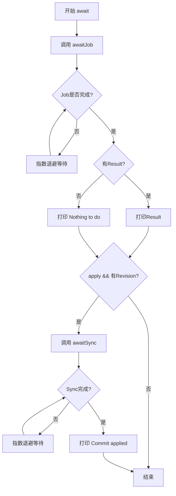
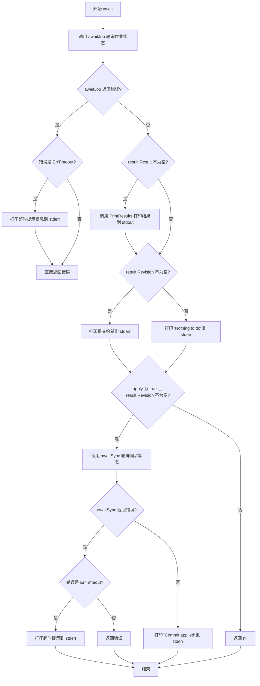
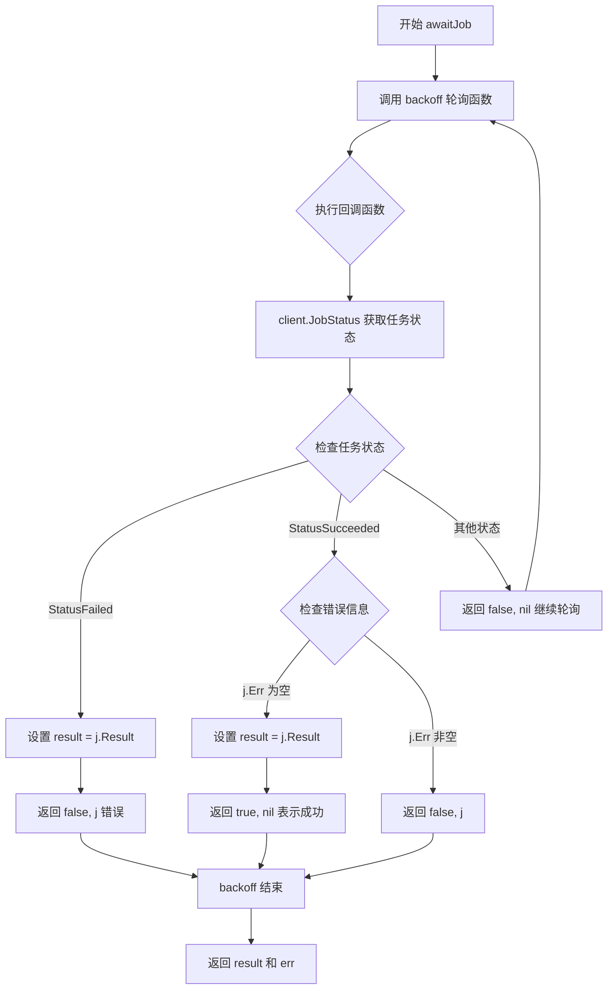
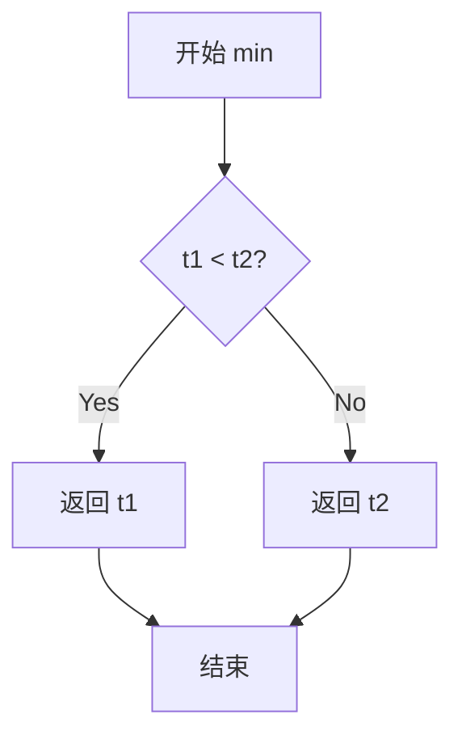
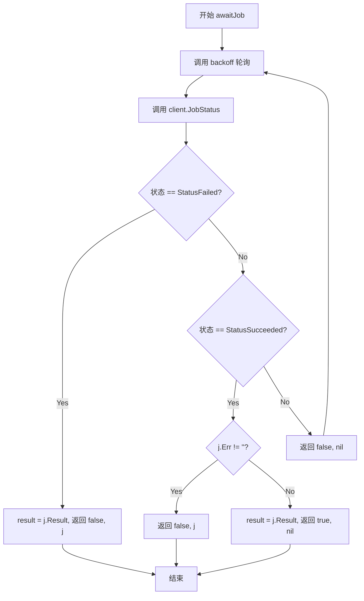
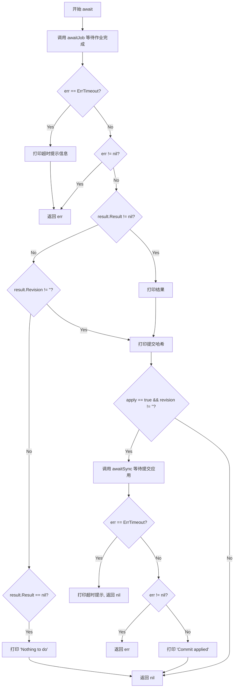

```mermaid
flowchart TD
    A[开始 backoff] --> B[计算 maxDelay = initialDelay * maxFactor]
    B --> C[计算 finish = now + timeout]
    C --> D[delay = initialDelay]
    D --> E{now < finish?}
    E -->|No| F[返回 ErrTimeout]
    E -->|Yes| G[调用 f&#40;&#41;]
    G --> H{ok == true?}
    H -->|Yes| I[返回 err]
    H -->|No| J{err != nil?}
    J -->|Yes| I
    J -->|No| K{now + delay > finish?}
    K -->|Yes| F
    K -->|No| L[ sleep&#40;delay&#41; ]
    L --> M[delay = min&#40;delay * factor, maxDelay&#41;]
    M --> E
```

```mermaid
flowchart TD
    A[开始 awaitSync] --> B[调用 backoff 轮询]
    B --> C[调用 client.SyncStatus]
    C --> D{err == nil && len&#40;refs&#41; == 0?}
    D -->|Yes| E[返回 true, nil]
    D -->|No| F[返回 false, err]
    E --> G[结束]
    F --> B
```

# `flux\cmd\fluxctl\await.go` 详细设计文档

这是一个Flux CD的工具模块，提供异步任务等待机制。通过指数退避算法轮询检查Job执行状态和Commit同步状态，支持超时处理和结果输出。

## 整体流程



## 类结构

```
Go Package (无类，使用函数式设计)
└── main 包
    ├── 错误定义
    │   └── ErrTimeout
    ├── 核心函数
    │   ├── await (主入口)
    │   ├── awaitJob (等待Job)
    │   ├── awaitSync (等待Sync)
    │   ├── backoff (指数退避)
    │   └── min (辅助函数)
```

## 全局变量及字段


### `ErrTimeout`
    
超时错误，用于表示操作执行超时的情况

类型：`error`
    


    

## 全局函数及方法


### `await`

该函数是 Flux CLI 的核心操作函数，负责轮询作业执行状态并在需要时等待同步完成。它先调用 `awaitJob` 获取作业结果，然后可选地调用 `awaitSync` 等待提交被应用到集群，最后将结果输出到指定的输出流。

参数：

- `ctx`：`context.Context`，Go 语言上下文，用于取消和超时控制
- `stdout`：`io.Writer`，标准输出流，用于打印作业执行结果
- `stderr`：`io.Writer`，标准错误流，用于打印状态信息和错误提示
- `client`：`api.Server`，Flux API 服务器客户端，用于查询作业和同步状态
- `jobID`：`job.ID`，要等待的作业唯一标识符
- `apply`：`bool`，是否在获取结果后等待提交被应用到集群
- `verbosity`：`int`，输出详细程度级别，控制结果打印的详细程度
- `timeout`：`time.Duration`，整个操作的超时时间

返回值：`error`，如果发生错误（如超时、API 错误）则返回错误；操作成功或超时但状态未知时返回 nil

#### 流程图



#### 带注释源码

```go
// await polls for a job to complete, then for the resulting commit to
// be applied
// await 函数轮询作业完成情况，然后在需要时轮询提交被应用的情况
func await(ctx context.Context, stdout, stderr io.Writer, client api.Server, jobID job.ID, apply bool, verbosity int, timeout time.Duration) error {
	// 第一步：调用 awaitJob 轮询作业直到完成或超时
	result, err := awaitJob(ctx, client, jobID, timeout)
	if err != nil {
		// 如果发生超时错误，给用户友好的提示
		// 因为超时不一定是失败，可能操作正在进行中
		if err == ErrTimeout {
			fmt.Fprintln(stderr, `
We timed out waiting for the result of the operation. This does not
necessarily mean it has failed. You can check the state of the
cluster, or commit logs, to see if there was a result. In general, it
is safe to retry operations.`)
			// 因为结果未知，仍然返回错误以表示异常退出
		}
		return err
	}
	
	// 第二步：如果有结果则打印到标准输出
	if result.Result != nil {
		update.PrintResults(stdout, result.Result, verbosity)
	}
	
	// 第三步：如果有提交哈希则打印到标准错误
	if result.Revision != "" {
		fmt.Fprintf(stderr, "Commit pushed:\t%s\n", result.Revision[:7])
	}
	
	// 第四步：如果没有结果则直接返回
	if result.Result == nil {
		fmt.Fprintf(stderr, "Nothing to do\n")
		return nil
	}

	// 第五步：如果需要等待提交被应用
	if apply && result.Revision != "" {
		// 调用 awaitSync 轮询同步状态
		if err := awaitSync(ctx, client, result.Revision, timeout); err != nil {
			if err == ErrTimeout {
				// 操作成功但等待应用超时，给出解决建议
				fmt.Fprintln(stderr, `
The operation succeeded, but we timed out waiting for the commit to be
applied. This does not necessarily mean there is a problem. Use

    fluxctl sync

to run a sync interactively.`)
				// 操作本身已成功，只是等待应用超时，返回 nil
				return nil
			}
			return err
		}
		// 同步成功，打印应用完成的提交哈希
		fmt.Fprintf(stderr, "Commit applied:\t%s\n", result.Revision[:7])
	}

	return nil
}
```


### `awaitJob`

使用指数退避算法（exponential backoff）轮询任务状态，直到任务完成（成功或失败）或超时。

参数：

- `ctx`：`context.Context`，Go 标准库的上下文对象，用于传递取消信号、截止时间等
- `client`：`api.Server`，Flux 系统的 API 服务器客户端，用于查询任务状态
- `jobID`：`job.ID`，要等待的任务的唯一标识符
- `timeout`：`time.Duration`，等待任务完成的最大超时时长

返回值：`job.Result, error`，返回任务执行结果和可能的错误（如超时或任务失败）

#### 流程图



#### 带注释源码

```go
// awaitJob 使用指数退避算法轮询任务状态，直到任务完成或超时
// 参数说明：
//   - ctx: 上下文，用于控制超时和取消
//   - client: Flux API 服务器客户端
//   - jobID: 要等待的任务ID
//   - timeout: 最大等待超时时间
// 返回值：
//   - job.Result: 任务执行的结果
//   - error: 轮询过程中的错误（可能是超时、任务失败等）
func awaitJob(ctx context.Context, client api.Server, jobID job.ID, timeout time.Duration) (job.Result, error) {
	var result job.Result // 用于存储任务结果

	// 调用 backoff 函数进行指数退避轮询
	// 初始延迟 100ms，增长因子 2，最大因子 50
	err := backoff(100*time.Millisecond, 2, 50, timeout, func() (bool, error) {
		// 通过 API 客户端查询任务状态
		j, err := client.JobStatus(ctx, jobID)
		if err != nil {
			// API 调用失败，返回错误并停止轮询
			return false, err
		}

		// 根据任务状态字符串进行分支处理
		switch j.StatusString {
		case job.StatusFailed:
			// 任务执行失败，保存结果并返回错误
			result = j.Result
			return false, j // 返回 false 表示未成功，j 作为错误处理

		case job.StatusSucceeded:
			// 任务执行成功，检查是否有错误信息
			if j.Err != "" {
				// 异常情况：任务标记为成功但有错误信息
				return false, j
			}
			// 保存任务结果并返回成功
			result = j.Result
			return true, nil // 返回 true 表示轮询成功结束
		}

		// 任务尚未完成（可能是 Pending、Running 等中间状态）
		// 继续轮询
		return false, nil
	})

	// 返回任务结果和可能出现的错误
	return result, err
}
```


### `awaitSync`

该函数用于轮询提交是否已被应用。它使用指数退避算法持续检查指定修订版本的同步状态，直到同步完成（返回空引用列表）、发生错误或超时。

参数：

- `ctx`：`context.Context`，用于控制请求的取消和超时
- `client`：`api.Server`，用于查询集群同步状态的API客户端
- `revision`：`string`，要等待应用的提交修订版本号
- `timeout`：`time.Duration`，等待同步完成的最大超时时间

返回值：`error`，如果超时返回 `ErrTimeout`，其他错误则返回相应错误

#### 流程图

```mermaid
flowchart TD
    A[Start awaitSync] --> B[调用 backoff 函数]
    B --> C{执行 f 函数}
    C --> D[调用 client.SyncStatus]
    D --> E{err == nil 且 len(refs) == 0?}
    E -->|是| F[返回 nil - 同步完成]
    E -->|否| G{err != nil?}
    G -->|是| H[返回 err]
    G -->|否| I[继续重试 - 指数退避]
    I --> C
    B --> J{超时?}
    J -->|是| K[返回 ErrTimeout]
```

#### 带注释源码

```go
// awaitSync polls for a commit to have been applied, with exponential backoff.
// 使用指数退避算法轮询提交是否已被应用
func awaitSync(ctx context.Context, client api.Server, revision string, timeout time.Duration) error {
    // 调用 backoff 函数进行带指数退避的轮询
    // 初始延迟 1 秒，倍增因子 2，最大因子 10
    return backoff(1*time.Second, 2, 10, timeout, func() (bool, error) {
        // 查询指定修订版本的同步状态
        refs, err := client.SyncStatus(ctx, revision)
        // 当且仅当没有错误且引用列表为空时才表示同步完成
        return err == nil && len(refs) == 0, err
    })
}
```


### `backoff`

`backoff` 是一个使用指数退避策略轮询条件完成的函数。它接受初始延迟、退避因子、最大因子、总体超时时间和一个待轮询的函数作为参数，持续调用该函数直到返回成功或遇到错误，若超时则返回 `ErrTimeout`。

参数：

- `initialDelay`：`time.Duration`，初始轮询延迟时间
- `factor`：`time.Duration`，退避因子，用于计算下一次延迟的乘数
- `maxFactor`：`time.Duration`，最大延迟乘数上限
- `timeout`：`time.Duration`，整个轮询操作的超时时长
- `f`：`func() (bool, error)`，待轮询的函数，返回是否成功和可能的错误

返回值：`error`，若函数 `f` 返回 `true` 则返回 `nil`，若 `f` 返回错误则返回该错误，若超时则返回 `ErrTimeout`

#### 流程图

```mermaid
flowchart TD
    A[开始 backoff] --> B[计算 maxDelay = initialDelay * maxFactor]
    B --> C[设置 finish = time.Now() + timeout]
    C --> D[设置 delay = initialDelay]
    D --> E{time.Now() < finish?}
    E -->|否| F[返回 ErrTimeout]
    E -->|是| G[调用 f()]
    G --> H{ok || err?}
    H -->|是| I[返回 err]
    H -->|否| J{time.Now() + delay > finish?}
    J -->|是| K[跳出循环]
    K --> F
    J -->|否| L[time.Sleep(delay)]
    L --> M[delay = min(delay * factor, maxDelay)]
    M --> D
```

#### 带注释源码

```go
// backoff polls for f() to have been completed, with exponential backoff.
func backoff(initialDelay, factor, maxFactor, timeout time.Duration, f func() (bool, error)) error {
	// 计算最大延迟上限
	maxDelay := initialDelay * maxFactor
	// 设置超时截止时间
	finish := time.Now().Add(timeout)
	// 从初始延迟开始轮询
	for delay := initialDelay; time.Now().Before(finish); delay = min(delay*factor, maxDelay) {
		// 执行轮询函数
		ok, err := f()
		// 如果成功或发生错误，立即返回
		if ok || err != nil {
			return err
		}
		// 如果没有足够时间进行下一次尝试，则停止轮询
		if time.Now().Add(delay).After(finish) {
			break
		}
		// 等待指定延迟时间
		time.Sleep(delay)
	}
	// 超出超时时间，返回超时错误
	return ErrTimeout
}
```


# 函数设计文档

## 概述

该代码是 Flux CD 项目中的一部分，实现了作业轮询和同步等待的辅助函数，通过指数退避算法（exponential backoff）轮询 Kubernetes 集群中的任务状态，支持超时控制和工作流协调。

---

## 整体运行流程

```
┌─────────────────────────────────────────────────────────────────┐
│                        程序入口 (await)                          │
└─────────────────────────────┬───────────────────────────────────┘
                              │
                              ▼
┌─────────────────────────────────────────────────────────────────┐
│                    awaitJob (轮询作业状态)                       │
│  ┌──────────────────────────────────────────────────────────┐  │
│  │  backoff(100ms, 2x, 50x, timeout, statusChecker)        │  │
│  │  - 指数退避轮询 JobStatus                                 │  │
│  │  - 检查 StatusFailed / StatusSucceeded                  │  │
│  └──────────────────────────────────────────────────────────┘  │
└─────────────────────────────┬───────────────────────────────────┘
                              │
                              ▼
              ┌───────────────┴───────────────┐
              │         判断结果               │
              └───────────────┬───────────────┘
                              │
              ┌───────────────┴───────────────┐
              ▼                               ▼
     ┌─────────────────┐              ┌─────────────────┐
     │   apply=true    │              │  apply=false    │
     └────────┬────────┘              └────────┬────────┘
              │                               │
              ▼                               ▼
┌─────────────────────────────────────────────────────────────┐
│              awaitSync (轮询提交应用状态)                     │
│  ┌────────────────────────────────────────────────────────┐  │
│  │  backoff(1s, 2x, 10x, timeout, syncChecker)          │  │
│  │  - 指数退避轮询 SyncStatus                             │  │
│  │  - 等待所有引用被应用 (len(refs) == 0)                  │  │
│  └────────────────────────────────────────────────────────┘  │
└─────────────────────────────────────────────────────────────┘
```

---

## 函数详细信息

### `ErrTimeout`

**变量类型：** `error`

**描述：** 全局错误变量，表示操作超时。

---

### `min`

**描述：** 辅助函数，用于比较并返回两个 `time.Duration` 值中的较小者。

#### 参数

- `t1`：`time.Duration`，第一个时间长度
- `t2`：`time.Duration`，第二个时间长度

#### 返回值

- `time.Duration`，返回 `t1` 和 `t2` 中较小的值

#### 流程图



#### 带注释源码

```go
// min 返回两个时间长度中较小的一个
// 参数:
//   - t1: 第一个时间长度
//   - t2: 第二个时间长度
//
// 返回值:
//   - time.Duration: 较小的时间长度
func min(t1, t2 time.Duration) time.Duration {
	if t1 < t2 {
		return t1  // t1 较小，返回 t1
	}
	return t2  // t2 较小或相等，返回 t2
}
```

---

### `backoff`

**描述：** 通用指数退避轮询函数，在指定超时时间内反复调用传入的函数 `f`，直到 `f` 返回成功或发生错误。延迟时间以指数方式增长。

#### 参数

- `initialDelay`：`time.Duration`，初始延迟时间
- `factor`：`time.Duration`，延迟增长因子
- `maxFactor`：`time.Duration`，最大延迟倍数
- `timeout`：`time.Duration`，总超时时间
- `f`：`func() (bool, error)`，轮询函数，返回 `(是否完成, 错误)`

#### 返回值

- `error`，如果超时返回 `ErrTimeout`，否则返回 `f` 的错误

#### 流程图



#### 带注释源码

```go
// backoff 使用指数退避策略轮询函数 f() 是否完成
// 参数:
//   - initialDelay: 初始延迟时间
//   - factor: 延迟增长因子
//   - maxFactor: 最大延迟倍数
//   - timeout: 总超时时间
//   - f: 轮询函数，返回 (是否成功, 错误)
//
// 返回值:
//   - error: 超时返回 ErrTimeout，否则返回 f 的错误
func backoff(initialDelay, factor, maxFactor, timeout time.Duration, f func() (bool, error)) error {
	maxDelay := initialDelay * maxFactor       // 计算最大延迟上限
	finish := time.Now().Add(timeout)           // 计算截止时间
	// 主循环：持续轮询直到超时或成功
	for delay := initialDelay; time.Now().Before(finish); delay = min(delay*factor, maxDelay) {
		ok, err := f()                          // 执行轮询函数
		if ok || err != nil {                    // 成功或出错则立即返回
			return err
		}
		// 如果没有足够时间进行下一次尝试，则停止
		if time.Now().Add(delay).After(finish) {
			break
		}
		time.Sleep(delay)                       // 等待延迟时间
	}
	return ErrTimeout                           // 超时返回错误
}
```

---

### `awaitJob`

**描述：** 轮询作业（Job）是否完成，使用指数退避策略。通过 `client.JobStatus` 获取作业状态，支持成功、失败和未知状态。

#### 参数

- `ctx`：`context.Context`，上下文对象，用于取消和超时控制
- `client`：`api.Server`，Flux API 服务器客户端
- `jobID`：`job.ID`，作业唯一标识符
- `timeout`：`time.Duration`，轮询超时时间

#### 返回值

- `job.Result`，作业执行结果（仅在成功或失败时返回）
- `error`，轮询过程中的错误，超时时返回 `ErrTimeout`

#### 流程图



#### 带注释源码

```go
// awaitJob 轮询作业是否已完成，采用指数退避策略
// 参数:
//   - ctx: 上下文，用于取消和超时
//   - client: Flux API 服务器客户端
//   - jobID: 作业 ID
//   - timeout: 超时时间
//
// 返回值:
//   - job.Result: 作业执行结果
//   - error: 错误信息，超时返回 ErrTimeout
func awaitJob(ctx context.Context, client api.Server, jobID job.ID, timeout time.Duration) (job.Result, error) {
	var result job.Result
	// 使用指数退避轮询作业状态
	err := backoff(100*time.Millisecond, 2, 50, timeout, func() (bool, error) {
		j, err := client.JobStatus(ctx, jobID)  // 获取作业状态
		if err != nil {
			return false, err
		}
		switch j.StatusString {
		case job.StatusFailed:                   // 作业失败
			result = j.Result
			return false, j
		case job.StatusSucceeded:                // 作业成功
			if j.Err != "" {                      // 异常检查：成功但有错误
				return false, j
			}
			result = j.Result
			return true, nil
		}
		return false, nil                         // 仍在处理中
	})
	return result, err
}
```

---

### `awaitSync`

**描述：** 轮询同步（Sync）是否已应用完成。等待所有 Git 提交引用被集群应用，当 `SyncStatus` 返回空引用列表时表示同步完成。

#### 参数

- `ctx`：`context.Context`，上下文对象
- `client`：`api.Server`，Flux API 服务器客户端
- `revision`：`string`，Git 提交修订版本号
- `timeout`：`time.Duration`，轮询超时时间

#### 返回值

- `error`，同步过程中的错误，超时时返回 `ErrTimeout`

#### 流程图



#### 带注释源码

```go
// awaitSync 轮询提交是否已被应用，采用指数退避策略
// 参数:
//   - ctx: 上下文，用于取消和超时
//   - client: Flux API 服务器客户端
//   - revision: Git 提交修订版本
//   - timeout: 超时时间
//
// 返回值:
//   - error: 错误信息，超时返回 ErrTimeout
func awaitSync(ctx context.Context, client api.Server, revision string, timeout time.Duration) error {
	return backoff(1*time.Second, 2, 10, timeout, func() (bool, error) {
		refs, err := client.SyncStatus(ctx, revision)  // 获取同步状态
		// 成功且无引用表示同步完成
		return err == nil && len(refs) == 0, err
	})
}
```

---

### `await`

**描述：** 主入口函数，协调整个操作流程。首先等待作业完成，然后可选地等待提交被应用。处理超时错误并向用户输出友好的错误信息。

#### 参数

- `ctx`：`context.Context`，上下文对象
- `stdout`：`io.Writer`，标准输出流，用于打印操作结果
- `stderr`：`io.Writer`，错误输出流，用于打印状态信息
- `client`：`api.Server`，Flux API 服务器客户端
- `jobID`：`job.ID`，作业唯一标识符
- `apply`：`bool`，是否等待提交被应用
- `verbosity`：`int`，输出详细程度
- `timeout`：`time.Duration`，操作超时时间

#### 返回值

- `error`，操作过程中的错误

#### 流程图



#### 带注释源码

```go
// await 轮询作业完成，然后等待提交被应用
// 参数:
//   - ctx: 上下文，用于取消和超时
//   - stdout: 标准输出，用于打印结果
//   - stderr: 错误输出，用于打印状态
//   - client: Flux API 服务器客户端
//   - jobID: 作业 ID
//   - apply: 是否等待提交被应用
//   - verbosity: 输出详细程度
//   - timeout: 超时时间
//
// 返回值:
//   - error: 操作错误
func await(ctx context.Context, stdout, stderr io.Writer, client api.Server, jobID job.ID, apply bool, verbosity int, timeout time.Duration) error {
	// 步骤1：等待作业完成
	result, err := awaitJob(ctx, client, jobID, timeout)
	if err != nil {
		if err == ErrTimeout {  // 处理超时情况
			fmt.Fprintln(stderr, `
We timed out waiting for the result of the operation. This does not
necessarily mean it has failed. You can check the state of the
cluster, or commit logs, to see if there was a result. In general, it
is safe to retry operations.`)
			// 因为结果未知，仍返回错误以表示异常退出
		}
		return err
	}

	// 步骤2：打印作业结果
	if result.Result != nil {
		update.PrintResults(stdout, result.Result, verbosity)
	}

	// 步骤3：打印提交信息
	if result.Revision != "" {
		fmt.Fprintf(stderr, "Commit pushed:\t%s\n", result.Revision[:7])
	}

	// 步骤4：无结果则直接返回
	if result.Result == nil {
		fmt.Fprintf(stderr, "Nothing to do\n")
		return nil
	}

	// 步骤5：可选地等待提交被应用
	if apply && result.Revision != "" {
		if err := awaitSync(ctx, client, result.Revision, timeout); err != nil {
			if err == ErrTimeout {  // 处理同步超时
				fmt.Fprintln(stderr, `
The operation succeeded, but we timed out waiting for the commit to be
applied. This does not necessarily mean there is a problem. Use

    fluxctl sync

to run a sync interactively.`)
				return nil  // 操作成功，仅是超时
			}
			return err
		}
		fmt.Fprintf(stderr, "Commit applied:\t%s\n", result.Revision[:7])
	}

	return nil
}
```

---

## 关键组件信息

| 组件名称 | 描述 |
|---------|------|
| `ErrTimeout` | 全局超时错误标识 |
| `backoff` | 通用指数退避轮询实现 |
| `awaitJob` | 作业状态轮询 |
| `awaitSync` | 同步状态轮询 |
| `await` | 主协调函数 |

---

## 潜在技术债务与优化空间

1. **错误处理不一致**：`awaitJob` 在作业失败时返回 `j`（`job.Status`）而非 `j.Result`，类型转换可能导致潜在问题
2. **魔法数值**：超时参数（如 `100ms`, `2`, `50`）硬编码，建议提取为配置参数
3. **缺少重试机制**：指数退避仅用于等待，不包含自动重试失败的作业
4. **日志记录**：使用 `fmt.Fprintln` 输出而非结构化日志，不利于后续监控和分析

---

## 其他设计说明

### 设计目标与约束

- **目标**：实现可靠的异步操作轮询机制，确保操作状态可追踪
- **约束**：依赖 `api.Server` 接口，需要网络连通性

### 错误处理策略

- 超时返回 `ErrTimeout`，但根据上下文决定是否作为异常处理
- 区分"操作失败"和"操作成功但等待超时"两种情况

### 外部依赖

- `github.com/fluxcd/flux/pkg/api` - Flux API 客户端接口
- `github.com/fluxcd/flux/pkg/job` - 作业状态和数据结构
- `github.com/fluxcd/flux/pkg/update` - 结果输出格式化

## 关键组件


### 等待Job完成组件 (await函数)

主入口函数，负责轮询等待Job完成，然后可选地等待对应的Commit被应用到集群。包含超时处理和结果打印功能。

### 等待Job状态组件 (awaitJob函数)

使用指数退避算法轮询Job状态，支持三种状态：失败、成功和进行中。成功时返回Job结果，失败时返回错误。

### 等待同步状态组件 (awaitSync函数)

使用指数退避算法轮询Commit的同步状态，当所有引用都被同步完成（即len(refs) == 0）时返回成功。

### 指数退避轮询组件 (backoff函数)

通用轮询机制，支持指数退避策略。接收初始延迟、增长因子、最大因子和超时时间参数，内部使用min函数计算延迟上限。

### 超时错误定义 (ErrTimeout)

全局错误变量，用于表示操作超时错误。


## 问题及建议


### 已知问题

-   **字符串切片越界风险**：`await`函数中使用`result.Revision[:7]`对提交哈希进行截取，当`Revision`长度少于7个字符时会引发panic
-   **类型断言错误**：`awaitJob`函数中在`j.Err != ""`分支返回`j`（`job.Status`类型）作为error，但`job.Status`并非`error`接口的实现，会导致运行时类型错误或调用方无法正确处理
-   **硬编码的魔法数字**：backoff函数中的参数（100ms、2倍因子、50倍最大值、1秒初始延迟等）均为硬编码，降低了函数的通用性和可配置性
-   **缺少日志记录**：整个代码仅依赖`fmt.Fprintln`向stderr/stdout输出信息，缺少结构化日志记录，不利于生产环境调试和问题追踪
-   **幂等性处理不足**：超时后返回错误，但操作可能已在后台完成，调用方难以判断真实状态
-   **backoff时机问题**：`backoff`函数在调用f()失败后立即检查是否还有时间，但实际的sleep()发生在检查之后，导致在超时边缘时可能过早退出而不是尝试最后一次

### 优化建议

-   对`result.Revision`进行长度检查，使用`min(7, len(result.Revision))`或截断函数确保安全访问
-   将`job.Status`转换为适当的错误类型返回，或定义专门的错误类型如`job.Errorf("job %s failed: %s", jobID, j.Err)`
-   将backoff参数提取为配置结构体或函数参数，提高可测试性和可配置性
-   引入日志框架（如zap或logr）替代直接的fmt打印，便于日志级别控制和结构化输出
-   增加重试机制或幂等性标识，允许调用方通过jobID查询状态而非仅依赖超时判断
-   调整backoff循环逻辑，确保在超时前尽可能尝试所有可能的机会
-   考虑使用context的deadline而非手动计算time.Now()比较，提高时间精度和代码可读性

## 其它


### 设计目标与约束

本代码模块的设计目标是实现对FluxCD集群操作结果的异步轮询与等待机制，确保CLI工具能够可靠地检测作业完成状态并在必要时等待变更被集群应用。核心约束包括：1) 必须支持超时控制以避免无限等待；2) 使用指数退避策略减少对API服务器的请求压力；3) 区分作业失败与超时两种异常情况并提供差异化的用户提示；4) 支持可选的"应用等待"模式以确保变更已生效。

### 错误处理与异常设计

错误处理采用分层策略：顶层函数`await`捕获所有错误并转化为用户友好的错误消息；中层`awaitJob`和`awaitSync`负责业务逻辑错误解析；底层`backoff`处理超时检测。定义了`ErrTimeout`作为超时错误的全局标识，当轮询超时时返回该错误而非通用错误。对于作业失败状态（`job.StatusFailed`），直接将作业对象作为错误返回，保留失败原因；对于作业成功但包含错误字符串的异常情况（理论上不应发生），同样作为错误处理。超时错误会被特殊处理：用户提示中说明操作可能已成功，建议人工核查。

### 数据流与状态机

数据流遵循以下路径：用户调用`await`函数 → 调用`awaitJob`轮询作业状态 → 作业成功后如有需要则调用`awaitSync`轮询同步状态 → 返回结果或错误。状态机包含三种作业状态（`job.StatusFailed`、`job.StatusSucceeded`、进行中）和两种同步状态（已同步、待同步）。`awaitJob`内部使用指数退避循环，每次迭代调用`client.JobStatus`获取最新状态，根据状态字符串决定下一步：失败则返回结果和错误，成功则返回结果和nil，进行中则继续等待。`awaitSync`内部同样使用指数退避，条件为`len(refs) == 0`表示所有引用已同步。

### 外部依赖与接口契约

本模块依赖三个外部包：1) `github.com/fluxcd/flux/pkg/api.Server`接口，需提供`JobStatus(ctx context.Context, jobID job.ID) (job.Job, error)`和`SyncStatus(ctx context.Context, revision string) ([]string, error)`方法；2) `github.com/fluxcd/flux/pkg/job`包中的`ID`类型、`Result`类型和状态常量（`StatusFailed`、`StatusSucceeded`）；3) `github.com/fluxcd/flux/pkg/update`包中的`PrintResults`函数用于格式化输出结果。接口契约要求`api.Server`实现必须是线程安全的，因为可能在多个goroutine中并发调用。

### 性能考虑

性能优化主要体现在指数退避策略上：初始延迟100毫秒（作业轮询）或1秒（同步轮询），因子为2，最大因子为50（作业轮询）或10（同步轮询），超时时间由调用者指定。这种设计在作业快速完成时能够迅速返回（最小延迟100ms），在作业耗时较长时避免过度请求（最大延迟可达5秒或10秒）。内存分配方面，仅在成功时分配`result`变量，避免频繁GC压力。

### 安全性考虑

安全性主要体现在上下文（context）的使用上：所有API调用都接受`ctx context.Context`参数，允许调用者通过上下文控制超时或取消操作。错误消息中不暴露敏感的集群内部信息，仅提供用户可理解的操作指导。需要注意的是，超时返回`nil`错误（而非`ErrTimeout`）的场景需要调用者自行判断是否成功。

### 并发模型

本模块本身不创建goroutine，调用链为同步调用，但通过`backoff`函数中的`time.Sleep`实现轮询等待。调用者可以在goroutine中调用`await`函数而不会阻塞其他操作。`backoff`函数内部使用`time.Now()`比较而非time.Ticker，是为避免多个轮询实例共享状态。

### 测试策略建议

建议包含以下测试用例：1) 作业立即成功场景；2) 作业经过多次轮询后成功场景；3) 作业失败场景；4) 超时场景；5) 同步立即成功场景；6) 同步经过多次轮询后成功场景；7) 同步超时场景；8) 取消上下文（context cancellation）场景。测试应使用mock对象模拟`api.Server`接口以控制返回时间和状态。

### 配置参数说明

主要配置参数通过函数参数传入：1) `timeout time.Duration` - 超时时间，由调用者根据操作类型决定；2) `apply bool` - 是否等待变更被应用；3) `verbosity int` - 输出详细程度。指数退避参数（initialDelay、factor、maxFactor）在函数内部硬编码，遵循最佳实践而非用户可配置，以简化API并避免误用。

### 日志与可观测性

当前实现使用`fmt.Fprintln`和`fmt.Fprintf`向`stderr`输出进度信息和错误提示，输出内容包括：操作结果摘要、提交SHA（7位缩写）、"Nothing to do"提示、同步超时提示。可观测性有限，仅通过用户可见的文本消息传递状态，建议未来可添加结构化日志以便于程序化分析和监控。

### 潜在改进空间

1. **缺乏重试机制**：当前作业失败后直接返回错误，无自动重试逻辑；2. **硬编码的退避参数**：无法适应不同网络环境或API服务器性能差异；3. **缺少metrics暴露**：无法监控轮询次数、平均等待时间等关键指标；4. **错误信息冗余**：超时错误在两个地方都有相似的用户提示，可提取为独立函数；5. **未处理取消**：当上下文被取消时，`backoff`函数返回`ErrTimeout`而非反映真实的取消状态；6. **同步状态检查逻辑简化**：仅检查`len(refs) == 0`，未考虑refs的具体含义和可能的边缘情况。


    