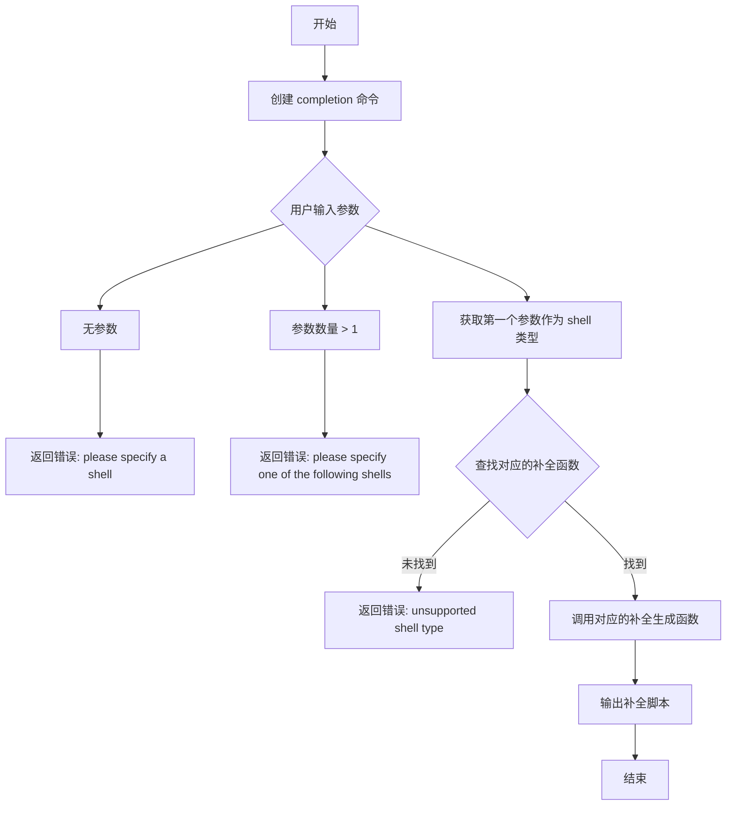
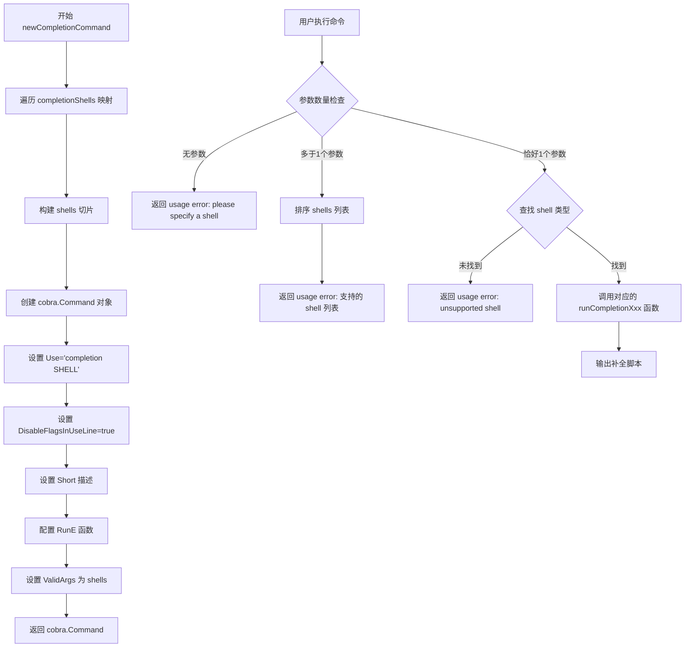
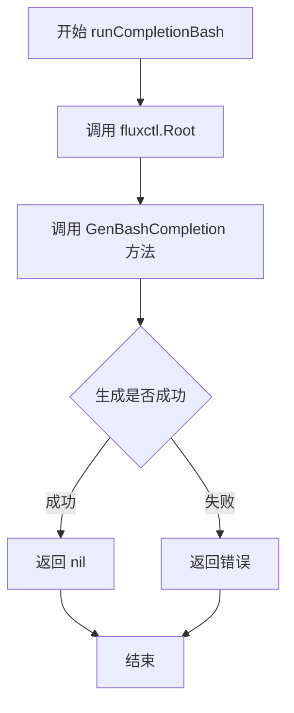
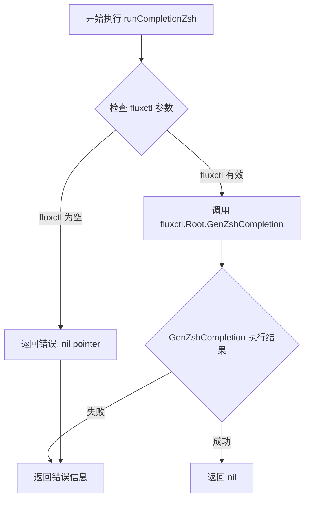
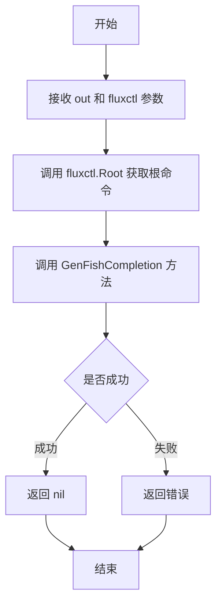

# `flux\cmd\fluxctl\completion_cmd.go` 详细设计文档

这是一个 Go 语言编写的命令行补全模块，用于为 fluxctl 工具生成 shell 补全脚本，支持 bash、zsh 和 fish 三种主流 shell 的命令补全功能。

## 整体流程



## 类结构

```
main (包)
├── 全局变量
│   └── completionShells (map[string]func)
├── 命令构建函数
│   └── newCompletionCommand()
└── 补全生成函数
    ├── runCompletionBash()
    ├── runCompletionZsh()
    └── runCompletionFish()
```

## 全局变量及字段


### `completionShells`
    
shell类型到补全生成函数的映射

类型：`map[string]func(out io.Writer, cmd *cobra.Command) error`
    


    

## 全局函数及方法


### `newCompletionCommand`

该函数创建并返回一个 Cobra 命令实例，用于生成 shell 补全代码（bash、zsh 或 fish）。它首先从全局的 `completionShells` 映射中收集支持的 shell 列表，然后构建一个带有参数验证和错误处理逻辑的 `cobra.Command`，用户通过传递 shell 类型参数来触发相应的补全脚本生成功能。

#### 全局变量

- `completionShells`：`map[string]func(out io.Writer, cmd *cobra.Command) error`，存储支持的 shell 类型及其对应的补全脚本生成函数

#### 参数

无参数

返回值：`*cobra.Command`，返回配置好的 shell 补全命令实例

#### 流程图



#### 带注释源码

```go
// newCompletionCommand 创建并返回用于生成 shell 补全代码的 cobra.Command 实例
// 该命令支持 bash、zsh 和 fish 三种 shell 的补全脚本生成
func newCompletionCommand() *cobra.Command {
	// 从 completionShells 映射中提取所有支持的 shell 名称
	shells := []string{}
	for s := range completionShells {
		shells = append(shells, s)
	}

	// 构建并返回 cobra.Command 配置对象
	return &cobra.Command{
		// Use 定义命令用法，SHELL 为占位符
		Use:                   "completion SHELL",
		// DisableFlagsInUseLine 防止flags出现在使用行中
		DisableFlagsInUseLine: true,
		// Short 提供命令简短描述
		Short:                 "Output shell completion code for the specified shell (bash, zsh, or fish)",
		// RunE 是实际执行的逻辑，返回 error 以支持错误处理
		RunE: func(cmd *cobra.Command, args []string) error {
			// 参数校验：至少需要一个 shell 参数
			if len(args) == 0 {
				return newUsageError("please specify a shell")
			}

			// 参数校验：不允许超过一个 shell 参数
			if len(args) > 1 {
				// 对 shell 列表进行排序以保证输出一致性
				sort.Strings(shells)
				return newUsageError(fmt.Sprintf("please specify one of the following shells: %s", strings.Join(shells, " ")))
			}

			// 在映射中查找用户指定的 shell 类型
			run, found := completionShells[args[0]]
			if !found {
				// 未找到时返回错误提示
				return newUsageError(fmt.Sprintf("unsupported shell type %q", args[0]))
			}

			// 找到则执行对应的补全脚本生成函数
			// cmd.OutOrStdout() 确保输出到正确目标
			return run(cmd.OutOrStdout(), cmd)
		},
		// ValidArgs 提供shell补全的建议参数
		ValidArgs: shells,
	}
}
```

### 辅助函数

#### `runCompletionBash`

生成 bash 版本的 shell 补全脚本

参数：
- `out`：`io.Writer`，输出目标
- `fluxctl`：`*cobra.Command`，命令实例

返回值：`error`，生成过程中的错误

```go
func runCompletionBash(out io.Writer, fluxctl *cobra.Command) error {
	return fluxctl.Root().GenBashCompletion(out)
}
```

#### `runCompletionZsh`

生成 zsh 版本的 shell 补全脚本

参数：
- `out`：`io.Writer`，输出目标
- `fluxctl`：`*cobra.Command`，命令实例

返回值：`error`，生成过程中的错误

```go
func runCompletionZsh(out io.Writer, fluxctl *cobra.Command) error {
	return fluxctl.Root().GenZshCompletion(out)
}
```

#### `runCompletionFish`

生成 fish 版本的 shell 补全脚本

参数：
- `out`：`io.Writer`，输出目标
- `fluxctl`：`*cobra.Command`，命令实例

返回值：`error`，生成过程中的错误

```go
func runCompletionFish(out io.Writer, fluxctl *cobra.Command) error {
	return fluxctl.Root().GenFishCompletion(out, true)
}
```

### 关键组件信息

- **cobra.Command**：Cobra 框架的核心结构，用于定义 CLI 命令
- **completionShells 映射**：存储 shell 类型到生成函数的映射，便于扩展新 shell 支持
- **ValidArgs**：为命令提供参数自动补全建议

### 潜在技术债务与优化空间

1. **硬编码的 shell 列表**：shell 类型列表通过遍历映射动态生成，但新增 shell 时仍需修改 `completionShells` 映射，建议使用插件化架构实现运行时注册
2. **缺乏单元测试**：代码中未包含针对参数验证和错误处理的单元测试用例
3. **错误处理一致性**：`newUsageError` 函数未在此文件中定义，依赖外部提供，建议明确其接口或使用标准错误包装

### 其他项目

#### 设计目标与约束

- 目标：提供跨平台（bash/zsh/fish）的命令行补全支持
- 约束：仅支持单个 shell 参数，不允许多 shell 同时指定

#### 错误处理与异常设计

- 使用 `RunE` 而非 `Run` 以支持返回错误
- 错误类型为 `newUsageError`（需外部提供），提供用户友好的错误提示
- 参数校验失败时返回带有具体建议的错误信息

#### 外部依赖与接口契约

- 依赖 `github.com/spf13/cobra` 库实现 CLI 命令框架
- 依赖 Cobra 提供的 `GenBashCompletion`、`GenZshCompletion`、`GenFishCompletion` 方法生成补全代码
- `newUsageError` 函数由外部定义，需符合 `error` 接口


### `runCompletionBash`

该函数是 Shell 补全功能的一部分，负责生成 Bash Shell 的命令补全脚本。它接收输出流和 Fluxctl 命令对象，调用 Cobra 框架的 `GenBashCompletion` 方法生成完整的 Bash 补全代码。

参数：

- `out`：`io.Writer`，用于写入生成的 Bash 补全脚本的输出流
- `fluxctl`：`*cobra.Command`，Fluxctl 的根命令对象，用于获取命令结构以生成补全

返回值：`error`，如果生成过程中发生错误则返回错误，否则返回 nil

#### 流程图



#### 带注释源码

```go
// runCompletionBash 生成 Bash Shell 的命令补全脚本
// 参数:
//   - out: io.Writer, 用于写入生成的补全脚本的输出流
//   - fluxctl: *cobra.Command, Fluxctl 的根命令对象
//
// 返回值:
//   - error: 生成过程中的错误, 成功时返回 nil
func runCompletionBash(out io.Writer, fluxctl *cobra.Command) error {
    // 调用 fluxctl 根命令的 GenBashCompletion 方法
    // 该方法会遍历所有子命令和参数, 生成符合 Bash 规范的补全脚本
    // 将生成的脚本写入 out 流中
    return fluxctl.Root().GenBashCompletion(out)
}
```


### runCompletionZsh

该函数是用于生成 Zsh Shell 命令补全脚本的核心函数，通过调用 Cobra 框架根命令的 GenZshCompletion 方法，将自动生成的 Zsh 补全代码输出到指定的写入器中。

参数：

- `out`：`io.Writer`，用于输出补全脚本的目标写入器，通常为标准输出或文件
- `fluxctl`：`*cobra.Command`，Cobra 框架的根命令对象，包含完整的命令结构信息用于生成补全脚本

返回值：`error`，如果在生成 Zsh 补全脚本过程中发生错误（如命令对象为空、写入失败等），则返回相应的错误信息；成功时返回 nil

#### 流程图



#### 带注释源码

```go
// runCompletionZsh 生成 zsh shell 的命令补全脚本
// 参数：
//   - out: io.Writer 类型，用于将生成的补全脚本输出到指定目标（标准输出/文件）
//   - fluxctl: *cobra.Command 类型，Cobra 框架的根命令对象，包含所有子命令和参数信息
//
// 返回值：
//   - error: 如果生成过程中出现错误则返回具体错误信息，成功则返回 nil
func runCompletionZsh(out io.Writer, fluxctl *cobra.Command) error {
	// 调用 Cobra 框架内置的 GenZshCompletion 方法
	// 该方法会分析 fluxctl 命令树结构，自动生成符合 Zsh 规范的补全脚本
	// 生成的脚本包含所有命令、选项、子命令的补全逻辑
	return fluxctl.Root().GenZshCompletion(out)
}
```

---

### 关键组件信息

| 组件名称 | 一句话描述 |
|---------|-----------|
| `completionShells` | 映射表，存储支持的 shell 类型及其对应的生成函数 |
| `newCompletionCommand` | 创建 shell 补全命令的工厂函数，定义命令参数验证和执行逻辑 |
| `runCompletionBash` | 生成 Bash 补全脚本的函数 |
| `runCompletionFish` | 生成 Fish 补全脚本的函数 |

---

### 潜在技术债务与优化空间

1. **缺乏错误上下文**：函数直接返回 `GenZshCompletion` 的原始错误，缺乏更详细的错误处理和日志记录
2. **硬编码的 Shell 支持**：Shell 类型被硬编码在 `completionShells` 映射中，扩展新 Shell 需要修改代码
3. **缺少补全脚本安装提示**：命令执行后没有提供如何安装补全脚本的指导信息

---

### 其它项目

#### 设计目标与约束

- 遵循 Cobra 框架的补全生成规范
- 支持三种主流 Shell 的补全生成
- 通过统一的函数签名（`func(out io.Writer, cmd *cobra.Command) error`）实现 Shell 类型扩展

#### 错误处理与异常设计

- 参数验证由调用方（`newCompletionCommand`）负责
- 生成的补全脚本写入失败会直接向上传递错误
- 建议增加对 `fluxctl.Root()` 返回值为 nil 的防御性检查

#### 数据流与状态机

```
用户输入 → completion 命令 → 参数验证 → 
选择对应 Shell 生成函数 → 调用 GenZshCompletion → 
分析命令树 → 生成补全脚本 → 输出到 Writer
```

#### 外部依赖与接口契约

- 依赖 `github.com/spf13/cobra` 框架
- 核心接口为 `cobra.Command.GenZshCompletion(io.Writer)` 方法
- 输出格式为标准的 Zsh 补全脚本（符合 Zsh completion system 规范）


### `runCompletionFish`

生成 Fish Shell 的命令补全脚本，通过调用 Cobra 库的 `GenFishCompletion` 方法实现。该函数接收一个输出 Writer 和一个 Cobra 命令对象，生成 Fish Shell 的补全代码并写入指定的输出目标。

参数：

- `out`：`io.Writer`，用于写入补全脚本的输出目标（可以是标准输出或文件）
- `fluxctl`：`*cobra.Command`，Cobra 命令对象，从中获取根命令以生成补全脚本

返回值：`error`，如果生成补全脚本时发生错误则返回错误信息，否则返回 nil

#### 流程图



#### 带注释源码

```go
// runCompletionFish 生成 Fish Shell 的命令补全脚本
// 参数:
//   - out: io.Writer, 用于写入补全脚本的输出目标
//   - fluxctl: *cobra.Command, Cobra 命令对象
//
// 返回值:
//   - error: 如果生成补全脚本时发生错误则返回错误信息，否则返回 nil
func runCompletionFish(out io.Writer, fluxctl *cobra.Command) error {
    // 调用根命令的 GenFishCompletion 方法生成 Fish Shell 补全脚本
    // 参数 true 表示包含注释说明
    return fluxctl.Root().GenFishCompletion(out, true)
}
```

## 关键组件


### Shell Completion 映射

completionShells 是一个映射表，存储支持的shell类型（bash、zsh、fish）到对应处理函数的映射，用于根据用户指定的shell类型分发到不同的补全生成函数。

### 补全命令构建器

newCompletionCommand() 函数负责创建cobra命令实例，定义命令使用方式、参数验证、shell类型检查，并返回配置好的补全命令对象。

### Bash 补全生成器

runCompletionBash 函数接受输出 writer 和 cobra.Command 引用，调用 fluxctl 根命令的 GenBashCompletion 方法生成 bash shell 补全脚本。

### Zsh 补全生成器

runCompletionZsh 函数接受输出 writer 和 cobra.Command 引用，调用 fluxctl 根命令的 GenZshCompletion 方法生成 zsh shell 补全脚本。

### Fish 补全生成器

runCompletionFish 函数接受输出 writer 和 cobra.Command 引用，调用 fluxctl 根命令的 GenFishCompletion 方法生成 fish shell 补全脚本，参数 true 表示启用命令描述。

### 错误处理

使用 newUsageError 函数生成用户友好的错误提示，处理参数为空、参数过多、不支持的shell类型等场景。


## 问题及建议


### 已知问题

- **Root() 方法空指针风险**：调用 `fluxctl.Root()` 时未检查返回值是否为 nil，如果根命令未正确初始化，可能导致空指针异常
- **参数命名混淆**：函数参数名为 `fluxctl`，但类型实际是 `*cobra.Command`，命名与语义不符，容易造成误解
- **Shell 列表顺序不确定**：通过 map 迭代获取 shell 列表，遍历顺序不确定，虽然在 RunE 中进行了排序，但 ValidArgs 在创建时已赋值，可能导致不一致
- **缺乏错误处理**：GenBashCompletion、GenZshCompletion、GenFishCompletion 方法的返回值未被处理，若生成失败用户无法获得错误信息
- **扩展性差**：新增 shell 类型需要修改 `completionShells` map 和添加新的 runCompletion 函数，不符合开闭原则

### 优化建议

- 在调用 Root() 方法前添加空值检查，或使用类型断言确保返回值的有效性
- 将参数重命名为更准确的名称，如 `cmd` 或 `rootCmd`
- 初始化时对 shells 切片进行排序，确保 ValidArgs 和错误消息中的 shell 列表一致
- 为 completion 生成方法添加错误处理，向用户返回有意义的错误信息
- 考虑将 shell 完成器注册为插件或使用接口抽象，提高可扩展性
- 添加单元测试覆盖 completion 命令的边界情况（如无效 shell 参数、Root() 为 nil 等）

## 其它


### 设计目标与约束

该代码旨在为CLI工具提供跨平台Shell自动补全功能，支持bash、zsh、fish三种主流Shell。设计约束包括：必须依赖spf13/cobra框架、仅支持Go 1.13+版本、需要在命令执行时确保父命令已完全初始化。

### 错误处理与异常设计

错误处理采用cobra标准模式，使用newUsageError返回使用方式错误。当用户未指定Shell参数时返回"please specify a shell"；当参数过多时返回支持Shell列表；当传入不支持的Shell类型时返回"unsupported shell type"错误。所有错误通过RunE函数返回，由cobra框架统一处理。

### 数据流与状态机

程序数据流如下：用户输入`completion [SHELL]`命令 → newCompletionCommand解析参数 → 验证参数数量和合法性 → 从completionShells映射查找对应Shell的处理函数 → 调用对应Shell的GenXxxCompletion方法生成补全代码 → 输出到指定Writer。无复杂状态机，仅包含参数验证和函数路由两个简单状态。

### 外部依赖与接口契约

外部依赖：github.com/spf13/cobra (v1.0.0+)、Go标准库io/strings/fmt/sort。接口契约包括：newCompletionCommand返回*cobra.Command、runCompletionXxx函数接受(io.Writer, *cobra.Command)参数并返回error、completionShells映射值为func(io.Writer, *cobra.Command) error类型。

### 安全性考虑

代码本身不涉及敏感数据处理，安全性主要体现在：输入参数通过cobra验证、不执行任何系统命令、仅生成静态补全脚本。潜在风险为生成的补全脚本包含命令路径信息，建议在部署时确保环境变量PATH的安全性。

### 性能考量

性能优化点：Shell列表在命令初始化时构建一次而非每次调用、参数验证采用简单字符串查找(O(n)但n仅为3)。由于补全脚本生成为一次性操作且数据量极小，当前实现性能足够，无需额外优化。

### 测试策略

建议测试覆盖：参数为空时的错误提示、参数过多时的错误提示、不支持Shell类型的错误提示、有效Shell类型的成功生成、ValidArgs验证功能。测试方式可使用cobra的测试辅助函数或直接调用命令并检查输出。

### 配置说明

该功能无需配置文件，通过命令行参数传递Shell类型。用户需在使用前确保目标Shell已安装，bash需版本4+、zsh需版本5.2+、fish需版本2.7+。

### 使用示例

```bash
# 生成bash补全脚本
yourapp completion bash > /etc/bash_completion.d/yourapp

# 生成zsh补全脚本
yourapp completion zsh > ~/.zsh/completions/_yourapp

# 生成fish补全脚本
yourapp completion fish > ~/.config/fish/completions/yourapp.fish
```

### 维护建议

当前代码结构清晰，扩展性良好。若需添加新Shell支持，仅需在completionShells映射中添加条目并实现对应runCompletion函数。建议保持与cobra库版本的兼容性更新，关注cobra.CompletionExported变量命名变化。


    