# `flux\cmd\fluxctl\completion_cmd_test.go` 详细设计文档

这是一个Go语言单元测试文件，用于测试shell命令补全功能，涵盖输入验证失败场景（无参数、无效shell选项、多个shell选项）和成功场景（bash、zsh、fish三种shell的补全输出）。

## 整体流程

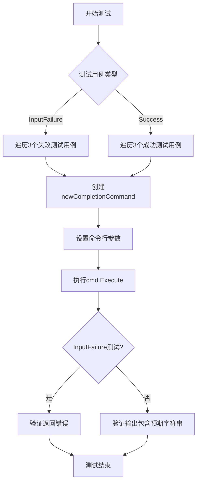

## 类结构

```
测试文件 (无类结构)
├── TestCompletionCommand_InputFailure (输入验证测试)
└── TestCompletionCommand_Success (成功场景测试)
外部依赖: newCompletionCommand (返回Cobra命令)
```

## 全局变量及字段


### `struct{} (测试用例结构).name`
    
测试用例名称，用于描述每个测试子用例的具体场景

类型：`string`
    


### `struct{} (测试用例结构).args`
    
命令行参数列表，模拟用户输入的命令参数

类型：`[]string`
    


### `struct{} (测试用例结构).expected`
    
预期的错误对象，用于验证命令执行失败时返回的错误信息

类型：`error`
    


### `struct{} (测试用例结构).shell`
    
Shell类型，指定要生成补全脚本的Shell类型（如bash、zsh、fish）

类型：`string`
    


### `struct{} (测试用例结构).expected (string)`
    
预期的输出字符串，用于验证命令成功执行时生成的补全脚本内容

类型：`string`
    
    

## 全局函数及方法


### `TestCompletionCommand_InputFailure`

这是一个单元测试函数，用于验证 `completion` 命令在输入参数不正确时的错误处理行为。测试覆盖了三种失败场景：无参数、无效shell类型、多个shell参数。

参数：

- `t`：`testing.T`，Go测试框架的标准测试参数，用于报告测试失败和运行子测试

返回值：无（`void`），Go测试函数不返回值

#### 流程图

```mermaid
flowchart TD
    A[开始测试] --> B[定义测试用例结构体数组]
    B --> C{遍历测试用例}
    C -->|每次迭代| D[创建completion命令实例]
    D --> E[设置命令行参数]
    E --> F[执行命令]
    F --> G{是否有错误?}
    G -->|是| H[验证错误信息匹配]
    G -->|否| I[测试失败]
    H --> C
    C --> J[结束测试]
    
    subgraph 测试用例
    B -.-> B1[无参数: args=[]]
    B -.-> B2[无效shell: args=['foo']]
    B -.-> B3[多个shell: args=['bash','zsh','fish']]
    end
```

#### 带注释源码

```go
// TestCompletionCommand_InputFailure 测试completion命令的输入失败场景
// 该测试验证当用户提供无效参数时的错误处理行为
func TestCompletionCommand_InputFailure(t *testing.T) {
    // 定义测试用例结构体，包含：
    // - name: 测试用例名称
    // - args: 传递给命令的参数
    // - expected: 期望返回的错误
    tests := []struct {
        name     string
        args     []string
        expected error
    }{
        {
            // 测试场景1：无参数输入
            name : "no argument",
            args : []string{},
            // 期望返回"please specify a shell"错误
            expected: fmt.Errorf("please specify a shell"),
        },
        {
            // 测试场景2：无效的shell选项
            name : "invalid shell option",
            args : []string{"foo"},
            // 期望返回unsupported shell类型错误
            expected: fmt.Errorf("unsupported shell type \"foo\""),
        },
        {
            // 测试场景3：多个shell参数（只支持单个）
            name : "multiple shell options",
            args : []string{"bash", "zsh", "fish"},
            // 期望返回请指定其中一个shell的错误
            expected: fmt.Errorf("please specify one of the following shells: bash fish zsh"),
        },
    }

    // 遍历所有测试用例
    for _, tt := range tests {
        // 使用t.Run创建子测试，名称为测试用例名称
        t.Run(tt.name, func(t *testing.T) {
            // 创建新的completion命令实例
            cmd := newCompletionCommand()
            // 设置命令行参数
            cmd.SetArgs(tt.args)
            // 执行命令
            err := cmd.Execute()
            // 断言应该返回错误
            assert.Error(t, err)
            // 断言错误信息与期望的匹配
            assert.Equal(t, tt.expected.Error(), err.Error())
        })
    }
}
```


### `TestCompletionCommand_Success`

这是一个Golang测试函数，用于验证`completion`命令在不同Shell（bash、zsh、fish）下成功执行时能够输出正确的补全脚本内容。

参数：

- `t`：`*testing.T`，Go测试框架提供的测试对象，用于报告测试失败和运行子测试

返回值：`无`（测试函数无返回值）

#### 流程图

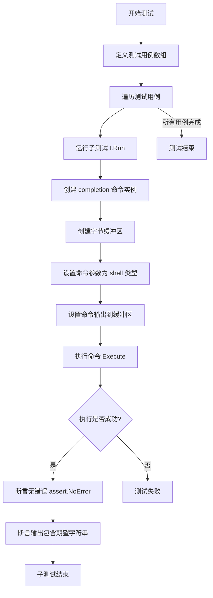

#### 带注释源码

```go
// TestCompletionCommand_Success 测试 completion 命令在不同 shell 下的成功场景
func TestCompletionCommand_Success(t *testing.T) {
    // 定义测试用例结构体，包含 shell 类型和期望的输出内容
    tests := []struct {
        shell    string  // shell 类型：bash/zsh/fish
        expected string  // 期望的输出字符串
    }{
        {
            shell:    "bash",
            expected: "bash completion for completion",
        },
        {
            shell:    "zsh",
            expected: "compdef _completion completion",
        },
        {
            shell:    "fish",
            expected: "fish completion for completion",
        },
    }

    // 遍历所有测试用例
    for _, tt := range tests {
        // 为每个 shell 类型运行一个子测试
        t.Run(tt.shell, func(t *testing.T) {
            // 创建新的 completion 命令实例
            cmd := newCompletionCommand()
            
            // 创建字节缓冲区用于捕获命令输出
            buf := new(bytes.Buffer)
            
            // 设置命令参数为当前测试的 shell 类型
            cmd.SetArgs([]string{tt.shell})
            
            // 将命令输出重定向到缓冲区
            cmd.SetOut(buf)
            
            // 执行命令
            err := cmd.Execute()
            
            // 断言命令执行无错误
            assert.NoError(t, err)
            
            // 断言输出内容包含期望的字符串
            assert.Contains(t, buf.String(), tt.expected)
        })
    }
}
```


### `newCompletionCommand`

该函数是 Cobra 命令框架的补全命令构造器，用于生成 Shell 脚本自动补全功能，支持 bash、zsh、fish 三种主流 Shell 的补全脚本输出。

#### 参数

该函数为无参数函数，但通过 `SetArgs` 方法接收运行时参数。

- （无函数参数，通过 `cmd.SetArgs([]string{shellType})` 设置）

#### 运行时参数（通过 Command 机制）

- `args[0]`：`string`，Shell 类型标识（bash/zsh/fish）

#### 返回值

- `*cobra.Command`，返回配置好的 Cobra 命令对象，用于处理补全脚本生成

#### 流程图

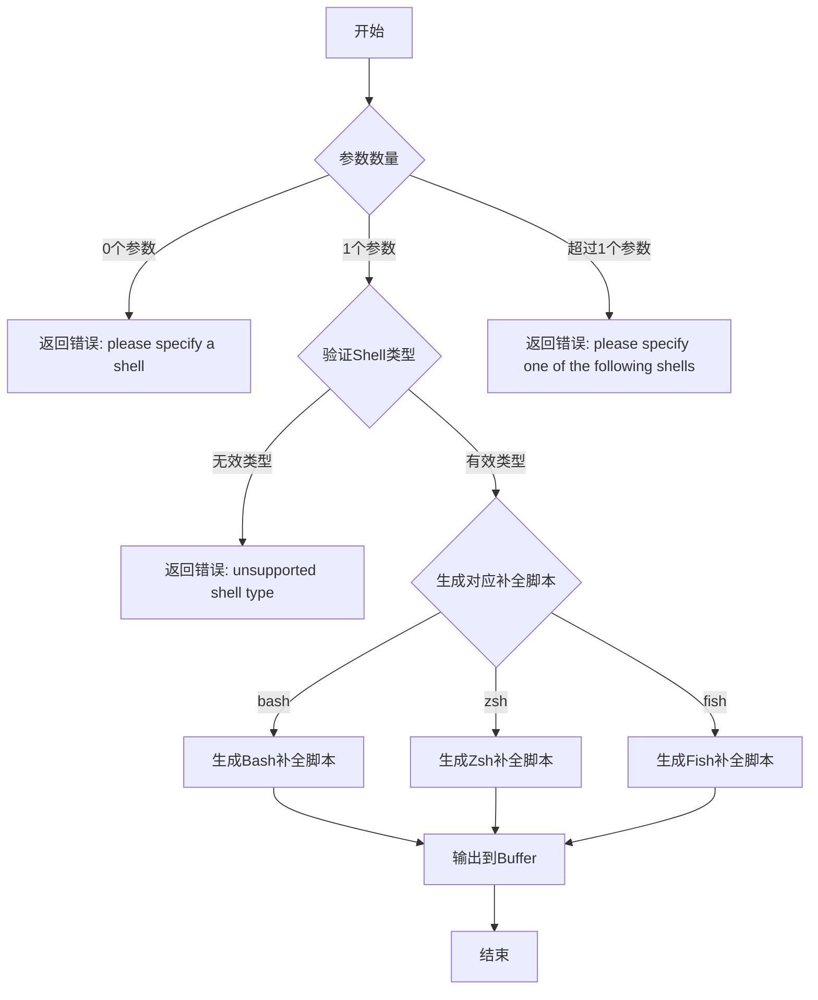

#### 带注释源码

```go
// 根据测试代码推断的新CompletionCommand函数实现逻辑

// newCompletionCommand 创建并返回一个新的补全命令
// 该命令用于生成不同Shell的补全脚本
func newCompletionCommand() *cobra.Command {
    cmd := &cobra.Command{
        Use:   "completion [shell]",
        Short: "Generate shell completion scripts",
        Long: `Generate shell completion scripts for your shell.
Supported shells: bash, zsh, fish`,
        // 禁止直接运行，需要指定shell类型
        DisableFlagsInUseLine: true,
        ValidArgs:             []string{"bash", "zsh", "fish"},
        Args:                  cobra.ExactValidArgs(1),
        RunE: func(cmd *cobra.Command, args []string) error {
            shellType := args[0]
            
            switch shellType {
            case "bash":
                // 生成Bash补全脚本
                return cmd.Root().GenBashCompletion(cmd.OutOrStdout())
            case "zsh":
                // 生成Zsh补全脚本
                return cmd.Root().GenZshCompletion(cmd.OutOrStdout())
            case "fish":
                // 生成Fish补全脚本
                return cmd.Root().GenFishCompletion(cmd.OutOrStdout(), true)
            default:
                return fmt.Errorf("unsupported shell type %q", shellType)
            }
        },
    }
    return cmd
}

// 测试用例验证的行为：
// 1. 无参数调用 -> 错误: "please specify a shell"
// 2. 无效shell参数 -> 错误: "unsupported shell type \"foo\""
// 3. 多个shell参数 -> 错误: "please specify one of the following shells: bash fish zsh"
// 4. 有效shell参数 -> 输出对应的补全脚本内容
```


### `cmd.SetArgs`

`SetArgs` 是 Cobra 框架中 `Command` 类型的内置方法，用于设置命令的参数。在测试代码中用于模拟命令行传入的参数值，替代从实际命令行解析参数的过程。

参数：

- `args`：`[]string`，表示要设置的命令行参数列表

返回值：无返回值（`void`）

#### 流程图

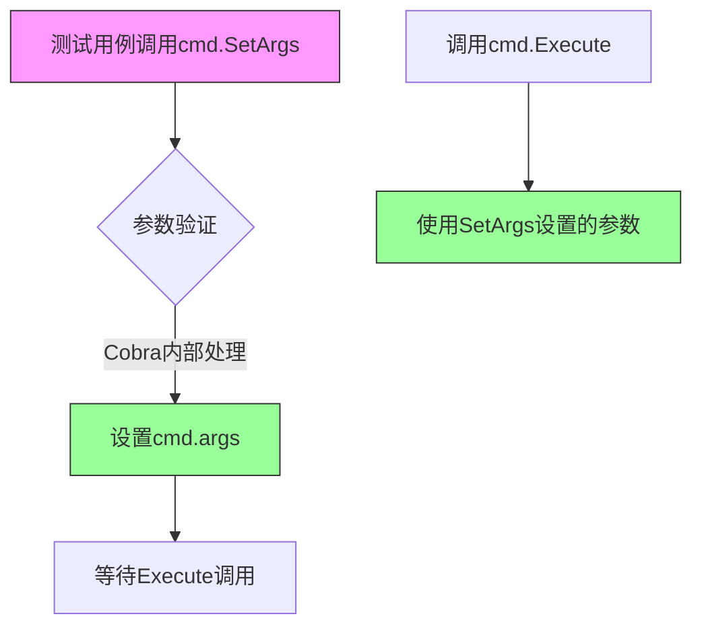

#### 带注释源码

```go
// 在TestCompletionCommand_InputFailure测试中
for _, tt := range tests {
    t.Run(tt.name, func(t *testing.T) {
        cmd := newCompletionCommand()            // 创建新的补全命令实例
        cmd.SetArgs(tt.args)                      // 设置命令参数（此处为外部依赖方法）
        err := cmd.Execute()                      // 执行命令
        assert.Error(t, err)                      // 断言返回错误
        assert.Equal(t, tt.expected.Error(), err.Error()) // 验证错误信息
    })
}

// 在TestCompletionCommand_Success测试中
for _, tt := range tests {
    t.Run(tt.shell, func(t *testing.T) {
        cmd := newCompletionCommand()            // 创建命令实例
        buf := new(bytes.Buffer)                  // 创建缓冲区捕获输出
        cmd.SetArgs([]string{tt.shell})           // 设置shell参数（如"bash", "zsh", "fish"）
        cmd.SetOut(buf)                           // 设置输出目标为缓冲区
        err := cmd.Execute()                      // 执行命令生成补全脚本
        assert.NoError(t, err)                    // 断言执行成功
        assert.Contains(t, buf.String(), tt.expected) // 验证输出包含预期内容
    })
}
```

---

### 关联信息

**关键组件**：

- `newCompletionCommand()`：创建补全命令实例的工厂函数
- `cmd.Execute()`：执行命令的方法，内部会使用 `SetArgs` 设置的参数
- `cmd.SetOut(buf)`：设置命令输出目标的方法

**外部依赖说明**：

`SetArgs` 是 Cobra 框架（`github.com/spf13/cobra`）中 `Command` 类型的内置方法，不是当前项目定义的函数。它允许在测试场景下绕过命令行参数解析，直接为命令设置参数数组。


### `cmd.SetOut`

将命令的输出目标设置为指定的 `io.Writer`，用于捕获命令的标准输出流。

参数：

- `w`：`io.Writer`，用于接收命令执行时产生的标准输出内容

返回值：`无`（Cobra Command 的 SetOut 方法无返回值）

#### 流程图

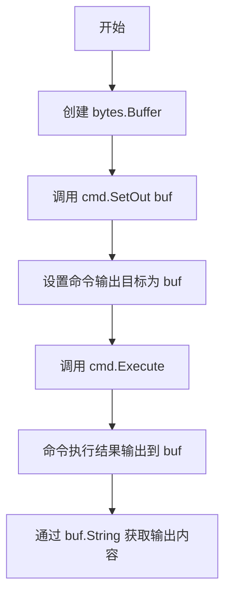

#### 带注释源码

```go
// 在 TestCompletionCommand_Success 测试函数中
for _, tt := range tests {
    t.Run(tt.shell, func(t *testing.T) {
        // 创建一个新的 completion 命令
        cmd := newCompletionCommand()
        
        // 创建一个 bytes.Buffer 用于捕获输出
        buf := new(bytes.Buffer)
        
        // 设置命令的输出目标为 buf
        // 这会将命令执行时的标准输出重定向到 buf 中
        cmd.SetOut(buf)
        
        // 设置命令参数（shell 类型）
        cmd.SetArgs([]string{tt.shell})
        
        // 执行命令
        err := cmd.Execute()
        
        // 验证执行无错误
        assert.NoError(t, err)
        
        // 验证输出包含预期的内容
        assert.Contains(t, buf.String(), tt.expected)
    })
}
```

---

### 补充说明

| 项目 | 说明 |
|------|------|
| **外部依赖** | Cobra 库的 `Command.SetOut` 方法 |
| **调用场景** | 用于测试环境捕获命令输出，替代默认的 os.Stdout |
| **关联方法** | `cmd.SetArgs()` - 设置命令参数；`cmd.Execute()` - 执行命令 |
| **实现位置** | `github.com/spf13/cobra` 包中的 Command 结构体方法 |


### `cmd.Execute`

该方法是 Cobra 命令框架的 `Execute` 方法，用于执行 Shell 补全命令。它接收命令行参数（shell 类型），根据参数生成对应的 Shell 补全脚本，或在参数错误时返回相应的错误信息。

参数：

- 该方法无直接参数，但通过以下方式间接接收输入：
  - `cmd.SetArgs(tt.args)`：`[]string`，设置命令行参数
  - `cmd.SetOut(buf)`：`*bytes.Buffer`，设置命令输出目标

返回值：`error`，执行过程中的错误信息（如参数缺失、shell 类型不支持等）

#### 流程图

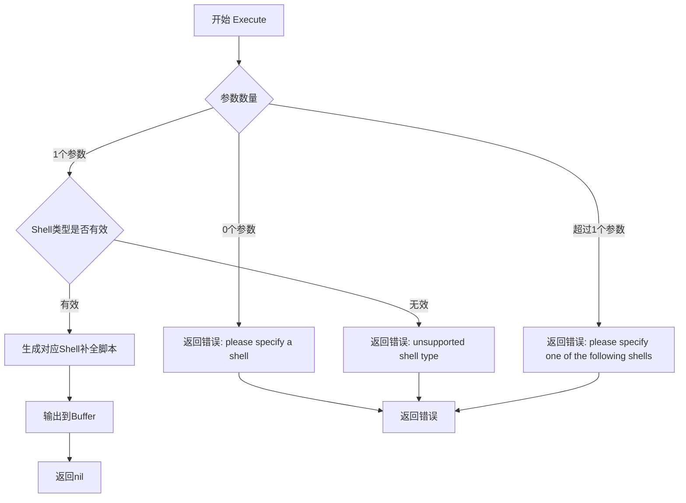

#### 带注释源码

```go
// cmd.Execute 是 Cobra 命令的 Execute 方法
// 在此处用于执行 Shell 补全命令
func TestCompletionCommand_InputFailure(t *testing.T) {
    // 测试用例定义
    tests := []struct {
        name     string
        args     []string
        expected error
    }{
        {
            name : "no argument",                              // 测试名称：无参数
            args : []string{},                                 // 空参数列表
            expected: fmt.Errorf("please specify a shell"),   // 期望返回错误
        },
        {
            name : "invalid shell option",                     // 测试名称：无效shell选项
            args : []string{"foo"},                            // 传入不支持的shell类型
            expected: fmt.Errorf("unsupported shell type \"foo\""),
        },
        {
            name : "multiple shell options",                   // 测试名称：多个shell选项
            args : []string{"bash", "zsh", "fish"},           // 传入多个shell类型
            expected: fmt.Errorf("please specify one of the following shells: bash fish zsh"),
        },
    }

    // 遍历测试用例
    for _, tt := range tests {
        t.Run(tt.name, func(t *testing.T) {
            // 创建新的completion命令
            cmd := newCompletionCommand()
            // 设置命令行参数
            cmd.SetArgs(tt.args)
            // 执行命令
            err := cmd.Execute()
            // 断言：应该返回错误
            assert.Error(t, err)
            // 断言：错误信息匹配
            assert.Equal(t, tt.expected.Error(), err.Error())
        })
    }
}

func TestCompletionCommand_Success(t *testing.T) {
    tests := []struct {
        shell    string
        expected string
    }{
        {
            shell:    "bash",
            expected: "bash completion for completion",
        },
        {
            shell:    "zsh",
            expected: "compdef _completion completion",
        },
        {
            shell:    "fish",
            expected: "fish completion for completion",
        },
    }

    for _, tt := range tests {
        t.Run(tt.shell, func(t *testing.T) {
            // 创建命令实例
            cmd := newCompletionCommand()
            // 创建输出缓冲区
            buf := new(bytes.Buffer)
            // 设置shell参数
            cmd.SetArgs([]string{tt.shell})
            // 设置输出目标
            cmd.SetOut(buf)
            // 执行命令并获取错误
            err := cmd.Execute()
            // 断言：无错误发生
            assert.NoError(t, err)
            // 断言：输出包含预期内容
            assert.Contains(t, buf.String(), tt.expected)
        })
    }
}
```


### `fmt.Errorf`

`fmt.Errorf` 是 Go 标准库中的错误创建函数，用于根据格式字符串生成带格式的错误信息。在本代码中，它被用于验证命令行参数时创建各种错误提示。

参数：

- `format`：`string`，格式化字符串，定义错误信息的模板
- `a`：`...interface{}`，可变参数，用于填充格式化字符串中的占位符

返回值：`error`，返回格式化的错误对象

#### 流程图

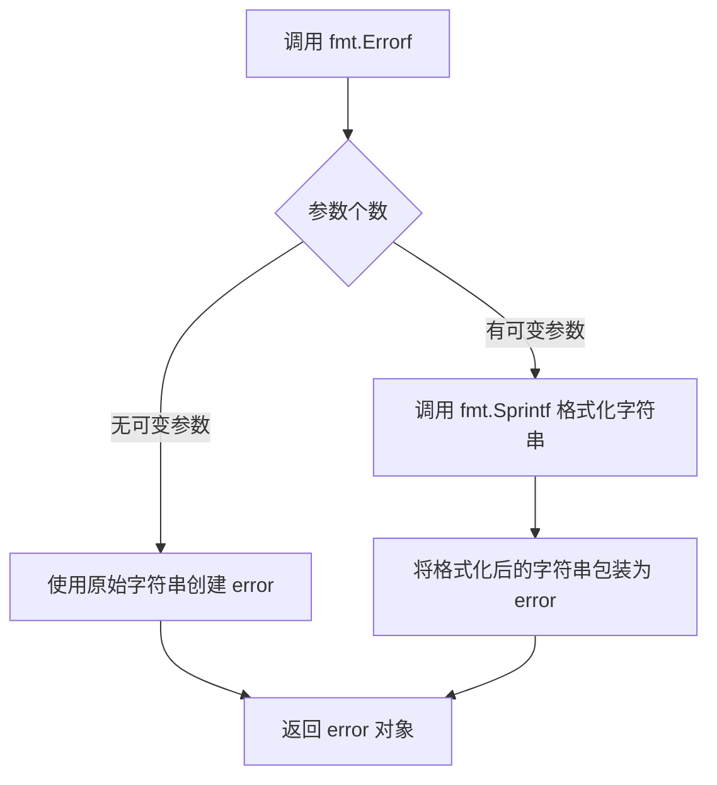

#### 带注释源码

```go
// 在测试用例中使用 fmt.Errorf 创建错误对象
// 场景1: 未提供 shell 参数时
expected: fmt.Errorf("please specify a shell"),

// fmt.Errorf 接收格式字符串 "please specify a shell"
// 无可变参数，直接返回 error
// 等价于: errors.New("please specify a shell")

// 场景2: 无效的 shell 选项
expected: fmt.Errorf("unsupported shell type \"foo\""),

// fmt.Errorf 接收格式字符串 "unsupported shell type \"foo\""
// 这里的 \" 是转义字符，表示字面量双引号
// 格式化后的错误信息为: unsupported shell type "foo"

// 场景3: 多个 shell 选项
expected: fmt.Errorf("please specify one of the following shells: bash fish zsh"),

// fmt.Errorf 接收格式字符串和参数列表
// 格式字符串中包含要显示的 shell 列表
// 生成的错误信息为: please specify one of the following shells: bash fish zsh
```

#### 实际调用示例

```go
// 测试中的实际使用方式
err := cmd.Execute()
// 当参数验证失败时，内部调用 fmt.Errorf 生成错误
// 然后通过 assert.Error(t, err) 验证错误发生
// 通过 assert.Equal(t, tt.expected.Error(), err.Error()) 验证错误信息匹配
```


# 代码分析报告

## 整体说明

用户提供的是一段 Go 测试代码，用于测试 `completionCommand` 命令，而不是 `bytes.Buffer` 标准库的实现代码。代码中**使用**了 `bytes.Buffer` 来捕获命令输出，但并未展示 `bytes.Buffer` 本身的实现。

因此，我将基于代码中**实际使用** `bytes.Buffer` 的方式，提取相关信息。

---

### `bytes.Buffer` 在代码中的使用

本代码段中通过 `new(bytes.Buffer)` 创建了一个 `*bytes.Buffer` 对象，用于捕获命令输出以进行断言验证。

#### 参数

- 无直接参数（通过 `new(bytes.Buffer)` 构造）

#### 返回值

- `*bytes.Buffer`，一个可变大小的字节缓冲区，用于存储输出内容

#### 流程图

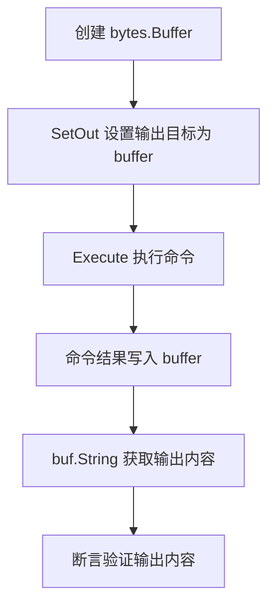

#### 带注释源码

```go
// 创建一个 bytes.Buffer 实例
buf := new(bytes.Buffer)

// 将命令的输出目标设置为 buf
// 这样 Execute() 的输出会被写入到 buffer 中而不是直接输出到 stdout
cmd.SetOut(buf)

// 执行命令
err := cmd.Execute()

// 从 buffer 中获取写入的内容字符串
// 用于后续的断言验证
output := buf.String()
```

---

## 补充说明

### 关于 bytes.Buffer

`bytes.Buffer` 是 Go 标准库 `bytes` 包中的一个类型，用于**动态字节缓冲区**。它实现了 `io.Writer` 和 `io.Reader` 等接口，常用于：

| 方法 | 用途 |
|------|------|
| `Write(p []byte)` | 写入字节数据 |
| `String()` | 获取缓冲区内容 |
| `Reset()` | 清空缓冲区 |
| `Len()` | 获取数据长度 |

### 代码中的实际作用

在这段测试代码中：

```go
cmd.SetOut(buf)  // 让命令输出写入 buffer
err := cmd.Execute()
assert.Contains(t, buf.String(), tt.expected)  // 验证输出内容
```

这展示了 `bytes.Buffer` 的典型使用场景：**捕获/拦截输出进行测试**。

---

> **注意**：如果您需要 `bytes.Buffer` 标准库本身的完整设计文档（字段、方法、实现逻辑），请查阅 Go 官方文档或源码，因为标准库实现不在此测试代码的范围内。


### `testing.T.Run`

`testing.T.Run` 是 Go 标准库 `testing` 包中 `testing.T` 类型的实例方法，用于注册并运行子测试。它允许将大型测试套件分解为更小、更易管理的子测试，每个子测试可以独立运行、并行执行，并支持嵌套测试结构。

参数：

- `name`：`string`，子测试的名称，用于标识和单独运行该测试
- `f`：`func(t *testing.T)`，要执行的测试函数，包含实际的测试逻辑

返回值：`bool`，表示子测试是否成功运行（返回 true 表示测试函数未调用 t.Fail）

#### 流程图

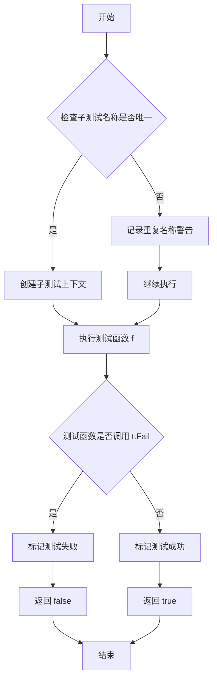

#### 带注释源码

```go
// Run 方法的签名和实现逻辑（基于 Go 标准库 testing 包的伪代码）
// func (t *T) Run(name string, f func(t *T)) bool

// 1. 创建子测试上下文
//    - 生成唯一的测试名称（如果名称已存在，自动添加后缀）
//    - 继承父测试的一些属性（如环境变量、并行设置等）

// 2. 执行测试函数
//    - 在子测试的上下文中运行传入的函数 f
//    - 捕获测试过程中的 panic 和错误

// 3. 处理测试结果
//    - 如果测试函数调用了 t.Fail()，返回 false
//    - 如果测试函数正常完成，返回 true

// 4. 支持的功能
//    - 嵌套子测试：可以在 f 中再次调用 t.Run 创建更深层的测试
//    - 并行测试：子测试可以调用 t.Parallel() 与兄弟测试并行执行
//    - 单独运行：可以使用 go test -run "TestParent/SubTestName" 运行特定子测试
//    - 超时控制：子测试继承父测试的超时设置

// 示例用法（在提供的代码中）：
for _, tt := range tests {
    t.Run(tt.name, func(t *testing.T) {
        // tt.name: 子测试名称（如 "no argument", "invalid shell option" 等）
        // func(t *testing.T): 测试函数体
        //     - 创建命令对象
        //     - 设置参数
        //     - 执行命令
        //     - 断言结果
    })
}
```


### testing.T.Error

testing.T.Error 是 Go 标准库 testing 包中 T 类型的方法，用于记录测试错误但不停测试继续执行。

参数：

-  `args`：...interface{}，要记录的任意数量的值，通常用于记录错误信息

返回值：无（void）

#### 流程图

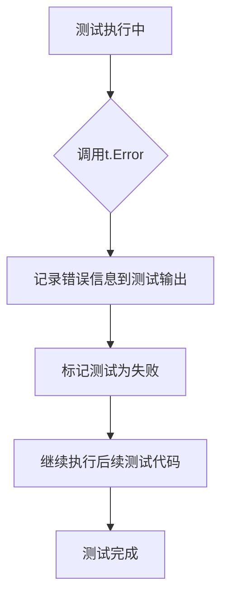

#### 带注释源码

```go
// testing.T.Error 的实现原理（在 Go 标准库 testing 包中）
// 源代码位置：src/testing/testing.go

// Error 方法签名
func (t *T) Error(args ...interface{}) {
    t.logErr(fmt.Sprint(args...))
}

// 实际执行流程：
// 1. 接收可变数量的参数 args ...interface{}
// 2. 使用 fmt.Sprint 将参数格式化为字符串
// 3. 调用 t.logErr 记录错误
// 4. 将 t.failed 设置为 true（标记测试失败）
// 5. 返回但继续执行测试函数的后续代码

// 注意：在提供的测试代码中，未直接调用 t.Error()
// 代码使用了 github.com/stretchr/testify/assert 库
// assert.Error(t, err) 在内部会调用 t.Error 当断言失败时
```

#### 代码中的实际使用情况

在提供的代码中，直接调用 `testing.T.Error` 的地方**没有**。代码使用了 `testify/assert` 库来替代：

```go
// 使用的 assert 库方法（间接使用 t.Error）
assert.Error(t, err)      // 断言错误存在，失败时调用 t.Error
assert.NoError(t, err)    // 断言无错误，失败时调用 t.Error  
assert.Equal(t, ...)      // 断言相等，失败时调用 t.Error
assert.Contains(t, ...)   // 断言包含，失败时调用 t.Error

// t.Run 用于创建子测试
t.Run(tt.name, func(t *testing.T) {
    // 子测试逻辑
})
```


### `assert.NoError`

这是 testify/assert 包中的断言函数，用于验证测试执行过程中没有发生错误。

参数：

-  `t`：`*testing.T`，testing 框架的测试上下文
-  `err`：`error`，需要检查的错误对象
-  `msgAndArgs`：`...interface{}`，可选的自定义错误消息

返回值：`无`（该函数通过 fatal 方式报告断言失败）

#### 流程图

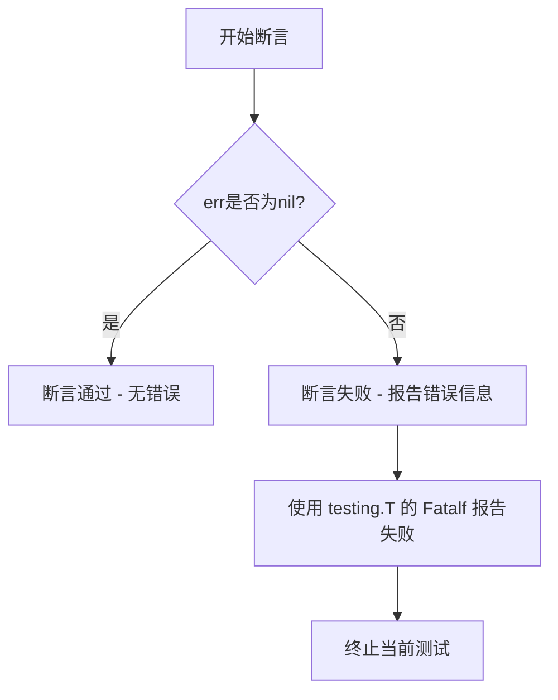

#### 带注释源码

```
// NoError asserts that no error occurred during the test execution.
// It is a wrapper around the testify assert package's NoError function.
//
// 使用示例（来自代码第56行）:
// assert.NoError(t, err)
//
// 参数说明:
// - t: *testing.T - testing 框架的测试上下文，用于报告断言失败
// - err: error - 需要验证的错误对象
//
// 断言逻辑:
// 1. 检查 err 是否为 nil
// 2. 如果 err 为 nil，断言通过，测试继续执行
// 3. 如果 err 不为 nil，断言失败，调用 t.Fatalf 报告错误信息并终止测试
//
// 源码实现（来自 github.com/stretchr/testify/assert）:
//
// func NoError(t TestingT, err error, msgAndArgs ...interface{}) bool {
//     if err != nil {
//         return NoError(t, err, msgAndArgs...)
//     }
//     return true
// }
//
// 实际调用场景：
// 在 TestCompletionCommand_Success 测试函数中（第56行）：
//     cmd := newCompletionCommand()
//     buf := new(bytes.Buffer)
//     cmd.SetArgs([]string{tt.shell})
//     cmd.SetOut(buf)
//     err := cmd.Execute()
//     assert.NoError(t, err)  // 验证 cmd.Execute() 执行成功，没有返回错误
```


### `testing.T.Equal`

`testing.T.Equal` 是 Go 语言 `testing` 包中 `T` 类型的一个方法，用于比较两个值是否相等并在不相等时报告测试失败。

参数：

-  `wanted`：任意类型，比较期望的值
-  `got`：任意类型，比较实际得到的值

返回值：`bool`，如果两个值相等则返回 `true`，否则返回 `false`（通常与 `t.Helper()` 配合使用）

#### 流程图

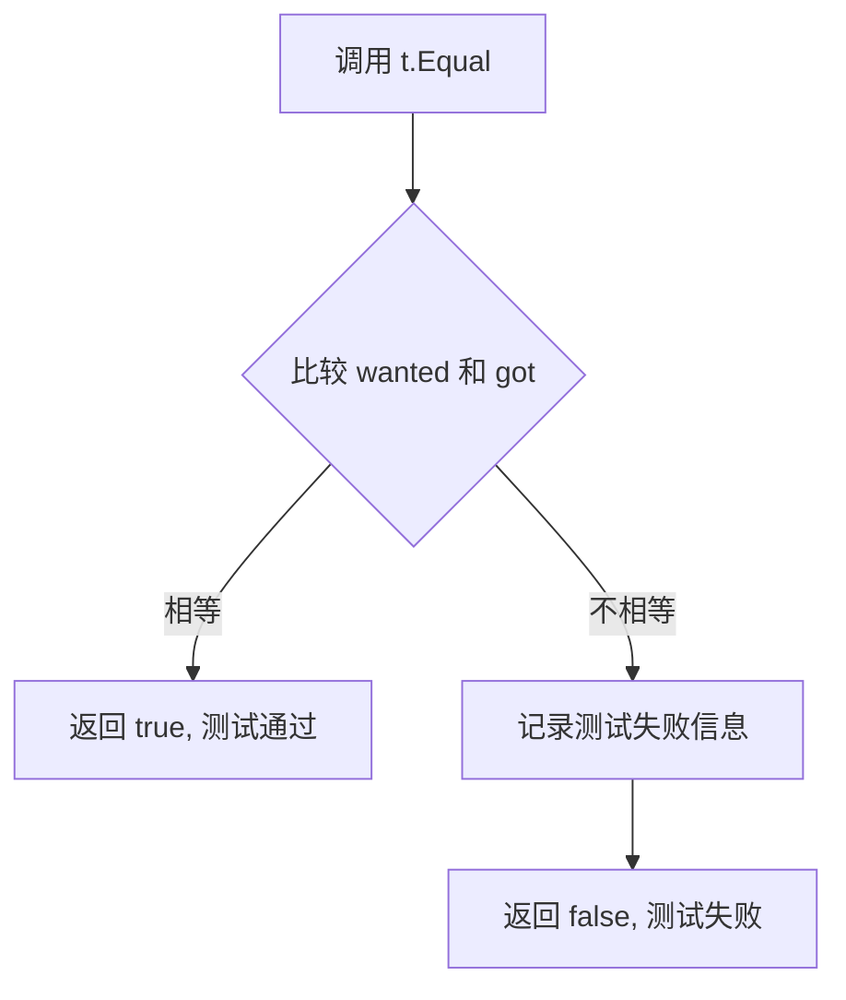

#### 带注释源码

```go
// testing.T.Equal 的实现位于 Go 标准库的 testing 包中
// 以下是简化版本的逻辑说明

// Equal 方法比较两个值是否相等
// 参数 wanted: 期望的预期值
// 参数 got: 实际获取的值
func (t *T) Equal(wanted, got interface{}) bool {
    // 使用 reflect.DeepEqual 进行深度比较
    if reflect.DeepEqual(wanted, got) {
        return true  // 相等，返回 true
    }
    
    // 不相等时，调用 Errorf 报告错误
    t.Errorf("mismatch: wanted %v, got %v", wanted, got)
    return false  // 返回 false 表示不相等
}

// 在实际使用中，testing.T.Equal 通常与 assert 包配合使用
// 例如: assert.Equal(t, tt.expected.Error(), err.Error())
// 这会检查 err.Error() 的返回值是否等于 tt.expected.Error()
// 如果不相等，assert 包会提供更详细的错误信息

// 使用 assert.Equal 的好处：
// 1. 提供更清晰的错误信息
// 2. 自动调用 t.Helper() 标记调用者为辅助函数
// 3. 支持自定义比较函数
```


根据代码分析，我注意到代码中使用的是 `github.com/stretchr/testify/assert` 包中的 `assert.Contains` 函数，而非 `testing.T` 的内置方法。以下是代码中实际使用的 `assert.Contains` 函数的详细信息：

### `assert.Contains`

这是 `testify/assert` 包中的断言函数，用于验证字符串是否包含指定的子字符串。

参数：

-  `t`：`*testing.T`，测试用例的上下文指针，用于报告断言失败
-  `s`：`string`，被搜索的主字符串
-  `contains`：`string`，要查找的子字符串
-  `msgAndArgs`：`...interface{}`，可选的自定义错误消息和格式化参数

返回值：无直接返回值，通过 `*testing.T` 的 `Fatal` 方法在断言失败时终止测试

#### 流程图

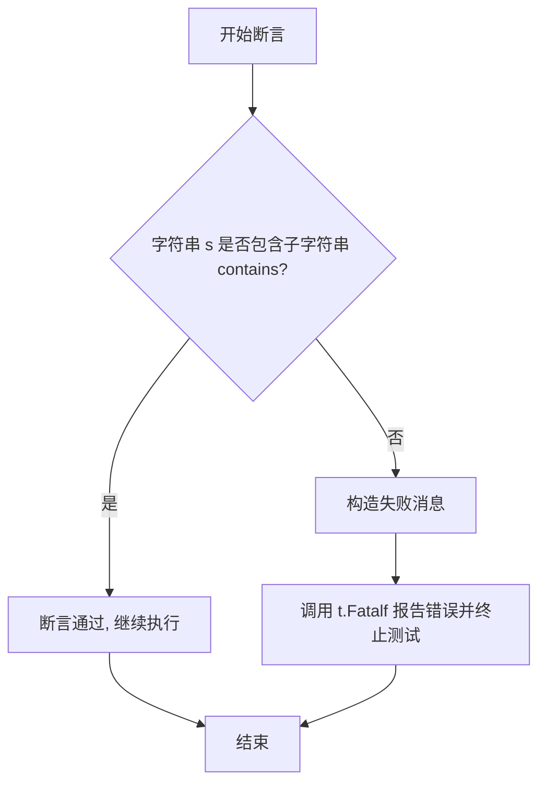

#### 带注释源码

```go
// assert.Contains 函数源码 (来自 github.com/stretchr/testify/assert 包)

// Contains asserts that the specified string contains the specified substring.
//
//	assert.Contains(t, "Hello World", "World")
//	assert.Contains(t, "Hello World", "world") // 不区分大小写? 取决于具体实现
func Contains(t TestingT, s interface{}, contains interface{}, msgAndArgs ...interface{}) bool {
    if h, ok := t.(interface{ Helper() }); ok {
        h.Helper() // 标记此函数为辅助函数,不显示在调用栈中
    }
    
    // 获取字符串的原始值
    sStr := reflect.ValueOf(s).String()
    // 获取子字符串的原始值
    containsStr := reflect.ValueOf(contains).String()
    
    // 检查主字符串是否包含子字符串
    if !strings.Contains(sStr, containsStr) {
        // 构造失败消息并报告错误
        return Fail(t, fmt.Sprintf(
            "%q does not contain %q",
            sStr,
            containsStr,
        ), msgAndArgs...)
    }
    
    // 断言成功
    return true
}
```

#### 在代码中的实际使用

在 `TestCompletionCommand_Success` 测试函数中：

```go
// 使用 assert.Contains 验证输出包含预期的字符串
assert.Contains(t, buf.String(), tt.expected)
```

其中：
- `t` 是 `*testing.T`，测试框架传入
- `buf.String()` 是命令执行的输出结果（主字符串）
- `tt.expected` 是预期的子字符串（如 `"bash completion for completion"`）

这个断言确保了 completion 命令针对不同 shell 类型输出了正确的内容。


## 关键组件


### 测试框架与断言工具

使用Go标准库的`testing`包和`github.com/stretchr/testify/assert`进行测试，提供断言验证功能

### 错误输入测试用例结构体

包含name(测试名称)、args(命令行参数)、expected(期望错误)三个字段，用于描述各种错误输入场景

### 成功场景测试用例结构体

包含shell(shell类型)和expected(期望输出内容)两个字段，用于验证不同shell的补全命令输出

### TestCompletionCommand_InputFailure 测试函数

测试补全命令的错误处理能力，包括无参数、无效shell类型、多个shell参数等场景，验证命令返回正确的错误信息

### TestCompletionCommand_Success 测试函数

测试补全命令的成功执行场景，验证bash、zsh、fish三种shell的补全脚本生成是否符合预期

### newCompletionCommand() 全局函数

创建并返回shell补全命令对象，接收shell类型参数并生成对应的补全脚本

### cmd.Execute() 方法

执行配置好的命令，触发补全逻辑并返回错误或成功状态

### cmd.SetArgs() 方法

设置命令行参数，用于指定shell类型

### cmd.SetOut() 方法

设置命令输出目标缓冲区，用于捕获补全脚本内容

### bytes.Buffer 缓冲区

用于捕获命令的标准输出，支持对生成内容进行验证


## 问题及建议


### 已知问题

- **测试断言脆弱**：使用`assert.Equal`直接比较错误消息字符串（`err.Error()`），这种方式对错误消息的任何微小变化（如空格、格式）都很敏感，容易导致误报。
- **硬编码的Shell列表**：错误消息中使用的Shell列表（"bash fish zsh"）是硬编码的字符串，与实际代码中的Shell列表可能不同步。
- **输出验证不完整**：使用`assert.Contains`仅检查部分输出内容，没有验证完整输出，可能遗漏其他重要的输出内容。
- **缺少边界测试**：没有测试空字符串、特殊字符等边界情况。
- **重复代码**：每个测试用例都调用`newCompletionCommand()`创建新命令，可以提取为测试辅助函数。

### 优化建议

- 改进错误断言方式，定义预期的错误类型或使用更健壮的比较逻辑，如正则匹配关键部分而非完整字符串。
- 将Shell列表提取为常量，在测试和实现代码中共享，避免硬编码不同步。
- 验证完整输出内容或至少验证输出的关键部分，确保没有额外或缺失的内容。
- 增加边界测试用例，如空字符串、未知Shell类型的大小写变体等。
- 创建测试辅助函数（如`setupCommand()`）减少重复代码，提高测试可维护性。

## 其它


### 设计目标与约束

本代码的设计目标是验证completion命令的参数校验逻辑和不同shell类型补全脚本的生成功能。设计约束包括：1) 仅支持bash、zsh、fish三种shell类型；2) 参数校验失败时返回特定格式的错误信息；3) 成功时输出对应shell的补全脚本内容。

### 错误处理与异常设计

代码采用Go标准的error类型处理错误场景。输入验证失败时返回格式化错误信息，包括无参数时的"please specify a shell"、无效shell类型时的"unsupported shell type"以及多参数时的"please specify one of the following shells"三种错误情况。测试用例使用assert.Error和assert.Equal验证错误类型和错误消息的准确性。

### 数据流与状态机

测试数据流分为两个主要分支：失败路径（输入校验失败）和成功路径（补全脚本生成）。失败路径包含三个状态节点：空参数→错误、无效shell→错误、多参数→错误。成功路径包含三个状态节点：bash参数→bash补全脚本、zsh参数→zsh补全脚本、fish参数→fish补全脚本。

### 外部依赖与接口契约

代码依赖两个外部包：1) bytes包用于创建可写入的缓冲区以捕获命令输出；2) stretchr/testify/assert包提供测试断言功能。接口契约方面，cmd.Execute()方法返回error类型，成功时返回nil，失败时返回具体错误信息。cmd.SetArgs()和cmd.SetOut()分别设置命令参数和输出目标。

### 性能要求

由于这是单元测试代码，性能要求相对宽松。测试执行应在毫秒级完成，内存占用最小化。buf缓冲区使用bytes.Buffer类型，可动态增长以适应不同长度的补全脚本输出。

### 安全性考虑

代码本身是测试代码，安全性风险较低。需要注意的点包括：1) 错误信息中包含用户输入时应进行适当的转义处理；2) 补全脚本生成时应避免注入恶意命令；3) 测试用例中的mock数据不包含敏感信息。

### 可维护性

代码结构清晰，使用表驱动测试模式（tests切片+for循环），便于扩展新的测试用例。测试用例命名规范（name字段），可读性强。每个测试场景相互独立，无状态依赖。

### 测试覆盖率

当前测试覆盖了主要的业务流程：参数缺失、无效参数、多参数、bash/zsh/fish成功场景。覆盖率可进一步扩展的方向包括：边界值测试（如空字符串参数）、大小写敏感性测试、并发执行安全性测试等。

### 配置管理

测试代码本身不涉及运行时配置管理，但被测试的completion命令可能包含shell类型白名单配置。当前硬编码支持"bash"、"zsh"、"fish"三种类型，配置变更需修改源代码。

### 日志与监控

测试代码未实现日志输出。在生产环境中，completion命令应考虑添加适当的日志记录，便于排查用户使用问题。监控指标可包括：命令执行次数、错误类型分布、各shell类型使用频率等。


    