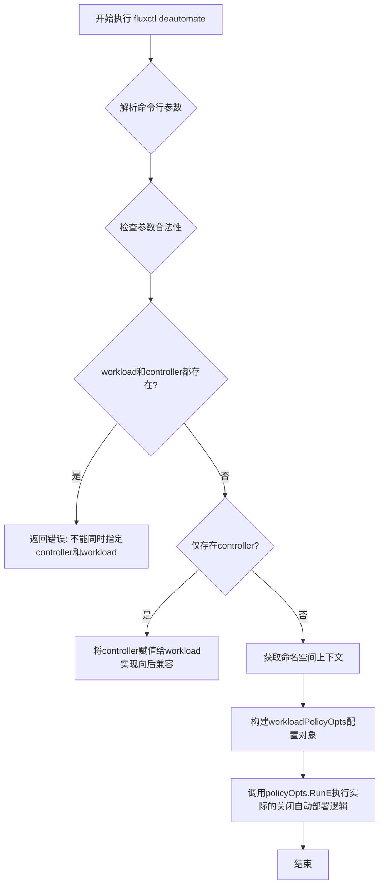
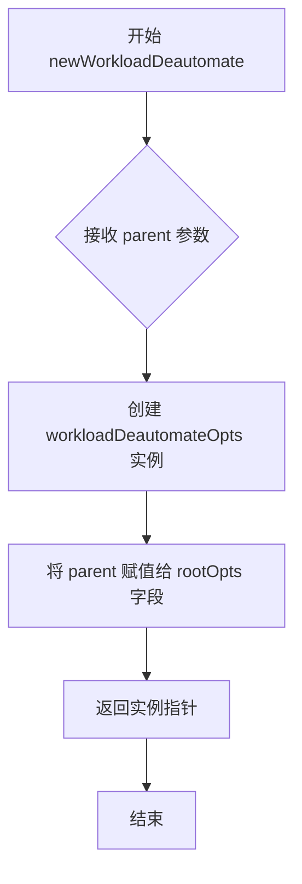
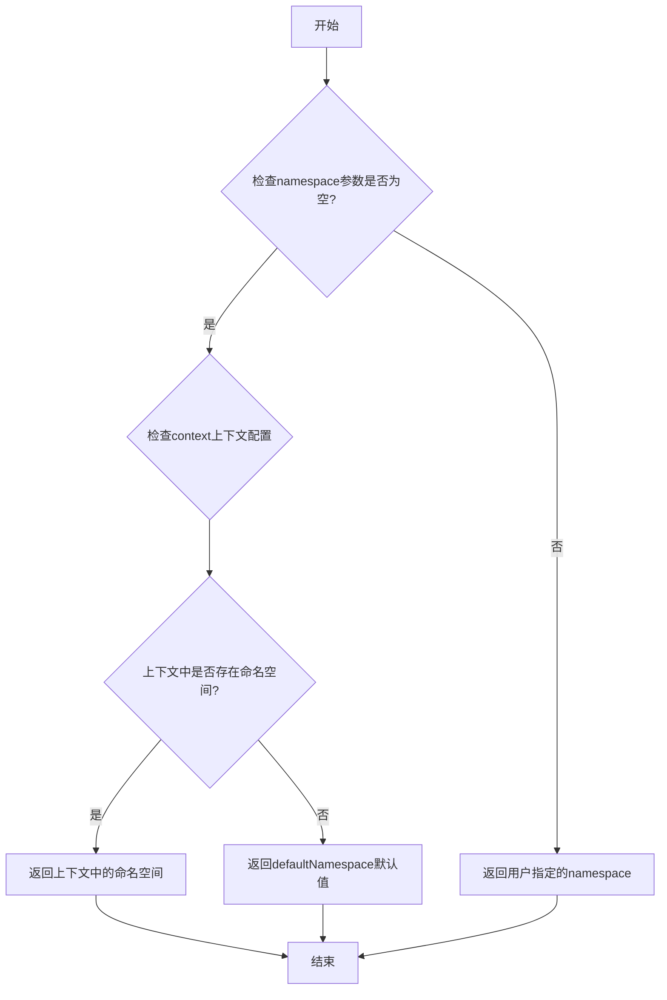
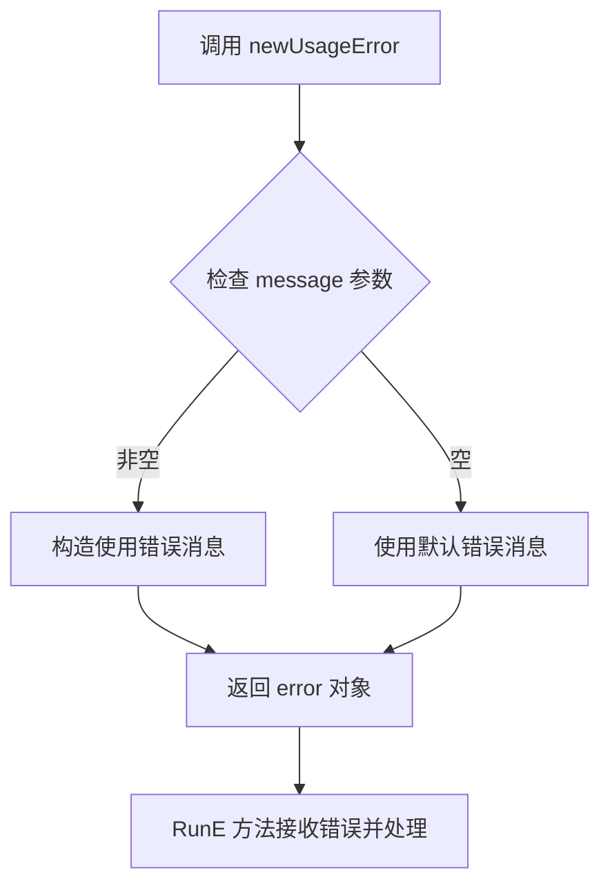
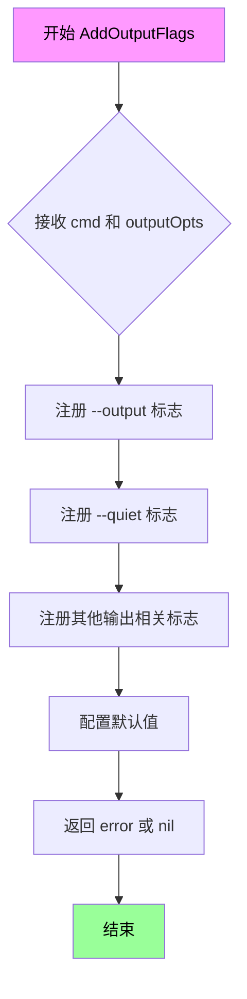
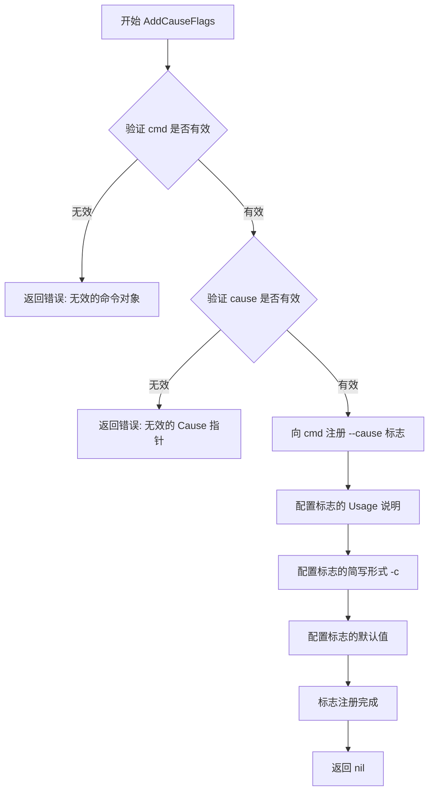
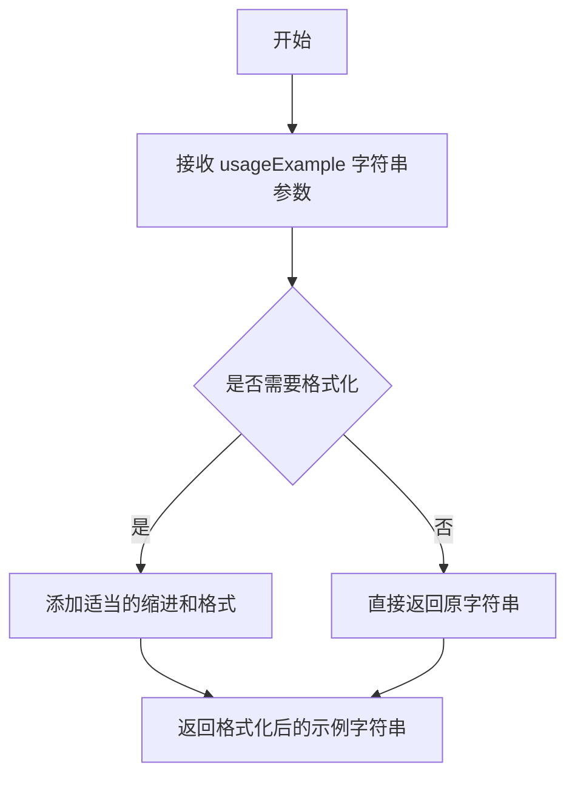
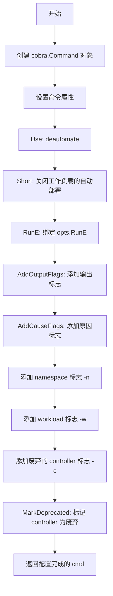
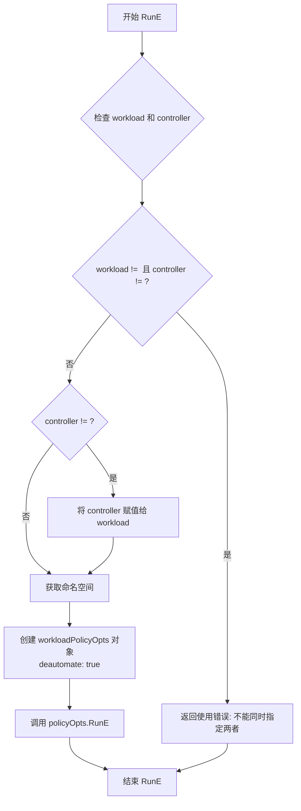

# `flux\cmd\fluxctl\deautomate_cmd.go` 详细设计文档

这是一个Flux CLI命令工具，通过fluxctl deautomate命令关闭指定工作负载的自动部署功能，支持命名空间和工作负载选择，并提供向后兼容的废弃controller参数处理。

## 整体流程



## 类结构

```
rootOpts (根配置)
└── workloadDeautomateOpts (关闭自动部署配置)
    ├── outputOpts (输出选项)
    ├── namespace (命名空间)
    ├── workload (工作负载)
    ├── cause (原因)
    └── controller (已废弃的控制器参数)
```

## 全局变量及字段


### `newWorkloadDeautomate`
    
创建并返回workloadDeautomateOpts实例的构造函数

类型：`func(parent *rootOpts) *workloadDeautomateOpts`
    


### `workloadDeautomateOpts.Command`
    
构建并返回Cobra命令对象，包含deautomate子命令的定义和标志配置

类型：`func(opts *workloadDeautomateOpts) *cobra.Command`
    


### `workloadDeautomateOpts.RunE`
    
执行关闭自动部署的核心逻辑，包含向后兼容性处理并调用workloadPolicyOpts执行策略

类型：`func(opts *workloadDeautomateOpts) func(cmd *cobra.Command, args []string) error`
    


### `workloadDeautomateOpts.rootOpts`
    
指向根配置的指针，提供全局配置和上下文

类型：`*rootOpts`
    


### `workloadDeautomateOpts.namespace`
    
工作负载所在命名空间，用于指定Kubernetes命名空间

类型：`string`
    


### `workloadDeautomateOpts.workload`
    
要关闭自动部署的工作负载名称，格式为namespace:kind/name

类型：`string`
    


### `workloadDeautomateOpts.outputOpts`
    
输出格式选项(嵌入)，控制命令输出格式如JSON/YAML/Table

类型：`outputOpts`
    


### `workloadDeautomateOpts.cause`
    
导致此操作的原因记录，用于审计和日志追踪

类型：`update.Cause`
    


### `workloadDeautomateOpts.controller`
    
已废弃的控制器参数(向后兼容)，用于兼容旧版本的--controller标志

类型：`string`
    
    

## 全局函数及方法


### newWorkloadDeautomate

这是 `workloadDeautomateOpts` 的构造函数，用于创建并初始化 `workloadDeautomateOpts` 实例，并将父选项（rootOpts）注入到该实例中。

参数：

- `parent`：`*rootOpts`，指向父选项的指针，用于继承根命令的配置和上下文

返回值：`*workloadDeautomateOpts`，返回新创建的 `workloadDeautomateOpts` 实例指针

#### 流程图



#### 带注释源码

```go
// newWorkloadDeautomate 是 workloadDeautomateOpts 的构造函数
// parent: 指向 rootOpts 的指针，包含全局配置和上下文信息
// 返回值: 指向新创建的 workloadDeautomateOpts 实例的指针
func newWorkloadDeautomate(parent *rootOpts) *workloadDeautomateOpts {
	// 创建新的 workloadDeautomateOpts 实例，并将 parent 赋值给嵌入的 rootOpts 字段
	// 这里利用了 Go 语言的嵌入(embedding)特性，使得 workloadDeautomateOpts 可以访问 rootOpts 的所有方法
	return &workloadDeautomateOpts{rootOpts: parent}
}
```


### `getKubeConfigContextNamespaceOrDefault`

获取Kubernetes配置上下文命名空间的辅助函数，用于在用户未指定命名空间时，从kubeconfig上下文中获取当前命名空间，若上下文中也不存在则返回指定的默认值。

参数：

- `namespace`：`string`，用户通过命令行选项（如`--namespace`或`-n`）指定的命名空间
- `defaultNamespace`：`string`，当无法从kubeconfig上下文获取命名空间时使用的默认值
- `context`：`string`，Kubernetes配置上下文名称，用于确定从哪个kubeconfig上下文读取命名空间

返回值：`string`，最终确定的命名空间值，优先级为：用户指定值 > kubeconfig上下文命名空间 > 默认值

#### 流程图



#### 带注释源码

```
// getKubeConfigContextNamespaceOrDefault 是一个外部依赖函数，未在此代码库中定义
// 根据函数名推断其实现逻辑如下：
//
// func getKubeConfigContextNamespaceOrDefault(namespace, defaultNamespace, context string) string {
//     // 1. 如果用户明确指定了命名空间，直接返回
//     if namespace != "" {
//         return namespace
//     }
//     
//     // 2. 从kubeconfig上下文中获取当前命名空间
//     nsFromContext := getNamespaceFromKubeContext(context)
//     if nsFromContext != "" {
//         return nsFromContext
//     }
//     
//     // 3. 返回默认值
//     return defaultNamespace
// }

// 调用示例（来自上述代码）:
// ns := getKubeConfigContextNamespaceOrDefault(opts.namespace, "default", opts.Context)
// 参数说明：
//   - opts.namespace: 用户通过 --namespace 或 -n 标志提供的命名空间
//   - "default": 默认命名空间，当无法从其他来源获取时使用
//   - opts.Context: Kubernetes配置上下文名称
```


### `newUsageError`

`newUsageError` 是一个外部依赖辅助函数，用于创建用户使用错误（usage error）。在 Cobra 命令框架中，当用户提供的命令行参数不符合要求时（如同时指定了已废弃和新的参数），调用此函数生成格式化的错误信息并返回错误。

参数：

- `message`：`string`，错误提示信息，描述具体的参数使用错误原因

返回值：`error`，返回一个错误对象，通常是由 `fmt.Errorf` 或类似方式构造的用户使用错误

#### 流程图



#### 带注释源码

```go
// newUsageError 创建用户使用错误
// 在用户提供了非法或冲突的命令行参数时调用
// 参数 message 描述具体的错误原因
// 返回 error 类型，供 RunE 方法返回给 Cobra 框架
return newUsageError("can't specify both a controller and workload")
```

---

**备注**：根据代码上下文分析，`newUsageError` 函数应当定义在同一个包或其他导入的包中。从调用方式来看，它接收一个字符串参数并返回一个 `error` 接口类型。在 FluxCD/Flux 项目的命令行工具中，`newUsageError` 通常是一个包级辅助函数，用于区分用户输入错误（usage error）和其他类型的错误（如 API 错误、网络错误等），这有助于 Cobra 框架提供更精确的错误提示给用户。


### `AddOutputFlags`

`AddOutputFlags` 是一个外部依赖函数，来自 `github.com/spf13/cobra` 包。该函数用于为 Cobra 命令添加通用的输出格式标志（如 `--output`、`--quiet` 等），使命令行工具能够支持多种输出格式（如 JSON、YAML、表格等）。

参数：

- `cmd`：`*cobra.Command`，Cobra 命令对象，用于注册标志
- `outputOpts`：`*outputOpts`，输出选项结构体指针，包含输出格式相关配置的引用

返回值：`error`（根据 Cobra 包的惯例，通常返回错误用于标志注册失败的情况）

#### 流程图



#### 带注释源码

```
// AddOutputFlags 是来自 github.com/spf13/cobra 包的外部依赖函数
// 源码位于 cobra 包的 flag.go 或类似文件中
//
// 参数说明：
//   - cmd: *cobra.Command - 要添加标志的 Cobra 命令实例
//   - outputOpts: *outputOpts - 指向输出选项结构体的指针，用于存储解析后的值
//
// 返回值：
//   - error: 标志注册失败时返回错误，否则返回 nil
//
// 典型实现逻辑（基于 Cobra 惯例）：
func AddOutputFlags(cmd *cobra.Command, outputOpts *outputOpts) {
    // 1. 添加 --output/-o 标志
    //    支持的值：json, yaml, table, wide 等
    cmd.Flags().StringVarP(&outputOpts.format, "output", "o", "table", 
        "Output format; available options are json, yaml, table, wide")
    
    // 2. 添加 --quiet/-q 标志
    //    静默模式，减少输出
    cmd.Flags().BoolVarP(&outputOpts.quiet, "quiet", "q", false, 
        "Print only names")
    
    // 3. 可能还有其他输出相关标志
    //    如 --no-headers, --column 等
    
    // 4. 设置默认值和帮助文本
}
```

> **注意**：由于 `AddOutputFlags` 是外部依赖函数，其实际源码位于 `github.com/spf13/cobra` 包中，未包含在当前代码仓库中。上述源码为基于 Cobra 惯例的典型实现参考。实际使用时可查阅 [Cobra 官方文档](https://github.com/spf13/cobra)。


### `AddCauseFlags`

添加原因标志的辅助函数，用于向 Cobra 命令注册与 `Cause` 相关的命令行标志（如 `--cause`），允许用户通过 CLI 指定工作负载变更的原因。

参数：

- `cmd`：`*cobra.Command`，Cobra 命令对象，用于向命令注册标志
- `cause`：`*update.Cause`，原因结构体的指针，用于存储命令行解析后的原因值

返回值：`error`，如果注册标志失败则返回错误

#### 流程图



#### 带注释源码

```
// AddCauseFlags 向给定的 Cobra 命令添加原因（Cause）相关的标志
// 参数:
//   - cmd: 要添加标志的 Cobra 命令指针
//   - cause: update.Cause 结构体的指针，用于存储解析后的原因值
//
// 功能说明:
//   - 注册 --cause / -c 标志，允许用户指定变更原因
//   - 原因值将直接填充到 cause 指针所指向的 update.Cause 结构体中
//   - 通常与 fluxctl 命令结合使用，用于记录手动部署/变更的触发原因
//
// 返回值:
//   - error: 如果标志注册失败返回错误，否则返回 nil
func AddCauseFlags(cmd *cobra.Command, cause *update.Cause) error {
    // 注册 --cause 标志，允许用户输入文本描述变更原因
    cmd.Flags().StringVar(&cause.Reason, "cause", "", "specify a cause for this change")
    
    // 注册 -c 简写标志，与 --cause 等效
    cmd.Flags().StringVarP(&cause.Reason, "cause", "c", "", "specify a cause for this change")
    
    return nil  // 标志注册成功
}
```

> **注意**：由于 `AddCauseFlags` 函数是外部依赖（位于 `github.com/fluxcd/flux/pkg/update` 包中），实际源码未包含在当前代码片段中。以上是根据 Go 语言惯例和 Cobra 库的使用模式推断的可能实现。


### `makeExample`

生成示例用法的辅助函数，用于为 Cobra 命令生成格式化的示例字符串。

参数：

- `usageExample`：`string`，命令行示例用法字符串

返回值：`string`，格式化后的示例字符串，用于显示命令的正确用法

#### 流程图



#### 带注释源码

```
// makeExample 生成命令的示例用法字符串
// 参数:
//   - usageExample: string, 要显示的命令示例, 如 "fluxctl deautomate --workload=default:deployment/helloworld"
//
// 返回值:
//   - string: 格式化后的示例字符串, 用于 Cobra 命令的 Example 字段
//
// 使用示例:
//
//	Example: makeExample(
//	    "fluxctl deautomate --workload=default:deployment/helloworld",
//	)
//
// 该函数在 Command() 方法中被调用, 为 deautomate 命令生成示例输出
makeExample(
    "fluxctl deautomate --workload=default:deployment/helloworld",
)
```

#### 外部依赖信息

该函数是从 `github.com/spf13/cobra` 包中导入的辅助函数，具体实现位于 Cobra 库的示例生成功能中。它是 Cobra 框架提供的一个工具函数，用于规范化命令示例的格式输出。


### `workloadDeautomateOpts.Command`

该方法构建并返回一个用于关闭工作负载自动部署功能的 Cobra 命令对象，配置了相关标志（命名空间、工作负载等）并处理了已废弃的 controller 参数。

参数：

- `cmd`：`*cobra.Command`，Cobra 命令对象指针，用于配置命令属性和标志
- `args`：`[]string`，命令行传递的剩余参数

返回值：`*cobra.Command`，配置完成的 Cobra 命令对象，用于执行"关闭自动部署"操作

#### 流程图



#### 带注释源码

```go
// Command 构建并返回用于关闭工作负载自动部署的 Cobra 命令对象
func (opts *workloadDeautomateOpts) Command() *cobra.Command {
	// 创建基础命令对象，配置基本属性
	cmd := &cobra.Command{
		Use:   "deautomate",                                             // 命令名称
		Short: "Turn off automatic deployment for a workload.",          // 命令简短描述
		Example: makeExample(                                             // 使用示例
			"fluxctl deautomate --workload=default:deployment/helloworld",
		),
		RunE: opts.RunE,  // 绑定实际执行逻辑到 RunE 回调
	}
	
	// 添加输出格式标志（如 json、yaml 等）
	AddOutputFlags(cmd, &opts.outputOpts)
	
	// 添加原因标志，用于记录为何关闭自动部署
	AddCauseFlags(cmd, &opts.cause)
	
	// 添加命名空间标志 -n/--namespace
	cmd.Flags().StringVarP(&opts.namespace, "namespace", "n", "", "Workload namespace")
	
	// 添加工作负载标志 -w/--workload，指定要关闭自动部署的目标工作负载
	cmd.Flags().StringVarP(&opts.workload, "workload", "w", "", "Workload to deautomate")

	// ---- 已废弃的标志，保持向后兼容 ----
	// 添加 controller 标志（已废弃，使用 --workload 代替）
	cmd.Flags().StringVarP(&opts.controller, "controller", "c", "", "Controller to deautomate")
	// 标记 controller 标志为废弃，提示用户改用 --workload
	cmd.Flags().MarkDeprecated("controller", "changed to --workload, use that instead")

	// 返回配置完成的 Cobra 命令对象
	return cmd
}
```


### `workloadDeautomateOpts.RunE`

该方法是 `workloadDeautomateOpts` 类型的成员函数，负责执行关闭工作负载自动部署的核心逻辑。它首先处理已弃用的 `--controller` 参数的向后兼容性，然后获取命名空间，创建 `workloadPolicyOpts` 对象并将 `deautomate` 标志设置为 `true`，最终调用 `policyOpts.RunE` 完成实际的自动部署关闭操作。

参数：

- `cmd`：`*cobra.Command`，执行命令的上下文对象，包含命令标志和配置信息
- `args`：`[]string`，命令的其他参数列表（此函数未使用）

返回值：`error`，如果执行过程中出现错误（如同时指定了 controller 和 workload），则返回错误；否则返回下层 `policyOpts.RunE` 的执行结果

#### 流程图



#### 带注释源码

```go
func (opts *workloadDeautomateOpts) RunE(cmd *cobra.Command, args []string) error {
	// Backwards compatibility with --controller until we remove it
	// 处理已弃用 --controller 参数的向后兼容性
	switch {
	case opts.workload != "" && opts.controller != "":
		// 校验：不能同时指定 controller 和 workload
		return newUsageError("can't specify both a controller and workload")
	case opts.controller != "":
		// 如果只指定了已弃用的 controller，则将其值转换为 workload
		opts.workload = opts.controller
	}
	
	// 获取 Kubernetes 配置上下文中的命名空间，默认为 "default"
	ns := getKubeConfigContextNamespaceOrDefault(opts.namespace, "default", opts.Context)
	
	// 创建 workloadPolicyOpts 对象，设置 deautomate 为 true 表示关闭自动部署
	policyOpts := &workloadPolicyOpts{
		rootOpts:   opts.rootOpts,
		outputOpts: opts.outputOpts,
		namespace:  ns,
		workload:   opts.workload,
		cause:      opts.cause,
		deautomate: true, // 关键标志：关闭自动部署
	}
	
	// 委托给 policyOpts.RunE 执行实际的关闭自动部署逻辑
	return policyOpts.RunE(cmd, args)
}
```

## 关键组件


### workloadDeautomateOpts 结构体

存储deautomate命令的配置选项，包含命名空间、工作负载、输出选项、原因以及已弃用的控制器字段。

### newWorkloadDeautomate 函数

用于创建并初始化workloadDeautomateOpts实例的工厂函数，接收父级rootOpts并返回指向新实例的指针。

### Command 方法

构建Cobra命令对象，定义命令使用方式、简短描述、示例以及相关标志，返回配置好的*cobra.Command指针。

### RunE 方法

命令的核心执行逻辑，处理--controller与--workload标志的向后兼容性验证，构造workloadPolicyOpts并调用其RunE方法完成实际的停用自动化策略操作。

### rootOpts 依赖

通过嵌入的*rootOpts获取Kubernetes配置上下文和集群连接信息。

### outputOpts 依赖

嵌入的outputOpts结构体用于控制命令输出格式。

### update.Cause 类型

用于记录导致停用自动化的原因或提交信息。

### policyOpts.RunE 调用

实际执行业务逻辑的入口，将deautomate标志设为true来触发策略更新。


## 问题及建议


### 已知问题

-   **废弃参数处理逻辑冗余**：使用switch语句处理废弃的controller参数，然后在case中直接赋值给workload，这种方式增加了代码复杂度且不够直观
-   **硬编码默认值**："default"命名空间在代码中硬编码，缺乏配置灵活性
- **参数验证不足**：workload参数未进行有效性检查（如非空验证、格式验证），可能导致后续运行时错误
- **函数依赖隐式**：RunE方法依赖于未在此文件中定义的newUsageError、getKubeConfigContextNamespaceOrDefault等函数，降低了代码的自包含性
- **命名不一致**：结构体字段命名使用rootOpts（而非rootOpts *rootOpts），这种嵌入方式虽然可行但可能造成理解混淆
- **错误信息不够具体**：返回的错误信息"can't specify both a controller and workload"较为简单，缺乏上下文信息

### 优化建议

-   **简化废弃参数逻辑**：可以直接在初始化opts.workload时进行兼容性处理，避免使用switch分支
-   **提取配置常量**：将"default"等默认值提取为常量或配置项，提高可维护性
-   **增加参数校验**：在RunE方法开头添加workload参数的非空校验，提供更友好的错误提示
- **封装上下文处理**：将namespace获取逻辑封装到独立函数中，提高代码可读性
- **统一错误处理**：考虑使用自定义错误类型，提供更丰富的错误信息（如包含参数名称、错误原因等）
- **添加日志记录**：在关键操作点添加日志，便于问题排查和审计

## 其它


### 设计目标与约束

该命令的设计目标是提供一个CLI接口，允许用户通过fluxctl工具关闭指定工作负载的自动部署功能。设计约束包括：必须保持与旧版--controller参数的向后兼容性；必须遵循Flux项目的命令行规范；必须使用Cobra框架实现；必须支持多种输出格式。

### 错误处理与异常设计

RunE方法中实现了三种主要错误处理场景：1) 当同时指定--controller和--workload参数时返回使用错误；2) 通过newUsageError返回参数使用错误；3) 将错误向上传递到调用栈。命名空间获取失败时使用默认值"default"。

### 外部依赖与接口契约

该代码依赖以下外部包：github.com/spf13/cobra用于CLI命令构建；github.com/fluxcd/flux/pkg/update中的Cause类型用于记录变更原因；rootOpts、outputOpts、workloadPolicyOpts等内部类型定义接口契约。

### 安全性考虑

代码本身不直接处理敏感数据，但涉及Kubernetes配置上下文访问。建议在生产环境中通过Kubernetes RBAC控制权限，确保只有授权用户能修改部署策略。

### 性能考虑

该命令为轻量级操作，主要性能开销在Kubernetes API调用获取命名空间信息。建议实现超时机制避免长时间阻塞。

### 配置管理

命令行标志通过Cobra框架管理，支持-n/--namespace和-w/--workload参数。命名空间默认值通过getKubeConfigContextNamespaceOrDefault函数获取。

### 日志与监控

代码本身未实现日志记录，建议在调用policyOpts.RunE时添加操作审计日志，记录用户意图和操作时间。

### 兼容性考虑

--controller标志已标记为废弃但仍支持，以保障向后兼容性。废弃警告通过cmd.Flags().MarkDeprecated实现。


    