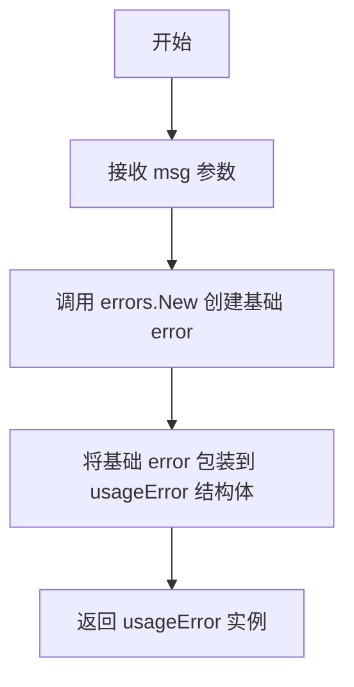

# `flux\cmd\fluxctl\error.go` 详细设计文档

一个Go语言命令行工具的基础错误处理和参数验证模块，提供usageError类型用于用户友好的错误信息，并实现checkExactlyOne函数确保命令行参数中仅提供一个选项

## 整体流程

```mermaid
graph TD
    A[程序开始] --> B[定义usageError结构体]
    B --> C[定义newUsageError构造函数]
    C --> D[定义checkExactlyOne函数]
    D --> E[初始化found标志为false]
    E --> F{遍历supplied参数}
    F -->|当前项| G{found && s?}
    G -- 是 --> H[返回错误: 请只提供一个选项]
    G -- 否 --> I[更新found = found || s]
    F -->|下一项| G
    I --> F
    F -->|遍历结束| J{found?}
    J -- 否 --> K[返回错误: 请提供一个选项]
    J -- 是 --> L[返回nil]
    L --> M[定义全局错误变量errorWantedNoArgs]
    M --> N[定义全局错误变量errorInvalidOutputFormat]
```

## 类结构

```
usageError (嵌入error的结构体)
```

## 全局变量及字段


### `errorWantedNoArgs`
    
表示期望没有（非标志）参数的错误

类型：`usageError`
    


### `errorInvalidOutputFormat`
    
表示无效输出格式指定的错误

类型：`usageError`
    


### `usageError.error`
    
嵌入的error接口，用于错误处理

类型：`error`
    
    

## 全局函数及方法


### `newUsageError`

创建一个新的 `usageError` 实例，用于表示使用方式错误的自定义错误类型。

参数：

- `msg`：`string`，错误消息内容

返回值：`usageError`，包含指定错误消息的错误对象

#### 流程图



#### 带注释源码

```go
// newUsageError 创建一个新的 usageError 实例
// 参数:
//   - msg: 错误消息字符串
//
// 返回值:
//   - usageError: 包含错误信息的 usageError 结构体
func newUsageError(msg string) usageError {
    // 使用标准库的 errors.New 创建基础错误对象
    // 并将其包装在 usageError 结构体中返回
    return usageError{error: errors.New(msg)}
}
```


### `checkExactlyOne`

该函数用于验证多个布尔选项参数中恰好只有一个为真（true），常用于命令行参数互斥性校验，确保用户在同一组选项中只能指定其中之一。

参数：

- `optsDescription`：`string`，描述可选选项的字符串，用于错误信息中说明是哪些选项需要互斥
- `supplied`：`...bool`，可变数量的布尔参数，表示用户实际提供的选项状态

返回值：`error`，如果恰好只有一个布尔值为真则返回 nil，否则返回包含具体错误信息的 usageError

#### 流程图

```mermaid
flowchart TD
    A[开始 checkExactlyOne] --> B[found = false]
    B --> C{遍历 supplied}
    C -->|每次迭代| D{found && s?}
    D -->|是| E[返回 newUsageError<br/>'please supply only one of ' + optsDescription]
    D -->|否| F[found = found || s]
    F --> C
    C -->|遍历完成| G{!found?}
    G -->|是| H[返回 newUsageError<br/>'please supply exactly one of ' + optsDescription]
    G -->|否| I[返回 nil]
    E --> J[结束]
    H --> J
    I --> J
```

#### 带注释源码

```go
// checkExactlyOne 验证提供的布尔选项中恰好只有一个为 true
// 参数:
//   - optsDescription: 描述选项组的字符串，用于错误信息
//   - supplied: 可变数量的布尔值，代表各选项的提供状态
//
// 返回值:
//   - error: 如果恰好有一个为 true 返回 nil，否则返回 usageError
func checkExactlyOne(optsDescription string, supplied ...bool) error {
	// found 记录是否已经找到一个为 true 的选项
	found := false

	// 遍历所有提供的选项状态
	for _, s := range supplied {
		// 如果已经找到一个且当前选项也为 true，则说明提供了多个选项
		if found && s {
			// 返回错误：只能提供其中一个选项
			return newUsageError("please supply only one of " + optsDescription)
		}
		// 更新 found 状态：只要有一个为 true 就保持 true
		found = found || s
	}

	// 遍历完成后检查是否至少提供了一个选项
	if !found {
		// 返回错误：必须提供其中一个选项
		return newUsageError("please supply exactly one of " + optsDescription)
	}

	// 恰好找到一个为 true 的选项，验证通过
	return nil
}
```

#### 关键组件信息

- **`usageError` 类型**：自定义错误类型，用于表示用户使用错误（参数传递问题），嵌入标准 error 接口
- **`newUsageError` 函数**：辅助构造函数，创建带有指定消息的 usageError 实例

#### 技术债务与优化空间

1. **错误信息可读性**：当前错误信息较为基础，可考虑增加更详细的上下文信息，如具体哪些选项被同时提供
2. **泛化能力**：当前只支持布尔类型，可考虑扩展为支持任意类型的精确计数验证
3. **日志记录**：缺少错误日志记录机制，难以追踪用户误用情况

#### 其它说明

- **设计目标**：确保命令行工具中互斥选项的正确性，防止用户同时指定相互冲突的多个选项
- **约束条件**：该函数要求至少传入一个布尔参数，否则逻辑上无法进行"恰好一个"的验证
- **错误处理**：使用自定义 usageError 类型区分程序逻辑错误与用户输入错误，便于上层调用者进行差异化处理
- **外部依赖**：仅依赖 Go 标准库的 `errors` 包，无外部依赖

## 关键组件


### usageError 结构体

自定义错误类型，用于表示用户使用错误（usage error），嵌入标准 error 接口以实现 error 接口。

### newUsageError 函数

创建并返回一个新的 usageError 实例，接收错误消息字符串作为参数，返回一个实现了 error 接口的 usageError 类型。

### checkExactlyOne 函数

验证多个布尔参数中恰好只有一个为 true，用于确保命令行参数互斥。接收参数描述字符串和可变数量的布尔参数，若参数不符合要求返回相应的 usageError，若验证通过返回 nil。

### errorWantedNoArgs 全局变量

预定义的错误实例，表示"预期无（非标志）参数"的错误状态，类型为 usageError。

### errorInvalidOutputFormat 全局变量

预定义的错误实例，表示"无效输出格式"的错误状态，类型为 usageError。


## 问题及建议


### 已知问题

- 错误类型未实现 `Unwrap()` 方法：`usageError` 嵌入了 `error` 接口，但在 Go 1.13+ 的错误链机制中，未提供 `Unwrap()` 方法，导致无法通过 `errors.As` 或 `errors.Is` 进行正确的错误 unwrap 和类型断言。
- 全局错误变量在包初始化时创建：`errorWantedNoArgs` 和 `errorInvalidOutputFormat` 在包加载时就已实例化，即使程序从未使用这些错误，也会占用内存（虽然影响很小）。
- `checkExactlyOne` 函数错误消息不够具体：当前仅显示 `optsDescription`，缺少关于具体哪个选项被多次指定或未指定的具体信息。
- 缺少对 `usageError` 类型的安全类型检查：无法通过 `errors.As` 判断具体是哪种 usage error，限制了调用方对错误进行细粒度处理的能力。

### 优化建议

- 为 `usageError` 添加 `Unwrap() error` 方法，实现错误链支持：
  ```go
  func (e usageError) Unwrap() error {
      return e.error
  }
  ```
- 考虑使用延迟初始化或函数返回错误的方式，避免不必要的全局变量创建；或者如果必须使用全局变量，添加 `sync.Once` 确保只初始化一次。
- 增强 `checkExactlyOne` 的错误消息，包含具体的选项状态信息，便于用户定位问题。
- 为不同的 usage error 添加唯一标识符或错误码，便于程序化区分处理。
- 添加单元测试覆盖边界情况（如空 supplied 数组、全为 false、全为 true 等）。


## 其它


### 设计目标与约束

本模块的设计目标是提供一个轻量级的命令行参数校验框架，确保CLI工具在接收用户输入时能够严格验证选项的互斥性和必填性。约束包括：仅支持布尔类型的选项检查，不支持复杂类型；错误信息格式统一为"please supply exactly one of XXX"或"please supply only one of XXX"。

### 错误处理与异常设计

本模块采用自定义错误类型`usageError`封装用户输入错误，通过嵌入`error`接口实现错误传递。错误分为两类：互斥冲突错误（多个选项同时提供）和缺失错误（未提供任何选项）。调用方可通过类型断言或错误字符串匹配进行处理，不支持错误恢复机制。

### 外部依赖与接口契约

本模块仅依赖Go标准库`errors`包，无第三方依赖。`checkExactlyOne`函数接受可变参数`...bool`，调用方需确保传入至少一个布尔值，否则函数返回"please supply exactly one of"错误。函数返回标准`error`接口，调用方需自行判断返回值是否为nil以确定检查是否通过。

### 性能考虑

本模块性能开销极低，时间复杂度为O(n)，其中n为传入的布尔参数数量。空间复杂度为O(1)，仅使用少量局部变量。适合在命令行入口点频繁调用，无需缓存或优化。

### 安全考虑

本模块不涉及敏感数据处理，错误信息仅包含选项描述文本，不泄露系统信息。输入验证在内存中完成，无外部IO操作，不存在注入风险。

### 测试策略建议

建议为`checkExactlyOne`函数编写单元测试，覆盖场景包括：正常传入一个true返回nil、传入多个true返回错误、全部传入false返回错误、传入空参数返回错误。`usageError`类型需验证错误消息正确性和error接口实现。

### 并发安全性

本模块所有函数均为纯函数，不修改全局状态，不持有锁，在并发环境下安全使用。全局变量`errorWantedNoArgs`和`errorInvalidOutputFormat`在初始化后为只读，线程安全。

### 可维护性建议

当前代码将错误实例化为全局变量，建议改为在需要时动态创建以避免包初始化顺序问题。`checkExactlyOne`函数可考虑返回更结构化的错误信息（如包含错误码），便于调用方精确处理不同错误类型。


    