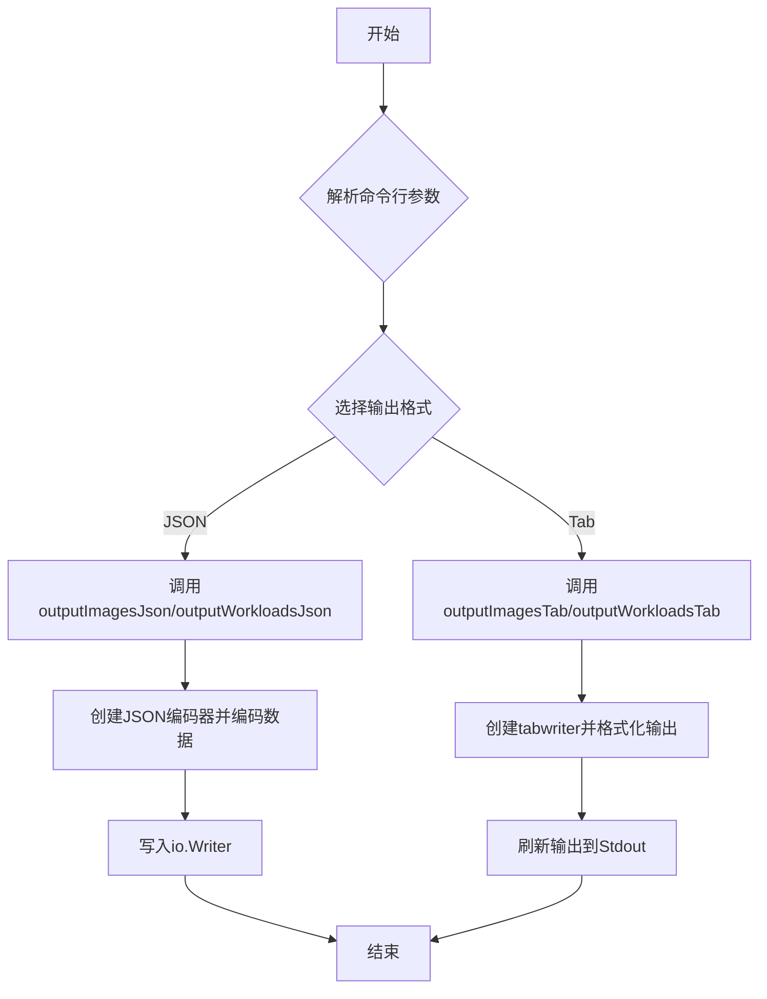
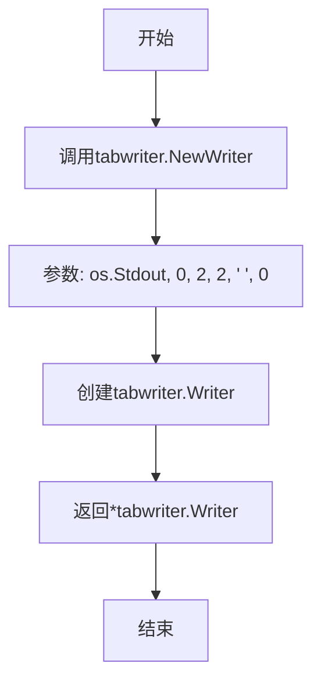
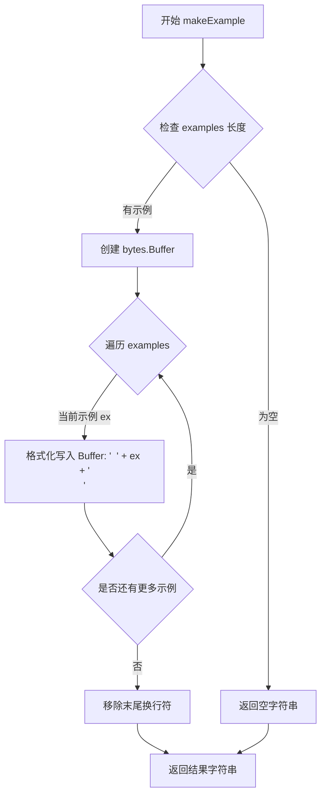
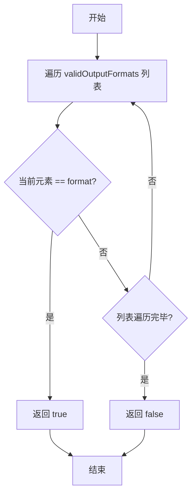
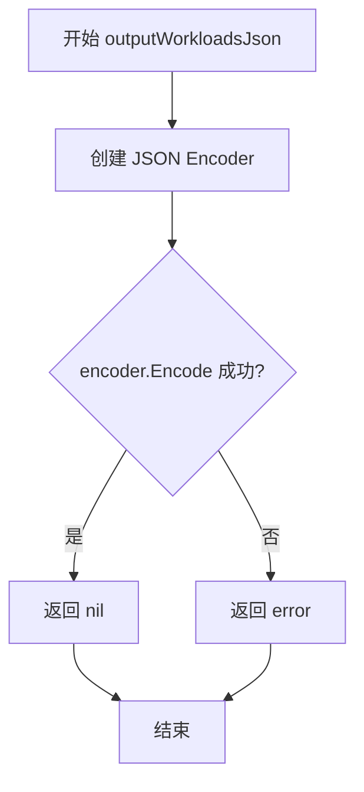
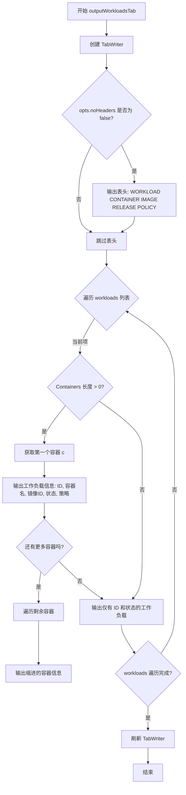

# `flux\cmd\fluxctl\format.go` 详细设计文档

这是一个Flux CLI工具的输出模块，负责格式化并输出镜像(Image)和工作负载(Workload)的状态信息，支持JSON和表格(tab)两种输出格式，并提供灵活的限制和过滤选项。

## 整体流程



## 类结构

```
无类层次结构（Go语言过程式编程）
outputOpts (结构体)
全局函数集合
```

## 全局变量及字段


### `validOutputFormats`
    
支持的输出格式列表，包含'json'和'tab'

类型：`[]string`
    


### `outputFormatJson`
    
JSON输出格式的常量标识符值为"json"

类型：`string`
    


### `outputFormatTab`
    
Tab输出格式的常量标识符值为"tab"

类型：`string`
    


### `outputOpts.verbosity`
    
控制输出详细程度的标志计数，通过-cobra的Count标志累加

类型：`int`
    
    

## 全局函数及方法


### `AddOutputFlags`

该函数用于为 Cobra 命令行工具添加输出详细程度（verbosity）标志，允许用户通过 `-v` 或 `--verbose` 选项控制输出信息的详细程度。

参数：

- `cmd`：`cobra.Command`，Cobra 命令对象，用于注册命令行标志
- `opts`：`outputOpts`，输出选项结构体指针，用于存储解析后的 verbosity 值

返回值：无（`void`）

#### 流程图

```mermaid
flowchart TD
    A[开始 AddOutputFlags] --> B[调用 cmd.Flags().CountVarP]
    B --> C{注册 -v/--verbose 标志}
    C --> D[将 verbosity 计数绑定到 opts.verbosity]
    D --> E[设置帮助文本: 'include skipped workloads']
    E --> F[结束]
```

#### 带注释源码

```go
// AddOutputFlags 为指定的 cobra 命令添加输出详细程度标志
// 参数 cmd: 要添加标志的 cobra 命令对象
// 参数 opts: 存储标志值的输出选项结构体指针
func AddOutputFlags(cmd *cobra.Command, opts *outputOpts) {
	// 使用 CountVarP 注册一个计数标志 -v/--verbose
	// 每次使用 -v 累加计数，-vv 表示计数为2，以此类推
	// 帮助文本说明: -v 包含跳过的工作负载，-vv 还包含忽略的工作负载
	cmd.Flags().CountVarP(&opts.verbosity, "verbose", "v", "include skipped (and ignored, with -vv) workloads in output")
}
```


### `newTabwriter`

创建表格写入器，用于在命令行中格式化表格输出。

参数：无

返回值：`*tabwriter.Writer`，返回一个新的表格写入器实例，用于将格式化的表格内容写入标准输出。

#### 流程图



#### 带注释源码

```go
// newTabwriter 创建一个表格写入器，用于在命令行中格式化表格输出
// 参数说明：
//   - os.Stdout: 输出目标为标准输出
//   - 0: 最小单元格宽度为0（自动调整）
//   - 2: 单元格填充宽度为2
//   - 2: 栏间距为2
//   - ' ': 填充字符为空格
//   - 0: 不使用装饰选项
func newTabwriter() *tabwriter.Writer {
	return tabwriter.NewWriter(os.Stdout, 0, 2, 2, ' ', 0)
}
```


### `makeExample`

格式化示例文本函数，用于将多个示例字符串格式化为带有缩进的文本块，每个示例前添加两个空格，末尾移除多余换行符。

参数：

- `examples`：`...string`，可变数量字符串参数，表示需要格式化的示例文本

返回值：`string`，格式化后的字符串，每个示例前带两个空格缩进，末尾无多余换行符

#### 流程图



#### 带注释源码

```go
// makeExample 格式化示例文本函数
// 参数: examples 可变数量的字符串,表示需要格式化的示例
// 返回: 格式化后的字符串,每个示例前带两个空格缩进
func makeExample(examples ...string) string {
    // 创建缓冲区用于构建输出字符串
	var buf bytes.Buffer
    
    // 遍历每个示例字符串
	for _, ex := range examples {
        // 格式化写入: 添加两个空格缩进和换行符
		fmt.Fprintf(&buf, "  "+ex+"\n")
	}
    
    // 移除末尾多余的换行符并返回结果
	return strings.TrimSuffix(buf.String(), "\n")
}
```


### `outputFormatIsValid`

该函数用于验证给定的输出格式字符串是否为有效的格式（即 "json" 或 "tab"），通过遍历预定义的有效输出格式列表进行匹配判断。

参数：

- `format`：`string`，需要验证的输出格式字符串

返回值：`bool`，如果格式有效返回 `true`，否则返回 `false`

#### 流程图



#### 带注释源码

```go
// outputFormatIsValid 检查给定的格式字符串是否为有效的输出格式
// 参数 format: 需要验证的格式字符串（如 "json" 或 "tab"）
// 返回值: 如果格式有效返回 true，否则返回 false
func outputFormatIsValid(format string) bool {
	// 遍历预定义的有效输出格式列表
	for _, f := range validOutputFormats {
		// 如果找到匹配的格式，立即返回 true
		if f == format {
			return true
		}
	}
	// 遍历完所有格式均未匹配，返回 false
	return false
}
```

---

#### 补充说明

- **有效格式定义**：`validOutputFormats` 全局变量定义了支持的输出格式，目前包含 `outputFormatJson`（值为 "json"）和 `outputFormatTab`（值为 "tab"）
- **调用场景**：此函数通常在 CLI 命令处理中用于验证用户输入的 `--format` 参数是否合法
- **性能考虑**：当前实现使用线性遍历，时间复杂度为 O(n)，由于有效格式列表很短（仅2个元素），性能可忽略不计
- **可扩展性**：如需添加新的输出格式，只需在 `validOutputFormats` 切片中添加新元素，无需修改函数逻辑


### `outputImagesJson`

将给定的镜像状态信息（ImageStatus）以 JSON 格式输出到指定的 io.Writer，并根据 imageListOpts 中的 limit 参数对可用镜像列表进行截断处理。

参数：

- `images`：`[]v6.ImageStatus`，要输出的镜像状态列表，每个元素包含镜像 ID 和容器信息
- `out`：`io.Writer`，JSON 数据的输出目标写入器
- `opts`：`*imageListOpts`，包含输出选项的结构体指针，主要使用 limit 字段限制每个容器显示的可用镜像数量

返回值：`error`，如果 limit 参数为负数则返回错误；JSON 编码失败时返回编码错误；成功时返回 nil

#### 流程图

```mermaid
flowchart TD
    A[开始 outputImagesJson] --> B{opts.limit < 0?}
    B -->|是| C[返回错误: limit cannot be less than 0]
    B -->|否| D[初始化 sliceLimit = 0]
    D --> E[遍历 images 切片]
    E --> F[获取 containerImages]
    F --> G[遍历容器中的 Containers]
    G --> H{opts.limit != 0?}
    H -->|否| I[不截断,继续下一个容器]
    H -->|是| J{len(available) < opts.limit?]
    J -->|是| K[sliceLimit = len(available)]
    J -->|否| L[sliceLimit = opts.limit]
    K --> M[截断 Available 列表]
    L --> M
    M --> I
    I --> N[创建 JSON Encoder]
    N --> O[Encode images 到 out]
    O --> P{Encode 失败?}
    P -->|是| Q[返回 Encode 错误]
    P -->|否| R[返回 nil]
    C --> Z[结束]
    Q --> Z
    R --> Z
```

#### 带注释源码

```go
// outputImagesJson sends the provided ImageStatus info to the io.Writer in JSON formatting, honoring limits in opts
func outputImagesJson(images []v6.ImageStatus, out io.Writer, opts *imageListOpts) error {
    // 检查 limit 参数是否为负数，若为负则返回错误
    if opts.limit < 0 {
        return errors.New("opts.limit cannot be less than 0")
    }
    var sliceLimit int

    // 遍历所有镜像，截断可用容器镜像列表以符合 opts.limit 的限制
    // 取 opts.limit 和可用镜像总数的较小值
    for i := 0; i < len(images); i++ {
        containerImages := images[i]
        for i := 0; i < len(containerImages.Containers); i++ {
            // 如果 limit 不为 0，则进行截断处理
            if opts.limit != 0 {
                // 获取当前容器的可用镜像列表
                available := containerImages.Containers[i].Available
                // 比较可用镜像数量与 limit，取较小值作为截断上限
                if len(available) < opts.limit {
                    sliceLimit = len(available)
                } else {
                    sliceLimit = opts.limit
                }
                // 截断可用镜像列表
                containerImages.Containers[i].Available = containerImages.Containers[i].Available[:sliceLimit]
            }
        }
    }

    // 创建 JSON 编码器并将处理后的镜像数据写入输出流
    e := json.NewEncoder(out)
    if err := e.Encode(images); err != nil {
        // 编码失败时返回错误
        return err
    }
    // 成功时返回 nil
    return nil
}
```


### `outputImagesTab`

以表格格式将提供的 ImageStatus 信息输出到标准输出，根据 opts 中的限制条件格式化显示镜像、工作负载和容器信息。

参数：

- `images`：`[]v6.ImageStatus`，镜像状态列表，包含所有需要输出的镜像信息
- `opts`：`*imageListOpts`，图像列表选项配置指针，包含是否显示表头、输出行数限制等配置

返回值：无（`void`），函数直接输出到 `os.Stdout`

#### 流程图

```mermaid
flowchart TD
    A[开始 outputImagesTab] --> B[创建 tabwriter]
    B --> C{opts.noHeaders 是否为 false?}
    C -->|是| D[输出表头: WORKLOAD CONTAINER IMAGE CREATED]
    C -->|否| E[跳过表头]
    D --> E
    E --> F[遍历 images 镜像列表]
    F --> G{当前镜像是否有容器?}
    G -->|否| H[输出镜像ID和空单元格, 继续下一镜像]
    G -->|是| I[获取镜像名称]
    I --> J[遍历该镜像的容器列表]
    J --> K[获取容器名称和当前运行镜像信息]
    K --> L{该容器是否有可用镜像?}
    L -->|否| M[输出错误信息或无镜像数据提示]
    L -->|是| N[输出容器基本信息]
    M --> O
    N --> O{遍历可用镜像列表}
    O --> P[判断当前镜像是否为运行中镜像]
    P --> Q[根据状态设置 running 符号 '-> 或 | 或 '  ]
    Q --> R{是否超过限制行数?}
    R -->|是| S[输出省略信息]
    R -->|否| T{是否需要输出该行?}
    T -->|是| U[格式化并输出镜像标签和创建时间]
    T -->|否| V[跳过输出]
    U --> W[检查是否未找到运行中镜像]
    S --> W
    V --> W
    W -->|是| X[输出当前运行的镜像标签]
    W -->|否| Y[继续下一容器]
    X --> Y
    Y --> Z[所有容器遍历完毕?]
    Z -->|否| J
    Z -->|是| AA[所有镜像遍历完毕?]
    AA -->|否| F
    AA -->|是| BB[刷新 tabwriter 输出缓冲]
    BB --> CC[结束]
```

#### 带注释源码

```go
// outputImagesTab sends the provided ImageStatus info to os.Stdout in tab formatting, honoring limits in opts
// outputImagesTab 以表格格式将提供的 ImageStatus 信息发送到标准输出，遵循 opts 中的限制
func outputImagesTab(images []v6.ImageStatus, opts *imageListOpts) {
    // 创建新的 tabwriter 用于格式化表格输出
    // Create a new tabwriter for formatted table output
    out := newTabwriter()

    // 如果不禁止输出表头，则先输出列标题
    // Output column headers if not disabled
    if !opts.noHeaders {
        fmt.Fprintln(out, "WORKLOAD\tCONTAINER\tIMAGE\tCREATED")
    }

    // 遍历所有镜像状态
    // Iterate through all image statuses
    for _, image := range images {
        // 如果该镜像没有任何容器信息
        // If this image has no container information
        if len(image.Containers) == 0 {
            // 输出镜像ID和三个空单元格，然后继续处理下一个镜像
            // Output the image ID and three empty cells, then continue to next image
            fmt.Fprintf(out, "%s\t\t\t\n", image.ID)
            continue
        }

        // 获取镜像名称的字符串表示
        // Get string representation of the image name
        imageName := image.ID.String()
        
        // 遍历该镜像的所有容器
        // Iterate through all containers of this image
        for _, container := range image.Containers {
            var lineCount int
            containerName := container.Name
            
            // 从当前镜像ID中获取注册表、仓库和标签组件
            // Get registry, repository, and tag components from current image ID
            reg, repo, currentTag := container.Current.ID.Components()
            
            // 如果有注册表信息，添加斜杠后缀
            // Add slash suffix if there's registry information
            if reg != "" {
                reg += "/"
            }
            
            // 检查该容器是否有可用的镜像版本
            // Check if this container has available image versions
            if len(container.Available) == 0 {
                // 获取可用错误信息，如果没有则使用默认错误
                // Get available error message, use default error if none
                availableErr := container.AvailableError
                if availableErr == "" {
                    availableErr = registry.ErrNoImageData.Error()
                }
                // 输出镜像名、容器名、注册表+仓库和错误信息
                // Output image name, container name, registry+repo and error message
                fmt.Fprintf(out, "%s\t%s\t%s%s\t%s\n", imageName, containerName, reg, repo, availableErr)
            } else {
                // 输出镜像名、容器名、注册表+仓库（无可用错误）
                // Output image name, container name, registry+repo (no available error)
                fmt.Fprintf(out, "%s\t%s\t%s%s\t\n", imageName, containerName, reg, repo)
            }
            
            // 标记是否找到了正在运行的镜像
            // Flag to track if running image was found
            foundRunning := false
            
            // 遍历所有可用镜像版本
            // Iterate through all available image versions
            for _, available := range container.Available {
                // 默认显示为未运行状态 '|  '
                // Default to not running state '|  '
                running := "|  "
                
                // 获取可用镜像的标签
                // Get tag of the available image
                _, _, tag := available.ID.Components()
                
                // 如果当前标签匹配运行中的标签，标记为运行中
                // If current tag matches running tag, mark as running
                if currentTag == tag {
                    running = "'->"
                    foundRunning = true
                } else if foundRunning {
                    // 如果已找到运行中镜像且当前不是，则使用空格填充
                    // If running image already found and current is not, use space padding
                    running = "   "
                }

                // 增加行计数
                // Increment line count
                lineCount++
                
                // 初始化打印省略号和打印行的标志
                // Initialize ellipsis and print line flags
                var printEllipsis, printLine bool
                
                // 如果没有限制或行数在限制内，打印该行
                // Print the line if no limit or line count within limit
                if opts.limit <= 0 || lineCount <= opts.limit {
                    printEllipsis, printLine = false, true
                } else if container.Current.ID == available.ID {
                    // 如果是当前运行中的镜像，在限制后显示省略信息和该行
                    // If it's the currently running image, show ellipsis info and the line after limit
                    printEllipsis, printLine = lineCount > (opts.limit+1), true
                }
                
                // 如果需要打印省略号
                // If need to print ellipsis
                if printEllipsis {
                    // 输出省略信息，显示被省略的镜像数量
                    // Output ellipsis info, showing number of omitted images
                    fmt.Fprintf(out, "\t\t%s (%d image(s) omitted)\t\n", ":", lineCount-opts.limit-1)
                }
                
                // 如果需要打印该行
                // If need to print the line
                if printLine {
                    // 格式化创建时间
                    // Format creation time
                    createdAt := ""
                    if !available.CreatedAt.IsZero() {
                        createdAt = available.CreatedAt.Format(time.RFC822)
                    }
                    // 输出运行状态符号、标签和创建时间
                    // Output running state symbol, tag and creation time
                    fmt.Fprintf(out, "\t\t%s %s\t%s\n", running, tag, createdAt)
                }
            }
            
            // 如果没有找到运行中的镜像
            // If no running image was found
            if !foundRunning {
                running := "'->"
                // 如果当前标签为空，显示为未标记
                // If current tag is empty, show as untagged
                if currentTag == "" {
                    currentTag = "(untagged)"
                }
                // 输出运行状态、未标记的当前镜像标签和问号
                // Output running state, untagged current image tag and question mark
                fmt.Fprintf(out, "\t\t%s %s\t%s\n", running, currentTag, "?")

            }
            // 将镜像名称置空，避免重复输出
            // Set image name to empty to avoid duplicate output
            imageName = ""
        }
    }
    // 刷新 tabwriter，确保所有缓冲数据输出到标准输出
    // Flush tabwriter to ensure all buffered data is output to stdout
    out.Flush()
}
```


### `outputWorkloadsJson`

将提供的 Workload 数据以 JSON 格式发送到指定的 io.Writer，是将工作负载信息输出为 JSON 格式的核心函数。

参数：

- `workloads`：`[]v6.ControllerStatus`，要输出的工作负载列表，包含容器状态、镜像信息等
- `out`：`io.Writer`，用于写入 JSON 数据的输出流

返回值：`error`，编码过程中发生的错误（如有），成功时返回 nil

#### 流程图



#### 带注释源码

```go
// outputWorkloadsJson sends the provided Workload data to the io.Writer as JSON
// outputWorkloadsJson 将提供的工作负载数据以 JSON 格式发送到 io.Writer
func outputWorkloadsJson(workloads []v6.ControllerStatus, out io.Writer) error {
	// 创建一个 JSON 编码器，绑定到指定的输出流 out
	// 编码器会将 Go 结构体转换为 JSON 格式并写入 out
	encoder := json.NewEncoder(out)
	
	// 调用 Encode 方法将 workloads 编码为 JSON 并写入 out
	// Encode 方法会返回写入过程中发生的任何错误
	return encoder.Encode(workloads)
}
```


### `outputWorkloadsTab`

该函数用于将提供的工作负载数据以表格格式输出到标准输出（STDOUT），专用于命令行界面的显示。

参数：

- `workloads`：`[]v6.ControllerStatus`，工作负载列表，包含所有需要显示的控制器状态信息
- `opts`：`*workloadListOpts`，工作负载列表选项，用于控制输出格式（如是否显示表头）

返回值：`无`（该函数没有返回值，仅执行输出操作）

#### 流程图



#### 带注释源码

```go
// outputWorkloadsTab sends the provided Workload data to STDOUT, formatted with tabs for CLI
// outputWorkloadsTab 将提供的工作负载数据发送到标准输出，使用制表符格式化以适应 CLI
func outputWorkloadsTab(workloads []v6.ControllerStatus, opts *workloadListOpts) {
	w := newTabwriter() // 创建新的 TabWriter 用于格式化输出
    
    // 如果 opts.noHeaders 为 false，则打印表头
    // 表头包含：WORKLOAD, CONTAINER, IMAGE, RELEASE, POLICY
	if !opts.noHeaders {
		fmt.Fprintf(w, "WORKLOAD\tCONTAINER\tIMAGE\tRELEASE\tPOLICY\n")
	}

    // 遍历所有工作负载
	for _, workload := range workloads {
        // 如果工作负载包含容器信息
		if len(workload.Containers) > 0 {
            // 获取第一个容器
			c := workload.Containers[0]
            // 打印第一行：工作负载ID、容器名、当前镜像ID、状态、策略
			fmt.Fprintf(w, "%s\t%s\t%s\t%s\t%s\n", workload.ID, c.Name, c.Current.ID, workload.Status, policies(workload))
            
            // 如果有多个容器，遍历剩余容器进行输出
			for _, c := range workload.Containers[1:] {
                // 缩进显示其他容器信息（仅容器名和镜像ID）
				fmt.Fprintf(w, "\t%s\t%s\t\t\n", c.Name, c.Current.ID)
			}
		} else {
            // 没有容器的工作负载，仅显示 ID、状态和策略
			fmt.Fprintf(w, "%s\t\t\t%s\t%s\n", workload.ID, workload.Status, policies(workload))
		}
	}
    // 刷新 Writer，确保所有缓冲数据写入标准输出
	w.Flush()
}
```

## 关键组件


### outputOpts

输出选项结构体，用于配置命令行输出的详细程度（verbosity）

### outputFormatIsValid

验证输出格式是否有效的函数，确保只支持json和tab两种格式

### AddOutputFlags

为cobra命令添加输出标志的函数，支持-v/-vv参数来控制输出详细程度

### newTabwriter

创建表格写入器的函数，用于格式化CLI输出为表格形式

### makeExample

生成示例字符串的辅助函数，将多个示例字符串格式化输出

### outputImagesJson

将镜像状态信息以JSON格式输出到io.Writer的函数，包含数量限制处理逻辑

### outputImagesTab

将镜像状态信息以表格格式输出到标准输出的函数，包含容器、镜像、创建时间等详细信息

### outputWorkloadsJson

将工作负载数据以JSON格式编码输出到io.Writer的函数

### outputWorkloadsTab

将工作负载数据以表格格式输出到标准输出的函数，显示工作负载、容器、镜像、发布状态和策略信息


## 问题及建议


### 已知问题

-   **变量遮蔽 (Variable Shadowing)**: 在 `outputImagesJson` 函数中，嵌套循环使用了相同的变量名 `i`（外层 `for i := 0; i < len(images); i++` 和内层 `for i := 0; i < len(containerImages.Containers); i++`）。内层的 `i` 会遮蔽外层的 `i`，虽然由于 Go 中切片的引用类型特性，代码在修改 `Available` 字段时恰好修改了原数据的底层数组，但这种写法极易导致逻辑混乱和潜在的 bug，且难以维护。
-   **副作用 (Side Effect)**: `outputImagesJson` 函数直接修改了传入的 `images` 参数的内容（例如 `containerImages.Containers[i].Available = ...`）。这会在调用方未预期的情况下改变原数据状态，导致难以追踪的副作用。应该避免修改输入参数。
-   **低效的验证逻辑**: `outputFormatIsValid` 函数使用线性循环来检查格式是否有效（`for _, f := range validOutputFormats`）。在频繁调用时，建议使用 `map[string]struct{}` 或 `map[string]bool` 将查找时间复杂度从 O(n) 降低到 O(1)。
-   **魔术数字 (Magic Numbers)**: `newTabwriter()` 中使用了硬编码的数字 `0, 2, 2, ' ', 0`，缺乏语义化命名。`outputImagesTab` 中的 `"|  "`, `"'->"`, `"   "` 等字符串也缺乏统一管理。
-   **边界条件与逻辑模糊**: 在 `outputImagesJson` 中，限制逻辑为 `if opts.limit != 0`。这意味着 `limit` 为 0 时被视为“无限制”，而通常编程习惯中 0 可能表示“默认”或“无数据”。这种隐式逻辑容易造成误解，且未对 `limit` 为负数的情况（虽然前面有检查）做更清晰的说明。
-   **重复代码**: `outputImagesTab` 中的running状态（`'->`, `"|  "`, `"   "`）的格式化逻辑较长，且未抽取为辅助函数，导致该函数职责过多。

### 优化建议

-   **重构验证机制**: 将 `validOutputFormats` 定义为 `map[string]struct{}` 或 `map[string]bool` 类型，并在 `outputFormatIsValid` 中直接通过 map 查询。
-   **消除副作用**: 在 `outputImagesJson` 中，对 `images` 进行深拷贝或仅在本地副本上进行截断操作，确保调用者的数据不被修改。
-   **规范化常量**: 将 `tabwriter` 的参数和状态指示符字符串提取为具名常量或配置项，提升代码可读性。
-   **修复变量命名**: 将 `outputImagesJson` 内层循环的计数器重命名为 `j` 或 `containerIndex`，避免遮蔽外层变量。
-   **提取辅助函数**: 将 Tab 输出的行格式化逻辑（特别是容器状态和镜像列表的输出部分）拆分为独立的辅助函数，例如 `formatContainerStatus` 或 `formatAvailableImages`，以简化 `outputImagesTab` 的主逻辑。
-   **增强配置语义**: 明确 `limit` 字段的语义（例如允许负数表示“全部”），并增加相应的注释或使用更明确的标志位（如 `showAll`）。

## 其它


### 设计目标与约束

本代码模块的核心设计目标是提供Fluxcd镜像和工作负载信息的命令行输出功能，支持JSON和Tab两种格式化输出格式。设计约束包括：必须遵循Fluxcd v6 API的数据结构定义；输出格式必须支持-limit参数控制显示数量；Tab格式输出必须保持终端友好性；所有输出函数必须处理空容器和空镜像的特殊边界情况。

### 错误处理与异常设计

代码采用Go语言的错误返回模式进行异常处理。outputImagesJson函数在opts.limit小于0时返回errors.New("opts.limit cannot be less than 0")错误；JSON编码失败时返回编码错误。outputImagesTab函数不返回错误但通过availableErr变量处理无镜像数据的异常情况，使用registry.ErrNoImageData作为默认错误提示。所有可能产生错误的IO操作都通过错误返回值向上层传递，由调用方决定如何处理。

### 数据流与状态机

数据流从v6 API获取ImageStatus和ControllerStatus列表开始，经过格式验证后分发到不同的输出处理函数。JSON输出路径：数据→json.NewEncoder→io.Writer；Tab输出路径：数据→tabwriter.Writer→stdout。状态机逻辑主要体现在Tab格式的running状态追踪：通过foundRunning布尔变量标记当前镜像是否为运行中版本，依次处理后续可用镜像的显示状态（"|  "表示历史版本，"'->"表示当前版本，"   "表示后续版本）。

### 外部依赖与接口契约

本代码依赖以下外部包：github.com/spf13/cobra用于命令行标志管理；github.com/fluxcd/flux/pkg/registry提供registry.ErrNoImageData错误定义；github.com/fluxcd/flux/pkg/api/v6提供ImageStatus和ControllerStatus数据结构。输入接口接收[]v6.ImageStatus和[]v6.ControllerStatus两种数据类型，输出接口为io.Writer或os.Stdout。调用方需保证传入的opts参数不为nil，且limit参数需在合理范围内。

### 性能考虑与优化空间

当前实现中存在性能优化空间：outputImagesJson中对slice的修改会创建数据副本，建议使用就地修改或流式处理；outputImagesTab中使用字符串拼接构建镜像名称，可预先计算reg+repo值减少重复计算；容器可用镜像的遍历未使用索引直接访问，可优化循环结构。对于大规模镜像列表，建议增加流式输出能力和内存池复用。

### 安全性考虑

代码主要涉及数据展示，无敏感数据处理逻辑。Tab格式输出时对特殊字符未做转义处理，可能存在终端注入风险，建议对imageName、containerName等用户可控输出进行转义。JSON输出使用标准encoding/json包，不存在序列化漏洞。

### 单元测试策略

建议为以下函数编写单元测试：outputFormatIsValid测试有效和无效格式的验证；outputImagesJson测试limit边界条件和负数处理；outputImagesTab测试空容器、单容器、多容器及不同limit值的输出格式；outputWorkloadsJson和outputWorkloadsTab分别测试JSON序列化和Tab格式输出。使用表格驱动测试方法覆盖正常场景和边界场景。

### 版本兼容性说明

本代码依赖Fluxcd v6 API，版本兼容性需与Fluxcd版本同步。当前代码兼容v6.ImageStatus和v6.ControllerStatus的当前数据结构。若API版本升级，需同步更新依赖并测试输出格式变化。outputFormatJson使用标准json.Encoder，兼容Go 1.1及以上版本。

    